---

## 第 1 页

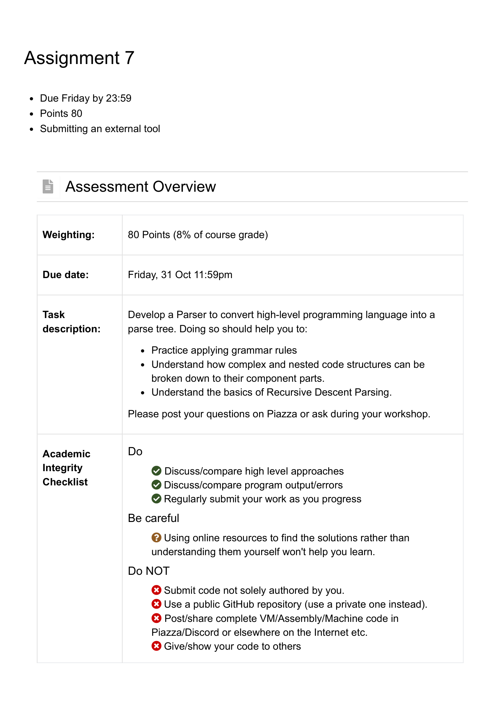

ChatGPT 说：
已思考


---

## 第 2 页

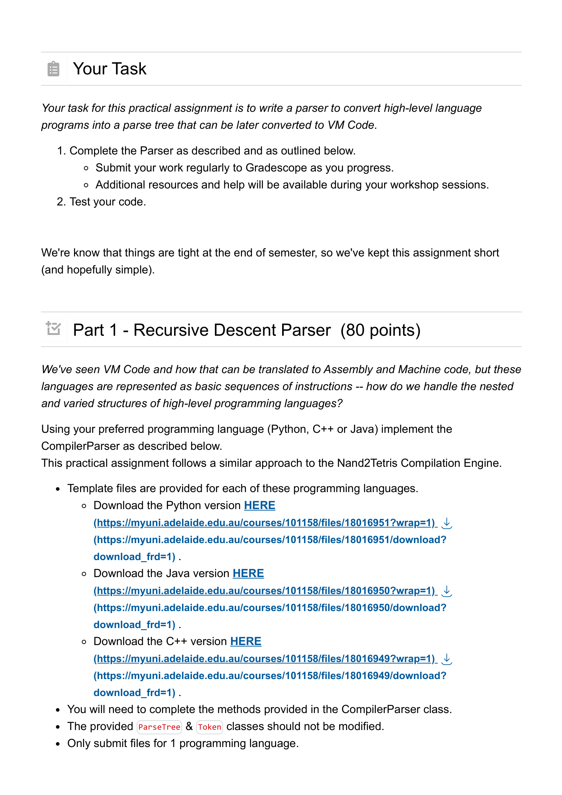

下面把两页作业截图逐条翻译+解释清楚，并给出可执行的做题步骤（按“要做什么、怎么做、交什么、注意什么”来组织）。最后附上你要的口语化总结。

# 作业 7 是什么

* **截止时间**：周五 23:59（截图 1 顶部）
* **分值**：80 分，占课程总评 **8%**（截图 1 “Weighting”）
* **提交方式**：通过一个**外部工具**提交（通常是 Gradescope）（截图 1 顶部）
* **作业目标**：写一个**解析器（Parser）**，把某种**高级语言**程序转换成**语法树（Parse Tree）**；之后该语法树可以再转换为 **VM Code**（截图 1 “Task description” 与截图 2 “Your Task”）。
* **学习收获**（课程目标）：

1. 练习\*\*文法（grammar）\*\*规则；
2. 理解如何把**复杂/嵌套**代码结构拆成成分；
3. 掌握\*\*递归下降法（Recursive Descent Parsing）\*\*的基础（截图 1 “Task description”）。

# 学术诚信（一定要看）

* **可以做的**：讨论**高层思路**；对比**程序输出/错误**；**逐步提交**作业进度（截图 1 “Do”）。
* **需要谨慎**：网上找现成答案只会耽误你理解（截图 1 “Be careful”）。
* **严禁**：提交非本人代码；用**公开**GitHub 仓库（要用私有）；在 Piazza/Discord/互联网**发布完整 VM/汇编/机器码**；把代码**给别人看**（截图 1 “Do NOT”）。

# 你要完成的具体任务（截图 2）

> **总共只有一部分：Part 1 – 递归下降解析器（80 分）**
> 语言可任选 **Python / C++ / Java** 之一（只交一种语言的文件）。

## 提供的材料

* 官方给了三种语言的**模板工程**（含 `CompilerParser`、`ParseTree`、`Token` 等类/文件）。
* **不能修改**：`ParseTree` 和 `Token` 类（截图 2 “should not be modified”）。
* **需要你补全**：`CompilerParser` 类中的方法（截图 2 “You will need to complete the methods…”）。
* 实现风格**参考 Nand2Tetris 的 Compilation Engine**（截图 2 说明）。

## 建议的实现步骤（可直接照着做）

> 递归下降 = “一个非终结符一个函数”，按文法自顶向下、遇到子结构就递归调用。下面给出通用落地做法，匹配大多数课程给的“小语言”文法。

1. **阅读模板**

* 打开 `CompilerParser.*`，找出**待实现的方法**列表（例如：`parseProgram()/parseClass()/parseSubroutine()/parseStatement()/parseExpression()/parseTerm()` 等；具体名字以模板为准）。
* 看 `Token` 提供了什么：常见有 `peek()`、`advance()`、`type()`、`value()`、`is(…)`。
* 看 `ParseTree` 怎么建节点：通常有 `addChild(node)` / `makeNode(kind, text)` / `start(kind)` + `finish()` 之类。

2. **明确文法（grammar）**

* 课程一般给了一个“迷你高级语言”的文法，典型结构：

* **程序/类**：`Program -> (ClassDecl | FuncDecl | VarDecl)*`
* **语句**：`Statement -> let | if | while | do | return | block`
* **表达式**：`Expression -> Term (op Term)*`
* **项**：`Term -> integer | string | identifier | (Expression) | unaryOp Term | call`
* 如果讲义里有更具体的文法（如 Jack / 迷你 C 风格），就把每个非终结符映射成一个**同名函数**。

3. **写“匹配工具函数”**

* `match(expectedTypeOrLexeme)`：断言当前 token 符合，生成节点，`advance()`。
* `accept(x)`：可选匹配（存在则消费，不存在不报错）。
* `expect(x)`：必须匹配，否则抛出语法错误（包含**行列号/当前 token**便于定位）。

4. **自顶向下实现各非终结符**

* 例：`parseStatement()`

* 如果 `peek()` 是 `let` → 调 `parseLet()`；
* 是 `if` → `parseIf()`；
* 是 `{` → 解析 **block**：循环解析内部语句直到 `}`；
* …依此类推。
* 例：`parseExpression()`

* 先 `parseTerm()`；
* 循环检查是否出现二元运算符（如 `+ - * / < > == && ||`）→ 若有：把运算符和右侧 `Term` 挂成**二叉或 N 叉**结构。
* 例：`parseTerm()`

* 分支判断 token 类型：数字、字符串、标识符（可能继续是**函数调用/数组下标**）、括号表达式 `( … )`、一元运算 `-`/`!` 等。

5. **构建 ParseTree**

* 每个解析函数创建一个**节点**（名字=非终结符名），把子部分作为**子节点**加入。
* 对关键词/符号（如 `if`、`(`、`;`）也可建叶子节点，方便可视化/对照评分器。

6. **错误处理**

* 发现不匹配就抛 `SyntaxError`（带 token 位置 & 期望/实际），这样 Gradescope 能判你**边界用例**。

7. **测试用例**

* 写 5–10 个小程序文件，覆盖：

* 空程序/只有声明；
* 各类语句（`let/if/else/while/do/return`）；
* 表达式优先级与括号；
* 函数调用/嵌套调用；
* 错误输入（缺 `;`、缺 `)` 等）。
* 运行你的解析器，打印或导出语法树（缩进/JSON/XML 皆可，只要模板允许）。

8. **提交与频次**

* **边写边传**到 Gradescope（截图 2 第 1 点小圆点：regularly submit）。
* **只提交一种语言**的文件（Python / C++ / Java 三选一，截图 2）。

9. **与 VM Code 的关系（理解层面）**

* 本次只做到**语法树**。之后才会把树转成 VM。实现时不要“顺便生成 VM”，专注**正确构树**。

## 评分点（据题意推断，常见检查项）

* 能解析所有规定的构造；
* 语法树结构正确且稳定（相同输入得到相同树）；
* 出错时信息清晰；
* 不修改 `ParseTree`/`Token`；
* 代码风格、函数粒度和递归下降思路清晰；
* 通过隐藏与公开测试。

## 语言选择与快速起步建议

* **Python**：实现快，字符串/列表友好；适合快速迭代与打印树。
* **Java/C++**：类型更严格，适合按课程框架交付；注意 I/O 与类结构。
* 任选其一即可，**不要混交**；模板里通常已有 `main` 或驱动。

## 常见坑

* 漏吃分号或右括号导致**死循环**；
* 表达式优先级处理不当（建议：用递归层级 `parseEquality -> parseRelational -> parseAdd -> parseMul -> parseUnary -> parsePrimary`，或统一左递归消除后按优先级实现）；
* 未处理**else 可选**分支；
* 把**标识符后面的 `(`**（调用）和\*\*`[`\*\*（下标）漏判；
* 修改了不允许改的类；
* 提交了两种语言的文件。

---

# 最终你需要交什么

1. **补全后的 `CompilerParser` 源码**（只选一种语言）。
2\)（若模板要求）一个能把输入程序读入并输出**语法树**的可执行/脚本。
2. 在 Gradescope 上按提示上传，**在截止前可多次提交**，以最新成绩为准。

---

# \[口语化表达] 总结版

这次作业就一件事：**写个递归下降解析器**。你从学校给的模板里挑 **Python/C++/Java** 一种，只需要把 `CompilerParser` 里的函数补完，**别动** `ParseTree` 和 `Token`。解析器要能按课程给的小语言文法，把源代码读成一棵**语法树**（以后会拿它去生 VM 代码）。做法就是“一个非终结符一个函数”，顶层到语句、再到表达式和项，遇到子结构就递归。写几个小工具函数（`peek/advance/expect/match`），严格吃掉符号和分号，注意表达式优先级、函数调用、下标、`if-else/while/return` 等。出错要抛清晰的 `SyntaxError`。边写边在 Gradescope 上传测一下，**周五 23:59 截止**，总分 80，占 8%。可以讨论思路和对比输出，但**别共享代码、别上公开仓库**。最后只交**一种语言**的文件就行。


---

## 第 3 页

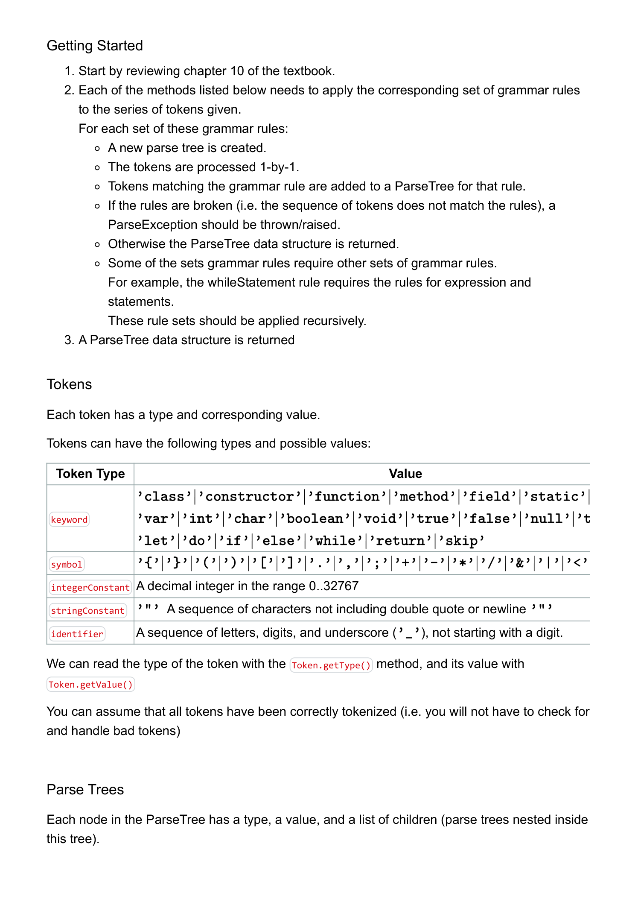

下面是对你第三张截图（“Getting Started”、“Tokens”、“Parse Trees”部分）的逐句解释和操作指导，帮助你明白**该怎么写代码、怎么用 token、怎么建 parse tree**。最后附上\[口语化表达]版总结。

---

## 一、Getting Started（入门指导）

### 1️⃣ 先复习教材第 10 章

* 这一章讲的是**语法分析（parsing）**的基本概念，特别是**递归下降解析（Recursive Descent Parsing）**。
* 建议回顾文法规则（grammar rules）如何定义程序语言的语法结构，例如：

```
statement → ifStatement | whileStatement | letStatement | returnStatement | doStatement
```

这些定义告诉你“什么 token 顺序”才是合法的语句。

---

### 2️⃣ 实现方法的总体逻辑（非常关键）

每个要写的方法（比如 `compileWhileStatement()`、`compileExpression()`）都要按对应的**文法规则**去解析 token 序列。
具体要求如下：

* 🔹 **创建一个新的 Parse Tree**（语法树根节点）。
每处理一个语法单元（例如 `whileStatement`），就新建一棵树（或一个节点）。

* 🔹 **按顺序处理 token（逐个 1-by-1）**。
不跳 token，也不回退。每个方法负责消耗掉属于自己那一部分的 token。

* 🔹 **匹配 token 并加入 Parse Tree**。
只要当前 token 符合文法（例如当前是 `while`，文法要求第一个词就是 `while`），就把它加进树中。

* 🔹 **不匹配时抛异常（ParseException）**。
如果 token 顺序和文法不符（比如少了括号），要 `raise ParseException` 或 `throw new ParseException()`。
👉 这能帮助自动测试检测出你语法树构建逻辑是否正确。

* 🔹 **规则嵌套要递归调用**。
例如 `whileStatement` 的文法：

```
whileStatement → 'while' '(' expression ')' statement
```

其中 `expression`、`statement` 都要分别调用 `compileExpression()`、`compileStatement()`，这些函数返回 ParseTree 子节点。

* 🔹 **最后返回 ParseTree 对象。**
每个方法都返回你建好的那一棵子树。

---

### 3️⃣ 输出（Return）

每个方法的返回值就是一个完整的 `ParseTree` 结构（根节点 + 子节点）。
后续程序会用这些树生成更低级的 VM code。

---

## 二、Tokens（词法单元）

### Token 是什么

编译器的第一步是“词法分析”，把程序分解成一个个 token。
在这份作业里，**你不用写词法分析器**，系统已经帮你做好了。
每个 token 都有：

* **类型（type）** → 用 `token.getType()` 读取
* **值（value）** → 用 `token.getValue()` 读取

你只需要按类型和值去判断匹配是否符合文法。

---

### Token 类型与取值范围（表格解释）

| Token Type          | 含义    | 示例                                                                                               |            |
| ------------------- | ----- | ------------------------------------------------------------------------------------------------ | ---------- |
| **keyword**         | 保留字   | `'class'`, `'function'`, `'if'`, `'else'`, `'while'`, `'return'`, `'let'`, `'true'`, `'false'` 等 |            |
| **symbol**          | 符号    | \`{ } ( ) \[ ] . , ; + - \* / &                                                                  | < > = \~\` |
| **integerConstant** | 整数常量  | 范围 0–32767                                                                                       |            |
| **stringConstant**  | 字符串常量 | `"..."`，不含换行和双引号                                                                                 |            |
| **identifier**      | 标识符   | 变量名、函数名，如 `sum`, `i`, `MyClass` 等，首字符不能为数字                                                       |            |

---

### 小贴士：

* 所有 token 已经正确分词好了（你不用处理坏 token）。
* 因此你只需：

```python
if token.getType() == "keyword" and token.getValue() == "while":
# 匹配 while 语句
```

---

## 三、Parse Trees（语法树结构）

### 结构说明

* 每个 ParseTree 节点包含：

1. **类型**（type）——代表文法中的一个规则或语法单元，比如 `whileStatement`、`expression`。
2. **值**（value）——可以是 token 的实际值（如 `"if"`、`"x"`、`";"` 等）。
3. **子节点列表**（children）——嵌套结构，用来表达代码层级。

例如：

```
while (x < 10) { let x = x + 1; }
```

会生成一棵树：

```
whileStatement
├── keyword: 'while'
├── symbol: '('
├── expression
│   ├── identifier: 'x'
│   ├── symbol: '<'
│   └── integerConstant: '10'
├── symbol: ')'
└── statement
├── keyword: 'let'
├── identifier: 'x'
├── symbol: '='
├── expression
│
```


---

## 第 4 页

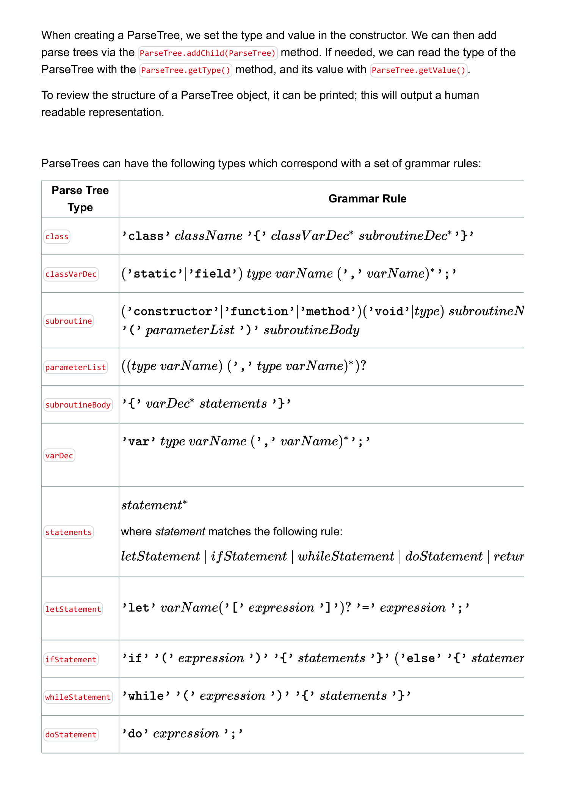

下面是对第四张截图（主要讲 ParseTree 构建方式与语法规则表）的详细中文讲解，每个规则我都会解释“它是什么意思、要写什么代码实现”，最后附上一个完整的口语化总结。

---

## 一、创建 ParseTree 的方法

### 1️⃣ 构造函数（constructor）

当你在代码里写：

```python
tree = ParseTree("class", None)
```

这表示你创建了一个**类型为 “class” 的语法树节点**。
`ParseTree` 的两个参数：

* 第一个是类型（type）→ 表示它是什么语法单元（例如 `class`, `ifStatement`）。
* 第二个是值（value）→ 一般用于存放 token 内容（例如 `"if"`、`"x"`、`"="` 等）。

---

### 2️⃣ 添加子树

用：

```python
tree.addChild(subtree)
```

把别的 ParseTree（子规则或 token）加进去。
比如在解析 `if` 时，`ifStatement` 的根节点可以先创建：

```python
if_tree = ParseTree("ifStatement", None)
```

然后逐步添加子节点：

```python
if_tree.addChild(ParseTree("keyword", "if"))
if_tree.addChild(ParseTree("symbol", "("))
if_tree.addChild(expression_tree)   # 子规则：表达式
if_tree.addChild(ParseTree("symbol", ")"))
if_tree.addChild(statements_tree)   # 子规则：语句块
```

---

### 3️⃣ 读取和打印

* `ParseTree.getType()` → 返回节点类型
* `ParseTree.getValue()` → 返回节点值
* 打印 ParseTree 会输出一棵人类可读的树形结构（方便调试）。

---

## 二、语法规则（Grammar Rules）

表格列出了所有语法树的类型（ParseTree Type）及其对应的文法规则。
你要**为这些类型写对应的解析函数**（通常名为 `parseClass()`、`parseIfStatement()` 等）。

下面我一条一条解释每条规则和代码该怎么写👇

---

### 1️⃣ class

```
'class' className '{' classVarDec* subroutineDec* '}'
```

**含义**：一个类定义。
例子：

```java
class Main {
static int x;
function void test() { }
}
```

**实现要点**：

```python
def parseClass():
tree = ParseTree("class", None)
match("keyword", "class")
add token/className
match("symbol", "{")
while next token in {"static", "field"}:
tree.addChild(parseClassVarDec())
while next token in {"constructor", "function", "method"}:
tree.addChild(parseSubroutine())
match("symbol", "}")
return tree
```

→ `*` 表示可以重复 0 次或多次。

---

### 2️⃣ classVarDec

```
('static'|'field') type varName (',' varName)* ';'
```

例子：

```
static int x, y;
```

解析逻辑：

* 匹配 `static` 或 `field`
* 匹配类型（如 `int`、`boolean`、自定义类名）
* 匹配变量名，可能有多个（用逗号隔开）
* 最后匹配分号

---

### 3️⃣ subroutine（子程序）

```
('constructor'|'function'|'method') ('void'|type) subroutineName '(' parameterList ')' subroutineBody
```

例子：

```
function void test(int x, int y) { var int z; do something(); }
```

步骤：

1. 匹配子程序类型（constructor/function/method）
2. 匹配返回类型（void 或普通类型）
3. 匹配函数名
4. 匹配左括号 `(`
5. 调用 `parseParameterList()`
6. 匹配右括号 `)`
7. 调用 `parseSubroutineBody()`

---

### 4️⃣ parameterList

```
((type varName) (',' type varName)*)?
```

**含义**：参数列表，可以为空。
例子：

```
int x, boolean flag
```

逻辑：

* 判断有没有参数，如果下一个 token 是右括号 `)`，直接返回空列表。
* 否则：

* 匹配类型 + 变量名
* 如果有逗号，继续重复直到遇到右括号。

---

### 5️⃣ subroutineBody

```
'{' varDec* statements '}'
```

函数体，例子：

```
{
var int a, b;
let a = 3;
do print(a);
}
```

解析：

* 匹配 `{`
* 零个或多个变量声明（varDec）
* 一组语句（statements）
* 匹配 `}`

---

### 6️⃣ varDec

```
'var' type varName (',' varName)* ';'
```

例子：

```
var int x, y;
```

逻辑：匹配 `var` → 类型 → 变量名 → （逗号 + 更多变量名）→ 分号。

---

### 7️⃣ statements

```
statement*
```

每个 statement 可以是：

```
letStatement | ifStatement | whileStatement | doStatement | returnStatement
```

所以这里的代码应该是循环判断当前 token 开头是哪种关键字（let/if/while/do/return），然后分别调用对应解析函数。

---

### 8️⃣ letStatement

```
'let' varName ('[' expression ']')? '=' expression ';'
```

例子：

```
let x = 3;
let arr[i] = x + 1;
```

解析：

* 匹配 `let`
* 匹配变量名
* 如果下一个是 `[`，说明是数组访问 → 调 `parseExpression()` 再匹配 `]`
* 匹配 `=`
* 调 `parseExpression()`
* 匹配分号 `;`

---

### 9️⃣ ifStatement

```
'if' '(' expression ')' '{' statements '}' ('else' '{' statements '}')?
```

例子：

```
if (x < 10) { let x = x + 1; } else { return; }
```

逻辑：

* 匹配 if
* 括号里的部分 → 调 `parseExpression()`
* 花括号里的部分 → 调 `parseStatements()`
* 可选 else → 如果有就继续解析另一个 `{ statements }`

---

### 🔟 whileStatement

```
'while' '(' expression ')' '{' statements '}'
```

例子：

```
while (x < 100) { let x = x + 1; }
```

实现：同上，结构一致。

---

### 11️⃣ doStatement

```
'do' expression ';'
```

例子：

```
do Output.printInt(x);
```

逻辑：

* 匹配 do
* 调 `parseExpression()`（表达式可能是函数调用）
* 匹配分号

---

## 三、补充说明

* 每个规则的函数都要返回一个 `ParseTree` 对象。
* 通过 `addChild()` 连接子节点。
* 最后整体树形结构由最顶层的 `parseClass()` 构建完成。

---

# \[口语化表达]

这一页讲的其实是“怎么根据文法规则建语法树”。每一个语法单元（比如 class、if、while、do、var 声明）都对应一个 ParseTree 类型。写代码时，你要给每种类型写一个函数，比如 `parseClass()`、`parseIfStatement()`。函数里先创建一个 ParseTree 节点，然后按规则一行行匹配 token，比如 `class` 开头的就匹配 class 名、花括号、成员变量、子程序等。如果遇到别的结构，就递归调用子函数（比如 while 里还有 statements）。所有节点都用 `addChild()` 拼在一起，最后整个源代码就变成了一棵 ParseTree。
简单讲，这一页就是把“文法表”变成你要实现的每个解析函数的说明书。


---

## 第 5 页

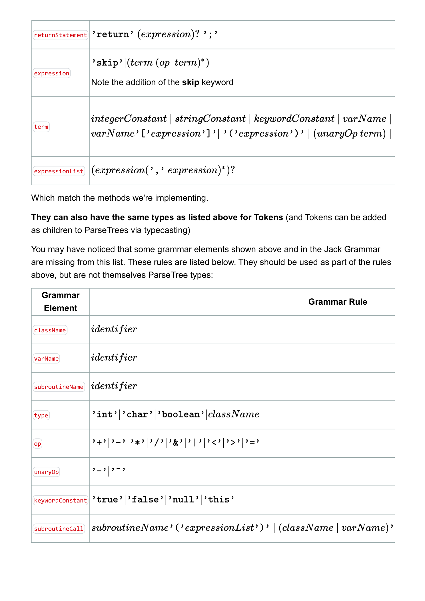

下面是对第五张截图（主要是表达式 expression、项 term、返回语句 returnStatement、以及一些语法要素定义）的详细中文讲解，每一条语法规则都解释它的意义、代码实现要点、注意事项。最后我附上一个覆盖全页内容的[口语化表达]总结。
一、returnStatement —— 返回语句
bash
复制
编辑
'return' (expression)? ';'
✅ 含义：
表示函数返回的语句。括号里的 (expression)? 意味着表达式是可选的。
🧩 例子：
java
复制
编辑
return;
return x + 1;
🧠 实现思路：
在 parseReturnStatement() 函数中：
匹配关键字 return
看下一个 token 是否是 ;
如果不是 → 调用 parseExpression()（说明返回一个值）
匹配分号 ;
返回语法树节点。
python
复制
编辑
def parseReturnStatement():
tree = ParseTree("returnStatement", None)
tree.addChild(match("keyword", "return"))
if not peek(";"):
tree.addChild(parseExpression())
tree.addChild(match("symbol", ";"))
return tree
二、expression —— 表达式
bash
复制
编辑
'skip' | (term (op term)*)
✅ 含义：
表达式由一个或多个 term（项） 组成，中间可以有操作符（op），比如 x + y * z。
还特别新增了一个关键字 skip，表示“空操作”或“跳过”。
🧩 例子：
java
复制
编辑
x + 1
a * (b + c)
skip
🧠 实现思路：
在 parseExpression() 中：
如果下一个 token 是关键字 skip，直接创建一个包含 "skip" 的 ParseTree 返回。
否则：
调用 parseTerm() 解析第一个项。
当下一个 token 是运算符（+ - * / & | < > =）时：
匹配运算符。
再调用一次 parseTerm() 解析右边。
形成链式结构，直到没有运算符为止。
三、term —— 表达式的基本单元
nginx
复制
编辑
integerConstant | stringConstant | keywordConstant |
varName | varName '[' expression ']' |
'(' expression ')' | (unaryOp term)
✅ 含义：
term 是最小的“表达式单元”，包括常数、字符串、关键字（如 true/false）、变量、数组元素、括号内表达式、或一元运算符表达式。
🧩 例子：
java
复制
编辑
5
"Hello"
true
x
arr[i]
(x + 1)
- x
~flag
🧠 实现思路：
parseTerm() 要根据 token 类型分多种情况判断：
如果 token 类型是 integerConstant、stringConstant、keyword → 直接加入 ParseTree。
如果是 identifier：
若下一个 token 是 [ → 表示数组下标访问。
若下一个 token 是 ( 或 . → 调用 parseSubroutineCall()（函数调用）。
否则就是普通变量。
如果 token 是 '(' → 匹配括号，递归解析里面的表达式。
如果 token 是一元运算符（- 或 ~）→ 匹配它，再递归解析 term。
四、expressionList —— 表达式列表
r
复制
编辑
(expression (',' expression)*)?
✅ 含义：
函数调用参数列表，用逗号分隔，可为空。
🧩 例子：
java
复制
编辑
()
(x)
(x, y + 1, z)
🧠 实现思路：
在 parseExpressionList() 中：
如果下一个 token 是右括号 ) → 空列表。
否则：
解析第一个表达式；
当下一个 token 是 , 时，不断解析下一个表达式。
五、下方表格：语法元素（Grammar Elements）
这些不是单独的 ParseTree 类型，但在解析时会出现，是上面规则的组成部分。
元素 含义 实现提示
className identifier 就是一个类名，token 类型为 identifier
varName identifier 普通变量名
subroutineName identifier 函数或方法名
type `'int' 'char'
op `+ - * / & < > =`
unaryOp - 或 ~ 一元运算符
keywordConstant `true false
subroutineCall subroutineName ( expressionList ) 或 `(className varName).subroutineName ( expressionList )`
六、重点总结：如何整合这些规则
你的递归下降解析器中会包含这些核心方法（每个对应一个 ParseTree 类型）：
方法 功能
parseClass() 解析整个类
parseSubroutine() 解析函数/方法
parseStatement() 调用 let/if/while/do/return 的解析
parseExpression() 解析算术或逻辑表达式
parseTerm() 解析表达式最小单元
parseExpressionList() 解析函数调用参数列表
解析顺序是递归的：
class → subroutine → statements → expression → term → subroutineCall/identifier/...
[口语化表达]
这一页主要讲“表达式和返回语句”这些更细的语法。比如 return 那行代码，就是 return (expression)?;，意思是有时候 return 后面可以跟个表达式（像 return x+1;），有时候可以什么都不跟（就是 return;）。
表达式 expression 是由一个或多个 term（项）组成，中间可能有运算符，比如 x + y * z。多了一个关键字 skip，意思是跳过。
每个 term 是表达式的最小单元，可能是数字、字符串、变量、true/false/null/this 这种关键字常量，也可能是括号里的小表达式，甚至是函数调用。
expressionList 是参数列表，比如函数调用里的 (x, y+1) 这种。
最后那张表告诉你一些基础符号该怎么识别：className、varName、type 都是 identifier，op 是操作符，unaryOp 是单目运算符，subroutineCall 则是函数调用的写法。
简单讲，这页是告诉你：怎么在解析器里处理表达式、return 语句、函数调用、运算符等这些“细节结构”，并且要写对应的 parseExpression()、parseTerm()、parseReturnStatement() 这些函数来实现。


---

## 第 6 页

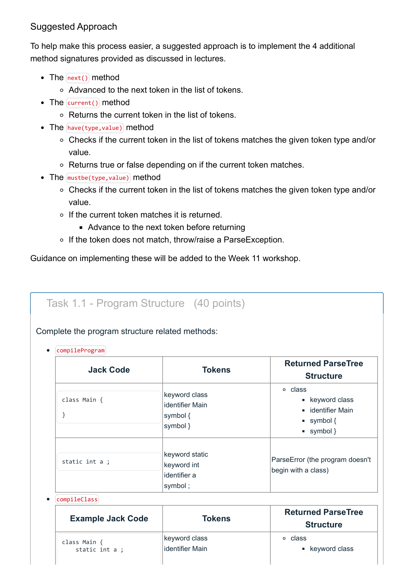

下面把你这页截图（“Suggested Approach + Task 1.1 – Program Structure（40 分）”）逐条讲清楚，并给出可直接照抄到模板里的**伪代码/实现要点**。最后附上覆盖整页内容的口语化总结。

---

# 一、Suggested Approach（推荐写法：先做 4 个小工具函数）

课程建议你在 `CompilerParser` 里先实现 4 个辅助方法，后面所有解析函数都基于它们：

## 1) `next()`

**作用**：把“当前指针”向前移动一位，返回**新的**当前 token。
**边界**：到末尾再调要么返回特殊 EOF token，要么抛异常（看模板约定）。

```python
def next():
self.i += 1
return self.tokens[self.i]
```

## 2) `current()`

**作用**：返回**当前** token（不前进）。

```python
def current():
return self.tokens[self.i]
```

## 3) `have(type, value=None)`

**作用**：**只检查**当前 token 是否匹配给定类型/值；匹配返回 `True`，否则 `False`；**不前进**。

* 只给 `type` 就按类型比；
* 给了 `value` 就类型和值都比。

```python
def have(t, v=None):
tok = self.current()
if tok.getType()!=t: return False
return True if v is None else tok.getValue()==v
```

## 4) `mustBe(type, value=None)`

**作用**：**必须**匹配当前 token；匹配成功则**先取出**这个 token，再调用 `next()` 前进并把这个已匹配的 token **返回**；若不匹配，**抛 ParseException**（题面要求）。

```python
def mustBe(t, v=None):
tok = self.current()
ok = (tok.getType()==t) and (v is None or tok.getValue()==v)
if not ok:
raise ParseException(f"expected {t} {v or ''}, got {tok.getType()} {tok.getValue()}")
self.next()
return tok
```

> 注：这四个函数能让你的 `parseXxx()` 写得很干净：需要“看一眼”用 `have()`，需要“吃掉一个”用 `mustBe()`，移动指针用 `next()`，取当前用 `current()`。

---

# 二、Task 1.1 – Program Structure（40 分）

题目要你完成**程序结构**相关的方法，至少包含：`compileProgram` 与 `compileClass`。下面按截图里的两个小表来解释。

---

## A. `compileProgram`（顶层入口）

**目标**：检查程序是否以 `class ... { ... }` 开头，并把这整个类解析成一棵 `class` 语法树返回；若不是类开头，抛 `ParseError/ParseException`。
**评分重点**：

* 正确识别“程序必须从 class 声明开始”；
* 能返回包含**类头部**（`class` 关键字、类名 `identifier`、左/右花括号）以及内部结构的树；
* 错误时要抛异常。

**截图示例 1：合法输入**
Jack 代码：

```jack
class Main {
}
```

Tokens（顺序）：

```
keyword class
identifier Main
symbol {
symbol }
```

返回的 ParseTree（示意结构）：

```
class
├── keyword: class
├── identifier: Main
├── symbol: {
├── classVarDec* / subroutineDec*   # 这里为空
└── symbol: }
```

**截图示例 2：非法输入**
Jack 代码：

```jack
static int a ;
```

Tokens：

```
keyword static
keyword int
identifier a
symbol ;
```

**期望**：抛 `ParseError`（因为程序不是从 `class` 开始）。

**实现要点（伪代码）**：

```python
def compileProgram():
# 入口通常把指针置 0
self.i = 0

if not self.have("keyword", "class"):
raise ParseException("program must start with 'class'")

# 直接复用 compileClass 构造整棵 class 树
cls = self.compileClass()

# 选做：如果模板要求消耗到 EOF，可以在此校验全部 token 已消费完毕
# if not self.atEnd(): raise ParseException("unexpected tokens after class")

return cls
```

---

## B. `compileClass`（类级结构）

**目标**：解析一整个类的外层结构，文法（前页已给）：

```
'class' className '{' classVarDec* subroutineDec* '}'
```

**实现步骤**：

1. `mustBe("keyword","class")`
2. 记录类名：`mustBe("identifier")`
3. `mustBe("symbol","{")`
4. 循环解析**类变量声明**：当 `have("keyword","static")` 或 `have("keyword","field")` → `addChild(compileClassVarDec())`
5. 循环解析**子程序**：当 `have("keyword", "constructor"|"function"|"method")` → `addChild(compileSubroutine())`
6. `mustBe("symbol","}")`
7. 返回 `class` 树。

**ParseTree 组装示例**：

```python
def compileClass():
node = ParseTree("class", None)

node.addChild( ParseTree("keyword", mustBe("keyword","class").getValue()) )
name_tok = mustBe("identifier")
node.addChild( ParseTree("identifier", name_tok.getValue()) )
node.addChild( ParseTree("symbol", mustBe("symbol","{").getValue()) )

while self.have("keyword","static") or self.have("keyword","field"):
node.addChild( self.compileClassVarDec() )

while self.have("keyword","constructor") or self.have("keyword","function") or self.have("keyword","method"):
node.addChild( self.compileSubroutine() )

node.addChild( ParseTree("symbol", mustBe("symbol","}").getValue()) )
return node
```

> 小贴士
>
> * **只做结构层**：变量/子程序体的细节分别交给 `compileClassVarDec()`、`compileSubroutine()`；
> * **多次/零次**：两个 `while` 循环体现 `*`（0 次或多次）；
> * **节点值**：对关键字/符号/标识符这类叶子，通常用 `ParseTree("keyword","class")` 这种方式落叶，保持打印时可读。

---

## 常见错误 & 规避

* 忘了在 `mustBe` 成功后**前进**（`next()` 已包含在 `mustBe` 中）；
* `compileProgram()` 没有抛“非 class 开头”的异常；
* `compileClass()` 忘了把 `}` 也作为叶子节点加入；
* 在 `compileProgram()` 里没有复用 `compileClass()`，导致两边逻辑不一致；
* 没处理“类体为空”的合法情况（`{ }` 也应通过）。

---

# 交付小清单（对应本页）

* 在 `CompilerParser` 里实现 `next()`、`current()`、`have(t,v)`、`mustBe(t,v)`；
* 实现 `compileProgram()`：检查 `class` 开头并调 `compileClass()`；
* 实现 `compileClass()`：完整构建类节点与子节点；
* 出错处抛 `ParseException`；
* 用截图里的两个示例分别验证**正常树**与**异常**。

---

# \[口语化表达]

这页是在教你“先写几个小扳手，再拧螺丝”。先把 `next/current/have/mustBe` 这四个小工具写好：`current` 看当前、`have` 只检查不前进、`mustBe` 必须匹配并把它吃掉，不对就抛错，`next` 让指针往后一格。有了这四个，`compileProgram` 就很简单：程序必须从 `class` 开头，不是就报错；是的话直接交给 `compileClass` 去解析整棵类树。`compileClass` 的套路就是按文法来：`class` 关键字 → 类名 → `{` → 一串 `static/field` 的变量声明 → 一串 `constructor/function/method` 的子程序 → `}`，每遇到一个部分就加成子节点。图里还给了两个例子：`class Main { }` 要返回一棵包含 `class/identifier/{/}` 的树；如果代码是 `static int a;`，那就直接抛错，因为程序头不是类。照这个思路写，结构分就能拿满。


---

## 第 7 页

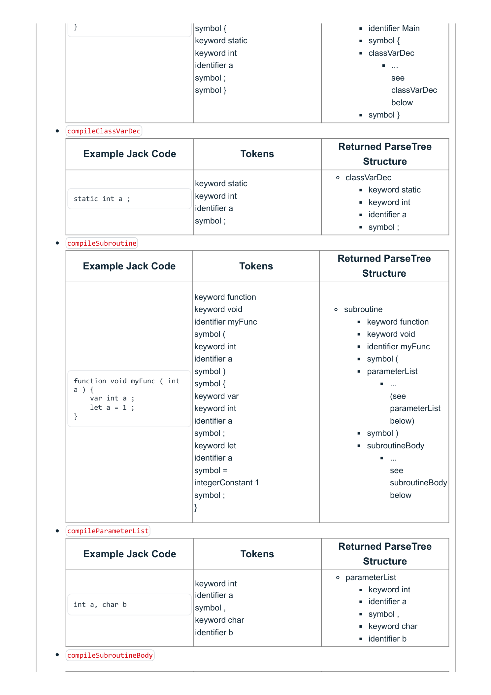

下面是对你截图第七页（关于 `compileClassVarDec`、`compileSubroutine`、`compileParameterList`、`compileSubroutineBody` 的讲解页）的**逐条中文解析 + 实现指导**，帮你理解每一题要干什么、该写哪些函数、每一步怎么实现。最后附上完整的\[口语化表达]总结。

---

## 一、`compileClassVarDec` —— 类变量声明

### 📘 文法规则

```
('static' | 'field') type varName (',' varName)* ';'
```

### 🧩 示例

Jack 代码：

```jack
static int a;
```

Tokens：

```
keyword static
keyword int
identifier a
symbol ;
```

### 🧠 要做什么

写一个函数 `compileClassVarDec()` 来解析**类内的变量声明语句**。

### ✅ 实现思路

1. 创建 ParseTree 节点：

```python
node = ParseTree("classVarDec", None)
```
2. 匹配并加入：

* `mustBe("keyword", "static")` 或 `mustBe("keyword", "field")`
* `type`（用 `mustBe("keyword")` 或 `mustBe("identifier")` 判断）
* 第一个变量名：`mustBe("identifier")`
3. 如果有多个变量（判断下一个 token 是 `,`），循环：

* 匹配 `,`
* 匹配下一个 `identifier`
4. 匹配结尾分号 `;`
5. 返回该节点。

### 🧱 ParseTree 结果

```
classVarDec
├── keyword static
├── keyword int
├── identifier a
└── symbol ;
```

---

## 二、`compileSubroutine` —— 子程序定义（函数 / 方法 / 构造器）

### 📘 文法规则

```
('constructor'|'function'|'method') ('void'|type) subroutineName '(' parameterList ')' subroutineBody
```

### 🧩 示例

Jack 代码：

```jack
function void myFunc(int a) {
var int a;
let a = 1;
}
```

Tokens（按顺序）：

```
keyword function
keyword void
identifier myFunc
symbol (
keyword int
identifier a
symbol )
symbol {
keyword var
keyword int
identifier a
symbol ;
keyword let
identifier a
symbol =
integerConstant 1
symbol ;
symbol }
```

### 🧠 要做什么

写函数 `compileSubroutine()` 来解析整个函数定义。

### ✅ 实现步骤

1. 创建节点：

```python
node = ParseTree("subroutine", None)
```
2. 匹配子程序类型：

* `mustBe("keyword", "constructor"|"function"|"method")`
3. 匹配返回类型（`void` 或普通类型）
4. 匹配函数名（`identifier`）
5. 匹配左括号 `(`
6. 调用 `compileParameterList()`，并加为子节点
7. 匹配右括号 `)`
8. 调用 `compileSubroutineBody()`，并加为子节点
9. 返回 `node`

### 🧱 ParseTree 结果

```
subroutine
├── keyword function
├── keyword void
├── identifier myFunc
├── symbol (
├── parameterList
│    ├── keyword int
│    └── identifier a
├── symbol )
└── subroutineBody
├── keyword var
├── keyword int
├── identifier a
├── symbol ;
├── keyword let
├── identifier a
├── symbol =
├── integerConstant 1
├── symbol ;
└── symbol }
```

---

## 三、`compileParameterList` —— 参数列表

### 📘 文法规则

```
((type varName) (',' type varName)*)?
```

### 🧩 示例

Jack 代码：

```jack
int a, char b
```

Tokens：

```
keyword int
identifier a
symbol ,
keyword char
identifier b
```

### 🧠 要做什么

写一个 `compileParameterList()` 函数，解析括号里的参数声明。

### ✅ 实现步骤

1. 新建节点：

```python
node = ParseTree("parameterList", None)
```
2. 如果下一个 token 是右括号 `)` → 空列表，直接返回。
3. 否则：

* 匹配类型（`keyword` 或 `identifier`）
* 匹配变量名 `identifier`
* 如果有 `,`，继续循环：

* 匹配 `,`
* 匹配下一组（type + varName）
4. 返回节点。

### 🧱 ParseTree 结果

```
parameterList
├── keyword int
├── identifier a
├── symbol ,
├── keyword char
└── identifier b
```

---

## 四、`compileSubroutineBody` —— 函数体

### 📘 文法规则

```
'{' varDec* statements '}'
```

### 🧩 示例（与前面函数体部分对应）

```jack
{
var int a;
let a = 1;
}
```

Tokens：

```
symbol {
keyword var
keyword int
identifier a
symbol ;
keyword let
identifier a
symbol =
integerConstant 1
symbol ;
symbol }
```

### 🧠 要做什么

写函数 `compileSubroutineBody()` 来解析函数体内容。

### ✅ 实现步骤

1. 创建节点：

```python
node = ParseTree("subroutineBody", None)
```
2. 匹配 `{`
3. 当下一个 token 是 `var` → 调 `compileVarDec()` 解析局部变量声明
4. 调 `compileStatements()` 解析语句部分
5. 匹配 `}`
6. 返回节点

### 🧱 ParseTree 结果

```
subroutineBody
├── symbol {
├── varDec
│    ├── keyword var
│    ├── keyword int
│    ├── identifier a
│    └── symbol ;
├── statements
│    ├── letStatement
│    │     ├── keyword let
│    │     ├── identifier a
│    │     ├── symbol =
│    │     ├── integerConstant 1
│    │     └── symbol ;
└── symbol }
```

---

## 五、整页的重点

| 函数名                       | 负责解析的结构 | 对应文法                                    | 小技巧                                         |                   |                                                             |         |
| ------------------------- | ------- | --------------------------------------- | ------------------------------------------- | ----------------- | ----------------------------------------------------------- | ------- |
| `compileClassVarDec()`    | 类变量声明   | \`('static'                             | 'field') type varName (',' varName)\* ';'\` | 多变量用 while 处理     |                                                             |         |
| `compileSubroutine()`     | 子程序定义   | \`('constructor'                        | 'function'                                  | 'method') ('void' | type) subroutineName '(' parameterList ')' subroutineBody\` | 调用两个子函数 |
| `compileParameterList()`  | 参数列表    | `((type varName) (',' type varName)*)?` | 可能为空                                        |                   |                                                             |         |
| `compileSubroutineBody()` | 子程序体    | `'{' varDec* statements '}'`            | 循环处理 varDec                                 |                   |                                                             |         |

---

# \[口语化表达]

这页就是在教你怎么写“类变量声明”和“函数部分”的解析。
首先是 `compileClassVarDec`，遇到 `static` 或 `field` 开头就进来，依次读类型、变量名、逗号分隔的变量，然后吃掉分号；比如 `static int a;` 要变成一棵包含四个子节点的树。
接着是 `compileSubroutine`，也就是函数定义，比如 `function void myFunc(int a) {...}`，你要先匹配关键字 `function`、返回类型、函数名，再解析小括号里的参数列表（交给 `compileParameterList`），然后大括号里的内容交给 `compileSubroutineBody`。
`compileParameterList` 就是负责解析 `(int a, char b)` 这种结构，可能为空，也可能多个参数。
最后 `compileSubroutineBody` 就是函数体，先吃 `{`，然后看有没有局部变量声明（`var int x;`），再解析里面的语句（`let`、`if`、`while` 等），最后吃掉 `}`。
简单说，这页是在教你怎么让解析器识别“函数的头”和“函数的身体”，按规则一层层建 ParseTree。


---

## 第 8 页

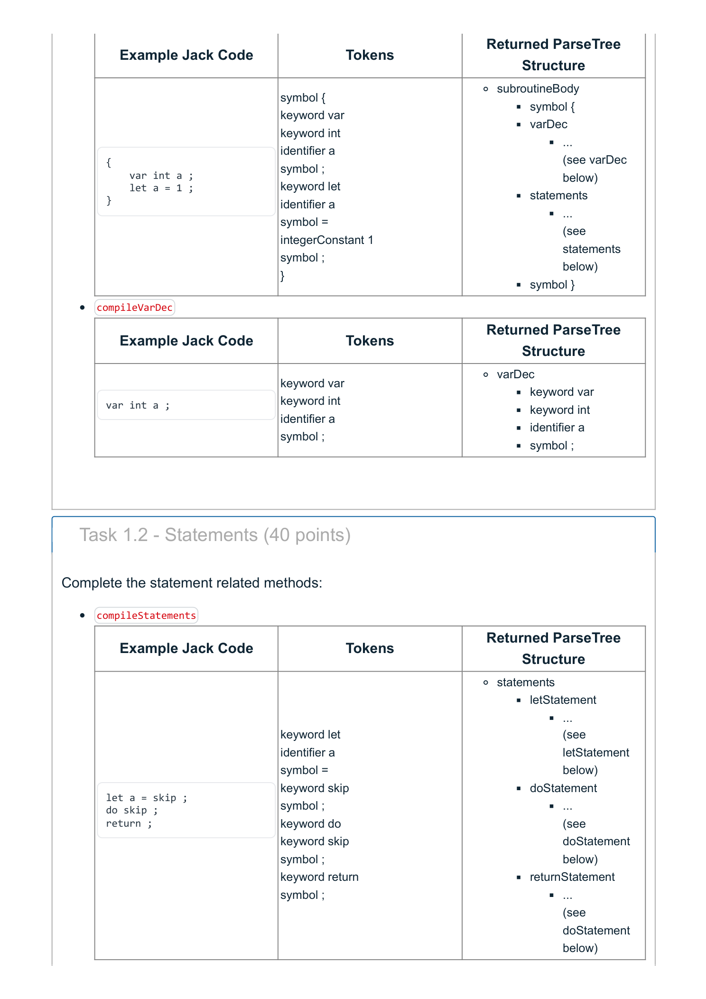

下面把这页（含 `compileVarDec` 与 **Task 1.2 – Statements（40 分）**：`compileStatements`）逐条讲清楚，并给出能直接落地的实现要点/伪代码。最后附上覆盖整页内容的\[口语化表达]总结。

---

# 一、`compileVarDec`（函数体里的局部变量声明）

## 文法

```
varDec → 'var' type varName (',' varName)* ';'
```

## 截图示例

Jack 代码：

```jack
var int a ;
```

Tokens：

```
keyword var
keyword int
identifier a
symbol ;
```

应返回的 ParseTree：

```
varDec
├── keyword var
├── keyword int        # 或 identifier（自定义类型）
├── identifier a
└── symbol ;
```

## 实现步骤（伪代码）

```python
def compileVarDec():
node = ParseTree("varDec", None)

node.addChild( PT("keyword", mustBe("keyword","var").getValue()) )

# type: 可能是关键字 int/char/boolean，也可能是类名(identifier)
if have("keyword") and current().getValue() in ("int","char","boolean"):
node.addChild( PT("keyword", mustBe("keyword").getValue()) )
else:
node.addChild( PT("identifier", mustBe
```


---

## 第 9 页

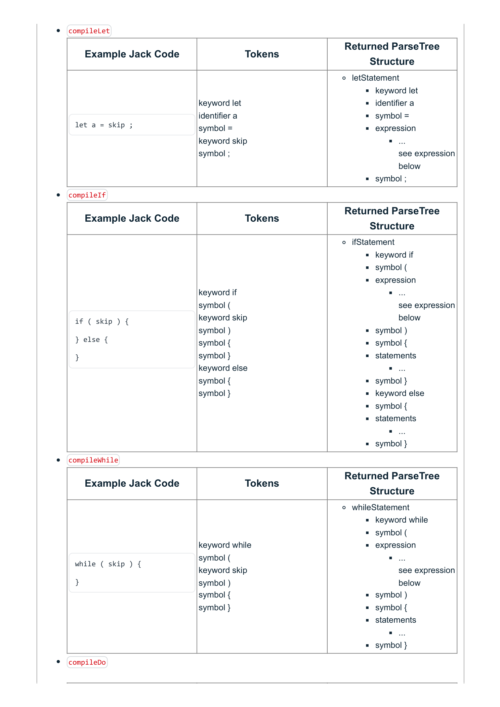

下面把你这页截图（Task 1.2 – Statements 的三大题：`compileLet`、`compileIf`、`compileWhile`，以及下一题 `compileDo` 的开头）逐条说明“题目含义、语法规则、如何写函数、注意点与伪代码”。最后附上一个覆盖整页内容的口语化总结。

---

# 题目前置：Statements 总体规则

* 语句（`statement`）可能是：`let` / `if` / `while` / `do` / `return`。
* 你已经在前页实现了 `compileStatements()`：循环看当前 token 是哪种关键字，然后分别调用本页的四个函数：`compileLet()`、`compileIf()`、`compileWhile()`、`compileDo()`（`compileReturn()`在上一页讲过）。
* 每个函数都要**创建对应类型的 ParseTree**节点，并用 `mustBe()/have()` 按顺序消费 token；不匹配就抛 `ParseException`。

---

## 1) `compileLet` —— 赋值语句

### 文法

```
letStatement → 'let' varName ('[' expression ']')? '=' expression ';'
```

* 可支持数组写入：`let a[i] = expr ;`
* 普通变量：`let a = expr ;`

### 示例（截图）

```
let a = skip ;
```

Tokens：

```
keyword let, identifier a, symbol =, keyword skip, symbol ;
```

### 期望 ParseTree（示意）

```
letStatement
├─ keyword: let
├─ identifier: a
├─ symbol: =
├─ expression
│   └─ keyword: skip
└─ symbol: ;
```

### 实现步骤（伪代码）

```python
def compileLet():
node = ParseTree("letStatement", None)

node.addChild(PT("keyword", mustBe("keyword","let").getValue()))

# varName
name_tok = mustBe("identifier")
node.addChild(PT("identifier", name_tok.getValue()))

# 可选数组下标
if have("symbol","["):
node.addChild(PT("symbol", mustBe("symbol","[").getValue()))
node.addChild( compileExpression() )
node.addChild(PT("symbol", mustBe("symbol","]").getValue()))

node.addChild(PT("symbol", mustBe("symbol","=").getValue()))
node.addChild( compileExpression() )
node.addChild(PT("symbol", mustBe("symbol",";").getValue()))
return node
```

**易错点**

* 写了 `[` 就一定要匹配配对的 `]`。
* `expression` 里允许 `skip`，别忘了。

---

## 2) `compileIf` —— 条件语句（可带 else）

### 文法

```
ifStatement → 'if' '(' expression ')' '{' statements '}' ('else' '{' statements '}')?
```

### 示例（截图）

```jack
if ( skip ) {
} else {
}
```

Tokens（按图序）：

```
keyword if, symbol (, keyword skip, symbol ), symbol {, symbol }, keyword else, symbol {, symbol }
```

### 期望 ParseTree（示意）

```
ifStatement
├─ keyword: if
├─ symbol: (
├─ expression
│   └─ keyword: skip
├─ symbol: )
├─ symbol: {
├─ statements
├─ symbol: }
├─ keyword: else
├─ symbol: {
├─ statements
└─ symbol: }
```

（如果没 else，后半部分就没有）

### 实现步骤（伪代码）

```python
def compileIf():
node = ParseTree("ifStatement", None)

node.addChild(PT("keyword", mustBe("keyword","if").getValue()))
node.addChild(PT("symbol", mustBe("symbol","(").getValue()))
node.addChild( compileExpression() )
node.addChild(PT("symbol", mustBe("symbol",")").getValue()))

node.addChild(PT("symbol", mustBe("symbol","{").getValue()))
node.addChild( compileStatements() )
node.addChild(PT("symbol", mustBe("symbol","}").getValue()))

if have("keyword","else"):
node.addChild(PT("keyword", mustBe("keyword","else").getValue()))
node.addChild(PT("symbol", mustBe("symbol","{").getValue()))
node.addChild( compileStatements() )
node.addChild(PT("symbol", mustBe("symbol","}").getValue()))
return node
```

**易错点**

* else 是**可选**的；只有看见 `else` 才解析第二个 `{ statements }`。
* 花括号必须成对。

---

## 3) `compileWhile` —— 循环语句

### 文法

```
whileStatement → 'while' '(' expression ')' '{' statements '}'
```

### 示例（截图）

```jack
while ( skip ) {
}
```

Tokens：

```
keyword while, symbol (, keyword skip, symbol ), symbol {, symbol }
```

### 期望 ParseTree（示意）

```
whileStatement
├─ keyword: while
├─ symbol: (
├─ expression
│   └─ keyword: skip
├─ symbol: )
├─ symbol: {
├─ statements
└─ symbol: }
```

### 实现步骤（伪代码）

```python
def compileWhile():
node = ParseTree("whileStatement", None)

node.addChild(PT("keyword", mustBe("keyword","while").getValue()))
node.addChild(PT("symbol", mustBe("symbol","(").getValue()))
node.addChild( compileExpression() )
node.addChild(PT("symbol", mustBe("symbol",")").getValue()))

node.addChild(PT("symbol", mustBe("symbol","{").getValue()))
node.addChild( compileStatements() )
node.addChild(PT("symbol", mustBe("symbol","}").getValue()))
return node
```

**易错点**

* 和 `if` 很像，但没有 `else` 分支。
* 循环体必须解析 `statements`，即使为空也要有 `{ }`。

---

## 4) `compileDo` —— 调用语句（下一页继续）

> 本页只露出标题，你需要按前面文法实现：

```
doStatement → 'do' expression ';'
```

* 这里的 `expression` 实际上会是一个“子程序调用”表达式，比如 `Output.printInt(x)`，或 `foo()`；
* 但从解析角度，仍然是走 `compileExpression()`，由 `term` 分支处理 `subroutineCall`。

### 伪代码

```python
def compileDo():
node = ParseTree("doStatement", None)
node.addChild(PT("keyword", mustBe("keyword","do").getValue()))
node.addChild( compileExpression() )   # 里头会识别 subroutineCall
node.addChild(PT("symbol", mustBe("symbol",";").getValue()))
return node
```

---

## 与 `compileStatements()` 的衔接（便于自测）

```python
def compileStatements():
node = ParseTree("statements", None)
while True:
if      have("keyword","let"):    node.addChild( compileLet() )
elif    have("keyword","if"):     node.addChild( compileIf() )
elif    have("keyword","while"):  node.addChild( compileWhile() )
elif    have("keyword","do"):     node.addChild( compileDo() )
elif    have("keyword","return"): node.addChild( compileReturnStatement() )
else: break
return node
```

---

## 常见坑位与检查表

* `let` 的数组下标 `[...]` 忘了可选分支；
* `if` 处理完 `)` 后，**一定**匹配 `{ statements }`，而不是只解析一条语句；
* `else` 分支必须先检测关键字再进入解析；
* `while` 与 `if` 的结构一致，别错写成 `do ... while`；
* 所有分号 `;` 都要被消费成叶子节点（包括 `do`、`let`、`return`）。
* 表达式中允许 `skip`，因此 `compileExpression()` 要能识别 `keyword skip`。

---

# \[口语化表达]

这页基本就是教你把三种语句翻译成语法树：

* **let**：先吃 `let`，再吃变量名；如果后面是 `[`，就再解析一个下标表达式并吃 `]`；然后吃 `=`，解析一个表达式，最后吃 `;`。
* **if**：吃 `if` 和左括号，解析里面的表达式，吃右括号；接着吃 `{`，解析一段 `statements`，吃 `}`；如果接着还有 `else`，再来一套 `{ statements }`。
* **while**：结构和 `if` 类似，但没有 `else`，就是 `while (表达式) { statements }`。
另外 `do` 的题目在下一页：`do 表达式 ;`，其实就是函数调用语句，照着把 `do`、表达式、分号处理掉就行。总之，看到啥关键字就进哪个解析函数，遇到括号或花括号就按顺序把里面的表达式或语句块递归下去，最后都要落成 ParseTree 的叶子节点，分号别忘了。


---

## 第 10 页

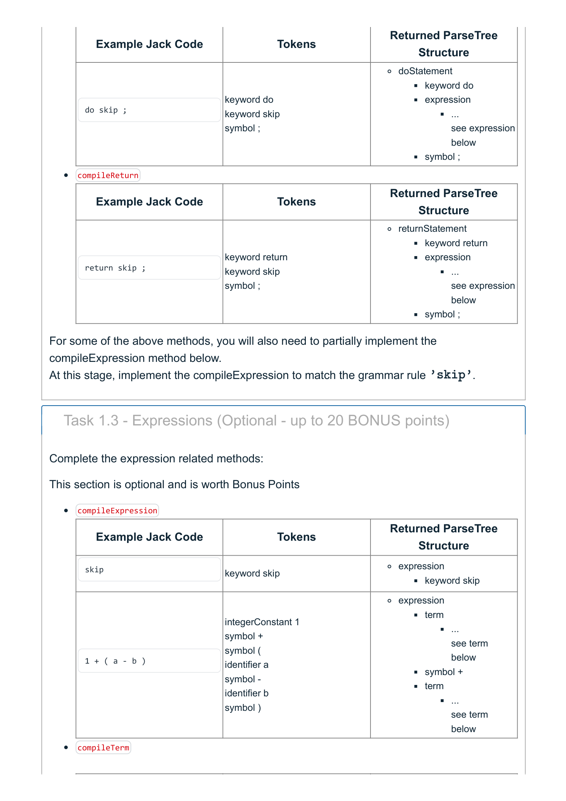

下面是对这页截图（含 `compileDo`、`compileReturn`，以及可选加分的 **Task 1.3 – Expressions**：`compileExpression`、`compileTerm`）的逐条解释与实作要点。最后附上覆盖整页内容的\[口语化表达]总结。

---

# 一、`compileDo` —— 调用语句（必做）

## 语法规则

```
doStatement → 'do' expression ';'
```

* 虽然直观上“do 后面跟的是函数/方法调用”，但在你的解析器里，把它当成**表达式**去解析（表达式的 `term` 会识别 `subroutineCall`）。

## 截图示例

```jack
do skip ;
```

Tokens：

```
keyword do, keyword skip, symbol ;
```

## 期望 ParseTree

\`\`


---

## 第 11 页

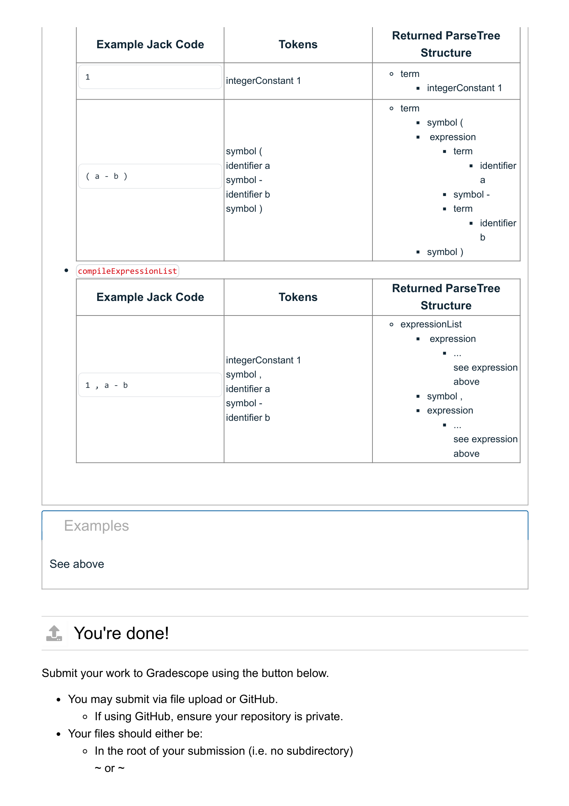

下面把这一页（关于 `compileTerm`、`compileExpressionList` 示例与**提交要求**）逐条讲清楚，并给你可直接落地的实现要点/伪代码。最后附上覆盖整页内容的\[口语化表达]总结。

---

# 一、Task 1.3（可选加分）之 `compileTerm`

> 你在上一页已经看到 `compileExpression` 的目标：要么是 `skip`，要么是 `term (op term)*`。而“term”怎么解析，就在本页用两个例子说明。

## 例子 A：字面量

**Jack 代码**：`1`
**Tokens**：`integerConstant 1`
**应返回的 ParseTree**：

```
term
└── integerConstant: 1
```

👉 说明：如果当前 token 类型是 `integerConstant`（或 `stringConstant`、`keywordConstant`），`compileTerm()` 直接把它作为**叶子**加入并返回。

---

## 例子 B：括号表达式

**Jack 代码**：`( a - b )`
**Tokens**：

```
symbol ( , identifier a , symbol - , identifier b , symbol )
```

**应返回的 ParseTree（节选）**：

```
term
├── symbol: (
├── expression
│    ├── term  → identifier: a
│    ├── symbol: -
│    └── term  → identifier: b
└── symbol: )
```

👉 说明：如果 `compileTerm()` 看到的是 `(`：

1. 吃 `(`；2) 调 `compileExpression()` 解析里头；3) 吃 `)`；4) 构成一个 `term`，里面嵌了一棵 `expression` 子树。

---

## `compileTerm()` 完整匹配范围（总表）

你在代码里需要覆盖这些分支（前几页已说明，这里再次汇总）：

* `integerConstant` / `stringConstant` / `keywordConstant`（`true/false/null/this`）
* `identifier`：

* 后接 `[` → 数组下标访问：`varName '[' expression ']'`
* 后接 `(` 或 `.` → 子程序调用（交给 `compileSubroutineCall()` 或由 `term`内处理）
* 否则就是普通变量
* `'(' expression ')'`（本页例子 B）
* `unaryOp term`（`-` 或 `~` 一元运算）

### 伪代码骨架

```python
def compileTerm():
node = PT("term", None)
if have("integerConstant"):
node.addChild( PT("integerConstant", mustBe("integerConstant").getValue()) )
elif have("stringConstant"):
node.addChild( PT("stringConstant", mustBe("stringConstant").getValue()) )
elif have("keyword") and current().getValue() in ("true","false","null","this"):
node.addChild( PT("keyword", mustBe("keyword").getValue()) )
elif have("symbol","("):
node.addChild( PT("symbol", mustBe("symbol","(").getValue()) )
node.addChild( compileExpression() )
node.addChild( PT("symbol", mustBe("symbol",")").getValue()) )
elif have("symbol") and current().getValue() in ("-","~"):
node.addChild( PT("symbol", mustBe("symbol").getValue()) )  # unaryOp
node.addChild( compileTerm() )
elif have("identifier"):
# 先吃标识符
ident = PT("identifier", mustBe("identifier").getValue())
# lookahead 判断是 var / array / call
if have("symbol","["):
node.addChild( ident )
node.addChild( PT("symbol", mustBe("symbol","[").getValue()) )
node.addChild( compileExpression() )
node.addChild( PT("symbol", mustBe("symbol","]").getValue()) )
elif have("symbol","(") or have("symbol","."):
# 子程序调用：把刚吃掉的 ident 作为前缀交给调用解析
node.addChild( compileSubroutineCall(prefix_ident=ident) )
else:
node.addChild( ident )
else:
raise ParseException("invalid term")
return node
```

> 注：`compileSubroutineCall()` 可以按语法 `subroutineName '(' expressionList ')'` 或 `(className|varName) '.' subroutineName '(' expressionList ')'` 来写，内含 `compileExpressionList()`（下一节）。

---

# 二、`compileExpressionList` —— 参数/实参列表

**文法**：

```
expressionList → ( expression (',' expression)* )?
```

* 可能是**空**（如 `()`）。
* 非空时：一条表达式，后面跟若干 `, expression`。

## 截图示例

**Jack 代码**：`1 , a - b`
**Tokens**：

```
integerConstant 1 , identifier a , symbol - , identifier b
```

**应返回的 ParseTree（示意）**：

```
expressionList
├── expression      # 表达式 1
│    └── term → integerConstant: 1
├── symbol: ,
└── expression      # 表达式 a - b
├── term → identifier: a
├── symbol: -
└── term → identifier: b
```

### 伪代码

```python
def compileExpressionList():
node = PT("expressionList", None)
if have("symbol",")"):
return node  # 空参数列表
node.addChild( compileExpression() )
while have("symbol",","):
node.addChild( PT("symbol", mustBe("symbol",",").getValue()) )
node.addChild( compileExpression() )
return node
```

---

# 三、Examples（本页“Examples”块）

* “See above”表示示例即为上面各表格里的例子：

* `term` 的两种典型：**字面量**与**括号表达式**；
* `expressionList` 的典型：`1 , a - b`。

---

# 四、提交说明（You’re done!）

**提交到 Gradescope**（用页面底部按钮）：

1. **提交方式**

* 可以**直接上传文件**；
* 也可以连接 **GitHub**（记得**设为私有仓库**）。

2. **目录结构**

* 文件应位于你提交包/仓库的**根目录**（root），**不要**再套一层子文件夹；
* 也就是说：`/CompilerParser.*`、相关源码、项目配置等直接放根目录即可。

3. **建议的自检清单**

* 仅提交**一种语言**（Python / Java / C++ 其一）；
* **未修改**模板中的 `ParseTree` 与 `Token` 类；
* 全部必须实现的方法均存在且编译通过；
* 自测覆盖：`class / varDec / subroutine / parameterList / subroutineBody / statements / let/if/while/do/return / expression/term / expressionList`；
* 错误输入能**抛 ParseException**；
* 运行时能打印或导出**人类可读**的 ParseTree（模板通常自带 `print`）。

---

# \[口语化表达]

这页主要告诉你两件事：**term 怎么解析、参数列表怎么解析**，最后顺带说下**怎么交作业**。
`compileTerm` 的思路是：如果看到数字/字符串/true/false/null/this，就当叶子节点；如果是 `(` 就解析里面的 `expression` 再配个 `)`；如果是 `-` 或 `~` 就是一元运算，再递归一个 term；如果是标识符，要看后面跟啥：跟 `[` 是数组下标、跟 `(` 或 `.` 是函数调用、什么都不跟就是普通变量。`compileExpressionList` 就是把括号里的参数按逗号分开，一个个调 `compileExpression` 解析，可能为空。例子里展示了 `term` 的两种典型：`1` 和 `(a - b)`，以及参数列 `1, a - b`。最后提交时，把代码传到 Gradescope 就行了；可以用 GitHub（仓库要私有），文件放在提交的**根目录**，别再套文件夹。总之，按照这些规则把 `term` 和 `expressionList` 写完，再按清单自测一遍，就能稳稳把这部分搞定。


---

## 第 12 页

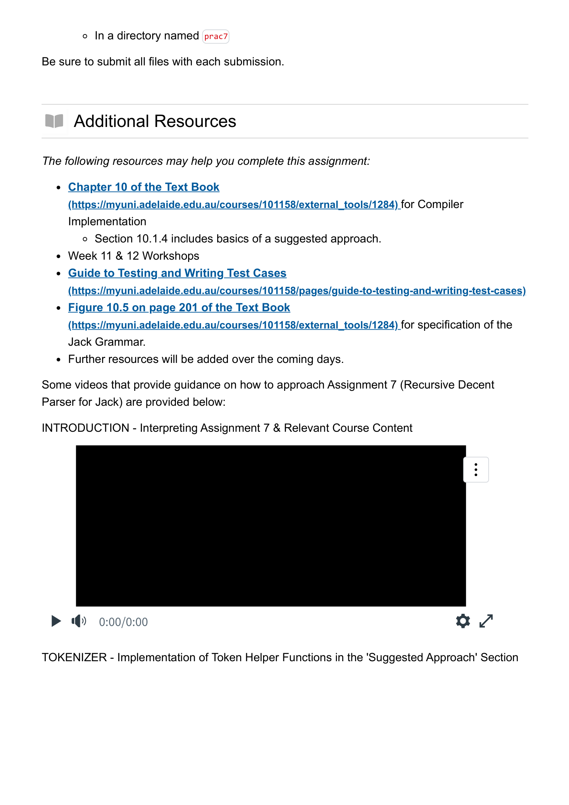

下面把你这页“**Additional Resources**（附加资源）+ 提交结构补充”的内容讲清楚：包括该页都在说什么、要你做什么、哪里看资料、以及最后的提交格式要求。结尾有一段你要的口语化总结。

---

## 一、提交结构补充（与上一页“提交说明”呼应）

* 你的代码可以放在：

* **提交根目录**（推荐，最简单）；或
* **一个名为 `prac7` 的目录**下。
* 不管用哪种方式，**每次提交都把所有需要的文件一起提交**（不要只传改动的那几个）。
* 用 GitHub 提交的话，仓库务必**私有**。

> 小建议：若课程的自动评测器按相对路径找文件，根目录或 `prac7/` 二选一即可，别再嵌套其他目录，避免找不到文件。

---

## 二、附加资源（帮你完成解析器）

这页列出官方推荐的学习/参考材料：

1. **教材第 10 章（Chapter 10 of the Text Book）**

* 核心：**编译器实现**，包含**递归下降解析**思路。
* **10.1.4 小节**给出“推荐实现方法”的基础（和作业里的 `next/current/have/mustBe` 思路一致）。
* 重点看：文法到代码的映射、如何分函数、如何处理错误。

2. **第 11 & 12 周 Workshop**

* 现场/录播会给出**实现提示**、**常见坑**、**样例**。
* 建议把自己写的 `compileClass/Statements/Expression` 对着 Workshop 例子跑一遍。

3. **Guide to Testing and Writing Test Cases（测试与用例编写指南）**

* 教你如何写**单元测试**和**覆盖用例**：

* 正确输入：各类语句/表达式/嵌套/边界；
* 错误输入：缺分号、缺括号、关键字拼写错等，是否能**抛 ParseException**。
* 强烈建议把这些用例脚本化，反复运行，保证回归稳定。

4. **教材第 201 页的图 10.5（Figure 10.5）**

* 是 **Jack 语言语法** 的规格图示/表格。
* 直接把图中的每条产生式映射到你的 `compileXxx()` 函数即可（本次作业在此基础上增加了 `skip` 关键字）。

5. **后续还会补充资源**

* 教务方提到“接下来几天还会加资料”，留意课程页面更新。

6. **视频讲解**（本页下方的播放器）

* **INTRODUCTION**：如何解读 Assignment 7，与课程内容如何对应。
* **TOKENIZER**：实现“推荐方法”里那四个**Token 辅助函数**（`next/current/have/mustBe`）的讲解与示例。
* 做法：边看边在模板里把四个函数写完，再实现 `compileProgram → compileClass → … → compileStatements/Expression` 的链路。

---

## 三、怎么用这些资源把题做出来（建议路线）

1. **看教材 10 章 + Figure 10.5** → 弄清 Jack 文法。
2. **先实现四个 helper**（`next/current/have/mustBe`）。
3. **自顶向下**：`compileProgram` → `compileClass` → `compileClassVarDec` / `compileSubroutine` → `compileParameterList` / `compileSubroutineBody` → `compileVarDec` / `compileStatements` → `compileLet/If/While/Do/Return` → `compileExpression/Term/ExpressionList`。
4. **按“测试指南”写用例**：

* 覆盖正确/错误、简单/嵌套、空体/多声明/数组/函数调用等。
* 维持**可重复打印**的 ParseTree（检查节点类型、值、子节点顺序）。
5. **每实现一段就提交一次**到 Gradescope，及时看反馈。
6. **Bonus（表达式完整实现）**：在能通过基础版的 `skip` 之后，按“term/op/unary/括号/调用/数组下标”逐步补齐优先级和组合。

---

## 四、常见踩坑（这页隐含要点）

* **目录名**：若选择 `prac7/`，确保评测脚本能在该目录下找到源码文件；不要再套 `prac7/src/…`。
* **视频里建议的 helper 实现**要与模板 API 对齐（返回值/异常类型/到达末尾的行为）。
* **测试集分层**：先做结构（class/var/subroutine/statement），再补 expression；表达式卡住时，至少先实现 `skip` 确保语句题能跑通。
* **抛错信息**要包含“期望/实际/位置”，方便定位（很多评测会检查你是否抛错，而不是静默失败）。

---

# \[口语化表达]

这页主要是在说两件事：**提交怎么摆文件**，还有**去哪儿看资料**。文件要么直接放在提交的根目录，要么就放进一个叫 `prac7` 的文件夹里，总之别再多套一层；每次提交把所有文件都带上。然后资源方面，重点看教材第 10 章（尤其 10.1.4）、第 201 页的图 10.5（Jack 的语法总表）、第 11/12 周的 workshop、以及“测试用例怎么写”的指南。视频也给你了：先看“作业解读”和“Tokenizer/四个小函数”的实现，照着把 `next/current/have/mustBe` 写好，再从 `compileProgram → compileClass → …` 一路撸下来。卡在表达式的话，先做 `skip` 能跑通语句题，后面再慢慢把 term/运算符/括号/调用补齐。最后记得用一堆小样例自测，能抛错的地方就抛错，这样提交到 Gradescope 基本就稳了。


---

## 第 13 页

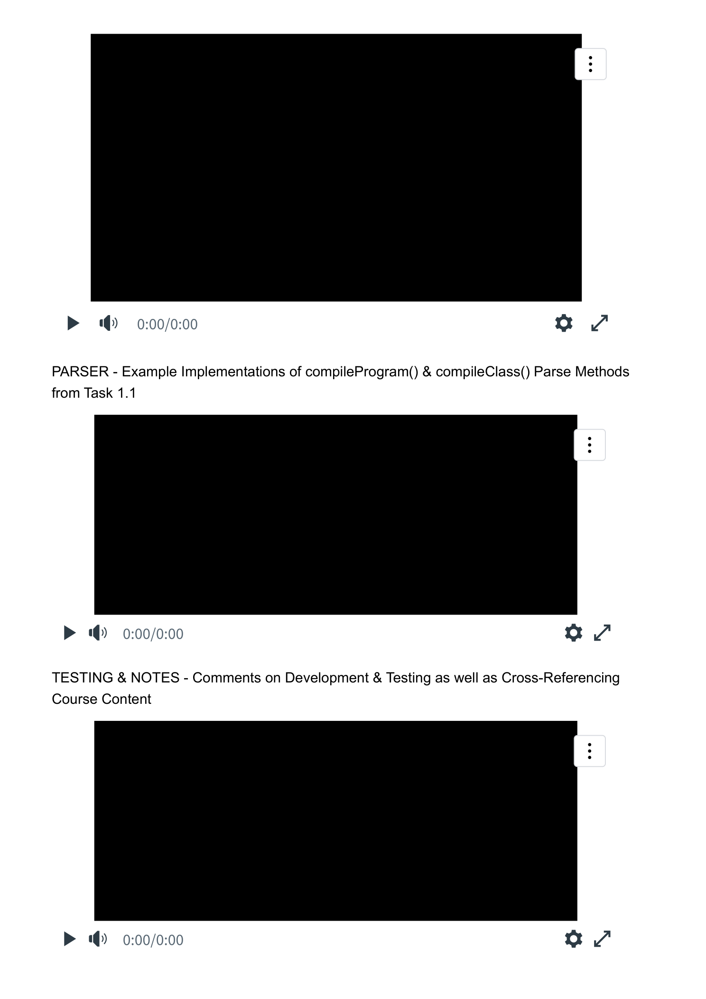

这一页主要展示的是课程提供的**教学视频资源**，用来帮助你理解 Assignment 7（递归下降语法分析器）的具体实现方法和测试思路。下面是详细说明和每个视频的作用解析。

---

## 一、视频 1：PARSER — `compileProgram()` & `compileClass()` 示例实现

**内容概要：**

* 讲解如何从顶层函数 `compileProgram()` 开始实现整个解析流程；
* 展示 `compileClass()` 的结构与逻辑——即如何解析一个完整的类定义；
* 演示与 Task 1.1（Program Structure 部分）对应的代码实现。

**你应该做的：**

1. **先实现 `compileProgram()`：**

* 它是解析器入口，负责读取最外层结构；
* 检查第一个 token 必须是 `class`；
* 调用 `compileClass()` 来解析整个类；
* 出错时抛 `ParseException`。

示例伪代码：

```python
def compileProgram():
node = ParseTree("program", None)
node.addChild(compileClass())
return node
```

2. **再写 `compileClass()`：**

* 按语法 `'class' className '{' classVarDec* subroutineDec* '}'`；
* 每一步用 `mustBe()` 检查对应 token；
* 循环解析多个类变量声明 (`compileClassVarDec`) 和子程序 (`compileSubroutine`)；
* 返回 ParseTree。

示例伪代码：

```python
def compileClass():
node = ParseTree("class", None)
node.addChild(PT("keyword", mustBe("keyword","class").getValue()))
node.addChild(PT("identifier", mustBe("identifier").getValue()))
node.addChild(PT("symbol", mustBe("symbol","{").getValue()))

while have("keyword", ["static","field"]):
node.addChild(compileClassVarDec())

while have("keyword", ["constructor","function","method"]):
node.addChild(compileSubroutine())

node.addChild(PT("symbol", mustBe("symbol","}").getValue()))
return node
```

**重点：**

* 这两个函数是整个解析器的“入口层”，所有子规则都由它们递归展开；
* 视频会展示完整的递归调用流程。

---

## 二、视频 2：TESTING & NOTES — 开发与测试建议

**内容概要：**

* 讲解如何逐步开发与调试解析器；
* 如何将课程内容（语法、tokenizer、编译原理）与作业对应；
* 如何用测试驱动（Test Cases）验证每个函数的正确性。

**你应该做的：**

1. **每实现一个 compileXxx() 就测试一次：**

* 比如写完 `compileVarDec()`，用样例 `var int a;` 看能否生成正确 ParseTree；
* 写完 `compileStatements()` 后，用 `let` / `if` / `while` 组合语句验证递归是否正确。

2. **分层调试：**

* 先保证结构类函数（program/class/subroutine）无误；
* 再测 statement 层；
* 最后加 expression/term 的可选加分部分。

3. **交叉参考课程内容：**

* 把视频提到的内容与教材第 10 章、Figure 10.5 的 Jack Grammar 图对照；
* 确保函数命名、token 匹配逻辑和语法树结构与教材一致。

4. **测试策略（建议）**

* 正确输入样例：各种合法语句与嵌套；
* 错误输入样例：缺括号、漏分号、拼写错等；
* 自动测试脚本（例如 Python unittest 或 Java JUnit）。

---

## 三、视频 3（底部）：继续讲解测试 & 作业调试方法

* 深入讲述如何逐步完善 `compileExpression()`；
* 展示如何通过打印 ParseTree 来验证结构；
* 说明课程资源（Workshop、教材、样例代码）之间的对应关系。

---

## 四、这页的目的总结

这一页**没有新题目**，是提供给你**辅助理解与调试的教学视频**，帮助你看例子写代码。

* 视频 1 = 讲实现（代码模板）；
* 视频 2 = 讲调试、测试与课程关联；
* 视频 3 = 讲如何综合验证并交付作业。

---

# \[口语化表达]

这页其实就是三段教学视频，帮你看怎么写、怎么测。第一个视频讲 `compileProgram()` 和 `compileClass()` 怎么写，也就是从最外层开始，一步步把整个程序和类解析出来。第二个视频讲怎么调试和测试，比如每写完一个函数就自己跑一遍小样例，看 ParseTree 对不对。第三个视频继续讲测试技巧和课程内容的对照，比如用教材的 Jack 语法表对着看。总的来说，这页没有新作业，而是教你**怎么把前面那些函数真正写出来、测出来、调通整个递归下降解析器**。


---

## 第 14 页


这页其实没有新的题目内容，它主要是关于**作业提交系统加载方式的说明**。下面是详细解释和你要怎么做的说明。

---

## 一、页面说明

这页显示的文字是：

> “This tool needs to be loaded in a new browser window.”
> “Load Assignment 7 in a new window.”

意思是：
👉 这个作业（Assignment 7）需要通过\*\*外部工具（External Tool）\*\*加载，比如 **Gradescope** 或学校 LMS（如 MyUni / Canvas）的集成系统。
👉 你要点击蓝色按钮 **“Load Assignment 7 in a new window”** 才能打开作业提交界面。

---

## 二、操作步骤

1️⃣ **点击按钮**
点击页面上的 “**Load Assignment 7 in a new window**”。这会在新的浏览器窗口中打开作业提交或运行界面。

2️⃣ **加载外部工具**
根据课程系统的设置，打开的可能是：

* Gradescope 作业上传页面；
* 或 MyUni 集成的编程测试平台。

3️⃣ **登录并确认账户**
如果系统提示登录，请用你的学校账号登录。
这样提交记录才会正确关联到你的课程账户。

4️⃣ **上传文件**
打开页面后：

* 选择上传 `.py` / `.java` / `.cpp` 等源文件（取决于你用的语言模板）；
* 或者选择从 GitHub 仓库导入（确保仓库是私有的，并且根目录结构正确，文件命名规范）。

5️⃣ **检查提交结果**
提交后系统会自动编译并运行测试样例，生成反馈报告（比如通过/未通过、得分、错误行号等）。
根据反馈修改你的代码后，可以再次提交。

---

## 三、常见问题

* ❗ **打不开页面？**
检查浏览器是否拦截了弹出窗口（popup）。允许网站打开新窗口即可。

* ⚠️ **提示外部工具未授权？**
登录课程平台（MyUni）后再点进入 Assignment 7 页面，系统会自动完成授权。

* 🧩 **GitHub 提交报错？**
仓库要是私有的；并且要放在根目录或名为 `prac7` 的文件夹里，不能有额外嵌套结构。

---

## 四、总结

这页不是题目，而是告诉你怎么**进入外部作业系统并提交文件**。
只有点进这个链接，作业才真正“生效”并能被评分。

---

# \[口语化表达]

这页其实啥题都没有，就是在告诉你：“这个作业得在外部网站里交。”你要点那个蓝色按钮“**Load Assignment 7 in a new window**”，它会在新窗口里打开，比如 Gradescope 或学校系统的作业界面。进去之后，用你学校账号登录，然后上传你写好的解析器代码文件（或者连接私有的 GitHub 仓库）。提交完系统会自动测，给你打分或报错信息。要是打不开，可能是浏览器拦截了弹窗，放行就好。简单说，这页就是个入口提示，点进去才能真正交作业、拿分。
