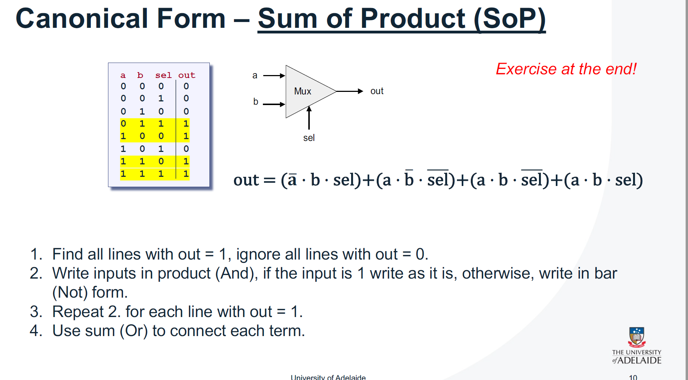
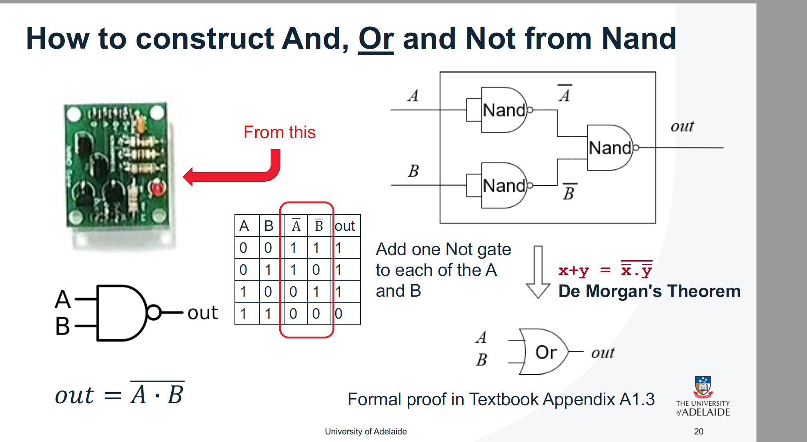
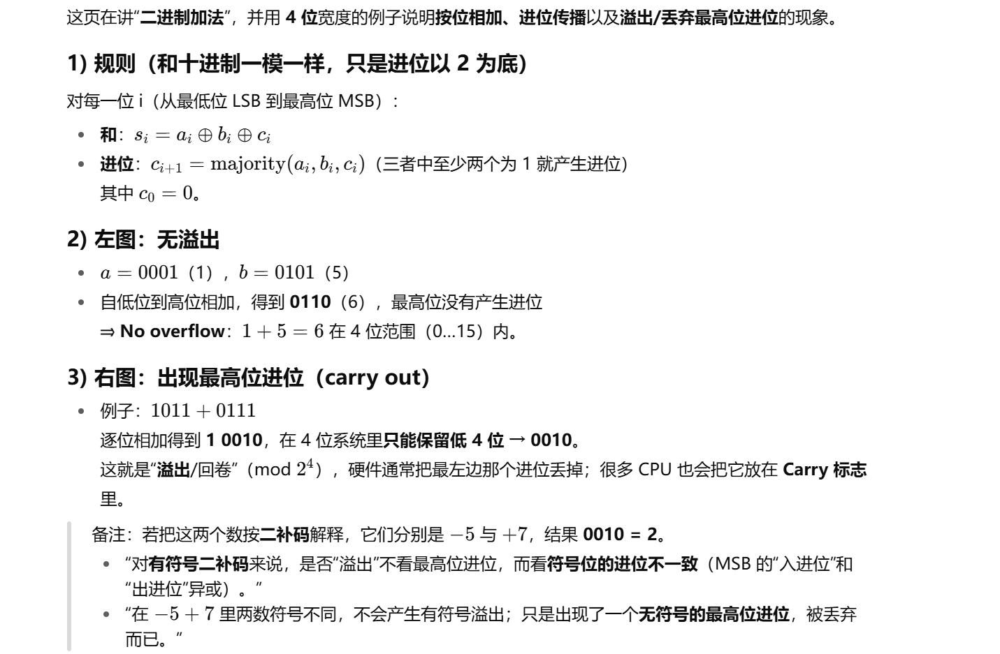
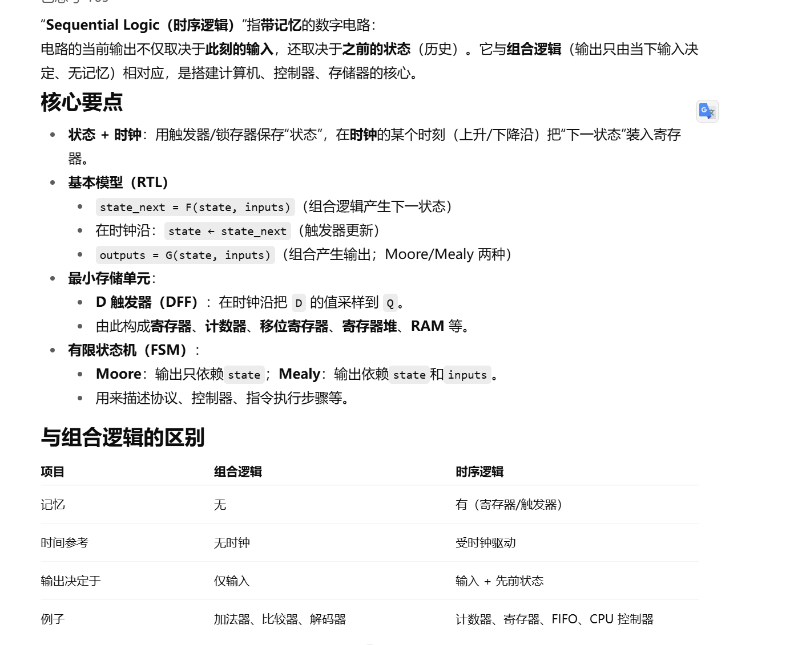

第一个ppt

> // push 511          ; 注释：对应虚拟机的"push 511"指令
> @511                ; 将常量511加载到A寄存器（A=511）
> D=A                 ; 将A寄存器的值（511）传送到D寄存器（D=511）
> @SP                 ; 将堆栈指针SP的值加载到A寄存器（A=SP的当前值）
> A=M                 ; 将SP指向的内存位置的值（即当前SP值）加载到A寄存器（A=内存[SP]）
> M=D                 ; 将D寄存器的值（511）存入A寄存器指向的内存位置（内存[A]=511）
> ; （注：此处省略了调整SP的步骤，通常push后需SP--，但图中注释为"M=M+1 // SP++"，可能是简化或约定差异）
>
> - `@511`：**加载地址/常量**。将数值 `511` 放入**A寄存器**（Hack计算机中，`@xxx` 用于指定内存地址或常量）。
> - `D=A`：**数据传送**。将A寄存器的值（511）复制到**D寄存器**（D是数据寄存器，用于暂存数据）。
> - `@SP`：**加载SP值**。将堆栈指针SP的当前值放入A寄存器（SP是专用寄存器，指向栈顶下一个位置）。
> - `A=M`：**间接寻址**。将SP指向的内存位置的值（即当前SP值）放入A寄存器（例如，若SP=256，则A=256）。
> - `M=D`：**内存写操作**。将D寄存器的值（511）存入A寄存器指向的内存位置（即内存[256]=511，完成了“压栈”操作）。
>
> ### **3. 为什么 `M=D` 等价于 `内存[A] = 511`？**
>
> 因为 `M` 在Hack汇编中是**A寄存器间接寻址的缩写**，即：
>
> M=memory[A]
>
> 所以 `M=D` 的本质是：
>
> memory[A]=D
>
> 而在前面的步骤中，`D` 已经被赋值为 `511`（来自 `D=A`），`A` 已经被赋值为 `SP` 指向的内存地址（比如 `256`）。因此，`M=D` 最终的结果就是：
>
> memory[A]=511

要理解图中**可执行文件（二进制代码）** 及其对应的指令行为，需要结合**计算机体系结构的基本组成**和**指令执行流程**。以下是对图中各组件及指令作用的详细解释：
### **一、图中计算机体系结构的核心组件**
图中展示了一个简化的**冯·诺依曼架构**计算机（类似Hack计算机的设计），主要由以下部分组成：
| 组件                                   | 功能                                                         |
| -------------------------------------- | ------------------------------------------------------------ |
| **Instruction Memory**（指令内存）     | 存储程序的二进制指令（如可执行文件中的代码）。               |
| **Program Counter (PC)**（程序计数器） | 存储当前要执行的指令地址，每次执行后自动递增（指向下一条指令）。 |
| **A寄存器**（地址寄存器）              | 存储内存地址（如要访问的变量地址、指令地址）。               |
| **D寄存器**（数据寄存器）              | 存储数据值（如计算结果、变量值）。                           |
| **ALU（算术逻辑单元）**                | 执行算术运算（加、减）和逻辑运算（与、或、非），输出结果（data out）。 |
| **Data Memory (M)**（数据内存）        | 存储程序运行时的数据（如变量、数组），可通过**A寄存器的值**（`RAM(A)`）访问。 |
| **M符号**                              | 表示**A寄存器指向的内存单元**（即 `M = memory[A]`），是间接寻址的缩写。 |
### **二、指令的执行流程**
计算机执行程序的过程遵循**“取指-译码-执行-写回”** 循环，具体步骤如下：
#### 1. 取指（Fetch）
- **Program Counter (PC)** 指向 `Instruction Memory` 中的某条指令地址。
- 从 `Instruction Memory` 中取出当前指令的二进制代码（如可执行文件中的 `1110110010001000`）。
#### 2. 译码（Decode）
- 解析指令类型（**A指令** 或 **C指令**）：
  - **A指令**：二进制代码的第16位（最高位）为 `0`，其余15位是**内存地址**（如 `@511` 对应二进制 `0b0_0000000001111111`，其中 `0` 是第16位，`0000000001111111` 是地址511）。
  - **C指令**：二进制代码的第16位为 `1`，其余15位分为三部分：
    - **comp（bits 15-12）**：指定ALU要执行的运算（如加法、减法、取反）。
    - **dest（bits 11-10）**：指定运算结果的存储目标（如存入D寄存器、A寄存器或内存）。
    - **jump（bits 9-8）**：指定是否跳转到其他指令（如条件跳转）。
#### 3. 执行（Execute）
- 根据译码结果，ALU执行相应运算：
  - 若为**A指令**（如 `@511`）：将地址 `511` 加载到**A寄存器**（`A = 511`）。
  - 若为**C指令**（如 `D = -M`）：ALU计算 `-M`（M是A寄存器指向的内存单元），并将结果存入**D寄存器**（`D = -memory[A]`）。
#### 4. 写回（Write Back）
- 若C指令的 `dest` 字段指定了存储目标（如D、A或M），则将ALU结果写入对应位置：
  - 例如，`D = -M` 会将结果存入D寄存器，而 `M = D` 会将D寄存器的值存入A寄存器指向的内存单元（`memory[A] = D`）。
### **三、可执行文件中的指令示例（以图中二进制代码为例）**
图中可执行文件包含两条指令（假设第一行是A指令，第二行是C指令）：
#### 1. 第一条指令：`0000000000000000`
- **类型**：A指令（第16位为 `0`）。
- **地址**：其余15位均为 `0`，因此是 `@0`（加载地址0到A寄存器）。
- **作用**：将A寄存器设为 `0`（`A = 0`），通常用于初始化或访问内存地址0处的变量。
#### 2. 第二条指令：`1110110010001000`
- **类型**：C指令（第16位为 `1`）。
- **分解**：
  - **comp（bits 15-12）**：`1110` → 对应ALU运算 `-M`（负的M，即 `-memory[A]`）。
  - **dest（bits 11-10）**：`01` → 指定将结果存入**D寄存器**（dest字段 `01` 表示D）。
  - **jump（bits 9-8）**：`00` → 无跳转（jump字段 `00` 表示继续执行下一条指令）。
- **作用**：计算 `-M`（M是A寄存器指向的内存单元，此时A=0，所以M是 `memory[0]`），并将结果存入D寄存器（`D = -memory[0]`）。
### **四、总结：指令的意义**
图中可执行文件的二进制代码对应**具体的硬件操作**：
- **A指令**：用于加载内存地址到A寄存器，为后续访问内存做准备。
- **C指令**：用于执行算术/逻辑运算，并将结果存入寄存器或内存。
整个体系结构的核心逻辑是：**指令通过控制寄存器和ALU，实现对内存数据的读写和运算**，从而完成程序的逻辑（如变量计算、分支判断等）。
### **关键 takeaway**
- 计算机的指令是**二进制代码**，直接控制硬件组件（寄存器、ALU、内存）的行为。
- 指令的执行是**顺序且循环**的（取指→译码→执行→写回），直到程序结束。
- 图中的体系结构是现代计算机的简化模型，理解其组件和流程是学习计算机组成原理的基础。

--------------------------------
以上内容由AI生成，仅供参考和借鉴

这张图的核心是**解释“代码如何通过二进制指令指导处理器完成具体操作”**，分为**代码语法（Syntax）**和**代码语义（Semantics）**两个层面，重点展示了**Hack硬件平台对指令的解析逻辑**。以下是详细分解：
### **一、整体主题**
标题“The code directs elements of the processor in order to achieve results”意为：**代码通过按顺序指导处理器的各个组件（寄存器、ALU、内存等），最终实现程序的计算结果**。  
图中左侧是**代码语法**（程序员写的二进制指令），右侧是**代码语义**（硬件如何理解这些指令并转化为具体操作）。
### **二、代码语法（Code Syntax）**
左侧展示了**两条二进制指令**，对应Hack计算机的两种基本指令类型：
1. **第一条指令**：`0000000000000000`，标注为`@0`  
   这是**A指令（Address Instruction）**，用于加载内存地址到**A寄存器**（Hack中A寄存器专门存储内存地址）。
2. **第二条指令**：`11111110111001000`，标注为`M=M+1`  
   这是**C指令（Compute Instruction）**，用于执行算术/逻辑运算（如加法、减法），并将结果存入目标位置（寄存器或内存）。
### **三、代码语义（Code Semantics）**
右侧展示了**Hack硬件平台如何解析上述二进制指令**，将二进制位映射到具体的硬件操作。关键是通过**指令字段的划分**实现功能：
#### 1. A指令（`@0`）的解析
- **Instruction Code（指令码）**：`0` → 表示这是**A指令**（Hack规定：A指令的最高位为`0`）。  
- **Address（地址）**：剩余15位全为`0` → 表示要加载的内存地址是`0`。  
- **硬件操作**：将地址`0`加载到**A寄存器**（`A = 0`），为后续访问内存地址`0`做准备。
#### 2. C指令（`M=M+1`）的解析
C指令的二进制代码（`11111110111001000`）被划分为三个关键字段：
- **Instruction Code（指令码）**：`1` → 表示这是**C指令**（Hack规定：C指令的最高位为`1`）。  
- **ALU Operation Code（ALU运算码）**：`111111101` → 指定ALU要执行的运算。这里对应`M+1`（即“内存单元M的值加1”）。  
  - 注：`M`是**A寄存器间接寻址的缩写**（`M = memory[A]`），因此`M+1`等价于`memory[A] + 1`。  
- **Destination Code（目标码）**：`01` → 指定运算结果的存储位置。这里`01`对应`M`（即**A寄存器指向的内存单元**）。  
  - 因此，`M=M+1`的硬件操作是：`memory[A] = memory[A] + 1`（将A寄存器指向的内存单元的值加1，再存回原位置）。  
- **Jump Code（跳转码）**：`00` → 指定是否跳转。`00`表示**无跳转**（继续执行下一条指令）。
### **四、核心逻辑总结**
1. **代码语法的二进制指令**：是程序员或编译器生成的“原始命令”（如`@0`、`M=M+1`）。  
2. **代码语义的硬件解析**：Hack硬件通过**指令字段的划分**（Instruction Code、Address、ALU Operation Code、Destination Code、Jump Code），将二进制指令转化为具体的硬件操作（如加载寄存器、ALU运算、内存读写）。  
3. **指令执行流程**：  
   - A指令（`@0`）：将地址`0`加载到A寄存器（`A=0`）。  
   - C指令（`M=M+1`）：ALU计算`memory[0]+1`（因为A=0，所以`M=memory[0]`），然后将结果存回`memory[0]`（即`memory[0] = memory[0] + 1`）。  
   通过这种方式，代码一步步指导处理器完成“将内存地址0处的值加1”的操作，最终实现程序的功能。
### **关键 takeaway**
- **指令的字段划分**：A指令和C指令通过最高位（Instruction Code）区分，C指令进一步通过ALU运算码、目标码、跳转码细分功能。  
- **硬件与代码的关系**：代码的语义是硬件设计的核心——二进制指令的每一位都对应硬件组件的控制信号（如ALU选择加法、内存写入使能等）。  
- **顺序执行**：代码按顺序指导处理器，每条指令完成后，程序计数器（PC）自动指向下一条指令，确保操作有序进行。
这张图完美诠释了“代码如何从抽象的语法转化为具体的硬件动作”，是理解计算机底层工作机制的关键。

--------------------------------
以上内容由AI生成，仅供参考和借鉴

第二个PPT

****

### **二、通俗解释（用生活例子类比）**

为了更好理解，我们可以用日常场景举例：

#### **例子1：否定合取（¬(A ∧ B)）**

假设：

- A*A* = “今天下雨”
- B*B* = “今天刮风”

原命题：“今天既下雨又刮风”（A∧B）。
否定命题：“今天不是‘既下雨又刮风’”（¬(A∧B)）。

根据德摩根律，这等价于：“今天不下雨 **或** 今天不刮风”（¬A∨¬B）。

- 直观上，“不是两者都发生”意味着“至少有一个没发生”（不下雨或没刮风），符合我们的直觉。

#### **例子2：否定析取（¬(A ∨ B)）**

假设：

- A*A* = “今天吃火锅”
- B*B* = “今天吃烤肉”

原命题：“今天吃火锅 **或** 吃烤肉”（A∨B）。
否定命题：“今天不吃火锅 **且** 不吃烤肉”（¬(A∨B)）。

根据德摩根律，这等价于：“今天既不吃火锅 **也** 不吃烤肉”（¬A∧¬B）。

- 直观上，“不是‘吃其中一个’”意味着“两个都不吃”，完全符合逻辑。

### **三、德摩根律的本质：否定词的“穿透”效应**

德摩根律的核心是**否定词会“穿透”合取或析取，并将其转换为另一种联结词**：

- 否定合取（∧）会变成析取（∨）的否定；
- 否定析取（∨）会变成合取（∧）的否定。

这种转换类似于“反转”逻辑结构，使得复杂命题的否定更容易处理。

第三个PPT

第四个PPT

****

