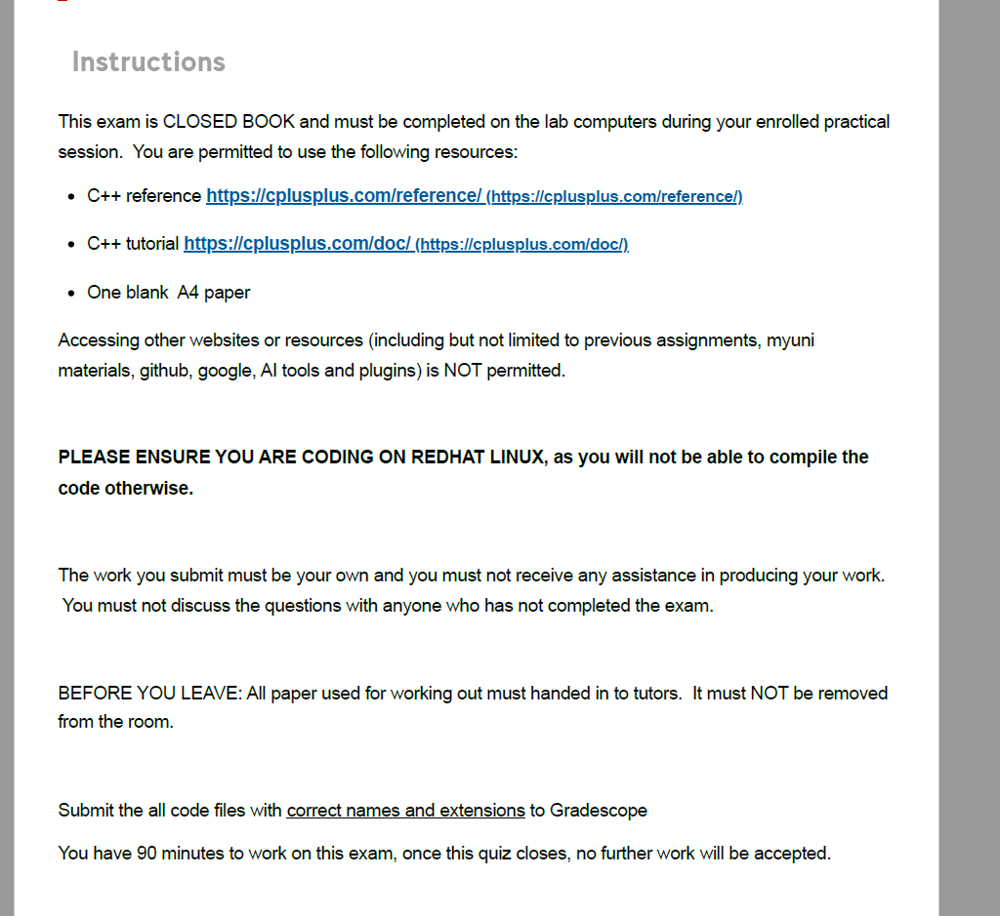


下面是图片里考试说明的“翻译＋怎么做”：

# 这是什么意思

- **闭卷（CLOSED BOOK）**，且**必须在实验室电脑**、你所选的实操课时段内完成。
- **只允许使用的资源：**
  1. C++ 参考手册：https://cplusplus.com/reference/
  2. C++ 教程：https://cplusplus.com/doc/
  3. **一张空白 A4 纸**（仅作草稿，不能带有任何笔记）。
- **任何其他网站或资料都不允许**（包括但不限于：往年/之前的作业、MyUni 资料、GitHub、Google、各类 **AI 工具与插件** 等）。
- **务必在 Red Hat Linux 上编程与编译**，否则代码无法通过编译环境。
- **独立完成**：提交的工作必须是你本人完成的，不能接受他人帮助；未完成考试的人也不能与之讨论题目。
- **离开前**：所有草稿纸**交回助教**，**不能带出考场**。
- **提交方式**：把**全部代码文件**按**正确的文件名与扩展名**提交到 **Gradescope**。
- **时长 90 分钟**；测验关闭后不再接收任何提交。

# 你应该怎么做（实操清单）

**考前准备**

1. 熟悉 Red Hat Linux 终端：`mkdir`/`cd`/`code`或`vim`/`nano`。
2. 会本地编译运行 C++：
   - 编译：`g++ -std=c++17 -O2 -Wall -Wextra -o main main.cpp`
   - 运行：`./main`
3. 练习在 cplusplus.com **查找语法与库函数**（如 `std::vector`, `std::map`, `string`, I/O 等）。
4. 知道 Gradescope 的基本提交流程（如何上传多个文件、如何确认提交成功）。

**考试中流程（建议）**

1. 登录实验室电脑 → 打开 **Red Hat Linux** 终端。
2. 新建目录并创建源文件：`mkdir exam && cd exam && touch main.cpp`。
3. 编写与自测：边写边用上面的 `g++` 命令编译、运行、用自造样例测试。
4. **按要求命名文件**（例如题目可能要求 `q1.cpp`、`utils.h` 等；**文件扩展名要正确**：`.cpp`/`.h`/`.txt`）。
5. 在 **Gradescope** 提交：把**所有需要的文件**一次性上传；提交后**查看回执/编译结果**确认无误。
6. 交回**所有草稿纸**给助教，再离开。

**注意/易错点**

- 不要打开除 cplusplus.com 以外的网站（包括搜索引擎、GitHub、AI/插件等）。
- 不要使用不受支持的标准或特性（用 `-std=c++17` 较稳妥）。
- 提交时**别漏文件**（例如头文件、多个题目的源文件、数据文件等）。
- 文件名**必须精确匹配**要求（大小写、下划线都算）。
- 考试结束前留 **5–10 分钟**做一次“能编译、能运行、已提交成功”的总检查。

如果你愿意，我现在就可以陪你**演练一次 Linux 编译与 Gradescope 提交流程**，以及做一个**C++ 模板（main 函数＋快速读写）**，方便你考试时直接开写。**但请注意：正式考试时不得再使用我或任何 AI 工具。**


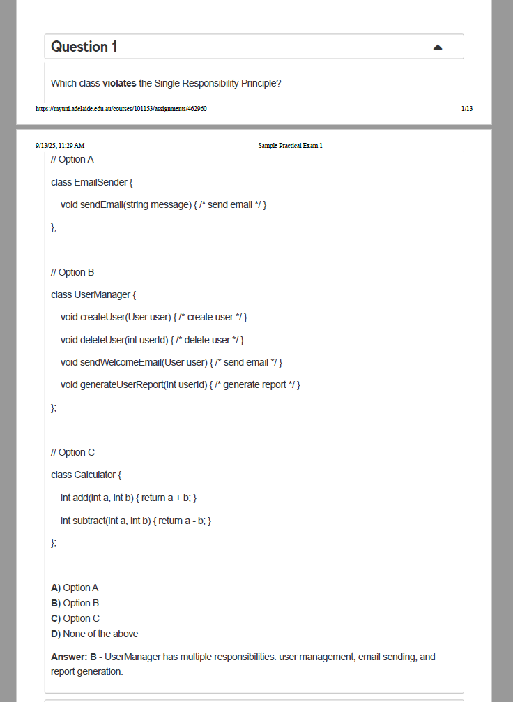


这是在考察**单一职责原则（SRP, Single Responsibility Principle）**：

> 一个类应该**只有一个引起它变化的原因**。换句话说，一个类只负责一类事情。

### 题目在说什么？

问的是：**哪个类违反了 SRP？**

- **Option A: `EmailSender`**
   只有 `sendEmail(...)` 一件事 → 只有“发邮件”这一个变化原因，**不违背** SRP。
- **Option B: `UserManager`**
   同时做了：
  1. 用户创建/删除（用户管理）
  2. 发送欢迎邮件（邮件发送）
  3. 生成用户报告（报表/报告）
      这是**三类不同职责**，会被三种不同需求更改触发修改（业务改了用户创建流程、邮件模板变了、报表格式调整等）。
      → **违反 SRP（正确答案）**。
- **Option C: `Calculator`**
   `add`/`subtract` 都是“算术运算”这同一类职责，变化原因一致（运算规则变了才一起变），**不违背** SRP。

**所以答案：B。**（题图最后一行也给出了这个结论）

------

## 为什么 B 错？再直观一点

设想产品提出三种改动：

- “欢迎邮件模板要改成多语言。”——影响**发邮件**逻辑
- “删用户要软删除而不是硬删除。”——影响**用户管理**逻辑
- “用户报告里要加最近活跃度曲线。”——影响**报表**逻辑

这三件事互不相干，但都要去改 `UserManager`，导致类越来越庞大、耦合、难测。典型的 SRP 违反。

------

## 正确该怎么做（重构思路）

把不同职责**拆分**，由一个上层服务**协作/委派**：

```java
class UserRepository {        // 只管用户的持久化/增删改查
    void createUser(User user) { /* ... */ }
    void deleteUser(int userId) { /* ... */ }
}

class EmailSender {           // 只管发邮件
    void sendEmail(String to, String subject, String body) { /* ... */ }
}

class WelcomeEmailService {   // 只管欢迎邮件的业务封装（可复用 EmailSender）
    private final EmailSender emailSender;
    void sendWelcome(User user) { /* build template & emailSender.sendEmail(...) */ }
}

class UserReportService {     // 只管用户报告生成
    String generateReport(int userId) { /* ... */ return report; }
}

// 可选的协调者：负责“编排”，自己不做具体活
class UserService {
    private final UserRepository repo;
    private final WelcomeEmailService welcomeEmail;
    private final UserReportService reportService;

    void register(User user) {
        repo.createUser(user);
        welcomeEmail.sendWelcome(user);
    }
    void remove(int userId) { repo.deleteUser(userId); }
    String getReport(int userId) { return reportService.generateReport(userId); }
}
```

这样每个类**只有一种原因会变**，测试也更独立；上层 `UserService` 只是**协调**，职责依然单一（“用户相关用例的编排”）。

------

## 考场“怎么做”小技巧

1. **列职责**：快速罗列这个类在做“几类事”。超过 1 类就警惕。
2. **问原因**：这个类会因为**几种不同的业务变化**而被修改？超过 1 种就不单一。
3. **看依赖**：是否同时依赖“数据库/网络/报表/模板”等多种外部模块？通常意味着多职责。
4. **选项对比**：
   - 只做一件事（A/C）→ 合格；
   - 又管数据又管 IO 又管格式化（B）→ 多半不合格。

------

如果你愿意，我可以把你自己的代码片段发来，我按 SRP 帮你做一次“职责拆分”和单元测试边界划分。


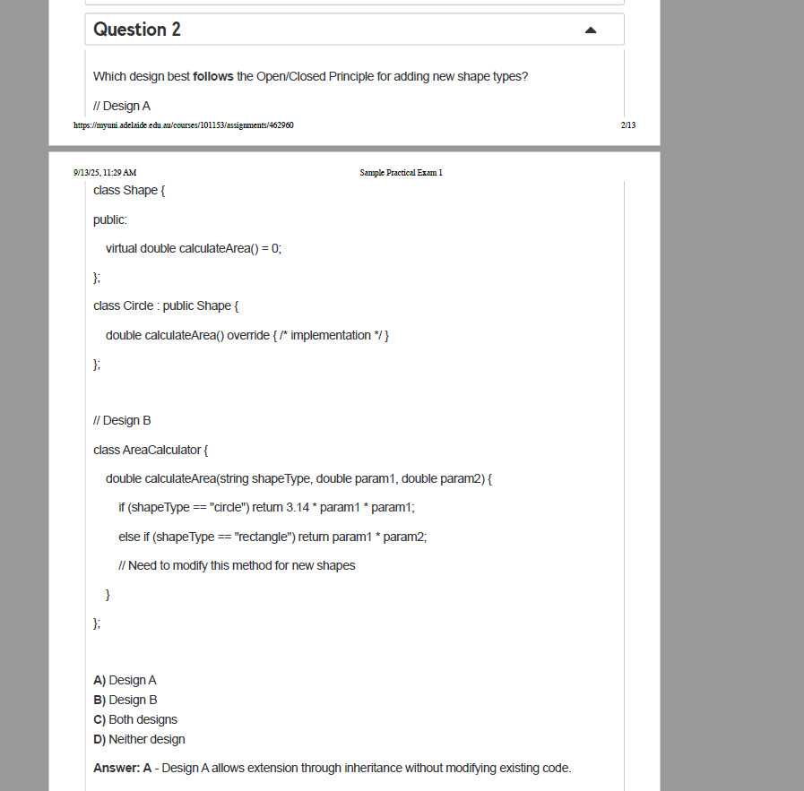


题目在问：**为了给系统“新增图形类型”，哪种设计更符合“开闭原则（Open/Closed Principle, OCP）”？**
 OCP 的核心：**对扩展开放、对修改关闭**——添加新能力时，应尽量**新增代码**而不是**改动已有代码**。

## 两个设计在做什么

### Design A（抽象基类 + 多态）

```cpp
class Shape {
public:
    virtual double calculateArea() = 0; // 纯虚函数
};

class Circle : public Shape {
    double calculateArea() override { /* 实现 */ }
};
```

含义：规定所有图形都要实现 `calculateArea()`。新增一个图形（如 `Rectangle`、`Triangle`）时，**只需新建一个子类**并实现该函数，**不必改**已有类。

### Design B（类型字符串 + if/else 分支）

```cpp
class AreaCalculator {
    double calculateArea(string shapeType, double p1, double p2) {
        if (shapeType == "circle") return 3.14 * p1 * p1;
        else if (shapeType == "rectangle") return p1 * p2;
        // 新图形要在这里继续加分支 → 需要修改此方法
    }
};
```

含义：通过 `shapeType` 判断分支。每增加一种图形，就**必须修改**`calculateArea()`，把新的 `else if` 分支写进去。

## 哪个符合 OCP？

**选 A（Design A）**。
 原因：A 通过**继承 + 多态**实现“对扩展开放、对修改关闭”。新增图形 = 新建一个子类并实现 `calculateArea()`，**不动旧代码**。
 B 方案每加一种图形都要**改**`AreaCalculator`，违反 OCP；而且用字符串/分支判断是典型“反多态”味道，易错、难维护。

**标准答案：A。**（截图里也写了：Design A 允许通过继承扩展而不修改已有代码。）

## “怎么做”（实际写法范例）

若在考题让你实现，可写成这样（C++17）：

```cpp
struct Shape {
    virtual ~Shape() = default;
    virtual double area() const = 0;
};

struct Circle : Shape {
    double r;
    explicit Circle(double r): r(r) {}
    double area() const override { return 3.141592653589793 * r * r; }
};

struct Rectangle : Shape {
    double w, h;
    Rectangle(double w, double h): w(w), h(h) {}
    double area() const override { return w * h; }
};

// 使用
// std::vector<std::unique_ptr<Shape>> shapes;
// shapes.push_back(std::make_unique<Circle>(2.0));
// shapes.push_back(std::make_unique<Rectangle>(3.0, 4.0));
// double total = 0; for (auto& s : shapes) total += s->area();
```

以后要加 `Triangle`，只需再写一个 `struct Triangle : Shape { ... area() ... };`，无需改动现有类或调用处，符合开闭原则。

> 考场速记：看到“根据类型字符串/枚举做一堆 if/switch”的，通常**不符合 OCP**；看到“抽象接口 + 派生类 override”的，通常**符合 OCP**。


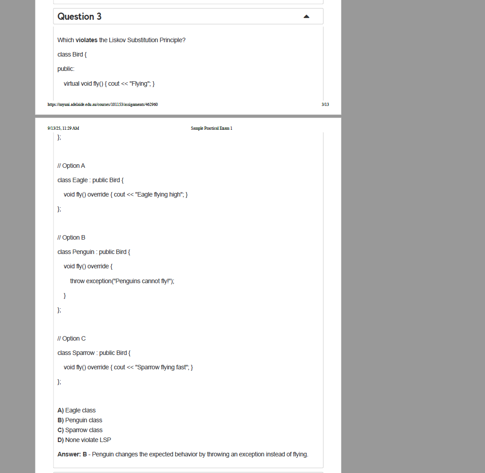

这是在考**里氏替换原则（LSP）**：

> 任何使用基类对象的地方，都应该能透明地替换成它的子类对象，而**不改变**程序原有的正确性与期望行为。

### 题目在说什么？

基类：

```cpp
class Bird {
public:
    virtual void fly() { cout << "Flying"; }
};
```

这相当于 **对所有 Bird 做出“能飞且会飞起来”的承诺**。

三个子类：

- **A) Eagle**：`fly()` 输出“Eagle flying high”——仍然是“会飞”。✅ 符合 LSP
- **B) Penguin**：`fly()` 里 **抛异常** “Penguins cannot fly!”——当作 Bird 使用时，原本“会飞”的期待被破坏。❌ 违反 LSP
- **C) Sparrow**：`fly()` 输出“飞得快”——行为仍是“会飞”。✅ 符合 LSP

**正确答案：B（Penguin）。**因为基类没有声明会抛异常，且含义是“能飞”；子类却把“飞”的契约改成“报错不能飞”，替换后会让原本依赖“Bird 会飞”的代码失败，这就是 LSP 违背。

------

## 为什么会出这种错？

设计把“能飞”这种**并非所有鸟都具备的能力**放进了 `Bird` 的通用接口里，于是**不可飞的企鹅**只能用异常“顶上”，从而破坏 LSP。

------

## 正确设计怎么做？

### 方案 1：拆分接口（更贴近 ISP/LSP）

```cpp
struct IFlyable {
    virtual ~IFlyable() = default;
    virtual void fly() = 0;
};

class Bird { /* 通用鸟的属性/行为：eat(), layEggs() 等 */ };

class Eagle   : public Bird, public IFlyable { void fly() override { /* ... */ } };
class Sparrow : public Bird, public IFlyable { void fly() override { /* ... */ } };
class Penguin : public Bird { /* 没有 fly()，不会飞 */ };
```

使用处只在“需要会飞”的地方依赖 `IFlyable`，不会把企鹅误当成会飞的鸟。

### 方案 2：策略模式（能力由组合决定）

```cpp
struct FlyBehavior { virtual void fly() = 0; };
struct HighFly : FlyBehavior { void fly() override { /* 高飞 */ } };
struct FastFly : FlyBehavior { void fly() override { /* 快飞 */ } };
struct NoFly  : FlyBehavior { void fly() override { /* 什么也不做，或不提供该行为 */ } };

class Bird {
public:
    explicit Bird(std::unique_ptr<FlyBehavior> fb) : flyBehavior(std::move(fb)) {}
    void performFly() { flyBehavior->fly(); }   // 只有“能飞”的鸟才提供这个入口
private:
    std::unique_ptr<FlyBehavior> flyBehavior;
};

Bird eagle{std::make_unique<HighFly>()};
Bird sparrow{std::make_unique<FastFly>()};
Bird penguin{std::make_unique<NoFly>()}; // 客户端不应该依赖 performFly()，或根本不给它暴露
```

通过组合让“是否能飞”成为可变能力，而不是硬塞进所有鸟。

> 如果一定要保留 `fly()` 在基类里，那就必须把契约改成：“**并非保证会飞**，可能抛出 NotSupported/不做任何事”。但这会迫使所有使用者都加判断，体验差，也更容易出错——通常不推荐。

------

## 做题技巧（快速判断 LSP 是否被破坏）

1. **看契约是否被改变**：子类是否把“会做 X”变成“不做/报错/换成别的行为”。
2. **看异常**：基类没说会抛，子类新增/扩大异常范围，是常见的 LSP 违背信号。
3. **看前置/后置条件**：子类是否**更苛刻的前置条件**或**更弱的后置保证**。
4. **想象替换场景**：把子类对象塞到本来需要基类的地方，代码还会按原期望运行吗？

需要的话，把你的代码/题目发来，我可以按 LSP 给你改一版“不会飞的企鹅”设计 👍。


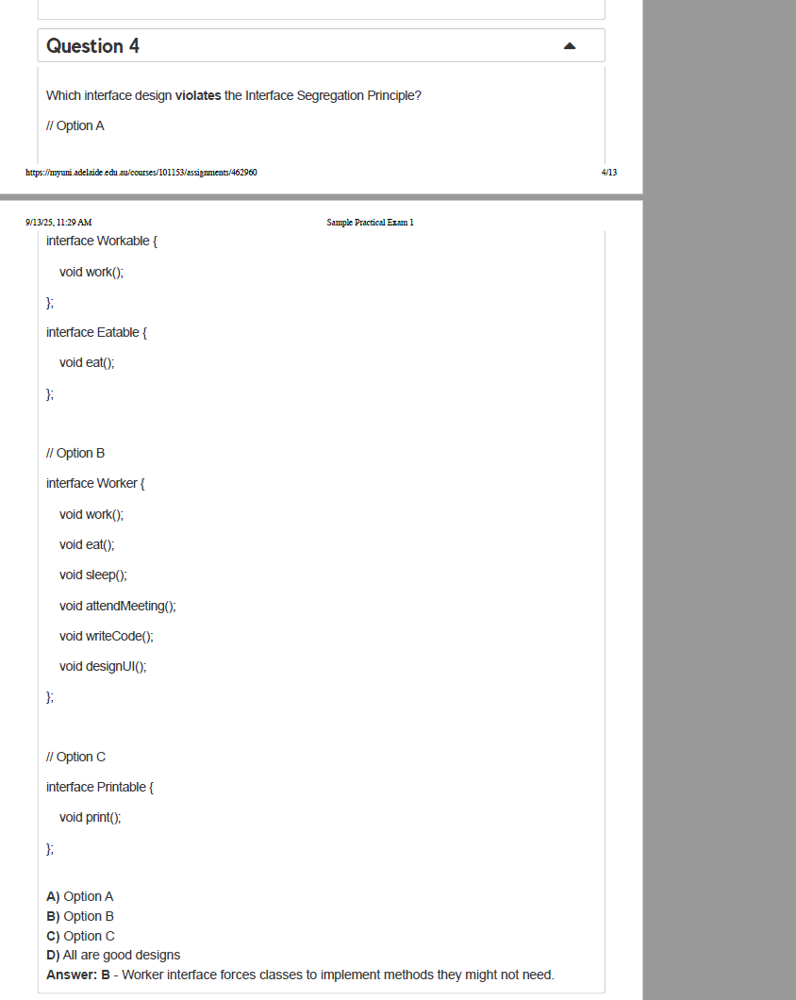

这题在问：**哪个接口设计违反了“接口隔离原则（ISP）”？**

## 先搞清楚 ISP 是啥

接口隔离原则：**客户端不应该被迫依赖它不需要的方法**。
 做法：把“大而全”的胖接口拆成**小而专一**的接口（role-based），类只实现自己**真正需要**的接口。

## 选项逐个看

### Option A

```java
interface Workable { void work(); }
interface Eatable  { void eat();  }
```

小而单一的接口，类可以按需实现（比如某些类只 `work`，不必 `eat`）。✅ **符合 ISP**

### Option B

```java
interface Worker {
    void work();
    void eat();
    void sleep();
    void attendMeeting();
    void writeCode();
    void designUI();
}
```

把**不相关的职责**都塞在一个接口里。很多实现者（例如 UI 设计师）可能不需要 `writeCode()`；后勤人员不需要 `designUI()`……
 被迫实现无关方法，只能空实现或抛异常 → **典型“胖接口”**。❌ **违反 ISP**（正确答案）

### Option C

```java
interface Printable { void print(); }
```

同样是单一职责接口。✅ **符合 ISP**

**答案：B（Option B）**。题图下方给的标准答复也是这个结论：Worker 接口强迫实现者实现可能用不到的方法。

------

## “怎么做”（重构思路与范例）

把 Option B 拆成**按角色**的若干小接口，再由需要的类**按需组合**：

```java
interface Workable { void work(); }
interface Eatable  { void eat(); }
interface Sleepable { void sleep(); }
interface MeetingParticipant { void attendMeeting(); }
interface CodeWritable { void writeCode(); }
interface UIDesignable { void designUI(); }

// 具体类只实现自己需要的接口
class Developer implements Workable, MeetingParticipant, CodeWritable {
    public void work() { /* ... */ }
    public void attendMeeting() { /* ... */ }
    public void writeCode() { /* ... */ }
}

class Designer implements Workable, MeetingParticipant, UIDesignable {
    public void work() { /* ... */ }
    public void attendMeeting() { /* ... */ }
    public void designUI() { /* ... */ }
}

class Intern implements Workable, Eatable, Sleepable {
    public void work() { /* ... */ }
    public void eat() { /* ... */ }
    public void sleep() { /* ... */ }
}
```

### 实战答题小技巧

- 看到**一个接口方法很多、且职责混杂**（吃饭/睡觉/写代码/开会/设计UI 全在一起），基本就是**违反 ISP**。
- 看到**单一功能或按角色拆分**的小接口，通常是**符合 ISP**。
- 如果你需要“新增职责”，**新增接口**而不是给旧接口加方法。


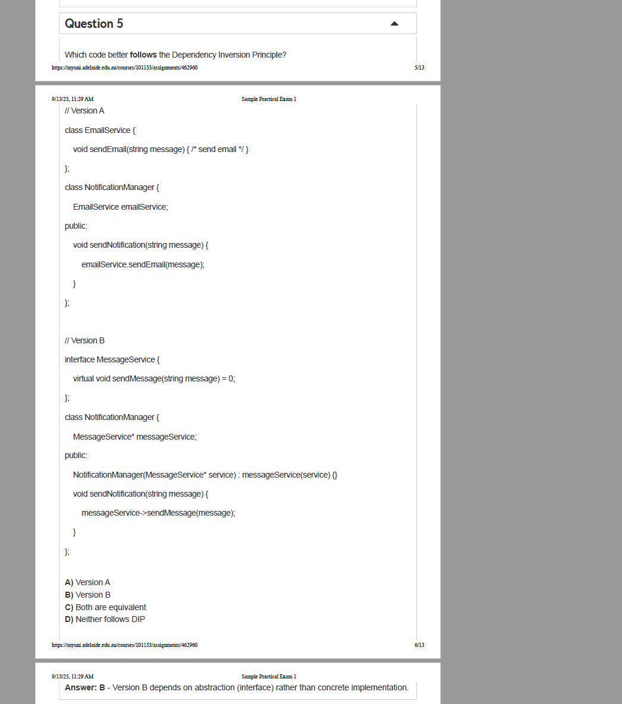

这是在考**依赖倒置原则（DIP, Dependency Inversion Principle）**。

> **DIP 定义**
>
> - 高层模块（业务编排/策略）**不应该依赖**低层模块（具体实现/细节）；二者都应该**依赖抽象**。
>
> - **抽象不应该依赖细节**；**细节应该依赖抽象**。
>
> - DIP 的核心是 **“解耦”**，包含两条关键规则：
>
>   1. 高层模块（如业务逻辑层）不应依赖低层模块（如具体功能实现层），**两者都应依赖抽象（接口/抽象类）**；
>   2. 抽象（接口/抽象类）不应依赖细节（具体实现类），**细节（具体实现类）应依赖抽象**。
>
>   简单来说：**不要让代码“硬绑定”到具体实现，而是通过抽象（接口）来交互**，这样系统更灵活（比如替换通知方式时，无需改高层代码）。

------

## 两个版本在做什么？

### Version A

```cpp
class EmailService {
    void sendEmail(string message) { /* ... */ }
};
class NotificationManager {
    EmailService emailService; // 直接持有具体类
public:
    void sendNotification(string message) {
        emailService.sendEmail(message);
    }
};
```

- `NotificationManager`（高层）**直接依赖具体类** `EmailService`（低层）。
- 想换成短信/推送，就必须**改动** `NotificationManager`，耦合度高、难测试（不好打桩/替身）。
- ⇒ **不符合 DIP**。

### Version B

```cpp
interface MessageService {
    virtual void sendMessage(string message) = 0;
};
class NotificationManager {
    MessageService* messageService; // 依赖抽象
public:
    NotificationManager(MessageService* service) : messageService(service) {}
    void sendNotification(string message) {
        messageService->sendMessage(message);
    }
};
```

- 定义抽象 `MessageService`，高层 `NotificationManager` **只依赖接口**。
- Email/SMS/Slack 等**具体实现去实现该接口**，在构造时**注入**进来。
- 替换实现不改高层代码，易扩展、易单测（可以注入 Mock）。
- ⇒ **符合 DIP**。
   **因此答案选：B。**

------

## 正确“怎么做”（写法建议）

更健壮的 C++ 写法（带析构 & 智能指针）：

```cpp
struct MessageService {
    virtual ~MessageService() = default;
    virtual void sendMessage(const std::string& msg) = 0;
};

class EmailService : public MessageService {
public:
    void sendMessage(const std::string& msg) override { /* send email */ }
};
class SmsService : public MessageService {
public:
    void sendMessage(const std::string& msg) override { /* send sms */ }
};

class NotificationManager {
    std::shared_ptr<MessageService> svc;        // 依赖抽象
public:
    explicit NotificationManager(std::shared_ptr<MessageService> s) : svc(std::move(s)) {}
    void sendNotification(const std::string& msg) { svc->sendMessage(msg); }
};

// 使用：随时替换实现
auto nm1 = NotificationManager(std::make_shared<EmailService>());
nm1.sendNotification("Hello by email");
auto nm2 = NotificationManager(std::make_shared<SmsService>());
nm2.sendNotification("Hello by sms");
```

**单元测试（Mock 注入）：**

```cpp
class FakeService : public MessageService {
public:
    std::string last;
    void sendMessage(const std::string& msg) override { last = msg; }
};
// 测试时注入 FakeService，不需要真正发消息
```

------

## 记忆要点 / 考场速判

- **字段或 `new` 出来的是具体类** → 大概率**违背 DIP**。
- **字段/参数类型是接口/抽象类**，由外部**依赖注入（DI）** → 符合 DIP。
- 想到“**高层依赖抽象，细节实现抽象**”，就能快速选出 Version B。


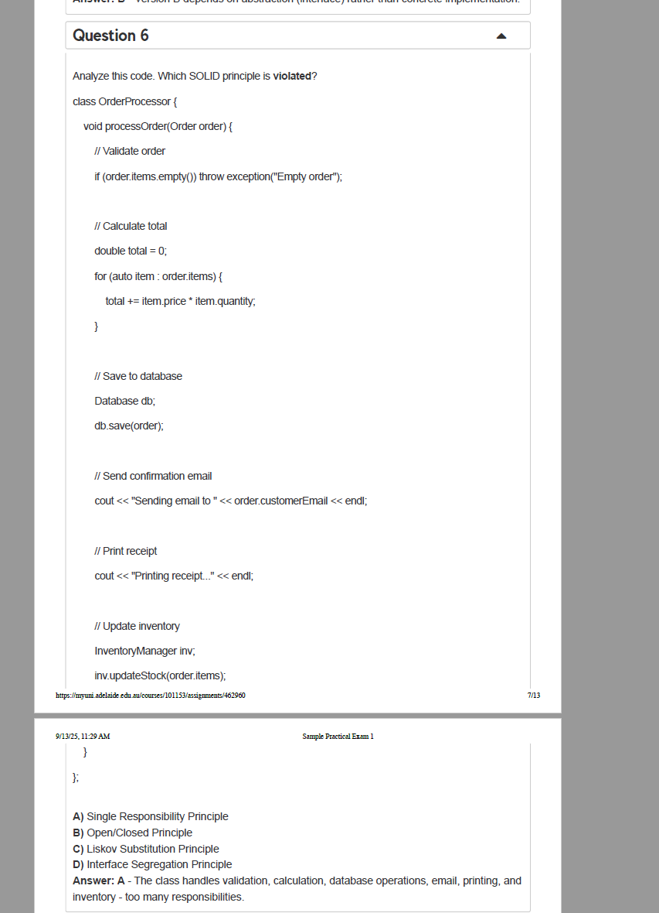

这题在让你判断：下面这段 `OrderProcessor::processOrder` 代码**违反了哪个 SOLID 原则**。

> ### SOLID 原则详解
> SOLID 是面向对象编程（OOP）中的五个核心设计原则的首字母缩写，由 Robert C. Martin（Uncle Bob）提出，旨在帮助开发者编写可维护、可扩展、可复用的高质量代码。下面我们逐一解释每个原则的含义、目的和示例。
> ---
> ## 一、S - 单一职责原则（Single Responsibility Principle, SRP）
> ### 核心定义  
> **一个类应该只有一个引起它变化的原因**。换句话说，一个类只负责一项职责（功能），不要将多个不同的功能耦合在一个类中。
> ### 目的  
> - 降低类的复杂度：每个类只关注一件事，逻辑更清晰；  
> - 提高可维护性：修改某个职责时，不会影响其他职责；  
> - 增强可复用性：单一职责的类更容易被其他模块复用。
> ### 示例  
> #### 违反 SRP 的代码  
> ```java
> class User {
>     private String name;
>     private String email;
>     // 职责1：管理用户信息（getter/setter）
>     public String getName() { return name; }
>     public void setName(String name) { this.name = name; }
>     // 职责2：处理用户数据持久化（数据库操作）
>     public void saveToDatabase() {
>         // JDBC 代码保存用户到数据库...
>     }
>     // 职责3：发送邮件通知
>     public void sendEmail(String message) {
>         // 邮件发送逻辑...
>     }
> }
> ```
> **问题**：`User` 类同时承担了用户信息管理、数据持久化、邮件发送三个职责，修改其中一个职责（比如更换数据库）可能影响其他功能。
> #### 遵循 SRP 的优化  
> 将不同职责拆分到独立的类中：  
> ```java
> // 职责1：用户信息管理
> class User {
>     private String name;
>     private String email;
>     // getter/setter...
> }
> // 职责2：数据持久化
> class UserRepository {
>     public void save(User user) {
>         // JDBC 代码保存用户到数据库...
>     }
> }
> // 职责3：邮件发送
> class EmailService {
>     public void sendEmail(String email, String message) {
>         // 邮件发送逻辑...
>     }
> }
> ```
> **优势**：每个类只负责一项职责，修改数据库操作只需改 `UserRepository`，不会影响 `User` 或 `EmailService`。
> ---
> ## 二、O - 开闭原则（Open/Closed Principle, OCP）
> ### 核心定义  
> **软件实体（类、模块、函数等）应该对扩展开放，对修改关闭**。  
> - 对扩展开放：允许通过新增代码（如新类、新方法）来扩展功能；  
> - 对修改关闭：不允许修改已有的稳定代码（避免破坏现有逻辑）。
> ### 目的  
> - 降低维护成本：扩展功能时无需修改已有代码，减少引入 bug 的风险；  
> - 提高灵活性：通过抽象或多态实现动态扩展，适应需求变化。
> ### 示例  
> #### 违反 OCP 的代码  
> ```java
> class Shape {
>     private String type;
>     public Shape(String type) { this.type = type; }
>     // 计算面积：每新增一种形状，都需要修改这个方法
>     public double calculateArea() {
>         if (type.equals("circle")) {
>             return Math.PI * radius * radius; // 假设有 radius 属性
>         } else if (type.equals("rectangle")) {
>             return width * height; // 假设有 width/height 属性
>         }
>         return 0;
>     }
> }
> ```
> **问题**：新增 `Triangle` 形状时，必须修改 `calculateArea()` 方法，违反了对修改关闭”的原则。
> #### 遵循 OCP 的优化  
> 通过抽象和多态扩展功能：  
> ```java
> // 抽象接口：定义形状的通用行为
> interface Shape {
>     double calculateArea();
> }
> // 具体形状类：实现接口
> class Circle implements Shape {
>     private double radius;
>     public Circle(double radius) { this.radius = radius; }
>     @Override public double calculateArea() { return Math.PI * radius * radius; }
> }
> class Rectangle implements Shape {
>     private double width, height;
>     public Rectangle(double width, double height) { this.width = width; this.height = height; }
>     @Override public double calculateArea() { return width * height; }
> }
> // 新增三角形：无需修改已有代码，直接新增类
> class Triangle implements Shape {
>     private double base, height;
>     public Triangle(double base, double height) { this.base = base; this.height = height; }
>     @Override public double calculateArea() { return 0.5 * base * height; }
> }
> ```
> **优势**：新增形状时只需添加新类（如 `Triangle`），无需修改 `Shape` 接口或已有形状类，符合对扩展开放，对修改关闭”。
> ---
> ## 三、L - 里氏替换原则（Liskov Substitution Principle, LSP）
> ### 核心定义  
> **子类必须能够替换其父类，并且不破坏程序的正确性**。  
> 即：父类出现的地方，子类一定能出现，且替换后程序行为与预期一致。
> ### 目的  
> - 确保继承的合理性：避免子类破坏父类的语义，保证多态的正确性；  
> - 增强代码健壮性：防止因子类特殊行为导致运行时错误。
> ### 示例  
> #### 违反 LSP 的代码  
> ```java
> class Rectangle {
>     private double width, height;
>     public void setWidth(double width) { this.width = width; }
>     public void setHeight(double height) { this.height = height; }
>     public double getArea() { return width * height; }
> }
> // 正方形是矩形的特例（宽高相等），但直接继承矩形会出问题
> class Square extends Rectangle {
>     @Override public void setWidth(double width) {
>         super.setWidth(width);
>         super.setHeight(width); // 强制宽高相等
>     }
>     @Override public void setHeight(double height) {
>         super.setHeight(height);
>         super.setWidth(height); // 强制宽高相等
>     }
> }
> // 客户端代码：假设传入矩形，实际传入正方形
> void resizeRectangle(Rectangle rect) {
>     rect.setWidth(5);
>     rect.setHeight(4); // 对正方形来说，这里会同时修改宽为4，导致面积不是预期的 5*4=20
>     System.out.println(rect.getArea()); // 输出16（而非20），行为与预期不符
> }
> ```
> **问题**：`Square` 作为 `Rectangle` 的子类，无法替换父类（修改高时宽被同步修改），破坏了父类的语义，违反 LSP。
> #### 遵循 LSP 的优化  
> 通过抽象接口或组合替代继承：  
> ```java
> // 抽象接口：定义形状的通用行为
> interface Quadrilateral {
>     double getWidth();
>     double getHeight();
>     double getArea();
> }
> // 矩形实现接口
> class Rectangle implements Quadrilateral {
>     private double width, height;
>     public Rectangle(double width, double height) { this.width = width; this.height = height; }
>     @Override public double getWidth() { return width; }
>     @Override public double getHeight() { return height; }
>     @Override public double getArea() { return width * height; }
> }
> // 正方形独立实现接口（不继承矩形）
> class Square implements Quadrilateral {
>     private double side;
>     public Square(double side) { this.side = side; }
>     @Override public double getWidth() { return side; }
>     @Override public double getHeight() { return side; }
>     @Override public double getArea() { return side * side; }
> }
> // 客户端代码：依赖抽象接口，不关心具体实现
> void printArea(Quadrilateral quad) {
>     System.out.println(quad.getArea());
> }
> ```
> **优势**：`Rectangle` 和 `Square` 都实现 `Quadrilateral` 接口，彼此独立，替换时不会破坏程序行为。
> ---
> ## 四、I - 接口隔离原则（Interface Segregation Principle, ISP）
> ### 核心定义  
> **客户端不应该依赖它不需要的接口**。  
> 即：将大接口拆分为多个小而专的接口，客户端只需依赖自己用到的小接口。
> ### 目的  
> - 避免接口污染”：大接口包含客户端不需要的方法，迫使客户端实现无用代码；  
> - 降低耦合度：客户端只依赖必要的接口，减少因接口变更带来的影响。
> ### 示例  
> #### 违反 ISP 的代码  
> ```java
> // 大接口：包含所有动物行为
> interface Animal {
>     void eat();
>     void fly();
>     void swim();
> }
> // 鸟类实现接口：必须实现 swim()（但鸟不会游泳）
> class Bird implements Animal {
>     @Override public void eat() { System.out.println("Bird eats"); }
>     @Override public void fly() { System.out.println("Bird flies"); }
>     @Override public void swim() { throw new UnsupportedOperationException("Bird can't swim"); }
> }
> // 鱼类实现接口：必须实现 fly()（但鱼不会飞）
> class Fish implements Animal {
>     @Override public void eat() { System.out.println("Fish eats"); }
>     @Override public void fly() { throw new UnsupportedOperationException("Fish can't fly"); }
>     @Override public void swim() { System.out.println("Fish swims"); }
> }
> ```
> **问题**：`Bird` 和 `Fish` 被迫实现不需要的方法（`swim()`/`fly()`），导致冗余代码或异常。
> #### 遵循 ISP 的优化  
> 将大接口拆分为小接口：  
> ```java
> // 小接口1：进食行为
> interface Eatable {
>     void eat();
> }
> // 小接口2：飞行行为
> interface Flyable {
>     void fly();
> }
> // 小接口3：游泳行为
> interface Swimmable {
>     void swim();
> }
> // 鸟类：只依赖需要的接口（Eatable + Flyable）
> class Bird implements Eatable, Flyable {
>     @Override public void eat() { System.out.println("Bird eats"); }
>     @Override public void fly() { System.out.println("Bird flies"); }
> }
> // 鱼类：只依赖需要的接口（Eatable + Swimmable）
> class Fish implements Eatable, Swimmable {
>     @Override public void eat() { System.out.println("Fish eats"); }
>     @Override public void swim() { System.out.println("Fish swims"); }
> }
> ```
> **优势**：每个类只依赖自己需要的接口，无需实现无用方法，代码更简洁、耦合更低。
> ---
> ## 五、D - 依赖倒置原则（Dependency Inversion Principle, DIP）
> ### 核心定义  
> **高层模块不应依赖低层模块，两者都应依赖抽象；抽象不应依赖细节，细节应依赖抽象**。  
> - 高层模块：业务逻辑层（如 `NotificationManager`）；  
> - 低层模块：具体实现层（如 `EmailService`、`SMSService`）；  
> - 抽象：接口或抽象类（如 `MessageService`）；  
> - 细节：具体实现类（如 `EmailService`）。
> ### 目的  
> - 解耦高层与低层模块：通过抽象隔离，避免高层代码因低层实现变更而修改；  
> - 提高灵活性：低层实现可替换（如切换通知方式），无需修改高层逻辑。
> ### 示例  
> #### 违反 DIP 的代码（对应前文的 Version A）  
> ```java
> // 低层模块：具体邮件服务
> class EmailService {
>     public void sendEmail(String message) { /* 发邮件逻辑 */ }
> }
> // 高层模块：通知管理器（直接依赖低层具体类）
> class NotificationManager {
>     private EmailService emailService; // 依赖具体实现，而非抽象
>     public NotificationManager() {
>         this.emailService = new EmailService(); // 硬绑定，无法替换
>     }
>     public void sendNotification(String message) {
>         emailService.sendEmail(message); // 调用具体方法
>     }
> }
> ```
> **问题**：`NotificationManager` 直接依赖 `EmailService`，若要新增短信通知（`SMSService`），必须修改 `NotificationManager` 的代码（如新增 `SMSService` 成员变量），违反高层不应依赖低层”。
> #### 遵循 DIP 的优化（对应前文的 Version B）  
> ```java
> // 抽象接口：定义消息发送行为
> interface MessageService {
>     void sendMessage(String message);
> }
> // 低层模块1：邮件服务（实现抽象接口）
> class EmailService implements MessageService {
>     @Override public void sendMessage(String message) { /* 发邮件逻辑 */ }
> }
> // 低层模块2：短信服务（实现抽象接口）
> class SMSService implements MessageService {
>     @Override public void sendMessage(String message) { /* 发短信逻辑 */ }
> }
> // 高层模块：通知管理器（依赖抽象接口，而非具体实现）
> class NotificationManager {
>     private MessageService messageService; // 依赖抽象
>     // 通过构造函数注入抽象接口的实现（依赖注入）
>     public NotificationManager(MessageService service) {
>         this.messageService = service;
>     }
>     public void sendNotification(String message) {
>         messageService.sendMessage(message); // 调用抽象方法
>     }
> }
> ```
> **优势**：  
> - 高层模块 `NotificationManager` 依赖抽象 `MessageService`，不依赖具体实现；  
> - 低层模块（`EmailService`、`SMSService`）依赖抽象 `MessageService`；  
> - 扩展时只需新增实现类（如 `WeChatService`），无需修改 `NotificationManager`，符合对扩展开放，对修改关闭”。
> ---
> ## 总结：SOLID 原则的核心价值
> | 原则    | 核心思想                 | 解决的问题                           |
> | ------- | ------------------------ | ------------------------------------ |
> | **SRP** | 一个类只负责一项职责     | 类功能过于复杂，修改时影响其他功能   |
> | **OCP** | 对扩展开放，对修改关闭   | 需求变更时需修改已有代码，引入 bug   |
> | **LSP** | 子类必须能替换父类       | 继承破坏父类语义，导致多态行为异常   |
> | **ISP** | 客户端不依赖不需要的接口 | 大接口强迫客户端实现无用方法         |
> | **DIP** | 依赖抽象，不依赖具体实现 | 高层与低层模块强耦合，难以扩展和维护 |
> **最终目标**：通过 SOLID 原则，编写出 **高内聚、低耦合** 的代码，使系统更易维护、扩展和复用。
>
> --------------------------------
> 以上内容由AI生成，仅供参考和借鉴

代码里它同时做了：

- 校验订单（validate）
- 计算总价（calculate total）
- 写数据库（`Database db; db.save(order)`）
- 发邮件（确认邮件）
- 打印小票（`cout << "Printing receipt..."`）
- 更新库存（`InventoryManager inv.updateStock(...)`）

## 正确答案

**A) 单一职责原则（SRP, Single Responsibility Principle）** 被违反。
 **原因**：一个类只应有**一个**引起它变化的原因；而这个类承担了**太多职责**（验证、计算、持久化、邮件、打印、库存），这些任一变化都会迫使你修改 `OrderProcessor`。

> 其他选项为何不对

- **OCP**：虽然也不理想，但本题最直接的错误是“一个类干太多事”；考点锁定 SRP。
- **LSP/ISP**：与继承/接口拆分无关，代码里也没出现。

------

## “怎么做”——重构成单一职责 + 依赖倒置

把不同功能拆成**独立服务/接口**，`OrderProcessor` 只做**编排**（orchestration）。并通过**依赖注入**依赖抽象，避免在内部直接 `new` 具体实现。

### 参考结构（C++ 风格伪码）

```cpp
struct Order { /* items, customerEmail, ... */ };

struct IOrderValidator { virtual ~IOrderValidator()=default; virtual void validate(const Order&) const = 0; };
struct ITotalCalculator { virtual ~ITotalCalculator()=default; virtual double total(const Order&) const = 0; };
struct IOrderRepository { virtual ~IOrderRepository()=default; virtual void save(const Order&) = 0; };
struct IEmailService { virtual ~IEmailService()=default; virtual void sendConfirmation(const std::string& email, const Order&) = 0; };
struct IReceiptPrinter { virtual ~IReceiptPrinter()=default; virtual void print(const Order&, double total) = 0; };
struct IInventoryService { virtual ~IInventoryService()=default; virtual void updateStock(const Order&) = 0; };

class OrderProcessor {
public:
    OrderProcessor(IOrderValidator& v, ITotalCalculator& c, IOrderRepository& r,
                   IEmailService& e, IReceiptPrinter& p, IInventoryService& i)
        : validator(v), calculator(c), repo(r), email(e), printer(p), inventory(i) {}

    void processOrder(Order& order) {
        validator.validate(order);
        double t = calculator.total(order);
        repo.save(order);
        email.sendConfirmation(order.customerEmail, order);
        printer.print(order, t);
        inventory.updateStock(order);
    }
private:
    IOrderValidator& validator;
    ITotalCalculator& calculator;
    IOrderRepository& repo;
    IEmailService& email;
    IReceiptPrinter& printer;
    IInventoryService& inventory;
};
```

这样做的好处：

- **符合 SRP**：每个类只处理自己的职责；`OrderProcessor` 只是流程编排。
- **更易测试**：可用 mock/fake 替代各服务做单元测试。
- **对扩展开放（OCP）**：要换打印机、换邮件服务、换计价规则，只需**新增实现类**，不改 `OrderProcessor`。
- **依赖倒置（DIP）**：高层模块依赖的是**抽象接口**，不是具体实现。

### 实战小清单

1. 列出该类当前“原因列表”（哪些变化会让你改它）。
2. 每个原因拆成一个**小接口/服务**。
3. `OrderProcessor` 只组合这些接口并按顺序调用。
4. 用构造函数注入依赖；不要在方法里 `new` 具体类。
5. 给每个服务写独立测试；`OrderProcessor` 用 mock 测流程。

记住：看到一个类里既有业务规则又有 I/O（DB/网络/打印），**十有八九是 SRP 问题**。


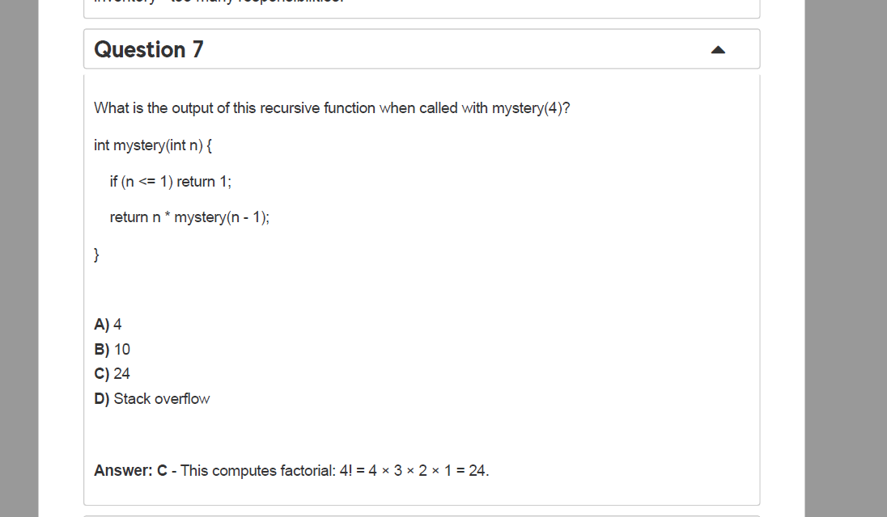


这是在考**递归**。给的函数：

```cpp
int mystery(int n) {
    if (n <= 1) return 1;     // 基线条件（终止条件）
    return n * mystery(n - 1); // 递归：把问题缩小到 n-1
}
```

它实际上在计算**阶乘 n!**。因为：

- 当 `n<=1` 返回 `1`（规定 1! = 1，0! = 1）。
- 否则返回 `n * (n-1)!`，这正是阶乘的定义：`n! = n * (n-1)!`。

------

## 手算 `mystery(4)` 的过程

一步步展开直到命中基线条件（`n<=1`）：

1. `mystery(4)`
    → `4 * mystery(3)`
2. `mystery(3)`
    → `3 * mystery(2)`
3. `mystery(2)`
    → `2 * mystery(1)`
4. `mystery(1)` 命中 `n <= 1`
    → `1`

把结果回代：
 `4 * (3 * (2 * 1)) = 4 * 3 * 2 * 1 = 24`

**正确选项：C) 24。**

------

## 为什么不是 “Stack overflow”？

有**终止条件** `if (n <= 1) return 1;`，`n` 每次减 1，很快到 1 就停止，所以不会无限递归。对于 `n=4` 只会递归 3 层，安全。

------

## 解这类题的通用思路（怎么做）

1. 找**终止条件**（基线）：`n <= 1` 返回什么？
2. 看递归式如何**缩小规模**：这里是 `n * f(n-1)`。
3. **从外到内展开**直到命中基线，然后**回代计算**。
4. 如果还拿不准，就把 `n=2、3` 先代入算一遍，找规律。

------

## 复杂度 & 小提示

- 时间复杂度：`O(n)` 次调用。
- 额外空间：调用栈 `O(n)`。`n` 很大时可能栈溢出；且 `int` 会**整数溢出**（比如 `13!` 在 32 位 `int` 就溢出），但与本题无关。

------

## 可选：非递归写法

```cpp
int fact(int n) {
    int ans = 1;
    for (int i = 2; i <= n; ++i) ans *= i;
    return ans;
}
```

同样得到 `fact(4) = 24`，没有递归栈，更安全。


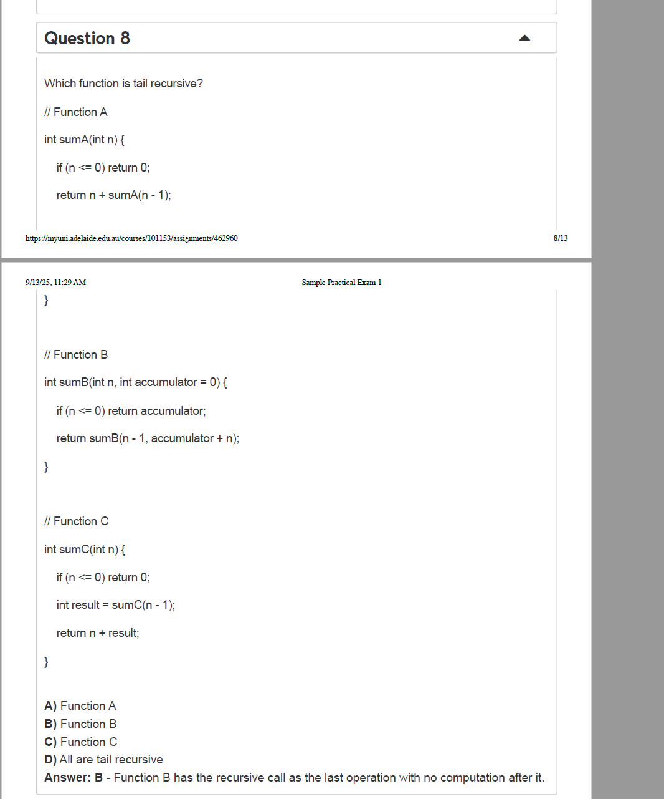

题目在问：**哪个函数是“尾递归”**（tail recursive）。

### 尾递归是什么意思？

如果一个函数在**最后一步**调用自己，并且**返回的就是该递归调用的结果**，之后没有任何额外计算（加减乘除、拼接、取 max/min、包装等），这就是尾递归。
 尾递归常可被编译器优化成循环，避免深层调用栈（但是否优化取决于编译器/编译选项）。

------

### 三个函数逐个看

**Function A**

```c
int sumA(int n) {
    if (n <= 0) return 0;
    return n + sumA(n - 1);
}
```

递归返回后还要做 `n + (...)` 的加法，**递归不是最后一步** ⇒ **不是尾递归**。

**Function B**

```c
int sumB(int n, int accumulator = 0) {
    if (n <= 0) return accumulator;
    return sumB(n - 1, accumulator + n);
}
```

`return` 的就是递归调用本身，之后**没有任何计算** ⇒ **是尾递归**。

**Function C**

```c
int sumC(int n) {
    if (n <= 0) return 0;
    int result = sumC(n - 1);
    return n + result;
}
```

先递归得到 `result`，然后再做 `n + result` 的加法 ⇒ **不是尾递归**。

**正确选项：B。**

------

### 为什么 B 是尾递归？（用 n=3 走一遍）

```
sumB(3,0) -> sumB(2,3) -> sumB(1,5) -> sumB(0,6) -> 返回 6
```

每一步都把“要做的工作”（累加）**提前放进参数**里，下一步直接返回递归调用；无需在返回后再计算。

对比 **A/C**（以 A 为例，n=3）：

```
sumA(3) = 3 + sumA(2)
        = 3 + (2 + sumA(1))
        = 3 + (2 + (1 + sumA(0)))
        = 3 + 2 + 1 + 0
```

加法都留在**回溯阶段**做，所以不是尾递归。

------

### “怎么做”：把非尾递归改成尾递归的一般方法

1. 找出递归返回后还要做的工作（这里是“加 n”）。
2. 把这份工作通过**额外参数（累加器）**传下去，让递归调用成为最后一步。

例如把 `sumA/sumC` 改写成尾递归：

```c
int sumTail(int n, int acc = 0) {
    if (n <= 0) return acc;
    return sumTail(n - 1, acc + n);
}
```

它等价的迭代版（一定不会爆栈）：

```c
int sumIter(int n) {
    int acc = 0;
    while (n > 0) { acc += n; --n; }
    return acc;
}
```

------

### 快速判断口诀

- 看递归调用是不是紧跟 `return`，**之后无运算、无组合、无包装**？是 ⇒ 尾递归。
- 只要有 “`return f(...) + x` / `g(f(...))`（其中 f 是递归）/ 先接收返回值再处理”，都**不是**尾递归。

所以本题选 **B**，并且理由如上。


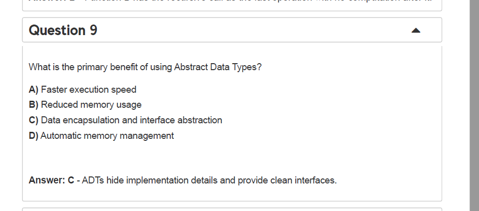


题目问：**使用抽象数据类型（ADT）的主要好处是什么？**
 正确答案：**C) 数据封装与接口抽象（Data encapsulation and interface abstraction）**。

## 这是什么意思

- **ADT（Abstract Data Type）**：用一组**操作的规格说明**（能做什么）来定义一种数据类型，而**不暴露内部表示**（怎么做）。
- **核心收益**：把“接口/行为”与“实现/表示”分离。使用者只依赖接口，内部实现可以替换而不影响外部代码。

### 为什么其他选项不对

- **A) 更快的执行速度**：ADT不必然更快，速度取决于具体实现与算法，非ADT本质。
- **B) 更少的内存占用**：同理，内存占用取决于实现方式（数组/链表…），不是ADT本身保证。
- **D) 自动内存管理**：那是**语言/运行时**（如GC、智能指针）提供的特性，与ADT概念无关。

## 一个简短例子（C++）

```cpp
// 接口层：定义“能做什么”
struct IStack {
    virtual ~IStack() = default;
    virtual void push(int x) = 0;
    virtual int  pop() = 0;
    virtual bool empty() const = 0;
};

// 实现层1：用 vector
class VectorStack : public IStack {
    std::vector<int> data;
public:
    void push(int x) override { data.push_back(x); }
    int pop() override { int v = data.back(); data.pop_back(); return v; }
    bool empty() const override { return data.empty(); }
};

// 客户端代码只依赖 IStack：
void foo(IStack& s) {
    s.push(1); s.push(2);
    while(!s.empty()) std::cout << s.pop() << "\n";
}
```

以后想把 `VectorStack` 换成“链表版 `ListStack`”，**外部 `foo` 完全不用改**——这就是 ADT 带来的**封装与抽象**。

## 考题“怎么做”（速选法）

1. 看到“ADT的主要好处/目的”，优先联想：**隐藏实现细节、暴露清晰接口** → 选 **C**。
2. 遇到性能/内存/GC之类的选项，通常是**干扰项**，ADT不直接保证这些。

> 记忆口决：**“ADT：看得见行为，看不见肚子（实现）。”**


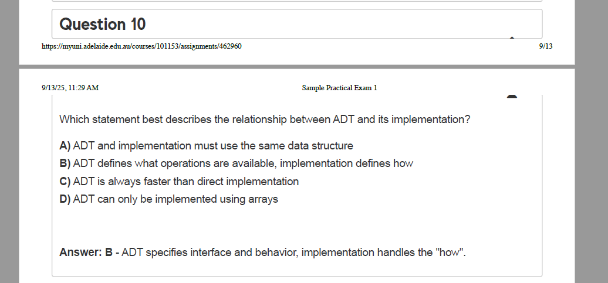

这是在考**抽象数据类型（ADT, Abstract Data Type）与其实现**的关系。

## 结论

**选 B**：**ADT 定义“能做什么（what）”，实现负责“怎么做（how）”。**

## 为什么

- **ADT**：只规定外部可见的**操作与语义**（如前置/后置条件、错误情况），不规定内部怎么存。
   例：**栈 Stack ADT** 有 `push(x)`, `pop()`, `top()`, `isEmpty()`，并保证“后进先出”。
- **实现**：选择具体的数据结构与算法来实现这些操作（数组、链表、树、哈希……），并由此决定时间/空间复杂度与工程细节。

## 各选项解析

- **A 错**：ADT 和实现**不需要**使用同一种数据结构。Stack 可用**数组**或**链表**实现。
- **B 对**：完全契合 ADT 的本质（接口/行为 vs. 实现/细节）。
- **C 错**：“总是更快/更慢”都是伪命题；**性能取决于具体实现**与使用场景。
- **D 错**：ADT 绝不局限于数组；同一个 ADT 可以有**多种**实现。

## 一个快速记忆法

看到关于 ADT 的题，锁定关键词：

- “接口/操作/语义/行为/不关心内部表示” → 说的是 **ADT**
- “数据结构/算法/表示/复杂度/存储细节” → 说的是 **实现**

## 小例子（展示 what / how 的分离）

```cpp
// WHAT: 栈 ADT 接口（只说明能做什么）
struct IStack {
  virtual void push(int x) = 0;
  virtual void pop() = 0;
  virtual int  top() const = 0;
  virtual bool empty() const = 0;
  virtual ~IStack() = default;
};

// HOW: 两种实现（细节不同，行为一致）
class ArrayStack : public IStack { /* 用动态数组/vector 实现 */ };
class ListStack  : public IStack { /* 用链表实现 */ };
```

客户端代码只依赖 `IStack`（ADT），无需知道究竟是数组栈还是链表栈。

------

**做题技巧**：凡是选项里出现“必须/只能/总是更快”这类绝对化描述，多半不是 ADT 的正确表述；选“定义操作是什么，具体实现决定如何做”的那一项就对了。


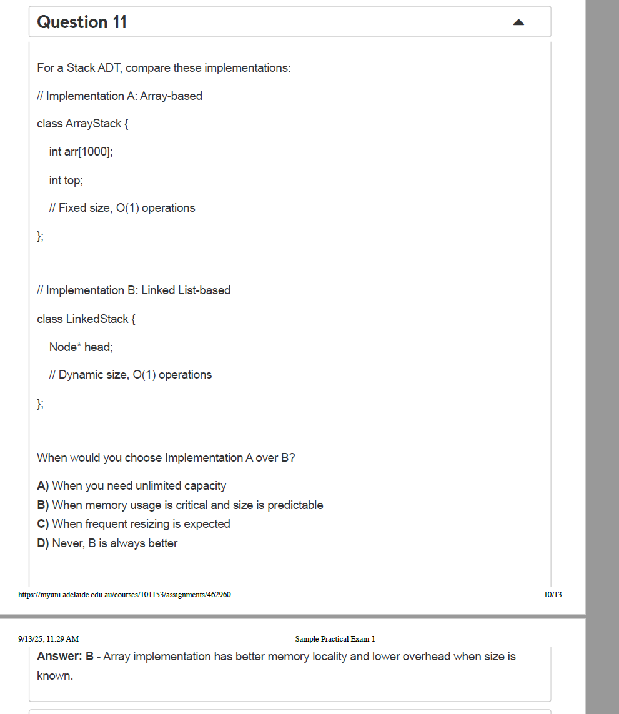


题目大意：比较两种 **Stack（栈）ADT** 的实现，何时选择 **实现A：定长数组** 而不是 **实现B：链表**？

给的代码要点：

- **实现A（ArrayStack）**：`int arr[1000]; int top;` 固定容量 1000，`push/pop/peek` 都是 O(1)。
- **实现B（LinkedStack）**：`Node* head;` 动态容量，`push/pop/peek` 也是 O(1)。

问：什么时候选 A 而不是 B？

正确答案：**B) 当内存使用很关键且大小可预估/可固定时**。

------

### 为什么选 B（数组优于链表的场景）

1. **更好的内存局部性（cache 友好）**
    数组元素连续存放，CPU 读写命中率高，常数开销小；链表需要“指针跳转”，缓存命中率差。
2. **更低的内存开销**

- 数组只存数据：1000 个 `int` ≈ 4,000B。
- 链表每个节点至少有一个指针（x64 通常 8B）＋对齐开销：1 个 `int`(4B) + 1 个指针(8B) → 通常对齐成 **16B/节点**。
   1000 个元素 ≈ **16KB**（不含分配器元数据），是数组的 4 倍左右。

1. **已知上限时无需扩容**
    题中 A 是 **固定容量**，如果最大深度已知且不会超过（比如算法里已知上界 N），数组实现简单高效。

------

### 其他选项为什么错

- **A) 需要无限容量**
   实现A是定长 `arr[1000]`，不是无限。真正要“无上限/不确定上限”，更适合链表或“可扩展数组”（如 `std::vector`），但题目给的 A 不是可扩展数组。
- **C) 频繁调整大小**
   定长数组没有“调整大小”这一说；如果说的是动态数组扩容，那也不是题中 A。链表在逻辑上是“每次 push 分配一个节点”，不存在整体扩容代价。
- **D) 永远 B 更好**
   不对。链表的动态性是优点，但它的内存/速度常数开销更大；当**容量可预测且内存/性能敏感**时，数组更好。

------

### 实战选择小抄

- **已知最大深度、有固定上限、追求速度/节省内存** → **数组栈（A）**
- **上限未知/可能很大、不能预分配、希望 push 永不“满”** → **链表栈（B）**
- **上限未知但希望数组的局部性** → 用**动态数组**（如 `vector`）做栈：均摊 O(1) `push`，偶尔扩容。

**结论：** 这题选 **B**，理由是数组在“大小可预估时”拥有更好的缓存局部性和更低的内存/常数开销。


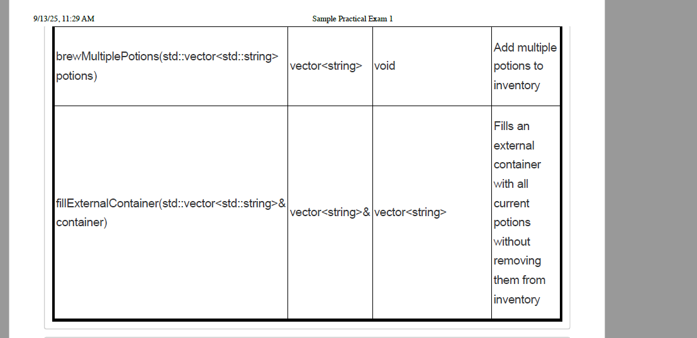


下面这题要你做一个“魔法药水库存（Magic Potion Inventory）”，把功能写在**类 `PotionCraft`**里，并分到 **`practice1.h`**（声明）和 **`practice1.cpp`**（实现）。

## 要求逐条解释

- 用 **`std::vector<std::string>`** 保存药水名字，**按酿造顺序**追加。
- **`brewPotion(name)`**：可以酿造任意药水（含重复），把 `name` 追加进库存。
- **`consumePotion(name)`**：按名字**消耗一个药水**（若有重复，只删**第一次出现**的那个），并**返回被删的名字**。若不存在，返回空串 `""`。
- **`brewMultiplePotions(vector<string> potions)`**：一次加入多种药水，按 `potions` 中的**顺序**追加。
- **`fillExternalContainer(vector<string>& container)`**：把**当前库存**复制到一个**外部容器**（按引用传入）里，等于是把库存的元素**append** 到 `container` 尾部；**库存本身不改变**。按题表格，它**返回一个 `vector<string>`**（可以返回容器的副本）。

------

## 参考实现

### `practice1.h`

```cpp
#pragma once
#include <string>
#include <vector>

class PotionCraft {
public:
    // 返回当前库存（按酿造顺序）
    std::vector<std::string> getPotions() const;

    // 酿造一瓶药水并加入库存（允许重复）
    void brewPotion(const std::string& name);

    // 消耗指定名字的第一瓶药水；不存在则返回空串
    std::string consumePotion(const std::string& name);

    // 批量酿造：按给定顺序把多瓶药水加入库存
    void brewMultiplePotions(const std::vector<std::string>& potions);

    // 把库存内容追加到外部容器；库存不变。按题意返回一个 vector<string>
    std::vector<std::string> fillExternalContainer(std::vector<std::string>& container) const;

private:
    std::vector<std::string> inventory_;
};
```

### `practice1.cpp`

```cpp
#include "practice1.h"
#include <algorithm> // std::find

std::vector<std::string> PotionCraft::getPotions() const {
    return inventory_; // 返回拷贝
}

void PotionCraft::brewPotion(const std::string& name) {
    inventory_.push_back(name);
}

std::string PotionCraft::consumePotion(const std::string& name) {
    auto it = std::find(inventory_.begin(), inventory_.end(), name);
    if (it == inventory_.end()) return "";
    std::string removed = *it;
    inventory_.erase(it); // 删除首次出现的那瓶
    return removed;
}

void PotionCraft::brewMultiplePotions(const std::vector<std::string>& potions) {
    inventory_.insert(inventory_.end(), potions.begin(), potions.end());
}

std::vector<std::string> PotionCraft::fillExternalContainer(std::vector<std::string>& container) const {
    container.insert(container.end(), inventory_.begin(), inventory_.end()); // 追加
    return container; // 按题表格：返回一个 vector<string>（此处返回参数的副本）
}
```

### （可选）简单自测用例

```cpp
// g++ -std=c++17 practice1.cpp test.cpp -o run && ./run
#include "practice1.h"
#include <iostream>

int main() {
    PotionCraft pc;
    pc.brewPotion("healing");
    pc.brewMultiplePotions({"mana","haste","mana"});

    std::cout << pc.consumePotion("mana") << "\n"; // 输出: mana
    std::cout << pc.consumePotion("shield") << "\n"; // 输出: 空行（空串）

    std::vector<std::string> bag = {"starter"};
    auto ret = pc.fillExternalContainer(bag); // bag 现在含 {"starter","healing","haste","mana"}

    for (auto& s : ret) std::cout << s << " ";
    std::cout << "\n";
}
```

## 复杂度与边界

- `brewPotion`/`brewMultiplePotions`：摊还 O(1) / O(k)（k 为新增数目）。
- `consumePotion`：线性查找 O(n)，删除一次 O(n)。
- `fillExternalContainer`：追加 O(n)；按题目返回副本又多一次拷贝 O(n)（如果允许，也可以把返回类型改成 `std::vector<std::string>&` 以避免多拷贝）。

## 提交小提示

- 文件名要与题目一致（`practice1.h/.cpp`），函数签名也要完全匹配。
- 本题允许重复、删除首次出现、外部容器**追加**而非覆盖，这些是常见丢分点。


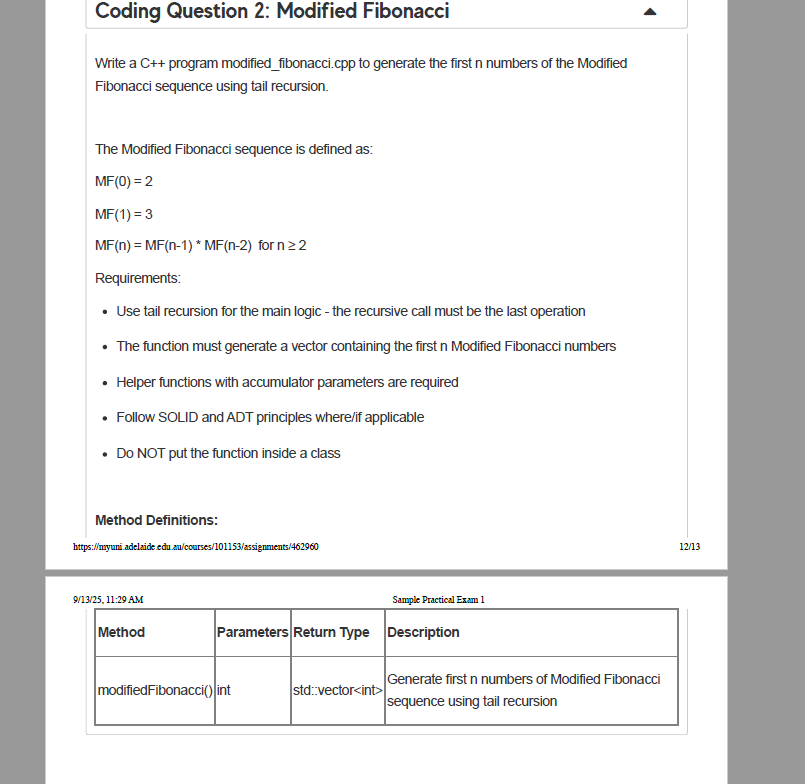

这题要你用**尾递归（tail recursion）\**生成“改造斐波那契”（Modified Fibonacci）序列的\**前 n 个数**，并返回一个 `std::vector<int>`。

### 序列定义

- `MF(0) = 2`
- `MF(1) = 3`
- `MF(n) = MF(n-1) * MF(n-2)`（n ≥ 2，注意是**乘法**）

### 题目要求拆解

- **尾递归**：递归函数里**最后一条语句**必须是递归调用（返回值不再参与运算）。
- **返回 vector**：把前 n 个数依次放进 `std::vector<int>`。
- **辅助函数 + 累加器参数**：用参数保存“上两个值”和“当前下标”，每次只算下一个数然后尾递归。
- **不要放进类里**；遵循 SOLID/ADT——做成**纯函数**、无全局可变状态。

------

## 实现思路

1. 处理边界：
   - n ≤ 0 → 返回空向量
   - n = 1 → `[2]`
   - n = 2 → `[2, 3]`
2. 从第 3 个数开始（下标 2），用尾递归：
    维护 `prev2 = MF(k-2)`、`prev1 = MF(k-1)`，下一项 `next = prev1 * prev2`。
    先 `push_back(next)`，**最后**调用递归进入下一步（`tail call`）。

> 注：数值增长非常快，`int` 很快会溢出（大约到第 9 项就超 32 位）。题目要求返回 `vector<int>`，可在内部用 `long long` 计算后再 `static_cast<int>`。

------

## 参考代码（`modified_fibonacci.cpp`）

```cpp
#include <vector>

// 辅助：尾递归生成第 i(>=2) 项及以后，直到生成 target 个
static void buildModFibTail(int target, int i,
                            long long prev2, long long prev1,
                            std::vector<int>& out) {
    if (i >= target) return;                 // 递归基
    long long next = prev1 * prev2;          // 计算下一项
    out.push_back(static_cast<int>(next));   // 先放入结果
    buildModFibTail(target, i + 1,           // 尾递归（最后一步）
                    prev1, next, out);
}

// API：返回前 n 个 Modified Fibonacci 数
std::vector<int> modifiedFibonacci(int n) {
    std::vector<int> res;
    if (n <= 0) return res;
    res.reserve(n);

    // 种子
    res.push_back(2);
    if (n == 1) return res;
    res.push_back(3);
    if (n == 2) return res;

    // 从下标 2 开始尾递归生成
    buildModFibTail(n, 2, 2, 3, res);
    return res;
}

/*
示例（可选演示，用时自行打开）：
#include <iostream>
int main() {
    auto v = modifiedFibonacci(6);
    for (size_t i = 0; i < v.size(); ++i) {
        if (i) std::cout << ' ';
        std::cout << v[i];
    }
    std::cout << '\n'; // 输出: 2 3 6 18 108 1944
}
*/
```

### 复杂度

- 时间 `O(n)`，递归深度 `O(n)`；空间主来自返回的 `vector`。
- 若担心递归栈，可改尾递归为等价循环；但本题明确要求尾递归，上面实现已满足“最后一步是递归调用”。

需要我帮你把这段代码改成你们评测环境的函数签名或加上 I/O 模板，也可以直接贴我来适配。