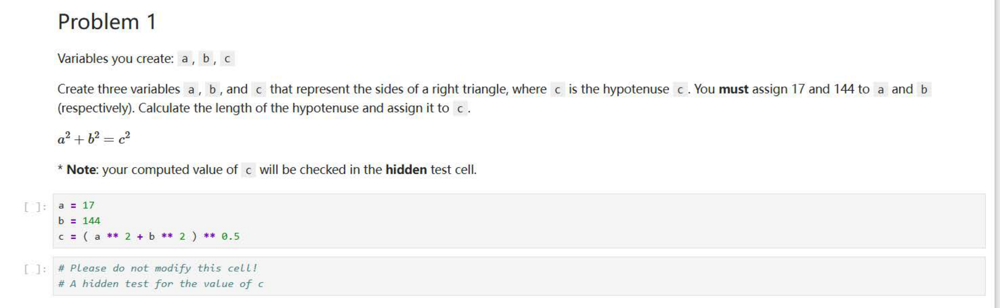
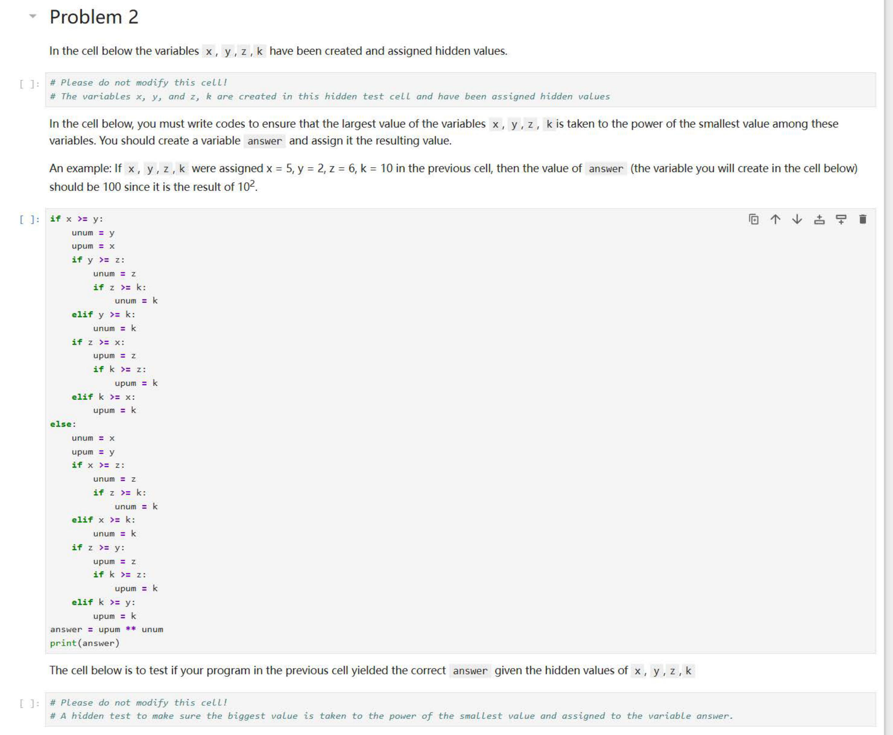
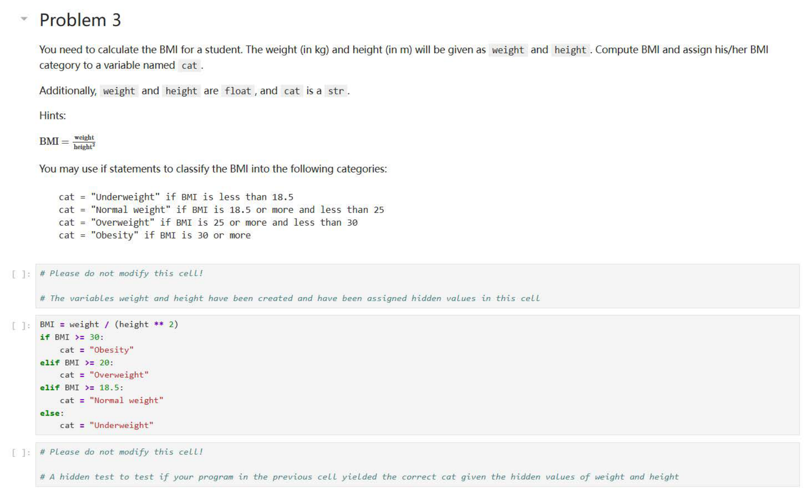
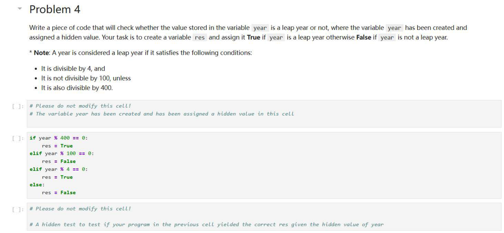

---

## 第 1 页



这是一个编程练习截图（Problem 1），要求你用 Python 计算直角三角形的斜边长度。下面把题目逐行、逐点解释清楚，并告诉你怎么做。

# 题目在说什么

* 需要你创建三个变量：`a`、`b`、`c`。
* `a` 和 `b` 表示直角三角形的两条直角边；`c` 表示斜边（hypotenuse）。
* **必须**把数值 **17** 赋给 `a`，把 **144** 赋给 `b`。
* 用勾股定理 $a^2 + b^2 = c^2$ 计算 `c`，也就是 `c = sqrt(a**2 + b**2)`。
* 截图里还提示：“你计算得到的 `c` 会在一个隐藏测试单元中被检查”，意思是系统会偷偷验证你算出的 `c` 是否正确。
* 底部那块“Please do not modify this cell!”（请不要修改这个单元）是评测用的隐藏测试提示，不用动。

# 具体怎么做（按步骤）

1. **按要求赋值**

```python
a = 17
b = 144
```
2. **按勾股定理求斜边**
有两种常见写法，任选其一：

* 直接用乘方和开方（截图中的思路）

```python
c = (a**2 + b**2)**0.5
```

* `**` 是 Python 的乘方运算符：`a**2` 表示 $a^2$。
* `**0.5` 等价于开平方。
* 用标准库 `math.sqrt`（更直观，也常见）

```python
import math
c = math.sqrt(a**2 + b**2)
```
3. **（可选）验证数值是否正确**
手算或打印：

* $17^2 = 289$
* $144^2 = 20736$
* 相加 $289 + 20736 = 21025$
* $\sqrt{21025} = 145$
所以 `c` 应该是 `145`。评测单元会检查到这一点。

# 注意事项

* `a` 和 `b` 的值**必须**分别是 `17` 和 `144`，不要改。
* 不要修改“请不要修改的单元格”；只在你的解题单元里写上述三行（或四行，若导入 `math`）。
* 若你用整数参与运算，`c` 最终会得到整数 `145`；若你用了其它写法得到浮点，比如 `145.0`，也通常会通过。

# 参考答案（可直接粘贴）

```python
a = 17
b = 144
c = (a**2 + b**2)**0.5   # 结果为 145
```

（或）

```python
import math
a = 17
b = 144
c = math.sqrt(a**2 + b**2)  # 结果为 145
```

\[口语化表达] 这题就是让你把 a=17、b=144 先写好，再按勾股定理算斜边 c：把 a 和 b 各自平方后相加，再开个平方就行了。用 Python 就是 `(a**2 + b**2)**0.5` 或 `math.sqrt(a**2 + b**2)`。别动底下那个“不要改”的单元格。算出来 c 应该是 145。


---

## 第 2 页



这道题（Problem 2）是让你写一段 Python 代码，自动找出 4 个变量 `x`、`y`、`z`、`k` 里：

1. 最大的那个数；
2. 最小的那个数；
3. 再计算「最大值的 **幂次方**（指数是最小值）」；
4. 把结果存入一个新变量 `answer` 中。

---

## 📘 题目内容解析

题目一开始说：

> “In the cell below the variables x, y, z, k have been created and assigned hidden values.”

意思是：`x`、`y`、`z`、`k` 这四个变量**在隐藏测试单元格里已经被赋值了**，你看不到具体数字，但系统会用这些数来检查你写的程序是否正确。

---

## 🧩 你需要做的事情

在你能写代码的单元格中，要写一段程序：

1. 找出 `x, y, z, k` 里最大的值；
2. 找出 `x, y, z, k` 里最小的值；
3. 计算 `最大值 ** 最小值`；
4. 把结果赋给一个变量 `answer`。

---

## 🧮 举个例子（题目中也举了）

假设：

```
x = 5
y = 2
z = 6
k = 10
```

那：

* 最大值是 `10`
* 最小值是 `2`
* 计算 `10 ** 2`（即 $10^2 = 100$）
* 所以 `answer = 100`

---

## ✅ 正确写法（最简洁的版本）

```python
# 找出最大值和最小值
maximum = max(x, y, z, k)
minimum = min(x, y, z, k)

# 计算最大值的最小值次幂
answer = maximum ** minimum
print(answer)
```

这样写最清晰，也完全符合要求。

---

## 🧠 截图里的代码说明

截图中那段代码（`if x >= y:` 开头）是非常复杂的条件嵌套，目的是**手动找出最大值和最小值**，但写法太冗长。

其实用 Python 内建函数 `max()` 和 `min()` 可以直接实现相同效果，更简洁、易读，也更符合规范。

---

## 💡 注意事项

* 不要改动题目前面那块 “Please do not modify this cell!” 的部分，那是系统自动赋值 `x, y, z, k` 的地方。
* 你的代码必须定义变量 `answer`，否则隐藏测试会报错。
* 打印 `answer` 是可选的，但一般写上 `print(answer)` 方便调试。
* Python 的 `**` 运算符是“乘方”，即幂运算。例如：
`2 ** 3 = 8`，`10 ** 2 = 100`。

---

\[口语化表达] 这题其实就是要你在四个数 x、y、z、k 里面找出最大的和最小的，然后算“最大那个数的最小次方”。比如最大是 10、最小是 2，就算 10 的平方，也就是 100。代码很简单：`answer = max(x, y, z, k) ** min(x, y, z, k)`。别去改上面那个“请不要修改”的单元格，那里系统已经把数给你了。


---

## 第 3 页



这道题（Problem 3）是要你写一个程序，用来计算学生的 **BMI（身体质量指数）**，并根据 BMI 的值判断属于哪个体重分类。下面是完整的中文讲解和步骤。

---

## 📘 题目内容解析

题目告诉你：

* 程序里已经有两个变量：`weight`（体重，单位是 kg）和 `height`（身高，单位是 m），它们都是 **浮点数 float**；
* 你需要根据这两个值计算 **BMI**；
* 计算完后，还要根据 BMI 的大小给出一个体重分类（即 `cat`），它是一个字符串（str 类型）；
* 你不能改动题目里写着 “Please do not modify this cell!” 的那部分，那是系统自动赋值的隐藏测试单元。

---

## ⚙️ 计算公式

题目提示了公式：

$$
\text{BMI} = \frac{\text{weight}}{(\text{height})^2}
$$

在 Python 中就是：

```python
BMI = weight / (height ** 2)
```

其中 `**` 表示“乘方”运算，比如 `height ** 2` 就是身高的平方。

---

## 🧮 分类标准（题目中给的）

按照 BMI 数值的范围，分成以下四类：

| 分类名 (cat)         | 判断条件 (BMI 值)    |
| ----------------- | --------------- |
| `"Underweight"`   | BMI < 18.5      |
| `"Normal weight"` | 18.5 ≤ BMI < 25 |
| `"Overweight"`    | 25 ≤ BMI < 30   |
| `"Obesity"`       | BMI ≥ 30        |

---

## ✅ 正确写法

可以用 `if...elif...else` 判断语句来分类：

```python
BMI = weight / (height ** 2)

if BMI < 18.5:
cat = "Underweight"
elif BMI < 25:
cat = "Normal weight"
elif BMI < 30:
cat = "Overweight"
else:
cat = "Obesity"
```

这段代码的逻辑是：

* 如果 BMI 小于 18.5 → “偏瘦”
* 否则如果 BMI 小于 25 → “正常”
* 否则如果 BMI 小于 30 → “超重”
* 否则 → “肥胖”

最后，系统会在隐藏单元格里用不同的体重和身高来测试你写的代码，看你能否正确分类。

---

## 🚫 截图中代码的问题

截图中写的判断条件是：

```python
elif BMI >= 20:
```

这个条件写错了，应该是 `BMI >= 25`，因为题目给的标准是：

> Overweight if BMI is 25 or more and less than 30

否则 BMI 在 20 到 25 之间都会被错误地判断为“Overweight（超重）”。

---

## 💡 小结

* 不要改动上方的“请不要修改”单元；
* `weight`、`height` 系统会自动提供；
* 用 BMI 公式算出数值；
* 用 `if-elif-else` 按标准判断；
* 把对应分类赋给字符串变量 `cat`；
* 不需要打印结果，系统会自动检查。

---

\[口语化表达] 这题就是要你先用体重除以身高的平方算出 BMI，然后根据结果判断是偏瘦、正常、超重还是肥胖。BMI 小于 18.5 就是 “Underweight”，18.5 到 25 之间是 “Normal weight”，25 到 30 是 “Overweight”，30 以上是 “Obesity”。代码很简单：`BMI = weight / (height ** 2)`，然后用几层 `if...elif...else` 来判断就行，最后把结果存在 `cat` 这个变量里。别去动上面那个系统自动给数据的单元。


---

## 第 4 页



这题（Problem 4）要你写一段代码，判断变量 `year`（已在隐藏单元里赋值）是不是**闰年**。你需要创建变量 `res`：如果是闰年就设为 `True`，否则设为 `False`。

---

## 判定规则（题目已给出）

一个年份是闰年需同时满足下面逻辑：

* 能被 **4** 整除，且
* **不能**被 **100** 整除，**除非**它还能被 **400** 整除。

换成更好实现的顺序判断就是：

1. 若能被 400 整除 → 一定是闰年；
2. 否则若能被 100 整除 → 一定不是闰年；
3. 否则若能被 4 整除 → 是闰年；
4. 其余情况 → 不是闰年。

> `a % b` 是取模（余数）运算，等于 0 表示“能被整除”。

---

## 你需要写的代码（推荐写法，和截图一致）

```python
# year 已在上面的隐藏单元被赋值；不要修改隐藏单元

if year % 400 == 0:
res = True
elif year % 100 == 0:
res = False
elif year % 4 == 0:
res = True
else:
res = False
```

这种顺序可以避免逻辑冲突（比如 2000 同时能被 100 和 400 整除，我们先判断 400，直接判定为闰年）。

---

## 一行写法（等价，了解即可）

```python
res = (year % 4 == 0) and (year % 100 != 0 or year % 400 == 0)
```

含义：先要求能被 4 整除，并且满足“不被 100 整除”或“能被 400 整除”。

---

## 小例子（便于自测）

* `year = 2000` → 能被 400 整除 → `True`（闰年）
* `year = 1900` → 能被 100 但不能被 400 整除 → `False`（平年）
* `year = 2024` → 能被 4 但不能被 100 整除 → `True`（闰年）
* `year = 2023` → 不能被 4 整除 → `False`（平年）

---

## 注意

* **不要修改**标注为 “Please do not modify this cell!” 的单元，那是测试用的隐藏赋值。
* 只需在你的解题单元里定义 `res` 即可，系统会用不同 `year` 测试你的逻辑。

---

\[口语化表达] 这题就是让你判断某个 year 到底是不是闰年：先看能不能被 400 整除，能的话直接算闰年；不行再看能不能被 100 整除，能的话就不是；再不行看能不能被 4 整除，能的话是闰年，否则就不是。写出来就是那几层 if-elif-else，把结果放在 res 里。别去动上面那个“不要改”的隐藏单元。
