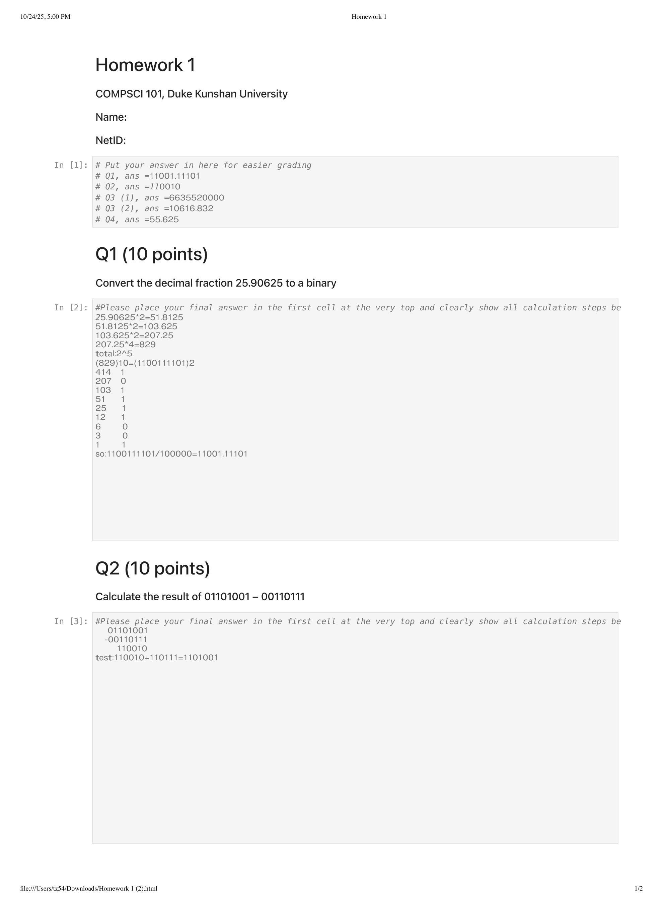
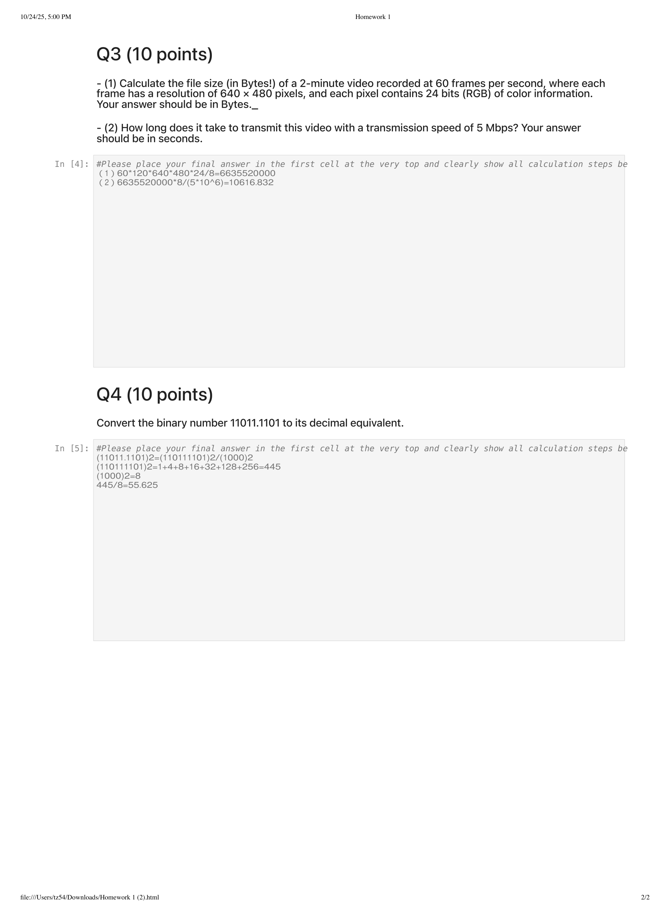

---

## 第 1 页



从截图上来看，这是两道计算机科学或数学类作业题目，分别是：

### Q1: 将十进制小数 25.90625 转换为二进制

这个问题要求将给定的十进制小数 25.90625 转换为二进制格式。转换步骤如下：

1. **整数部分转换**：

* 先处理 25 的整数部分。
* 25 除以 2，商是 12，余数是 1（记录余数）。
* 12 除以 2，商是 6，余数是 0（记录余数）。
* 6 除以 2，商是 3，余数是 0（记录余数）。
* 3 除以 2，商是 1，余数是 1（记录余数）。
* 1 除以 2，商是 0，余数是 1（记录余数）。
* 从最后到第一个余数是 11001，即 25 的二进制表示是 11001。

2. **小数部分转换**：

* 接下来处理 0.90625 的小数部分。
* 0.90625 乘以 2，结果是 1.8125，取整数部分 1，余数是 1（记录整数部分）。
* 0.8125 乘以 2，结果是 1.625，取整数部分 1，余数是 1（记录整数部分）。
* 0.625 乘以 2，结果是 1.25，取整数部分 1，余数是 1（记录整数部分）。
* 0.25 乘以 2，结果是 0.5，取整数部分 0，余数是 0（记录整数部分）。
* 0.5 乘以 2，结果是 1.0，取整数部分 1，余数是 1（记录整数部分）。
* 因此，小数部分的二进制表示是 11101。

3. **合并整数部分和小数部分**：所以 25.90625 的二进制表示是 `11001.11101`。

### Q2: 计算 01101001 - 00110111 的结果

这道题要求计算两个二进制数 01101001 和 00110111 的差。计算步骤如下：

1. **二进制减法**：

* 将两个二进制数列出：

```
01101001
- 00110111
------------
```
* 从最右边开始逐位相减：

* 1 - 1 = 0
* 0 - 1，借位，从 0 借 1，变成 10，10 - 1 = 1
* 0 - 1，借位，从 0 借 1，变成 10，10 - 1 = 1
* 1 - 0 = 1
* 0 - 1，借位，从 1 借 1，变成 10，10 - 1 = 1
* 1 - 0 = 1
* 1 - 0 = 1
* 0 - 0 = 0
* 最终结果是：`010010`，即 010010。

### 口语化表达：

“第一道题是让你把一个十进制的小数 25.90625 转换成二进制。先把整数部分 25 用二进制表示出来，然后把小数部分 0.90625 也转换成二进制，最后把这两部分合起来。第二道题则是做二进制的减法，计算两个二进制数 01101001 减去 00110111 的结果，按从右往左逐位减法计算，记得借位。”


---

## 第 2 页



从截图来看，这两道题是关于视频文件大小和传输速度的计算，以及二进制转换为十进制的题目：

### Q3: 计算一个 2 分钟的视频文件大小以及传输时间

这道题有两个部分：

#### (1) 计算视频文件大小（单位：字节）

已知：

* 视频时长：2分钟（即 120 秒）
* 帧率：每秒 60 帧
* 每帧的分辨率是 640 × 480 像素
* 每个像素包含 24 位（即 3 字节，RGB）

计算文件大小的步骤：

1. 计算每帧的字节数：
每帧有 640 × 480 个像素，每个像素占用 3 字节，因此每帧的大小是：

$$
640 \times 480 \times 3 = 921600 \text{ 字节}
$$

2. 计算视频的总帧数：
2分钟的视频有 120 秒，每秒 60 帧，因此总帧数为：

$$
60 \times 120 = 7200 \text{ 帧}
$$

3. 计算视频总大小：
每帧的大小是 921600 字节，视频有 7200 帧，因此视频总大小是：

$$
921600 \times 7200 = 6635520000 \text{ 字节}
$$

这个结果就是视频的总大小。

#### (2) 计算传输该视频所需的时间（单位：秒）

已知：

* 传输速度：5 Mbps（即 5 × 10^6 位每秒）

步骤：

1. 将视频文件大小转换为比特（bits），因为传输速度是以比特为单位：

$$
6635520000 \text{ 字节} = 6635520000 \times 8 = 53084160000 \text{ 比特}
$$

2. 计算传输时间：
传输速度为 5 Mbps，即每秒可以传输 5000000 比特，所以传输时间为：

$$
\frac{53084160000}{5000000} = 10616.832 \text{ 秒}
$$

这是传输该视频所需的时间。

### Q4: 将二进制数 11011.1101 转换为十进制

这道题要求将二进制数 `11011.1101` 转换为十进制数。

1. **整数部分转换**：

* `11011` 是二进制数，按位计算：

$$
1 \times 2^4 + 1 \times 2^3 + 0 \times 2^2 + 1 \times 2^1 + 1 \times 2^0 = 16 + 8 + 0 + 2 + 1 = 27
$$

所以整数部分的十进制值是 27。

2. **小数部分转换**：

* `1101` 是二进制数，小数部分按位计算：

$$
1 \times 2^{-1} + 1 \times 2^{-2} + 0 \times 2^{-3} + 1 \times 2^{-4} = 0.5 + 0.25 + 0 + 0.0625 = 0.8125
$$

所以小数部分的十进制值是 0.8125。

3. **合并结果**：
将整数部分和小数部分合起来，得到十进制数是：

$$
27 + 0.8125 = 27.8125
$$

### 口语化表达：

“第一题分两部分，首先让你计算一个 2 分钟的视频文件大小。你要根据视频的帧率、分辨率和每个像素的大小，先算出每帧占多少字节，再计算整个视频的文件大小。第二部分是计算通过 5 Mbps 的速度传输该视频需要多少秒。你需要把视频的字节数转换成比特，然后用传输速度算出时间。第二题是将一个二进制数 11011.1101 转换为十进制。首先把整数部分 11011 转换成 27，再把小数部分 1101 转换成 0.8125，合起来就得到了 27.8125。”
