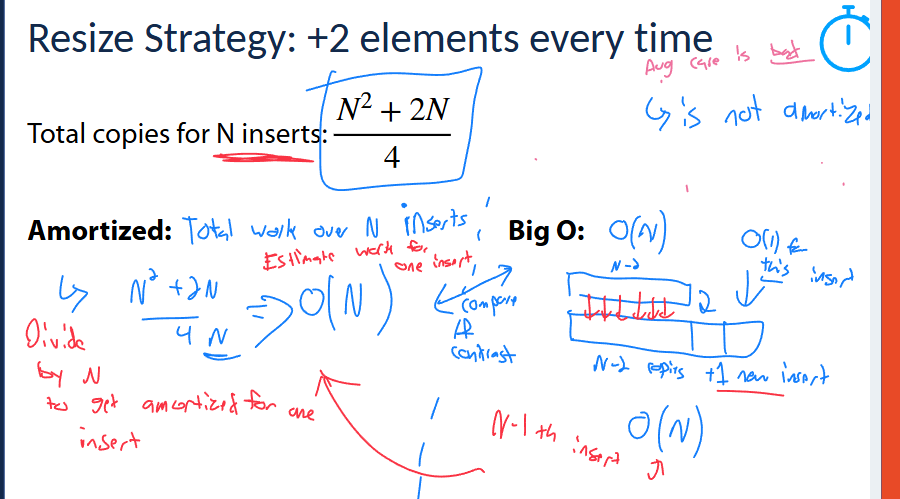
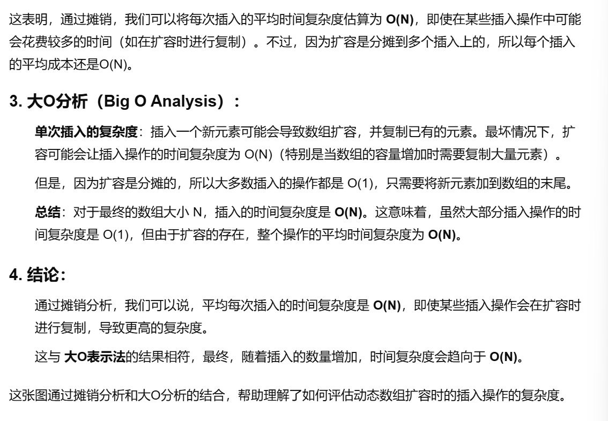
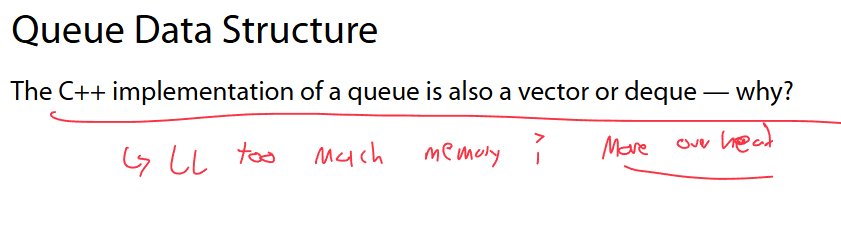
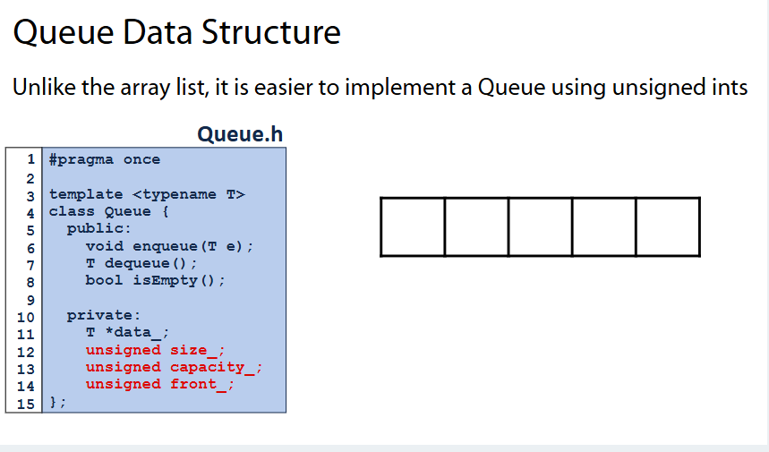
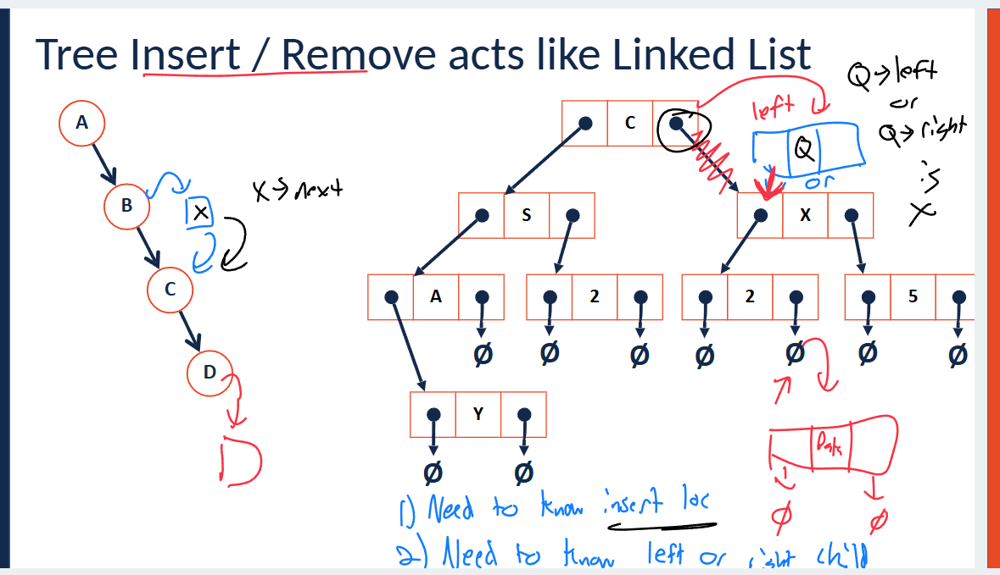

这张图片展示了链表操作的时间复杂度。链表是一种数据结构，其中每个元素都包含数据和指向下一个元素的指针。图中的箭头表示链表的连接方式，从头节点（head）开始。

### 1. 插入操作（Insert）

- **@Front**：在链表的前端插入元素。时间复杂度为 O(1)，因为可以直接在头部插入一个新节点，不需要遍历整个链表。
- **@RefPointer**：通过一个参考指针（RefPointer）插入，时间复杂度也是 O(1)，因为我们有指向目标位置的指针，可以直接在该位置插入。
- **@Index**：根据索引插入元素，时间复杂度是 O(n)，因为我们需要遍历链表来找到指定的位置。

### 2. 删除操作（Delete）

- **@Front**：删除链表的前端元素，时间复杂度为 O(1)，因为删除操作只需要修改头指针，指向下一个元素。
- **@RefPointer**：通过参考指针删除元素，时间复杂度是 O(1)，同样只需修改指针，不需要遍历链表。
- **@Index**：根据索引删除元素，时间复杂度为 O(n)，需要遍历链表以找到指定元素并删除。

### 3. 查找操作（Find）

- **@Index**：查找链表中指定位置的元素，时间复杂度是 O(n)，因为需要从头节点开始遍历，直到找到目标位置。

### 4. 修改操作（Modification）

- **@Index**：修改链表中指定位置的元素，时间复杂度也是 O(n)，需要遍历链表找到指定位置。

总的来说，链表的操作时间复杂度通常依赖于插入、删除和访问的位置，是否从头开始遍历。


这张图片展示了C++中`vector`（向量）类型的实现细节，具体是如何存储数据、大小和容量的。

### 1. 数据（Data）

- `data_` 是指向数组起始位置的指针，它指向存储数据的内存区域。在C++中的`vector`，数据以连续的块存储在内存中，指针`data_`指向这个数组的开始位置。

### 2. 大小（Size）

- `size_` 是指向下一个可用位置的指针，代表当前数组中已存储的元素的数量。它指向数组中下一个可以存放元素的位置，即“当前大小”。例如，如果数组已经存储了 5 个元素，那么`size_`就指向第6个位置。

### 3. 容量（Capacity）

- `capacity_` 是指向数组末尾后一个位置的指针，表示数组的容量（即该数组可以存储的最大元素数量）。容量通常大于等于大小，以便在增加新元素时避免频繁的内存重新分配。

### 总结

- **Data** 存储数组的起始位置。
- **Size** 存储已使用空间的大小（即存储的元素数量）。
- **Capacity** 存储可用空间的容量（即数组能够容纳的最大元素数量）。

这些信息帮助`vector`类管理动态数组的内存分配和扩展。在使用`vector`时，如果当前的元素数量超过了容量，`vector`会自动扩展其容量，通常是通过分配更大的内存块并将旧数据复制到新位置。


这张图片展示了一个**数组列表**（Array List）在没有达到容量限制时的操作复杂度，具体是插入和删除操作在不同位置的时间复杂度。

### 1. 插入操作（Insert）

- **@Front**（前端插入）：当插入一个新元素到数组的前端时，数组中的其他元素需要向后移动以为新元素腾出空间。因此，插入操作的时间复杂度是 **O(n)**，因为在最坏情况下，所有元素都需要移动。
- **@Back**（后端插入）：如果数组没有达到容量的限制，可以直接在数组的最后位置插入新元素，不需要移动任何其他元素，因此时间复杂度为 **O(1)**。这也是插入元素最常见和高效的方式。
- **@Index**（指定位置插入）：在数组的某个指定位置插入元素时，必须移动该位置之后的所有元素以为新元素腾出空间。因此，插入操作的时间复杂度是 **O(n)**，因为在最坏情况下，所有的元素都可能需要被移动。

### 2. 删除操作（Delete）

- **@Front**（前端删除）：删除数组的第一个元素时，后面的所有元素需要向前移动来填补空缺，因此删除操作的时间复杂度是 **O(n)**。
- **@Back**（后端删除）：如果删除操作在数组的最后一个元素进行，由于没有元素需要移动，时间复杂度是 **O(1)**。
- **@Index**（指定位置删除）：如果删除操作是在数组的某个指定位置进行，删除后需要将该位置后的所有元素向前移动。因此，删除操作的时间复杂度为 **O(n)**，因为可能需要移动大量元素。

### 关键点总结：

- **插入（Insert）**：在前端和中间插入元素时，必须移动元素，时间复杂度是 **O(n)**；但在后端插入时，操作非常高效，时间复杂度是 **O(1)**。
- **删除（Delete）**：删除操作也有类似的复杂度。在前端和中间删除时需要移动元素，时间复杂度是 **O(n)**，而从后端删除则是 **O(1)**。

这张图展示了如何在数组列表中进行插入和删除操作，以及它们在不同位置的时间复杂度。


这张图片展示了在**动态数组扩容**时，采用每次增加2个元素的**扩展策略**。该策略的关键点是，当数组空间不足时，它会重新分配内存并将当前数据复制到新的位置，并增加2个新的元素空间。

让我们详细解释第一问的含义：

### 问题1：**每次重新分配时，复制操作的次数是多少？**

- 每次数组容量不够时，都会进行一次**扩容**，即重新分配内存并将数据复制到新的数组中。
- 假设开始时数组中有 `i` 个元素，那么在进行第 `i` 次扩容时，数组的容量将从 `i` 增加到 `2i`，这时需要将 `i` 个元素复制到新的数组中，并且新数组还会有空间来存储额外的元素。
- 具体地，**在第 `i` 次扩容时**，我们会进行 `2i` 次复制操作，因为新数组的容量是原来的一倍，而我们需要将原数组的所有元素复制过去。

### 举例说明：

1. **第一次扩容（i=1）**：
   - 初始数组包含 `2` 个元素 (`A B`)，当数组容量不够时，我们会将数组的容量扩展到 `4` 个元素（`A B` 加上两个空位）。
   - 这时，需要将原数组中的 `2` 个元素复制到新的数组中，因此复制次数是 `2`。
2. **第二次扩容（i=2）**：
   - 原数组有 `4` 个元素（比如：`A B C D`），扩容后数组的容量增加到 `6` 个元素。
   - 需要将 `4` 个元素复制到新的数组中，因此复制次数是 `4`。
3. **第三次扩容（i=3）**：
   - 原数组有 `6` 个元素，扩容后数组的容量增加到 `8` 个元素。
   - 需要将 `6` 个元素复制到新的数组中，因此复制次数是 `6`。

### 总结：

- 每次扩容时，数组的容量都会加倍，在第 `i` 次扩容时，我们将会进行 `2i` 次复制操作。

所以，在第 `i` 次扩容时，**复制操作的次数是 `2i`**。

### 1. **每次扩容时的复制操作**

- **每次扩容**时，会将当前数组的所有元素复制到新位置。假设当前数组已经包含`i`个元素，在进行扩容时，会进行`2i`次复制。也就是说，在第`i`次扩容时，需要将数组中的所有元素复制两次。
- **图示分析**：在图中可以看到，每次扩容后数组的大小增加了2个元素。第1次扩容时数组从`2`个元素变为`4`个，进行`2`次复制；第2次扩容时从`4`个变为`6`个，进行`4`次复制；依此类推。

### 2. **总的重新分配次数**

- 在最坏情况下，重新分配的次数为`N/2`，其中`N`表示最终数组中存储的元素数量。换句话说，总共的重新分配次数是`N/2`次。
- **推导公式**：随着数组大小的增加，扩容操作的次数逐渐减少。例如，第一次扩容可能从2个元素变到4个，然后从4个元素变到6个，直到达到`N`个元素。在扩容过程中，重新分配的次数总和是`N/2`，这是因为每次扩容时，我们都增加了2个额外的空间。

### 总结：

- 在这种**扩容策略**下，每次扩容时会增加2个元素，并进行数据的复制操作。每次扩容时复制的次数是扩容次数的2倍。
- 如果最终数组的大小是`N`，总的重新分配次数大约是`N/2`。


这张图片进一步解释了**数组扩容**时的复制操作次数，以及总的重新分配（reallocation）次数和总的复制调用次数。

### 问题1：**每次重新分配时复制操作的次数**

- 正如我们之前讨论的，每次扩容时，假设当前数组有 `i` 个元素，在进行扩容时需要复制 `2i` 次元素。因此，在第 `i` 次重新分配时，复制操作的次数是 `2i`。

### 问题2：**N 个元素总共的重新分配次数**

- 重新分配次数的公式

  ：

  - 假设数组最终要存储 `N` 个元素，且每次扩容时会增加2个元素。
  - 如果我们每次扩容都加倍容量，那么总的重新分配次数可以表示为 `N/2`（即 `k = N/2`），其中 `k` 是重新分配的次数。

### 总复制调用次数的公式：

- 

### 总结：

- **每次重新分配时的复制操作**：对于第 `i` 次扩容，复制 `2i` 次元素。
- **重新分配的总次数**：总的重新分配次数为 `N/2`（如果最终数组大小是 `N`）。
- **复制调用的总次数**：总的复制调用次数是 `N^2 / 4 + N / 2`，这是对所有扩容操作进行复制时的总次数。







这张图片展示了另一种**扩容策略**，即每次扩容时将数组大小增加到原来的一倍（即“*x2 elements every time*”）。我们来看这个扩容策略下的一些关键点，包括**复制操作次数**、**重新分配次数**和**复制调用的总次数**。

### 1. **每次重新分配时的复制次数**

- 在每次重新分配时，假设当前数组有 `i` 个元素，扩容后数组的容量将增加到 `2i`，这时需要将 `i` 个元素复制到新的数组中。因此，**每次重新分配时需要进行 `2i` 次复制**。
- 例如：
  - **第一次扩容**：当前数组大小为 `2`，扩容后变为 `4`，需要复制 `2` 次。
  - **第二次扩容**：当前数组大小为 `4`，扩容后变为 `8`，需要复制 `4` 次。
  - **第三次扩容**：当前数组大小为 `8`，扩容后变为 `16`，需要复制 `8` 次。

### 2. **总的重新分配次数**

- **总重新分配次数**取决于最终数组的大小 `N`。假设我们最终需要存储 `N` 个元素，数组的大小每次都翻倍，直到达到或超过 `N`。

- 所以，扩容操作的次数是：

  

  这里，`k` 表示所需的最终重新分配次数，而 `\log_2 N` 表示需要进行的扩容次数。

- 例如，如果 `N` 为 `16`，那么扩容次数 `k` 是 `4`（即 `\log_2 16 = 4`）。

### 3. **总复制调用次数**

- 总复制调用次数是所有扩容过程中复制元素的总和。

  - 每次扩容时，复制的次数分别是 `2^0`, `2^1`, `2^2`, ..., `2^k`，其中 `k` 是最后一次扩容的次数。

- 总复制次数的公式是：

  

  


这张图对比了**单链表（Singly Linked List）**和**数组（Array）**的常见操作的时间复杂度。不同的数据结构对于相同操作的时间复杂度不同，下面我们详细解释每个操作的时间复杂度及其含义。

### **操作与时间复杂度**

1. **查找任意位置（Look up arbitrary location）**:
   - **单链表**：时间复杂度是 **O(n)**，因为在单链表中，要查找任意位置的元素，必须从头节点开始逐一遍历直到目标位置。
   - **数组**：时间复杂度是 **O(1)**，因为数组支持按索引直接访问元素，不需要遍历。
2. **在给定元素后插入（Insert after given element）**:
   - **单链表**：时间复杂度是 **O(1)**，只需找到给定元素后，直接修改指针即可。
   - **数组**：时间复杂度是 **O(n)**，因为插入元素时需要移动数组中的元素以腾出空间（如果数组已满，需要扩容）。
3. **在给定元素后删除（Remove after given element）**:
   - **单链表**：时间复杂度是 **O(1)**，删除后只需要更新指针即可。
   - **数组**：时间复杂度是 **O(n)**，因为删除元素后，需要将后续的元素向前移动。
4. **在任意位置插入（Insert at arbitrary location）**:
   - **单链表**：时间复杂度是 **O(n)**，首先需要遍历链表找到插入位置，然后进行插入。操作的时间复杂度取决于需要查找的节点。
   - **数组**：时间复杂度是 **O(n)**，需要移动后续的所有元素以腾出插入位置（在数组末尾插入时复杂度是 O(1)）。
5. **在任意位置删除（Remove at arbitrary location）**:
   - **单链表**：时间复杂度是 **O(n)**，同样需要找到位置后删除元素，并更新指针。
   - **数组**：时间复杂度是 **O(n)**，删除操作需要移动后续的元素。
6. **查找一个输入值（Search for an input value）**:
   - **单链表**：时间复杂度是 **O(n)**，因为链表没有索引，需要遍历整个链表来查找目标值。
   - **数组**：时间复杂度是 **O(n)**，数组通常不按顺序排列，最坏情况下可能需要遍历整个数组。

### **特殊情况**

- 单链表

  ：

  - **插入/删除头部**操作的时间复杂度是 **O(1)**，因为无需遍历，直接操作头指针即可。

- 数组

  ：

  - **如果数组已满**，插入操作的时间复杂度会更高（O(n)），因为需要扩容。
  - **插入尾部（Insert at Back）**操作通常是 **O(1)**，因为可以直接在数组的末尾插入元素（除非扩容）。

### **总结**

- **单链表**：对于插入和删除操作，特别是在已知位置或头部位置时非常高效（**O(1)**）。然而，对于查找和任意位置插入、删除，需要遍历链表（**O(n)**）。
- **数组**：在按索引查找和插入尾部时非常高效（**O(1)**）。但在进行插入和删除操作时，可能需要移动大量元素，特别是在任意位置时，复杂度为 **O(n)**。


这张图片讨论了**链表（Linked List）**在获取大小时的时间复杂度，并进一步探讨了为什么不直接在链表类中添加一个大小整数（`size`）来优化这个操作。

### **链表获取大小的时间复杂度**

在图中，你可以看到一个链表，包含了元素 `C`, `S`, `2`, `7`, `7`，以及指向下一个元素的指针。在链表中，**获取链表的大小**是一个需要遍历所有节点的操作。因为链表是由节点构成，每个节点只知道指向下一个节点的指针，而不知道链表的总长度。

- **时间复杂度是 O(n)**，其中 `n` 是链表中节点的数量。这是因为为了获取链表的大小，必须遍历整个链表，访问每个节点并累加计数。

### **为什么不直接在链表类中添加一个 `size` 整数？**

图中提出了一个问题：如果我们直接在链表类中添加一个整数 `size` 来跟踪链表的大小，那么每次插入或删除元素时，都可以在常数时间内获得链表的大小，而不需要遍历整个链表。

但这种优化方法也有**一些权衡（tradeoffs）**，如图中所列：

1. **额外的内存开销**：在链表类中添加一个 `size` 整数会增加额外的内存消耗。每个对象都会增加一个整数的存储空间。

2. 更新成本

   ：每次插入、删除、或修改链表时，都需要更新 

   ```
   size
   ```

    变量。例如：

   - 当插入一个新元素时，`size` 需要加 1。
   - 当删除一个元素时，`size` 需要减 1。

如果频繁进行插入或删除操作，维护 `size` 变量就会成为一个额外的负担，这些操作的时间复杂度从 **O(1)** 可能变成了需要额外计算的 **O(1) + 额外操作**。

### **总结**

- 获取链表的大小通常是 **O(n)**，因为必须遍历整个链表。
- 如果在链表类中添加 `size` 变量来存储链表的大小，可以提高效率，但会增加内存消耗，并且每次插入或删除时需要额外的更新操作。


这张图展示了链表的一些**权衡**（trade-offs）问题，并讨论了如何高效地处理链表中最小值的访问。

### **图中的链表结构**

图中有两个链表：

1. 第一个链表包含：`1 -> 2 -> 3 -> 4 -> 5`，这是一个顺序排列的链表。
2. 第二个链表包含：`4 -> 2 -> 5 -> 3 -> 1`，这是一个无序排列的链表。

### **问题描述**

图中提出了一个问题：

- 如果我只想访问最小值，并按顺序访问每个最小值，应该如何做？

### **思考**

- 在第一个链表中，最小值是 `1`，它位于链表的头部。假设我只关心最小值的访问，而不关心其他值，那么访问最小值的操作是非常简单的：从头部开始遍历链表，遇到最小值 `1` 即可，时间复杂度为 **O(1)**，因为它在链表的最前面。
- 对于第二个链表，它的值是无序的。如果我们想按顺序访问最小值，最直接的做法是每次都遍历整个链表，找到最小的值，然后删除它，再继续遍历寻找下一个最小值，直到链表为空。这种操作的时间复杂度是 **O(n^2)**，因为在每次查找最小值时需要遍历整个链表，而一旦删除最小值，剩下的元素数量会减少，每次查找都需要遍历剩下的部分。

### **优化方案**

- 如果我们想按顺序访问最小值，可以考虑在插入时**保持链表有序**。如果链表总是有序的，最小值总是会在头部，可以直接访问，时间复杂度为 **O(1)**。

### **权衡（Trade-offs）**

- 顺序访问最小值

  ：

  - 如果不关心其他值，而只关心最小值，可以在**有序链表**中高效地获得最小值。
  - 如果链表是无序的，每次查找最小值都需要遍历链表，时间复杂度较高，达到 **O(n^2)**。

- **优化的空间与时间**：在设计数据结构时，可以选择不同的方式来保持顺序或者在插入时调整元素位置，但这会增加内存或操作的开销，需要权衡效率和复杂度。

### 总结：

- 如果要高效地按顺序访问最小值，最好使用**有序链表**，这样可以直接在头部访问最小值，时间复杂度为 **O(1)**。
- 对于无序链表，需要**重复遍历**链表查找最小值，时间复杂度为 **O(n^2)**，这通常不是很高效。


这张图片讨论了**有序与无序列表**的**权衡**，并展示了两种列表的不同性能特点。

### **第一行：无序列表**

上面的链表是一个无序列表，包含元素：

```
2, 7, 5, 9, 7, 14, 1, 0, 8, 3
```

- **特点**：这是一个随机排列的数字序列，没有特定的顺序。
- **查找操作**：对于无序列表，查找某个元素通常需要遍历整个列表，最坏情况下时间复杂度是 **O(n)**。
- **插入操作**：插入新元素时，不需要担心顺序，因此插入是 **O(1)**，只需要把元素添加到末尾（假设没有扩容）。

### **第二行：有序列表**

下面的链表是一个有序列表，包含元素：

```
0, 1, 2, 3, 5, 7, 7, 8, 9, 14
```

- **特点**：这是一个升序排列的数字序列，元素按照大小排列。
- **查找操作**：由于列表是有序的，可以使用**二分查找**，时间复杂度为 **O(log n)**，这比在无序列表中线性查找（O(n)）要高效得多。
- **插入操作**：插入一个新元素时，必须保持有序性。为了保持顺序，需要找到正确的位置并将元素插入，这通常需要 **O(n)** 的时间复杂度，因为可能需要移动元素。

### **权衡（Trade-offs）**

- 查找操作

  ：

  - 在**无序列表**中，查找元素需要遍历整个列表，时间复杂度是 **O(n)**。
  - 在**有序列表**中，可以使用**二分查找**，大大提高查找效率，时间复杂度为 **O(log n)**。

- 插入操作

  ：

  - 在**无序列表**中，插入一个元素只需要将其添加到末尾，时间复杂度是 **O(1)**，非常高效。
  - 在**有序列表**中，插入元素需要找到正确的位置并将元素插入，时间复杂度为 **O(n)**，因为需要移动元素以保持顺序。

### **总结**：

- 无序列表

  ：

  - 查找慢：**O(n)**。
  - 插入快：**O(1)**（如果没有扩容）。

- 有序列表

  ：

  - 查找快：**O(log n)**（可以使用二分查找）。
  - 插入慢：**O(n)**（需要保持顺序，可能需要移动多个元素）。

因此，选择有序或无序列表需要根据使用场景权衡：如果需要频繁查找而不太关心插入的速度，可以选择有序列表；如果插入操作更为频繁，则无序列表可能是更好的选择。


这张图片讨论了链表（List）的一些**权衡**，特别是链表中存储的大小和内存消耗的关系。

### **链表结构**

图片展示了一个链表的结构，链表包含了5个元素（`1 -> 2 -> 3 -> 4 -> 5`）。每个节点包括数据值和指向下一个节点的指针，链表的尾部（`tail`）指向 `None` 或空值，表示链表的结束。

### **时间复杂度和内存消耗**

- **时间复杂度**：从图中可以看出，链表中的每个元素都需要占用内存，每增加一个元素，就需要为该元素分配内存。每个节点的内存大小取决于存储的数据和指向下一个节点的指针。
- **内存增加的关系**：随着链表的大小增加，内存消耗是 **O(n)**，因为链表是顺序连接的，每增加一个节点，就需要为该节点分配内存空间。

### **链表的大小（Size）**

- **`size` = #** 表示链表中元素的个数。在这个例子中，链表的大小为 `5`，表示有5个元素。链表的大小是一个动态变量，它随着元素的增加或删除而变化。
- 在链表中，**每个节点都需要存储一个指针**，这意味着随着链表的增长，内存消耗会线性增加。

### **权衡**

- **内存消耗**：由于链表需要存储指针，每个元素占用额外的内存空间。这会导致链表的内存消耗是 **O(n)**，即链表的内存占用随着元素数量的增加而增加。
- **操作效率**：尽管每个节点占用额外的内存，但链表具有灵活的插入和删除操作，特别是对于头部和尾部的操作，时间复杂度是 **O(1)**。

### **总结**

- **链表的大小与内存消耗**：链表的内存消耗是随着节点数量线性增加的，每个节点需要额外的内存来存储数据和指向下一个节点的指针，因此内存消耗是 **O(n)**。
- 链表结构提供了灵活的插入和删除操作，但相对于其他数据结构（如数组），它的内存消耗较大，因为每个节点都需要额外的空间存储指针。

**双链表（Doubly Linked List）**相比于**单链表（Singly Linked List）**有几个显著的优点，主要体现在插入和删除操作的效率上。以下是双链表相比单链表的一些主要优点：

### 1. **双向遍历**

- **单链表**：只能从头到尾进行遍历，因为每个节点只包含指向下一个节点的指针（`next`）。
- **双链表**：每个节点不仅包含指向下一个节点的指针（`next`），还包含指向前一个节点的指针（`prev`）。这意味着双链表可以同时支持**正向遍历**（从头到尾）和**反向遍历**（从尾到头），提供了更多的灵活性。

### 2. **删除操作更高效**

- **单链表**：在单链表中，要删除一个节点，通常需要从头部遍历到目标节点的前一个节点（因为单链表只包含指向下一个节点的指针），然后更新前一个节点的指针指向删除节点的下一个节点。这使得删除操作的时间复杂度为 **O(n)**。
- **双链表**：在双链表中，每个节点不仅有指向下一个节点的指针，还有指向前一个节点的指针。因此，在删除某个节点时，如果已经获得目标节点的指针，可以直接通过修改其前驱节点和后继节点的指针来删除该节点，操作时间复杂度是 **O(1)**，无需遍历链表。

### 3. **插入操作更高效**

- **单链表**：在单链表中，插入操作需要找到目标位置，并通过遍历到该位置来修改指针。如果在链表的中间或尾部插入，需要从头部遍历到该位置。
- **双链表**：在双链表中，插入操作更灵活，尤其是在已知位置时。通过前向指针和后向指针，可以直接在指定位置前后插入节点，时间复杂度为 **O(1)**，如果有对目标节点的引用。

### 4. **反向操作的支持**

- **单链表**：无法直接访问前一个节点，因此如果需要反向操作（例如反向遍历、从尾部删除元素等），需要遍历整个链表。
- **双链表**：支持双向操作，可以直接访问前驱节点和后继节点，非常方便进行反向操作。

### 5. **在某些场景中更加灵活**

- 例如在实现**LRU缓存**时，双链表能够高效地移动节点到链表的头部或尾部，因为可以直接访问节点的前驱和后继节点。在实现类似的算法时，双链表的灵活性和效率更高。

### **总结**

**双链表的主要优点**是支持双向遍历、提高删除操作效率、提高插入操作效率，并且能够支持更加灵活的反向操作。虽然双链表相比单链表需要更多的内存空间（因为每个节点需要存储两个指针），但在需要频繁操作链表的前后节点时，双链表提供了更好的性能和灵活性。


这张图片介绍了**栈（Stack）数据结构**的基本概念和操作。栈是一种**后进先出（LIFO）**的数据结构，即最后放入栈的元素最先被移除。图片中详细介绍了栈的两个基本操作：**Push** 和 **Pop**。

### **栈的基本操作**

1. **Push**：

   - `Push` 操作是将一个元素放到栈的顶部。

   - 例如，在栈的顶部加入数字 

     ```
     3
     ```

      和 

     ```
     5
     ```

     ，使用操作 

     ```
     push(3)
     ```

      和 

     ```
     push(5)
     ```

     ，栈的状态变为：

     ```
     Top -> 5
          3
     ```

   - 栈的顶部是最新放入的元素，因此栈的顺序是从顶部到底部。

2. **Pop**：

   - `Pop` 操作是从栈的顶部移除元素并返回它。

   - 例如，执行 

     ```
     pop()
     ```

      操作时，栈的顶部元素（此时是 

     ```
     5
     ```

     ）被移除并返回，栈的状态变为：

     ```
     Top -> 3
     ```

   - `Pop` 操作不仅移除栈顶元素，还返回该元素的值。

3. **Top**：

   - `Top` 操作用来查看栈顶的元素，但不移除它。它返回栈顶的值。
   - 例如，如果栈中有 `3`，`Top` 返回 `3`，但不从栈中移除它。

### **栈的示例操作**

图中演示了以下操作：

- `push(3)` 将 `3` 放入栈中。
- `push(5)` 将 `5` 放入栈中，此时栈的顶部为 `5`。
- `pop()` 移除并返回栈顶的 `5`，此时栈的顶部为 `3`。
- `push(2)` 将 `2` 放入栈中，栈的顶部现在是 `2`。

### **总结**

栈是一种非常基础的数据结构，通常用于需要按顺序处理数据的场景，例如函数调用栈、撤销操作等。栈只有两个主要操作：`Push` 和 `Pop`，分别用于将元素推入栈中和从栈中移除元素。`Top` 操作则用来查看栈顶元素。栈遵循**后进先出（LIFO）**原则，最后放入的元素最先被移除。


这张图片继续讨论**栈（Stack）数据结构**，并进一步解释了 **Push(X)** 操作与数组插入操作的关系，以及栈操作的时间复杂度。

### **Push(X) 操作等价于 insertBack(X)**

- **Push(X)** 操作是将元素 `X` 推入栈的顶部。在图中，`Push(X)` 被定义为一个等价操作，它的行为和数组或链表中的 **`insertBack(X)`** 操作类似，即将元素 `X` 插入到集合的**尾部**（对于栈而言，这意味着栈的顶部）。

### **具体实现**

- Push(X)

   等价于以下操作：

  - 将 `X` 放入栈的顶部：`*size = X;`。
  - 增加栈的大小：`size++;`，即增加栈的元素数量。

### **时间复杂度**

- `Push(X)` 操作的时间复杂度是 **O(1)**。这是因为无论栈的大小是多少，插入操作都在栈的顶部进行，操作时间是常数级的。

### **栈的内部表现**

- 图中展示了一个栈的结构，栈包含了元素 

  ```
  A
  ```

  , 

  ```
  B
  ```

  , 

  ```
  C
  ```

  , 

  ```
  D
  ```

  ，并且当前栈的顶部为空，位置上显示为 

  ```
  X
  ```

  ，表示栈的下一个元素。

  - **`size`** 变量跟踪栈中元素的数量。
  - **栈的 `capacity`** 代表栈能够容纳的最大元素数量。
  - **`Top`** 指示栈的顶部，栈的操作是基于 `Top` 进行的。

### **总结**

- **Push(X)** 操作在栈中的作用是将元素 `X` 放到栈的顶部，类似于在数组或链表的尾部插入一个元素（`insertBack(X)`）。
- **Push(X)** 的时间复杂度是 **O(1)**，因为它仅涉及更新栈的大小并将元素插入栈顶，无需遍历或移动其他元素。
- 栈的常见操作如 **Push** 和 **Pop** 都具有常数时间复杂度，因为它们只操作栈的顶部。


这张图片继续探讨了栈（**Stack**）数据结构，特别是 **Pop()** 操作。栈是一种后进先出（LIFO）的数据结构，Pop() 操作是将栈顶的元素移除并返回。

### **Pop() 操作等价于 removeBack()**

- **Pop()** 操作是从栈的顶部移除元素并返回该元素，图中解释 **Pop()** 操作与 **removeBack()** 在某些数据结构中的行为相同。
- 在栈中，Pop() 通过以下步骤执行：
  - `size--;`：首先，减少栈的大小，表示移除栈中的一个元素。
  - `T tmp = *size;`：然后，将栈顶元素的值存储到临时变量 `tmp` 中。
  - `return tmp;`：最后，返回存储在 `tmp` 中的栈顶元素的值。

### **时间复杂度**

- **Pop()** 操作的时间复杂度是 **O(1)**，因为它只涉及对栈顶元素的访问和更新栈的大小，不需要遍历链表或数组中的其他元素。

### **栈的示例**

- 假设当前栈的内容是：`A -> B -> C -> D`，栈顶元素是 `D`。

- 执行 

  Pop()

   操作时：

  - `D` 被移除，栈的状态变为：`A -> B -> C`。
  - `size` 会减少 1，表示栈中元素的数量减少。
  - `D` 会被返回，表示移除的元素。

### **总结**

- **Pop()** 操作等价于 **removeBack()**，它从栈的顶部移除元素并返回，时间复杂度是 **O(1)**。
- 栈操作通常只影响栈顶元素，因此 **Push()** 和 **Pop()** 都是高效的常数时间操作。


这张图片介绍了**栈（Stack）抽象数据类型（ADT）**的基本概念，包括栈的顺序、实现方式和时间复杂度。

### **栈的抽象数据类型（ADT）**

1. **Order (顺序)**：

   - **Last in, First out (LIFO)**：栈的顺序遵循“后进先出”（LIFO）原则，即最后进入栈的元素最先被移除。你可以想象栈像一个垒起来的盘子堆，最后放入的盘子会最先被拿走。

2. **Implementation (实现)**：

   - Trivially as vector or linked list

     ：栈的实现可以很简单地通过**数组（vector）

     或

     链表（linked list）**来实现。

     - 如果使用**数组**，栈顶的位置可以通过数组的末尾来表示。
     - 如果使用**链表**，栈顶的位置通常由链表的头节点表示。

   - 栈的操作只是简单的插入（push）和删除（pop）操作，这些操作会在栈顶进行。

3. **Runtime (运行时)**：

   - O(1)：栈的常见操作（如push 和 pop）的时间复杂度是 O(1)，也就是说，无论栈的大小如何，操作所需的时间始终是恒定的。
     - **如果数组没有满**：栈的操作仍然是常数时间 **O(1)**，因为我们可以直接操作栈顶元素。
     - **如果数组已满**：在某些实现中，当栈的数组已满时，可能需要扩展数组的大小。扩展数组可能需要重新分配内存并将元素复制到新位置，因此在最坏的情况下，扩展操作的时间复杂度可能会增加，但**摊销分析**（amortized analysis）表明，在多次操作下，扩展操作的平均时间仍然是 **O(1)**。

### **总结**

- **栈（Stack）** 是一种**后进先出（LIFO）\**的数据结构，栈的常见操作如插入（push）和删除（pop）都具有\**O(1)** 的时间复杂度。
- 栈可以通过数组（vector）或链表（linked list）来实现。即使数组满了，扩容后的操作仍然是 **O(1)**（通过摊销分析）。


这张图片介绍了**队列（Queue）数据结构**的基本概念及其操作，队列是一种**先进先出（FIFO）**的线性数据结构，常见于需要按照顺序处理数据的场景，如任务调度、打印队列等。

### **队列的基本操作**

1. **Enqueue**（入队）：将一个元素放到队列的尾部。

   - 操作：`enqueue(3)`、`enqueue(5)`、`enqueue(2)` 等。

   - 例如，执行 

     ```
     enqueue(3)
     ```

      后，队列的状态为：

     ```
     Front -> 3
     ```

   - 元素 `3` 被加入队列的尾部。

2. **Dequeue**（出队）：移除并返回队列的前端元素。

   - 操作：`dequeue()`。

   - 例如，执行 

     ```
     dequeue()
     ```

      后，队列的状态为：

     ```
     Front -> 5
     ```

   - 元素 `3` 被从队列的前端移除并返回，队列的前端元素变为 `5`。

### **队列的特性**

- 队列遵循 **先进先出（FIFO）** 的规则，意味着最早入队的元素最先被出队。
- 队列只能从前端移除元素（出队），只能在尾部添加元素（入队）。这与栈（后进先出 LIFO）不同，栈是通过栈顶进行操作的。

### **时间复杂度**

- **Enqueue（入队）** 操作将元素放入队列的尾部，在一个合适的实现中，这通常是 **O(1)** 的操作（即常数时间）。
- **Dequeue（出队）** 操作移除并返回队列的前端元素，在最初的队列实现中（如基于数组的实现），删除操作可能是 **O(n)**，因为删除元素后需要将其后的所有元素向前移动。然而，基于链表的队列实现通常会使删除操作保持在 **O(1)**。

### **例子中的操作**

1. `enqueue(3)`：将 `3` 放入队列的尾部，队列状态是 `[3]`。
2. `enqueue(5)`：将 `5` 放入队列的尾部，队列状态是 `[3, 5]`。
3. `dequeue()`：移除并返回队列的前端元素 `3`，队列状态是 `[5]`。
4. `enqueue(2)`：将 `2` 放入队列的尾部，队列状态是 `[5, 2]`。

### **总结**

- **队列（Queue）** 是一种典型的先进先出（FIFO）数据结构，主要有两个基本操作：**入队（Enqueue）** 和 **出队（Dequeue）**。
- 队列的实现可以通过**数组**或**链表**，每种实现的性能会有所不同，但操作的基本理念是相同的。


这张图片探讨了**队列（Queue）数据结构**的实现和如何优化队列的插入操作，特别是通过使用**链表（Linked List）**和**尾指针（tail pointer）**来提高操作效率。

### **队列是先进先出（FIFO）数据结构**

队列遵循**先进先出（FIFO）**的原则，意味着首先进入队列的元素最先被移除。例如，队列的顺序可能是：`3 -> 5 -> 7 -> 2`，此时，`3` 是队列中的前端，最先被移除。

### **优化移除操作**

- **问题：** 什么样的数据结构最适合从队列的前端移除元素？
- **答案：** **链表（Linked List）** 是一个非常适合的选择。链表的结构可以让我们直接访问头部元素，并高效地进行删除操作，删除操作的时间复杂度为 **O(1)**。

### **如何优化插入操作**

- **问题：** 我们能否在相同的数据结构中实现高效的尾部插入？
- **答案：** 是的，我们可以通过使用**尾指针（tail pointer）**来实现。在链表中，尾指针可以直接指向链表的尾部，使得插入操作（`enqueue`）非常高效。具体地，插入一个新元素到队列的尾部时，我们只需要更新尾指针的引用，而无需遍历整个链表，时间复杂度是 **O(1)**。

### **总结**

- **移除操作（Dequeue）**：通过链表，**O(1)** 时间复杂度移除队列的前端元素。
- **插入操作（Enqueue）**：通过尾指针，**O(1)** 时间复杂度将元素插入队列的尾部。

通过这种方式，使用**链表**和**尾指针**的队列实现可以在移除和插入操作上都保持高效。



这张图片讨论了**C++中队列（Queue）数据结构的实现**，特别是为什么C++的队列实现可以是基于**向量（vector）**或**双端队列（deque）**的。下面是详细的解释：

### **问题：为什么C++中的队列实现是基于向量或双端队列（deque）？**

- **向量（vector）**：是一个动态数组，能够在末尾进行高效的插入和删除操作，且支持按索引访问元素。
- **双端队列（deque）**：是一个支持在两端都可以高效插入和删除元素的容器。它比**普通数组**更灵活，允许在两端进行操作，因此在实现队列时比单纯的数组更加高效。

### **解释：**

- 为什么不使用链表（LL）？
  - **链表（LL）**会占用较多的内存。每个节点除了存储数据外，还需要存储指向前后节点的指针，这会导致内存开销相对较大。链表每次操作都需要分配和释放内存，这也会带来额外的内存管理负担。
  - **链表的操作**：链表能够非常高效地在任意位置进行插入和删除（时间复杂度为 O(1)），但是在队列实现中，通常我们只需要在一端（尾部）插入和在另一端（头部）删除。因此，链表在这种情况下的内存开销不一定比向量和双端队列更有效。

### **为什么选择向量或双端队列？**

- **双端队列（deque）**：双端队列允许在队列的两端都进行高效的插入和删除操作。对于队列来说，通常我们只需要在尾部插入元素，在头部删除元素。双端队列能够高效地支持这两个操作，而且内存开销相对较小。
- **向量（vector）**：如果我们仅在队列的尾部进行插入和删除操作，使用**向量**也是一个不错的选择。向量的插入和删除操作在尾部是 O(1) 时间复杂度，而数组的结构使得内存管理更加简便和高效。

### **总结：**

- C++中的队列通常使用**向量**或**双端队列（deque）**实现，因为这两种结构在内存管理和操作效率上比链表（LL）更加高效，尤其是在队列的尾部插入和头部删除的场景下。链表的内存开销相对较大，因此在这种简单的队列实现中不如向量和双端队列。


这张图片比较了**工程效率**与**理论效率**，展示了不同计算操作的实际时间与理论预期时间的差异，并且通过生动的类比来帮助理解这些时间的长短。

### **时间与类比**

每种操作在进行一次时的时间（以 **10^9** 次操作为单位）以及与该时间相关的类比如下：

> **L1 Cache** 和 **L2 Cache** 是计算机中用于提高数据访问速度的高速缓存（Cache）。它们是**存储器层次结构**的一部分，目的是减少CPU访问主内存时的延迟。
>
> ### **L1 Cache（一级缓存）**
>
> - **位置**：L1缓存位于**CPU内部**，是最接近处理器核心的缓存。
> - **大小**：L1缓存通常比较小，一般在 **16KB 到 128KB** 之间。
> - **速度**：L1缓存是最快的缓存，因为它位于CPU内部，访问速度非常快。
> - **功能**：L1缓存用于存储CPU最频繁访问的数据或指令。由于L1缓存非常小，因此它只能存储有限的数据。如果处理器需要的数据不在L1缓存中，它会继续查找L2缓存或主内存。
>
> ### **L2 Cache（二级缓存）**
>
> - **位置**：L2缓存通常位于**CPU内部**或者**CPU外部**（但依然在处理器芯片附近）。如果是外部L2缓存，它连接到CPU核心。
> - **大小**：L2缓存比L1缓存大，通常在 **128KB 到 8MB** 之间。
> - **速度**：L2缓存的速度比L1缓存稍慢，但仍然比主内存（RAM）要快得多。
> - **功能**：L2缓存用于存储L1缓存未能命中的数据。如果数据没有在L1缓存中找到，处理器就会从L2缓存中查找。如果L2缓存也没有该数据，那么处理器会从主内存中获取。
>
> ### **L1和L2缓存的工作方式**
>
> - 当处理器需要执行某些操作时，它首先会在**L1缓存**中查找需要的数据。如果L1缓存没有找到，处理器会继续在**L2缓存**中查找。
> - 如果L2缓存也没有所需的数据，处理器最后会从主内存（RAM）中获取数据，但由于主内存的访问速度比缓存慢得多，所以这会显著增加处理时间。
>
> ### **总结**
>
> - **L1缓存**：快速、容量小、位于CPU内部，存储最常用的数据或指令。
> - **L2缓存**：比L1缓存稍慢、容量更大，用来缓存L1缓存中未命中的数据。
>
> 现代计算机系统通常会使用多级缓存（包括L1、L2，甚至L3缓存）来优化数据访问速度，减少访问内存的延迟，提高系统的整体性能。

- **L1 cache reference（L1缓存引用）**：
  - **时间：0.5秒**。
  - **类比**：这是**心跳**的时间间隔，非常快。
- **Branch mispredict（分支预测错误）**：
  - **时间：5秒**。
  - **类比**：像**打哈欠**一样稍微慢一些，但并不特别长。
- **L2 cache reference（L2缓存引用）**：
  - **时间：7秒**。
  - **类比**：像**长时间打哈欠**，时间稍长，还是比较短。
- **Mutex lock/unlock（互斥锁加锁/解锁）**：
  - **时间：25秒**。
  - **类比**：就像**泡咖啡**，比前面慢一些，但也是短时间内完成的。
- **Main memory reference（主内存引用）**：
  - **时间：100秒**。
  - **类比**：像**刷牙**的时间差不多，需要花点时间，但还不是特别长。
- **Compress 1K bytes（压缩1KB数据）**：
  - **时间：50分钟**。
  - **类比**：就像**看一集电视节目**，需要一定的时间。
- **Send 2K bytes over 1 Gbps network（通过1Gbps网络发送2KB数据）**：
  - **时间：5.5小时**。
  - **类比**：就像**短暂的睡眠**，相对较长。
- **SSD random read（SSD随机读取）**：
  - **时间：1.7天**。
  - **类比**：像是**一个周末**，这需要一个较长的时间。
- **Read 1MB sequentially from memory（从内存顺序读取1MB数据）**：
  - **时间：2.9天**。
  - **类比**：像是**一个长周末**。
- **Read 1MB sequentially from SSD（从SSD顺序读取1MB数据）**：
  - **时间：11.6天**。
  - **类比**：像是**两周的快递送达**。
- **Disk seek（磁盘寻址）**：
  - **时间：16.5周**。
  - **类比**：类似**学期的长度**，相当长。
- **Read 1MB sequentially from disk（从磁盘顺序读取1MB数据）**：
  - **时间：7.8个月**。
  - **类比**：像是**人类妊娠期**，长时间。
- **Above two together（将上述两个一起执行）**：
  - **时间：1年**。
  - **类比**：像是**地球公转一圈**，非常长的时间。
- **Send packet CA->Netherlands->CA（数据包从加利福尼亚到荷兰再回加利福尼亚）**：
  - **时间：4.8年**。
  - **类比**：像是**博士学位的完成时间**，非常长。

### **总结**

这张图通过对比各种计算操作的实际时间与理论时间，帮助我们理解不同操作的效率，并通过类比将这些时间转化为日常生活中的经验，使其更加易于理解。例如，从内存读取数据非常快（相当于心跳），而磁盘读取数据则非常慢（类似一个学期）。


这张图片讨论了**队列（Queue）数据结构**如何使用**数组列表（Array List）**来实现，并提出了我们需要跟踪哪些信息来维护一个队列。

### **队列使用数组实现**

队列是一种**先进先出（FIFO）**的数据结构，这意味着最先进入队列的元素最先被移除。在图中，我们看到一个用数组表示的队列结构。

### **要跟踪哪些信息**

为了维护一个使用数组实现的队列，我们需要跟踪以下几个重要信息：

1. **Front（队头）**：
   - **Front** 是指向队列前端的指针或位置，队列中最早进入的元素位于队头。当我们执行 **dequeue（出队）** 操作时，队头元素会被移除。
   - 在图中，**Front** 指向了元素 `4`，表示这是当前队列的前端元素。
2. **Size（队列大小）**：
   - **Size** 是指当前队列中元素的个数。每次 **enqueue（入队）** 或 **dequeue（出队）** 操作时，`size` 都会发生变化。
   - 例如，执行 `q.enqueue(8)` 和 `q.enqueue(4)` 后，队列中的元素数量增加，`size` 也会相应增加。
3. **Capacity（容量）**：
   - **Capacity** 是队列能够容纳的最大元素数量。如果队列达到了最大容量，在数组实现中可能需要进行扩容（增加容量）。
   - 在图中，**Capacity** 是指队列数组的总长度，即队列在不进行扩容的情况下能够容纳的元素数。

### **队列的示例操作**

- **`q.enqueue(8)`**：将元素 `8` 加入队列尾部。
- **`q.enqueue(4)`**：将元素 `4` 加入队列尾部。
- **`q.dequeue()`**：移除队列的前端元素（此时是 `8`），并更新队头。

### **总结**

- 队列使用数组列表实现时，需要追踪**队头（Front）**，**队列大小（Size）\**和\**队列容量（Capacity）**。
- 在执行 **enqueue（入队）** 和 **dequeue（出队）** 操作时，我们根据队列的状态更新这些信息。
- 队列的操作遵循**先进先出（FIFO）**原则，首先入队的元素最先出队。



这张图片展示了**队列（Queue）数据结构**的C++实现代码示例，解释了如何使用**无符号整数（unsigned ints）**来实现队列。这里的重点是通过C++类模板来定义队列，并通过不同的成员变量来实现队列的基本功能。

### **代码解析**

1. **`#pragma once`**：
   - 这是一个预处理指令，确保该头文件只被包含一次，避免重复定义。
2. **模板类**：
   - `template <typename T>` 表示该队列是一个模板类，可以用于存储任何类型的元素。`T` 是模板类型，可以是任何数据类型（如 int、double、string 等）。
3. **队列类定义**：
   - `class Queue { ... };` 定义了一个名为 `Queue` 的类，用于表示队列。
4. **公开成员函数**：
   - **`void enqueue(T e);`**：入队操作，将元素 `e` 插入队列。
   - **`T dequeue();`**：出队操作，从队列前端移除并返回一个元素。
   - **`bool isEmpty();`**：检查队列是否为空，返回 `true` 或 `false`。
5. **私有成员变量**：
   - **`T\* data_;`**：队列的数据存储数组，使用指针来表示，可以存储任意类型的数据。
   - **`unsigned size_;`**：队列的大小，记录队列中元素的个数。
   - **`unsigned capacity_;`**：队列的容量，表示队列可以容纳的最大元素数。
   - **`unsigned front_;`**：队列的前端位置，指示队头元素的位置。

### **队列的实现原理**

- **数据存储**：队列中的数据存储在 `data_` 数组中，`size_` 用于记录队列的当前大小，`capacity_` 用于记录队列的最大容量，`front_` 则标记当前队列的前端位置（即第一个元素）。
- **入队（enqueue）**：`enqueue` 函数会将元素加入队列的末尾（即数组的后端），并增加队列的大小。
- **出队（dequeue）**：`dequeue` 函数会从队列的前端移除并返回元素，并相应地更新队列的大小和前端位置。
- **检查空队列（isEmpty）**：`isEmpty` 函数检查队列的大小是否为零，从而判断队列是否为空。

### **队列实现的优点**

与数组列表（array list）不同，使用无符号整数 `unsigned` 类型的变量实现队列的优点包括：

1. **更高效的内存使用**：通过无符号整数，队列的大小、容量和前端位置的存储更加高效。
2. **更灵活的实现**：无符号整数可以确保数组的大小不会为负，并且通过简单的索引操作可以在数组中动态地进行元素添加和移除。

### **总结**

这段代码展示了如何用C++模板类来实现一个队列。使用无符号整数来存储队列的大小、容量和前端位置，是实现高效队列操作的一种方法。通过这样的实现，队列可以动态地增大和缩小，确保在操作队列时，内存和性能得到最优化。


这张图片介绍了**循环队列（Circular Queue）\**数据结构的基本概念和实现方式。它解释了如何在实现队列时处理元素插入和删除操作，以及如何使用\**数组**来有效地管理队列的大小和位置。

### **代码解析**

1. **`#pragma once`**：
   - 这行代码确保该头文件只会被包含一次，防止重复定义。
2. **模板类**：
   - `template <typename T>` 使得队列类能够存储任何类型的数据，`T` 是模板参数，表示队列中存储的元素类型。
3. **队列类**：
   - `class Queue` 定义了一个名为 `Queue` 的类，用来表示队列。
4. **公共成员函数**：
   - `void enqueue(T e);`：将元素 `e` 添加到队列中（入队）。
   - `T dequeue();`：从队列的前端移除并返回一个元素（出队）。
   - `bool isEmpty();`：检查队列是否为空。
5. **私有成员变量**：
   - `T* data_;`：存储队列数据的数组，指向队列中元素的存储位置。
   - `unsigned capacity_;`：队列的容量，表示队列能够存储的最大元素数量。
   - `unsigned size_;`：队列的当前大小，表示队列中已经存储的元素数量。
   - `unsigned front_;`：队列的前端指针，指示队列的第一个元素。

### **循环队列的概念**

- **循环队列（Circular Queue）** 是一种特殊类型的队列，能够有效利用数组的空间。当队列的尾部到达数组末尾时，下一次插入操作可以回绕到数组的前端。
- **循环特性**：如果队列数组的最后一个位置已满，队列的插入操作会把新的元素放到数组的开始位置（如果那里有空位）。这种方式避免了数组空间的浪费。

### **图中的队列示意图**

1. **队列的状态**：
   - **上图**：展示了队列的初始化状态，`Front` 和 `Size` 指示队列的当前状态。队列中有一些已插入的元素（如红色和蓝色的球），并且 `Size` 表示队列中元素的数量。
   - **下图**：展示了一个删除了一个元素的队列，队列的`Front` 和 `Size` 更新，表示移除操作后的变化。
2. **队列的操作**：
   - **入队操作（enqueue）**：将元素添加到队列的尾部。如果队列没有满，元素会被添加到队列的末尾。
   - **出队操作（dequeue）**：从队列的前端移除元素，通常是删除最早入队的元素。由于是循环队列，移除元素后，`Front` 指针会回绕到数组的起始位置。
3. **关键点**：
   - **队列大小（Size）**：表示当前队列中元素的数量。
   - **队头位置（Front）**：指示队列的前端，元素从这里被移除。
   - **容量（Capacity）**：表示队列能够容纳的最大元素数量。

### **总结**

- **循环队列**是一个有效利用空间的数据结构，通过回绕数组的方式，在队列满时重新使用前面的空位。
- 该实现通过维护 **`front_`** 和 **`size_`** 来管理队列的状态，确保队列在操作时能够正确地更新头尾指针并循环利用数组空间。

在图中的上下文中，**index** 指的是队列中元素的位置索引。更具体地，它是用于标识队列数组中每个元素的“位置”。在循环队列的实现中，`index` 用来跟踪队列中的元素是如何分布的，尤其是如何处理数组的**回绕**问题。

### **队列中的 `index`**

1. **`index` 在队列中的作用**：
   - **存储元素**：在队列的数组表示中，`index` 用于标识每个元素在数组中的位置。例如，`data_[0]` 可能是队列的第一个元素，`data_[1]` 是第二个元素，以此类推。
   - **更新操作**：当执行 **入队（enqueue）** 或 **出队（dequeue）** 操作时，`index` 会被更新，以指示队列前端和尾部的位置。
2. **循环队列中的 `index`**：
   - 在普通队列中，队列的前端和尾部是从头到尾移动的。`index` 跟踪队列头部和尾部的位置。
   - 在**循环队列**中，当队列的尾部到达数组的末尾时，下一次插入操作将会把元素放回到数组的开始位置。这是因为队列会循环使用数组的空间。`index` 会根据数组大小进行**回绕**，即当 `index` 达到数组的末尾时，它会回到数组的起始位置。

### **如何理解 `index` 的位置**

- **Front (队头)**：表示队列的前端元素的位置。在数组实现中，这就是存储队列第一个元素的索引（例如 `front_`）。
- **Back (队尾)**：表示队列尾部元素的位置。在数组实现中，这就是存储队列最后一个元素的索引。
- **Size（大小）**：表示队列中元素的数量，通常可以通过队列的前后 `index` 计算出来。

### **图中的 `index`**：

- 在队列的图示中，`index` 被用来标识元素的具体位置。例如，图中显示的 **"index value"** 表示存储数据的每个位置。
- 当队列的 **`front_`** 或 **`size_`** 被更新时，队列中的元素的位置（`index`）也会变化，特别是在执行**出队（dequeue）**或**入队（enqueue）**操作时。

### **总结**

- **`index`** 在队列中表示元素的位置，通常指代队列数组中的位置。它有助于追踪队列的头部和尾部，尤其是在循环队列的实现中，`index` 允许队列在数组满时回绕并重新利用空间。


这张图片展示了**循环队列（Circular Queue）\**的实现过程，特别是如何使用\**数组**和**取余运算**来实现队列的入队和出队操作。我们可以看到在图片中使用了 `Enqueue()` 和 `Dequeue()` 操作来维护队列。

### **队列状态**

队列目前存储了四个元素：`[2, 7, 2, 1]`，其中索引 `0` 到 `3` 分别存储这些值，队列的 **大小（size）** 为 3，**前端（front）** 为 0，表示队列的第一个元素存储在数组的索引 `0` 位置。

### **`Enqueue()` 操作**（入队操作）

1. **操作说明**：入队操作会把元素插入到队列的尾部。

2. 公式

   ：

   ```
   Enqueue(D): Insert @ (size + front) % capacity
   ```

   。

   - `size + front` 计算出下一个要插入元素的位置。
   - `capacity` 是队列数组的总容量，`% capacity` 用来实现循环效果，使得插入操作会在数组末尾之后回绕到数组的前面。

3. **当队列的大小达到容量时**，`size++`，直到队列的 **大小（size）** 等于 **容量（capacity）**，然后会停止插入。

### **`Dequeue()` 操作**（出队操作）

1. **操作说明**：出队操作会从队列的前端移除元素。

2. 公式

   ：

   ```
   Dequeue(): Remove @front
   ```

   。

   - `front = (front + 1) % capacity`：这会把 **队头（front）** 指针向后移动一位，使用取余运算保证 `front` 永远在数组范围内。
   - `size--`：出队后队列的大小减 1。

### **队列中的示例操作**

- 初始队列：`[2, 7, 2, 1]`，`size = 3`，`front = 0`。
- 执行 `q.enqueue(8)`，队列变为：`[8, 7, 2, 1]`，`size = 4`，`front = 0`。
- 执行 `q.dequeue()`，队列变为：`[8, 2, 1]`，`size = 3`，`front = 1`。
- 执行 `q.enqueue(7)`，队列变为：`[8, 7, 1]`，`size = 4`，`front = 1`。
- 执行 `q.dequeue()`，队列变为：`[8, 7]`，`size = 2`，`front = 2`。
- 执行 `q.enqueue(2)`，队列变为：`[8, 7, 2]`，`size = 3`，`front = 2`。

### **队列的变化**

1. **Size**（大小）：
   - 队列的大小随着每次插入或删除元素而变化。`size++` 表示大小增加，`size--` 表示大小减少。
2. **Front**（前端）：
   - 队列的前端是通过 `front` 指针表示的，`front` 会随着出队操作而增加，且通过 `front = (front + 1) % capacity` 使得它循环回到数组的前面。

### **队列的实现**

- 在 **C++ 实现** 中，队列的类通过 `enqueue()` 和 `dequeue()` 操作维护队列。队列使用了取余运算来处理循环的情况，即队列的 **front** 和 **size** 会在数组的边界内回绕。

### **总结**

- **循环队列**通过使用数组和取余运算，使得队列可以高效地利用空间。当队列的前端和尾部索引达到了数组的末尾时，新的元素会重新插入到数组的前端。
- **Enqueue()** 和 **Dequeue()** 操作在队列大小不超过容量时能高效执行，保证队列的插入和删除操作在 **O(1)** 时间内完成。


这张图片讨论了**迭代器（Iterators）**的概念，特别是在容器中（如数组、队列或链表）遍历元素时的应用。迭代器是一种允许我们以系统化方式访问容器中的所有元素的工具。

### **迭代器的目的**

- **目标**：我们希望能够通过迭代器遍历任何底层数据结构中的所有元素，无论它是一个数组、链表、堆栈，还是其他容器。

### **容器的例子**

- 图中显示了一个数组容器，其中存储了几个整数值：`8, 2, 5`。数组的最后一个位置是空的（`∅`）。我们需要一个方式（迭代器）来遍历这些元素。

### **如何使用迭代器**

- **迭代器的工作方式**：迭代器可以通过对容器的元素逐个访问来实现遍历。在图示中，迭代器从数组的第一个元素 `8` 开始，依次访问后续的 `2` 和 `5`，直到遇到数组的末尾（空位 `∅`）。
- **数组的遍历**：使用迭代器，可以像以下方式进行遍历：
  - `iterator++`：迭代器指向下一个元素。
  - `iterator--`：迭代器指向上一个元素（如果是双向迭代器）。
  - `*iterator`：通过迭代器获取当前指向的元素的值。

### **图中的例子**

- **数组**：图中的数组有四个位置，其中前三个位置已经被填充：`8, 2, 5`，最后一个位置为空（`∅`）。我们可以使用迭代器来访问每个位置的元素，直到迭代器到达数组末尾。

### **迭代器的优势**

- **通用性**：迭代器使得不同的数据结构（如数组、链表等）都可以通过统一的方式进行遍历。你不需要了解底层数据结构的具体实现方式，只需通过迭代器进行访问。
- **简化操作**：通过使用迭代器，程序员不需要手动处理索引或指针的细节，迭代器为你处理这些细节，使代码更加简洁和可读。

### **总结**

- **迭代器**是一种工具，使得我们能够以一致的方式遍历各种容器中的元素。在图示中，迭代器从数组的第一个元素开始，依次访问每个元素，直到达到容器的末尾。通过迭代器，我们能够简化容器的遍历操作，使得不同类型的容器可以统一处理。


这张图片继续讲解了**迭代器（Iterators）**的概念，并展示了如何在C++中使用迭代器遍历一个容器。它解释了如何利用迭代器访问容器中的元素，而不暴露容器的底层实现。

### **迭代器的作用**

- **迭代器**提供了一种方法来访问容器中的元素，而无需了解容器的底层结构。这使得容器的实现对外部用户透明，用户只需要使用迭代器进行元素访问，简化了容器操作。

  例如，在容器中我们可以使用迭代器来遍历一个**立方体（Cube）**，而不需要关心它是如何存储的。

### **代码解析**

```cpp
Cube::Iterator start = myCube.begin();
while (it != myCube.end()) {
    std::cout << *it << " ";
    it++;
}
```

1. **`Cube::Iterator start = myCube.begin();`**
   - `Cube::Iterator` 是指向容器 `myCube` 中元素的迭代器类型。`begin()` 返回指向容器开始位置的迭代器，意味着 `start` 迭代器指向容器中的第一个元素。
2. **`while (it != myCube.end()) { ... }`**
   - `myCube.end()` 返回一个指向容器末尾之后位置的迭代器，它表示容器的结束位置。当迭代器 `it` 等于 `end()` 时，表示已经遍历完所有元素。
   - 这个 `while` 循环会继续运行，直到 `it` 到达容器的结束位置。
3. **`std::cout << \*it << " ";`**
   - `*it` 解引用迭代器，访问它当前指向的元素。`std::cout` 会输出当前元素的值。
4. **`it++;`**
   - 这行代码使迭代器指向下一个元素，即迭代器前进一个位置。

### **图示的说明**

- 图中的立方体（Cube）表示容器，容器内有多个元素。通过迭代器，我们能够遍历这些元素。图形的左侧显示了立方体的结构，右侧的代码展示了如何使用迭代器按顺序访问并打印容器中的元素。

### **总结**

- **迭代器**提供了一种在不暴露容器底层实现的情况下，按顺序访问容器中元素的方式。通过 `begin()` 获取容器的开始位置，使用 `end()` 来表示容器的结束，并利用迭代器逐个访问和操作元素。
- 通过这种方式，用户不需要知道容器是如何实现的，只需使用迭代器即可进行元素的访问和遍历。


这张图片解释了如何在一个类中实现**迭代器（Iterator）**，并指出了一个类需要具备的两个基本函数。

### **实现迭代器的两个函数**

1. `Iterator begin()`

   ：

   - 这个函数返回一个指向容器第一个元素的迭代器。`begin()` 用于初始化迭代器，它告诉我们迭代器应该从哪里开始遍历容器中的元素。通常，`begin()` 会返回一个指向容器第一个元素的迭代器对象。

2. `Iterator end()`

   ：

   - 这个函数返回一个指向容器末尾元素之后位置的迭代器。`end()` 用于确定迭代器的终止条件。它不指向容器中的任何元素，而是指向一个虚拟的“结束”位置，标志着遍历容器的结束。

### **迭代器的工作原理**

- 迭代器通过 `begin()` 来设置起始点，通过 `end()` 来标记结束点。在容器中，通常我们用 `begin()` 来获取第一个元素，使用 `end()` 来判断遍历是否完成。
- 例如，在一个数组或列表中，迭代器会从 `begin()` 返回的位置开始逐个访问元素，直到它到达 `end()` 返回的位置，从而知道什么时候停止遍历。

### **总结**

- 要实现一个迭代器类，至少需要实现两个成员函数：`begin()` 和 `end()`，它们分别返回指向容器开始和结束的迭代器。通过这两个函数，用户可以方便地使用迭代器遍历容器中的元素，而不需要了解容器的底层实现。


这张图片详细说明了**迭代器（Iterator）**的实现要求，特别是在C++中，迭代器是如何在一个类内部定义的。

### **迭代器的定义和要求**

1. **迭代器必须是基类 `std::iterator` 的子类**：

   - 为了确保迭代器的通用性和标准化，C++中的迭代器通常继承自标准库提供的 `std::iterator` 基类。这样可以确保迭代器具备基本的功能，并能够在各种容器中使用。

2. **必须实现以下操作：**

   - `Iterator& operator++()`

     ：

     - 这个操作符重载是用来实现迭代器的**递增（forward movement）**功能。它使迭代器能够前进到下一个元素。例如，`++it` 会使迭代器指向容器中的下一个元素。

   - `const T& operator*()`

     ：

     - 这个操作符重载是用来**解引用（dereferencing）**迭代器，返回当前迭代器所指向元素的值。`*it` 会返回迭代器指向的元素。

   - `bool operator!=(const Iterator &)`

     ：

     - 这个操作符重载用来实现迭代器的比较，检查当前迭代器是否与另一个迭代器不同。它在迭代器遍历时非常重要，用于判断是否到达容器的末尾。`it != end()` 用来检查迭代器是否已经遍历完所有元素。

### **迭代器类的实现**

- **内部类定义**：实际的迭代器是作为外部类的一个嵌套类定义的。这样可以让迭代器和它所作用的容器紧密结合在一起，便于管理和操作。

### **总结**

为了实现一个迭代器，首先需要确保它是 `std::iterator` 类的子类，并且必须实现以下基本操作：

1. 递增操作符 `operator++()`。
2. 解引用操作符 `operator*()`。
3. 比较操作符 `operator!=()`。 这些操作使得迭代器可以用于容器的元素访问、遍历等常见操作。


这张图片展示了一个**迭代器（Iterator）\**的简化示例实现，特别是用于\**双向链表**的迭代器。

### **代码解析**

```cpp
template <class T>
class List {
    class ListIterator : public std::iterator<std::bidirectional_iterator_tag, T> {
    public:
        ListIterator& operator++();  // 前向递增操作符
        ListIterator& operator--();  // 后向递减操作符
        bool operator!=(const ListIterator& rhs);  // 比较操作符
        const T& operator*();  // 解引用操作符

        ListIterator begin() const;  // 获取开始迭代器
        ListIterator end() const;  // 获取结束迭代器
    };
};
```

### **迭代器的定义**

1. **`template <class T>`**：
   - 该模板类 `List` 定义了一个泛型类型 `T`，表示链表元素的数据类型。`T` 可以是任何数据类型，如 `int`、`double`、`string` 等。
2. **`ListIterator`**：
   - `ListIterator` 是嵌套在 `List` 类中的迭代器类。它继承自标准库的 `std::iterator` 类，类型标签为 `std::bidirectional_iterator_tag`，表示这是一个双向迭代器，可以支持从前向和从后向遍历容器。
3. **`operator++()` 和 `operator--()`**：
   - **`operator++()`**：定义了前向递增操作符，使得迭代器能够向后移动一个位置。
   - **`operator--()`**：定义了后向递减操作符，使得迭代器能够向前移动一个位置。这意味着这个迭代器支持双向遍历。
4. **`operator!=()`**：
   - **`operator!=(const ListIterator& rhs)`**：用于比较两个迭代器是否不相等。常用于遍历时判断是否到达了容器的末尾。
5. **`operator\*()`**：
   - **`operator\*()`**：用于解引用操作，返回迭代器当前指向的元素的值。
6. **`begin()` 和 `end()`**：
   - **`begin()`**：返回指向容器第一个元素的迭代器，表示迭代的起始位置。
   - **`end()`**：返回指向容器末尾位置的迭代器，通常用于标识迭代的结束条件。

### **总结**

- 这个代码展示了如何定义一个双向迭代器 `ListIterator`，用于对自定义容器（例如链表）进行遍历。双向迭代器允许你从容器的前端和后端进行迭代，提供更灵活的元素访问方式。
- **`operator++()`** 和 **`operator--()`** 使得迭代器能够在容器中前后移动。
- 通过 **`operator\*()`**，我们能够访问迭代器当前指向的元素。
- **`begin()`** 和 **`end()`** 用来提供容器的起始和结束位置，便于在容器中遍历元素。


这张图片展示了一个C++代码示例，演示了如何使用迭代器遍历一个自定义类型容器（例如 `std::vector<Animal>`）。代码展示了不同的迭代器用法，包括标准迭代器、自动推导的迭代器和范围基于 `for` 的迭代器。

### **代码解释**

#### 1. **`Animal` 结构体的定义**

```cpp
struct Animal {
    std::string name, food;
    bool big;

    Animal(std::string name = "blob", std::string food = "you", bool big = true) 
        : name(name), food(food), big(big) { /* nothing */ }
};
```

- 这是一个包含三个成员变量的结构体：`name`、`food` 和 `big`，表示动物的名字、食物和是否大个。
- 构造函数初始化了这些成员变量，其中有默认值。

#### 2. **主函数 (`main`)**

```cpp
int main() {
    Animal g("giraffe", "leaves", true), p("penguin", "fish", false), b("bear");
    std::vector<Animal> zoo;

    zoo.push_back(g);  // 将 g 插入到 zoo 的末尾
    zoo.push_back(p);  // 将 p 插入到 zoo 的末尾
    zoo.push_back(b);  // 将 b 插入到 zoo 的末尾
```

- 创建了三个 `Animal` 对象：`g`（长颈鹿），`p`（企鹅），和 `b`（熊）。
- `std::vector<Animal> zoo` 创建了一个存储 `Animal` 对象的动态数组。
- `push_back` 用于将这些 `Animal` 对象添加到 `zoo` 容器的末尾。

#### 3. **使用标准迭代器遍历容器**

```cpp
for (std::vector<Animal>::iterator it = zoo.begin(); it != zoo.end(); ++it) {
    std::cout << (*it).name << " " << (*it).food << std::endl;
}
```

- 使用 `std::vector<Animal>::iterator` 定义一个迭代器 `it`，从容器的 `begin()` 开始遍历，直到容器的 `end()` 结束。
- 每次通过 `*it` 解引用迭代器，访问当前元素的 `name` 和 `food`，然后打印输出。

#### 4. **使用自动推导的迭代器（`auto`）**

```cpp
for (auto it = zoo.begin(); it != zoo.end(); ++it) {
    std::cout << (*it).name << " " << (*it).food << std::endl;
}
```

- `auto` 关键字用于自动推导迭代器类型，简化了代码。在这个示例中，`it` 是一个 `std::vector<Animal>::iterator` 类型的迭代器。

#### 5. **使用范围基 `for` 循环（C++11 和更高版本）**

```cpp
for (const Animal &animal : zoo) {
    std::cout << animal.name << " " << animal.food << std::endl;
}
```

- 这是 C++11 中引入的范围基 `for` 循环，简化了遍历容器的代码。
- 该语法不需要显式使用迭代器，它直接遍历容器 `zoo` 中的每个 `Animal` 对象，`animal` 是当前遍历的元素。

### **总结**

- 该代码示例展示了如何使用 **标准迭代器**、**自动推导的迭代器（auto）** 和 **范围基 `for` 循环** 来遍历一个 `std::vector<Animal>` 容器。
- **标准迭代器**需要显式定义迭代器类型，使用 `begin()` 和 `end()`。
- **自动推导迭代器**通过 `auto` 关键字简化了迭代器类型的定义。
- **范围基 `for` 循环**是最简洁的方式，直接遍历容器中的每个元素。

> 在 C++ 中，标准迭代器、自动推导迭代器和范围基 `for` 循环是三种不同的遍历容器元素的方式。它们的核心区别在于 **语法复杂度**、**灵活性** 和 **应用场景**，以下是详细对比：
>
> ---
>
> ### 1. 标准迭代器（显式类型定义）
> ```cpp
> std::vector<int> vec = {1, 2, 3};
> for (std::vector<int>::iterator it = vec.begin(); it != vec.end(); ++it) {
>     std::cout << *it << " ";
> }
> ```
> - **特点**：
>   - 显式定义迭代器类型（如 `std::vector<int>::iterator`）。
>   - 需要手动调用 `begin()` 和 `end()` 获取迭代器范围。
>   - 通过 `*it` 解引用访问元素，`++it` 手动推进迭代器。
> - **优点**：
>   - 灵活性高，可直接操作迭代器（如修改容器、调用迭代器成员函数）。
>   - 适用复杂场景（如反向遍历、跳步遍历）。
> - **缺点**：
>   - 代码冗长，类型名可能较长（尤其是嵌套容器）。
>
> ---
>
> ### 2. 自动推导迭代器（`auto` 关键字）
> ```cpp
> std::vector<int> vec = {1, 2, 3};
> for (auto it = vec.begin(); it != vec.end(); ++it) {
>     std::cout << *it << " ";
> }
> ```
> - **特点**：
>   - 使用 `auto` 自动推导迭代器类型，无需显式写出 `std::vector<int>::iterator`。
>   - 其他逻辑与标准迭代器一致（仍需调用 `begin()`/`end()` 和手动推进）。
> - **优点**：
>   - 简化代码，避免冗长的类型声明。
>   - 保留迭代器操作的灵活性（如修改容器）。
> - **缺点**：
>   - 仍需手动处理迭代器的初始化和推进。
>
> ---
>
> ### 3. 范围基 `for` 循环（Range-based `for` Loop）
> ```cpp
> std::vector<int> vec = {1, 2, 3};
> for (const auto& element : vec) {
>     std::cout << element << " ";
> }
> ```
> - **特点**：
>   - 直接遍历容器元素，无需显式调用 `begin()`/`end()` 或操作迭代器。
>   - 隐藏迭代器细节，语法简洁。
> - **优点**：
>   - 代码最简洁，可读性高。
>   - 避免手动操作迭代器导致的错误（如越界）。
> - **缺点**：
>   - 无法直接访问迭代器本身（如无法调用 `erase` 或修改容器结构）。
>   - 仅支持顺序遍历，无法实现跳步或反向遍历。
>
> ---
>
> ### 对比总结
> | **特性**             | 标准迭代器             | 自动推导迭代器     | 范围基 `for` 循环     |
> | -------------------- | ---------------------- | ------------------ | --------------------- |
> | **语法复杂度**       | 高                     | 中                 | 低                    |
> | **直接访问元素**     | 需解引用（`*it`）      | 需解引用（`*it`）  | 直接访问（`element`） |
> | **迭代器操作灵活性** | 高（可修改容器）       | 高（可修改容器）   | 低（只读遍历）        |
> | **适用场景**         | 复杂操作（如 `erase`） | 简化迭代器类型声明 | 简单顺序遍历          |
>
> ---
>
> ### 使用建议
> - **优先使用范围基 `for` 循环**：当只需顺序遍历元素且不修改容器结构时。
> - **选择自动推导迭代器**：当需要操作迭代器（如修改容器），但希望简化代码。
> - **使用标准迭代器**：当需要反向遍历（`rbegin()`/`rend()`）或复杂操作（如跳步、调用迭代器成员函数）。

202412250001

后台姓名：刘澈
用户ID：121048
用户1V1昵称：刘澈
学生需求类型：知识点辅导,考前辅导
学生基础：一般
期望上课时间：尽快，具体可商议
学生DUE时间：暂时无
用户类型：1v1老用户
院校：UIUC
年级：大二
专业：未定
科目代码：cs233
科目名称：Computer Architecture
备注：需要讲的内容是下面的


这张图展示了一个使用数组实现的循环队列的操作过程。循环队列是一种使用固定大小数组的数据结构，通过循环利用数组空间以避免数组元素的频繁移动。这里的队列具有6个元素的容量。

**关键元素解释：**

- **Size**：队列中当前元素的数量。
- **Front**：指向队列中第一个元素的索引。
- **Capacity**：队列的总容量，此例中为6。

**操作说明：**

- **Enqueue(D)**：入队操作，将元素D加入队列尾部。新元素插入的位置是 `(size + front) % capacity`。在图示中，size是3，front也是3，所以 `(3 + 3) % 6 = 6 % 6 = 0`，所以D被放在索引0的位置。
- **Dequeue()**：出队操作，移除队列前端的元素。`front` 被更新为 `(front + 1) % capacity`。图示中的步骤解释了如果front为5，那么新的front值为 `(5 + 1) % 6 = 6 % 6 = 0`。

在图中，你还可以看到随着队列操作的进行，队列的size变化，以及front的变化，都是通过模运算来确保索引值不会超出数组边界。

**代码部分**：在右侧有部分C++代码，用于演示队列的操作：

- `q.enqueue(D);` 表示将元素D加入队列。
- `q.dequeue();` 表示从队列中移除一个元素。

总的来说，这是对循环队列数据结构操作的直观示意，通过数组实现，并展示了如何在有限的空间内高效地进行数据插入和删除操作。


这张图展示了队列数据结构在需要扩容时的调整过程。这里讨论的是循环队列的扩容，即当数组空间不足以容纳更多元素时，如何通过创建一个更大的数组并重新排列元素来解决空间问题。

**关键元素解释：**

- **原始队列**：队列最初的大小和元素排列。在这个例子中，队列中的元素是 `a, y, m, o, n, d`，这些元素占据了原始数组的连续位置。
- **Front**：指向队列中第一个元素的指针，原始队列中指向元素 `a`。

**扩容过程：**

1. **创建新数组**：通常，新数组的大小是原数组的两倍，这里由6个空间扩大到12个空间。
2. **元素复制**：将原数组中的元素按顺序复制到新数组中。从原始队列的 `front` 开始，依次复制每个元素到新数组的起始位置。
3. **更新Front指针**：在新数组中，`front` 更新为指向新数组的第一个元素的索引，通常是0。
4. **重置循环队列结构**：由于是新的数组，原先的循环结构被打破，队列在新数组中呈线性排列。

**注意点**：

- **正确维护队列的元素顺序**：在复制过程中，需要保持元素的相对顺序不变。
- **更新队列属性**：新队列的 `front` 总是从0开始，而 `rear`（尾部指针）则根据队列的元素数量确定在新数组中的位置。

**图示中的红线**：显示了元素从旧数组复制到新数组的过程，表明这是一个元素顺序的直接转移，没有进行任何操作改变元素的先后关系。

**代码部分**：展示了元素是如何被加入到队列中的，以及队列如何进行扩容。例如，`q.enqueue(d);` 将字符 'd' 加入队列。

总结来说，这张图很好地说明了在循环队列中进行动态扩容的过程，通过创建一个更大的数组来容纳更多的元素，并确保队列的基本操作和结构特性不受影响。


这张图表主要讲解了在不同数据结构中如何使用迭代器来系统地遍历所有元素。

### 主要内容和概念：

1. **迭代器的目的**：
   - 迭代器的核心作用是提供一种统一的方法来访问容器（如数组、链表、图等）中的各个元素，而不需要关心容器的具体实现。
2. **示例展示的数据结构**：
   - **链表**：图中上方展示了一个链表，元素包括8, 2, 5。链表中的每个节点通过指针连接到下一个节点，最后一个节点指向空（null），表示链表的结束。
   - **数组**：下方的红色空框暗示了数组的结构，它是线性连续的存储空间。
   - **图**：右下角的结构是一个图，由节点（顶点）和连接节点的边组成。
3. **迭代器的操作**：
   - 图中展示了迭代器的三个基本属性或方法：
     - **Cur.Location**（当前位置）：表示迭代器当前指向的节点或元素。
     - **Cur.Data**（当前数据）：显示当前迭代器位置的数据。
     - **Next**（下一个）：迭代器移动到下一个元素的操作。
4. **代码与方法**：
   - **`ListNode\* curr`**：这是一个指针，指向当前链表节点。
   - **`curr->data`**：访问当前节点的数据。
   - **`curr->next`**：移动到链表的下一个节点。
   - **`unsigned index`**：在数组迭代中使用的索引变量。
   - **`A[i]`**：访问数组中的元素。
   - **`getData(i)`**：可能是一个函数，用于获取第i个数据。
   - **`index++`**：迭代索引，用于数组遍历。
5. **图的遍历**：
   - 图的遍历可能涉及到坐标（如 x, y, z），或是更复杂的数据结构，这里标记为“Some form of (x, y, z)”以及两个问号，可能表示图遍历的复杂性和多样性。

### 结论：

图说明了迭代器在不同数据结构中的应用，强调了它们为数据访问提供的统一界面。无论底层数据是如何存储的，迭代器都能提供一种简洁的方式来访问和操作这些数据。这种方法有助于编写更清晰、更灵活的代码，尤其是在执行复杂的数据操作和算法时。


这张图讲解了在C++中使用迭代器来遍历一个称为“Cube”的容器类的元素。迭代器是一个强大的编程工具，它允许程序员以独立于容器类型的方式访问容器中的元素。

### 迭代器的概念

迭代器提供了一种方法，可以在不暴露容器内部结构的前提下遍历容器中的所有元素。这类似于指针，具有指向容器中元素的能力，并能够遍历容器（如前进到下一个元素）。

### 代码解释

在图示的代码块中，展示了如何使用迭代器进行基本的遍历操作：

```cpp
1  Cube::Iterator it = myCube.begin();
2  
3  while (it != myCube.end()) {
4      std::cout << *it << " ";
5      it++;
6  }
```

- **第1行**：声明了一个迭代器`it`，并将其初始化为指向“Cube”容器`myCube`的开始。`.begin()`方法返回指向容器第一个元素的迭代器。
- **第3-6行**：通过`while`循环，使用迭代器`it`遍历`myCube`中的所有元素。循环继续执行，直到迭代器等于`.end()`返回的迭代器，`.end()`是一个哨兵迭代器，表示容器的末尾（实际上指向容器最后一个元素的下一个位置）。
- **第4行**：使用`*it`解引用迭代器，获取它当前指向的元素的值，并将其打印出来。
- **第5行**：迭代器自增`it++`，移动到容器的下一个元素。

### 图中的立方体

左侧的图像显示了一个立方体的结构，它是三维空间中的一个对象。尽管图中并未直接解释立方体如何与迭代器关联，但我们可以推测这可能是一个复杂数据结构，如图形或三维数组，其中的元素可以通过迭代器进行遍历。

### 总结

这段代码和图示非常适合展示如何抽象地处理复杂数据结构，并用统一的方式访问不同类型的容器。迭代器隐藏了容器的内部实现细节，使得代码更加简洁和可维护。


这张图表详细说明了在C++中如何定义一个迭代器类，包括它需要继承的基类和实现的操作。迭代器类通常定义在其所遍历的容器类内部。

### 主要内容解释

1. **基类要求**
   - **`std::iterator`**：迭代器需要继承自`std::iterator`或其它提供迭代器功能的基类。这有助于确保迭代器具备标准迭代器的行为和属性，包括类型定义和迭代器类别。
2. **必须实现的操作**
   - **`Iterator& operator++()`**：这是迭代器的递增运算符，用于移动迭代器到容器的下一个元素。通常实现为前缀和后缀两种形式。前缀形式（`++it`）直接返回递增后的迭代器，后缀形式（`it++`）则返回递增前的迭代器的副本。
   - **`const T& operator\*()`**：解引用运算符，用于获取迭代器当前指向的元素的引用。这允许通过迭代器访问元素的值。
   - **`bool operator!=(const Iterator& other)`**：不等于运算符，用于比较两个迭代器是否不指向同一位置，常用于循环结束的条件判断。

### 使用情景

这些定义通常用在自定义容器类中，例如自定义的链表、树结构、图或数组封装等。定义迭代器类使得容器类可以使用范围基于的for循环（`for(auto x : container)`）和其他标准算法，提高容器类的通用性和易用性。

### 代码结构示例

如果你有一个自定义的容器类，如`MyContainer`，你可能会在内部定义一个迭代器类：

```cpp
class MyContainer {
public:
    class Iterator {
    public:
        using iterator_category = std::forward_iterator_tag;
        using value_type = T;
        using difference_type = std::ptrdiff_t;
        using pointer = T*;
        using reference = T&;

        Iterator(pointer ptr) : m_ptr(ptr) {}

        reference operator*() const { return *m_ptr; }
        pointer operator->() { return m_ptr; }

        // Prefix increment
        Iterator& operator++() { m_ptr++; return *this; }

        // Postfix increment
        Iterator operator++(int) { Iterator tmp = *this; ++(*this); return tmp; }

        friend bool operator== (const Iterator& a, const Iterator& b) { return a.m_ptr == b.m_ptr; };
        friend bool operator!= (const Iterator& a, const Iterator& b) { return a.m_ptr != b.m_ptr; };

    private:
        pointer m_ptr;
    };

    Iterator begin() { return Iterator(&elements[0]); }
    Iterator end() { return Iterator(&elements[size]); }

private:
    T elements[N];
    size_t size = N;
};
```

这样的结构使得迭代器与容器类紧密耦合，同时提供了对容器的高效访问，不暴露容器的内部实现，保证了数据封装和抽象的优势。


这张图表是C++编程中关于自定义迭代器的示例代码。示例中展示了如何为一个双向链表编写迭代器。迭代器使得使用者可以通过标准方式遍历链表，而不需要了解链表的内部实现细节。

### 主要内容和代码解释

1. **模板类定义**:

   ```cpp
   template <class T>
   class List {
       ...
   };
   ```

   这里定义了一个模板类 `List`，用于创建存储任意类型 `T` 的链表。

2. **迭代器类定义**:

   ```cpp
   class ListIterator : public std::iterator<std::bidirectional_iterator_tag, T> {
       ...
   };
   ```

   - `ListIterator` 类继承自 `std::iterator`，使用 `std::bidirectional_iterator_tag` 表明这是一个双向迭代器，即可以向前也可以向后遍历。
   - 这种迭代器通常用于双向链表。

3. **迭代器功能实现**:

   - **递增运算符 (`operator++`)**:

     ```cpp
     ListIterator& operator++();
     ```

     用于将迭代器移动到链表的下一个节点。

   - **递减运算符 (`operator--`)**:

     ```cpp
     ListIterator& operator--();
     ```

     使迭代器回到链表的前一个节点。

   - **不等于运算符 (`operator!=`)**:

     ```cpp
     bool operator!=(const ListIterator& rhs);
     ```

     用于比较两个迭代器是否不指向同一个链表节点。

   - **解引用运算符 (`operator\*`)**:

     ```cpp
     const T& operator*();
     ```

     返回迭代器当前指向的节点的数据。

4. **迭代器的获取方法**:

   - **`begin()` 方法**:

     ```cpp
     ListIterator begin() const;
     ```

     返回一个指向链表第一个节点的迭代器。

   - **`end()` 方法**:

     ```cpp
     ListIterator end() const;
     ```

     返回一个指向链表尾部（末尾节点后的虚拟位置）的迭代器。

### 总结

此示例展示了如何为容器类（如链表）创建一个自定义的迭代器，允许使用标准的迭代方式（如范围基于的循环和算法）来访问和修改数据。通过继承 `std::iterator` 并标记为双向迭代器，`ListIterator` 提供了对链表的前向和后向遍历的支持，极大地增强了链表类的灵活性和通用性。


这段代码是一个简单的C++程序，用于展示如何创建一个包含动物信息的`vector`，并使用迭代器遍历这个`vector`来打印每个动物的信息。这里提供详细的解释：

### 1. 头文件和命名空间

```cpp
#include <list>
#include <string>
#include <iostream>
```

- **`<list>`**: 该头文件实际上在这段代码中未使用，可能是误加入的。
- **`<string>`**: 引入字符串类型，因为`Animal`结构中使用了`std::string`。
- **`<iostream>`**: 用于输入输出操作，如`std::cout`。

### 2. Animal 结构定义

```cpp
struct Animal {
    std::string name, food;
    bool big;
    Animal(std::string name = "blob", std::string food = "you", bool big = true)
        : name(name), food(food), big(big) { /* nothing */ }
};
```

- 定义了一个结构`Animal`，包含三个成员：`name`（名字），`food`（食物），`big`（是否是大型动物）。
- 提供了一个构造函数，允许在创建`Animal`对象时初始化这些成员。构造函数有默认参数，如果在创建对象时没有提供特定的值，将使用默认值。

### 3. main函数

```cpp
int main() {
    Animal g("giraffe", "leaves", true), p("penguin", "fish", false), b("bear");
    std::vector<Animal> zoo;
    
    zoo.push_back(g);
    zoo.push_back(p);
    zoo.push_back(b);

    for (std::vector<Animal>::iterator it = zoo.begin(); it != zoo.end(); ++it) {
        std::cout << (*it).name << " " << (*it).food << std::endl;
    }

    return 0;
}
```

- 创建了三个`Animal`对象：`g`（长颈鹿），`p`（企鹅），`b`（熊）。注意，`b`只指定了名字（"bear"），食物和大小使用了构造函数的默认值。
- 创建了一个`std::vector<Animal>`类型的容器`zoo`，用于存储`Animal`对象。
- 使用`push_back`方法将动物对象添加到`zoo`向量中。
- 使用迭代器遍历`zoo`向量，并通过`std::cout`打印每个动物的名字和食物。迭代器`it`是通过`vector`的`begin`和`end`方法获得的，用于访问`vector`中的每个元素。
- 程序遍历结束后返回0，表示正常退出程序。

### 4. 输出

对于每个动物，程序将打印它的名字和食物。例如，对于`g`对象，将打印：

```
giraffe leaves
```

对于`p`对象，将打印：

```
penguin fish
```

对于`b`对象，由于使用了默认的构造参数，将打印：

```
bear you
```

这个程序展示了C++中结构体、向量、迭代器的基本用法以及如何组织和访问复杂数据。


这张图片展示了如何使用不同的方法在 C++ 中遍历 `std::vector<Animal>` 类型的容器，并打印每个元素的属性。这里使用了三种不同的迭代技术：传统的迭代器语法、基于`auto`关键字的迭代器语法和基于范围的`for`循环。

### 1. 传统迭代器语法

```cpp
for (std::vector<Animal>::iterator it = zoo.begin(); it != zoo.end(); ++it) {
    std::cout << (*it).name << " " << (*it).food << std::endl;
}
```

- 这段代码使用显式类型声明（`std::vector<Animal>::iterator`）来创建迭代器`it`。
- `it`初始化为指向`zoo`容器的第一个元素（`zoo.begin()`）。
- 循环继续执行直到`it`等于`zoo.end()`（指向容器最后一个元素的下一个位置）。
- 在循环体内，使用解引用运算符`*`获取迭代器当前指向的元素，并打印其`name`和`food`属性。

### 2. Auto 关键字的迭代器语法

```cpp
for (auto it = zoo.begin(); it != zoo.end(); ++it) {
    std::cout << (*it).name << " " << (*it).food << std::endl;
}
```

- 这段代码与上一示例相似，但使用了`auto`关键字自动推导迭代器的类型，简化了代码。
- 其余逻辑（初始化、循环条件和递增操作）与第一个示例相同。
- `auto`使得代码更加简洁且易于阅读，特别是当迭代器类型名称非常长或复杂时。

### 3. 基于范围的 For 循环

```cpp
for (const Animal &animal : zoo) {
    std::cout << animal.name << " " << animal.food << std::endl;
}
```

- 这是一个基于范围的`for`循环，直接遍历`zoo`容器中的每个元素。
- 这种方式不需要显式创建迭代器，简化了代码。
- 循环变量`animal`是对容器中元素的引用，可以直接访问元素的`name`和`food`属性来进行打印。
- 使用`const`修饰符确保循环体内不会修改元素的内容。

### 总结

这三种迭代方法各有优势：

- **传统迭代器**提供了最大的控制能力和明确性，特别是在需要修改迭代器本身时（如跳过某些元素）。
- **`auto`迭代器**在保持传统控制力的同时简化了代码。
- **基于范围的`for`循环**提供了最简洁的语法，适用于简单地遍历容器并访问元素。

根据具体情况选择合适的迭代方法可以使代码更加清晰、高效。

这张图片展示了如何使用不同的方法在 C++ 中遍历 `std::vector<Animal>` 类型的容器，并打印每个元素的属性。这里使用了三种不同的迭代技术：传统的迭代器语法、基于`auto`关键字的迭代器语法和基于范围的`for`循环。

### 1. 传统迭代器语法

```cpp
for (std::vector<Animal>::iterator it = zoo.begin(); it != zoo.end(); ++it) {
    std::cout << (*it).name << " " << (*it).food << std::endl;
}
```

- 这段代码使用显式类型声明（`std::vector<Animal>::iterator`）来创建迭代器`it`。
- `it`初始化为指向`zoo`容器的第一个元素（`zoo.begin()`）。
- 循环继续执行直到`it`等于`zoo.end()`（指向容器最后一个元素的下一个位置）。
- 在循环体内，使用解引用运算符`*`获取迭代器当前指向的元素，并打印其`name`和`food`属性。

### 2. Auto 关键字的迭代器语法

```cpp
for (auto it = zoo.begin(); it != zoo.end(); ++it) {
    std::cout << (*it).name << " " << (*it).food << std::endl;
}
```

- 这段代码与上一示例相似，但使用了`auto`关键字自动推导迭代器的类型，简化了代码。
- 其余逻辑（初始化、循环条件和递增操作）与第一个示例相同。
- `auto`使得代码更加简洁且易于阅读，特别是当迭代器类型名称非常长或复杂时。

### 3. 基于范围的 For 循环

```cpp
for (const Animal &animal : zoo) {
    std::cout << animal.name << " " << animal.food << std::endl;
}
```

- 这是一个基于范围的`for`循环，直接遍历`zoo`容器中的每个元素。
- 这种方式不需要显式创建迭代器，简化了代码。
- 循环变量`animal`是对容器中元素的引用，可以直接访问元素的`name`和`food`属性来进行打印。
- 使用`const`修饰符确保循环体内不会修改元素的内容。

### 总结

这三种迭代方法各有优势：

- **传统迭代器**提供了最大的控制能力和明确性，特别是在需要修改迭代器本身时（如跳过某些元素）。
- **`auto`迭代器**在保持传统控制力的同时简化了代码。
- **基于范围的`for`循环**提供了最简洁的语法，适用于简单地遍历容器并访问元素。

根据具体情况选择合适的迭代方法可以使代码更加清晰、高效。


这张图解释了树（Tree）这种数据结构的基本概念和属性。

### 树的定义

树是一种非线性数据结构，它可以递归地定义为一个节点的集合。每个节点包含一个值，并且可以有零个或多个与之相连的子节点。树的结构使得它非常适合表示具有层级关系的数据，如文件系统的目录结构、组织架构等。

### 树的特性

1. **非线性结构**：
   - 这意味着数据元素不是一个接一个线性排列的，而是可以有多个分支，形成复杂的树状结构。
2. **递归定义**：
   - 树可以被看作是由根节点和零个或多个子树组成，每个子树本身也是一个树结构。

### 树的分类属性（以计算机科学课程 CS 225 为例）

1. **无环（Acyclic）**：
   - 树中没有从任何节点出发经过多个节点后又回到原节点的路径。这个属性确保了树结构中不存在循环，每个节点只能有一个父节点和零个或多个子节点。
2. **有根（Rooted）**：
   - 树具有一个特定的节点，被称为根节点，它是数据结构的起点。在图中，节点 1 被标记为根节点。所有的操作和搜索通常都从根节点开始。

### 图中的树结构示例

- 树由节点 1, 2, 3, 4, 5, 和 6 组成。
- 根节点是节点 1。
- 节点 1 有一个子节点，节点 2。
- 节点 2 又有一个子节点，节点 3。
- 节点 3 有三个子节点：节点 4、节点 5 和节点 6。
- 这种排列方式清楚地展示了每个节点如何通过边与其他节点相连，形成树状的层级结构。

### 结论

树是一种非常重要的数据结构，用于模拟具有层级关系的数据集。它的非线性和递归特性使其成为解决许多计算问题的理想选择，例如在编程语言解析、数据库索引、文件系统管理等领域的应用。


这张图讲述了“满二叉树”（full binary tree）的定义和概念，以及如何确定一个二叉树是否为满二叉树。

### 满二叉树定义

满二叉树是一种特殊的二叉树，其中每个节点要么没有子节点（即叶节点），要么有两个子节点。这意味着没有任何节点只存在一个子节点。

### 图中提到的条件

1. **F = Ø**
   - 这表示树可以是空的，即没有任何节点。根据定义，空树也被视为满二叉树。
2. **F = (data, Ø, Ø)**
   - 这表明如果一个树只有一个节点（没有左右子节点），它也是一个满二叉树。
3. **F = (data, F₁, Fᵣ) where F₁ ≠ Ø and Fᵣ ≠ Ø**
   - 这是满二叉树的递归定义，意味着每个非叶子节点必须有两个非空的子树 F₁ 和 Fᵣ。这里，F₁ 代表左子树，Fᵣ 代表右子树，且两者都不能为空。

### 图中的二叉树示例

图中展示了一个二叉树的实例：

- **根节点**为 C，它有两个子节点 S 和 X。
- **S 节点**进一步有两个子节点 A 和 2。
- **X 节点**没有子节点，因此是叶节点。
- **A 节点**和 **2 节点**（不同于 S 的子节点 2）也是叶节点。
- 一个额外的节点 **5** 作为 **2 节点**（S 的子节点）的右子节点。

### 分析示例的满二叉树属性

根据满二叉树的定义，图中展示的树不是一个满二叉树，因为节点 X 有一个兄弟节点 S 但自己没有子节点（满二叉树要求要么有两个子节点，要么一个也没有），而节点 S 又有两个子节点。这破坏了满二叉树的条件，即所有非叶子节点必须恰有两个子节点。

### 结论

满二叉树的概念在理解二叉树的结构和操作中非常重要，尤其是在实现需要结构严格定义的算法和功能时，如某些特定的搜索和平衡操作。图中提供了满二叉树的清晰定义，并通过实例帮助更好地理解什么样的二叉树构成满二叉树。


这张图解释了“完美二叉树”（perfect binary tree）的定义和特性，以及如何根据特定条件确定一棵二叉树是否是完美的。

### 完美二叉树定义

完美二叉树是一种特殊的二叉树，其中每个内部节点都恰有两个子节点，并且所有叶子节点都位于同一层级。这意味着每一层都是完全填满的，没有任何间隙。

### 图中的条件解释

#### 1. 递归定义

- Pᵢ = (data, Pᵢ₋₁, Pᵢ₋₁)
  - 这表示一个节点（以某个数据项命名）具有两个子树 Pᵢ₋₁ 和 Pᵢ₋₁，这两个子树自身也是完美二叉树，并且具有相同的高度 h-1。这保证了从任何一个节点到其所有叶子节点的路径长度相同。
  - 每个非叶子节点都有两个子节点，满足完美二叉树的内部节点条件。

#### 2. 基本情况

- P₀ = (data, Ø, Ø)
  - 这是树的基本情况，指的是只有一个节点且没有子节点的树。这种树也视为完美二叉树的一个有效实例。
  - P₋₁ = Ø 表示不存在负高度的树，强调了树的最小可能情况。

### 图中的二叉树示例

图中展示了一个二叉树的实例，具体结构如下：

- **根节点 C**，有两个子节点 S 和 X。
- **节点 S** 有两个子节点 A 和 2。
- **节点 X** 有两个子节点 2 和 5。
- 所有叶节点（A, 两个2, 5）都位于同一层。

这种结构展示了完美二叉树的特征：每个内部节点恰有两个子节点，所有叶节点都在同一层级。图中的树是一个完美二叉树的例子。

### 总结

完美二叉树在多种计算场景中非常有用，尤其是在需要平衡和完全探索的算法中，如某些类型的排序和搜索算法。它保证了每个内部节点都充分利用，同时所有叶子节点的深度均等，这有助于优化遍历和平衡操作。


在一个二叉树中，如果存在 nn 个节点，那么将存在 n+1n + 1 个 NULL 指针。这个结论是基于二叉树的每个节点最多有两个子节点的特性，并且每个外部边界（也就是叶节点的左右子节点指针和根节点的父节点指针，如果有的话）都是 NULL。

### 理解这个定理

对于每个节点来说：

- 如果它不是叶节点，其子节点指针可能指向其他节点或为 NULL。
- 如果它是叶节点，其两个子节点指针都将为 NULL。

### 为什么是 n+1n + 1 个 NULL 指针

这个结论可以通过归纳法证明：

- **基本情况**：当树为空（n=0n = 0）时，存在一个 NULL 指针，即树的根本不存在。
- **归纳步骤**：假设一个有 nn 个节点的树有 n+1n + 1 个 NULL 指针。当添加一个新的节点以形成 n+1n+1 个节点时，新节点将替换一个 NULL 指针（这是新节点的父节点的子节点指针之一），但它会引入两个新的 NULL 指针（新节点的两个子节点指针）。因此，NULL 指针的总数从 n+1n + 1 变为 n+2n + 2。

### 结论

因此，对于一个包含 nn 个节点的二叉树，存在的 NULL 指针数量将总是 n+1n + 1。这个性质帮助我们理解二叉树的结构，并可用于编程和理论分析中，确保对二叉树的正确处理和遍历。


这张图展示了一个用归纳法证明二叉树中 NULL 指针数量的定理。具体来说，这个定理表明在一个包含 nn 个节点的二叉树中，存在 n+1 个 NULL 指针。下面是详细的解释和证明步骤：

### 定理陈述

如果一个二叉树中有 n 个节点，那么存在n+1 个 NULL 指针。

### 证明步骤

1. **归纳假设 (Inductive Hypothesis, IH)**
   - 假设对于所有小于或等于 k-1 的二叉树，该定理成立。即，如果树的大小 ∣T∣≤k−1，那么存在的 NULL 指针数量等于节点数加一。
2. **证明目标**
   - 证明当二叉树大小为 kk 时（即 |T| = k），定理同样成立。
3. **树的结构**
   - 假设二叉树 T 由一个根节点 rr 和两个子树T_L（左子树）和 T_R（右子树）组成。
4. **节点计数**
   - 假设 T_L 有 qq 个节点，那么由于根节点存在，T_R 必然有k-q-1 个节点，因为整个树 T 有 k 个节点。
5. **应用归纳假设**
   - 根据归纳假设，T_L 有 q+1 个 NULL 指针，因为它的节点数是 q。
   - 同样，T_R 有 k-q 个 NULL 指针，因为它的节点数是 k-q-1。
6. **计算总的 NULL 指针数量**
   - 整个树 T 的 NULL 指针数量是左子树和右子树的 NULL 指针之和，即 q+1 + k-q = k+1。

### 结论

因此，对于一个有 k 个节点的二叉树，存在k+1 个 NULL 指针。这符合归纳假设，证明定理对所有 n 成立。

### 图解

图中还展示了这一逻辑的结构和流程，使得理解和验证二叉树中 NULL 指针数量的逻辑变得更加清晰和直观。通过归纳法，我们不仅能够证明具体的数学和计算机科学问题，还能够提供一个结构化和系统化的方法来解决问题。


这张图解释了“完全二叉树”（Complete Binary Tree）的定义和条件，并且通过示例和递归的方法说明了如何确定一个二叉树是否为完全二叉树。

### 完全二叉树定义

完全二叉树是一种特殊的二叉树，其中除了最后一层外，所有层都被完全填满，并且所有节点都向左对齐。这意味着最后一层可能不完整，但任何节点都不能出现在左侧节点的右边。

### 图中条件解释

#### 条件概述

- 图中提出了两个可能的递归定义，以及一个基础情况，用于判定一个树是否为完全二叉树。

1. **第一个条件 Ch=(root,Ch−1,Ph−2)**
   - 这表示对于高度为 h 的树，如果左子树是高度为 h-1 的完全二叉树，而右子树是高度为 h-2 的完全二叉树，则该树是完全二叉树。
   - 这表明左子树比右子树高一层，且左子树完全填满。
2. **第二个条件 Ch=(root,Ph−1,Ch−1)**
   - 如果左子树是高度为 h-1 的完美二叉树，而右子树是高度为 h-1 的完全二叉树，则该树也是完全二叉树。
   - 这意味着两个子树具有相同的高度，左子树完全填满。
3. **基础情况 C1=∅**
   - 表明空树也被认为是完全二叉树。

#### 示例解释

- 图中展示的二叉树具有根节点 C，并向下展开到节点 A, S, X, 2, 5, Y, Z。
- 最底层节点 Y, Z 显示了最后一层可能不完全填满的情形，但所有节点都严格向左对齐。

### 为什么图中的树是完全二叉树

- 根据定义，除了最后一层外，所有层都完全填满了。
- 最后一层的节点 Y 和 Z 都位于左侧，且没有在任何左侧节点右边出现节点，这符合完全二叉树所有节点向左对齐的要求。

### 总结

完全二叉树是二叉树中的一种重要类型，它在计算机科学中特别是在数据结构如堆（Heaps）中非常有用。堆通常用作实现优先队列的数据结构，完全二叉树的性质确保了堆的操作效率。图中通过递归定义和具体实例，清晰地解释了完全二叉树的结构和判定方法。


这张图展示了两个 C++ 头文件 `List.h` 和 `Tree.h`，其中定义了两个模板数据结构：一个链表（List）和一个二叉树（BinaryTree）。这些文件使用模板类来允许不同类型的数据存储在数据结构中。每个类都包含一个内部节点类，用于存储数据和链接结构中的元素。

### List.h 文件解释

1. **#pragma once**
   - 这是一个预处理指令，用来确保头文件内容在单个编译中只被包含一次，防止重复定义的问题。
2. **template**
   - 定义了一个模板类 `List`，允许使用任何类型 `T` 作为链表中存储的数据类型。
3. **class ListNode**
   - 是链表中的节点类，用于存储链表的数据。
   - **T &data;**：存储数据的引用。使用引用的目的是避免复制，并直接操作原始数据。
   - **ListNode \*next;**：指向链表中下一个节点的指针。
4. **ListNode(T &data) : data(data), next(NULL) { }**
   - 是 `ListNode` 的构造函数，用来初始化节点。它将 `data` 成员初始化为传入数据的引用，`next` 成员初始化为 `NULL`。
5. **ListNode \*head_;**
   - 是 `List` 类的私有成员，指向链表的头节点。

### Tree.h 文件解释

1. **#pragma once**
   - 同上，防止头文件的重复包含。
2. **template**
   - 定义了一个模板类 `BinaryTree`，允许使用任何类型 `T` 作为二叉树中存储的数据类型。
3. **class TreeNode**
   - 是二叉树的节点类，用于存储树的数据和子节点的链接。
   - **T &data;**：存储数据的引用。
   - **TreeNode \*left;** 和 **TreeNode \*right;**：分别指向左子节点和右子节点的指针。
4. **TreeNode(T &data) : data(data), left(NULL), right(NULL) { }**
   - 是 `TreeNode` 的构造函数，用来初始化节点。它将 `data` 成员初始化为传入数据的引用，`left` 和 `right` 成员初始化为 `NULL`。
5. **TreeNode \*root_;**
   - 是 `BinaryTree` 类的私有成员，指向树的根节点。

### 总结

这两个文件提供了基本的链表和二叉树的数据结构实现，使用了模板以支持多种数据类型。这种结构在 C++ 中非常常见，用于构建灵活且类型安全的数据结构。每个类都通过其节点类来管理数据和节点链接，使用引用来操作数据以避免不必要的复制，并通过构造函数初始化节点。这种实现方法允许灵活地在不同的应用中重用和扩展这些基础结构。



这张图展示了在二叉树中插入和删除节点的操作，以及这些操作如何类似于在链表中进行插入和删除。

### 二叉树的插入和删除

1. **插入操作**
   - 在二叉树中插入一个新节点通常需要确定插入的位置。这依赖于特定的属性或规则，例如在二叉搜索树中，节点的插入位置是基于它们的值来决定的，以保持树的有序性。
   - 图中可能展示了在特定位置插入新节点的过程，虽然具体细节未详细说明。
2. **删除操作**
   - 删除操作更复杂，尤其是当需要删除的节点有两个子节点时。常见的策略包括使用节点的前驱或后继来替换要删除的节点，保持二叉树的结构和有序性。
   - 图中展示了可能的删除过程，包括调整指针以排除特定节点，并保证树的其他部分仍然相连。

### 链表操作的类比

- 在链表中，插入和删除操作涉及到调整节点间的指针来添加或移除元素。
- 二叉树的插入和删除，尽管结构更为复杂，本质上也是通过改变节点间的链接（指针）来实现的。这就是图中提到的“acts like Linked List”的意思。

### 图中的具体内容

- 左侧部分
  - 展示了一个单链表的结构，其中节点 `B` 的 `next` 指针被改变以指向节点 `C`，同时节点 `X` 被排除在外。这可能代表一个节点的删除过程。
- 右侧部分
  - 展示了一个二叉树的结构，其中节点间的连接示意了可能的插入或删除操作。特别指出了某些节点（如 `Q`）可能涉及选择性地连接到左子节点或右子节点，这取决于特定的规则或条件。
  - 注意到需要考虑插入位置及是连接左子节点还是右子节点，这对于保持树的结构特别重要。

### 结论

这张图强调了尽管链表和二叉树在结构上有显著不同，但它们处理插入和删除操作的基本方法（调整指针或链接）是有相似之处的。这种理解有助于深入理解数据结构操作的底层原理，并且可以转用这些原理来解决其他涉及节点和链接的复杂数据结构的问题。


这张图展示了一个二叉树的图形表示和它的三种主要遍历方式：前序遍历、中序遍历和后序遍历。

### 二叉树的结构

二叉树由节点组成，每个节点最多有两个子节点：一个左子节点和一个右子节点。图中的二叉树包括以下节点：

- 根节点是 1，有左子节点 2 和右子节点 11。
- 节点 2 有左子节点 3 和右子节点 5。
- 节点 5 有左子节点 4 和右子节点 6。
- 节点 11 有左子节点 8 和右子节点 10。
- 节点 8 有左子节点 7 和右子节点 9。

### 二叉树遍历

**1. 前序遍历 (Pre-order)**

- **遍历顺序**：根 -> 左 -> 右
- **结果**：1, 2, 3, 5, 4, 6, 11, 8, 7, 9, 10
- 在前序遍历中，首先访问根节点，然后递归地进行左子树的前序遍历，最后是右子树的前序遍历。

**2. 中序遍历 (In-order)**

- **遍历顺序**：左 -> 根 -> 右
- **结果**：3, 2, 4, 5, 6, 1, 7, 8, 9, 11, 10
- 在中序遍历中，首先递归地进行左子树的中序遍历，然后访问根节点，最后是右子树的中序遍历。这种遍历方法特别在二叉搜索树中有用，因为它会按顺序访问所有节点。

**3. 后序遍历 (Post-order)**

- **遍历顺序**：左 -> 右 -> 根
- **结果**：3, 4, 6, 5, 2, 7, 9, 8, 10, 11, 1
- 在后序遍历中，首先递归地进行左子树的后序遍历，然后是右子树的后序遍历，最后访问根节点。

### 说明

这三种遍历方法在应用中各有用途，例如在进行树的复制或者评估时选择合适的遍历方法可以简化操作。图中还展示了树的结构和节点间的连接，帮助更好地理解各种遍历方法如何操作这些连接。


这段文字提出了一个关于改进二叉树搜索能力的问题，以及为了改善搜索能力可能需要做出的权衡。在二叉树的上下文中，这通常涉及选择合适的树结构和维护策略，以下是一些改进搜索能力的方法及其权衡：

### 改进搜索能力的方法

1. **使用二叉搜索树（BST）**:
   - 在二叉搜索树中，节点的左子树包含的值小于节点的值，右子树包含的值大于节点的值。这种结构使得搜索非常高效，理论上在平衡的情况下，搜索时间复杂度为 O(log⁡n)O(\log n)。
2. **保持树的平衡**:
   - 使用自平衡的二叉搜索树，如 AVL 树或红黑树。这些树在插入和删除操作后会通过旋转操作自动保持平衡，从而确保最坏情况下的操作时间复杂度仍然是 O(log⁡n)O(\log n)。
3. **优化树的结构**:
   - 采用伸展树（Splay Tree）策略，这种树会在访问特定节点后进行局部重组，将访问的节点移至树的根部，从而使得经常访问的节点更容易更快被再次访问到。

### 需要做出的权衡

1. **时间复杂度与操作复杂性**:
   - 虽然自平衡二叉搜索树提供了优秀的时间复杂度保证，但这种结构的插入和删除操作相比简单的二叉搜索树更为复杂，需要进行额外的旋转和重新平衡操作。
2. **内存使用**:
   - 自平衡树结构可能需要额外的内存来存储平衡信息（如 AVL 树中的平衡因子或红黑树中的颜色标记）。
3. **实现难度**:
   - 自平衡二叉搜索树的实现比普通的二叉搜索树复杂，维护成本和错误可能性更高。
4. **性能稳定性**:
   - 在特定情况下，如伸展树可能会在某些连续操作中表现不佳，尽管平均性能良好。这是因为伸展树在访问时进行大量的旋转，可能会在短时间内导致性能下降。

通过选择适合特定应用需求的树结构和维护策略，可以显著提高二叉树的搜索效率，但这往往伴随着增加的复杂性和资源使用。在设计数据结构时，理解和评估这些权衡是非常重要的。


这张图讨论了在处理一个平均分支因子约为31的棋类游戏决策树时，哪种搜索算法更适合使用。图中对比了深度优先搜索（DFS）和广度优先搜索（BFS），并提到了迭代加深深度优先搜索（Iterative Deepening DFS）作为一个可能的最佳解决方案。

### 分析

1. **深度优先搜索 (DFS)**

   - 优点

     ：

     - **空间复杂度较低**：DFS因为只需存储单一路径上的节点，因此空间复杂度相对较低。
     - **预见性**：DFS能够深入探索决策树，有助于了解某一具体路径的最终结果。

   - 缺点

     ：

     - **可能错过最优解**：DFS可能陷入一个较差的路径而错过更好的解决方案。
     - **效率问题**：在高分支因子的树中，DFS可能需要很长时间来回溯并找到解决方案。

2. **广度优先搜索 (BFS)**

   - 优点

     ：

     - **可以找到最优解**：BFS逐层搜索，可以保证找到的解决方案是最优的，特别是在找到最短路径问题上。

   - 缺点

     ：

     - **空间复杂度高**：对于分支因子高的游戏如国际象棋，每层的节点数呈指数级增长，BFS会消耗大量内存。
     - **分支因子问题**：平均分支因子为31意味着内存需求非常高，不实际。

3. **迭代加深深度优先搜索 (Iterative Deepening DFS)**

   - 优点

     ：

     - **结合了DFS和BFS的优点**：通过逐步增加搜索深度，它结合了DFS的空间效率和BFS的完整性。
     - **灵活性和效率**：如果某一深度没有找到解决方案，它会增加深度限制，继续搜索，这样可以逐渐覆盖整个搜索空间，同时保持较低的空间复杂度。

   - 操作方式

     ：

     - 首先限制搜索深度，进行DFS。
     - 如果在该深度没有找到解决方案，增加深度限制并重复搜索。

### 结论

对于具有高分支因子的棋类游戏决策树，迭代加深DFS通常是最佳选择，因为它有效平衡了内存使用和找到最优解的能力。通过逐渐增加搜索深度，它避免了BFS的高空间复杂度，同时克服了普通DFS可能错过较优路径的问题。


这张图解释了如何通过将一个数组转换成二叉搜索树（BST）来改进搜索效率。图中分两部分说明了如何从一个未排序的数组构建二叉搜索树，并通过排序数组来创建一个平衡的二叉搜索树。

### 数组转换为二叉搜索树的过程

1. **未排序的数组转换为二叉搜索树**：
   - 数组：[5, 3, 6, 7, 1, 4]
   - 选择第一个元素 5 作为根节点。
   - 遵循二叉搜索树的规则：小于根节点的值放在左子树，大于根节点的值放在右子树。
   - 递归地对每个子树进行同样的处理。
   - 结果是一个非平衡的二叉搜索树，其结构依赖于数组的初始顺序。
2. **排序后的数组转换为平衡二叉搜索树**：
   - 数组：[1, 3, 4, 5, 6, 7]（已排序）
   - 选择中间的元素（或中间靠左的元素）作为根节点，这里是 5。
   - 将数组分为左右两部分，左侧 [1, 3, 4] 和右侧 [6, 7]。
   - 递归地选择每部分的中间元素作为子节点，构建左右子树。
   - 结果是一个平衡的二叉搜索树，更适合搜索操作，因为每个节点查找的平均时间复杂度更低。

### 改进搜索的效果

- **非平衡树**：可能导致最坏情况下的搜索时间复杂度接近 O(n)，例如在极端情况下退化成链表。
- **平衡树**：确保树的深度最小，使得搜索、插入和删除操作的时间复杂度都能维持在 O(log n)。

### 关键点

- 使用二叉搜索树可以提高搜索效率，但如果树不平衡，效率会受到影响。
- 构建平衡二叉搜索树是提高搜索效率的关键方法，特别是在数据量大或搜索操作频繁的应用中。
- 从排序数组构建二叉搜索树是确保树平衡的一种有效方法。

这种方法的选择依赖于数据的使用场景和性能需求，平衡树虽然在构建时需要更多的处理（如排序），但提供了更优的搜索性能。


这张图展示了两个 C++ 头文件：`BST.h` 和 `Tree.h`。这些文件定义了二叉搜索树（BST）和一般的二叉树的模板类结构。我们来详细解释这两个文件的内容和它们的区别。

### BST.h 文件解释

1. **#pragma once**
   - 这是一个预处理指令，用于保证头文件在同一编译单元中只被包含一次，防止定义冲突。
2. **template<typename K, typename V>**
   - 这定义了一个模板类 `BST`，使用两个类型参数：K（键的类型）和V（值的类型），这允许 `BST` 存储键值对，类似于字典。
3. **class TreeNode**
   - 这是 `BST` 的一个内部类，用于表示树中的每个节点。
   - **K &key; V &value;**：节点存储的键和值的引用。
   - **TreeNode \*left, \*right;**：指向左子节点和右子节点的指针。
4. **TreeNode(K & k, V & v) : key(k), value(v), left(NULL), right(NULL) { }**
   - `TreeNode` 的构造函数，初始化节点的键和值，并将左右子节点设置为NULL。
5. **TreeNode \*root_;**
   - 指向二叉搜索树根节点的指针。

### Tree.h 文件解释

1. **#pragma once**
   - 与上面相同，防止头文件重复包含。
2. **template**
   - 定义了一个模板类 `BinaryTree`，使用一个类型参数 T，代表树中存储的数据类型。
3. **class TreeNode**
   - 这是 `BinaryTree` 的一个内部类，用于表示树中的节点。
   - **T &data;**：节点存储的数据的引用。
   - **TreeNode \*left, \*right;**：指向左右子节点的指针。
4. **TreeNode(T & data) : data(data), left(NULL), right(NULL) { }**
   - `TreeNode` 的构造函数，与 `BST.h` 中类似，初始化节点的数据，并将左右子节点设置为NULL。
5. **TreeNode \*root_;**
   - 指向二叉树根节点的指针。

### 区别和用途

- **BST.h** 是为了实现二叉搜索树特别设计的，支持键值对存储，适合于需要按键快速检索数据的场合。
- **Tree.h** 提供了更一般的二叉树实现，适用于不需要内部排序的应用场景。

这两个头文件的设计反映了不同的数据结构需求：`BST` 用于数据检索优化，而普通的 `BinaryTree` 更适合基本的树结构操作。使用这些数据结构可以高效地管理数据和提高特定操作的性能，如查找、插入和删除等。


这张图描述了从二叉搜索树（BST）中删除节点的几种情况，并询问树在进行这些删除操作后将会如何看起来。图中展示了三个删除操作的示例：删除节点 40、25 和 51，并提到了这些操作的复杂性。我们来详细解释每一种删除操作及其对树结构的影响。

### 1. 删除节点 40

- 情况说明

  ：节点 40 在图中不存在，但如果存在，很可能是一个叶子节点或者只有一个子节点（因为未明确显示）。这种情况下的删除操作比较简单：

  - 如果是叶子节点，直接移除。
  - 如果只有一个子节点，将其子节点提升到它的位置。

### 2. 删除节点 25

- 情况说明

  ：节点 25 在图中有一个左子节点（10）和一个右子节点（37）。这种情况下的删除稍微复杂，需要找到一个替代节点来保持二叉搜索树的性质。

  - 通常的做法是使用其右子树中的最小节点（后继）或左子树中的最大节点（前驱）来替换它。
  - 在这个例子中，可以选择节点 37（因为它没有左子节点，是右子树中的最小节点）来替代节点 25。

### 3. 删除节点 51

- 情况说明

  ：节点 51 在图中有两个子节点（38 和 84），这是删除操作中最复杂的情况。

  - 同样，可以使用后继（66，因为是右子树中的最小节点）或前驱来替换。
  - 将节点 66 提升到节点 51 的位置，并调整原节点 66 的位置（如果 66 有右子节点，如 89，该节点将替代 66 的位置）。

### 总结

每次删除操作都要保证二叉搜索树的性质未受破坏：

- 对于**无子节点或一个子节点**的情况，处理相对简单，直接移除或提升子节点。
- 对于**有两个子节点**的情况，需要寻找合适的替代节点（后继或前驱），这通常涉及到更多的步骤，例如可能需要从替代节点的原位置移除替代节点。

通过这种方式，即使在删除具有复杂子树结构的节点后，二叉搜索树依然可以维持其所有操作的效率和正确性。


这张图解释了在二叉搜索树（BST）的最坏情况下的运行时间分析。图中给出了基本的 BST 操作——查找（find）、插入（insert）、删除（delete）和遍历（traverse）的时间复杂度，以及一张展示最坏情况下树结构的示意图。

### 运行时间分析

1. **查找 (find)**: 时间复杂度为 O(h)
   - 在最坏的情况下，查找操作需要遍历从根节点到叶节点的路径，其中 `h` 是树的高度。在不平衡的树中，这可能接近线性时间，尤其是当树高度 h 接近节点数 n 时。
2. **插入 (insert)**: 时间复杂度为 O(h)
   - 插入新节点同样可能需要遍历从根节点到适当叶节点的路径。插入位置取决于要插入节点的值，和树中已有节点值的比较。
3. **删除 (delete)**: 时间复杂度为 O(h)
   - 删除节点可能需要额外的步骤，特别是当被删除的节点有两个子节点时。通常需要找到节点的后继或前驱（取决于树的具体结构），这可能涉及到额外的树遍历。
4. **遍历 (traverse)**: 时间复杂度为 O(n)
   - 遍历操作需要访问树中的每个节点一次，无论树的形状如何，因此时间复杂度总是与节点数 n 线性相关。

### 最坏情况下的树结构

图中显示的是一个高度不平衡的二叉搜索树示例，其中节点以一种接近线性链的方式排列，例如 `1-5-6-7-9`。这种结构的高度 h 接近节点数 n，从而导致最坏情况下的时间复杂度接近 O(n) 而不是理想的 O(log n)。

### 关键点

- 二叉搜索树的效率高度依赖于其平衡性。如果树高度保持在对数级别，所有操作的效率都会大大提高。
- 最坏情况通常出现在树高度最大时，即树完全不平衡，形状类似于一个链表。
- 确保树的平衡（例如使用 AVL 树或红黑树）可以避免这种最坏情况，保持操作的对数时间复杂度。

这张图有效地说明了为什么在使用二叉搜索树时需要考虑树的平衡问题，以及如何通过平衡操作优化树的性能。


这张图介绍了AVL树，这是一种自平衡的二叉搜索树。在AVL树中，每个节点的平衡因子都保持在-1、0或1之间，以确保树的高度大致保持在对数级别，从而优化搜索、插入和删除操作的效率。

### AVL树的定义和特点：

1. **平衡因子 (B) 的计算**:
   - 平衡因子定义为节点的右子树高度 (hr) 减去左子树高度 (hl)：`B = height(T_r) - height(T_l)`。
   - 这个平衡因子帮助维护树的平衡，使得任何节点的左右子树的高度差不会超过1。
2. **平衡条件**:
   - 如果任何节点的平衡因子绝对值超过1（即2或-2），则该树不平衡，需要通过旋转操作来恢复平衡。
   - 平衡的节点的平衡因子是-1、0或1。
3. **示例中的AVL树结构**:
   - 节点38是根节点，它的子节点为13和51。
   - 节点13有子节点10和25，节点25又有一个子节点37。
   - 节点51有一个子节点53。

### AVL树的旋转操作：

为了维护平衡，AVL树在插入或删除节点后可能需要进行旋转操作。这些旋转操作有：

1. **单旋转**:
   - 右旋转（左左情况）
   - 左旋转（右右情况）
2. **双旋转**:
   - 左-右旋转（左右情况）
   - 右-左旋转（右左情况）

每次插入或删除操作后，AVL树都会从变更点向上回溯到根节点，检查并修正任何平衡因子偏差。

### 效率：

由于维护了平衡，AVL树的操作（查找、插入、删除）的时间复杂度在最坏情况下都是O(log n)，其中n是树中节点的数量。这保证了即使在极端情况下，操作的效率也远高于普通的二叉搜索树。

总之，AVL树通过在每个节点保存平衡信息并通过旋转操作来自动维持树的平衡，从而提供了高效的动态集合管理功能。这使得AVL树非常适合需要频繁插入和删除操作的场景。


这张图详细描述了在二叉搜索树（BST）中进行左旋转（Left Rotation）的过程。左旋转是一种树的调整操作，通常用于AVL树或红黑树等自平衡二叉搜索树中，以维持或恢复树的平衡。这个操作特别是在插入或删除节点后，树的某个部分变得过于向右倾斜（右重）时使用。

### 左旋转步骤解释：

1. **创建一个临时指针 tmp 指向当前的根节点**（图中为节点 8）。
2. **更新根指针以指向中间节点**（图中为节点 6，这是要成为新根的节点）。
3. **将 tmp（旧根节点）的左子树指向中间节点的右子树**（将节点 8 的左子树指向节点 6 的右子树，节点 7）。
4. **将中间节点的右子树更新为 tmp**（节点 6 的右子树现在指向节点 8）。

### 操作的可视化说明：

- **操作前的树**：
  - 根节点为 8，它的左子节点是 5，右子节点是 10。
  - 节点 5 的左子树较深，包含节点 3 和节点 6。节点 6 又有自己的子节点，这使得节点 5 的右子树“重”于左子树。
- **旋转操作**：
  - 将节点 6 提升为根节点。
  - 节点 8（原根节点）现在成为节点 6 的右子节点。
  - 节点 7（原节点 6 的右子节点）移动为节点 8 的左子节点。
- **操作后的树**：
  - 根节点现在是 6。
  - 节点 5 成为节点 6 的左子节点，节点 8 成为右子节点。
  - 调整后的树结构更加平衡，减少了搜索深度。

### 效果：

左旋转主要用于减少树的右侧深度，从而帮助保持或恢复树的平衡性。通过这种旋转，可以保证树的操作（如查找、插入和删除）保持在对数时间复杂度，有效提升操作的效率。在自平衡二叉搜索树中，这种旋转是自动进行的，以确保任何时候树的高度都尽可能低。


这张图展示了在二叉搜索树（BST）中进行右旋转（Right Rotation）的过程。右旋转是另一种树的调整操作，常用于自平衡二叉搜索树（如AVL树或红黑树）中，用来维持或恢复树的平衡。这种操作通常用于处理树变得过于左重（左侧过深）的情况。

### 右旋转步骤详解：

1. **创建一个临时指针 tmp 指向当前的根节点**（图中为节点 15）。
2. **更新根指针指向中间节点**（图中为节点 12，这将成为新的根节点）。
3. **将 tmp（原根节点）的左子树指向中间节点的右子树**（将节点 15 的左子树指向节点 12 的右子树，节点 14）。
4. **将中间节点的右子树更新为 tmp**（节点 12 的右子树现在指向节点 15）。

### 操作前后的树结构：

- 操作前的树

  ：

  - 根节点为 15，左子节点为 12，右子节点为 21。
  - 节点 12 进一步连接到节点 10 和节点 14，其中节点 10 连接到最左侧的节点 9。

- 右旋转操作

  ：

  - 将节点 12 提升为新的根节点。
  - 节点 15 降为节点 12 的右子节点。
  - 节点 14（原节点 12 的右子节点）成为节点 15 的左子节点。

- 操作后的树

  ：

  - 新的根节点是 12。
  - 节点 12 的左子树包括节点 10（及其子节点 9），右子树包括节点 15（及其子节点 14 和 21）。

### 效果和用途：

右旋转主要用于减少树的左侧深度，帮助树保持或恢复平衡。通过这种旋转，可以确保树的操作（如查找、插入和删除）保持在对数时间复杂度，从而提高效率。在自平衡二叉搜索树中，这种旋转是自动进行的，以确保树的高度尽可能低，操作尽可能高效。


这张图解释了AVL树的旋转操作，这些操作是为了保持树的平衡。AVL树是一种自平衡二叉搜索树，确保任何时候树的高度都大约是其包含节点数的对数，这样可以保证操作的高效性。

### AVL树的四种旋转类型：

1. **L（左旋转）**：当一个节点的右子树比左子树高时，进行左旋转。
2. **R（右旋转）**：当一个节点的左子树比右子树高时，进行右旋转。
3. **LR（左-右旋转）**：当一个节点的左子树的右子树较高时，先对该左子树进行左旋转，然后对主节点进行右旋转。
4. **RL（右-左旋转）**：当一个节点的右子树的左子树较高时，先对该右子树进行右旋转，然后对主节点进行左旋转。

### 旋转的特点和目标：

1. **局部性**：
   - 所有旋转都是局部的，即只涉及到特定的节点及其子节点，不会影响到其他的子树。
2. **时间复杂度**：
   - 每次旋转的时间复杂度是常数级（O(1)），因为只涉及几个指针的改变。
3. **维护BST属性**：
   - 旋转操作保持了二叉搜索树的性质，即任何节点的左子节点都比它小，右子节点都比它大。
4. **平衡维护**：
   - 旋转的目标是确保树的平衡，使得任何节点的左右子树的高度差不超过1。这保证了树的高度始终约为log(n)，其中n是树中节点的数量。

### 效果：

通过这些旋转操作，AVL树保持了其高度的对数界限，从而在查找、插入和删除操作上提供了对数时间复杂度，这比普通的二叉搜索树在最坏情况下的线性时间复杂度要有效得多。这使得AVL树在需要高效查找并且频繁更新的应用场景中非常有用。


这张图解释了在AVL树中插入一个节点的过程及其后续的平衡调整。AVL树是一种自平衡二叉搜索树，目的是保持树的高度尽量低，从而保证搜索效率。

### AVL插入操作步骤：

1. **插入到适当位置**：首先像在普通二叉搜索树中那样，根据二叉搜索树的属性找到新节点的插入位置。这里插入的值是6.5。
2. **检查不平衡**：插入后，从插入点向上回溯到根节点，检查每个节点的平衡因子（左子树高度与右子树高度的差）。AVL树要求每个节点的平衡因子必须是-1、0或1。
3. **必要时旋转**：如果发现某个节点的平衡因子超出了[-1, 1]的范围，需要通过旋转操作来恢复平衡。这可能涉及到左旋、右旋、左右旋或右左旋。
4. **更新高度**：每次插入或旋转后，都需要更新经过的节点的高度。

### 示例中的操作：

- 插入节点6.5到节点6和7之间。
- 插入后，需要检查节点6.5的父节点6，因为插入可能会影响到这个节点及其祖先节点的平衡。
- 在这个特定的例子中，图显示了插入节点6.5后的树的结构，包括各个节点的高度。例如，节点6现在有一个右子节点6.5，且节点6的高度可能需要更新。

### 图中的结构：

- 左侧显示了整个树，标明了各个节点的高度以及插入新节点后对高度的影响。
- 右侧详细显示了节点6周围的局部树结构，突出显示了新插入的节点6.5以及需要考虑平衡调整的节点。

这个过程确保了AVL树在执行插入操作后依然保持平衡，从而维护了操作的效率。


这张图片显示的是AVL树的插入和平衡保持的代码段。AVL树是一种自平衡的二叉搜索树，其中每个节点的左子树和右子树的高度最多相差1。这种结构保证了在进行查找、插入和删除操作时，树的高度保持对数级别，从而优化操作性能。

### 代码解释：

#### 插入操作 (`insert` 函数)

- **参数**: 接收键 (`K key`)、值 (`V data`) 和当前节点的指针 (`TreeNode *cur`)。

- 逻辑

  :

  1. **空位置检查**：如果当前节点 (`cur`) 为空，说明找到了插入点，创建一个新的节点。
  2. **递归插入**：如果插入的键小于当前节点的键，则在当前节点的左子树中递归插入；如果大，则在右子树中递归插入。
  3. **平衡调整**：插入完成后，调用 `_ensureBalance` 函数来检查并恢复AVL树的平衡。

#### 平衡保持 (`_ensureBalance` 函数)

- **计算平衡因子**：平衡因子是右子树高度减去左子树高度。这用于检测树是否失衡。

- 平衡恢复

  ：

  - 如果平衡因子为-2（左重），则需要根据左子树的平衡情况决定是进行右旋还是左-右双旋。
  - 如果平衡因子为2（右重），则根据右子树的平衡情况进行左旋或右-左双旋。

- **更新高度**：旋转后更新当前节点的高度。

### 旋转操作说明：

- **右旋** (`Right Rotation`): 当某节点的左子树比右子树高度高两级时，进行右旋以恢复平衡。
- **左旋** (`Left Rotation`): 当某节点的右子树比左子树高度高两级时，进行左旋以恢复平衡。
- **左-右旋** (`Left-Right Rotation`): 先在左子树上进行左旋，再对当前节点进行右旋。
- **右-左旋** (`Right-Left Rotation`): 先在右子树上进行右旋，再对当前节点进行左旋。

这些操作确保每次插入后，AVL树都能快速调整自己以维持平衡，从而保证查找效率。