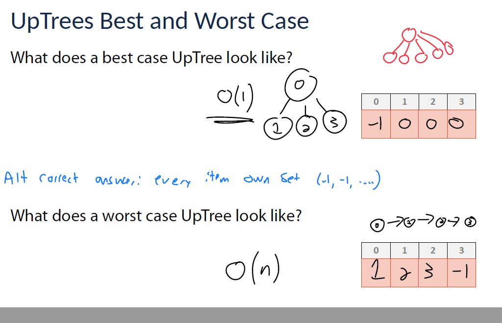

这张图片讨论的是“存储和操作动态群体”的概念。具体解释如下：

- 图片的第一行提到，我们需要一个能够高效查找和更改群体动态的数据结构。这意味着我们需要一种方法来管理一组元素（比如人、物体或节点），这些元素之间的关系或状态可能会随时间变化。
- 图像中包括了几种视觉元素：
  - 左侧的蓝色人物图标代表一个相对独立或分离的群体。
  - 下方的红色群体表示这些个体合并或发生了某种变化，形成了新的群体。
  - 右侧的网格图可能表示一个环境或空间，群体的动态在这样的环境中进行观察（例如模拟中的网格）。
  - 最右下角的图示结构像是一个图形，节点（A、B、C等）可能代表不同的人物或元素，而边则显示它们之间的连接。

总的来说，图片强调了需要一种数据结构（很可能是类似并查集的数据结构），这种结构可以快速查找和更新群体的合并或拆分操作，这种需求在网络管理、聚类分析或动态模拟等应用中非常常见。


这张图片介绍的是“并查集（Disjoint Set）抽象数据类型（ADT）”的概念。并查集是一种用于存储元素之间关系的数据结构，特别适用于处理集合合并和查找操作。具体解释如下：

### 图片内容解析：

- **数据结构简介**：并查集用于存储项之间的关系，它能够有效地管理集合的合并与查询。
- **图示说明**：图中展示了不同的集合，例如：
  - 红色集合包含元素 `{2, 5, 9}`
  - 紫色集合包含元素 `{0, 1, 4, 8}`
  - 蓝色集合包含元素 `{7}`
  - 黄色集合包含元素 `{3, 6}` 各个集合通过某种方式连接，表示它们之间的关系。

### 并查集的基本操作：

1. **find(k)**：此操作用于查找元素 `k` 所在的集合，返回该元素所属集合的代表（通常是集合的根元素）。通过这个操作，我们可以确定元素 `k` 是否与其他元素在同一个集合中。
2. **union(s1, s2)**：这个操作将集合 `s1` 和集合 `s2` 合并成一个新的集合。即如果集合 `s1` 和 `s2` 中的元素不属于同一集合，则将它们合并为一个集合。
3. **Constructor**：该操作用于创建一个新的集合。

### 总结：

并查集主要用于高效地管理动态的集合合并和查询操作，它通过“查找（find）”和“合并（union）”操作来维护集合之间的关系，广泛应用于网络连接问题、图的连通性判断、以及一些优化算法中（如最小生成树、网络流等）。


这张图片进一步解释了“并查集（Disjoint Set）”中每个集合的表示方式，特别是“集合表示（Set Representation）”这一概念。详细解析如下：

### 集合表示：

- 图片中的每个集合（如 `{2, 5, 9}`、`{0, 1, 4, 8}`、`{7}`、`{3, 6}`）的每个元素都共享相同的“集合表示（Set Representation）”。也就是说，集合中的每个元素通过某种方式存储在一起，且都指向同一个“集合表示”。

### 主要操作：

1. **find(4) == find(8)**：
   - 这个操作检查元素 `4` 和元素 `8` 是否属于同一个集合。由于它们都属于同一个集合 `{0, 1, 4, 8}`，因此 `find(4)` 和 `find(8)` 会返回相同的集合表示。
   - **注意**：根据并查集的定义，这两个元素具有相同的“集合表示”，意味着它们位于同一个集合中。
2. **find(4) != find(3)**：
   - 这个操作检查元素 `4` 和元素 `3` 是否属于同一个集合。由于它们分别属于集合 `{0, 1, 4, 8}` 和 `{3, 6}`，它们的“集合表示”不同，因此 `find(4)` 和 `find(3)` 的结果会不相同。
   - **注意**：表示这两个元素不在同一个集合中。

### 如何存储“集合表示”：

- **存储方式**：
  - 可以通过**存储集合的地址或索引**来表示集合。这样，每个元素可以指向一个代表其所在集合的地址或索引。
  - 另一种方式是使用**键值对**的形式：**键（key）**表示元素，**值（value）**表示该元素所属的集合。在这种方式下，每个元素通过键值对存储，其中值就是它所属的集合的代表或标识。

### 总结：

- **并查集**利用一种高效的存储和表示方式来跟踪不同元素的集合关系。每个元素通过指向相同的集合表示来归属于同一个集合。通过`find`操作可以检查两个元素是否属于同一个集合。


这张图片解释了并查集（Disjoint Set）中的 **union（合并）** 操作，具体内容如下：

### union 操作：

- **定义**：`union` 操作用来将两个集合合并为一个集合。在并查集中，如果两个元素属于不同的集合，`union` 操作会把它们所在的集合合并成一个新的集合。
- **图示说明**：
  - 你可以看到集合 `{2, 5, 9}` 和集合 `{7}` 被合并。也就是说，集合 `{2, 5, 9}` 中的元素和集合 `{7}` 中的元素会合并成一个新的集合。

### 代码解释：

- 代码段 `if find(2) != find(7)` 检查元素 `2` 和元素 `7` 是否属于同一个集合。如果它们不属于同一集合（即 `find(2)` 不等于 `find(7)`），那么执行 `union(2, 7)` 操作，表示将包含元素 `2` 的集合和包含元素 `7` 的集合合并为一个集合。

### 键值（key）：

- 在并查集中，每个元素都可以通过一个“键值对”（key-value pair）来存储。图片中提到的 `key 1` 和 `key 2` 代表集合的标识符或元素的键。在执行 `find` 操作时，通过“键”来查找元素所属的集合。

### 操作过程：

1. **find(2)**：查找元素 `2` 所属的集合。
2. **find(7)**：查找元素 `7` 所属的集合。
3. **union(2, 7)**：如果 `2` 和 `7` 不属于同一个集合，则执行 `union` 操作，将这两个集合合并。

### 总结：

- **union** 操作是并查集的重要组成部分，用来合并两个集合。通过合并操作，可以动态地维护多个集合，并且在后续的查询中实现高效的集合查找。


这张图片介绍了**并查集（Disjoint Set）**抽象数据类型（ADT）的基本概念和一些关键思想。具体解释如下：

### ADT（抽象数据类型）：

1. **makeSet(vector items)**：这是并查集的构造函数，它接受一个元素列表（`items`）并将这些元素初始化为单独的集合。每个元素最初是一个独立的集合。
2. **Find(T key)**：此操作用于查找元素 `key` 所在的集合，并返回该集合的代表元素。可以理解为查找“我的群体”。
3. **Union(T k1, T k2)**：此操作将元素 `k1` 和 `k2` 所在的两个集合合并为一个集合。也就是说，它把这两个集合连接在一起，形成一个更大的集合。

### 关键思想：

1. **每个元素都只存在于一个集合中**：
   - 每个元素在并查集中只属于一个集合。这个约定确保了数据结构的正确性，避免元素属于多个集合，造成混乱。
2. **每个集合中的所有元素具有相同的表示**：
   - 在并查集结构中，每个集合中的元素都指向集合的一个**代表元素**（也叫做“规范元素”）。集合内的所有元素都有相同的表示，通常是该集合的代表。
3. **每个集合有不同的表示**：
   - 每个集合都可以有不同的表示方式。代表元素用来标识集合，保证每个集合有唯一的标识。

### 总结：

- **并查集**通过`makeSet`、`Find`、`Union`等操作来维护多个集合并管理它们之间的关系。每个元素在并查集中都有一个**唯一的集合标识**，集合内的元素共享相同的表示，并且每个集合都有不同的表示。


这张图片讨论了**如何实现并查集（Disjoint Set）**数据结构。

### 主要内容：

- **问题**：如何实现一个并查集？

  并查集的实现方式可以有多种，其中提到了两种常见的方式：

  1. **LS（List）**：
     - 可以使用列表（List）来存储每个元素，列表中的每个元素可以记录它的父元素，或者记录它所在集合的代表元素。通常，这种实现方式会比较基础，但对于简单的应用场景已经足够。
  2. **Map / Dictionary**：
     - 另一种常见的实现方式是使用**映射（Map）或字典（Dictionary）**，它们是更灵活的结构。字典可以用来存储每个元素的集合标识符或其父元素，便于高效查找和合并操作。在这种方式下，元素可以通过字典的键值对快速访问其相关信息，通常这对于处理复杂数据和进行优化（如路径压缩、按秩合并等）非常有帮助。

### 总结：

- **并查集（Disjoint Set）**可以通过列表（List）或字典（Map / Dictionary）来实现。字典通常提供更高效和灵活的操作，适合用于更复杂的应用场景。


这张图片展示了并查集（Disjoint Set）的**实现方法 #1**，即使用**数组**来实现并查集，并讲解了相关的操作。

### 主要内容和解释：

#### **实现方式 #1**：

- **分配一个数组**，用于存储所有键的集合信息，每个键的“规范元素”被作为该键的数组索引来存储。数组的每个位置表示一个元素的集合代表。
- **数组示例**：
  - 数组 `0  1  2  3  4  5  6  7` 对应的值 `0  0  2  3  3  3  3  2`，表示每个元素所在集合的代表元素。
  - 比如，元素 `0` 和 `1` 属于同一个集合（由代表元素 `0` 表示），元素 `2` 和 `7` 属于另一个集合，由代表元素 `2` 表示。

#### **关键操作**：

1. **Find(k)**：
   - **操作描述**：查找元素 `k` 所在的集合。
   - **实现方式**：通过数组索引快速查找 `k` 的集合代表。这个操作的时间复杂度是 **O(1)**，即常数时间。
   - **优势**：查找操作非常快，直接通过数组索引获得结果。
2. **Union(k1, k2)**：
   - **操作描述**：将元素 `k1` 和 `k2` 所在的两个集合合并为一个集合。
   - **实现方式**：遍历数组，将所有属于集合 `k1` 的元素更新为集合 `k2` 的代表元素（或反向操作）。
   - **时间复杂度**：此操作的时间复杂度是 **O(n)**，因为可能需要遍历整个数组来更新所有元素的集合代表。
   - **缺点**：相比 `Find(k)` 操作，这个操作较慢，因为它需要遍历数组并更新每个元素。

#### **关键概念**：

- **规范元素（Canonical Element）**：每个集合有一个代表元素，所有属于该集合的元素都指向该代表元素。
- **数组表示**：通过数组存储每个元素所属集合的代表元素，元素的索引是集合的唯一标识。

#### **优缺点**：

- **优点**：
  - `Find(k)` 操作非常快，时间复杂度是 **O(1)**。
  - 使用数组直接索引存储，结构简单易实现。
- **缺点**：
  - `Union(k1, k2)` 操作较慢，需要遍历整个数组更新集合，时间复杂度为 **O(n)**。
  - 当集合数目变多时，更新操作会变得很低效。

### 总结：

这种实现方式通过数组存储每个元素的集合代表，使得查询（`Find`）操作非常快速，但合并（`Union`）操作比较慢。为了优化性能，通常会结合其他技术（如路径压缩或按秩合并）来提高并查集的效率。


这张图片展示了并查集（Disjoint Set）的 **第二种实现方式**，继续使用数组存储集合，更新方式是通过存储代表元素为 `-1`，并且对于每个元素，通过数组值跟踪它指向的父元素。

### **实现方式 #2** 的详细解释：

#### **基本思想**：

- **代表元素（Canonical Element）** 以 `-1` 来表示。这意味着每个集合的代表元素（根节点）会将自己的值设置为 `-1`。
- 其他非根元素则指向它们的父节点（即它们所在集合的代表元素）。

#### **示例**：

对于集合 `{0, 1, 4}`，代表元素是 `0`，因此数组中 `0` 的位置为 `-1`，而元素 `1` 和 `4` 的值是 `0`，表示它们指向 `0`，即它们属于集合 `0`。

数组的状态如下：

```
Index:     0  1  2  3  4  5  6  7
Value:    -1  0 -1 -1  0  3  3  2
```

- 例如，`Find(2)` 会查找 `2` 的值，发现 `2` 的父元素是 `0`，然后 `Find(0)` 发现 `0` 是代表元素（因为它是 `-1`），因此返回 `0`。
- 类似地，`Find(5)` 会追溯到 `3`，因为 `5` 的父元素是 `3`，然后返回 `3`。

### **操作说明**：

1. **Find(k)**：
   - **操作描述**：查找元素 `k` 所在集合的代表元素。
   - **实现方式**：从元素 `k` 开始，不断查找其父元素，直到遇到 `-1`，表示找到了代表元素。
   - **时间复杂度**：最坏情况下为 **O(n)**，即需要遍历整个树的高度。树的高度在最坏情况下可能是 `n`，所以时间复杂度较高。
2. **Union(k1, k2)**：
   - **操作描述**：将 `k1` 和 `k2` 所在的两个集合合并为一个集合。
   - **实现方式**：将其中一个集合的代表元素（根节点）指向另一个集合的代表元素。例如，将 `k1` 所在集合的代表元素指向 `k2` 所在集合的代表元素。
   - **时间复杂度**：由于这只是一个指针更新操作，所以它的时间复杂度是 **O(1)**。

### **总结**：

- **优点**：`Union(k1, k2)` 操作非常高效，时间复杂度是 **O(1)**。
- **缺点**：`Find(k)` 操作可能会比较慢，特别是在集合非常大且树的高度较高时，最坏时间复杂度为 **O(n)**。

为提高效率，通常可以在此基础上进一步优化，例如引入 **路径压缩**（path compression）来降低树的高度，使得后续的查找操作更快。


这张图介绍了并查集的 **实现方式 #2**，比起“实现方式 #1”，这是一个更高效也更经典的实现方式，被称为**“树结构表示法”**，它的主要特点是用**-1**来表示集合的代表元素（根节点），并通过指针（或索引）表示其他元素指向的父节点。

------

### **核心思想**：

> 和前面的方法一样是用数组来表示集合，但方式不同：

- **如果数组中某个位置的值为 `-1`**，说明该位置的元素是这个集合的代表（canonical element / root）。
- **否则，这个值是该元素的“父元素”的索引**，即它指向代表元素或中间节点。

------

### **图示说明**：

#### 左侧的集合：

- 红色集合 `{0, 1, 4}`，代表元素是 `0`，所以数组中 `0` 的值为 `-1`，`1` 和 `4` 的值为 `0`。
- 蓝色集合 `{2, 7}`，代表是 `2`，`2` 的值为 `-1`，`7` 的值为 `2`。
- 紫色集合 `{3, 5, 6}`，代表是 `3`，`3` 的值为 `-1`，`5` 和 `6` 都指向 `3`。

右侧的数组就是这个结构的表示方式：

```
Index:     0  1  2  3  4  5  6  7
Value:    -1  0 -1 -1  0  3  3  2
```

------

### **操作说明**：

#### 1. `Find(k)`：

- 作用：查找元素 `k` 所属集合的代表元素（根）。
- 实现方式：不断查找数组中该索引的值，直到找到 `-1` 为止，即找到代表元素。
- 比如 `Find(6)`：
  - 6 → 3 → -1 → 代表元素是 `3`
- **时间复杂度**：最坏是 O(h)，h 为树的高度。

#### 2. `Union(k1, k2)`：

- 作用：合并元素 `k1` 和 `k2` 所在的两个集合。
- 实现方式：将一个集合的代表元素指向另一个集合的代表元素，也就是**把一个根变成另一个根的子节点**。
- 比如：如果 `k1=2`，`k2=0`：
  - `Find(2)=2`，`Find(0)=0`
  - 可以将 `2` 的数组值设为 `0`，表示集合2归入集合0

------

### **优点**：

- 这种方式避免了每次 `Union` 时遍历整个数组；
- 支持进一步优化，如路径压缩（path compression）和按秩合并（union by rank），可以将时间复杂度接近 **常数时间 O(α(n))**，非常高效。

------

### **总结**：

实现方式 #2 使用树状结构实现并查集，数组中：

- `-1` 表示是集合的代表元素（根节点）；
- 其他值表示指向其父节点；
- `Find` 通过向上查找直到根节点；
- `Union` 将一个根节点连接到另一个根节点；
- 相较于实现 #1，有更好的合并性能，更易于优化。


这张图片进一步展示了 **并查集（Disjoint Set）第二种实现方式** 的使用，重点解释了 **Union** 和 **Find** 操作的实现。

### **实现方式 #2** 解释：

- 在这张图中，依旧是通过数组存储每个元素的信息，代表元素（即集合的根节点）以 **`-1`** 表示，其他非根节点通过指向父元素来建立集合的关系。

#### **当前数组状态**：

```
Index:     0  1  2  3  4  5  6  7
Value:    -1  0 -1 -1  0  3  3  2
```

这表示：

- 集合 `{0, 1, 4}` 由元素 `0` 作为代表元素。
- 集合 `{2, 7}` 由元素 `2` 作为代表元素。
- 集合 `{3, 5, 6}` 由元素 `3` 作为代表元素。

### **Union(4, 7)** 操作：

- **描述**：将元素 `4` 和 `7` 所在的集合合并。

- **具体操作**：

  - 首先，`Find(4)` 会找到 `0`，因为 `4` 指向 `0`，而 `0` 是集合 `{0, 1, 4}` 的代表元素。
  - 然后，`Find(7)` 会找到 `2`，因为 `7` 指向 `2`，而 `2` 是集合 `{2, 7}` 的代表元素。
  - 由于 `0` 和 `2` 是不同的代表元素，执行 `Union(4, 7)` 就是将 `2` 的值更新为 `0`，表示把集合 `{2, 7}` 合并到集合 `{0, 1, 4}` 中。

- **结果**：更新后的数组变成：

  ```
  Index:     0  1  2  3  4  5  6  7
  Value:    -1  0  0  -1  0  3  3  2
  ```

### **Find(7)** 操作：

- **描述**：查找元素 `7` 所属的集合的代表元素。
- **具体操作**：
  - `Find(7)` 会查找 `7` 的父节点，发现 `7` 的父节点是 `2`。
  - 然后，查找 `2` 的父节点，发现 `2` 的父节点是 `0`（因为在 `Union(4, 7)` 操作后，`2` 被更新为指向 `0`）。
  - 最终返回 `0`，表示集合 `{0, 1, 4, 2, 7}` 的代表元素是 `0`。
- **结果**：`Find(7)` 结果是 `0`，表示元素 `7` 所在的集合由 `0` 代表。

### **总结**：

- **Union** 操作通过将一个集合的代表元素（根）指向另一个集合的代表元素，实现了集合的合并。通过改变指向，两个集合合并为一个集合。
- **Find** 操作通过不断查找父元素，最终找到集合的代表元素。这是一个递归查找过程，直到找到值为 `-1` 的元素，即代表元素。

这种实现方式相对简单，但效率较低，尤其是对于高度较大的集合，查找操作可能会变得较慢。因此，通常会结合路径压缩等优化技术来提高效率。


这张图展示了 **UpTrees**（上树）的概念，它是并查集（Disjoint Set）的一种优化表示，常用于高效地进行集合的查找和合并。

### **UpTrees 解释**：

#### **图解步骤**：

1. **初始状态**：

   - 数组 `[-1, -1, -1, -2]` 表示每个元素独立成一个集合，并且每个元素的父节点是其自身（代表元素），数组中的 `-1` 表示它是代表元素。
   - 图中显示了每个元素为自己的根节点，且初始时每个集合的树高度为 1。

   ```
   Index:     0   1   2   3
   Value:    -1  -1  -1  -2
   ```

   这时的状态是：

   - 集合 `{0}`，代表元素是 `0`。
   - 集合 `{1}`，代表元素是 `1`。
   - 集合 `{2}`，代表元素是 `2`。
   - 集合 `{3}`，代表元素是 `3`。

2. **Union(0, 3)** 操作：

   - **操作描述**：将元素 `0` 和 `3` 合并为一个集合。
   - 执行 `Union(0, 3)` 后，`0` 的集合代表元素变成了 `3`，所以我们将 `A[0]` 更新为 `3`，表示 `0` 属于集合 `{3}`。
   - 更新后的数组状态：

   ```
   Index:     0   1   2   3
   Value:    -1   0   3  -1
   ```

   - 图示中显示了合并后的树结构，`3` 是新的代表元素，`0` 的父节点变成了 `3`。

3. **Union(1, 2)** 操作：

   - **操作描述**：将元素 `1` 和 `2` 合并为一个集合。
   - 执行 `Union(1, 2)` 后，`1` 的集合代表元素变成了 `2`，所以我们将 `A[1]` 更新为 `2`，表示 `1` 属于集合 `{2}`。
   - 更新后的数组状态：

   ```
   Index:     0   1   2   3
   Value:    -1   0   3  -1
   ```

4. **Union(2, 3)** 操作：

   - **操作描述**：将元素 `2` 和 `3` 合并为一个集合。
   - 执行 `Union(2, 3)` 后，`2` 的集合代表元素变成了 `3`，所以我们将 `A[2]` 更新为 `3`，表示 `2` 属于集合 `{3}`。
   - 更新后的数组状态：

   ```
   Index:     0   1   2   3
   Value:    -1   0   3  -1
   ```

------

### **总结**：

- **UpTrees** 是一种高效表示集合的结构，其中每个元素指向它的父节点，并且树的根节点用 **`-1`** 表示。
- 每次 `Union` 操作时，会合并两个集合并通过修改数组更新父节点。
- `Find` 操作通过从元素开始向上查找，直到找到根节点（即值为 `-1` 的元素），确定集合的代表元素。



这张图片展示了 **UpTrees** 的最佳情况和最坏情况的结构，以及相应的时间复杂度分析。

### **UpTrees Best and Worst Case 解释**：

#### **最佳情况**：

- **描述**：在最佳情况下，**每个集合都是独立的**，即每个元素都是自己的代表元素，数组中的所有元素的值为 `-1`。
- **图示**：
  - 数组状态：`[-1, -1, -1, -1]`。
  - 图中的树形结构展示了每个元素都是独立的根节点（即每个元素的父节点为自己，代表元素为 `-1`）。
- **时间复杂度**：
  - **Find(k)** 操作的时间复杂度是 **O(1)**，因为每个元素都是根节点，查找直接返回元素本身即可。
  - **Union(k1, k2)** 操作也可以在常数时间内完成，因为每个元素都在独立的集合中，所以不需要遍历树结构进行合并。

#### **最坏情况**：

- **描述**：在最坏情况下，所有元素都被合并成一个单一的树结构，即每个元素都指向下一个元素作为其父节点。这种情况导致了高度为 `n` 的树结构。
- **图示**：
  - 数组状态：`[1, 2, 3, -1]`。
  - 图中的树形结构展示了一个单链条，每个元素都指向下一个元素作为父节点。
  - 例如，`0` 指向 `1`，`1` 指向 `2`，`2` 指向 `3`，`3` 是根节点，代表整个集合。
- **时间复杂度**：
  - **Find(k)** 操作的时间复杂度是 **O(n)**，因为需要沿着树向上查找直到根节点。
  - **Union(k1, k2)** 操作的时间复杂度也是 **O(n)**，因为需要遍历整个树来更新父节点。

### **总结**：

- **最佳情况**：每个元素独立为一个集合，查找和合并操作都非常快速，时间复杂度为 **O(1)**。
- **最坏情况**：所有元素被合并成一条链，查找和合并操作的时间复杂度为 **O(n)**，树的高度为 `n`，这是效率最低的情况。

为了避免最坏情况，通常可以通过 **路径压缩（path compression）** 和 **按秩合并（union by rank）** 等技术优化并查集的性能，从而使查找操作接近常数时间。


这张图片展示了 **并查集（Disjoint Set）** 的一种 **UpTree** 实现方式，并分析了相应的时间复杂度。

### **Disjoint Sets Representation 解释**：

#### **基本概念**：

- **UpTree** 是一种优化后的树结构表示方式，用于存储并查集的集合。
- 在数组中，每个元素的值表示该元素的父节点的索引，根节点（代表元素）则用 **`-1`** 表示。

#### **数组表示**：

- 数组中的 **`-1`** 表示一个集合的根节点或代表元素。
- 其他元素则存储它们的父节点的索引。例如，如果数组中 `A[i] = j`，则表示元素 `i` 的父节点是 `j`。

#### **例子**：

- 假设有如下的树结构：

  - 元素 `2` 是集合的代表元素，数组中 `A[2] = -1`，表示 `2` 是根节点。
  - 元素 `1` 和 `3` 都指向 `2`，即 `A[1] = 2` 和 `A[3] = 2`，表示它们的父节点是 `2`。

  树的结构如下：

  ```
      2
     / \
    1   3
  ```

  对应的数组为：

  ```
  Index: 0  1  2  3
  Value: -1  2  -1  2
  ```

#### **时间复杂度**：

1. **Find(k)**：
   - 查找操作会遍历树直到找到根节点（即值为 `-1` 的元素）。最坏情况下，树的高度为 `h`，因此 **`Find(k)`** 的时间复杂度是 **O(h)**，其中 `h` 是树的高度。
   - 树的高度可能随着并查集的操作增加而增长，尤其是在没有优化的情况下，最坏情况下可能是线性的。
2. **Union(k1, k2)**：
   - 合并操作会将两个集合的根节点连接起来，通常可以通过更新父节点的值来完成。
   - 在没有路径压缩优化的情况下，**`Union(k1, k2)`** 的时间复杂度是 **O(1)**，即常数时间。

#### **图示说明**：

- 上面的树表示，`Find` 操作会查找 `k` 所在集合的代表元素，最坏情况下需要遍历树的高度。
- `Union` 操作将两个树的根节点连接到一起，使得一个集合的根指向另一个集合的根。

### **总结**：

- **UpTree** 是一种用数组表示并查集的优化结构，根节点用 `-1` 表示，其他元素通过数组值指向其父节点。
- **Find(k)** 操作的时间复杂度为 **O(h)**，其中 `h` 是树的高度；而 **Union(k1, k2)** 操作的时间复杂度为 **O(1)**，因为它只是简单的更新父节点指向。


这张图讲解了并查集中的 **Find** 操作，如何在 UpTree（上树）结构中工作，并分析了其运行时间及理想结构。

------

### **代码解析：Find 函数**

```cpp
int DisjointSets::find(int i) {
    if (s[i] < 0) { return i; }       // 如果是根节点（代表元素），直接返回
    else { return find(s[i]); }      // 否则递归向上查找父节点
}
```

这个函数的逻辑是：

- 如果当前元素 `i` 是集合的根（即 `s[i] < 0`），就返回它；
- 否则，递归查找其父节点的父节点，直到找到根为止。

------

### **图示说明：Find(1)**

- 示例集合为 `{0, 1, 4, 8}`，代表元素为 `4`，组成一棵树结构：

  ```
      4
     / \
    0   8
          \
           1
  ```

- 数组表示如下：

```
索引:   0  1  2  3  4  5  6  7  8  9
值:     4  8     ? -1           4
```

其中：

- `s[1] = 8` 表示 1 的父节点是 8，
- `s[8] = 4` 表示 8 的父节点是 4，
- `s[4] = -1` 表示 4 是根节点（代表元素）。

所以，执行 `Find(1)` 会执行路径：

```
1 → 8 → 4（根）
```

------

### **时间复杂度 Running Time**

- 时间复杂度为 **O(h)**，其中 `h` 是树的高度。
- 如果树退化成链（比如一条直线），最坏情况下复杂度接近 **O(n)**。

------

### **理想的 UpTree 是什么样？**

图中给出理想 UpTree 的形状：

- **一个根节点，所有元素直接连在根节点下（星形结构）**
- 在这种结构下，`Find(x)` 只需要一次访问即可找到根，时间复杂度为 **O(1)**。

------

### **总结**

- **Find 操作**是通过递归查找父节点直到根节点来确定元素属于哪个集合；
- 在最坏情况下（链式结构），Find 的时间是 O(n)；
- **理想的 UpTree** 是“所有节点直接连接根”的扁平结构，Find 时间是 O(1)；
- 实际实现中，我们常使用 **路径压缩** 来自动构建更接近理想的 UpTree，提升查找效率。


这张图片展示了并查集（Disjoint Set）的 **Union** 操作，具体是通过一个**朴素的实现**来将两个集合合并。图中的代码、树状结构和数组表示帮助说明了操作的执行过程。

### **Union 操作代码解析**：

```cpp
int DisjointSets::union(int r1, int r2) {
    // Naive Implementation
    s[r2] = r1;
}
```

- **目的**：将元素 `r1` 和 `r2` 所在的两个集合合并。
- **操作步骤**：
  - 直接将元素 `r2` 的父节点更新为 `r1`，即把 `r2` 所在集合的代表元素（根节点）指向 `r1` 所在集合的代表元素。
  - 这实际上是把集合 `r2` 合并到集合 `r1` 上，`r1` 成为新的集合的代表元素。

### **图示解释**：

1. **初始状态**：

   - 元素 `0` 和 `4` 分别是两个独立的集合，它们的代表元素是各自的根节点。

   - 数组状态：

     ```
     Index: 0  1  2  3  4  5  6  7  8  9
     Value: -1 8  4  ?  4  ?  ?  ?  4
     ```

     其中：

     - `s[0] = -1` 表示 `0` 是集合的代表元素。
     - `s[4] = -1` 表示 `4` 是集合的代表元素。
     - `s[8] = 4` 表示 `8` 是集合 `{8, 1}` 的成员，指向 `4`，而 `4` 是集合 `{4, 8, 1}` 的代表元素。

2. **执行 `Union(0, 4)`**：

   - `0` 和 `4` 是两个独立的集合，执行 `Union(0, 4)` 后，我们将 `s[4] = 0`，使得元素 `4` 指向 `0`，即 `4` 的父节点更新为 `0`。
   - 合并后，`0` 成为新的代表元素，`4` 成为 `0` 的子节点。

3. **结果数组**：

   ```
   Index: 0  1  2  3  4  5  6  7  8  9
   Value: -1 8  4  ?  0  ?  ?  ?  4
   ```

   - 现在，元素 `4` 的父节点指向 `0`，表示元素 `4` 已经属于集合 `{0, 4, 8, 1}`，而 `0` 是这个集合的代表元素。

4. **合并后的树结构**：

   - 树的结构如下：

   ```
       0
      / \
     4   8
         /
        1
   ```

### **运行时间（Big O 复杂度）**：

- **Union** 操作的时间复杂度是 **O(1)**，因为它只是简单地修改数组中的一个值（将 `r2` 的父节点指向 `r1`）。
- 需要注意的是，在实现中，假设每次 `Union` 前我们已经使用 `Find` 确保 `r1` 和 `r2` 都是根节点（代表元素）。如果 `Find` 还未执行，`Union` 可能需要先通过 `Find` 查找代表元素，执行 `Find` 时的时间复杂度是 **O(h)**，其中 `h` 是树的高度。

### **总结**：

- **Union(0, 4)** 操作将元素 `4` 所在的集合和元素 `0` 所在的集合合并，更新了数组中的值，将 `4` 的父节点指向 `0`。
- **Union** 操作的时间复杂度为 **O(1)**，但 `Find` 操作的时间复杂度可能更高，取决于树的高度。


这张图片展示了 **并查集（Disjoint Sets）** 中的 **Union** 操作，重点在于如何合并两个集合，尤其是在考虑树的高度和结构时。

### **图示解释**：

1. **左侧树**表示第一个集合，包含元素 `0, 1, 2, 3, 6, 7, 8, 9`，其树的高度（h）为 `2`，并且总元素数量为 `8`（n = 8）。根节点是 `7`。
   - 数组表示：`[6, 6, 6, -1, 10, 7, -1, 7, 7, 4, 5]`，表示每个元素的父节点。
     - `s[7] = -1` 表示 `7` 是根节点。
     - `s[6] = 7` 表示 `6` 的父节点是 `7`，表示它属于集合 `{0, 1, 2, 3, 6, 7, 8, 9}`。
2. **右侧树**表示第二个集合，包含元素 `4, 5, 10, 11`，其树的高度（h）为 `3`，并且总元素数量为 `4`（n = 4）。根节点是 `4`。
   - 数组表示：`[7, 4, 4, -1, 7, 7, 4, 4, 5]`，表示每个元素的父节点。
     - `s[4] = -1` 表示 `4` 是根节点。
     - `s[10] = 4` 表示 `10` 的父节点是 `4`。

### **Union(4, 7)** 操作：

- 目的是合并元素 `4` 所在的集合和元素 `7` 所在的集合。

- **合并方式**：`4` 的父节点更新为 `7`，即将 `4` 所在集合的根节点 `4` 连接到 `7` 所在集合的根节点 `7`。

- **更新后的数组**：

  - `s[4] = 7`，表示 `4` 的父节点是 `7`，即 `4` 所在的集合被并入 `7` 所在的集合。

- **合并后的树结构**：

  ```
      7
     / \
    6   4
   / \   \
  0   1   10
      |
      2
  ```

### **Union(7, 4)** 操作：

- 目的是再将集合 `4` 和集合 `7` 交换顺序，执行 `Union(7, 4)`。
- 但由于树已经合并，根节点已经是 `7`，因此该操作会发生在树结构优化方面，比如通过 **按秩合并**（union by rank）来保持树的平衡。

### **时间复杂度**：

- **Union 操作的时间复杂度**是 **O(1)**，因为它只涉及数组更新，而不需要遍历整个集合。
- **Find 操作的时间复杂度**是 **O(h)**，其中 `h` 是树的高度。在合并操作时，树的高度会增加，因此我们尽量避免树的高度过高，通常会结合路径压缩来优化查找操作。

### **理想的 UpTree 结构**：

理想的 **UpTree** 结构是树的高度为 **O(1)**，即树的高度非常小，通常接近于常数时间。为了达到这个目标，我们需要通过优化操作（如路径压缩和按秩合并）来确保树保持平衡。


这张图片讲解了 **并查集（Disjoint Set）** 的 **智能合并（Smart Union）** 操作，特别是通过 **按高度合并（Union by Height）** 来优化树的结构。

### **Union by Height（按高度合并）** 解释：

#### **概念**：

- **Union by Height** 是一种优化策略，旨在通过合并时选择树较短的根作为树的根节点，从而避免树的高度过大，提高 **Find** 操作的效率。
- 在树的高度较小的情况下，查找操作的时间复杂度将大大降低。

#### **图示说明**：

1. **初始状态**：

   - 左边的树代表集合 `{0, 1, 2, 3, 6, 7, 8, 9}`，树的高度（h）为 `2`。
   - 右边的树代表集合 `{4, 5, 10, 11}`，树的高度（h）为 `3`。

2. **Union(4, 7)** 操作：

   - 执行 `Union(4, 7)` 后，我们需要合并这两个集合。
   - **按高度合并**时，我们会将高度较小的树作为较大树的子树。由于集合 `{4, 5, 10, 11}` 的树高度为 `3`，而集合 `{0, 1, 2, 3, 6, 7, 8, 9}` 的树高度为 `2`，因此我们将树高为 `2` 的集合并入树高为 `3` 的集合。
   - 在这种情况下，根节点 `7` 的树将成为根节点 `4` 树的子树。

3. **更新后的数组**：

   - 更新后的数组表示了树的结构：

     ```
     Index:  0   1   2   3   4   5   6   7   8   9   10   11
     Value:  6   6   8   -1  4   10  7   7   7   7   4   5
     ```

   - 数组表示了每个元素的父节点，并且代表元素（根节点）存储了 **`- (height + 1)`** 的值来表示树的高度。

     - 例如，`s[7] = 7` 表示 `7` 的父节点是 `7`，并且它是集合的代表元素，树的高度为 `3`。

4. **树的合并后结构**：

   - 合并后的树结构如下：

     ```
         4
        / \
       7   10
      / \
     0   1
     ```

   / 
    2   3

   ```
   
   ```

#### **优化策略：为什么要按高度合并？**

- **基础情形**：如果每次都将一棵树作为另一棵树的子树，树的高度会逐渐增加，最终可能导致线性链结构，这样 `Find` 操作的时间复杂度变为 **O(n)**，非常低效。
- **按高度合并**：通过总是将较短的树合并到较高的树中，保持树的高度尽可能小，最理想的情形是树的高度 **O(log n)**，这样 `Find` 操作的时间复杂度就会大大降低。

#### **总结：**

- **Union by Height** 是通过将较短的树合并到较高的树中来优化并查集的性能，减少树的高度，进而提高查找操作的效率。
- 在此实现中，根节点（代表元素）的值存储了树的高度，采用 `- (height + 1)` 的方式来表示树的深度。
- **Union(4, 7)** 操作通过按高度合并，确保树的高度最小，优化了后续的查找操作。

这张图片讲解了 **并查集（Disjoint Set）** 的 **智能合并（Smart Union）** 操作，特别是通过 **按高度合并（Union by Height）** 来优化树的结构。

### **Union by Height（按高度合并）** 解释：

#### **概念**：

- **Union by Height** 是一种优化策略，旨在通过合并时选择树较短的根作为树的根节点，从而避免树的高度过大，提高 **Find** 操作的效率。
- 在树的高度较小的情况下，查找操作的时间复杂度将大大降低。

#### **图示说明**：

1. **初始状态**：

   - 左边的树代表集合 `{0, 1, 2, 3, 6, 7, 8, 9}`，树的高度（h）为 `2`。
   - 右边的树代表集合 `{4, 5, 10, 11}`，树的高度（h）为 `3`。

2. **Union(4, 7)** 操作：

   - 执行 `Union(4, 7)` 后，我们需要合并这两个集合。
   - **按高度合并**时，我们会将高度较小的树作为较大树的子树。由于集合 `{4, 5, 10, 11}` 的树高度为 `3`，而集合 `{0, 1, 2, 3, 6, 7, 8, 9}` 的树高度为 `2`，因此我们将树高为 `2` 的集合并入树高为 `3` 的集合。
   - 在这种情况下，根节点 `7` 的树将成为根节点 `4` 树的子树。

3. **更新后的数组**：

   - 更新后的数组表示了树的结构：

     ```
     Index:  0   1   2   3   4   5   6   7   8   9   10   11
     Value:  6   6   8   -1  4   10  7   7   7   7   4   5
     ```

   - 数组表示了每个元素的父节点，并且代表元素（根节点）存储了 **`- (height + 1)`** 的值来表示树的高度。

     - 例如，`s[7] = 7` 表示 `7` 的父节点是 `7`，并且它是集合的代表元素，树的高度为 `3`。

4. **树的合并后结构**：

   - 合并后的树结构如下：

     ```
         4
        / \
       7   10
      / \
     0   1
     ```

   / 
    2   3

   ```
   
   ```

#### **优化策略：为什么要按高度合并？**

- **基础情形**：如果每次都将一棵树作为另一棵树的子树，树的高度会逐渐增加，最终可能导致线性链结构，这样 `Find` 操作的时间复杂度变为 **O(n)**，非常低效。
- **按高度合并**：通过总是将较短的树合并到较高的树中，保持树的高度尽可能小，最理想的情形是树的高度 **O(log n)**，这样 `Find` 操作的时间复杂度就会大大降低。

#### **总结：**

- **Union by Height** 是通过将较短的树合并到较高的树中来优化并查集的性能，减少树的高度，进而提高查找操作的效率。
- 在此实现中，根节点（代表元素）的值存储了树的高度，采用 `- (height + 1)` 的方式来表示树的深度。
- **Union(4, 7)** 操作通过按高度合并，确保树的高度最小，优化了后续的查找操作。


这张图讲的是并查集（Disjoint Sets）中的**智能合并（Smart Union）**策略，主要包括两种优化方法：

- **按高度合并（Union by height）**
- **按大小合并（Union by size）**

目的是让树结构保持尽可能“矮”，从而使查找（Find）操作更高效。

------

## 一、按高度合并（Union by height）

### 概念：

- 将**高度较小的树**连接到**高度较大的树**下方；
- 若两棵树高度相等，任选一棵作为新根，并将高度加 1；
- 根节点数组中存储的是 **`- (height + 1)`**，作为负数记录高度信息。

### 图中解释：

- 图中左侧为一棵高度为 2 的树（以 7 为根）；
- 右侧为一棵高度为 3 的链状树（以 4 为根）；
- 合并时执行 `Union(4, 7)`，高度为 2 的树合并到高度为 3 的树中；
- 所以数组中 `s[7] = 4`，表示 7 指向 4；
- 而 `s[4] = -4` 表示合并后树的高度为 3 + 1 = 4。

------

## 二、按大小合并（Union by size）

### 概念：

- 将**节点数较少的树**连接到**节点数较多的树**下；
- 根节点数组中存储的是 **`-size`**，记录树中元素的数量（负号区分代表元素）；
- 每次合并后，将新集合的大小累加到新的根节点上。

### 图中解释：

- 图中左侧树的大小为 8，右侧树大小为 4；
- 执行 `Union(4, 7)`，把 4 所在的集合并到 7 上；
- 更新后 `s[7] = -12` 表示集合大小为 12 个元素；
- 原来 `s[4] = 7` 表示 4 指向 7，不再是根。

------

## 三、路径压缩（Path Compression）

蓝色虚线部分提到了一种优化策略：**路径压缩**

- 在 `Find(x)` 时，将路径上所有节点直接连接到根；
- 减少以后 `Find` 的层级；
- 图中标出的问题是：“为什么不将 `s[0] = 7`？”即在 `Find(0)` 后直接让它指向根。

------

## 四、时间复杂度总结

无论是按高度合并还是按大小合并（+路径压缩），都能保证：

> 树的高度最多为 **O(log n)**
>  所以 **Find** 操作几乎可以看作是常数时间 —— **O(α(n))**，α 是阿克曼函数的反函数，极慢增长。

------

## 总结一句话：

- **Union by Height** 保证“树矮”；
- **Union by Size** 保证“树大”（越多元素越当根）；
- 二者结合 **路径压缩**，让并查集查询操作效率极高。


这张图展示了 **并查集（Disjoint Set）** 的一种实现方式，使用 **UpTree** 结构通过数组来表示集合的树结构，同时优化了 `Find` 和 `Union` 操作。

### **实现方式解释**：

#### **UpTree 结构**：

- 每个集合通过树的根节点表示，而树的深度（高度）通过负数表示，即根节点的值为 **`-height`** 或 **`-size`**（根据优化策略不同）。
- 树的节点表示每个元素及其父节点关系：
  - **负数表示根节点**，即集合的代表元素。
  - **非根节点** 指向其父节点。

#### **Find(k) 操作**：

- `Find(k)` 通过数组索引不断查找元素 `k` 的父节点，直到遇到负值（即根节点）。这样就能返回该元素所在集合的代表元素。
- **Find 操作的时间复杂度**是 **O(h)**，其中 `h` 是树的高度。理想情况下，树的高度应该保持较低，以确保查找操作的效率。

#### **Union(k1, k2) 操作**：

- **Union(k1, k2)** 操作的目的是将 `k1` 和 `k2` 所在的集合合并。
- **合并时的优化策略**：
  - **按大小或高度合并**：将较小的树（或者高度较低的树）合并到较大的树中，这样可以避免树的高度增加。
  - `Union` 会更新 `k2` 所在集合的代表元素，使其指向 `k1` 的代表元素，或者反之。
  - 合并后，还需要更新剩余根节点的值，即更新树的根节点的大小或高度。

#### **数组表示**：

- 数组的每个位置表示一个元素，数组中的值表示该元素的父节点：

  - 负值表示该元素是根节点，负值的绝对值表示树的高度。
  - 正值表示该元素指向它的父节点。

  在图中，数组表示如下：

  ```
  Index:     0   1   2   3   4   5   6   7
  Value:    0    3   3   -1  7   7   2
  ```

  - `s[3] = -1` 表示元素 3 是根节点，它是一个单独的集合，树的高度为 1。
  - `s[7] = 2` 表示元素 7 的父节点是 2，元素 7 在集合 `{7, 8}` 中。

------

### **总结**：

- **Find(k)** 操作：通过数组的索引递归查找父节点，直到找到根节点。时间复杂度为 O(h)，h 为树的高度。
- **Union(k1, k2)** 操作：通过将较小的树合并到较大的树中，减少树的高度，提高查找操作的效率。时间复杂度为 O(1)，如果仅考虑指针更新。


这张图讨论的是使用**按大小合并**（Union by Size）策略优化**不相交集合**（Disjoint Sets）的合并操作。

### **Claim 1:**

- **断言**：使用按大小合并的集合，其树的高度最多为 O(log⁡2n)O(\log_2 n)。
  - **解释**：通过按大小合并（即总是将较小的树合并到较大的树上），可以控制树的高度，使其不会过高，从而优化查找操作。最终，树的高度最多是 O(log⁡n)O(\log n)，这意味着查找操作的时间复杂度为 O(log⁡n)O(\log n)。

### **Claim 2:**

- **断言**：一个高度为 hh 的上树（UpTree）至少有 2h2^h 个节点。
  - **解释**：该断言通过数学归纳法进行证明，证明了树的高度与节点数量之间的关系。如果一棵树的高度为 hh，那么该树至少包含 2h2^h 个节点。这个事实有助于证明按大小合并策略可以有效地控制树的高度。

### **Base Case:**

- **基本情况**：当 n=2n = 2 时，树的高度 h=0h = 0，表示最初的两个元素构成一个集合，不需要任何合并操作，树的高度为零。
  - **证明**：对于 n=2n = 2，树的高度为 0，符合要求。

### 总结

这张图通过两条断言和归纳法的证明，强调了使用按大小合并的优化方法可以有效控制不相交集合操作中树的高度，从而提高查找和合并操作的效率。最终，树的高度最多为 O(log⁡2n)O(\log_2 n)，大大降低了操作的复杂度。


这张图继续讨论了**按大小合并**（Union by Size）策略的优化过程，特别是涉及到**不相交集合**（Disjoint Sets）中的**树高度**以及合并的方式。

### **Claim**

- **断言**：高度为 hh 的上树（UpTree）至少包含 2h2^h 个节点。换句话说，树的高度和树中节点的数量之间有直接的关系。树的高度越大，节点的数量至少是 2h2^h 个。

### **归纳假设（IH）**

- 假设断言对于 i−1i-1 高度的树成立，即如果树的高度是 i−1i-1，则节点的数量至少是 2i−12^{i-1}。
- 目标是证明对于高度为 ii 的树，节点的数量至少是 2i2^i。

### **合并操作**

- 给定两个集合 AA 和 BB，其中 BB 是较大的集合。我们总是将较小的集合 AA 合并到较大的集合 BB 中。

### **需要证明的高度情况**

图中列出了合并操作中可能出现的三种高度情况，我们需要逐一证明：

1. **情况1：** h(A)<h(B)h(A) < h(B)
   - 这表示集合 AA 的高度小于集合 BB 的高度。合并时，AA 会合并到 BB 中，并且树的高度不会增加。
2. **情况2：** h(A)=h(B)h(A) = h(B)
   - 这表示集合 AA 和 BB 的高度相等。在这种情况下，我们通常会选择将其中一个集合合并到另一个集合，并且树的高度会增加 1。
3. **情况3：** h(A)>h(B)h(A) > h(B)
   - 这表示集合 AA 的高度大于集合 BB 的高度。通常，按大小合并策略会选择将 BB 合并到 AA 中，以确保树的高度不会增加。

### **总结**

- 按大小合并策略旨在将较小的集合合并到较大的集合中，从而有效地控制树的高度，避免形成长链条，降低查询操作的时间复杂度。
- 对于每一种可能的高度情况，我们都需要证明合并操作如何影响树的高度，以确保最终树的高度不会过高。


这张图继续探讨了**按大小合并**（Union by Size）策略在**不相交集合**（Disjoint Sets）中的应用，特别是如何在每次合并操作中控制树的高度。

### **Claim**

- **断言**：高度为 hh 的上树（UpTree）至少包含 2h2^h 个节点。这表明，树的高度与树中包含的节点数量有关，树的高度越大，节点数越多。

### **归纳假设（IH）**

- 假设该断言对于 i−1i-1 次合并操作成立，即在进行了 i−1i-1 次合并后，树的高度符合断言。接下来，我们需要证明对于第 ii 次合并操作，断言依然成立。

### **没有丧失一般性，假设 BB 是较大的集合**

- 在进行合并时，我们不失一般性地假设集合 BB 是较大的集合。也就是说，始终将较小的集合 AA 合并到较大的集合 BB 中，以确保树的高度增长最小。

1. - 

### **总结**

这张图展示了在进行不相交集合合并操作时，如何根据集合的大小和树的高度来控制合并过程，以确保树的高度在合并后保持较低，从而提高查找操作的效率。通过按大小合并策略，树的高度增长受到控制，最终使得树的高度最多为 O(log⁡n)O(\log n)。


这张图继续讲解了**按大小合并**（Union by Size）策略在**不相交集合**（Disjoint Sets）中的应用，重点分析了在合并操作时树的高度变化。

### **Claim**

- **断言**：高度为 hh 的上树（UpTree）至少有 2h2^h 个节点。这意味着树的高度与树中节点的数量之间有一定的关系，树越高，包含的节点数也越多。

- 

### **最终高度**

- 通过按大小合并策略，集合 AA 和 BB 的合并操作后，树的高度不变，仍然为 h(B)h(B)。最终，集合 BB 的大小会增加，但树的高度不会增加。

### 总结

这一部分展示了**按大小合并**在不相交集合操作中的优势，特别是当集合的高度不相等时，按大小合并能够确保树的高度保持不变，从而提高后续操作的效率。


这张图继续分析了**按大小合并**（Union by Size）策略在**不相交集合**（Disjoint Sets）中的应用，特别是在合并操作后树的高度和大小的变化。

### **Claim**

- **断言**：一个高度为 hh 的上树（UpTree）至少包含 2h2^h 个节点。这个断言强调了树的高度和节点数量之间的关系，树的高度越大，节点的数量至少是 2h2^h。

### **归纳假设（IH）**

- 假设该断言对于 i−1i-1 次合并操作成立，即在进行 i−1i-1 次合并后，树的高度和节点数量满足断言。接下来，我们需要证明在第 ii 次合并操作时，树的高度和节点数量依然符合该断言。

### **情况1：** h(A)<h(B)h(A) < h(B)

- **理想情况**：当集合 AA 的高度小于集合 BB 的高度时，按大小合并策略将较小的集合 AA 合并到较大的集合 BB 中。此时，树的高度不发生变化，即合并操作后集合 BB 的高度保持不变。
- **树的高度不变**：由于 AA 的高度小于 BB 的高度，合并后树的高度不会增加，仍然保持为 h(B)h(B)，即 h(B′)=h(B)h(B') = h(B)，合并后的树的高度与合并前相同。

- 

### **总结**

这张图展示了按大小合并时，集合 AA 和集合 BB 的高度和大小是如何影响合并操作后的结果。在理想情况下，按大小合并策略能够确保树的高度保持不变，并且集合的大小满足节点数量与高度之间的关系。


这张图继续分析了**按大小合并**（Union by Size）策略在**不相交集合**（Disjoint Sets）中的应用，特别是在当两个集合的高度相等时，如何影响树的高度变化。

### **Claim**

- **断言**：一个高度为 hh 的上树（UpTree）至少有 2h2^h 个节点。这个断言表明，树的高度和树中节点的数量之间有关系，树的高度越大，包含的节点数至少是 2h2^h。

### **归纳假设（IH）**

- 假设对于 i−1i-1 次合并操作，断言成立，即在进行 i−1i-1 次合并后，树的高度和节点数量满足断言。接下来，我们需要证明在第 ii 次合并操作时，断言依然成立。

### **情况2：** h(A)=h(B)h(A) = h(B)

- **当两个集合的高度相等时**，合并操作的影响不同于前面讨论的情况。在这种情况下，按大小合并策略会将两个高度相等的集合合并在一起，此时树的高度会增加 1。
- **树的高度增加**：当集合 AA 和集合 BB 的高度相等时，合并操作会使树的高度增加。新的树的高度变为 h(B′)=h(B)+1h(B') = h(B) + 1，即合并后的树的高度比合并前高 1。

### 

- 这张图展示了当两个集合的高度相等时，按大小合并会导致树的高度增加 1。合并后的集合大小是两个集合大小之和，且合并后的树的高度比合并前的高度增加。按大小合并策略有效地控制了树的高度，并在合并时确保高度增加不超过 1，从而优化了查询操作的时间复杂度。


这张图继续探讨了**按大小合并**（Union by Size）策略在**不相交集合**（Disjoint Sets）中的应用，尤其是在**高度较大的树合并到高度较小的树**时，树的高度变化和大小的计算。

### **Claim**

- **断言**：一个高度为 hh 的上树（UpTree）至少有 2h2^h 个节点。这表明树的高度和树中包含的节点数之间有关系，树的高度越大，包含的节点数至少是 2h2^h。

### **归纳假设（IH）**

- 假设该断言对于 i−1i-1 次合并操作成立，即在进行了 i−1i-1 次合并后，树的高度和节点数量符合该断言。接下来，我们需要证明在第 ii 次合并操作时，断言依然成立。

### **情况3：** h(A)>h(B)h(A) > h(B)

- **合并较大的树到较小的树**：当集合 AA 的高度大于集合 BB 的高度时，按大小合并策略会将集合 BB 合并到集合 AA 中。此时，合并后树的高度将增加 1。

### **树的高度增加**

- 合并后，树的高度会增加，具体来说，合并后的树的高度为：

  h(B′)=h(A)+1h(B') = h(A) + 1

  这意味着树的高度比合并前的高度增加了 1。

- 

### **总结**

- 在按大小合并策略下，当集合 AA 的高度大于集合 BB 时，合并操作会导致树的高度增加 1。同时，合并后的集合大小是两个集合大小之和，并且其大小增加为 2h(A)+12^{h(A)+1}。通过按大小合并策略，树的高度增长保持在合理范围内，从而优化了查询操作的时间复杂度。


这张图讨论了**不相交集合**（Disjoint Sets）中**查找操作**（Find）的实现以及在执行查找时如何优化树的结构。

### **代码分析**

图中的代码展示了**Find**操作的实现：

```cpp
int DisjointSets::find(int i) {
    if (s[i] < 0) {
        return i;
    }
    else {
        return find(s[i]);
    }
}
```

- **s[i] < 0**：这是检查元素是否是根节点的条件。如果 s[i]s[i] 小于 0，表示 ii 是根节点，因为根节点的父节点指向自己，且其大小是负数。
- **find(s[i])**：如果 ii 不是根节点，则递归调用 `find` 来查找其父节点，直到找到根节点。

### **树的结构**

图中展示了一个树形结构，其中根节点是集合的代表。在执行 **Find(6)** 时，程序从节点 6 开始，递归向上查找父节点，直到到达根节点 10。

- **查找路径**：在执行查找时，路径会从 6 向上移动至 10。这种方式导致树的高度可能会增大，因为每次查找都会递归经过多个节点。

### **优化问题**

- **为什么不能在查找时修复树结构？**
  - 在执行 `find` 时，无法直接通过查找操作来优化树的结构（即使我们沿着路径遍历）。理论上，查找操作会导致树形结构的深度增加，造成不必要的效率损失。
- **优化建议：**
  - 在进行查找操作后，我们可以通过**路径压缩**（path compression）来优化树的结构。这是通过更新每个经过的节点，使它们直接指向根节点，从而减少未来查找的路径长度。
  - 例如，在图中的 **Find(6)** 操作完成后，应该更新沿途节点的父指针，使节点 6、5、4、3、2 等直接指向根节点 10。这样，下一次进行查找时，路径会大大缩短，提升效率。

### **优化后的查找操作**

- **路径压缩**：在查找过程中，所有经过的节点的父节点都会更新为根节点。这样，每次查找的时间复杂度就会减少，从而提高效率。

### **总结**

图中展示了**不相交集合**的 **Find** 操作，并讨论了在查找过程中如何通过路径压缩来优化树结构，从而避免树变得过高，提高查找操作的效率。


这张图展示了**不相交集合**（Disjoint Sets）中 **Find** 操作的实现，并介绍了如何通过**路径压缩**（Path Compression）优化查找操作。

### **查找操作（Find）**

图中的代码首先展示了标准的**Find**操作：

```cpp
int DisjointSets::find(int i) {
    if (s[i] < 0) { 
        return i; 
    }
    else { 
        return find(s[i]); 
    }
}
```

- **s[i] < 0**：这是判断元素是否是根节点的条件。如果 s[i]s[i] 小于 0，表示 ii 是根节点，因为根节点指向自己，并且通常会将树的大小保存在 s[i]s[i] 中。
- **find(s[i])**：如果 ii 不是根节点，递归地查找父节点直到找到根节点。

### **为什么不能修复树的结构？**

- 这个代码没有更新路径，导致每次执行 **Find** 操作时，都必须沿着路径逐步查找。树的深度可能会随着多个查找操作而增长，从而增加了后续查找的时间复杂度。
- **修复问题**：图中的问题是，虽然递归查找会最终找到根节点，但没有及时更新路径，使得树可能变得越来越深，导致后续查找操作变慢。

### **路径压缩（Path Compression）**

在下半部分，代码展示了如何通过**路径压缩**来优化 **Find** 操作：

```cpp
int DisjointSets::find(int i) {
    if (s[i] < 0) { 
        return i; 
    }
    else {
        int root = find(s[i]);
        s[i] = root;
        return root;
    }
}
```

- 

### **图示解释**

图中右侧展示了一个树形结构，表示 **Find(6)** 操作。树的根节点是 10，节点 6 通过多个节点连接到根节点。在标准的 **Find** 操作下，查找路径可能会很长。但通过路径压缩，树的结构会被调整，节点 6、5、4、3、2 等会直接指向根节点 10，显著减少后续查找的路径长度。

### **总结**

- **标准 Find 操作**会沿着路径查找，导致树可能变得很高，增加查找操作的时间复杂度。
- **路径压缩**通过在查找过程中更新路径，将每个经过的节点直接指向根节点，从而减少后续查找的路径长度，大大提高查找操作的效率。


这张图对**路径压缩**（Path Compression）进行了分析，指出了两大主要问题，并解释了路径压缩的理论复杂性和一些挑战。

### **问题分析**

1. **效率变化**：
   - **问题**：路径压缩的效率会随**多次调用** `find()` 操作而变化。
   - **解释**：在执行多个 `find()` 操作时，每次操作的效率可能不同。由于路径压缩优化了树的结构，第一次查找可能需要沿着较长的路径遍历，而随后对同一节点的查找可能会更加高效。因此，效率的变化是**摊销的**（Amortized），即在多次查找中，某些查找的成本较高，但随着路径压缩的进行，总体来看效率会趋于较低的时间复杂度。
2. **高度变化，无法使用按高度合并**：
   - **问题**：在进行路径压缩时，树的高度会发生变化，导致无法继续使用**按高度合并**（Union by Height）策略。
   - **解释**：路径压缩会改变树的结构，将路径中的节点直接连接到根节点。由于树的高度在每次查找过程中可能发生变化，按高度合并策略（始终将较小的树合并到较大的树）在路径压缩后可能不再有效。高度不再是固定的，因此按高度合并不再适用。

### **总结**

- **路径压缩**通过优化树的结构，使得后续的查找操作更高效，但由于树的高度会随路径压缩而变化，因此它不再适合与按高度合并一起使用。
- 路径压缩带来的**摊销效率**有助于减少查找操作的平均时间复杂度，尤其在多次查找时，尽管个别查找可能需要更多的时间，但总体而言效率较高。


这道题目是关于 **max heap** 中的 **findMax** 操作，问题问的是它的最坏时间复杂度。具体来说，`findMax` 是用来返回堆中的最大值，但并不删除它。

### 分析：

- 在一个 **max heap** 中，堆顶元素（即根节点）就是最大值。所以，在执行 `findMax` 操作时，最坏情况下，操作的时间复杂度是 **常数时间** O(1)O(1)，因为直接返回堆顶的元素即可，而不需要遍历整个堆。

### 选择：

- **选项 (f) O(1)** 是正确的，因为不需要遍历堆中的所有元素，直接访问堆顶即可返回最大值。

### 结论：

因此，正确答案是 **(f) O(1)**。


这张图片是 **程序设计** 相关的编程任务描述，具体来说是实现一个 **树遍历迭代器**。下面是问题描述的翻译和理解：

### 任务要求：

你需要实现一个 **二叉树迭代器**，它只遍历树中的 **非 NULL** 节点，使用 **中序右到左遍历**（inorder right-to-left traversal）。

在这种遍历方法中，顺序是：

- 先遍历 **右子树**，然后是当前节点，最后是 **左子树**。

### 示例：

假设有如下的二叉树：

```
       6
        \
         5
        / \
       0  NULL
      / \
   NULL  3
```

该树的遍历顺序应该是 **5, 3, 6, 0**。

### 你需要实现的功能：

1. **Tree::Iterator 构造函数**：用于初始化迭代器。
2. **Tree::Iterator::operator++**：用于递增迭代器（即遍历到下一个元素）。
3. **Tree::Iterator::operator* (注意：调用此操作符时，迭代器应该返回类型为 T 的默认值)**。

### 已实现的功能：

1. **Tree::Iterator::operator=**
2. **Tree::begin()**
3. **Tree::end()**

### 部分评分说明：

- 代码实现会遍历树中的所有节点（包括 NULL 值），但只有非 NULL 节点会获得完整分数。

### 开发环境：

- 你将使用 **VSCode 工作空间**，并通过命令行编译和运行代码。使用命令：
  - `mkdir build`（创建构建文件夹）
  - `cd build`（进入构建文件夹）
  - `cmake ..`（配置项目）
  - `make`（编译项目）
  - `./main`（运行程序）

### 提交：

- 最终提交的文件是 **tree.hpp**。

### 如何完成：

1. 根据任务要求，定义树和迭代器类。
2. 实现右到左的中序遍历（通过栈或递归实现）。
3. 在 `operator++` 中处理迭代器递增的逻辑，即遍历树中的节点。
4. 在 `operator*` 中返回当前节点的值。

### 小贴士：

- 使用 **栈** 作为辅助数据结构，能够简化中序遍历的实现。
- 请确保 **路径压缩** 和递归等技巧的使用，以提高效率。

### 总结：

你需要实现一个遍历二叉树的迭代器，支持右到左的中序遍历，重点在于正确实现 **operator++** 和 **operator***。