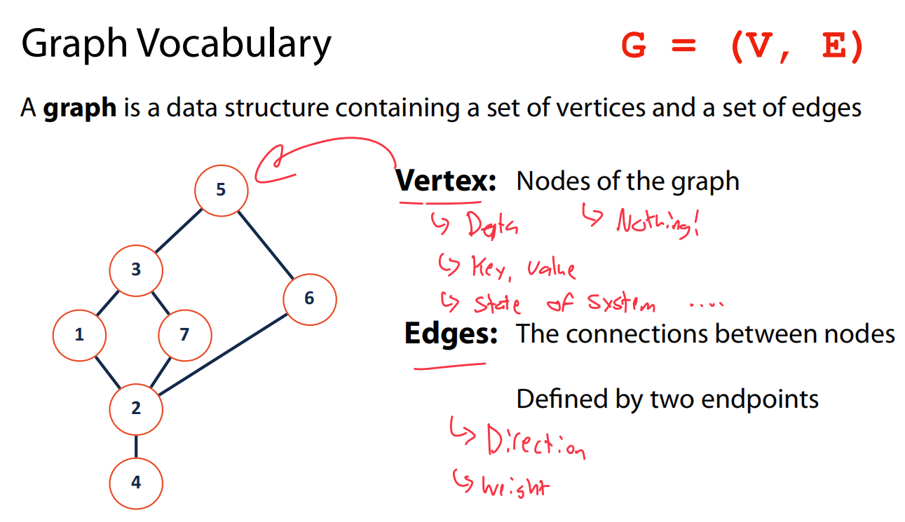
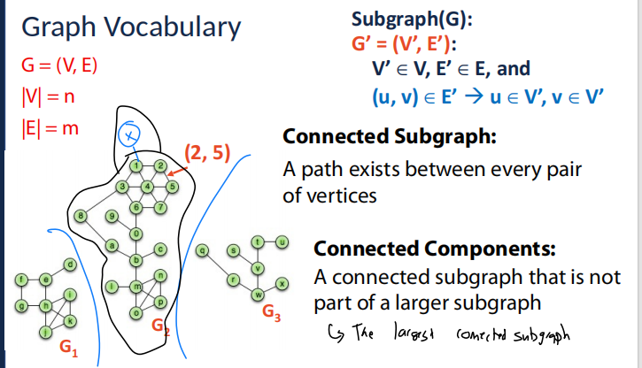

这张图解释了图（Graph）的基本概念。

1. **图（Graph）**：图是一个包含一组顶点（Vertex）和一组边（Edge）的数据结构。通常用 G = (V, E) 来表示，其中 V 是顶点集合，E 是边集合。
2. **顶点（Vertex）**：图中的节点。顶点可以存储数据、键值对或系统的状态等信息。图中的顶点本身通常没有具体的属性，只是作为连接其他顶点的基本单位。
3. **边（Edges）**：顶点之间的连接。每条边连接两个顶点，并可以具备一些属性，比如：
   - **方向（Direction）**：边的方向性，指向某一顶点。
   - **权重（Weight）**：边的“重量”或代价，常用来表示两个顶点之间的关系强度或花费。

总之，这张图展示了图的基本组成元素，并解释了它们的作用和含义。

这张图进一步扩展了图的概念，介绍了以下内容：

1. **度（Degree）**：
   - **度**是指与一个顶点相连的边的数量。对于有向图来说，度分为两个部分：
     - **入度（In-degree）**：指进入该顶点的边的数量。
     - **出度（Out-degree）**：指从该顶点出发的边的数量。
   - 例如，顶点 1 的入度和出度分别为 1，顶点 2 的入度和出度为 4，表示顶点 2 与其他四个顶点有边连接。
2. **邻接（Adjacency）**：
   - **邻接**指的是两个顶点如果通过一条边直接连接，则它们是邻接的。图中显示，顶点 1 和顶点 3、顶点 1 和顶点 2 是邻接的，因为它们之间有边相连。
3. **路径（Path）**：
   - **路径**是指从一个顶点到另一个顶点之间的顶点（或边）的序列。图中示例的路径是从顶点 1 经过顶点 2 最后到达顶点 6，即 1 → 2 → 6。

总结来说，这张图介绍了图中的一些基本术语，帮助理解图的结构和元素之间的关系。

这张图介绍了图的其他基本概念，并补充了一些重要的术语和注意事项：

1. **循环（Cycle）**：
   - **循环**是指从一个节点出发，经过一系列顶点和边，最终回到原节点的路径。这个路径必须至少包含两条边。
   - 图中给出的示例循环为：从顶点 1 出发，经过顶点 2，到达顶点 7，然后再经过顶点 3、顶点 1，最后回到顶点 1。
2. **简单图（Simple Graph）**：
   - **简单图**是指没有自环（即顶点连接到自身的边）和多重边（即两个顶点之间有多条边）的图。
   - 简单图避免了重复的边和自连接的边，确保每对顶点之间只有一条边。
3. **术语小知识（Terminology Trivia）**：
   - **每棵树都是图，但并不是每个图都是树**。这句话的意思是，树是一种特殊类型的图，具有无环结构（即没有循环），并且是连通的。但并不是所有图都是树，树只是图的一种特殊形式。

总结来说，这张图介绍了**循环**、**简单图**以及一些关于图和树的基本术语，帮助理解图结构中的不同类型和性质。

这张图进一步探讨了图的不同类型及其相关概念：

1. **有向图（Directed Graph）**：
   - **有向图**的边是单向的，意味着每条边都有方向。例如，图中的边从顶点 1 指向顶点 2，但反向的边从顶点 2 指向顶点 1 不存在。因此，顶点 1 只能够访问顶点 2，而反之不行。
2. **无向图（Undirected Graph）**：
   - **无向图**的边是双向的，即每条边可以在两个方向上遍历。例如，顶点 1 和顶点 2 之间的连接可以同时从 1 到 2，也可以从 2 到 1。
3. **可达性（Reachability）**：
   - **可达性**是指如果存在从一个顶点到另一个顶点的路径，则第二个顶点是第一个顶点可达的。换句话说，从一个顶点（例如 v1）出发，通过图中的一系列边，可以到达另一个顶点（例如 v2）。
4. **从顶点 4 到哪些顶点不可达？**
   - 通过图的分析，从顶点 4 到达的不可达顶点为顶点 3 和顶点 5。这是因为从顶点 4 出发，无法通过任何路径到达这两个顶点。

总结来说，这张图说明了有向图与无向图的区别，并解释了**可达性**的概念以及如何判断一个顶点是否可以通过路径到达其他顶点。

这张图展示了图的**加权图（Weighted Graph）**和**无加权图（Unweighted Graph）**的概念，并且介绍了**权重（Weights）**以及如何计算最短路径。

1. **加权图（Weighted Graph）**：
   - **加权图**中的每条边都有一个权重（Weight），通常表示从一个顶点到另一个顶点的距离、成本或时间。在图中，边的权重值被标注在边上，例如从顶点 3 到顶点 5 的边的权重为 2。
2. **权重（Weights）**：
   - **权重**是与图中的每条边关联的值。权重可以表示多种不同的度量标准，如距离、成本等。在图中的示例，边的权重数值代表了连接两个顶点的代价。
3. **最短路径（Shortest Path）**：
   - 最短路径指的是从一个顶点到另一个顶点的路径，其边权重之和最小。例如，从顶点 4 到顶点 5 的最短路径，路径经过顶点 2，路径权重的总和是 5。
4. **无加权图的最短路径（Unweighted Shortest Path）**：
   - 在**无加权图**中，每条边的权重都默认为 1。因此，计算最短路径时，路径的“长度”是通过边的数量来计算的，而不涉及具体的权重数值。

总结来说，这张图展示了加权图和无加权图的区别，解释了**权重**的概念，并提供了计算从顶点 4 到顶点 5 的最短路径的方法。对于加权图，最短路径是通过权重的总和来计算的，而在无加权图中，最短路径通过边的数量来决定。

这张图介绍了**子图（Subgraph）**的概念以及图的基本术语。

1. **图的基本表示**：
   - **图 G** 用 G = (V, E) 表示，其中 V 是顶点集合，E 是边集合。
   - **|V| = n**：表示图中的顶点数量为 n。
   - **|E| = m**：表示图中的边数量为 m。
2. **子图（Subgraph）**：
   - **子图（G'）**是图 G 的一部分，记作 G' = (V', E')，其中：
     - **V'** 是 G 的顶点集合的子集。
     - **E'** 是 G 的边集合的子集，且每条边连接的两个顶点都必须属于 V'。
   - 这意味着，子图是原图的一部分，只包含原图中的一部分顶点和与这些顶点连接的边。
3. **子图的条件**：
   - 如果 (u, v) ∈ E'，那么 u 和 v 必须属于 V'，即子图中的每条边连接的顶点必须都属于子图中的顶点集合。
4. **示例**：
   - 图中显示了三个子图：G₁、G₂ 和 G₃。每个子图都由原图 G 的一部分顶点和边构成。

总结来说，这张图解释了**子图**的概念，指出子图是原图的一个部分，包含原图的部分顶点和边，并且子图中的边连接的顶点必须在子图的顶点集合中。

这张图介绍了**完全子图（Complete Subgraph）**的概念，并继续讲解了**子图（Subgraph）**的术语。

1. **子图（Subgraph）**：
   - 如之前所述，**子图（G'）**是原图 G 的一部分，包含原图中的一部分顶点和与这些顶点连接的边。顶点和边的集合满足条件：如果边 (u, v) 属于子图 E'，那么 u 和 v 都必须属于子图的顶点集合 V'。
2. **完全子图（Complete Subgraph）**：
   - **完全子图**指的是一个子图，其中的每一对顶点都是邻接的，即图中的每一对顶点都有一条边相连接。在完全子图中，子图中的顶点之间的边形成一个完全图。
   - 在图中的示例中，子图 G₁ 和 G₂ 都是**完全子图**，因为子图中的每一对顶点之间都有边相连。相比之下，G₃ 不是完全子图，因为并非所有顶点对之间都有直接的连接。
3. **图的表示**：
   - **G = (V, E)**：表示图 G，其中 V 是顶点集合，E 是边集合。
   - **|V| = n**：表示图中有 n 个顶点。
   - **|E| = m**：表示图中有 m 条边。

总结来说，这张图强调了**完全子图**的定义，完全子图是一个子图，其中每一对顶点之间都有边相连接，形成立体的“完全图”。同时，图中的其他术语继续帮助理解图的结构。

这张图介绍了**连接子图（Connected Subgraph）**和**连接分量（Connected Components）**的概念，并继续讨论**子图（Subgraph）**的相关术语。

1. **子图（Subgraph）**：

   - 如之前所述，**子图（G'）**是从原图 G 中选择一部分顶点和边构成的图，满足所有边连接的顶点都属于子图中的顶点集合。

2. **连接子图（Connected Subgraph）**：

   - **连接子图**是指图中的一个子图，其中的每一对顶点都有路径相连接。换句话说，在这个子图中，任意两个顶点之间可以通过一条或多条边互相连接。
   - 例如，在图中，G₁ 是一个连接子图，因为图中每一对顶点之间都有一条路径连接。

3. **连接分量（Connected Components）**：

   - **连接分量**是指图中最大的一个连接子图，并且它不是更大的子图的一部分。每个连接分量是图中的一个连通部分，在这个分量内的顶点通过路径相互连接，而与其他分量的顶点不相连。

   - 在图中，G₁、G₂ 和 G₃ 都可以被视为连接分量，因为它们是连通的，但它们之间没有直接连接。G₁ 是一个连接子图，同时也可以是一个连接分量。

   - 

   - |      概念      | 适用图类型 |         要求         |            示例            |
     | :------------: | :--------: | :------------------: | :------------------------: |
     |  **连通分量**  |   无向图   |    任意两点有路径    | {A,B,C}, {D,E}（非连通图） |
     | **强连通分量** |   有向图   | 任意两点**双向**可达 |       有向环中的子图       |
     | **弱连通分量** |   有向图   | 忽略方向后无向图连通 |       单向链视为连通       |

总结来说，这张图解释了**连接子图**和**连接分量**的概念。连接子图是指一个图中每一对顶点都有路径相连接，而连接分量则是图中的最大连通部分，且不能是更大子图的一部分。

这张图介绍了**生成树（Spanning Tree）**的概念，并进一步扩展了**子图（Subgraph）**的相关术语。

1. **子图（Subgraph）**：
   - **子图**是原图的一部分，其中的顶点和边是从原图中选取的。子图中的边连接的顶点必须都属于子图中的顶点集合。
2. **生成树（Spanning Tree）**：
   - **生成树**是指一个**连通图**的子图，它包含图中所有的顶点，并且没有任何循环（即没有回路）。
   - 生成树的关键特点是，它包含所有的顶点，但通过最少的边连接这些顶点，确保图是连通的。
   - 在一个有 n 个顶点的图中，生成树包含 n-1 条边，因为它是最简洁的连通结构，去掉多余的边。
3. **最小生成树（Minimum Spanning Tree）**：
   - **最小生成树**是一个特定的生成树，其中每条边的权重总和最小。最小生成树通常用于网络设计中，以最小的代价连接所有节点。
   - 最小生成树选择权重最小的边来构建生成树，这样可以保证总的权重是最小的。

总结来说，生成树是一个连通的无环子图，包含图中的所有顶点并且通过最少的边连接它们。而最小生成树是权重总和最小的生成树，广泛应用于需要最小化成本的场景。

这张图总结了图论中一些基本概念，并强调了**图术语**的重要性。它展示了图的常见术语及其解释。

1. **图的表示**：
   - **G = (V, E)**：表示图 G，其中 **V** 是图的顶点集合，**E** 是图的边集合。
   - **|V| = n**：图中有 n 个顶点。
   - **|E| = m**：图中有 m 条边。
2. **图术语的重要性**：
   - 这张图列出了图论中一些常见的重要术语，例如：
     - **Degree**：度，表示一个顶点的连接边的数量。
     - **Weight**：权重，表示图中边的值，通常用于加权图。
     - **Direction**：方向，表示图中的边是否有方向（有向图或无向图）。
     - **Adjacency**：邻接，表示两个顶点是否由一条边直接连接。
     - **Complete**：完全图，指的是一个图中每一对顶点都有一条边相连接。
     - **Connected**：连通，表示图中的任意两个顶点之间都有路径连接。
     - **Acyclic**：无环，表示图中不存在任何循环。
     - **Spanning**：生成，表示一个图的生成树，包含图中的所有顶点但没有多余的边。
3. **图术语的应用**：
   - 这些术语对于理解和分析图结构非常重要。它们帮助我们准确描述图的性质和特征，如度、权重、连通性等。
   - 图论的应用广泛，涵盖了从网络设计到优化问题等多个领域。

总结来说，这张图提醒我们图论术语的重要性，并列出了图的基本术语，这些术语在研究图结构和分析图的性质时至关重要。

