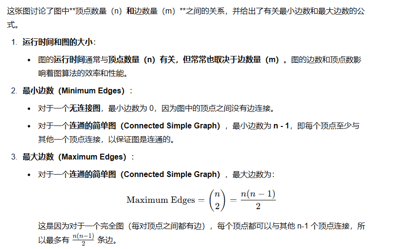
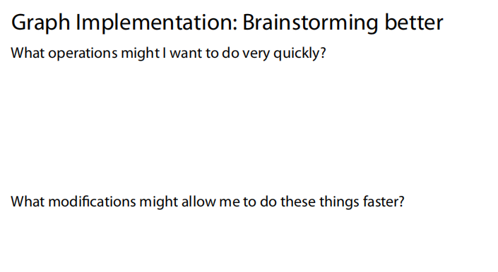

这张图解释了图（Graph）的基本概念。

1. **图（Graph）**：图是一个包含一组顶点（Vertex）和一组边（Edge）的数据结构。通常用 G = (V, E) 来表示，其中 V 是顶点集合，E 是边集合。
2. **顶点（Vertex）**：图中的节点。顶点可以存储数据、键值对或系统的状态等信息。图中的顶点本身通常没有具体的属性，只是作为连接其他顶点的基本单位。
3. **边（Edges）**：顶点之间的连接。每条边连接两个顶点，并可以具备一些属性，比如：
   - **方向（Direction）**：边的方向性，指向某一顶点。
   - **权重（Weight）**：边的“重量”或代价，常用来表示两个顶点之间的关系强度或花费。

总之，这张图展示了图的基本组成元素，并解释了它们的作用和含义。

这张图进一步扩展了图的概念，介绍了以下内容：

1. **度（Degree）**：
   - **度**是指与一个顶点相连的边的数量。对于有向图来说，度分为两个部分：
     - **入度（In-degree）**：指进入该顶点的边的数量。
     - **出度（Out-degree）**：指从该顶点出发的边的数量。
   - 例如，顶点 1 的入度和出度分别为 1，顶点 2 的入度和出度为 4，表示顶点 2 与其他四个顶点有边连接。
2. **邻接（Adjacency）**：
   - **邻接**指的是两个顶点如果通过一条边直接连接，则它们是邻接的。图中显示，顶点 1 和顶点 3、顶点 1 和顶点 2 是邻接的，因为它们之间有边相连。
3. **路径（Path）**：
   - **路径**是指从一个顶点到另一个顶点之间的顶点（或边）的序列。图中示例的路径是从顶点 1 经过顶点 2 最后到达顶点 6，即 1 → 2 → 6。

总结来说，这张图介绍了图中的一些基本术语，帮助理解图的结构和元素之间的关系。

这张图介绍了图的其他基本概念，并补充了一些重要的术语和注意事项：

1. **循环（Cycle）**：
   - **循环**是指从一个节点出发，经过一系列顶点和边，最终回到原节点的路径。这个路径必须至少包含两条边。
   - 图中给出的示例循环为：从顶点 1 出发，经过顶点 2，到达顶点 7，然后再经过顶点 3、顶点 1，最后回到顶点 1。
2. **简单图（Simple Graph）**：
   - **简单图**是指没有自环（即顶点连接到自身的边）和多重边（即两个顶点之间有多条边）的图。
   - 简单图避免了重复的边和自连接的边，确保每对顶点之间只有一条边。
3. **术语小知识（Terminology Trivia）**：
   - **每棵树都是图，但并不是每个图都是树**。这句话的意思是，树是一种特殊类型的图，具有无环结构（即没有循环），并且是连通的。但并不是所有图都是树，树只是图的一种特殊形式。

总结来说，这张图介绍了**循环**、**简单图**以及一些关于图和树的基本术语，帮助理解图结构中的不同类型和性质。

这张图进一步探讨了图的不同类型及其相关概念：

1. **有向图（Directed Graph）**：
   - **有向图**的边是单向的，意味着每条边都有方向。例如，图中的边从顶点 1 指向顶点 2，但反向的边从顶点 2 指向顶点 1 不存在。因此，顶点 1 只能够访问顶点 2，而反之不行。
2. **无向图（Undirected Graph）**：
   - **无向图**的边是双向的，即每条边可以在两个方向上遍历。例如，顶点 1 和顶点 2 之间的连接可以同时从 1 到 2，也可以从 2 到 1。
3. **可达性（Reachability）**：
   - **可达性**是指如果存在从一个顶点到另一个顶点的路径，则第二个顶点是第一个顶点可达的。换句话说，从一个顶点（例如 v1）出发，通过图中的一系列边，可以到达另一个顶点（例如 v2）。
4. **从顶点 4 到哪些顶点不可达？**
   - 通过图的分析，从顶点 4 到达的不可达顶点为顶点 3 和顶点 5。这是因为从顶点 4 出发，无法通过任何路径到达这两个顶点。

总结来说，这张图说明了有向图与无向图的区别，并解释了**可达性**的概念以及如何判断一个顶点是否可以通过路径到达其他顶点。

这张图展示了图的**加权图（Weighted Graph）**和**无加权图（Unweighted Graph）**的概念，并且介绍了**权重（Weights）**以及如何计算最短路径。

1. **加权图（Weighted Graph）**：
   - **加权图**中的每条边都有一个权重（Weight），通常表示从一个顶点到另一个顶点的距离、成本或时间。在图中，边的权重值被标注在边上，例如从顶点 3 到顶点 5 的边的权重为 2。
2. **权重（Weights）**：
   - **权重**是与图中的每条边关联的值。权重可以表示多种不同的度量标准，如距离、成本等。在图中的示例，边的权重数值代表了连接两个顶点的代价。
3. **最短路径（Shortest Path）**：
   - 最短路径指的是从一个顶点到另一个顶点的路径，其边权重之和最小。例如，从顶点 4 到顶点 5 的最短路径，路径经过顶点 2，路径权重的总和是 5。
4. **无加权图的最短路径（Unweighted Shortest Path）**：
   - 在**无加权图**中，每条边的权重都默认为 1。因此，计算最短路径时，路径的“长度”是通过边的数量来计算的，而不涉及具体的权重数值。

总结来说，这张图展示了加权图和无加权图的区别，解释了**权重**的概念，并提供了计算从顶点 4 到顶点 5 的最短路径的方法。对于加权图，最短路径是通过权重的总和来计算的，而在无加权图中，最短路径通过边的数量来决定。

这张图介绍了**子图（Subgraph）**的概念以及图的基本术语。

1. **图的基本表示**：
   - **图 G** 用 G = (V, E) 表示，其中 V 是顶点集合，E 是边集合。
   - **|V| = n**：表示图中的顶点数量为 n。
   - **|E| = m**：表示图中的边数量为 m。
2. **子图（Subgraph）**：
   - **子图（G'）**是图 G 的一部分，记作 G' = (V', E')，其中：
     - **V'** 是 G 的顶点集合的子集。
     - **E'** 是 G 的边集合的子集，且每条边连接的两个顶点都必须属于 V'。
   - 这意味着，子图是原图的一部分，只包含原图中的一部分顶点和与这些顶点连接的边。
3. **子图的条件**：
   - 如果 (u, v) ∈ E'，那么 u 和 v 必须属于 V'，即子图中的每条边连接的顶点必须都属于子图中的顶点集合。
4. **示例**：
   - 图中显示了三个子图：G₁、G₂ 和 G₃。每个子图都由原图 G 的一部分顶点和边构成。

总结来说，这张图解释了**子图**的概念，指出子图是原图的一个部分，包含原图的部分顶点和边，并且子图中的边连接的顶点必须在子图的顶点集合中。

这张图介绍了**完全子图（Complete Subgraph）**的概念，并继续讲解了**子图（Subgraph）**的术语。

1. **子图（Subgraph）**：
   - 如之前所述，**子图（G'）**是原图 G 的一部分，包含原图中的一部分顶点和与这些顶点连接的边。顶点和边的集合满足条件：如果边 (u, v) 属于子图 E'，那么 u 和 v 都必须属于子图的顶点集合 V'。
2. **完全子图（Complete Subgraph）**：
   - **完全子图**指的是一个子图，其中的每一对顶点都是邻接的，即图中的每一对顶点都有一条边相连接。在完全子图中，子图中的顶点之间的边形成一个完全图。
   - 在图中的示例中，子图 G₁ 和 G₂ 都是**完全子图**，因为子图中的每一对顶点之间都有边相连。相比之下，G₃ 不是完全子图，因为并非所有顶点对之间都有直接的连接。
3. **图的表示**：
   - **G = (V, E)**：表示图 G，其中 V 是顶点集合，E 是边集合。
   - **|V| = n**：表示图中有 n 个顶点。
   - **|E| = m**：表示图中有 m 条边。

总结来说，这张图强调了**完全子图**的定义，完全子图是一个子图，其中每一对顶点之间都有边相连接，形成立体的“完全图”。同时，图中的其他术语继续帮助理解图的结构。

这张图介绍了**连接子图（Connected Subgraph）**和**连接分量（Connected Components）**的概念，并继续讨论**子图（Subgraph）**的相关术语。

1. **子图（Subgraph）**：

   - 如之前所述，**子图（G'）**是从原图 G 中选择一部分顶点和边构成的图，满足所有边连接的顶点都属于子图中的顶点集合。

2. **连接子图（Connected Subgraph）**：

   - **连接子图**是指图中的一个子图，其中的每一对顶点都有路径相连接。换句话说，在这个子图中，任意两个顶点之间可以通过一条或多条边互相连接。
   - 例如，在图中，G₁ 是一个连接子图，因为图中每一对顶点之间都有一条路径连接。

3. **连接分量（Connected Components）**：

   - **连接分量**是指图中最大的一个连接子图，并且它不是更大的子图的一部分。每个连接分量是图中的一个连通部分，在这个分量内的顶点通过路径相互连接，而与其他分量的顶点不相连。

   - 在图中，G₁、G₂ 和 G₃ 都可以被视为连接分量，因为它们是连通的，但它们之间没有直接连接。G₁ 是一个连接子图，同时也可以是一个连接分量。

   - 

   - |      概念      | 适用图类型 |         要求         |            示例            |
     | :------------: | :--------: | :------------------: | :------------------------: |
     |  **连通分量**  |   无向图   |    任意两点有路径    | {A,B,C}, {D,E}（非连通图） |
     | **强连通分量** |   有向图   | 任意两点**双向**可达 |       有向环中的子图       |
     | **弱连通分量** |   有向图   | 忽略方向后无向图连通 |       单向链视为连通       |

总结来说，这张图解释了**连接子图**和**连接分量**的概念。连接子图是指一个图中每一对顶点都有路径相连接，而连接分量则是图中的最大连通部分，且不能是更大子图的一部分。

这张图介绍了**生成树（Spanning Tree）**的概念，并进一步扩展了**子图（Subgraph）**的相关术语。

1. **子图（Subgraph）**：
   - **子图**是原图的一部分，其中的顶点和边是从原图中选取的。子图中的边连接的顶点必须都属于子图中的顶点集合。
2. **生成树（Spanning Tree）**：
   - **生成树**是指一个**连通图**的子图，它包含图中所有的顶点，并且没有任何循环（即没有回路）。
   - 生成树的关键特点是，它包含所有的顶点，但通过最少的边连接这些顶点，确保图是连通的。
   - 在一个有 n 个顶点的图中，生成树包含 n-1 条边，因为它是最简洁的连通结构，去掉多余的边。
3. **最小生成树（Minimum Spanning Tree）**：
   - **最小生成树**是一个特定的生成树，其中每条边的权重总和最小。最小生成树通常用于网络设计中，以最小的代价连接所有节点。
   - 最小生成树选择权重最小的边来构建生成树，这样可以保证总的权重是最小的。

总结来说，生成树是一个连通的无环子图，包含图中的所有顶点并且通过最少的边连接它们。而最小生成树是权重总和最小的生成树，广泛应用于需要最小化成本的场景。

这张图总结了图论中一些基本概念，并强调了**图术语**的重要性。它展示了图的常见术语及其解释。

1. **图的表示**：
   - **G = (V, E)**：表示图 G，其中 **V** 是图的顶点集合，**E** 是图的边集合。
   - **|V| = n**：图中有 n 个顶点。
   - **|E| = m**：图中有 m 条边。
2. **图术语的重要性**：
   - 这张图列出了图论中一些常见的重要术语，例如：
     - **Degree**：度，表示一个顶点的连接边的数量。
     - **Weight**：权重，表示图中边的值，通常用于加权图。
     - **Direction**：方向，表示图中的边是否有方向（有向图或无向图）。
     - **Adjacency**：邻接，表示两个顶点是否由一条边直接连接。
     - **Complete**：完全图，指的是一个图中每一对顶点都有一条边相连接。
     - **Connected**：连通，表示图中的任意两个顶点之间都有路径连接。
     - **Acyclic**：无环，表示图中不存在任何循环。
     - **Spanning**：生成，表示一个图的生成树，包含图中的所有顶点但没有多余的边。
3. **图术语的应用**：
   - 这些术语对于理解和分析图结构非常重要。它们帮助我们准确描述图的性质和特征，如度、权重、连通性等。
   - 图论的应用广泛，涵盖了从网络设计到优化问题等多个领域。

总结来说，这张图提醒我们图论术语的重要性，并列出了图的基本术语，这些术语在研究图结构和分析图的性质时至关重要。

这张图展示了如何通过图的方式来表示社交网络中的连接，特别是通过直接消息（DMs）在个体之间建立的连接。

1. **顶点（Vertex）**：
   - 在这个社交网络图中，**顶点**代表一个**个体（Individual）**，即社交网络中的每个用户。每个用户是图中的一个节点。
2. **边（Edge）**：
   - **边**代表个体之间的**消息（Message）**，例如从用户 A 到用户 B 的直接消息（DM）。在图中，边连接两个顶点，表示两个个体之间存在某种联系（比如消息的发送）。
3. **有向或无向边（Directed or Undirected Edges）**：
   - **边是有向的还是无向的？**
     - **有向边**：如果消息是单向的，比如用户 A 向用户 B 发送一条消息，而没有回应的情况，那么这条边是有向的（A → B）。
     - **无向边**：如果消息是双向的，即两个用户之间互相发送消息，那么这条边是无向的。
     - **答案取决于社交网络中消息的方向性**。
4. **加权或无加权边（Weighted or Unweighted Edges）**：
   - **边是加权的还是无加权的？**
     - **加权边**：如果每条消息的传输有不同的“成本”或“重要性”，比如可以根据消息的字数、频率或互动频度来给每条边赋予权重，那么这些边是加权的。
     - **无加权边**：如果消息只是简单的连接关系，不考虑任何附加的度量，那么这些边是无加权的。
     - **答案取决于是否有考虑消息的权重**。

总结来说，这张图讨论了如何根据不同的社交互动来构建图。顶点代表个体，边代表他们之间的消息传递。是否使用有向或无向边以及是否加权边，都取决于具体的社交网络和消息传递的方式。

这张图强调了在给定输入的情况下，描述图的结构是非常重要的，尤其是以下几个常见问题：

1. **图是否包含循环？（Does your graph have cycles?）**
   - 这是指图中是否存在从某个顶点出发，经过一系列边后又回到原顶点的路径（即循环或回路）。如果有这种路径，则图包含循环；如果没有，则为无环图（Acyclic Graph）。
2. **图中顶点的最大度、最小度、平均度是多少？（What is the largest / smallest / average degree in your graph?）**
   - **度（Degree）**是指与一个顶点相连接的边的数量。
     - **最大度**是图中度数最大的顶点的度。
     - **最小度**是图中度数最小的顶点的度。
     - **平均度**是所有顶点的度数的平均值。
   - 这些度数可以帮助我们理解图的稠密程度，某些顶点是否被特别频繁地连接。
3. **图中有多少条边？（What is the total number of edges?）**
   - 这是指图中所有连接顶点的边的总数。边数反映了图的连接密度。
4. **理解图作为数据结构（Understand the graph as a data structure）**
   - 除了描述图的结构，还需要了解图作为**数据结构**的形式。图可以用不同的数据结构表示，如邻接矩阵、邻接表等，了解如何操作这些表示形式对于图算法的应用非常重要。

总结来说，这张图强调了在分析图时，除了考虑图的基本属性，还需要回答关于图结构的关键问题，如是否包含循环、顶点的度数分布以及边的数量等，并且需要理解图的表示和操作方法作为一种数据结构。

这张图讨论了**图的实现**，具体探讨了为了完整地定义一个图，需要存储哪些信息，并且我们想要快速查找哪些信息，以及在图的操作中应该优先考虑哪些操作。

1. **需要存储的信息**：
   - **顶点（Vertex）**：为了完整定义一个图，我们需要存储**顶点的信息**。每个顶点代表图中的一个节点，可以是任何对象，比如人物、位置等。在图中，顶点是图的基本元素之一。
   - **边（Edge）**：边用于连接顶点。边可以是有向的或无向的，表示顶点之间的关系。每条边连接两个顶点，可以携带附加信息，如权重、方向等。
2. **我们希望能够快速查找的信息**：
   - **查询图的连接信息**：通常在图中，我们希望快速查询某个顶点是否与其他顶点相连，或者查询某两个顶点之间是否有边相连。
3. **优先考虑的操作**：
   - **操作优先级**：在图的实现中，我们可能需要对一些操作进行优先优化。例如，快速查询顶点的邻接关系（邻接表或邻接矩阵）或者快速添加或删除边。
   - 另外，图的某些操作如遍历、查找最短路径等，也需要根据应用场景优化性能。

总结来说，这张图强调了在实现图时，**顶点**和**边**是最基本的信息，需要存储在图的数据结构中，同时考虑如何高效查询顶点之间的连接关系，并根据需求优化图的操作。

这张图介绍了**图的抽象数据类型（Graph ADT）**的基本结构和常见操作。它列出了图需要存储的数据以及实现这些图操作所需的常用功能。

### 图的基本数据：

1. **顶点（Vertices）**：图的基本单位，代表图中的节点。每个顶点通常包含一个唯一的标识符（例如：a、b、c 等）以及可能的其他附加信息（如值或标签）。
2. **边（Edges）**：边连接图中的顶点，表示顶点之间的关系或连接。每条边也可能有附加信息，如权重或方向。
3. **维护结构的某种数据结构**：
   - 图的抽象数据类型（ADT）需要某种数据结构来维护顶点和边之间的关系。这些数据结构可以是**邻接矩阵**、**邻接表**等，用于表示顶点间的连接方式。

### 图的常见功能（Functions）：

1. **insertVertex(K key)**：
   - 向图中插入一个新顶点，通常根据给定的**key**来标识顶点。
2. **insertEdge(Vertex v1, Vertex v2, K key)**：
   - 在两个顶点（v1 和 v2）之间插入一条边，并可以为边指定一个**key**，例如表示边的权重。
3. **removeVertex(Vertex v)**：
   - 从图中移除指定的顶点 v，以及与该顶点相连接的所有边。
4. **removeEdge(Vertex v1, Vertex v2)**：
   - 从图中移除顶点 v1 和顶点 v2 之间的边。
5. **getEdges(Vertex v)**：
   - 获取与顶点 v 相连接的所有边。
6. **areAdjacent(Vertex v1, Vertex v2)**：
   - 判断顶点 v1 和顶点 v2 是否通过一条边相连（即是否相邻）。
7. **origin(Edge e)**：
   - 获取边 e 的起始顶点。
8. **destination(Edge e)**：
   - 获取边 e 的目标顶点。

### 总结：

这张图列出了图的基本数据（顶点和边）以及相关的操作，这些操作允许我们在图中添加和删除顶点、边，查询边的连接情况，以及检查顶点之间的相邻关系等。图的抽象数据类型提供了一种灵活的方法来表示和操作图结构。

这张图片展示了图的边列表（Edge List）实现方式。图是一种数据结构，由顶点和连接这些顶点的边组成。边列表是实现图的一种简单方法，其中每个边都存储为一个三元组（start, end, weight），表示边的起始顶点、终止顶点和权重（如果有）。以下是图片内容的详细解释：
### 图的示例
左上角显示了一个简单的图，包含四个顶点（u, v, w, z）和四条边（a, b, c, d）。每条边连接两个顶点，例如边a连接顶点u和v。
### 边列表的实现
#### 顶点存储（Vertex Storage）
- **顶点标签列表**：图中列出了所有顶点的标签（u, v, w, z）。这相当于一个“无序”的数据结构，因为顶点的顺序并不重要。
- **从边存储构建**：可以通过遍历所有的边来构建这个顶点列表，确保每个顶点只出现一次。
#### 边存储（Edge Storage）
- **三元组列表**：每条边用一个三元组（start, end, weight）表示，其中：
  - start是边的起始顶点，
  - end是边的终止顶点，
  - weight是边的权重（如果没有权重，可以为默认值或省略）。
  
  例如，边a可以用(u, v, a)表示，边b可以用(v, w, b)表示，依此类推。
- **非常紧凑的表示**：这种表示方法是非常紧凑的，因为它直接存储了必要的边信息，而没有重复存储顶点信息。
### 总结
边列表是一种简单直观的图实现方式，特别适用于稀疏图（边数远小于顶点数的平方）。在这种实现中，顶点和边分别存储在不同的数据结构中，使得插入和删除操作相对简单。然而，查找某个顶点的所有相邻顶点则需要遍历整个边列表，这在某些应用场景下可能会比较低效。

这张图展示了使用**边列表（Edge List）**表示图的实现方法，以及两种常见操作的时间复杂度分析。

### 图的表示（Edge List）：

- **边列表**是一种表示图的方法，它将图中的每一条边表示为一对顶点（即边的两个端点），并将这些边存储在一个列表中。
- 在图中，**顶点**包括：u, v, w, z, a, b, c。
- 边列表存储的是每一条边所连接的两个顶点对，例如：`(u, v)`, `(v, b)`, `(b, c)` 等。

### 主要操作：

1. **getEdges(Vertex v)**：
   - **功能**：给定一个顶点 v，返回所有与该顶点 v 相连接的边。
   - **实现**：遍历所有边，查找顶点 v 是否是每条边的起始或结束顶点。
   - **时间复杂度**：O(m)，其中 m 是图中边的数量，因为我们需要检查每一条边来寻找与 v 相连接的边。
2. **areAdjacent(Vertex v1, Vertex v2)**：
   - **功能**：检查顶点 v1 和 v2 是否通过一条边相连（即是否相邻）。
   - **实现**：遍历所有边，检查是否存在一条边连接 v1 和 v2。
   - **时间复杂度**：O(m)，同样需要遍历图中的所有边来判断这两个顶点是否有直接连接。

### 总结：

- 使用**边列表**表示图时，每条边都由一个顶点对表示，操作如获取某个顶点的所有边和检查两个顶点是否相邻都需要遍历所有的边，因此时间复杂度是 O(m)，其中 m 是边的数量。
- 这种实现方法简单，但对于大型图，尤其是边较多的图，效率较低。

这张图继续展示了使用**边列表（Edge List）**表示图时，常见操作的时间复杂度分析，特别是关于插入顶点和删除顶点的操作。

### 主要操作：

1. **insertVertex(K key)**：
   - **功能**：向图中插入一个新的顶点，通常使用键值（**K key**）来标识顶点。
   - **实现**：在**顶点数组**中插入一个新顶点，相当于在数组的末尾添加一个元素。
   - **时间复杂度**：O(1)，插入操作在数组中是一个常数时间操作，因为我们只是将新顶点添加到末尾。
2. **removeVertex(Vertex v)**：
   - **功能**：删除图中的某个顶点及其相关的边。
   - **实现**：从顶点数组中移除该顶点，并且要删除所有与该顶点相连接的边。删除顶点后，可能需要调整图中边的数组表示，以删除涉及该顶点的所有边。
   - **时间复杂度**：O(n + m)，其中：
     - O(n) 是因为删除顶点时，我们需要在顶点数组中找到该顶点并移除。
     - O(m) 是因为我们还需要遍历边列表，找到并删除所有与该顶点相连的边。

### 总结：

- **插入顶点（insertVertex）**的时间复杂度是 **O(1)**，因为插入顶点只需要将其添加到顶点数组中，操作非常简单。
- **删除顶点（removeVertex）**的时间复杂度是 **O(n + m)**，这是因为删除顶点时不仅需要移除顶点本身，还需要检查和删除所有与该顶点连接的边，操作涉及到遍历顶点和边数组，因此复杂度较高。

这张图展示了使用**边列表（Edge List）\**表示图时，关于\**插入边**和**删除边**的操作和时间复杂度分析。

### 主要操作：

1. **insertEdge(Vertex v1, Vertex v2, K key)**：
   - **功能**：向图中插入一条边，连接顶点 v1 和 v2，且该边可能包含附加信息，如权重（**K key**）。
   - **实现**：通过在**边数组**中插入一个新的边来表示这条边，边的表示包括起点（v1）、终点（v2）以及权重（K）。
   - **时间复杂度**：O(1)，因为插入操作只需要在数组的末尾添加一个新元素，因此它是常数时间操作。
2. **removeEdge(Vertex v1, Vertex v2)**：
   - **功能**：删除图中顶点 v1 和 v2 之间的边。
   - **实现**：从**边数组**中移除这条连接 v1 和 v2 的边。为了找到该边，需要遍历边列表。
   - **时间复杂度**：O(m)，其中 m 是图中边的数量。因为我们需要遍历边数组来找到并删除连接 v1 和 v2 的边，这个操作的时间复杂度与边的数量成正比。

### 总结：

- **插入边（insertEdge）**的时间复杂度是 **O(1)**，因为插入边只需要将其添加到边数组的末尾，操作简单且快速。
- **删除边（removeEdge）**的时间复杂度是 **O(m)**，因为我们需要遍历所有边，找到并删除与顶点 v1 和 v2 相连的边，这个过程的时间复杂度是边数 m 的数量级。

这张图是关于**边列表（Edge List）\**表示图的一些优缺点分析。虽然具体的优缺点内容没有列出，但我们可以推测一些常见的\**优点（Pros）\**和\**缺点（Cons）**，如下：

### Pros（优点）：

1. **简单易懂**：边列表表示方法非常简单，直接列出每条边连接的两个顶点。
2. **灵活性高**：插入新顶点或新边都比较简单，因为可以直接在列表中添加新元素。
3. **节省空间**：对于稀疏图（边较少的图），使用边列表的空间效率较高，因为只存储实际存在的边。

### Cons（缺点）：

1. **查找效率低**：要查找图中某个顶点的邻接点或判断两个顶点是否相邻，需要遍历所有边，时间复杂度是 O(m)，在边较多时性能较差。
2. **删除操作效率低**：删除顶点或边时，也需要遍历整个边列表，特别是在删除边时，操作效率较低。
3. **不适合高效的邻接查询**：如果需要频繁地查询顶点的邻接关系，边列表比邻接表或邻接矩阵要慢，因为需要逐个检查边。

总结来说，**边列表**是一种简单且节省空间的图表示方式，适合稀疏图。但如果需要高效地查找邻接关系或频繁进行增删操作，其他数据结构（如邻接矩阵或邻接表）可能会更合适。

这张图提出了关于图实现时的**思维激荡（Brainstorming）**问题，主要探讨如何优化图的操作。具体问题如下：

1. **What operations might I want to do very quickly?**
   - **问题**：在图的操作中，我最希望能快速完成哪些操作？
   - **可能的答案**：
     - **查询邻接关系**：快速检查两个顶点是否相邻。
     - **查找顶点的邻接边**：快速获取与某个顶点相连接的所有边。
     - **添加或删除顶点和边**：能够快速插入或删除顶点和边。
     - **检查图是否连通**：快速判断图中的顶点是否连通。
     - **查找最短路径**：尤其是在有权图中，快速计算两个顶点之间的最短路径。
2. **What modifications might allow me to do these things faster?**
   - **问题**：哪些修改可能使我能够更快地执行这些操作？
   - **可能的答案**：
     - **使用邻接矩阵**：对于频繁的邻接关系查询，邻接矩阵可以提供 O(1) 的时间复杂度。
     - **使用邻接表**：对于稀疏图，邻接表能更高效地存储和查找邻接边。
     - **哈希表存储边**：使用哈希表来存储边，可以让查找和插入操作更快（O(1)）。
     - **图的压缩**：例如使用并查集（Union-Find）数据结构来提高连通性检查的效率。
     - **图的分层表示**：将图分成多个层次，可以减少在大图中操作的复杂度。
     - **加权图的最短路径算法**：如果涉及到权重，可以使用 Dijkstra 算法或 A* 算法来优化最短路径计算。

总结来说，图的操作优化依赖于选择合适的数据结构和算法，针对频繁执行的操作做出调整可以显著提高性能。

这张图展示了**邻接矩阵（Adjacency Matrix）**的图实现方式。邻接矩阵是一种用于表示图的结构的二维矩阵数据结构。

### 图的实现（Adjacency Matrix）：

- **邻接矩阵**通过一个二维数组或矩阵来表示图，其中矩阵的行和列都表示图中的顶点。矩阵的元素表示对应顶点之间是否有边连接。

### 解释：

1. **图结构**：

   - 图由顶点 u, v, w, z 组成，并且存在如下的边连接关系：
     - u 和 v 之间有边。
     - v 和 w 之间有边。
     - w 和 z 之间有边。

2. **矩阵表示**：

   - **邻接矩阵的形式**：矩阵的行和列分别代表图中的顶点（u, v, w, z）。
     - 如果行和列对应的顶点之间有边，矩阵中的相应位置将是 1（或其他标志值）。
     - 如果没有边，矩阵中的该位置是 0。

   例如：

   - 在矩阵的第一行和第二列交点处（对应顶点 u 和 v），值为 1，表示 u 和 v 之间有边。
   - 在矩阵的第二行和第三列交点处（对应顶点 v 和 w），值为 1，表示 v 和 w 之间有边。
   - 在矩阵的第三行和第四列交点处（对应顶点 w 和 z），值为 1，表示 w 和 z 之间有边。

3. **邻接矩阵的表示**：

   - 矩阵中的每个单元格表示两个顶点之间是否存在边。
   - 在图中，顶点 u、v、w、z 按照顺序排列，对应的邻接矩阵是 4x4 的矩阵。
   - 如果顶点之间存在边，则矩阵中对应位置为 1，否则为 0。

### 优缺点：

- **优点**：
  - **快速查询**：可以在 O(1) 时间内检查两个顶点是否相邻。
  - **结构简单**：邻接矩阵形式非常简洁，易于理解。
- **缺点**：
  - **空间浪费**：对于稀疏图（边较少的图），邻接矩阵会浪费很多空间，因为它会为每对顶点创建一个矩阵单元，而很多单元格会是 0。
  - **更新开销**：如果图的顶点或边有频繁的增加或删除，邻接矩阵的修改会比较麻烦且不高效。

总结来说，邻接矩阵是一种用于表示图的二维矩阵，可以快速判断顶点之间的连接关系，但它在表示稀疏图时可能会浪费空间。