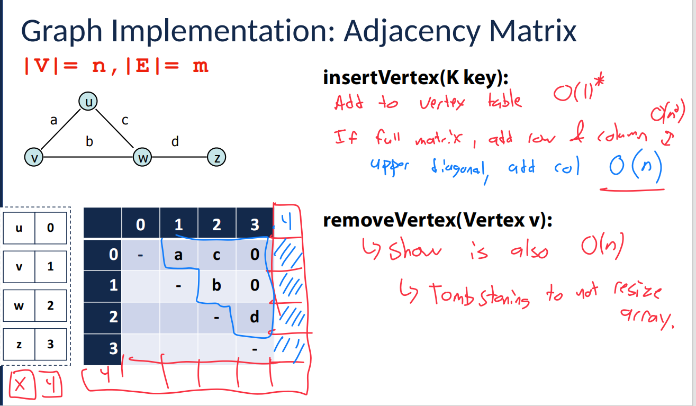
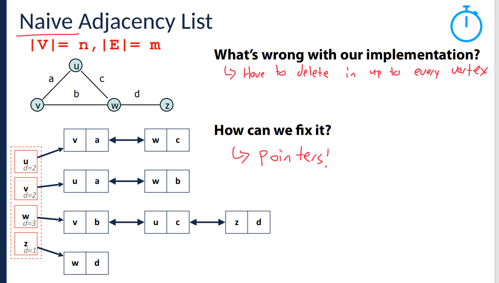
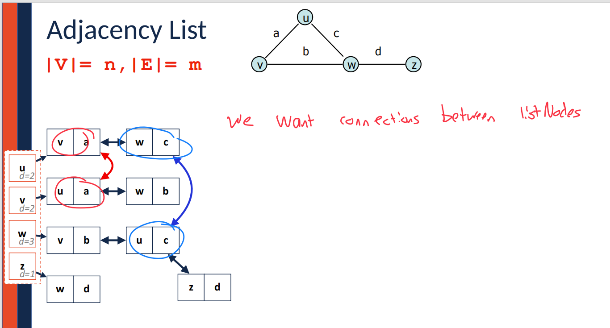

这张图片讲解的是**图的邻接矩阵实现（Adjacency Matrix）**，并详细描述了如何通过邻接矩阵插入和删除图的顶点。下面我将详细解释每一部分内容：

### 1. **图的邻接矩阵**

首先，图片展示了一个有 4 个顶点（u, v, w, z）和 4 条边（a, b, c, d）的图。图的邻接矩阵是一个二维矩阵，**行列**对应图中的顶点，**矩阵的值**表示顶点之间是否有边。

举个例子，矩阵中的一个位置（i，j）如果有值，比如 1，说明顶点 i 和顶点 j 之间有边。如果为 0，则表示没有边。

在这个矩阵里，第一行和第一列分别对应顶点 u 和其他顶点。矩阵内的值表示这些顶点之间的连接关系。

### 2. **插入顶点（insertVertex）**

**操作：**

- **插入顶点（insertVertex）**是将一个新的顶点添加到图中。

  插入顶点的时间复杂度：

  - 添加到**顶点表**中的操作时间复杂度是 **O(1)**（常数时间）。
  - 如果矩阵已经满了，需要增加一个新行和新列，复杂度为 **O(n)**（n是当前顶点数，增加行列需要遍历矩阵一部分）。
  - 在矩阵的**上三角部分**（上三角矩阵的对角线以上部分），需要添加新列。

**总结：**

- 插入新顶点到图的邻接矩阵时，增加矩阵行列可能需要 O(n) 的时间。

### 3. **删除顶点（removeVertex）**

**操作：**

- **删除顶点（removeVertex）**是将图中的某个顶点从邻接矩阵中删除。

  删除顶点的时间复杂度也是 **O(n)**，这是因为删除顶点时必须遍历矩阵的每一行和每一列来调整矩阵的值。

**特殊说明：**

- **墓碑法（Tombstoning）**：为避免每次删除都重新调整矩阵大小，采用“墓碑法”，即用标记（如特殊符号）标记已删除的顶点，而不立即调整矩阵大小。这样可以避免频繁的矩阵大小调整，提高效率。

### 4. **邻接矩阵的表示**

在图中，矩阵的具体展示如下：

- **行和列**：表示顶点。
- **矩阵的内容**：表示顶点之间的边。例如，顶点 u 和 v 之间有一条边，矩阵的相应位置（u, v）就会被标记为 1，表示这两顶点之间有连接。

### 5. **总结**

- **插入顶点**和**删除顶点**的操作在邻接矩阵中的时间复杂度都是 O(n)，因为需要调整矩阵的维度或者更新矩阵值。
- **墓碑法**是处理删除操作的一种优化方式，它通过不立即调整矩阵来提高性能。

如果你有任何关于邻接矩阵的具体问题，或者想要进一步了解图的其他实现方法，欢迎继续提问！


这张图片继续讲解**图的邻接矩阵（Adjacency Matrix）\**实现，重点是\**上三角存储**和**矩阵的空间优化**。下面是详细的解释：

### 1. **图的邻接矩阵表示**

图中的邻接矩阵仍然是一个二维矩阵，其中行和列对应图中的顶点，矩阵中的每个元素表示顶点之间是否有边。举个例子：

- 顶点 **u** 和 **v** 之间有一条边，矩阵的相应位置（u, v）是一个非零值。
- 顶点 **v** 和 **w** 之间有一条边，矩阵的相应位置（v, w）也会有值。

图的邻接矩阵依旧遵循前面提到的规则。

------

### 2. **上三角存储**

在这张图片中，提到了**上三角存储（Upper Diagonal Storage）**的概念：

- 在图的邻接矩阵中，如果是无向图，矩阵是对称的，即 **(i, j)** 位置和 **(j, i)** 位置的值是相同的。
- 采用上三角存储的方式，意味着**只存储矩阵的上三角部分**（即对角线以上的部分）。这样可以节省存储空间，因为下三角部分是冗余的。

**上三角存储的优势：**

- 只存储矩阵的一部分（上三角），这样可以节省空间，提高内存使用效率。
- 对于无向图，这样的存储方式是足够的，因为下三角和上三角是对称的。

------

### 3. **矩阵的空间优化**

在图片中，几个数组列出了如何通过上三角存储优化矩阵存储。

#### **作为列（As cols）**：

- **V = [A]**：表示顶点 A 所对应的列。
- **W = [C, B]**：表示顶点 W 所对应的列。
- **Z = [0, 0, D]**：表示顶点 Z 所对应的列。
- **X = [-,-,-,-]**：表示没有连接的顶点列。

#### **作为行（As rows）**：

- **u = [a, c, 0]**：表示顶点 u 所对应的行，它与顶点 a 和 c 有连接，0 表示与其他顶点没有连接。
- **v = [b, d, c]**：表示顶点 v 所对应的行，它与顶点 b 和 d 有连接。
- **w = [d]**：表示顶点 w 所对应的行，它与顶点 d 有连接。

------

### 4. **时间复杂度分析**

- **插入操作（insertVertex）**的时间复杂度为 **O(1)**：在上三角矩阵中添加新顶点的操作是常数时间的。
- **删除操作（removeVertex）**的时间复杂度为 **O(n)**：删除顶点时需要更新矩阵的相关部分。

------

### 总结：

- **上三角存储**是一种优化图的邻接矩阵存储方式，减少了冗余的数据存储，提高了内存效率。
- 这种方法对于无向图尤为有效，因为无向图的邻接矩阵是对称的。
- 在图的实现中，**空间优化**和**存储效率**是重要的考虑因素。

如果你有任何关于图的邻接矩阵实现的具体问题，或者想了解其他类型的图存储方式，可以继续提问！


这张图片显示的是图的邻接矩阵实现的**优缺点（Pros and Cons）**，但优缺点部分尚未填写。我将为你提供邻接矩阵实现的一些**常见优缺点**。

### 优点（Pros）：

1. **快速检查边的存在**：邻接矩阵允许你在 **O(1)** 时间内检查任意两个顶点之间是否有边。只需要直接访问矩阵中的对应位置即可。
2. **简单直观**：邻接矩阵的结构非常简单，容易理解和实现，适合初学者。
3. **适合密集图**：对于边数接近顶点数平方的**密集图**，邻接矩阵的存储方式效率较高。
4. **容易实现**：邻接矩阵的实现比较简单，不需要复杂的数据结构。

### 缺点（Cons）：

1. **空间消耗大**：邻接矩阵的空间复杂度为 **O(n²)**，即使图是稀疏的，也需要为所有的可能边分配内存，这会造成空间浪费。
2. **处理稀疏图效率低**：对于边数远小于顶点数平方的稀疏图，邻接矩阵会浪费大量空间，导致内存效率低下。
3. **插入和删除操作复杂**：插入和删除顶点或边时，邻接矩阵的操作可能会比较麻烦，尤其是当图的结构发生变化时。
4. **不适合大规模图**：当图的规模非常大时，邻接矩阵的存储和操作可能导致性能瓶颈，尤其是在内存受限的情况下。

这些优缺点帮助你评估是否使用邻接矩阵作为图的表示方法。如果你对其他图的表示方法（如邻接表）有兴趣，可以继续了解。


这张图片描述了图的实现方案的**头脑风暴**过程，特别是对比了不同图表示方法（例如**边列表**和**邻接矩阵**）的优缺点，并提出了一些要求。以下是对这张图片的详细解释：

### 图的实现目标

1. **比边列表更快（Faster than an edge list）**：
   - 边列表（Edge List）是一种简单的图表示方法，它将所有的边列出。在边列表中，寻找某个顶点的邻居（即与某个顶点相连的其他顶点）比较慢，因为你需要遍历所有的边。
   - 图片中提到我们希望找到一种**比边列表更快**的实现方法，尤其是在寻找顶点邻居时，这意味着我们希望能够更快速地查询图中顶点之间的连接关系。
2. **比邻接矩阵占用更少的空间（Less space than an adjacency matrix）**：
   - 邻接矩阵（Adjacency Matrix）是一个二维数组，用来表示图中顶点之间的连接关系。每个元素表示两个顶点之间是否有边连接，空间复杂度为 **O(n²)**，即使图是稀疏的也会浪费大量空间。
   - 图片中的要求是要找到一个**比邻接矩阵占用空间更少**的实现方法，特别是针对稀疏图，邻接矩阵的空间开销非常大。
3. **特别擅长找到所有邻接元素（Particularly good at finding all adjacent elements / neighbors）**：
   - 这是关于**查找邻居**的一个要求。图的邻居查找是图算法中的一个常见操作，特别是遍历图时，我们需要高效地找到某个顶点的所有邻接顶点。
   - 该图实现方案应该能**快速**地找到某个顶点的邻居，尤其是在稀疏图中，邻接矩阵或者边列表在此操作中可能会比较低效。

### 可能的解决方案

根据这些要求，**邻接表（Adjacency List）** 是一种可能的解决方案：

- **邻接表**：为每个顶点维护一个链表（或列表），该链表包含与该顶点直接相连的所有邻居顶点。对于稀疏图，邻接表占用的空间远少于邻接矩阵，因为只存储实际存在的边，不会浪费空间。
  - **邻接表的优点**：
    - **空间效率高**：只存储图中实际的边，因此对于稀疏图，空间复杂度为 **O(n + m)**，其中 **n** 是顶点数，**m** 是边数。
    - **快速查找邻居**：查找某个顶点的邻居通常只需要遍历该顶点的邻接链表，时间复杂度为 **O(k)**，其中 **k** 是该顶点的邻居数。

### 总结

这张图片的内容提出了一个问题：**我们需要一种既能高效查找邻居，又能节省空间的图表示方法**。基于这些要求，邻接表是一个合适的解决方案。它比边列表更高效，并且比邻接矩阵节省空间，尤其适合稀疏图。


这张图片讲解了图的实现方式之一——**边列表（Edge List）**，并提供了关于其操作的时间复杂度分析和相关方法。下面是详细解释：

### 1. **边列表表示法（Edge List）**

边列表是一种图的表示方式，其中每一条边表示为一对顶点。对于每一条边，存储它所连接的两个顶点以及该边的属性（例如权重）。在图中，顶点间的连接关系通过边的列表表示。

例如，图中的边 **a** 连接了顶点 **u** 和 **v**，边 **b** 连接了顶点 **v** 和 **w**，边 **c** 连接了顶点 **u** 和 **w**，边 **d** 连接了顶点 **w** 和 **z**。这四条边可以在边列表中如下表示：

| u    | v    | a    |
| ---- | ---- | ---- |
| v    | w    | b    |
| u    | w    | c    |
| w    | z    | d    |

### 2. **边列表操作及其时间复杂度**

- **插入顶点（insertVertex(K key)）**：
  - 时间复杂度为 **O(1)**：插入一个新的顶点是一个常数时间操作，因为只需将顶点加入顶点列表中。
- **插入边（insertEdge(Vertex v1, Vertex v2, K key)）**：
  - 时间复杂度为 **O(1)**：插入一条新边也只需要将该边添加到边列表中，是常数时间操作。
- **删除顶点（removeVertex(Vertex v)）**：
  - 时间复杂度为 **O(m)**：删除一个顶点时，可能需要遍历整个边列表，查找并删除与该顶点相关的所有边。因此，操作的时间复杂度与图中的边数 **m** 成正比。
- **删除边（removeEdge(Vertex v1, Vertex v2, K key)）**：
  - 时间复杂度为 **O(m)**：删除一条边需要遍历边列表，找到并移除该边。对于每一条边，查找的时间复杂度为 **O(m)**。
- **查找与顶点相关的边（incidentEdges(Vertex v)）**：
  - 时间复杂度为 **O(m)**：要查找一个顶点的所有相关边，必须遍历所有边来检查每条边是否与该顶点相连。
- **判断两顶点是否相邻（areAdjacent(Vertex v1, Vertex v2)）**：
  - 时间复杂度为 **O(m)**：判断两个顶点是否相邻，必须遍历边列表并检查每一条边，看看是否存在连接这两个顶点的边。

### 3. **总结**

- **边列表的优点**：
  - **空间效率**：边列表通常比邻接矩阵节省空间，尤其适用于稀疏图，因为它只存储实际存在的边。
  - **实现简单**：插入和删除操作比较简单。
- **边列表的缺点**：
  - 查找邻接关系不高效。由于边列表没有直接记录顶点之间的关系，查找两个顶点是否相邻需要遍历整个边列表，时间复杂度是 **O(m)**，对于大型图来说效率较低。

边列表是处理稀疏图的一种有效方式，但当需要频繁查找邻接关系时，效率较低，可能需要考虑其他更高效的图表示方法（如邻接表）。


这张图片介绍了**邻接矩阵（Adjacency Matrix）**的图表示方式，包括顶点存储和边存储的细节。

### 1. **顶点存储（Vertex Storage）**

图中的顶点（如 **u, v, w, z**）需要存储在某个结构中。此处提到的存储方式是使用**哈希表（Hash Table）**来存储顶点，具体内容如下：

- **哈希表存储**：哈希表能够在 **O(1)** 时间内通过顶点的标识符（如 **u**）查找它对应的索引位置。这是因为哈希表能够根据键值对快速定位数据。
- **隐式或显式存储索引**：顶点的索引可以**隐式**存储（例如，数组中按照顺序排列），或者**显式**存储（例如，哈希表存储顶点的名称及其对应的索引）。

在图中，**u, v, w, z** 的顶点索引分别为 **0, 1, 2, 3**。哈希表的作用就是将这些顶点的名称映射到它们的索引位置，以便能够高效地定位。

### 2. **边存储（Edge Storage）**

邻接矩阵是一个 **|V| x |V|** 的二维数组，其中 **|V|** 是图中的顶点数，矩阵中的每个元素表示一个边的存在与否。具体细节如下：

- **边存储**：矩阵中的行和列代表图中的顶点。对于每一对顶点 **(i, j)**，矩阵中的位置 **(i, j)** 会存储这两个顶点之间的边。如果存在边，存储边的**权重**；如果没有边，则存储 **0** 或者其他表示没有边的值。
  - 例如：图中有一条从顶点 **u** 到顶点 **v** 的边，权重为 **a**，在矩阵中 **(u, v)** 位置存储值 **a**。
  - 另一条边从 **u** 到 **w**，权重为 **c**，在 **(u, w)** 位置存储 **c**。
  - **(v, v)**、**(w, w)** 等对角线位置则通常存储 **0** 或者 **-**，表示没有自环。
- **矩阵维度**：邻接矩阵的维度是 **|V| x |V|**，即顶点数量的平方。如果图是稀疏的，这样的矩阵会浪费大量空间。

### 3. **权重存储**

- 在邻接矩阵中，边的权重存储在对应位置 **(u, v)**，这意味着矩阵的每个元素存储了从顶点 **u** 到顶点 **v** 的边的权重。
- 如果图是无权图，则直接用 **0** 或 **-** 表示没有边。如果是有权图，则在相应的矩阵位置存储权重值。

### 总结：

- **哈希表**用于存储顶点和它们的索引，以便能够高效地访问顶点的位置。
- **邻接矩阵**存储顶点之间的边以及边的权重，通过一个二维数组表示图的连接关系。
  - 对于每对顶点 **(i, j)**，矩阵 **(i, j)** 存储边的权重或 **0**（如果没有边）。
- **空间效率**：邻接矩阵对于稀疏图的空间利用率较低，因为即使没有边，矩阵中的每个位置也都需要存储数据。

如果图是密集图，邻接矩阵的使用可以比较高效，但对于稀疏图来说，其他数据结构（如邻接表）可能更加节省空间。


这张图片介绍了如何在**邻接矩阵（Adjacency Matrix）\**中\**删除顶点**（removeVertex）及其实现步骤。

### 1. **删除顶点（removeVertex）**

在图的邻接矩阵中，删除顶点意味着你需要处理与该顶点相关的行和列。删除顶点的步骤如下：

#### 步骤 1：查找顶点的行和列

- 每个顶点在邻接矩阵中都有一个对应的行和列。例如，顶点 **u** 对应第 **0** 行和第 **0** 列，顶点 **v** 对应第 **1** 行和第 **1** 列，以此类推。
- 删除顶点时，首先需要**查找该顶点对应的行和列**，这些行列对应了该顶点与其他顶点之间的连接关系。

#### 步骤 2：用墓碑值替换

- 一旦找到了顶点对应的行和列，你需要用一个特殊的**墓碑值（tombstone value）**来替换这些位置的内容。墓碑值通常是一个标记，表示该位置的数据已经被删除，但并没有物理上从矩阵中移除。墓碑值的作用是防止数据丢失，同时允许后续操作（如重新调整矩阵）能够识别到这些删除的位置。
- 比如，**u** 顶点与其他顶点之间的边被删除后，矩阵中的 **(u, v)** 和 **(v, u)** 等位置会被替换成墓碑值。

### 2. **邻接矩阵的特点**

- **上三角存储**：图中还提到邻接矩阵使用**上三角存储**的方式，即只存储矩阵的上半部分，因为对于无向图，邻接矩阵是对称的。这样可以节省内存空间，只保存一部分数据。

### 总结：

- 删除顶点操作的核心是查找与该顶点相关的行和列，并将这些位置替换为墓碑值。
- **墓碑值**是一种常见的标记，用于处理删除操作中的空缺位置，避免完全删除数据，也便于后续的维护。
- 这种方法的优点是可以避免频繁重新调整矩阵的大小，但缺点是数据删除后仍然占用空间，且增加了额外的标记和管理工作。

如果你有任何关于墓碑法的具体问题，或想了解其他图的操作方式，可以继续提问！


这张图片介绍了**墓碑法（Tombstoning）\**和\**渐进式删除（Amortized Removal）\**的概念，并将其应用于图的邻接矩阵。具体来说，这种方法用于\**删除元素**并**节省空间**，当删除的元素达到一定数量时，会进行整体的重调整。

### 1. **墓碑法（Tombstoning）**

墓碑法是一种处理删除操作的技术，在删除元素时并不立即从数据结构中移除该元素，而是将其标记为“已删除”状态。这种做法的优势在于：

- **不立即调整结构**：删除操作通过将元素标记为“删除”（墓碑值），而不是物理删除数据，避免了每次删除时都需要重新调整数据结构。这样，删除操作的时间复杂度可以保持在 **O(1)**，而不需要进行更昂贵的操作。
- **提高效率**：在没有足够删除元素时，数据结构不需要频繁的重新调整大小或进行其他复杂的操作。

### 2. **渐进式删除（Amortized Removal）**

在渐进式删除中，当**删除足够多的元素**后，才会**统一调整数据结构**，即进行整体的重新调整或压缩操作。具体做法如下：

- **当删除足够多的元素时**，可能会触发一次重新调整操作，这通常是为了节省空间。
- **整体调整**：此时，不是逐个删除，而是一次性对整个数据结构进行清理或压缩，从而提高性能。

例如，图片中提到的数组如下：

```
[2, 7, 5, 9, 7, 14, 1, 0, 8, 3]
```

当删除某些元素后，例如 **5** 和 **9**，数组中的位置会被标记为已删除（例如通过墓碑法）。在删除了足够多的元素后，可以一次性重新调整数组，使得数据结构更加紧凑。

### 3. **邻接矩阵中的墓碑法**

在**邻接矩阵（Adjacency Matrix）**中，删除顶点时：

- 使用墓碑法标记被删除的顶点。
- **删除顶点（removeVertex）**操作：使用墓碑法删除顶点，即通过将对应位置替换为墓碑值，而不是删除该元素。这样可以节省频繁调整矩阵的开销。

#### 具体步骤：

1. **查找行和列**：根据顶点的位置，查找并标记该顶点的行和列。
2. **替换为墓碑值**：将矩阵中对应位置替换为墓碑值，以表示该顶点已删除。

### 4. **总结**

- **墓碑法**允许我们高效地删除顶点或边，通过标记删除而不是物理移除数据。
- **渐进式删除**意味着只有在删除足够多的元素时，才会统一进行数据结构的重调整或压缩操作，从而减少频繁调整带来的开销。
- 这种方法提高了删除操作的效率，尤其是在处理大量数据时。

如果你对墓碑法的细节或其他图的实现方法有疑问，欢迎继续提问！


这张图片详细解释了使用**邻接矩阵（Adjacency Matrix）**来实现图的操作，并提供了相关操作的时间复杂度分析。让我们逐个分析这些操作。

### 1. **操作和时间复杂度**

- **插入边（insertEdge）**:
  - **时间复杂度：O(1)**
     插入一条边的时间复杂度为 **O(1)**，意味着我们可以直接在矩阵中找到相应的位置（行和列的交点），并更新该位置的值。这对于**无权图**通常表示 **1**，而在**有权图**中表示边的权重。
- **删除边（removeEdge）**:
  - **时间复杂度：O(1)**
     删除边操作同样是 **O(1)**，因为我们直接查找并修改矩阵中相应位置的值即可。
- **判断两顶点是否相邻（areAdjacent）**:
  - **时间复杂度：O(1)**
     这个操作也非常快速，可以直接查找矩阵中相应的行列位置，判断是否有连接的边（或者值为 1 或边的权重）。
- **查找某个顶点的所有邻接边（incidentEdges）**:
  - **时间复杂度：O(n)**
     查找一个顶点的所有邻接边时，需要遍历矩阵的该行（对应顶点的行），因此需要 **O(n)** 的时间，其中 **n** 是图中顶点的数量。
- **插入顶点（insertVertex）**:
  - **时间复杂度：O(n) 到 O(n²)**
     在邻接矩阵中插入一个顶点时，通常需要扩展矩阵的行和列，这需要 **O(n)** 的操作。如果矩阵已满，还需要调整存储结构，可能会达到 **O(n²)** 的时间复杂度。
- **删除顶点（removeVertex）**:
  - **时间复杂度：O(n) 到 O(n²)**
     删除一个顶点时，需要修改矩阵中的相关行列，同样涉及到调整矩阵的大小或处理墓碑值，时间复杂度可能是 **O(n)** 到 **O(n²)**，具体取决于实现。

### 2. **邻接矩阵的实现**

在邻接矩阵中，矩阵的每个位置都表示了两个顶点之间的边。行和列的索引分别对应图中的顶点。例如，矩阵中的元素 **(u, v)** 表示从顶点 **u** 到顶点 **v** 的边。如果存在边，则存储 **1** 或边的权重，否则存储 **0** 或其他标记。

### 3. **总结**

- **O(1)** 的操作包括插入边、删除边和判断顶点是否相邻，因为这些操作可以直接通过矩阵的行列位置访问。
- **O(n)** 的操作涉及查找顶点的所有邻接边，因为需要遍历顶点对应的整行。
- **O(n²)** 的操作主要出现在插入或删除顶点时，特别是需要重新调整矩阵的大小。

**邻接矩阵**是实现图操作时的一种常见数据结构，它对密集图（边数接近顶点数平方）非常有效，但对于稀疏图来说，它可能会浪费大量空间。


这张图片讲解了图的实现方式之一——**边列表（Edge List）**，并探讨了它与其他技术（如指针和查找操作）结合的效果。

### 1. **边列表（Edge List）**

**边列表**是图的一种常见表示方式。它将图的每条边表示为一对顶点，并且通常包括边的权重信息。图中的每条边通过一对顶点（例如 **u, v**）以及一个表示权重的值（例如边 **a**）来表示。

在图片中，我们可以看到如下的结构：

- **边列表**存储了顶点对和边的权重：

  ```
  u, v, a
  v, w, b
  u, w, c
  w, z, d
  ```

  其中每一行表示一条边。比如，第一行表示从顶点 **u** 到顶点 **v** 之间有一条权重为 **a** 的边。

### 2. **指针（Pointers）**

图中的蓝色箭头表示**指针**。这可能是指在边列表中使用指针来表示顶点之间的连接关系。

- **指针**可以帮助快速连接顶点和它们的边。在图的实现中，指针可以用来连接边列表中的顶点和它们对应的边，这样可以更灵活地管理图的连接。
- 例如，从 **u** 顶点出发，使用指针可以快速找到与它相连的其他顶点和边。

### 3. **遍历整个列表（Look through entire list）**

在图片的右侧，红色标记的部分说明了**查找相邻元素**的操作。

- **查找顶点的邻居**：如果要查找顶点的邻居（即与该顶点相连接的所有其他顶点），则需要**遍历整个边列表**，检查每条边是否与该顶点相关。
  - **时间复杂度：O(m)**，其中 **m** 是图中边的数量。因为在最坏的情况下，需要遍历所有的边来找到与某个顶点相关的边。

### 4. **优缺点分析**

- **优点**：
  - 边列表简单、直观，对于**稀疏图**来说占用空间较少，因为只存储实际存在的边。
  - 可以通过指针高效地管理图中顶点的连接。
- **缺点**：
  - 查找顶点的邻接边比较慢。为了查找某个顶点的所有邻居，需要遍历整个边列表，时间复杂度是 **O(m)**，这对于边数较多的图可能效率较低。
  - 插入或删除操作需要修改边列表，可能会带来一定的性能开销。

### 5. **总结**

- **边列表**是一种存储图的方式，适用于稀疏图，存储每条边的两个顶点和可能的权重。
- **指针**可以用于连接图中的顶点和它们的边，提高操作的灵活性。
- 查找邻接边时需要**遍历整个列表**，这对于大型图的操作可能会影响效率。


这张图片讲解了图的**邻接表（Adjacency List）\**实现方式，并描述了一种简单的邻接表实现，其中每个顶点对应一个链表，存储它的邻居。图片展示了这种实现的\**优缺点**以及如何表示图的边。

### 1. **邻接表实现（Naive Adjacency List）**

邻接表是一种图的常见表示方法，每个顶点有一个链表，链表中存储与该顶点直接连接的其他顶点。对于每一条边，它会出现在两个顶点的链表中（对于无向图）。

在这张图片中，邻接表如下所示：

- **顶点 u** 的链表包含 **v** 和 **w**，即顶点 **u** 与 **v** 和 **w** 相连。
- **顶点 v** 的链表包含 **u** 和 **w**，即顶点 **v** 与 **u** 和 **w** 相连。
- **顶点 w** 的链表包含 **v**、**u** 和 **z**，即顶点 **w** 与 **v**、**u** 和 **z** 相连。
- **顶点 z** 的链表仅包含 **w**，即顶点 **z** 与 **w** 相连。

### 2. **图的度（Degree）**

每个顶点的**度（degree）**表示与该顶点相连的边的数量。在图片中，每个顶点的度如下：

- **顶点 u** 的度为 **2**，因为它与 **v** 和 **w** 相连。
- **顶点 v** 的度为 **2**，因为它与 **u** 和 **w** 相连。
- **顶点 w** 的度为 **3**，因为它与 **v**、**u** 和 **z** 相连。
- **顶点 z** 的度为 **1**，因为它仅与 **w** 相连。

度是计算图中每个顶点的连接数的指标，通常用于图的分析。

### 3. **双向边（Bidirectional Edge List）**

在这张图中，边被描述为**双向的（bidirectional）**。这意味着，如果 **u** 和 **v** 之间有边，那么这条边会出现在 **u** 的链表中，并且也会出现在 **v** 的链表中。这适用于**无向图**，因为无向图中的每条边是双向的。

- 例如，边 **a** 将 **u** 和 **v** 连接，这意味着边 **a** 在 **u** 和 **v** 的邻接链表中都会出现。

### 4. **邻接表的优缺点**

#### 优点：

- **空间高效**：邻接表仅存储实际存在的边，对于稀疏图而言，邻接表比邻接矩阵节省空间。
- **快速遍历邻居**：可以快速遍历一个顶点的所有邻居。访问某个顶点的邻接边的时间复杂度是 **O(k)**，其中 **k** 是该顶点的度。

#### 缺点：

- **查找是否相邻较慢**：若要查找两个顶点是否相邻，需要遍历其中一个顶点的邻接链表，时间复杂度是 **O(k)**，其中 **k** 是该顶点的度。对于密集图来说，这个操作较慢。

### 5. **总结**

- **邻接表**适用于稀疏图，它节省了存储空间并允许高效的邻居遍历。
- 每个顶点通过一个链表记录它的邻居，可以实现简单的插入和删除操作。
- **度**表示了每个顶点的连接数量，并且通过邻接表可以很容易地获取每个顶点的度。

如果你有任何关于邻接表的细节问题，或想了解其他图的实现方式，请随时提问！


这张图片详细讲解了使用**邻接表（Adjacency List）**表示图时的几个重要操作：**查找邻接边（incidentEdges）\**和\**判断两个顶点是否相邻（areAdjacent）**。它还涉及了操作的时间复杂度分析。

### 1. **邻接表（Adjacency List）**

邻接表是一种图的存储方式，其中每个顶点都对应一个链表，该链表存储与该顶点相连的所有邻接顶点。在这张图片中，邻接表存储的是每个顶点与其相连的顶点和边的关系。

例如：

- **顶点 u** 的邻接链表包含顶点 **v** 和 **w**，与它们分别通过边 **a** 和 **c** 相连。
- **顶点 v** 的邻接链表包含顶点 **u** 和 **w**，与它们分别通过边 **a** 和 **b** 相连。
- **顶点 w** 的邻接链表包含顶点 **v**、**u** 和 **z**，与它们分别通过边 **b**、**c** 和 **d** 相连。

### 2. **查找顶点的所有邻接边（incidentEdges）**

**操作：**
 查找某个顶点的所有邻接边（即找到与该顶点相连的所有边）。在邻接表中，这个操作通过遍历顶点的邻接链表来完成。

**时间复杂度：**

- **O(deg(v))**，其中 **deg(v)** 表示顶点 **v** 的度，即与顶点 **v** 相连的边的数量。这个操作是最优的，因为它只需要遍历顶点 **v** 的邻接链表中的 **deg(v)** 条边。

### 3. **判断两个顶点是否相邻（areAdjacent）**

**操作：**
 判断两个顶点是否相邻。该操作需要检查是否在某个顶点的邻接链表中找到另一个顶点。

**时间复杂度：**

- **O(min(deg(v1), deg(v2)))**，其中 **deg(v1)** 和 **deg(v2)** 分别是顶点 **v1** 和 **v2** 的度。由于我们只需要遍历较小度数顶点的邻接链表来查找是否存在对方，因此复杂度为 **min(deg(v1), deg(v2))**。

### 4. **总结**

- **查找邻接边（incidentEdges）**：该操作的时间复杂度是 **O(deg(v))**，适用于需要获取一个顶点的所有邻接边的情况。
- **判断是否相邻（areAdjacent）**：该操作的时间复杂度是 **O(min(deg(v1), deg(v2)))**，适用于判断两个顶点是否通过一条边相连。

**邻接表**是处理**稀疏图**的高效方式，因为它只存储实际存在的边。对于每个顶点，操作的时间复杂度通常与该顶点的度成正比。

如果你有任何关于邻接表操作的进一步问题，或者其他图表示方法的疑问，可以继续提问！


这张图片讲解了在**邻接表（Adjacency List）**中删除顶点的操作及其相关的复杂度分析。

### 1. **删除顶点（removeVertex）**

**操作：**

- **删除顶点**意味着不仅要从该顶点的邻接链表中删除它的连接边，还需要从所有与该顶点相连的其他顶点的邻接链表中删除指向该顶点的边。
- 例如，删除顶点 **u** 时：
  - 在 **u** 的邻接链表中删除 **v** 和 **w**。
  - 同时，在 **v** 和 **w** 的邻接链表中，也需要删除指向 **u** 的边。

**复杂度分析：**

- **时间复杂度：O(n²)**：最坏情况下，删除一个顶点可能需要遍历图中所有的顶点，尤其是在图密集的情况下，**删除操作的时间复杂度是 O(n²)**。因为你需要检查每个顶点的邻接链表，删除指向该顶点的所有边。

### 2. **删除操作的步骤**

- **遍历该顶点的边列表**：首先，你需要遍历顶点 **v** 的邻接链表，删除与该顶点相关的所有边。
- **删除邻接链表中的指向该顶点的边**：接下来，需要检查图中所有与顶点 **v** 相邻的顶点，并从它们的邻接链表中删除指向顶点 **v** 的边。

### 3. **删除操作的影响**

- 删除顶点会改变图中其他顶点的邻接链表，因此每个邻接链表都需要更新。这使得删除操作相对复杂，因为它不仅仅影响删除的顶点，还需要修改与它相邻的所有顶点的链表。

### 4. **图的最终状态**

在图的最终状态中，我们看到顶点 **u** 已被删除，并且其邻接链表中的边也被删除。同时，与 **u** 相邻的顶点 **v** 和 **w** 的邻接链表也已更新，移除了指向 **u** 的边。

### 5. **时间复杂度**

- **O(n²)**：最坏情况下，删除一个顶点需要在邻接表中进行广泛的删除操作，尤其是在图密集时，每个顶点的邻接链表可能都包含大量边。因此，最坏情况下的时间复杂度为 **O(n²)**。

### 总结：

- 在**邻接表**中，**删除顶点**操作需要遍历该顶点的所有邻接链表，并从其他顶点的邻接链表中删除与该顶点相关的边。最坏情况下的时间复杂度为 **O(n²)**，尤其在图比较密集时。



这张图片继续讲解了**邻接表（Adjacency List）**的实现，并指出了当前实现的一些问题以及如何通过使用**指针（Pointers）**来解决这些问题。

### 1. **问题：删除顶点时的复杂度**

- **问题描述**： 在当前的邻接表实现中，删除一个顶点涉及到**删除该顶点的邻接链表**中与它相连的所有边。同时，还需要遍历**其他所有顶点的邻接链表**，并从每个邻接链表中删除指向该顶点的边。

  这意味着，**删除顶点的操作**可能会涉及到图中**所有顶点的邻接链表**，即最坏情况下，删除一个顶点需要遍历图中的 **n** 个顶点和 **m** 条边，时间复杂度可能接近 **O(n²)**。

- **为什么是问题**： 这种方法效率较低，特别是在图较大时，删除顶点的操作会导致很大的性能开销。

### 2. **如何解决？使用指针（Pointers）**

- **解决方案**： 图片中提到的解决方案是使用**指针**。通过在邻接表中使用指针，我们可以使删除操作更加高效。
- **指针的使用**：
  - **使用指针**来连接邻接表中的元素。通过指针，边的删除操作不再需要遍历整个邻接链表，而是可以通过直接修改指针的引用来删除。
  - 通过指针，可以在图的实现中动态地维护顶点之间的连接关系。当删除一个顶点时，我们只需要修改指针，而不必重新调整每个邻接链表中的元素顺序。

### 3. **邻接表实现的结构**

- 在图片中，邻接表结构仍然是由每个顶点的邻接链表组成：
  - **顶点 u** 的邻接链表包含 **v** 和 **w**，对应的边分别是 **a** 和 **c**。
  - **顶点 v** 的邻接链表包含 **u** 和 **w**，对应的边分别是 **a** 和 **b**。
  - **顶点 w** 的邻接链表包含 **v**、**u** 和 **z**，对应的边分别是 **b**、**c** 和 **d**。
  - **顶点 z** 的邻接链表包含 **w**，对应的边是 **d**。

### 4. **指针的优势**

- **提高删除操作的效率**：使用指针后，当删除顶点时，不需要遍历整个邻接表，可以通过直接操作指针来删除相应的边，减少了时间复杂度。
- **动态调整**：指针使得图的结构更加灵活，顶点的删除或添加不需要重新排列邻接链表中的元素，只需要调整指针的指向。

### 5. **总结**

- **邻接表**是一种常用的图的表示方法，尤其适用于**稀疏图**，因为它节省了存储空间。
- 删除操作可能导致性能问题，尤其是在图较大时，删除顶点需要遍历所有邻接链表。
- **使用指针**是一个优化方法，通过动态调整指针，可以有效提升图操作的效率，特别是删除操作。

如果你对指针如何应用于图的实现有更多问题，或者想了解其他图的表示方法，欢迎继续提问！



这张图片解释了在**邻接表（Adjacency List）\**中使用\**指针**来连接**列表节点（list nodes）\**的概念。它强调了如何在邻接表中通过指针来\**连接每个顶点**的邻接边，从而建立顶点之间的连接关系。

### 1. **邻接表的结构**

在邻接表中，每个顶点都有一个对应的链表，链表中存储该顶点所有相邻的顶点及与它们的边。例如：

- 顶点 **u** 与 **v** 和 **w** 相连，且边的权重分别是 **a** 和 **c**。
- 顶点 **v** 与 **u** 和 **w** 相连，边的权重分别是 **a** 和 **b**。
- 顶点 **w** 与 **v**、**u** 和 **z** 相连，边的权重分别是 **b**、**c** 和 **d**。
- 顶点 **z** 与 **w** 相连，边的权重是 **d**。

### 2. **指针的作用**

图片中用红色、蓝色和绿色的箭头表示**指针连接**。这些箭头表示顶点之间的连接关系：

- **红色箭头**：表示从 **u** 到 **v**，边的权重为 **a**。
- **蓝色箭头**：表示从 **w** 到 **u**，边的权重为 **c**。
- **绿色箭头**：表示从 **v** 到 **w**，边的权重为 **b**。

在邻接表的实现中，**指针**用于在链表中建立顶点之间的连接。每个**列表节点**（存储顶点和边的信息）都通过指针相连，形成一个链表结构。通过这种方式，可以高效地表示和维护图的边。

### 3. **我们希望连接邻接表中的列表节点**

- **列表节点之间的连接**：通过指针，邻接表中的每个顶点的邻接链表节点指向与之相邻的其他顶点。这种结构帮助我们动态地管理图的连接关系，特别是在添加、删除顶点或边时，只需要调整指针，而无需重新排序整个链表。
- **优化操作**：指针连接让删除或修改边时，操作变得更为高效。你可以直接更新链表中的指针，而不需要重新排列或遍历整个邻接链表。

### 4. **总结**

这张图片强调了**指针在邻接表中的作用**，指针使得图的表示更加高效，尤其是在删除或插入顶点和边时，操作变得更加高效。通过使用指针来连接邻接表中的元素，可以避免不必要的内存移动和排序，从而提高图操作的效率。

如果你还有其他关于图结构或指针优化的疑问，欢迎继续提问！