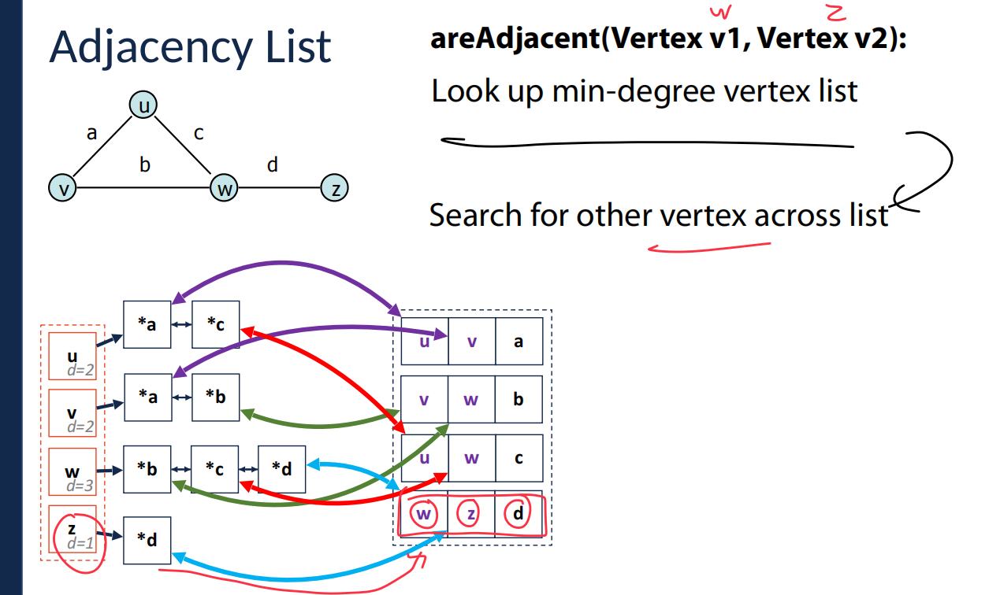
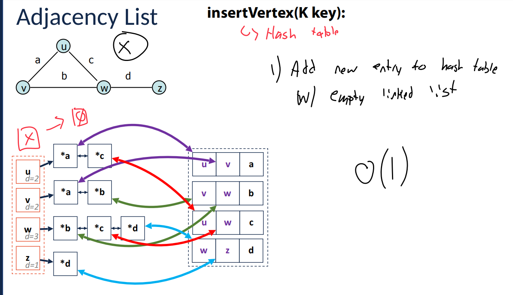
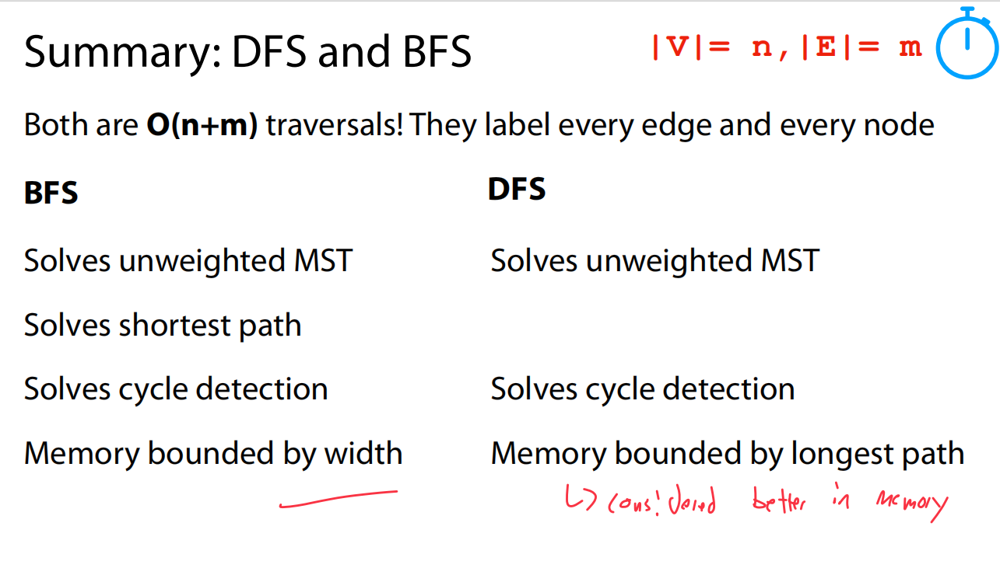

这张图片讲解的是**图的邻接矩阵实现（Adjacency Matrix）**，并详细描述了如何通过邻接矩阵插入和删除图的顶点。下面我将详细解释每一部分内容：

### 1. **图的邻接矩阵**

首先，图片展示了一个有 4 个顶点（u, v, w, z）和 4 条边（a, b, c, d）的图。图的邻接矩阵是一个二维矩阵，**行列**对应图中的顶点，**矩阵的值**表示顶点之间是否有边。

举个例子，矩阵中的一个位置（i，j）如果有值，比如 1，说明顶点 i 和顶点 j 之间有边。如果为 0，则表示没有边。

在这个矩阵里，第一行和第一列分别对应顶点 u 和其他顶点。矩阵内的值表示这些顶点之间的连接关系。

### 2. **插入顶点（insertVertex）**

**操作：**

- **插入顶点（insertVertex）**是将一个新的顶点添加到图中。

  插入顶点的时间复杂度：

  - 添加到**顶点表**中的操作时间复杂度是 **O(1)**（常数时间）。
  - 如果矩阵已经满了，需要增加一个新行和新列，复杂度为 **O(n)**（n是当前顶点数，增加行列需要遍历矩阵一部分）。
  - 在矩阵的**上三角部分**（上三角矩阵的对角线以上部分），需要添加新列。

**总结：**

- 插入新顶点到图的邻接矩阵时，增加矩阵行列可能需要 O(n) 的时间。

### 3. **删除顶点（removeVertex）**

**操作：**

- **删除顶点（removeVertex）**是将图中的某个顶点从邻接矩阵中删除。

  删除顶点的时间复杂度也是 **O(n)**，这是因为删除顶点时必须遍历矩阵的每一行和每一列来调整矩阵的值。

**特殊说明：**

- **墓碑法（Tombstoning）**：为避免每次删除都重新调整矩阵大小，采用“墓碑法”，即用标记（如特殊符号）标记已删除的顶点，而不立即调整矩阵大小。这样可以避免频繁的矩阵大小调整，提高效率。

### 4. **邻接矩阵的表示**

在图中，矩阵的具体展示如下：

- **行和列**：表示顶点。
- **矩阵的内容**：表示顶点之间的边。例如，顶点 u 和 v 之间有一条边，矩阵的相应位置（u, v）就会被标记为 1，表示这两顶点之间有连接。

### 5. **总结**

- **插入顶点**和**删除顶点**的操作在邻接矩阵中的时间复杂度都是 O(n)，因为需要调整矩阵的维度或者更新矩阵值。
- **墓碑法**是处理删除操作的一种优化方式，它通过不立即调整矩阵来提高性能。

如果你有任何关于邻接矩阵的具体问题，或者想要进一步了解图的其他实现方法，欢迎继续提问！


这张图片继续讲解**图的邻接矩阵（Adjacency Matrix）\**实现，重点是\**上三角存储**和**矩阵的空间优化**。下面是详细的解释：

### 1. **图的邻接矩阵表示**

图中的邻接矩阵仍然是一个二维矩阵，其中行和列对应图中的顶点，矩阵中的每个元素表示顶点之间是否有边。举个例子：

- 顶点 **u** 和 **v** 之间有一条边，矩阵的相应位置（u, v）是一个非零值。
- 顶点 **v** 和 **w** 之间有一条边，矩阵的相应位置（v, w）也会有值。

图的邻接矩阵依旧遵循前面提到的规则。

------

### 2. **上三角存储**

在这张图片中，提到了**上三角存储（Upper Diagonal Storage）**的概念：

- 在图的邻接矩阵中，如果是无向图，矩阵是对称的，即 **(i, j)** 位置和 **(j, i)** 位置的值是相同的。
- 采用上三角存储的方式，意味着**只存储矩阵的上三角部分**（即对角线以上的部分）。这样可以节省存储空间，因为下三角部分是冗余的。

**上三角存储的优势：**

- 只存储矩阵的一部分（上三角），这样可以节省空间，提高内存使用效率。
- 对于无向图，这样的存储方式是足够的，因为下三角和上三角是对称的。

------

### 3. **矩阵的空间优化**

在图片中，几个数组列出了如何通过上三角存储优化矩阵存储。

#### **作为列（As cols）**：

- **V = [A]**：表示顶点 A 所对应的列。
- **W = [C, B]**：表示顶点 W 所对应的列。
- **Z = [0, 0, D]**：表示顶点 Z 所对应的列。
- **X = [-,-,-,-]**：表示没有连接的顶点列。

#### **作为行（As rows）**：

- **u = [a, c, 0]**：表示顶点 u 所对应的行，它与顶点 a 和 c 有连接，0 表示与其他顶点没有连接。
- **v = [b, d, c]**：表示顶点 v 所对应的行，它与顶点 b 和 d 有连接。
- **w = [d]**：表示顶点 w 所对应的行，它与顶点 d 有连接。

------

### 4. **时间复杂度分析**

- **插入操作（insertVertex）**的时间复杂度为 **O(1)**：在上三角矩阵中添加新顶点的操作是常数时间的。
- **删除操作（removeVertex）**的时间复杂度为 **O(n)**：删除顶点时需要更新矩阵的相关部分。

------

### 总结：

- **上三角存储**是一种优化图的邻接矩阵存储方式，减少了冗余的数据存储，提高了内存效率。
- 这种方法对于无向图尤为有效，因为无向图的邻接矩阵是对称的。
- 在图的实现中，**空间优化**和**存储效率**是重要的考虑因素。

如果你有任何关于图的邻接矩阵实现的具体问题，或者想了解其他类型的图存储方式，可以继续提问！


这张图片显示的是图的邻接矩阵实现的**优缺点（Pros and Cons）**，但优缺点部分尚未填写。我将为你提供邻接矩阵实现的一些**常见优缺点**。

### 优点（Pros）：

1. **快速检查边的存在**：邻接矩阵允许你在 **O(1)** 时间内检查任意两个顶点之间是否有边。只需要直接访问矩阵中的对应位置即可。
2. **简单直观**：邻接矩阵的结构非常简单，容易理解和实现，适合初学者。
3. **适合密集图**：对于边数接近顶点数平方的**密集图**，邻接矩阵的存储方式效率较高。
4. **容易实现**：邻接矩阵的实现比较简单，不需要复杂的数据结构。

### 缺点（Cons）：

1. **空间消耗大**：邻接矩阵的空间复杂度为 **O(n²)**，即使图是稀疏的，也需要为所有的可能边分配内存，这会造成空间浪费。
2. **处理稀疏图效率低**：对于边数远小于顶点数平方的稀疏图，邻接矩阵会浪费大量空间，导致内存效率低下。
3. **插入和删除操作复杂**：插入和删除顶点或边时，邻接矩阵的操作可能会比较麻烦，尤其是当图的结构发生变化时。
4. **不适合大规模图**：当图的规模非常大时，邻接矩阵的存储和操作可能导致性能瓶颈，尤其是在内存受限的情况下。

这些优缺点帮助你评估是否使用邻接矩阵作为图的表示方法。如果你对其他图的表示方法（如邻接表）有兴趣，可以继续了解。


这张图片描述了图的实现方案的**头脑风暴**过程，特别是对比了不同图表示方法（例如**边列表**和**邻接矩阵**）的优缺点，并提出了一些要求。以下是对这张图片的详细解释：

### 图的实现目标

1. **比边列表更快（Faster than an edge list）**：
   - 边列表（Edge List）是一种简单的图表示方法，它将所有的边列出。在边列表中，寻找某个顶点的邻居（即与某个顶点相连的其他顶点）比较慢，因为你需要遍历所有的边。
   - 图片中提到我们希望找到一种**比边列表更快**的实现方法，尤其是在寻找顶点邻居时，这意味着我们希望能够更快速地查询图中顶点之间的连接关系。
2. **比邻接矩阵占用更少的空间（Less space than an adjacency matrix）**：
   - 邻接矩阵（Adjacency Matrix）是一个二维数组，用来表示图中顶点之间的连接关系。每个元素表示两个顶点之间是否有边连接，空间复杂度为 **O(n²)**，即使图是稀疏的也会浪费大量空间。
   - 图片中的要求是要找到一个**比邻接矩阵占用空间更少**的实现方法，特别是针对稀疏图，邻接矩阵的空间开销非常大。
3. **特别擅长找到所有邻接元素（Particularly good at finding all adjacent elements / neighbors）**：
   - 这是关于**查找邻居**的一个要求。图的邻居查找是图算法中的一个常见操作，特别是遍历图时，我们需要高效地找到某个顶点的所有邻接顶点。
   - 该图实现方案应该能**快速**地找到某个顶点的邻居，尤其是在稀疏图中，邻接矩阵或者边列表在此操作中可能会比较低效。

### 可能的解决方案

根据这些要求，**邻接表（Adjacency List）** 是一种可能的解决方案：

- **邻接表**：为每个顶点维护一个链表（或列表），该链表包含与该顶点直接相连的所有邻居顶点。对于稀疏图，邻接表占用的空间远少于邻接矩阵，因为只存储实际存在的边，不会浪费空间。
  - **邻接表的优点**：
    - **空间效率高**：只存储图中实际的边，因此对于稀疏图，空间复杂度为 **O(n + m)**，其中 **n** 是顶点数，**m** 是边数。
    - **快速查找邻居**：查找某个顶点的邻居通常只需要遍历该顶点的邻接链表，时间复杂度为 **O(k)**，其中 **k** 是该顶点的邻居数。

### 总结

这张图片的内容提出了一个问题：**我们需要一种既能高效查找邻居，又能节省空间的图表示方法**。基于这些要求，邻接表是一个合适的解决方案。它比边列表更高效，并且比邻接矩阵节省空间，尤其适合稀疏图。


这张图片讲解了图的实现方式之一——**边列表（Edge List）**，并提供了关于其操作的时间复杂度分析和相关方法。下面是详细解释：

### 1. **边列表表示法（Edge List）**

边列表是一种图的表示方式，其中每一条边表示为一对顶点。对于每一条边，存储它所连接的两个顶点以及该边的属性（例如权重）。在图中，顶点间的连接关系通过边的列表表示。

例如，图中的边 **a** 连接了顶点 **u** 和 **v**，边 **b** 连接了顶点 **v** 和 **w**，边 **c** 连接了顶点 **u** 和 **w**，边 **d** 连接了顶点 **w** 和 **z**。这四条边可以在边列表中如下表示：

| u    | v    | a    |
| ---- | ---- | ---- |
| v    | w    | b    |
| u    | w    | c    |
| w    | z    | d    |

### 2. **边列表操作及其时间复杂度**

- **插入顶点（insertVertex(K key)）**：
  - 时间复杂度为 **O(1)**：插入一个新的顶点是一个常数时间操作，因为只需将顶点加入顶点列表中。
- **插入边（insertEdge(Vertex v1, Vertex v2, K key)）**：
  - 时间复杂度为 **O(1)**：插入一条新边也只需要将该边添加到边列表中，是常数时间操作。
- **删除顶点（removeVertex(Vertex v)）**：
  - 时间复杂度为 **O(m)**：删除一个顶点时，可能需要遍历整个边列表，查找并删除与该顶点相关的所有边。因此，操作的时间复杂度与图中的边数 **m** 成正比。
- **删除边（removeEdge(Vertex v1, Vertex v2, K key)）**：
  - 时间复杂度为 **O(m)**：删除一条边需要遍历边列表，找到并移除该边。对于每一条边，查找的时间复杂度为 **O(m)**。
- **查找与顶点相关的边（incidentEdges(Vertex v)）**：
  - 时间复杂度为 **O(m)**：要查找一个顶点的所有相关边，必须遍历所有边来检查每条边是否与该顶点相连。
- **判断两顶点是否相邻（areAdjacent(Vertex v1, Vertex v2)）**：
  - 时间复杂度为 **O(m)**：判断两个顶点是否相邻，必须遍历边列表并检查每一条边，看看是否存在连接这两个顶点的边。

### 3. **总结**

- **边列表的优点**：
  - **空间效率**：边列表通常比邻接矩阵节省空间，尤其适用于稀疏图，因为它只存储实际存在的边。
  - **实现简单**：插入和删除操作比较简单。
- **边列表的缺点**：
  - 查找邻接关系不高效。由于边列表没有直接记录顶点之间的关系，查找两个顶点是否相邻需要遍历整个边列表，时间复杂度是 **O(m)**，对于大型图来说效率较低。

边列表是处理稀疏图的一种有效方式，但当需要频繁查找邻接关系时，效率较低，可能需要考虑其他更高效的图表示方法（如邻接表）。


这张图片介绍了**邻接矩阵（Adjacency Matrix）**的图表示方式，包括顶点存储和边存储的细节。

### 1. **顶点存储（Vertex Storage）**

图中的顶点（如 **u, v, w, z**）需要存储在某个结构中。此处提到的存储方式是使用**哈希表（Hash Table）**来存储顶点，具体内容如下：

- **哈希表存储**：哈希表能够在 **O(1)** 时间内通过顶点的标识符（如 **u**）查找它对应的索引位置。这是因为哈希表能够根据键值对快速定位数据。
- **隐式或显式存储索引**：顶点的索引可以**隐式**存储（例如，数组中按照顺序排列），或者**显式**存储（例如，哈希表存储顶点的名称及其对应的索引）。

在图中，**u, v, w, z** 的顶点索引分别为 **0, 1, 2, 3**。哈希表的作用就是将这些顶点的名称映射到它们的索引位置，以便能够高效地定位。

### 2. **边存储（Edge Storage）**

邻接矩阵是一个 **|V| x |V|** 的二维数组，其中 **|V|** 是图中的顶点数，矩阵中的每个元素表示一个边的存在与否。具体细节如下：

- **边存储**：矩阵中的行和列代表图中的顶点。对于每一对顶点 **(i, j)**，矩阵中的位置 **(i, j)** 会存储这两个顶点之间的边。如果存在边，存储边的**权重**；如果没有边，则存储 **0** 或者其他表示没有边的值。
  - 例如：图中有一条从顶点 **u** 到顶点 **v** 的边，权重为 **a**，在矩阵中 **(u, v)** 位置存储值 **a**。
  - 另一条边从 **u** 到 **w**，权重为 **c**，在 **(u, w)** 位置存储 **c**。
  - **(v, v)**、**(w, w)** 等对角线位置则通常存储 **0** 或者 **-**，表示没有自环。
- **矩阵维度**：邻接矩阵的维度是 **|V| x |V|**，即顶点数量的平方。如果图是稀疏的，这样的矩阵会浪费大量空间。

### 3. **权重存储**

- 在邻接矩阵中，边的权重存储在对应位置 **(u, v)**，这意味着矩阵的每个元素存储了从顶点 **u** 到顶点 **v** 的边的权重。
- 如果图是无权图，则直接用 **0** 或 **-** 表示没有边。如果是有权图，则在相应的矩阵位置存储权重值。

### 总结：

- **哈希表**用于存储顶点和它们的索引，以便能够高效地访问顶点的位置。
- **邻接矩阵**存储顶点之间的边以及边的权重，通过一个二维数组表示图的连接关系。
  - 对于每对顶点 **(i, j)**，矩阵 **(i, j)** 存储边的权重或 **0**（如果没有边）。
- **空间效率**：邻接矩阵对于稀疏图的空间利用率较低，因为即使没有边，矩阵中的每个位置也都需要存储数据。

如果图是密集图，邻接矩阵的使用可以比较高效，但对于稀疏图来说，其他数据结构（如邻接表）可能更加节省空间。


这张图片介绍了如何在**邻接矩阵（Adjacency Matrix）\**中\**删除顶点**（removeVertex）及其实现步骤。

### 1. **删除顶点（removeVertex）**

在图的邻接矩阵中，删除顶点意味着你需要处理与该顶点相关的行和列。删除顶点的步骤如下：

#### 步骤 1：查找顶点的行和列

- 每个顶点在邻接矩阵中都有一个对应的行和列。例如，顶点 **u** 对应第 **0** 行和第 **0** 列，顶点 **v** 对应第 **1** 行和第 **1** 列，以此类推。
- 删除顶点时，首先需要**查找该顶点对应的行和列**，这些行列对应了该顶点与其他顶点之间的连接关系。

#### 步骤 2：用墓碑值替换

- 一旦找到了顶点对应的行和列，你需要用一个特殊的**墓碑值（tombstone value）**来替换这些位置的内容。墓碑值通常是一个标记，表示该位置的数据已经被删除，但并没有物理上从矩阵中移除。墓碑值的作用是防止数据丢失，同时允许后续操作（如重新调整矩阵）能够识别到这些删除的位置。
- 比如，**u** 顶点与其他顶点之间的边被删除后，矩阵中的 **(u, v)** 和 **(v, u)** 等位置会被替换成墓碑值。

### 2. **邻接矩阵的特点**

- **上三角存储**：图中还提到邻接矩阵使用**上三角存储**的方式，即只存储矩阵的上半部分，因为对于无向图，邻接矩阵是对称的。这样可以节省内存空间，只保存一部分数据。

### 总结：

- 删除顶点操作的核心是查找与该顶点相关的行和列，并将这些位置替换为墓碑值。
- **墓碑值**是一种常见的标记，用于处理删除操作中的空缺位置，避免完全删除数据，也便于后续的维护。
- 这种方法的优点是可以避免频繁重新调整矩阵的大小，但缺点是数据删除后仍然占用空间，且增加了额外的标记和管理工作。

如果你有任何关于墓碑法的具体问题，或想了解其他图的操作方式，可以继续提问！


这张图片介绍了**墓碑法（Tombstoning）\**和\**渐进式删除（Amortized Removal）\**的概念，并将其应用于图的邻接矩阵。具体来说，这种方法用于\**删除元素**并**节省空间**，当删除的元素达到一定数量时，会进行整体的重调整。

### 1. **墓碑法（Tombstoning）**

墓碑法是一种处理删除操作的技术，在删除元素时并不立即从数据结构中移除该元素，而是将其标记为“已删除”状态。这种做法的优势在于：

- **不立即调整结构**：删除操作通过将元素标记为“删除”（墓碑值），而不是物理删除数据，避免了每次删除时都需要重新调整数据结构。这样，删除操作的时间复杂度可以保持在 **O(1)**，而不需要进行更昂贵的操作。
- **提高效率**：在没有足够删除元素时，数据结构不需要频繁的重新调整大小或进行其他复杂的操作。

### 2. **渐进式删除（Amortized Removal）**

在渐进式删除中，当**删除足够多的元素**后，才会**统一调整数据结构**，即进行整体的重新调整或压缩操作。具体做法如下：

- **当删除足够多的元素时**，可能会触发一次重新调整操作，这通常是为了节省空间。
- **整体调整**：此时，不是逐个删除，而是一次性对整个数据结构进行清理或压缩，从而提高性能。

例如，图片中提到的数组如下：

```
[2, 7, 5, 9, 7, 14, 1, 0, 8, 3]
```

当删除某些元素后，例如 **5** 和 **9**，数组中的位置会被标记为已删除（例如通过墓碑法）。在删除了足够多的元素后，可以一次性重新调整数组，使得数据结构更加紧凑。

### 3. **邻接矩阵中的墓碑法**

在**邻接矩阵（Adjacency Matrix）**中，删除顶点时：

- 使用墓碑法标记被删除的顶点。
- **删除顶点（removeVertex）**操作：使用墓碑法删除顶点，即通过将对应位置替换为墓碑值，而不是删除该元素。这样可以节省频繁调整矩阵的开销。

#### 具体步骤：

1. **查找行和列**：根据顶点的位置，查找并标记该顶点的行和列。
2. **替换为墓碑值**：将矩阵中对应位置替换为墓碑值，以表示该顶点已删除。

### 4. **总结**

- **墓碑法**允许我们高效地删除顶点或边，通过标记删除而不是物理移除数据。
- **渐进式删除**意味着只有在删除足够多的元素时，才会统一进行数据结构的重调整或压缩操作，从而减少频繁调整带来的开销。
- 这种方法提高了删除操作的效率，尤其是在处理大量数据时。

如果你对墓碑法的细节或其他图的实现方法有疑问，欢迎继续提问！


这张图片详细解释了使用**邻接矩阵（Adjacency Matrix）**来实现图的操作，并提供了相关操作的时间复杂度分析。让我们逐个分析这些操作。

### 1. **操作和时间复杂度**

- **插入边（insertEdge）**:
  - **时间复杂度：O(1)**
     插入一条边的时间复杂度为 **O(1)**，意味着我们可以直接在矩阵中找到相应的位置（行和列的交点），并更新该位置的值。这对于**无权图**通常表示 **1**，而在**有权图**中表示边的权重。
- **删除边（removeEdge）**:
  - **时间复杂度：O(1)**
     删除边操作同样是 **O(1)**，因为我们直接查找并修改矩阵中相应位置的值即可。
- **判断两顶点是否相邻（areAdjacent）**:
  - **时间复杂度：O(1)**
     这个操作也非常快速，可以直接查找矩阵中相应的行列位置，判断是否有连接的边（或者值为 1 或边的权重）。
- **查找某个顶点的所有邻接边（incidentEdges）**:
  - **时间复杂度：O(n)**
     查找一个顶点的所有邻接边时，需要遍历矩阵的该行（对应顶点的行），因此需要 **O(n)** 的时间，其中 **n** 是图中顶点的数量。
- **插入顶点（insertVertex）**:
  - **时间复杂度：O(n) 到 O(n²)**
     在邻接矩阵中插入一个顶点时，通常需要扩展矩阵的行和列，这需要 **O(n)** 的操作。如果矩阵已满，还需要调整存储结构，可能会达到 **O(n²)** 的时间复杂度。
- **删除顶点（removeVertex）**:
  - **时间复杂度：O(n) 到 O(n²)**
     删除一个顶点时，需要修改矩阵中的相关行列，同样涉及到调整矩阵的大小或处理墓碑值，时间复杂度可能是 **O(n)** 到 **O(n²)**，具体取决于实现。

### 2. **邻接矩阵的实现**

在邻接矩阵中，矩阵的每个位置都表示了两个顶点之间的边。行和列的索引分别对应图中的顶点。例如，矩阵中的元素 **(u, v)** 表示从顶点 **u** 到顶点 **v** 的边。如果存在边，则存储 **1** 或边的权重，否则存储 **0** 或其他标记。

### 3. **总结**

- **O(1)** 的操作包括插入边、删除边和判断顶点是否相邻，因为这些操作可以直接通过矩阵的行列位置访问。
- **O(n)** 的操作涉及查找顶点的所有邻接边，因为需要遍历顶点对应的整行。
- **O(n²)** 的操作主要出现在插入或删除顶点时，特别是需要重新调整矩阵的大小。

**邻接矩阵**是实现图操作时的一种常见数据结构，它对密集图（边数接近顶点数平方）非常有效，但对于稀疏图来说，它可能会浪费大量空间。


这张图片讲解了图的实现方式之一——**边列表（Edge List）**，并探讨了它与其他技术（如指针和查找操作）结合的效果。

### 1. **边列表（Edge List）**

**边列表**是图的一种常见表示方式。它将图的每条边表示为一对顶点，并且通常包括边的权重信息。图中的每条边通过一对顶点（例如 **u, v**）以及一个表示权重的值（例如边 **a**）来表示。

在图片中，我们可以看到如下的结构：

- **边列表**存储了顶点对和边的权重：

  ```
  u, v, a
  v, w, b
  u, w, c
  w, z, d
  ```

  其中每一行表示一条边。比如，第一行表示从顶点 **u** 到顶点 **v** 之间有一条权重为 **a** 的边。

### 2. **指针（Pointers）**

图中的蓝色箭头表示**指针**。这可能是指在边列表中使用指针来表示顶点之间的连接关系。

- **指针**可以帮助快速连接顶点和它们的边。在图的实现中，指针可以用来连接边列表中的顶点和它们对应的边，这样可以更灵活地管理图的连接。
- 例如，从 **u** 顶点出发，使用指针可以快速找到与它相连的其他顶点和边。

### 3. **遍历整个列表（Look through entire list）**

在图片的右侧，红色标记的部分说明了**查找相邻元素**的操作。

- **查找顶点的邻居**：如果要查找顶点的邻居（即与该顶点相连接的所有其他顶点），则需要**遍历整个边列表**，检查每条边是否与该顶点相关。
  - **时间复杂度：O(m)**，其中 **m** 是图中边的数量。因为在最坏的情况下，需要遍历所有的边来找到与某个顶点相关的边。

### 4. **优缺点分析**

- **优点**：
  - 边列表简单、直观，对于**稀疏图**来说占用空间较少，因为只存储实际存在的边。
  - 可以通过指针高效地管理图中顶点的连接。
- **缺点**：
  - 查找顶点的邻接边比较慢。为了查找某个顶点的所有邻居，需要遍历整个边列表，时间复杂度是 **O(m)**，这对于边数较多的图可能效率较低。
  - 插入或删除操作需要修改边列表，可能会带来一定的性能开销。

### 5. **总结**

- **边列表**是一种存储图的方式，适用于稀疏图，存储每条边的两个顶点和可能的权重。
- **指针**可以用于连接图中的顶点和它们的边，提高操作的灵活性。
- 查找邻接边时需要**遍历整个列表**，这对于大型图的操作可能会影响效率。


这张图片讲解了图的**邻接表（Adjacency List）\**实现方式，并描述了一种简单的邻接表实现，其中每个顶点对应一个链表，存储它的邻居。图片展示了这种实现的\**优缺点**以及如何表示图的边。

### 1. **邻接表实现（Naive Adjacency List）**

邻接表是一种图的常见表示方法，每个顶点有一个链表，链表中存储与该顶点直接连接的其他顶点。对于每一条边，它会出现在两个顶点的链表中（对于无向图）。

在这张图片中，邻接表如下所示：

- **顶点 u** 的链表包含 **v** 和 **w**，即顶点 **u** 与 **v** 和 **w** 相连。
- **顶点 v** 的链表包含 **u** 和 **w**，即顶点 **v** 与 **u** 和 **w** 相连。
- **顶点 w** 的链表包含 **v**、**u** 和 **z**，即顶点 **w** 与 **v**、**u** 和 **z** 相连。
- **顶点 z** 的链表仅包含 **w**，即顶点 **z** 与 **w** 相连。

### 2. **图的度（Degree）**

每个顶点的**度（degree）**表示与该顶点相连的边的数量。在图片中，每个顶点的度如下：

- **顶点 u** 的度为 **2**，因为它与 **v** 和 **w** 相连。
- **顶点 v** 的度为 **2**，因为它与 **u** 和 **w** 相连。
- **顶点 w** 的度为 **3**，因为它与 **v**、**u** 和 **z** 相连。
- **顶点 z** 的度为 **1**，因为它仅与 **w** 相连。

度是计算图中每个顶点的连接数的指标，通常用于图的分析。

### 3. **双向边（Bidirectional Edge List）**

在这张图中，边被描述为**双向的（bidirectional）**。这意味着，如果 **u** 和 **v** 之间有边，那么这条边会出现在 **u** 的链表中，并且也会出现在 **v** 的链表中。这适用于**无向图**，因为无向图中的每条边是双向的。

- 例如，边 **a** 将 **u** 和 **v** 连接，这意味着边 **a** 在 **u** 和 **v** 的邻接链表中都会出现。

### 4. **邻接表的优缺点**

#### 优点：

- **空间高效**：邻接表仅存储实际存在的边，对于稀疏图而言，邻接表比邻接矩阵节省空间。
- **快速遍历邻居**：可以快速遍历一个顶点的所有邻居。访问某个顶点的邻接边的时间复杂度是 **O(k)**，其中 **k** 是该顶点的度。

#### 缺点：

- **查找是否相邻较慢**：若要查找两个顶点是否相邻，需要遍历其中一个顶点的邻接链表，时间复杂度是 **O(k)**，其中 **k** 是该顶点的度。对于密集图来说，这个操作较慢。

### 5. **总结**

- **邻接表**适用于稀疏图，它节省了存储空间并允许高效的邻居遍历。
- 每个顶点通过一个链表记录它的邻居，可以实现简单的插入和删除操作。
- **度**表示了每个顶点的连接数量，并且通过邻接表可以很容易地获取每个顶点的度。

如果你有任何关于邻接表的细节问题，或想了解其他图的实现方式，请随时提问！


这张图片详细讲解了使用**邻接表（Adjacency List）**表示图时的几个重要操作：**查找邻接边（incidentEdges）\**和\**判断两个顶点是否相邻（areAdjacent）**。它还涉及了操作的时间复杂度分析。

### 1. **邻接表（Adjacency List）**

邻接表是一种图的存储方式，其中每个顶点都对应一个链表，该链表存储与该顶点相连的所有邻接顶点。在这张图片中，邻接表存储的是每个顶点与其相连的顶点和边的关系。

例如：

- **顶点 u** 的邻接链表包含顶点 **v** 和 **w**，与它们分别通过边 **a** 和 **c** 相连。
- **顶点 v** 的邻接链表包含顶点 **u** 和 **w**，与它们分别通过边 **a** 和 **b** 相连。
- **顶点 w** 的邻接链表包含顶点 **v**、**u** 和 **z**，与它们分别通过边 **b**、**c** 和 **d** 相连。

### 2. **查找顶点的所有邻接边（incidentEdges）**

**操作：**
 查找某个顶点的所有邻接边（即找到与该顶点相连的所有边）。在邻接表中，这个操作通过遍历顶点的邻接链表来完成。

**时间复杂度：**

- **O(deg(v))**，其中 **deg(v)** 表示顶点 **v** 的度，即与顶点 **v** 相连的边的数量。这个操作是最优的，因为它只需要遍历顶点 **v** 的邻接链表中的 **deg(v)** 条边。

### 3. **判断两个顶点是否相邻（areAdjacent）**

**操作：**
 判断两个顶点是否相邻。该操作需要检查是否在某个顶点的邻接链表中找到另一个顶点。

**时间复杂度：**

- **O(min(deg(v1), deg(v2)))**，其中 **deg(v1)** 和 **deg(v2)** 分别是顶点 **v1** 和 **v2** 的度。由于我们只需要遍历较小度数顶点的邻接链表来查找是否存在对方，因此复杂度为 **min(deg(v1), deg(v2))**。

### 4. **总结**

- **查找邻接边（incidentEdges）**：该操作的时间复杂度是 **O(deg(v))**，适用于需要获取一个顶点的所有邻接边的情况。
- **判断是否相邻（areAdjacent）**：该操作的时间复杂度是 **O(min(deg(v1), deg(v2)))**，适用于判断两个顶点是否通过一条边相连。

**邻接表**是处理**稀疏图**的高效方式，因为它只存储实际存在的边。对于每个顶点，操作的时间复杂度通常与该顶点的度成正比。

如果你有任何关于邻接表操作的进一步问题，或者其他图表示方法的疑问，可以继续提问！


这张图片讲解了在**邻接表（Adjacency List）**中删除顶点的操作及其相关的复杂度分析。

### 1. **删除顶点（removeVertex）**

**操作：**

- **删除顶点**意味着不仅要从该顶点的邻接链表中删除它的连接边，还需要从所有与该顶点相连的其他顶点的邻接链表中删除指向该顶点的边。
- 例如，删除顶点 **u** 时：
  - 在 **u** 的邻接链表中删除 **v** 和 **w**。
  - 同时，在 **v** 和 **w** 的邻接链表中，也需要删除指向 **u** 的边。

**复杂度分析：**

- **时间复杂度：O(n²)**：最坏情况下，删除一个顶点可能需要遍历图中所有的顶点，尤其是在图密集的情况下，**删除操作的时间复杂度是 O(n²)**。因为你需要检查每个顶点的邻接链表，删除指向该顶点的所有边。

### 2. **删除操作的步骤**

- **遍历该顶点的边列表**：首先，你需要遍历顶点 **v** 的邻接链表，删除与该顶点相关的所有边。
- **删除邻接链表中的指向该顶点的边**：接下来，需要检查图中所有与顶点 **v** 相邻的顶点，并从它们的邻接链表中删除指向顶点 **v** 的边。

### 3. **删除操作的影响**

- 删除顶点会改变图中其他顶点的邻接链表，因此每个邻接链表都需要更新。这使得删除操作相对复杂，因为它不仅仅影响删除的顶点，还需要修改与它相邻的所有顶点的链表。

### 4. **图的最终状态**

在图的最终状态中，我们看到顶点 **u** 已被删除，并且其邻接链表中的边也被删除。同时，与 **u** 相邻的顶点 **v** 和 **w** 的邻接链表也已更新，移除了指向 **u** 的边。

### 5. **时间复杂度**

- **O(n²)**：最坏情况下，删除一个顶点需要在邻接表中进行广泛的删除操作，尤其是在图密集时，每个顶点的邻接链表可能都包含大量边。因此，最坏情况下的时间复杂度为 **O(n²)**。

### 总结：

- 在**邻接表**中，**删除顶点**操作需要遍历该顶点的所有邻接链表，并从其他顶点的邻接链表中删除与该顶点相关的边。最坏情况下的时间复杂度为 **O(n²)**，尤其在图比较密集时。


这张图片继续讲解了**邻接表（Adjacency List）**的实现，并指出了当前实现的一些问题以及如何通过使用**指针（Pointers）**来解决这些问题。

### 1. **问题：删除顶点时的复杂度**

- **问题描述**： 在当前的邻接表实现中，删除一个顶点涉及到**删除该顶点的邻接链表**中与它相连的所有边。同时，还需要遍历**其他所有顶点的邻接链表**，并从每个邻接链表中删除指向该顶点的边。

  这意味着，**删除顶点的操作**可能会涉及到图中**所有顶点的邻接链表**，即最坏情况下，删除一个顶点需要遍历图中的 **n** 个顶点和 **m** 条边，时间复杂度可能接近 **O(n²)**。

- **为什么是问题**： 这种方法效率较低，特别是在图较大时，删除顶点的操作会导致很大的性能开销。

### 2. **如何解决？使用指针（Pointers）**

- **解决方案**： 图片中提到的解决方案是使用**指针**。通过在邻接表中使用指针，我们可以使删除操作更加高效。
- **指针的使用**：
  - **使用指针**来连接邻接表中的元素。通过指针，边的删除操作不再需要遍历整个邻接链表，而是可以通过直接修改指针的引用来删除。
  - 通过指针，可以在图的实现中动态地维护顶点之间的连接关系。当删除一个顶点时，我们只需要修改指针，而不必重新调整每个邻接链表中的元素顺序。

### 3. **邻接表实现的结构**

- 在图片中，邻接表结构仍然是由每个顶点的邻接链表组成：
  - **顶点 u** 的邻接链表包含 **v** 和 **w**，对应的边分别是 **a** 和 **c**。
  - **顶点 v** 的邻接链表包含 **u** 和 **w**，对应的边分别是 **a** 和 **b**。
  - **顶点 w** 的邻接链表包含 **v**、**u** 和 **z**，对应的边分别是 **b**、**c** 和 **d**。
  - **顶点 z** 的邻接链表包含 **w**，对应的边是 **d**。

### 4. **指针的优势**

- **提高删除操作的效率**：使用指针后，当删除顶点时，不需要遍历整个邻接表，可以通过直接操作指针来删除相应的边，减少了时间复杂度。
- **动态调整**：指针使得图的结构更加灵活，顶点的删除或添加不需要重新排列邻接链表中的元素，只需要调整指针的指向。

### 5. **总结**

- **邻接表**是一种常用的图的表示方法，尤其适用于**稀疏图**，因为它节省了存储空间。
- 删除操作可能导致性能问题，尤其是在图较大时，删除顶点需要遍历所有邻接链表。
- **使用指针**是一个优化方法，通过动态调整指针，可以有效提升图操作的效率，特别是删除操作。

如果你对指针如何应用于图的实现有更多问题，或者想了解其他图的表示方法，欢迎继续提问！


这张图片解释了在**邻接表（Adjacency List）\**中使用\**指针**来连接**列表节点（list nodes）\**的概念。它强调了如何在邻接表中通过指针来\**连接每个顶点**的邻接边，从而建立顶点之间的连接关系。

### 1. **邻接表的结构**

在邻接表中，每个顶点都有一个对应的链表，链表中存储该顶点所有相邻的顶点及与它们的边。例如：

- 顶点 **u** 与 **v** 和 **w** 相连，且边的权重分别是 **a** 和 **c**。
- 顶点 **v** 与 **u** 和 **w** 相连，边的权重分别是 **a** 和 **b**。
- 顶点 **w** 与 **v**、**u** 和 **z** 相连，边的权重分别是 **b**、**c** 和 **d**。
- 顶点 **z** 与 **w** 相连，边的权重是 **d**。

### 2. **指针的作用**

图片中用红色、蓝色和绿色的箭头表示**指针连接**。这些箭头表示顶点之间的连接关系：

- **红色箭头**：表示从 **u** 到 **v**，边的权重为 **a**。
- **蓝色箭头**：表示从 **w** 到 **u**，边的权重为 **c**。
- **绿色箭头**：表示从 **v** 到 **w**，边的权重为 **b**。

在邻接表的实现中，**指针**用于在链表中建立顶点之间的连接。每个**列表节点**（存储顶点和边的信息）都通过指针相连，形成一个链表结构。通过这种方式，可以高效地表示和维护图的边。

### 3. **我们希望连接邻接表中的列表节点**

- **列表节点之间的连接**：通过指针，邻接表中的每个顶点的邻接链表节点指向与之相邻的其他顶点。这种结构帮助我们动态地管理图的连接关系，特别是在添加、删除顶点或边时，只需要调整指针，而无需重新排序整个链表。
- **优化操作**：指针连接让删除或修改边时，操作变得更为高效。你可以直接更新链表中的指针，而不需要重新排列或遍历整个邻接链表。

### 4. **总结**

这张图片强调了**指针在邻接表中的作用**，指针使得图的表示更加高效，尤其是在删除或插入顶点和边时，操作变得更加高效。通过使用指针来连接邻接表中的元素，可以避免不必要的内存移动和排序，从而提高图操作的效率。

如果你还有其他关于图结构或指针优化的疑问，欢迎继续提问！


这张图展示了两种邻接表（Adjacency List）实现方式的对比，重点在于右边的结构是一个**改进型邻接表实现**，通过引入**共享边对象和指针连接**来优化传统做法，主要解决的问题是**边的重复存储和操作效率问题**。

------

## 左侧：**传统邻接表实现**

这是我们常见的做法，每个顶点的邻接链表中会**分别存储所有与它相连的边的信息**。

例如：

- 顶点 `u` 的邻接链表是 `[v, a] -> [w, c]`，分别代表边 `a` 和 `c`。
- 顶点 `v` 的邻接链表是 `[u, a] -> [w, b]`，注意这里的 `a` 边在 `u` 和 `v` 的邻接表中**各自存了一份**。

### 问题：

- 每条边被**存储了两次**（一次在每个端点的邻接表中），比如 `a` 同时出现在 `u` 和 `v` 的链表中。
- 修改一条边时（如更新权重），必须修改两处，容易出错。

------

## 右侧：**优化后的邻接表实现（带指针的边对象）**

右边的结构通过引入一个**中心边表**（右下角的表）和**指针链接机制**来优化存储：

### 关键特性：

1. **边只存一次（No more double storing）**
   - 边的信息（如端点和权重）只在一个地方存储，即下方的边列表（右下角表格）中。
   - 每个顶点的邻接链表不再直接存储目标顶点和边值，而是存储一个**指向边对象的指针**（如 `*a`、`*b` 等）。
2. **共享边对象**
   - 顶点 `u` 和 `v` 不再分别各自存储边 `a`，而是它们的邻接表都指向同一个 `*a` 对象。
3. **双向连接（红色和蓝色箭头）**
   - 图中红色箭头表示顶点 `u`、`v` 的邻接表节点指向 `*a` 对象，蓝色箭头表示从 `*a` 对象能反指回顶点链表节点（可以方便删除时快速定位链表中的节点）。
   - 每个边对象 `*a`、`*b` 等也可以通过双向指针连接（灰色箭头），形成一个全局的边集结构。

------

## 优势总结：

### 为什么这样设计好？

| 问题                     | 改进                       |
| ------------------------ | -------------------------- |
| **每条边被存两次**       | 每条边只存一次（节省空间） |
| **修改边值需要修改两处** | 只需改一次即可同步         |
| **删除边时要找两份位置** | 指针可快速定位两个端点     |
| **冗余多、易错**         | 结构清晰，可维护性更强     |

------

## 结尾总结：

这张图演示了如何通过**指针**和**边对象共享机制**来优化传统的邻接表结构。该设计使得图的结构更加紧凑高效，尤其在需要频繁增删边、修改边属性（如权重、标记等）时，可以极大减少重复操作和数据不一致的风险。

如果你想进一步了解如何用代码实现这种结构，或者在某种语言中应用它，我也可以帮你写个例子！是否需要？


这张图介绍了一个优化的**邻接表（Adjacency List）**的实现，采用了指针和双向链表的方式来存储图的连接。图中描述了**邻接链表节点（Adj List Node）**和**边表（Edge List）**的结构，以及如何通过指针更有效地管理图中的顶点和边。

### 1. **邻接链表节点（Adj List Node）**

每个邻接链表节点由三个部分组成：

- **Prev**：指向前一个邻接链表节点的指针（在双向链表中使用）。
- **Edge**：指向实际边的指针，表示该顶点和相邻顶点之间的连接。
- **Next**：指向下一个邻接链表节点的指针（在双向链表中使用）。

这种结构允许邻接链表中的节点具有**双向连接**，即不仅可以从一个顶点遍历到另一个顶点，还可以反向遍历，从而提高操作效率。

### 2. **边表（Edge List）**

边表包含了所有图的边的信息，通常包括：

- **V1** 和 **V2**：分别表示边的两个端点。
- **Weight**：表示边的权重。

在图的优化实现中，边表不仅存储了两个端点的信息，还通过指针**回到邻接表**，使得边和邻接关系更加紧密地连接。

### 3. **优化的邻接表和边表（图右侧）**

- **邻接表优化**：通过使用指针，邻接表中的每个顶点不仅存储它的邻接节点，还可以快速找到相应的边。
- **边表优化**：每条边不仅存储端点和权重信息，还通过指针**回到对应的邻接链表节点**，这样可以避免在图的不同位置重复存储相同的边信息。

#### 具体解释：

- **红色箭头**和**蓝色箭头**表示指针之间的连接。红色箭头表示顶点 `u` 和 `v` 之间的边 `a`，蓝色箭头表示顶点 `w` 和 `z` 之间的边 `d`。通过指针，我们可以快速地在图的不同部分之间建立连接关系。
- **边 `a`**：通过指针 `*a`，它可以指向顶点 `u` 和 `v` 之间的连接，且通过边表直接关联到对应的邻接链表节点。

### 4. **优化的好处**

- **减少重复存储**：每条边的信息仅存储一次，不需要在多个邻接链表中重复存储。
- **便于更新**：如果图发生变化（例如，删除或更新边的权重），可以通过指针直接修改边表，而不需要遍历所有邻接链表。
- **提高操作效率**：通过双向指针，可以快速地进行删除和插入操作，不需要重新调整邻接链表中的所有节点。

### 总结：

这张图展示了如何通过**双向指针**和**优化后的边表**来改进传统邻接表的实现。通过这种方式，图的数据结构更加紧凑，并且在进行修改和删除操作时更加高效。通过指针的引入，我们避免了边的重复存储，并使得图的更新更加高效。

如果你有任何问题，或者需要进一步了解如何在代码中实现这种结构，请随时告诉我！


这张图展示了一种**改进版的邻接表（Adjacency List）\**实现，采用了\**双向链表**和**边表（Edge List）**的优化结构来存储图的数据。

### 1. **顶点存储（Vertex Storage）**

- **双向链表**：图的顶点存储结构采用**双向链表**，每个链表节点是一个指向**边表**中相应边的指针。
- **大小可变**：每个顶点的链表大小是可变的，表示该顶点的度（与它相连的边的数量）。
- **哈希表**：顶点通过哈希表管理，哈希表将顶点与其链表节点对应，使得访问顶点的操作更高效。

### 2. **边存储（Edge Storage）**

- **边表（Edge List）**：边的信息（两个顶点和边的权重）被存储在一个边表中。边表包含多个条目，每一条记录包含一条边的两个端点和权重：
  - 每个条目存储了两个顶点（`v1`, `v2`）以及该边的权重（`weight`）。
- **指向顶点的指针**：除了存储边的信息，边表中的每一条边还存储了指向顶点的指针。这个指针指向存储该边的**邻接链表节点**。

### 3. **优化后的图结构（右侧示意图）**

- **双向连接**：边表通过指针连接到每个顶点的邻接链表。通过双向链表，可以快速地从一个顶点找到其所有相邻的顶点，同时也能反向遍历（从邻接的顶点回到原顶点）。
- **箭头表示指针的方向**：图中箭头表示顶点与边之间的连接：
  - **红色箭头**表示顶点 `u` 与 `v` 之间的边 `a`，并且通过指针连接到边表中的 `a`。
  - **紫色箭头**表示顶点 `w` 和 `z` 之间的边 `d`，也通过指针连接到边表中的 `d`。

### 4. **优点：**

- **节省空间**：通过边表和指针共享边信息，避免了在每个顶点的邻接链表中存储相同的边多次。
- **高效的更新和删除操作**：在这种优化下，删除顶点或边时不需要修改整个邻接链表的顺序，只需要操作指针，减少了不必要的操作。
- **增加双向访问能力**：双向链表和边表的结合允许我们从顶点出发遍历邻接边，同时也能反向操作，便于删除和修改边。

### 5. **总结**

这张图展示了如何通过优化顶点存储和边存储结构来提高邻接表的效率。通过**双向链表**和**边表**，图的数据存储变得更加紧凑，且在进行修改、删除操作时更加高效。这种结构特别适用于需要频繁更新和删除的图结构操作。

如果你对如何在代码中实现这种结构有更多问题，或有其他问题，欢迎继续提问！


这张图讲解了**邻接表（Adjacency List）**中**查找顶点的所有邻接边（incidentEdges）**操作的过程，并展示了如何使用指针来高效地获取与某个顶点相连的所有边。

### 1. **查找顶点的所有邻接边（incidentEdges）**

**操作说明**：

- **目标**：给定一个顶点 **v**，我们希望能够快速找出与该顶点相连的所有边（即**查找该顶点的邻接边**）。
- **方法**：
  1. 首先，在顶点的邻接表中查找与顶点 **v** 相关的**邻接链表**（即查找顶点的邻接链表节点）。
  2. 然后，通过**指针**查找指向边表的指针，获取与顶点 **v** 相连的边。

### 2. **操作过程（如图所示）**：

图中的顶点 **u**, **v**, **w**, **z** 各自都有一个指向边的链表，其中存储了与这些顶点相连的边。例如：

- 顶点 **u** 的邻接链表包含了与其相连的边 **a**（与 **v** 相连）和 **c**（与 **w** 相连）。
- 顶点 **v** 的邻接链表包含了与其相连的边 **a**（与 **u** 相连）和 **b**（与 **w** 相连）。

### 3. **时间复杂度（O(deg(u)))**

- 查找顶点 **v** 的所有邻接边时，我们只需要遍历与该顶点相连的边的数量，即**顶点的度数**（`deg(v)`）。因此，操作的时间复杂度为 **O(deg(v))**。
- **deg(v)** 表示顶点 **v** 的度数，即与该顶点直接相连的边的数量。

### 4. **指针优化的作用**

- 图中的箭头表示了通过**指针**进行的连接。每个顶点的邻接链表中的节点存储了一个指向边表的指针，这样我们可以快速获取到边的信息，而不需要重新存储边的数据。
- **边表**中的每一条边对象包含了边的端点信息（`v1`, `v2`）和边的权重，并且这些边对象通过指针回指向相应的邻接链表节点。

### 5. **总结**

- **查找邻接边**：通过遍历顶点的邻接链表并使用指针来访问边，可以高效地获取与顶点相关的所有边。
- **时间复杂度**：该操作的时间复杂度为 **O(deg(v))**，即与顶点的度数成正比。
- **指针优化**：通过指针，图的数据结构更加紧凑，并且修改和删除边的操作变得更加高效。

这个方法使得图的存储和操作更加高效，尤其是在需要频繁查找或更新图结构时。



这张图讲解了如何在**邻接表（Adjacency List）\**中实现\**判断两个顶点是否相邻**的操作，具体是通过一个叫做 **`areAdjacent`** 的方法来判断两个顶点之间是否存在边连接。

### 1. **`areAdjacent` 方法**：

这个方法的目的是判断两个顶点 **`v1`** 和 **`v2`** 是否通过一条边相连。

- **步骤**：
  1. **查找度数较小的顶点**：首先，方法会根据两个顶点的度数（即与每个顶点相连的边的数量）来选择遍历度数较小的顶点的邻接链表。选择度数较小的顶点能加速查找，因为度数较小的顶点的邻接链表较短，遍历时会更高效。
  2. **遍历邻接链表**：在选择的邻接链表中，逐一检查其中的边是否连接到另一个顶点 **`v2`**。如果找到了对应的边，则说明这两个顶点是相连的。
- **时间复杂度**：查找相邻顶点的操作的时间复杂度为 **O(deg(v))**，其中 **deg(v)** 是选定顶点的度数，即与该顶点相连的边的数量。

### 2. **图的结构（右侧示意图）**：

- **邻接表**存储了每个顶点与其他顶点的连接信息。例如，顶点 `u` 的邻接链表中包含了指向顶点 `v` 和 `w` 的指针，表示顶点 `u` 与顶点 `v` 和 `w` 有边相连。
- **边表**中的每一条边被指针链接到顶点的邻接链表中，这样可以通过指针直接访问边，避免了重复存储边的信息。

### 3. **如何操作**：

- 例如，如果我们要判断顶点 **`u`** 和 **`z`** 是否相邻，首先我们选择度数较小的顶点 **`z`**（因为 `z` 的度数是 1，而 `u` 的度数是 2）。然后，我们遍历 **`z`** 的邻接链表，检查它是否与 **`u`** 连接。
  - 在图中，**`z`** 与 **`w`** 相连，而 **`w`** 又与 **`u`** 相连，所以 **`u`** 和 **`z`** 之间没有直接的边。

### 4. **总结**：

- **查找最小度数顶点**：通过选择度数较小的顶点来优化查找过程。
- **高效的相邻判断**：通过遍历邻接链表和边指针连接，可以高效地判断两个顶点是否相邻。
- **时间复杂度**：该操作的时间复杂度是 **O(deg(v))**，即与度数较小的顶点的度数成正比。

这种方法通过指针和优化策略，使得图的查询操作更高效，尤其是当图中包含大量顶点时，查找相邻顶点的效率得到了很大的提升。


这张图展示了如何在**邻接表（Adjacency List）**中实现**添加边（insertEdge）**的操作，并且说明了具体的步骤。

### 1. **`insertEdge(Vertex v1, Vertex v2, K key)` 操作**

这个方法的目的是向图中添加一条边，连接两个顶点 **`v1`** 和 **`v2`**。边的权重或其他信息通过 **`K`** 提供。

#### 步骤：

1. **将边添加到边表**：首先，我们需要在**边表（Edge List）**中添加这条边，记录两个端点 **`v1`** 和 **`v2`** 之间的边，并且存储边的权重 **`K`**。
2. **将边添加到两个邻接链表**：接下来，我们将这条边的信息添加到**顶点 `v1`** 和 **`v2`** 的邻接链表中。
   - 对于顶点 **`v1`**，我们将新边指向顶点 **`v2`** 和该边的权重 **`K`**。
   - 对于顶点 **`v2`**，我们将新边指向顶点 **`v1`** 和该边的权重 **`K`**。

通过这种方式，我们在**邻接链表**中同时维护了从 **`v1`** 到 **`v2`** 和从 **`v2`** 到 **`v1`** 的边信息，从而实现了**双向连接**。

### 2. **图示和箭头的说明**

- **箭头**表示从一个顶点到另一个顶点的边。在图中，红色箭头表示一条新添加的边，连接了顶点 **`u`** 和 **`v`**。同样的，其他箭头表示图中的现有边。
- 在边表中，边的信息（包括顶点对和权重）通过指针连接到邻接链表中的每个顶点。

### 3. **优化和连接方式**

- **通过指针连接**：在图中，边 **`\*a`**、**`\*b`** 等通过指针连接到相应的顶点的邻接链表节点，这样可以避免重复存储边的数据，只需在边表中存储一次即可。
- **双向添加**：每个边不仅在一个顶点的邻接链表中添加，也在另一个顶点的邻接链表中添加，确保图的连接是双向的。

### 4. **总结**

- **添加边**：通过 `insertEdge` 方法，边被添加到边表中，同时更新顶点的邻接链表。
- **双向图**：通过同时更新两个邻接链表，实现了无向图的双向连接。
- **指针连接**：通过指针连接，避免了冗余的存储，优化了空间使用。

这种方式使得图的操作更加高效，特别是在添加边时，能够通过指针快速访问并更新相应的结构。


这张图展示了如何在**邻接表（Adjacency List）\**中实现\**插入边（insertEdge）\**的操作，并讲解了如何使用\**指针**和**数组**来优化该操作的效率。

### 1. **`insertEdge(Vertex v1, Vertex v2, K key)` 操作**

这个方法用于向图中添加一条边，连接顶点 **`v1`** 和 **`v2`**，并为该边赋予权重或其他信息 **`K`**。

#### 步骤：

1. **将边添加到边表**：
   - 这一步骤将边 **`v1`** 和 **`v2`** 的连接信息（包括权重 `K`）添加到边表中。
   - 由于在图的结构中，边是唯一的，因此边表中每条边只存储一次信息。
2. **将边节点添加到每个顶点的邻接链表**：
   - 对于顶点 **`v1`**，我们将新添加的边节点（指向 **`v2`**）插入到顶点 **`v1`** 的邻接链表中。
   - 对于顶点 **`v2`**，同样地，我们将新添加的边节点（指向 **`v1`**）插入到顶点 **`v2`** 的邻接链表中。
   - **注**：这使得图成为**无向图**，即每条边在两个方向上都可被访问。
3. **连接所有三个结构（边表和两个邻接链表）**：
   - 通过使用指针，边表中的每一条边都会与顶点的邻接链表节点相连。这样，当我们查看一个顶点的邻接链表时，可以通过指针直接访问相关的边。

### 2. **时间复杂度分析**

- **O(1) 操作**：每个操作（添加到边表、添加到邻接链表、连接指针）都是常数时间操作，即 **O(1)**。因此，这些操作的时间复杂度是常数级的，意味着它们不随图的大小变化而增加。
- **图形表示（数组形式）**：
  - **左侧图示**：图中的顶点和边通过邻接链表和边表连接。每个顶点的邻接链表节点指向一个边（如 `*a`, `*b`, `*c`, `*d`），而这些边又通过指针回到边表中。
  - **右侧图示**：这里通过数组的方式展示了顶点和边的存储方式。数组中的索引对应每个顶点，顶点和边之间的关系通过指针实现。数组展示了顶点的度数和指向其他顶点的边的信息。

### 3. **复杂度的描述**

- **O(1) 最常见的时间复杂度**：
  - 对于添加边的操作，绝大多数情况都在常数时间内完成。
  - 这意味着，除了在某些极端情况下（例如，图的大小变化非常大，或者有一些特殊的边处理情况），大多数操作的时间复杂度是 **O(1)**。
- **O(n) 在极端情况下**：
  - 在某些情况下（如图非常大，或操作非常复杂），时间复杂度可能会达到 **O(n)**，其中 **n** 是顶点的数量。
  - 但是，这种情况是少数，因此通常我们认为 **O(1)** 是主流情况。

### 4. **总结**

- **插入边**：通过 `insertEdge` 方法，可以非常高效地在图中添加一条边，并且保持顶点和边之间的联系。
- **指针优化**：通过使用指针连接顶点和边，不仅节省了存储空间，也使得边的访问更加高效。
- **高效的时间复杂度**：整个操作的时间复杂度是 **O(1)**，使得图的更新和修改变得非常高效。

这种基于指针的结构优化了图的存储和操作，特别适合需要频繁插入和删除边的图结构。


这张图展示了如何在**邻接表（Adjacency List）**中实现**删除边（removeEdge）**的操作，并详细说明了每个步骤的具体实现。

### 1. **`removeEdge(Vertex v1, Vertex v2, K key)` 操作**

这个方法用于删除连接顶点 **`v1`** 和 **`v2`** 的边，并且还涉及到删除边的权重或其他信息 **`K`**。

#### 步骤：

1. **查找度数较小的顶点**：
   - 首先，方法会根据两个顶点的度数（即每个顶点的度数）来选择一个度数较小的顶点进行遍历。这是为了优化查找效率，因为度数较小的顶点的邻接链表较短，遍历的次数会更少。
   - 查找操作的时间复杂度为 **O(deg(v))**，其中 **deg(v)** 表示顶点 **v** 的度数，即与该顶点相连的边的数量。
2. **查找三个位置**：
   - 通过选择度数较小的顶点，我们可以高效地找到 **`v1`** 和 **`v2`** 在图中的位置，并通过指针查找与 **`v1`** 和 **`v2`** 相关的边。由于边是双向的，删除边时要同时删除 **`v1`** 和 **`v2`** 的邻接链表中的边。
   - **双向边**：箭头表示边是双向的，即如果 **`v1`** 和 **`v2`** 之间有边，那么在 **`v1`** 的邻接链表和 **`v2`** 的邻接链表中都能找到对应的边。
3. **按顺序删除**：
   - 删除操作按以下顺序进行：
     1. **删除顶点 \**`v2`\** 的邻接链表中的边**：首先删除顶点 **`v2`** 的邻接链表中的指向 **`v1`** 的边。
     2. **删除边表中的边**：然后在边表中删除表示 **`v1`** 和 **`v2`** 之间的边。
     3. **删除顶点 \**`v1`\** 的邻接链表中的边**：最后，删除顶点 **`v1`** 的邻接链表中的指向 **`v2`** 的边。

- **删除操作的时间复杂度**：
  - 每个删除操作（查找和删除）都在常数时间内完成，时间复杂度为 **O(1)**。
  - 查找顶点位置的操作是 **O(deg(v))**，即与顶点的度数成正比。

### 2. **图示和箭头的说明**

- **箭头**表示了顶点与边之间的连接。红色箭头表示要删除的边。
- 在邻接链表中，每个顶点的邻接链表节点中保存了与其他顶点的连接信息，例如 **`\*a`**、**`\*b`**、**`\*c`**、**`\*d`** 等。

### 3. **总结**

- **删除边**：通过 `removeEdge` 方法，可以从邻接链表中删除一条边，并且同时更新边表，确保图的正确性。
- **双向边删除**：由于图是无向的，删除操作必须同时在两个顶点的邻接链表中删除边。
- **时间复杂度**：虽然操作的总体时间复杂度是 **O(deg(v))**，但每个具体的删除操作本身是常数时间的 **O(1)**。

这种结构通过优化删除操作，确保了图的高效更新。


这张图展示了在**邻接表（Adjacency List）**中实现**删除边（removeEdge）**的操作，具体细节包括如何通过指针、遍历顶点的邻接链表来完成删除操作。

### 1. **`removeEdge(Vertex v1, Vertex v2, K key)` 操作**

这个方法用于删除连接顶点 **`v1`** 和 **`v2`** 的边，并且涉及删除边的权重或其他信息 **`K`**。

#### 步骤：

1. **查找度数较小的顶点**：
   - 首先，选择度数较小的顶点（即连接的边较少的顶点）来遍历。通过 **`deg(v)`**，我们可以找到度数较小的顶点，从而提高查找效率，因为度数较小的顶点的邻接链表较短。
   - 查找操作的时间复杂度是 **O(deg(v))**，其中 **deg(v)** 表示顶点 **`v`** 的度数。
2. **查找三个位置**：
   - 查找并定位三个位置：
     - **`v1`**：第一个顶点。
     - **`v2`**：第二个顶点。
     - **边**：连接 **`v1`** 和 **`v2`** 的边。
   - **双向边**：箭头的表示方式意味着边是双向的。如果 **`v1`** 和 **`v2`** 之间存在边，那么在 **`v1`** 和 **`v2`** 的邻接链表中都能找到该边。由于边是双向的，删除时需要在两个顶点的邻接链表中都删除。
3. **按顺序删除**：
   - 删除操作按以下顺序进行：
     1. **删除镜像边**：通过指针删除连接 **`v1`** 和 **`v2`** 的镜像边。
     2. **删除边表中的边**：然后在边表中删除表示 **`v1`** 和 **`v2`** 之间的边。
     3. **删除顶点 \**`v1`\** 和 \**`v2`\** 的邻接链表中的边**：最后，从 **`v1`** 和 **`v2`** 的邻接链表中删除该边。

### 2. **时间复杂度分析**

- **查找顶点**：找到度数较小的顶点后，查找操作的时间复杂度是 **O(1)**。
- **删除操作**：删除边和更新邻接链表的操作是 **O(1)**，每个删除操作的时间复杂度都是常数时间。

### 3. **图示和箭头的说明**

- **箭头**：表示顶点之间的边，红色箭头表示要删除的边。
- **双向指针**：通过指针将边和顶点连接。当删除一个边时，我们需要同时删除 **`v1`** 和 **`v2`** 的邻接链表中的指针，这确保了图的结构完整性。

### 4. **总结**

- **删除边**：通过 `removeEdge` 方法，我们可以高效地删除图中连接顶点 **`v1`** 和 **`v2`** 的边。
- **双向删除**：由于边是双向的，我们需要在 **`v1`** 和 **`v2`** 的邻接链表中同时删除该边。
- **时间复杂度**：由于删除操作是在常数时间内完成的，整体操作非常高效。

通过使用这种方法，我们能够确保图结构在删除边时保持高效和一致。



这张图展示了如何在**邻接表（Adjacency List）**中实现**插入顶点（insertVertex）**操作。

### 1. **`insertVertex(K key)` 操作**

此方法用于在图中插入一个新的顶点，并初始化该顶点的邻接链表。

#### 步骤：

1. **将新顶点添加到哈希表**：
   - **哈希表**是用来存储图中所有顶点的快速查找结构。通过哈希表，我们可以 **O(1)** 时间复杂度快速查找、访问、插入新的顶点。
   - **哈希表的作用**：每个顶点都有一个唯一的哈希键，哈希表通过该键将顶点与它对应的邻接链表连接起来。图中的每个顶点都会有一个与之关联的邻接链表，用来存储与该顶点相连的边。
2. **添加一个新的空链表**：
   - 在哈希表中为新顶点分配一个空的邻接链表。这个链表初始时为空，表示该顶点尚未与其他顶点建立连接。我们将来会通过 `insertEdge` 操作来向该链表中添加边。
3. **时间复杂度**：
   - 由于 **哈希表的查找和插入操作都是 O(1)**，所以 **插入顶点**的时间复杂度为 **O(1)**。

### 2. **图示解释**

- **顶点和邻接链表**：
  - 每个顶点（如 **u, v, w, z**）都有一个对应的邻接链表。例如，顶点 **u** 的邻接链表为空，因为它尚未与其他顶点建立连接。
  - 新添加的顶点 **x** 会被插入到哈希表中，且它的邻接链表也为空。

### 3. **总结**

- **`insertVertex`** 操作的主要作用是向图中添加一个新顶点，并初始化其邻接链表。
- **哈希表**和**空链表**的使用使得操作非常高效。
- **时间复杂度**是 **O(1)**，因为我们直接在哈希表中查找并插入新顶点。

这种方法是构建动态图的基础，可以在图中不断添加新顶点。


这张图展示了**插入顶点（insertVertex）**操作在**邻接表（Adjacency List）**中的实现过程。

### 1. **`insertVertex(K key)` 操作**

此操作的目的是在图中添加一个新的顶点，并为该顶点初始化一个空的邻接链表。

#### 步骤：

1. **添加新顶点**：
   - 首先，会向图的结构中添加一个新顶点。该顶点的标识符是通过 **K key** 来提供的。
2. **初始化一个空的邻接链表**：
   - 对于每个新添加的顶点，我们为其分配一个空的邻接链表。这意味着该顶点初始时没有与其他顶点相连。
   - 这个空链表将在以后通过添加边 (`insertEdge`) 来填充。

### 2. **图示解释**

- 图中显示了一个图的结构，其中有四个顶点（**u, v, w, z**）和它们之间的连接。
- 在执行 `insertVertex` 操作时，一个新的顶点会被添加到图中，并为该顶点创建一个空的邻接链表。
- 图中的邻接链表被表示为指向其他顶点的指针（例如，**u** 连接到 **v** 和 **w**，并且这些连接会被添加到 **u** 的邻接链表中）。

### 3. **总结**

- **`insertVertex`** 方法的作用是：
  - 向图中添加一个新的顶点，
  - 并为这个顶点初始化一个空的邻接链表。
- 由于 **哈希表** 和 **邻接链表** 的使用，这个操作的时间复杂度是 **O(1)**。

通过这种方法，图的结构能够灵活扩展，并且能够高效地添加新的顶点及其连接。


这张图展示了如何在**邻接表**（Adjacency List）中执行**删除顶点（removeVertex）**操作的过程。

### **操作步骤**

1. **查找顶点 `v`（O(1)）**：
   - 首先，我们需要找到要删除的顶点 `v`。
   - 通过直接访问哈希表中的顶点 `v`，查找的时间复杂度是 **O(1)**。
2. **遍历并删除与 `v` 相关的所有边**：
   - 一旦找到了顶点 `v`，接下来我们需要删除与 `v` 相关的所有边（与 `v` 相连接的边）。
   - 这涉及到以下几个步骤：
     - **删除 `v` 在每个邻接链表中的指针**。
     - **删除每条边**。
     - **删除 `v` 对应的邻接链表中的指针**。
   - 由于每个顶点最多有 `deg(v)` 个邻居，因此删除操作的时间复杂度是 **O(deg(v))**。

### **解释**

1. **删除操作细节**：
   - 对于每个连接到 `v` 的邻接顶点（例如图中的 `u`, `w`, `z`），我们需要在邻接链表中删除指向 `v` 的边。通过指针的操作，可以很快完成这些删除。
   - 在图示中，箭头表示删除的方向，尤其是指向边和指针的删除。
2. **删除顶点的时间复杂度**：
   - 查找顶点 `v` 需要 **O(1)**。
   - 删除与 `v` 相关的边需要 **O(deg(v))**，其中 `deg(v)` 是顶点 `v` 的度，即与 `v` 连接的边的数量。
3. **图示解释**：
   - 顶点 `u`、`v`、`w`、`z` 的邻接链表通过箭头相连，每个箭头代表顶点之间的边。
   - 删除顶点 `v` 后，邻接链表中与 `v` 相关的连接被断开（删除）。

### **总结**

`removeVertex` 操作的时间复杂度为 **O(deg(v))**，因为删除一个顶点的过程包括遍历它的所有邻接顶点并删除相应的连接。由于图的度数 `deg(v)` 决定了需要删除的边的数量，操作的性能依赖于顶点的度数。


这张图比较了三种图的实现方式——**Edge List（边表）**、**Adjacency Matrix（邻接矩阵）** 和 **Adjacency List（邻接表）**——的不同操作的时间复杂度和空间复杂度。

### 1. **空间复杂度（Space Complexity）**

- **Edge List（边表）**：空间复杂度是 **n + m**，其中 `n` 是顶点的数量，`m` 是边的数量。每个顶点与它相关的边存储在边表中，因此它需要存储顶点和边。
- **Adjacency Matrix（邻接矩阵）**：空间复杂度是 **n²**，因为邻接矩阵是一个 `n x n` 的二维矩阵，用来存储所有可能的边，即使某些边可能不存在，依然会分配空间。
- **Adjacency List（邻接表）**：空间复杂度是 **n + m**，因为每个顶点需要一个链表来存储它的邻接顶点，整体上空间利用比邻接矩阵高效。

### 2. **`insertVertex(v)` 操作**

- **Edge List（边表）**：插入一个新顶点的时间复杂度是 **O(1)**，只需要将顶点添加到顶点列表中即可。
- **Adjacency Matrix（邻接矩阵）**：由于是二维矩阵，插入新顶点时需要扩展矩阵，因此时间复杂度是 **O(n)**。
- **Adjacency List（邻接表）**：插入新顶点时只需要在哈希表中添加一个新的条目和一个空的链表，时间复杂度为 **O(1)**。

### 3. **`removeVertex(v)` 操作**

- **Edge List（边表）**：删除一个顶点需要遍历所有边，查找与该顶点相关的边，时间复杂度是 **O(n + m)**。
- **Adjacency Matrix（邻接矩阵）**：删除顶点需要将矩阵中对应的行和列删除，时间复杂度是 **O(n)**。
- **Adjacency List（邻接表）**：删除顶点时，我们需要删除与顶点相关的所有边，并修改其他相关链表中的指针，时间复杂度是 **O(deg(v))**，其中 `deg(v)` 是顶点的度数。

### 4. **`insertEdge(u, v)` 操作**

- **Edge List（边表）**：插入一条边时，只需要将新边添加到边表中，时间复杂度是 **O(1)**。
- **Adjacency Matrix（邻接矩阵）**：插入一条边需要在矩阵中更新相应的位置，时间复杂度是 **O(1)**。
- **Adjacency List（邻接表）**：插入一条边时需要将该边加入两个顶点的邻接链表，时间复杂度是 **O(1)**。

### 5. **`removeEdge(u, v)` 操作**

- **Edge List（边表）**：删除一条边需要遍历整个边表，查找并删除目标边，时间复杂度是 **O(m)**。
- **Adjacency Matrix（邻接矩阵）**：删除一条边需要在矩阵中查找并删除相关项，时间复杂度是 **O(1)**。
- **Adjacency List（邻接表）**：删除一条边时，通过指针直接删除链表中的元素，时间复杂度是 **O(min(deg(u), deg(v)))**，这里 `deg(u)` 和 `deg(v)` 是顶点 `u` 和 `v` 的度数。

### 6. **`incidentEdges(v)` 操作**

- **Edge List（边表）**：查找顶点 `v` 的所有边时，需要遍历所有边，时间复杂度是 **O(m)**。
- **Adjacency Matrix（邻接矩阵）**：查找顶点 `v` 的所有边需要遍历矩阵中的行，时间复杂度是 **O(n)**。
- **Adjacency List（邻接表）**：查找顶点 `v` 的所有边直接遍历 `v` 的邻接链表，时间复杂度是 **O(deg(v))**，即顶点 `v` 的度数。

### 7. **`areAdjacent(u, v)` 操作**

- **Edge List（边表）**：检查两个顶点是否相邻需要遍历所有边，时间复杂度是 **O(m)**。
- **Adjacency Matrix（邻接矩阵）**：通过查找矩阵中的特定位置判断两个顶点是否相邻，时间复杂度是 **O(1)**。
- **Adjacency List（邻接表）**：需要遍历一个顶点的邻接链表来检查是否有相邻的顶点，时间复杂度是 **O(min(deg(u), deg(v)))**。

### 总结

- **Edge List（边表）** 是空间最为节省的实现方式，适用于稀疏图，但进行插入、删除操作时的时间复杂度相对较高。
- **Adjacency Matrix（邻接矩阵）** 提供了高效的边查找操作，但需要大量的空间来存储完整的矩阵，适用于稠密图。
- **Adjacency List（邻接表）** 是空间和时间效率的折衷，特别适用于稀疏图，可以快速进行插入、删除操作。


这张图片讲解了 **图遍历** 的问题。图遍历指的是在图中按一定顺序访问每一个节点。该图指出了图遍历中的一些挑战，并且解释了为什么在处理复杂图时传统的树遍历方法可能不适用。

### 主要观点：

1. **图的无序性**：
   - 图不像树一样具有明确的顺序或者层次结构。在树中，我们可以通过简单的深度优先遍历（DFS）或者广度优先遍历（BFS）来访问节点，但图有更多的连接，特别是当图是 **有环的** 或者 **非有根的** 时，这些遍历方法会变得复杂。
2. **树遍历与图遍历的区别**：
   - 树是 **有根的**（即有明确的起点），并且 **无环**（没有环路）。
   - 但在图中，我们没有固定的起点，且可能存在 **环路**，使得传统的树遍历方法（例如DFS、BFS）可能会在图中不断重复访问相同的节点。
3. **问题的核心**：
   - 如何在图中有效、系统性地遍历，并且用最少的步骤来访问所有节点。
   - 为了解决这个问题，树遍历方法将无法适用，因为图可能没有树的结构特性（如无环、根节点等）。

### 结论：

- 在图的遍历中，需要采用特殊的策略来处理 **循环** 和 **无根结构**，例如使用标记来避免循环或选择合适的遍历方法，如改进的DFS或BFS。


这张图片展示了图遍历的挑战，并解释了为何传统的树遍历方法不适用于图。以下是详细的解释：

### 目标：

**遍历图中的每个顶点和每条边**，这是图遍历的主要目标。我们需要一种方法，系统性地访问图中的所有节点和边，并且尽量减少步骤。

### 问题：

如何在图中有效地遍历所有顶点和边，尤其是当图结构复杂时？传统的树遍历方法（如深度优先遍历DFS和广度优先遍历BFS）可能并不适用。

### 树与图的不同：

- **树遍历不能使用**：
  - **树的特点**：树是 **有根的**（有一个明确的起点），**无环**（没有环路），并且通常有一个明确的 **终点**。
  - **图的特点**：图通常是 **无根的**，可能包含 **环路**，并且没有一个明确的起点或终点，因此传统的树遍历方法在图中可能无法有效地执行。

### 比较：

- **树的特点**：
  - 有根（从根节点开始遍历）
  - 无环（没有环）
  - 有明确的终点（遍历可以从根到叶子）
- **图的特点**：
  - 没有固定的根节点（可以从任何一个节点开始遍历）
  - 可能包含环路（形成回路）
  - 没有明显的终点（可能会存在多个连接点，难以确定最终的遍历顺序）

### 结论：

图的遍历方法需要考虑图的无根、可能存在环路以及没有明显终点的特点，这就要求我们采用更灵活的遍历策略，而不是传统的树遍历方法。


这张图片展示了 **广度优先搜索（BFS）** 算法的代码实现以及该算法在图中的应用。以下是详细解释：

### **BFS算法**（广度优先搜索）:

广度优先搜索（BFS）是一种图遍历算法，旨在从某一顶点开始，逐层探索图中的所有顶点。BFS会遍历图中每一层的节点，先访问离起始节点最近的节点，然后再访问更远的节点。算法通过使用队列来保证按照层次访问每个节点。

### **BFS代码解释**：

1. **初始化**：
   - **初始化队列** `q`，并将起始节点 `v` 放入队列。
   - 设置该节点的距离 `setDist(v, 0)` 为0，表示从起始节点到该节点的距离是0。
2. **遍历图**：
   - 循环遍历队列中的所有节点。每次从队列中取出一个节点 `v`。
3. **访问邻接节点**：
   - 对于每个与当前节点 `v` 相邻的节点 `w`，进行检查。
   - 如果 `w` 尚未访问过（即 `getDist(w) == -1`），则：
     - 设置其状态为“发现”(`setLabel((v, w), DISCOVERY)`)，表示 `w` 作为新发现的节点加入了图的遍历。
     - 将 `w` 加入队列。
     - 设置 `w` 的父节点为 `v`（`setPred(w, v)`），表示从 `v` 到 `w`。
     - 设置 `w` 的距离为 `v` 的距离加一（`setDist(w, v + 1)`）。
   - 如果 `w` 已经访问过（即 `getDist(w) != -1`），则说明该边是一个回边或横切边，标记为 "CROSS"（交叉边）。
4. **最终状态表**：
   - 表格显示了每个顶点的探索顺序、父节点、距离和相邻的边（邻接边）。

### **图示说明**：

- **A - B - C - A** 表示从节点 `A` 到 `B` 再到 `C`，然后又回到 `A`，形成一个环。
- **A - B - C - D - A** 描述了从 `A` 到 `B`、`C`，再到 `D`，最终回到 `A` 的路径。
- **边分类**：
  - **发现边**（Discovery Edge）：新发现的节点（如 `A` 到 `B`）。
  - **横切边**（Cross Edge）：已访问过的节点之间的边（如 `C` 到 `A`）。

### **图遍历输出**：

- 每个节点的编号和颜色表示该节点在遍历中的发现顺序。
- 交叉边（如 `A - C`）在表格中标记为 "CROSS"。


这张图是关于广度优先搜索（BFS）的一些观察和性质。以下是对每一条的详细解释：

1. **BFS can be used to count components (BFS 可用于计数连通分量)**：
   - 在图中，BFS 可以用来遍历每一个连通分量。若图中包含多个连通分量，BFS 会分别访问每个连通分量的所有节点，因此可以用来计算图中的连通分量数量。
2. **BFS can be used to detect cycles (BFS 可用于检测循环)**：
   - BFS 可以用来检测图中是否存在循环。如果在 BFS 遍历过程中，发现一个已经访问过的节点，并且这个节点不是当前路径的父节点，那么就说明存在一个循环。
3. **The BFS ‘distance’ value is always the shortest distance from source to any vertex (BFS 中的“距离”值始终是从源节点到任何节点的最短距离)**：
   - 在无权图中，BFS 是一种最短路径算法。在 BFS 遍历过程中，每个节点的距离表示从源节点到该节点的最短路径的长度（即所经过的边数）。这条路径是最短的，因为 BFS 会先访问离源节点近的节点。
4. **The endpoints of a cross edge never differ in distance by more than 1 (交叉边的端点在距离上不会相差超过 1)**：
   - 交叉边（cross edge）是指从一个已访问节点到另一个已访问节点的边，这两个节点通常不直接相连。根据 BFS 的性质，交叉边的端点之间的距离（即其 BFS 值）差异不会超过 1。具体来说，如果节点 `u` 和 `v` 通过交叉边相连，则它们的距离值 `|d(u) - d(v)|` 必须等于 1。

这些观察展示了 BFS 算法的基本性质和它在图遍历、最短路径计算以及循环检测中的应用。


这张图展示了**深度优先搜索（DFS）**算法的实现和一些概念，以下是详细的解释：

### 代码分析：

1. **DFS 函数**：
   - 这个函数是对图进行深度优先搜索的主要函数。它首先遍历图中的所有节点和边，然后逐个访问节点，探索图的每一个顶点和它们的邻接顶点。
2. **初始化**：
   - 第 1 到第 9 行：
     - `setPred(v, NULL)`：为每个节点设置前驱节点为 `NULL`，用于记录每个节点是通过哪个节点访问的。
     - `setDist(v, -1)`：初始化每个节点的距离为 -1，表示尚未被访问。
     - `setLabel(e, UNEXPLORED)`：初始化图中的每一条边，标记为 `UNEXPLORED`（未被探索）。
   - 这些初始化操作是为了在图遍历之前准备数据结构。
3. **遍历每个节点**：
   - 第 10 到第 11 行：
     - `foreach (Vertex v : G.vertices())`：遍历图中的每个节点。
     - `if getDist(v) == -1`：如果节点 `v` 尚未被访问（即其距离为 -1），则调用 `DFS(G, v)`，开始对该节点进行深度优先搜索。
4. **DFS 递归过程**：
   - 第 12 到第 21 行：
     - `foreach (Vertex w : G.adjacent(v))`：遍历与节点 `v` 相邻的每个节点 `w`。
     - `if( getDist(w) == -1)`：如果相邻节点 `w` 尚未被访问，则执行以下操作：
       - `setLabel((v, w), DISCOVERY)`：标记 `v` 到 `w` 这条边为 "DISCOVERY"（发现边）。
       - `setPred(w, v)`：将 `v` 设置为 `w` 的前驱节点。
       - `setDist(w, v + 1)`：更新节点 `w` 的距离。
       - `DFS(G, w)`：递归调用 DFS，进一步访问 `w` 的邻接节点。
     - `else`：
       - `setLabel((v, w), BACK)`：如果节点 `w` 已经访问过且不是 `v` 的父节点，则将边 `(v, w)` 标记为 "BACK"（回边），表示这是一条回到已访问节点的边。

### 图示解释：

- 图中展示了一个图的深度优先搜索遍历过程：
  - `A` 节点首先被访问，然后依次访问 `B`, `C`, `D`, `F`, `G`, `H` 等节点。
  - 在遍历过程中，图中的边被标记为 `DISCOVERY`（发现边）或者 `BACK`（回边），表示在遍历过程中经过的边。

### DFS 特点：

- **递归性质**：DFS 是一个递归算法，使用栈（或递归调用栈）来存储待处理的节点，因此 DFS 是一种基于栈的深度优先遍历。
- **不需要队列**：与广度优先搜索（BFS）不同，DFS 不使用队列，而是使用栈来管理节点的访问顺序。
- **回边**：当访问一个已经访问过的节点时，DFS 会标记这条边为回边，这意味着存在一个环（cycle）或者该边返回到一个已经被访问的节点。

### 相关术语：

- **DISCOVERY**：表示从当前节点访问到一个尚未被访问的邻接节点。
- **BACK**：表示当前节点访问到一个已被访问的邻接节点，但不是当前路径的父节点，通常表示图中存在环。
- **setPred**：用于记录一个节点的前驱节点，以便在回溯时使用。
- **setDist**：用于记录一个节点的距离，即从源节点到该节点的路径长度。

总的来说，这段代码和图示展示了如何通过 DFS 遍历一个图，并在遍历过程中标记节点和边的状态。


这张图展示了**深度优先搜索（DFS）**的实现和其在图上的应用，以下是详细的解释：

### 代码解析：

1. **DFS 函数**：
   - DFS 通过递归遍历每个节点及其邻接节点。代码从第 12 行开始。
2. **访问节点**：
   - 第 14 行：`foreach (Vertex w : G.adjacent(v))`，遍历当前节点 `v` 的所有邻接节点 `w`。
   - 第 15 行：`if( getDist(w) == -1)`，如果节点 `w` 尚未被访问（距离为 -1），则：
     - 第 16 行：`setLabel((v, w), DISCOVERY)`，标记边 `(v, w)` 为“发现边”，表示通过 `v` 到达了 `w`。
     - 第 17 行：`setPred(w, v)`，设置 `w` 的前驱节点为 `v`，用于记录节点的父节点。
     - 第 18 行：`setDist(w, v + 1)`，设置节点 `w` 的距离为 `v` 的距离加 1。
     - 第 19 行：`DFS(G, w)`，递归调用 DFS，继续遍历 `w` 的邻接节点。
3. **已访问的节点**：
   - 第 21 行：`else: setLabel((v, w), BACK)`，如果节点 `w` 已经被访问过，且它不是 `v` 的父节点，则这条边 `(v, w)` 是“回边”，标记为 `BACK`。

### 图示解析：

图中展示了一个图的深度优先搜索（DFS）遍历过程，标记了节点的访问顺序，标识了节点的前驱和边的类型：

- **节点的访问顺序**：
  - 从节点 `A` 开始，按顺序访问 `B`、`C`、`E`、`G` 等节点，遍历过程中，节点的访问顺序显示在下方的字母序列中 `A B C D F G E H`。
- **节点的状态**：
  - 图中标注了节点 `A` 到其他节点的关系以及它们的访问状态：
    - **DISCOVERY**（发现边）：表示 DFS 遍历时首次访问某个节点时所经过的边。
    - **BACK**（回边）：表示 DFS 过程中，回到已访问节点的边。

### 代码与图的关系：

- **节点的距离**：`setDist(v, -1)` 初始化为 -1，表示节点还没有被访问。当节点被访问时，`setDist(w, v + 1)` 会更新其距离，记录从起始节点 `A` 到当前节点的距离。
- **递归调用 DFS**：通过递归遍历每个节点的邻接节点，直到所有节点都被访问过。

### DFS 特点：

1. **递归性质**：DFS 是一个递归算法，使用栈（或者递归调用栈）来管理节点的访问顺序。
2. **回边检测**：DFS 可以用来检测图中是否存在环，通过 `BACK` 边来识别。
3. **树的构建**：通过 `setPred` 可以记录节点的前驱，从而构建起一棵树，树中的边是 `DISCOVERY` 边。

### 总结：

DFS 是图遍历中常用的一种方法，适用于搜索图中的连通分量、检测图中的环、寻找最短路径（在无权图中）等。该算法通过递归实现，访问每个节点时进行深度遍历，使用栈来管理访问的节点和返回的路径。


这张图展示了深度优先搜索（DFS）在遍历图时的行为及其特点。以下是对每个部分的详细解释：

### 图中的内容

- **图的结构**：图包含多个节点和边，其中的节点通过边连接起来。图中包含环（如边 `J` -> `I` -> `J` 形成一个环）。DFS 算法会遍历这些节点。
- **DFS Traversal**：图中的节点按顺序被访问，节点间的连接通过"发现边"（Discovery Edges）和"回边"（Back Edges）来表示。每个边的类型标记帮助标识遍历过程中节点之间的关系。

### 右侧的问题解析

1. **Do we still make a spanning tree?**（我们是否仍然构建生成树？）
   - 答案是“是的”。
   - 在进行 DFS 遍历时，DFS 会访问图中的所有节点，并连接它们，但只会记录“发现边”连接的节点，因此仍然会构建一个生成树。这个生成树连接了图中所有节点，但是不包括所有的边（例如，回边和交叉边）。
2. **Does distance have meaning here?**（距离在这里有意义吗？）
   - 答案是否定的，“不太有意义”。
   - 在 DFS 中，节点的“距离”并不表示从源节点到目标节点的最短路径。DFS 是深度优先的遍历，它并不关注路径的最短性，而是沿着图的每个分支一直走下去，直到访问到所有可能的节点。
3. **Do our edge labels have meaning here?**（我们的边标签有意义吗？）
   - 答案是否定的，“没有明确的属性关系”。
   - 在 DFS 中，边的标签（发现边和回边）并不意味着这条边直接连接两个节点的某种特定关系。例如，回边只是表示当前节点返回到先前访问过的节点，因此并没有提供与其他节点的清晰关系。但即便如此，DFS 仍然能够标识图中的环。

### 图中的边类型：

- **Discovery Edges**（发现边）：这些是从当前节点向未被访问的邻接节点发出的边，表示在 DFS 遍历过程中发现了新的节点。
- **Back Edges**（回边）：这些是指向先前访问过的节点的边，用来识别图中的环（例如，边 `J` -> `I` -> `J`）。

### 总结：

- **生成树**：DFS 可以创建一个生成树，但是只包括从一个节点出发的路径，不包括所有的边。其他边（如回边和交叉边）则不被包括在树中。
- **距离**：DFS 中的距离值不代表节点之间的最短路径。它仅仅表示每个节点在遍历过程中的“层次”。
- **边标签**：DFS 中的边标签帮助我们区分边的类型，但它们并不表示节点之间的具体关系。回边仅用于识别环的存在。

DFS 是一个非常有效的图遍历算法，广泛用于图的连通性检测、环的检测以及路径查找等问题。


这张图展示了广度优先搜索（BFS）和深度优先搜索（DFS）的效率比较，并通过一个图例演示了两者的遍历过程。下面是对图中内容的详细解释：

### BFS（广度优先搜索）

- **时间复杂度**：`O(n + m)`
  - 其中 `n` 是节点数，`m` 是边数。BFS 访问每个节点一次，并遍历所有与节点相连的边，因此其复杂度是 `O(n + m)`。
- **遍历过程**：
  - 图中展示了节点 `A` 开始进行 BFS 遍历。BFS 使用队列结构，先访问 `A` 的所有邻居（如 `B`, `C`, `D`），然后逐层进行。
  - BFS 的目标是遍历所有节点，并确保每个节点的所有邻居都被访问到。对于图中的每个节点，都会将所有邻接的节点标记为已访问并放入队列中。
- **效率分析**：
  - 每个节点被访问一次，且每条边也会被检查一次。因此，时间复杂度为 `O(n + m)`，这是一个典型的线性时间复杂度。
  - 图中显示了通过访问节点的邻居来进行 BFS 遍历，其中提到 “All neighbors” 指的是每个节点直接相连的所有节点。

### DFS（深度优先搜索）

- **时间复杂度**：`O(n + m)`
  - DFS 的时间复杂度也是 `O(n + m)`，与 BFS 相同。DFS 通过递归或栈的方式沿着图的每一条路径走下去，直到不能继续深入时回溯到上一个节点。
- **遍历过程**：
  - 图中的 DFS 遍历从 `A` 开始，通过不断深入相邻节点（如从 `A` 到 `B`, `C`, 然后到 `D`），直到访问完所有可能的路径为止。
  - DFS 更倾向于沿着一条路径深入，直到无法继续时才会回溯，去探索其他路径。
- **效率分析**：
  - 与 BFS 类似，DFS 也需要访问每个节点和每条边，因此其时间复杂度也是 `O(n + m)`。DFS 不像 BFS 那样一层一层地遍历，而是尽可能深入图中的一个分支，直到无法继续为止。

### 总结：

- **BFS 和 DFS 的时间复杂度相同**，都是 `O(n + m)`，但是它们的遍历顺序不同。
- BFS 适合用于求解最短路径等问题，因为它是逐层遍历的，可以保证先访问到的节点到源节点的路径最短。
- DFS 更适合用于深度优先的搜索问题，例如找环或遍历所有可能的路径。DFS 由于其深度优先的特性，不会保证最短路径。


这张图展示了广度优先搜索（BFS）和深度优先搜索（DFS）在空间效率上的对比。图中的内容详细解释了两者在存储需求上的不同。

### 图示分析

- **BFS**（广度优先搜索）：
  - BFS 在遍历过程中使用队列（queue）来存储待访问的节点。它按层级逐层遍历图的节点。每一层的所有节点都会被存储在队列中，直到该层所有节点都被访问完。
  - 在图示中，BFS 会存储当前层级节点的所有信息，并且队列的最大存储容量是当前图中最深层的节点数。
  - **空间复杂度**：由于 BFS 在队列中存储当前层的所有节点，最大存储的空间是当前最大层级的节点数。换句话说，BFS 的空间复杂度主要受最大层级节点数的影响。
- **DFS**（深度优先搜索）：
  - DFS 则通过递归或栈（stack）来存储节点。DFS 是沿着图中的一条路径深入，直到无法继续时回溯再去探索其他路径。因此，DFS 最终存储的是最长路径上的节点。
  - **空间复杂度**：DFS 存储的是遍历路径中的节点，如果图中存在较长的路径，DFS 的空间复杂度将接近于图的深度，即最长路径上节点的数量。

### 对比：

- **BFS** 需要更多的空间来存储当前所有层级的节点，因此它的空间需求会随着图的宽度（即每一层的节点数）增加。
- **DFS** 存储的是最长的路径上的节点，因此如果路径较长，DFS 的空间复杂度也会较大。与 BFS 不同，DFS 更侧重于存储一条深度路径的节点，而不是所有层级节点。

### 总结：

- **BFS** 在空间效率方面较差，因为它需要存储所有层级的节点，尤其在图较宽时，空间需求较高。
- **DFS** 则相对高效，因为它只需要存储当前路径上的节点，可以存储更长的路径，但不需要存储所有层级的节点。



这张图片总结了广度优先搜索（BFS）和深度优先搜索（DFS）的主要特点，比较了两者在解决问题上的差异以及它们在内存方面的表现。

### 1. **BFS（广度优先搜索）**

- **解决无权最小生成树（MST）**：BFS 可以在图中找到无权图的最小生成树，适用于找到图的最短路径和连通组件。
- **解决最短路径问题**：BFS 是解决无权图中最短路径问题的最佳选择，因为它通过逐层遍历所有节点来保证最短路径的发现。
- **解决环检测问题**：BFS 能够有效地检测图中的环，通过遍历过程中标记和回溯发现图中的环。
- **内存限制**：BFS 的内存需求通常由图的宽度限制。由于它在队列中存储每一层的所有节点，因此它的内存需求在图宽度较大时会变得很高。

### 2. **DFS（深度优先搜索）**

- **解决无权最小生成树（MST）**：DFS 也可以用于无权图的最小生成树，但它的实现方式与 BFS 不同。DFS 一般是沿着图中的某一条路径深入，直到没有可访问的节点为止。
- **解决环检测问题**：与 BFS 一样，DFS 也可以用来检测环。DFS 在遍历过程中通过回溯来查找环。
- **内存限制**：DFS 的内存需求受到图的深度的限制。相比 BFS，DFS 不需要存储所有层级的节点，它通常存储的是当前路径上的节点。因此，当图的深度较大时，DFS 的内存占用可能较高，但其空间需求通常小于 BFS。

### 总结：

- **BFS** 更适合需要逐层遍历的应用，如解决最短路径问题，适合在宽度较大的图中使用，但内存占用较高。
- **DFS** 更适合需要探索路径的应用，如求解无权最小生成树和环检测，适合在图的深度较大的情况下使用，且内存占用较低。


这张图片讲解了最小生成树算法的基本概念。

### **输入（Input）**

- 给定一个**无向连接图** $G$，其中包含**边的权重**（虽然没有限制，但权重必须是可加的）。

### **输出（Output）**

- 输出一个图 $G'$，它满足以下条件：
  1. $G'$ 是 $G$ 的**生成子图**（即包含图 $G$ 中的所有顶点，但可以选择性的只包含某些边）。
  2. $G'$ 是一棵**树**（连接的且无环的），这意味着从任意一个顶点出发，都能通过边到达其他所有顶点。
  3. $G'$ 的**边的总权重最小**，即在所有可能的生成树中，$G'$ 是边权重之和最小的一个。

### **图示**

图中展示了一个具体的图 $G$ 和它的一些边的权重，并用红色标出了最终的最小生成树 $G'$ 的边。

### **总结**

最小生成树的目的是从一个连通图中选出一个子图，这个子图包含所有的顶点，并且没有环，同时所有边的总权重是最小的。该算法常用于网络设计、最短路径问题、数据聚类等问题中。


这张图片介绍了**Kruskal算法**，用于求解**最小生成树（MST）**问题。

### **Kruskal算法概述**

- **目标：** 通过Kruskal算法解决图的最小生成树问题。最小生成树是一个包含图中所有顶点且边的权重总和最小的树。

### **要解决的问题：**

1. **如何快速获取边的权重？**
   - 图的数据表示方式是很重要的，使用**邻接矩阵**或**邻接表**可以快速获取边的权重。邻接矩阵的时间复杂度为O(1)，即可以常数时间内查询两个顶点之间是否有边及其权重。
2. **如何知道两个顶点是否已经连接（是否属于同一集合）？**
   - 为了高效地管理和合并不同的连通分量，可以使用**并查集**（Disjoint Set）结构。并查集可以高效地判断两个元素是否属于同一集合，并且在合并两个集合时非常高效。

### **具体优化：**

- **优化获取最小边：** 使用**最小堆（Min-Heap）**来优化选择最小边的过程。最小堆能在O(log n)时间内找到最小边，避免了暴力搜索边的方式。
- **避免重复边：** 在执行Kruskal算法时，处理重复边和优化边选择是关键。通过知识结构和排序，可以避免反复比较重复的边。

### **总结：**

- **输入：** 一个带有边权的无向图（连接图）。
- **输出：** 该图的最小生成树。
- **关键工具：** 邻接矩阵/邻接表，最小堆和并查集。


这张图详细描述了**Kruskal算法**的执行过程，用于计算图的**最小生成树**（MST）。算法的步骤和结构如下：

### **步骤一：构建优先队列**

- **操作：** 使用最小堆（Min-Heap）构建优先队列，用于存储图中的所有边。优先队列按边的权重升序排列。
- **目的：** 每次从队列中取出最小权重的边，保证算法每次选择的都是当前图中权重最小的边。

### **步骤二：构建并查集（Disjoint Set）**

- **操作：** 使用并查集（Disjoint Set）数据结构来管理图中的顶点。每个顶点最开始都在自己的独立集合中。
- **目的：** 并查集的作用是帮助判断两个顶点是否属于同一个连通分量，并在连接两个顶点时有效地合并它们所在的集合。

### **步骤三：重复选择最小边**

- **操作：** 重复从优先队列中取出最小的边，如果该边连接了两个不属于同一个集合的顶点，则将它们合并。
- **目的：** 每次选择权重最小的边并进行合并操作，逐步构造最小生成树。

### **步骤四：停止条件**

- **操作：** 当所有顶点都已经被访问，并且图中只剩下一个连通分量时，停止算法。
- **条件：** 算法停止的条件是：当所有顶点都被访问（形成一个生成树），并且图中只有一个并查集（即所有顶点都属于同一个集合）时，算法完成。

### **总结**

- **输入：** 一个带有边权的无向图。
- **输出：** 图的最小生成树。
- **核心：** 使用优先队列按权重排序边，使用并查集管理连通分量，不断合并两个不在同一集合的顶点，最终构建出最小生成树。

这张图的右边展示了一个具体的图，图中的边和顶点通过算法的步骤被逐步合并，最终形成了最小生成树。


这张图展示了**Kruskal算法**的伪代码，用于求解最小生成树（MST）。具体的解释如下：

### **Kruskal算法伪代码解析**

1. **初始化**：
   - `forest` 是一个并查集（Disjoint Set），用于管理图中的顶点和它们的连接状态。每个顶点一开始都是一个独立的集合。
   - 对于图中的每个顶点 `v`，调用 `forest.makeSet(v)` 初始化每个顶点，保证每个顶点开始时都是一个独立的集合。
2. **构建优先队列**：
   - `PriorityQueue Q` 是一个最小优先队列，用来存储图中的所有边，并按边的权重进行排序。
   - `Q.buildFromGraph(G.edges())` 这一步将所有的边按照权重添加到优先队列中，最小边排在队列的前面。
3. **构建最小生成树**：
   - 创建一个新的图 `T`，并初始化为空图，图 `T` 将包含最终的最小生成树。
   - `while |T.edges()| < n - 1:` 循环条件确保当图 `T` 中的边数小于顶点数减一时继续运行。因为一个最小生成树总是有 `n-1` 条边。
4. **选择最小边并合并集合**：
   - 在每次循环中，从优先队列 `Q` 中移除权重最小的边 `Q.removeMin()`。
   - 如果这条边连接的两个顶点属于不同的集合（即它们不在同一个连通分量中），则：
     - 将这条边加入最小生成树 `T` 中：`T.addEdge(u, v)`。
     - 使用 `forest.union()` 合并这两个集合，将它们连接起来。
   - `forest.find(u)` 和 `forest.find(v)` 用来检查顶点 `u` 和 `v` 是否在同一集合中。
5. **停止条件**：
   - 当 `T` 中的边数达到 `n-1` 时，算法停止，返回构造好的最小生成树 `T`。

### **总结**：

Kruskal算法通过边的权重排序和并查集来逐步构建最小生成树。每次选择权重最小的边，连接两个不在同一集合的顶点，直到所有顶点都被连接且形成一个树（没有环）。最小生成树的权重和结构是最小的。

这张图的左侧展示了图的边和权重，右侧展示了Kruskal算法的伪代码，如何通过优先队列和并查集来实现最小生成树的构建过程。


Kruskal算法的时间复杂度（Big O）主要由两个部分组成：

1. **排序边**：在Kruskal算法中，首先需要对图中的所有边进行排序。使用一个最小堆（priority queue）来实现边的排序操作，复杂度为 **O(m log m)**，其中m是图中的边数。

   1. 在图算法中，特别是像 **Kruskal's 算法**（最小生成树算法）中，我们需要对所有的边进行排序。在这个过程中，我们可以使用最小堆来实现排序。

      假设图中有 **m** 条边，那么我们可以将这些边插入到最小堆中，并依照边的权重进行排序。具体步骤如下：

      - **插入所有边**：我们需要将所有 **m** 条边依照权重插入到最小堆中。每插入一条边，最小堆会保持堆的性质，时间复杂度为 **O(log m)**（因为堆中最多有 **m** 个元素）。
      - **删除最小元素**：每次从堆中删除堆顶元素（最小的边），并将该边加入排序结果。每次删除堆顶元素的操作的时间复杂度是 **O(log m)**。

      因此，进行 **m** 次删除操作，总的时间复杂度是 **O(m log m)**。

2. **查找和合并操作**：对于每一条边，算法需要通过并查集（Disjoint Set）来检查该边是否可以加入到最小生成树中。这涉及到 `find` 和 `union` 操作。每次查找操作的复杂度为 **O(α(n))**(**路径压缩**和**按秩合并**（或按大小合并）)，其中α是阿克曼函数的反函数，通常认为是非常小的，所以可以近似为O(1)，合并操作的时间复杂度也是O(α(n))。这两个操作总共进行 m 次，因此复杂度是 **O(m α(n))**。

### 总结

Kruskal算法的总时间复杂度为 **O(m log m + m α(n))**。在大多数情况下，O(m log m)主导，因此Kruskal算法的时间复杂度通常认为是 **O(m log m)**，其中m是边的数量，n是顶点的数量。


这张图展示了 **Kruskal's 算法** 及其在不同实现下的效率对比。它列出了在使用不同优先队列（Priority Queue）实现时的时间复杂度：

### 解释图表

#### Priority Queue 实现方式

- **Heap**（堆）
- **Sorted Array**（有序数组）

#### 对比信息

1. **Building**：指的是构建优先队列的时间复杂度（即从图中提取边并建立优先队列）。
   - **Heap**: 使用堆作为优先队列时，构建堆的时间复杂度是 **O(m log m)**，其中 **m** 是图中的边数。
   - **Sorted Array**: 使用有序数组作为优先队列时，构建时间复杂度是 **O(m log m)**。
2. **Each removeMin**：指的是从优先队列中移除最小元素的时间复杂度（即每次选择最小的边）。
   - **Heap**: 使用堆时，每次从堆中移除最小元素的时间复杂度是 **O(log m)**。
   - **Sorted Array**: 使用有序数组时，每次从数组中移除最小元素的时间复杂度是 **O(1)**，但为了维持数组的有序性，插入操作的时间复杂度是 **O(m)**。

#### 代码部分

右边展示了 **Kruskal's 算法** 的伪代码，算法的目标是找到图的最小生成树（MST）。步骤如下：

1. **初始化并查集**：为每个节点创建一个集合。
2. **优先队列构建**：将所有的边按照权重放入优先队列（使用堆或有序数组）。
3. **循环选择边**：每次从优先队列中取出权重最小的边，并检查其两端的节点是否在同一个集合中。如果不在同一集合中，就将这条边加入最小生成树，并将两个集合合并。
4. **停止条件**：当树中有 **n-1** 条边时（其中 **n** 是图中节点数），算法结束，返回最小生成树。

### 总结

- **Heap**（堆）的优先队列在构建时需要 **O(m log m)** 时间，而每次移除最小元素的操作需要 **O(log m)**。
- **Sorted Array**（有序数组）在移除最小元素时非常高效（**O(1)**），但其构建时间复杂度较高，需要 **O(m log m)**。

对于 **Kruskal's 算法**，通常会选择使用堆来提高每次移除最小元素的效率。

### 2. **为什么选择堆而非有序数组？**

尽管堆和有序数组的 **构建** 时间复杂度相同，但 **移除最小元素** 的效率大不相同：

- **堆（Heap）** 每次移除最小元素的时间复杂度是 **O(log m)**。在 **Kruskal's 算法** 中，我们需要反复地从优先队列中取出最小的边，堆的操作效率相对较高。
- **有序数组（Sorted Array）** 每次移除最小元素的时间复杂度是 **O(1)**，但删除后需要移动元素，这使得总体时间复杂度为 **O(m)**。对于 **Kruskal's 算法** 来说，随着边的数目（**m**）增加，移除元素的开销会变得非常大。


这张图展示了 **Kruskal 算法** 和不同优先队列（Priority Queue）的运行时间复杂度。

### 1. **Kruskal's Algorithm 代码概览**

Kruskal 算法的目的是找出图的最小生成树（MST）。这个算法的步骤包括：

- 初始化并查集（`DisjointSets`）来跟踪图中每个节点的集合。
- 利用优先队列存储图的边，以便能够按权重顺序移除最小的边。
- 通过不断检查边并合并集合来构建最小生成树，直到所有的节点都被连接起来。

### 2. **图的优先队列实现方式**

根据该图，Kruskal 算法的实现可以使用 **堆（Heap）** 或 **有序数组（Sorted Array）** 来实现优先队列。这两种实现方式的 **时间复杂度** 对比：

- **Heap（堆）**：
  - **构建优先队列的时间复杂度：** O(m log m)，因为堆的构建需要将所有的边按权重进行堆化。
  - **每次移除最小边的时间复杂度：** O(log m)，每次移除堆顶元素时，需要通过调整堆来恢复堆的性质。
- **Sorted Array（有序数组）**：
  - **构建优先队列的时间复杂度：** O(m log m)，和堆相同，因为每次插入元素时需要进行排序。
  - **每次移除最小边的时间复杂度：** O(1)，因为有序数组的最小元素总是在数组的开头，可以直接取出。

### 3. **比较 Heap 和 Sorted Array**

- **Heap** 在移除最小元素时具有 **O(log m)** 的时间复杂度，但它在构建阶段（即初始化时）也需要 **O(m log m)** 的时间。其优点在于，移除最小元素的操作是对数级别的高效。
- **Sorted Array** 在移除最小元素时非常高效，时间复杂度是 **O(1)**，但是每次插入一个新元素时（即构建数组时）需要 **O(m log m)** 的时间，且每次移除最小元素后需要移动数组中的其他元素，这会导致 **O(m)** 的时间复杂度。

### 4. **总运行时间**

从 **Kruskal 算法** 的总运行时间来看：

- 如果使用 **堆（Heap）**，最主要的操作是从优先队列中移除最小边，且每次操作的时间复杂度为 **O(log m)**。总的运行时间将是 **O(m log m)**，即与边数 **m** 和图的结构紧密相关。
- 如果使用 **有序数组（Sorted Array）**，虽然移除最小元素的时间复杂度为 **O(1)**，但构建和调整有序数组时的时间复杂度较高，总体运行时间也为 **O(m log m)**，因此在大多数情况下，使用堆会更加高效。

### 5. **结论**

- **堆** 在处理大量边时能够保持较高的效率，特别是在移除最小边时的操作。
- **有序数组** 虽然在移除最小元素时表现得非常高效，但其构建和调整的复杂度较高，因此对于 **Kruskal 算法** 来说，通常选择堆作为优先队列。