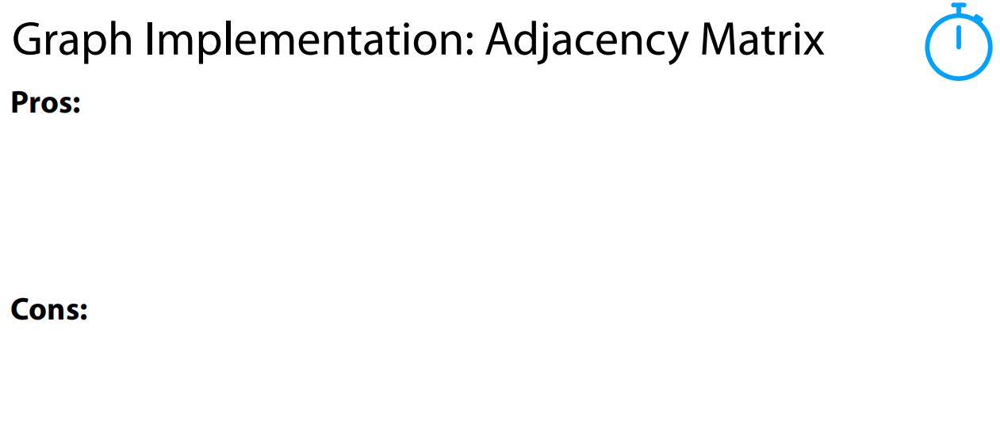

这张图片讲解的是**图的邻接矩阵实现（Adjacency Matrix）**，并详细描述了如何通过邻接矩阵插入和删除图的顶点。下面我将详细解释每一部分内容：

### 1. **图的邻接矩阵**

首先，图片展示了一个有 4 个顶点（u, v, w, z）和 4 条边（a, b, c, d）的图。图的邻接矩阵是一个二维矩阵，**行列**对应图中的顶点，**矩阵的值**表示顶点之间是否有边。

举个例子，矩阵中的一个位置（i，j）如果有值，比如 1，说明顶点 i 和顶点 j 之间有边。如果为 0，则表示没有边。

在这个矩阵里，第一行和第一列分别对应顶点 u 和其他顶点。矩阵内的值表示这些顶点之间的连接关系。

### 2. **插入顶点（insertVertex）**

**操作：**

- **插入顶点（insertVertex）**是将一个新的顶点添加到图中。

  插入顶点的时间复杂度：

  - 添加到**顶点表**中的操作时间复杂度是 **O(1)**（常数时间）。
  - 如果矩阵已经满了，需要增加一个新行和新列，复杂度为 **O(n)**（n是当前顶点数，增加行列需要遍历矩阵一部分）。
  - 在矩阵的**上三角部分**（上三角矩阵的对角线以上部分），需要添加新列。

**总结：**

- 插入新顶点到图的邻接矩阵时，增加矩阵行列可能需要 O(n) 的时间。

### 3. **删除顶点（removeVertex）**

**操作：**

- **删除顶点（removeVertex）**是将图中的某个顶点从邻接矩阵中删除。

  删除顶点的时间复杂度也是 **O(n)**，这是因为删除顶点时必须遍历矩阵的每一行和每一列来调整矩阵的值。

**特殊说明：**

- **墓碑法（Tombstoning）**：为避免每次删除都重新调整矩阵大小，采用“墓碑法”，即用标记（如特殊符号）标记已删除的顶点，而不立即调整矩阵大小。这样可以避免频繁的矩阵大小调整，提高效率。

### 4. **邻接矩阵的表示**

在图中，矩阵的具体展示如下：

- **行和列**：表示顶点。
- **矩阵的内容**：表示顶点之间的边。例如，顶点 u 和 v 之间有一条边，矩阵的相应位置（u, v）就会被标记为 1，表示这两顶点之间有连接。

### 5. **总结**

- **插入顶点**和**删除顶点**的操作在邻接矩阵中的时间复杂度都是 O(n)，因为需要调整矩阵的维度或者更新矩阵值。
- **墓碑法**是处理删除操作的一种优化方式，它通过不立即调整矩阵来提高性能。

如果你有任何关于邻接矩阵的具体问题，或者想要进一步了解图的其他实现方法，欢迎继续提问！

这张图片继续讲解**图的邻接矩阵（Adjacency Matrix）\**实现，重点是\**上三角存储**和**矩阵的空间优化**。下面是详细的解释：

### 1. **图的邻接矩阵表示**

图中的邻接矩阵仍然是一个二维矩阵，其中行和列对应图中的顶点，矩阵中的每个元素表示顶点之间是否有边。举个例子：

- 顶点 **u** 和 **v** 之间有一条边，矩阵的相应位置（u, v）是一个非零值。
- 顶点 **v** 和 **w** 之间有一条边，矩阵的相应位置（v, w）也会有值。

图的邻接矩阵依旧遵循前面提到的规则。

------

### 2. **上三角存储**

在这张图片中，提到了**上三角存储（Upper Diagonal Storage）**的概念：

- 在图的邻接矩阵中，如果是无向图，矩阵是对称的，即 **(i, j)** 位置和 **(j, i)** 位置的值是相同的。
- 采用上三角存储的方式，意味着**只存储矩阵的上三角部分**（即对角线以上的部分）。这样可以节省存储空间，因为下三角部分是冗余的。

**上三角存储的优势：**

- 只存储矩阵的一部分（上三角），这样可以节省空间，提高内存使用效率。
- 对于无向图，这样的存储方式是足够的，因为下三角和上三角是对称的。

------

### 3. **矩阵的空间优化**

在图片中，几个数组列出了如何通过上三角存储优化矩阵存储。

#### **作为列（As cols）**：

- **V = [A]**：表示顶点 A 所对应的列。
- **W = [C, B]**：表示顶点 W 所对应的列。
- **Z = [0, 0, D]**：表示顶点 Z 所对应的列。
- **X = [-,-,-,-]**：表示没有连接的顶点列。

#### **作为行（As rows）**：

- **u = [a, c, 0]**：表示顶点 u 所对应的行，它与顶点 a 和 c 有连接，0 表示与其他顶点没有连接。
- **v = [b, d, c]**：表示顶点 v 所对应的行，它与顶点 b 和 d 有连接。
- **w = [d]**：表示顶点 w 所对应的行，它与顶点 d 有连接。

------

### 4. **时间复杂度分析**

- **插入操作（insertVertex）**的时间复杂度为 **O(1)**：在上三角矩阵中添加新顶点的操作是常数时间的。
- **删除操作（removeVertex）**的时间复杂度为 **O(n)**：删除顶点时需要更新矩阵的相关部分。

------

### 总结：

- **上三角存储**是一种优化图的邻接矩阵存储方式，减少了冗余的数据存储，提高了内存效率。
- 这种方法对于无向图尤为有效，因为无向图的邻接矩阵是对称的。
- 在图的实现中，**空间优化**和**存储效率**是重要的考虑因素。

如果你有任何关于图的邻接矩阵实现的具体问题，或者想了解其他类型的图存储方式，可以继续提问！

这张图片显示的是图的邻接矩阵实现的**优缺点（Pros and Cons）**，但优缺点部分尚未填写。我将为你提供邻接矩阵实现的一些**常见优缺点**。

### 优点（Pros）：

1. **快速检查边的存在**：邻接矩阵允许你在 **O(1)** 时间内检查任意两个顶点之间是否有边。只需要直接访问矩阵中的对应位置即可。
2. **简单直观**：邻接矩阵的结构非常简单，容易理解和实现，适合初学者。
3. **适合密集图**：对于边数接近顶点数平方的**密集图**，邻接矩阵的存储方式效率较高。
4. **容易实现**：邻接矩阵的实现比较简单，不需要复杂的数据结构。

### 缺点（Cons）：

1. **空间消耗大**：邻接矩阵的空间复杂度为 **O(n²)**，即使图是稀疏的，也需要为所有的可能边分配内存，这会造成空间浪费。
2. **处理稀疏图效率低**：对于边数远小于顶点数平方的稀疏图，邻接矩阵会浪费大量空间，导致内存效率低下。
3. **插入和删除操作复杂**：插入和删除顶点或边时，邻接矩阵的操作可能会比较麻烦，尤其是当图的结构发生变化时。
4. **不适合大规模图**：当图的规模非常大时，邻接矩阵的存储和操作可能导致性能瓶颈，尤其是在内存受限的情况下。

这些优缺点帮助你评估是否使用邻接矩阵作为图的表示方法。如果你对其他图的表示方法（如邻接表）有兴趣，可以继续了解。

这张图片描述了图的实现方案的**头脑风暴**过程，特别是对比了不同图表示方法（例如**边列表**和**邻接矩阵**）的优缺点，并提出了一些要求。以下是对这张图片的详细解释：

### 图的实现目标

1. **比边列表更快（Faster than an edge list）**：
   - 边列表（Edge List）是一种简单的图表示方法，它将所有的边列出。在边列表中，寻找某个顶点的邻居（即与某个顶点相连的其他顶点）比较慢，因为你需要遍历所有的边。
   - 图片中提到我们希望找到一种**比边列表更快**的实现方法，尤其是在寻找顶点邻居时，这意味着我们希望能够更快速地查询图中顶点之间的连接关系。
2. **比邻接矩阵占用更少的空间（Less space than an adjacency matrix）**：
   - 邻接矩阵（Adjacency Matrix）是一个二维数组，用来表示图中顶点之间的连接关系。每个元素表示两个顶点之间是否有边连接，空间复杂度为 **O(n²)**，即使图是稀疏的也会浪费大量空间。
   - 图片中的要求是要找到一个**比邻接矩阵占用空间更少**的实现方法，特别是针对稀疏图，邻接矩阵的空间开销非常大。
3. **特别擅长找到所有邻接元素（Particularly good at finding all adjacent elements / neighbors）**：
   - 这是关于**查找邻居**的一个要求。图的邻居查找是图算法中的一个常见操作，特别是遍历图时，我们需要高效地找到某个顶点的所有邻接顶点。
   - 该图实现方案应该能**快速**地找到某个顶点的邻居，尤其是在稀疏图中，邻接矩阵或者边列表在此操作中可能会比较低效。

### 可能的解决方案

根据这些要求，**邻接表（Adjacency List）** 是一种可能的解决方案：

- **邻接表**：为每个顶点维护一个链表（或列表），该链表包含与该顶点直接相连的所有邻居顶点。对于稀疏图，邻接表占用的空间远少于邻接矩阵，因为只存储实际存在的边，不会浪费空间。
  - **邻接表的优点**：
    - **空间效率高**：只存储图中实际的边，因此对于稀疏图，空间复杂度为 **O(n + m)**，其中 **n** 是顶点数，**m** 是边数。
    - **快速查找邻居**：查找某个顶点的邻居通常只需要遍历该顶点的邻接链表，时间复杂度为 **O(k)**，其中 **k** 是该顶点的邻居数。

### 总结

这张图片的内容提出了一个问题：**我们需要一种既能高效查找邻居，又能节省空间的图表示方法**。基于这些要求，邻接表是一个合适的解决方案。它比边列表更高效，并且比邻接矩阵节省空间，尤其适合稀疏图。