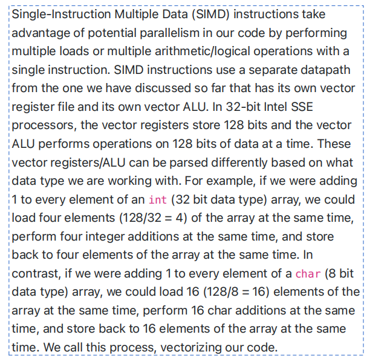

好的，我来帮你详细解释这张图的内容，中英对照讲解：

------

**The Big Picture**
 **整体概览**

------

**原文：**
 A statement T is said to be data dependent on statement S if:

**翻译：**
 如果满足以下条件之一，我们说**语句 T 对语句 S 存在数据依赖**：

- **S executes before T in the original sequential/scalar program**
   S 在原始顺序/标量程序中比 T 先执行
- **S and T access the same data item**
   S 和 T 访问了**同一个数据项**
- **At least one of the accesses is a write**
   至少其中一次访问是**写操作（写入数据）**

------

**原文：**
 By this definition, we have three types of data dependencies:

**翻译：**
 根据这个定义，我们有**三种类型的数据依赖**：

------

- **True Dependence: A Read After Write (RAW) dependency**
   **真正的依赖（True Dependence）：写后读依赖（RAW）**

  - 意思是：语句 S 写了数据，然后语句 T 读取这个数据。

  - 比如：

    ```c
    S: x = 5;
    T: y = x + 1;
    ```

    这里 T 依赖于 S，因为 T 需要读 S 写的 x。

------

- **Anti Dependence: A Write After Read (WAR) dependency**
   **反依赖（Anti Dependence）：读后写依赖（WAR）**

  - 意思是：语句 S 先读数据，语句 T 后写同样的数据。

  - 比如：

    ```c
    S: a = b + 2;
    T: b = 10;
    ```

    这里 S 读了 b，T 后面又写了 b，这种就是反依赖。

------

- **Output Dependence: A Write After Write (WAW) dependency**
   **输出依赖（Output Dependence）：写后写依赖（WAW）**

  - 意思是：语句 S 写了数据，语句 T 后面也写同样的数据。

  - 比如：

    ```c
    S: x = 7;
    T: x = 9;
    ```

    两个语句都写了 x，形成了输出依赖。

------

### 总结一遍中文要点：

- 数据依赖发生在**两个语句访问同一数据项**，而且至少有一次是**写操作**。
- 有三种依赖类型：
  - **RAW（真正依赖）**：先写后读。
  - **WAR（反依赖）**：先读后写。
  - **WAW（输出依赖）**：先写后写。


好的，这部分内容我帮你详细解释，并且给你**中英对照翻译**，一点点来讲清楚：

------

**英文原文：**

> When optimizing the performance of our code using various parallelism techniques, we can potentially change the order of execution of various statements in our programs.
>  Dependencies indicate an execution order in our program that must be honored (i.e., if T is dependent on S, we cannot execute T before S).
>  A true dependency is an integral part of the code and can not be removed.
>  Anti-dependence and output dependencies are called name dependencies because they can potentially be removed from the code by changing the name of a variable.

------

**逐句翻译和详细解释：**

1. **英文：**
    When optimizing the performance of our code using various parallelism techniques, we can potentially change the order of execution of various statements in our programs.
    **中文：**
    当我们使用各种**并行化技术**优化代码性能时，**可以有可能改变程序中不同语句的执行顺序**。

   **解释：**
    在做代码优化（比如用多线程、多核并行）时，有些语句不一定非要按照原本顺序来执行，只要不破坏程序逻辑，顺序是可以调整的。

------

1. **英文：**
    Dependencies indicate an execution order in our program that must be honored (i.e., if T is dependent on S, we cannot execute T before S).
    **中文：**
    **依赖关系**表明了程序中必须遵循的**执行顺序**（也就是说，如果 T 依赖于 S，我们就**不能在 S 执行前执行 T**）。

   **解释：**
    有依赖关系时，必须保证先执行依赖源（S），再执行依赖目标（T），否则程序的结果就可能出错。

------

1. **英文：**
    A true dependency is an integral part of the code and can not be removed.
    **中文：**
    **真正的依赖（True Dependency）**是代码中不可分割的一部分，**无法移除**。

   **解释：**
    真正依赖，比如先写后读（RAW依赖），这种是程序逻辑必须的，不能随便优化掉或重排顺序。

------

1. **英文：**
    Anti-dependence and output dependencies are called name dependencies because they can potentially be removed from the code by changing the name of a variable.
    **中文：**
    **反依赖（Anti-dependence）\**和\**输出依赖（Output Dependence）\**被称为\**名字依赖（Name Dependencies）**，因为我们可以通过**修改变量名**来潜在地**消除这种依赖关系**。

   **解释：**
    有些依赖其实只是因为用了**同一个变量名字**，导致程序需要排队执行；如果我们换个变量名，就可以消除这种假象依赖，让代码能并行得更快。

------

### 小总结（中文）：

- **真正依赖**（RAW）是**必须遵守的执行顺序**，不能打破。
- **反依赖**（WAR）和**输出依赖**（WAW）属于**名字依赖**，有时可以通过**改变量名**来消除，让程序能更灵活地重排顺序，提高性能。

------

要不要我接着给你整理一版更易记忆的小表格？
 比如"依赖类型"、"是否可以消除"、"例子"这样子总结一下？
 要的话告诉我，我顺便帮你画个简图！要不要？



## 英文原文

> Single-Instruction Multiple Data (SIMD) instructions take advantage of potential parallelism in our code by performing multiple loads or multiple arithmetic/logical operations with a single instruction.
>  SIMD instructions use a separate datapath from the one we have discussed so far that has its own vector register file and its own vector ALU.
>  In 32-bit Intel SSE processors, the vector registers store 128 bits and the vector ALU performs operations on 128 bits of data at a time.
>  These vector registers/ALU can be parsed differently based on what data type we are working with.
>  For example, if we were adding 1 to every element of an int (32 bit data type) array, we could load four elements (128/32 = 4) of the array at the same time, perform four integer additions at the same time, and store back to four elements of the array at the same time.
>  In contrast, if we were adding 1 to every element of a char (8 bit data type) array, we could load 16 (128/8 = 16) elements of the array at the same time, perform 16 char additions at the same time, and store back to 16 elements of the array at the same time.
>  We call this process, vectorizing our code.

------

## 中文翻译 + 详细解释

**标题：**
 单指令多数据（SIMD）指令概念

------

**1. 原文：**
 Single-Instruction Multiple Data (SIMD) instructions take advantage of potential parallelism in our code by performing multiple loads or multiple arithmetic/logical operations with a single instruction.
 **中文：**
 **单指令多数据（SIMD）\**指令通过\**一次指令执行多个数据加载或多个算术/逻辑运算**，从而利用了代码中的**潜在并行性**。

**解释：**
 SIMD技术的意思是，**一条指令可以同时处理很多数据**，不是一条一条慢慢处理，大大加快速度。

------

**2. 原文：**
 SIMD instructions use a separate datapath from the one we have discussed so far that has its own vector register file and its own vector ALU.
 **中文：**
 SIMD指令使用的是一条**独立的数据通路**，这条通路有**自己的向量寄存器文件和向量运算单元（ALU）**。

**解释：**
 SIMD不是用普通的CPU运算单元，而是用专门的“向量版”计算硬件，它们可以一次性处理一整组数据。

------

**3. 原文：**
 In 32-bit Intel SSE processors, the vector registers store 128 bits and the vector ALU performs operations on 128 bits of data at a time.
 **中文：**
 在32位Intel SSE处理器中，向量寄存器可以存储**128位**数据，向量运算单元（ALU）一次可以对**128位数据**进行操作。

**解释：**
 SSE（Streaming SIMD Extensions）技术让CPU一次可以处理128位数据，相比传统处理单个32位或64位要快很多。

------

**4. 原文：**
 These vector registers/ALU can be parsed differently based on what data type we are working with.
 **中文：**
 这些向量寄存器和运算单元根据**数据类型**的不同，**可以有不同的解析方式**。

**解释：**
 比如，处理32位整数时，一个128位寄存器可以分成4个32位；如果处理8位字符，那就可以分成16个8位数据块。

------

**5. 原文：**
 For example, if we were adding 1 to every element of an int (32 bit data type) array, we could load four elements (128/32 = 4) of the array at the same time, perform four integer additions at the same time, and store back to four elements of the array at the same time.
 **中文：**
 举个例子：如果我们要给一个**int数组（32位数据类型）\**的每个元素加1，我们可以\**一次性加载4个元素（128 ÷ 32 = 4）**，**同时完成4次整数加法**，并且**一次性把结果存回数组**。

**解释：**
 简单说，加快4倍速度：原本要加4次，现在一次就加完4个。

------

**6. 原文：**
 In contrast, if we were adding 1 to every element of a char (8 bit data type) array, we could load 16 (128/8 = 16) elements of the array at the same time, perform 16 char additions at the same time, and store back to 16 elements of the array at the same time.
 **中文：**
 相反，如果我们是给**char数组（8位数据类型）\**的每个元素加1，那么可以\**一次加载16个元素（128 ÷ 8 = 16）**，**同时执行16次char加法**，并且**一次存回16个元素**。

**解释：**
 处理更小单位的数据（比如8位字符），一次能加更多个（16个），效率更高。

------

**7. 原文：**
 We call this process, vectorizing our code.
 **中文：**
 我们把这个过程称为**代码向量化（Vectorizing our code）**。

**解释：**
 “向量化”就是让一条指令同时处理多个数据，最大化利用硬件的并行能力。

------

### 小总结（中文通俗版）：

- SIMD技术=一条指令处理很多数据，大大提速。
- 128位寄存器：可以同时处理4个32位整数或16个8位字符。
- 这叫**向量化（Vectorization）**，是现代CPU加速的一个关键手段。

------

要不要我也顺便给你画一个小图表，比如“单次处理数量对比（32位 vs 8位）”，一眼看懂？
 要的话告诉我，顺便帮你再列一版超简明版总结！要继续发下一张也可以～


好的，继续按照你的要求来！
 以下是这张图片内容的【什么意思 + 详细解释 + 中英互译】：

------

## 英文原文

> By performing multiple loads, adds, or stores at the same time, we are changing the execution order of a program.
>  For example, if our original program had a load, add, store, load, add, store, the vectorized code would effectively perform load, load, add, add, store, store.
>  Consequently, when vectorizing our code, we need to make sure that this reordering does not change the order of any dependencies.

------

## 中文翻译 + 详细解释

**1. 原文：**
 By performing multiple loads, adds, or stores at the same time, we are changing the execution order of a program.
 **中文：**
 当我们**同时执行多个加载、加法或存储操作**时，其实是在**改变程序的执行顺序**。

**解释：**
 向量化让很多操作同时发生，但这样做的副作用是，原本程序一条一条执行的顺序被打乱了。

------

**2. 原文：**
 For example, if our original program had a load, add, store, load, add, store, the vectorized code would effectively perform load, load, add, add, store, store.
 **中文：**
 比如，如果原来的程序执行顺序是：**加载（load）-> 加法（add）-> 存储（store）-> 加载 -> 加法 -> 存储**，
 那么向量化后的程序执行顺序可能变成：**加载、加载、加法、加法、存储、存储**。

**解释：**
 原本是**一边加载一边处理一边存储**，现在变成了**先集中加载一堆，再集中做加法，再集中存结果**。
 这样一来，**执行顺序表面上变了**，虽然可以加速，但要小心不要破坏逻辑。

------

**3. 原文：**
 Consequently, when vectorizing our code, we need to make sure that this reordering does not change the order of any dependencies.
 **中文：**
 因此，在**对代码进行向量化时**，必须**确保这种重新排序不会破坏任何依赖关系的顺序**。

**解释：**
 如果两个操作之间有**数据依赖**（比如先算再存），向量化后也必须**保住这种依赖顺序**，
 否则程序跑出来的结果就是错的！

------

## 小总结（中文通俗版）

- 向量化可以一次处理多个操作，加速程序。
- 但也会**打乱操作的执行顺序**。
- 在向量化时，必须**保护依赖关系**，不能因为加速而改变程序本来正确的逻辑。

------

要不要我顺便帮你总结一版：

- **正常执行流程图** vs **向量化后的流程图**？

这样你可以一眼看懂为什么load-load、add-add、store-store这样分组～
 要的话告诉我！
 可以继续发下一张图片！


继续按照你的要求，下面是这张图片的【什么意思 + 详细解释 + 中英互译】：

------

## 英文原文

> Up until now, we have made two simplifying assumptions about the ways processors work:
>
> 1. each program we write will be the only program running on a processor
> 2. the code and the data each program uses just magically appears and is small enough to fit in main memory.
>     The first assumption is problematic because we do want multiple programs running at the same time.
>     These different programs may want to write to the same memory addresses, meaning that different programs could theoretically overwrite each other's data in main memory.
>     The second assumption is problematic because even though our main memory is large, it is not large enough to contain all data/instructions we could possibly want to use.
>     AND main memory is volatile, meaning that all data is lost when the memory loses power (ideally we don't want to lose all programs and data from our computers when we turn them off!).
>     Consequently, we need a system that can flexibly
> 3. allow multiple programs to access data memory while not allowing them to access each other's data/instructions (i.e., provide data security)
> 4. allow our assembly code programs to pretend that data is in main memory but is actually copying data from even larger, non-volatile sources (like hard disks) to main memory without our program knowing.
>     Enter Virtual Memory.

------

## 中文翻译 + 详细解释

**1. 原文：**
 Up until now, we have made two simplifying assumptions about the ways processors work:
 **中文：**
 到目前为止，我们对处理器工作方式做了两个简化假设：

------

**2. 原文：**

1. each program we write will be the only program running on a processor
2. the code and the data each program uses just magically appears and is small enough to fit in main memory.
    **中文：**
    1）我们编写的每个程序都会是处理器上**唯一运行的程序**；
    2）每个程序使用的代码和数据会**自动出现在内存中**，而且**足够小，可以完全装进主存**。

**解释：**
 一开始为了简单，假设一台机器只跑一个程序，且内存足够放下所有内容。

------

**3. 原文：**
 The first assumption is problematic because we do want multiple programs running at the same time.
 **中文：**
 第一个假设是有问题的，因为实际上我们希望**多个程序能同时运行**。

**解释：**
 现代电脑肯定要多开程序，比如开浏览器、微信、文档同时进行，不可能只跑一个程序。

------

**4. 原文：**
 These different programs may want to write to the same memory addresses, meaning that different programs could theoretically overwrite each other's data in main memory.
 **中文：**
 这些不同的程序**可能想写入同样的内存地址**，
 这意味着**不同程序可能互相覆盖彼此在主存中的数据**。

**解释：**
 如果没有保护机制，不同程序很容易因为地址冲突而破坏对方的数据。

------

**5. 原文：**
 The second assumption is problematic because even though our main memory is large, it is not large enough to contain all data/instructions we could possibly want to use.
 **中文：**
 第二个假设也有问题，因为即使我们的主存很大，**也不足以装下所有可能需要的数据或指令**。

**解释：**
 有些大型程序或多个程序一起跑，数据量太大，内存根本放不下。

------

**6. 原文：**
 AND main memory is volatile, meaning that all data is lost when the memory loses power (ideally we don't want to lose all programs and data from our computers when we turn them off!).
 **中文：**
 而且主存是**易失性的**，也就是说**断电后所有数据都会丢失**（理想情况下，我们肯定不希望电脑关机时把程序和数据全丢了！）。

**解释：**
 内存一断电数据就消失，所以必须想办法把重要数据保存在其他地方。

------

**7. 原文：**
 Consequently, we need a system that can flexibly:
 **中文：**
 因此，我们需要一个可以灵活处理的系统，它需要能做到：

------

**8. 原文：**

1. allow multiple programs to access data memory while not allowing them to access each other's data/instructions (i.e., provide data security)
    **中文：**
    1）**允许多个程序访问主存数据**，但**又不能互相访问彼此的数据或指令**（也就是**保障数据安全**）

------

**9. 原文：**

2) allow our assembly code programs to pretend that data is in main memory but is actually copying data from even larger, non-volatile sources (like hard disks) to main memory without our program knowing.

 **中文：**
 2）**让汇编代码编写的程序以为数据都在主存里**，
 实际上，系统在后台**悄悄把更大的非易失性存储（比如硬盘）里的数据复制到主存**，程序完全不需要知道。

**解释：**
 程序员不用管数据是不是在内存，系统自动帮你从硬盘拿数据，做到“假装”数据就在主存。

------

**10. 原文：**
 Enter Virtual Memory.
 **中文：**
 这就是**虚拟内存（Virtual Memory）**登场的原因。

**解释：**
 虚拟内存系统出现，就是为了解决**多程序运行、安全隔离、主存不足、断电丢数据**等一系列问题。

------

## 小总结（中文通俗版）

- 原来的两个假设（只有一个程序、内存够用）都不现实。
- 现实情况：需要**多程序同时运行**，**防止数据冲突**，**解决内存容量不足**，**保护数据断电不丢**。
- 于是引入了**虚拟内存**，让程序以为内存无限大又安全可靠，系统后台自动搞定。

------

要不要我再顺便画一张小流程图？
 比如“实际物理内存 vs 虚拟内存”的对比流程，很直观一眼懂～
 要的话告诉我！可以继续发下一张！


好的！继续保持【什么意思 + 详细解释 + 中英互译】风格。
 这张图片内容的整理如下：

------

## 英文原文

> Virtual Memory solves both problems by using the principle of **indirection**, treating the addresses that our programs think they are writing to as references to the real addresses where their data is stored.
>  When using a load or store instruction, the address you construct is actually a virtual address.
>  The virtual memory system converts this virtual address into a physical address, which is actually where your data is stored, by looking up the virtual address in a special lookup table called the **page table** that tells it the correct physical address for each virtual address for each process (program) that is running.
>  For example, if your program tries to read from address 0x10010008 (i.e., `lw $t0, 0x10010008`), that is the virtual address.
>  The virtual memory system would look up 0x10010008 in the page table and might find that the physical address is actually 0xcafe0008.
>  Likewise, a different program might try to read from address 0x10010008 for its virtual address but the page table would tell the virtual memory system that the physical address for that program is actually 0x02330008.
>  Although both programs think they are reading from the same address, virtual memory lets both programs read their own data separate from each other.

------

## 中文翻译 + 详细解释

**1. 原文：**
 Virtual Memory solves both problems by using the principle of **indirection**, treating the addresses that our programs think they are writing to as references to the real addresses where their data is stored.
 **中文：**
 **虚拟内存（Virtual Memory）\**通过使用\**间接寻址（indirection）\**的原理，
 把程序认为自己在读写的地址，当作是\**实际存储位置的引用**，从而解决了之前提到的两个问题。

**解释：**
 程序员看到的地址并不是实际内存里的位置，而是一个“假地址”，系统帮忙找到真正的数据位置。

------

**2. 原文：**
 When using a load or store instruction, the address you construct is actually a virtual address.
 **中文：**
 当程序执行**加载（load）\**或\**存储（store）指令**时，实际使用的是**虚拟地址**。

**解释：**
 比如 `lw` （load word，加载一个字）指令里用的地址，是虚拟的，不是直接指向物理内存。

------

**3. 原文：**
 The virtual memory system converts this virtual address into a physical address, which is actually where your data is stored, by looking up the virtual address in a special lookup table called the **page table** that tells it the correct physical address for each virtual address for each process (program) that is running.
 **中文：**
 虚拟内存系统通过查找一个叫做**页表（page table）\**的特殊表，
 将虚拟地址转换成\**物理地址**（真正存放数据的地方）。
 页表为**每个进程（程序）\**维护了\**虚拟地址和物理地址的对应关系**。

**解释：**
 系统通过查询“页表”，把你想访问的虚拟地址翻译成实际物理内存的位置。

------

**4. 原文：**
 For example, if your program tries to read from address 0x10010008 (i.e., `lw $t0, 0x10010008`), that is the virtual address.
 **中文：**
 举例来说，如果你的程序尝试从地址**0x10010008**读取数据（比如 `lw $t0, 0x10010008`），
 那么**0x10010008**就是一个**虚拟地址**。

------

**5. 原文：**
 The virtual memory system would look up 0x10010008 in the page table and might find that the physical address is actually 0xcafe0008.
 **中文：**
 虚拟内存系统会在页表中查找**0x10010008**，可能发现其实际的物理地址是**0xcafe0008**。

**解释：**
 虚拟地址到物理地址的映射是系统内部控制的，程序本身不知道。

------

**6. 原文：**
 Likewise, a different program might try to read from address 0x10010008 for its virtual address but the page table would tell the virtual memory system that the physical address for that program is actually 0x02330008.
 **中文：**
 同样，另一个程序也可能尝试读取虚拟地址**0x10010008**，
 但页表会告诉虚拟内存系统，这个程序实际对应的物理地址是**0x02330008**。

**解释：**
 虽然两个程序看起来用的是一样的地址，但背后映射到的物理位置是不同的，互不干扰。

------

**7. 原文：**
 Although both programs think they are reading from the same address, virtual memory lets both programs read their own data separate from each other.
 **中文：**
 虽然两个程序以为自己在读同一个地址，
 但**虚拟内存保证它们各自读到的是自己的数据，互不干扰**。

------

## 小总结（中文通俗版）

- **程序看到的是虚拟地址，不是真实的物理内存地址。**
- **虚拟内存系统通过页表，把虚拟地址翻译成真正物理地址。**
- **不同程序即使看到相同虚拟地址，实际访问的是自己独立的数据。**
- **这就解决了多程序安全、内存管理灵活、程序之间互不干扰的问题。**

------

要不要我再帮你画一个小示意图，比如：

- 程序A看见 `0x10010008` → 实际去读 `0xcafe0008`
- 程序B也看见 `0x10010008` → 实际去读 `0x02330008`

一目了然！要的话告诉我～
 也可以继续发下一张图片！我随时接着！


好的！继续按照【什么意思 + 详细解释 + 中英互译】来整理。
 这张图片的内容如下：

------

## 英文原文

> If the virtual memory system does not find the desired virtual address in the page table, it causes a page fault (similar to a cache miss).
>  A page fault means that the desired data has not yet been copied into the memory.
>  After a page fault, the desired data is located on the disk, copied to the memory, and a new entry is added to the page table for future accesses to that entry in the page table.
>  The virtual memory system can then properly convert the virtual address into a physical address so that programs can securely access their data.

> The videos and other resources will dive a little deeper into how we actually implement the virtual memory system.

------

## 中文翻译 + 详细解释

**1. 原文：**
 If the virtual memory system does not find the desired virtual address in the page table, it causes a page fault (similar to a cache miss).
 **中文：**
 如果**虚拟内存系统**在**页表（page table）\**中找不到目标虚拟地址，
 就会发生\**缺页异常（page fault）**，（这有点像**缓存未命中（cache miss）**）。

**解释：**
 简单说，本来程序想用的数据地址，页表里没有记录，那就触发“缺页”，需要补救措施。

------

**2. 原文：**
 A page fault means that the desired data has not yet been copied into the memory.
 **中文：**
 缺页异常表示，**想要访问的数据还没有被复制到内存中**。

**解释：**
 数据还在硬盘上，程序要用的时候，才发现内存里没有，需要临时去硬盘取回来。

------

**3. 原文：**
 After a page fault, the desired data is located on the disk, copied to the memory, and a new entry is added to the page table for future accesses to that entry in the page table.
 **中文：**
 在发生缺页异常后，系统会**在磁盘上找到所需的数据**，
 **把数据复制到内存中**，然后**在页表里添加一个新条目**，
 以便将来访问这个地址时可以直接找到。

**解释：**
 第一次访问慢一点（要从硬盘搬到内存），以后再访问就快了，因为页表有记录了。

------

**4. 原文：**
 The virtual memory system can then properly convert the virtual address into a physical address so that programs can securely access their data.
 **中文：**
 这样，虚拟内存系统就能**正确地把虚拟地址转换成物理地址**，
 从而让程序**安全地访问自己的数据**。

**解释：**
 一旦补充完数据，虚拟地址到物理地址的映射就恢复正常，程序继续运行。

------

**5. 原文：**
 The videos and other resources will dive a little deeper into how we actually implement the virtual memory system.
 **中文：**
 后续的视频和其他资料将会**更深入讲解**虚拟内存系统的具体实现方法。

------

## 小总结（中文通俗版）

- 如果访问虚拟地址时，页表里没找到 → 触发**缺页异常（page fault）**。
- 系统会去**磁盘上找数据**，**复制到内存**，并且**更新页表**。
- 以后再访问这个地址，就不会再出错了，速度也快了。
- **虚拟内存机制**保证了程序员不需要管这些细节，一切自动完成。

------

要不要我再顺便给你画一个“缺页异常处理流程图”？
 比如：

访问虚拟地址 ➔ 页表查找 ➔ 找不到 ➔ 触发缺页异常 ➔ 磁盘取数据 ➔ 放入内存 ➔ 更新页表 ➔ 继续执行

一眼看懂！
 要的话告诉我～可以继续发下一张图片也可以！我都在！


好的，继续按照你的要求，【什么意思 + 详细解释 + 中英互译】！

------

## 英文原文

> First, a few important definitions:
>
> • **Processor Core**: A datapath like what we have seen during class that has an instruction cache, register file, ALU, data cache, etc.
>  • **Thread**: A program or a small part of a program that can be run independently and scheduled independently by the operating system.
>  • **Cache Coherence**: The caches from the different cores are said to have coherence for a piece of data when they all agree on the current value of that piece of data or do not have a value stored for that data.

> In a single core processor, the operating system creates the appearance of running multiple programs at a time by quickly switching between different threads based on what processes are in demand by the user.
>  By adding multiple cores in a processor, we create the ability to actually run multiple threads in parallel with each core running threads from different processes or several threads from the same process.
>  This parallelism can dramatically improve performance but at the cost of some new concerns about how to manage dependencies.

------

## 中文翻译 + 详细解释

------

### 1. 三个重要定义

**• Processor Core（处理器核心）**
 **英文原文：**
 A datapath like what we have seen during class that has an instruction cache, register file, ALU, data cache, etc.
 **中文翻译：**
 **处理器核心**是一个**数据通路**，包括了**指令缓存（instruction cache）**、**寄存器文件（register file）**、**算术逻辑单元（ALU）**、**数据缓存（data cache）**等。

**详细解释：**
 简单来说，**一个核心就像是一台微型计算机内部的操作单元**，它能独立执行运算、存储数据、读取指令。

------

**• Thread（线程）**
 **英文原文：**
 A program or a small part of a program that can be run independently and scheduled independently by the operating system.
 **中文翻译：**
 **线程**是**一个程序**或**程序的一小部分**，可以**被操作系统单独调度和独立运行**。

**详细解释：**
 一个大程序可以拆成多个小任务（线程），系统可以根据需要调度它们分别运行，提升反应速度和并发能力。

------

**• Cache Coherence（缓存一致性）**
 **英文原文：**
 The caches from the different cores are said to have coherence for a piece of data when they all agree on the current value of that piece of data or do not have a value stored for that data.
 **中文翻译：**
 **缓存一致性**指的是，当**不同核心的缓存**对于**同一块数据**的**当前值达成一致**（或者都没有缓存这个数据时），就说它们**保持一致性**。

**详细解释：**
 如果多核各自保存了一份同样的数据，**必须保证数据同步更新**，否则程序读到的内容就可能错误。

------

### 2. 单核和多核处理器下的运行机制

**英文原文：**
 In a single core processor, the operating system creates the appearance of running multiple programs at a time by quickly switching between different threads based on what processes are in demand by the user.
 **中文翻译：**
 在**单核处理器**中，操作系统通过**快速在不同线程之间切换**，
 让用户感觉**好像同时在运行多个程序**。

**详细解释：**
 单核CPU其实**一次只能干一件事**，但通过超快切换线程，让人感觉多个程序同时在跑，比如边听歌边打字。

------

**英文原文：**
 By adding multiple cores in a processor, we create the ability to actually run multiple threads in parallel with each core running threads from different processes or several threads from the same process.
 **中文翻译：**
 通过在处理器中**增加多个核心**，我们就能实现**真正的多线程并行运行**，
 每个核心可以跑**不同进程的线程**，或者是**同一进程的多个线程**。

**详细解释：**
 多核CPU可以**真正同时处理多件事情**，不是靠切换，而是每个核心独立工作。

------

**英文原文：**
 This parallelism can dramatically improve performance but at the cost of some new concerns about how to manage dependencies.
 **中文翻译：**
 这种**并行性**可以**极大提升性能**，
 但**也带来新的挑战**，比如**如何管理不同线程之间的数据依赖关系**。

**详细解释：**
 多线程同时修改数据，很容易出错，需要复杂的**同步机制**保证程序正确运行。

------

## 小总结（中文通俗版）

- **Processor Core** = 处理器核心，小型独立计算单元。
- **Thread** = 线程，程序中可独立调度的小任务。
- **Cache Coherence** = 缓存一致性，不同核心之间要统一数据。
- 单核靠**快速切换线程**伪装多任务。
- 多核可以**真正并行运行**多个任务，但要注意**同步和依赖问题**。

------

要不要我顺便帮你画个小示意图，比如：

- 单核时：线程1 → 线程2 → 线程3 （快速切换）
- 多核时：核心1跑线程1，核心2跑线程2 （并行）

一眼对比超清晰！
 要的话告诉我～继续发图片也可以！我随时在！


明白，继续按照你的要求，【什么意思 + 详细解释 + 中英互译】！

------

## 英文原文

> A critical challenge in effectively writing a single program that can concurrently run multiple threads is that each core has its own cache.
>  If we perform a write to the cache in one core, the caches of the other cores will not also be written to, causing the caches to lose coherence.
>  Therefore, we need protocols that help us keep track of when coherence is lost.
>  The **Modified-Shared-Invalid (MSI)** protocol builds on the ideas of valid and dirty bits that we have previously seen with caches.
>  Each cache block in each cache is controlled by a Finite State Machine that implements the MSI protocol.
>  The Invalid...

（图片末尾没有显示完，后面应该继续介绍MSI协议的细节）

------

## 中文翻译 + 详细解释

------

**1. 原文：**
 A critical challenge in effectively writing a single program that can concurrently run multiple threads is that each core has its own cache.
 **中文翻译：**
 在编写能够**同时运行多个线程**的单个程序时，一个**关键挑战**是：
 **每个核心都有自己的缓存（cache）**。

**详细解释：**
 多核CPU中，每个核心有自己独立的小型高速存储区域（缓存），这样访问速度更快，但也带来新的问题。

------

**2. 原文：**
 If we perform a write to the cache in one core, the caches of the other cores will not also be written to, causing the caches to lose coherence.
 **中文翻译：**
 如果我们在**某一个核心的缓存中执行写操作**，
 **其他核心的缓存不会同步更新**，导致**缓存之间失去一致性（coherence）**。

**详细解释：**
 比如核1更新了数据，但核2、核3的缓存还保存着旧数据，就出现了不一致的问题，会引发错误。

------

**3. 原文：**
 Therefore, we need protocols that help us keep track of when coherence is lost.
 **中文翻译：**
 因此，我们需要一些**协议（protocol）**，
 来**跟踪并管理缓存一致性何时丧失**的情况。

**详细解释：**
 必须有机制来检测并修正缓存内容不一致的问题，保证程序正确运行。

------

**4. 原文：**
 The **Modified-Shared-Invalid (MSI)** protocol builds on the ideas of valid and dirty bits that we have previously seen with caches.
 **中文翻译：**
 **修改-共享-失效（MSI）协议**，是基于我们以前在缓存中学到的**有效位（valid bit）**和**脏位（dirty bit）**概念建立的。

**详细解释：**
 MSI协议是一个简单但经典的缓存一致性管理方法，通过设定每块缓存的状态来控制同步行为。

------

**5. 原文：**
 Each cache block in each cache is controlled by a Finite State Machine that implements the MSI protocol.
 **中文翻译：**
 每个缓存中的**缓存块（cache block）**，
 都是由一个**有限状态机（Finite State Machine, FSM）\**来管理，
 这个状态机具体执行\**MSI协议**。

**详细解释：**
 每一块缓存区域会根据当前情况（比如是否被修改、是否被共享）在“修改（Modified）”、“共享（Shared）”、“失效（Invalid）”这三种状态之间切换。

------

## 小总结（中文通俗版）

- 每个CPU核心有自己的**缓存**，提高速度，但会带来**缓存不一致**问题。
- 当一个核心修改数据，其他核心可能不知道，数据就错了。
- 为了保证正确性，提出了**MSI协议**，管理缓存数据的状态。
- 每块缓存数据都有**自己的小状态机**，自动判断是**修改过的**、**共享的**还是**无效的**。

------

如果你想，我可以帮你画一个小图表，比如：

- Modified（已修改）
- Shared（共享）
- Invalid（失效）
   三种状态之间如何切换的小流程图！

要的话告诉我～
 可以继续发下一张图！我随时跟上！


好的，继续给你整理【什么意思 + 详细解释 + 中英互译】！

------

## 英文原文

> The Invalid state is similar to when the valid bit is 0: the data currently stored in a cache block is currently out of date and cannot be used.
>  If a cache block is accessed while in the invalid state, we would get a cache miss.
>  The Shared state is similar to when the valid bit is 1 and the dirty bit is 0: the data in the cache block has never been written to, so we can guarantee that the cache block has coherence with all other caches that are storing the same cache block.
>  Multiple caches can have the same cache block in the Shared state.
>  The Modified state is similar to when the valid bit is 1 and the dirty bit is 1: the data in the cache block has been written to, and we cannot guarantee that its contents match main memory or the other caches.
>  If any cache is storing a cache block in an invalid state, then every other cache must invalidate their copy of that cache block.
>  If a Modified cache block gets replaced, we must copy the contents of that cache block back to memory or to the other caches or both.

------

## 中文翻译 + 详细解释

------

### 1. Invalid 状态（失效状态）

**原文：**
 The Invalid state is similar to when the valid bit is 0: the data currently stored in a cache block is currently out of date and cannot be used.
 If a cache block is accessed while in the invalid state, we would get a cache miss.
 **中文翻译：**
 **Invalid（失效）状态**类似于**有效位（valid bit）为0**的情况：
 缓存块中当前存储的数据**已经过时**，**不能再使用**。
 如果我们在**Invalid状态**下访问这个缓存块，会出现**缓存未命中（cache miss）**。

**详细解释：**
 数据无效，相当于没有缓存这块内容，需要重新从主存中取数据。

------

### 2. Shared 状态（共享状态）

**原文：**
 The Shared state is similar to when the valid bit is 1 and the dirty bit is 0:
 the data in the cache block has never been written to,
 so we can guarantee that the cache block has coherence with all other caches that are storing the same cache block.
 Multiple caches can have the same cache block in the Shared state.
 **中文翻译：**
 **Shared（共享）状态**类似于**有效位是1，脏位（dirty bit）是0**的情况：
 缓存块中的数据**从未被写入修改过**，
 因此可以**保证它与其他缓存中存储同样数据块的副本保持一致性（coherence）**。
 多个缓存可以同时保存**同一个缓存块**，且都处于**Shared状态**。

**详细解释：**
 大家都只读不改，互不干扰，数据是一致的。

------

### 3. Modified 状态（修改状态）

**原文：**
 The Modified state is similar to when the valid bit is 1 and the dirty bit is 1:
 the data in the cache block has been written to,
 and we cannot guarantee that its contents match main memory or the other caches.
 **中文翻译：**
 **Modified（修改）状态**类似于**有效位是1，脏位是1**的情况：
 缓存块中的数据**已经被写入修改**，
 因此**不能保证它和主存或其他缓存中的副本一致**。

**详细解释：**
 数据被改过了，只有这个缓存里的版本是最新的，主存和其他缓存都是旧的。

------

**原文：**
 If any cache is storing a cache block in an invalid state, then every other cache must invalidate their copy of that cache block.
 **中文翻译：**
 如果有任意一个缓存把某个块标记为**Invalid（失效）**，
 那么**所有其他缓存中对应的副本也必须被标记为失效**。

**详细解释：**
 为了避免读到错的数据，一旦有地方标记了失效，所有地方都要同步失效。

------

**原文：**
 If a Modified cache block gets replaced, we must copy the contents of that cache block back to memory or to the other caches or both.
 **中文翻译：**
 如果一个**Modified（修改过的）缓存块**需要被替换出去，
 我们必须把它**的内容回写到主存或其他缓存，或者两者都写**。

**详细解释：**
 因为缓存中是最新的数据，替换时要把新数据保存下来，不能直接丢弃。

------

## 小总结（中文通俗版）

- **Invalid** = 数据无效，不可用，访问时报错。
- **Shared** = 数据可读，未被改动，多个缓存可以共享。
- **Modified** = 数据已被改动，只此处有效，需要同步回主存或其他地方。
- MSI协议就是通过这些**状态切换**，来管理**缓存一致性**。

------

要不要我帮你画一个小的【MSI状态转换图】？比如：

- 读写操作 → 状态从 Shared → Modified
- 外部更新 → 状态从 Shared/Modified → Invalid

一看就懂！要的话告诉我～
 可以继续发下一张图片，我也随时在！