这张图片是关于你这门课的 **期末考试说明（Final Exam）**。下面是详细解释：

------

### **考试安排**

- **考试时间：** 1小时50分钟
- **题型：** 包含编程题（coding）和理论题（theory），和之前考试类似
- **特别说明：** **期末考试中不会有自由回答题（free response question）**，意思是你不需要写长篇解释，只需要选择、计算或编程作答。

------

### **考试内容（Topics Covered）**

期末考试是**综合性的（comprehensive）**，包含：

1. **所有之前考试中的内容**
2. **加上以下新的内容：**

#### **概率数据结构（Probabilistic Data Structures）**

这些是**节省空间但有容错的近似算法和结构**，常用于大数据中快速判断。

- **Bloom Filters（布隆过滤器）**
  - 一种用位数组和多个哈希函数判断某元素是否“可能存在”于集合中的结构。
  - 特点：有**假阳性**（可能错误地认为存在），但**不会有假阴性**。
  - 常用于快速网页黑名单检测、数据库缓存等。
- **Cardinality Estimation（基数估计）**
  - 用于估算**一个集合中不同元素的数量**。
  - 例如 HyperLogLog 算法可在小内存中估算百万级唯一用户数量。
- **Minhash Sketching**
  - 用于快速估算两个集合的相似度（例如网页去重）。
  - 用哈希方式近似 Jaccard 相似度。

------

### **总结**

这门期末考试将：

- 覆盖整个学期的知识点（所有作业和考试）
- 重点加入“概率数据结构”这类新知识
- 不包含长答案题，只考代码和理论选择/计算题

------

你是否需要我帮你复习其中某一部分，例如布隆过滤器的原理或 Minhash 的具体算法？我可以给你例子、图示或习题。

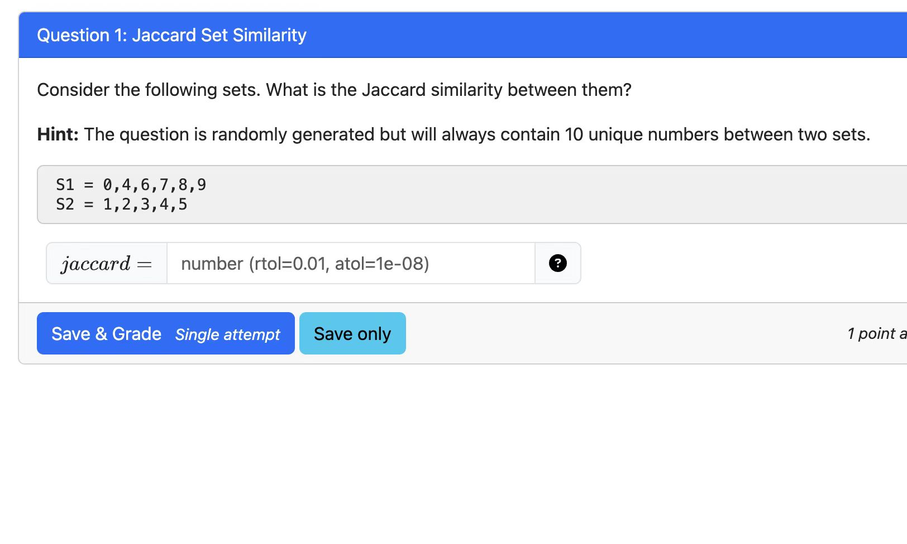

这是一个关于 **Jaccard 相似度（Jaccard similarity）** 的考试题目。下面是详细解释和计算过程：

------

### **题目意思：**

你被给了两个集合：

- `S1 = {0, 4, 6, 7, 8, 9}`
- `S2 = {1, 2, 3, 4, 5}`

**问题：** 这两个集合的 **Jaccard 相似度** 是多少？

------

### **什么是 Jaccard 相似度？**

Jaccard 相似度是用于衡量两个集合相似程度的指标，定义为：

$\text{Jaccard}(A, B) = \frac{|A \cap B|}{|A \cup B|}$

即：**交集的大小除以并集的大小**

------

### **具体计算步骤：**

1. **交集**（两个集合都包含的元素）：

$S1 \cap S2 = \{4\} \Rightarrow |交集| = 1$

1. **并集**（两个集合的所有元素去重）：

$S1 \cup S2 = \{0,1,2,3,4,5,6,7,8,9\} \Rightarrow |并集| = 10$

1. **计算 Jaccard 相似度：**

$\text{Jaccard}(S1, S2) = \frac{1}{10} = 0.1$

------

### **答案填写：**

你应该在输入框里填入：

```
0.1
```

------

### **总结**

- Jaccard 相似度是交集除以并集
- 本题中，两个集合交集只有一个元素（4），并集共有10个不同的元素
- 所以相似度是 **0.1**

是否需要我给你准备一两个类似的练习题来巩固这个概念？

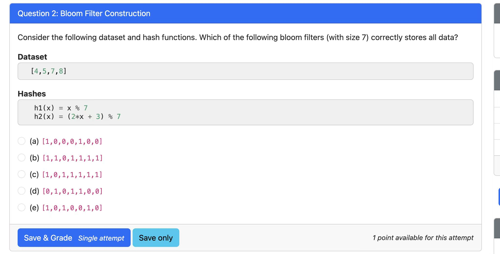

这是一个关于 **Bloom Filter 构建** 的选择题，要求你根据给定数据集和哈希函数，判断哪一个 Bloom Filter 是正确的。下面是**详细解释与解题步骤**：

------

## **题目结构说明**

- **数据集：** `[4, 5, 7, 8]`
- **哈希函数（两个）**：
  - `h1(x) = x % 7`
  - `h2(x) = (2 * x + 3) % 7`
- **布隆过滤器大小：7 位（二进制数组）**

------

## **Bloom Filter 工作原理**

对于每个元素，计算所有的哈希函数位置，并将对应位置设为 `1`。

例如：对于 `x = 4`，

- `h1(4) = 4 % 7 = 4`
- `h2(4) = (2*4 + 3) % 7 = 11 % 7 = 4`

Bloom filter 中索引 4 设为 `1`

------

## **对每个元素进行计算**

### 1. **x = 4**

- h1(4) = 4
- h2(4) = (8 + 3) % 7 = 11 % 7 = **4** → 设置 bit[4] = 1

### 2. **x = 5**

- h1(5) = 5
- h2(5) = (10 + 3) % 7 = 13 % 7 = **6** → 设置 bit[5] = 1，bit[6] = 1

### 3. **x = 7**

- h1(7) = 7 % 7 = 0
- h2(7) = (14 + 3) % 7 = 17 % 7 = **3** → 设置 bit[0] = 1，bit[3] = 1

### 4. **x = 8**

- h1(8) = 8 % 7 = 1
- h2(8) = (16 + 3) % 7 = 19 % 7 = **5** → 设置 bit[1] = 1，bit[5] = 1（已设）

------

## **构建最终 Bloom Filter**

我们设为 1 的位置是：

- bit[0] （来自 7）
- bit[1] （来自 8）
- bit[3] （来自 7）
- bit[4] （来自 4）
- bit[5] （来自 5, 8）
- bit[6] （来自 5）

因此结果是：

```
[1, 1, 0, 1, 1, 1, 1]
```

------

## **答案：**

正确选项是 **(c)**

------

## **总结**

- Bloom Filter 对每个值应用所有哈希函数；
- 每个哈希函数返回的位置设为1；
- 最终结果是 `[1, 1, 0, 1, 1, 1, 1]` → 选项 **(c)**

要不要我再帮你练一题类似的，或者解释布隆过滤器的应用原理？

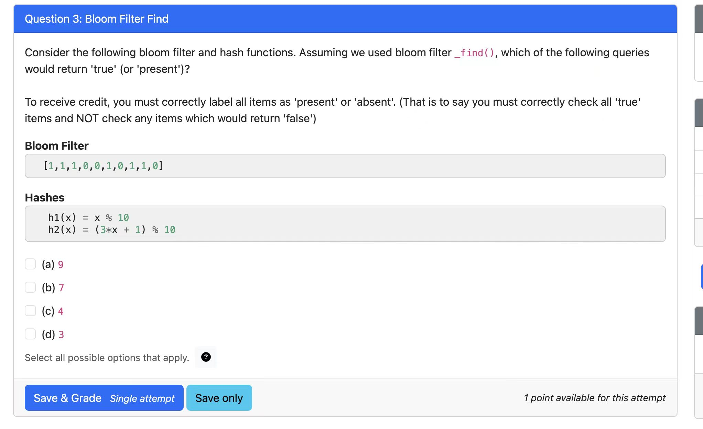

这是一个关于 **Bloom Filter 查询（find）操作** 的题目。你需要判断哪些选项在布隆过滤器中会返回 **"true"（可能存在）**。

------

### **题目结构说明**

- **布隆过滤器大小：** 10 位

  ```
  [1, 1, 1, 0, 0, 1, 0, 1, 1, 0]
   0  1  2  3  4  5  6  7  8  9 ← 索引
  ```

- **哈希函数：**

  - `h1(x) = x % 10`
  - `h2(x) = (3 * x + 1) % 10`

- **选项（要检查的数字）：** `9`, `7`, `4`, `3`

------

### **Bloom Filter 查找原理**

要查一个数是否“可能存在”，你需要：

- 用所有哈希函数算出索引；
- 如果这些位置在布隆数组中全是1 → 返回 **True（可能存在）**；
- 如果有一个位置是0 → 返回 **False（确定不存在）**

------

### **逐项检查**

#### **(a) 9**

- h1(9) = 9 % 10 = **9** → Bloom[9] = 0
- h2(9) = (3×9 + 1) % 10 = 28 % 10 = **8** → Bloom[8] = 1 → **9 返回 False（不在）**

#### **(b) 7**

- h1(7) = 7 % 10 = **7** → Bloom[7] = 1
- h2(7) = (3×7 + 1) % 10 = 22 % 10 = **2** → Bloom[2] = 1
   → **7 返回 True（可能存在）**

#### **(c) 4**

- h1(4) = 4 → Bloom[4] = 0
- h2(4) = (3×4 + 1) = 13 % 10 = **3** → Bloom[3] = 0
   → 有两个位置都是0 → **False**

#### **(d) 3**

- h1(3) = 3 → Bloom[3] = 0
- h2(3) = (9 + 1) = 10 % 10 = **0** → Bloom[0] = 1
   → 其中一位为0 → **False**

------

### **答案是：**

→ 只有 **(b) 7** 会被 `find()` 判断为“可能存在”
 所以你应该只勾选：

```
(b)
```

------

### **总结：**

- 布隆过滤器返回 True 只有在所有哈希位都为 1 时
- 否则就是一定不在（False）
- 本题答案是 **(b) 7**

需要我帮你写一个简单 Python 程序来模拟这个过程练习吗？

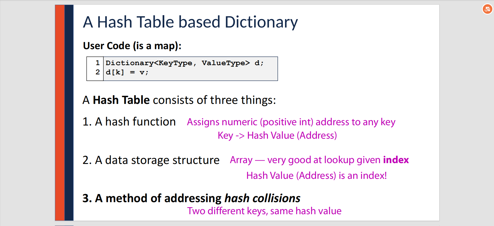

这张幻灯片解释了“**基于哈希表的字典（Hash Table based Dictionary）**”的基本概念。以下是每个部分的详细解释：

------

### **1. 用户代码 (User Code is a map):**

```cpp
Dictionary<KeyType, ValueType> d;
d[k] = v;
```

这是伪代码（类似 C++ 或 Java），表示你定义了一个**字典 `d`**，它的键（`KeyType`）和值（`ValueType`）是任意类型。`d[k] = v;` 表示将键 `k` 映射到值 `v`。

------

### **2. 哈希表由三部分组成（A Hash Table consists of three things）**

#### **① 哈希函数（A hash function）**

- **功能：** 将任意的键（Key）转成一个正整数（地址）。
- **形式：** `Key -> Hash Value (Address)`
- **解释：** 哈希函数接受任意类型的键（比如字符串、整数等），输出一个唯一的“地址”或“索引”值（通常是一个整数），用于在数组中查找。

------

#### **② 数据存储结构（A data storage structure）**

- **形式：** 通常是**数组（Array）**
- **优势：** 数组能根据索引（即哈希值）快速访问数据。
- **解释：** 哈希值被当作数组索引，直接定位数据，查询速度非常快（平均时间复杂度为O(1)）。

------

#### **③ 处理哈希冲突的方法（A method of addressing hash collisions）**

- **哈希冲突（Hash Collision）：** 当两个不同的键 `k1` 和 `k2` 经过哈希函数后得到相同的哈希值。
- **解释：** 哈希表需要一种机制来解决“不同键产生相同哈希地址”的问题，比如：
  - **链地址法（Chaining）**
  - **开放寻址法（Open Addressing）**

------

### **总结**

哈希表的基本思路是：

1. 使用哈希函数将键转为数组索引；
2. 用数组高效地存储和查找值；
3. 解决不同键产生相同索引时的冲突问题。

------

需要我进一步解释哈希函数的原理，或者讲解如何解决冲突吗？

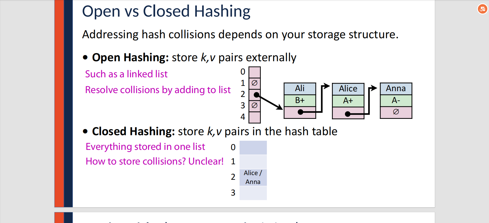

这张幻灯片讲解了**开放哈希（Open Hashing）\**与\**封闭哈希（Closed Hashing）\**的区别，它们是两种\**处理哈希冲突的方法**。下面是详细解释：

------

## **核心问题：哈希冲突（Hash Collisions）**

当多个不同的键被哈希到相同的位置时（同一个索引），就发生了**冲突**。我们需要一种方法来存储这些键值对。

------

## **1. 开放哈希（Open Hashing）**

- **定义：** 哈希表中的每个槽位（bucket）不是直接存储值，而是指向一个外部结构（比如链表）。
- **存储方式：** 键值对存储在**外部的数据结构中**（如链表）。
- **如何解决冲突：** 将冲突的键值对添加到链表的末尾。
- **图示说明：** 索引 `2` 处有一个链表，依次存储了 `Ali(B+) → Alice(A+) → Anna(A-)`。

### **优点：**

- 插入简单，不需要重新排列表内数据。
- 更容易动态扩展。

### **缺点：**

- 如果一个位置的链表太长，查找效率会下降。

------

## **2. 封闭哈希（Closed Hashing）**

- **定义：** 所有键值对都直接存储在哈希表数组中。
- **也叫：** 开放寻址法（Open Addressing）——虽然名字听起来矛盾。
- **如何解决冲突：** 通过**探测（probing）**来寻找下一个空位，例如线性探测、二次探测、双重哈希等。
- **图示说明：** `Alice` 和 `Anna` 都被放在了索引 `2`，但具体如何区分不明确。

### **优点：**

- 不需要额外空间（如链表）。
- 如果负载低，访问速度非常快。

### **缺点：**

- 哈希表容易变满。
- 删除元素和再插入可能导致复杂性增加。

------

### **总结对比：**

| 特性               | 开放哈希（Open Hashing） | 封闭哈希（Closed Hashing） |
| ------------------ | ------------------------ | -------------------------- |
| 存储位置           | 外部链表等结构           | 哈希表数组本身             |
| 处理冲突方式       | 在同一个桶中挂链表       | 寻找下一个空位置           |
| 删除操作           | 简单                     | 复杂                       |
| 对负载因子的敏感度 | 较低                     | 较高                       |

------

如果你想，我可以举一个用 Python 或 C++ 写的简单例子来演示这两种方式。想要吗？

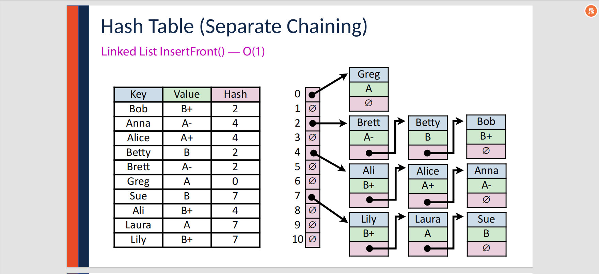

这张图深入讲解了哈希表中最常见的一种处理冲突的方法：**Separate Chaining（分离链表法）**。

------

## **标题：Hash Table (Separate Chaining)**

它展示了如何使用**链表**来解决多个键值对具有相同哈希值的问题。

------

## **左边表格：插入数据**

| Key   | Value | Hash |
| ----- | ----- | ---- |
| Bob   | B+    | 2    |
| Anna  | A-    | 4    |
| Alice | A+    | 4    |
| Betty | B     | 2    |
| Brett | A-    | 2    |
| Greg  | A     | 0    |
| Sue   | B     | 7    |
| Ali   | B+    | 4    |
| Laura | A     | 7    |
| Lily  | B+    | 7    |

每一行都表示一个键值对和它的哈希地址。

------

## **右侧图：哈希表结构**

这部分展示了一个长度为 11 的哈希表（索引从 0 到 10），使用链表来存储多个映射到相同位置的键值对：

- **位置 0**：只有 `Greg`。
- **位置 2**：`Brett → Betty → Bob`，按顺序插入（头插法，`InsertFront()`）。
- **位置 4**：`Ali → Alice → Anna`
- **位置 7**：`Lily → Laura → Sue`

这种方式就叫做**Separate Chaining**。

------

## **关键点总结：**

### **1. 使用链表处理冲突**

- 如果多个键被哈希到同一个位置（如位置 4），就将它们插入到对应槽位的链表中。

### **2. 插入操作 O(1)**

- 使用 `InsertFront()` 即头插法，时间复杂度为 O(1)，即总是把新元素放在链表前端。

### **3. 空槽位标记**

- 空位置使用 `∅` 表示（没有任何链表）。

------

### **优点：**

- 冲突处理灵活。
- 插入操作高效。
- 空间可以动态扩展（链表可变长）。

### **缺点：**

- 如果某些槽位冲突严重，链表太长，查找性能下降（最差情况 O(n)）。

------

想要我用代码模拟这个哈希表插入过程吗？（例如用 Python 显示插入顺序和结构）

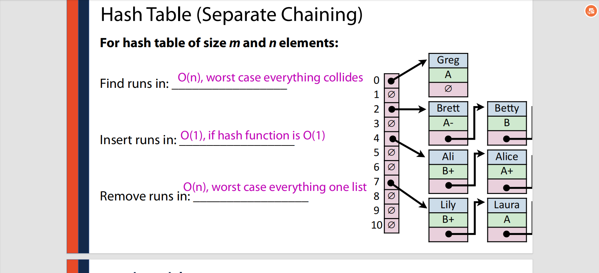

这张幻灯片继续讲解了**哈希表（Separate Chaining）**的性能分析，主要关注操作的时间复杂度（Time Complexity）。

------

## **前提条件：**

哈希表大小为 `m`，当前有 `n` 个元素。

------

## **三种常见操作及其时间复杂度：**

------

### **1. 查找 (Find runs in):**

> `O(n)`，**worst case everything collides**

- **解释：** 如果所有元素都被哈希到同一个槽位（极端情况），那么查找要遍历整个链表，最坏情况就是线性查找。
- **平均情况：** 如果哈希函数分布良好且负载因子 `n/m` 较小，则查找时间为 **O(1 + α)**，其中 α 是负载因子。

------

### **2. 插入 (Insert runs in):**

> `O(1)`，**if hash function is O(1)**

- **解释：** 只要哈希函数本身是常数时间（O(1)），并且我们使用**头插法（InsertFront）**，那么插入是**常数时间操作**。
- 不需要遍历链表，直接插入到链表头部。

------

### **3. 删除 (Remove runs in):**

> `O(n)`，**worst case everything one list**

- **解释：** 如果目标元素在一个非常长的链表中，删除操作需要先遍历整个链表来找到目标，再修改指针。
- **平均情况：** 若负载因子低且哈希均匀分布，通常是 O(1 + α)。

------

### **图示说明（右侧图）**

- 形象展示了多个键值对冲突时被分别插入链表的方式，例如：
  - 索引 2：`Brett → Betty`
  - 索引 4：`Ali → Alice`
  - 索引 7：`Lily → Laura`

------

## **小结：**

| 操作 | 最坏时间复杂度 | 备注                      |
| ---- | -------------- | ------------------------- |
| 查找 | O(n)           | 所有元素哈希到同一槽位    |
| 插入 | O(1)           | 哈希函数 O(1)，链表头插入 |
| 删除 | O(n)           | 遍历链表找元素并修改指针  |

------

需要我进一步讲解“负载因子（load factor）”或如何设计一个好的哈希函数吗？

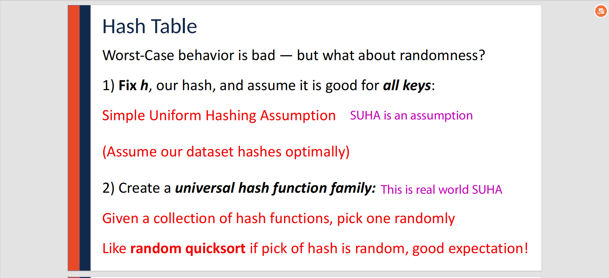

这张幻灯片讲的是：**哈希表最坏情况性能很差，但可以通过“随机性”来改进表现**。主要涉及两个概念：

------

## **1) Simple Uniform Hashing Assumption（SUHA）简单均匀哈希假设**

> **Fix `h`，our hash function，and assume it's good for \*all\* keys.**

- **意思：** 固定一个哈希函数，并**假设**它能“平均地”把所有键分散到哈希表中。
- **关键：** 这是一个**假设（assumption）**，不一定真实发生。
- **对应文字：**
  - “Simple Uniform Hashing Assumption”
  - “Assume our dataset hashes optimally”
- **用途：** 在理论分析中简化计算，假设冲突是随机发生的，概率很小。

------

## **2) Universal Hash Function Family（通用哈希函数族）**

> **现实世界中的 SUHA**

- **意思：** 构造一个包含多个哈希函数的集合，每次随机选用其中一个。
- **好处：** 增加不确定性，避免**针对性攻击**或**数据倾斜**。
- **原理类比：** 就像随机快排（random quicksort）中随机选主元，平均期望时间很好。
- **关键句：**
  - “Create a universal hash function family”
  - “Given a collection of hash functions, pick one randomly”
  - “Like random quicksort…”

------

## **总结对比：**

| 方法           | 是否真实 | 优点               | 缺点             |
| -------------- | -------- | ------------------ | ---------------- |
| SUHA           | 假设     | 理论分析简单       | 现实中可能不成立 |
| 通用哈希函数族 | 现实可用 | 提高安全性和随机性 | 稍微增加计算开销 |

------

要不要我为你用代码例子说明什么是“通用哈希函数族”？

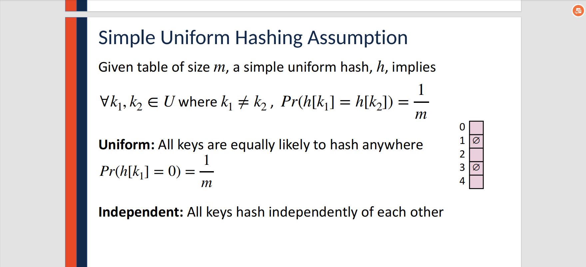

这张幻灯片详细解释了**Simple Uniform Hashing Assumption（SUHA，简单均匀哈希假设）**的数学定义和含义。

------

## **SUHA 的定义：**

**给定哈希表大小为 `m`，假设哈希函数 `h` 满足如下条件：**

$\forall k_1, k_2 \in U \text{ 且 } k_1 \ne k_2，\ \Pr(h[k_1] = h[k_2]) = \frac{1}{m}$

------

## **解释：**

### **1. Uniform（均匀）**

- 所有的键 `k` 都**有相同的概率**哈希到任意一个槽位（从 `0` 到 `m-1`）。

- 示例：

  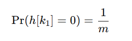

  表示键 `k1` 被哈希到位置 `0` 的概率是 `1/m`。

------

### **2. Independent（独立）**

- 所有的键 `k1, k2, ...` 的哈希过程是**互相独立的**。
- 意味着某个键落在某个槽位**不会影响**其他键的哈希结果。

------

## **总结 SUHA 的本质：**

1. 每个键被哈希到每个槽位的概率是**均等的（1/m）**
2. 每个键的哈希是**互不影响**的

------

### **为什么重要？**

- 在理论分析中，SUHA 能让我们简化分析：
  - **插入、查找、删除操作平均复杂度为 O(1)**
  - 只要哈希函数接近 SUHA，就能获得高性能
- 现实中不可能做到完美 SUHA，但我们可以尽力接近它，例如通过“**通用哈希函数族（universal hashing）**”。

------

需要我用图形或例子来直观演示 SUHA 的含义吗？

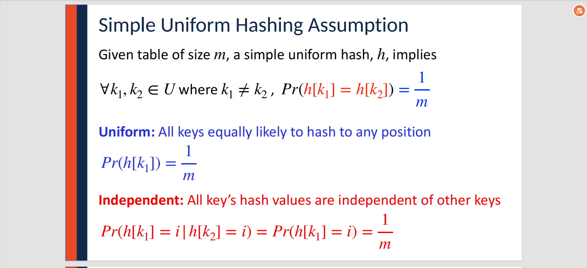

这张幻灯片继续深入解释了**Simple Uniform Hashing Assumption（SUHA）\**的\**数学意义**与**概率基础**，包括两个核心概念：**均匀性（Uniform）\**和\**独立性（Independence）**。

------

## **SUHA 定义回顾**

在一个大小为 `m` 的哈希表中，如果哈希函数 `h` 满足 SUHA，那么对任意两个不同的键 `k₁ ≠ k₂`：

$\Pr(h[k_1] = h[k_2]) = \frac{1}{m}$

------

## **1. Uniform（均匀性）**

> 所有的键都有相同的概率哈希到任意一个槽位。

### 数学表达：

$\Pr(h[k_1] = i) = \frac{1}{m}, \quad \text{for any } i \in \{0, 1, ..., m-1\}$

- 例子：哈希表大小是 5（即 m=5），那么键 `k1` 哈希到 0、1、2、3、4 的概率都是 `1/5`。

------

## **2. Independent（独立性）**

> 每个键的哈希值彼此独立，不受其他键哈希值的影响。

### 数学表达：

$\Pr(h[k_1] = i \mid h[k_2] = i) = \Pr(h[k_1] = i) = \frac{1}{m}$

- **含义：** 即使我们知道 `k₂` 被哈希到槽位 `i`，这对 `k₁` 落在同一个槽位的概率**没有任何影响**。

------

## **简洁理解：**

| 特性   | 意义                     | 效果                           |
| ------ | ------------------------ | ------------------------------ |
| 均匀性 | 每个槽位的概率都一样     | 减少冲突集中，提高分布均匀性   |
| 独立性 | 每个键的哈希与其他键无关 | 避免“偏向性”冲突或数据依赖冲突 |

------

## **为什么 SUHA 有用？**

虽然 SUHA 是理论假设（不一定现实成立），但它：

- **为性能分析提供基础：** 在 SUHA 下，哈希表操作的期望时间复杂度可以是常数 O(1)
- **启发现实设计：** 鼓励我们使用**通用哈希族（universal hash families）**去逼近这种理想状态

------

是否需要我给出一个 Python 示例，来说明哈希函数如何“均匀且独立”地工作？

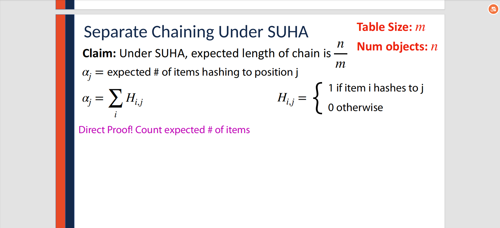

这张幻灯片解释了**在 SUHA 假设下，Separate Chaining（分离链法）哈希表中链表的期望长度**，即每个槽位链表的平均长度。

------

## **标题：Separate Chaining Under SUHA**

### **Claim（主张）**

> 在 SUHA 假设下，链表的期望长度是：

$\frac{n}{m}$

- **n**：插入的元素总数（objects）
- **m**：哈希表的槽位数（table size）

------

## **符号说明：**

- **αⱼ**：第 `j` 个槽位的链表长度的期望值，即有多少个元素被哈希到了槽位 `j`

  \alpha_j = \mathbb{E}[\text{# of items that hash to slot } j]

- **Hᵢⱼ** 是一个指示函数（Indicator Function）：

  Hi,j={1如果第 i 个元素哈希到了槽 j0否则H_{i,j} = \begin{cases} 1 & \text{如果第 } i \text{ 个元素哈希到了槽 } j \\ 0 & \text{否则} \end{cases}

- **αⱼ 的求和公式：**

  αj=∑iHi,j\alpha_j = \sum_i H_{i,j}

  ——把所有哈希到位置 `j` 的元素数量加起来。

------

## **为什么是 n/m？**

在 SUHA 假设下，每个元素以相同的概率 `1/m` 落入任一槽位，并且这些事件是相互独立的。

因此，第 `j` 个槽位的期望元素数是：

$\alpha_j = \sum_{i=1}^n \Pr(h(k_i) = j) = n \cdot \frac{1}{m} = \frac{n}{m}$

------

## **直观理解：**

- 有 `n` 个元素要分到 `m` 个槽位。
- 每个槽平均分得 `n/m` 个元素。
- 所以链表平均长度也是 `n/m`。

------

## **总结：**

| 条件 | 结论                                 |
| ---- | ------------------------------------ |
| SUHA | 每个槽位的期望链表长度为 `n/m`       |
| 含义 | 越大的表（更大 m），冲突越少，链越短 |

------

想要我为这个公式写出 Python 模拟，展示如何平均分布并计算 `αⱼ` 吗？

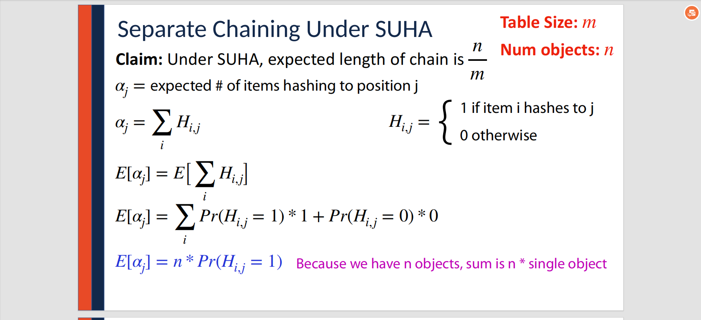

这张幻灯片给出了一个**形式化推导**，说明在 SUHA 假设下，哈希表中某个槽位 `j` 的链表的期望长度是 `n/m`。我们来逐步解释每一行：

------

## **目标：证明**

$\mathbb{E}[\alpha_j] = \frac{n}{m}$

其中：

- `n` 是插入哈希表的元素个数（objects）
- `m` 是哈希表槽位总数（table size）
- `α_j` 是第 `j` 个槽位的链表长度（即有多少个元素哈希到了槽位 `j`）

------

## **步骤详解：**

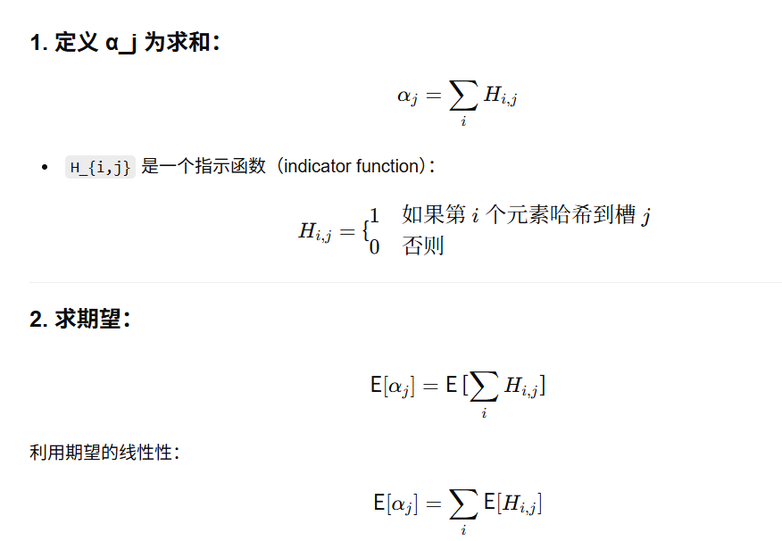

------

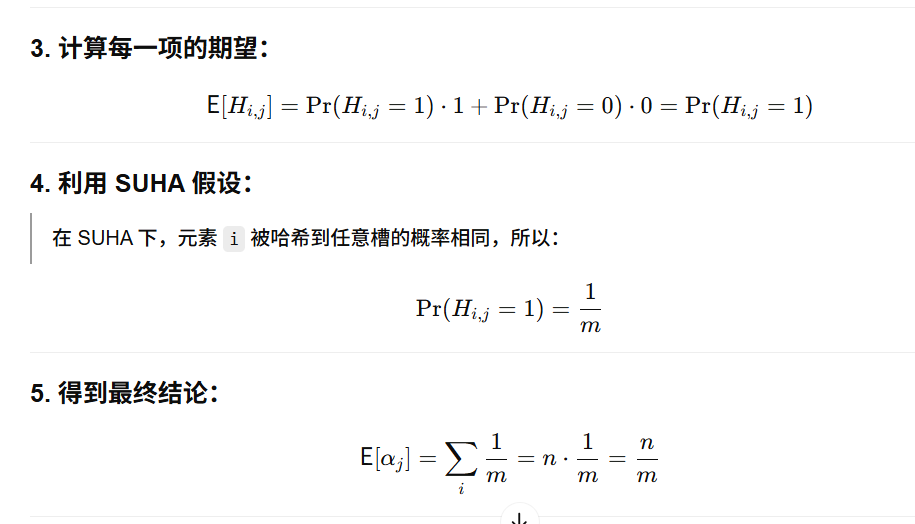

------

## **总结：**

- 在 SUHA 假设下，**任意槽位的链表长度的期望是相同的**
- 这个期望就是：**总元素数 / 哈希槽数**

------

如果你想，我 kan også skrive en Python-simulation for at illustrere dette med rigtige tal og hash-distribution. Skal jeg gøre det?

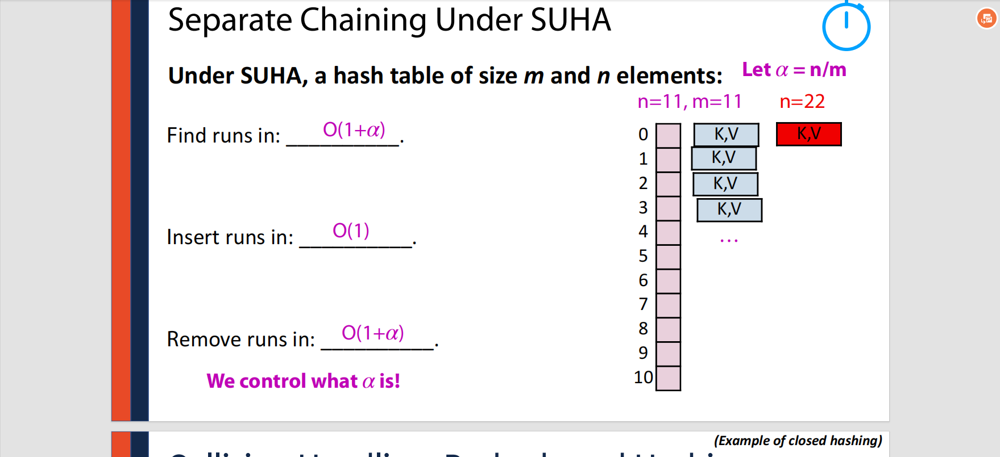

这张幻灯片总结了**在 SUHA 假设下，使用 Separate Chaining（分离链法）的哈希表的性能分析**。让我们逐一解释：

------

## **设定条件：**

- 哈希表大小为 `m`，有 `n` 个元素。

- 定义负载因子（load factor）：

  α=nm\alpha = \frac{n}{m}

  即**每个槽位上链表的平均长度**。

------

## **时间复杂度分析：**

### **1. 查找（Find）操作**

> 平均时间复杂度为：

$O(1 + \alpha)$

- **O(1)**：定位槽位的哈希运算；
- **+α**：链表平均长度，查找时可能需要遍历整个链表；
- 例如，如果 α = 2，意味着平均每个槽里有两个元素。

------

### **2. 插入（Insert）操作**

> 平均时间复杂度为：

$O(1)$

- 因为我们通常使用**头插法**，不需要遍历链表，插入新元素非常快。

------

### **3. 删除（Remove）操作**

> 平均时间复杂度为：

$O(1 + \alpha)$

- 和查找类似，我们首先需要定位，再在链表中找到要删除的元素。

------

## **右边图示说明：**

- 图中 `m = 11`（槽位数），`n = 11` 或 `n = 22`。
- 当 `n = 22`，α = 2，链表会变长，查找和删除更慢。
- **通过控制 n 和 m，可以控制 α，从而控制效率。**

------

## **关键句：**

> **We control what α is!**

- 我们可以通过**扩容（rehash）或控制数据量**来维持 α 的值，使性能保持良好。

------

## **总结表格：**

| 操作 | 时间复杂度（平均情况） | 解释                          |
| ---- | ---------------------- | ----------------------------- |
| 查找 | `O(1 + α)`             | 哈希定位 + 链表扫描           |
| 插入 | `O(1)`                 | 头插法，直接放进链表          |
| 删除 | `O(1 + α)`             | 哈希定位 + 查找后删除链表节点 |

------

Vil du have en visuel Python-simulation, der viser hvordan α påvirker ydeevnen?

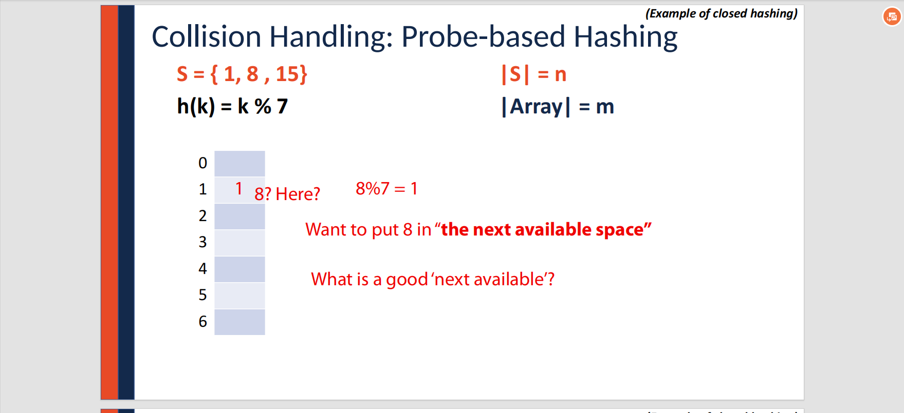

这张幻灯片介绍了**Probe-based Hashing（探测式哈希）**，用于处理哈希冲突，是**封闭哈希（Closed Hashing）**的一种实现方式。

------

## **场景说明**

集合：

$S = \{1, 8, 15\}$

哈希函数：

$h(k) = k \% 7$

数组大小（`m = 7`），即槽位是 0~6。

------

## **冲突发生过程**

1. **插入 1：**
   - `h(1) = 1 % 7 = 1` → 放入槽位 1。
2. **插入 8：**
   - `h(8) = 8 % 7 = 1` → 槽位 1 已经被 `1` 占用，发生冲突。

------

## **冲突处理方式：Probe（探测）**

想把 8 放到**“下一个可用位置”**：

- 继续检查 2、3、4... 直到找到一个空槽位。

这就是**线性探测（Linear Probing）**的思想：

$\text{h(k), h(k)+1, h(k)+2, ..., (mod m)}$

------

## **问题提出：**

> “What is a good ‘next available’?”

这个问题暗示：

- 探测顺序可以影响性能（冲突密度、查找时间等）
- 有多种探测方式（见下方）

------

## **常见探测方法：**

| 方法                          | 探测序列                    |
| ----------------------------- | --------------------------- |
| 线性探测（Linear Probing）    | `h(k), h(k)+1, h(k)+2, ...` |
| 二次探测（Quadratic Probing） | `h(k)+1², h(k)+2², ...`     |
| 双重哈希（Double Hashing）    | `h1(k), h1(k) + i*h2(k)`    |

------

## **总结：**

- 这是封闭哈希的关键点：**所有键都存储在表内本身**
- 探测冲突是通过“找下一个位置”实现的
- **效率和冲突处理方式密切相关**

------

Vil du have en grafisk Python-simulation der viser, hvordan lineær og kvadratisk probing virker i praksis?

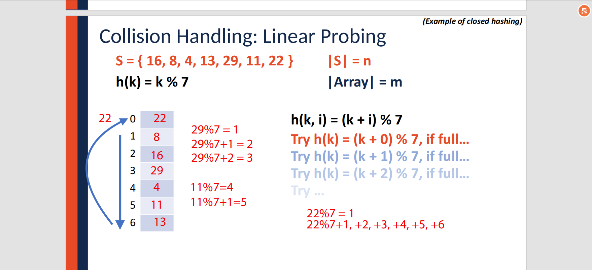

这张幻灯片详细展示了**线性探测（Linear Probing）**用于处理哈希冲突的过程，是**封闭哈希（Closed Hashing）**的一个典型例子。

------

## **示例数据：**

集合：

$S = \{16, 8, 4, 13, 29, 11, 22\}$

哈希函数：

$h(k) = k \% 7$

数组大小 `m = 7`

------

## **插入过程（线性探测）：**

1. **16 →** `16 % 7 = 2` → 插入位置 2
2. **8 →** `8 % 7 = 1` → 插入位置 1
3. **4 →** `4 % 7 = 4` → 插入位置 4
4. **13 →** `13 % 7 = 6` → 插入位置 6
5. **29 →** `29 % 7 = 1`
   - 位置 1 被占 → 试 `1+1 = 2`（满） → 试 `1+2 = 3` → 插入位置 3
6. **11 →** `11 % 7 = 4`
   - 位置 4 被占 → 试 `4+1 = 5` → 插入位置 5
7. **22 →** `22 % 7 = 1`
   - 位置 1, 2, 3, 4, 5, 6 都满 → 插入位置 0

最终数组索引如下：

| Index | Value |
| ----- | ----- |
| 0     | 22    |
| 1     | 8     |
| 2     | 16    |
| 3     | 29    |
| 4     | 4     |
| 5     | 11    |
| 6     | 13    |

------

## **线性探测公式：**

$h(k, i) = (h(k) + i) \mod m$

每次冲突，就尝试下一个位置（i 从 0 开始递增）直到找到空位。

------

## **优点：**

- 简单易实现；
- 数据连续存储，**cache-friendly**。

## **缺点：**

- **主聚集（Primary Clustering）：** 一堆连续插入的元素会导致冲突区域不断扩大，查找效率下降；
- 删除复杂：可能破坏探测序列。

------

需要我用动画或代码展示整个插入过程吗？

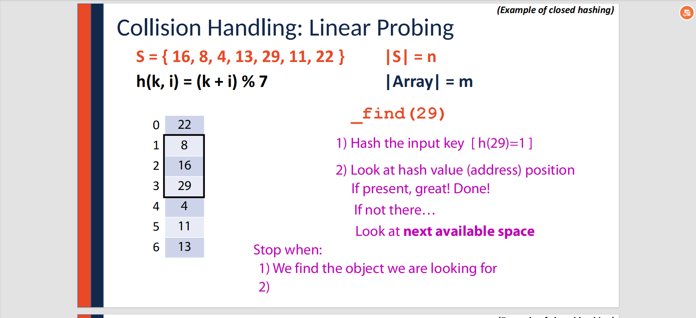

这张幻灯片展示了**如何在使用线性探测（Linear Probing）的封闭哈希表中查找元素 `29`**，并总结了查找操作的逻辑。

------

## **查找过程（_find(29)）：**

### **步骤：**

1. **哈希键值：**

   h(29)=29%7=1h(29) = 29 \% 7 = 1

   → 初始槽位是 **1**

2. **查找槽位 1：**

   - 值为 8 ≠ 29 → 冲突

3. **查找下一个可用位置：**

   - 查槽位 2：值是 16 ≠ 29
   - 查槽位 3：值是 29 → **找到了，查找成功！**

------

## **停止条件（Stop when）：**

1. 找到我们要的对象（如上）
2. （尚未填的第二条）→ 实际上应该是： **找到一个空槽（∅）为止，表示元素不存在**

------

## **伪代码逻辑简化如下：**

```python
i = 0
while True:
    index = (h(key) + i) % m
    if table[index] == key:
        return index  # found
    elif table[index] == EMPTY:
        return NOT_FOUND
    else:
        i += 1
```

------

## **优点总结：**

- 数据连续，内存局部性好
- 实现简单，插入和查找逻辑类似

------

## **缺点回顾：**

- **主聚集问题（Primary clustering）：** 连续冲突导致查找性能下降
- **删除复杂：** 不能简单地置空，否则会破坏探测路径

------

需要 jeg laver en dansk forklaring med Python-kode og animation til det her eksempel?

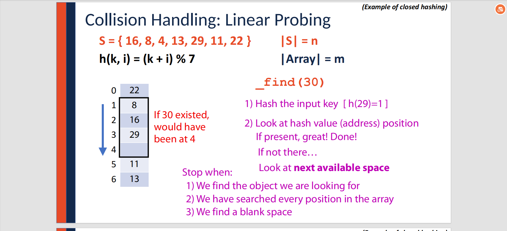

这张幻灯片展示了**使用线ær probing查找一个不存在的键（30）时的过程**，强调了**停止查找的三种条件**。

------

## **数据回顾：**

集合：

$S = \{16, 8, 4, 13, 29, 11, 22\}$

哈希函数：

$h(k, i) = (k + i) \% 7$

我们尝试查找 `30`，执行 `_find(30)`。

------

## **查找过程 _find(30)：**

1. **计算哈希值：**

   h(30)=30%7=2h(30) = 30 \% 7 = 2

2. **查找槽位 2：**

   - 存在值 `16` ≠ `30` → 冲突

3. **继续线性探测：**

   - 槽位 3：`29` ≠ `30`
   - 槽位 4：`4` ≠ `30`
   - 槽位 5：`11` ≠ `30`
   - 槽位 6：`13` ≠ `30`
   - 槽位 0：`22` ≠ `30`
   - 槽位 1：`8` ≠ `30`

4. **回到槽位 2 → 查找循环完成，没找到**

------

## **停止查找的三种情况：**

1. **找到了目标值**
2. **遍历了整个数组（满循环）**
3. **遇到空槽位（blank space）——表示该值不在表中**

------

## **幻灯片中的红色标注：**

> “If 30 existed, would have been at 4”
>  表示根据插入规律，如果 `30` 在表中，它应该早在探测过程中被放入某处 —— 但没有被找到，所以可以确定它不存在。

------

## **总结：**

| 查找行为     | 动作说明                    |
| ------------ | --------------------------- |
| 初始槽位     | `30 % 7 = 2`                |
| 探测序列     | `2 → 3 → 4 → 5 → 6 → 0 → 1` |
| 停止判断条件 | 找到目标、空槽、或满轮询    |
| 最终结论     | 没找到，30 不存在于表中     |

------

Vil du have en lille Python-visualisering af dette eksempel, hvor man ser hvordan søgningen løber igennem slots?

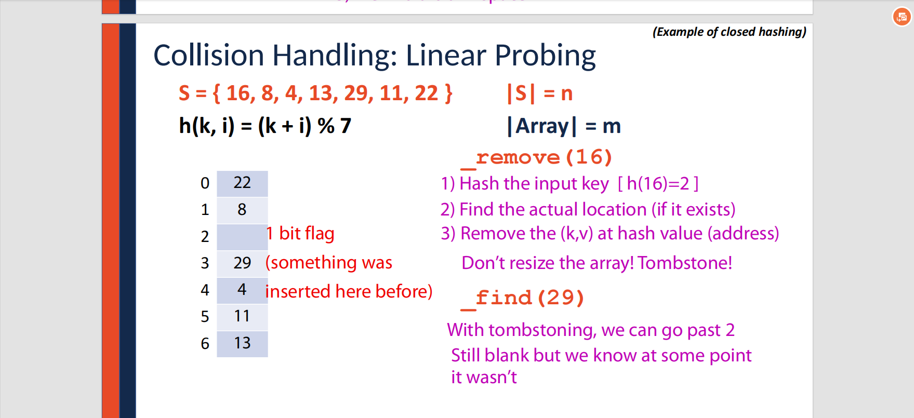

这张幻灯片解释了**在线性探测哈希（linear probing hashing）中如何处理删除操作**，并引入了一个关键概念：**墓碑（tombstone）**。

------

## **_remove(16) 删除操作流程**

集合：

$S = \{16, 8, 4, 13, 29, 11, 22\}$

### 步骤：

1. **哈希键值：**

   h(16)=16%7=2h(16) = 16 \% 7 = 2

2. **找到值 16 所在的槽位 2**

3. **删除方式：不是清空，而是标记为“墓碑”**：

   - 设置一个**1-bit flag（墓碑位）**
   - 表示“这里曾经插入过某个值，但现在被删了”

------

## **为什么不能直接清空？**

如果你直接把槽 2 设为“空”，那么之后查找如 `29` 时，会**错误地提前停止**查找链。

### 示例：

- 查找 `29`：
  - 初始哈希 `29 % 7 = 1`
  - 槽 1：不是 → 探测槽 2（如果 2 是空，就会停止，错过实际在槽 3 的 `29`）

### 解决办法：

- 设置墓碑 → **告诉查找操作继续向后探测**

------

## **_find(29) 查找时如何使用墓碑**

- 查找 `29` 时：
  - 会探测槽位 1 → 2（墓碑）→ 继续查找 → 槽位 3 → 找到！

------

## **总结：**

| 操作 | 行为                       |
| ---- | -------------------------- |
| 删除 | 设置墓碑标记（不真正清空） |
| 查找 | 遇到墓碑不停止，继续探测   |
| 插入 | 可以复用墓碑槽位           |

------

## **专业术语：**

- **Tombstone**：表示“曾经插入过但已删除”的特殊标志；
- **Probe Sequence**：线性探测查找路径；
- **Primary Clustering**：线性探测聚集问题（墓碑不解决这个，只解决查找准确性）

------

Vil du have en lille animation eller kode, der viser effekten af tombstones i praksis?

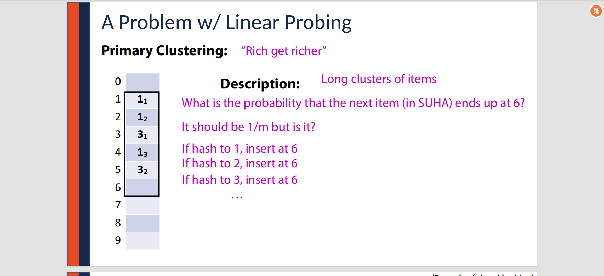

当然可以，以下是这张幻灯片的**中文解释**：

------

## **线性探测中的一个严重问题：主聚集 (Primary Clustering)**

> “富者愈富”现象 —— 已经形成聚集的区域，会吸引更多冲突键加入，导致聚集越来越严重。

------

### **问题描述：**

幻灯片中展示了哈希表中第 1 到 5 个位置已经被元素填满（`1₁`, `1₂`, `3₁`, `1₃`, `3₂`），而第 6 个位置空着。

现在我们想问：

> **下一个元素落到位置 6 的概率是多少？**

在理论上（SUHA 假设下），这个概率应为 `1/m`。
 但由于**线性探测**的方式（往后探测直到找到空槽），如果一个新元素哈希到了 1、2 或 3，它都会因为前面已被占用而被插入到 6！

------

### **关键点：**

- 如果哈希到 1 → 插入 6
- 如果哈希到 2 → 插入 6
- 如果哈希到 3 → 插入 6
- …

所以，第 6 个位置变成了“冲突集中地”，原本均匀的概率被严重**扭曲**了。

------

### **为什么这很糟糕？**

- 聚集区导致查找效率显著下降
- 删除后留下的墓碑无法真正减少查找长度
- 原本应该是 O(1) 的查找时间变得接近 O(n)

------

### **解决方法（缓解主聚集）：**

| 方法              | 原理                                         |
| ----------------- | -------------------------------------------- |
| **二次探测**      | 探测间距不是 +1，而是 +i²，避免连续聚集      |
| **双重哈希**      | 使用第二个哈希函数来决定探测步长             |
| **扩容 + Rehash** | 当负载因子过高时（如 > 0.5），重新构造哈希表 |

------

如果你愿意，我可以用 Python 代码或图形模拟展示“主聚集”如何发生以及如何避免。需要吗？

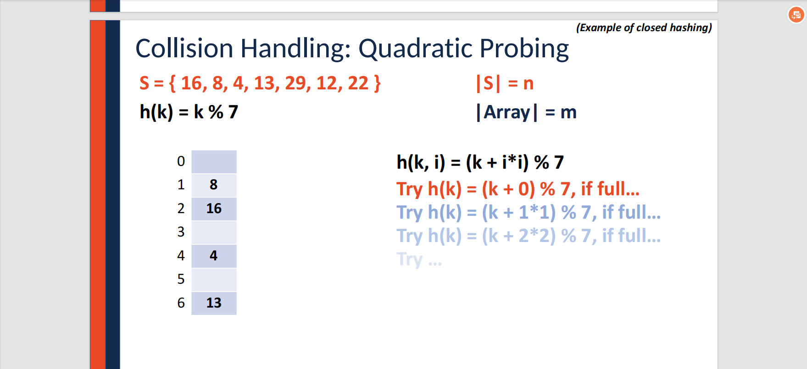

这张幻灯片介绍了哈希表中一种更优雅的冲突处理方法：

------

## **冲突处理：二次探测（Quadratic Probing）**

### 对比线性探测（Linear Probing）：

- **线性探测**使用固定步长 `+1` 向后查找，容易形成“主聚集”问题
- **二次探测**则通过**逐步增大的非线性步长**避免聚集

------

## **二次探测公式：**

$h(k, i) = (k + i^2) \% m$

- `k` 是键
- `i` 是探测次数（第几次碰撞后尝试）
- `m` 是哈希表的大小

------

## **探测过程（右侧流程解释）：**

以 `k` 为某个键，`m = 7`，插入时：

- 第一次尝试：`(k + 0²) % 7`
- 第二次尝试：`(k + 1²) % 7`
- 第三次尝试：`(k + 2²) % 7`
- 第四次尝试：`(k + 3²) % 7`
   以此类推

------

## **当前哈希表内容（左侧）：**

- 已插入的键包括 `16, 8, 4, 13` 等
- 插入 `13` 时可能发生了冲突，于是通过 `13 + i²` 的方式找到第 6 号槽位并插入成功

------

## **优点：**

- **有效缓解主聚集（Primary Clustering）**
- 分布更均匀，插入/查找性能比线性探测更稳定

------

## **缺点：**

- 存在 **二次聚集（Secondary Clustering）**：
   哈希值相同的键仍会走相同探测路径
- 不一定能保证在装填率接近 1 时能找到空位，**表大小通常要求是素数**

------

## 总结一句话：

> **二次探测 = 查找位置跳跃得更“聪明”，不容易挤在一起！**

------

需要我给你用 Python 写一个例子，展示线性探测 vs 二次探测的区别吗？

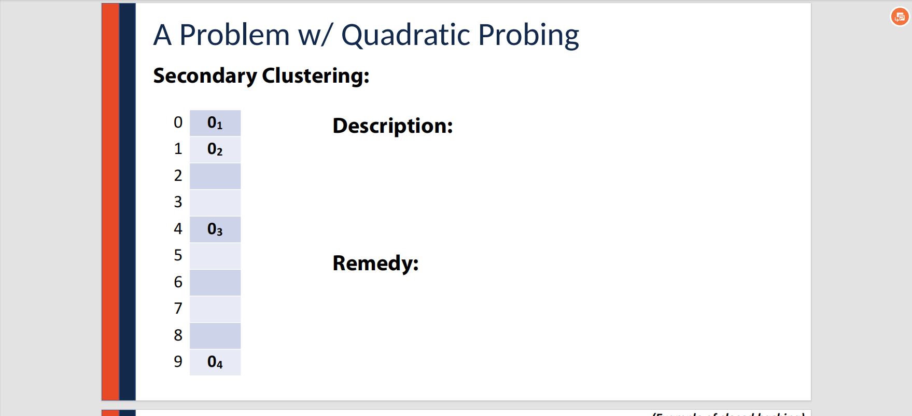

这张幻灯片介绍了**二次探测（Quadratic Probing）中的一个问题**：

------

## **Secondary Clustering（二次聚集）**

------

### **描述 (Description)：**

即使二次探测避免了线性探测的“主聚集（Primary Clustering）”，它仍然会出现一个问题：

> **如果多个键的哈希值相同**，那么它们在发生冲突时，将**沿着同样的探测序列进行插入或查找**。

例如：

- `h(k1) = 1`
- `h(k2) = 1`

即使 `k1` 和 `k2` 是不同的键，但它们都会尝试 `(1 + 1^2) % m`，然后 `(1 + 2^2) % m`，以此类推。

所以它们**“共享探测路径”**，最终也可能聚集在一起，形成局部热点。

------

### **图中解释：**

你看到的是：

- 插入了多个 `0_i`，它们可能都是哈希到同一个位置（比如0）
- 由于使用的是二次探测，它们可能沿着相同的路径 `0 → 1 → 4 → 9` 被插入
- 所以它们还是形成了一个小的“次级聚集”

------

### **解决方法 (Remedy)：**

> **使用“双重哈希（Double Hashing）”**

- 采用两个哈希函数：

  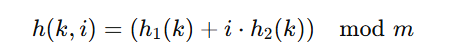

- 由于 `h2(k)` 因键而异，所以即使 `h1(k1) = h1(k2)`，它们的探测路径也会不同。

这样可以**彻底打破探测路径重复的问题**，消除主聚集和二次聚集！

------

需要我用图示或代码演示双重哈希和它的效果吗？

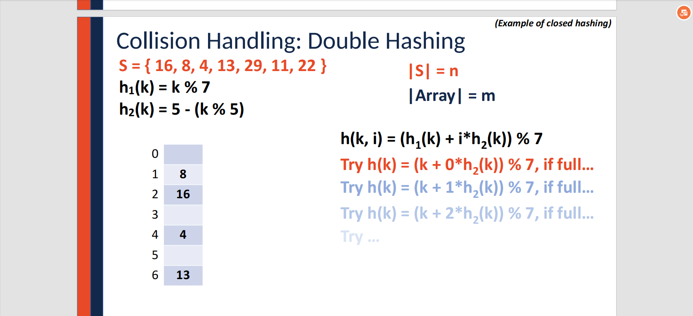

这张幻灯片介绍了**双重哈希（Double Hashing）**如何解决哈希冲突问题，并克服一次探测（线性 probing）和二次探测（quadratic probing）的聚集问题。

------

## **双重哈希（Double Hashing）**

### 基本原理：

双重哈希使用**两个不同的哈希函数**：

- 第一个哈希函数决定初始位置：

  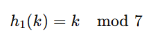

- 第二个哈希函数决定探测的步长（step size）：

  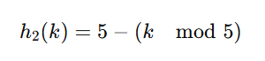

### 探测公式：

如果发生冲突，尝试：

$h(k, i) = \left(h_1(k) + i \cdot h_2(k)\right) \mod 7$

其中 `i` 是探测次数（第0次、第1次、第2次……）

------

### 优点：

- 每个键 `k` 都有**独特的探测序列**（因为步长不同）
- 有效避免**主聚集**和**次聚集**
- 探测更均匀，查找效率更高

------

### 图示说明：

集合 `S = {16, 8, 4, 13, 29, 11, 22}` 正被插入到一个大小为7的表中。
 前几个元素如 `8, 16, 4, 13` 已被成功放入对应位置或通过双重哈希找到新的空位。

------

如果你想，我可以用代码或图表进一步展示双重哈希的效果与效率优势。你需要吗？

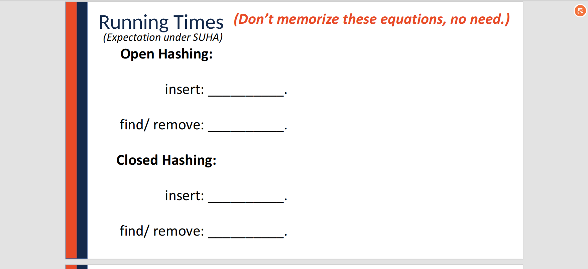

这张幻灯片询问了在 **SUHA 假设下（Simple Uniform Hashing Assumption）** 的运行时间复杂度。以下是填空的正确答案（期望情况下）：

------

### **Open Hashing（开放哈希）**：

- **insert：** `O(1)`
- **find/remove：** `O(1 + α)`
   （其中 α 是负载因子 α = n / m）

------

### **Closed Hashing（封闭哈希）**：

- **insert：** `O(1)`
- **find/remove：** `O(1 + α)`

------

这两种方式在负载较低时性能都很好，但随着负载因子 α 的上升，查找和删除效率会下降。需要我帮你总结一页中文笔记图吗？

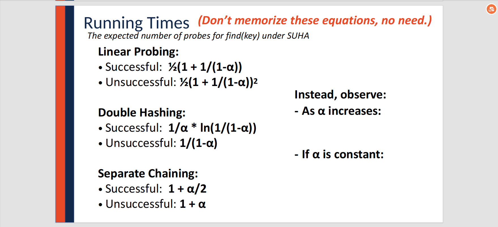

这是一个非常关键的问题，我们来详细解释为什么在**线性探测（Linear Probing）**中，**平均聚簇长度（平均连续探测长度）大约为**：

$\frac{1}{1 - \alpha}$

------

### 背景：什么是聚簇？

在线性探测中，当两个或多个键碰撞（hash 到同一个槽位或相邻槽位）时，它们会被插入到**连续的空槽中**。这会形成“聚簇”（Cluster），即连续占用的槽位区域。

------

### 1. **直觉推导：**

假设我们已经插入了 $n$ 个元素到一个大小为 $m$ 的哈希表中。

则**负载因子**（load factor）是：

$\alpha = \frac{n}{m}$

也就是说，**槽位中有 α 比例是被占用的，(1 - α) 比例是空的。**

------

### 2. **考虑线性探测行为：**

在线性探测中，当我们尝试插入一个新元素时：

- 我们从 hash(k) 这个位置开始检查；
- 如果被占用了，就继续往后找直到遇到一个空位；
- 平均每次碰撞，我们需要探测一个聚簇长度的期望。

由于这些探测是**均匀分布且线性连续的**，我们可以用概率论中的**几何分布模型**来理解这个行为。

------

### 3. **从概率模型推导：**

我们将“遇到空槽”看作一个**成功**，则每一次探测都以概率 $1 - \alpha$ 成功。

- 在几何分布中，期望第一次成功的试次数是：

$E[\text{探测长度}] = \frac{1}{1 - \alpha}$

也就是说，在每次插入或失败查找中，我们期望要探测 $\frac{1}{1 - \alpha}$ 个槽位，才能遇到一个空位（终止条件）。

------

### 4. **为什么这等于聚簇平均长度？**

因为聚簇的形成就是由于连续的插入造成的，长度取决于找空位所需的探测长度。而这个探测长度的期望就是：

$\frac{1}{1 - \alpha}$

------

### 结论：

因此，在线性探测中，**聚簇的平均长度 ≈ 每次遇到空位前需要探测的平均槽位数 ≈**：

$\frac{1}{1 - \alpha}$

这个表达式解释了：**随着 α 趋近于 1，平均探测长度会急剧增长**，哈希性能变差。

------

如果你想，我也可以用动画图示你插入元素时聚簇如何扩展，是否需要？

这是一个很好的问题！我们来**逐步推导**这些公式，解释为什么在线性探测、双重哈希和分离链地址法下，在 SUHA 假设中，期望查找次数（成功与失败）会分别是这些公式。

------

## **一、线性探测（Linear Probing）**

### 背景：

- 使用开放地址法（open addressing）；
- 查找时，如果冲突，就往后一个位置找；
- 会产生“主聚簇”（Primary Clustering）。

### 1. **成功查找公式：**

$E[\text{成功}] = \frac{1}{2} \left(1 + \frac{1}{1 - \alpha} \right)$

#### 为什么？

设 α 为负载因子（装满程度）。成功查找的平均探测次数是与聚簇的长度相关的。

直觉解释：

- 成功查找是在已有元素中找；
- 插入新元素时，它插入到聚簇末尾；
- 所以查找平均需要扫过半个聚簇；
- 聚簇平均长度大约为 $\frac{1}{1 - \alpha}$，所以期望探测次数是：

$\approx \text{平均聚簇长度的一半} = \frac{1}{2} \left(1 + \frac{1}{1 - \alpha} \right)$

------

### 2. **失败查找公式：**

$E[\text{失败}] = \frac{1}{2} \left(1 + \frac{1}{(1 - \alpha)^2} \right)$

#### 为什么？

- 查找失败时，可能需要扫完整个聚簇直到发现空位；
- 聚簇的大小增长速度比成功情况更快；
- 数学上使用概率期望求和得出这个平方关系。

------

## **二、双重哈希（Double Hashing）**

避免了主聚簇，分布更均匀。

### 1. **成功查找公式：**

$E[\text{成功}] = \frac{1}{\alpha} \cdot \ln \left(\frac{1}{1 - \alpha} \right)$

#### 推导思路：

- 每一次探测是独立的（SUHA 假设）；
- 使用积分近似方法对成功概率求期望，得到该表达式。

------

### 2. **失败查找公式：**

$E[\text{失败}] = \frac{1}{1 - \alpha}$

#### 为什么？

- 假设表中 α 比例是满的，那么每次探测成功的概率是 (1 – α)；

- 失败查找要连续失败直到遇到空槽；

- 这是**几何分布的期望**：

  E[尝试次数]=1p=11−αE[\text{尝试次数}] = \frac{1}{p} = \frac{1}{1 - \alpha}

------

## **三、分离链地址法（Separate Chaining）**

使用链表处理冲突。

### 1. **成功查找：**

$E[\text{成功}] = 1 + \frac{\alpha}{2}$

#### 为什么？

- 每个槽位平均有 α 个元素；
- 查找一个存在的元素时，平均需要遍历链表一半，外加计算哈希；
- 所以是 $1 + \frac{\alpha}{2}$。

------

### 2. **失败查找：**

$E[\text{失败}] = 1 + \alpha$

#### 为什么？

- 要找一个**不在表中**的 key，需要检查整个链表；
- 所以平均查找长度是 α，加上哈希开销 1。

------

## 总结对比：

| 方法         | 成功查找（期望）                                           | 失败查找（期望）                            |
| ------------ | ---------------------------------------------------------- | ------------------------------------------- |
| 线性探测     | $\frac{1}{2}(1 + \frac{1}{1 - \alpha})$                    | $\frac{1}{2}(1 + \frac{1}{(1 - \alpha)^2})$ |
| 双重哈希     | $\frac{1}{\alpha} \ln \left( \frac{1}{1 - \alpha} \right)$ | $\frac{1}{1 - \alpha}$                      |
| 分离链地址法 | $1 + \frac{\alpha}{2}$                                     | $1 + \alpha$                                |

------

如果你想，我也可以帮你用图形/直方图直观展示这几种方式在不同 α 下的比较效果。你感兴趣吗？

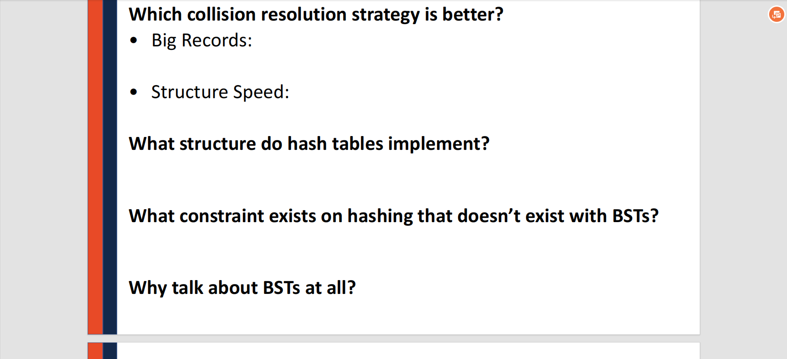

这张幻灯片是围绕**哈希表 vs 二叉搜索树（BST）**进行的一组引导性问题。下面我会一一详细解释这些问题的含义和背后的知识点：

------

### **1. Which collision resolution strategy is better?**

（哪种哈希冲突解决策略更好？）

**· Big Records（大记录）**
 → 如果每个记录（如一个数据库行）非常大，**链式哈希（Separate Chaining）更适合**，因为它使用指针链表，不需要频繁地移动或重新排列元素。

**· Structure Speed（结构速度）**
 → 如果目标是**访问速度极快**、内存访问局部性好，那么**开放地址法（如线性探测）更好**，因为所有数据都存储在连续的数组中，更适合 CPU 缓存优化。

------

### **2. What structure do hash tables implement?**

（哈希表实现了什么结构？）

答：**哈希表实现的是一个字典（Dictionary）结构** —— 也就是一个**键到值的映射结构**。
 它允许我们在平均 $O(1)$ 时间内进行：

- 插入（insert）
- 查找（find）
- 删除（remove）

------

### **3. What constraint exists on hashing that doesn’t exist with BSTs?**

（哈希有一个限制，而 BST 没有，这是什么？）

答：**哈希不支持“有序遍历”或范围查询**。
 因为哈希函数打乱了元素的顺序，所以你**无法高效地按顺序遍历**键值。
 而二叉搜索树是按键值有序排列的，可以：

- 找最大/最小值
- 范围查询（如找 10 到 50 之间的所有元素）
- 中序遍历输出排序结果

------

### **4. Why talk about BSTs at all?**

（既然哈希表这么快，为什么还要讲 BST？）

答：
 虽然哈希表**平均时间复杂度低（O(1)）**，但它有以下缺点：

- 无法进行有序操作（如排序、范围查找）
- 对 hash 函数依赖大（可能出现最坏 O(n) 情况）
- 不适合实现集合操作（如 predecessor/successor）

而 **BSTs 尤其是自平衡 BST（如 AVL、红黑树）**，具备良好的最坏时间复杂度 $O(\log n)$，并能支持各种有序操作。因此，在某些应用中更合适。

------

### 总结：

这张幻灯片的本质在于帮助你比较：

- 不同哈希冲突解决策略的适用场景
- 哈希表与二叉搜索树的结构和用途差异

是否需要我帮你补充成完整笔记形式，或画图对比这两类数据结构？