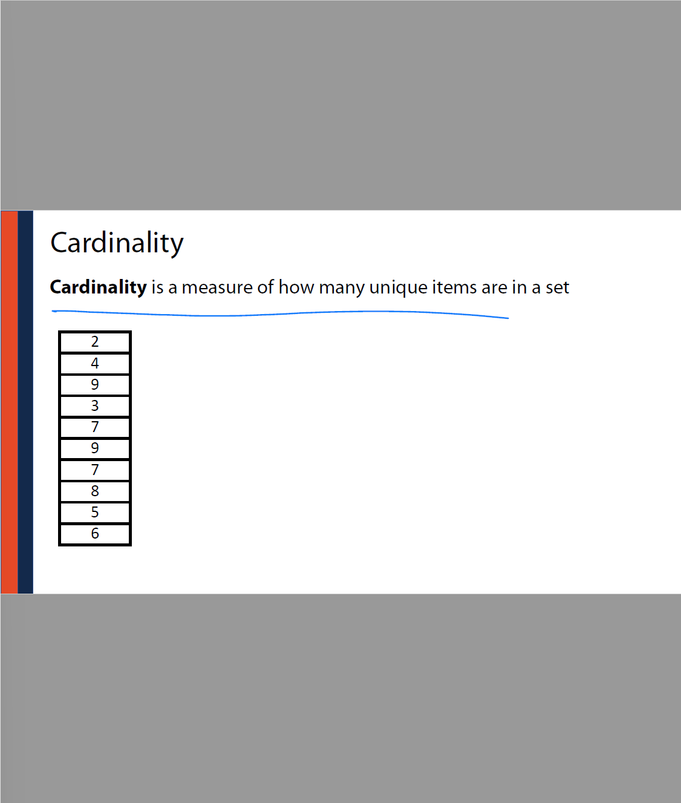
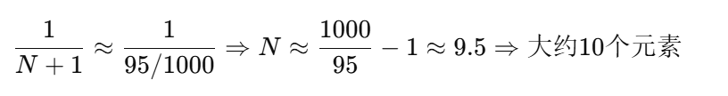
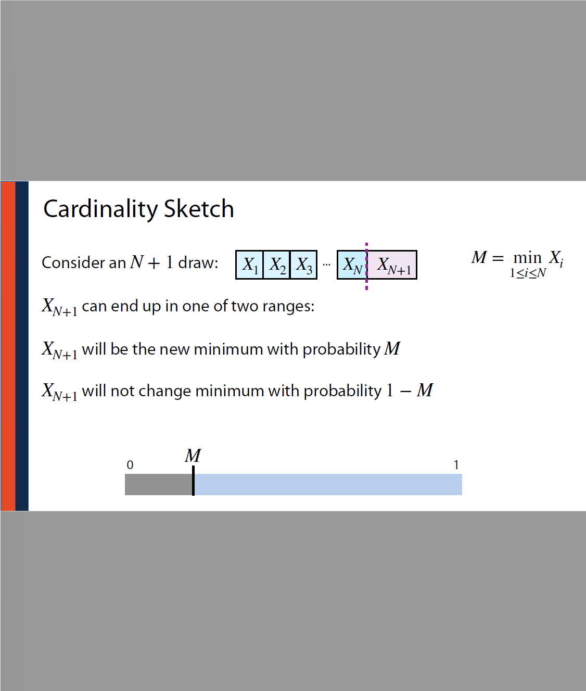

这道题考察的是图的三种不同表示方式中**删除一条边（edge）的最坏时间复杂度**。我们逐项分析：

------

### 【题干翻译】

对于一个**简单连通图**（simple connected graph），有 nn 个顶点和 mm 条边。现在要**删除一条边**，你已经有这条边的指针，图分别以：

1. Edge List（边列表）
2. Adjacency List（邻接表）
3. Adjacency Matrix（邻接矩阵）

三种方式存储。假设不涉及数组大小的重新分配（resizing），问三种情况下的**最坏情况时间复杂度分别是多少？**

------

### 【正确答案】是：

**(d) O(m),O(1),O(n)O(m), O(1), O(n)**

------

### 【详细解释】

#### 1. **Edge List (边列表)** — O(m)O(m)

- 边列表是一个边的数组（如 [(u,v),(x,y),…][(u, v), (x, y), \ldots]）。
- 就算你“有边的指针”，也要在线性结构中**找到它的位置**并**移除它**，最坏情况时间是 O(m)O(m)。
- 如果用链表可能更快，但题目默认是一般实现。

#### 2. **Adjacency List (邻接表)** — O(1)O(1)

- 通常每个顶点维护一个边的链表或动态数组。
- 如果你已经有指向该边的指针，可以直接在常数时间内移除：**O(1)O(1)**。

#### 3. **Adjacency Matrix (邻接矩阵)** — O(n)O(n)

- 是一个 n×nn \times n 的矩阵。
- 删除一条边只需要将 A[u][v]=0A[u][v] = 0，看起来是 O(1)O(1)。
- **但是问题在于你不知道这条边是哪个位置**，你需要先**扫描一整行或整列**找它，最坏要遍历 nn 项：**O(n)O(n)**。

------

### 【总结表格：中英对照】

| 图表示方式                   | 删除边最坏复杂度 | 原因说明                         |
| ---------------------------- | ---------------- | -------------------------------- |
| Edge List（边列表）          | O(m)O(m)         | 要在线性列表中查找并删除这条边   |
| Adjacency List（邻接表）     | O(1)O(1)         | 如果有指针，直接在链表中删除     |
| Adjacency Matrix（邻接矩阵） | O(n)O(n)         | 找边的位置最坏要遍历一整行或整列 |

------

如你需要我画图演示三种表示方法下的删除流程，也可以告诉我！是否继续讲其它图算法题？


这道题是关于**BFS（广度优先搜索）在无向图中的行为分析**。我们逐条分析这三句话的含义及真伪，并解释为什么正确答案是 **(a) Items I. and II. are true.**

------

### 题目翻译：

> 考虑两个顶点 `x` 和 `y`，它们在从顶点 `s` 开始执行 BFS 时是队列中的相邻项（adjacent on the queue）。所有边的长度均为 1。 哪些说法是正确的？

------

### 分析每个陈述：

#### **I. 从 `s` 到 `x` 的最短路径边数最多比从 `s` 到 `y` 多 1。**

- **中文意思**：x 与 y 是 BFS 队列中相邻的点，它们的最短路径长度差不会超过 1。

- **正确**：因为 BFS 是一层一层访问的，若 `x` 和 `y` 相邻地被加入队列，它们要么在同一层，要么最多差一层（即最多差一条边）。

- > 你提到的 **“x 与 y 是 BFS 队列中相邻的点，它们的最短路径长度差最多为 1”** 是对的，下面我来详细解释为什么。
  >
  > ------
  >
  > ### 背景回顾：
  >
  > 题目说的是在**BFS（广度优先搜索）**执行过程中，两个点 `x` 和 `y` 同时在队列中，而且 `x` 和 `y` 是图中直接相连（adjacent）的两个顶点。
  >
  > ------
  >
  > ### 为什么 I 正确？
  >
  > **命题 I：从 s 到 x 的最短路径长度 ≤ 从 s 到 y 的最短路径长度 + 1**
  >
  > 在 BFS 中：
  >
  > - BFS 按“层”访问节点：即先访问完离起点 `s` 距离为 1 的所有节点，再访问距离为 2 的，依此类推。
  > - BFS 使用队列（FIFO）来确保“谁先进入队列，谁先被处理”。
  >
  > **设想 BFS 扫描过程中：**
  >
  > - 如果 `x` 和 `y` 都在队列中，说明它们都被发现了，还没被处理（还没出队）。
  > - 又因为 `x` 和 `y` 相邻（有边连接），所以 `x` 最多比 `y` 多一层（或者反过来），也就是两者之间路径差最多为 1。
  >
  > ------
  >
  > ### 更形式化地讲：
  >
  > 假设：
  >
  > - `dist(x)` 是从 `s` 到 `x` 的最短路径长度；
  > - `dist(y)` 是从 `s` 到 `y` 的最短路径长度；
  > - 又 `x` 和 `y` 是邻居：也就是说 `|dist(x) - dist(y)| ≤ 1`
  >
  > 所以，I 说：
  >
  > > dist(x) ≤ dist(y) + 1（也就是说最多多一条边）
  >
  > 成立！
  >
  > ------
  >
  > ### 总结：
  >
  > - BFS 的本质是按“最短路径长度”一层层扩展节点。
  > - 所以，如果两个点 `x` 和 `y` 被 BFS 相邻加入队列，并且在图中是邻居（也就是 x–y 有一条边），那么它们之间在从 `s` 出发的最短路径长度最多差 1。
  > - 这正是 **命题 I 的意思和原因**。
  >
  > ------
  >
  > 是否还想我用一个简单图画出这个过程更直观说明？

#### **II. 从 `s` 到 `x` 和 `s` 到 `y` 的路径长度差至少是 1。**

- **中文意思**：从 `s` 到 `x` 的路径长度和到 `y` 的路径长度不同，至少相差一条边。
- **正确**：因为在 BFS 中，只有在 `x` 已访问而 `y` 未访问时，`y` 才会被加入队列，也就是说 `x` 会比 `y` 早一层被访问（差 1），或处于同一层但更早加入。

#### **III. 存在一条从 `x` 到 `y` 的路径。**

- **中文意思**：x 到 y 是连通的。
- **错误或不一定**：虽然 `x` 和 `y` 是 BFS 队列中相邻的元素，但这不意味着它们图中是直接连接的邻居。**"在队列中相邻"≠"图中有边连接"**，因此不能断定存在路径。

------

### 答案解析：

- (a) I 和 II 正确：**对**
- (b) I 和 III 正确：III 错
- (c) 只有一个对：不对，I 和 II 都对
- (d) 全都对：III 错
- (e) II 和 III 对：III 错

------

### 总结（中英对照）：

| 陈述 | 英文                                                         | 中文                           | 是否正确   |
| ---- | ------------------------------------------------------------ | ------------------------------ | ---------- |
| I    | The number of edges from s to x is at most one more than from s to y | 从 s 到 x 最多比到 y 多 1 条边 | 是         |
| II   | Difference in edge count from s to x and y ≥ 1               | 路径长度至少差 1               | 是         |
| III  | There is a path from x to y                                  | x 和 y 之间有路径              | **不一定** |

所以正确答案是：**(a) I 和 II 正确**。

是否还想要我帮你画个图来辅助说明？


这道题目是关于图的深度优先搜索（DFS）中「回边（Back Edges）」的数量。

------

### **题目翻译：**

假设我们在一个连通的、无向图上运行深度优先搜索（DFS），该图有 nn 个顶点，和 5n+25n + 2 条边。问会有多少条边被标记为 **“回边（back edges）”？**

------

### **英文关键词解释：**

- **connected, undirected graph**：连通、无向图
- **DFS (depth first search)**：深度优先搜索
- **back edge**：DFS 中，指向祖先节点（在 DFS 栈中）的边。
   在无向图中，除了 DFS 树边以外的边都会被视为回边。

------

### **思路分析：**

1. **DFS 树有 n−1n-1 条边**
    因为图是连通的，DFS 遍历过程中会形成一棵树，包含所有 nn 个节点，这棵树有 n−1n-1 条 **树边（tree edges）**。

2. **总边数是 5n+25n + 2**

3. **无向图中的回边数公式：**

   back edges=总边数−树边数=(5n+2)−(n−1)=4n+3\text{back edges} = \text{总边数} - \text{树边数} = (5n + 2) - (n - 1) = 4n + 3

------

### **正确答案是：**

- **(a) 4n + 3**

你选择的是 **(e) n − 1**，这个答案其实是 DFS 树的边数，不是回边数，搞混了概念。

------

### **中英总结对照：**

| 概念             | 英文                                  | 含义                                        |
| ---------------- | ------------------------------------- | ------------------------------------------- |
| DFS树边          | Tree edges                            | DFS遍历中新发现的节点之间的边，共 n−1n-1 条 |
| 回边             | Back edges                            | 无向图中所有非树边都视为回边                |
| 总边数           | Total edges                           | 给的是 5n+25n + 2                           |
| 回边数量计算公式 | back edges = total edges - tree edges | 用于推导结果                                |

------

要不要我给你画个图解释 DFS 的树边和回边？


这道题考察的是对理想哈希函数的三个性质的理解，并判断给定哈希函数是否违反了其中哪些。

------

## **题目翻译：**

假设哈希表大小为 10，搜索键是整数，哈希函数定义为：

h(k)=(2k(k+1))mod  10h(k) = (2k(k+1)) \mod 10

哪一个理想哈希函数的性质被这个函数违反了？

理想哈希函数的三个性质是：

1. **(i)** 好的哈希函数是确定性的（**deterministic**）。
2. **(ii)** 好的哈希函数应将键**均匀分布**在整个数组上（**uniform distribution**）。
3. **(iii)** 好的哈希函数应在**常数时间内计算完成**（**constant time**）。

------

## **分析每个性质是否被违反：**

### **(i) 是否确定性？——**

是的，**确定性满足**。

- 每个 `k` 代入公式都会返回固定值，不随机。
- 所以**没有违反 (i)**。

------

### **(ii) 是否均匀分布？——**

我们来看看这个函数：

h(k)=(2k(k+1))mod  10h(k) = (2k(k+1)) \mod 10

代入几个值看看：

- h(0)=0h(0) = 0
- h(1)=4h(1) = 4
- h(2)=2h(2) = 2
- h(3)=4h(3) = 4
- h(4)=0h(4) = 0
- h(5)=0h(5) = 0
- h(6)=2h(6) = 2
- h(7)=4h(7) = 4
- h(8)=6h(8) = 6
- h(9)=2h(9) = 2

我们发现 **只有少数几个值出现（0, 2, 4, 6）**，**大量槽位从未使用（1,3,5,7,8,9 没出现）**。这说明：

> **不均匀分布！**

所以**违反了 (ii)**。

------

### **(iii) 是否常数时间？——**

- 计算 `2k(k+1)` 和 `mod 10` 都是简单的算术操作，时间复杂度是 O(1)。
- 所以**没有违反 (iii)**。

------

## **最终结论：**

- 只违反了 **(ii)** 均匀分布性。
- 正确答案是：**(e) Only (ii) is violated.**

------

## **中英文总结：**

| 特性               | 是否违反 | 中文解释                                    |
| ------------------ | -------- | ------------------------------------------- |
| (i) 确定性         | 否       | 同一个输入必定输出同一个哈希值              |
| (ii) 均匀分布      | **是**   | 输出集中于 0,2,4 等几个值，很多槽位永远不用 |
| (iii) 常数时间计算 | 否       | 算法只包含简单运算，是 O(1)                 |

------

需要我用图可视化地展示这个分布问题吗？


这张幻灯片讨论了大多数 **sketch 数据结构（例如 Bloom Filter 或 Count-Min Sketch）** 所隐藏的问题，特别是针对 **Sourmash（S4HA）** 这类生物信息工具的局限性。

------

### **内容解释：**

#### 标题：

> **The hidden problem with (most) sketches...**
>  大多数 Sketch 数据结构的隐藏问题...

------

### **图解说明：**

左边有两个人物：Claire 和 Bernard。

他们通过某种 sketch 数据结构（如 Bloom Filter）转换成右侧的黑白条状图（类似二进制数组）。

- **白色表示位未被占用，黑色表示被“hash”过**。

------

### **关键问题：**

1. **Claire 的 sketch 比较分散，空间利用较均匀。**
2. **Bernard 的 sketch 被标注为“Super saturated!”（超级饱和）**
   - 意思是：**太多位被置为 1，造成信息模糊或过载**。

------

### **为什么这是问题？（右侧蓝笔解释）**

> “New strings not found in healthy people”（新字符串在健康人中找不到）
>  暗指某些新的 DNA 序列只在患病个体（如癌症）中出现，而不在健康人群中存在。

但 **如果 sketch 太饱和**，就会：

- 无法判断新字符串是否真的“新”；
- 很可能是误判（false positive）；
- 从而 **误认为某些病变数据出现在健康数据中**。

------

### **结论：**

- Sketch 太满（saturated） → 信息混淆 → **灵敏度下降**。
- 特别在癌症、微生物基因组对比等精度要求高的场景，会造成 **误检/漏检问题**。

------

### **中英文总结：**

| 部分            | 中文解释                                             |
| --------------- | ---------------------------------------------------- |
| Claire sketch   | 比较健康，分布合理                                   |
| Bernard sketch  | 太饱和，可能来自癌症样本                             |
| Super saturated | 太多 bit 为 1，失去判别能力                          |
| 新字符串        | 某些基因序列只在病人中出现，但饱和度太高时无法分辨   |
| 结论            | Sketch 饱和度高会导致 **误判和信息丢失**，是重要隐患 |

------

是否需要我结合 Bloom Filter 的饱和示例进一步可视化解释？



这张幻灯片讲的是集合论中的一个核心概念：**Cardinality（基数）**。

------

### **英文解释**：

> **Cardinality is a measure of how many unique items are in a set**
>  基数是**集合中不重复元素的数量**。

------

### **图中说明：**

左侧是一个数组：

```
2, 4, 9, 3, 7, 9, 7, 8, 5, 6
```

虽然这组数据总共有 **10 个元素**，但有重复，例如：

- **9 出现了两次**
- **7 出现了两次**

------

### **Cardinality 计算（基数计算）：**

我们只关心**不同的数**，也就是“集合”里的元素个数。

- 唯一值为：**{2, 3, 4, 5, 6, 7, 8, 9}**
- 总共 8 个不同的值

------

### **最终结论：**

- **Cardinality = 8**
- 即：这个集合中有 8 个不同的元素。

------

### **中英对照总结：**

| 项目                    | 内容                                               |
| ----------------------- | -------------------------------------------------- |
| **Cardinality（基数）** | 集合中**唯一元素的数量**                           |
| **原始数据**            | 10 个数（包含重复）                                |
| **唯一值**              | 2, 3, 4, 5, 6, 7, 8, 9                             |
| **基数结果**            | 8                                                  |
| **英文定义**            | Cardinality is the number of unique items in a set |

------

是否需要我演示如何用算法（如 HyperLogLog）来估算基数？


这张幻灯片解释了**为什么有时不能准确计算一个集合的基数（Cardinality）**，即集合中唯一元素的数量。

------

## **标题**：Cardinality（基数）

------

## **主要内容**：

> **Sometimes it’s not possible or realistic to count all objects!**
>  **有时候我们无法（或不现实）去数清所有对象的数量！**

------

### 左边内容解释：

- 展示了一个例子：Google 搜索“cat photos（猫照片）”
- 搜索结果返回大约：**60 billion – 130 trillion**（600亿到130万亿）
- 表明我们根本**无法精确知道这些图片的总数**。

**蓝色手写部分说明**：

- *“Don’t know data size”*

  > 我们不知道数据的总量/大小！

------

### 右边内容解释：

- 显示了天文图像（银河结构或宇宙模拟），来源：[Nature 论文](https://doi.org/10.1038/nature03597)
- 用于说明在某些科学领域，**数据量巨大**，想完全数清对象是**不切实际的**。

------

### 表格部分解释（右边一列数字）：

- 是一个例子数据集合（可能是某种观测值、图片 ID 等），展示**数据非常多也不重复**
- 需要计算这些数据的**基数**（唯一数的个数），但是数值太多难以一一统计。

------

## **核心结论 / 总结：**

| 中文                                                   | English                                                      |
| ------------------------------------------------------ | ------------------------------------------------------------ |
| 有时候我们不知道数据大小（如网络图片总数、宇宙图像等） | Sometimes we don't know the dataset size                     |
| 全部数一遍不现实或不可能                               | Counting every object is not realistic                       |
| 所以需要**估算基数**（如使用 HyperLogLog 技术）        | So we need to **estimate cardinality** (e.g., with HyperLogLog) |

------

是否需要我继续解释如何用算法来近似估算这种海量数据的基数？


这张幻灯片解释了**Cardinality Estimation（基数估计）**的直观原理，使用了一个“从帽子里抽牌”的比喻。下面是详细解释（中英对照）：

------

### **标题：Cardinality Estimation 基数估计**

------

### **内容解释**：

> **Imagine I fill a hat with numbered cards and draw one card out at random.**
>  假设我把一堆写有数字的卡片放进一顶帽子里，然后随机抽出一张。

> **If I told you the value of the card was 95, what have we learned?**
>  如果我告诉你抽出来的牌是“95”，你能推断出什么？

------

### **手写注释与解释**：

- **红字**：帽子里卡片的范围是 1 到 1000（说明总体规模是有限的，1–1000）。
- **红字 draw is minimum**：假设我们抽到的是**最小值（最小哈希值）**。
- **蓝字**：“95 is in my set” → 说明我们这次抽到的是“95”，那么 95 是我的集合中的元素。
- **红字 Claim**：
   “所有其他卡片 ≥ 95”
   “我可以推断出我的集合中大约有 **10 个元素**。”

------

### **核心思想（用概率推断基数）：**

这个例子对应的是**基于最小值的基数估计方法（Min Value Estimator）**：

1. 原始卡片是从某个范围 [1, 1000] 中均匀抽取的。

2. 抽出的是最小值 95，说明所有其他值都 ≥ 95。

3. 从概率角度来看，**如果我从 1000 个数里随机抽出 N 个数**，那么最小值落在 `95` 的概率约是：

   

------

### **总结 Summary（中英对照）**：

| 中文解释                           | English Explanation                                          |
| ---------------------------------- | ------------------------------------------------------------ |
| 如果你能看到“最小值”是 95          | If the minimum value drawn is 95                             |
| 说明其他数都大于 95                | Then the rest must be ≥ 95                                   |
| 所以根据分布可以估算集合有多少元素 | So you can estimate the number of elements in the set        |
| 这是一种常见的流式数据基数估计思想 | This is a common cardinality estimation method in streaming algorithms |

------

需要我用公式推导出最小值与基数之间的数学关系吗？


这张图展示的是如何通过观测“最小值”来估计集合的基数（Cardinality）。下面是详细的**中英对照解释和推导**：

------

### **中文标题：基数估计（Cardinality Estimation）**

假设你从区间 `[0, 999]` 中随机选出 `N` 个数。现在你只知道这些数中的最小值是 `95`，问题是：

> **我们能估计 `N` 的值吗？**

------

### **图示解释**

绿色条代表总区间 `[0, 999]`，黑线表示你观察到的最小值是 `95`。这意味着你**没有看到任何小于 95 的值**。

------

### **基本思想：**

> 如果我们把 `N` 个点随机散布在长度为 1000 的区间上，它们会**把区间分成 `N + 1` 个段**。每个段的平均长度是：


- “段”的意思是点之间的间隙。
- 其中最左边的段（从 0 到最小值）也应当近似这个长度。

------

### **数学推导：**

我们观察到了最左段的长度是 95，所以我们做出如下估计：


------

### **结论 Summary：**

- **英文**：If the first interval (from 0 to min) is about average, then we estimate `N` by `1000 / min - 1`
- **中文**：如果从 0 到最小值这段长度是平均值，则可估算 `N ≈ 1000 / min - 1`

------

> 可以使用最大值来估计基数（cardinality），**但不如最小值稳定和常用**。下面是比较与解释：
>
> ------
>
> ### 1. **使用最小值（常见）**
>
> - **假设**：数据在区间 [0,R][0, R] 上**均匀随机分布**。
>
> - 如果你看到集合中最小值是 mm，就假设这个区间是平均的一段，长度为 ≈RN+1\approx \frac{R}{N+1}。
>
> - **估计公式**：
>
>   N+1≈Rm⇒N≈Rm−1N + 1 \approx \frac{R}{m} \quad \Rightarrow \quad N \approx \frac{R}{m} - 1
>
> ------
>
> ### 2. **使用最大值（可行但敏感）**
>
> - 同理，如果你看到集合中**最大值是 MM**，可以用下面的逻辑：
>
>   M≈NN+1⋅R⇒N≈MR−MM \approx \frac{N}{N+1} \cdot R \Rightarrow N \approx \frac{M}{R - M}
>
> - 但这个估计方法：
>
>   - 对于分布不均匀的数据会**非常不稳定**（最大值可能非常靠近 R，导致分母变小，估计误差大）。
>   - 尤其在样本数小时，最大值波动大，导致估算不准。
>
> ------
>
> ### 总结（中英对照）：
>
> | 方法           | 可用性       | 稳定性                   | 常用性                   |
> | -------------- | ------------ | ------------------------ | ------------------------ |
> | **最小值** Min | 很好（推荐） | 稳定                     | 很常用（如 HyperLogLog） |
> | **最大值** Max | 可用         | 不稳定，容易被极端值影响 | 很少使用                 |
>
> > **结论**：理论上最大值可以用来估计基数，但通常我们更喜欢用**最小值**或**多个最小值**（比如 bottom-k 估计）来实现稳定估计。
>
> 如果你想，我可以给你画个图直观展示最大值估计的敏感性？



这张图解释了**基数估计中“最小值”的作用原理**，特别是在随机抽样的上下文中。下面是中英文对照详细解释：

------

### 英文原文拆解：

**Cardinality Sketch**

> 基数草图：用于估计集合中唯一元素数量的近似方法。

------

**Consider an N+1N + 1 draw:**

> 假设我们抽取了 N+1N + 1 个数据点（数值在区间 [0,1][0,1] 内均匀分布）。

------

**Let M=min⁡1≤i≤NXiM = \min\limits_{1 \le i \le N} X_i**

> 定义：当前已观察到的最小值为 MM。

------

**Two possibilities for XN+1X_{N+1}：**

> 当我们抽取第 N+1N+1 个数（记为 XN+1X_{N+1}）时，可能发生两种情况：

1. **XN+1X_{N+1} will be the new minimum with probability MM**

   > XN+1X_{N+1} 落在 [0,M][0, M] 区间，即比当前最小值还小，这种情况的概率就是 MM 本身。
   >  **中译**：新值成为新的最小值的概率是 MM。

2. **XN+1X_{N+1} will not change minimum with probability 1−M1 - M**

   > XN+1X_{N+1} 落在 [M,1][M, 1] 区间，即不会改变最小值，概率是 1−M。
   >  **中译**：新值不会改变最小值的概率是 1−M

------

### 图下方条形图说明：

横轴是 [0,1][0,1]，灰色部分代表落在 [0,M][0, M]，是会更新最小值的区域，长度为 MM。
 蓝色部分是 [M,1][M, 1]，不会更新最小值。

------

### 总结（中文）：

这个幻灯片的核心思想是：

- 如果我们把 NN 个数在 [0,1][0,1] 区间内**均匀地随机抽样**，

- 那么当前的最小值 MM 满足 

- 所以我们可以通过观察最小值 MM 来**反推出** NN 的估计值：

  

------

是否需要我用图再帮你可视化这个估计过程？


这张图解释的是：**如何用最小值来估算集合的基数（Cardinality）**。我们逐步讲解图中的内容。

------

- 

------

### 【示例尝试】

下面三行是 **三组尝试**，每组 6 个 [0,1][0,1] 区间的随机值：

| 尝试 | 数列                              | 最小值 MM |
| ---- | --------------------------------- | --------- |
| 1    | 0.962, 0.328, 0.771, 0.952, 0.923 | 0.328     |
| 2    | 0.253, 0.839, 0.327, 0.655, 0.491 | 0.253     |
| 3    | 0.134, 0.580, 0.364, 0.743, 0.931 | 0.134     |

------

### 【中英文总结】

| 英文术语                               | 中文解释                                                     |
| -------------------------------------- | ------------------------------------------------------------ |
| Cardinality                            | 基数，即集合中不同元素的个数                                 |
| Sketch                                 | 草图算法，指用近似方法估计大集合的统计特征                   |
| SUHA                                   | 简单均匀哈希假设：每个元素被均匀独立地映射到区间 [0,1][0,1] 上 |
| E[M]=1N+1\mathbb{E}[M] = \frac{1}{N+1} | 最小值的数学期望为 1N+1\frac{1}{N+1}                         |

------

如你需要我补充更高阶推导或图示，我可以为你生成一张辅助图来说明这个期望是如何得出的。是否需要？


------


------

### 总结 Summary（中英对照）

| 术语                                      | 含义                                  |
| ----------------------------------------- | ------------------------------------- |
| Order statistic                           | 次序统计量（第 kk 小的数）            |
| Beta 分布                                 | 多个均匀变量的 order statistic 的分布 |
| E[Mk]=kN+1\mathbb{E}[M_k] = \frac{k}{N+1} | 第 kk 小数的数学期望值                |

是否需要我给你用 Python 模拟演示验证这个结论？


非常好的问题！下面我从**数学恒等式的角度**，再结合**统计解释**一步步说明为什么要这样写：

------


------

## 三、总结（为什么这么写）

| 理由     | 解释                                                         |
| -------- | ------------------------------------------------------------ |
| 数学角度 | 恒等式变形，不改变含义，只是重写                             |
| 统计直觉 | 展开后看到每一段的增长（“每段的平均期望长度”）               |
| 推导目的 | 用于推出 E[Mk]=kN+1\mathbb{E}[M_k] = \frac{k}{N+1}，方便估计 N |

------

是否需要我画一张图帮助你形象地理解「差分 + 平均 = 期望」？


### 。

------

### 五、小结

| 点       | 理解                                                         |
| -------- | ------------------------------------------------------------ |
| 公式含义 | E[Mk]=kN+1\mathbb{E}[M_k] = \frac{k}{N+1} 说明了可以用 MkM_k 来估算 NN |
| 图中结构 | 把 [0,Mk][0, M_k] 分成了 kk 段，每段长度期望差相等           |
| 应用目的 | 用于 HyperLogLog/MinHash 等算法中估计集合大小                |

需要我用具体数值例子或者代码进一步展示吗？


这页讲的是 **“Sketching（压缩估计）技术的大图景”** ——当你不能精确存储和处理全部数据时，可以使用近似方法来估计，比如：

------

## 一、整体标题含义

**Big Picture of Sketching：**
 当你无法使用精确方法存储或分析数据时，可以用 Sketching 近似技术。

------

## 二、上半部分：Bloom Filter Sketch（布隆过滤器）

1. **“Hash every item one at a time”**
    把每个元素逐个哈希（比如你有很多图片或文本）
2. **“Store in a bloom filter”**
    把哈希值存在一个布隆过滤器里。布隆过滤器是一个空间效率极高的结构，能告诉你某个元素**是否可能在集合中**（但是会有少量误判）。

右边手写的注释补充了：

- **Query presence/absence**：可用于判断元素是否存在
- **Space-efficient**：空间效率高（bit 数组）

------

## 三、下半部分：Cardinality Sketch（基数估计草图）

当你想估计数据中有**多少个不重复的元素（cardinality）**时，用这类 Sketch。

1. **“Hash every item one at a time”**
    同样先哈希所有元素
2. **“Store the k-th minimum hash value”**
    只记录哈希值最小的第 k 个值（例如：第三小的哈希值），因为我们知道第 kk 小值的期望与总元素数 NN 有数学关系。

右侧注释：

- 用一个例子说明记录：比如我们记录最小的三个哈希值：2、5、7
- 这些值被存在一个有序结构中，节省空间（space-efficient）

------

## 四、图示说明

左边的图展示了“宇宙”或“数据量爆炸”的图景，表示我们无法完整存储全部数据（图中红字：**“cannot store this”**），只能通过高效的方式压缩信息。

------

## 五、总结中英对照

| 内容               | 英文                | 中文           |
| ------------------ | ------------------- | -------------- |
| 判断元素是否存在   | Bloom Filter Sketch | 布隆过滤器草图 |
| 估计不重复元素个数 | Cardinality Sketch  | 基数估计草图   |
| 空间效率高         | Space efficient     | 节省存储空间   |
| 不存所有元素       | Cannot store this   | 无法全部存储   |

------

是否还想我帮你把 Bloom Filter 和 Cardinality Sketch 的核心公式/原理画张对比图？


这张图解释的是 **“基数（Cardinality）”在集合相似度比较中的实际应用**，特别是在生物信息学（如 DNA 序列）中的例子。

------

## 一、左侧：Cardinalities（基数）

图中定义了几个集合的大小（基数）：

- **|A|**：集合 A 的元素个数
- **|B|**：集合 B 的元素个数
- **|A ∪ B|**：A 与 B 的并集的元素个数
- **|A ∩ B|**：A 与 B 的交集的元素个数（共有元素）

------

## 二、中间：Set Similarities（集合相似度）

### 1. Overlap coefficient（重叠系数）：

公式：
 O=∣A∩B∣min⁡(∣A∣,∣B∣)O = \frac{|A \cap B|}{\min(|A|, |B|)}

表示的是 A 和 B 的“重叠程度”相对于较小的集合。例如：两个集合完全重叠时 O=1；没有交集时 O=0。

### 2. Jaccard Index（杰卡德系数）：

公式：
 J=∣A∩B∣∣A∪B∣J = \frac{|A \cap B|}{|A \cup B|}

表示的是 A 和 B 的交集在并集中的占比，常用于衡量**集合之间的相似度**。

------

## 三、右侧：Real-world Meaning（实际意义）

右边是 DNA 序列的比对图。中间的“|”表示对应字符匹配：

- 顶部的比对有许多匹配：→ 相似度高，交集大
- 底部的比对有许多不匹配或空位：→ 相似度低，交集小

这些序列可以抽象为集合，比如每个序列是一个 k-mer（固定长度的子串）集合，然后可以用 Jaccard 指数等来比较两个集合的相似程度。

------


这张图的标题是 **Set Similarity Review（集合相似度复习）**，意在帮助我们理解：
 **两个集合是否相似**，不仅取决于它们交集的大小，还要考虑交集相对于整体的比例。

------

## 一、图像解读

图中有两对集合：

### 左边：集合 A 和 B

- A 是一个小集合，B 是个大集合，A 完全包含在 B 中。
- 虽然 A 和 B 有完整交集，但交集只占 B 的很小一部分。
- 所以它们的 Jaccard 指数（交集/并集）不高。

> 图下方文字解释："Relative # of values in total is lower（相对于总集合的比例较小）"。

------

### 右边：集合 C 和 D

- C 和 D 大小差不多，几乎完全重叠。
- 它们的交集占了并集的很大一部分。
- 所以它们的 Jaccard 相似度较高。

> 图下方文字解释："more similar（更相似）"

------

## 二、对应数学表达式（Jaccard 指数）

Jaccard 相似度定义为：

J(C,D)=∣C∩D∣∣C∪D∣J(C, D) = \frac{|C \cap D|}{|C \cup D|}

- 左边那对集合虽然有交集，但并集太大，分母太大 → 得分偏低
- 右边那对集合交集占比高，分母不大 → 得分更高

------

## 三、中英术语对照

| 英文术语                  | 中文含义     |
| ------------------------- | ------------ |
| Set Similarity            | 集合相似度   |
| Intersection              | 交集         |
| Union                     | 并集         |
| Relative number of values | 相对元素数量 |
| More similar              | 更相似       |

------

**总结**：
 这张图说明：**“集合相似度”不只是看有没有交集，而是要考虑交集在整个并集中的比例**。这正是 Jaccard 指数的意义。

如果你想，我可以用实际数值帮你算这两个集合的 Jaccard 指数，是否需要？