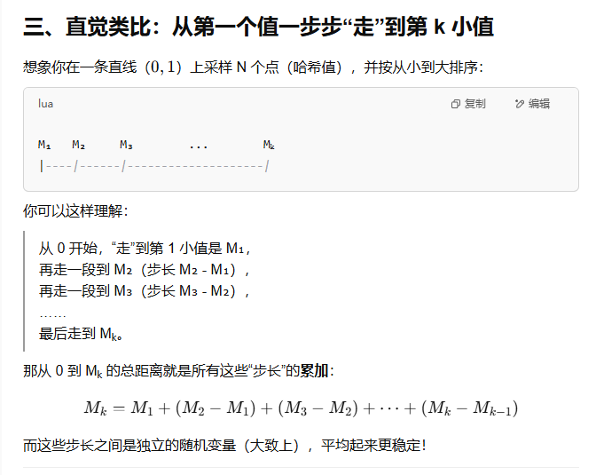
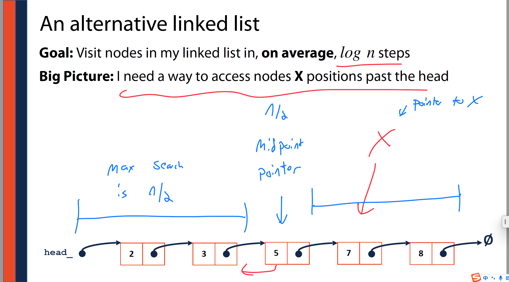
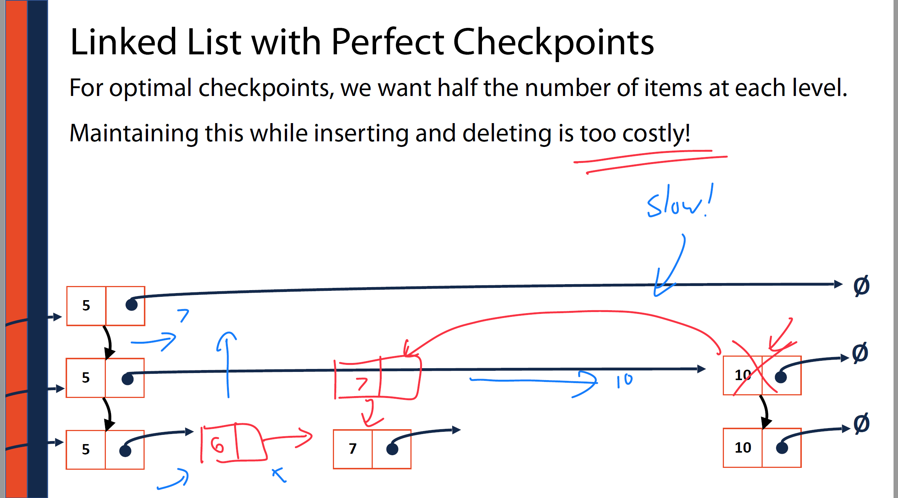
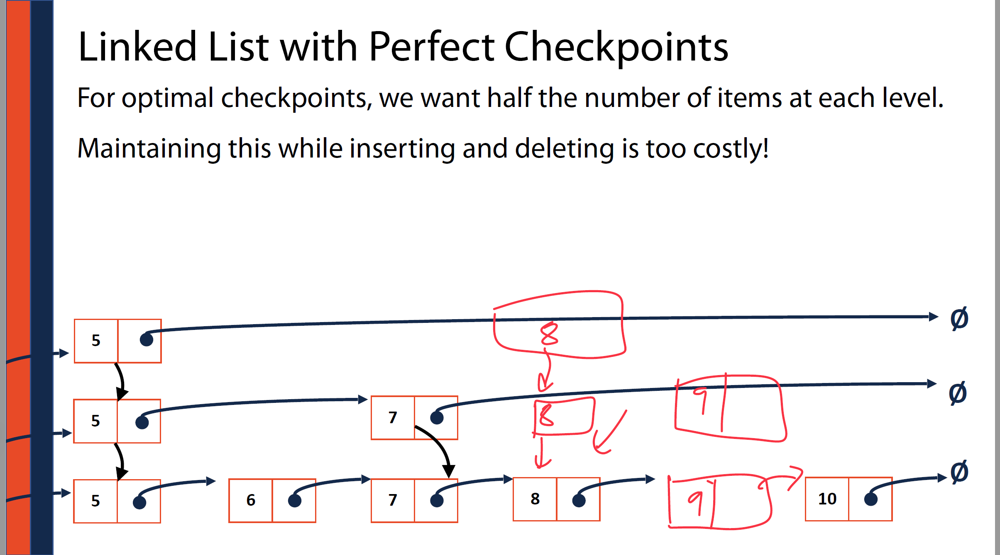
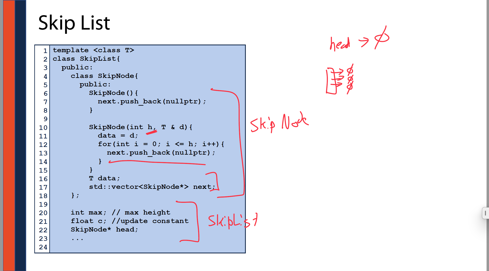

这张图的标题是 **“Big Picture of Sketching”（Sketch 技术的整体概览）**，讲的是如何用**近似算法**（Sketching）来处理无法存储或分析的海量数据。图中主要讲了两种 Sketch 技术：**Bloom Filter Sketch** 和 **Cardinality Sketch**。

------

### 一、整体背景

英文原文：

> If you can't store or analyze a data collection using exact approaches...

中文翻译：

> 如果你无法用精确方法来存储或分析一个数据集合……

意思是，当数据量太大，精确处理不可行时，就需要使用**Sketch 技术**来进行近似估计，牺牲部分准确性换取空间和时间效率。

------

### 二、Bloom Filter Sketch（布隆过滤器草图）

#### 英文解释：

1. Hash every item **one at a time**
2. Store in a **bloom filter**

#### 中文解释：

1. 把每一个元素依次哈希处理（一个一个来）
2. 将哈希结果存入 **布隆过滤器**

#### 辅助注释说明：

- “Query presence/absence”：查询一个元素是否存在
- “Space efficient”：空间效率高
- Bloom Filter 是一种能快速判断“某个元素**可能存在**”或“一定不存在”的数据结构
- 通常用于去重、黑名单检查等

------

### 三、Cardinality Sketch（基数估计草图）

#### 英文解释：

1. Hash every item **one at a time**
2. Store the **k-th minimum hash value**

#### 中文解释：

1. 把每个元素依次哈希处理（一个一个来）
2. 存储**第 k 小的哈希值**

#### 辅助注释说明：

- 中间图形 “2, 5, 7” 表示哈希值集合，选第 3 小的（如图右下“3rd minhash val”）
- 目标是估算去重后的数据数量（即集合基数）
- 一样是“空间效率高”

------

### 四、图片与红色手写标注

左边的宇宙模拟图表示海量数据（不能存储，标注“Cannot store this!”），是引出 Sketch 方法的背景。

------

### 总结 Summary

| 技术名             | 用途                           | 存储方式                        | 优点               |
| ------------------ | ------------------------------ | ------------------------------- | ------------------ |
| Bloom Filter       | 判断元素是否存在               | 哈希后放入布隆过滤器            | 空间效率高，查询快 |
| Cardinality Sketch | 估算集合中有多少**不同**的元素 | 存第 k 小哈希值（或多个最小值） | 空间效率高         |

你需要我继续详细解释某一部分吗？


所以1000/(N+1)是最小值到0的段长 或者说是数学期望  所以为了估计  我们把哈希最小值的数学期望近似等于我们观测到的最小的哈希值 **用观测到的最小值** ≈ **理论期望最小值**，反推集合规模 N。

如果你有 **多个最小值（比如前 k 小）**，你可以做出更稳定、更准确的估计（比如 KMV：K Minimum Values 技术）

如果只用一个最小值，估计可能会受波动影响，但空间效率极高，非常适合大规模场景（如流式数据）

> **为什么 1000 / (N+1) 这个期望值，可以等于（或近似等于）95？**

------

## 一、你已经知道的：

- **1000 / (N+1)** 是 **哈希值最小值的数学期望**（在区间 [0, 1000] 上）。
- **95** 是我们在真实数据中，**实际观测到的最小哈希值**。

------

## 二、关键点：**我们把观测值当作期望来估算**

在没有完整数据的情况下，我们通常采取一个近似假设：

> 假设我们观测到的最小值 ≈ 平均（即期望）最小值

也就是说，我们用实际最小值去“反推”集合大小 N：


------

## 三、这其实是一种“**最大似然估计**”（Maximum Likelihood Estimation, MLE）

我们没有办法直接知道 N，只能根据“样本中最小值 = 95”这个观测结果，找一个**最有可能导致这个结果的 N 值**，而这个 N 正好是让 1000 / (N+1) ≈ 95 的那个。

所以：

- 数学上：我们知道最小值的期望是 `1000 / (N + 1)`
- 观察上：我们观测到的是 `min = 95`
- 估算上：我们反过来解这个式子，来估 N

------


# 为什么要这样看作累加


###### 


这张图讲的是如何使用 **Cardinality Sketch（基数估计草图）** 方法，也叫 **KMV（K-Minimum Values）Sketch**，通过**哈希值中第 k 小的那个**来估算一个数据集中**不同元素的个数（基数）**。

下面是**详细中英对照讲解**：

------

## 一、标题：Cardinality Sketch

**英文：**

> Given any dataset and a SUHA hash function, we can estimate the number of unique items by tracking the k-th minimum hash value.

**中文翻译：**

> 给定任何数据集和一个 SUHA 哈希函数，我们可以通过追踪“第 k 小哈希值”来估算集合中**唯一元素的数量**。

------

## 二、图示说明

### 左边：

- 有各种数据输入：基因序列（DNA）、图片（猫图像）、图结构等
- 它们都被视为输入数据项（items）

### 中间：

- 用哈希函数将每个数据项转换成一个 `[0, 1]` 之间的数（哈希值）
- 例如 `0.253, 0.839, 0.327, 0.655, 0.491`

### 右边蓝框内：

- 这是哈希后的所有值
- 图中有标注出第 k 小的哈希值（比如第 2 小是 0.327）

------

## 三、公式应用：估算元素个数 N

图上手写了三种估算方式，用的是这个核心公式：

N≈kMk−1N \approx \frac{k}{M_k} - 1

其中：

- kk：你选择的第几小的哈希值（例如第 1 小、第 2 小等）
- MkM_k：实际观测到的第 k 小的哈希值
- NN：估算得到的唯一元素数量

------

- 

------

## 六、重点 takeaway：

> 用第 k 小的哈希值做估计，比只用最小值更**稳定准确**。这是 KMV Sketch 的核心优势。

你想继续了解这个方法在大数据或流式数据中的实际应用吗？例如搜索引擎、去重、网络监控等？


这张图是关于**集合相似度（Set Similarity）**的复习，介绍了最常用的一个相似度衡量指标——**Jaccard 系数（Jaccard coefficient）**。

下面是详细的解释和中英对照：

------

## 一、标题：Set Similarity Review

**中文：**集合相似度回顾

------

## 二、主旨句（英文 + 中文）

> To measure **similarity** of A & B, we need both a measure of how similar the sets are but also the total size of both sets.

**翻译：**
 为了衡量集合 A 和 B 的相似度，我们不仅要知道它们有多相似，还要考虑它们总体的大小（即全集合的规模）。

------

## 三、图形说明

图中展示的是两个集合：

- **红色圆形 A**
- **蓝色圆形 B**
- **中间紫色阴影区域**：是 A 和 B 的**交集**，即 A 和 B 共有的元素

这就是我们要度量的“相似”部分。

------

## 五、结论说明

> JJ is the **Jaccard coefficient**

**翻译：**
 J 是 **Jaccard 系数**，用于衡量两个集合的相似程度，值在 `[0, 1]` 之间：

- **J = 1**：完全相同（交集 = 并集）
- **J = 0**：完全不相交（交集为空）

------


这张图用一个非常形象幽默的方式，引出“**用 sketch（摘要）计算集合相似度**”的问题。

------

## 一、标题：**Similarity Sketches**

**中文：** 相似度草图（Sketch）技术

------

## 二、主问题句

> **But what do we do when we only have a sketch?**
>  **中文翻译：**
>  **但如果我们手上只有 sketch（摘要）该怎么办？**

这句话是提出核心问题的方式：
 我们无法获取集合 A 和 B 的完整内容时，怎么衡量它们的相似度？

## **Sketch** 是：**用哈希函数等技术处理后得到的、可以支持某种估算任务的“压缩摘要”**


------

## 三、图像比喻解释（形象类比）

- 图中两个人物：左边红色（集合 A），右边蓝色（集合 B）
- 他们头上戴着写有 A 和 B 的蓝色牛仔帽（帽子代表他们的 **sketch / 摘要**）
- 身体部分是圆形，象征真实集合内容（不可见或不完整）
- 黑色箭头指向帽子，强调：**我们现在只能看到帽子**，而不是身体内容

### 含义比喻：

> 就像我们现在只能看到集合的“帽子”（即 sketch），看不到“全貌”，我们必须通过帽子来判断两个集合是否相似。

------

## 四、上下文逻辑回顾（连接前一张图）

上一张图介绍了集合相似度用 **Jaccard coefficient** 衡量，但前提是你能访问集合 A 和 B 的**全部元素**。

现在这个图指出一个问题：

> 在大数据环境下，我们通常**无法访问完整集合**，只能存一个“摘要”（Sketch）！

------

## 五、总结表格（中英文对照）

| 内容           | 英文                           | 中文解释                                 |
| -------------- | ------------------------------ | ---------------------------------------- |
| 什么是 sketch  | Sketch                         | 对集合的压缩摘要，只保留部分关键信息     |
| 遇到的问题     | Only have a sketch             | 没有原始数据，只剩草图                   |
| 比喻意义       | A/B 戴着帽子，只看到帽子       | 只能通过摘要判断相似度                   |
| 引出的核心思考 | How to compare sets via sketch | 如何只用 sketch 来估算集合之间的相似性？ |

------

## 六、下一步提示

这张图是一个**铺垫页**，它的后续通常会讲解：

- 如何用 **MinHash** 或 **HyperLogLog** 等方法从 sketch 中估算相似度
- 如何通过对比多个 sketch 的结构，估算 Jaccard 相似度

------

如果你愿意，我可以马上帮你解释下一张关于 **MinHash 如何估 Jaccard 相似度** 的图例，要继续吗？


这张图是对“**Similarity Sketches（相似度草图）**”的可视化解释，展示如何仅凭 sketch（摘要）来估算两个数据集的相似性，尤其是用 **k 最小哈希值**的方法。

------

## 一、标题说明：Similarity Sketches

**中文：** 相似度 Sketch（草图）
 图的目的：展示我们可以**只用每个集合的一部分哈希值（k 个最小的）**来估算它们的相似性，而不需要原始数据。

------

## 二、图中元素解读（自上而下）

### 左边：

- 蓝色牛仔帽 A、B 代表两个数据集 A 和 B 的“Sketch”（摘要）
- 每个蓝条带代表一个数据集的“哈希空间”，哈希值从左到右排列
- 紫色倒三角形：表示该集合中某些元素的哈希值

------

## 三、中间红色框区域：关键部分！

### 目的：**找出 A 和 B 的 sketch 中有哪些哈希值是重合的（match）**

### 黑色竖线 = A 和 B 中 **都有的哈希值**（即交集）

### 红色竖线 = 只出现在某一个集合中的哈希值（差集）

我们只关心**k 个最小的哈希值**（图中用红框圈出的是 top-k 哈希值），然后计算 A 和 B 的**交集占并集的比例**：


------

## 四、对应公式含义（隐含）

图虽然没写公式，但表达的就是：

> **估算 Jaccard 相似度：**
>
> 

即使你没有集合本身，只要保留了每个集合**前 k 个最小哈希值**，就可以估算集合之间有多相似。

------

## 五、应用背景（图下方引用）

引用了 Mash Screen 的论文：

> 用于基因组比对的快速估算方法 —— 用 Sketch 来判断序列集合之间是否有显著重合。

------


这张图继续讲解了如何**用 sketch 来估算两个集合的相似度**，并引入了关键前提 **SUHA**（Simple Uniform Hashing Assumption，简单均匀哈希假设）。

------


------

### 5. 右侧红字手写解释

512\frac{5}{12}

可能是另一种估计方法的结果，或者是整条蓝带上的交并比（更大的 hash 范围估计值）。但红框中的部分是当前估算重点。

------

## 三、核心思想总结

| 内容                     | 说明                                             |
| ------------------------ | ------------------------------------------------ |
| SUHA 假设                | 哈希函数能将元素均匀分布在 0,10,1 区间           |
| 用 sketch 估相似度的依据 | Jaccard(A,B) ≈ 共有最小哈希值数 ÷ 总最小哈希值数 |
| 为什么可行               | 在均匀哈希下，哈希值保留集合结构的“相对关系”     |
| 应用实例                 | 文本去重、网页匹配、基因组比对                   |

------

## 四、中英文术语对照总结

| 英文术语           | 中文解释            |
| ------------------ | ------------------- |
| Sketch             | 集合的哈希摘要      |
| k min hash values  | k 个最小哈希值      |
| Jaccard similarity | Jaccard 相似度      |
| SUHA               | 简单均匀哈希假设    |
| Shared hashes      | 交集哈希值          |
| Sketch similarity  | Sketch 层面的相似度 |

------

如果你想，我可以进一步讲一下：

- **为什么 SUHA 很关键**
- **MinHash 如何保证这个估计是无偏的**
- **怎么在实际应用中快速实现这个估算过程（如基因组比对 Mash）**

你想深入哪一部分？


这张图是对 **MinHash Sketch（最小哈希摘要）** 的概念总结和扩展，强调其从**估计集合大小（cardinality）**到**估计集合相似度（similarity）**的演进。

以下是详细中英文对照解释：

------

## 一、标题：**MinHash Sketch**

**中文：** 最小哈希摘要（MinHash Sketch）

------

## 二、主内容拆解讲解

### 1. 英文句子：

> **The k-th minimum value sketch** is built by tracking k minima but only uses one value (the k-th minima) to get **cardinality!**

**中文翻译：**
 “k 最小值 sketch” 是通过记录 k 个最小哈希值构造的，但仅使用其中一个（第 k 小的值）来估算集合的**基数（cardinality）**。

- **cardinality = 集合中不同元素的数量**（例如一个集合中有多少种不同的猫）
- 使用第 k 小哈希值，是我们前面学的 **KMV sketch 方法**

------

### 2. 英文句子：

> We can extend this approach into a full **MinHash sketch** that can also estimate **set similarities.**

**中文翻译：**
 我们可以将这一方法扩展成完整的 **MinHash sketch**，它还能用于估算集合之间的**相似度（similarities）**。

- 这就是从“只估大小”拓展到“还估关系（相似性）”
- **MinHash** 本质上就是：对集合应用多个独立哈希函数，然后比较结果是否相同来估算 Jaccard 相似度

------

## 三、右下图解说明

### 左边拼图（蓝色系）：

- 表示一个集合的哈希 sketch
- 都是蓝色块，意味着是同一个集合的多个最小值哈希

### 右边拼图（混合色）：

- 红、绿、蓝块混合，表示多个集合之间进行 MinHash 比较
- 颜色重复的越多 → 哈希值重合越多 → 相似度越高

------

## 四、关键词中英文对照表

| 英文术语                  | 中文解释                          |
| ------------------------- | --------------------------------- |
| k-th minimum value sketch | 第 k 小哈希值摘要（用于基数估计） |
| cardinality               | 集合的基数（唯一元素个数）        |
| set similarity            | 集合相似度（Jaccard）             |
| MinHash sketch            | 多个最小哈希值组成的摘要          |
| extend                    | 扩展方法（从估大小到估相似）      |


这张图讲的是 **MinHash Sketch 的构建方法**（MinHash Construction），也就是我们如何实际构造一个用于集合相似度估算的 MinHash 摘要结构。

------

## 一、标题：**MinHash Construction**

**中文：MinHash 摘要的构建过程**

------

## 二、核心句：

> A MinHash sketch has three required inputs:
>  **中文翻译：**
>  构建一个 MinHash 摘要需要以下三个输入：

------

## 三、三个输入解释（中英文对照）

### **1. A hashable dataset（一个可哈希的数据集）**

- 数据集中的每个元素都必须能被哈希，例如字符串、数字、token 等
- 手写注释红字强调是：**A hashable dataset**
- 如果数据不能哈希，就不能用 MinHash

------

### **2. A hash function（一个哈希函数）**

- 这个函数用于将每个元素映射到 0,10, 1 区间的值（或整数空间）
- 手写蓝字补充：**This is hard!（这很难！）**
  - 原因是：必须满足 SUHA（Simple Uniform Hashing Assumption），即“简单均匀哈希假设”
  - 哈希值必须均匀分布，否则估计会偏

------

### **3. The size of k（要保留的最小哈希值个数）**

- 我们不能保存所有哈希值，所以只保留前 `k` 个最小的
- k 越大，估计越精确，但计算成本越高
- 右上角手写标注：**How many values I need = k**

------

## 四、右边图示讲解

- 蓝色小方块表示哈希值
- 帽子 = sketch（集合的压缩摘要）
- 黑色箭头表示：从原始哈希值中选出前 k 个，构成 MinHash
- 最终 sketch 中只保留这 k 个方块（蓝色、黑色等）

------

## 五、总结表格（中英文对照）

| 输入项          | 英文原文           | 中文解释                     |
| --------------- | ------------------ | ---------------------------- |
| 1. 可哈希数据集 | A hashable dataset | 数据能被哈希处理             |
| 2. 哈希函数     | A hash function    | 必须“均匀”、满足 SUHA 假设   |
| 3. k 的大小     | The size of k      | 决定我们保留多少个最小哈希值 |
| 输出            | MinHash Sketch     | 用于估计集合相似度的压缩结构 |

------


这张图用一个简单例子，**演示了 MinHash 的构建过程**（MinHash Construction），即如何从一个集合生成一个只保留部分信息的“最小哈希摘要”。

------

## 一、输入条件（左侧红色箭头）

### 集合：

- **S = {16, 8, 4, 13, 15}**
   表示你要处理的原始数据集合

### 哈希函数：

- **h(x) = x % 7**
   将每个数除以 7 取余，映射到 0～6 的哈希值范围（简单例子）

### k = 3

表示我们只保留哈希值中**最小的 3 个值**（top-k 最小哈希值）

------

## 二、处理过程

### 第一步：对每个元素哈希

图左下角列出了结果（红笔）：

| 元素 x | h(x) = x % 7 |
| ------ | ------------ |
| 16     | 2            |
| 8      | 1            |
| 4      | 4            |
| 13     | 6            |
| 15     | 1            |

------

### 第二步：选出最小的 k=3 个哈希值

从哈希结果中选出最小的 3 个值：

- 最小的 3 个哈希值是：**1, 2, 4**

图右下角画了一个小表格，把它们按升序存入了 sketch 中（即 MinHash Sketch）：

```
位置   哈希值
0       1
1       2
2       4
```

------

## 三、右侧英文算法总结（中英对照）

| 步骤     | 英文原文                            | 中文解释                             |
| -------- | ----------------------------------- | ------------------------------------ |
| Step 1   | Hash each item                      | 对每个元素进行哈希处理               |
| Step 2   | Keep the k-minimum values in memory | 保留最小的 k 个哈希值                |
| 括号说明 | Ignore collisions / duplicates      | 忽略哈希冲突或重复元素（只看哈希值） |

------

## 四、图示含义总结

- 这就是 MinHash 的构建过程：**从原始集合中哈希出若干值，只保留其中最小的 k 个**
- 得到的 `{1, 2, 4}` 就是该集合的 MinHash sketch

------

## 五、真实场景中的意义

构造多个集合的 MinHash 后，你可以用它们之间**哈希值的重合率**来估算集合之间的**Jaccard 相似度**，即：


------

如果你想，我可以继续用这个例子做一个 A 和 B 相似度估计的模拟，要试试看吗？


这张图展示的是 **MinHash 如何用来估算两个集合之间的 Jaccard 相似度**，核心思想是：**两个集合的 MinHash Sketch 中有多少值重合**，就能估计它们的相似程度。

------

## 一、标题：**MinHash Jaccard Estimation**

**中文：用 MinHash 估计 Jaccard 相似度**

------

## 二、场景设定

> Given sets A and B sampled uniformly from [0, 100], store the bottom-8 MinHash

**中文翻译：**
 给定两个集合 A 和 B（元素从 0～100 范围中均匀采样），我们对每个集合保留最小的 8 个哈希值（bottom-8 MinHash）。

------

## 三、图中元素解读

### 左侧表格：**Sketch A**（红色）

- A 集合中最小的 8 个哈希值（非重复）
- 分别是：3, 7, 8, 11, 15, 17, 22, 23

### 右侧表格：**Sketch B**（蓝色）

- B 集合中最小的 8 个哈希值
- 分别是：2, 3, 6, 7, 9, 11, 17, 23

------

## 四、下方时间轴样式图（横条）

- 展示两个 sketch 值如何分布在 0～24 区间中
- 红色数值表示 A 的哈希值，蓝色表示 B 的哈希值
- 从图中可以清楚看到哪些哈希值**重复出现于两个集合中**

------


------

### **具体计算：**

两个 Sketch 中共有的值有：

- **3**
- **7**
- **11**
- **17**
- **23**

所以交集个数 = 5，k = 8：


------

## 

> **MinHash 估 Jaccard 的核心是：sketch 中有多少哈希值重合，就说明集合结构有多相似。**


这张幻灯片是一个**思考性过渡页**，提出了一个核心问题：
 **我们能否仅通过 MinHash sketch 中估计出的集合大小来估算 Jaccard 相似度？**

------

## 一、文字解释：

### 标题：

> **MinHash Jaccard Estimation**
>  **MinHash 估算 Jaccard 相似度**

------

### 正文：

> **Using MinHash sketches, we can estimate** ∣A∣|A|、∣B∣|B|、**and** ∣A∪B∣|A \cup B|

**中文翻译：**
 我们通过 MinHash sketch，可以估算集合 A 的大小 ∣A∣|A|，集合 B 的大小 ∣B∣|B|，以及它们并集的大小 ∣A∪B∣|A \cup B|。

------

### 提出的问题：

> **Is this enough to estimate the Jaccard?**
>  **中文翻译：**
>  这些信息是否足够估算 Jaccard 相似度？

------

## 二、如何回答这个问题？

### **回答：**

**不够准确！估算 Jaccard 最直接的方法不是靠 |A|、|B|、|A ∪ B|，而是通过 sketch 中的交集数量。**

------


------

## 四、总结（中英文对照）

| 项目                   | 英文                      | 中文解释                             |
| ---------------------- | ------------------------- | ------------------------------------ |
| 可估算的量             | (                         | A                                    |
| 是否足够估算 Jaccard？ | Not reliable              | 单靠这些值估算 Jaccard 不稳          |
| 更优解                 | Compare sketches directly | 直接比较 MinHash 重合项更准确        |
| 正确估计方式（推荐）   | ( \frac{                  | \text{Sketch}_A \cap \text{Sketch}_B |

------

## 五、简洁英文回答模板（如你在写作或讲演）

> **No, those estimates alone are not enough.**
>  **To accurately estimate Jaccard similarity, we must directly count the number of shared MinHash values.**

------

是否需要我下一张为你讲清楚怎么**数出 sketch 中交集项**并用它最终算出 Jaccard？


这张图展示的是：
 **用 MinHash sketch 间接估算 Jaccard 相似度的计算过程**，特别是通过集合大小估计交集大小，再除以并集大小。

------

## 一、标题：MinHash Indirect Jaccard Estimation

**中文：MinHash 间接估算 Jaccard 相似度**

------

## 二、上方公式解释


**含义：**

- Jaccard 相似度是交集除以并集
- 若我们估算出了 A、B、A∪B 的基数（元素个数），可以用这公式“间接”算出 Jaccard

------

## 三、右上角条件说明：

- 使用 **k = 8** 的 MinHash（每个 sketch 保留 8 个最小哈希值）
- 原始哈希区间是 **0,1000, 100**
- 缩放为：800 表示的是把 100 映射为整数范围（放大 8 倍）——可视为哈希精度（每个 hash 值范围是 0,1000,100，精度为 1/800）

------


------

## 六、总结（中英文对照）


------

## 七、额外提示

这种“间接估计”虽然有效，但：

- 会叠加多个估计的误差
- 精度通常低于“直接法”：**通过共享 MinHash 个数计算 Jaccard（见前面 slide）**

------

是否想让我对比一下“直接法”和“间接法”的优劣？或者用你自己的例子做一轮计算演示？


这张图是对 **MinHash Sketch** 的一个总体总结，强调了它的构造过程与核心用途。

------

## 一、标题：**MinHash Sketch**

**中文：最小哈希摘要（MinHash Sketch）**

------

## 二、主句解释（中英互译）

> **We can convert any hashable dataset into a MinHash sketch**
>  **我们可以把任何可哈希的数据集转化为 MinHash 摘要**

解释：只要数据能被哈希处理（比如文本、图片、基因序列），就可以用 MinHash 将其压缩成一个小型结构。

------

## 三、图中过程说明

### 左边蓝色方块堆：原始数据集被哈希成多个哈希值（hash values）

- 红圈标出：每个数据项都经过哈希
- 得到一堆数值（如 1、3、5、...）

### 中间蓝色箭头表示：从这些哈希值中**提取最小的 k 个值**，构成 MinHash Sketch

右边例子：

{1,3,5}⇒k=3\{1, 3, 5\} \Rightarrow k = 3

### 黑色手绘说明：

当两个集合的 sketch 都是

{2,3,5}\{2, 3, 5\}

交集大小是 3，除以总数 3，可估相似度为 1。

------

## 四、下面两点说明 MinHash 的两大用途

### 1. **Cardinality（基数估计）**

> **# of items**
>  **估算集合中有多少个不重复元素**

### 2. **Set Similarity（集合相似度）**

> 比如用 Jaccard，相似度 ≈ 共享哈希值数 / k

------

## 五、总结（中英文对照）

| 英文术语         | 中文解释                     |
| ---------------- | ---------------------------- |
| Hashable dataset | 可哈希的数据集               |
| MinHash sketch   | 最小哈希摘要                 |
| k minimum values | 保留的 k 个最小哈希值        |
| Cardinality      | 基数：集合大小估算           |
| Set Similarity   | 集合相似度：Jaccard 相似度   |
| Lose dataset     | 丢失原始数据（不再保留全部） |

------

## 六、一句话总结：

> **MinHash Sketch 是一种轻量级摘要，它牺牲原始数据，换取对“集合大小”与“集合相似度”的高效估算。**

如果你想，我可以演示它在文本去重、网页比对、基因序列搜索中的实际应用？是否需要？


这张幻灯片介绍了一种 **替代的 MinHash 构建方法**，并指出它的**条件限制和挑战**。

------

## 一、标题：

> **Alternative MinHash Sketch Approaches**
>  **中文：MinHash 摘要的替代构建方法**

------

## 二、正文内容中英对照解析：

> **Rather than use one single hash and take bottom-k, we can also use k hashes — if you have access to that many independent hashes!**
>  **中文翻译：**
>  与其使用一个哈希函数并选出最小的 k 个值（bottom-k 方法），
>  我们也可以使用 k 个不同的哈希函数——**如果你能获得那么多独立的哈希函数的话！**

------

## 三、解释说明

### **常规做法（前半句）**

- 通常我们只用一个哈希函数，对所有元素哈希，然后保留最小的 k 个值，构成 sketch（称为 bottom-k 或 KMV 方法）

### **替代方法（后半句）**

- 你也可以用 **k 个独立的哈希函数**，每个函数保留一个最小值，构成 sketch 的第 i 位

这种方式称为 **“k-wise MinHash”** 或“Multiple Hash MinHash”。

------

## 四、优劣对比（中英文对照）

| 方法                     | 优点                   | 缺点                       |
| ------------------------ | ---------------------- | -------------------------- |
| Bottom-k（1 个哈希函数） | 易于实现，适合流式处理 | 精度稍低，受单函数偏差影响 |
| 多哈希（k 个哈希函数）   | 精度更高，不需排序     | 难以构造大量独立哈希函数   |

------

## 五、重点术语解释

| 术语英文                       | 中文含义              |
| ------------------------------ | --------------------- |
| bottom-k                       | 保留最小的 k 个哈希值 |
| k hashes                       | k 个独立哈希函数      |
| independent hashes             | 相互独立的哈希函数    |
| access to k independent hashes | 能否获得 k 个独立哈希 |

------

## 六、总结一句话：

> 如果你拥有多个独立哈希函数，可以用它们构造更准确的 MinHash Sketch；
>  否则，bottom-k 是一种更通用、实用的替代方案。

------

需要我图示这两种方法的 sketch 结构差异吗？或演示实际精度差别？


这张图展示了如何将**DNA序列转化为 MinHash Sketch 并估算 Jaccard 相似度**，这是基因序列比对中的经典应用。

------

## 一、左边步骤说明（中英文对照）

### **1）Sequence decomposed into kmers**

**序列被分解为 k-mers（固定长度的子串）**

- 比如 S₁ 分解成 CAT, ATG, TGG 等 3-mer
- 这是处理生物序列的标准方法

------

### **2）Multiple hash functions (Γ) map kmers to values**

**多个哈希函数（Γ）将 k-mers 映射为哈希值**

- 图中有 Γ₁ ~ Γ₄ 共 4 个哈希函数
- 每个 k-mer 被映射为 4 个哈希值（整数）

------

### **3）The smallest values for each hash function is chosen**

**对每个哈希函数，选择最小哈希值作为该函数下的代表**

- 比如 S₁ 在 Γ₁~Γ₄ 的最小值分别是：5, 1, 2, 15
- S₂ 的 sketch 是：5, 1, 6, 6

------

- 

------

## 二、右侧表格结构说明

- 上下分别是 S₁ 和 S₂ 的所有 k-mers
- 每行是某个 k-mer 在 4 个哈希函数下的哈希值
- 红色数字：每列最小值
- 红色 k-mers：产生最小值的片段

------

## 三、下方配对示意图说明：

展示 S₁ 和 S₂ 在序列中实际共享的子串（ACC），也从视觉上说明它们是部分相似的。

------

## 四、总结术语中英文对照

| 英文术语            | 中文解释                   |
| ------------------- | -------------------------- |
| k-mer               | 固定长度的子串             |
| Hash function (Γ)   | 哈希函数                   |
| Minimum hash value  | 最小哈希值                 |
| Sketch              | 最小哈希值构成的摘要       |
| Jaccard similarity  | 杰卡德相似度（交集除并集） |
| Overlap in sketches | sketch 中的共享哈希值      |

------

## 五、一句话总结

> **我们可以用多个哈希函数把基因序列转成 MinHash sketch，然后只通过最小哈希值的重合，就能估算它们的相似度（Jaccard）。**

需要我帮你复现这个例子，用 Python 模拟 2 个序列如何生成 sketch 并算相似度吗？


这张图讨论的是：**当两个数据集差距很大时（一个远大于另一个），MinHash Sketch 相似度估计会遇到什么问题。**

------

## 一、标题

**Alternative MinHash Sketch Approaches**
 **MinHash 摘要的替代方法**

------

## 二、核心问题（中英对照）

> **What if I have a dataset which is \*much larger\* than another?**
>  **如果两个集合大小差距很大，会发生什么？**

------

## 三、图中数据说明

### 集合定义：

- **S₁ = {1, 3, 40, 59, 82, 101}** （小集合）
- **S₂ = {1, 2, 3, 4, 5, 6, ..., 59, 82, 101, ...}** （大集合，包含 S₁ 所有元素及更多）

注意：

- 这两个集合实际上是包含关系：**S₁ 是 S₂ 的子集**
- 所以理论上它们的 Jaccard 相似度应为：


------

## 四、MinHash Sketch 构造（k = 5）

- **底部蓝字展示的是：**我们使用 k = 5 构造 sketch，只保留哈希最小的 5 个元素
- 得到的结果是：

### Sketch(S₁) = {1, 3, 40, 59, 82}

### Sketch(S₂) = {1, 2, 3, 4, 5}

------

## 五、问题出现在哪里？

虽然 S₁ 是 S₂ 的子集，但因为 Sketch 只保留最小的 k 个值，它们的 sketch 交集 = {1, 3}，只重合两个：


这个值比真实相似度 **高得多**！

------

## 六、右下角图示说明

- 小红圈：小集合 S₁
- 大蓝圈：大集合 S₂
- 红紫重叠部分：它们的重合元素
- 用视觉方式强调了大小悬殊，但 Sketch 却无法反映真实差异

------

## 七、总结（中英文对照）

| 内容                   | 英文术语                       | 中文解释                |
| ---------------------- | ------------------------------ | ----------------------- |
| 小集合 S₁              | {1, 3, 40, 59, 82, 101}        | 仅有少量元素            |
| 大集合 S₂              | 包含 S₁ 且有更多元素           | 非常大                  |
| Sketch 限制            | bottom-k = 5                   | 只保留最小的 5 个哈希值 |
| 误差来源               | 只取前 k 个小值 → 无法反映全貌 | 相似度被高估            |
| 解决方法提示（未说明） | 可能需要调整 k 或用加权策略    | 可后续补充              |

------

## 八、一句话总结：

> 当两个集合大小差距悬殊时，MinHash Sketch 中的“前 k 小值”可能会严重高估它们的相似性。

------

需要我扩展解释**有哪些方法可以纠正这种“大小不对称性问题”**吗？比如 Weighted MinHash、Containment MinHash 等？


这张幻灯片是对“**概率型数据结构（Probabilistic Data Structures）**”的概述说明，强调其核心优势与设计哲学。

------

## 一、标题：**Probabilistic Data Structures**

**中文：概率型数据结构**

------

## 二、逐句解析

### **1）Probabilistic data structures trade accuracy for efficiency**

**概率型数据结构以牺牲精确度为代价，换取高效率**

- 解释：这些结构**不是 100% 准确**，但能大幅减少空间与计算开销
- 例如：Bloom Filter、MinHash、Count-Min Sketch 等都是近似估计，不存储全数据

------

### **2）Most can maintain surprisingly good accuracy**

**但大多数仍然可以维持令人惊讶的准确度**

- 意思是：虽然它们“不是精确的”，但实际误差往往小到可忽略
- 通过 **期望值（Expectation）分析** + 大样本理论，让估计结果非常稳定

------

### **3）“Cheat” Big O limitations on conventional data analysis**

**这些结构可以“作弊式”地绕开传统算法的复杂度限制（Big O）**

- 正常情况下，处理大数据需 O(n)、O(n log n) 时间或空间
- 使用概率结构，可以用 O(1)、O(log n) 的空间或时间，做大规模估算
- 比如：
  - 你用 MinHash，就不用真的比对两个集合的所有元素
  - 用 Bloom Filter 检查集合包含性，仅用很少空间

------

## 三、底部手写部分解析

> **Expectation**, **under SUHA**

- “Expectation”：强调很多结构是基于数学期望来保证效果
- “under SUHA”：表示假设哈希函数服从“简单统一哈希假设”（Simple Uniform Hashing Assumption）

------

## 四、总结（中英文对照）

| 关键词                   | 英文解释                                      | 中文释义                              |
| ------------------------ | --------------------------------------------- | ------------------------------------- |
| Probabilistic structures | Data structures with randomness & estimations | 使用随机性和估计的方法                |
| Trade accuracy for speed | Small error for big gain                      | 用一点精度换巨大计算/空间节省         |
| Cheat Big-O              | Beat traditional limits via approximation     | 规避传统数据分析的时间/空间复杂度限制 |
| Expectation              | Accuracy proven in expectation                | 在期望值意义下是可靠的                |
| SUHA                     | Simple Uniform Hashing Assumption             | 简单统一哈希假设，常用分析前提        |

------

## 五、一句话总结

> **概率型数据结构牺牲部分精度换取极高的效率，在大数据处理中是一种“聪明的近似”方式。**

是否想要我列出几个典型的概率型结构及它们的使用场景？比如 Bloom Filter、HyperLogLog、MinHash 等？


这张幻灯片是一个引入式的问题，带有**幽默与启发性**，用“一个有缺陷的链表”来引出**概率性数据结构的设计思想**（比如 skip list）。

------

## 一、标题解释

> **Where it all began… A faulty list**
>  **一切的起点…… 一个有缺陷的链表**

这是在讲一个假设：一种看似“坏掉”的数据结构，居然变成了一个有趣的替代方案。

------

## 二、正文讲述（中英对照）

### > Imagine you have a list ADT implementation *except*…

**设想你实现了一个线性表（列表）抽象数据类型（ADT），**
 **但有一个小问题……**

### > Every time you called **insert**, it would fail 50% of the time.

**每次你执行插入操作时，它有 50% 的概率失败。**

这看起来就像个**有 bug 的链表实现**，插入不可靠！

------

## 三、底部提出的关键问题：

> **It turns out this system is also useful as an alternative linked list! How?**
>  **结果发现：这个系统其实可以用作“另类的链表”！那是怎么回事？**

------

## 四、它要引出什么？

它在为后续引出 **跳跃表（Skip List）** 做铺垫：

- 跳跃表本质上就是**在链表基础上，随机选择哪些元素出现在“更高层级”**
- 而这个“插入时 50% 失败”的思想，正好模拟了构造跳跃表的“几何分布行为”

------

## 五、总结（中英文对照）

| 内容         | 英文原句                             | 中文解释                 |
| ------------ | ------------------------------------ | ------------------------ |
| 有缺陷的链表 | A faulty list                        | 插入有一定概率失败       |
| 插入失败 50% | insert fails 50% of the time         | 随机丢弃元素构建不同层   |
| 有趣之处     | useful as an alternative linked list | 实际可以实现跳跃表等结构 |
| 提问引导     | How?                                 | 为下页过渡，启发式提问   |

------

## 六、一句话总结

> 看似“坏掉”的数据结构，如果控制得当，可能变成**强大的概率型结构**（比如跳跃表 skip list），这是算法设计中“以退为进”的典范。

------

想看我用图示讲解跳跃表如何从“50% 插入失败”构建出来吗？非常直观！



这张幻灯片是前一张“插入失败的链表”思考的延续，用以引出**跳跃表（Skip List）或跳跃式链表的设计思想**。其核心目标是让链表的访问效率从 O(n) 提升到 **O(log n)**。

------

## 一、标题

**An alternative linked list**
 **另类的链表结构**

------

## 二、上半部分内容解释（中英对照）

### > **Goal:** Visit nodes in my linked list in, *on average*, **log n** steps

**目标：** 希望我能在链表中**平均仅用 log n 步**访问任意节点

- 普通链表访问某个第 x 个节点，**需要 O(n)** 步——效率低
- 希望通过某种机制提升为平均 **log n 步**（如同二叉查找）

------

### > **Big Picture:** I need a way to access nodes **X positions past the head**

**关键点：\**我需要一个\**能跨越多个节点访问位置 X** 的方式

- 这说明我们要为链表**添加“捷径”**，比如跳跃式指针

------

## 三、下方图示说明（跳跃指针思想）

这是一个带有跳跃功能的链表原型示意图：

- 正常的链表从 head 开始，一步步前进
- 我们尝试在中间加一个“**跳跃指针**”：
  - 比如 2 → 3 → **5 → 7 → 8**
  - 给中间节点（如 2）添加一个“**跨越 n/2 长度**”的指针（跳到 5）
  - 这叫做 **midpoint pointer**

### 蓝色注释解释：

- **max search is n/2**：传统链表最坏需要遍历一半
- **midpoint pointer**：中间插入一个跳跃链接
- **point to x**：指针可以帮助快速定位到某个偏远位置

------

## 四、核心思想小结

通过这种“加速指针”机制，我们可以让链表的访问：

- **变成 log n 层次化搜索**（不断跳→缩小范围→线性前进）
- 正是跳跃表（skip list）背后的思维原型

------

## 五、中英文对照术语整理

| 英文术语                | 中文含义                 |
| ----------------------- | ------------------------ |
| alternative linked list | 另类链表结构（如跳跃表） |
| log n steps             | 对数级访问步骤           |
| midpoint pointer        | 中点跳跃指针             |
| point to x              | 指向远处节点             |
| max search is n/2       | 普通链表最坏需遍历 n/2   |

------

## 六、一句话总结：

> 为了将链表从 O(n) 提升到 O(log n) 访问，我们引入跳跃指针结构，让链表具备**分层“快速通道”**。

------

你是否希望我继续展示“多级跳跃指针”最终如何构成完整的 **Skip List**？（包含随机插入概率）


这张幻灯片继续讨论上一页引出的“另类链表”，进一步提出了一个优化策略：**给链表添加“检查点（checkpoints）”**，来加速查找过程。

------

## 一、标题解释

> **Linked List with ‘Checkpoints’**
>  **带有“检查点”的链表**

------

## 二、正文内容中英文对照

### > **With some small overhead costs, we can store checkpoints.**

**只需付出一点额外成本（空间/结构），我们就能存储“检查点”。**

- “overhead” 指的是内存/结构上的开销
- “checkpoints” 指的是一些**额外的跳跃指针或快捷方式**，用于加速访问

------

## 三、下方图示说明

这个图展示的是一个普通的链表结构：

```
head → 2 → 3 → 5 → 7 → 8 → ∅
```

还**未引入跳跃或优化结构**，但这是下一步优化的基础。

------

## 四、概念解释：什么是 checkpoint？

**Checkpoint = 跳跃指针 / 辅助导航位**

你可以理解为：

- 像高速公路上的出口指示牌，帮助快速导航
- 或是跳跃表 skip list 中的“上层指针”
- 比如，从节点 2 可以额外指向节点 5，这样查找 5 就少走一步

------

## 五、用途与优势（中英文对照）

| 英文术语                 | 中文解释                 |
| ------------------------ | ------------------------ |
| small overhead cost      | 轻微的空间/指针额外开销  |
| checkpoints              | 跳跃指针、导航点         |
| speed up traversal       | 加快链表遍历速度         |
| alternative to skip list | 可理解为跳跃表的简化变种 |

------

## 六、一句话总结

> 通过在链表中添加少量“跳跃点”（checkpoints），我们可以用更小代价获得**接近跳跃表的查询效率**。

------

是否要我帮你继续推演下一张图——比如如何从普通链表一步步构造出跳跃表（skip list）？


这张幻灯片介绍了跳跃表（Skip List）的核心结构思想，特别是**“完美的检查点分布”**，即每一层的节点数是下一层的一半。这是实现对数级查找效率的关键。

------

## 一、标题翻译

> **Linked List with Perfect Checkpoints**
>  **具有“完美检查点”的链表结构**

------

## 二、正文解释中英文对照

> **For optimal checkpoints, we want half the number of items at each level.**
>  **为了实现最优的跳跃效果，我们希望每一层的节点数量是下一层的一半。**

这正是跳跃表的核心思想：

- 最底层 = 原始链表
- 每上一层 = 以约 1/2 的概率“提升”一个节点作为上层的跳跃节点
- 最终形成 log₂(n) 层左右的结构，每层向右走一小步，向下跳一大步，实现快速查找

------

## 三、图示结构讲解（从下往上）

### 第 0 层（最底层）

普通链表（节点全都有）：

```
head → 2 → 3 → 5 → 9 → 10 → ∅
```

### 第 1 层（中间层）

选出大约一半节点作为“检查点”（如 2, 5, 10）：

```
head → 2 → 5 → 10 → ∅
```

### 第 2 层（顶层）

再选一半（如 5）作为顶层跳跃节点：

```
head → 5 → ∅
```

每一层的节点数都比下一层少一半，形成**金字塔结构**。

------

## 四、跳跃过程示例（中英文）

- 要查找 9：
  - 从 top（head）→ **5**（顶层）
  - 向下跳到 5（中层）→ 向右跳到 10（中层）
  - 再向下跳到 10（底层）→ 向左找到 9

这种跳法，最多需要 **log n 层 × 常数步长**，所以平均访问复杂度为 **O(log n)**。

------

## 五、关键词整理（中英文对照）

| 英文术语            | 中文解释               |
| ------------------- | ---------------------- |
| Perfect Checkpoints | 完美跳跃点（每层减半） |
| Optimal             | 最优搜索结构           |
| Level               | 层级（多级链表）       |
| Half the items      | 每层节点是下一层的一半 |
| Pointer down        | 向下跳指针             |
| Pointer right       | 向右链接指针           |

------

## 六、小结

> 跳跃表通过在链表中构造多层“检查点”，并按每层减半的方式组织节点，实现了**二分查找式**的效率。

------

是否希望我接下来讲解——**如何通过随机化构造这些 checkpoint**（即用 coin-flip 构造 skip list）？这也是跳跃表的关键创新点。



这张幻灯片说明了一个现实问题：**“完美检查点”（Perfect Checkpoints）虽然理想，但维护代价太高，尤其是在插入和删除时。**

------

## 一、标题中英对照

> **Linked List with Perfect Checkpoints**
>  **带有完美跳跃点的链表**

> **Maintaining this while inserting and deleting is too costly!**
>  **在插入和删除数据时维护这种结构，代价太高！**

------

## 二、结构解释（图示讲解）

图中是一个三层跳跃结构（跳跃表的模型）：

- 每一层都有指针跳跃，节点值包括 `5 → 7 → 10`
- 下层的链表完整，上层只是“精简版”，用于加速

------

## 三、问题示例（插入与删除）

### 插入节点 `6` 的问题：

- 正常链表插入 `6` 很容易（在 `5` 和 `7` 之间）
- **但为了保持“每层减半”这个完美结构，我们可能需要：**
  - 把 `6` 插入到下层链表
  - 再判断是否要“提升”到中层或顶层
  - 若结构比例失衡，还可能要**整体重建上层节点**

这太**耗时（costly）**了！

------

### 删除节点 `10` 的问题：

- 删除 `10` 不仅要在底层删除，还要更新中间层和顶层的指针
- 如果我们强行保持“完美结构”（每层减半），就要进行大量调整
- 所以图中打了一个红叉，说明：**结构维护成本很高！**

------

## 四、结论与关键词（中英文对照）

| 术语                  | 含义                           |
| --------------------- | ------------------------------ |
| perfect checkpoints   | 完美跳跃点（每层节点数量减半） |
| too costly            | 太贵，太麻烦（操作代价高）     |
| insert / delete       | 插入 / 删除                    |
| structure rebalancing | 结构重平衡                     |
| skip list             | 跳跃表（这个模型的典型实现）   |

------

## 五、总结一句话

> 尽管“完美跳跃点”能提供对数查找效率，但在实际操作中（插入/删除）维护这种结构**代价太高**，因此我们需要一个**更“懒惰”但仍高效的版本**——这就引出了 **“随机化跳跃表”Skip List** 的设计思想。

------

是否要我为你继续讲解下一步 —— Skip List 的“随机提升”机制？这是整个思路转折的核心。



这张图是上一张的延续，继续说明：**维护“完美跳跃点”（Perfect Checkpoints）在插入新元素时代价过高**。下面是详细解释：

------

## 一、标题翻译

**Linked List with Perfect Checkpoints**
 带有“完美跳跃点”的链表

**Maintaining this while inserting and deleting is too costly!**
 在插入和删除过程中维护这种结构代价太高！

------

## 二、图示内容解释（中英对照）

这是一种 **多层链表结构**（类似跳表 skip list），每一层的节点数量是下一层的一半（完美结构）。

但当前操作：**要插入新元素 `8` 和 `9`**。

------

### 1. 插入节点 8 的影响

- 原本的结构是：
  - 第三层（底层）完整链表：`5 → 6 → 7 → 8 → 9 → 10`
  - 第二层：跳过部分节点：`5 → 7 → 9`
  - 顶层：更少：`5 → 10`
- **插入 8** 要做什么？
  - 要插入到底层链表中（容易）
  - **为了维持完美跳跃点结构，还要更新第二层和第一层**
    - 把 8 插入第二层
    - 甚至可能要插入到第一层（如图所示）

**代价高在哪里？**
 你要更新所有层级指针，判断数量是否平衡，甚至调整整个结构。这就**不是 O(1) 插入**，而是接近 **O(log n) 或 O(n)** 的成本！

------

### 2. 插入节点 9 的影响

- 节点 9 原本已存在于底层和第二层
- 现在如果新增一个 9，也得检查是否应该被“提升”到上层
- 如图中红笔箭头：你必须不断“打断”原指针，重连新结构

------

## 三、总结（中英对照）

| 中文               | 英文                                       |
| ------------------ | ------------------------------------------ |
| 完美跳跃点结构     | Perfect checkpoint structure               |
| 插入和删除代价高   | Insertion and deletion is costly           |
| 每一层都要维护比例 | Must maintain 1/2 node count at each level |
| 太慢了！           | Too slow!                                  |

------

## 四、核心结论

> **这种结构虽然理论最优，但在动态数据场景下（频繁插入/删除）**
>  **维护代价高、效率差，不适用于实际工程。**

因此，下一步自然引出跳跃表的精髓：“**用概率控制层级，而非手动维护完美结构**”。

------

需要我继续讲解跳跃表（Skip List）是如何**用概率**来实现这个结构的吗？


这是一个多层跳跃指针链表（Skip List）的例子，用于模拟“完美跳跃点”结构。你问的是：**为什么图中“8”和“9”被这样连接？**

------

## 一、回答：为什么 8 和 9 被这样连接？

这是因为为了保持「**完美的跳跃层级结构**」，我们希望每一层的节点数量是下一层的一半。

### 当前最底层（第3层）：

```
5 → 6 → 7 → 8 → 9 → 10
```

这层包含了所有数据节点。

### 第二层（中间层）：

```
5 → 7 → 9
```

我们希望这层节点大约是底层的一半，所以只挑了其中部分节点出来，作为“**跳跃点 checkpoint**”，用来跳过多个底层节点。

### 第一层（顶层）：

```
5 → 10
```

这是最少的 checkpoint 点，仅用于大步跳跃，快速查找。

------

## 二、为什么“8 → 9”没有在高层？

因为它们不是跳跃点。只有某些节点会**被提升到上层结构**，通常根据规则是：

> 每隔两个节点选一个当 checkpoint（完美结构）
>  或者随机决定是否提升（跳表做法）

所以：

- **8 不在第二层或第一层**
- **9 被选为了第二层的 checkpoint**
- 所以你会看到**7 → 9**、**9 → ∅**这样的跳跃连接

------

## 三、总结（中英对照）

| 中文                       | 英文                                         |
| -------------------------- | -------------------------------------------- |
| 不是所有节点都被提升       | Not all nodes are promoted                   |
| 8 是普通节点，只在底层     | 8 is a regular node in the bottom layer only |
| 9 被提升，成为第二层跳跃点 | 9 is promoted to second-level checkpoint     |
| 用跳跃指针来加快查找速度   | Skip pointers accelerate search              |

------

如果你想了解“如何用随机方式选择跳跃点”，可以让我为你讲解**跳表 Skip List 的核心概率机制**。需要吗？


这张图展示的是用**随机检查点（Random Checkpoints）**构建链表以提高搜索效率，同时避免维护“完美检查点”所带来的高昂代价。

------

### 中文解释：

**标题：带随机检查点的链表（Linked List with Random Checkpoints）**

- **问题（Problem）**：维护最优的检查点集合太贵了（也就是每一层节点数量减半的那种“完美结构”插入和删除代价太高）。
- **解决方案（Solution）**：**随机选择一些节点作为检查点**，比如：
  - 从普通链表中选择 `3` 和 `8` 做“跳跃指针”；
  - 这样可以跳过一些中间节点加快查找速度（从 `head` 先跳到 `3`，再跳到 `8`）。

**图解说明：**

- 下方是一个普通链表：`2 → 3 → 5 → 7 → 8`
- 蓝色箭头表示从“检查点”跳转，如：
  - 从 `head` 跳到 `3`；
  - 再跳到 `8`；
- 中间蓝笔说明这是“随机选择检查点”的过程，而不是强制结构要求。

------

### 总结：

| 中文                       | English                                        |
| -------------------------- | ---------------------------------------------- |
| 随机选择检查点提高访问速度 | Randomly choose checkpoints to speed up access |
| 不需要严格维护完美平衡结构 | Avoids costly perfect maintenance              |
| 插入和删除时不容易失控     | Easier insert/delete handling                  |

如果你想了解如何在代码中实现这种结构（比如用跳表Skip List），也可以告诉我！


这张图讲解的是：**使用“随机检查点”的跳表（Skip List）结构如何在不保持“完美平衡”的情况下，仍然获得接近理想的效率**。

------

### 中文解释：

**标题：带有随机检查点的链表（Linked List with Random Checkpoints）**

- **核心问题（Problem）**：
   不再追求每一层“恰好一半”节点做检查点（太难维护），而是“**大约**一半就可以”。
- **解决思路（Solution）**：
   使用**概率性方法**随机决定一个节点是否成为更高层的检查点（比如用抛硬币方式逐层提升）。
- **运行效率分析方法**：
   用**期望（Expectation）**来分析性能，即平均情况下（Average Case），而不是最坏情况。

------

### 图示说明：

1. 最底层是完整链表：
    `head → 2 → 3 → 5 → 7 → 8 → ∅`
2. 每一层往上，只有部分节点被提升为“检查点”：
   - `3` 是一个被多次选中提升的节点，在所有层都出现；
   - `7` 和 `8` 只出现在中间和底层。
3. 蓝笔手写说明：
   - “Expectation → Avg case”：我们通过数学期望估计平均运行时间。
   - 所以虽然不是严格平衡结构，但搜索复杂度依然可以做到 **log n** 级别。

------

### 对比总结：

| 中文                           | English                                    |
| ------------------------------ | ------------------------------------------ |
| 不再追求严格一半节点做跳跃指针 | No longer need exactly half per level      |
| 随机选择节点提升到上层         | Randomly promote nodes to higher layers    |
| 用“期望值”评估平均性能         | Use expectation to analyze average runtime |
| 平均搜索复杂度为 log n         | Average search cost is O(log n)            |

------

如果你对跳表的实现机制（比如随机提升过程）感兴趣，我可以继续详细讲讲。你想看代码示例吗？


这张图讲解的是 **跳表（Skip List）** 的核心概念和结构。

------

### 中文解释 + 英文原文对照：

------

#### **Title 标题：The Skip List（跳表）**

------

### 1. 定义（Definition）

> An ordered linked list where each node has variable size
>  一个**有序的链表结构**，其中每个节点的大小是**可变的**。

------

### 2. 节点结构（Node structure）

> Each node has at most one key but an arbitrary number of pointers
>  每个节点最多只有一个值（key），但可以有**任意数量的指针**（即“高度”可以不同）。

图中可以看到：

- 节点 `3` 有 3 个指针（“高度”为 3）
- 节点 `5` 只有 1 层，节点 `8` 有 3 层
- 这些指针构成了从高到底的多级“快速通道”

------

### 3. 高度决定机制（Height assignment）

> The decision for height is **randomized**
>  每个节点的“高度”是通过**随机**方式决定的（如抛硬币）

这使得跳表在结构上类似于“概率平衡的二叉树”，但更易于实现。

------

### 4. 平均时间复杂度（Claim）

> The **average** time to find, insert, or remove is **log n**
>  查找、插入和删除操作的**平均时间复杂度**都是 **O(log n)**

这是跳表的最大优点 —— 在**无需平衡维护**的情况下，获得**接近二分搜索树**的性能。

------

### 5. 图示说明（Diagram Explanation）

下方图像中展示了一个跳表的结构：

- 最左侧是 head 节点，连接所有层；
- 各节点（2, 3, 5, 7, 8）拥有不同高度（指针数量）；
- 高层指针实现“跳跃式链接”，加速搜索；
- 查找从顶层出发，逐层下降 —— 类似楼梯+电梯的组合查找方式。

------

### 总结（Summary）

| 特性           | 跳表 Skip List                      |
| -------------- | ----------------------------------- |
| 数据结构类型   | 多级链表（multi-level linked list） |
| 节点高度       | 随机决定                            |
| 平均时间复杂度 | O(log n)                            |
| 优势           | 简单、无需复杂旋转、适合动态变化    |
| 应用场景       | 数据库、缓存、键值存储等            |

------

需要我用代码展示跳表的查找或插入流程吗？或者你想要和平衡二叉树对比一下？


这张图解释了跳表（Skip List）中两个主要类的设计思路：**SkipNode 类** 和 **SkipList 类**，以及它们之间的关系和构造逻辑。

------

### 一、标题：The Skip List

**跳表**

------

### 二、问题（Question）

> What would a `SkipNode` class look like? How about the `SkipList` class?
>  `SkipNode` 类应该如何设计？`SkipList` 类又该长什么样？

------

## 三、左边蓝色部分：SkipNode 的组成

**SkipNode 类通常包含：**

- `Key (T)`
  - 一个键值，类型为 T，用于比较
  - **Key（键）是这个节点存储的数据值**
- `An array or vector of pointers (a different next)`
  - 一个指针数组，每个元素指向该层的下一个节点
  - **即：每层有一个“next”，高度不同，指针数量也不同**

------

## 四、右边红色部分：SkipList 的组成

**SkipList 类包含以下成员：**

- `SkipNode* head`
  - 头节点指针，指向最左侧的虚拟起点
- `int max`
  - 最大高度，用于限制每个节点最多可以有多少层
- `float C`（coin flip constant）
  - 抛硬币概率常数，比如 `0.5`，用于决定节点是否晋升一层
  - **每次晋升到更高一层的概率是 C，形成几何分布**

------

## 五、图示解读（图下方）

- 图中展示了一个典型的跳表结构：
  - 头结点有 4 层
  - 节点 `3` 也有 4 层
  - 节点 `2`, `5`, `7`, `8` 的层数不同
- 这些节点通过不同高度的“next”指针连接，形成了多层索引结构

------

## 六、总结对照表：

| 组成             | 英文关键词                     | 中文含义                         |
| ---------------- | ------------------------------ | -------------------------------- |
| 节点的键         | `Key (T)`                      | 节点保存的数据                   |
| 多层指针         | `array/vector of pointers`     | 每层都指向下一个节点             |
| 头指针           | `SkipNode* head`               | 跳表的入口点                     |
| 最大高度         | `int max`                      | 限制跳表最大层数                 |
| 随机晋升概率常数 | `float C (coin flip constant)` | 决定节点是否晋升的概率（如 0.5） |

------

需要我帮你写出 C++ 或 Python 的代码实现结构吗？可以做类的定义和简单插入函数。



这张图展示了跳表（Skip List）在 C++ 中的类定义结构，并配有简要注释。下面我会逐行解释这段代码的意义，并配上**中英对照**。

------

### 一、模板定义

```cpp
template <class T>
class SkipList {
```

- **意思**：跳表支持任意数据类型 T（通过模板定义）
- **中文**：跳表是一个模板类，可以存储任意类型的键值。

------

### 二、内部类 SkipNode（节点结构）

```cpp
class SkipNode {
```

#### 1. 默认构造函数：

```cpp
SkipNode() {
    next.push_back(nullptr);
}
```

- **作用**：初始化时至少分配一层，并让这一层的 next 指针为空。
- **中文**：默认创建一个只有一层的节点，并初始化指针为空。

#### 2. 参数构造函数：

```cpp
SkipNode(int h, T &d) {
    data = d;
    for (int i = 0; i <= h; i++) {
        next.push_back(nullptr);
    }
}
```

- **参数含义**：
  - `h`: 节点的高度（即拥有多少层指针）
  - `d`: 存储的数据值
- **功能**：
  - 将数据存储在 `data` 中
  - 初始化每一层的指针为 `nullptr`
- **中文解释**：创建一个高度为 h 的节点，并为每层初始化空指针。

#### 3. 数据与指针定义：

```cpp
T data;
std::vector<SkipNode*> next;
```

- `data`：存储键值
- `next`：一个数组（向量），每一层都有一个指针指向下一节点
- **中文解释**：每个节点保存一个值，以及多个“next”指针，表示跳表的多层结构。

------

### 三、SkipList 类成员定义：

```cpp
int max;    // max height
float c;    // update constant
SkipNode* head;
```

- `max`：跳表允许的最大高度
- `c`：概率常数，比如 0.5，决定节点晋升概率
- `head`：指向整个跳表的起始点（头结点）
- **中文解释**：这是跳表的核心信息，记录最大高度、随机概率、和起始节点。

------

### 四、右侧红色手写解释：

- **SkipNode**：表示一个节点（有值、有指针数组）
- **head**：头节点，类似链表的起点
- **SkipList**：整体结构类，包括所有跳表必要属性

------

### 总结中英对照：

| 关键词       | 英文                     | 中文解释                      |
| ------------ | ------------------------ | ----------------------------- |
| 节点构造函数 | `SkipNode(int h, T& d)`  | 创建一个高度为 h 的节点并存值 |
| 指针数组     | `std::vector<SkipNode*>` | 多层指针，实现跳跃功能        |
| 跳表头结点   | `SkipNode* head`         | 跳表的起点                    |
| 最大高度     | `int max`                | 跳表允许的最大层数            |
| 随机常数     | `float c`                | 节点晋升到更高层的概率参数    |

------

是否还想继续看插入、搜索、删除的函数实现？我可以接着讲。


这张图讲解的是 **跳表（Skip List）中如何查找一个值，例如 `Find(9)` 的过程**。我们将进行详细解释并附上中英文对照：

------

### 【图示概述】

目标：在跳表中查找数值 **9**

### 查找规则步骤（图中红蓝字）

------

#### 步骤 1：从顶层的头结点开始

（图中红色文字）

> “Start at head of top level”
>  “Has fewest nodes”

- **中文解释**：
   从最上层的头指针开始搜索。上层节点最少，所以可以快速跳跃较大范围。

------

#### 步骤 2：在每一层执行“线性查找”

（图中蓝色文字）

> “At each level, it's LL find()”
>  “(ordered)”

- **中文解释**：
   每一层内部查找就像普通的链表，顺着指针向右查找，直到值大于等于目标或到底为止。
   然后——**往下一层继续查找**。

------

### 【图中过程详解】

#### 圆圈步骤（从左到右）：

1. **从 top-level 的 head 出发**（红圈标记）
2. 遇到 3：比较 `3 < 9`，所以继续向右跳
3. 直到不能再跳（目标 9 不再大于下一个节点）
4. **向下一层继续查找**
5. 最后在底层链表中定位到节点 9（蓝圈标记）

------

### 查找路径（图中箭头）

跳表通过“跳跃式”逐层查找，让复杂度从线性降为对数：

- 最坏情况复杂度为 O(n)
- **平均复杂度为 O(log n)**（这是跳表的最大优势）

------

### 中文总结：

**跳表查找步骤如下**：

1. 从最上层头节点出发；
2. 每一层从左向右查找第一个 ≥ 目标值的节点；
3. 找不到则往下一层；
4. 最终在底层精确定位。

------

如果你想，我可以继续讲解插入和删除的逻辑图解。要继续吗？


这张图展示了跳表（Skip List）中查找值 `7`（`Find(7)`）的过程，并用红色/蓝色箭头清晰地标记了查找路径。我们逐句解释，并进行中英文对照：

------

### **上方文字内容解析**（Skip List 查找规则）

**英文原文：**

1. Starting at top level... if next node’s key matches, done!
2. If key smaller than next node’s key, **move down a level**
3. If key larger than next node’s key, **go to next node at current level**

**中文翻译：**

1. 从最高层的 `head` 开始……如果下一个节点的值等于目标值，就找到了！
2. 如果目标值 **小于** 下一个节点的值，就**往下一层**
3. 如果目标值 **大于** 下一个节点的值，就**在当前层继续向右查找**

------

### **图中操作过程：Find(7)**

#### 查找路径：

1. 从最顶层 `head` 开始（左上角蓝圈）
2. 发现 `3 < 7`，所以继续往右走（红箭头）
3. 看到 `8 > 7`，所以**往下一层**（红箭头往下）
4. 重复操作：
   - 在第二层：`6 < 7`，继续向右
   - 到 `7`，发现匹配，**查找成功！**

------

### **图中标记含义解读：**

- **蓝色圈住的节点 7**：表示查找目标
- **红色箭头**：表示查找路径
- **蓝色注释**："7 would have been here" 指的是 7 的插入位置
- **粉色手写问句**：“Is this any more efficient?” 表示思考跳过中间节点（如 5）的效果是否真的更快

------

### **小结：**

跳表通过“上层跳跃 + 下层查找”的方式，将查找复杂度从 O(n) 降到 **平均 O(log n)**。图中清晰地演示了跳表跳跃过程如何快速接近目标。

------

**你还需要我解释跳表的插入和删除过程吗？我可以继续补充。**


这张图展示的是 **跳表（Skip List）中插入元素 `6` 的过程**，图中的注解用红蓝两色标示出插入逻辑和指针调整路径。

------

### 一、整体目标：**插入元素 6（Insert(6)）**

------

### 二、插入操作步骤解析（中英对照）

#### **Step 0: Randomly determine height**

- **中文：** 随机决定新节点的“高度”（层数）
- 右上角标明新插入的 `6` 被赋予了高度为 3（即将出现在顶层、中层和底层）

#### **Step 1: Start at top level and find item**

- **中文：** 从最上层开始，查找插入位置
- 图中红色箭头表示从 `head` 出发，经过节点 `3`，准备插入到 `8` 前面

------

### 三、图中结构与连接解释

#### 原始结构：

- 跳表中已有元素：2 → 3 → 5 → 7 → 8
- `3` 是关键的插入参考点，它有多层指针

#### 插入节点 `6`：

- `6` 需要插入在 `3` 与 `8` 之间
- 在三层（顶层、中层、底层）分别都要从 `3` 指向 `6`，再从 `6` 指向 `8`
- 蓝色圈出的 `6` 表示在不同层的节点视图（其实是同一个逻辑节点）

------

### 四、总结（中英）

- **英文总结：**
   Insert in Skip List works by randomly assigning height, locating insertion point at each level top-down, and updating the pointers.
- **中文总结：**
   跳表插入通过“随机高度 + 多层查找 + 指针调整”实现，既保留有序性又保持效率。

------

是否还想看删除操作（Skip List Delete）的流程？我可以继续为你讲解。


这张图展示的是 **跳表（Skip List）插入元素 9 的全过程**，包括高度生成、路径查找和多层插入。

------

### 一、标题：`Skip List Insert — Insert(9)`

跳表插入操作 —— 插入数字 `9`

------

### 二、英文讲解与中文翻译对照

#### 英文：

> **Randomly generate height for insert**
>  **Use `Find()` logic but insert at every list with height ≥ random**

#### 中文：

> **插入时随机生成高度**
>  **使用查找逻辑，但在每一层高度 ≥ 随机值的位置都插入**

------

### 三、图中重点解释

#### 1. 随机高度 = 5

- 图中蓝笔在右上角写出：`height = 5`，表示新插入的 9 节点在跳表中会出现在 5 层中

#### 2. 查找路径

- 从最上层（head 的第 4 层）出发
- 一路向右走，直到遇到比 9 大的节点（即 `∅`）
- 然后向下，进入下一层重复此过程
- 红色箭头省略了，蓝线表示向右再向下直到找到插入点（在 `8` 之后）

#### 3. 插入动作

- 在每一层将指针从前一个节点（如 `8`）指向 `9`，再从 `9` 指向原来的后继
- 图中右侧画出 5 个 `9` 节点，分别出现在 5 层（其实逻辑上是一个节点）

------

### 四、总结（中英）

- **英文总结：**
   When inserting `9`, we randomly choose its height (5), then follow `find()` logic from top to bottom, and insert `9` at every level ≥ 0 up to height 5.
- **中文总结：**
   插入 `9` 时，随机决定它的层数为 5，从顶层开始查找插入位置，并在每一层插入 `9`，以维护跳表结构。

------

需要我继续讲解 Skip List 的删除（delete）操作吗？


这张图解释了**跳表中删除元素 `9` 的过程（Skip List Remove 9）**。我们继续使用 `find()` 查找逻辑，但目的是**断开指针，移除节点**。

------

### 一、标题与任务

**Skip List Remove**
 **Remove(9)** —— 从跳表中移除值为 9 的节点。

------

### 二、主要步骤（图中文字解释 + 中文翻译）

#### 红色笔记解释：

- `D -> 3 -> 9`：表示从最上层出发，依次跳到 `3` 再跳到 `9`
- `remove pointer`：需要断开的是指向 `9` 的这些指针
- `at level 0, delete node before remove pointer`：在最底层（第0层）执行真正的删除

------

#### 蓝色流程解释：

- `Use find logic but remove!`
   使用与查找类似的路径搜索逻辑，但是最终要把每层中**指向 9 的前一个节点**指针改掉

------

### 三、图示解读

1. **查找路径**（蓝色箭头）：
   - 从最顶层出发，查找过程中记录“指向 9 的前驱节点”；
   - 到达每一层中从 `3` → `8` → `9`；
2. **删除动作**：
   - 每一层中，原来指向 `9` 的指针现在改为指向 `null` 或跳过 `9`；
   - 图中将 `9` 节点打上 “X” 表示它即将被完全移除；

------

### 四、中英总结

#### 英文总结：

> To remove a node in a skip list, we search from the top level using the same logic as `find()`. Once the node is found, we remove the forward pointers to it on every level. When all levels are updated, the node can be deleted.

#### 中文总结：

> 在跳表中删除节点时，我们从顶层开始，使用 `find()` 的查找逻辑找到目标节点。然后在每一层中断开指向该节点的指针。最后在最低层真正移除该节点。

------

需要我进一步展示 **插入、删除的完整代码** 或讲解复杂度分析吗？


这张图展示的是如何在跳表（Skip List）中删除节点 `3`，重点是使用**Find() 查找逻辑**，但要在**下降（下探）之前先断开指针**。

------

### 英文内容翻译

**标题**：Skip List Remove
 **任务**：Remove(3) —— 从跳表中删除键为 3 的节点

**原文解释**：

> Use Find() logic but remove before descending the previous node.
>  The remove is a standard Linked List Remove (but at each level)

**中文翻译**：

> 使用 `find()` 的查找逻辑，但在向下跳到下一层之前，先删除“前一个节点”对目标节点的指针。
>  删除操作就像在普通链表中删除节点一样，但需要在跳表的每一层都执行一遍。

------

### 图示解析（图下半部分）

- 节点 `3` 目前在三层中都有存在；
- 每层中，前一个节点（左边的那个节点）都有指向 `3` 的指针；
- 删除逻辑就是将这些指向 `3` 的指针断开，让它们直接指向 `3` 的下一个节点（即 `6`）；
- 最后从内存中删除 `3`。

------

### 总结 Summary

**英文**：

> To delete a node in a skip list (e.g. node 3), use the same path as in `find()`. But before descending a level, remove the pointer at the current level. This ensures all references to the target node are removed, just like deleting in a linked list—done at every level.

**中文**：

> 在跳表中删除一个节点（比如 3），我们按照 `find()` 的方式查找，但在每层跳到下一层之前，先断开当前层指向它的指针。这个操作类似于在普通链表中删除节点，不过需要在多层结构中都执行。

------

需要我演示删除后结构变成什么样，或者补充 C++ 实现代码吗？


这张幻灯片讲的是 **跳表（Skip List）的效率分析**，特别是如何用**概率方法**来说明跳表的平均查找时间是 **O(log n)**，优于普通链表的 O(n)。

------

### 中英对照逐句解释

------

#### 标题

**Skip List Efficiency**
 **跳表的效率分析**

------

#### 正文

**We’ve seen the full ADT but haven’t explored the runtime**
 我们已经看过了跳表的完整抽象数据类型（ADT）实现，但还没有深入分析它的运行时间。

**What is the Big O for Find()? O(n) for n nodes (keys)**
 查找操作 Find() 的最坏情况复杂度是多少？是 O(n)，适用于 n 个节点的情况。

------

#### 加粗内容：核心问题

**Using probability, how can we show skip list is better than O(n)?**
 如何利用**概率论**来证明跳表优于 O(n) 的复杂度？

------

#### 三步分析法

1. **Formalize the probability of SkipList reaching height h > log n**
    形式化跳表中某个节点“高度大于 log n” 的概率。
    说明：跳表是通过抛硬币（或等概率）方式随机决定某节点出现在哪些层。
2. **Define a recurrence relationship for search path**
    定义搜索路径长度的**递推关系**。
    说明：从顶层开始搜索，每当遇到无法继续时就下降一层，路径结构可以用递归或数学建模表示。
3. **Use (1) and (2) to show that our average search time is log n**
    利用前两个分析步骤，证明跳表的平均查找时间是 O(log n)。
    说明：虽然每次插入/查找带有随机性，但从整体期望来看，搜索高度和路径长度都呈对数级别增长。

------

#### 图示解释（底部）

图中展示的是一个跳表的搜索路径：

- 最上层节点稀疏；
- 每一层逐渐增加节点密度；
- 查找时从顶层起，右移直到超目标为止，然后下探，直到找到目标或确认目标不存在；
- 这条查找路径“zig-zag”形状，可以通过概率分析证明其平均长度为 O(log n)。

------

### 总结 Summary

**英文总结**：

> Skip lists use randomness to create multiple levels of forward pointers. The height of each node follows a geometric distribution. By analyzing the probability of node height and defining recursive search steps, we can prove the average search time is O(log n), making skip lists more efficient than linked lists.

**中文总结**：

> 跳表通过随机方式为节点分配多个“层级指针”，节点高度服从几何分布。通过概率推导节点高度大于 log n 的可能性，并建立搜索路径的递推关系，我们可以证明跳表的平均查找时间为 O(log n)，效率优于普通链表。

------

需要我继续帮你推导这三步的数学细节吗？


这张幻灯片讲的是 **跳表（Skip List）中节点高度的随机性（Random Height）**，以及它是如何通过**概率机制**来分配节点的“层数”的。

------

### 中英逐句解释

------

#### 标题

**Skip List Random Height**
 **跳表中的随机高度**

------

#### 正文部分

**By definition, each increase in height occurs with probability c.**
 根据定义，节点每升高一层的概率是一个常数 cc。

**If c=0.5c = 0.5 (a coin flip), to reach level ll, we must flip ll heads in a row**
 如果 c=0.5c = 0.5（即掷硬币，每次升层必须正面朝上），
 要达到第 ll 层，必须连续掷出 ll 次正面。

**By definition the probability a node reaching level ll is clc^l**
 所以，某个节点能“升到”第 ll 层的概率就是 clc^l。

------

### 图示说明（底部）

- 左边的图表示：
  - 节点最初总是出现在第0层（概率 1）；
  - 如果要出现在第1层，需掷出1次正面，概率是 c=0.5c = 0.5；
  - 想出现在第2层，需连续2次正面，概率是 0.52=0.250.5^2 = 0.25；
  - 第3层的概率是 0.53=0.1250.5^3 = 0.125；
  - 越高层的节点越稀少，构成“塔型结构”。

------

### 右下角代码解释（生成节点高度）

```cpp
int SkipList<T>::randHeight(){
    float frac = rand() / (float)RAND_MAX;
    int h = 0;
    while(frac < c){
        h++;
        frac = rand() / (float)RAND_MAX;
    }
    return h;
}
```

**中英文解释：**

这段代码模拟抛硬币决定节点高度的过程：

- `rand() / RAND_MAX` 生成一个 0~1 间的随机数；
- 如果这个随机数小于常数 `c`（比如 0.5），则“升一层”，继续随机；
- 每次通过 `h++` 累加高度；
- 最终返回的 `h` 就是该节点的“层数”。

等价于重复抛硬币，直到出现反面为止，`h` 就是连续正面的次数。

------

### 总结 Summary

**英文总结：**

> In a skip list, each node's height is determined randomly. The probability that a node reaches level ll is clc^l. This creates a layered structure with exponentially fewer nodes as levels increase, enabling logarithmic search times.

**中文总结：**

> 在跳表中，节点的高度是通过随机方式决定的。一个节点出现在第 ll 层的概率是 clc^l，这使得越高层的节点越稀疏，从而形成分层结构，支持平均 O(log n) 的查找效率。

------

要不要我继续帮你讲解后续如何用这些概率来推导平均查找复杂度？


这张幻灯片解释了**跳表（Skip List）高度的期望值**（Expectation of height），即：我们希望知道有 nn 个节点的跳表，平均会有多高。

------

### 标题

**Skip List Expectation**
 **跳表高度的期望值分析**

------

### 正文逐句中英对照解释

------

**We want to bound the height of a SkipList of nn nodes but this is deceptively hard to prove \*in expectation\***
 我们想要给有 nn 个节点的跳表的**高度做一个期望值上的上界**，但这在数学上其实是一个“看起来简单但实际很难”的问题。

------

- - 

------

### 总结 Summary

**英文总结：**

> The expected height of a skip list with nn nodes is O(log⁡n)O(\log n). This is shown by summing the expected number of non-empty levels, and noting that higher levels become increasingly unlikely to contain any nodes.

**中文总结：**

> 跳表中有 nn 个节点时，其**期望高度是 O(log⁡n)O(\log n)**。这是通过分析每层是否存在节点的概率，并观察更高层逐渐变为空的趋势得到的。

------

需要我为你推导下一步——跳表平均搜索路径长度（search path）的期望值吗？


这张图解释的是 **跳表（Skip List）平均情况下的性能分析**，通过概率的方式来估计：**跳表中“某层有没有节点”的概率有多大**，进而判断跳表高度不会太大。

------

## **英文原文逐句解释 + 中文翻译：**

------

### **Title: Skip List Average-Case Performance**

**跳表的平均性能分析**

------

### **Instead we will define an equation for the likelihood of SkipList of nn nodes having a height larger than log⁡n\log n and claim that the probability is small.**

我们将通过构造一个概率表达式，来分析**一个包含 nn 个节点的跳表，其高度超过 log⁡n\log n 的概率**——并指出，这种概率是很小的。

------

### **With a probability cc of increasing a node’s height by 1:**

假设**每提升一个节点的高度的概率为 cc**（比如 c=0.5c = 0.5，即抛硬币为正面时上升一层）

------


------


这张图是在解释：

### **跳表（Skip List）查找操作的平均时间复杂度是 `O(log n)` 的原因**

------

## 中文详解：

### **主张（Claim）：**

跳表中进行一次查找，平均要走多少步？答案是：**高度的期望值 ≈ log n**。也就是说，**查找的平均长度就是跳表的高度**。

------

### **证明（Proof）：**

我们引入一个数学模型：

- 设 `H(k)` 表示：跳表有 `k` 层时，从最上层查找目标节点的**期望查找步骤数**。

------

- 

------


------

### **图示说明：**

图下方的跳表结构图展示了：

- 多层索引结构如何帮助跳过中间节点
- 比如从顶层快速跳到节点 9

------

如需我帮你手动代入数字算一遍或写代码模拟这个推导，也可以继续问。你想看推导公式展开吗？


这张图总结了**跳表（Skip List）在效率上的表现**，并通过对比其他常见数据结构（如 AVL 树）来说明它的实际运行性能。

------

## **中文逐句解释与翻译**

------

### **标题：Skip List Efficiency**

**跳表的效率分析**

------

### **第一部分：理论分析**

**We’ve seen the full ADT but haven’t explored the runtime**
 我们已经学习了跳表这个抽象数据类型（ADT）的结构，但还没有深入分析它的运行时间。

**What is the Big O for Find()?**
 那么，`Find()` 操作的时间复杂度是多少？

**O(n)** for `n` nodes (keys)
 普通链表查找是 O(n)

**Skip List mimics behavior of AVL Tree, despite being linked list**
 尽管跳表是链表结构，它的性能却**模仿了 AVL 树的行为**（即平衡树的 log n 时间）。

------

### **接下来是跳表效率的三个原因：**

1. **Our height is (on average) log n**
    跳表的层数平均是 log n
2. **The expected cost to traverse is height bounded!**
    遍历路径的期望成本被高度（log n）所限制
3. **So our average search time is log n**
    所以**平均查找时间就是 log n**

------

### **第二部分：实测性能对比表格**

表格展示了不同算法的运行时间（单位是毫秒 `msec`）：

| 实现方式                    | 查找时间 | 插入时间 | 删除时间 |
| --------------------------- | -------- | -------- | -------- |
| Skip Lists                  | 0.051ms  | 0.065ms  | 0.059ms  |
| AVL 树（非递归）            | 0.046ms  | 0.10ms   | 0.085ms  |
| 2-3 树（递归）              | 0.054ms  | 0.21ms   | 0.21ms   |
| Top-down splaying（自调整） | 0.15ms   | 0.16ms   | 0.18ms   |
| Bottom-up splaying          | 0.49ms   | 0.51ms   | 0.53ms   |

括号里的数字是相对跳表的倍数（例如 bottom-up splaying 插入时间是跳表的 7.8 倍）

------

## **总结：**

- 跳表结构虽简单，却和 AVL 树一样能实现 O(log n) 的效率。
- 理论分析和实验数据都说明，跳表查找快、插入快、删除快。
- 实际上，跳表在某些情况下可以作为平衡树的高效替代。

------

如果你还想了解为什么它模拟 AVL 的行为，或者具体对比每个结构的优势，我可以继续展开讲。是否需要我列出优缺点对比？