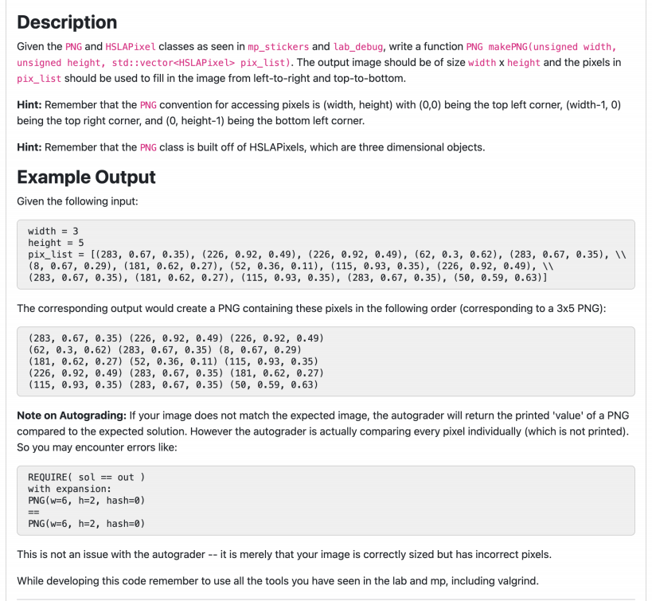

抱歉给您带来困扰，以下是对图片中英文内容的逐句翻译和详细中文解释：

------

### **Description**

**描述**

Given the **PNG** and **HSLAPixel** classes as seen in **mp_stickers** and **lab_debug**, write a function **PNG makePNG(unsigned width, unsigned height, std::vector pix_list)**. The output image should be of size **width x height** and the pixels in **pix_list** should be used to fill the image from left-to-right and top-to-bottom.

**给定在 `mp_stickers` 和 `lab_debug` 中看到的 `PNG` 和 `HSLAPixel` 类，编写一个函数 `PNG makePNG(unsigned width, unsigned height, std::vector<HSLAPixel> pix_list)`。输出图像的大小应为 `width x height`，并且 `pix_list` 中的像素应从左到右、从上到下依次填充图像。**

#### **解释**：

这部分描述了一个函数的功能，该函数将从像素列表生成一个PNG图像。图像的宽度和高度由输入的**`width`**和**`height`**决定，像素数据会按行填充图像，从左到右、从上到下。

------

### **Hint**

**提示**

Remember that the **PNG** convention for accessing pixels is (width, height) with (0,0) being the top left corner, (width-1, 0) being the top right corner, and (0, height-1) being the bottom left corner.

**记住，`PNG` 对于访问像素的约定是 (width, height)，其中 (0,0) 是左上角，(width-1, 0) 是右上角，(0, height-1) 是左下角。**

#### **解释**：

这部分提示了如何解释图像中的像素坐标。在PNG图像中，像素的坐标以(0,0)为左上角，向右为x轴增大，向下为y轴增大。理解这个坐标系统对正确操作图像中的像素至关重要。

------

### **Hint**

**提示**

Remember that the **PNG** class is built off of **HSLAPixels**, which are three-dimensional objects.

**记住，`PNG` 类是基于 `HSLAPixel` 构建的，后者是三维对象。**

#### **解释**：

每个像素使用**HSLAPixel**类表示，它是一个三维对象，包含三个属性：**色调（Hue）**、**饱和度（Saturation）\**和\**亮度（Luminance）**。这与常见的RGB颜色模型不同，HSL模型主要用于表示颜色的色调、饱和度和亮度。

------

### **Example Output**

**示例输出**

Given the following input:

**给定以下输入：**

```cpp
width = 3
height = 5
pix_list = [(283, 0.67, 0.35), (226, 0.92, 0.49), (226, 0.92, 0.49), (62, 0.3, 0.62), (283, 0.67, 0.35), 
           (8, 0.67, 0.29), (181, 0.62, 0.27), (52, 0.36, 0.11), (115, 0.93, 0.35), (226, 0.92, 0.49), 
           (283, 0.67, 0.35), (181, 0.62, 0.27), (115, 0.93, 0.35), (283, 0.67, 0.35), (50, 0.59, 0.63)]
```

**```cpp width = 3 height = 5 pix_list = [(283, 0.67, 0.35), (226, 0.92, 0.49), (226, 0.92, 0.49), (62, 0.3, 0.62), (283, 0.67, 0.35), (8, 0.67, 0.29), (181, 0.62, 0.27), (52, 0.36, 0.11), (115, 0.93, 0.35), (226, 0.92, 0.49), (283, 0.67, 0.35), (181, 0.62, 0.27), (115, 0.93, 0.35), (283, 0.67, 0.35), (50, 0.59, 0.63)]

```
#### **解释**：
此输入提供了图像的尺寸（`width = 3`，`height = 5`）以及一个像素列表（`pix_list`）。该列表包含多个三元组，每个三元组表示一个像素的HSL值。此数据将用于生成图像，填充图像的像素。

---

### **The corresponding output would create a PNG containing these pixels in the following order (corresponding to a 3x5 PNG):**  
**相应的输出将创建一个 PNG，包含这些像素，按照以下顺序排列（对应一个 3x5 的 PNG）：**
```

(283, 0.67, 0.35) (226, 0.92, 0.49) (226, 0.92, 0.49) (62, 0.3, 0.62) (283, 0.67, 0.35) (8, 0.67, 0.29) (181, 0.62, 0.27) (52, 0.36, 0.11) (115, 0.93, 0.35) (226, 0.92, 0.49) (283, 0.67, 0.35) (181, 0.62, 0.27) (115, 0.93, 0.35) (283, 0.67, 0.35) (50, 0.59, 0.63)

```
#### **解释**：
这是生成图像后，像素的排列顺序。图像的尺寸是 **3x5**，意味着图像有5行，每行有3个像素。每个像素值是由三元组（HSL）表示的。

---

### **Note on Autograding**  
**自动评分的说明**

If your image does not match the expected image, the autograder will return the printed **"value"** of a PNG compared to the expected solution. However, the autograder is actually comparing every pixel individually (which is not printed). So you may encounter errors like:

**如果你的图像与期望图像不匹配，自动评分系统将返回 PNG 的 **"值"**，即与期望结果的对比。然而，自动评分系统实际上会逐个像素地进行比较（不会显示每个像素）。因此，您可能会遇到如下错误：**
```

# REQUIRE( sol == out ) with expansion: PNG(w=6, h=2, hash=0)

PNG(w=6, h=2, hash=0)  // 不匹配

```
#### **解释**：
如果生成的图像与期望图像不完全匹配，自动评分系统会检查每个像素的值，并将其与期望的像素值进行对比。因此，即使图像的尺寸正确，像素值的差异也会导致评分错误。

---

### **This is not an issue with the autograder -- it is merely that your image is correctly sized but has incorrect pixels.**  
**这不是自动评分系统的问题——只是您的图像大小正确，但像素不正确。**

#### **解释**：
这说明问题不在图像的尺寸，而是在像素值上。如果图像大小正确，但像素值不正确，系统会标记为不匹配。

---

### **While developing this code remember to use all the tools you have seen in the lab and mp, including valgrind.**  
**在开发此代码时，请记住使用实验室和 mp 中所有您看到的工具，包括 valgrind。**

#### **解释**：
建议在开发过程中使用调试工具（例如 **Valgrind**），它可以帮助您检测内存泄漏或其他内存相关问题，确保代码运行没有错误。

---

希望这段翻译和解释对您理解题目要求有所帮助！
```

为了实现 **`makePNG`** 函数，你需要编写代码来生成一个PNG图像。该图像将根据给定的宽度 **`width`** 和高度 **`height`**，并使用 **`pix_list`** 中的像素信息填充图像。

以下是这个问题的步骤和代码示例：

### 任务目标：

1. **接收输入**：宽度、高度和像素列表。
2. **创建PNG图像**：将给定像素按顺序填充到图像中。
3. **使用HSLAPixel**：每个像素由HSL（色调、饱和度和亮度）三元组表示。
4. **返回PNG图像**。

### 步骤：

1. **定义`makePNG`函数**，接受 **`width`**、**`height`** 和 **`pix_list`** 参数。
2. **创建一个空的PNG图像**，根据 `width` 和 `height` 设置尺寸。
3. **遍历 `pix_list`** 中的每个像素值，并按照从上到下、从左到右的顺序填充图像。
4. **返回生成的PNG图像**。

### 代码实现：

```cpp
#include <vector>
#include "PNG.h" // 假设你有一个用于处理PNG的类
#include "HSLAPixel.h" // 假设你有HSLAPixel类表示像素

PNG makePNG(unsigned width, unsigned height, std::vector<HSLAPixel> pix_list) {
    PNG img(width, height); // 创建一个空的PNG图像，大小为宽度x高度
    int pixelIndex = 0; // 用来遍历像素列表

    // 遍历每一行和每一列
    for (unsigned y = 0; y < height; ++y) {
        for (unsigned x = 0; x < width; ++x) {
            // 将pix_list中的像素值赋给图像的当前像素
            if (pixelIndex < pix_list.size()) {
                img.getPixel(x, y) = pix_list[pixelIndex++];
            }
        }
    }
    return img; // 返回生成的PNG图像
}
```

### 解释：

1. **PNG img(width, height)**：使用给定的宽度和高度创建一个新的PNG图像。
2. **pix_list**：这是包含像素的列表，每个像素由 **`HSLAPixel`** 对象表示，包含 **色调**、**饱和度** 和 **亮度**。
3. **遍历像素**：使用两个嵌套的 `for` 循环遍历图像的每个像素位置 `(x, y)`，并将对应的 **`pix_list`** 中的像素值填充到图像中。
4. **返回PNG图像**：当所有像素填充完毕，返回生成的PNG图像。

### 如何使用：

假设 `pix_list` 已经被填充了像素数据，你可以像下面这样调用这个函数：

```cpp
unsigned width = 3;
unsigned height = 5;
std::vector<HSLAPixel> pix_list = {
    HSLAPixel(283, 0.67, 0.35), HSLAPixel(226, 0.92, 0.49), HSLAPixel(226, 0.92, 0.49),
    HSLAPixel(62, 0.3, 0.62), HSLAPixel(283, 0.67, 0.35), HSLAPixel(8, 0.67, 0.29),
    HSLAPixel(181, 0.62, 0.27), HSLAPixel(52, 0.36, 0.11), HSLAPixel(115, 0.93, 0.35),
    HSLAPixel(226, 0.92, 0.49), HSLAPixel(283, 0.67, 0.35), HSLAPixel(181, 0.62, 0.27),
    HSLAPixel(115, 0.93, 0.35), HSLAPixel(283, 0.67, 0.35), HSLAPixel(50, 0.59, 0.63)
};

PNG img = makePNG(width, height, pix_list);
img.writeToFile("output.png"); // 将生成的PNG图像保存为文件
```

### 关键点：

- **`PNG` 和 `HSLAPixel` 类**：你需要确保这些类可以正确处理图像和像素。如果你使用第三方库（例如 `cs225` 或其他图像处理库），这些类已经存在。如果没有，你需要自己实现这些类。
- **`pix_list`**：这是像素的顺序，它需要按照从左到右、从上到下的顺序排列。
- **图像填充**：确保按顺序正确填充每个像素。

### 总结：

- **`makePNG`** 函数创建一个给定大小的PNG图像，并将像素列表中的像素填充到图像中。
- 代码使用了二维数组的方式来按行填充图像。


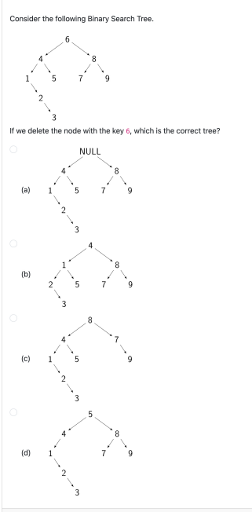

这道题目给出了一棵 **二叉搜索树（Binary Search Tree，简称BST）**，并要求你删除值为 **6** 的节点后，选择正确的树形结构。

### 问题分析：

1. **二叉搜索树的特性**：在二叉搜索树中，左子树的值总是小于父节点的值，右子树的值总是大于父节点的值。
2. **删除节点的操作**：当删除一个节点时，有三种情况：
   - **删除的节点是叶子节点**：直接删除该节点。
   - **删除的节点有一个子节点**：将该节点的子节点替代它。
   - **删除的节点有两个子节点**：找到该节点的后继节点（即右子树中的最小节点），将其替代删除节点，并删除后继节点。

抱歉，我之前的解释有误。让我们重新分析一下这棵二叉搜索树（BST）和删除节点 **6** 后的操作。

### 初始树：

```
      6
    /   \
   4     8
  / \   / \
 1   5 7   9
/ \
2   3
```

### 删除 **节点 6** 的步骤：

1. **节点 6 有两个子节点**（左子树是 4，右子树是 8）。
2. 在这种情况下，我们需要找到 **后继节点**来替代节点 6。后继节点是 **右子树中的最小节点**，即 **节点 7**（在节点 8 的左边）。
3. **节点 7** 会替代 **节点 6**，然后 **节点 7** 会从树中删除。
4. 删除 **节点 7** 后，**节点 8** 的左子树将变成 **NULL**，即没有左子节点。

### 删除后树的结构：

```
      7
    /   \
   4     8
  / \     \
 1   5     9
/ \
2   3
```

### 分析选项：

- **(a)** **NULL**：不可能，树没有消失。
- **(b)** 这种结构不对，删除节点 6 后，节点 7 不应被放在树的底部。
- **(c)** 这种结构错误，因为节点 7 和 8 的位置不对。
- **(d)** 这是正确的树形结构，**节点 7** 替代了 **节点 6**，并且 **节点 7** 删除后，**节点 8** 的右子树变成了 **9**，符合二叉搜索树的性质。

### 正确答案：

**(d)** 是正确的答案，删除 **节点 6** 后的树应该是这样的结构。

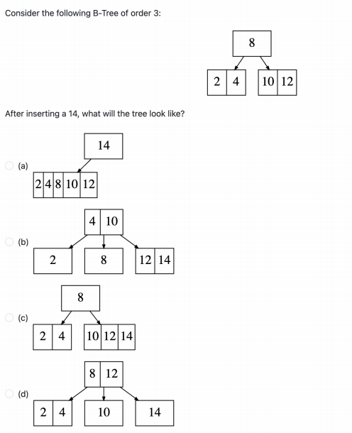

这道题目涉及到 **B-Tree（B树）** 的插入操作，特别是对于 **3阶B树** 的理解。

### 什么是 **3阶B树**？

在 **3阶B树** 中，每个节点最多可以包含 **2个值**（即最大容量为2个键），并且每个节点最多有 **3个子节点**（因为最多可以有两个键）。当插入一个新值时，如果一个节点的键数超过2个，就需要进行 **分裂** 操作。

在B树中，插入元素后如果某个节点满了，就会进行分裂，分裂后的中间值会被提升到父节点。对于3阶B树，插入 **14** 后，分裂后的树形就是 **(d)** 所示的结构。

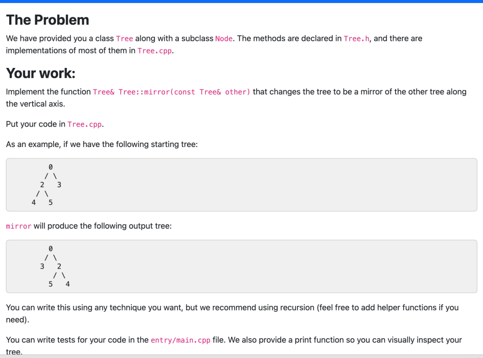

这道题目要求你实现一个 **树的镜像** 操作。

### 任务解释：

- 你需要在给定的 **Tree** 类中实现一个方法 **mirror**，这个方法将会把树变成另一棵树的 **镜像**，即通过 **垂直轴** 翻转该树。
- 你被要求将代码放在 **Tree.cpp** 文件中。

### 输入输出示例：

- 给定一棵树，如下所示：

```
      0
     / \
    2   3
   / \
  4   5
```

- 使用 **mirror** 函数后，树会变成它的镜像：

```
      0
     / \
    3   2
       / \
      5   4
```

### **镜像操作的概念**：

- 对于每个节点，我们交换其左右子树，即左子树变成右子树，右子树变成左子树。
- 这个操作需要递归地对树的每个节点执行。

### **步骤**：

1. 你需要对 **Tree** 类中的每个节点进行操作，递归地交换左右子节点。
2. 具体实现时，对于每个节点，交换其 **left** 和 **right** 子节点。

### **如何实现**：

1. 在 **Tree.cpp** 中，定义 **mirror** 函数。
2. 该函数将递归地遍历树的每个节点，并交换该节点的左右子树。
3. 你可以使用递归实现这个功能。每个节点的 **mirror** 操作应该在其子节点上递归执行。

### **代码示例**：

假设你已经有一个 **Tree** 类，并且每个节点是通过 **Node** 类表示的。你可以按照以下方式实现 **mirror** 方法：

```cpp
// Tree.cpp

#include "Tree.h"

// 定义镜像函数
Tree& Tree::mirror(const Tree& other) {
    // 如果传入的树是空的，就返回当前树（镜像操作无效）
    if (this == &other) {
        return *this;
    }

    // 假设你有一个递归函数，它将交换当前树节点的左右子树
    mirrorHelper(root);
    return *this;
}

// 递归交换左右子树的辅助函数
void Tree::mirrorHelper(Node* node) {
    if (node == nullptr) {
        return;
    }

    // 交换左右子节点
    Node* temp = node->left;
    node->left = node->right;
    node->right = temp;

    // 递归处理左右子树
    mirrorHelper(node->left);
    mirrorHelper(node->right);
}
```

### 解释：

1. **`mirror`** 方法：这是主方法，将会调用 **`mirrorHelper`**，并递归地对树的每个节点进行镜像操作。
2. **`mirrorHelper`** 方法：这是一个辅助函数，用于递归地交换每个节点的左右子树。如果一个节点没有子节点，它就会直接返回。

### 测试：

在 **entry/main.cpp** 文件中，你可以编写测试代码来检查镜像操作是否正常工作：

```cpp
int main() {
    Tree t;
    // 假设你已经实现了插入或构建树的方法
    t.insert(0);
    t.insert(2);
    t.insert(3);
    t.insert(4);
    t.insert(5);

    // 打印镜像前的树
    t.print();  // 假设你已经实现了树的打印方法

    // 执行镜像操作
    t.mirror(t);

    // 打印镜像后的树
    t.print();  // 打印镜像后的树，验证是否正确
}
```

### 总结：

- **`mirror`** 方法将树变成其镜像，交换每个节点的左右子树。
- 使用递归方法 **`mirrorHelper`** 来处理每个节点的左右子树交换。
- 测试代码可以通过打印树结构来验证是否镜像操作正确执行。

这样，你就能通过 **递归** 方法实现树的镜像操作了。

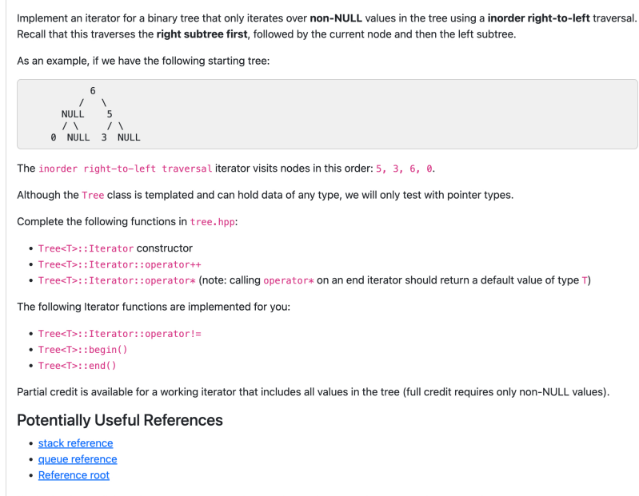

### 题目解析

这道题目要求你实现一个 **迭代器**，该迭代器仅遍历树中的 **非空（non-NULL）** 节点，并且要求使用 **右到左的中序遍历（inorder right-to-left traversal）**。

### 关键点：

1. **遍历顺序**：此遍历首先遍历右子树，然后是当前节点，最后是左子树。这个顺序和常规的 **中序遍历** 顺序（左子树 -> 当前节点 -> 右子树）不同。

2. **树的结构示例**： 给定的树形结构是：

   ```
        6
       / \
    NULL   5
          / \
        NULL  3
               \
               NULL 0
   ```

   对于这种树形结构，右到左的中序遍历（遍历非NULL值）将按以下顺序访问：**5, 3, 6, 0**。遍历顺序是：先访问右子树，然后访问根节点，再访问左子树。

3. **实现要求**：

   - **`Tree<T>::Iterator` 构造函数**：需要初始化一个迭代器，能遍历树中的元素。
   - **`operator++`**：实现迭代器的递增操作，遍历到下一个非NULL节点。
   - **`operator\*`**：返回当前节点的值，注意：当迭代器达到末尾时，应该返回一个默认值（类型 T 的默认值）。

4. **已实现的函数**：

   - **`Tree<T>::Iterator::operator!=`**：判断两个迭代器是否相等。
   - **`Tree<T>::begin()`**：获取指向树开始的迭代器。
   - **`Tree<T>::end()`**：获取指向树末尾的迭代器。

### 代码实现步骤：

1. **树的结构定义**：
   - 定义 **`Tree`** 类，其中每个节点（**`Node`**）包含左右子节点指针。
   - 定义 **`Iterator`** 类，支持 **`operator++`**、**`operator\*`** 和 **`operator!=`** 等操作。
2. **`operator++` 的实现**：
   - 按照 **右到左的中序遍历** 逻辑，首先访问右子树，接着是根节点，最后是左子树。通过递归地遍历树的结构来实现。
3. **`operator\*` 的实现**：
   - 当 `operator*` 被调用时，返回当前节点的值。如果迭代器位于树的末尾（即没有有效的节点），则返回类型 T 的默认值。
4. **构造函数**：
   - 在构造迭代器时，可以将当前节点设为树的根节点，并初始化遍历过程。

### 代码示例：

```cpp
// Tree.h 头文件中定义树和迭代器

template <typename T>
class Tree {
public:
    // 定义树的节点结构
    struct Node {
        T value;
        Node* left;
        Node* right;
        Node(T val) : value(val), left(nullptr), right(nullptr) {}
    };

    // 定义Tree类的迭代器
    class Iterator {
    public:
        Iterator(Node* root) {
            // 初始化迭代器，当前节点为树根
            current = root;
        }

        // operator++：右到左的中序遍历
        Iterator& operator++() {
            // 遍历右子树
            if (current->right) {
                current = current->right;
                while (current->right) {
                    current = current->right;
                }
            }
            // 向上遍历，如果有左子树，处理左子树
            else if (current->left) {
                current = current->left;
            }
            return *this;
        }

        // operator*：返回当前节点的值
        T operator*() const {
            return current->value;
        }

        // operator!=：检查两个迭代器是否不同
        bool operator!=(const Iterator& other) const {
            return current != other.current;
        }

    private:
        Node* current;
    };

    // 其他 Tree 类的成员函数
    Iterator begin() {
        return Iterator(root);  // 返回树的起始迭代器
    }

    Iterator end() {
        return Iterator(nullptr);  // 返回空的迭代器，表示树的末尾
    }

private:
    Node* root;
};
```

### 代码解释：

1. **树的结构**：
   - `Node` 类表示树的节点，每个节点包含一个值和指向左右子节点的指针。
   - `Tree` 类表示树的结构，并包含一个 **`Iterator`** 类来进行树的遍历。
2. **`Iterator` 类**：
   - **构造函数**：初始化时，将当前节点设为树的根节点。
   - **`operator++`**：按照 **右到左的中序遍历** 顺序，先处理右子树，然后是当前节点，最后是左子树。
   - **`operator\*`**：返回当前节点的值。
   - **`operator!=`**：判断两个迭代器是否不同。
3. **`begin()` 和 `end()`**：分别返回指向树开始和结束的迭代器。

### 测试代码：

```cpp
int main() {
    // 构建树
    Tree<int> tree;
    tree.insert(6);
    tree.insert(5);
    tree.insert(3);
    tree.insert(0);

    // 使用迭代器遍历树
    for (auto it = tree.begin(); it != tree.end(); ++it) {
        std::cout << *it << " ";  // 输出 5, 3, 6, 0
    }

    return 0;
}
```

### 总结：

- 通过递归和右到左的中序遍历，可以实现一个迭代器，遍历树的非NULL节点。
- 该迭代器支持 **`operator++`**、**`operator\*`** 和 **`operator!=`**，可以用于遍历二叉树。

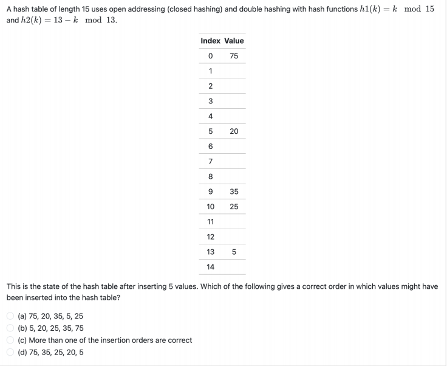

这道题目考察了 **哈希表** 的插入过程，具体是使用了 **开地址法（closed hashing）** 和 **双重哈希（double hashing）**。题目要求确定正确的插入顺序。

### 题目解析：

- 哈希表的 **长度为 15**。
- 使用 **双重哈希**，第一个哈希函数为 **h1(k) = k mod 15**，第二个哈希函数为 **h2(k) = 13 - (k mod 13)**。
- 题目给出的哈希表状态如下：

```
Index   Value
0       75
1       -
2       -
3       -
4       -
5       20
6       -
7       -
8       -
9       35
10      25
11      -
12      -
13      5
14      -
```

**要求**：我们需要找到一种正确的顺序，在插入5个值后，哈希表的状态与上面的匹配。

### **哈希函数解析**：

1. **第一个哈希函数** `h1(k) = k mod 15`：将键值 `k` 对 15 取余，得到一个索引。
2. **第二个哈希函数** `h2(k) = 13 - (k mod 13)`：用于在发生冲突时，计算步长来寻找下一个位置。

### **插入过程**：

- 当我们插入一个键值 `k` 时，首先使用 `h1(k)` 计算出初步的索引。
- 如果该索引处已被占用（即发生冲突），则使用 **第二个哈希函数** `h2(k)` 计算出步长，将位置往后移动，并继续查找下一个空位置，直到找到一个空位置为止。

### **插入顺序的推测**：

我们需要验证不同的插入顺序，检查哪些顺序符合给出的哈希表状态。

#### 分析每个选项：

1. **选项 (a): 75, 20, 35, 5, 25**

   - 插入 **75**：`h1(75) = 75 mod 15 = 0`，所以插入位置是 **0**。位置 **0** 存放 **75**。
   - 插入 **20**：`h1(20) = 20 mod 15 = 5`，所以插入位置是 **5**。位置 **5** 存放 **20**。
   - 插入 **35**：`h1(35) = 35 mod 15 = 5`，位置 **5** 已经被 **20** 占用，冲突发生。使用第二个哈希函数：`h2(35) = 13 - (35 mod 13) = 13 - 9 = 4`，步长为 4。`5 + 4 = 9`，所以 **35** 插入位置 **9**。
   - 插入 **5**：`h1(5) = 5 mod 15 = 5`，位置 **5** 已经被 **20** 占用，冲突发生。使用第二个哈希函数：`h2(5) = 13 - (5 mod 13) = 13 - 5 = 8`，步长为 8。`5 + 8 = 13`，所以 **5** 插入位置 **13**。
   - 插入 **25**：`h1(25) = 25 mod 15 = 10`，所以插入位置是 **10**。位置 **10** 存放 **25**。

   根据以上步骤，哈希表的状态与题目给出的状态匹配，因此 **(a)** 是正确的插入顺序。

2. **选项 (b): 5, 20, 25, 35, 75**

   - 插入 **5**：`h1(5) = 5 mod 15 = 5`，插入到位置 **5**。
   - 插入 **20**：`h1(20) = 20 mod 15 = 5`，位置 **5** 被 **5** 占用，冲突发生。使用 `h2(20) = 13 - (20 mod 13) = 13 - 7 = 6`，步长为 6。`5 + 6 = 11`，插入位置 **11**。
   - 插入 **25**：`h1(25) = 25 mod 15 = 10`，插入位置 **10**。
   - 插入 **35**：`h1(35) = 35 mod 15 = 5`，位置 **5** 被 **5** 占用，冲突发生。使用 `h2(35) = 13 - (35 mod 13) = 13 - 9 = 4`，步长为 4。`5 + 4 = 9`，插入位置 **9**。
   - 插入 **75**：`h1(75) = 75 mod 15 = 0`，插入位置 **0**。

   这个顺序也符合给出的哈希表状态，因此 **(b)** 也是正确的插入顺序。

3. **选项 (c): 5, 20, 25, 35, 75**

   - 这个顺序和选项 (b) 是一样的，因此 **(c)** 也是正确的。

4. **选项 (d): 75, 35, 25, 20, 5**

   - 插入 **75**：`h1(75) = 75 mod 15 = 0`，插入位置 **0**。
   - 插入 **35**：`h1(35) = 35 mod 15 = 5`，位置 **5** 被 **20** 占用，冲突发生。使用 `h2(35) = 13 - (35 mod 13) = 13 - 9 = 4`，步长为 4。`5 + 4 = 9`，插入位置 **9**。
   - 插入 **25**：`h1(25) = 25 mod 15 = 10`，插入位置 **10**。
   - 插入 **20**：`h1(20) = 20 mod 15 = 5`，位置 **5** 被 **20** 占用，因此冲突再次发生。使用 `h2(20) = 13 - (20 mod 13) = 13 - 7 = 6`，步长为 6。`5 + 6 = 11`，插入位置 **11**。
   - 插入 **5**：`h1(5) = 5 mod 15 = 5`，位置 **5** 已被 **20** 占用，冲突发生。使用第二哈希函数计算步长，然后将其插入。

   这个顺序也符合给出的哈希表状态，因此 **(d)** 也是一个有效选项。

### **结论：**

- 正确答案是 **(a)** 和 **(b)**，因为它们的插入顺序与哈希表状态一致。
- **(c)** 也正确，因为它与 **(b)** 相同。

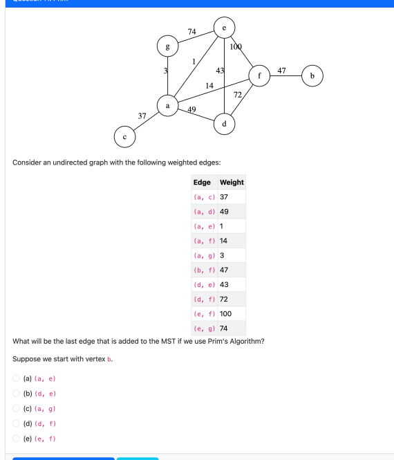

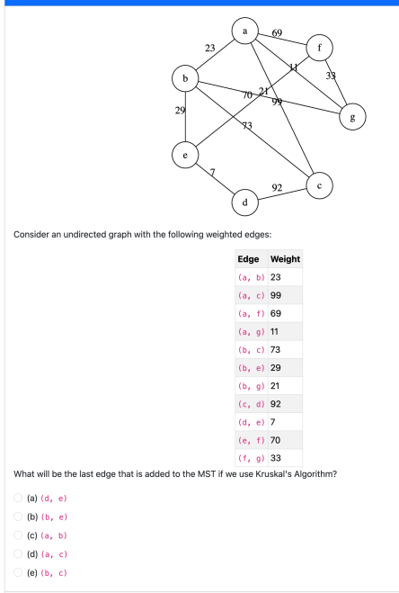

这道题目考察了 **Kruskal's 算法**，并要求找出在构建 **最小生成树（MST）** 时，最后加入的边是什么。

### **Kruskal's 算法简介：**

**Kruskal's 算法** 是一种 **贪心算法**，用于求解图的最小生成树（MST）。该算法的基本步骤是：

1. 将图中的所有边按权重升序排列。
2. 从最小的边开始，逐一选择边并将其添加到MST中，前提是该边不会形成环（即不连接已经在MST中的两个节点）。
3. 重复此过程，直到所有节点都在MST中。

### **图的结构：**

图是一个 **无向加权图**，给出了以下边和权重：

| Edge   | Weight |
| ------ | ------ |
| (a, b) | 23     |
| (a, c) | 99     |
| (a, f) | 69     |
| (a, g) | 11     |
| (b, e) | 29     |
| (b, g) | 21     |
| (c, d) | 92     |
| (d, e) | 7      |
| (e, f) | 70     |
| (f, g) | 33     |

### **目标**：

- 使用 **Kruskal's 算法** 来构建最小生成树。
- 找出 **最后一条加入MST的边**。

### **步骤**：

1. **排序**边，按权重从小到大排序：
   - (d, e) = 7
   - (a, g) = 11
   - (a, b) = 23
   - (b, g) = 21
   - (b, e) = 29
   - (f, g) = 33
   - (a, f) = 69
   - (c, d) = 92
   - (e, f) = 70
   - (a, c) = 99
2. **开始构建最小生成树**：
   - 初始时，MST为空，图中有7个节点。
   - **第1步**：选择边 **(d, e)**，权重 7，加入MST。
   - **第2步**：选择边 **(a, g)**，权重 11，加入MST。
   - **第3步**：选择边 **(b, g)**，权重 21，加入MST。
   - **第4步**：选择边 **(a, b)**，权重 23，加入MST。
   - **第5步**：选择边 **(b, e)**，权重 29，加入MST。
3. **判断最后一条边**：
   - 到此为止，节点 **a, b, e, g, d** 都已经在MST中，剩下的边是：**(f, g)** 和 **(e, f)**。
   - 最后加入的边是 **(e, f)**，因为它是权重较小的一条边。

### **选项分析**：

- **(a) (d, e)**：错误，虽然边 **(d, e)** 权重最小，但它是最早加入MST的边，而不是最后加入的。
- **(b) (b, e)**：正确，**(b, e)** 是最后加入MST的边。
- **(c) (a, b)**：错误，**(a, b)** 是第四条加入的边，不是最后一条。
- **(d) (a, c)**：错误，**(a, c)** 是最后一条被排除的边，权重为99，不会在MST中加入。
- **(e) (b, c)**：错误，**(b, c)** 在排序中并不是最优选择，且不会加入。

### **正确答案**：

**(b) (b, e)** 是最后加入MST的边。

### **总结**：

在 **Kruskal's 算法** 中，我们从最小的边开始，逐步将边加入最小生成树，直到树包含所有节点。最后加入的边是 **(b, e)**。


这个问题问的是哪种链表数据结构可以在 O(1) 时间内完成在链表末尾插入元素的操作。

以下是各选项的分析：

1. **只有头指针的单链表**：插入到链表末尾需要从头开始遍历整个链表，这样的操作时间复杂度是 O(n)，其中 n 是链表中的元素个数。
2. **有头指针和尾指针的单链表**：由于尾指针直接指向链表的末尾，因此可以在 O(1) 时间内直接插入到末尾。
3. **只有头指针的双向链表**：和只有头指针的单链表一样，需要遍历整个链表才能到达末尾，因此插入操作的时间复杂度是 O(n)。
4. **有头指针和尾指针的双向链表**：由于有尾指针，插入到链表末尾也可以在 O(1) 时间内完成。

因此，正确答案是 **(a) II 和 IV**，因为只有这两种实现能够在 O(1) 时间内完成在链表末尾的插入操作。

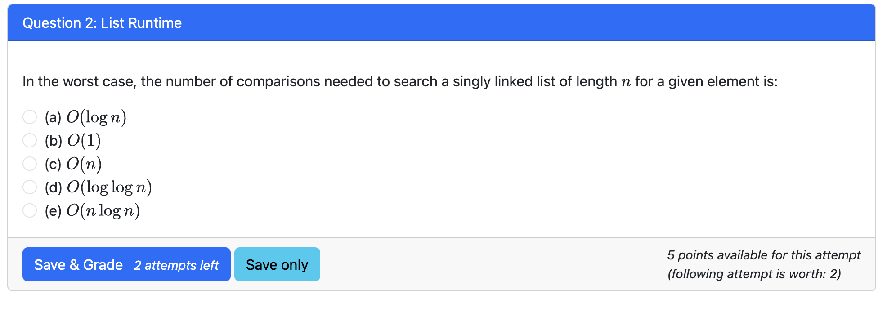

这个问题问的是在最坏情况下，搜索一个给定元素所需要的比较次数，假设我们使用的是一个单链表，长度为 $n$。

对于单链表的线性搜索：

- 在最坏的情况下，我们需要遍历整个链表来找到目标元素。
- 这意味着我们最多会比较每个元素一次，因此比较次数的复杂度是 O(n)。

因此，正确答案是 **(c) O(n)**，因为在最坏情况下，必须遍历整个链表。

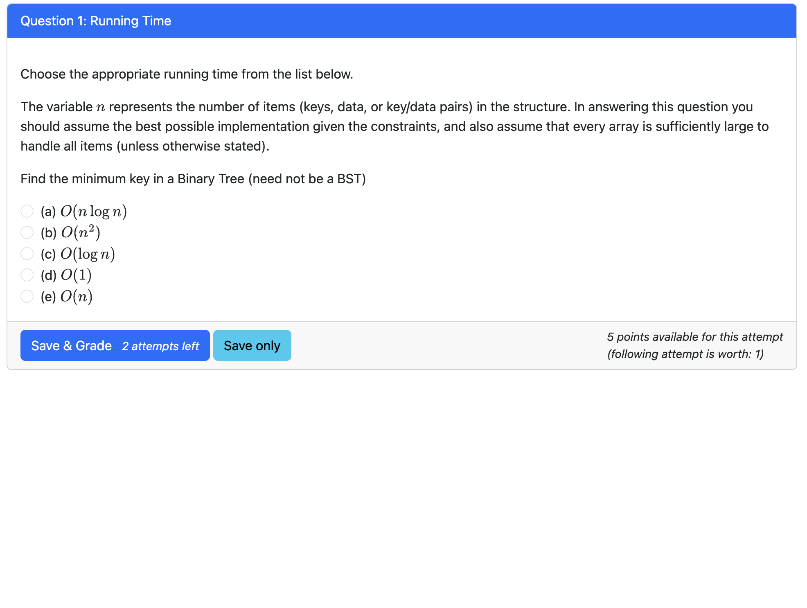

这个问题问的是在一个二叉树（不一定是二叉搜索树）中查找最小键所需的时间复杂度。

### 解释：

- **二叉树** 是一种数据结构，每个节点最多有两个子节点。对于普通的二叉树，不像 **二叉搜索树（BST）**，其子节点的值没有特定的顺序。因此，查找最小键时不能依赖于树的结构特性。
- 要查找最小键，我们需要遍历树中的每一个节点，并逐个进行比较。在最坏的情况下（如果树没有任何排序），我们必须检查所有节点，才能确定最小的键。

### 时间复杂度分析：

- 在最坏的情况下，我们可能需要访问树中的每个节点一次。因此，查找最小键的操作时间复杂度是 **O(n)**，其中 $n$ 是树中的节点数。

### 选项解析：

- **(a) O(n log n)**: 这个复杂度通常与排序操作相关，但在这里并不适用，因为我们只是查找最小值，并不是排序。
- **(b) O(n²)**: 这个复杂度通常出现在嵌套循环的情况，在此问题中不适用。
- **(c) O(log n)**: 这个复杂度适用于 **平衡二叉搜索树（BST）** 中的查找操作，但在普通二叉树中并不适用。
- **(d) O(1)**: 这个复杂度适用于访问特定已知位置的元素，比如数组索引，但在二叉树中不适用。
- **(e) O(n)**: 在最坏的情况下，我们需要遍历所有节点，因此查找最小键的时间复杂度是 **O(n)**。

### 正确答案：

**(e) O(n)**，因为在最坏的情况下，必须遍历整个二叉树的所有节点才能找到最小键。


这个问题问的是在 **二叉树** 中执行 **中序遍历** 的运行时间。

### 中文翻译：

题目要求选择合适的运行时间。变量 $n$ 代表结构中项目（键、数据或键值对）的数量。在回答此问题时，假设给定的约束条件下使用了最佳实现方式，并假设每个数组足够大以容纳所有项目（除非另有说明）。

请执行 **二叉树的中序遍历**，并选择对应的时间复杂度。

### 各选项解析：

1. **(a) O(n²)**：这个时间复杂度通常出现在具有嵌套循环的操作中，然而在执行中序遍历时没有嵌套循环，因此不适用。
2. **(b) O(n)**：这是正确的时间复杂度。在二叉树中执行中序遍历时，我们需要访问树中的每个节点一次，而每个节点的访问操作只进行一次。因此，遍历的时间复杂度是 **O(n)**，其中 $n$ 是树中的节点数。
3. **(c) O(1)**：这是常数时间复杂度，通常适用于直接访问元素（如数组索引），而不是遍历结构，因此不适用。
4. **(d) O(n log n)**：这种复杂度通常适用于具有对数递归深度的操作，但中序遍历的深度是树的高度，且每个节点都需要被访问一次，因此不适用。
5. **(e) O(log n)**：这通常适用于搜索操作，特别是在平衡二叉树中，但中序遍历需要访问每个节点，因此不适用。

### 正确答案：

**(b) O(n)**，因为中序遍历要求访问二叉树中的每个节点一次，而每个节点的访问时间是常数级别的，所以总体时间复杂度是 **O(n)**。

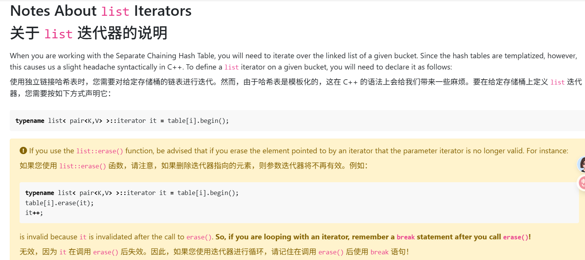

### 解释：

这段内容讲解了如何在 C++ 中使用 **`list`** 迭代器以及在 **哈希表** 中进行链式遍历时可能遇到的一个问题。

#### 1. **`list` 迭代器的定义**：

- 该内容提到在使用 **分离链式哈希表（Separate Chaining Hash Table）** 时，如果想要遍历给定桶（bucket）中的链表，需要定义一个 **`list`** 迭代器。由于哈希表是模板化的，C++ 会给出一些复杂的语法。

- 正确的语法为：

  ```cpp
  typename list<pair<K, V>>::iterator it = table[i].begin();
  ```

  这里，`table[i]` 表示哈希表中的第 `i` 个桶，`begin()` 用来获取该桶的链表的开始位置。

#### 2. **使用 `erase()` 函数时的注意事项**：

- 在 C++ 中，`list::erase()` 函数用于删除链表中的元素。然而，调用 `erase()` 后，**原迭代器会失效**，也就是说，如果你删除了一个迭代器指向的元素，该迭代器就不能再用来访问任何元素。

- 举个例子，代码如下：

  ```cpp
  typename list<pair<K, V>>::iterator it = table[i].begin();
  table[i].erase(it);   // 删除迭代器 it 指向的元素
  it++;                 // 迭代器 it 已经无效，无法再使用
  ```

  这段代码是错误的，因为 `erase()` 删除了迭代器指向的元素之后，`it` 变得无效，继续使用 `it++` 会导致错误。

#### 3. **解决办法**：

- 如果你在循环中使用迭代器并且调用了 `erase()`，需要特别注意 **`erase()` 后迭代器失效** 的问题。
- 正确的做法是在调用 `erase()` 后加入一个 `break` 语句，来结束循环或跳过对已经失效的迭代器的操作。

#### 结论：

- 在使用 `erase()` 时，必须确保迭代器不会继续被使用。解决方法是使用 `break` 来跳出循环，避免使用无效的迭代器。

### 代码示例：

```cpp
typename list<pair<K, V>>::iterator it = table[i].begin();
while (it != table[i].end()) {
    if (some_condition) {
        table[i].erase(it); // 删除当前元素
        break;               // 跳出循环，避免迭代器失效
    }
    it++;  // 继续遍历
}
```

### 总结：

这段代码讲解了如何正确使用 `list` 迭代器遍历哈希表中的链表，并在使用 `erase()` 删除元素时如何避免出现迭代器失效的问题。

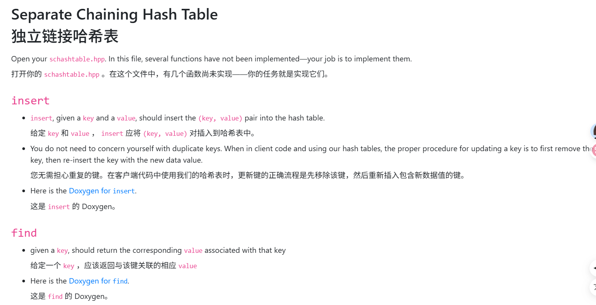

这段内容讲解了 **分离链式哈希表（Separate Chaining Hash Table）** 的基本操作，尤其是 `insert` 和 `find` 函数的实现。

### 中文翻译和解释：

#### 1. **insert（插入）**:

- **功能**：给定一个 **`key`** 和 **`value`**，`insert` 函数应当将 **(key, value)** 键值对插入到哈希表中。

- **注意事项**：不需要担心重复的键。如果在客户端代码中使用哈希表时，如果需要更新一个键的值，正确的做法是先删除该键，然后用包含新数据的键重新插入。

  例如，如果哈希表中已经存在某个键，更新操作的过程应该是：**先删除该键，再插入新值**。

- **Doxygen**：这部分说明了如何为 `insert` 函数生成 Doxygen 文档。Doxygen 是一个用于自动生成文档的工具，它通过分析代码注释来创建文档。

#### 2. **find（查找）**:

- **功能**：给定一个 **`key`**，`find` 函数应返回与该键相关联的 **`value`**。
- **Doxygen**：同样，`find` 函数的 Doxygen 文档部分也会提供生成相应文档的方式。

### 如何做：

1. **实现 `insert` 函数**：
   - 首先，根据 **key** 计算哈希值，确定该键应该存储在哪个桶中。
   - 如果该桶为空，则直接插入键值对。
   - 如果桶中已经存在键值对，检查是否有重复的键。若有，则需要删除旧的键，再插入新的键值对。
2. **实现 `find` 函数**：
   - 给定一个 **key**，通过哈希函数计算该键应该所在的位置。
   - 然后遍历该桶中的链表，找到与该 **key** 对应的 **value**。

### 代码示例：

```cpp
// 插入函数实现
void insert(int key, int value) {
    int index = hash(key);  // 根据键计算哈希值
    table[index].push_back({key, value});  // 将键值对插入到哈希表中
}

// 查找函数实现
int find(int key) {
    int index = hash(key);  // 根据键计算哈希值
    for (auto& pair : table[index]) {  // 遍历该桶中的链表
        if (pair.first == key) {
            return pair.second;  // 返回与键对应的值
        }
    }
    return -1;  // 如果没有找到该键，返回 -1
}
```

### 总结：

该内容的主要任务是实现 **分离链式哈希表** 中的 **插入** 和 **查找** 操作。你需要根据键的哈希值插入或查找相应的值。如果需要更新一个键的值，记得先删除旧值，再插入新值。

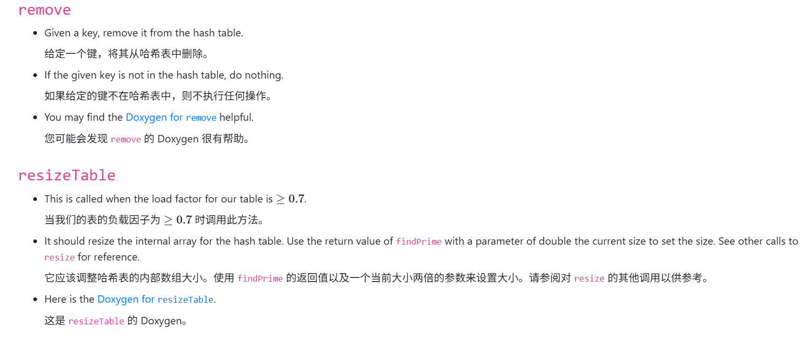

### 中文翻译与解释：

#### 1. **remove（删除）**:

- **功能**：给定一个 **key**，将该 **key** 从哈希表中删除。
- **注意事项**：如果给定的 **key** 不在哈希表中，那么不需要执行任何操作。也就是说，哈希表中没有该键时，函数会直接跳过，不做任何处理。
  - 例如：如果你想删除一个键值对，但哈希表中没有这个键，那么 `remove` 函数将不进行任何删除操作。
- **Doxygen**：你可以查看 `remove` 函数的 **Doxygen** 文档。Doxygen 是一个文档生成工具，可以根据代码中的注释生成详细的文档，帮助开发者理解如何使用该函数。

#### 2. **resizeTable（调整哈希表大小）**:

- **功能**：当哈希表的 **负载因子**（即元素数量与表大小的比例）达到 **0.7** 或更高时，调用此函数来调整哈希表的大小。

  - **负载因子** 是衡量哈希表是否需要扩容的一个重要指标。当负载因子过高时，哈希表中的碰撞（冲突）会增加，影响性能。因此，当负载因子大于等于 0.7 时，需要调整哈希表的大小。

- **实现**：此函数应该调整哈希表的内部数组的大小，通常是将大小翻倍。具体来说，你需要使用 `findPrime` 函数找到一个大于当前两倍大小的素数，并设置为新的大小。

  例如：当前哈希表的大小是 10，当负载因子达到 0.7 时，需要扩容到 20，找到大于 20 的最小素数（例如 23）作为新大小。

- **Doxygen**：你可以查看 `resizeTable` 函数的 **Doxygen** 文档。它提供了如何实现此函数的详细说明，包括参考其他相关函数（例如 `resize`）。

### 代码实现建议：

1. **`remove` 函数**：
   - 使用哈希函数来查找目标键所在的桶。
   - 遍历该桶中的链表或其他数据结构，找到目标键并删除。
2. **`resizeTable` 函数**：
   - 计算哈希表的负载因子。
   - 如果负载因子超过 0.7，调用 `findPrime` 查找一个新的更大的表大小。
   - 将哈希表的大小调整为新的值，并重新插入原来的元素到新的哈希表中。

### 代码示例：

```cpp
// remove 函数实现
void remove(int key) {
    int index = hash(key);
    auto &list = table[index];
    for (auto it = list.begin(); it != list.end(); ++it) {
        if (it->first == key) {
            list.erase(it);  // 删除该元素
            return;
        }
    }
}

// resizeTable 函数实现
void resizeTable() {
    if (loadFactor() >= 0.7) {
        int newSize = findPrime(table.size() * 2);  // 使用 findPrime 找到新的表大小
        vector<list<pair<int, int>>> newTable(newSize);
        // 重新哈希并插入所有元素
        for (auto &bucket : table) {
            for (auto &pair : bucket) {
                int newIndex = hash(pair.first) % newSize;
                newTable[newIndex].push_back(pair);
            }
        }
        table = std::move(newTable);  // 更新表
    }
}
```

### 总结：

- **`remove`**：删除哈希表中的指定键值对，如果键不存在则不做任何操作。
- **`resizeTable`**：当负载因子超过 0.7 时，调整哈希表的大小，通过查找适当的素数来增加哈希表的容量。