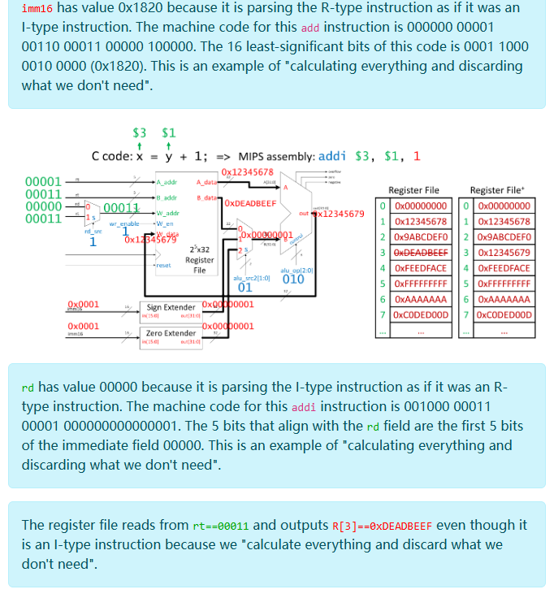
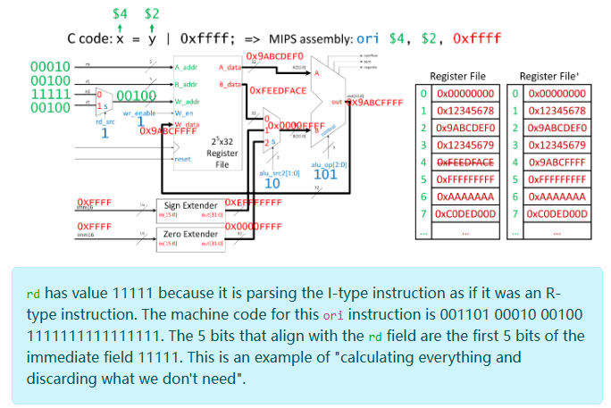
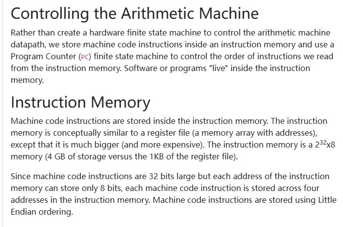
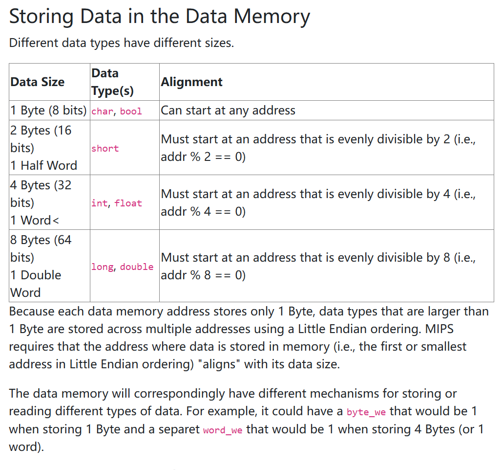

202412250001

后台姓名：刘澈
用户ID：121048
用户1V1昵称：刘澈
学生需求类型：知识点辅导,考前辅导
学生基础：一般
期望上课时间：尽快，具体可商议
学生DUE时间：暂时无
用户类型：1v1老用户
院校：UIUC
年级：大二
专业：未定
科目代码：cs233
科目名称：Computer Architecture
备注：需要讲的内容是下面的


这段文字描述的是如何将计算机组成原理中的基本组件（逻辑门、二进制代码、算术逻辑单元（ALU）、有限状态机（FSM）和寄存器文件）整合起来构建一个可编程的计算机架构。重点介绍了 MIPS 指令集架构（ISA），这是一种与现代计算架构（如 ARM 和 RISC-V）共享核心设计哲学的体系结构。MIPS 的学习对理解和使用其他指令集架构非常有帮助，因为MIPS用于多种消费电子产品和超级计算机中。

1. **寄存器文件**：存储数据的位置，使用地址标识数据所在的具体位置。
2. **算术逻辑单元（ALU）**：根据接收到的控制位操作状态数据。通过结合寄存器文件和ALU，可以创建一个灵活的可编程数据路径，称为算术机。
3. **算术机的操作**：能够执行算术运算和位逻辑运算，例如加法、OR运算等。操作数从寄存器文件中读取，结果写回寄存器。
4. **程序和指令**：算术机的程序由一系列指令组成，这些指令可以编写成汇编代码，然后转换成机器码二进制数据。机器码存储在指令内存中，这是一个理论上可以存储数十亿字节的大存储空间。
5. **指令解码**：当前指令存储在指令内存中，可以通过 MIPS 指令解码器将这些指令解码成二进制控制位。

这段文字还提供了一些选读材料，包括《Mano & Kime》和《Patterson & Hennessy》的相关章节，这些都是计算机组成和设计的经典教材。

总的来说，这段文字提供了构建可编程计算机架构的概览，特别强调了MIPS指令集的学习和应用的重要性。


这张图说明了MIPS（一种指令集架构，或ISA）算术逻辑单元（ALU）的实现。在计算机架构中，ISA定义了一个处理器可以执行的操作，确保了不同处理器之间的二进制兼容性。简单来说，同一ISA族的任何处理器都能运行为该ISA编译的程序。

图中主要分为两部分内容：

1. **指令集架构的说明**：
   - ISA定义了处理器可以执行的操作（指令），确保编译的代码在任何该ISA的处理器上都能以相同的机器码运行。
   - 例如，编译为x86 ISA的程序应能在任何采用x86架构的Intel或AMD处理器上正确运行。
2. **MIPS ALU的实现细节**：
   - MIPS ISA要求实现必须能进行32位的算术和位操作（如加法、减法、AND、OR、XOR等）。
   - 图中展示了一个具体的ALU实现，说明了如何通过控制信号来选择不同的操作。
   - ALU接受两个32位的输入A和B，并根据控制信号（3位二进制代码）产生一个32位的输出。
   - 控制代码和相应操作的映射如下：
     - `000` 和 `001`：未定义（可能用于其他操作或保留）
     - `010`：输出A+B的结果（加法）
     - `011`：输出A-B的结果（减法）
     - `100`：输出A AND B的结果（与运算）
     - `101`：输出A OR B的结果（或运算）
     - `110`：输出A NOR B的结果（或非运算）
     - `111`：输出A XOR B的结果（异或运算）

这种ALU的设计允许通过改变控制信号来灵活地执行多种基础算术和逻辑操作，是构建灵活可编程处理器的关键部分。


这张图和附带的文字描述了MIPS指令集架构中寄存器文件的特性和功能。寄存器文件是处理器中用于快速存取数据的一组寄存器。下面是详细解释：

### 寄存器文件的特点：

1. **寄存器数量和类型**：
   - 该寄存器文件包含32个寄存器，每个寄存器存储32位数据。
   - 有两个读端口（用于读取数据）和一个写端口（用于写入数据）。
2. **端口说明**：
   - `A_addr` 和 `B_addr` 是两个读取地址输入，用于从寄存器文件中选择要读取的寄存器。
   - `A_data` 和 `B_data` 是两个输出，显示从选定的 `A_addr` 和 `B_addr` 寄存器中读取的数据。
   - `W_addr` 是写入地址输入，指定要写入数据的寄存器。
   - `W_data` 是要写入到 `W_addr` 指定寄存器的数据。
   - `W_en` 是一个写使能信号，当为高电平（true）时允许数据写入到 `W_addr` 指定的寄存器。
3. **地址和数据格式**：
   - 寄存器通过5位无符号二进制数进行寻址，因此可以寻址 2^5 = 32 个寄存器。
   - 每个寄存器可以存储32位数据。
4. **特殊寄存器**：
   - 寄存器文件中的 `R[0]` 总是0，对它的写操作会被忽略。这是 MIPS 架构的一个特性，即零寄存器始终为0。
5. **寄存器的语法表示**：
   - MIPS 中通常用 `$` 符号加数字来表示寄存器，如 `$4` 表示寄存器4，`$31` 表示寄存器31。
   - 在编程或汇编语言中，寄存器的数据可以通过类似 `R[9]` 或 `R[31]` 的表示方法进行访问或修改。

### 功能和用途：

- 寄存器文件使得CPU能快速访问存储的数据，对于实现高效的计算和数据处理非常关键。
- 读写操作的设计允许同时进行多个数据的读取和单个数据的写入，提高了执行指令的速率和效率。

总体来看，寄存器文件是MIPS架构中用于存储和快速访问数据的关键组件，它的设计直接影响到处理器的性能和处理速度。


这张图及其描述展示了 MIPS 处理器的核心部分——算术机，这是通过结合寄存器文件和算术逻辑单元（ALU）来构建的。算术机每个时钟周期执行一个算术或逻辑操作。以下是其工作流程和组成的详细解释：

### 组件和功能：

1. **寄存器文件**：
   - 有32个寄存器，每个寄存器存储32位数据。
   - 提供两个读端口和一个写端口，用于数据的读取和写入。
2. **ALU**：
   - 执行实际的算术和逻辑操作。
   - 接收来自寄存器文件的数据，进行处理，并将结果输出。

### 输入和输出信号：

- **rs (A_addr)**: 指示从哪个寄存器（寄存器文件中的地址）读取数据到 ALU 的输入A。
- **rt (B_addr)**: 指示从哪个寄存器读取数据到 ALU 的输入B。
- **rd (W_addr)**: 指示将数据写回到哪个寄存器的地址。
- **W_en (写使能)**: 控制信号，决定是否将ALU的输出写回寄存器文件中指定的寄存器。
- **alu_op[2:0]**: ALU 操作码，控制 ALU 执行哪种类型的操作（例如加法、减法、AND操作等）。
- **clk (时钟)**: 控制寄存器文件和 ALU 的操作时序。
- **reset**: 重置信号，用于初始化或重置寄存器文件。

### 工作流程：

1. **读取阶段**：
   - 根据输入信号 `rs` 和 `rt`，从寄存器文件的相应地址读取数据到 ALU 的输入A和B。
2. **执行阶段**：
   - ALU 根据 `alu_op` 信号执行指定的算术或逻辑操作。
3. **写回阶段**：
   - 如果写使能 `W_en` 被激活（设为高电平），则 ALU 的输出会在下一个正向时钟沿写回到由 `rd` 指定的寄存器地址。

### 总结：

这种设计使 MIPS 处理器能够高效地执行各种基本的算术和逻辑操作，其操作的快速和可靠依赖于寄存器文件和 ALU 的紧密集成。每个操作基本上在一个时钟周期内完成，从读取数据到执行运算再到写回结果，确保了处理器性能的最大化。


这段文字和图表介绍了 MIPS 架构中机器代码的基本结构和解析方式。MIPS 是一种 32 位的系统，其中每条机器指令都由 32 位组成，这些指令用于执行基本的算术或逻辑操作。以下是 MIPS 指令格式的详细解释：

### 基本组成：

- **机器指令**：每条指令都是 32 位长，设计用于完成一项基本操作，如加法或位运算（如 OR）。

### 指令类型：

MIPS 指令可以根据功能被分解为三种主要类型：

1. **R-type (寄存器类型)**：用于大多数算术和逻辑操作。
2. **I-type (立即数类型)**：通常用于需要立即数（如常数或偏移量）的操作。
3. **J-type (跳转类型)**：用于跳转和分支指令。

### 指令字段：

- **opcode (操作码)**：6 位，定义指令的操作类型，如加法或 OR。
- **rs (源寄存器)**：5 位，指定从寄存器文件中读取第一个操作数的寄存器。
- **rt (目标寄存器或立即数用途的寄存器)**：5 位，根据指令类型，可以指定第二个操作数的寄存器或用于其他目的（如立即数操作）。
- **rd (目的寄存器)**：5 位，指定将操作结果写入哪个寄存器。
- **shamt (移位量)**：5 位，用于移位操作指定位移的数量。
- **funct (功能码)**：6 位，与 opcode 结合用来确定具体的操作（如加法或减法）。
- **immediate (立即数)**：16 位，用于直接提供一个数值或地址，不需通过寄存器间接访问。

### 指令解析：

- 对于 R-type 指令，使用 `opcode`, `rs`, `rt`, `rd`, `shamt`, `funct` 字段。
- 对于 I-type 指令，使用 `opcode`, `rs`, `rt`, `immediate` 字段。
- 对于 J-type 指令，通常使用 `opcode` 和一个 26 位的地址字段。

### 示例：

文中给出了两个示例：

- 一个加法操作（add）的 R-type 格式。
- 一个位或操作（bitwise OR）的 I-type 格式。

这些指令示例说明如何将不同类型的 MIPS 指令解析为具体的操作和操作数。通过这种方式，MIPS 处理器可以读取和执行编码在机器代码中的指令，以完成各种计算和控制任务。


这段文本描述了 MIPS 汇编代码的基本概念和格式，以及它是如何从机器代码翻译过来的。汇编代码是机器代码的人类可读形式，一行汇编代码大致对应一条32位的机器指令。下面详细解释文本中提到的各个部分：

### 汇编代码与机器代码的对应

- **汇编代码**是将机器代码中的二进制指令转换成更容易理解的形式。例如，一串二进制码`00000001011010010110000000100000`在汇编中表示为`add $5, $11, $12`。这意味着将寄存器11和寄存器12的内容相加，结果存入寄存器5。

### 指令格式

- MIPS 汇编指令通常由一个助记符（如 `add`、`sub`、`ori`）和操作数组成。操作数可以是寄存器（如 `$4`、`$29`）、立即数（如 `29`）或移位量（如 `4`）。
- 寄存器在汇编代码中以`$`符号开头，而常数则不带`$`。

### 指令的执行模式

- 所有 MIPS 指令遵循从内存读取状态，对状态进行某种操作，然后将新状态存回内存的模式。

### 汇编与机器码的翻译

- 汇编代码到机器代码的转换通过查找表进行，这使得开发者无需记住复杂的二进制代码，只需使用更直观的汇编指令即可编程。

### 汇编代码的实用性

- 使用汇编代码能够让程序员更直观地理解和控制硬件执行什么操作，特别是在需要精确控制硬件行为的系统级编程中。

总的来说，这段文本介绍了如何将二进制的机器代码转换为人类可读的汇编代码，并解释了 MIPS 汇编代码的基本结构和执行逻辑。这种转换对于程序员来说是至关重要的，因为它简化了程序设计和故障排除过程。


这段文本和图表描述了 MIPS 架构中 R-type（寄存器类型）指令的格式和功能。这类指令主要用于执行算术或逻辑运算，其详细说明如下：

### R-type 指令格式：

- **op (操作码)**：6位，用来指示指令的大类，对于所有 R-type 指令，这通常指向一组需要进一步解释的运算。
- **rs (源寄存器 1)**：5位，指定第一个操作数的寄存器。
- **rt (源寄存器 2)**：5位，指定第二个操作数的寄存器。
- **rd (目的寄存器)**：5位，指定结果存放的寄存器。
- **shamt (移位量)**：5位，用于移位操作的位数，其他算术或逻辑操作时此字段通常为0。
- **func (功能码)**：6位，用来在同一个操作码下进一步指定具体的算术或逻辑操作。

### 指令功能：

R-type 指令从两个源寄存器（`rs` 和 `rt`）读取数据，执行算术或逻辑操作后，将结果写入目的寄存器（`rd`）。这些指令不直接涉及内存访问，操作完全在寄存器间进行。

### 汇编代码格式：

- 汇编指令格式通常为：助记符 目的寄存器, 源寄存器1, 源寄存器2。例如，`add $rd, $rs, $rt`。
- **add** 和 **or** 是常见的 R-type 指令，分别用于加法和逻辑或操作。

### 示例和操作：

- **Add 指令**：`add $rd, $rs, $rt` 表示将 `rs` 和 `rt` 寄存器的值相加，结果存放在 `rd` 寄存器中。
- **Or 指令**：`or $rd, $rs, $rt` 表示对 `rs` 和 `rt` 寄存器的值进行按位或操作，结果存放在 `rd`。

### Verilog 实现：

- 指令在 Verilog（一种硬件描述语言）中可能如何实现，例如加法操作 `R[d] = R[s] + R[t]`，这表明 Verilog 代码将两个源寄存器的值相加，并将结果存储到目的寄存器。

### 转换为机器码：

- 将汇编代码转换为机器码涉及到根据 MIPS 参考指南中的表格解释各字段，例如对于加法，操作码（op）可能是一组值中的默认值，功能码（func）具体指定为加法。

这样的格式和解析方式有助于理解 MIPS 指令集如何有效地在硬件级别描述和执行各种操作，同时保持代码的紧凑和高效。


这段文本详细解释了如何使用 MIPS 架构中 R-type（寄存器类型）指令的 opcode 和 funct code，以及如何将汇编代码中的寄存器编号和 shamt 字段转换为机器码。以下是关键部分的详细解释：

### R-type Opcode/Funct Code 查找

- **Opcode 和 Funct Code**：对于 R-type 指令，大部分的区分是通过 funct code 来实现的，因为多数 R-type 指令的 opcode 是固定的（例如 `0x00`）。
- 文中举例说明了如何解析和使用 funct code。例如，add 指令的 funct code 为 `0x20`（二进制 `100000`），而 or 指令的 funct code 为 `0x25`（二进制 `100101`）。
- 这些 funct codes 是从对应的十六进制代码中提取最低 6 位得到的。

### R-type 寄存器编号转换

- **寄存器编号转换**：在将汇编代码转换为机器码时，需要将寄存器编号从十进制转换为 5 位的二进制形式。
- 注意寄存器在汇编代码（格式为 `$rd, $rs, $rt`）和机器码中的顺序是不同的，这有助于简化电路设计。

### Shamt 字段

- **Shamt 字段用途**：Shamt 用于移位指令，指定要移动的位数。对于非移位指令，此字段通常设置为 `00000`。
- 移位指令例如 `sll`（逻辑左移）和 `sra`（算术右移）使用 shamt 字段来定义移位的具体位数。

### 注意事项

- **寄存器顺序**：在汇编代码中，寄存器顺序通常是目的寄存器在前（`$rd`），而在机器码中，源寄存器（`$rs` 和 `$rt`）在前。这是为了在设计硬件时简化连线和逻辑。

### 结论

这段描述提供了详细的说明，帮助理解如何从汇编级别映射到机器码级别，特别是在处理寄存器操作和特定的位操作（如移位）时。这种知识对于理解和编写底层系统程序，特别是涉及到硬件操作的程序，是非常重要的。


这段文本提供了两个将 MIPS 汇编指令转换为机器码的例子，具体解释如下：

### 1. 示例：将 `add $5, $11, $12` 转换为机器码

- **指令和操作**：`add` 是一个 R-type 指令，用于将两个寄存器的值相加并将结果存储在第三个寄存器中。

- 转换步骤

  ：

  1. **助记符转换**：使用查找表，将 `add` 转换为相应的 opcode (`000000`) 和 funct code (`100000`)。

  2. 寄存器转换

     ：

     - `rs` (`$11`) 转换为二进制 `01011`。
     - `rt` (`$12`) 转换为二进制 `01100`。
     - `rd` (`$5`) 转换为二进制 `00101`。

  3. **shamt 字段**：因为这不是一个移位指令，所以 shamt 字段设置为 `00000`。

  4. **组合字段**：将所有字段组合起来形成完整的机器码：`000000 01011 01100 00101 00000 100000`。

### 2. 示例：将 `or $21, $3, $5` 转换为机器码

- **指令和操作**：`or` 是一个 R-type 指令，用于执行两个寄存器之间的按位或操作，并将结果存储在第三个寄存器中。

- 转换步骤

  ：

  1. **助记符转换**：使用查找表，将 `or` 转换为相应的 opcode (`000000`) 和 funct code (`100101`)。

  2. 寄存器转换

     ：

     - `rs` (`$3`) 转换为二进制 `00011`。
     - `rt` (`$5`) 转换为二进制 `00101`。
     - `rd` (`$21`) 转换为二进制 `10101`。

  3. **shamt 字段**：同样，因为这不是移位指令，所以 shamt 字段设置为 `00000`。

  4. **组合字段**：将所有字段组合起来形成完整的机器码：`000000 00011 00101 10101 00000 100101`。

### 总结

这两个例子说明了如何将汇编代码中的指令、寄存器和操作转换为机器码的各个部分。通过这种方式，汇编代码可以被处理器直接解析和执行，从而实现具体的运算操作。


这段文本和配图详细解释了如何将 C 语言中的算术操作转换成 MIPS 架构下的 R-type 指令，并在 MIPS 处理器的算术逻辑单元（ALU）中的数据路径上展示了这些指令的传播过程。文本和图表展示了从 C 代码到 MIPS 汇编指令，再到机器码的转换，以及这些指令如何在硬件中执行。下面是对其主要内容的详细解释：

### R-type 指令的工作流程

1. **寄存器文件**：寄存器文件存储了 MIPS 处理器中所有寄存器的当前状态。每个寄存器有一个唯一的编号，并且可以存储一个 32 位的数据值。
2. **ALU (算术逻辑单元)**：ALU 根据指令的需求进行算术或逻辑操作。例如，加法或逻辑或运算。
3. **控制信号**：
   - `alu_op`：这是一个用于控制 ALU 操作的信号，决定 ALU 执行哪种运算（如加法、或运算等）。
   - `w_enable`：这是一个写使能信号，当设置为 1 时，允许数据写回寄存器文件。

### 指令转换示例

1. **示例 1**：C 代码 `x = y + z;` 转换为 MIPS 汇编 `add $s3, $s1, $s6`。
   - `rs = $s1`、`rt = $s6`、`rd = $s3`。
   - 使用 ALU 的加法操作 (`alu_op = 010`) 处理数据，并将结果写入 `$s3`。
2. **示例 2**：C 代码 `a = b + c;` 转换为 MIPS 汇编 `or $s4, $s2, $s7`。
   - `rs = $s2`、`rt = $s7`、`rd = $s4`。
   - 使用 ALU 的或运算 (`alu_op = 101`) 处理数据，并将结果写入 `$s4`。

### 寄存器状态

- **寄存器文件**显示了执行指令前后寄存器的状态变化。左侧表格显示当前状态，右侧表格显示执行指令后的新状态。

### 注意事项

- 寄存器的输出由指定的寄存器地址决定，并且输出的数据与 ALU 的输出相匹配，然后根据写使能信号决定是否更新寄存器的内容。
- 图中还展示了如何在硬件层面连接寄存器文件的输出到 ALU，并将 ALU 的输出反馈到寄存器文件。

这种详细的展示有助于理解 MIPS 指令如何在硬件中执行，特别是对于学习计算机架构和微处理器设计的学生来说，可以清晰地看到数据在处理器内的流动路径。


这张图表和文本描述了 MIPS 处理器中的 I-type 指令格式及其功能。I-type 指令主要用于执行包含立即数的算术或逻辑运算。以下是对 I-type 指令详细解释：

### I-type 指令格式

- **op (操作码)**：6位，定义了指令的类型，例如是否为加法、或运算等。
- **rs (源寄存器)**：5位，指定从哪个寄存器读取第一个操作数。
- **rt (目标寄存器)**：5位，指定将结果写入哪个寄存器。
- **imm (立即数)**：16位，直接提供数值进行计算，可以是正值或负值。这个数值可以是有符号的，用于算术操作，或是无符号的，用于逻辑操作。

### 立即数的处理

- **SignExt**：对于需要考虑符号的立即数（如算术操作），使用符号扩展。
- **ZeroExt**：对于不考虑符号的操作（如逻辑操作），使用零扩展。

### 指令示例

- **addi $rt, $rs, imm**：这条指令将源寄存器 `$rs` 中的值与立即数 `imm` 相加，结果存储在目标寄存器 `$rt`。
- **ori $rt, $rs, imm**：这条指令执行源寄存器 `$rs` 和立即数 `imm` 的按位或操作，结果存储在目标寄存器 `$rt`。

### 操作码和功能码

- 不同的 I-type 指令通过操作码和可能的功能码来区分。例如，`addi` 和 `ori` 通过不同的操作码来标识。

### 在 Verilog 中的实现

- 在硬件描述语言 Verilog 中，这些操作可以直接使用如 `R[rt] = R[rs] + SignExtImm` 的形式来实现，其中 `SignExtImm` 表示对立即数进行符号扩展。

### 注意事项

- 一些指令可能因为立即数的扩展方式或计算结果导致溢出。

这些信息有助于理解如何在 MIPS 架构中使用立即数进行快速的算术和逻辑运算，特别是在编程或设计微处理器时，需要精确地了解每个指令的数据路径和行为。


这段文本详细解释了如何处理 MIPS 处理器中的 I-type 指令，特别是如何处理立即数字段，如何查找指令的操作码，以及如何将汇编代码中的寄存器编号转换为机器码所需的格式。以下是详细解释：

### 1. 立即数字段的处理

- 立即数字段

  ：在 I-type 指令中，立即数是一个16位的常数，可以用于算术或逻辑运算。

  - **算术指令**：对于算术操作，16位立即数通常以二进制补码形式表示，并需要通过符号扩展（SignExt）转换为32位，以正确处理负数。
  - **逻辑指令**：对于逻辑操作，立即数被视为无符号数，并通过零扩展（ZeroExt）转换为32位，以确保高位填充0。

### 2. I-type 操作码查找

- 操作码（Opcode）

  ：I-type 指令的操作码用于区分不同的操作（如

  ```
  addi
  ```

  ，

  ```
  ori
  ```

  等），这些操作码是预定义且固定的。

  - **查找方式**：操作码通常存储在指令的前6位，指令集文档或指南中会提供具体的操作码表，用于从指令名称找到相应的二进制操作码。

### 3. 寄存器编号转换

- 寄存器编号

  ：在 MIPS 汇编代码中使用的寄存器编号需要转换成机器码中对应的二进制格式。

  - **转换过程**：将汇编指令中的寄存器编号（如 $s1, $s2 等）转换为对应的5位二进制数。这一过程需要确保源寄存器和目标寄存器的编号正确对应到机器码中的相应位置。

### 4. 寄存器顺序

- **顺序注意**：在汇编语言中，目标寄存器通常写在指令的第一位（如 `addi $rt, $rs, imm`），但在机器码中，源寄存器和目标寄存器的顺序可能有所不同，这是为了硬件设计的便利性。

### 5. 注意事项

- **溢出异常**：特别指出，在进行立即数扩展和计算时可能会导致溢出，这在处理器设计中是一个需要考虑的重要安全问题。

这些详细解释有助于理解 MIPS 指令集中 I-type 指令的结构和处理方式，对于学习计算机架构和微处理器编程的人来说尤其重要。


这段文本和图表展示了如何将 MIPS 汇编指令转换为机器码，具体涉及到 I-type 指令的转换。这里提供了两个示例，分别是 `addi` 和 `ori` 指令的转换过程。以下是详细的解释：

### 1. 示例：addi $5, $11, 12

- **指令功能**：这条指令将寄存器 `$11` 的值与立即数 `12` 相加，结果存储在寄存器 `$5`。

- 转换步骤

  ：

  - **操作码**（Opcode）：通过查找表确定，`addi` 的操作码是 `001000`。
  - **寄存器**：源寄存器 `$11`（rs）为 `01011`，目标寄存器 `$5`（rt）为 `00101`。
  - **立即数**：数值 `12` 转换为二进制表示 `0000 0000 0000 1100`。
  - **组合字段**：将以上字段组合为机器码：`001000 01011 00101 0000000000001100`。

### 2. 示例：ori $21, $3, 5

- **指令功能**：这条指令执行寄存器 `$3` 和立即数 `5` 的按位或操作，结果存储在寄存器 `$21`。

- 转换步骤

  ：

  - **操作码**（Opcode）：通过查找表确定，`ori` 的操作码是 `001101`。
  - **寄存器**：源寄存器 `$3`（rs）为 `00011`，目标寄存器 `$21`（rt）为 `10101`。
  - **立即数**：数值 `5` 转换为二进制表示 `0000 0000 0000 0101`。
  - **组合字段**：将以上字段组合为机器码：`001101 00011 10101 0000000000000101`。

### 总结

这两个例子展示了从汇编指令到机器码的详细转换过程，包括如何确定操作码、如何转换寄存器编号以及如何处理立即数。这种转换对于理解汇编语言和底层计算机架构非常重要，帮助开发者更好地掌握硬件与软件之间的交互。


这张图和文本详细解释了在 MIPS 架构中如何通过增加多路选择器、符号扩展器和零扩展器来处理和执行 I-type 指令，使得算术逻辑单元（ALU）可以灵活处理 R-type 和 I-type 指令。下面是对图中描述的关键组件和过程的详细解释：

### I-type 指令的处理

1. **指令解码**：
   - `inst[31:0]` 是一条 32 位的机器指令。该指令被解码以分离出不同的字段：`rs`、`rt`、`rd` 和 `imm16`。
2. **多路选择器的使用**：
   - **寄存器目的地选择器（rd_src）**：这个多路选择器控制写回寄存器的选择，是写回到 `rd` 还是 `rt`。这是为了区分 R-type 指令（通常使用 `rd` 作为目的寄存器）和 I-type 指令（使用 `rt` 作为目的寄存器）。
   - **ALU 源2选择器（alu_src2）**：这个多路选择器用来选择 ALU 的第二个输入是来自寄存器文件（`rs` 的内容）还是立即数。立即数可以是符号扩展后的值或零扩展后的值，这取决于指令的具体需求。
3. **符号扩展器和零扩展器**：
   - 这些组件用于处理 16 位的立即数（imm16），将其转换为 ALU 可以使用的 32 位形式。
   - **符号扩展器**：用于算术指令，它将16位立即数视为有符号数，并据此扩展到32位。
   - **零扩展器**：用于逻辑指令，它将16位立即数视为无符号数，并用零填充高位扩展到32位。

### 控制信号的作用

- 控制信号如 `alu_op`、`w_enable`、`rd_src` 和 `alu_src2` 等决定了数据如何流动和被处理，允许同一硬件结构通过不同的配置执行不同类型的操作。

### 总结

这种设计允许 ALU 灵活地处理多种类型的操作，并通过改变控制信号来适应不同类型的指令。这不仅增强了处理器的功能性，也提高了其编程的灵活性。通过这样的设计，一个基本的算术逻辑单元可以被扩展为支持更广泛的指令集，有效地利用硬件资源来执行多样的指令。


这些图和文本解释了 MIPS 指令解码器的设计和功能，特别是如何处理 R-type 和 I-type 指令。这个解码器利用控制信号和多路选择器来正确地路由和处理指令数据，使得算术逻辑单元（ALU）能够执行各种算术和逻辑操作。下面是对这个过程的详细解释：

### MIPS 指令解码器

- **解码器**是一种电路，它接收指令的 opcode 和 funct 字段，并将它们转换为控制信号，这些信号会指导算术机的其它部分如何反应。

### 控制信号

- **`alu_op[2:0]`**: 控制 ALU 的操作类型（如加法、减法等）。
- **`w_enable`**: 控制是否将运算结果写回寄存器。
- **`rd_src`**: 决定结果数据应该写入哪个寄存器（R-type 指令通常写入 `rd`，而 I-type 指令写入 `rt`）。
- **`alu_src2[1:0]`**: 控制 ALU 第二个操作数的来源，可以是寄存器中的数据，或者是经过符号扩展或零扩展的立即数。

### 多路选择器的应用

- **寄存器目标多路选择器（`rd_src`）**：根据指令类型选择正确的寄存器作为目标写入地址。

- ALU 第二操作数多路选择器（`alu_src2`）

  ：

  - `00`: 选择寄存器文件中的数据。
  - `01`: 选择经过符号扩展的立即数（对于算术指令）。
  - `10`: 选择经过零扩展的立即数（对于逻辑指令）。

### 符号扩展器和零扩展器

- 这些组件用于处理 I-type 指令中的立即数，将16位立即数扩展到32位，以便 ALU 可以正确处理。
  - **符号扩展**：用于算术指令，扩展立即数的符号位到整个32位。
  - **零扩展**：用于逻辑指令，高位填充0。

### 指令执行示例

- 文本提供了 

  ```
  add
  ```

   和 

  ```
  ori
  ```

   指令的例子，展示了如何设置控制信号来处理这些指令。

  - `add` 指令使用符号扩展。
  - `ori` 指令使用零扩展。

### 设计的灵活性和程序性

- 通过调整控制信号和利用多路选择器，这种设计使得同一硬件能够灵活地处理多种不同类型的指令，增强了处理器的功能性和灵活性。

### 总结

这种指令解码和处理的方法体现了计算机架构设计中的一种核心原则：通过通用的硬件组件和灵活的控制逻辑来执行广泛的操作，这样可以在不牺牲性能的情况下最大限度地利用硬件资源。






这些图表和文本详细展示了 MIPS 架构中如何处理 R-type 和 I-type 指令，并解释了在硬件层面上这些指令是如何被解码和执行的。下面是对这些过程的详细解释：

### 指令解码与数据通路

1. **解码过程**:
   - 每条指令包含操作码（opcode）、源寄存器（rs）、目标寄存器（rt）和立即数（imm）或功能码（funct）和目的寄存器（rd），具体取决于指令的类型（R-type或I-type）。
2. **控制信号**:
   - **`alu_op`**：根据操作码和功能码决定 ALU 执行的具体操作（如加法、或运算等）。
   - **`w_enable`**：控制是否将结果写回目标寄存器。
   - **`rd_src`**：选择结果写回的寄存器是 rt 还是 rd。
   - **`alu_src2`**：选择 ALU 第二个操作数来源是来自寄存器还是立即数，立即数可能需要符号扩展或零扩展。
3. **寄存器文件**:
   - 操作中涉及的寄存器通过寄存器编号指定，如 rs 和 rt。
4. **符号扩展器与零扩展器**:
   - 对于 I-type 指令的立即数，根据操作的需求进行符号扩展或零扩展，以保证数据的正确性和完整性。

### 示例分析

- **C代码到 MIPS 汇编**:
  - 示例展示了如何将 C 语言中的简单算术运算转换为 MIPS 汇编指令。
  - 如 C 代码 `x = y + z;` 转换为 MIPS `add $s3, $s1, $s6`，其中 `$s3`（x）是目标寄存器，`$s1`（y）和 `$s6`（z）是源寄存器。
- **执行流程**:
  - **读取阶段**：从寄存器文件读取源寄存器 rs 和 rt 的值。
  - **执行阶段**：ALU 根据指定的操作和操作数执行运算。
  - **写回阶段**：将结果通过控制信号写回指定的寄存器。
- **数据通路**:
  - 图中详细展示了数据如何在寄存器、ALU 和寄存器之间流动，包括选择信号如何控制数据路径，以及结果如何被处理和存储。

### 设计哲学

- **计算一切，丢弃不需要的**：这种设计理念强调了在硬件设计中进行全部计算并丢弃不需要的数据比尝试优化每个计算步骤更有效率，尤其是在现代处理器的快速数据路径设计中。

这种方法说明了 MIPS 指令集如何通过灵活的控制信号和硬件配置来优化指令的执行，确保了处理器可以高效地执行多种类型的操作，从简单的算术到复杂的逻辑运算。



这段文本介绍了如何通过程序计数器（PC）和指令存储器来控制算术机的运行，以及指令存储器的基本概念和结构。下面是对这些概念的详细解释：

### 控制算术机

- **硬件有限状态机**：通常，硬件设备（如算术机）可以通过有限状态机（Finite State Machine, FSM）来控制。这种方式涉及设计特定的硬件逻辑来直接控制数据路径和操作。
- **程序计数器（PC）**：代替硬件有限状态机，使用程序计数器来控制指令的执行顺序。程序计数器是一个特殊的寄存器，用于存储当前执行指令的地址，并在每个指令周期更新，指向下一条要执行的指令。
- **指令内存**：指令存储器是一种存储设备，用于存储机器指令。程序计数器根据指令存储器中的指令来控制算术机的行为。

### 指令存储器

- **类似寄存器文件**：指令存储器在概念上类似于寄存器文件，都是具有地址的存储阵列，但指令存储器具有更大的容量和更高的成本。
- **存储容量**：指令存储器通常比寄存器文件大得多。例如，文中提到的指令存储器大小为4 GB（实际为 32 位 x 2^32 位地址空间），而典型的寄存器文件大小为 1KB。
- **机器指令存储**：由于机器指令是 32 位宽，而每个存储地址只能存储 8 位，因此每条机器指令跨越四个存储地址。这种存储方式要求在读取指令时需要跨越多个地址来获取完整的 32 位指令。
- **小端字节序**：指令存储器使用小端字节序（Little Endian），即在地址较低的部分存储数值的低字节。

### 总结

通过程序计数器和指令存储器的方式来控制算术机，不仅简化了硬件设计，而且提供了灵活的指令流控制，允许软件或程序直接驻留在指令存储器中，实现更为复杂的操作和流程控制。这种方法是现代计算机系统的标准实践，它有效地将程序逻辑与硬件操作分离，使系统设计更为清晰和高效。


这些图文资料解释了在计算机系统中处理多字节数据（如32位指令或整数）时涉及的两种字节序（Endianess）：小端序（Little Endian）和大端序（Big Endian）。字节序是多字节数据在内存中的存储顺序，它对于数据的解释和处理至关重要。以下是详细解释：

### 小端序（Little Endian）

- **定义**：在小端序中，较低有效字节（least-significant byte, LSB）存储在较低的内存地址，较高有效字节（most-significant byte, MSB）存储在较高的内存地址。

- 举例

  ：对于32位数据 

  ```
  0x0212b027
  ```

  ，其在内存中的存储顺序为：

  - 最低位字节 (`0x27`) 存储在最低的地址 (`0x00000000`),
  - 接下来是 `0xb0` (`0x00000001`),
  - 然后是 `0x12` (`0x00000002`),
  - 最高位字节 (`0x02`) 存储在最高的地址 (`0x00000003`).

- **解释**：这种存储方式使得数据的开始部分（低位）可以先被读取和处理，这在某些处理器架构中可以提高数据处理的效率。

### 大端序（Big Endian）

- **定义**：在大端序中，较高有效字节（MSB）存储在较低的内存地址，较低有效字节（LSB）存储在较高的内存地址。

- 举例

  ：对于同样的32位数据 

  ```
  0x0212b027
  ```

  ，其在内存中的存储顺序为：

  - 最高位字节 (`0x02`) 存储在最低的地址 (`0x00000000`),
  - 接下来是 `0x12` (`0x00000001`),
  - 然后是 `0xb0` (`0x00000002`),
  - 最低位字节 (`0x27`) 存储在最高的地址 (`0x00000003`).

- **解释**：这种存储方式使得数据的整体结构在内存中的表示更为直观，也便于网络传输中的数据处理，因为网络协议通常采用大端序。

### MIPS 指令的字节序

- 这些资料中还涉及了如何将 MIPS 汇编指令（如 `nor $22, $16, $18` 和 `andi $25, $9, 0x4ccd`）转换为机器码，并根据不同的字节序存储到内存中。每条指令被编码为32位机器码，根据小端序或大端序的规则分配到四个字节中。

总结来说，理解字节序对于进行系统级编程、网络编程或任何涉及直接内存访问的应用开发都非常关键。这种知识有助于确保数据在不同计算机系统之间正确传输和解释。


这些图文资料解释了在 MIPS 架构中如何使用程序计数器（PC）和指令内存来控制指令的获取和执行，以及这些组件是如何在计算机硬件中布局的。下面是对这些概念的详细解释：

### 字长和对齐

- **字长**：在 MIPS 架构中，一条指令通常是 32 位（4 字节）宽。
- **字对齐**：指令必须在内存中对齐，即指令的地址必须是 4 的倍数。这样设计是为了优化内存访问速度和简化硬件设计。

### 程序计数器（PC）

- **PC的功能**：程序计数器用于存储即将执行的指令的内存地址。每当一条指令被执行，PC 就会更新，通常增加 4（因为每条指令占用 4 字节），以指向下一条指令。
- **PC与指令内存的交互**：PC 直接连接到指令内存的地址输入，控制从指令内存读取指令。

### 指令内存

- **存储和检索**：指令内存类似于数据存储器，但专门用于存储机器代码。每个存储位置可以存储一个字节，因此一个 32 位的指令跨越四个连续的内存地址。

### 控制有限状态机（FSM）

- **FSM的角色**：图中显示了控制 FSM 如何与 PC、ALU 以及其他硬件组件协同工作，以管理指令的解码和执行过程。FSM 根据当前执行的指令类型，决定如何更新 PC、何时读写寄存器以及 ALU 如何处理数据。

### 硬件设计

- **ALU**：特定的 ALU 设计用于自动处理 PC 的更新，总是在当前值上加 4，以指向下一条指令的地址。
- **连接和流程**：PC 输出连接到指令内存的地址输入，指令内存的输出连接到指令解码器。解码器解析指令并生成相应的控制信号，这些信号指导 ALU 和寄存器文件如何响应该指令。

### 图解说明

- 图表详细展示了这些组件是如何布局和连接的，以及指令在硬件中的流转路径。此设计显示了现代微处理器内部的典型操作，强调了硬件组件如何配合软件来执行程序。

总结来说，这些资料为理解 MIPS 架构提供了详细的视图，解释了程序计数器、指令内存和控制状态机如何集成工作，以支持程序的顺序执行和控制逻辑的实现。


这段文本解释了如何将高级语言（如 C 或 C++）的代码转换为 MIPS 汇编语言，这是学习编译原理的一部分。下面是详细解释：

### Grace Hopper 和高级编程语言

- Grace Hopper 是早期计算机科学的先驱之一，她提出了使用英语词汇代替机器码或汇编语言编写代码的概念，这最终导致了高级编程语言的创建。她开发了世界上第一个编译器，这是现代编程语言中编译过程的起点。

### 高级语言的优势

- 高级语言使程序员可以在不必深入了解底层硬件细节的情况下编写代码，从而提高了开发效率和代码的可移植性。

### 编译器的工作原理

- 编译器的主要工作是将高级语言转换为机器可以执行的指令。在学习编译器工作的过程中，理解如何将简单的 C 代码手动翻译成 MIPS 汇编代码是非常有帮助的。

### C代码到MIPS汇编的转换

- 示例 C 代码

  ：

  ```
  m = n & p - q;
  ```

  - 这行代码包含一个位运算和一个算术运算。

- **阅读代码**：必须准确理解 C 代码的运算顺序，因为这会影响到汇编语言的指令顺序。在这个例子中，减法 (`p - q`) 在位运算 (`n & result_of_subtraction`) 之前执行。

### 内存分配

- 寄存器分配

  ：在 MIPS 架构中，通常会将变量分配到寄存器中以提高执行效率。在这个过程中，需要确定哪些变量应该存储在哪些寄存器中。

  - 例如，`n`, `p`, `q` 可能被分配到寄存器 `$14`, `$15`, `$16`；而 `m` 可能被分配到 `$17`。

### MIPS 指令生成

- 生成指令

  ：根据 C 代码的逻辑，生成对应的 MIPS 指令。例如：

  1. 先执行 `sub $temp, $15, $16` （计算 `p - q`，结果存储在临时寄存器 `$temp` 中）。
  2. 再执行 `and $17, $14, $temp` （将 `$14`（即 `n`）和 `$temp` 的结果进行与运算，并将结果存储在 `$17`（即 `m`））。

这个过程不仅需要对编程语言有深入的理解，还需要熟悉目标机器的架构和指令集。通过这种练习，可以更好地理解编译器如何将高级语言的抽象概念转换为具体的机器指令，从而执行程序员的意图。


这段文本介绍了如何将C语言代码转换成MIPS汇编语言，特别强调了操作符优先级和如何将这些规则应用到代码转换过程中。

### 操作符优先级

- **定义**: 操作符优先级决定了在没有括号明确指示的情况下，表达式中的操作应该按照什么顺序执行。

- 优先级顺序

  : 从高到低进行计算。例如，在表达式 

  ```
  m = ~n & p - q;
  ```

   中:

  - `~` (位非运算) 有最高的优先级。
  - `-` (减法) 是下一个执行的操作。
  - `&` (位与运算) 紧随其后。
  - `=` (赋值) 优先级最低。

- **重载操作符**: 某些操作符可能有多个意义（如 `*` 可以表示乘法或指针解引用），这需要根据上下文来解释。

### C代码到MIPS汇编的转换

- 变量到寄存器的映射

  :

  - `m` 存储在 `$14`
  - `n` 存储在 `$15`
  - `p` 存储在 `$16`
  - `q` 存储在 `$17`

- 汇编指令解释

  :

  1. **`nor $8, $15, $15`** - 计算 `n` 的位非 (`~n`)。MIPS没有直接的NOT指令，所以使用NOR来实现（`nor` 一个寄存器与自身即可得到位非结果）。
  2. **`sub $9, $16, $17`** - 计算 `p - q`，结果存储在 `$9`。
  3. **`and $8, $8, $9`** - 将上一步的结果与 `~n` 的结果进行位与运算，结果存储回 `$8`。
  4. **`add $14, $8, $0`** - 将最终的运算结果赋值给 `m`（实际上这里使用 `add` 将 `$8` 的值移至 `$14` 是一种选择，也可以直接用 `move` 指令）。

### 总结

此示例展示了如何将涉及多种操作符的C代码转换为MIPS汇编指令，同时确保遵循正确的操作顺序。这种转换不仅需要理解基本的操作符优先级，还要熟悉目标架构（在本例中为MIPS）的指令集和寄存器使用约定。这是学习编译器设计的基础，帮助理解高级语言是如何被翻译成机器可以执行的低级语言指令的。


这段文本是关于如何阅读核心指令表，特别是在学习或使用MIPS架构时如何理解指令的各个组成部分和它们如何被执行。文本详细说明了指令的组成、格式、操作以及如何在MIPS汇编中使用。下面是详细的解释：

### 指令表的组成

1. **名称和助记符（NAME, MNEMONIC）**:
   - **名称**提供了指令的描述性名称（例如 "add" 或 "add immediate"）。
   - **助记符**是在汇编程序中使用的简短标识符（例如 `add` 或 `addi`）。
2. **格式（FORMAT）**:
   - 描述指令使用的基本机器码格式。这影响了指令如何在内存中被编码以及如何由处理器解读。
3. **操作（OPERATION）**:
   - 提供Verilog描述，解释指令应该如何被执行。例如，如何读取寄存器内容，如何计算结果，以及结果如何被存储。
   - 使用Verilog的术语，比如寄存器间接引用 (`R[ ]`) 和内存引用 (`M[ ]`)。
4. **操作码/功能码（OPCODE/FUNCT）**:
   - 为每条指令指定一个或两个六位数的十六进制代码。如果指令格式是R型，那么第一个数字是6位操作码，第二个数字是6位功能码。如果是I型或J型指令，那么只有一个操作码。

### MIPS指令格式

- 所有 MIPS 指令被分为三种基本格式：
  1. **R-type**（寄存器类型）：用于大多数算术运算，涉及三个寄存器。
  2. **I-type**（立即数类型）：用于算术运算和数据传输，涉及立即数。
  3. **J-type**（跳转类型）：用于执行跳转。

### 指令字段的顺序

- 重要的是指令字段在汇编语言中的顺序可能与Verilog或机器码中的顺序不一致。理解这一点对于正确编码和解码指令至关重要。

### 示例

- 如果有一个指令 `add $t2, $t3, $t4`，其在Verilog中的表示可能是 `R[t2] = R[t3] + R[t4]`。这表明 `$t3` 和 `$t4` 的内容相加后的结果存储在 `$t2` 中。

这段文本的目的是帮助理解MIPS架构中的指令如何被解析和执行，这对于编写汇编代码或进行低级编程是非常重要的。理解这些基础知识对于进行系统编程或开发嵌入式系统应用程序至关重要。


这段文本解释了MIPS汇编语言中的格式规范以及不同寄存器在指令中的作用。以下是详细解释：

### 寄存器的角色

1. **`$rs`（源寄存器）**：
   - 专门用作源寄存器，提供操作数的值。
   - 例如，在指令 `add $t0, $t1, $t2` 中，`$t1` 是一个源寄存器。
2. **`$rd`（目标寄存器）**：
   - 专门用作目标寄存器，用于存储操作结果。
   - 例如，在同一指令 `add $t0, $t1, $t2` 中，`$t0` 是目标寄存器。
3. **`$rt`（灵活寄存器）**：
   - 既可以作为源寄存器，也可以作为目标寄存器，具体取决于指令类型。
   - 例如：
     - 在 `add $t0, $t1, $t2` 中，`$t2` 是源寄存器。
     - 在 `lw $t2, 4($t1)` 中，`$t2` 是目标寄存器。

### 数据分配的规则

- 赋值方向

  ：

  - 对于不涉及数据内存的指令（如 `add`），赋值结果通常位于指令左侧。例如：`add $rd, $rs, $rt`，结果存储在 `$rd`。
  - 对于加载或存储指令，目标寄存器通常是 `$rt`，而立即数（`imm`）用作偏移值。例如：`lui $t0, imm`，立即数赋值给 `$t0`。

### 多个源寄存器的顺序

- 当多个寄存器用作源时：
  - **第一个源寄存器**通常是 `$rs`。
  - **第二个源寄存器**是 `$rt`。
  - 例如：
    - 在 `or $rd, $rs, $rt` 中，`$rs` 和 `$rt` 都是源寄存器。
    - 在 `beq $rs, $rt, imm` 中，`$rs` 和 `$rt` 也是源寄存器。

### 数据内存访问

1. **基址加偏移地址模式**：
   - 内存指令（如 `lb`, `lw`, `sb`, `sw`）使用 `base + offset` 的方式访问数据。
   - 具体含义：
     - `$rs`：基地址寄存器，用作内存地址的起点。
     - `imm`：偏移量，作为基地址的补充，最终地址为 `R[$rs] + SignExtImm`。
   - 例如：
     - 指令 `lw $t0, 4($t1)` 表示从地址 `R[$t1] + 4` 处加载一个字到 `$t0`。
2. **`$rt` 的双重角色**：
   - 对于加载指令（如 `lw`），`$rt` 是目标寄存器，用于接收从内存读取的数据。
   - 对于存储指令（如 `sw`），`$rt` 是源寄存器，提供需要存储的数据。

### 总结

这段内容总结了MIPS汇编中寄存器的功能以及它们在不同指令中的作用。理解这些规则对于正确编写和阅读MIPS汇编代码至关重要，特别是在需要操作寄存器或内存时。


这段文本详细解释了如何将 MIPS 汇编代码转换为机器代码的步骤和规则，以及通过实例展示如何操作。以下是详细解释：

------

### 转换步骤

1. **在指令表中查找 MIPS 汇编指令**：

   - 找到对应的 MIPS 汇编指令，并确定其格式是 R 型、I 型还是 J 型。格式的不同决定了机器代码的字段划分方式。

2. **确定操作码（Opcode）和功能码（Funct）**：

   - 如果是 I 型或 J 型指令：
     - 查找操作码，将十六进制的操作码转换为 6 位无符号二进制。
     - 例如，`andi` 的操作码是 `0x0c`，对应二进制 `001100`。
   - 如果是 R 型指令：
     - 查找操作码和功能码，两者各占 6 位。
     - 例如，`jr` 指令的操作码是 `0x00`，功能码是 `0x08`。

3. **J 型指令的地址转换**：

   - 32 位机器指令中只使用 26 位表示跳转目标地址。
   - 将完整的地址去掉高 4 位（因为它们由 PC 自动补充）和低 2 位（因为地址总是以字对齐）。
   - 例如，`j 0x0000000c` 中的地址 `0x0000000c` 转换为二进制 `00000000000000000000000011`。

4. **寄存器和字段的二进制转换**：

   - 对于 R 型和 I 型指令：

     - 寄存器编号（

       ```
       $rs
       ```

       、

       ```
       $rt
       ```

       、

       ```
       $rd
       ```

       ）转换为 5 位无符号二进制。

       - 例如，`$5` 转换为 `00101`。

     - 如果有立即数（

       ```
       imm
       ```

       ），将其转换为 16 位的二进制补码。

       - 例如，`-8` 转换为 `1111111111111000`。

     - 如果有移位量（

       ```
       shamt
       ```

       ），将其转换为 5 位无符号二进制。

       - 例如，`shamt = 12` 转换为 `01100`。

5. **字段拼接**：

   - 按照格式将所有字段拼接成 32 位机器代码。
   - 格式不同，拼接方式也不同：
     - **R 型格式**：`opcode | rs | rt | rd | shamt | funct`
     - **I 型格式**：`opcode | rs | rt | imm`
     - **J 型格式**：`opcode | address`

6. **填充未指定字段**：

   - 任何没有使用的字段（如某些指令中未使用的 `shamt`）填充为 `0`。

------

### 示例解析

#### 示例 1：`add $5, $3, $8`

- **类型**：R 型

- 字段解析

  ：

  - `opcode = 000000`
  - `rs = $3 = 00011`
  - `rt = $8 = 01000`
  - `rd = $5 = 00101`
  - `shamt = 00000`
  - `funct = 100000`（`add` 的功能码）

- 拼接

  ：

  - 结果：`000000 00011 01000 00101 00000 100000`

#### 示例 2：`addi $5, $3, -8`

- **类型**：I 型

- 字段解析

  ：

  - `opcode = 001000`
  - `rs = $3 = 00011`
  - `rt = $5 = 00101`
  - `imm = -8 = 1111111111111000`

- 拼接

  ：

  - 结果：`001000 00011 00101 1111111111111000`

#### 示例 3：`j 0x0000000c`

- **类型**：J 型

- 字段解析

  ：

  - `opcode = 000010`
  - `address = 0x0000000c` 转换为 `00000000000000000000000011`

- 拼接

  ：

  - 结果：`000010 00000000000000000000000011`

------

### 总结

将 MIPS 汇编代码转换为机器代码的关键在于正确理解指令格式、字段划分规则和如何处理特殊字段（如立即数和地址）。这些规则帮助硬件正确解析和执行每一条指令。掌握这一过程对于学习计算机体系结构和编译器设计非常重要。


这段文本从宏观角度解释了 MIPS 汇编语言中控制指令（Control Instructions）的作用，特别是在实现程序的控制结构（如条件语句、循环、函数调用）时的功能。此外，还提到了构造复杂操作所需的其他重要指令（如 `lui` 和 `slt`）。以下是逐条详细解释：

------

### **1. MIPS 控制指令（Control Instructions）**

- **定义**：控制指令是 `beq`（branch if equal），`bne`（branch if not equal），`j`（jump），和 `jr`（jump register）等。这些指令允许程序改变其执行流程，而不仅仅是按照默认的顺序执行指令（PC+4，逐条顺序执行）。

- 作用

  ：

  - **条件语句**：控制指令可以实现类似 `if-else` 的逻辑。例如，`beq` 可以用来在两个寄存器值相等时跳转到特定位置。
  - **循环**：通过条件跳转，可以构造 `while` 或 `for` 循环。
  - **函数调用和返回**：`j` 和 `jr` 用于跳转到指定地址或寄存器中保存的地址，从而实现函数调用或返回。

- **特点**：这些指令会将程序计数器（PC）设置为某个新的地址，而不是默认的 PC+4，从而改变程序的执行路径。

------

### **2. Load Upper Immediate (`lui`) 指令**

- **功能**：`lui` 用于加载一个 16 位的立即数到寄存器的高 16 位，并将低 16 位清零。

- 作用：

  - 用于构造 32 位立即数。当需要处理一个大于 16 位的立即数时，`lui` 通常与 `ori`（按位或立即数）或其他指令结合使用来设置完整的 32 位值。

  - 例子：

    - 构造 32 位值 

      ```
      0x12345678
      ```

      ：

      ```assembly
      lui $t0, 0x1234     # 将高 16 位设置为 0x1234
      ori $t0, $t0, 0x5678 # 将低 16 位设置为 0x5678
      ```

------

### **3. Set if Less Than (`slt` 和 `slti`) 指令**

- 功能：

  - `slt`：比较两个寄存器的值，如果第一个寄存器小于第二个寄存器，将结果设置为 1；否则设置为 0。
  - `slti`：与 `slt` 类似，但比较的第二个操作数是一个立即数。

- 作用：

  - **实现条件跳转**：`slt` 和 `slti` 通常与条件跳转指令（如 `beq` 和 `bne`）结合使用，用于实现“少于”或“大于”等逻辑判断。

  - 例子：

    - 判断 

      ```
      $t0 < $t1
      ```

       并跳转：

      ```assembly
      slt $t2, $t0, $t1  # 如果 $t0 < $t1，则 $t2 = 1，否则 $t2 = 0
      bne $t2, $zero, label  # 如果 $t2 不等于 0，则跳转到 label
      ```

------

### **4. 使用标签（Labels）简化分支和跳转**

- 作用

  ：

  - 汇编语言中使用标签（如 `label:`）来标记跳转位置，以避免手动计算分支或跳转的偏移量或绝对地址。
  - 标签让代码更易读，并且在插入或删除指令时不需要重新计算所有的偏移量。

- 例子

  ：

  ```assembly
  start:
      addi $t0, $t0, 1   # $t0 = $t0 + 1
      bne $t0, $t1, start  # 如果 $t0 不等于 $t1，则跳回 start
  ```

------

### **5. 程序流的复杂性**

- **改变程序流**：控制指令允许程序根据特定条件或函数调用跳转到不同的地址，使程序不再是简单的顺序执行，从而可以实现复杂的算法。

- 举例

  ：

  - 条件语句：

    ```assembly
    bne $t0, $zero, else  # 如果 $t0 不等于 0，跳转到 else
    add $t1, $t1, $t2     # 执行 if 块
    j end                 # 跳转到 end
    ```

  else: sub $t1, $t1, $t2     # 执行 else 块 end:

  ```
  - 循环：
  ​```assembly
  loop:
    addi $t0, $t0, 1    # 计数器加 1
    bne $t0, $t1, loop  # 如果计数器未达到目标值，跳回 loop
  ```

------

### **6. 补充阅读**

- 推荐阅读 Patterson 和 Hennessy 的书籍第 2.6 和 2.9 节。
  - 第 2.6 节：讨论分支指令的实现及其对程序流的控制。
  - 第 2.9 节：深入分析如何使用这些指令构造复杂的程序结构。

------

### 总结

这段文本的重点在于：

- MIPS 控制指令如何改变程序流以实现条件语句、循环和函数调用。
- `lui` 和 `slt` 的重要性，以及它们如何支持分支和跳转指令。
- 使用标签简化代码结构并提高可读性。

这些功能结合起来，让程序可以用简单的指令实现复杂的算法，是理解 MIPS 汇编语言的关键内容。


这段文本解释了 **MIPS 控制指令 (Control Instructions)** 的作用，并阐述了它们如何改变程序的执行流程（Program Counter, PC）来支持复杂的程序结构，如条件语句和循环。以下是详细解释：

------

### **1. 普通指令和程序计数器 (PC)**

- PC 的默认行为：

  - 在简单程序中，程序计数器 (PC) 通常每次自动加 4（`PC = PC + 4`），以指向下一条指令。
  - 这是因为每条 MIPS 指令是 32 位（4 字节），内存中指令是按顺序排列的。

- 示例代码：

  - **C代码**：`x = y + z; w = x & z; y = x ^ w;`

  - 对应的 MIPS 汇编：

    ```assembly
    add $5, $6, $7   # x = y + z (存储在 $5 中)
    and $4, $5, $7   # w = x & z (存储在 $4 中)
    xor $6, $5, $4   # y = x ^ w (存储在 $6 中)
    ```

  - PC 的变化：指令地址从 

    ```
    0x04000000
    ```

     开始，每执行一条指令，PC 增加 4：

    - 第一条指令存储在 `0x04000000`。
    - 第二条指令存储在 `0x04000004`。
    - 第三条指令存储在 `0x04000008`。

### **2. 为什么需要控制指令**

- 如果程序只包含算术/逻辑指令，这种顺序执行（`PC = PC + 4`）是足够的。

- 不足之处：对于更复杂的程序结构（如条件语句、循环、函数调用），需要能够改变 PC 的值，而不是固定地按顺序执行。

  - 例如：

    - 在 `if` 语句中，需要根据条件跳转到特定位置。
    - 在 `for` 循环中，需要跳回循环开始位置。

- **解决方法**：引入控制指令，这些指令可以直接修改 PC 的值，以支持跳转和分支。

### **3. 控制指令的定义**

- 控制指令的作用：

  - 控制指令通过改变 PC 的值来改变程序执行的流程。
  - 它们允许程序跳转到特定地址或返回到前一地址，从而支持复杂的逻辑。

- 识别控制指令的方法：

  - 如果一条指令修改的是 `PC`，而不是寄存器文件（如 `R[rd]`），那么它就是控制指令。

  - 例如：

    - 普通指令的形式是：`R[rd] = ...`（如算术指令）。
    - 控制指令的形式是：`PC = ...`（如跳转或分支指令）。

------

### **4. 示例说明**

- 普通算术指令：

  - 例如 `add $5, $6, $7`，这是一条算术指令，结果存储在寄存器 `$5` 中，而 PC 只是自动加 4。

- 控制指令的特点：

  - 控制指令会将 PC 设置为某个特定值，而不是简单地加 4。

  - 例如：

    ```assembly
    beq $5, $6, label   # 如果 $5 等于 $6，跳转到 label
    j target_address    # 无条件跳转到目标地址
    ```

------

### **5. 控制指令的用途**

- 条件分支：

  - 如 `beq` 和 `bne`，根据条件跳转到不同的位置，类似于 `if-else`。

- 循环：

  - 通过条件跳转和标签实现循环逻辑。

- 函数调用和返回：

  - 使用 `j` 和 `jr` 实现跳转到函数或返回地址。

------

### **总结**

- MIPS 中的控制指令通过直接修改 PC 的值，实现程序的动态流转。
- 它们是实现复杂程序结构（条件语句、循环、函数调用）的基础。
- 与普通指令不同，控制指令的操作对象是 PC，而不是寄存器文件。


这段文字详细解释了 **条件分支指令（Conditional Branches）** 在 MIPS 汇编中的工作原理，特别是 `beq` 和 `bne` 指令的机制、操作和示例。以下是逐条详细解释：

------

### **1. 条件分支指令简介**

- **Branch on Equal (`beq`)** 和 **Branch on Not Equal (`bne`)** 是 MIPS 中的条件控制指令。
- 这些指令用于实现 **if 语句** 和 **循环中的条件部分（如 for 循环的条件检查）**。
- 它们通过比较两个寄存器的值来决定程序接下来的执行路径：
  - **`beq`**：如果两个寄存器的值相等，则跳转到目标地址。
  - **`bne`**：如果两个寄存器的值不相等，则跳转到目标地址。

------

### **2. 指令格式和操作**

- 指令格式

  （I 型格式）：

  ```assembly
  beq $rs, $rt, imm
  bne $rs, $rt, imm
  ```

  - `$rs` 和 `$rt`：要比较的两个寄存器。
  - `imm`：立即数，用于计算跳转的偏移量（相对于当前 PC）。

- 操作描述

  （Verilog 风格）：

  - `beq`：如果 `R[$rs] == R[$rt]`，则 `PC = PC + 4 + BranchAddr`，否则 `PC = PC + 4`。
  - `bne`：如果 `R[$rs] != R[$rt]`，则 `PC = PC + 4 + BranchAddr`，否则 `PC = PC + 4`。

- 偏移量的计算

  ：

  - ```
    BranchAddr
    ```

     = 

    ```
    {14{immediate[15]}}, immediate, 2'b0
    ```

    - `immediate` 的作用

      ：

      - `immediate` 是 16 位有符号数，会进行符号扩展，处理为 32 位。
      - 左移两位（乘以 4）以确保跳转地址是 4 字节对齐（因为指令是 4 字节长）。

------

### **3. 示例说明**

以下是两段代码示例，分别解释了 `beq` 和 `bne` 的执行效果：

#### 示例 1：使用 `beq`

- 程序：

  ```assembly
  add $4, $6, $9     # 指令存储在地址 0x04000000
  beq $5, $5, 2      # 指令存储在地址 0x04000004
  xor $6, $7, $8     # 指令存储在地址 0x04000008
  add $5, $8, $1     # 指令存储在地址 0x0400000C
  ```

- 执行逻辑：

  1. **`beq $5, $5, 2`** 比较 `$5` 和 `$5`，结果相等（`R[$5] == R[$5]`）。
  2. 跳转到 `PC = PC + 4 + (2 * 4)`，即 `0x0400000C`。
  3. 跳过 `xor $6, $7, $8` 指令，直接执行 `add $5, $8, $1`。

#### 示例 2：使用 `bne`

- 程序：

  ```assembly
  add $4, $6, $9     # 指令存储在地址 0x04000000
  bne $5, $4, -2     # 指令存储在地址 0x04000004
  xor $6, $7, $8     # 指令存储在地址 0x04000008
  add $5, $8, $1     # 指令存储在地址 0x0400000C
  ```

- 执行逻辑：

  1. **`bne $5, $4, -2`** 比较 `$5` 和 `$4`，结果不相等（`R[$5] != R[$4]`）。
  2. 跳转到 `PC = PC + 4 + (-2 * 4)`，即 `0x04000000`。
  3. 回到 `add $4, $6, $9` 指令，重新执行。

------

### **4. 重要注意事项**

- 分支目标地址计算

  ：

  - 分支目标地址由 `PC + 4` 和 `BranchAddr` 相加得到。
  - `BranchAddr` 是通过立即数（`imm`）扩展和左移得到的。

- 立即数的符号扩展

  ：

  - 立即数（`imm`）是 16 位有符号数，当用于计算跳转目标时需要扩展为 32 位，以支持负的跳转偏移（向后跳转）。

- 4 字节对齐

  ：

  - 指令地址必须是 4 的倍数，因此立即数左移 2 位后才用于计算跳转偏移。

------

### **5. 总结**

- `beq` 和 `bne` 的作用

  ：

  - 通过条件判断改变程序流，实现类似 `if-else` 或循环控制的逻辑。

- 关键点

  ：

  - 判断条件由两个寄存器的值决定。
  - 跳转偏移量通过符号扩展和左移计算。

- 应用

  ：

  - `beq` 和 `bne` 是实现条件分支和循环的重要基础。

这段解释展示了 `beq` 和 `bne` 在 MIPS 汇编中实现复杂程序逻辑的强大功能。


这段文字讲解了 **MIPS 无条件分支指令（Unconditional Branches，简称 Jumps）** 的工作原理和用法，特别是 `j`（Jump）和 `jr`（Jump Register）指令。这些指令允许程序直接跳转到特定地址以改变程序执行流程。以下是详细解释：

------

### **1. 无条件分支指令的概述**

- **功能**：无条件分支指令用于直接跳转到指定的地址，无需依赖任何条件。

- 用途

  ：

  - 跳过某些代码块，例如在 `if-else` 语句中跳过 `else` 部分。
  - 实现循环，例如在 `for` 或 `while` 循环中跳回循环开始部分。
  - 实现函数调用和返回，例如从函数跳转回主程序。

------

### **2. 指令类型**

- Jump (`j`)

  ：

  - 类型：J 型指令。

  - 格式：`j address`

  - 操作：将 `PC` 设置为目标地址。

  - 地址计算

    ：

    - `JumpAddr = {PC[31:28], address, 2'b0}`
    - 地址由以下几部分组成：
      - **PC[31:28]**：当前 PC 的高 4 位，保持不变，确保跳转地址在相同的 256 MB 范围内。
      - **address**：26 位字段，从指令中提取。
      - **2'b0**：低两位补 0，确保地址是 4 字节对齐。
    - 地址有效范围：通过组合，高 4 位 + 26 位 + 补 0 位，总共 32 位地址。

- Jump Register (`jr`)

  ：

  - 类型：R 型指令。
  - 格式：`jr $rs`
  - 操作：将 `PC` 设置为寄存器 `$rs` 的值。
  - 用途：通常用于函数返回（如返回到主程序或调用者）。

------

### **3. 指令操作**

#### **Jump (`j`)**

- 地址范围限制：

  - 因为 `j` 指令只包含 26 位地址，而 MIPS 地址是 32 位的，因此高 4 位默认保持不变。
  - 这限制了 `j` 指令只能跳转到当前 256 MB 内存块内的地址（即同一个 4 位高地址范围内）。

- 跳转地址的计算：

  - 目标地址：`PC = {PC[31:28], address, 2'b0}`。

#### **Jump Register (`jr`)**

- 灵活性：

  - `jr` 指令直接读取寄存器值作为跳转地址，因此不受高 4 位限制。

  - 通常用于函数返回，例如在子程序结束时跳回主程序：

    ```assembly
    jr $ra   # 跳转到寄存器 $ra 的值，通常保存返回地址
    ```

------

### **4. 示例代码**

#### 示例 1：`j` 实现 `if-else`

```assembly
beq $4, $5, 2        # 如果 $4 == $5，跳过下一条指令和 j 指令
xor $6, $7, $8       # 当 beq 条件为假时执行
j 0x04000010         # 跳转到地址 0x04000010
add $8, $8, 1        # 当 beq 条件为真时执行
```

- 解释

  ：

  - 如果 `$4 == $5`（条件为真），`beq` 跳过 `xor` 和 `j`，直接执行 `add`。
  - 如果 `$4 != $5`（条件为假），执行 `xor`，然后 `j` 跳过 `add`。

#### 示例 2：`jr` 用于函数返回

```assembly
jal function          # 调用函数，将返回地址存入 $ra
...
function:
    add $t0, $t1, $t2 # 函数体
    jr $ra            # 返回到调用者
```

- 解释

  ：

  - `jal` 指令跳转到 `function` 标签，并将返回地址存入 `$ra`。
  - 函数执行完毕后，`jr $ra` 返回到主程序。

------

### **5. 特别注意**

- `j` 指令的局限性

  ：

  - 只能跳转到当前 256 MB 内存范围内。
  - 如果需要跳转到其他范围的地址，需要使用 `jr` 指令配合寄存器。

- 跳转地址对齐

  ：

  - 由于 MIPS 指令是 4 字节对齐的，低两位总是 0。
  - 这就是 `JumpAddr` 中补 `2'b0` 的原因。

------

### **6. 示例应用场景**

#### **1. 使用 `j` 实现循环**

```assembly
bne $4, $5, loop      # 如果 $4 != $5，跳回 loop
add $4, $4, 1         # 更新循环变量
j loop                # 无条件跳回循环开始
```

- 解释

  ：

  - 如果 `$4` 不等于 `$5`，执行循环体，然后无条件跳回循环开始。

#### **2. 使用 `j` 和 `beq` 实现 `if-else`**

```assembly
beq $4, $5, else      # 如果 $4 == $5，跳到 else 部分
add $6, $7, $8        # if 块：执行加法
j end                 # 跳到程序结束部分
else:
    sub $6, $7, $8    # else 块：执行减法
end:
```

- 解释

  ：

  - 条件为真时跳转到 `else` 块，否则执行 `if` 块。

------

### **总结**

- `j` 和 `jr` 的主要区别

  ：

  - `j` 是无条件跳转，目标地址通过指令中的字段计算。
  - `jr` 通过寄存器的值指定目标地址，适合函数返回。

- 使用场景

  ：

  - `j`：跳转到固定地址（通常用于循环或跳过代码块）。
  - `jr`：动态跳转地址（通常用于函数调用与返回）。

- 局限性

  ：

  - `j` 的目标地址受 256 MB 范围限制，而 `jr` 没有此限制。

这些跳转指令是 MIPS 中控制程序执行流程的重要工具，支持实现复杂的程序结构，如循环、条件跳转和函数调用。


这段文字详细解释了 **MIPS 汇编中的 Jump Register (`jr`) 指令** 的用法和意义，尤其是在函数调用与返回中的作用。以下是逐条的详细说明：

------

### **1. `jr` 指令的简介**

- **类型**：`jr` 是 MIPS 中的一种 R 型（R-Type）指令。

- 功能

  ：

  ```
  jr
  ```

   指令将寄存器 

  ```
  $rs
  ```

   的值加载到程序计数器（Program Counter, PC），实现无条件跳转。

  - 操作描述：`PC = R[$rs]`。

- 特点

  ：

  - 与普通跳转指令 `j` 不同，`jr` 的目标地址是动态的，由寄存器 `$rs` 的值决定。
  - 地址必须是有效的内存地址（例如 4 字节对齐），以确保指令正确执行。

------

### **2. 使用场景**

- **函数调用与返回**：
  - 在函数调用中，主程序需要知道返回位置，而这个返回地址通常保存在寄存器 `$ra`（Return Address）中。
  - 在函数执行完成后，使用 `jr $ra` 跳转回主程序。
  - 这种动态跳转非常灵活，因为调用者可能来自程序内的多个不同位置。
- **动态跳转**：
  - 当目标地址无法固定为一个常量时，可以使用 `jr` 来从寄存器中读取目标地址。

------

### **3. 为什么使用 `jr` 而不是 `j`？**

- `j` 的局限性

  ：

  - `j` 指令的目标地址是固定的，硬编码在指令中，无法实现动态跳转。
  - 适用于跳转到固定的地址，比如程序内的某一标签。

- `jr` 的灵活性

  ：

  - `jr` 从寄存器中读取目标地址，可以跳转到变量地址。
  - 适合处理函数返回、间接跳转等场景。

------

### **4. 示例解释**

#### 示例 1：函数返回

```assembly
.globl mips_asm
mips_asm:
    # 函数体的汇编代码
    jr $31   # 跳转回主程序，$31 保存返回地址
```

- 解释

  ：

  - `$31` 通常保存函数的返回地址（调用 `jal` 指令时，返回地址会自动保存到 `$31`）。
  - `jr $31` 的作用是跳转到主程序调用函数的位置，从而返回到调用点继续执行。

#### 示例 2：动态跳转

```assembly
.globl dynamic_jump
dynamic_jump:
    # 准备目标地址
    addi $t0, $zero, 0x00400020  # 将目标地址加载到 $t0 中
    jr $t0                       # 跳转到 $t0 的地址
```

- 解释

  ：

  - `$t0` 保存目标地址 `0x00400020`。
  - `jr $t0` 动态跳转到目标地址执行指令。

------

### **5. 在函数调用中的典型用法**

- 函数调用

  （调用者代码）：

  ```assembly
  jal function_label  # 跳转到函数 function_label，返回地址保存在 $ra
  # 函数调用结束后，继续执行这里的代码
  ```

- 函数实现

  （被调用代码）：

  ```assembly
  function_label:
      # 函数体的代码
      jr $ra   # 返回到调用点
  ```

#### 解释：

- `jal`（Jump and Link）指令会跳转到函数标签，同时将返回地址保存在 `$ra` 中。
- 函数执行完毕后，`jr $ra` 使用 `$ra` 的值跳转回主程序调用点。

------

### **6. 注意事项**

- 目标地址必须对齐

  ：

  - `jr` 指令的目标地址必须是 4 字节对齐的有效指令地址，否则会导致程序异常。

- 寄存器 `$rs` 的值必须正确

  ：

  - 在执行 `jr` 指令之前，寄存器 `$rs` 必须被正确设置为目标地址。

------

### **总结**

- `jr` 指令的作用

  ：

  - 动态跳转到寄存器中指定的地址。
  - 主要用于函数返回，支持灵活的程序跳转逻辑。

- 对比 `j` 指令

  ：

  - `j` 用于固定地址的跳转，适合简单的跳转需求。
  - `jr` 用于动态地址跳转，适合复杂的程序结构如函数调用。

- 用法场景

  ：

  - 函数调用与返回。
  - 动态地址的跳转。

通过 `jr` 和 `j` 的配合，MIPS 汇编可以实现复杂的程序控制流和动态跳转功能。


这段内容详细介绍了 MIPS 指令中的两个有用指令：**Set-if-Less-Than（`slt` 和 `slti`）**，并给出了它们的操作方式和示例。以下是逐步的详细解释：

------

### **1. 指令功能**

- **`slt`** （Set-if-Less-Than）和 **`slti`** （Set-if-Less-Than Immediate）是条件设置指令，用于比较两个值。

- 它们的作用是将比较结果存储到目标寄存器中，以便后续程序基于这个结果执行条件跳转。

- 用途

  ：

  - 用于实现类似 `if(x < y)` 或 `if(x > 0)` 的条件逻辑。

------

### **2. 指令类型**

- `slt`

  ：

  - **类型**：R 型指令（寄存器间比较）。

  - **格式**：`slt $rd, $rs, $rt`

  - 操作

    ：将寄存器 

    ```
    $rs
    ```

     和 

    ```
    $rt
    ```

     的值进行比较。

    - 如果 `$rs < $rt`，则 `$rd` 被赋值为 `1`。
    - 如果 `$rs >= $rt`，则 `$rd` 被赋值为 `0`。

- `slti`

  ：

  - **类型**：I 型指令（寄存器和立即数比较）。

  - **格式**：`slti $rt, $rs, imm`

  - 操作

    ：将寄存器 

    ```
    $rs
    ```

     的值与立即数 

    ```
    imm
    ```

     进行比较。

    - 如果 `$rs < imm`，则 `$rt` 被赋值为 `1`。
    - 如果 `$rs >= imm`，则 `$rt` 被赋值为 `0`。

------

### **3. 指令表达式**

在 Verilog 中，`slt` 和 `slti` 通常使用三元操作符表示：

- `R[rd] = (R[rs] < R[rt]) ? 1 : 0;` （适用于 `slt`）。
- `R[rt] = (R[rs] < SignExtImm) ? 1 : 0;` （适用于 `slti`）。

------

### **4. 示例讲解**

#### **示例 1：使用 `slt` 和 `beq` 判断条件**

```assembly
slt $1, $5, $6       # 如果 R[5] < R[6]，则 R[1] = 1，否则 R[1] = 0
beq $1, $0, 4        # 如果 R[1] == 0，则跳过 4 条指令（即 R[5] >= R[6]）
```

- 解释

  ：

  1. ```
     slt
     ```

      指令比较 

     ```
     $5
     ```

      和 

     ```
     $6
     ```

      的值：

     - 如果 `$5 < $6`，则 `$1` 的值设为 `1`。
     - 如果 `$5 >= $6`，则 `$1` 的值设为 `0`。

  2. ```
     beq
     ```

      指令检查 

     ```
     $1
     ```

      是否等于 

     ```
     0
     ```

     。

     - 如果 `$1 == 0`（即 `$5 >= $6`），则跳过 4 条指令。
     - 否则，继续执行接下来的代码。

#### **示例 2：使用 `slt` 和 `bne` 判断条件**

```assembly
slt $1, $5, $6       # 如果 R[5] < R[6]，则 R[1] = 1，否则 R[1] = 0
bne $1, $0, 4        # 如果 R[1] != 0，则跳过 4 条指令（即 R[5] < R[6]）
```

- 解释

  ：

  1. ```
     slt
     ```

      指令比较 

     ```
     $5
     ```

      和 

     ```
     $6
     ```

      的值：

     - 如果 `$5 < $6`，则 `$1` 的值设为 `1`。
     - 如果 `$5 >= $6`，则 `$1` 的值设为 `0`。

  2. ```
     bne
     ```

      指令检查 

     ```
     $1
     ```

      是否不等于 

     ```
     0
     ```

     。

     - 如果 `$1 != 0`（即 `$5 < $6`），则跳过 4 条指令。
     - 否则，继续执行接下来的代码。

#### **结合逻辑**

这两个示例展示了如何利用 `slt` 与条件跳转指令（如 `beq` 或 `bne`）实现更复杂的分支控制，例如：

- 实现 `if-else` 的条件跳转。
- 实现条件循环。

------

### **5. 注意事项**

- 结果存储

  ：

  - `slt` 和 `slti` 的比较结果存储在目标寄存器 `$rd` 或 `$rt` 中。

- 立即数扩展

  ：

  - `slti` 中的立即数 `imm` 会被符号扩展（Sign Extend），以便与寄存器值进行比较。

- 指令用途

  ：

  - 通常结合条件跳转指令（如 `beq` 或 `bne`）使用，用于实现复杂的控制流。

------

### **总结**

1. `slt` 和 `slti` 是用于条件判断的指令

   ：

   - `slt` 用于比较两个寄存器的值。
   - `slti` 用于比较寄存器的值与一个立即数。

2. 操作逻辑简单但强大

   ：

   - 它们可以判断 "小于" 条件，并将结果存入目标寄存器，为条件跳转提供支持。

3. 常用场景

   ：

   - 条件分支（`if` 判断）。
   - 循环控制。

4. 与跳转指令结合

   ：

   - 结合 `beq` 或 `bne`，实现更复杂的程序控制结构。

这使得 `slt` 和 `slti` 成为 MIPS 汇编中实现复杂算法的重要工具。


这段内容详细介绍了 **MIPS 指令中的 Load Upper Immediate（`lui`）指令**，包括其用途、操作机制以及使用示例。以下是逐步的详细解释：

------

### **1. 什么是 `lui` 指令？**

- **`lui` 的全称**：Load Upper Immediate。

- 功能

  ：

  - 将一个 16 位的立即数（`imm`）加载到寄存器的高 16 位（最重要的 16 位），并将低 16 位设置为 `0`。
  - 该指令被用于快速构建 32 位常量，特别是需要设置寄存器高 16 位的场景。

- 使用场景

  ：

  - 构建 32 位常量。
  - 构造 32 位地址（例如函数调用的跳转地址）。
  - 处理需要大整数的数学运算。

------

### **2. 指令格式与操作**

- **指令格式**：

  ```assembly
  lui $rt, imm
  ```

  - `$rt`：目标寄存器，用于存储结果。
  - `imm`：16 位的立即数。

- **操作描述**：

  ```verilog
  R[rt] = {imm, 16'b0};
  ```

  - 将立即数 `imm` 放入寄存器 `$rt` 的高 16 位。
  - 将寄存器 `$rt` 的低 16 位填充为 `0`。

- **PC 更新**：每次执行后，程序计数器 `PC` 增加 4（`PC = PC + 4`）。

------

### **3. 指令意义**

- 在 MIPS 中，直接构造一个 32 位常量并不容易，因为立即数（

  ```
  imm
  ```

  ）最多只有 16 位。

  - 举例：`addi $4, $0, 0x1543` 将立即数 `0x1543` 加载到 `$4` 中，但如果要构造更大的 32 位值（如 `0x00001543`），需要额外的手段。

- `lui` 的优势

  ：

  - 可以直接将一个 16 位的值放到寄存器的高 16 位。
  - 配合逻辑或指令（`ori`），可以构造完整的 32 位常量。

------

### **4. 示例讲解**

#### 示例 1：构造简单的 32 位常量

```assembly
lui $1, 0x1001
```

- 操作

  ：

  - 将 `0x1001` 放到寄存器 `$1` 的高 16 位。
  - 寄存器 `$1` 的值变为 `0x10010000`。

- 效果

  ：

  - 构造了 32 位常量 `0x10010000`。

#### 示例 2：构造复杂的 32 位常量

```assembly
lui $4, 0xcafe      # 将 0xcafe0000 加载到 $4
ori $4, $4, 0x0233  # 将低 16 位设置为 0x0233，形成完整的值
```

- 操作过程

  ：

  1. 第一条指令 

     ```
     lui $4, 0xcafe
     ```

     ：

     - 将 `0xcafe` 放入 `$4` 的高 16 位，低 16 位填充为 `0`。
     - 此时 `$4` 的值为：`0xcafe0000`。

  2. 第二条指令 

     ```
     ori $4, $4, 0x0233
     ```

     ：

     - 对寄存器 `$4` 的低 16 位进行 OR 操作，将其设置为 `0x0233`。
     - 最终 `$4` 的值为：`0xcafe0233`。

- 效果

  ：

  - 构造了完整的 32 位常量 `0xcafe0233`。

------

### **5. 注意事项**

- 立即数限制

  ：

  - `lui` 指令的 `imm` 只能是 16 位，因此其构造的常量值高 16 位必须是指定的立即数。

- 需要结合其他指令

  ：

  - 如果要构造完整的 32 位常量，通常需要配合其他指令（如 `ori`）来设置低 16 位。

- 高效性

  ：

  - 使用 `lui` 比逐位操作构造高 16 位常量更加高效，代码更简洁。

------

### **6. 总结**

- **`lui` 是一种 I 型指令**，用于快速设置寄存器高 16 位的值。
- 它的作用在于简化 32 位常量的构造，尤其是在需要使用地址或大整数的场景中。
- 配合逻辑或指令（如 `ori`），可以构造任意复杂的 32 位常量。
- 示例展示了如何通过 `lui` 和其他指令的组合，构造出需要的值。

通过 `lui`，可以简化许多复杂的常量初始化操作，是 MIPS 汇编中不可或缺的基础指令之一。


这段内容介绍了如何在 MIPS 体系结构中实现控制指令（Control Instructions）以及其他相关指令。以下是详细解释：

------

### **1. 背景与目的**

- **控制指令的作用**： 控制指令是为了改变程序的执行流程，修改程序计数器（Program Counter, `PC`）的值，从而实现条件分支（`if`）、循环（`for`、`while`）等复杂的控制结构。
- **要实现的控制指令**：
  - 条件分支指令：
    - **`beq`（Branch on Equal）**：当两个寄存器值相等时跳转。
    - **`bne`（Branch on Not Equal）**：当两个寄存器值不相等时跳转。
  - 无条件跳转指令：
    - **`j`（Jump）**：跳转到绝对地址。
    - **`jr`（Jump Register）**：跳转到寄存器中存储的地址。
  - 其他有用指令：
    - **`lui`（Load Upper Immediate）**：加载高 16 位立即数。
    - **`slt`（Set if Less Than）** 和 **`slti`（Set if Less Than Immediate）**：执行小于比较，分别针对寄存器和立即数。

------

### **2. 控制指令的操作**

#### **`beq`（Branch on Equal）**

- 格式

  ：

  ```assembly
  beq $rs, $rt, imm
  ```

- 操作描述

  ：

  - 如果 

    ```
    $rs
    ```

     的值等于 

    ```
    $rt
    ```

     的值，则：

    ```assembly
    PC = PC + 4 + BranchAddr
    ```

  - 否则：

    ```assembly
    PC = PC + 4
    ```

  - `BranchAddr` 是由立即数 `imm` 计算得来的分支地址。

#### **`bne`（Branch on Not Equal）**

- 格式

  ：

  ```assembly
  bne $rs, $rt, imm
  ```

- 操作描述

  ：

  - 如果 

    ```
    $rs
    ```

     的值不等于 

    ```
    $rt
    ```

     的值，则：

    ```assembly
    PC = PC + 4 + BranchAddr
    ```

  - 否则：

    ```assembly
    PC = PC + 4
    ```

#### **`j`（Jump）**

- 格式

  ：

  ```assembly
  j address
  ```

- 操作描述

  ：

  - ```
    PC
    ```

     被直接设置为目标地址：

    ```assembly
    PC = JumpAddr
    ```

  - `JumpAddr` 是由 `address` 计算得来的目标地址。

#### **`jr`（Jump Register）**

- 格式

  ：

  ```assembly
  jr $rs
  ```

- 操作描述

  ：

  - 将寄存器 

    ```
    $rs
    ```

     的值赋给 

    ```
    PC
    ```

    ：

    ```assembly
    PC = R[rs]
    ```

#### **`lui`（Load Upper Immediate）**

- 格式

  ：

  ```assembly
  lui $rt, imm
  ```

- 操作描述

  ：

  - 将立即数 

    ```
    imm
    ```

     的高 16 位加载到 

    ```
    $rt
    ```

     的高 16 位，低 16 位清零：

    ```assembly
    R[rt] = {imm, 16'b0}
    ```

#### **`slt` 和 `slti`（Set if Less Than）**

- **`slt`（寄存器）格式**：

  ```assembly
  slt $rd, $rs, $rt
  ```

  - 如果 

    ```
    $rs
    ```

     小于 

    ```
    $rt
    ```

    ，则 

    ```
    $rd
    ```

     赋值为 1，否则赋值为 0：

    ```assembly
    R[rd] = (R[rs] < R[rt]) ? 1 : 0
    ```

- **`slti`（立即数）格式**：

  ```assembly
  slti $rt, $rs, imm
  ```

  - 如果 

    ```
    $rs
    ```

     小于立即数 

    ```
    imm
    ```

    ，则 

    ```
    $rt
    ```

     赋值为 1，否则赋值为 0：

    ```assembly
    R[rt] = (R[rs] < SignExtImm) ? 1 : 0
    ```

------

### **3. 分支和跳转地址的计算**

- **分支地址（`BranchAddr`）**：

  - 通过 `imm` 的值计算，先对 `imm` 进行符号扩展，然后左移 2 位（`<< 2`）来确保指令地址对齐。

  - 公式：

    ```assembly
    BranchAddr = SignExtImm << 2
    ```

- **跳转地址（`JumpAddr`）**：

  - `j` 指令使用 `address` 字段，并拼接当前 `PC` 的高 4 位和低 26 位的目标地址。

  - 公式：

    ```assembly
    JumpAddr = {PC[31:28], address, 2'b0}
    ```

------

### **4. 控制信号的扩展**

- 为了实现这些指令，需要为 `PC` 增加一个新的多路复用器（mux），该多路复用器的输入来源于：
  - `PC + 4`：默认行为。
  - `PC + 4 + BranchAddr`：条件分支指令（`beq` 和 `bne`）。
  - `JumpAddr`：无条件跳转指令（`j`）。
  - `R[rs]`：寄存器跳转指令（`jr`）。
- 需要新增一个控制信号 **`control_type`** 来控制多路复用器的选择。

------

### **5. 小结**

- 这段内容解释了如何实现控制指令及其作用。
- 控制指令通过修改程序计数器（`PC`）的值，改变程序执行的流程。
- 每个控制指令都有特定的格式和计算方式，`beq` 和 `bne` 用于条件分支，`j` 和 `jr` 用于无条件跳转。
- 为了实现这些功能，新增了一个多路复用器，并通过 `control_type` 信号来选择正确的 `PC` 值。


以上内容是关于实现MIPS指令集中的控制指令（如条件跳转和无条件跳转指令）的详细解释，具体包括`beq`（等于时跳转）、`bne`（不等时跳转）、`j`（无条件跳转）和`jr`（寄存器跳转）。以下是具体解析：

------

### **表格内容解释：控制信号与PC更新的规则**

1. **`control_type`值和对应的操作**

   - **`00`:** 对应大部分算术/逻辑指令（如加法、与或操作）以及条件跳转失败的情况（例如`beq`和`bne`条件不满足时）。此时，`PC = PC + 4`，表示程序计数器顺序执行下一条指令。

   - `01`:

     条件跳转成功时使用（如

     ```
     beq
     ```

     和

     ```
     bne
     ```

     条件满足时）。需要计算分支地址

     ```
     BranchAddr
     ```

     ，具体过程：

     - 将立即数`imm`扩展为32位的有符号数（Sign Extend）。
     - 左移两位以保证地址对齐（因为指令地址必须是4的倍数）。
     - 将结果加上当前`PC + 4`得到目标跳转地址。

   - `10`:

     用于无条件跳转指令

     ```
     j
     ```

     。构造跳转地址的方法：

     - 提取指令中26位地址字段。
     - 将地址左移2位（以保证对齐）。
     - 拼接当前`PC`的高4位，形成32位完整地址。

   - **`11`:** 用于寄存器跳转指令`jr`。直接从寄存器`R[rs]`读取目标地址，赋值给`PC`。

2. **实现中的设计细节**

   - `BranchAddr` 和 `JumpAddr` 是通过不同的控制信号（如`control_type`）选择的结果。
   - 多路复用器（mux）用于在`PC`更新路径中根据`control_type`选择正确的跳转地址。

------

### **电路图解析：MIPS控制指令实现**

1. **关键信号与路径**
   - **`PC+4`:** 程序计数器顺序加4的路径，这是默认更新路径。
   - **`BranchAddr`:** 计算条件跳转地址的路径，由`imm`字段通过符号扩展和左移后生成，最终通过加法器计算得到。
   - **`JumpAddr`:** 处理无条件跳转`j`的路径，基于当前`PC`高4位和指令中的26位地址拼接完成。
   - **`R[rs]`:** 直接从寄存器文件读取，用于寄存器跳转指令`jr`。
2. **零标志位（Zero Flag）**
   - 条件跳转（如`beq`和`bne`）需要依赖`ALU`的零标志位，用于判断两个寄存器值是否相等。
3. **控制信号的来源**
   - 控制信号如`control_type`由指令解码器（Instruction Decoder）生成，具体根据指令的操作码（opcode）和功能码（funct）来确定。

------

### **实现MIPS控制指令的意义**

- **条件跳转指令（`beq`和`bne`）：** 实现程序逻辑中的条件语句（如`if`和`while`），使程序可以根据条件动态跳转到不同位置执行。
- **无条件跳转（`j`和`jr`）：** 用于实现循环、函数调用与返回等复杂的控制流。

通过结合上述所有指令，MIPS架构可以实现复杂的控制逻辑和程序流。表格和电路图展示了如何通过硬件设计选择性更新`PC`以支持这些控制指令。


以上图片详细说明了如何在MIPS数据通路中实现条件分支（`beq` 和 `bne`）、`lui` 指令，以及如何实现 `slt` 和 `slti` 指令。以下是各部分的解释：

### 1. **beq 和 bne 的实现**

- **目标**：实现条件分支指令，例如当寄存器值相等或不等时跳转。

- 实现方式

  ：

  1. 利用 ALU 进行两个寄存器值的减法操作 (`R[rs] - R[rt]`)。
  2. 通过 ALU 的零标志位（zero flag）来判断结果是否为 0（等于）或非零（不等）。
  3. 当零标志位为 1 时，MIPS 指令解码器会设置 `control_type = 01`，从而选择 `PC + 4 + BranchAddr`（分支跳转地址）。
  4. 如果条件不满足，保持默认行为，即 `PC = PC + 4`。

- **分支地址计算**：通过对立即数进行符号扩展，然后左移两位（因为指令以字为单位存储），加上 `PC + 4` 得到目标地址。

------

### 2. **lui 的实现**

- **目标**：为寄存器的高 16 位赋值一个立即数，低 16 位填 0。

- 实现方式

  ：

  1. 将立即数（`imm`）左移 16 位，生成高 16 位的数值。
  2. 添加一个多路复用器（MUX），将此数值路由到 ALU 的输入端，然后写入到目标寄存器中。
  3. 添加控制信号 `lui`，指示 MUX 选择 `lui` 数据路径。

- **作用**：构造 32 位的常量，便于后续操作。

------

### 3. **slt 和 slti 的实现**

- **目标**：实现“比较大小”的指令，判断 `R[rs]` 是否小于 `R[rt]` 或立即数（`imm`）。

- 实现方式

  ：

  1. 使用 ALU 进行减法运算（`R[rs] - R[rt]`）。
  2. 利用 ALU 的负标志位（negative flag）判断结果是否小于 0。
  3. 根据判断结果将 `0x00000001` 或 `0x00000000` 写入目标寄存器。
  4. 添加一个新 MUX，将 `slt` 数据路径传输至目标寄存器。

- **`slti` 的差异**：与 `slt` 类似，但比较的是寄存器和符号扩展后的立即数。

------

### 4. **数据通路中的整合**

- 图中的关键部分：
  1. **`lui` 和 `slt` 的新 MUX**：通过增加新的多路复用器，数据路径能够灵活适配新的指令。
  2. **控制信号的设计**：每个指令通过控制信号（如 `lui`、`slt` 等）选择正确的路径和操作。
  3. **负标志位的使用**：`slt` 和 `slti` 使用负标志位实现条件判断，简化逻辑。

------

### 总结

通过整合 ALU 标志位、多路复用器和控制信号，这些复杂指令得以被实现，同时保持了数据通路的可扩展性。这种设计模式让 MIPS 数据通路能够轻松地支持更多的指令，而不需要大规模改动已有的设计逻辑。


这两张图片解释了MIPS控制指令（如`beq`、`bne`和`j`指令）如何被翻译成机器码。以下是详细解释：

------

### **第一部分：条件分支指令（`beq`和`bne`）的机器码**

条件分支指令用于实现条件控制结构（如`if`语句和`for`循环）。

- **`beq`指令**（Branch on Equal）：
  - 格式：`beq $rs, $rt, imm`
  - 功能：如果寄存器`$rs`和`$rt`的值相等，程序计数器（`PC`）跳转到`PC + 4 + BranchAddr`（即立即数的偏移量计算得来的地址）；否则，`PC`按默认行为`PC + 4`执行下一条指令。
  - 机器码：
    - `opcode`：6位，`000100`（16进制为`4hex`）。
    - `rs`：5位，用于指定第一个源寄存器。
    - `rt`：5位，用于指定第二个源寄存器。
    - `imm`：16位立即数，用于分支偏移。
- **`bne`指令**（Branch on Not Equal）：
  - 格式：`bne $rs, $rt, imm`
  - 功能：如果寄存器`$rs`和`$rt`的值**不相等**，程序计数器（`PC`）跳转到`PC + 4 + BranchAddr`；否则，`PC`按默认行为`PC + 4`执行下一条指令。
  - 机器码：
    - `opcode`：6位，`000101`（16进制为`5hex`）。
    - 其余部分（`rs`、`rt`、`imm`）与`beq`相同。

------

#### **分支指令的机器码生成示例**

- `bne $1, $0, 24`：
  1. `opcode = 000101`（对应`bne`）。
  2. `rs = $1`（二进制`00001`）。
  3. `rt = $0`（二进制`00000`）。
  4. `imm = 24`（二进制`0000 0000 0001 1000`）。
  5. 组合为：`000101 00001 00000 0000 0000 0001 1000`。
- `beq $5, $4, -5`：
  1. `opcode = 000100`（对应`beq`）。
  2. `rs = $5`（二进制`00101`）。
  3. `rt = $4`（二进制`00100`）。
  4. `imm = -5`（二进制`1111 1111 1111 1011`，16位补码）。
  5. 组合为：`000100 00101 00100 1111 1111 1111 1011`。

------

### **第二部分：跳转指令（`j`）的机器码**

跳转指令（`j`）用于直接更改程序计数器的值。

- `j`指令

  （Jump）：

  - 格式：`j address`
  - 功能：将`PC`的值设置为`JumpAddr`，直接跳转到目标地址。
  - 机器码：
    - `opcode`：6位，`000010`（16进制为`2hex`）。
    - `address`：26位，表示目标地址。
  - 地址计算：
    - 将目标地址右移2位（因为指令地址必须是4的倍数）。
    - 使用`PC[31:28]`填补地址的高4位。

------

#### **跳转指令的机器码生成示例**

- `j 0x10010000`：
  1. 地址字段：0x10010000。
  2. 去掉高4位`0x1`和低2位`00`，剩余`00 0100 0000 0000 0000`（26位）。
  3. `opcode = 000010`。
  4. 组合为：`000010 00 0100 0000 0000 0000 0000 0000`。
- `j 0x04004248`：
  1. 地址字段：0x04004248。
  2. 去掉高4位`0x0`和低2位`00`，剩余`01 0000 0000 0100 1001`。
  3. `opcode = 000010`。
  4. 组合为：`000010 01 0000 0000 0100 1001`。

------

### 总结

- `beq`和`bne`指令是条件分支指令，用于实现条件控制，偏移量使用立即数（`imm`）指定。
- `j`指令是无条件跳转指令，直接设置程序计数器到目标地址。
- 指令的机器码格式遵循MIPS的固定格式：`opcode`+字段组合。


这张图片解释了MIPS汇编中**标签（Labels）**的用途及其如何简化程序控制流的设计。以下是详细解释：

------

### **标签（Labels）的定义**

- 标签是人类可读的**占位符**，用来表示内存中的一个具体地址。

- 在汇编中，标签可以作为分支指令（如`beq`、`bne`、`j`）的目标地址，简化了代码编写和维护。

- 书写规则

  ：

  - 标签必须以字母开头。
  - 标签可以包含字母、数字、下划线（`_`）和连字符（`-`）。
  - 标签后面通常加冒号（`:`），表示这个位置是某条指令的地址。

------

### **工作原理**

- 汇编器会将标签替换为实际的指令地址（例如，地址`0x0400401C`）。
- 标签的优点是免去了程序员手动计算偏移量的繁琐操作，从而提高代码的可读性和可维护性。

------

### **示例分析**

#### 示例1：循环控制（`loop`标签）

```assembly
loop:      # 标签定义在这里，表示当前指令的地址
    beq $5, $6, end_loop   # 如果寄存器$5等于$6，跳转到end_loop
    add $5, $5, 1          # 否则，执行add指令
    j loop                 # 跳回到loop标签，形成循环
end_loop:  # 结束标签，表示跳转目标地址
    add $7, $5, $8         # 结束后执行的指令
```

- 解释：
  1. **`loop:`**是一个标签，用来标记循环开始的地址。
  2. **`beq $5, $6, end_loop`**：条件跳转到`end_loop`，当`$5 == $6`时跳过循环。
  3. **`j loop`**：无条件跳转到`loop`标签，形成循环结构。
- 汇编器的转换：
  - 将`beq $5, $6, end_loop`转换为机器码，`end_loop`被替换为实际地址。
  - 将`j loop`转换为机器码，`loop`被替换为实际地址`0x04004004`。

------

#### 示例2：`do-while`循环（`do`标签）

```assembly
do:       # 标签定义
    add $1, $3, $4    # 执行指令
    add $2, $3, 1     # 执行指令
    add $2, $4, 1     # 执行指令
    beq $1, $0, do    # 如果条件满足，跳回do标签
```

- 解释：
  1. **`do:`**是一个标签，用来标记循环体的起始位置。
  2. **`beq $1, $0, do`**：条件跳转，若`$1 == $0`，跳回`do`继续执行，形成`do-while`循环。
- 汇编器的转换：
  - 将`beq $1, $0, do`转换为`beq $1, $0, -4`（因为向后跳转4条指令）。

------

### **总结**

- 标签的优势

  ：

  1. 提高代码的可读性：开发者不需要手动计算内存地址。
  2. 简化控制流：通过标签，跳转指令可以直接引用目标位置。

- 实际效果

  ：

  - 标签被汇编器替换为实际地址或偏移量。
  - 程序更容易理解和维护，尤其是在实现循环、条件分支等复杂结构时。


### 详细解释：

这段内容展示了如何将C语言中的**if语句**和**while循环**翻译为MIPS汇编代码。

------

#### **1. if 语句**

在C语言中，`if`语句的条件为真时，执行`if`代码块；条件为假时，跳过代码块。在MIPS汇编中，这种逻辑稍有不同：

1. MIPS中条件跳转的逻辑：
   - 条件为假时，直接跳过代码块。
   - 条件为真时，执行代码块。
   - 所以，我们需要在MIPS中**反转C语言的条件**。

例如：

- C代码：`if (x == 0)`
- MIPS逻辑：如果`x != 0`，跳过代码块。

1. **例子1:**

   - C代码：

     ```c
     if (x == 0) {
         x++;
     }
     y = 5;
     ```

   - MIPS汇编代码：

     ```assembly
     bne $4, $0, skip_if  # 如果 $4 != 0 跳过if代码块
     add $4, $4, 1        # x++
     skip_if:
     addi $5, $0, 5       # y = 5
     ```

2. **例子2:**

   - C代码：

     ```c
     if (x < 0) {
         x = -x;
     }
     y += x;
     ```

   - MIPS汇编代码：

     ```assembly
     slt $1, $4, $0       # 判断 $4 < 0
     beq $1, $0, skip_if  # 如果不成立，跳过if代码块
     sub $4, $0, $4       # x = -x
     skip_if:
     add $5, $5, $4       # y += x
     ```

**关键点：**

- 使用`bne`和`slt`等指令来反转条件。
- 跳转到`skip_if`标签以跳过`if`代码块。

------

#### **2. while 循环**

`while`循环在条件为真时继续执行循环体，当条件为假时退出循环。

1. **MIPS中条件跳转的逻辑：**

   - 与`if`类似，需要反转条件。
   - 每次循环结束后，需要跳回条件判断。

2. **例子:**

   - C代码：

     ```c
     while (x != y) {
         x++;
     }
     y = 2 * x;
     ```

   - MIPS汇编代码：

     ```assembly
     while:
         beq $4, $5, end_loop # 如果 $4 == $5，跳出循环
         add $4, $4, 1        # x++
         j while              # 跳回循环开始
     end_loop:
         mul $5, $4, 2        # y = 2 * x
     ```

**关键点：**

- 循环条件放在标签`while`处。
- 循环体代码写在条件判断后。
- 循环结束后，跳转到`end_loop`。

------

### 总结：

1. **if语句**
   - 使用反转条件（如`bne`、`slt`等）控制跳过代码块。
   - 在`if`条件后的代码块执行完成后，跳到跳过的部分。
2. **while循环**
   - 通过条件判断跳出循环，使用`j`指令返回循环开始。
   - 条件判断和循环体结合，反转逻辑实现循环控制。

这些代码翻译展示了MIPS中如何实现C语言的控制流结构，关键在于合理使用跳转指令和标签管理程序的执行顺序。


这段文字描述了**寄存器文件和数据内存**之间的关系，并阐述了如何在MIPS处理器中使用数据内存和寄存器进行数据存储和访问。以下是详细解释：

### 关键点解释：

1. **寄存器文件与数据内存的关系**：
   - **寄存器文件非常快，但存储容量有限**，它不能容纳程序运行所需的所有数据。因此，计算机需要一个更大的内存区域来存储额外的数据。这个更大的内存区域就是**数据内存**。
   - 数据内存较大但相对较慢，因此需要通过某些指令来与寄存器文件进行交互。**加载指令**（如 `lw` 和 `lb`）用于将数据从数据内存移动到寄存器文件，**存储指令**（如 `sw` 和 `sb`）用于将数据从寄存器文件写回到数据内存。
2. **指针与数据结构**：
   - 在程序中，**指针**用于指向数据内存中的某个位置。这些指针存储在寄存器文件中，并帮助程序确定数据的位置。
   - 对于像**数组**或**栈**这样的数据结构，MIPS指令通过使用**基址+偏移**（`base+offset`）的寻址方式来优化数据的存取。例如，如果有一个指向数组开始位置的指针，程序可以根据这个指针的偏移计算出数组中所有元素的位置。
3. **数据操作的步骤**：
   - 在操作分配给数据内存的变量时（例如数组中的元素），通常需要执行以下步骤：
     1. **加载数据**：首先将数据从数据内存加载到寄存器文件中。
     2. **数据操作**：然后在寄存器文件中对数据进行处理。
     3. **存储数据**：最后，将处理后的数据存回数据内存。
4. **总结**：
   - 寄存器文件提供快速的数据存取，但容量有限，因此需要使用数据内存来存储更多数据。
   - 通过加载和存储指令，数据可以在寄存器和内存之间传输，并通过指针和寻址模式进行高效的操作。
   - 数据操作通常需要先从内存加载数据，然后进行处理，最后将结果存回内存。

### 补充阅读：

- 这段文字提到了一些额外的学习资源，推荐阅读Patterson & Hennessy的第2.6和2.9节内容，以深入理解数据内存和寄存器文件的管理和优化。

总结来说，这段文字帮助理解了如何在MIPS架构中通过寄存器和数据内存进行数据存取和操作，以及如何使用指针和地址偏移来优化数据结构的访问。


这段文字和图示解释了**数据内存**的结构和工作方式，以下是详细的解释：

### 数据内存和寄存器文件的比较：

1. **寄存器文件**：
   - **地址**：使用5位地址来指向寄存器文件中的寄存器，能够访问32个寄存器。
   - **每个地址存储的数据**：每个寄存器存储32位的数据（即4字节）。
   - **总容量**：寄存器文件的总数据容量为1KB。
   - **读写端口**：寄存器文件有两个读端口和一个写端口。
2. **数据内存**：
   - **地址**：使用32位地址来指向数据内存中的地址，能够访问2³²（大约43亿）个地址位置，每个地址指向1字节（8位）数据。
   - **每个地址存储的数据**：每个地址存储8位（1字节）数据。
   - **总容量**：数据内存的总容量为4GB。
   - **读写端口**：数据内存有一个读端口和一个写端口。两个端口共享同一个地址输入。

### 数据内存的工作原理：

1. **数据存储**：在MIPS架构中，数据存储在数据内存中，每个地址对应1字节的数据。寄存器文件和数据内存通过地址和数据通路进行连接。
2. **地址输入**：数据内存有一个32位的地址输入（`addr[31:0]`），它指示了数据存储位置。这个地址输入决定了数据从哪里读取或者写入。
3. **数据输出**：数据从内存读取后，通过`data_out[31:0]`输出到寄存器文件或者其他处理模块。
4. **数据输入**：数据通过`data_in[31:0]`输入到数据内存，用于写入到指定的内存地址。
5. **写使能**：
   - **word_we**（字节写使能）：控制是否写入一个字（32位）数据。
   - **byte_we**（字节写使能）：控制是否写入一个字节（8位）数据。
6. **复位**：数据内存还有一个复位信号`reset`，用来初始化内存或清除数据。

### 图示解释：

- **addr[31:0]**：32位的地址输入，指定数据存储位置。
- **data_out[31:0]**：从数据内存读取的数据输出，宽度为32位。
- **word_we**：控制是否启用写入32位数据。
- **byte_we**：控制是否启用写入8位数据。
- **data_in[31:0]**：向数据内存写入的数据，宽度为32位。
- **reset**：复位信号，初始化内存或清除内容。

### 总结：

- **寄存器文件和数据内存**在计算机系统中各自承担不同的角色。寄存器文件快速但容量小，用于存储频繁访问的少量数据。数据内存容量大，用于存储大量数据，但访问速度较慢。通过加载（load）和存储（store）指令，数据在寄存器文件和数据内存之间传输，处理器通过控制信号来管理数据的读取和写入。


这段文字解释了**为什么使用数据内存**，并通过两个示例代码来说明寄存器文件与数据内存的区别和使用场景。以下是详细解释：

### 数据内存的使用：

- **数据内存**用于存储大量数据和创建具有不同作用域的变量。与之相对的是，**寄存器文件**通常用于存储临时变量，这些变量的作用域较小。

### 示例1：数组 `sum_array` 的使用

```c
int sum_array(int array[], int N) {
    int sum = 0;
    for (int i = 0; i < N; i++) {
        sum += array[i];
    }
    return sum;
}
```

- **array**：这是一个可能很大的数组，它包含N个元素，其中N可能会超出寄存器文件的32个寄存器的存储能力。因此，这个数组需要存储在**数据内存**中。

- sum

  ：这是一个小的本地临时变量，存储的是数组元素的累加和。由于它的作用域有限，只在 

  ```
  sum_array
  ```

   函数内有效，因此它可以存储在

  寄存器文件

  中。

  - **作用域**：`sum` 的作用域是局部的，只有在 `sum_array` 函数内部使用。因此它不需要保留其值到函数外部，可以在函数结束后覆盖。
  - **重要性**：由于 `sum` 只是函数中的临时变量，它存储在寄存器文件中，不会对其他函数产生影响，因此可以根据需要被覆盖。

### 示例2：字符串 `make_upper` 的使用

```c
void make_upper(char string[]) {
    int i = 0;
    while (string[i] != 0) {
        if (string[i] > 96 && string[i] < 123) {
            string[i] -= 32;
        }
        i++;
    }
    return;
}
```

- **string**：这是一个潜在的大数组，包含一个未知数量的元素，并且可能会超出寄存器文件的1KB存储限制。因此，**string** 需要存储在**数据内存**中。

- i

  ：这是一个小的临时变量，存储循环计数器，它的作用域仅限于 

  ```
  make_upper
  ```

   函数，因此它应该存储在

  寄存器文件

  中。

  - **作用域**：`i` 的作用域是局部的，只在 `make_upper` 函数内使用。因此它是一个临时变量，可以被函数结束后覆盖。

### 总结：

- **数组和字符串**（如 `array` 和 `string`）通常是较大的数据结构，它们的大小可能超过寄存器文件的存储容量，因此它们应存储在**数据内存**中，并且它们的作用域可能跨越多个函数。
- **临时变量**（如 `sum` 和 `i`）的作用域较小，仅在一个函数内使用，因此它们可以存储在**寄存器文件**中，利用寄存器的快速存取特性。

### 重点：

- **数据内存**：用于存储大数据（如数组、字符串等）和具有广泛作用域的变量。
- **寄存器文件**：用于存储临时变量，具有有限作用域，通常是局部变量，不会在函数调用之间传递。

通过这两个示例，能够更清晰地理解**数据内存**和**寄存器文件**各自的使用场景和作用。



这段文字解释了如何在数据内存中存储不同大小的数据类型，并描述了每种数据类型的对齐要求。以下是详细的解释：

### 数据大小和对齐要求：

1. **1字节（8位）**：
   - **数据类型**：`char`, `bool`。
   - **对齐**：这些数据类型可以从任何地址开始存储。即它们不需要特定的对齐要求，可以从内存中的任意地址存储。
2. **2字节（16位）**：
   - **数据类型**：`short`。
   - **对齐**：必须存储在一个地址上，该地址能够被2整除（即，`addr % 2 == 0`）。这意味着存储`short`类型的数据时，地址必须是偶数。
3. **4字节（32位）**：
   - **数据类型**：`int`, `float`。
   - **对齐**：必须存储在一个地址上，该地址能够被4整除（即，`addr % 4 == 0`）。存储`int`或`float`类型的数据时，地址必须是4的倍数。
4. **8字节（64位）**：
   - **数据类型**：`long`, `double`。
   - **对齐**：必须存储在一个地址上，该地址能够被8整除（即，`addr % 8 == 0`）。存储`long`或`double`类型的数据时，地址必须是8的倍数。

### 小端存储和对齐：

- 每个数据内存地址只存储1字节数据。因此，对于大于1字节的数据类型，它们会跨多个内存地址存储，并按照**小端字节序**（Little Endian）进行排列。
  - **小端字节序**意味着较低的字节存储在较小的地址，而较高的字节存储在较大的地址。
- **对齐要求**：MIPS要求数据存储地址（即数据存储在内存中的起始地址）与数据类型的大小对齐。例如：
  - 存储`int`（4字节）时，地址必须是4的倍数。
  - 存储`long`（8字节）时，地址必须是8的倍数。

### 数据存储机制：

- 数据内存会有不同的机制来存储或读取不同类型的数据。例如，存储1字节数据时，可能会使用一个

  ```
  byte_we
  ```

  信号，而存储4字节数据时，可能会使用

  ```
  word_we
  ```

  信号：

  - **`byte_we`**：当存储1字节数据时，该信号为1。
  - **`word_we`**：当存储4字节（或1字）数据时，该信号为1。

### 总结：

- 不同数据类型（如`char`、`short`、`int`等）有不同的对齐要求，必须确保它们存储在合适的内存地址上。
- 小端字节序在存储多个字节的数据类型时，保证了数据的正确存储。
- 数据存储的机制与数据类型的大小和对齐要求密切相关，处理器通过不同的写使能信号来管理这些数据的存储。


这段文字通过两个示例来展示如何在数据内存中存储不同类型的数组，解释了**数据对齐**和内存地址的分配。以下是详细的解释：

### 示例1：`int A[5]` 数组

```c
int A[5] = {9, 0xcafe0233, 0x1625, 3, 0x12345};
```

- **数组A**包含5个`int`类型元素，每个`int`占用4字节（32位）。由于`int`类型需要按照4字节对齐，**数组A**会跨越5个`int`大小的内存地址，即5*4 = 20个地址。

- 如果数组A的起始地址是 

  ```
  0x70000000
  ```

  ，那么数组中的元素存储如下：

  - `A[0]` 存储在地址 `0x70000000`。
  - `A[1]` 存储在地址 `0x70000004`（加上4个字节的偏移）。
  - `A[2]` 存储在地址 `0x70000008`，以此类推。

### 示例2：`short S[7]` 数组

```c
short S[7] = {1, 0xABCD, 0xEF, 5, 10, 0x1FF, 0x7C8};
```

- **数组S**包含7个`short`类型元素，每个`short`占用2字节（16位）。由于`short`类型需要按照2字节对齐，**数组S**会跨越7*2 = 14个地址。

- 如果数组S的起始地址是 

  ```
  0x70000096
  ```

  ，那么数组中的元素存储如下：

  - `S[0]` 存储在地址 `0x70000096`。
  - `S[1]` 存储在地址 `0x70000098`（加上2个字节的偏移）。
  - `S[2]` 存储在地址 `0x7000009A`，以此类推。

### 内存地址可视化：

- 数组A的存储

  ：

  - `A[0]` 存储在地址 `0x70000000`，`A[1]` 存储在地址 `0x70000004`，依此类推。每个`int`占用4个字节。

- 数组S的存储

  ：

  - `S[0]` 存储在地址 `0x70000096`，`S[1]` 存储在地址 `0x70000098`，依此类推。每个`short`占用2个字节。

### 重要概念：

- **数据对齐**：不同数据类型的对齐要求不同。`int`类型需要按4字节对齐，而`short`类型需要按2字节对齐。因此，数组的存储地址必须满足这些对齐要求，否则可能导致错误或性能问题。
- **字节可寻址性**：数据内存中的地址按字节分配，因此较小的类型（如`char`类型）会紧凑地存储在内存中，而较大的数据类型（如`int`和`short`）会遵循它们的对齐要求。

### 总结：

- **内存分配**：数据内存的地址根据数据类型的大小和对齐要求来分配。较小的类型（如`char`）会占用更少的地址空间，而较大的类型（如`int`和`short`）则会占用多个内存地址，并按照对齐要求存储。
- **优化存储**：数据内存优化了对不同类型数据的存储，尤其适合存储`char`类型数据。


这段文字介绍了**数据传输指令**（Data Movement Instructions），用于在寄存器文件和数据内存之间传输数据。以下是详细的解释：

### 数据传输指令概述：

1. 存储指令（Store Instructions）

   ：

   - 存储指令将数据从寄存器文件复制到数据内存中。示例包括：
     - `store word (sw)`：存储一个字（32位）。
     - `store byte (sb)`：存储一个字节（8位）。

2. 加载指令（Load Instructions）

   ：

   - 加载指令将数据从数据内存复制到寄存器文件中。示例包括：
     - `load word (lw)`：加载一个字（32位）。
     - `load byte (lb)`：加载一个字节（8位）。

### 指令详细说明：

在表格中，每个指令的详细信息如下：

1. Load Byte (lb)

   ：

   - **助记符**：`lb`。
   - **汇编格式**：`lb $rt, imm($rs)`。
   - **操作（Verilog格式）**：`R}}; M明**：从内存中读取一个字节（8位），并将其扩展为32位存入寄存器`$rt`。`imm`表示立即数，`$rs`表示基址寄存器。
   - **格式/操作码**：`I (2)`，操作码`20`（十六进制）。

2. Load Byte Unsigned (lbu)

   ：

   - **助记符**：`lbu`。
   - **汇编格式**：`lbu $rt, imm($rs)`。
   - **操作（Verilog格式）**：`R[rt] = {24'b0, M[R[rs] +说明**：从内存中读取一个字节（8位），并将其无符号扩展为32位存入寄存器`$rt`。
   - **格式/操作码**：`I (2)`，操作码`24`（十六进制）。

3. Load Word (lw)

   ：

   - **助记符**：`lw`。
   - **汇编格式**：`lw $rt, imm($rs)`。
   - **操作（Verilog格式）**：`R[rt] = M[R[rs] + SignExtImm]; PC = PC + 4`。
   - **说明**：从内存中加载一个字（32位），存入寄存器`$rt`。
   - **格式/操作码**：`I (2)`，操作码`23`（十六进制）。

4. Store Byte (sb)

   ：

   - **助记符**：`sb`。
   - **汇编格式**：`sb $rt, imm($rs)`。
   - **操作（Verilog格式）**：`M  = R ; PC = PC + 4`。 字节）存 - **格式/操作码**：`I (2)`，操作码`28`（十六进制）。

5. Store Word (sw)

   ：

   - **助记符**：`sw`。
   - **汇编格式**：`sw $rt, imm($rs)`。
   - **操作（Verilog格式）**：`M[R[rs] + SignExtImm] = R[rt]; PC = PC + 4`。
   - **说明**：将寄存器`$rt`中的32位数据存储到内存中。
   - **格式/操作码**：`I (2)`，操作码`2B`（十六进制）。

### 附加说明：

- **可能导致溢出异常**：加载和存储操作中，如果指令的立即数过大，可能会导致溢出异常。
- **SignExtImm**：即符号扩展的立即数，它用于将立即数扩展为32位。

### 总结：

- **存储指令（store）**：将数据从寄存器写入到内存。
- **加载指令（load）**：将数据从内存读取到寄存器。
- 每个指令的操作会根据数据类型（字节、字等）进行适当的处理，使用不同的扩展和存储方式。


这段文字解释了MIPS参考指南中的一些概念，特别是**地址的表示**和**如何解释内存访问指令**。以下是详细解释：

### 解释关键点：

1. **MIPS地址表示**：

   - 在MIPS汇编中，`[]` 符号用于表示地址，其中 `M[]` 表示存储在该地址的数据。例如，`M[R[rs] + SignExtImm]` 表示从寄存器 `R[rs]` 中获取一个基地址，再加上一个立即数（`SignExtImm`）偏移量，最终形成一个内存地址。

2. **`base + offset` 寻址方式**：

   - `M[R[rs] + SignExtImm]` 是一种典型的**基址加偏移**寻址方式。`R[rs]` 是基寄存器，存储了一个32位的内存地址（例如 `0x70000096`）。`SignExtImm` 是偏移量，可以用于访问数据结构中某个特定元素，尤其是在处理数组时非常有用。
   - **加载**和**存储**指令使用 `imm($rs)` 格式，表示偏移量是相对于寄存器`$rs`的。

3. **内存数据的位处理**：

   - `M低8位的数据。
   - `{24'b0, M }` 表示将读取的数据扩展为32位，并用0填充 表示对数据进行符号扩展，使得读取的数据高24位与最低位相同。

4. **示例1：数组  A[3] = {9, 0xcafe0233, 0x1625}; int x = A[2];

   ```
   - **数组 `A`** 在内存中存储着3个整数。假设`A`数组的基地址（存储在寄存器 `$3`）是 `0x70000000`。
   - **`x = A[2]`**：这里通过偏移量来访问数组 `A` 的第三个元素（`A[2]`）。由于每个 `int` 占用4字节，所以数组的偏移量是 `2*4 = 8` 字节。
   - 汇编代码可以表示为：`lw $2, 8($3)`，即从地址 `0x70000008`（`$3 + 8`）加载数据到寄存器 `$2`。
   ```

5. **示例2：字符数组 C 和变量 y**：

   ```c
   char C[7] = {1, 0xAB, 0xCD, 0xEF, 5, 2, 10};
   char y = C[5];
   ```

   - **数组 `C`** 存储了7个字符，每个字符占1字节，数组的起始地址存储在寄存器 `$2` 中（假设地址是 `0x70000096`）。
   - **`y = C[5]`**：通过偏移量访问数组 `C` 的第六个元素。每个字符占1字节，偏移量为 `5*1 = 5` 字节。
   - 汇编代码可以表示为：`lb $3, 5($2)`，即从地址 `0x7000009B`（`$2 + 5`）加载数据到寄存器 `$3`。

### 总结：

- **`M[R[rs] + SignExtImm]`** 表示基址加偏移的寻址方式。基址存储在寄存器中，偏移量由立即数给出，用于访问数据结构中的具体元素。
- **符号扩展与零扩展**：读取内存时，有时需要对数据进行符号扩展或零扩展，以确保数据大小与寄存器匹配。
- **示例中的数据存取**：通过加载和存储指令（如 `lw`、`lb`），我们可以访问和操作数组或其他内存数据。

通过这些基础操作，MIPS能够有效地处理数组和其他数据结构。


这段文字通过两个示例，展示了如何在MIPS架构中使用**加载**和**存储**指令，并具体解释了每条指令如何操作内存中的数据。

### 关键概念：

1. **加载指令 (`lw`)**：
   - **操作**：`lw $2, 8($3)` 代表将从内存地址 `($3 + 8)` 中读取的数据加载到寄存器 `$2` 中。
   - 过程：
     - 假设数组 `A[3]` 的起始地址在寄存器 `$3` 中，起始地址是 `0x70000000`，数组 `A[2]` 的值将存储在 `0x70000008` 位置（由于每个`int`占用4个字节，偏移量是 `2*4 = 8` 字节）。
     - 加载指令会将存储在 `0x70000008` 的数据（即 `0x1625`）加载到寄存器 `$2`。
2. **存储指令 (`sb`)**：
   - **操作**：`sb $3, 5($2)` 代表将寄存器 `$3` 中的一个字节（8位数据）存储到内存地址 `($2 + 5)` 中。
   - 过程：
     - 假设字符数组 `C[7]` 的起始地址存储在寄存器 `$2` 中，起始地址是 `0x70000096`，然后存储 `C[5]` 的值（字节数据 `0x01`）到地址 `0x7000009B`（偏移量是 `5*1 = 5` 字节）。

### 内存的变化：

- 内存初始状态

  ：

  - 在加载操作之前，数据内存存储了数组 `A` 和字符数组 `C` 的初始值。例如，数组 `A` 的第一个元素在内存地址 `0x70000000` 存储，`C[0]` 存储在 `0x70000096`。

- 加载操作后的内存状态

  ：

  - 在执行 `lw`（加载字节）操作后，寄存器 `$2` 存储了从内存地址 `0x70000008` 读取到的值 `0x1625`，即数组 `A[2]` 的值。

- 存储操作后的内存状态

  ：

  - 在执行 `sb`（存储字节）操作后，字符数组 `C` 中 `C[5]` 的值被修改为 `0x01`，并存储在内存地址 `0x7000009B` 中，覆盖了原来的值 `0x14`。

### 数据内存的更新：

- 在 `lw` 指令和 `sb` 指令执行后，内存中的数据发生了变化。例如，`A[2]` 被加载到寄存器 `$2`，并且 `C[5]` 被更新为 `0x01`。

### 总结：

- **加载指令 (`lw`)** 从数据内存中读取数据，并将其存入寄存器。指令中的偏移量决定了数据在内存中的位置。
- **存储指令 (`sb`)** 将寄存器中的数据存入内存。对于字节数据，只有最低8位会被写入内存。
- 这两个例子展示了MIPS架构中如何通过内存地址进行数据传输，并更新数据内存中的值。


这张图展示了MIPS处理器中**加载（load）和存储（store）指令的实现**。图中显示了数据通路（datapath）的结构，以及各个组件如何连接和协同工作以执行这些指令。以下是详细的解释：

### 主要组件和流程：

1. **寄存器文件（Register File）**：
   - 图中左侧的**寄存器文件**负责存储寄存器的值。在执行加载和存储操作时，寄存器文件中的数据会被读取或写入。
   - 通过`rd_src`选择器选择输入寄存器，以及`wr_enable`控制信号来启用寄存器写操作。
2. **数据内存（Data Memory）**：
   - 图右侧的**数据内存**负责存储数据。在加载指令中，数据会从内存读取到寄存器文件，而在存储指令中，数据从寄存器文件写入内存。
   - 数据内存使用`word_we`和`byte_we`来控制是存储字数据还是字节数据。
3. **ALU（算术逻辑单元）**：
   - **ALU**（算术逻辑单元）用于计算内存地址的偏移量，支持各种算术和逻辑操作。在加载和存储指令中，ALU主要用于计算内存地址（如`A_addr`和`B_addr`）。
4. **指令解码器（Instruction Decoder）**：
   - **指令解码器**根据操作码（opcode）和功能码（funct）来解码指令，并生成控制信号，决定后续操作。
5. **控制信号**：
   - 控制信号通过指令解码器生成，决定了各种组件如何交互。例如，`word_we`和`byte_we`用于控制数据内存是按字（word）还是按字节（byte）操作，`alu_op`决定了ALU的运算类型。

### 指令流程：

- **加载指令（如`lw`）**：
  - 通过指令解码器生成控制信号，ALU计算内存地址，数据从内存读取到寄存器文件。
  - 例如，`lw $2, 8($3)`，这条指令要求从`$3 + 8`的地址读取数据，并存入寄存器`$2`。
- **存储指令（如`sw`）**：
  - 数据从寄存器文件写入内存。在存储过程中，控制信号确定是存储字数据还是字节数据。
- **加载字节指令（`lb`）和加载无符号字节指令（`lbu`）**：
  - 这些指令读取内存中的字节数据并将其加载到寄存器。对于`lbu`，会执行零扩展操作。

### 总结：

- 这张图展示了MIPS数据通路中如何通过寄存器文件、数据内存和ALU之间的交互来实现加载和存储指令。
- 指令解码器根据操作码和功能码生成控制信号，调度各个组件执行不同的操作，如地址计算、数据存取等。
- 该实现展示了MIPS架构中对数据存储和加载的处理流程，提供了对指令执行的深刻理解。


这张图展示了**MIPS架构中的数据寻址过程**，特别是**基址加偏移（base + offset）寻址方式**，用于计算数据内存的地址。以下是图示的详细解释：

### 关键组件和步骤：

1. **寄存器文件（Register File）**：
   - 图中左侧的寄存器文件包含32个寄存器，每个寄存器是32位。`R[rs]`是一个寄存器的值，作为**基址**（Base），用于计算内存地址。
   - 寄存器文件的输出`R[rs]`（基址）与**符号扩展的立即数**（`SignExtImm`）相加，形成最终的内存地址（即：`R[rs] + SignExtImm`）。
2. **符号扩展**（Sign Extension）：
   - `SignExtImm`是从指令中提取的立即数，通过符号扩展，将立即数从16位扩展为32位，使其能够与基址（32位）相加。
   - 这个符号扩展的立即数（`SignExtImm`）被用作**偏移量**（offset），与寄存器`R[rs]`中的基址相加，计算出最终的数据内存地址。
3. **ALU（算术逻辑单元）**：
   - 在图中，ALU的作用是执行加法操作，将寄存器`R[rs]`的值与符号扩展后的立即数`SignExtImm`相加，生成最终的地址。
   - 控制信号`alu_src2[1:0]`和`alu_op[2:0]`确定ALU的操作类型，这里是加法（`010`表示加法操作）。
4. **数据内存（Data Memory）**：
   - 计算得到的内存地址（`R[rs] + SignExtImm`）被送入数据内存的`addr[31:0]`输入端。
   - 该地址决定了从内存中读取或写入数据的位置。
   - **`word_we`** 和 **`byte_we`** 信号用于控制是按字（word）还是按字节（byte）进行写操作。
5. **数据存取**：
   - 数据通过ALU计算得到的地址传递到**数据内存**，读取或写入数据。
   - **`data_in[31:0]`** 是存储到数据内存的数据，`data_out[31:0]` 是从数据内存读取的数据。

### 计算流程：

- 首先，寄存器`R[rs]`提供基地址，符号扩展的立即数`SignExtImm`作为偏移量，二者通过ALU相加得到最终的内存地址。
- 然后，这个地址被送到数据内存，指示数据存取的位置。
- 数据内存根据控制信号选择是否进行字存储（`word_we`）或字节存储（`byte_we`），最终将数据从寄存器写入内存或从内存读取到寄存器。

### 总结：

- **基址加偏移寻址**是MIPS架构中用于数据存取的基本寻址方式。通过将寄存器中的基址与立即数偏移相加，可以动态计算数据的内存地址。
- 寄存器文件、ALU和数据内存在这个过程中紧密协作，确保数据的正确存取。


这张图解释了**`sw`（store word）**和**`sb`（store byte）**指令的实现过程，以及如何通过控制信号将数据从寄存器文件存储到数据内存中。

### 关键概念：

1. **数据存储（Store）**：
   - **`sw`（store word）**：将一个32位字（word）从寄存器写入内存。
   - **`sb`（store byte）**：将一个字节（byte）从寄存器写入内存。
2. **控制信号**：
   - 图中的控制信号`word_we`和`byte_we`用于控制数据内存的写入操作，决定存储的是字（word）还是字节（byte）。
3. **数据传输**：
   - **`B_data`**：来自寄存器文件的`$rt`寄存器的值，这个值将被存储到数据内存中。
   - **`data_in`**：连接到数据内存的输入端，接收来自寄存器文件的数据。
4. **`word_we`和`byte_we`的作用**：
   - **`word_we`**：如果为`1`，表示存储的是一个完整的字（32位），即执行`sw`指令。
   - **`byte_we`**：如果为`1`，表示存储的是一个字节（8位），即执行`sb`指令。
   - 当`word_we`为`1`且`byte_we`为`1`时，操作是无效的（错误，"ERROR!!! Don't do this!"），因为一个存储操作不可能同时存储一个字和一个字节。

### 内存行为：

- 控制信号

  ```
  word_we
  ```

   和 

  ```
  byte_we
  ```

   影响数据内存的存储行为：

  - **`word_we = 0, byte_we = 0`**：不进行任何存储操作。
  - **`word_we = 0, byte_we = 1`**：执行`sb`指令，将一个字节从寄存器存入内存。
  - **`word_we = 1, byte_we = 0`**：执行`sw`指令，将一个字从寄存器存入内存。
  - **`word_we = 1, byte_we = 1`**：这是无效的组合，不应执行。

### 总结：

这张图解释了如何根据指令类型（`sw`或`sb`）通过控制信号来执行数据存储。`word_we`和`byte_we`控制信号用来区分是存储32位的字还是8位的字节。


这张图展示了**`lb`（load byte）**和**`lbu`（load byte unsigned）**指令的实现过程，尤其是如何处理从数据内存读取数据，并将其存储到寄存器中。以下是详细的解释：

### **`lb`（load byte）** 和 **`lbu`（load byte unsigned）** 的实现：

1. **`lw`（load word）**：
   - 为了从内存中读取32位数据（一个字），需要将所有32位的数据从内存复制到寄存器`R[rt]`中。在这个过程中，**`byte_load`**信号为`0`，**`mem_read`**为`1`，并且**`lui`**为`0`，表示这是一条加载指令。
2. **`lb`**（load byte）：
   - **`lb`**指令从内存中读取一个字节（8位），然后将这8位数据扩展为32位，扩展的方式是将高24位填充为零（即：`24'b0`）。这意味着即使读取的是一个字节，数据也会被零扩展至32位。
   - **过程**：`lb`从内存读取字节并将其扩展为32位（低8位是从内存中读取的数据，高24位是零），然后存储到寄存器中。
3. **`lbu`**（load byte unsigned）：
   - **`lbu`**指令也从内存中读取一个字节（8位），但与`lb`不同的是，**`lbu`**指令会将字节扩展为32位时进行零扩展，而不是符号扩展。
   - **过程**：`lbu`从内存中读取字节，并将其零扩展为32位，存储到寄存器中。

### **内存读取和字节选择**：

- 数据内存中的地址是按照字对齐的，即32位的数据地址必须是4的倍数。在读取32位数据时，如果只需要一个字节，MIPS使用**`mux`**来选择从数据内存中读取的字节。
- 图中显示了一个4:1的多路选择器（mux），该多路选择器选择32位数据中的某个字节。具体来说：
  - `00`：选择低8位数据（`data_out[7:0]`）。
  - `01`：选择第二个字节（`data_out[15:8]`）。
  - `10`：选择第三个字节（`data_out[23:16]`）。
  - `11`：选择高字节（`data_out[31:24]`）。
- 这些选中的字节会被零扩展为32位，然后通过**`w_data`**端口传送到寄存器文件。

### **控制信号**：

- **`byte_load`**：当为`1`时，表示这是一个加载字节的指令。
- **`mem_read`**：表示这是一个内存读取操作。
- **`lui`**：用于加载高位的指令。对于`lb`和`lbu`来说，`lui`为`0`。

### 总结：

- **`lb`和`lbu`指令**：都从数据内存中读取一个字节，并根据需要对字节进行符号扩展（`lb`）或零扩展（`lbu`），然后将扩展后的数据存储到寄存器中。
- **数据选择**：通过4:1的多路选择器，决定从32位数据中选择哪个字节。
- **控制信号**：通过`byte_load`、`mem_read`和`lui`等控制信号，确保指令的正确执行。


这段内容展示了**加载（Load）**与**存储（Store）**指令的具体应用，并将C语言代码转换为MIPS汇编指令的过程。

### **C语言代码到MIPS汇编指令的转换：**

#### 示例1：加载操作（Load）

- **C代码**：

  ```c
  int x = A[1];
  ```

- **解释**：

  - 我们需要从数组 `A` 中读取索引为 `1` 的元素（即 `A[1]`）并将其存储到变量 `x` 中。

  - MIPS汇编

    ：

    - 使用 `lw`（load word）指令从内存中读取数据，因为 `int` 是4字节大小的数据。
    - 假设数组 `A` 的基地址存储在寄存器 `$3` 中，`A[1]` 的地址计算为 `R[3] + 4`（因为 `int` 是4字节）。
    - 通过地址 `0x70000000 + 4 = 0x70000004` 读取 `A[1]` 的值，得到了 `0xCAFE0233`，然后将该值加载到寄存器 `$2`（变量 `x` 所在的寄存器）中。

- **详细步骤**：

  - `R[3]` 存储了数组 `A` 的基地址 `0x70000000`。
  - 偏移量 `4` 是由数组索引 `1` 计算得来（因为每个 `int` 数据占4字节）。
  - 通过地址 `0x70000000 + 4 = 0x70000004` 获取 `A[1]` 的数据 `0xCAFE0233`，并将其存入寄存器 `$2`。

#### 示例2：存储操作（Store）

- **C代码**：

  ```c
  A[0] = x;
  ```

- **解释**：

  - 我们需要将变量 `x` 的值存储到数组 `A` 的索引为 `0` 的元素（即 `A[0]`）中。

  - MIPS汇编

    ：

    - 使用 `sw`（store word）指令将寄存器 `$2` 中的值存储到内存地址 `A[0]` 中。
    - 假设数组 `A` 的基地址存储在寄存器 `$3` 中，`A[0]` 的地址计算为 `R[3] + 0`（因为数组的索引 `0` 对应的是基地址）。

- **详细步骤**：

  - `R[3]` 存储了数组 `A` 的基地址 `0x70000000`。
  - 偏移量 `0` 是由数组索引 `0` 计算得来（因为 `A[0]` 就是数组的第一个元素）。
  - 将寄存器 `$2` 中的值存储到内存地址 `0x70000000`（即 `A[0]`）中。

### 总结：

- **加载操作（Load）**：从数据内存中读取一个字（word），并将其存储到寄存器中。
- **存储操作（Store）**：将寄存器中的数据存储到数据内存中的指定地址。

通过这两个示例，图中的内容展示了如何将C语言中的数组访问操作转换为MIPS汇编指令，并解释了相关的地址计算过程。


这段文字讲解了**字（Word）和字节（Byte）**在MIPS汇编中的区别，并通过两个示例展示了如何通过MIPS指令访问数据。

### **字（Word）与字节（Byte）的区别：**

#### 示例1：`lw`（Load Word）

- **C代码**：假设数组 `A` 已声明，并且数组 `A` 的基地址存储在寄存器 `$3` 中。数组 `A` 中每个元素是一个4字节（32位）的整数。

- MIPS汇编指令

  ：

  ```mips
  lw $2, 6($3)
  ```

  - 解释

    ：

    - 这条指令将寄存器 `$3` 中的基地址与常数 `6` 相加，得到一个内存地址（`R[3] + SignExtImm = 0x10010008 + 6 = 0x1001000E`）。
    - 然后，指令会从内存地址 `0x1001000E` 读取数据，并将其加载到寄存器 `$2` 中。
    - **问题**：由于 `lw` 指令需要32位对齐的内存地址（即地址必须是4的倍数），但地址 `0x1001000E` 不是4的倍数，因此会发生**"地址未对齐错误"**（address unaligned error）。MIPS架构要求每个字（4字节）都应当以4的倍数对齐。

#### 示例2：`lbu`（Load Byte Unsigned）

- **C代码**：假设我们要从数组 `A` 中读取一个字节（8位数据）。

- MIPS汇编指令

  ：

  ```mips
  lbu $2, 6($3)
  ```

  - 解释

    ：

    - 这条指令将寄存器 `$3` 中的基地址与常数 `6` 相加，得到一个内存地址（`R[3] + SignExtImm = 0x10010008 + 6 = 0x1001000E`）。
    - 然后，指令会从内存地址 `0x1001000E` 读取字节数据（`0xFE`），并将其存入寄存器 `$2` 中。由于是 **`lbu`**（无符号字节加载），字节数据会进行**零扩展**，即将数据从 `0xFE` 扩展为 `0x000000FE`（32位存储在寄存器中）。
    - **问题**：字节数据可以存储在任意地址，不要求对齐，因此这条指令可以成功执行，即使地址 `0x1001000E` 不满足字对齐要求。

### **总结**：

- **`lw`（Load Word）**指令要求内存地址是4字节对齐的，如果地址未对齐，会导致错误。
- **`lbu`（Load Byte Unsigned）**指令允许从任何地址加载字节数据，并且会进行零扩展，因此不要求地址对齐。


这段内容解释了在MIPS架构中**字（Word）**和**字节（Byte）**存储的差异，并通过两条指令示例进行了详细讲解。

### **字（Word）与字节（Byte）的存储差异：**

#### 示例1：`sw`（Store Word）

- **C代码**：假设数组 `A` 已声明，基地址存储在寄存器 `$1` 中，且数组 `A` 第一个元素存储在地址 `0x04000014`。

- MIPS汇编：

  ```mips
  sw $3, 4($1)
  ```

- 解释：

  - 这条指令将寄存器 `$1` 中存储的基地址 `0x04000014` 和常数 `4` 相加，得到地址 `0x04000018`。
  - 指令将从寄存器 `$3` 中读取的数据写入内存地址 `0x04000018` 处的**一个字（Word）**。一个字在MIPS中是32位（4字节），所以会有一个完整的字被存入内存。
  - 数据将按照**小端字节序**（Little Endian）存储。`M[0x04000018] = 0xF00DD00D` 表示存储在这个内存地址的数据。

#### 示例2：`sb`（Store Byte）

- **C代码**：假设我们将寄存器 `$3` 的一个字节存储到数组 `A` 中。

- MIPS汇编：

  ```mips
  sb $3, 1($1)
  ```

- 解释：

  - 这条指令将寄存器 `$1` 中存储的基地址 `0x04000014` 和常数 `1` 相加，得到地址 `0x04000015`。
  - 指令会将寄存器 `$3` 中的**最低有效字节（Byte）**存储到内存地址 `0x04000015` 处。
  - 由于是 `sb`（存储字节）指令，所以只会将低8位（即 `0x0D`）存储到该地址。数据存储方式为：`M[0x04000015] = 0x0D`。

### **总结**：

- **`sw`（Store Word）**：将32位（4字节）的数据从寄存器存储到内存地址，内存地址必须是4字节对齐的。
- **`sb`（Store Byte）**：将8位（1字节）数据从寄存器存储到内存，允许内存地址不需要对齐，只存储一个字节。

通过这两个例子，我们可以清楚地看到在MIPS架构中如何根据存储的数据类型（字或字节）来决定指令的行为，以及内存地址如何被计算和使用。


这段内容展示了如何将C语言代码转换为MIPS汇编代码。我们可以通过几个例子来理解这个过程。

### **第一个例子：短整型数组（short array）**

#### C代码：

```c
s[0]++;  
s[1] = s[2] + s[3];
```

#### MIPS汇编：

- **`s[0]++`**：
  - 首先，`lh $5, 0($4)` 将数组 `s[0]` 的值加载到寄存器 `$5` 中。
  - 然后，使用 `add $5, $5, 1` 将 `s[0]` 加 1。
  - 最后，`sh $5, 0($4)` 将更新后的值存储回 `s[0]`。
- **`s[1] = s[2] + s[3]`**：
  - `lh $5, 4($4)` 将 `s[2]` 的值加载到寄存器 `$5` 中。
  - `lh $6, 6($4)` 将 `s[3]` 的值加载到寄存器 `$6` 中。
  - 然后，`add $6, $5, $6` 将 `s[2]` 和 `s[3]` 的值相加。
  - 最后，`sh $6, 4($4)` 将计算结果存储到 `s[1]` 中。

### **第二个例子：字符数组（char array）**

#### C代码：

```c
C[0]++;  
C[1] = C[2] + C[3];
```

#### MIPS汇编：

- **`C[0]++`**：
  - `lb $5, 0($4)` 将数组 `C[0]` 的值加载到寄存器 `$5` 中。
  - 使用 `add $5, $5, 1` 增加 `C[0]` 的值。
  - 使用 `sb $5, 0($4)` 将更新后的 `C[0]` 存回内存。
- **`C[1] = C[2] + C[3]`**：
  - `lb $5, 2($4)` 将 `C[2]` 的值加载到寄存器 `$5` 中。
  - `lb $6, 3($4)` 将 `C[3]` 的值加载到寄存器 `$6` 中。
  - `add $6, $5, $6` 将 `C[2]` 和 `C[3]` 的值相加。
  - `sb $6, 1($4)` 将计算结果存储到 `C[1]` 中。

### **第三个例子：整数数组（int array）**

#### C代码：

```c
A[i+1] = A[i] + 1;
```

#### MIPS汇编：

- 首先，通过 `mul $5, $12, 4` 计算索引 `i` 对应的偏移量，因为每个 `int` 是4字节大小。
- `add $5, $4, $5` 将基地址加上偏移量，得到数组 `A[i]` 的地址。
- `lw $6, 0($5)` 将 `A[i]` 的值加载到寄存器 `$6` 中。
- `add $6, $6, 1` 将 `A[i]` 增加1。
- `sw $6, 4($5)` 将更新后的值存储回 `A[i+1]`。

### **第四个例子：字符数组（char array）**

#### C代码：

```c
C[i+1] = C[i] + 1;
```

#### MIPS汇编：

- 通过 `mul $5, $12, 1` 计算字符数组 `C[i]` 的偏移量（每个字符是1字节）。
- `add $5, $4, $5` 得到数组 `C[i]` 的地址。
- `lb $6, 0($5)` 将 `C[i]` 的值加载到寄存器 `$6` 中。
- `add $6, $6, 1` 将 `C[i]` 增加1。
- `sb $6, 1($5)` 将更新后的值存储到 `C[i+1]` 中。

### 总结：

这些示例展示了如何将C语言的数组操作通过适当的加载和存储指令（`lw`、`sw`、`lb`、`sb`）转换为MIPS汇编代码，并且考虑了如何处理字节、字和索引偏移的计算。