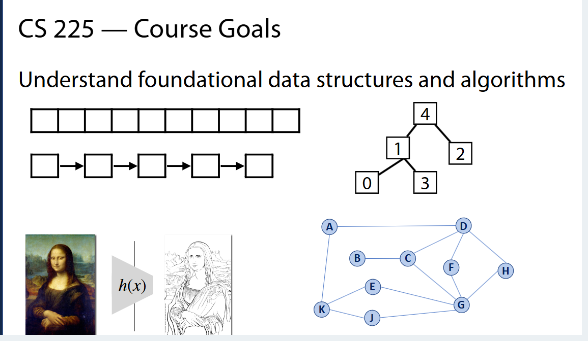
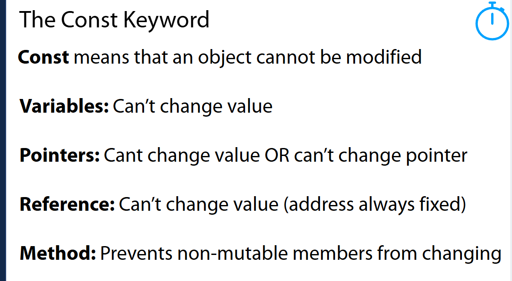
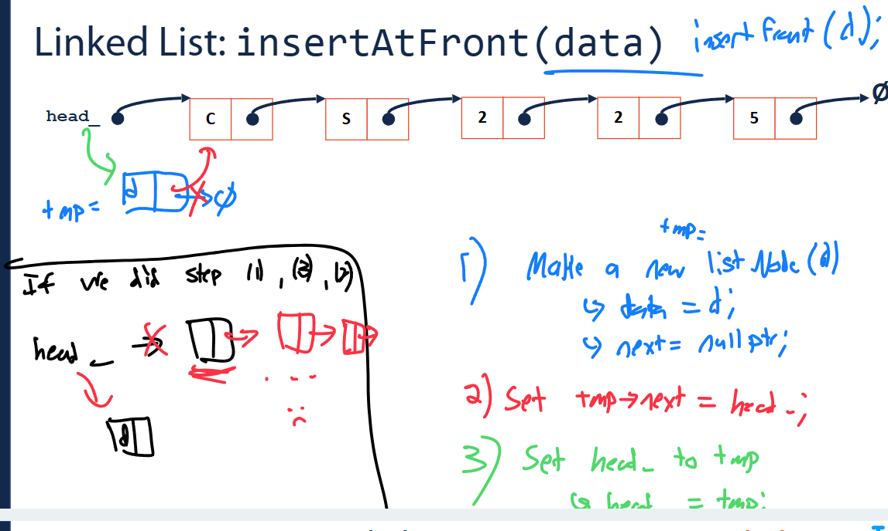

202412250001

后台姓名：刘澈
用户ID：121048
用户1V1昵称：刘澈
学生需求类型：知识点辅导,考前辅导
学生基础：一般
期望上课时间：尽快，具体可商议
学生DUE时间：暂时无
用户类型：1v1老用户
院校：UIUC
年级：大二
专业：未定
科目代码：cs233
科目名称：Computer Architecture
备注：需要讲的内容是下面的



这张图片展示了一门名为CS 225的课程目标，重点是理解基本的数据结构和算法。图片中包含几种不同的数据结构示例，具体如下：

1. **数组（Array）**: 第一行的方框连成一串，代表了一个数组。数组是一种基础的数据结构，可以通过索引快速访问元素。
2. **链表（Linked List）**: 第二行的方框通过箭头连接，代表了链表。链表中的每个元素包含数据部分和指向列表中下一个节点的指针。与数组相比，链表在插入和删除元素时通常更高效。
3. **二叉树（Binary Tree）**: 中间右侧的结构是一个二叉树，其中每个节点最多有两个子节点。这是一种常用于多种算法的数据结构，如排序和搜索。
4. **图（Graph）**: 图表中的字母A到K之间的线表示节点之间的关系。图是由节点（或顶点）和连接这些节点的边组成的结构，广泛用于表示网络，如社交网络或交通系统。

图中还有两幅图像和一个数学表达式（h(x)）：

- **蒙娜丽莎（Mona Lisa）**的图片可能用来表示图像处理或计算机视觉中的应用。
- **蒙娜丽莎的线条图**可能表示一种数据表示或变换的视觉化方法。
- **h(x)** 表达式可能代表一个函数或算法，用于数据处理或计算中。

整体来看，这张图片是为了展示这门课程将覆盖的一些核心概念和数据结构，帮助学生建立对数据结构和算法的基本理解。


这张图片是CS 225课程目标的另一部分，重点介绍了如何为复杂问题选择合适的算法，将问题分解为支持的数据结构，并分析实现选择的效率。这里的目标是教授学生如何有效解决更复杂的编程挑战。图片中的各个元素有特定的象征意义：

1. **图片左侧的雕塑**：可能代表历史或传统方法，象征着通过学习过去的知识和技术来解决现代问题。
2. **中间的狗照片**：这张照片被处理成马赛克效果，可能用来示范图像处理技术或数据的可视化技术。这可以象征着从复杂或不完整的信息中提取有用数据的能力。
3. **右侧的迷宫**：迷宫图可能象征解决问题的路径复杂多变。迷宫通常用来比喻找到解决问题的策略或方法，强调了算法在导航和问题解决中的重要性。

整体来看，这张图片强调的是通过合适的数据结构支持和有效的算法实现，来提高解决复杂问题的能力。这涉及到理解各种数据结构的性能，并选择最适合特定问题的算法，同时考虑实现的效率。


这张图片显示了一个正在构思中的C++类定义，类名为 `Library`。图中显示了这个类的基本结构，但没有具体实现细节。以下是详细解释：

1. **类定义**：
   - `class Library` 这一行开始了一个类的定义，名为 `Library`。
2. **访问修饰符**：
   - `public:` 这一行下面的区域是公开访问区，这意味着在这个区域中定义的成员（方法和变量）可以被类的实例以及其他类访问。
   - `private:` 这一行下面的区域是私有访问区，这里定义的成员仅能被 `Library` 类自身的方法访问。
3. **成员定义区**：
   - 图中的空行预留了位置用于添加类成员的定义，如数据成员（变量）和成员函数（方法）。

**类的结构**：

- 类通常包含数据成员和成员函数。数据成员存储类的状态，而成员函数定义类的行为。在这个 

  ```
  Library
  ```

   类中，你可能会添加如下内容：

  - **数据成员**（例如：存储书籍列表的容器）
  - **成员函数**（例如：添加书籍、删除书籍、查找书籍）

这个类目前是空的，没有具体实现，用于示意在设计软件时如何开始创建一个新的类。在开发过程中，开发者会在这个结构基础上增加具体的功能和实现细节。


这张图片讨论了**内存管理与所有权（Ownership）**的问题，特别是关于 `Library` 类和它存储的 **`Book`** 对象之间的所有权关系。

### **代码解析**

代码定义了一个简单的 `Library` 类，它有两个成员函数：`addBook` 和 `removeBook`，用于分别添加和移除书籍。`Library` 类有两个 `std::vector<Book>` 成员变量：`in` 和 `out`，分别表示存储进入和借出的书籍。

```cpp
class Library {
public:
    void addBook(Book book);  // 添加书籍
    void removeBook(std::string title);  // 移除书籍

private:
    std::vector<Book> in;  // 进入的书籍
    std::vector<Book> out;  // 借出的书籍
};
```

### **问题分析**

**问题**：`Library` 类是否拥有它所存储的书籍（即 `Book` 对象）？

- 选项 A) **Yes!**
- 选项 B) **No!**
- 选项 C) **Not sure**

### **理解所有权**

1. 所有权（Ownership）

   ：

   - 在C++中，**所有权**意味着一个对象负责管理另一个对象的生命周期。具体来说，如果 `Library` 类拥有书籍对象，那么 `Library` 类负责删除书籍并在其销毁时释放内存。

2. 类的所有权

   ：

   - 由于 `Library` 类的 `addBook` 和 `removeBook` 函数都只接受**传值参数**（`Book book`），意味着 `Book` 对象会被复制到 `Library` 类内部的 `in` 或 `out` 向量中。这里的 `Library` 类并没有控制 `Book` 对象的生命周期，而只是存储了书籍的副本。
   - 另外，`Library` 类中的 `in` 和 `out` 向量只是存储了 `Book` 对象的副本，而**没有**真正控制这些 `Book` 对象的创建和销毁。这表明 `Library` 并不拥有 `Book` 对象，而只是存储它们的副本。

### **答案**

- **B) No!**：`Library` 类并不拥有它所存储的 `Book` 对象。它只是通过传值的方式存储书籍的副本，而不管理 `Book` 对象的生命周期。

### **总结**

- 在这个代码中，`Library` 类通过 `std::vector<Book>` 存储 `Book` 对象，但它并没有**所有权**。它只是复制了书籍对象，并没有直接管理它们的内存或销毁这些对象的责任。因此，`Library` 类并不“拥有”这些书籍。


这张图片解释了计算机程序中内存管理的两种主要区域：栈（Stack）和堆（Heap）。这两个概念是编程中非常基础且重要的，特别是在涉及内存分配和管理时。

### 栈（Stack）

- **定义**: 栈是一种用于存储局部变量的内存区域。它按照后进先出（LIFO）的原则操作。当一个函数被调用时，其局部变量被分配到栈上，当函数执行完成后，这些变量会自动被销毁。
- **示例**: `int x = 5;` 这行代码展示了一个整型变量 `x` 被创建并初始化为5，这个变量存储在栈上。

### 堆（Heap）

- **定义**: 堆是用于动态内存分配的内存区域，程序员可以在运行时从堆上分配或释放内存。与栈相比，堆提供了更大的灵活性但管理起来更为复杂，因为需要手动管理内存的分配和释放。
- **示例**: `int* x = new int[5];` 这行代码演示了如何从堆上动态分配一个整型数组。`x` 是一个指向整数的指针，指向堆上新分配的五个整型的数组。使用完毕后，需要使用 `delete[] x;` 来释放这些内存，防止内存泄漏。

**总结**： 栈用于存储执行函数时所需的局部变量，而堆用于存储程序运行期间动态分配的变量。每种类型的内存管理都有其用途和复杂性，了解它们的工作原理对于编写有效和高效的程序至关重要。


这张图片介绍了在编程中常见的三种参数传递方式：值传递、指针传递和引用传递，每种方式对内存管理有不同的影响。

### 1. 值传递（Pass by Value）

- **描述**：在值传递中，函数接收的参数是实际参数的一个副本。这意味着在函数体内对参数的任何修改都不会影响到原始数据。
- **示例**：`addBook(Book book)` 这个函数通过值传递接收一个 `Book` 类型的对象。在这种情况下，每次调用 `addBook` 时，都会在栈上创建 `book` 的一个新副本。

### 2. 指针传递（Pass by Pointer to Value）

- **描述**：指针传递涉及将变量的地址传递给函数。这允许函数直接访问和修改原始数据。指针可以指向堆上分配的数据，也可以指向栈上的数据。
- **示例**：`addBook(Book* book)` 在这个函数中，通过传递一个指向 `Book` 对象的指针，可以在函数内部直接修改原始 `Book` 对象。

### 3. 引用传递（Pass by Reference）

- **描述**：引用传递是将参数作为现有变量的别名传递给函数。这意味着没有创建参数的副本，而是直接操作原始数据，类似于指针传递，但语法上更安全和简洁。
- **示例**：`addBook(Book& book)` 这个函数接收一个对 `Book` 对象的引用。任何在函数中对 `book` 的修改都会反映到原始对象上。

**总结**：

- **值传递**是最简单的传递方式，可以防止原始数据被修改，但可能导致额外的内存和处理开销（因为需要复制数据）。
- **指针传递**允许直接操作内存，但使用不当可能会导致错误，如空指针解引用或野指针问题。
- **引用传递**结合了值传递的简洁语法和指针传递的直接访问能力，通常在C++中是修改数据的首选方法。


这张图片展示了三种不同的函数实现，它们都旨在返回一个名为 `Library` 类的对象中的第一本书的标题。这个类有两个成员变量：`numBooks`（图书数量）和`titles`（指向图书标题数组的指针）。这三个函数分别演示了通过值传递、指针传递和引用传递参数的不同方法。让我们一一分析这些实现：

### Function A - 值传递

- **实现**：`std::string getFirstBook(Library l)`
- **行为**：这个函数通过值传递接收一个 `Library` 对象。它检查 `numBooks` 是否大于0，如果是，则返回数组 `titles` 的第一个元素；如果不是，返回字符串 "None"。
- **评价**：值传递意味着 `l` 是原对象的一个副本。这种方法可能导致性能开销，因为整个 `Library` 对象（包括可能较大的 `titles` 数组）需要被复制。

### Function B - 指针传递

- **实现**：`std::string getFirstBook(Library *l)`
- **行为**：这个函数通过指针传递接收一个 `Library` 对象的指针。它也是检查 `numBooks` 是否大于0，如果是，则通过指针 `l` 返回 `titles` 数组的第一个元素；如果不是，返回 "None"。
- **评价**：指针传递避免了复制对象的开销，但使用指针增加了代码的复杂性和潜在的错误风险（如空指针访问）。

### Function C - 引用传递

- **实现**：`std::string getFirstBook(Library &l)`
- **行为**：这个函数通过引用传递接收一个 `Library` 对象。它的行为与前两个函数相同，检查 `numBooks` 的值，并据此返回第一本书的标题或 "None"。
- **评价**：引用传递结合了值传递的简单性和指针传递的效率。它保证了传入的 `l` 不是空的，同时避免了复制对象的开销。

### 哪种实现最佳？

- **推荐**：**Function C** 使用引用传递通常是最佳选择，因为它既安全又高效。它避免了对象复制的性能损耗，并且语法上比指针传递更清晰，同时自然地避免了空引用的问题（假设不会有人故意传入未初始化的引用）。

总结来说，Function C 提供了最佳的性能和安全性平衡，是处理这类情况时推荐的实现方式。


这张图片总结了在C++中关于内存管理和参数传递方式的基础概念。下面逐条解释：

### 1. Local memory on the stack is managed by the computer

- **说明**：栈内存是自动管理的，通常用于存储函数的局部变量。当函数被调用时，局部变量被推入栈中，函数返回时被自动清理，无需程序员手动管理这些内存。

### 2. Heap memory allocated by new and freed by delete

- **说明**：堆内存是由程序员显式管理的，用于动态内存分配。在C++中，可以使用 `new` 运算符分配堆内存，使用 `delete` 运算符释放这些内存。这允许在运行时分配变量的大小和数量，但也引入了内存泄漏的风险，如果不恰当地管理这些内存。

### 3. Pass by value makes a copy of the object

- **说明**：值传递（Pass by value）意味着将参数的副本传递给函数。这保护了原始数据不被修改，但如果对象较大，可能导致性能开销因为需要复制整个对象。

### 4. Pass by pointer can be dereferenced to modify an object

- **说明**：指针传递（Pass by pointer）涉及将对象的内存地址传递给函数。通过解引用这个指针，函数可以修改原始对象。这种方式比值传递效率更高，因为不需要复制对象，但需要确保指针的有效性和安全性。

### 5. Pass by reference modifies the object directly

- **说明**：引用传递（Pass by reference）允许直接操作调用方的变量，而无需复制。函数接收一个引用，它实质上是原始对象的别名。这种方式既安全又高效，因为它避免了复制且没有指针传递的空指针风险。

这些概念对于理解和使用C++中的高效内存管理和函数调用机制至关重要。每种传递方式有其用途和优缺点，选择合适的方式可以提高程序的性能和可维护性。


这张图片展示了一个名为 `Library` 的C++类的代码片段，该类用于管理书籍，特别注重于书籍的内存管理和所有权问题。下面是对图片中代码和问题的详细解释：

### 代码分析

- 类定义

  ：

  - `Library` 类有两个私有成员：`std::vector<Book*> in;` 和 `std::vector<Book*> out;`，这两个向量用来存储书籍的指针。
  - 类中有两个公共成员函数：`addBook(Book book)` 和 `removeBook(std::string title)`。`addBook` 函数的注释说明它是用来在堆上存储书籍的，这意味着它可能会使用 `new` 关键字来动态分配 `Book` 对象的内存。

### 提出的问题

1. **Does Library 'own' Books?**
   - 图中提供的代码和注释表明，`Library` 类通过 `new` 创建书籍对象，并将这些书籍的指针存储在其向量中。这意味着 `Library` 负责管理这些书籍的生命周期，包括它们的创建和销毁。
   - **答案**：A) Yes! `Library` 拥有书籍，因为它负责书籍的内存分配和释放。
2. **Does my destructor need to delete them?**
   - 由于 `Library` 类负责动态创建书籍对象，它同样需要确保在对象不再需要时释放这些对象的内存。这通常在类的析构函数中完成。
   - **答案**：是的，析构函数需要删除这些书籍。为了防止内存泄漏，应在 `Library` 类的析构函数中遍历 `in` 和 `out` 向量，并删除每个向量中的每个 `Book` 对象，然后清空向量。

### 总结

这个 `Library` 类的设计要求类管理书籍的内存分配和释放。这样的设计必须小心确保所有动态分配的资源在不再需要时都能被正确清理，以避免内存泄漏。正确实现这一点通常需要自定义析构函数、拷贝构造函数和拷贝赋值运算符，以遵循“三法则”（Rule of Three）或“五法则”（Rule of Five，如果涉及移动语义的话）。这确保了资源的安全和有效管理，遵循了良好的C++编程实践。


这张图片包含一段C++代码，其中定义了一个名为 `Library` 的类，此类用于管理书籍集合。代码片段和伴随的问题都关注于内存管理和所有权问题。

### 类的定义和功能

- 类结构

  ：

  - `Library` 类包含两个 `std::vector<Book*>` 私有成员：`in` 和 `out`，用来存储书籍指针。
  - 提供了 `addBook` 方法和 `removeBook` 方法，分别用于添加书籍和移除书籍。

### 图中代码分析

- `addBook(const Book& book)` 方法似乎应该处理将书籍添加到某个集合中，但具体实现未显示。
- `removeBook(std::string title)` 方法根据标题移除书籍，具体实现未显示。

### 伴随的问题

1. **Does Library 'own' Books?** — 这个问题询问 `Library` 类是否拥有其存储的书籍。
   - **答案**：B) No! 因为 `Library` 类存储的是书籍的指针，而不直接管理这些书籍对象的内存。除非代码中显式地在某处创建并销毁这些书籍，否则仅仅存储指向它们的指针并不意味着拥有它们。
2. **Does my destructor need to delete them?** — 这个问题询问是否需要在析构函数中删除这些书籍。
   - **答案**：由于 `Library` 类不拥有这些书籍（即不负责管理这些书籍的内存），所以它的析构函数**不需要**也**不应该**删除这些书籍。如果 `Library` 析构函数中尝试删除这些书籍，而这些书籍的内存管理在其他地方处理（如通过其他对象或函数），将可能导致重复删除，从而引起程序错误。

### 总结

此类设计强调了一个重要的面向对象设计原则：一个对象应只管理它自己负责创建的资源。这里 `Library` 只应管理书籍指针的集合，而不是书籍对象本身，除非它还负责创建和销毁这些书籍。正确的内存管理策略是确保每个资源的创建和销毁职责清晰明确，避免内存泄漏和其他资源管理错误。


这张图片描述了在C++中被称为“三法则”（Rule of Three）的概念。当类中需要手动管理资源（如动态内存、文件句柄、网络连接等）时，这条规则特别重要。下面是每个部分的详细解释：

### 1. 析构函数（Destructor）

- **功能**：析构函数在对象生命周期结束时被调用，用于清理资源。如果类负责任何形式的资源管理（如动态分配的内存），则需要显式定义析构函数以确保资源被适当释放，防止资源泄漏。

### 2. 拷贝构造函数（Copy Constructor）

- **功能**：拷贝构造函数在新对象需要通过现有对象的状态进行初始化时被调用（例如，当对象被作为函数参数按值传递，或从函数返回一个对象时）。如果类管理的资源具有“深拷贝”需求（即需要独立复制资源，而不仅仅是复制指针或引用），则必须自定义拷贝构造函数。

### 3. 拷贝赋值运算符（Copy Assignment Operator）

- **功能**：当一个对象需要通过已存在的另一个对象的状态被重新赋值时，拷贝赋值运算符被调用。与拷贝构造函数类似，如果类中包含需要深拷贝的资源，必须自定义拷贝赋值运算符，以确保在赋值时资源得到正确管理。

### 为什么称为“三法则”？

当你在类中自定义了其中任一函数（通常是因为需要管理动态分配的资源），很可能需要自定义其他两个，以确保对象状态的每次复制和销毁都正确处理资源。这三个函数共同确保资源在复制和销毁过程中不会被误用或泄露。

例如，如果你有一个管理动态内存的类，你可能需要：

- 在析构函数中释放内存，
- 在拷贝构造函数中分配新内存并复制内容，
- 在拷贝赋值运算符中处理自赋值情况、释放旧内存并分配新内存以复制内容。

这确保了类的每个实例都独立管理其资源，防止了如双重释放等问题。忽视这一规则可能导致难以追踪的内存错误和资源泄露。


图片中描述的是“零法则”（The Rule of Zero），这是C++编程中关于类设计的一个现代原则，由Scott Meyers提出。这一原则是“三法则”（Rule of Three）的一个衍生或辅助原则。以下是详细解释：

### 零法则的含义

“零法则”建议在设计类时，应尽可能避免手动定义析构函数、拷贝构造函数、拷贝赋值运算符、移动构造函数和移动赋值运算符。换言之，如果不是因为需要管理资源，类应该依赖于其成员的自然行为来自动提供这些函数的合适实现。

### 目的和理由

- **简化类的管理**：通过依赖编译器自动生成的这些特殊成员函数，可以减少错误的可能性，并简化代码的管理。当一个类没有自定义这些函数时，编译器会自动为其生成，这些自动生成的版本通常就足够用了。
- **推广资源管理的封装**：如果类确实需要管理资源（如动态分配的内存、文件句柄等），则应通过使用智能指针（如 `std::unique_ptr` 或 `std::shared_ptr`）等现代C++特性来封装这些资源。这样的封装遵循“资源获取即初始化”（RAII）原则，确保资源的生命周期自动与拥有它们的对象的生命周期保持一致。

### 实践应用

- **使用智能指针管理资源**：例如，使用 `std::unique_ptr` 管理动态分配的内存可以自动处理资源的创建和销毁，从而无需在类中显式定义析构函数或拷贝/移动操作。
- **避免不必要的复杂性**：不定义这些函数除非必要，可以避免代码中不必要的复杂性，并提高代码的可维护性。

总之，遵循“零法则”可以使得类的设计更加清晰和简洁，减少管理资源时可能出现的错误，同时利用现代C++语言的特性来优化资源管理。这种做法鼓励开发者更多地依赖语言的自动特性和标准库提供的工具，从而写出更安全、更高效的代码。


这张图片讲述的是关于C++内存管理和资源所有权的最佳实践，内容包括避免不必要的动态内存分配和优先使用现有的类来管理资源。下面是对这些原则的详细解释：

### 1. 如果不必分配资源，就不应该分配

这句话强调了在编程时应尽量避免不必要的动态内存分配。动态内存分配（使用`new`和`delete`）虽然灵活，但管理不当易导致内存泄露、内存碎片化等问题。如果可以通过使用自动（栈上）或静态存储的变量来满足需求，那么应优先考虑这些方法，因为它们不需要程序员手动管理内存，且效率更高。

### 2. 尽量使用已经处理所有权的现有类

这里建议使用已经为资源管理提供了封装的类，比如标准库中的容器（如`std::vector`、`std::string`等）和智能指针（如`std::unique_ptr`、`std::shared_ptr`等）。这些类已经内置了对资源生命周期的管理，可以自动处理资源的分配和释放。通过使用这些类，可以减少错误并简化代码的复杂性。

### 3. 在使用`new`关键字前尝试其他所有选项

这条原则鼓励开发者在考虑直接使用`new`进行资源分配前，探索所有其他可能的选项。`new`应作为最后的手段，因为直接使用`new`和`delete`管理内存需要小心翼翼，容易出错。相反，可以考虑使用标准库提供的容器或智能指针，这些工具可以帮助自动管理内存，减少内存泄漏的风险。

### 总结

这些原则的核心是推广资源管理的自动化和安全性，避免手动内存管理中常见的错误和陷阱。通过优先使用现代C++的资源管理工具和类，可以写出更稳定、更可维护、效率更高的代码。


这张图片包含一个C++程序的代码示例，涉及一个名为 `Library` 的类，该类在内部管理一个动态分配的字符串数组 `titles`。程序中也包括一段主函数（`main`）代码，其中创建了两个 `Library` 类的实例 `L1` 和 `L2`。此外，图片还提出了一个关于这段代码潜在问题的多项选择问题。

### 代码分析：

1. **类定义**：
   - `Library` 类包含两个成员变量：`int numBooks` 和 `std::string* titles`。
   - 提供了一个构造函数和一个析构函数。
2. **构造函数**：
   - 接收整数 `num` 和字符串指针数组 `list`，并根据这些值初始化成员变量。
   - `titles` 动态分配内存并使用 `std::copy` 从 `list` 复制 `num` 个元素。
3. **析构函数**：
   - 释放 `titles` 指向的内存并将 `titles` 设为 `nullptr`。

### 主函数中的操作：

- `myBooks` 是一个包含三个字符串的数组。
- `L1` 通过传递 `myBooks` 的大小和数据被正确初始化。
- `L2` 是通过默认复制构造函数复制 `L1` 的，因为没有提供显式的复制构造函数。

### 问题分析及正确答案：

- **选项A（Can't create L2 Library obj）**：不正确。可以创建 `L2`，因为编译器提供了默认的复制构造函数。
- **选项B（Don't delete either Library）**：不正确。析构函数确实会删除 `titles` 指向的内存。
- **选项C（Deleting L1 deletes L2）**：正确。因为 `L2` 是通过复制 `L1` 创建的，它们的 `titles` 指针指向同一块内存。当 `L1` 被销毁时，它的析构函数会删除 `titles` 指向的内存，当 `L2` 被销毁时，它尝试再次删除同一块内存，这会导致未定义行为，可能是程序崩溃。

### 核心问题：

代码没有正确处理深拷贝的问题。在没有自定义拷贝构造函数和拷贝赋值运算符的情况下，使用默认的拷贝行为会导致两个对象共享相同的资源，这不是安全的资源管理实践。

### 解决方案：

为了避免这种问题，应当实现自定义的拷贝构造函数和拷贝赋值运算符，以确保进行深拷贝，每个对象管理自己独立的资源副本。这是实现“三法则”（Rule of Three）的一个典型例子。


这张图片展示了一个C++代码片段，用于解释指针的基本操作，并图形化地表示了内存中的变量和指针的存储。代码主要演示了如何声明和使用指针，并对内存中的值进行修改。下面是对代码和图示的详细解释：

### 代码详解：

1. `int a = 3;`
   - 声明一个整型变量 `a` 并初始化为3。
2. `int *p = &a;`
   - 声明一个整型指针 `p` 并将其初始化为 `a` 的地址（`&a`）。这意味着 `p` 指向 `a`。
3. `(*p)++;`
   - 解引用 `p` 并对其指向的值（`a` 的值）增加1。因此，`a` 的值现在变为4。
4. `p++;`
   - 将指针 `p` 自增，使其指向下一个整数位置。由于整数通常占用4个字节，`p` 将指向 `a` 当前地址之后的第四个字节。
5. `int *b;`
   - 声明一个未初始化的整型指针 `b`。

### 图示详解：

- 内存图

  ：

  - **A**: 显示变量 `a` 存储的值为3。
  - **P**: 显示指针 `p` 最初存储的值（`a` 的地址）。在执行 `p++` 后，`p` 的值将变为下一个整数地址。

### 编程和内存管理概念：

- **指针操作**：通过指针，可以直接访问和修改内存中的值。`(*p)++` 修改了 `p` 指向的内存的值。
- **指针算术**：`p++` 是一个常见的指针操作，使指针指向内存中的下一个元素。这取决于指针指向的数据类型的大小。

### 注意事项：

- **未初始化的指针**：在代码中，指针 `b` 被声明但未初始化。这是潜在的不安全做法，因为未初始化的指针可能指向任意内存位置，其使用可能导致不可预测的行为或程序崩溃。
- **指针越界**：`p++` 在此上下文中可能导致指针越界，访问未定义的内存区域，这也是危险的行为。

### 总结：

这段代码和图示有效地展示了如何在C++中使用指针进行内存访问和修改。它强调了指针的强大功能以及在使用时需要注意的内存安全问题。正确的指针使用是高效编程的关键，但同时需要小心处理以避免安全问题和程序错误。


这张图片展示了一个C++结构体 `BlackBox` 的代码，其中包含了几个版本的 `update` 方法，这些方法旨在说明常量指针和常量方法的概念及其区别。下面是对每个版本的详细解释：

### 代码解析

1. **方法A：`void update(const int & obj)`**
   - 这个方法接收一个指向整数的常量引用 `obj`。因为 `obj` 是常量引用，这意味着在这个方法中不能修改 `obj` 的值。
   - 方法内部将 `obj` 的值赋给 `BlackBox` 结构体的成员变量 `myVal`。这是合法的，因为方法没有尝试修改 `obj`，只是读取它的值。
2. **方法B：`void update(int & obj) const`**
   - 这个方法同样接收一个引用，但 `obj` 不是常量。关键点在于这个方法本身被声明为 `const`，这意味着你不能在方法内部修改这个结构体的任何成员变量。
   - 尽管这个方法试图将 `obj` 的值赋给成员变量 `myVal`，但这是非法的，因为 `const` 方法不允许修改任何成员变量。因此，这行代码会引起编译错误。
   - `obj++` 这行代码是合法的，因为 `obj` 不是常量，这个操作不违反方法的 `const` 限定。
3. **方法C：`void update(const int & obj) const`**
   - 这个方法结合了前两个方法的限制：它接收一个常量引用，并且方法本身也是 `const`。
   - 由于 `obj` 是常量引用，方法内部不能修改 `obj` 的值，因此 `obj++` 这行代码是非法的。
   - 同样地，尝试修改成员变量 `myVal` 也是非法的，因为这个方法是 `const`。

### 图中的批注

- 图中的批注和红线突出显示了错误或关键点：
  - 方法B中尝试修改成员变量 `myVal` 是错误的，因为方法是 `const`。
  - 方法C中尝试修改 `obj` 是错误的，因为 `obj` 是一个常量引用。

### 总结

- **Const Methods**：当你在方法声明后使用 `const` 关键字时，这意味着该方法不会修改类或结构体的任何成员变量。
- **Const References**：当你将参数声明为 `const` 引用时，你不能通过那个引用修改数据。

这段代码很好地展示了如何在C++中使用 `const` 来保护数据不被修改，以及如何通过方法的 `const` 限定确保方法不会改变对象的状态。



这张图片描述了C++中 `const` 关键字的多种用法及其含义，包括如何应用于变量、指针、引用和方法。这是对程序设计中不变性的一个基本介绍。下面是对每个点的详细解释：

### 1. Variables: Can't change value

- 当变量被声明为 

  ```
  const
  ```

  ，它的值就不能改变。尝试修改一个常量变量的值将导致编译错误。例如：

  ```cpp
  const int x = 10;
  // x = 20; // 错误: 不能修改常量变量的值
  ```

### 2. Pointers

- 对于指针，

  ```
  const
  ```

   可以有两种不同的应用方式，影响的是指针指向的数据还是指针本身：

  - **`const int\* p`**：这里，指针 `p` 可以指向不同的地址，但不能通过 `p` 修改所指向地址的内容。
  - **`int\* const p`**：这里，`p` 必须始终指向它最初被初始化时的地址，但可以修改该地址上的数据。
  - **`const int\* const p`**：`p` 既不能改变指向的地址，也不能通过 `p` 修改地址上的数据。

### 3. Reference: Can't change value (address always fixed)

- 引用本质上就是一个已初始化的别名，对于 

  ```
  const
  ```

   引用，一旦与某个变量绑定，就不能被重新绑定到另一个变量，且不能通过引用修改其绑定的变量的值：

  ```cpp
  int value = 30;
  const int& ref = value;
  // ref = 40; // 错误: 不能通过常量引用修改值
  ```

### 4. Method: Prevents non-mutable members from changing

- 当一个类的方法被声明为 

  ```
  const
  ```

  ，这意味着该方法不能修改该类的任何成员变量，除非这些成员被声明为 

  ```
  mutable
  ```

  。这是一种常用的实践，用于保证方法不会改变对象的状态：

  ```cpp
  class MyClass {
      int _value;
   public:
      int getValue() const { return _value; } // 这个方法不会修改任何成员变量
      void setValue(int value) { _value = value; } // 这个方法可以修改成员变量
  };
  ```

### 总结

在C++中，`const` 关键字是一种强大的工具，用于增加代码的安全性和表达性，通过明确哪些数据应该是不可变的。正确地使用 `const` 可以帮助防止编程错误，并且能够清晰地向其他开发者表达某些值或对象应该如何被使用。


这段代码是一个C++模板函数的示例，名为 `maximum`，用于返回两个值中的最大值。这是泛型编程的一个基本示例，允许函数使用任何类型的参数，只要这些类型支持比较操作（`>`）。以下是对代码的详细解释：

### 函数定义

```cpp
T maximum(T a, T b)
```

- **`T`**: 这是一个模板类型参数，表示该函数可以接受任何类型的 `a` 和 `b`，只要这些类型能够在表达式中使用 `>` 运算符。
- **`T a, T b`**: 函数的参数，分别是类型 `T` 的两个值 `a` 和 `b`。

### 函数体

```cpp
T result;
result = (a > b) ? a : b;
return result;
```

- **`T result;`**: 声明一个类型为 `T` 的变量 `result`。
- **`result = (a > b) ? a : b;`**: 使用三元运算符（条件运算符）来判断 `a` 和 `b` 之间哪个更大。如果 `a` 大于 `b`，则 `result` 被赋值为 `a`；否则，赋值为 `b`。
- **`return result;`**: 函数返回计算得到的最大值。

### 使用场景

这个函数可以被用于任何支持 `>` 比较的数据类型，如整数、浮点数甚至是自定义类型（只要为这些类型提供了合适的比较运算符重载）。

### 示例

如果你想使用这个函数比较两个整数或者两个浮点数，可以这样做：

```cpp
int maxInt = maximum(1, 2);       // 调用 maximum<int>(1, 2)
double maxDouble = maximum(1.1, 2.2); // 调用 maximum<double>(1.1, 2.2)
```

### 总结

这个模板函数是一个非常基础的示例，展示了如何使用C++模板来编写灵活且类型无关的代码，这样的代码可以用于多种数据类型而无需为每种类型重新编写函数逻辑。这种编程技术是C++模板和泛型编程的基础。


这张图片介绍了C++中模板的基本概念和用法。模板是C++中实现泛型编程的一种工具，允许程序员编写与类型无关的代码。下面是对图片内容的详细解释：

### 模板基本概念

1. **定义**: 模板是一种在编译时根据指定的类型自动生成代码的机制。它们允许程序员编写灵活的函数或类，这些函数或类可以用不同的数据类型工作，而不需要为每种类型重写代码。

2. **通用模板格式**:

   ```cpp
   template <typename T>
   T functionName(T parameter1, T parameter2) {
       // 函数体
   }
   ```

   这里，`typename T` 是模板参数，表示函数可以接受任何类型。在实际使用时，编译器将为具体的类型生成函数的实例。

### 图中内容解析

- 示例函数

  : 图中定义了一个名为 

  ```
  sum
  ```

   的函数模板，它接受两个类型为 

  ```
  T
  ```

   的参数，并返回它们的和。

  ```cpp
  template <typename T>
  T sum(T a, T b) {
      //...
  }
  ```

- 使用情景

  :

  - **`Sum<int>(2, 4)`**: 这行代码使用模板生成一个处理 `int` 类型的 `sum` 函数。
  - **`Sum<float>(2.2, 4.4)`**: 这行代码使用模板生成一个处理 `float` 类型的 `sum` 函数。

  这两个示例说明了如何用不同的数据类型调用同一个模板函数，演示了模板的类型灵活性。

### 图中的动画角色

- 图片还包含一个穿着带数字 "225" 的烹饪服的动画角色，这可能是用来吸引视觉注意或为教学内容增添趣味性。数字 "225" 可能是课程编号或某种标识，但其具体含义在编程语境中不明确。

### 模板的优点

- **代码重用**: 通过定义一次模板，可以用于多种数据类型，减少重复代码。
- **类型安全**: 相比于宏或 `void*` 类型的函数，模板提供了类型安全，因为所有类型检查都是在编译时完成的。
- **性能**: 模板允许编译器生成优化的代码，因为所有类型信息在编译时都已知。

总的来说，这张图片是对C++模板的一个基本介绍，强调了其泛型编程的能力，使得可以用同一套代码处理不同的数据类型。


这张图片展示了一个关于数据结构的问卷调查图，询问的问题是“你最喜欢的数据结构是什么？”并提供了四个选项：A) Lists, B) Trees, C) Graphs, D) Hash Tables。每个选项旁边都有一个简单的图形来说明对应的数据结构，并且各自有一些百分比的符号（虽然具体数字不完整），可能是用来表示这些数据结构在某次调查中的受欢迎程度。

### 选项详解

1. **Lists（列表）**
   - 列表通常是元素的有序集合，可以动态地插入和删除元素。在示例中，列表被表示为一系列连续的方块，每个方块代表列表中的一个节点。
2. **Trees（树）**
   - 树是一种分层的数据结构，非常适合表示具有层级关系的数据。示例中的树有一个根节点（4）和两个子节点（5和6），这显示了树的分支结构。
3. **Graphs（图）**
   - 图由节点（或称顶点）和连接这些节点的边组成，用于表示多对多的关系。图示中显示了一个简单的图，有多个节点和它们之间的连接，表示节点之间的复杂关系。
4. **Hash Tables（哈希表）**
   - 哈希表是基于键的快速数据检索结构，使用哈希函数将键映射到表的一个位置上以便快速访问。示例中显示了一个简单的哈希表，其中包括索引和存储在每个索引位置的元素。

### 图中的QR码和加入代码

- 图片右上角的QR码和文字“Join Code: 22!”可能表示这是某个互动课堂或讲座的一部分，参与者可以扫描QR码或使用加入代码来投票或获取更多信息。

### 总结

这张图片是一个教育或演示用的视觉辅助工具，用于展示和比较不同的数据结构，同时可能用于一个互动的学习环境中，让参与者选择他们最喜欢或最感兴趣的数据结构。这种方式有助于增加参与度并加深对各种数据结构特点和用途的理解。


这张图片描绘了图（Graphs）作为一种数据结构，并展示了它在不同领域中的可视化示例。图是一种非常灵活的数据结构，由节点（顶点）和连接节点的边组成，广泛用于表示各种复杂的关系网络，如社交网络、交通系统、互联网链接等。

### 图中内容详解：

1. **左上角的简单图**：
   - 显示了一个包含四个节点（U, V, W, Z）的基本图结构，节点之间通过边（a, b, c, d）连接。这种类型的图可以用来表示简单的网络关系或路径。
2. **中间的生物分枝图**：
   - 这可能是表示生物学中的某种结构，如神经网络、树或其他分支结构。它显示了从一个中心节点向外分支扩展的形态，可能用于描述生物组织的生长模式或某种生态系统的结构。
3. **右侧的复杂网络图**：
   - 这张图显得非常复杂，包含大量节点和彩色的连接线，看起来像是一个大型的网络数据集，可能是互联网结构、大规模社交网络或某种复杂系统的数据流图。这种图通常用来分析和可视化大规模网络数据，帮助理解系统中各个部分如何相互连接和影响。
4. **左下角的兔子雕塑**：
   - 这幅图中的兔子雕塑看似与主题不太相关，但它可能在这里用作艺术点缀或是为了吸引观众的注意。有时候在科学和技术的展示中加入艺术元素可以增加视觉效果的吸引力，或者象征生物学数据的复杂性和多样性。

### 图的应用和重要性：

图作为一种数据结构，对于理解和解决现实世界中的问题至关重要。它们提供了一种模型化复杂关系的方法，并能够在计算机科学、工程、生物学、社会科学等众多领域内进行问题的可视化和分析。例如，通过利用图算法，可以优化路由问题、分析社交网络中的影响力结构、研究蛋白质交互网络等。

总之，这张图片通过不同的示例展示了图数据结构的多样化应用和视觉化的表达方式，突出了它们在各种领域中的应用价值和实用性。


这张图片是一个说明性的图表，展示了图（Graphs）和列表（Lists）两种数据结构的关联及其表达方式。图表的主要目的是展示如何将图结构转化为列表形式的表示，进一步阐述图数据结构的不同表达方式。

### 图的结构

- 图中展示了一个简单的图，包含四个节点（U, V, W, Z）和它们之间的连接（边）。
  - U 连接到 V (边a) 和 W (边c)
  - V 连接到 W (边b)
  - W 连接到 Z (边d)

### 列表的结构

1. **节点列表（左边）**：
   - 这部分展示了图中所有的节点（U, V, W, Z）。这可以看作是图中所有顶点的简单枚举。
2. **边列表（右边）**：
   - 这部分更具体，列出了所有边的起点和终点，以及标识符（a, b, c, d）。
   - 每行代表一条边，其中列出了起始节点、结束节点和边的标识。
     - U 到 V 是边 a
     - V 到 W 是边 b
     - U 到 W 是边 c
     - W 到 Z 是边 d

### 图表的用途和教育价值

- **可视化数据结构**：通过图表，学生或读者可以更容易地理解数据结构的概念和具体实现。图结构通常用于表示网络，包括社交网络、通信网络、数据流等。
- **数据结构转换**：显示了如何将图数据结构转换为列表形式，这在某些编程和数据处理任务中非常有用，特别是在需要优化搜索和访问操作时。
- **教育工具**：这样的图表非常适合教育环境，帮助学生理解抽象的概念并看到这些概念的具体应用。

总的来说，这张图片不仅展示了图的结构和对应的列表表示，而且还提供了一种清晰的方式来理解和教授数据结构的转换和应用。这种视觉表示方式可以帮助提高学习的直观性和效率。


这张图片展示了哈希表（Hash Tables）的一个应用示例，具体地显示了一个名字和成绩的存储系统。哈希表是一种使用哈希函数组织数据以支持快速插入、搜索和删除操作的数据结构。

### 哈希表结构解释

- **索引列**：左侧的索引列（0到10）表示哈希表的槽位或索引。每个槽位可以存储一个或多个元素，这取决于哈希函数的结果和冲突解决策略。
- **存储桶**：各槽位中的框（桶）表示存储在该索引下的数据。在这个例子中，每个存储桶可能包含一个或多个记录，这些记录是通过链表方式处理哈希冲突的结果。链表允许在同一个索引位置存储多个元素。
- **数据项**：每个桶中的数据项包括人名和成绩。例如，索引2的位置存储了名为"Brett"的记录，成绩为"A-"。

### 哈希冲突

- 图中显示了如何解决哈希冲突：如果多个元素映射到同一个索引，它们会通过链表的形式串联起来。例如，索引5包含了"Ali", "Alice", 和"Laura"的记录。

### 哈希函数

- 哈希表的效率很大程度上依赖于哈希函数的质量（不显示在图中）。哈希函数决定了数据项应该被放置在哈希表中的哪个索引位置。理想的哈希函数应该将数据均匀分布在所有可用的索引上，以最小化冲突。

### 右侧的二进制列

- 图中右侧的二进制列（显示0和1）可能表示某些状态或标记，例如记录是否存在于每个索引位置。这可能用于快速检查某个索引位置是否为空或已被占用，从而优化搜索和插入操作。

### 应用和优点

哈希表是一种极其有效的数据结构，尤其是在需要快速访问大量数据的应用中。它们广泛用于实现数据库索引、缓存机制、去重数据集合等。此外，哈希表通过适当的冲突解决策略（如链地址法）和动态扩容机制，可以有效处理大量的插入和查询操作，保持操作的高效性。

总之，这张图非常有效地说明了哈希表的结构、操作和一些实现细节，提供了一个直观的视图来理解这种数据结构在实际应用中的表现和处理方式。


这张图片是对列表抽象数据类型（List ADT）的介绍和说明，包括它的特点和基本操作。列表是一种有序的数据集合，可以包含同类型或不同类型的元素（即可为异构或同构），并且可以是固定大小或可变大小的。

### 列表的特点：

1. **有序集合**：列表中的元素按特定顺序排列。

2. 异构或同构

   ：

   - **异构**：列表中可以包含不同类型的数据。
   - **同构**：列表中的所有元素都是同一类型的，如 `std::vector<int>` 表示一个所有元素均为整数的列表。

3. 固定大小或可变大小

   ：

   - 固定大小的列表在创建后大小不变。
   - 可变大小的列表则可以动态添加或删除元素。

### 基本操作：

1. **Insert**：在列表中插入一个新元素。
2. **Delete**：从列表中删除一个元素。
3. **isEmpty**：检查列表是否为空。
4. **getData**：获取列表中元素的数据。这可能是指获取特定位置的元素或搜索某个特定值的元素。
5. **Create an empty list**：创建一个新的空列表。

### 图中的标注：

- **注释**：图中有注释指出了关于列表的不同性质和操作，如异构性、同构性和基本操作的用途。
- **箭头和圈**：用于突出显示列表中元素的类型（异构或同构）和列表的大小属性（固定或可变）。

### 教育用途：

这种图表非常适合在教学中使用，因为它提供了对列表数据结构的快速理解。通过图解和关键操作的简洁描述，学习者可以迅速掌握列表的核心概念和功能。

总结来说，这张图为理解列表作为数据结构的多功能性提供了直观的视角，展示了其在数据处理和程序设计中的应用基础。


这张图片显示了一个名为 `ListNode` 的 C++ 类定义，这是一个典型的链表节点实现。图中还包含了一些注释，解释了类中成员变量的设计选择。

### 类定义解析

```cpp
class ListNode {
    T &data;            // 数据成员为对T类型对象的引用
    ListNode *next;     // 指向下一个ListNode的指针
    ListNode(T &data) : data(data), next(NULL) {} // 构造函数初始化data和next
};
```

### 注释解释

1. **为什么数据存储为引用（Why is data stored as a reference）?**
   - "We don't want to own data" 这句话意味着ListNode类的设计不打算拥有它所持有的数据。使用引用可以让数据保持在其它地方管理，而节点仅仅维持对这些数据的访问。这样做可以避免数据的复制，也方便共享数据。
2. **为什么next是指针（Why is next a pointer）?**
   - "Our LN are dynamically created" 和 "Exist all over memory" 这两句话解释了为什么 `next` 成员是一个指针。链表节点通常是动态创建的，可能存储在内存的任何位置，因此需要指针来连接这些分散的节点。
   - "Not ref b/c ref cannot point to null" 这句话进一步解释了为什么不使用引用。在链表中，最后一个节点的 `next` 需要指向 `NULL`（或C++中的 `nullptr`），表示链表的结束。由于引用必须总是指向一个有效的对象，它不能用来实现这一点，因此选择了指针。

### 设计决策的影响

- **使用引用**：这种设计避免了数据的不必要复制，节省了资源，同时也意味着需要确保ListNode的生命周期不会超过其引用的数据对象。
- **使用指针**：允许链表灵活地在运行时构建和修改。指针的使用是链表结构中常见的做法，因为它支持动态内存管理和链表的增长或收缩。

这个类的设计示例和附带的注释对理解链表节点的内部结构及其在内存中的行为提供了宝贵的见解。


这张图片是一段C++代码的截图，显示了一个链表的定义和如何通过头指针遍历链表的说明。

### 解析代码结构

- **List类定义**：
  - `List`类包含一个私有嵌套类`ListNode`，用于定义链表的节点。
  - 每个`ListNode`包含两个成员：一个引用`T& data`存储数据，和一个指针`ListNode* next`指向下一个节点。
  - `List`类还有一个私有成员`ListNode* head_`，这是指向链表头部的指针。
- **函数和操作**：
  - `insertAtFront`方法允许将新数据插入到链表的前端。
  - 构造函数`ListNode(T& data)`初始化数据和下一个节点指针。

### 如何访问链表（Given Head）

图中的注释询问“如何访问链表给定头部（head）?”并给出了遍历链表的示例方法：

- 初始化遍历

  ：

  - `ListNode* curr = head;`：创建一个当前指针`curr`，初始指向头部`head_`。

- 遍历链表

  ：

  - 通过循环使用`curr = curr->next;`移动`curr`指针来访问链表的每个节点。这个过程通常会持续到`curr`指针为`NULL`，表示链表结束。

### 图中的蓝色线条

- 图中的蓝色线条可能表示指针遍历链表的路径，从头结点开始，通过每个节点的`next`指针移动到下一个节点。

### 代码的用途和重要性

- 这段代码示范了链表的基本实现和操作，是学习数据结构中链表部分的基础。
- 使用引用和指针的方式提供了关于内存管理和对象所有权的深入理解，这对于编写高效且可管理的C++代码至关重要。

总结来说，这张图片是对一个基本的链表数据结构的实现的展示，特别强调了如何初始化和遍历链表。这些操作是理解和使用链表时的基本技能。


这张图片展示了一个C++的链表类`List`的部分代码，这是一个模板类，用于处理泛型数据类型。在这段代码中有一些缺失的部分或需要改进的地方：

### 1. 模板声明

- 图中代码的上方标注了“template”的笔记，这表明

  ```
  List
  ```

  类应该是一个模板类，但在截图中并未显示完整的模板声明。正确的代码应该在类定义之前包括以下行：

  ```cpp
  template <typename T>
  ```

### 2. 成员函数和构造函数

- `insertAtFront`函数接受一个类型为`const T&`的参数，这意味着它接受一个指向T类型常量对象的引用。这种设计通常用于防止函数修改传入的参数。

### 3. ListNode 类

- `ListNode`类是`List`类的私有成员，用于存储链表的节点数据和指向下一个节点的指针。
- 成员`T& data;`声明为引用，意味着每个节点都不拥有它所含数据的拷贝，只持有对数据的引用。这要求数据在ListNode的生命周期外继续存在。

### 4. 缺失的构造函数和析构函数

- 链表类通常需要一个析构函数来释放它所分配的资源，尤其是当链表拥有动态分配的内存（如节点）时。如果`ListNode`内存是动态分配的（通常是这样），则需要在`List`的析构函数中遍历链表并删除所有节点。
- 同样，可能还需要复制构造函数和赋值运算符来正确地复制链表的内容，尤其是如果默认的浅拷贝行为不适合链表的设计。

### 5. 使用NULL

- 在`ListNode`构造函数中使用了`next(NULL)`。在现代C++中，建议使用`nullptr`代替`NULL`，因为`nullptr`提供了类型安全的优势。

### 6. 初始化列表头

- `ListNode *head_;`初始化应该在构造函数中明确设置为`nullptr`，以确保链表的初始状态是空的。

### 整体改进

代码应该包括全面的错误处理和边界条件检查，例如在插入或删除操作中处理空链表的情况，以及确保在析构链表时正确管理内存。

这个类定义提供了链表操作的基础框架，但需要完整的模板声明和适当的内存管理功能才能确保其正确性和效率。



这张图片展示了如何在一个链表的头部插入新元素的流程，包括相关的代码注释和视觉解释。

### 步骤解释：

1. **创建一个新的节点**
   - 使用新的数据值`d`创建一个新的`ListNode`节点（称为`tmp`）。这个节点的`data`成员被初始化为`d`，而`next`成员被初始化为`nullptr`。
2. **设置新节点的next指针**
   - 将新节点的`next`指针设置为当前头部指针`head_`所指向的节点。这一步将新节点连接到原始链表的前端。
3. **更新头部指针**
   - 将头部指针`head_`更新为指向新节点。这样，新节点成为了链表的第一个节点。

### 图中的视觉解释：

- 图中显示了如果跳过第二步骤（即不设置`tmp->next = head_`），将会如何导致链表的其余部分丢失，因为新的头节点`tmp`将指向`nullptr`，而不是链表的前一个头节点。

这种操作是链表数据结构基本操作之一，涉及指针的更新以确保链表的结构完整性和访问顺序。图片中的注释和示例清晰地展示了插入操作的逻辑和潜在的错误（如果步骤漏执行）。


这张图片展示了一个使用模板的链表类的声明和实现。左边的文件（List.h）是链表类的头文件，右边的文件（List.cpp）包含插入新节点到链表前端的方法实现。

### List.h 文件解释：

- `#pragma once`：这是一个预处理指令，用于防止同一个文件被多次包含。

- `template <typename T>`：这指明了`List`是一个模板类，可以用任何类型`T`实例化。

- `class List`：定义了`List`类。

- ```
  private
  ```

   部分包括：

  - `class ListNode`：定义了嵌套的`ListNode`类，每个节点包含数据和指向下一个节点的指针。
  - `T& data`：节点存储对数据的引用。
  - `ListNode* next`：指向列表中下一个节点的指针。
  - `ListNode(T& data)`：`ListNode`的构造函数，初始化数据并将`next`设置为`NULL`。
  - `ListNode* head_`：指向链表头部的指针。

### List.cpp 文件解释：

- 包含`List.h`以访问`List`类定义。

- ```
  void List<T>::insertAtFront(const T& t)
  ```

  ：这是一个成员函数模板，用于将元素

  ```
  t
  ```

  插入到链表的前端。

  - `ListNode *tmp = new ListNode(t)`：创建一个新的`ListNode`，并用`t`初始化。
  - `tmp->next = head_`：将新节点的`next`指针设置为当前的头节点。
  - `head_ = tmp`：更新头指针，使其指向新的节点。

### 关键点：

- 这种方式允许链表以泛型的方式处理不同数据类型的元素。
- 使用引用类型（`T& data`）在节点中存储数据可能导致潜在的生命周期问题，因为它假设数据的生命周期至少与节点相同。如果数据在节点之前被销毁，将导致未定义行为。
- 插入操作的时间复杂度是O(1)，因为总是在头部插入新元素。


在这张图片中，展示了一个关于链表的`_index(index)`方法的问题，询问这个方法的返回类型应该是什么。这个方法显然是用来根据索引访问链表中的元素的。以下是各个选项的含义：

- **(A) T &**：返回一个指向数据类型T的引用。这种方式允许你直接修改链表中的数据元素，而不返回节点本身。
- **(B) ListNode**：返回一个ListNode的实例。这在C++中是不可行的，因为你不能返回局部对象的实际值，只能返回其引用或指针。
- **(C) ListNode ***：返回一个指向ListNode的指针。这种方式可以让你访问链表节点本身，包括其数据和指向下一个节点的指针。
- **(D) ListNode \* &**：返回一个指向ListNode指针的引用。这允许你不仅访问和修改节点，还能改变指针本身（例如重新指向链表中的另一个节点）。

对于`_index()`方法，最合适的返回类型取决于你的具体需求：

- 如果你需要让调用者能够修改节点数据但不希望他们改变链表的结构，应该选择 **(A) T &**。
- 如果你需要让调用者能够访问整个节点（可能包括修改指向下一个节点的指针），则应该选择 **(C) ListNode *** 或 **(D) ListNode \* &**。

一般来说，对于实现链表的库，选择 **(C) ListNode *** 是常见的做法，因为它提供了最大的灵活性，允许调用者访问和修改链表的结构。


这段代码是C++中的一个模板链表实现，具体涉及到一个用于访问链表中特定索引节点的递归函数`_index()`。这是一个常用于数据结构课程的示例，用来说明如何在链表中根据索引定位并返回一个节点。

### 解释代码

- **第59-61行**：这是`_index()`函数的公开接口，它接受一个索引参数并调用私有递归函数`_index()`，初始时使用链表的头节点`head_`作为起点。

- 第63-73行

  ：这是

  ```
  _index()
  ```

  函数的实现，它是递归的。

  - **参数**：`unsigned index` 是要查找的节点索引，`ListNode *& root` 是当前递归调用中考虑的节点。
  - **第65行**：如果索引为0（意味着已经到达目标节点）或当前节点是`nullptr`（意味着链表尾部之后还没有找到目标索引，索引超出了链表长度），函数就返回当前的节点。
  - **第69行**：递归调用自身，索引减1，节点设置为当前节点的下一个节点`root->next`。这样每递归一次，就向链表的下一个节点移动，直到到达目标索引位置。

### 函数作用

这个函数的目的是在链表中找到并返回给定索引位置的节点。由于它返回的是一个指向`ListNode`的引用，调用者可以使用这个节点进行进一步的操作，例如读取或修改节点数据，或者改变节点的链接结构。

### 使用场景

这种类型的函数在实现链表的数据结构操作时非常有用，例如在链表中插入、删除或访问元素时。它提供了一种方式来访问链表中的任意位置，这对于非随机访问的数据结构（如链表）是必需的。

总的来说，这是一个基本的数据结构实现示例，演示了如何在链表中使用递归来访问元素。


这段代码展示了一个链表中按索引访问节点的迭代解决方案。与之前的递归方法相比，这个迭代版本使用循环来遍历链表，直到到达指定索引的节点。

### 代码解释

- **第4行**：如果索引为0，直接返回头节点`head`。
- **第6-9行**：从头节点开始，使用循环遍历链表。循环条件是`i < index - 1`，意味着它会在到达目标索引的前一个节点停止，这样`curr`指针会指向目标索引的节点。
- **第10行**：返回`curr->next`，这里可能有一个小错误，因为在索引有效的情况下，应该返回`curr`而不是`curr->next`。

### 哪种解决方案更好（迭代或递归）？

选择迭代还是递归取决于几个因素：

1. **内存使用**：迭代方法通常更受青睐，因为递归方法可能会在深层递归的情况下消耗大量栈空间，尤其是在处理大链表时。
2. **代码可读性**：对于初学者来说，递归解决方案可能更易于理解和实现，尤其是在涉及复杂链表操作（如反转链表）时。然而，迭代解决方案在工业应用中更常见，因为它更易于调试和维护。
3. **性能**：迭代和递归在性能上通常相似，但迭代方法通常更加高效，因为它避免了函数调用的开销。

**在这个例子中**，迭代方法是更好的选择，因为它简单且不会导致栈溢出风险，特别是在处理可能非常长的链表时。此外，它易于调试和理解，是解决此类问题的标准方法。


这张图片描述了在链表中按指定索引插入新数据的步骤，这里的链表是单向链表。让我们逐步了解每个步骤：

### 步骤详解

1. **获取前一个节点的引用**：
   - 使用 `ListNode *& curr = _index(index);` 获取特定索引处的节点的引用。这里的 `curr` 是一个引用类型的指针，指向我们要插入新节点的位置前一个节点的指针。
2. **创建新的节点**：
   - `ListNode *tmp = new ListNode(data);` 创建一个新的 `ListNode` 对象，其中包含要插入的数据。`tmp` 是指向这个新节点的指针。
3. **更新新节点的 `next` 指针**：
   - `tmp->next = curr;` 将新节点的 `next` 指针指向 `curr` 指向的节点，即插入点后的节点。
4. **修改前一个节点的 `next` 指针以指向新节点**：
   - `curr = tmp;` 这一步实际上应该是更新前一个节点的 `next` 指针指向新节点。当前描述有误，因为 `curr = tmp;` 这行代码并没有修改链表结构，而是简单地改变了 `curr` 这个局部引用的指向。正确的操作应该是修改前一个节点的 `next` 指针（如果 `curr` 是前一个节点的 `next` 的引用，则这个赋值是正确的）。

### 说明

在实际应用中，如果 `index` 为 0，意味着新节点应该成为新的头节点。这种情况下，应该有特别的处理来更新链表的头指针，即 `head_`。当前的步骤描述没有涵盖如何处理插入到链表头部的情况，也没有考虑索引超出链表长度的错误处理。在实现时，这些都是需要考虑的重要因素。


这张图片展示了在 C++ 链表实现中插入节点的两个不同方法：在链表前端插入节点和在链表的指定位置插入节点。这里使用了模板类 `List<T>` 来支持不同数据类型的链表。详细说明如下：

### 左侧代码：在链表前端插入节点 (`insertAtFront`)

1. **创建新节点**：
   - `ListNode *tmp = new ListNode(t);` 这行代码创建一个新的节点，其数据为传入的参数 `t`。
2. **更新新节点的 `next` 指针**：
   - `tmp->next = head_;` 将新节点的 `next` 指针指向当前的头节点 `head_`。
3. **更新头节点**：
   - `head_ = tmp;` 将头节点指针 `head_` 更新为新节点 `tmp`，使得新节点成为链表的第一个节点。

### 右侧代码：在链表的指定位置插入节点 (`insert`)

1. **获取指定位置的节点引用**：
   - `ListNode *& curr = _index(index);` 这行代码通过调用 `_index` 函数获取索引位置 `index` 的节点引用。`_index` 函数应该返回指向指定节点的引用的指针。
2. **创建新节点**：
   - `ListNode *tmp = new ListNode(data);` 创建一个新的节点，其数据为 `data`。
3. **更新新节点的 `next` 指针**：
   - `tmp->next = curr;` 将新节点的 `next` 指针指向 `curr` 指向的节点。
4. **更新指定位置的节点引用以指向新节点**：
   - `curr = tmp;` 这里应该是意图将新节点插入到链表中的指定位置。然而，正确的操作应该是修改前一个节点的 `next` 指针以指向 `tmp`。当前的实现可能有误，因为它直接改变了局部变量 `curr` 的值而没有实际改变链表中的链接。

### 结论

这两个方法都实现了链表节点的插入，但右侧的 `insert` 方法在修改链表结构时可能存在逻辑错误。正确的做法应该是更新前一个节点的 `next` 指针，而不仅仅是局部变量的赋值。左侧的 `insertAtFront` 方法则正确地更新了头节点和新节点的链接，确保了链表的连贯性。


这张图片在探讨对于链表（List）的随机访问操作，即通过索引来访问链表中的元素。问题是关于如何实现和使用类似于数组的索引操作 `[ ]` 在链表上，并询问这种操作的返回类型应该是什么。

### 讨论的主题

1. **操作类型**：
   - 通常在一个数组或向量（vector）中，`L[index]` 操作用于访问或修改指定索引处的元素。但是，链表结构由于其非连续存储的特性，不直接支持快速随机访问。
2. **实现随机访问**：
   - 对于链表来说，实现一个类似 `operator[]` 的功能通常涉及遍历链表，直到达到指定的索引位置。这是一个 O(n) 的操作，因为可能需要从链表的头部开始遍历到指定位置。

### 返回类型的讨论

- 返回类型选择

  ：

  - **T&（引用返回类型）**：如果操作是用于访问和修改元素，那么返回对元素的引用（`T&`）是合适的。这允许不仅访问元素，还可以修改元素的值。
  - **T（值返回类型）**：返回值类型将仅允许访问元素的副本，不能修改原始链表中的元素。
  - **ListNode* 或 ListNode&**：这些类型的返回更适合内部操作，如链表操作的实现细节，而不是为了外部API的简洁性和直观性。

### 推荐的实践

对于用户接口来说，返回 `T&` 或 `const T&`（如果只需要读取不修改的话）通常是更直接和有用的，因为它允许用户通过索引直接与链表中的数据交互，无论是读取还是修改。如果链表项不应被修改，应使用 `const T&`。

### 结论

在讨论的上下文中，如果要实现一个能够通过索引访问并可能修改链表元素的功能，最合适的返回类型应该是 `T&`。这样设计可以让用户直接通过索引操作修改元素，类似于他们在使用数组或向量时的体验。