202412250001

后台姓名：刘澈
用户ID：121048
用户1V1昵称：刘澈
学生需求类型：知识点辅导,考前辅导
学生基础：一般
期望上课时间：尽快，具体可商议
学生DUE时间：暂时无
用户类型：1v1老用户
院校：UIUC
年级：大二
专业：未定
科目代码：cs233
科目名称：Computer Architecture
备注：需要讲的内容是下面的

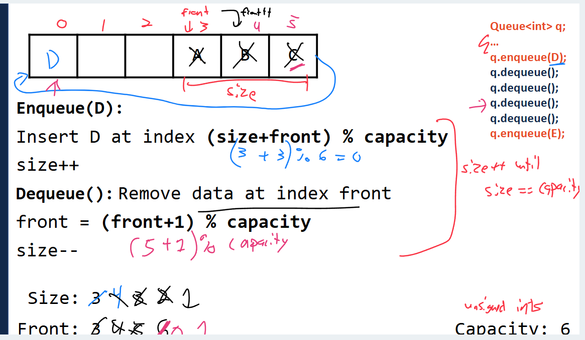

这张图展示了一个使用数组实现的循环队列的操作过程。循环队列是一种使用固定大小数组的数据结构，通过循环利用数组空间以避免数组元素的频繁移动。这里的队列具有6个元素的容量。

**关键元素解释：**

- **Size**：队列中当前元素的数量。
- **Front**：指向队列中第一个元素的索引。
- **Capacity**：队列的总容量，此例中为6。

**操作说明：**

- **Enqueue(D)**：入队操作，将元素D加入队列尾部。新元素插入的位置是 `(size + front) % capacity`。在图示中，size是3，front也是3，所以 `(3 + 3) % 6 = 6 % 6 = 0`，所以D被放在索引0的位置。
- **Dequeue()**：出队操作，移除队列前端的元素。`front` 被更新为 `(front + 1) % capacity`。图示中的步骤解释了如果front为5，那么新的front值为 `(5 + 1) % 6 = 6 % 6 = 0`。

在图中，你还可以看到随着队列操作的进行，队列的size变化，以及front的变化，都是通过模运算来确保索引值不会超出数组边界。

**代码部分**：在右侧有部分C++代码，用于演示队列的操作：

- `q.enqueue(D);` 表示将元素D加入队列。
- `q.dequeue();` 表示从队列中移除一个元素。

总的来说，这是对循环队列数据结构操作的直观示意，通过数组实现，并展示了如何在有限的空间内高效地进行数据插入和删除操作。

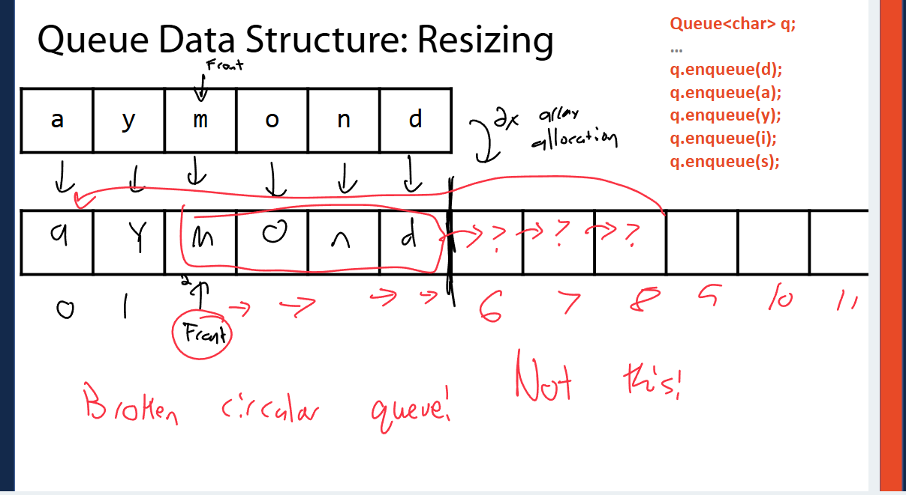

这张图展示了队列数据结构在需要扩容时的调整过程。这里讨论的是循环队列的扩容，即当数组空间不足以容纳更多元素时，如何通过创建一个更大的数组并重新排列元素来解决空间问题。

**关键元素解释：**

- **原始队列**：队列最初的大小和元素排列。在这个例子中，队列中的元素是 `a, y, m, o, n, d`，这些元素占据了原始数组的连续位置。
- **Front**：指向队列中第一个元素的指针，原始队列中指向元素 `a`。

**扩容过程：**

1. **创建新数组**：通常，新数组的大小是原数组的两倍，这里由6个空间扩大到12个空间。
2. **元素复制**：将原数组中的元素按顺序复制到新数组中。从原始队列的 `front` 开始，依次复制每个元素到新数组的起始位置。
3. **更新Front指针**：在新数组中，`front` 更新为指向新数组的第一个元素的索引，通常是0。
4. **重置循环队列结构**：由于是新的数组，原先的循环结构被打破，队列在新数组中呈线性排列。

**注意点**：

- **正确维护队列的元素顺序**：在复制过程中，需要保持元素的相对顺序不变。
- **更新队列属性**：新队列的 `front` 总是从0开始，而 `rear`（尾部指针）则根据队列的元素数量确定在新数组中的位置。

**图示中的红线**：显示了元素从旧数组复制到新数组的过程，表明这是一个元素顺序的直接转移，没有进行任何操作改变元素的先后关系。

**代码部分**：展示了元素是如何被加入到队列中的，以及队列如何进行扩容。例如，`q.enqueue(d);` 将字符 'd' 加入队列。

总结来说，这张图很好地说明了在循环队列中进行动态扩容的过程，通过创建一个更大的数组来容纳更多的元素，并确保队列的基本操作和结构特性不受影响。

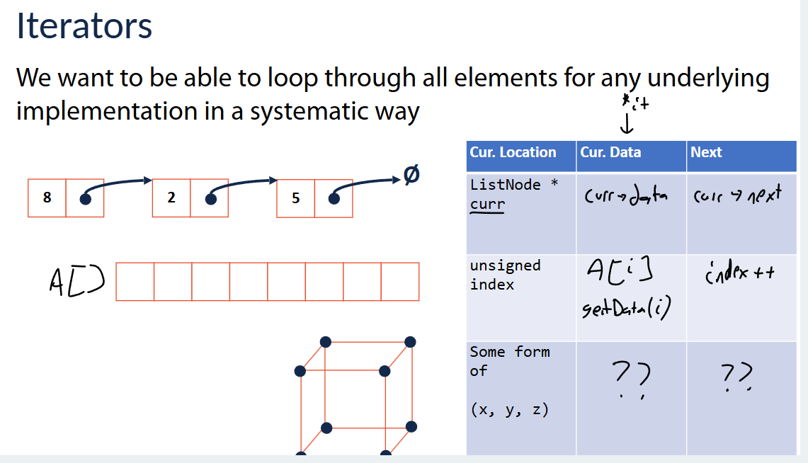

这张图表主要讲解了在不同数据结构中如何使用迭代器来系统地遍历所有元素。

### 主要内容和概念：

1. **迭代器的目的**：
   - 迭代器的核心作用是提供一种统一的方法来访问容器（如数组、链表、图等）中的各个元素，而不需要关心容器的具体实现。
2. **示例展示的数据结构**：
   - **链表**：图中上方展示了一个链表，元素包括8, 2, 5。链表中的每个节点通过指针连接到下一个节点，最后一个节点指向空（null），表示链表的结束。
   - **数组**：下方的红色空框暗示了数组的结构，它是线性连续的存储空间。
   - **图**：右下角的结构是一个图，由节点（顶点）和连接节点的边组成。
3. **迭代器的操作**：
   - 图中展示了迭代器的三个基本属性或方法：
     - **Cur.Location**（当前位置）：表示迭代器当前指向的节点或元素。
     - **Cur.Data**（当前数据）：显示当前迭代器位置的数据。
     - **Next**（下一个）：迭代器移动到下一个元素的操作。
4. **代码与方法**：
   - **`ListNode\* curr`**：这是一个指针，指向当前链表节点。
   - **`curr->data`**：访问当前节点的数据。
   - **`curr->next`**：移动到链表的下一个节点。
   - **`unsigned index`**：在数组迭代中使用的索引变量。
   - **`A[i]`**：访问数组中的元素。
   - **`getData(i)`**：可能是一个函数，用于获取第i个数据。
   - **`index++`**：迭代索引，用于数组遍历。
5. **图的遍历**：
   - 图的遍历可能涉及到坐标（如 x, y, z），或是更复杂的数据结构，这里标记为“Some form of (x, y, z)”以及两个问号，可能表示图遍历的复杂性和多样性。

### 结论：

图说明了迭代器在不同数据结构中的应用，强调了它们为数据访问提供的统一界面。无论底层数据是如何存储的，迭代器都能提供一种简洁的方式来访问和操作这些数据。这种方法有助于编写更清晰、更灵活的代码，尤其是在执行复杂的数据操作和算法时。

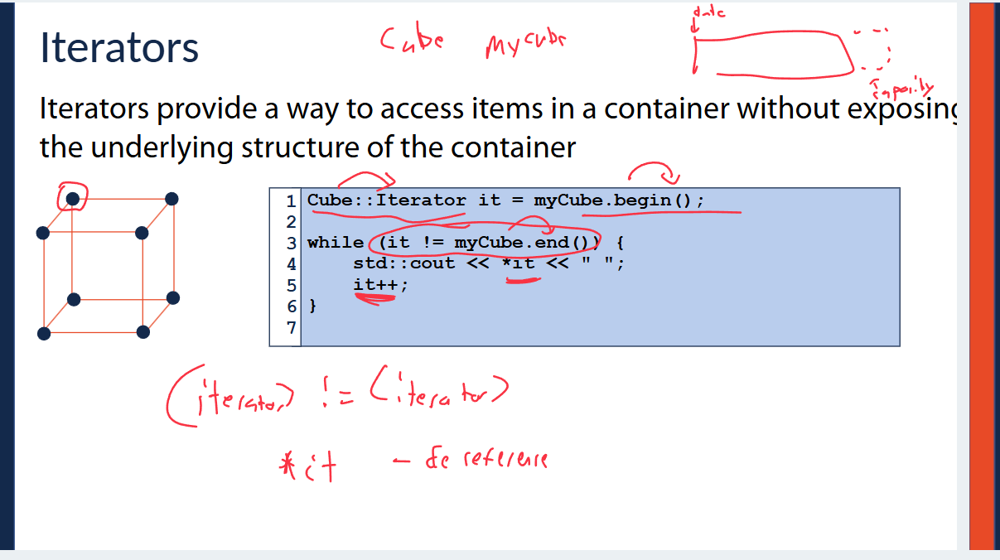

这张图讲解了在C++中使用迭代器来遍历一个称为“Cube”的容器类的元素。迭代器是一个强大的编程工具，它允许程序员以独立于容器类型的方式访问容器中的元素。

### 迭代器的概念

迭代器提供了一种方法，可以在不暴露容器内部结构的前提下遍历容器中的所有元素。这类似于指针，具有指向容器中元素的能力，并能够遍历容器（如前进到下一个元素）。

### 代码解释

在图示的代码块中，展示了如何使用迭代器进行基本的遍历操作：

```cpp
1  Cube::Iterator it = myCube.begin();
2  
3  while (it != myCube.end()) {
4      std::cout << *it << " ";
5      it++;
6  }
```

- **第1行**：声明了一个迭代器`it`，并将其初始化为指向“Cube”容器`myCube`的开始。`.begin()`方法返回指向容器第一个元素的迭代器。
- **第3-6行**：通过`while`循环，使用迭代器`it`遍历`myCube`中的所有元素。循环继续执行，直到迭代器等于`.end()`返回的迭代器，`.end()`是一个哨兵迭代器，表示容器的末尾（实际上指向容器最后一个元素的下一个位置）。
- **第4行**：使用`*it`解引用迭代器，获取它当前指向的元素的值，并将其打印出来。
- **第5行**：迭代器自增`it++`，移动到容器的下一个元素。

### 图中的立方体

左侧的图像显示了一个立方体的结构，它是三维空间中的一个对象。尽管图中并未直接解释立方体如何与迭代器关联，但我们可以推测这可能是一个复杂数据结构，如图形或三维数组，其中的元素可以通过迭代器进行遍历。

### 总结

这段代码和图示非常适合展示如何抽象地处理复杂数据结构，并用统一的方式访问不同类型的容器。迭代器隐藏了容器的内部实现细节，使得代码更加简洁和可维护。

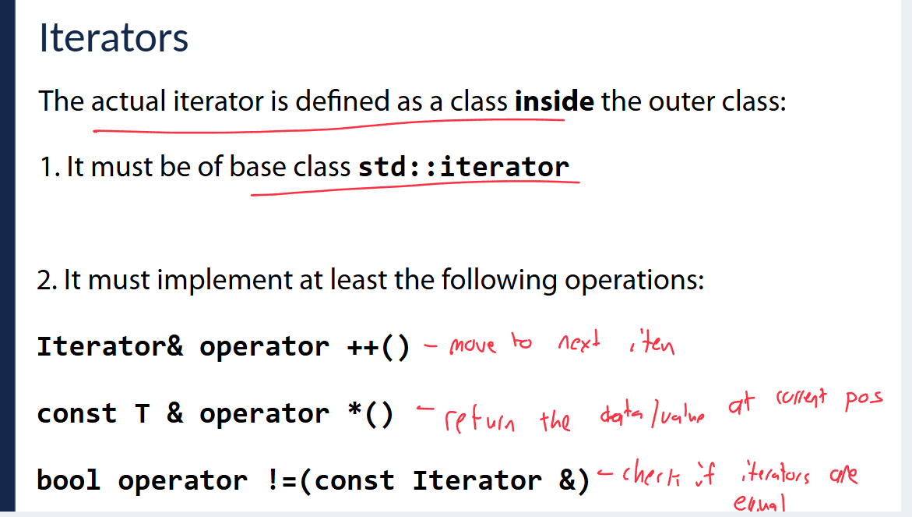

这张图表详细说明了在C++中如何定义一个迭代器类，包括它需要继承的基类和实现的操作。迭代器类通常定义在其所遍历的容器类内部。

### 主要内容解释

1. **基类要求**
   - **`std::iterator`**：迭代器需要继承自`std::iterator`或其它提供迭代器功能的基类。这有助于确保迭代器具备标准迭代器的行为和属性，包括类型定义和迭代器类别。
2. **必须实现的操作**
   - **`Iterator& operator++()`**：这是迭代器的递增运算符，用于移动迭代器到容器的下一个元素。通常实现为前缀和后缀两种形式。前缀形式（`++it`）直接返回递增后的迭代器，后缀形式（`it++`）则返回递增前的迭代器的副本。
   - **`const T& operator\*()`**：解引用运算符，用于获取迭代器当前指向的元素的引用。这允许通过迭代器访问元素的值。
   - **`bool operator!=(const Iterator& other)`**：不等于运算符，用于比较两个迭代器是否不指向同一位置，常用于循环结束的条件判断。

### 使用情景

这些定义通常用在自定义容器类中，例如自定义的链表、树结构、图或数组封装等。定义迭代器类使得容器类可以使用范围基于的for循环（`for(auto x : container)`）和其他标准算法，提高容器类的通用性和易用性。

### 代码结构示例

如果你有一个自定义的容器类，如`MyContainer`，你可能会在内部定义一个迭代器类：

```cpp
class MyContainer {
public:
    class Iterator {
    public:
        using iterator_category = std::forward_iterator_tag;
        using value_type = T;
        using difference_type = std::ptrdiff_t;
        using pointer = T*;
        using reference = T&;

        Iterator(pointer ptr) : m_ptr(ptr) {}

        reference operator*() const { return *m_ptr; }
        pointer operator->() { return m_ptr; }

        // Prefix increment
        Iterator& operator++() { m_ptr++; return *this; }

        // Postfix increment
        Iterator operator++(int) { Iterator tmp = *this; ++(*this); return tmp; }

        friend bool operator== (const Iterator& a, const Iterator& b) { return a.m_ptr == b.m_ptr; };
        friend bool operator!= (const Iterator& a, const Iterator& b) { return a.m_ptr != b.m_ptr; };

    private:
        pointer m_ptr;
    };

    Iterator begin() { return Iterator(&elements[0]); }
    Iterator end() { return Iterator(&elements[size]); }

private:
    T elements[N];
    size_t size = N;
};
```

这样的结构使得迭代器与容器类紧密耦合，同时提供了对容器的高效访问，不暴露容器的内部实现，保证了数据封装和抽象的优势。

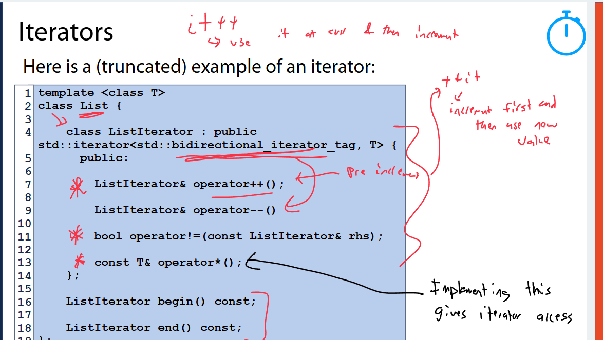

这张图表是C++编程中关于自定义迭代器的示例代码。示例中展示了如何为一个双向链表编写迭代器。迭代器使得使用者可以通过标准方式遍历链表，而不需要了解链表的内部实现细节。

### 主要内容和代码解释

1. **模板类定义**:

   ```cpp
   template <class T>
   class List {
       ...
   };
   ```

   这里定义了一个模板类 `List`，用于创建存储任意类型 `T` 的链表。

2. **迭代器类定义**:

   ```cpp
   class ListIterator : public std::iterator<std::bidirectional_iterator_tag, T> {
       ...
   };
   ```

   - `ListIterator` 类继承自 `std::iterator`，使用 `std::bidirectional_iterator_tag` 表明这是一个双向迭代器，即可以向前也可以向后遍历。
   - 这种迭代器通常用于双向链表。

3. **迭代器功能实现**:

   - **递增运算符 (`operator++`)**:

     ```cpp
     ListIterator& operator++();
     ```

     用于将迭代器移动到链表的下一个节点。

   - **递减运算符 (`operator--`)**:

     ```cpp
     ListIterator& operator--();
     ```

     使迭代器回到链表的前一个节点。

   - **不等于运算符 (`operator!=`)**:

     ```cpp
     bool operator!=(const ListIterator& rhs);
     ```

     用于比较两个迭代器是否不指向同一个链表节点。

   - **解引用运算符 (`operator\*`)**:

     ```cpp
     const T& operator*();
     ```

     返回迭代器当前指向的节点的数据。

4. **迭代器的获取方法**:

   - **`begin()` 方法**:

     ```cpp
     ListIterator begin() const;
     ```

     返回一个指向链表第一个节点的迭代器。

   - **`end()` 方法**:

     ```cpp
     ListIterator end() const;
     ```

     返回一个指向链表尾部（末尾节点后的虚拟位置）的迭代器。

### 总结

此示例展示了如何为容器类（如链表）创建一个自定义的迭代器，允许使用标准的迭代方式（如范围基于的循环和算法）来访问和修改数据。通过继承 `std::iterator` 并标记为双向迭代器，`ListIterator` 提供了对链表的前向和后向遍历的支持，极大地增强了链表类的灵活性和通用性。

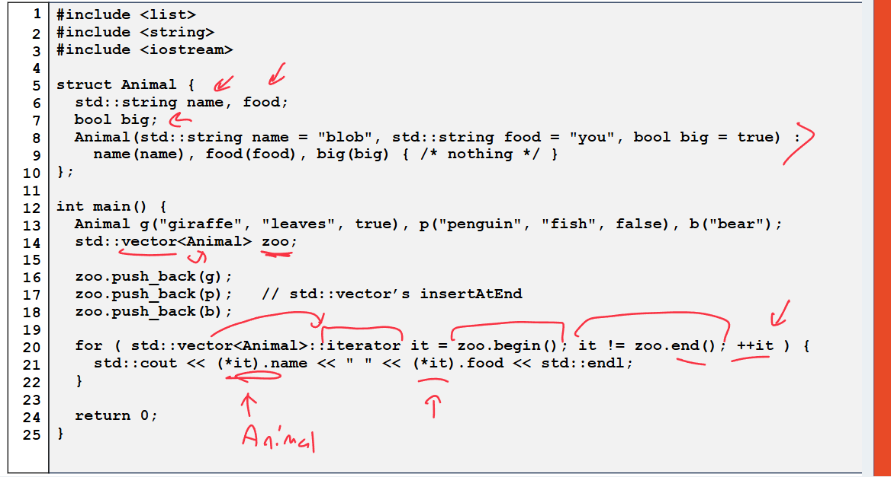

这段代码是一个简单的C++程序，用于展示如何创建一个包含动物信息的`vector`，并使用迭代器遍历这个`vector`来打印每个动物的信息。这里提供详细的解释：

### 1. 头文件和命名空间

```cpp
#include <list>
#include <string>
#include <iostream>
```

- **`<list>`**: 该头文件实际上在这段代码中未使用，可能是误加入的。
- **`<string>`**: 引入字符串类型，因为`Animal`结构中使用了`std::string`。
- **`<iostream>`**: 用于输入输出操作，如`std::cout`。

### 2. Animal 结构定义

```cpp
struct Animal {
    std::string name, food;
    bool big;
    Animal(std::string name = "blob", std::string food = "you", bool big = true)
        : name(name), food(food), big(big) { /* nothing */ }
};
```

- 定义了一个结构`Animal`，包含三个成员：`name`（名字），`food`（食物），`big`（是否是大型动物）。
- 提供了一个构造函数，允许在创建`Animal`对象时初始化这些成员。构造函数有默认参数，如果在创建对象时没有提供特定的值，将使用默认值。

### 3. main函数

```cpp
int main() {
    Animal g("giraffe", "leaves", true), p("penguin", "fish", false), b("bear");
    std::vector<Animal> zoo;
    
    zoo.push_back(g);
    zoo.push_back(p);
    zoo.push_back(b);

    for (std::vector<Animal>::iterator it = zoo.begin(); it != zoo.end(); ++it) {
        std::cout << (*it).name << " " << (*it).food << std::endl;
    }

    return 0;
}
```

- 创建了三个`Animal`对象：`g`（长颈鹿），`p`（企鹅），`b`（熊）。注意，`b`只指定了名字（"bear"），食物和大小使用了构造函数的默认值。
- 创建了一个`std::vector<Animal>`类型的容器`zoo`，用于存储`Animal`对象。
- 使用`push_back`方法将动物对象添加到`zoo`向量中。
- 使用迭代器遍历`zoo`向量，并通过`std::cout`打印每个动物的名字和食物。迭代器`it`是通过`vector`的`begin`和`end`方法获得的，用于访问`vector`中的每个元素。
- 程序遍历结束后返回0，表示正常退出程序。

### 4. 输出

对于每个动物，程序将打印它的名字和食物。例如，对于`g`对象，将打印：

```
giraffe leaves
```

对于`p`对象，将打印：

```
penguin fish
```

对于`b`对象，由于使用了默认的构造参数，将打印：

```
bear you
```

这个程序展示了C++中结构体、向量、迭代器的基本用法以及如何组织和访问复杂数据。

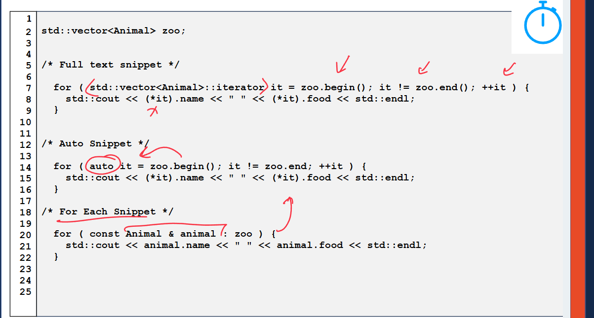

这张图片展示了如何使用不同的方法在 C++ 中遍历 `std::vector<Animal>` 类型的容器，并打印每个元素的属性。这里使用了三种不同的迭代技术：传统的迭代器语法、基于`auto`关键字的迭代器语法和基于范围的`for`循环。

### 1. 传统迭代器语法

```cpp
for (std::vector<Animal>::iterator it = zoo.begin(); it != zoo.end(); ++it) {
    std::cout << (*it).name << " " << (*it).food << std::endl;
}
```

- 这段代码使用显式类型声明（`std::vector<Animal>::iterator`）来创建迭代器`it`。
- `it`初始化为指向`zoo`容器的第一个元素（`zoo.begin()`）。
- 循环继续执行直到`it`等于`zoo.end()`（指向容器最后一个元素的下一个位置）。
- 在循环体内，使用解引用运算符`*`获取迭代器当前指向的元素，并打印其`name`和`food`属性。

### 2. Auto 关键字的迭代器语法

```cpp
for (auto it = zoo.begin(); it != zoo.end(); ++it) {
    std::cout << (*it).name << " " << (*it).food << std::endl;
}
```

- 这段代码与上一示例相似，但使用了`auto`关键字自动推导迭代器的类型，简化了代码。
- 其余逻辑（初始化、循环条件和递增操作）与第一个示例相同。
- `auto`使得代码更加简洁且易于阅读，特别是当迭代器类型名称非常长或复杂时。

### 3. 基于范围的 For 循环

```cpp
for (const Animal &animal : zoo) {
    std::cout << animal.name << " " << animal.food << std::endl;
}
```

- 这是一个基于范围的`for`循环，直接遍历`zoo`容器中的每个元素。
- 这种方式不需要显式创建迭代器，简化了代码。
- 循环变量`animal`是对容器中元素的引用，可以直接访问元素的`name`和`food`属性来进行打印。
- 使用`const`修饰符确保循环体内不会修改元素的内容。

### 总结

这三种迭代方法各有优势：

- **传统迭代器**提供了最大的控制能力和明确性，特别是在需要修改迭代器本身时（如跳过某些元素）。
- **`auto`迭代器**在保持传统控制力的同时简化了代码。
- **基于范围的`for`循环**提供了最简洁的语法，适用于简单地遍历容器并访问元素。

根据具体情况选择合适的迭代方法可以使代码更加清晰、高效。

这张图片展示了如何使用不同的方法在 C++ 中遍历 `std::vector<Animal>` 类型的容器，并打印每个元素的属性。这里使用了三种不同的迭代技术：传统的迭代器语法、基于`auto`关键字的迭代器语法和基于范围的`for`循环。

### 1. 传统迭代器语法

```cpp
for (std::vector<Animal>::iterator it = zoo.begin(); it != zoo.end(); ++it) {
    std::cout << (*it).name << " " << (*it).food << std::endl;
}
```

- 这段代码使用显式类型声明（`std::vector<Animal>::iterator`）来创建迭代器`it`。
- `it`初始化为指向`zoo`容器的第一个元素（`zoo.begin()`）。
- 循环继续执行直到`it`等于`zoo.end()`（指向容器最后一个元素的下一个位置）。
- 在循环体内，使用解引用运算符`*`获取迭代器当前指向的元素，并打印其`name`和`food`属性。

### 2. Auto 关键字的迭代器语法

```cpp
for (auto it = zoo.begin(); it != zoo.end(); ++it) {
    std::cout << (*it).name << " " << (*it).food << std::endl;
}
```

- 这段代码与上一示例相似，但使用了`auto`关键字自动推导迭代器的类型，简化了代码。
- 其余逻辑（初始化、循环条件和递增操作）与第一个示例相同。
- `auto`使得代码更加简洁且易于阅读，特别是当迭代器类型名称非常长或复杂时。

### 3. 基于范围的 For 循环

```cpp
for (const Animal &animal : zoo) {
    std::cout << animal.name << " " << animal.food << std::endl;
}
```

- 这是一个基于范围的`for`循环，直接遍历`zoo`容器中的每个元素。
- 这种方式不需要显式创建迭代器，简化了代码。
- 循环变量`animal`是对容器中元素的引用，可以直接访问元素的`name`和`food`属性来进行打印。
- 使用`const`修饰符确保循环体内不会修改元素的内容。

### 总结

这三种迭代方法各有优势：

- **传统迭代器**提供了最大的控制能力和明确性，特别是在需要修改迭代器本身时（如跳过某些元素）。
- **`auto`迭代器**在保持传统控制力的同时简化了代码。
- **基于范围的`for`循环**提供了最简洁的语法，适用于简单地遍历容器并访问元素。

根据具体情况选择合适的迭代方法可以使代码更加清晰、高效。

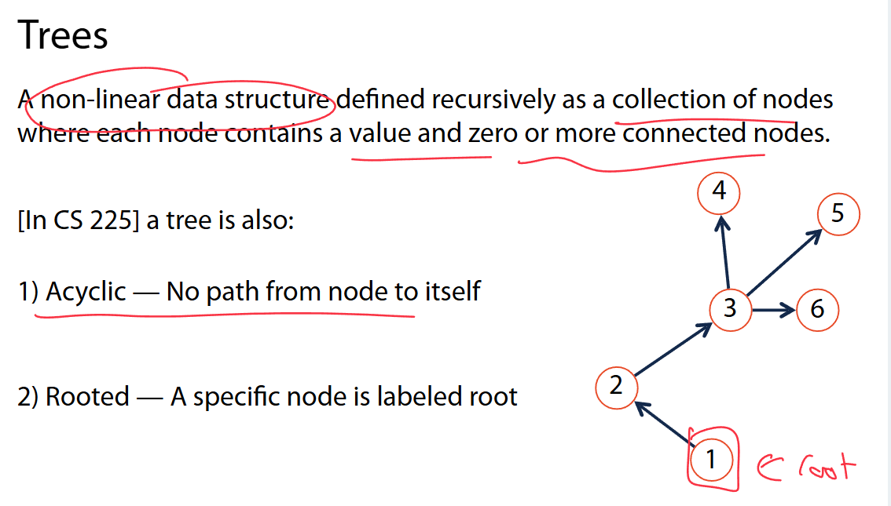

这张图解释了树（Tree）这种数据结构的基本概念和属性。

### 树的定义

树是一种非线性数据结构，它可以递归地定义为一个节点的集合。每个节点包含一个值，并且可以有零个或多个与之相连的子节点。树的结构使得它非常适合表示具有层级关系的数据，如文件系统的目录结构、组织架构等。

### 树的特性

1. **非线性结构**：
   - 这意味着数据元素不是一个接一个线性排列的，而是可以有多个分支，形成复杂的树状结构。
2. **递归定义**：
   - 树可以被看作是由根节点和零个或多个子树组成，每个子树本身也是一个树结构。

### 树的分类属性（以计算机科学课程 CS 225 为例）

1. **无环（Acyclic）**：
   - 树中没有从任何节点出发经过多个节点后又回到原节点的路径。这个属性确保了树结构中不存在循环，每个节点只能有一个父节点和零个或多个子节点。
2. **有根（Rooted）**：
   - 树具有一个特定的节点，被称为根节点，它是数据结构的起点。在图中，节点 1 被标记为根节点。所有的操作和搜索通常都从根节点开始。

### 图中的树结构示例

- 树由节点 1, 2, 3, 4, 5, 和 6 组成。
- 根节点是节点 1。
- 节点 1 有一个子节点，节点 2。
- 节点 2 又有一个子节点，节点 3。
- 节点 3 有三个子节点：节点 4、节点 5 和节点 6。
- 这种排列方式清楚地展示了每个节点如何通过边与其他节点相连，形成树状的层级结构。

### 结论

树是一种非常重要的数据结构，用于模拟具有层级关系的数据集。它的非线性和递归特性使其成为解决许多计算问题的理想选择，例如在编程语言解析、数据库索引、文件系统管理等领域的应用。

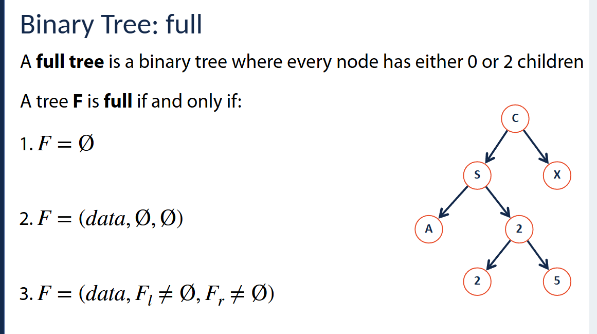

这张图讲述了“满二叉树”（full binary tree）的定义和概念，以及如何确定一个二叉树是否为满二叉树。

### 满二叉树定义

满二叉树是一种特殊的二叉树，其中每个节点要么没有子节点（即叶节点），要么有两个子节点。这意味着没有任何节点只存在一个子节点。

### 图中提到的条件

1. **F = Ø**
   - 这表示树可以是空的，即没有任何节点。根据定义，空树也被视为满二叉树。
2. **F = (data, Ø, Ø)**
   - 这表明如果一个树只有一个节点（没有左右子节点），它也是一个满二叉树。
3. **F = (data, F₁, Fᵣ) where F₁ ≠ Ø and Fᵣ ≠ Ø**
   - 这是满二叉树的递归定义，意味着每个非叶子节点必须有两个非空的子树 F₁ 和 Fᵣ。这里，F₁ 代表左子树，Fᵣ 代表右子树，且两者都不能为空。

### 图中的二叉树示例

图中展示了一个二叉树的实例：

- **根节点**为 C，它有两个子节点 S 和 X。
- **S 节点**进一步有两个子节点 A 和 2。
- **X 节点**没有子节点，因此是叶节点。
- **A 节点**和 **2 节点**（不同于 S 的子节点 2）也是叶节点。
- 一个额外的节点 **5** 作为 **2 节点**（S 的子节点）的右子节点。

### 分析示例的满二叉树属性

根据满二叉树的定义，图中展示的树不是一个满二叉树，因为节点 X 有一个兄弟节点 S 但自己没有子节点（满二叉树要求要么有两个子节点，要么一个也没有），而节点 S 又有两个子节点。这破坏了满二叉树的条件，即所有非叶子节点必须恰有两个子节点。

### 结论

满二叉树的概念在理解二叉树的结构和操作中非常重要，尤其是在实现需要结构严格定义的算法和功能时，如某些特定的搜索和平衡操作。图中提供了满二叉树的清晰定义，并通过实例帮助更好地理解什么样的二叉树构成满二叉树。

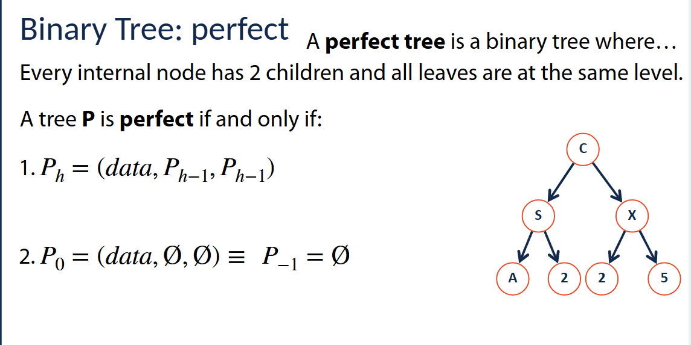

这张图解释了“完美二叉树”（perfect binary tree）的定义和特性，以及如何根据特定条件确定一棵二叉树是否是完美的。

### 完美二叉树定义

完美二叉树是一种特殊的二叉树，其中每个内部节点都恰有两个子节点，并且所有叶子节点都位于同一层级。这意味着每一层都是完全填满的，没有任何间隙。

### 图中的条件解释

#### 1. 递归定义

- Pᵢ = (data, Pᵢ₋₁, Pᵢ₋₁)
  - 这表示一个节点（以某个数据项命名）具有两个子树 Pᵢ₋₁ 和 Pᵢ₋₁，这两个子树自身也是完美二叉树，并且具有相同的高度 h-1。这保证了从任何一个节点到其所有叶子节点的路径长度相同。
  - 每个非叶子节点都有两个子节点，满足完美二叉树的内部节点条件。

#### 2. 基本情况

- P₀ = (data, Ø, Ø)
  - 这是树的基本情况，指的是只有一个节点且没有子节点的树。这种树也视为完美二叉树的一个有效实例。
  - P₋₁ = Ø 表示不存在负高度的树，强调了树的最小可能情况。

### 图中的二叉树示例

图中展示了一个二叉树的实例，具体结构如下：

- **根节点 C**，有两个子节点 S 和 X。
- **节点 S** 有两个子节点 A 和 2。
- **节点 X** 有两个子节点 2 和 5。
- 所有叶节点（A, 两个2, 5）都位于同一层。

这种结构展示了完美二叉树的特征：每个内部节点恰有两个子节点，所有叶节点都在同一层级。图中的树是一个完美二叉树的例子。

### 总结

完美二叉树在多种计算场景中非常有用，尤其是在需要平衡和完全探索的算法中，如某些类型的排序和搜索算法。它保证了每个内部节点都充分利用，同时所有叶子节点的深度均等，这有助于优化遍历和平衡操作。

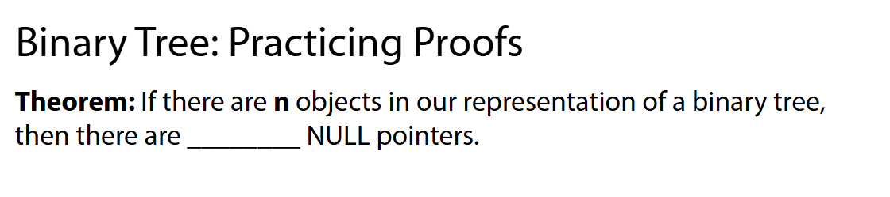

在一个二叉树中，如果存在 nn 个节点，那么将存在 n+1n + 1 个 NULL 指针。这个结论是基于二叉树的每个节点最多有两个子节点的特性，并且每个外部边界（也就是叶节点的左右子节点指针和根节点的父节点指针，如果有的话）都是 NULL。

### 理解这个定理

对于每个节点来说：

- 如果它不是叶节点，其子节点指针可能指向其他节点或为 NULL。
- 如果它是叶节点，其两个子节点指针都将为 NULL。

### 为什么是 n+1n + 1 个 NULL 指针

这个结论可以通过归纳法证明：

- **基本情况**：当树为空（n=0n = 0）时，存在一个 NULL 指针，即树的根本不存在。
- **归纳步骤**：假设一个有 nn 个节点的树有 n+1n + 1 个 NULL 指针。当添加一个新的节点以形成 n+1n+1 个节点时，新节点将替换一个 NULL 指针（这是新节点的父节点的子节点指针之一），但它会引入两个新的 NULL 指针（新节点的两个子节点指针）。因此，NULL 指针的总数从 n+1n + 1 变为 n+2n + 2。

### 结论

因此，对于一个包含 nn 个节点的二叉树，存在的 NULL 指针数量将总是 n+1n + 1。这个性质帮助我们理解二叉树的结构，并可用于编程和理论分析中，确保对二叉树的正确处理和遍历。

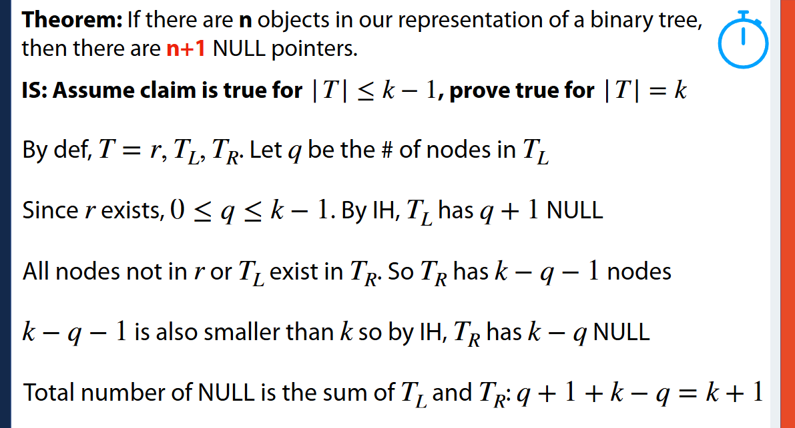

这张图展示了一个用归纳法证明二叉树中 NULL 指针数量的定理。具体来说，这个定理表明在一个包含 nn 个节点的二叉树中，存在 n+1 个 NULL 指针。下面是详细的解释和证明步骤：

### 定理陈述

如果一个二叉树中有 n 个节点，那么存在n+1 个 NULL 指针。

### 证明步骤

1. **归纳假设 (Inductive Hypothesis, IH)**
   - 假设对于所有小于或等于 k-1 的二叉树，该定理成立。即，如果树的大小 ∣T∣≤k−1，那么存在的 NULL 指针数量等于节点数加一。
2. **证明目标**
   - 证明当二叉树大小为 kk 时（即 |T| = k），定理同样成立。
3. **树的结构**
   - 假设二叉树 T 由一个根节点 rr 和两个子树T_L（左子树）和 T_R（右子树）组成。
4. **节点计数**
   - 假设 T_L 有 qq 个节点，那么由于根节点存在，T_R 必然有k-q-1 个节点，因为整个树 T 有 k 个节点。
5. **应用归纳假设**
   - 根据归纳假设，T_L 有 q+1 个 NULL 指针，因为它的节点数是 q。
   - 同样，T_R 有 k-q 个 NULL 指针，因为它的节点数是 k-q-1。
6. **计算总的 NULL 指针数量**
   - 整个树 T 的 NULL 指针数量是左子树和右子树的 NULL 指针之和，即 q+1 + k-q = k+1。

### 结论

因此，对于一个有 k 个节点的二叉树，存在k+1 个 NULL 指针。这符合归纳假设，证明定理对所有 n 成立。

### 图解

图中还展示了这一逻辑的结构和流程，使得理解和验证二叉树中 NULL 指针数量的逻辑变得更加清晰和直观。通过归纳法，我们不仅能够证明具体的数学和计算机科学问题，还能够提供一个结构化和系统化的方法来解决问题。

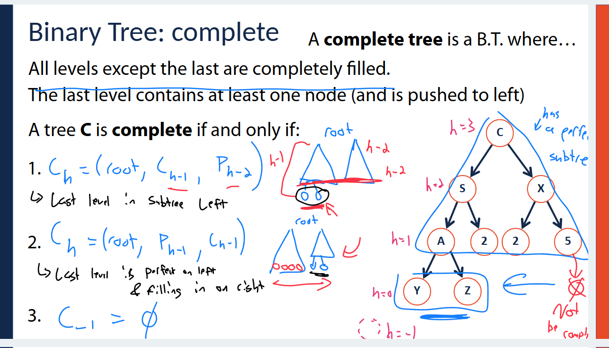

这张图解释了“完全二叉树”（Complete Binary Tree）的定义和条件，并且通过示例和递归的方法说明了如何确定一个二叉树是否为完全二叉树。

### 完全二叉树定义

完全二叉树是一种特殊的二叉树，其中除了最后一层外，所有层都被完全填满，并且所有节点都向左对齐。这意味着最后一层可能不完整，但任何节点都不能出现在左侧节点的右边。

### 图中条件解释

#### 条件概述

- 图中提出了两个可能的递归定义，以及一个基础情况，用于判定一个树是否为完全二叉树。

1. **第一个条件 Ch=(root,Ch−1,Ph−2)**
   - 这表示对于高度为 h 的树，如果左子树是高度为 h-1 的完全二叉树，而右子树是高度为 h-2 的完全二叉树，则该树是完全二叉树。
   - 这表明左子树比右子树高一层，且左子树完全填满。
2. **第二个条件 Ch=(root,Ph−1,Ch−1)**
   - 如果左子树是高度为 h-1 的完美二叉树，而右子树是高度为 h-1 的完全二叉树，则该树也是完全二叉树。
   - 这意味着两个子树具有相同的高度，左子树完全填满。
3. **基础情况 C1=∅**
   - 表明空树也被认为是完全二叉树。

#### 示例解释

- 图中展示的二叉树具有根节点 C，并向下展开到节点 A, S, X, 2, 5, Y, Z。
- 最底层节点 Y, Z 显示了最后一层可能不完全填满的情形，但所有节点都严格向左对齐。

### 为什么图中的树是完全二叉树

- 根据定义，除了最后一层外，所有层都完全填满了。
- 最后一层的节点 Y 和 Z 都位于左侧，且没有在任何左侧节点右边出现节点，这符合完全二叉树所有节点向左对齐的要求。

### 总结

完全二叉树是二叉树中的一种重要类型，它在计算机科学中特别是在数据结构如堆（Heaps）中非常有用。堆通常用作实现优先队列的数据结构，完全二叉树的性质确保了堆的操作效率。图中通过递归定义和具体实例，清晰地解释了完全二叉树的结构和判定方法。

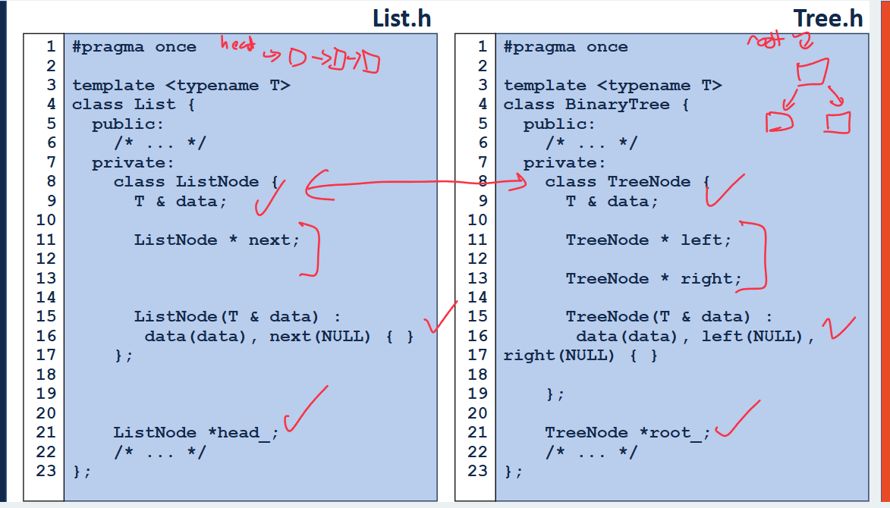

这张图展示了两个 C++ 头文件 `List.h` 和 `Tree.h`，其中定义了两个模板数据结构：一个链表（List）和一个二叉树（BinaryTree）。这些文件使用模板类来允许不同类型的数据存储在数据结构中。每个类都包含一个内部节点类，用于存储数据和链接结构中的元素。

### List.h 文件解释

1. **#pragma once**
   - 这是一个预处理指令，用来确保头文件内容在单个编译中只被包含一次，防止重复定义的问题。
2. **template**
   - 定义了一个模板类 `List`，允许使用任何类型 `T` 作为链表中存储的数据类型。
3. **class ListNode**
   - 是链表中的节点类，用于存储链表的数据。
   - **T &data;**：存储数据的引用。使用引用的目的是避免复制，并直接操作原始数据。
   - **ListNode \*next;**：指向链表中下一个节点的指针。
4. **ListNode(T &data) : data(data), next(NULL) { }**
   - 是 `ListNode` 的构造函数，用来初始化节点。它将 `data` 成员初始化为传入数据的引用，`next` 成员初始化为 `NULL`。
5. **ListNode \*head_;**
   - 是 `List` 类的私有成员，指向链表的头节点。

### Tree.h 文件解释

1. **#pragma once**
   - 同上，防止头文件的重复包含。
2. **template**
   - 定义了一个模板类 `BinaryTree`，允许使用任何类型 `T` 作为二叉树中存储的数据类型。
3. **class TreeNode**
   - 是二叉树的节点类，用于存储树的数据和子节点的链接。
   - **T &data;**：存储数据的引用。
   - **TreeNode \*left;** 和 **TreeNode \*right;**：分别指向左子节点和右子节点的指针。
4. **TreeNode(T &data) : data(data), left(NULL), right(NULL) { }**
   - 是 `TreeNode` 的构造函数，用来初始化节点。它将 `data` 成员初始化为传入数据的引用，`left` 和 `right` 成员初始化为 `NULL`。
5. **TreeNode \*root_;**
   - 是 `BinaryTree` 类的私有成员，指向树的根节点。

### 总结

这两个文件提供了基本的链表和二叉树的数据结构实现，使用了模板以支持多种数据类型。这种结构在 C++ 中非常常见，用于构建灵活且类型安全的数据结构。每个类都通过其节点类来管理数据和节点链接，使用引用来操作数据以避免不必要的复制，并通过构造函数初始化节点。这种实现方法允许灵活地在不同的应用中重用和扩展这些基础结构。

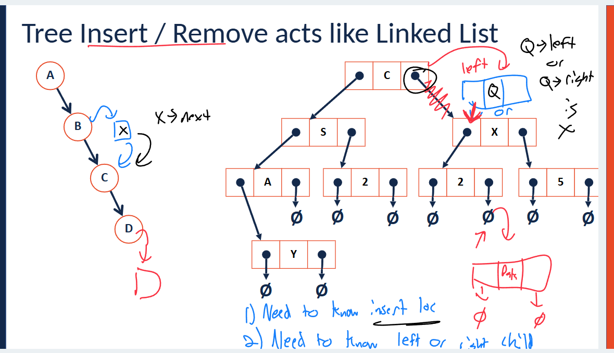

这张图展示了在二叉树中插入和删除节点的操作，以及这些操作如何类似于在链表中进行插入和删除。

### 二叉树的插入和删除

1. **插入操作**
   - 在二叉树中插入一个新节点通常需要确定插入的位置。这依赖于特定的属性或规则，例如在二叉搜索树中，节点的插入位置是基于它们的值来决定的，以保持树的有序性。
   - 图中可能展示了在特定位置插入新节点的过程，虽然具体细节未详细说明。
2. **删除操作**
   - 删除操作更复杂，尤其是当需要删除的节点有两个子节点时。常见的策略包括使用节点的前驱或后继来替换要删除的节点，保持二叉树的结构和有序性。
   - 图中展示了可能的删除过程，包括调整指针以排除特定节点，并保证树的其他部分仍然相连。

### 链表操作的类比

- 在链表中，插入和删除操作涉及到调整节点间的指针来添加或移除元素。
- 二叉树的插入和删除，尽管结构更为复杂，本质上也是通过改变节点间的链接（指针）来实现的。这就是图中提到的“acts like Linked List”的意思。

### 图中的具体内容

- 左侧部分
  - 展示了一个单链表的结构，其中节点 `B` 的 `next` 指针被改变以指向节点 `C`，同时节点 `X` 被排除在外。这可能代表一个节点的删除过程。
- 右侧部分
  - 展示了一个二叉树的结构，其中节点间的连接示意了可能的插入或删除操作。特别指出了某些节点（如 `Q`）可能涉及选择性地连接到左子节点或右子节点，这取决于特定的规则或条件。
  - 注意到需要考虑插入位置及是连接左子节点还是右子节点，这对于保持树的结构特别重要。

### 结论

这张图强调了尽管链表和二叉树在结构上有显著不同，但它们处理插入和删除操作的基本方法（调整指针或链接）是有相似之处的。这种理解有助于深入理解数据结构操作的底层原理，并且可以转用这些原理来解决其他涉及节点和链接的复杂数据结构的问题。

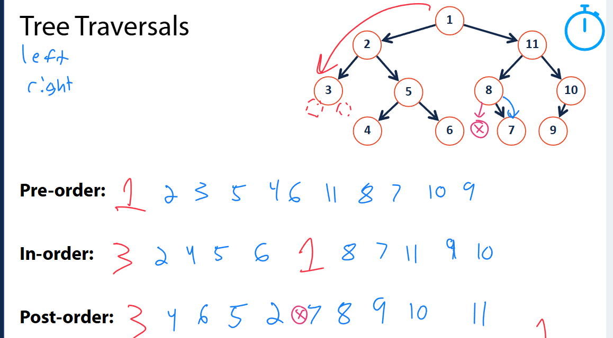

这张图展示了一个二叉树的图形表示和它的三种主要遍历方式：前序遍历、中序遍历和后序遍历。

### 二叉树的结构

二叉树由节点组成，每个节点最多有两个子节点：一个左子节点和一个右子节点。图中的二叉树包括以下节点：

- 根节点是 1，有左子节点 2 和右子节点 11。
- 节点 2 有左子节点 3 和右子节点 5。
- 节点 5 有左子节点 4 和右子节点 6。
- 节点 11 有左子节点 8 和右子节点 10。
- 节点 8 有左子节点 7 和右子节点 9。

### 二叉树遍历

**1. 前序遍历 (Pre-order)**

- **遍历顺序**：根 -> 左 -> 右
- **结果**：1, 2, 3, 5, 4, 6, 11, 8, 7, 9, 10
- 在前序遍历中，首先访问根节点，然后递归地进行左子树的前序遍历，最后是右子树的前序遍历。

**2. 中序遍历 (In-order)**

- **遍历顺序**：左 -> 根 -> 右
- **结果**：3, 2, 4, 5, 6, 1, 7, 8, 9, 11, 10
- 在中序遍历中，首先递归地进行左子树的中序遍历，然后访问根节点，最后是右子树的中序遍历。这种遍历方法特别在二叉搜索树中有用，因为它会按顺序访问所有节点。

**3. 后序遍历 (Post-order)**

- **遍历顺序**：左 -> 右 -> 根
- **结果**：3, 4, 6, 5, 2, 7, 9, 8, 10, 11, 1
- 在后序遍历中，首先递归地进行左子树的后序遍历，然后是右子树的后序遍历，最后访问根节点。

### 说明

这三种遍历方法在应用中各有用途，例如在进行树的复制或者评估时选择合适的遍历方法可以简化操作。图中还展示了树的结构和节点间的连接，帮助更好地理解各种遍历方法如何操作这些连接。


这段文字提出了一个关于改进二叉树搜索能力的问题，以及为了改善搜索能力可能需要做出的权衡。在二叉树的上下文中，这通常涉及选择合适的树结构和维护策略，以下是一些改进搜索能力的方法及其权衡：

### 改进搜索能力的方法

1. **使用二叉搜索树（BST）**:
   - 在二叉搜索树中，节点的左子树包含的值小于节点的值，右子树包含的值大于节点的值。这种结构使得搜索非常高效，理论上在平衡的情况下，搜索时间复杂度为 O(log⁡n)O(\log n)。
2. **保持树的平衡**:
   - 使用自平衡的二叉搜索树，如 AVL 树或红黑树。这些树在插入和删除操作后会通过旋转操作自动保持平衡，从而确保最坏情况下的操作时间复杂度仍然是 O(log⁡n)O(\log n)。
3. **优化树的结构**:
   - 采用伸展树（Splay Tree）策略，这种树会在访问特定节点后进行局部重组，将访问的节点移至树的根部，从而使得经常访问的节点更容易更快被再次访问到。

### 需要做出的权衡

1. **时间复杂度与操作复杂性**:
   - 虽然自平衡二叉搜索树提供了优秀的时间复杂度保证，但这种结构的插入和删除操作相比简单的二叉搜索树更为复杂，需要进行额外的旋转和重新平衡操作。
2. **内存使用**:
   - 自平衡树结构可能需要额外的内存来存储平衡信息（如 AVL 树中的平衡因子或红黑树中的颜色标记）。
3. **实现难度**:
   - 自平衡二叉搜索树的实现比普通的二叉搜索树复杂，维护成本和错误可能性更高。
4. **性能稳定性**:
   - 在特定情况下，如伸展树可能会在某些连续操作中表现不佳，尽管平均性能良好。这是因为伸展树在访问时进行大量的旋转，可能会在短时间内导致性能下降。

通过选择适合特定应用需求的树结构和维护策略，可以显著提高二叉树的搜索效率，但这往往伴随着增加的复杂性和资源使用。在设计数据结构时，理解和评估这些权衡是非常重要的。

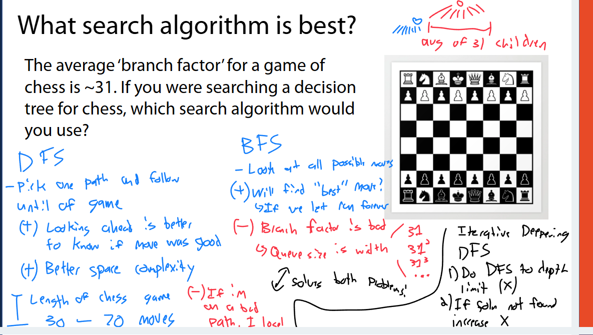

这张图讨论了在处理一个平均分支因子约为31的棋类游戏决策树时，哪种搜索算法更适合使用。图中对比了深度优先搜索（DFS）和广度优先搜索（BFS），并提到了迭代加深深度优先搜索（Iterative Deepening DFS）作为一个可能的最佳解决方案。

### 分析

1. **深度优先搜索 (DFS)**

   - 优点

     ：

     - **空间复杂度较低**：DFS因为只需存储单一路径上的节点，因此空间复杂度相对较低。
     - **预见性**：DFS能够深入探索决策树，有助于了解某一具体路径的最终结果。

   - 缺点

     ：

     - **可能错过最优解**：DFS可能陷入一个较差的路径而错过更好的解决方案。
     - **效率问题**：在高分支因子的树中，DFS可能需要很长时间来回溯并找到解决方案。

2. **广度优先搜索 (BFS)**

   - 优点

     ：

     - **可以找到最优解**：BFS逐层搜索，可以保证找到的解决方案是最优的，特别是在找到最短路径问题上。

   - 缺点

     ：

     - **空间复杂度高**：对于分支因子高的游戏如国际象棋，每层的节点数呈指数级增长，BFS会消耗大量内存。
     - **分支因子问题**：平均分支因子为31意味着内存需求非常高，不实际。

3. **迭代加深深度优先搜索 (Iterative Deepening DFS)**

   - 优点

     ：

     - **结合了DFS和BFS的优点**：通过逐步增加搜索深度，它结合了DFS的空间效率和BFS的完整性。
     - **灵活性和效率**：如果某一深度没有找到解决方案，它会增加深度限制，继续搜索，这样可以逐渐覆盖整个搜索空间，同时保持较低的空间复杂度。

   - 操作方式

     ：

     - 首先限制搜索深度，进行DFS。
     - 如果在该深度没有找到解决方案，增加深度限制并重复搜索。

### 结论

对于具有高分支因子的棋类游戏决策树，迭代加深DFS通常是最佳选择，因为它有效平衡了内存使用和找到最优解的能力。通过逐渐增加搜索深度，它避免了BFS的高空间复杂度，同时克服了普通DFS可能错过较优路径的问题。

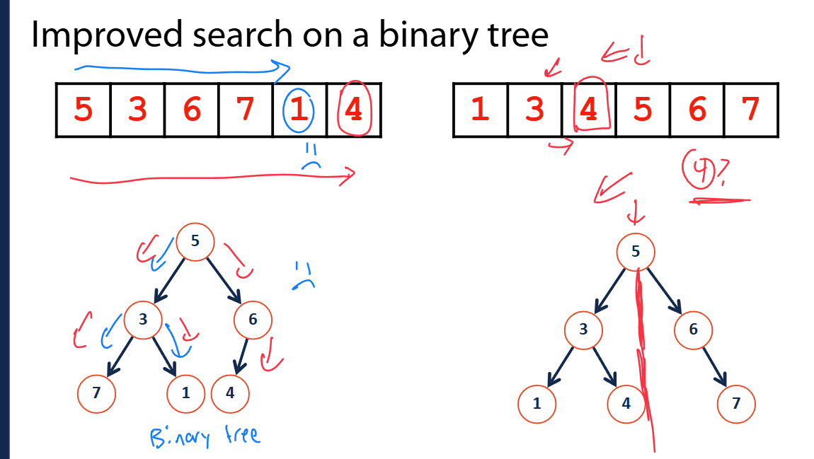

这张图解释了如何通过将一个数组转换成二叉搜索树（BST）来改进搜索效率。图中分两部分说明了如何从一个未排序的数组构建二叉搜索树，并通过排序数组来创建一个平衡的二叉搜索树。

### 数组转换为二叉搜索树的过程

1. **未排序的数组转换为二叉搜索树**：
   - 数组：[5, 3, 6, 7, 1, 4]
   - 选择第一个元素 5 作为根节点。
   - 遵循二叉搜索树的规则：小于根节点的值放在左子树，大于根节点的值放在右子树。
   - 递归地对每个子树进行同样的处理。
   - 结果是一个非平衡的二叉搜索树，其结构依赖于数组的初始顺序。
2. **排序后的数组转换为平衡二叉搜索树**：
   - 数组：[1, 3, 4, 5, 6, 7]（已排序）
   - 选择中间的元素（或中间靠左的元素）作为根节点，这里是 5。
   - 将数组分为左右两部分，左侧 [1, 3, 4] 和右侧 [6, 7]。
   - 递归地选择每部分的中间元素作为子节点，构建左右子树。
   - 结果是一个平衡的二叉搜索树，更适合搜索操作，因为每个节点查找的平均时间复杂度更低。

### 改进搜索的效果

- **非平衡树**：可能导致最坏情况下的搜索时间复杂度接近 O(n)，例如在极端情况下退化成链表。
- **平衡树**：确保树的深度最小，使得搜索、插入和删除操作的时间复杂度都能维持在 O(log n)。

### 关键点

- 使用二叉搜索树可以提高搜索效率，但如果树不平衡，效率会受到影响。
- 构建平衡二叉搜索树是提高搜索效率的关键方法，特别是在数据量大或搜索操作频繁的应用中。
- 从排序数组构建二叉搜索树是确保树平衡的一种有效方法。

这种方法的选择依赖于数据的使用场景和性能需求，平衡树虽然在构建时需要更多的处理（如排序），但提供了更优的搜索性能。

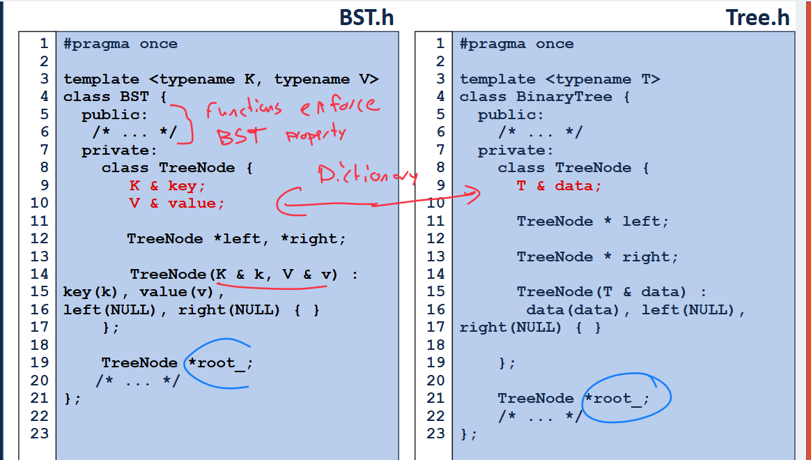

这张图展示了两个 C++ 头文件：`BST.h` 和 `Tree.h`。这些文件定义了二叉搜索树（BST）和一般的二叉树的模板类结构。我们来详细解释这两个文件的内容和它们的区别。

### BST.h 文件解释

1. **#pragma once**
   - 这是一个预处理指令，用于保证头文件在同一编译单元中只被包含一次，防止定义冲突。
2. **template<typename K, typename V>**
   - 这定义了一个模板类 `BST`，使用两个类型参数：K（键的类型）和V（值的类型），这允许 `BST` 存储键值对，类似于字典。
3. **class TreeNode**
   - 这是 `BST` 的一个内部类，用于表示树中的每个节点。
   - **K &key; V &value;**：节点存储的键和值的引用。
   - **TreeNode \*left, \*right;**：指向左子节点和右子节点的指针。
4. **TreeNode(K & k, V & v) : key(k), value(v), left(NULL), right(NULL) { }**
   - `TreeNode` 的构造函数，初始化节点的键和值，并将左右子节点设置为NULL。
5. **TreeNode \*root_;**
   - 指向二叉搜索树根节点的指针。

### Tree.h 文件解释

1. **#pragma once**
   - 与上面相同，防止头文件重复包含。
2. **template**
   - 定义了一个模板类 `BinaryTree`，使用一个类型参数 T，代表树中存储的数据类型。
3. **class TreeNode**
   - 这是 `BinaryTree` 的一个内部类，用于表示树中的节点。
   - **T &data;**：节点存储的数据的引用。
   - **TreeNode \*left, \*right;**：指向左右子节点的指针。
4. **TreeNode(T & data) : data(data), left(NULL), right(NULL) { }**
   - `TreeNode` 的构造函数，与 `BST.h` 中类似，初始化节点的数据，并将左右子节点设置为NULL。
5. **TreeNode \*root_;**
   - 指向二叉树根节点的指针。

### 区别和用途

- **BST.h** 是为了实现二叉搜索树特别设计的，支持键值对存储，适合于需要按键快速检索数据的场合。
- **Tree.h** 提供了更一般的二叉树实现，适用于不需要内部排序的应用场景。

这两个头文件的设计反映了不同的数据结构需求：`BST` 用于数据检索优化，而普通的 `BinaryTree` 更适合基本的树结构操作。使用这些数据结构可以高效地管理数据和提高特定操作的性能，如查找、插入和删除等。

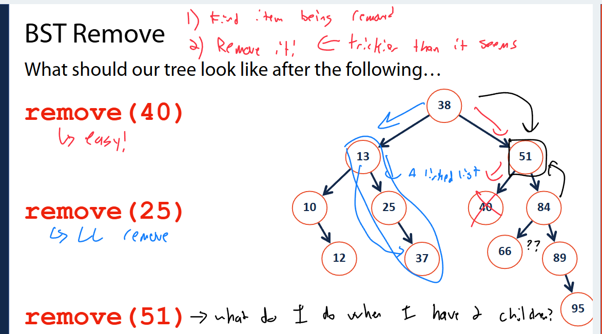

这张图描述了从二叉搜索树（BST）中删除节点的几种情况，并询问树在进行这些删除操作后将会如何看起来。图中展示了三个删除操作的示例：删除节点 40、25 和 51，并提到了这些操作的复杂性。我们来详细解释每一种删除操作及其对树结构的影响。

### 1. 删除节点 40

- 情况说明

  ：节点 40 在图中不存在，但如果存在，很可能是一个叶子节点或者只有一个子节点（因为未明确显示）。这种情况下的删除操作比较简单：

  - 如果是叶子节点，直接移除。
  - 如果只有一个子节点，将其子节点提升到它的位置。

### 2. 删除节点 25

- 情况说明

  ：节点 25 在图中有一个左子节点（10）和一个右子节点（37）。这种情况下的删除稍微复杂，需要找到一个替代节点来保持二叉搜索树的性质。

  - 通常的做法是使用其右子树中的最小节点（后继）或左子树中的最大节点（前驱）来替换它。
  - 在这个例子中，可以选择节点 37（因为它没有左子节点，是右子树中的最小节点）来替代节点 25。

### 3. 删除节点 51

- 情况说明

  ：节点 51 在图中有两个子节点（38 和 84），这是删除操作中最复杂的情况。

  - 同样，可以使用后继（66，因为是右子树中的最小节点）或前驱来替换。
  - 将节点 66 提升到节点 51 的位置，并调整原节点 66 的位置（如果 66 有右子节点，如 89，该节点将替代 66 的位置）。

### 总结

每次删除操作都要保证二叉搜索树的性质未受破坏：

- 对于**无子节点或一个子节点**的情况，处理相对简单，直接移除或提升子节点。
- 对于**有两个子节点**的情况，需要寻找合适的替代节点（后继或前驱），这通常涉及到更多的步骤，例如可能需要从替代节点的原位置移除替代节点。

通过这种方式，即使在删除具有复杂子树结构的节点后，二叉搜索树依然可以维持其所有操作的效率和正确性。

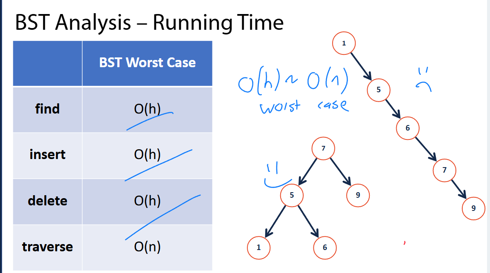

这张图解释了在二叉搜索树（BST）的最坏情况下的运行时间分析。图中给出了基本的 BST 操作——查找（find）、插入（insert）、删除（delete）和遍历（traverse）的时间复杂度，以及一张展示最坏情况下树结构的示意图。

### 运行时间分析

1. **查找 (find)**: 时间复杂度为 O(h)
   - 在最坏的情况下，查找操作需要遍历从根节点到叶节点的路径，其中 `h` 是树的高度。在不平衡的树中，这可能接近线性时间，尤其是当树高度 h 接近节点数 n 时。
2. **插入 (insert)**: 时间复杂度为 O(h)
   - 插入新节点同样可能需要遍历从根节点到适当叶节点的路径。插入位置取决于要插入节点的值，和树中已有节点值的比较。
3. **删除 (delete)**: 时间复杂度为 O(h)
   - 删除节点可能需要额外的步骤，特别是当被删除的节点有两个子节点时。通常需要找到节点的后继或前驱（取决于树的具体结构），这可能涉及到额外的树遍历。
4. **遍历 (traverse)**: 时间复杂度为 O(n)
   - 遍历操作需要访问树中的每个节点一次，无论树的形状如何，因此时间复杂度总是与节点数 n 线性相关。

### 最坏情况下的树结构

图中显示的是一个高度不平衡的二叉搜索树示例，其中节点以一种接近线性链的方式排列，例如 `1-5-6-7-9`。这种结构的高度 h 接近节点数 n，从而导致最坏情况下的时间复杂度接近 O(n) 而不是理想的 O(log n)。

### 关键点

- 二叉搜索树的效率高度依赖于其平衡性。如果树高度保持在对数级别，所有操作的效率都会大大提高。
- 最坏情况通常出现在树高度最大时，即树完全不平衡，形状类似于一个链表。
- 确保树的平衡（例如使用 AVL 树或红黑树）可以避免这种最坏情况，保持操作的对数时间复杂度。

这张图有效地说明了为什么在使用二叉搜索树时需要考虑树的平衡问题，以及如何通过平衡操作优化树的性能。

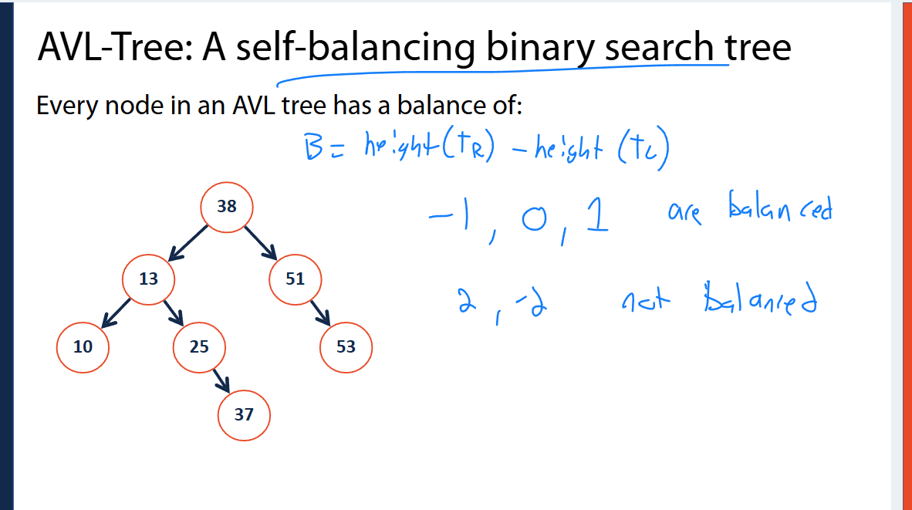

这张图介绍了AVL树，这是一种自平衡的二叉搜索树。在AVL树中，每个节点的平衡因子都保持在-1、0或1之间，以确保树的高度大致保持在对数级别，从而优化搜索、插入和删除操作的效率。

### AVL树的定义和特点：

1. **平衡因子 (B) 的计算**:
   - 平衡因子定义为节点的右子树高度 (hr) 减去左子树高度 (hl)：`B = height(T_r) - height(T_l)`。
   - 这个平衡因子帮助维护树的平衡，使得任何节点的左右子树的高度差不会超过1。
2. **平衡条件**:
   - 如果任何节点的平衡因子绝对值超过1（即2或-2），则该树不平衡，需要通过旋转操作来恢复平衡。
   - 平衡的节点的平衡因子是-1、0或1。
3. **示例中的AVL树结构**:
   - 节点38是根节点，它的子节点为13和51。
   - 节点13有子节点10和25，节点25又有一个子节点37。
   - 节点51有一个子节点53。

### AVL树的旋转操作：

为了维护平衡，AVL树在插入或删除节点后可能需要进行旋转操作。这些旋转操作有：

1. **单旋转**:
   - 右旋转（左左情况）
   - 左旋转（右右情况）
2. **双旋转**:
   - 左-右旋转（左右情况）
   - 右-左旋转（右左情况）

每次插入或删除操作后，AVL树都会从变更点向上回溯到根节点，检查并修正任何平衡因子偏差。

### 效率：

由于维护了平衡，AVL树的操作（查找、插入、删除）的时间复杂度在最坏情况下都是O(log n)，其中n是树中节点的数量。这保证了即使在极端情况下，操作的效率也远高于普通的二叉搜索树。

总之，AVL树通过在每个节点保存平衡信息并通过旋转操作来自动维持树的平衡，从而提供了高效的动态集合管理功能。这使得AVL树非常适合需要频繁插入和删除操作的场景。

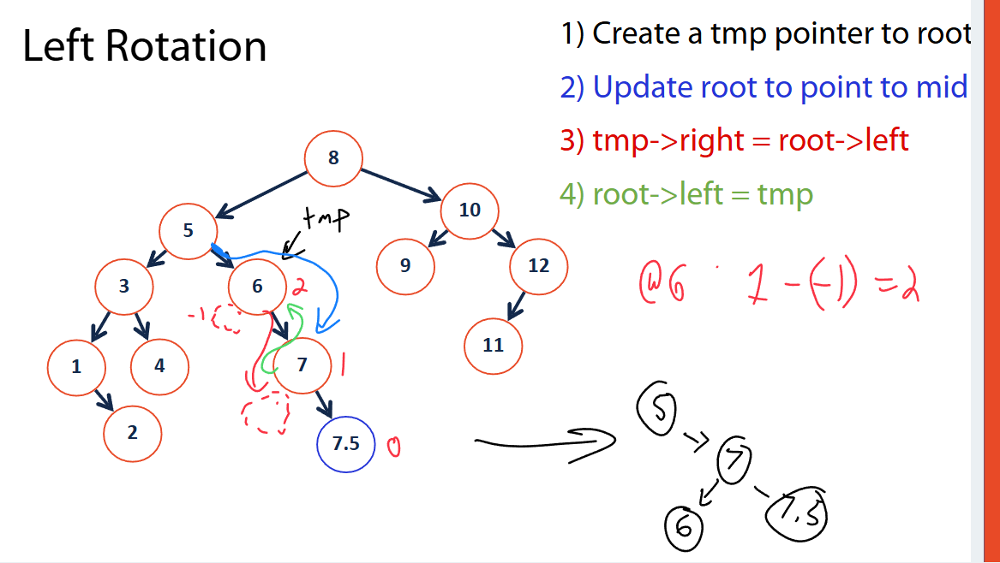

这张图详细描述了在二叉搜索树（BST）中进行左旋转（Left Rotation）的过程。左旋转是一种树的调整操作，通常用于AVL树或红黑树等自平衡二叉搜索树中，以维持或恢复树的平衡。这个操作特别是在插入或删除节点后，树的某个部分变得过于向右倾斜（右重）时使用。

### 左旋转步骤解释：

1. **创建一个临时指针 tmp 指向当前的根节点**（图中为节点 8）。
2. **更新根指针以指向中间节点**（图中为节点 6，这是要成为新根的节点）。
3. **将 tmp（旧根节点）的左子树指向中间节点的右子树**（将节点 8 的左子树指向节点 6 的右子树，节点 7）。
4. **将中间节点的右子树更新为 tmp**（节点 6 的右子树现在指向节点 8）。

### 操作的可视化说明：

- **操作前的树**：
  - 根节点为 8，它的左子节点是 5，右子节点是 10。
  - 节点 5 的左子树较深，包含节点 3 和节点 6。节点 6 又有自己的子节点，这使得节点 5 的右子树“重”于左子树。
- **旋转操作**：
  - 将节点 6 提升为根节点。
  - 节点 8（原根节点）现在成为节点 6 的右子节点。
  - 节点 7（原节点 6 的右子节点）移动为节点 8 的左子节点。
- **操作后的树**：
  - 根节点现在是 6。
  - 节点 5 成为节点 6 的左子节点，节点 8 成为右子节点。
  - 调整后的树结构更加平衡，减少了搜索深度。

### 效果：

左旋转主要用于减少树的右侧深度，从而帮助保持或恢复树的平衡性。通过这种旋转，可以保证树的操作（如查找、插入和删除）保持在对数时间复杂度，有效提升操作的效率。在自平衡二叉搜索树中，这种旋转是自动进行的，以确保任何时候树的高度都尽可能低。

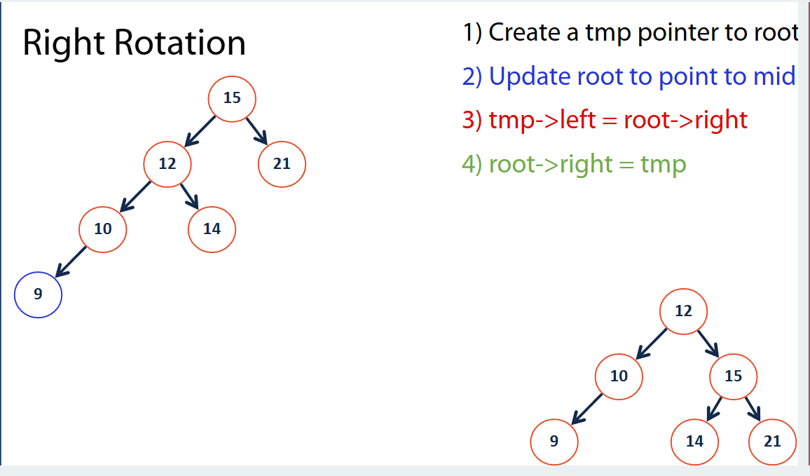

这张图展示了在二叉搜索树（BST）中进行右旋转（Right Rotation）的过程。右旋转是另一种树的调整操作，常用于自平衡二叉搜索树（如AVL树或红黑树）中，用来维持或恢复树的平衡。这种操作通常用于处理树变得过于左重（左侧过深）的情况。

### 右旋转步骤详解：

1. **创建一个临时指针 tmp 指向当前的根节点**（图中为节点 15）。
2. **更新根指针指向中间节点**（图中为节点 12，这将成为新的根节点）。
3. **将 tmp（原根节点）的左子树指向中间节点的右子树**（将节点 15 的左子树指向节点 12 的右子树，节点 14）。
4. **将中间节点的右子树更新为 tmp**（节点 12 的右子树现在指向节点 15）。

### 操作前后的树结构：

- 操作前的树

  ：

  - 根节点为 15，左子节点为 12，右子节点为 21。
  - 节点 12 进一步连接到节点 10 和节点 14，其中节点 10 连接到最左侧的节点 9。

- 右旋转操作

  ：

  - 将节点 12 提升为新的根节点。
  - 节点 15 降为节点 12 的右子节点。
  - 节点 14（原节点 12 的右子节点）成为节点 15 的左子节点。

- 操作后的树

  ：

  - 新的根节点是 12。
  - 节点 12 的左子树包括节点 10（及其子节点 9），右子树包括节点 15（及其子节点 14 和 21）。

### 效果和用途：

右旋转主要用于减少树的左侧深度，帮助树保持或恢复平衡。通过这种旋转，可以确保树的操作（如查找、插入和删除）保持在对数时间复杂度，从而提高效率。在自平衡二叉搜索树中，这种旋转是自动进行的，以确保树的高度尽可能低，操作尽可能高效。

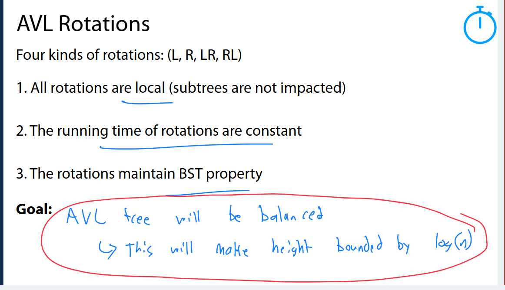

这张图解释了AVL树的旋转操作，这些操作是为了保持树的平衡。AVL树是一种自平衡二叉搜索树，确保任何时候树的高度都大约是其包含节点数的对数，这样可以保证操作的高效性。

### AVL树的四种旋转类型：

1. **L（左旋转）**：当一个节点的右子树比左子树高时，进行左旋转。
2. **R（右旋转）**：当一个节点的左子树比右子树高时，进行右旋转。
3. **LR（左-右旋转）**：当一个节点的左子树的右子树较高时，先对该左子树进行左旋转，然后对主节点进行右旋转。
4. **RL（右-左旋转）**：当一个节点的右子树的左子树较高时，先对该右子树进行右旋转，然后对主节点进行左旋转。

### 旋转的特点和目标：

1. **局部性**：
   - 所有旋转都是局部的，即只涉及到特定的节点及其子节点，不会影响到其他的子树。
2. **时间复杂度**：
   - 每次旋转的时间复杂度是常数级（O(1)），因为只涉及几个指针的改变。
3. **维护BST属性**：
   - 旋转操作保持了二叉搜索树的性质，即任何节点的左子节点都比它小，右子节点都比它大。
4. **平衡维护**：
   - 旋转的目标是确保树的平衡，使得任何节点的左右子树的高度差不超过1。这保证了树的高度始终约为log(n)，其中n是树中节点的数量。

### 效果：

通过这些旋转操作，AVL树保持了其高度的对数界限，从而在查找、插入和删除操作上提供了对数时间复杂度，这比普通的二叉搜索树在最坏情况下的线性时间复杂度要有效得多。这使得AVL树在需要高效查找并且频繁更新的应用场景中非常有用。

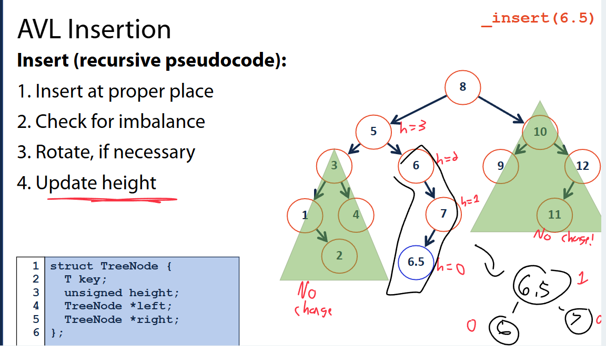

这张图解释了在AVL树中插入一个节点的过程及其后续的平衡调整。AVL树是一种自平衡二叉搜索树，目的是保持树的高度尽量低，从而保证搜索效率。

### AVL插入操作步骤：

1. **插入到适当位置**：首先像在普通二叉搜索树中那样，根据二叉搜索树的属性找到新节点的插入位置。这里插入的值是6.5。
2. **检查不平衡**：插入后，从插入点向上回溯到根节点，检查每个节点的平衡因子（左子树高度与右子树高度的差）。AVL树要求每个节点的平衡因子必须是-1、0或1。
3. **必要时旋转**：如果发现某个节点的平衡因子超出了[-1, 1]的范围，需要通过旋转操作来恢复平衡。这可能涉及到左旋、右旋、左右旋或右左旋。
4. **更新高度**：每次插入或旋转后，都需要更新经过的节点的高度。

### 示例中的操作：

- 插入节点6.5到节点6和7之间。
- 插入后，需要检查节点6.5的父节点6，因为插入可能会影响到这个节点及其祖先节点的平衡。
- 在这个特定的例子中，图显示了插入节点6.5后的树的结构，包括各个节点的高度。例如，节点6现在有一个右子节点6.5，且节点6的高度可能需要更新。

### 图中的结构：

- 左侧显示了整个树，标明了各个节点的高度以及插入新节点后对高度的影响。
- 右侧详细显示了节点6周围的局部树结构，突出显示了新插入的节点6.5以及需要考虑平衡调整的节点。

这个过程确保了AVL树在执行插入操作后依然保持平衡，从而维护了操作的效率。

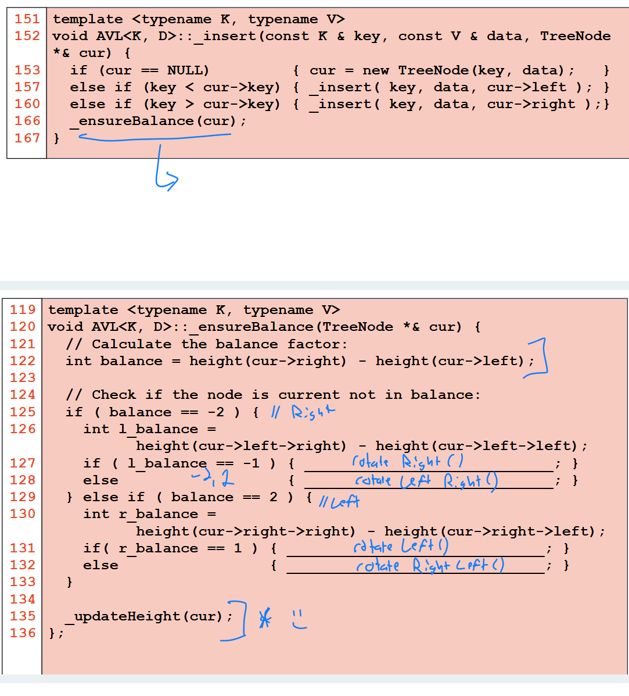

这张图片显示的是AVL树的插入和平衡保持的代码段。AVL树是一种自平衡的二叉搜索树，其中每个节点的左子树和右子树的高度最多相差1。这种结构保证了在进行查找、插入和删除操作时，树的高度保持对数级别，从而优化操作性能。

### 代码解释：

#### 插入操作 (`insert` 函数)

- **参数**: 接收键 (`K key`)、值 (`V data`) 和当前节点的指针 (`TreeNode *cur`)。

- 逻辑

  :

  1. **空位置检查**：如果当前节点 (`cur`) 为空，说明找到了插入点，创建一个新的节点。
  2. **递归插入**：如果插入的键小于当前节点的键，则在当前节点的左子树中递归插入；如果大，则在右子树中递归插入。
  3. **平衡调整**：插入完成后，调用 `_ensureBalance` 函数来检查并恢复AVL树的平衡。

#### 平衡保持 (`_ensureBalance` 函数)

- **计算平衡因子**：平衡因子是右子树高度减去左子树高度。这用于检测树是否失衡。

- 平衡恢复

  ：

  - 如果平衡因子为-2（左重），则需要根据左子树的平衡情况决定是进行右旋还是左-右双旋。
  - 如果平衡因子为2（右重），则根据右子树的平衡情况进行左旋或右-左双旋。

- **更新高度**：旋转后更新当前节点的高度。

### 旋转操作说明：

- **右旋** (`Right Rotation`): 当某节点的左子树比右子树高度高两级时，进行右旋以恢复平衡。
- **左旋** (`Left Rotation`): 当某节点的右子树比左子树高度高两级时，进行左旋以恢复平衡。
- **左-右旋** (`Left-Right Rotation`): 先在左子树上进行左旋，再对当前节点进行右旋。
- **右-左旋** (`Right-Left Rotation`): 先在右子树上进行右旋，再对当前节点进行左旋。

这些操作确保每次插入后，AVL树都能快速调整自己以维持平衡，从而保证查找效率。