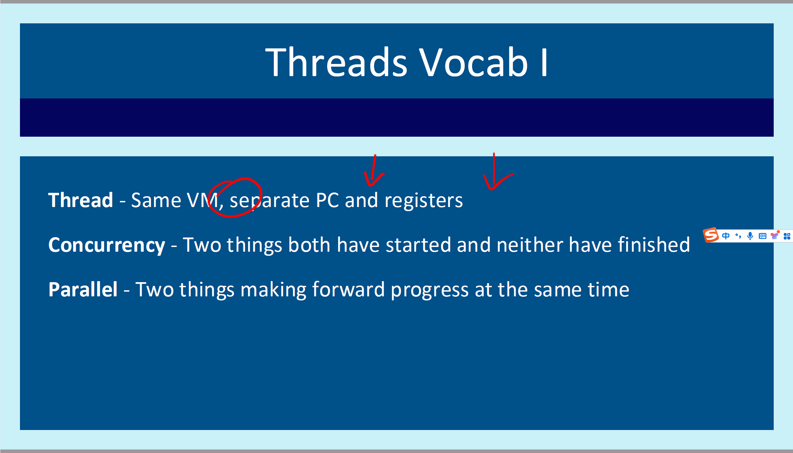

202504010011
后台姓名：谈源
用户ID：102424
用户1V1昵称：102424
学生需求类型：考前辅导
学生基础：一般
期望上课时间：美中周二上午10点开始有时间，除了12;30-13:50没时间，其他都OK
学生DUE时间：美中周三下午
用户类型：1v1新用户
院校：UIUC
年级：大三
专业：数学
科目代码：CS340
科目名称：Introduction to Computer Systems”
备注：学生代码这块需要重点讲讲，主要是举一反三这一块有点差，怕到时候考试遇到的题目不会做，辛苦老师也可以帮忙找找相关题目带着做一下，


你上传的图片似乎是与计算机科学课程（CS 340）相关的幻灯片或海报。标题“Daemons, Zombies, and Deadlocks (The spooky side of CS)”表明，这部分内容讲解的是计算机科学中的一些概念，并使用了“恐怖”一词来进行有趣或主题化的表达。

以下是这些术语在计算机科学中的含义：

1. **Daemon（守护进程）**：在计算机中，守护进程是一个在后台运行的程序，通常不与用户直接交互。这些进程负责执行系统维护、处理网络请求或定期任务。守护进程的名称来源于“精灵”的概念，意味着它们像幽灵一样在后台默默运行。
2. **Zombie（僵尸进程）**：在计算机中，僵尸进程指的是已经执行完毕但仍然在进程表中占据一个条目的进程。它是一个“死”掉的进程，但并没有完全从系统中清除。这个概念类似于“死而复生”的僵尸。
3. **Deadlock（死锁）**：死锁是指在计算机系统中，两个或多个进程在等待对方释放资源时，导致系统进入无法继续执行的状态。这种情况会导致所有相关进程都无法继续，系统陷入“死锁”状态。

这张图片通过这些“恐怖”的主题，使得原本比较枯燥的计算机科学概念更加生动有趣，特别适合初学者学习。


这张图片展示了与学习目标相关的内容，具体来说是计算机科学课程中有关线程（threads）和多线程（multithreading）方面的学习目标。以下是对每个目标的详细解释：

1. **Improve understanding of threads and other related vocabulary**（提高对线程及相关术语的理解）：
    这个目标旨在帮助学习者更好地理解“线程”这个概念以及与其相关的术语。线程是计算机程序中执行的最小单位，理解线程的基本概念和如何管理线程对于开发并发程序至关重要。
2. **Understanding thread safety concerns**（理解线程安全问题）：
    线程安全是指多个线程并发执行时，程序仍能保持正确性和稳定性的问题。学习者将学习如何避免和解决由于线程并发执行导致的数据竞争、资源共享冲突等问题。线程安全是编写高效、多线程程序的关键。
3. **Be able to analyze multithreading situations**（能够分析多线程场景）：
    该目标着重培养学习者在面对多线程编程时，能够分析程序的执行情况，识别潜在的问题，如死锁、竞态条件等，并提出有效的解决方案。

这些目标共同帮助学习者掌握多线程编程的基本概念及其应用，重点在于提升对并发和并行执行的理解，以及如何确保程序在多线程环境下的正确性。



这张图片讲解了与线程相关的基本概念，具体内容如下：

1. **Thread（线程）**：
   - 定义：线程是指在同一个虚拟机（VM）中，具有独立程序计数器（PC）和寄存器的执行单元。每个线程可以在独立的程序计数器和寄存器中运行，允许多个线程共享同一虚拟机的内存空间。这意味着多个线程可以在同一个程序中并发执行，但每个线程有自己的执行路径。
   - 注释：图片中的“Same VM”与“separate PC and registers”是对线程的基本描述，表明线程共享虚拟机的内存空间，但每个线程有独立的程序计数器（PC）和寄存器。
2. **Concurrency（并发）**：
   - 定义：并发指的是两个或多个任务都已经开始执行，但并不意味着它们在同一时刻执行完毕。即多个任务在时间上重叠执行，但并不一定是同时进行的。
   - 注释：这段文字强调了并发任务的特点：它们开始执行了，但不一定在同一时刻完成。
3. **Parallel（并行）**：
   - 定义：并行指的是两个或多个任务在同一时刻都在执行，即它们都在同一时间内进行计算或处理。
   - 注释：这里强调了并行计算的特征：多个任务在同一时刻进展，通常需要多核或多处理器系统来同时处理多个任务。

这些概念是计算机科学中并发和多线程编程的基础，帮助理解如何在多任务环境中有效地组织和管理计算资源。

线程和进程是计算机操作系统中用于管理和调度执行任务的两种重要概念。它们有许多不同的特点，以下是它们的主要区别：

1. **基本定义**：
   - **进程**：进程是操作系统分配资源的基本单位，每个进程都有自己的内存空间、文件描述符、堆栈等资源。进程是操作系统中运行的一个程序的实例，可以包含一个或多个线程。
   - **线程**：线程是进程中的一个执行单元，多个线程可以共享同一个进程的内存空间。线程是 CPU 调度的基本单位。
2. **资源分配**：
   - **进程**：每个进程都有独立的内存空间和资源（如 CPU 时间、文件描述符等）。不同进程之间的资源是隔离的，进程之间的通信需要通过进程间通信（IPC）机制，如管道、消息队列、共享内存等。
   - **线程**：同一进程中的所有线程共享该进程的资源（如内存、文件描述符等），但每个线程有自己独立的寄存器、堆栈和程序计数器。线程之间的通信相对简单，可以通过共享内存等方式实现。
3. **开销**：
   - **进程**：由于进程具有独立的内存空间和资源，因此创建进程的开销较大，需要操作系统为其分配新的内存、资源等。
   - **线程**：线程创建和销毁的开销较小，因为它们共享进程的资源，不需要操作系统为其分配独立的内存空间。
4. **执行方式**：
   - **进程**：进程是操作系统分配和调度的基本单位，可以在不同的处理器上并行执行。在多核处理器的系统中，操作系统可以通过多进程来实现并行计算。
   - **线程**：线程是比进程更轻量的执行单位，一个进程内可以有多个线程，这些线程可以在同一时刻执行不同的任务，也可以通过时间片轮转在一个处理器上交替执行。
5. **通信方式**：
   - **进程**：进程之间的通信相对复杂，需要通过进程间通信（IPC）机制。
   - **线程**：同一进程内的线程可以直接共享内存和资源，因此线程之间的通信更为简单和高效。
6. **故障隔离**：
   - **进程**：由于进程间资源独立，一个进程的崩溃不会直接影响其他进程。
   - **线程**：由于线程共享进程的资源，一个线程的崩溃可能会导致整个进程崩溃，因为它可能破坏了进程的共享资源（如内存）。

**总结**：

- 进程是一个独立的资源分配单位，每个进程拥有独立的内存和资源，开销较大，适用于需要独立执行的任务。
- 线程是进程内的执行单元，多个线程共享同一进程的资源，创建和销毁开销较小，适用于需要并发执行的任务。

在现代操作系统中，进程和线程通常是并行工作，共同完成复杂的任务。

### allocator.c

```c
#include <stdio.h>
#include <string.h>
#include <stdlib.h>

// 定义内存块的结构体
typedef struct Block {
  size_t size;         // 当前块的大小
  struct Block *next;  // 指向下一个块的指针
  int free_data;       // 标志块是否空闲（1为空闲，0为已分配）
} Block;

// 定义内存对齐的常量
#define ALIGNMENT 8

// 定义内存对齐的宏，确保大小是ALIGNMENT的倍数
#define ALIGN(size) (((size) + (ALIGNMENT - 1)) & ~(ALIGNMENT - 1))

// 定义Block结构体的大小
#define BLOCK_SIZE sizeof(Block)

// 定义内存池的大小（10MB）
#define POOL_SIZE (1024*1024*10)

// 全局变量定义
static void *base = NULL;  // 指向内存池的基地址
static Block *free_list = NULL;  // 空闲块链表的头指针
static size_t used = 0;  // 已分配的内存大小

// 初始化内存池，传入的newbase是内存池的起始地址
void allocator_init(void *newbase) {
  base = newbase;
  free_list = NULL;  // 空闲链表为空
  used = 0;  // 已使用的内存大小为0
}

// 重置内存池，清空空闲链表和已用内存
void allocator_reset() {
  free_list = NULL;
  used = 0;
}

// 将空闲块插入到空闲链表，并按地址升序排序
static void insert_block_sorted(Block *block) {
  if (!free_list) {  // 如果空闲链表为空
    free_list = block;
    block->next = NULL;
    return;
  }
  if (block < free_list) {  // 如果块地址小于链表头部
    block->next = free_list;
    free_list = block;
    return;
  }
  Block *cur = free_list;
  // 遍历链表，找到插入的位置
  while (cur->next && cur->next < block) {
    cur = cur->next;
  }
  block->next = cur->next;
  cur->next = block;
}

// 合并与下一个相邻的空闲块
static void merge_with_next(Block *block) {
    Block *next = block->next;
    if (!next) {
      return;  // 如果没有下一个块，直接返回
    }
    // 判断当前块与下一个块是否相邻
    char *block_end = (char*)block + BLOCK_SIZE + block->size;
    if ((char*)next == block_end) {
        // 合并当前块与下一个块
        block->size += BLOCK_SIZE + next->size;
        block->next = next->next;
    }
}

// 尝试合并当前块与前后的空闲块
static void try_merge(Block *block) {
    merge_with_next(block);  // 合并当前块与下一个空闲块
    if (block != free_list) {  // 如果当前块不是链表的头部
      Block *prev = free_list;
      // 遍历链表，找到当前块的前一个块
      while (prev && prev->next && prev->next < block) {
        prev = prev->next;
      }
      if (prev && prev->next == block) {
        // 合并当前块与前一个块
        merge_with_next(prev);
      }
    }
}

// 查找一个合适的空闲块，满足给定的大小
Block* find_free_block(size_t size) {
  Block *prev = NULL;
  Block *cur  = free_list;
  // 遍历空闲链表，查找符合要求的空闲块
  while (cur) {
    if (cur->size >= size && cur->free_data) {
      // 如果找到的块足够大，且是空闲的
      if (cur->size >= size + BLOCK_SIZE + ALIGNMENT) {
        // 如果当前块的大小大于所需大小，进行拆分
        Block *new_block = (Block *)((char*)cur + BLOCK_SIZE + size);
        new_block->size = cur->size - size - BLOCK_SIZE;
        new_block->free_data = 1;
        new_block->next = cur->next;
        cur->next = new_block;
        cur->size = size;
      }
      // 移除当前块，并标记为已分配
      if (prev) {
        prev->next = cur->next;
      } else {
        free_list = cur->next;
      }
      cur->free_data = 0;
      cur->next = NULL;
      return cur;
    }
    prev = cur;
    cur = cur->next;
  }
  return NULL;
}

// 自定义的malloc函数，分配指定大小的内存
void *mymalloc(size_t size) {
    if (!base || size == 0) {
      return NULL;  // 如果内存池未初始化或请求大小为0，返回NULL
    }
    size = ALIGN(size);  // 确保内存对齐
    Block *block = find_free_block(size);  // 查找空闲块
    if (block) {
        return (block + 1);  // 返回分配的内存地址
    }
    if (used + BLOCK_SIZE + size > POOL_SIZE) {
        return NULL;  // 如果内存池空间不足，返回NULL
    }
    block = (Block*)((char*)base + used);  // 在内存池末尾分配新块
    block->size = size;
    block->free_data = 0;
    block->next = NULL;
    used += BLOCK_SIZE + size;  // 更新已使用的内存大小
    return (void*)(block + 1);  // 返回内存块的实际数据地址
}

// 自定义的free函数，释放指定内存块
void myfree(void *ptr) {
    if (!ptr) {
      return;  // 如果指针为空，什么都不做
    }
    Block *block = (Block*)ptr - 1;  // 获取块的头部
    block->free_data = 1;  // 标记为已空闲
    insert_block_sorted(block);  // 插入到空闲链表
    try_merge(block);  // 尝试合并相邻的空闲块
}

// 自定义的realloc函数，重新分配内存
void *myrealloc(void *ptr, size_t size) {
    if (ptr == NULL) {
        return mymalloc(size);  // 如果原指针为空，直接分配新内存
    }
    if (size == 0) {
        myfree(ptr);  // 如果新大小为0，释放原内存并返回NULL
        return NULL;
    }
    Block *block = (Block*)ptr - 1;  // 获取块的头部
    size = ALIGN(size);  // 确保内存对齐
    char *block_end = (char*)block + BLOCK_SIZE + block->size;
    char *heap_end  = (char*)base + used;  // 获取内存池末尾地址
    // 如果原块在内存池的末尾，直接调整其大小
    if (block_end == heap_end) {
      size_t diff = block->size - size;
      block->size = size;
      used -= diff;  // 更新已使用的内存大小
    }
    void *new_ptr = mymalloc(size);  // 分配新内存
    if (new_ptr) {
        memcpy(new_ptr, ptr, block->size < size ? block->size : size);  // 拷贝数据
        myfree(ptr);  // 释放原内存
    }
    return new_ptr;  // 返回新分配的内存
}

```

