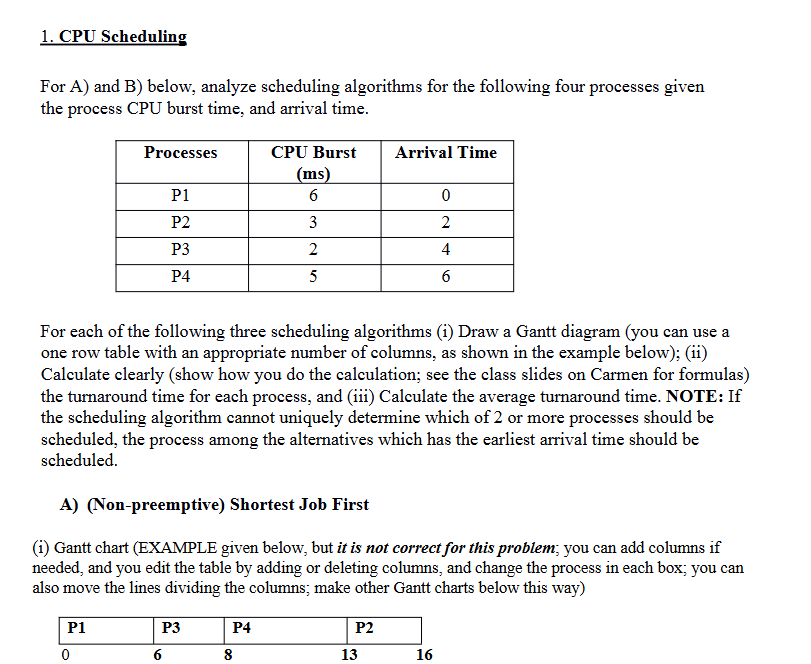
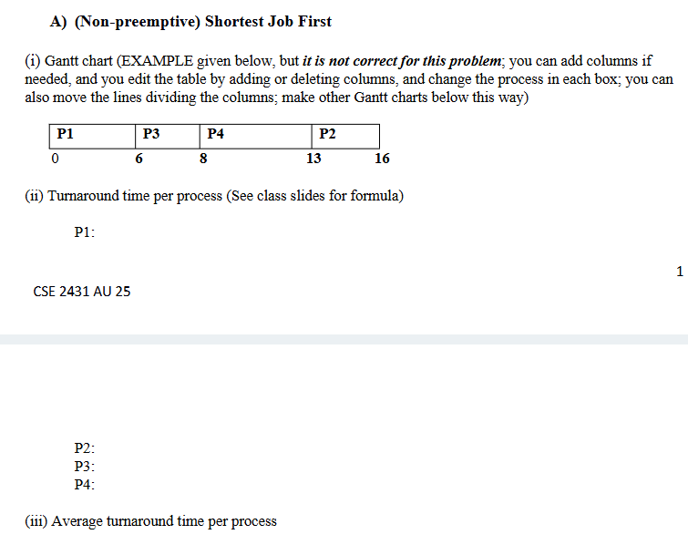
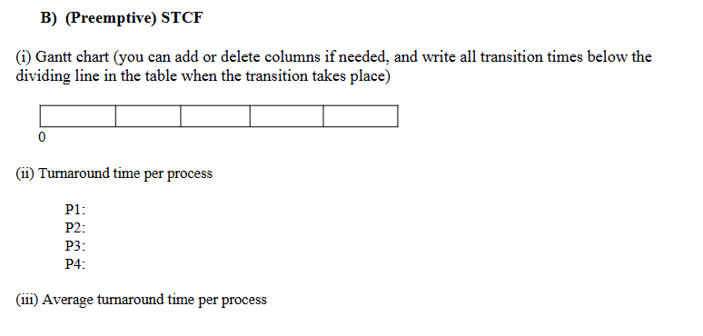
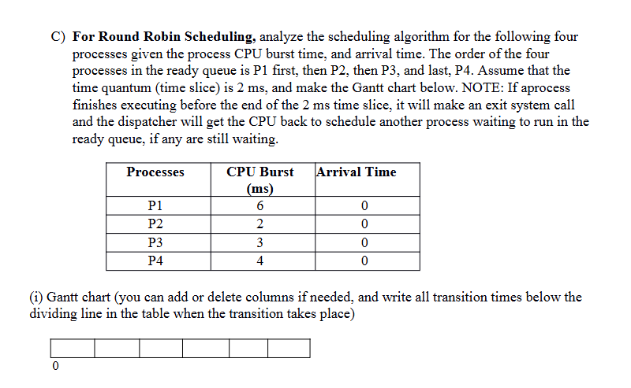
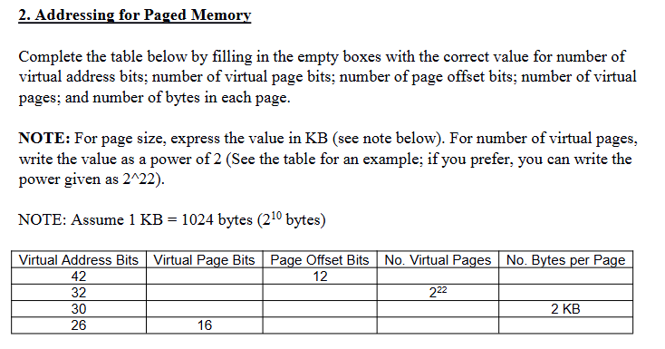
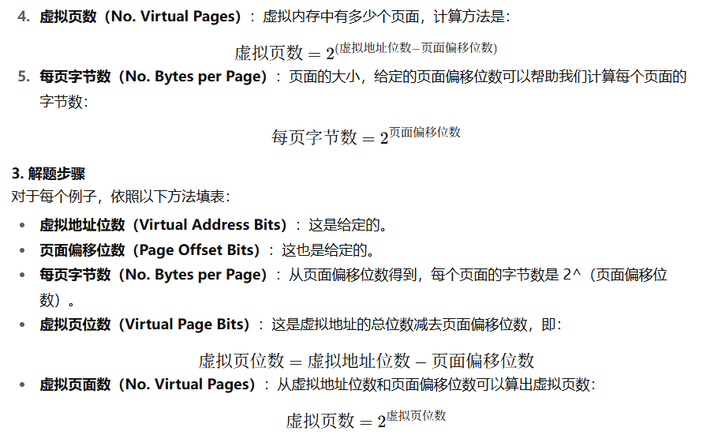
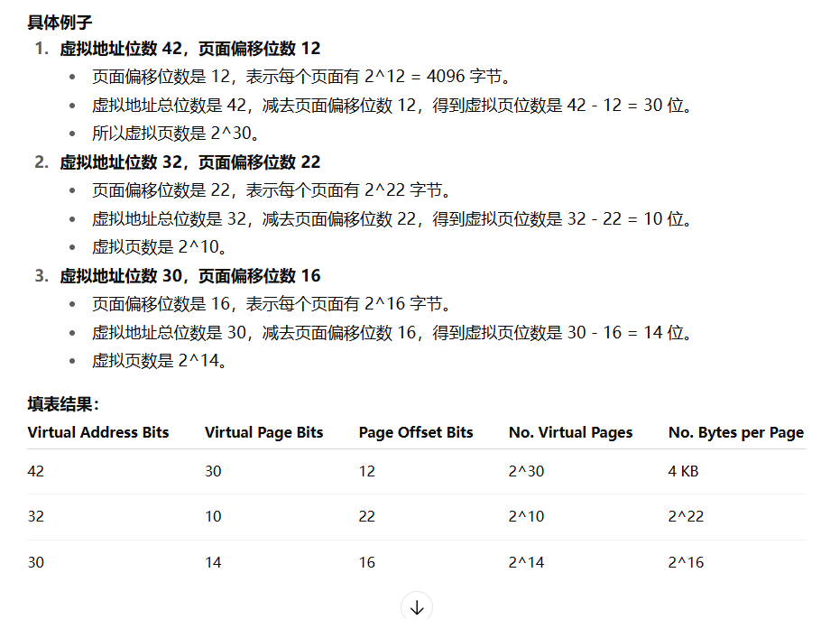
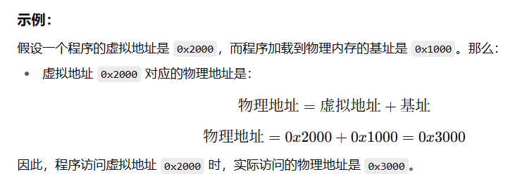
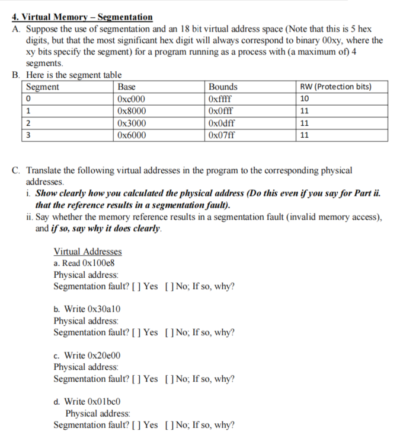

这个任务要求你分析四个进程的 CPU 调度算法。任务分为两个部分：计算和绘制调度图，并计算每个进程的 **周转时间** 和 **平均周转时间**。

### **任务解析：**

给定四个进程的 CPU 突发时间（每个进程执行所需的 CPU 时间）和到达时间（每个进程进入就绪队列的时间）。任务要求你使用 **非抢占式最短作业优先（SJF）** 算法来分析这些进程。

### **任务的具体步骤：**

#### **1. 了解最短作业优先（SJF）调度算法：**

- **非抢占式**：意味着一旦进程开始执行，就不会被中断。
- **最短作业优先**：选择当前到达的进程中 CPU 突发时间最短的进程来执行。如果多个进程有相同的 CPU 突发时间，则选择到达时间最早的那个进程。

#### **2. 绘制甘特图：**

甘特图展示了进程的执行顺序。根据 SJF 算法绘制甘特图的步骤如下：

1. **按到达时间排序**：首先查看哪个进程最早到达。
2. **选择 CPU 突发时间最短的进程**：选择当前所有到达的进程中，CPU 突发时间最短的那个进程执行。
3. **执行选择的进程**：在甘特图上标记该进程的执行。
4. **重复以上步骤**：当一个进程完成执行后，继续选择下一个到达的进程并执行。

### **示例（根据你的数据）**

给定的进程表如下：

| 进程 | CPU 突发时间（ms） | 到达时间（ms） |
| ---- | ------------------ | -------------- |
| P1   | 6                  | 0              |
| P2   | 3                  | 2              |
| P3   | 2                  | 4              |
| P4   | 5                  | 6              |

应用 **非抢占式最短作业优先（SJF）** 算法：

1. **时间 0**：P1 到达，P1 开始执行。
2. **时间 2**：P2 到达，但 P1 还在执行，P1 继续执行。
3. **时间 4**：P3 到达，此时 P1 仍在执行。
4. **时间 6**：P4 到达，此时有 P2、P3 和 P4 选择执行。由于 P3 的 CPU 突发时间最短，P3 会被选择。

依此类推，继续选择最短的进程，填充甘特图。

#### **3. 计算周转时间：**

每个进程的 **周转时间** 计算公式为：

$\text{周转时间} = \text{完成时间} - \text{到达时间}$

其中：

- **完成时间** 是进程执行结束的时间。
- **到达时间** 是进程到达就绪队列的时间。

#### **4. 计算平均周转时间：**

计算所有进程的周转时间后，**平均周转时间** 计算公式为：

$\text{平均周转时间} = \frac{\text{所有进程的周转时间总和}}{\text{进程数}}$

### **下一步操作：**

1. 根据上述步骤绘制甘特图。
2. 计算每个进程的周转时间。
3. 计算平均周转时间。

如果你需要我帮助你计算具体的值或绘制甘特图，随时告诉我！

这张图片是要求你使用 **非抢占式最短作业优先（SJF）** 算法解决 CPU 调度问题，并回答以下几个问题。让我们详细解析每个部分：

### **问题分析**

你需要根据给定的进程数据，使用 **非抢占式最短作业优先（SJF）** 算法来：

1. **绘制甘特图**，展示进程执行的顺序。
2. **计算每个进程的周转时间**。
3. **计算每个进程的平均周转时间**。

### **任务详解**

#### **1. 绘制甘特图：**

图中的甘特图是一个例子（并不完全正确），但它展示了任务执行的时间框架。你需要根据 **最短作业优先（SJF）** 算法的步骤来重新绘制正确的甘特图。

**步骤：**

1. **选择最短的作业（CPU 突发时间最短的进程）** 执行，且每次选择未执行的进程中最短的作业。
2. 该算法 **非抢占式**，一旦选择某个进程开始执行，就不再被打断，直到执行完毕。

#### **2. 计算周转时间：**

**周转时间** 是指一个进程从到达就绪队列开始，到完成执行的整个时间。公式为：

$\text{周转时间} = \text{完成时间} - \text{到达时间}$

- **完成时间** 是该进程在 CPU 上执行完的时间。
- **到达时间** 是该进程进入就绪队列的时间。

#### **3. 计算平均周转时间：**

一旦你计算出每个进程的周转时间，平均周转时间是所有进程的周转时间之和除以进程的数量：

$\text{平均周转时间} = \frac{\text{所有进程周转时间的总和}}{\text{进程总数}}$

### **数据解析**

假设进程数据如下（从上面图片提取的）：

| 进程 | CPU 突发时间（ms） | 到达时间（ms） |
| ---- | ------------------ | -------------- |
| P1   | 6                  | 0              |
| P2   | 3                  | 2              |
| P3   | 2                  | 4              |
| P4   | 5                  | 6              |

**最短作业优先（SJF）调度的执行顺序：**

1. **时间 0**：P1 到达，开始执行。
2. **时间 2**：P2 到达，但是 P1 还在执行。P1 执行完毕后选择 P2。
3. **时间 4**：P3 到达，执行完 P2 后选择 P3（因为 P3 的 CPU 突发时间最短）。
4. **时间 6**：P4 到达，P3 执行完毕后选择 P4。

因此，执行顺序如下：
 P1 → P2 → P3 → P4

### **完成步骤：**

1. **绘制甘特图**：依照上面的调度顺序绘制每个进程的执行时间段。
2. **计算每个进程的周转时间**。
3. **计算平均周转时间**。

如果你需要具体的计算结果或帮助绘制甘特图，可以告诉我，我将进一步提供帮助！

这个任务要求你使用 **抢占式最短时间优先（Preemptive Shortest Time to Completion First, STCF）** 算法来解决 CPU 调度问题，类似于最短作业优先算法（SJF），但是它是抢占式的。以下是详细解释：

### **步骤解析**

#### **1. 什么是抢占式 STCF 算法？**

- **STCF** 是一种 **抢占式调度算法**，它基于每个进程剩余的执行时间（即 **剩余 CPU 突发时间**）来决定执行哪个进程。
- 每次当一个新的进程到达时，调度器会检查当前执行的进程和新到达的进程哪个剩余执行时间更短。如果新进程的剩余时间更短，当前进程会被抢占，新的进程将开始执行。

#### **2. 绘制甘特图：**

**抢占式 STCF** 算法要求你在甘特图中展示进程的执行情况。每当进程切换时（抢占发生），你都需要标注出切换的时间。

甘特图需要显示每个进程执行的具体时间段，且每次进程抢占时，应该在图表下方标出切换的时间。

#### **3. 计算周转时间：**

**周转时间**的计算方法和之前一样：

$\text{周转时间} = \text{完成时间} - \text{到达时间}$

**完成时间**是进程执行完的时间，**到达时间**是进程进入就绪队列的时间。

#### **4. 计算平均周转时间：**

一旦你计算出所有进程的周转时间，你可以通过计算它们的平均值来得到 **平均周转时间**：

$\text{平均周转时间} = \frac{\text{所有进程周转时间总和}}{\text{进程数}}$

### **具体步骤**

假设进程数据如下（基于之前的表格）：

| 进程 | CPU 突发时间（ms） | 到达时间（ms） |
| ---- | ------------------ | -------------- |
| P1   | 6                  | 0              |
| P2   | 3                  | 2              |
| P3   | 2                  | 4              |
| P4   | 5                  | 6              |

#### **执行过程：**

1. **时间 0**：P1 到达并开始执行。
2. **时间 2**：P2 到达，此时 P2 剩余的执行时间更短（3ms），所以 P1 被抢占，P2 开始执行。
3. **时间 4**：P3 到达，P3 剩余执行时间为 2ms，短于 P2 的剩余时间（1ms），所以 P3 立即抢占 P2。
4. **时间 5**：P3 执行完毕，P2 接着继续执行剩余的 2ms。
5. **时间 6**：P4 到达，P4 剩余执行时间为 5ms，短于 P1，所以 P4 被抢占，P2 和 P3 执行完毕后，P4 执行。

依此类推，继续进行调度，直到所有进程执行完毕。

#### **绘制甘特图：**

你需要在甘特图中标注每个进程的执行时间段，并在切换时标出时间点。例如：

- P1 从 0ms 开始执行，直到 2ms 被 P2 抢占。
- P2 执行后，在剩余时间到达时继续执行，直到下一个切换。

#### **计算周转时间：**

- **P1** 的周转时间 = 完成时间 - 到达时间
- **P2** 的周转时间 = 完成时间 - 到达时间
- **P3** 的周转时间 = 完成时间 - 到达时间
- **P4** 的周转时间 = 完成时间 - 到达时间

### **最后步骤：**

1. 绘制甘特图，标出每次进程切换的时间。
2. 计算每个进程的周转时间。
3. 计算平均周转时间。

如果你需要更具体的计算或甘特图绘制，可以让我帮助你完成。

这道题目要求你使用 **轮询调度（Round Robin, RR）** 算法来解决四个进程的调度问题。轮询调度是一种抢占式调度算法，每个进程轮流使用 CPU，按照预定的时间片（time quantum）进行分配。

### **任务分析**

**给定信息：**

- 有四个进程：P1、P2、P3 和 P4，它们的 **CPU 突发时间** 和 **到达时间** 都已经给出。
- 所有进程都在时间 0 到达，并且 **P1** 最先执行，接着是 **P2**、**P3** 和 **P4**，它们按照顺序进入就绪队列。
- **时间片（time quantum）** 是 2ms，意味着每个进程在每个轮次中最多使用 2ms 的时间。
- 如果进程在 2ms 内完成执行，它将退出 CPU；如果进程未完成执行，它将被抢占，并且会重新进入就绪队列等待下一次调度。

### **步骤解析**

#### **1. 轮询调度（Round Robin）概念：**

- 轮询调度按 **时间片** 来调度进程。如果进程的 CPU 突发时间小于或等于时间片，它会在当前时间片内完成；如果进程的 CPU 突发时间大于时间片，它会被中断并返回就绪队列，等待下一轮调度。
- 时间片为 2ms，因此每次每个进程最多执行 2ms。

#### **2. 绘制甘特图：**

- 从时间 0 开始，P1 先执行，如果它未完成，则会被抢占，进入就绪队列，轮到下一个进程。
- 每个进程最多执行 2ms（时间片），直到它完成为止。

**步骤：**

1. P1 先执行 2ms（时间片），然后轮到 P2 执行。
2. P2 执行 2ms 后，轮到 P3 执行。
3. 然后轮到 P4 执行，依此类推。
4. 当某个进程的 CPU 突发时间小于 2ms，它会在当前时间片内完成。

**根据给定的进程数据：**

| 进程 | CPU 突发时间（ms） | 到达时间（ms） |
| ---- | ------------------ | -------------- |
| P1   | 6                  | 0              |
| P2   | 2                  | 0              |
| P3   | 3                  | 0              |
| P4   | 4                  | 0              |

#### **3. 甘特图绘制**

1. **时间 0 到 2ms**：P1 执行 2ms，剩余 4ms。
2. **时间 2 到 4ms**：P2 执行 2ms，完成。
3. **时间 4 到 6ms**：P3 执行 2ms，剩余 1ms。
4. **时间 6 到 8ms**：P4 执行 2ms，剩余 2ms。
5. **时间 8 到 10ms**：P1 执行 2ms，剩余 2ms。
6. **时间 10 到 12ms**：P3 执行 1ms，完成。
7. **时间 12 到 14ms**：P4 执行 2ms，完成。
8. **时间 14 到 16ms**：P1 执行 2ms，完成。

因此，P1、P2、P3 和 P4 会在这些时间点进行轮换调度，直到所有进程执行完毕。

#### **4. 计算周转时间：**

周转时间的计算公式为：

$\text{周转时间} = \text{完成时间} - \text{到达时间}$

### **下一步**

1. 根据上面的调度顺序绘制甘特图。
2. 计算每个进程的周转时间。
3. 计算平均周转时间。

如果你需要帮助计算周转时间或绘制甘特图，请告诉我，我可以帮助你继续解决！

要解决分页内存地址问题，需利用**虚拟地址结构**：  
虚拟地址 = 虚拟页号 + 页内偏移，因此有公式：  
\[ \text{虚拟地址位数} = \text{虚拟页号位数} + \text{页内偏移位数} \]  
同时，\(\text{虚拟页数} = 2^{\text{虚拟页号位数}}\)，\(\text{每页字节数} = 2^{\text{页内偏移位数}}\)（\(1\ \text{KB} = 1024\ \text{字节} = 2^{10}\ \text{字节}\)，可据此转换单位）。  
### 逐行分析：
#### 第一行（已知：虚拟地址42位，页内偏移12位）
- **虚拟页号位数**：\(42 - 12 = 30\) 位  
- **虚拟页数**：\(2^{30}\)  
- **每页字节数**：\(2^{12}\ \text{字节} = 4096\ \text{字节} = 4\ \text{KB}\)  
#### 第二行（已知：虚拟地址32位，虚拟页数\(2^{22}\)）
- **虚拟页号位数**：因虚拟页数\(=2^{\text{虚拟页号位数}}\)，故为22位  
- **页内偏移位数**：\(32 - 22 = 10\) 位  
- **每页字节数**：\(2^{10}\ \text{字节} = 1024\ \text{字节} = 1\ \text{KB}\)  
#### 第三行（已知：虚拟地址30位，每页2 KB）
- **每页字节数**：\(2\ \text{KB} = 2 \times 1024 = 2048\ \text{字节} = 2^{11}\ \text{字节}\)，故**页内偏移位数**为11位  
- **虚拟页号位数**：\(30 - 11 = 19\) 位  
- **虚拟页数**：\(2^{19}\)  
#### 第四行（已知：虚拟地址26位，虚拟页号16位）
- **页内偏移位数**：\(26 - 16 = 10\) 位  
- **虚拟页数**：\(2^{16}\)  
- **每页字节数**：\(2^{10}\ \text{字节} = 1024\ \text{字节} = 1\ \text{KB}\)  
### 最终表格填写结果：
| Virtual Address Bits | Virtual Page Bits | Page Offset Bits | No. Virtual Pages | No. Bytes per Page |
| -------------------- | ----------------- | ---------------- | ----------------- | ------------------ |
| 42                   | 30                | 12               | \(2^{30}\)        | 4 KB               |
| 32                   | 22                | 10               | \(2^{22}\)        | 1 KB               |
| 30                   | 19                | 11               | \(2^{19}\)        | 2 KB               |
| 26                   | 16                | 10               | \(2^{16}\)        | 1 KB               |

--------------------------------
以上内容由AI生成，仅供参考和借鉴

要解决这个问题，需**逐一分析每种虚拟内存方法的特性**，结合“虚拟地址结构”“内存保护”“地址转换”等知识点判断每个特性（A-F）是否适用。以下是详细步骤：

> **虚拟内存（Virtual Memory）** 是一种计算机内存管理技术，它允许计算机使用硬盘（磁盘）上的空间来模拟更大容量的内存，从而使得程序可以使用比实际物理内存更多的内存空间。虚拟内存通过硬件和操作系统的结合，提供了一种虚拟化的内存模型，使得程序可以像使用连续的内存一样，访问更大的地址空间，尽管物理内存可能远远不够。
>
> ### **虚拟内存的基本原理：**
>
> 1. **虚拟地址空间：**
>     每个进程在操作系统中运行时，会获得一个虚拟的内存地址空间。这些虚拟地址并不直接对应于物理内存的地址，而是由操作系统和硬件（通常是 MMU）负责将虚拟地址映射到物理内存中。这种方式让每个进程看似拥有独立的内存区域，避免了进程间的干扰。
> 2. **页面交换（Paging）和页面文件（Swap Space）：**
>    - **分页（Paging）**：虚拟内存被划分为大小固定的块，称为 **页面（Pages）**，而物理内存则被划分为相同大小的块，称为 **页框（Page Frames）**。操作系统通过 MMU 将虚拟页面映射到物理页框。
>    - **交换空间（Swap Space）**：当物理内存不足时，操作系统会将一些不常用的内存页面临时存储到硬盘上的交换空间（或交换文件）中。这一过程称为 **页面交换（Paging）**，允许计算机在内存不足时依然能够运行大程序。
> 3. **内存保护与隔离：**
>     虚拟内存技术确保每个进程只能访问自己的虚拟内存地址，防止了进程之间互相访问内存的情况（进程隔离）。这样，即使一个进程发生崩溃，它也不会影响到其他进程的数据。
> 4. **按需加载：**
>     由于虚拟内存可以将程序的地址空间分割成多个页面，操作系统不需要一次性将整个程序加载到内存中。它只会在需要时加载那些正在被使用的页面。这种按需加载的方式节省了内存空间，使得系统能处理比实际物理内存大得多的程序。
>
> ### **虚拟内存的关键优势：**
>
> 1. **扩展内存空间：**
>     虚拟内存允许程序访问比实际物理内存更大的内存空间。操作系统通过交换页面到硬盘来扩展物理内存，提供一个几乎无限的虚拟内存空间。
> 2. **进程隔离和安全性：**
>     每个进程在虚拟内存中的地址空间是独立的，这意味着一个进程无法直接访问另一个进程的内存空间，增强了系统的稳定性和安全性。
> 3. **简化程序开发：**
>     程序员不需要关心物理内存的管理，可以直接使用虚拟内存中的地址。操作系统会自动处理虚拟内存与物理内存之间的映射。
> 4. **按需加载和内存共享：**
>     虚拟内存使得操作系统能够高效地按需加载进程所需的部分，而不是一次性加载所有内容。它还可以允许多个进程共享相同的代码段，如操作系统的内核代码或共享库，从而节省内存。
>
> ### **虚拟内存的工作过程：**
>
> 1. **访问虚拟内存地址：** 当程序访问一个虚拟地址时，MMU（内存管理单元）会查看该虚拟地址是否已经映射到物理内存中的某个页面。
> 2. **页面未命中（Page Fault）：** 如果访问的虚拟页面不在物理内存中（即发生页面错误，Page Fault），操作系统会从磁盘的交换空间中加载该页面到物理内存。
> 3. **交换页面（Page Swap）：** 如果物理内存已满，操作系统会选择一个不常用的页面，将其写回到磁盘上的交换空间，并加载所需的页面到内存中。
> 4. **地址映射：** MMU 将虚拟地址映射到物理内存地址，确保进程可以继续执行。
>
> ### **虚拟内存的实现方式：**
>
> 虚拟内存通常通过以下两种方式来实现：
>
> - **分页（Paging）**：虚拟内存被分成大小相同的块，称为页面，每个页面都有一个唯一的虚拟页号。
> - **分段（Segmentation）**：虚拟内存被分为不同大小的段（如代码段、数据段、堆栈段等），每个段有不同的大小。
>
> 现代操作系统通常结合使用 **分页** 和 **分段** 技术，以提供更灵活的内存管理。
>
> ### **总结：**
>
> 虚拟内存是通过将硬盘空间与物理内存结合使用，使得程序能够使用比物理内存更多的地址空间。它通过 MMU 将虚拟地址转换为物理地址，实现进程隔离、内存保护和高效的内存使用。虚拟内存的引入大大提高了计算机的灵活性和性能，成为现代计算机系统的核心部分。

### 一、明确各特性的定义
题目中给出了6个特性（A-F），需先理解其含义：  
- **A**：不需要MMU硬件（无地址转换需求）。

  > **MMU（Memory Management Unit，内存管理单元）** 是一种硬件组件，负责计算机系统中内存地址的转换和管理。它主要的作用是将 **虚拟地址** 转换为 **物理地址**，并帮助实现虚拟内存的各种管理任务。
  >
  > ### **MMU的主要功能：**
  >
  > 1. **虚拟地址到物理地址的转换：**
  >    - MMU 允许程序使用虚拟地址（即进程视角下的地址），然后通过 MMU 将这些虚拟地址转换为实际的物理地址（即存储器中实际的位置）。
  >    - 这对于虚拟内存非常重要，因为操作系统和 MMU能够提供进程间的隔离，确保每个进程只能访问自己分配的内存区域。
  > 2. **分页和分段支持：**
  >    - MMU 通常支持 **分页**（Paging）和 **分段**（Segmentation）这两种内存管理机制。
  >      - 在 **分页** 中，虚拟内存被划分为固定大小的块（页），而物理内存则被划分为相同大小的块（页框），MMU 负责虚拟页与物理页框之间的映射。
  >      - 在 **分段** 中，内存被划分为不同大小的段，MMU 负责将虚拟段映射到物理内存中。
  > 3. **地址空间保护：**
  >    - MMU 还提供 **内存保护**，即防止进程访问其不该访问的内存区域（如其他进程的内存）。它可以根据操作系统的指令来限制内存访问权限。
  > 4. **缓存管理：**
  >    - MMU 通常与 **TLB（Translation Lookaside Buffer，快表）** 一起使用，以提高虚拟地址到物理地址转换的速度。TLB 是一个缓存，存储了最近使用的虚拟页和对应的物理页框的映射，减少了每次访问时的计算和查表时间。
  >
  > ### **MMU的作用在虚拟内存中的重要性：**
  >
  > - **进程隔离**：每个进程使用的虚拟地址空间是独立的，MMU 确保一个进程无法访问另一个进程的内存区域，避免了内存泄露和数据篡改。
  > - **地址空间扩展**：通过虚拟内存技术，MMU 允许进程使用比物理内存更多的内存。操作系统可以将不常用的内存页面换出到磁盘（即交换空间），有效扩展系统的内存。
  > - **动态内存分配**：MMU 支持操作系统动态地将内存分配给不同的进程，进程可以在运行时请求更多的内存，MMU 会相应地调整内存映射。
  >
  > ### **没有 MMU 会怎样？**
  >
  > 如果没有 MMU，操作系统就无法进行地址转换和内存保护。这样，进程就无法独立地管理自己的内存空间，也无法有效地实现虚拟内存和内存保护机制。
  >
  > 在没有 MMU 的系统中，所有的内存管理（如虚拟地址到物理地址的映射、进程的内存隔离等）必须由操作系统通过软件模拟来完成。这种方式效率较低，并且容易出错，因此现代计算机系统大多使用 MMU 来加速内存管理和提高系统安全性。
  >
  > ### **总结：**
  >
  > MMU 是内存管理的关键硬件，负责虚拟地址到物理地址的转换、内存保护、缓存管理等任务，它是实现虚拟内存和进程隔离的基础。  
- **B**：无通用机制防止进程互相访问地址空间（无保护）。  
- **C**：进程整个地址空间必须加载到**连续内存**才能运行。  
- **D**：进程或部分可在执行期间被OS动态重定位（地址可变）。  
- **E**：进程的每个段（如代码段、数据段）必须加载到**连续内存**（仅分段法涉及）。  
- **F**：进程整个地址空间必须加载到内存（**不一定连续**）。  
### 二、逐个分析每种方法（Approach）
#### 1. Static Relocation（静态重定位）
- **原理**：程序加载时由加载器直接将逻辑地址转换为物理地址，后续不可修改。  
- > **静态重定位（Static Relocation）** 是一种内存管理技术，用于将程序的地址空间从一个位置转换到另一个位置。静态重定位在程序加载到内存之前完成，通常是由操作系统在程序加载过程中处理的，它将程序的所有内存地址（包括代码、数据等）从其原始地址转换为在实际内存中可以执行的地址。
  >
  > ### **静态重定位的基本概念：**
  >
  > 1. **静态重定位的过程：**
  >    - 在程序编译时，生成的目标代码会包含一些 **相对地址**，这些地址依赖于程序运行时的加载位置。在程序执行前，操作系统会将这些地址转换为 **物理内存地址**，使得程序能够在实际的内存中运行。
  >    - 这种转换通常是通过加上一个 **基址（Base Address）** 来实现的，基址表示程序加载到内存的位置。所有的地址都会相对于这个基址进行调整。
  > 2. **操作方式：**
  >    - 在程序执行之前，操作系统会通过 **重定位表（Relocation Table）** 来确定哪些地址需要被修改。然后，将程序中所有的地址加上基址，从而获得正确的物理内存地址。
  >    - 这种方式需要在程序加载时进行一次性处理，而在程序执行过程中地址是固定的，不会再发生变化。
  > 3. **重定位的示例：**
  >    - 假设一个程序的代码中有一个指向数据的地址 `0x1000`，但操作系统将该程序加载到内存的地址 `0x2000`。静态重定位就会将所有地址 `0x1000` 相对调整到 `0x2000`，因此原本的 `0x1000` 地址会被转换为 `0x3000`（即基址 + 0x1000）。
  >
  > ### **静态重定位的优点：**
  >
  > 1. **简单性：** 静态重定位在程序加载时完成，设计和实现比较简单。
  > 2. **执行速度：** 由于重定位工作在程序启动时完成，程序在执行时不需要进行额外的地址转换，因此执行速度较快。
  >
  > ### **静态重定位的缺点：**
  >
  > 1. **灵活性差：** 静态重定位依赖于程序的加载地址，程序只能在被加载的特定内存地址上执行。如果多个程序需要加载，它们必须使用不同的内存区域，否则就会发生冲突。
  > 2. **内存浪费：** 如果程序没有被合理分配到内存区域，就可能出现内存碎片，浪费内存空间。
  > 3. **没有进程隔离：** 静态重定位没有动态管理内存地址的能力，因此不支持进程之间的内存隔离，这可能导致进程之间发生干扰。
  >
  > ### **与动态重定位的比较：**
  >
  > - **静态重定位**：在程序加载到内存之前，所有地址都已经转换为物理地址。加载后，程序的内存地址是固定的，不会发生变化。
  > - **动态重定位**：在程序执行过程中，操作系统可以根据需要调整程序的内存地址，例如通过 **基址寄存器** 和 **段寄存器**。动态重定位使得程序可以在运行时自由地移动到不同的内存区域，增加了灵活性。
  >
  > ### **总结：**
  >
  > 静态重定位是程序加载到内存时就完成的地址转换，程序的所有地址会基于加载地址进行调整。尽管它简单且执行效率高，但它缺乏灵活性和内存隔离，因此在现代操作系统中，动态重定位和分页等技术通常比静态重定位更为常用。
- **特性判断**：  
  - A：不需要MMU（地址转换在加载时完成，无需运行时转换）→ **T**。  
  - B：无保护机制（可直接访问任意物理地址）→ **T**。  
  - C：必须连续加载（地址已固定，无法分散）→ **T**。  
  - D：无法动态重定位（地址固定）→ **F**。  
  - E：不涉及分段（无“段”的概念）→ **F**。  
  - F：必须全部加载（静态地址无法部分加载）→ **T**。  
#### 2. Dynamic Relocation with Base（动态重定位基址法）
- **原理**：使用**基址寄存器**存储程序起始物理地址，CPU自动将逻辑地址与基址相加得到物理地址。  
- > **动态重定位基址法（Dynamic Relocation with Base）** 是一种内存管理技术，允许操作系统在程序运行时动态地将程序的虚拟地址转换为物理地址。与静态重定位不同，动态重定位不仅在程序加载时进行，还可以在程序运行时进行地址调整。
  >
  > ### **基本概念：**
  >
  > 动态重定位基址法使用一个 **基址寄存器（Base Register）**，该寄存器存储了程序加载到物理内存的起始地址（基址）。在程序运行过程中，每当程序访问内存时，操作系统通过将程序中的虚拟地址与基址相加，生成一个物理地址。
  >
  > ### **动态重定位基址法的工作原理：**
  >
  > 1. **基址寄存器：**
  >    - 程序被加载到内存时，操作系统将程序的起始地址保存在基址寄存器中。
  >    - 基址寄存器存储的是程序在物理内存中的起始地址，所有访问该程序的虚拟地址时，操作系统会将虚拟地址加上基址，得到实际的物理内存地址。
  > 2. **地址转换：**
  >    - 当程序需要访问内存时，MMU（内存管理单元）会读取虚拟地址并将其与基址寄存器中的值相加。
  >    - 这个计算结果就是物理地址，程序通过该物理地址访问内存。
  > 3. **虚拟地址到物理地址的转换：**
  >    - 虚拟地址 = 物理地址 + 基址
  >    - 基址寄存器的值决定了程序在物理内存中的位置，所有虚拟地址都相对于这个基址进行转换。
  >
  > ### **示例：**
  >
  > 
  >
  > ### **动态重定位基址法的优点：**
  >
  > 1. **程序灵活性：**
  >    - 动态重定位允许程序在加载时被放置到内存的任何位置，而不必依赖于固定的内存地址。这增强了程序的灵活性，使得多个程序可以共享内存区域，避免内存冲突。
  > 2. **进程隔离：**
  >    - 每个进程有独立的基址寄存器，这确保了进程之间的内存隔离。一个进程无法直接访问另一个进程的内存空间，增加了系统的安全性。
  > 3. **内存利用率：**
  >    - 动态重定位基址法允许操作系统动态地加载和卸载程序，使得内存使用更加高效。程序不需要在物理内存中占用固定的空间，减少了内存碎片。
  >
  > ### **动态重定位基址法的缺点：**
  >
  > 1. **硬件需求：**
  >    - 这种方法需要硬件支持，即 MMU（内存管理单元）。MMU 必须能够读取虚拟地址和基址寄存器，并进行地址转换。如果没有 MMU，操作系统就无法高效地进行动态重定位。
  > 2. **需要操作系统支持：**
  >    - 动态重定位依赖操作系统来管理内存的加载和映射。操作系统需要处理基址寄存器的设置和更新，以保证进程能够正确地访问内存。
  >
  > ### **动态重定位与静态重定位的比较：**
  >
  > | 特性             | 静态重定位                                           | 动态重定位基址法                                   |
  > | ---------------- | ---------------------------------------------------- | -------------------------------------------------- |
  > | **地址转换**     | 程序加载时完成，且一旦程序开始执行，地址就不会改变。 | 程序运行时动态转换虚拟地址和物理地址。             |
  > | **程序的灵活性** | 程序必须加载到一个固定的内存位置。                   | 程序可以加载到内存中的任何位置，具有更高的灵活性。 |
  > | **进程隔离**     | 不提供进程隔离，容易出现内存冲突。                   | 提供进程隔离，每个进程有独立的基址寄存器。         |
  > | **硬件需求**     | 无需 MMU。                                           | 需要 MMU（内存管理单元）支持。                     |
  > | **内存管理**     | 内存分配较为固定，可能导致内存碎片。                 | 允许更高效的内存分配，减少碎片。                   |
  >
  > ### **总结：**
  >
  > 动态重定位基址法通过基址寄存器将虚拟地址转换为物理地址，允许程序在内存中的任意位置执行，提供了内存的灵活性、进程隔离和更高效的内存管理。它需要硬件支持（MMU）来实现地址转换，并且由操作系统负责管理。相比静态重定位，动态重定位更适合现代操作系统的内存管理需求。
- **特性判断**：  
  - A：需要MMU（依赖基址寄存器实现地址转换）→ **F**。  
  - B：有保护机制（基址限制进程只能访问特定区域，避免访问低地址）→ **F**。  
  - C：无需连续加载（可通过调整基址分散存放）→ **F**。  
  - D：可动态重定位（更新基址寄存器即可移动程序）→ **T**。  
  - E：不涉及分段 → **F**。  
  - F：必须全部加载（基址法仍需程序全部在内存中）→ **T**。  
#### 3. Dynamic Relocation with Base + Bounds（动态重定位基址+边界法）
- **原理**：在基址法基础上增加**边界寄存器**，限制进程只能访问“基址~基址+边界”之间的地址。  
- > **动态重定位基址+边界法（Dynamic Relocation with Base and Bounds）** 是一种内存管理技术，它是 **基址法** 的扩展，提供了额外的内存保护机制。除了使用 **基址寄存器** 来确定进程在物理内存中的起始位置外，**边界寄存器（Bounds Register）** 还用于限制进程可以访问的内存范围，从而防止进程越界访问其他进程的内存空间。
  >
  > ### **基本概念：**
  >
  > 1. **基址寄存器（Base Register）：**
  >    - **基址寄存器** 存储了进程在物理内存中的起始地址。在访问内存时，虚拟地址会与基址相加，从而计算出对应的物理地址。基址寄存器的作用与 **动态重定位基址法** 中的基址相同。
  > 2. **边界寄存器（Bounds Register）：**
  >    - **边界寄存器** 存储了进程可以访问的内存空间的大小限制。具体来说，它记录了进程可用内存的大小，从进程的起始地址（即基址寄存器中的值）开始，进程可以访问的最大内存地址就是 **基址 + 边界**。如果进程尝试访问超出这个范围的内存地址，系统会触发异常，防止进程越界访问其他进程的内存空间。
  >
  > ### **如何工作：**
  >
  > 1. **虚拟地址访问：**
  >    - 进程生成的每个虚拟地址都会通过 MMU（内存管理单元）进行转换。MMU 通过读取 **基址寄存器** 和 **边界寄存器** 来完成虚拟地址到物理地址的转换。
  >    - 当进程访问一个虚拟地址时，MMU 首先会将虚拟地址与基址寄存器中的基址相加，得到对应的物理地址。
  > 2. **越界检查：**
  >    - 在转换过程中，MMU 还会检查该地址是否超过了进程的边界。如果虚拟地址超过了基址 + 边界寄存器中的限制，MMU 会发出一个 **越界访问** 错误，通常会引发一个**内存保护异常**（如“Segmentation Fault”），这会导致程序崩溃或终止。
  > 3. **内存保护：**
  >    - 通过边界寄存器，系统提供了额外的内存保护机制，确保一个进程只能访问它自己的内存空间，防止越界访问其他进程的内存区域或系统内存，从而提高系统的稳定性和安全性。
  >
  > ### **动态重定位基址+边界法的优势：**
  >
  > 1. **内存保护：**
  >    - 边界寄存器提供了有效的内存保护机制，防止进程越界访问其他进程的内存。这增加了系统的安全性，避免了一个进程破坏其他进程的数据。
  > 2. **灵活的内存管理：**
  >    - 通过基址寄存器和边界寄存器的动态调整，进程可以被加载到物理内存中的任意位置，同时仍然能够确保进程的内存访问不越界。这为操作系统提供了更大的灵活性，允许更加高效地使用内存。
  > 3. **进程隔离：**
  >    - 每个进程都可以通过独立的基址寄存器和边界寄存器来管理它自己的虚拟地址空间。这确保了进程之间的内存隔离，即使多个进程在物理内存中共享内存，也不会互相影响。
  > 4. **减少内存碎片：**
  >    - 动态重定位基址+边界法允许操作系统灵活地管理内存，并能有效避免内存碎片问题。它允许进程的内存分配和回收更加高效。
  >
  > ### **与其他方法的比较：**
  >
  > | 特性         | 基址法（Base） | 基址+边界法（Base + Bounds）         | 分段（Segmentation）       | 分页（Paging）             |
  > | ------------ | -------------- | ------------------------------------ | -------------------------- | -------------------------- |
  > | **内存保护** | 无             | 有（防止越界访问）                   | 有（通过段表实现）         | 有（通过页表和保护位实现） |
  > | **灵活性**   | 低             | 高（可动态调整基址和边界）           | 高（可灵活分配段）         | 高（进程可以动态加载页面） |
  > | **内存隔离** | 无             | 有（每个进程独立的基址和边界寄存器） | 有（段表保证进程隔离）     | 有（页表保证进程隔离）     |
  > | **适用场景** | 简单的内存管理 | 更复杂的内存管理，适用于多任务环境   | 适用于具有不同大小段的进程 | 适用于固定大小的内存块分配 |
  >
  > ### **总结：**
  >
  > **动态重定位基址+边界法** 是一种更强大的内存管理技术，它结合了 **基址法** 的灵活性与 **内存保护**，通过增加 **边界寄存器** 来防止进程越界访问内存，从而确保了程序的稳定性和系统的安全性。它在现代操作系统中广泛使用，尤其是在多任务环境中，能够有效地管理进程的内存并提供进程隔离。
- **特性判断**：  
  - A：需要MMU（依赖基址+边界寄存器）→ **F**。  
  - B：有保护机制（边界寄存器防止越界访问）→ **F**。  
  - C：无需连续加载 → **F**。  
  - D：可动态重定位（更新基址/边界即可移动）→ **T**。  
  - E：不涉及分段 → **F**。  
  - F：必须全部加载 → **T**。  
#### 4. Segmentation（分段）
- **原理**：将程序分为多个段（如代码段、数据段、堆、栈），每个段有独立基地址和长度，通过段表实现地址转换。  
- > **分段（Segmentation）** 是一种内存管理方式，它将程序的地址空间划分为多个逻辑上不同的部分或“段”，每个段代表程序的一部分，如代码段、数据段、堆栈段等。与分页（Paging）不同，分段在逻辑上划分内存，而不是按固定大小划分。
  >
  > ### **分段的基本概念：**
  >
  > 在分段系统中，每个进程的内存空间被划分为若干个不同大小的部分，称为 **段（Segment）**。每个段包含与程序执行相关的一类数据或代码，例如：
  >
  > - **代码段（Code Segment）**：存放程序的机器代码。
  > - **数据段（Data Segment）**：存放程序中的全局变量、静态变量等数据。
  > - **堆栈段（Stack Segment）**：存放程序的堆栈（如函数调用时的局部变量、返回地址等）。
  > - **堆段（Heap Segment）**：存放动态分配的内存（例如通过 `malloc` 或 `new` 分配的内存）。
  >
  > ### **分段的工作原理：**
  >
  > 1. **每个段都有一个段号和段内偏移：**
  >
  >    - **段号**：用来标识不同的段，通常存储在段表（Segment Table）中。
  >    - **段内偏移**：表示访问某一段中某个元素的相对位置。
  >
  > 2. **段表（Segment Table）：**
  >
  >    - 操作系统维护一个 **段表**，每个进程都有一个对应的段表。段表包含每个段的基址和段的长度：
  >      - **基址**：每个段在物理内存中的起始位置。
  >      - **段的长度**：该段在虚拟内存中的大小。
  >
  > 3. **地址转换：**
  >
  >    - 当进程访问内存时，虚拟地址包含一个 **段号** 和一个 **段内偏移**。操作系统通过段号查找段表，得到该段的基址，再通过将段内偏移加到基址来得到物理地址。
  >
  >    具体过程是：
  >
  >    物理地址=段基址+段内偏移\text{物理地址} = \text{段基址} + \text{段内偏移}
  >
  >    如果段内偏移大于段的长度，操作系统会触发 **段越界异常**。
  >
  > ### **分段与分页的区别：**
  >
  > | 特性         | 分段（Segmentation）           | 分页（Paging）                   |
  > | ------------ | ------------------------------ | -------------------------------- |
  > | **地址空间** | 逻辑上划分为多个段             | 物理内存被划分为固定大小的页面   |
  > | **段的大小** | 每个段大小可以不同             | 每个页面大小固定                 |
  > | **内存管理** | 每个段独立，大小和内容不同     | 每个页面的大小相同               |
  > | **内存访问** | 需要根据段号和段内偏移计算地址 | 每个页号和页内偏移来计算地址     |
  > | **内存保护** | 通过段表保护每个段的访问权限   | 通过页表保护每个页面的访问权限   |
  > | **优点**     | 提供程序逻辑结构化，易于管理   | 简单、易于实现，减少碎片         |
  > | **缺点**     | 内存分配不均匀，可能导致碎片   | 每个页面必须固定大小，灵活性较差 |
  >
  > ### **分段的优点：**
  >
  > 1. **灵活的内存管理：**
  >    - 分段允许不同类型的数据（如代码、数据、堆栈）分别存储在内存中，可以根据不同的需要分配不同大小的内存空间。
  > 2. **程序结构化：**
  >    - 分段使得程序在内存中的布局更符合程序的逻辑结构。例如，代码段、数据段和堆栈段是分开存储的，这样可以方便地进行管理和访问。
  > 3. **内存保护：**
  >    - 每个段都有独立的保护机制，操作系统可以控制不同段的访问权限，例如只读、只写等。这有助于防止程序对其不应访问的内存区域进行非法访问。
  > 4. **灵活的共享：**
  >    - 多个进程可以共享相同的代码段（例如共享库），而不需要复制整个代码段。
  >
  > ### **分段的缺点：**
  >
  > 1. **外部碎片：**
  >    - 由于每个段的大小是不同的，内存中的空闲区域可能无法有效利用，导致外部碎片。操作系统可能需要频繁地进行内存整理（如合并碎片），才能将新段放入内存中。
  > 2. **复杂性较高：**
  >    - 分段需要操作系统维护段表和管理每个段的基址和长度，相比分页来说，内存管理相对复杂。
  > 3. **不易管理的大段内存：**
  >    - 对于程序的大段数据，可能会因为大小不适合内存的空闲区域而导致内存分配困难。
  >
  > ### **示例：**
  >
  > 假设一个程序有以下段：
  >
  > - **代码段**（Code Segment）：包含程序的机器代码。
  > - **数据段**（Data Segment）：包含全局变量。
  > - **堆栈段**（Stack Segment）：用于存储局部变量和函数调用。
  >
  > 当程序运行时，操作系统将这些段加载到物理内存的不同位置。每个段都有自己的基址和长度。例如，程序的代码段可以加载到物理内存的 `0x1000` 地址，数据段可以加载到 `0x2000` 地址，堆栈段加载到 `0x3000` 地址。
  >
  > 如果程序需要访问数据段中的某个变量，操作系统会查找段表，通过该变量的虚拟地址中的段号找到对应的基址，再加上变量的偏移量，得到该变量在物理内存中的位置。
  >
  > ### **总结：**
  >
  > 分段是一种内存管理技术，它将程序的内存空间划分为多个逻辑上的段，每个段代表程序的一部分。分段允许不同大小的内存块，适应不同的程序需求，能够提高内存管理的灵活性，并且提供内存保护。然而，它也可能导致外部碎片，操作系统需要额外的机制来处理这种碎片。
- **特性判断**：  
  - A：需要MMU（依赖段表实现地址转换）→ **F**。  
  - B：有保护机制（段表+边界检查防止越界）→ **F**。  
  - C：无需整体连续（每个段可分散存放，但每个段内部必须连续）→ **F**。  
  - D：可动态重定位（更新段表基地址即可移动段）→ **T**。  
  - E：每个段必须连续（分段的核心要求）→ **T**。  
  - F：必须全部加载（每个段都需在内存中）→ **T**。  
#### 5. Paging（分页）
- **原理**：将程序分为固定大小的页（如4KB/页），通过页表实现地址转换，无需“段”的概念。  
- > **分页（Paging）** 是一种内存管理技术，它将物理内存和虚拟内存分割成固定大小的块，用于高效地管理内存空间，减少内存碎片，并提供进程隔离。分页的核心思想是将内存分为一系列固定大小的块，每个块称为**页（Page）**，并将物理内存分为相同大小的块，称为**页框（Page Frame）**。通过这种方式，操作系统可以将进程的虚拟地址空间映射到物理内存的不同位置，使得进程能够高效地使用内存。
  >
  > ### **分页的基本原理：**
  >
  > 1. **虚拟地址空间和物理地址空间：**
  >
  >    - 在分页系统中，进程的虚拟内存被划分为多个**页**（Page），而物理内存被划分为大小相同的**页框**（Page Frame）。
  >    - 虚拟地址空间的每个页与物理内存的每个页框通过**页表**（Page Table）进行映射。
  >
  > 2. **页（Page）和页框（Page Frame）：**
  >
  >    - **虚拟页**（Page）是虚拟内存中的一个固定大小的块，通常为 4KB、8KB 等，取决于系统配置。
  >    - **页框**（Page Frame）是物理内存中的一个块，大小与虚拟页相同。
  >
  > 3. **页表（Page Table）：**
  >
  >    - 操作系统为每个进程维护一个 **页表**，页表包含虚拟页到物理页框的映射信息。
  >    - 页表中每一项包含虚拟页号对应的物理页框号（页表项），它是操作系统和硬件（如 MMU）用来查找虚拟页对应物理页框的位置的关键数据。
  >
  > 4. **虚拟地址到物理地址的转换：**
  >
  >    - 虚拟地址由两部分组成：**页号** 和 **页内偏移**。
  >    - 通过页表，操作系统可以将虚拟页号转换为物理页框号。物理地址通过将物理页框号和页内偏移结合来生成。
  >
  >    **虚拟地址的转换过程**：
  >
  >    虚拟地址=(虚拟页号) + (页内偏移)\text{虚拟地址} = \left(\text{虚拟页号}\right) \ + \ \left(\text{页内偏移}\right)
  >
  >    通过页表，虚拟页号被转换为物理页框号，最后加上页内偏移就可以得到物理地址。
  >
  > ### **分页的工作过程：**
  >
  > 1. **虚拟地址分解：**
  >    - 当进程访问内存时，虚拟地址被分为两部分：
  >      - **页号**（Page Number）：用于查找页表中的映射。
  >      - **页内偏移**（Offset）：在页框内部的偏移量，用于确定具体内存位置。
  > 2. **查找页表：**
  >    - 操作系统通过**虚拟页号**查找对应的**物理页框号**。
  >    - 如果页表项存在且有效，操作系统就会将**物理页框号**与**页内偏移**结合，生成物理地址。
  > 3. **页面错误（Page Fault）：**
  >    - 如果虚拟地址的对应页不在物理内存中（即页面错误），操作系统会将该页从磁盘中的交换空间（Swap Space）加载到内存，并更新页表。
  >    - 页面错误是分页系统中的一个重要概念，它允许程序的内存访问只在需要时才加载相应的页面。
  >
  > ### **分页的优点：**
  >
  > 1. **避免外部碎片：**
  >    - 由于每个页和页框的大小是固定的，分页系统避免了外部碎片问题。物理内存中的空闲空间可以随时被不同的进程的页面填充，减少了内存浪费。
  > 2. **进程隔离：**
  >    - 每个进程的虚拟内存空间是独立的，不同进程的虚拟地址空间通过页表映射到不同的物理内存位置，确保了进程之间的隔离，增强了系统的安全性和稳定性。
  > 3. **高效内存管理：**
  >    - 分页技术允许操作系统动态地将虚拟内存中的不同页面映射到物理内存中，使得内存使用更加灵活，能够按需加载程序的页面，避免将整个程序加载到内存中，从而节省内存。
  > 4. **内存共享：**
  >    - 由于不同进程的虚拟内存页面可以映射到物理内存中的相同位置，分页技术支持多个进程共享同一个物理页面（例如共享库或常驻内存的操作系统代码）。
  >
  > ### **分页的缺点：**
  >
  > 1. **内存管理开销：**
  >    - 页表的管理增加了内存开销。每个进程都需要维护一个页表，且页表可能非常大（尤其是在有大量虚拟地址空间时）。为了提高效率，操作系统通常会使用 **多级页表** 或 **反向页表** 来减少开销。
  > 2. **内存访问延迟：**
  >    - 虚拟地址到物理地址的转换过程需要通过页表进行查找，这可能增加内存访问的延迟。为此，现代系统通常使用 **快表（TLB）** 来缓存最近使用的页表项，以加速地址转换。
  > 3. **内部碎片：**
  >    - 虽然分页避免了外部碎片，但每个页的大小是固定的。如果一个进程的某个页没有被完全使用，可能会导致该页内部有未使用的空间，即**内部碎片**。
  >
  > ### **分页的实际例子：**
  >
  > 假设某个程序的虚拟地址空间被划分为多个大小为 4KB 的页。程序试图访问虚拟地址 `0x1234`，而物理内存中加载了一个页面。操作系统通过查找页表，发现虚拟地址 `0x1234` 对应的物理页框号为 `0x5678`，于是 MMU（内存管理单元）将虚拟地址转换为物理地址 `0x5678 + 0x1234`，从而完成了地址转换。
  >
  > ### **总结：**
  >
  > 分页是一种内存管理技术，它通过将虚拟内存和物理内存划分为固定大小的页和页框来管理内存。分页的优势包括避免外部碎片、提供进程隔离、提高内存利用率等，但它也存在一定的管理开销和可能的内部碎片问题。分页广泛应用于现代操作系统中，尤其是与虚拟内存结合使用，提供了灵活、高效的内存管理方式。
- **特性判断**：  
  - A：需要MMU（依赖页表实现地址转换）→ **F**。  
  - B：有保护机制（页表+权限位防止越界）→ **F**。  
  - C：无需连续加载（页可分散存放）→ **F**。  
  - D：可动态重定位（更新页表项即可移动页）→ **T**。  
  - E：不涉及分段 → **F**。  
  - F：必须全部加载（每个页都需在内存中）→ **T**。  
### 三、最终表格填写结果
| Approach                              | Characteristic | A    | B    | C    | D    | E    | F    |
| ------------------------------------- | -------------- | ---- | ---- | ---- | ---- | ---- | ---- |
| Static relocation                     |                | T    | T    | T    | F    | F    | T    |
| Dynamic Relocation with Base          |                | F    | F    | F    | T    | F    | T    |
| Dynamic Relocation with Base + bounds |                | F    | F    | F    | T    | F    | T    |
| Segmentation                          |                | F    | F    | F    | T    | T    | T    |
| Paging                                |                | F    | F    | F    | T    | F    | T    |
| **关键总结**：                        |                |      |      |      |      |      |      |
- 静态重定位无MMU、无保护、必须连续；  
- 动态重定位（基址/基址+边界）需MMU、有保护、可动态移动；  
- 分段需MMU、有保护、每个段连续；  
- 分页需MMU、有保护、页可分散。  
通过以上分析，可准确判断每种方法对各特性的适用性。

**分页** 和 **分段** 是并列的内存管理策略，**静态重定位** 和 **动态重定位** 是内存地址转换的两种技术，它们可以根据操作系统的设计需求结合使用。所以，**它们可以同时存在**，并且通常是互补的。

要解决分段系统的虚拟地址转换问题，需遵循**分段地址转换规则**：虚拟地址由**段号（Segment Number）**和**段内偏移（Offset）**组成，通过段表（包含基地址Base和界限Bounds）计算物理地址，并检查偏移是否超出界限（否则触发段错误）。
### 一、关键概念回顾
1. **虚拟地址结构**：  
   题目中18位虚拟地址为5位十六进制（\(18 \div 4 = 4.5\)，取整为5位）。最高位十六进制数字对应二进制`00xy`，其中`xy`为**段号**（如最高位为`0`→段号`00`，最高位为`1`→段号`01`，依此类推）。剩余4位十六进制为**段内偏移**（16位）。  
2. **段表作用**：  
   每个段有`Base`（基地址，物理内存起始地址）和`Bounds`（段大小上限，即最大合法偏移）。物理地址计算公式：  
   \[
   \text{物理地址} = \text{Base} + \text{Offset}
   \]
   若`Offset > Bounds`，则触发**段错误（Segmentation Fault）**。
### 二、逐题解答
#### a. Read 0x100e8
- **段号解析**：最高位为`1`（十六进制），对应二进制`0001`，后两位`xy=01`→段号`1`。  
- **偏移解析**：剩余4位`00e8`→偏移`0x00e8`（232十进制）。  
- **段表查询**：段1的`Base=0x8000`，`Bounds=0x0ff`（255十进制）。  
- **合法性检查**：`232 ≤ 255`→合法，无段错误。  
- **物理地址计算**：\(0x8000 + 0x00e8 = 0x80e8\)。  
**答案**：  
物理地址：`0x80e8`；段错误？`No`
#### b. Write 0x30a10
- **段号解析**：最高位为`3`（十六进制），对应二进制`0011`，后两位`xy=11`→段号`3`。  
- **偏移解析**：剩余4位`0a10`→偏移`0x0a10`（2592十进制）。  
- **段表查询**：段3的`Base=0x6000`，`Bounds=0x07ff`（2047十进制）。  
- **合法性检查**：`2592 > 2047`→偏移超限，触发段错误。  
- **物理地址计算**（即使错误也需计算）：\(0x6000 + 0x0a10 = 0x6a10\)。  
**答案**：  
物理地址：`0x6a10`；段错误？`Yes`（偏移超过段3的界限`0x07ff`）
#### c. Write 0x20e00
- **段号解析**：最高位为`2`（十六进制），对应二进制`0010`，后两位`xy=10`→段号`2`。  
- **偏移解析**：剩余4位`0e00`→偏移`0x0e00`（3584十进制）。  
- **段表查询**：段2的`Base=0x3000`，`Bounds=0x0dff`（3583十进制）。  
- **合法性检查**：`3584 > 3583`→偏移超限，触发段错误。  
- **物理地址计算**：\(0x3000 + 0x0e00 = 0x3e00\)。  
**答案**：  
物理地址：`0x3e00`；段错误？`Yes`（偏移超过段2的界限`0x0dff`）
- 要解决 **d. Write 0x01bc0** 的问题，需**重新核对段表信息**并**明确权限含义**：
  ### 一、关键修正：段0的 `Bounds` 和 `RW` 值
  根据题目最新提供的段表：  
  - 段0的 `Bounds = 0xffff`（十六进制，对应十进制65535，即段0的最大合法偏移为65535）；  
  - 段0的 `RW = 10`（保护位，需明确其含义）。
  ### 二、d选项的详细分析
  1. **虚拟地址解析**：  
     - 最高位十六进制为 `0`，对应二进制 `0000`，后两位 `xy=00` → 段号 `0`；  
     - 剩余4位 `1bc0` → 段内偏移 `0x01bc0`（十进制7104）。  
  2. **段表查询**：  
     段0的 `Base = 0xc000`（基地址），`Bounds = 0xffff`（最大偏移65535）。  
  3. **合法性检查**：  
     偏移 `7104 ≤ 65535` → **偏移未超出段0的界限**，偏移合法。  
  4. **权限检查**：  
     段0的 `RW = 10`（保护位）。在分段系统中，`RW` 通常表示**读（R）和写（W）权限**，其中：  
     - `10` 表示**可读不可写**（R=1，W=0）；  
     - `11` 表示**可读可写**（R=1，W=1）（如段1、2、3的 `RW=11`）。  
     本次操作是 **Write（写）**，而段0仅允许读，**权限不足**，触发**段错误（Segmentation Fault）**。  
  5. **物理地址计算**（即使错误也需计算）：  
     \(0xc000 + 0x01bc0 = 0xcdbc0\)。  
  ### 三、结论
  d选项的段错误原因是：**段0的 `RW=10` 仅允许读操作，而本次操作是写，权限不足**。
  **修正后的答案**：  
  物理地址：`0xcdbc0`；段错误？`Yes`（段0不可写，权限不足）。

  --------------------------------
  以上内容由AI生成，仅供参考和借鉴
### 三、总结
分段系统的核心是通过段表实现地址转换，并严格检查偏移是否在段界限内。若偏移超限，会导致段错误，确保内存访问的安全性。上述解题过程需重点关注**段号解析**和**偏移合法性检查**两个关键步骤。

--------------------------------
以上内容由AI生成，仅供参考和借鉴