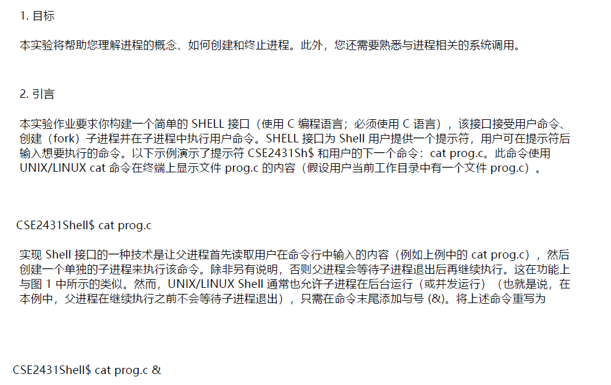
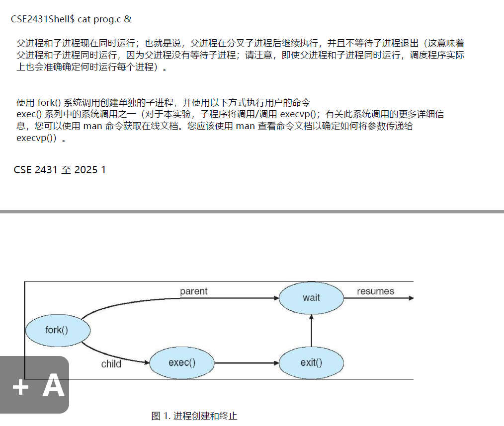
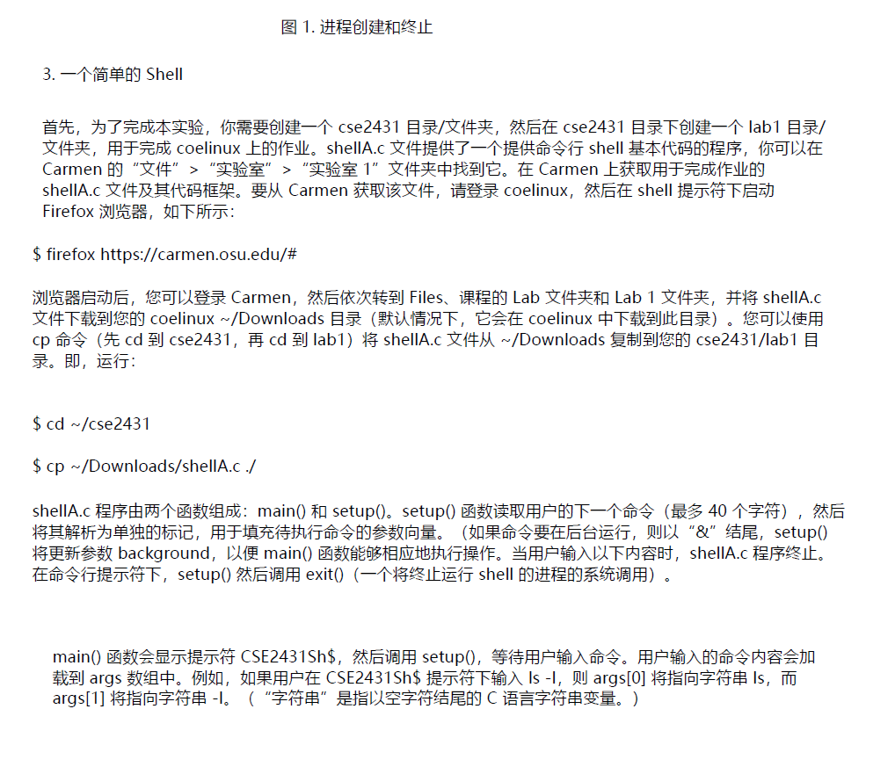
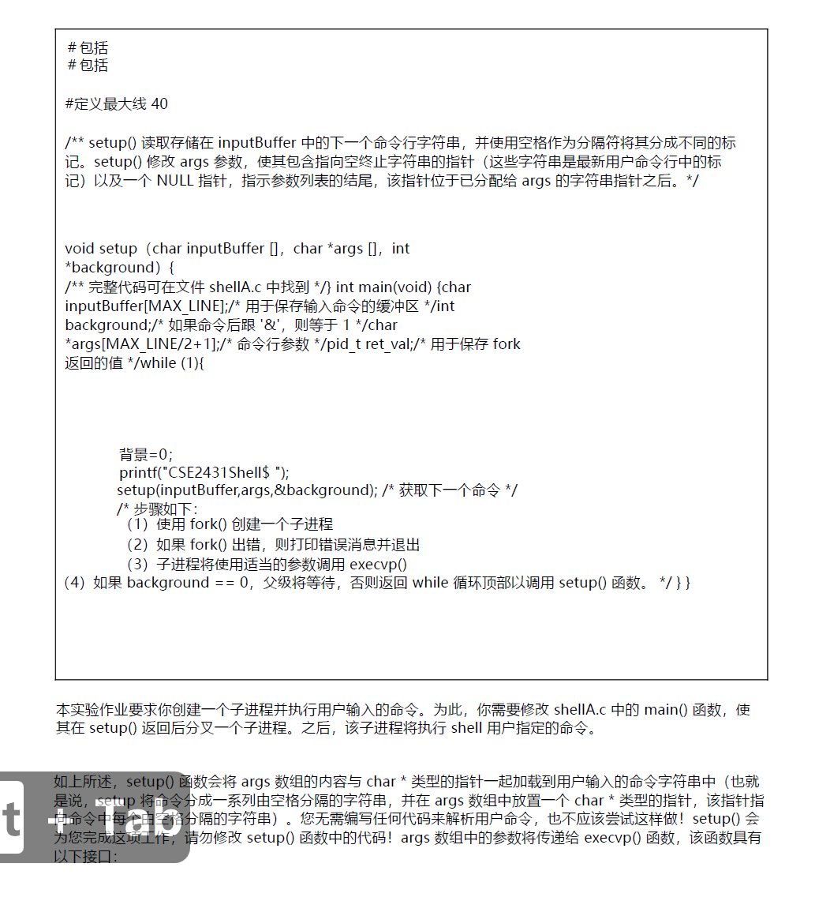
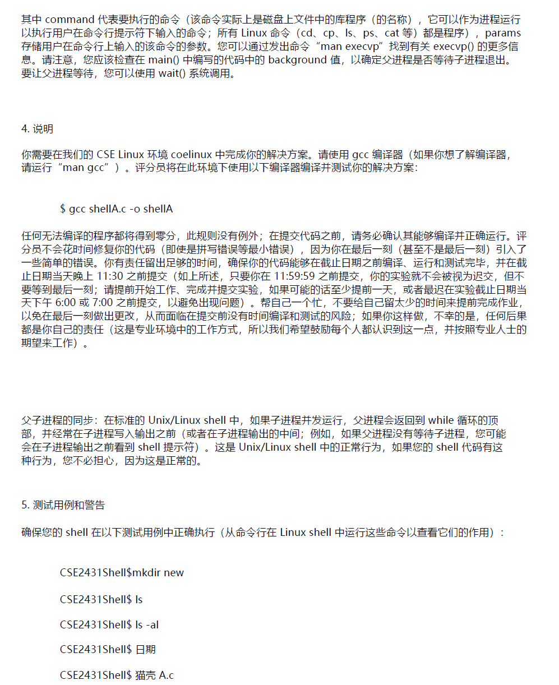
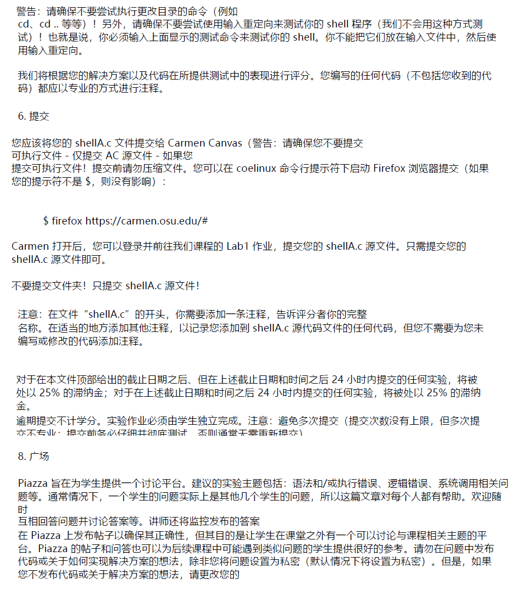

这段文字描述的是一个关于创建简单的命令行Shell界面的实验任务。具体内容如下：

1. **目标**：实验的目的是让你理解进程的概念，包括如何创建进程和如何终止进程。此外，你还需要熟悉与进程相关的系统调用。
2. **介绍**：实验要求你使用C语言（需要使用C语言）构建一个简单的Shell界面，这个界面能够接受用户输入的命令，创建一个子进程，并在子进程中执行用户输入的命令。例如，用户输入`cat prog.c`命令，Shell会在终端显示`prog.c`文件的内容。
   - 示例中的命令提示符是 `CSE2431Shell$`，接着用户输入的命令是 `cat prog.c`。
   - 该命令使用UNIX/Linux系统的`cat`命令显示`prog.c`文件的内容。
3. **实现方法**：
   - 这种Shell界面的实现方式是，父进程首先读取用户输入的命令（例如`cat prog.c`），然后创建一个子进程来执行该命令。
   - 默认情况下，父进程会等待子进程执行完毕后再继续执行。
   - 如果你希望父进程不等子进程结束，可以使用“&”符号，这样子进程就会在后台运行。
   - 例如，在命令行输入 `cat prog.c &` 后，父进程会继续执行，而不等待子进程执行完毕。

通过这个实验，你将能够深入理解父子进程的创建与管理，以及如何通过系统调用实现Shell的功能。



这段文字继续描述了创建和管理进程的细节，特别是在父进程和子进程并行执行时的情况。以下是详细解释：

1. **并行执行**：
   - `CSE2431Shell$ cat prog.c &` 命令中的 `&` 符号使父进程和子进程并行执行，即父进程在创建子进程后不会等待子进程退出，而是继续执行。这意味着父进程和子进程可以同时运行。尽管它们是并行的，操作系统调度器仍然负责决定哪个进程什么时候运行。
2. **创建子进程**：
   - 子进程的创建通过 `fork()` 系统调用完成。`fork()` 调用会创建一个新进程，它是父进程的副本，但它们的执行是独立的。之后，父进程和子进程会各自执行自己的任务。
3. **执行命令**：
   - 子进程执行用户输入的命令时，使用的是 `exec()` 系列系统调用中的一个，具体来说是 `execvp()`（用于执行命令）。`execvp()` 调用会用指定的命令替换当前的子进程程序。
4. **父进程与子进程的关系**：
   - 父进程在创建子进程后会继续执行，除非显式调用 `wait()` 来等待子进程的结束。
   - 子进程执行命令后，调用 `exit()` 结束自身。
   - 如果父进程调用 `wait()`，则父进程会等待子进程完成后才会继续执行。
5. **图示说明**：
   - 图示展示了进程创建和终止的流程。父进程通过 `fork()` 创建子进程，子进程执行命令并通过 `exec()` 系统调用替换自身的程序，最后通过 `exit()` 退出。父进程如果调用 `wait()`，则会等待子进程结束后才继续执行。

总体来说，这段文字描述了如何通过 `fork()` 和 `exec()` 系统调用创建并管理子进程，以及父子进程之间的执行关系。



这段文字描述了如何实现一个简单的命令行Shell程序，并介绍了实验的步骤和相关代码。以下是详细解释：

### 1. **创建工作目录**：

- 在开始实验之前，你需要在自己的文件系统中创建一个名为 `cse2431` 的目录，并在其中创建一个名为 `lab1` 的子目录。这个目录结构是为了保存本次实验的所有文件。
- 实验用到的Shell程序的代码文件 `shellA.c` 已经提供，位于Carmen网站上的 `Lab 1` 文件夹中。你需要下载该文件，并将其复制到你在 `coelinux` 环境中的工作目录下。

### 2. **下载文件和设置环境**：

- 打开浏览器，访问链接 `https://carmen.osu.edu/#`，登录到Carmen网站。
- 登录后，进入 `Files` 部分，找到课程对应的 `Lab 1` 文件夹，并下载 `shellA.c` 文件。文件默认会下载到你 `coelinux` 环境的 `~/Downloads` 目录。
- 下载后，你需要进入到 `cse2431/lab1` 目录，并使用 `cp` 命令将 `shellA.c` 文件从 `~/Downloads` 目录复制到当前目录。

示例命令：

```bash
$ cd ~/cse2431
$ cp ~/Downloads/shellA.c ./
```

### 3. **shellA.c 文件说明**：

- `shellA.c` 程序由两个函数组成：
  - **main()**：呈现命令提示符 `CSE2431Sh$`，然后调用 `setup()` 函数，等待用户输入命令。
  - **setup()**：该函数负责读取用户输入的命令，并将命令分解成不同的部分（称为"tokens"）。这些部分将填充到命令的参数向量中，然后通过 `exec()` 系列系统调用执行命令。如果命令末尾有`&`，则表明命令需要在后台运行，`main()` 函数会做相应的处理。

具体来说，`setup()` 还会在用户输入的命令需要在后台运行时，更新进程的背景标志（background flag），确保父进程在后台执行子进程时的行为正确。

### 4. **命令解析**：

- 用户输入命令后，`setup()` 会将输入的命令解析成单独的参数，这些参数将被存储在 `args` 数组中。每个数组元素对应命令的一个部分。
  - 比如，用户输入 `ls -l` 命令时，`args[0]` 会指向字符串 `ls`，而 `args[1]` 会指向字符串 `-l`。
  - 这些字符串是C语言风格的字符串，以 `\0` 作为结尾。

### 5. **退出程序**：

- `shellA.c` 程序的终止通过调用 `exit()` 函数实现。当用户按下 `Ctrl+D` 结束输入时，`setup()` 会调用 `exit()` 系统调用，终止运行中的Shell程序。

总结来说，这段文字是关于如何设置实验环境、下载并运行一个简单的命令行Shell程序的说明。它详细介绍了Shell的基本结构和工作原理，特别是如何处理用户输入的命令，并将其传递给子进程执行。



这段文字描述了Shell程序的代码实现，重点在于如何解析用户输入的命令并创建一个子进程来执行这些命令。以下是详细解释：

### 1. **代码解释**：

#### 头文件和宏定义：

```c
#include <stdio.h>
#include <unistd.h>

#define MAX_LINE 40
```

- `stdio.h` 用于标准输入输出操作。
- `unistd.h` 提供了与操作系统交互的功能，比如 `fork()`、`execvp()` 等。
- `MAX_LINE` 定义了输入命令的最大字符数（40个字符）。

#### `setup()` 函数：

```c
void setup(char inputBuffer[], char *args[], int *background)
{
    /* full code available in the file shellA.c */
}
```

- `setup()` 函数用于解析用户输入的命令，将其分解成多个参数（以空格为分隔符）。它会将每个参数存储到 `args` 数组中，并检查命令是否包含 `&`，以确定命令是否应在后台运行。

#### `main()` 函数：

```c
int main(void)
{
    char inputBuffer[MAX_LINE];  /* buffer to hold the command entered */
    int background;               /* equals 1 if a command is followed by '&' */
    char *args[MAX_LINE+1];       /* command line arguments */
    pid_t r_val;                  /* to hold value returned by fork() */
    
    while (1)
    {
        background = 0;
        printf("CSE2431Shell$ ");
        setup(inputBuffer, args, &background); /* get next command */
        /* the steps are:
        (1) fork a child process using fork()
        (2) print error message and exit if error on fork()
        (3) the child process will invoke execvp() with appropriate parameters
        (4) if background == 0, the parent will wait, otherwise return to top of while loop to call the setup() function. */
    }
}
```

- `inputBuffer` 用于存储用户输入的命令。
- `background` 用来判断命令是否需要在后台执行。如果命令以 `&` 结尾，`background` 被设置为1。
- `args` 数组保存命令行中的每个参数（以空格分隔）。
- `r_val` 保存由 `fork()` 返回的值，用于判断子进程和父进程。

**while(1) 循环**：

- 该程序进入一个无限循环，持续提示用户输入命令。
- 每次循环开始时，先将 `background` 设置为0，表示默认命令在前台运行。
- 使用 `setup()` 函数解析用户输入的命令，并将结果存储在 `inputBuffer` 和 `args` 数组中。

#### 进程创建与命令执行：

```c
/* (1) fork a child process using fork() */
r_val = fork();
/* (2) print error message and exit if error on fork() */
if (r_val < 0)
{
    perror("Fork failed");
    exit(1);
}
/* (3) the child process will invoke execvp() with appropriate parameters */
if (r_val == 0)
{
    execvp(args[0], args); /* Execute the command */
    perror("Exec failed");  /* If execvp fails */
    exit(1);
}
/* (4) if background == 0, the parent will wait, otherwise return to top of while loop to call the setup() function. */
if (background == 0)
{
    waitpid(r_val, NULL, 0);  /* Wait for child process to finish */
}
```

- **`fork()`**：创建一个子进程。`fork()` 返回值为：
  - 对于父进程，返回子进程的PID（正数）。
  - 对于子进程，返回0。
  - 如果返回值小于0，表示 `fork()` 失败。
- **`execvp()`**：在子进程中使用 `execvp()` 执行用户输入的命令。`execvp()` 会用指定的命令替换当前进程。
- 如果命令没有以 `&` 结尾，父进程会等待子进程执行完毕后再继续执行。

### 2. **实验任务**：

实验要求你修改 `shellA.c` 文件中的 `main()` 函数，使其能够根据用户输入的命令创建一个子进程，并执行该命令。你需要实现以下几个步骤：

- 解析用户输入的命令，并将命令的每个部分存储到 `args` 数组中。
- 使用 `fork()` 创建子进程。
- 使用 `execvp()` 在子进程中执行命令。
- 如果命令需要在后台运行，则父进程不等待子进程，而是继续循环获取下一个命令；如果命令在前台运行，父进程等待子进程结束。

### 3. **关于 `setup()` 函数**：

- `setup()` 函数用于读取并解析用户输入的命令。该函数将命令按空格分隔成不同的部分，并将每个部分存储到 `args` 数组中。`setup()` 不会执行命令，而是将命令传递给父进程。
- 在该实验中，你不需要编写代码来解析命令，`setup()` 已经完成了这个功能，你只需要调用它即可。

### 4. **`execvp()` 函数接口**：

`execvp()` 用于执行命令，函数原型如下：

```c
execvp(char *command, char *params[]);
```

- `command` 是要执行的命令的名称（如 `ls`）。
- `params` 是一个字符串数组，包含要传递给命令的参数。

### 总结：

这段文字详细描述了如何修改 `shellA.c` 代码，以实现一个简单的Shell，能够读取用户输入、创建子进程并执行命令。重点在于如何使用 `fork()` 创建子进程，使用 `execvp()` 执行命令，并且处理命令是否在后台运行的情况。



这段文字提供了实验的详细指导和要求，特别是如何编译、测试和调试程序。以下是详细解释：

### 1. **关于 `execvp()` 函数**：

- `command` 表示要执行的命令（例如：`ls`，`cat`，`ps`等）。
- `params` 是传递给该命令的参数。用户输入的命令参数会作为 `params` 传递给 `execvp()` 函数，命令通过 `execvp()` 执行。
- `background` 变量可以帮助判断命令是否需要在后台执行，具体通过检查 `main()` 中 `background` 的值来决定父进程是否等待子进程。

### 2. **实验要求**：

- **CSE Linux 环境**：你需要在指定的 Linux 环境（coelinux）中完成实验任务。建议使用 `gcc` 编译器来编译代码（如果你不熟悉，可以使用 `man gcc` 查阅更多信息）。

- **编译和测试**：评阅者会在该环境中使用 `gcc` 编译你的程序，并进行测试。因此，你的代码必须能够在该环境中成功编译和运行。

  编译命令：

  ```bash
  $ gcc shellA.c -o shellA
  ```

### 3. **提交要求**：

- **编译成功**：任何不能成功编译的程序将直接被判零分，没有任何例外。你必须确保代码在提交前能够正确编译和执行。
- **注意错误**：确保代码中没有小错误（如拼写错误），并且在提交前已经测试和修复了所有错误。
- **及时提交**：你应该确保在截止日期前完成并提交代码（如图中的时间说明）。如果你在截止日期前提交，测试程序会在提交时执行。

### 4. **父子进程同步**：

- 在标准的 Unix/Linux Shell 中，父进程和子进程是并发执行的。如果子进程在后台运行，父进程可能会继续循环并打印提示符，而不是等待子进程执行完毕。这种行为是正常的，不必过于担心。
- 这种行为与操作系统的进程调度和 Shell 的设计有关，因此你的 Shell 程序也应该支持这一行为。

### 5. **测试用例**：

实验要求你确保你的 Shell 能够正确地处理以下命令。这些命令的结果可以通过在 Linux Shell 中运行来查看它们的行为：

- **mkdir new**：创建一个新目录 `new`。
- **ls**：列出当前目录中的文件和子目录。
- **ls -al**：以详细格式列出当前目录中的文件和目录，包括隐藏文件。
- **date**：显示当前的日期和时间。
- **cat shellA.c**：显示 `shellA.c` 文件的内容。

这些命令都是常见的 Unix/Linux 命令，要求你的 Shell 正确地解析和执行这些命令。

### 6. **总结**：

- 这段文字强调了实验的编译和提交要求，特别是需要确保代码在指定环境中正确编译并能执行。它还解释了如何处理父子进程的并发执行，以及测试代码是否能正确处理标准的 Unix/Linux 命令。



这段文字主要提供了关于实验提交、注意事项以及 Piazza 讨论平台使用的指导。以下是详细解释：

### 1. **注意事项 (Warning)**：

- **不要尝试执行改变目录的命令**：例如 `cd` 命令。不要尝试在测试程序时使用输入重定向。这意味着你必须手动输入并测试 Shell，而不是使用输入文件或重定向输入。你不能通过将测试命令放入文件并进行输入重定向来测试 Shell。
- **测试命令**：你需要按照之前提供的测试命令进行测试，而不是使用输入重定向的方式来测试。

### 2. **评分标准**：

- **评分依据**：你会根据代码的正确性和性能进行评分。除了你编写的代码（即完成实验的部分），任何提供的代码（如样板代码）都不算在内。你编写的代码应该进行适当的注释，保持专业性。

### 3. **提交要求**：

- **提交文件**：你需要提交的是源代码文件 `shellA.c`，而不是可执行文件。如果提交了可执行文件，**将不会获得任何分数**。
- **不要压缩文件**：请不要压缩文件进行提交。
- **文件提交方式**：登录到 Carmen（课程平台），并在 Lab1 作业页面提交 `shellA.c` 源代码文件。确保只提交源代码文件 `shellA.c`，不要提交文件夹。

**重要提醒**：

- **注释要求**：在文件的开头，需要添加一条注释，告诉评审员你在 `shellA.c` 中做了哪些修改，并注明哪些代码是你添加的。你不需要为提供的代码添加注释，只需注明你所修改的部分。
- **延迟提交**：如果迟交作业，**将扣除 25%** 的分数。如果提交超过 24 小时，将不再获得分数。因此，确保按时提交。
- **尽量减少重新提交**：避免重复提交代码。虽然可以多次提交，但过多的提交会显得不专业，你不应该需要多次提交。

### 4. **Piazza 讨论平台**：

- **Piazza 讨论平台**：Piazza 是一个用于学生间讨论的在线平台，适用于讨论实验任务中的问题，如代码语法、执行错误、系统调用问题等。
- **提问与回答**：如果有问题，可以在 Piazza 上提问，且建议回答他人的问题。若你看到有其他学生提问，你可以回答他们的问题，帮助他人理解任务。
- **隐私设置**：如果你发布的代码或解决方案属于私密内容（例如你自己的代码），你应该选择私密发布。不要公开发布解决方案，避免暴露自己的代码。

### 5. **总结**：

这段文字主要强调了实验的提交要求、注意事项和如何使用 Piazza 讨论平台。核心要点是：确保你只提交源代码文件，并在代码中添加合适的注释，按时提交作业，并且在 Piazza 上进行适当的讨论和交流。

# 怎么做

我看了你上传的 `shellA.c` 文件，它里面已经帮你写好了 **命令解析部分 (`setup` 函数)** 和 **程序框架 (`main` 函数的循环)**。你需要做的是**补充 `main()` 函数中缺失的“创建子进程并执行命令”的部分**。

下面我分步骤告诉你该怎么做：

------

## 1. 实验目标

你要完成一个**简单的Shell程序**，它能：

1. 打印提示符（比如 `CSE2431Shell$`）。
2. 接收用户输入的命令（由 `setup()` 完成）。
3. 使用 `fork()` 创建子进程。
4. 在子进程中用 `execvp()` 执行命令。
5. 在父进程中根据 `background` 值（是否带 `&`）决定是否等待子进程。

------

## 2. 需要补充的部分

在 `main()` 循环中，注释里写了要做的四步，你需要在这里写代码。

完整逻辑应该是这样的：

```c
ret_val = fork();   /* (1) 创建子进程 */

if (ret_val < 0) {   /* (2) 错误情况 */
    perror("Fork failed");
    exit(1);

} else if (ret_val == 0) {   /* (3) 子进程 */
    if (execvp(args[0], args) < 0) {
        perror("Exec failed");  /* 如果命令执行失败，输出错误信息 */
        exit(1);
    }

} else {   /* (4) 父进程 */
    if (background == 0) {
        /* 等待子进程结束 */
        waitpid(ret_val, NULL, 0);
    }
    /* 如果 background == 1，父进程直接继续下一轮循环，不等待 */
}
```

------

## 3. 完整的 `main()` 示例

整合后，你的 `main()` 大概是这样：

```c
int main(void)
{
    char inputBuff[MAXLINE];     /* 输入缓冲区 */
    char *args[MAXLINE/2+1];     /* 命令参数数组 */
    int background;              /* 是否后台运行 */
    pid_t ret_val;               /* fork() 返回值 */

    while (1) {
        background = 0;

        printf("CSE2431Shell$ ");  
        fflush(0);

        setup(inputBuff, args, &background);  /* 获取用户命令 */

        ret_val = fork();   /* 创建子进程 */

        if (ret_val < 0) {
            perror("Fork failed");
            exit(1);
        } else if (ret_val == 0) {   /* 子进程 */
            if (execvp(args[0], args) < 0) {
                perror("Exec failed");
                exit(1);
            }
        } else {   /* 父进程 */
            if (background == 0) {
                waitpid(ret_val, NULL, 0);
            }
        }
    }
    return 0;
}
```

------

## 4. 编译与测试

在 `coelinux` 里编译：

```bash
gcc shellA.c -o shellA
```

运行：

```bash
./shellA
```

测试（输入这些命令，看看是否正确运行）：

```bash
CSE2431Shell$ ls
CSE2431Shell$ ls -al
CSE2431Shell$ date
CSE2431Shell$ cat shellA.c
CSE2431Shell$ ls &
```

------

⚠️ 注意事项：

- **不要实现 `cd`**（目录切换），因为作业明确说了不要改动目录相关命令。
- **不要修改 `setup()`**，它已经帮你解析命令了。
- 确保提交的只有 `shellA.c` 源码文件。

------

要不要我帮你直接把 **修改好的完整 `shellA.c` 文件写出来**，你就可以直接拿去编译运行？

# 详细解释

以下是完整修改后的 `shellA.c` 文件代码，你可以直接复制并使用：

```c
#include <stdio.h>
#include <stdlib.h>
#include <unistd.h>

#define MAXLINE 40 /* 40 chars per line, that is, per command, is limit for this shell. */

/** 
setup() reads in the next command line string stored in the input buffer.
separating it into distinct tokens using whitespace as delimiters.  Setup 
modifies the args parameter so that it holds pointers to the null-terminated 
strings which are the tokens in the most recent user command line as well 
as a NULL pointer, indicating the end of the argument list, which comes 
after the string pointers that have been assigned to args. 
**/

void setup(char inputBuff[], char *args[],int *background)
{
    int length,  /* Num characters in the command line */
        i,       /* Index for inputBuff arrray          */
        j,       /* Where to place the next parameter into args[] */
        start;   /* Beginning of next command parameter */

    /* Read what the user enters */
    length = read(STDIN_FILENO, inputBuff, MAXLINE);  

    j = 0;
    start = -1;

    if (length == 0)
        exit(0);            /* Cntrl-d was entered, end of user command stream */

    if (length < 0){
        perror("error reading command");
	exit(-1);           /* Terminate with error code of -1 */
    }
    
    /* Examine every character in the input buffer */
    for (i = 0; i < length; i++) {
 
        switch (inputBuff[i]){
        case ' ':
        case '\t' :          /* Argument separators */

            if(start != -1){
                args[j] = &inputBuff[start];    /* Set up pointer */
                j++;
            }

            inputBuff[i] = '\0'; /* Add a null char; make a C string */
            start = -1;
            break;

        case '\n':             /* Final char examined */
            if (start != -1){
                args[j] = &inputBuff[start];     
                j++;
            }

            inputBuff[i] = '\0';
            args[j] = NULL; /* No more arguments to this command */
            break;

        case '&':
            *background = 1;
            inputBuff[i] = '\0';
            break;
            
        default :             /* Some other character */
            if (start == -1)
                start = i;
	}
 
    }    
    args[j] = NULL; /* Just in case the input line was > 40 characters */
} 

int main(void)
{
    char inputBuff[MAXLINE];     /* 输入缓冲区 */
    char *args[MAXLINE/2+1];     /* 命令参数数组 */
    int background;              /* 是否后台运行 */
    pid_t ret_val;               /* fork() 返回值 */

    while (1) {
        background = 0;

        printf("CSE2431Shell$ ");  
        fflush(0);

        setup(inputBuff, args, &background);  /* 获取用户命令 */

        ret_val = fork();   /* 创建子进程 */

        if (ret_val < 0) {
            perror("Fork failed");
            exit(1);
        } else if (ret_val == 0) {   /* 子进程 */
            if (execvp(args[0], args) < 0) {
                perror("Exec failed");
                exit(1);
            }
        } else {   /* 父进程 */
            if (background == 0) {
                waitpid(ret_val, NULL, 0);
            }
        }
    }
    return 0;
}
```

### 说明：

1. **创建子进程**：使用 `fork()` 创建子进程。
2. **执行命令**：在子进程中使用 `execvp()` 执行用户输入的命令。
3. **父进程行为**：
   - 如果命令不是后台执行（`background == 0`），父进程等待子进程执行完毕。
   - 如果命令是后台执行（`background == 1`），父进程继续执行下一个命令，而不等待子进程结束。

### 编译与运行：

在终端中，使用以下命令进行编译并运行程序：

```bash
gcc shellA.c -o shellA
./shellA
```

然后你可以输入命令进行测试，如 `ls`, `cat`, `date` 等。

希望这能帮助你完成实验，祝顺利！如果还有其他问题，随时告诉我！