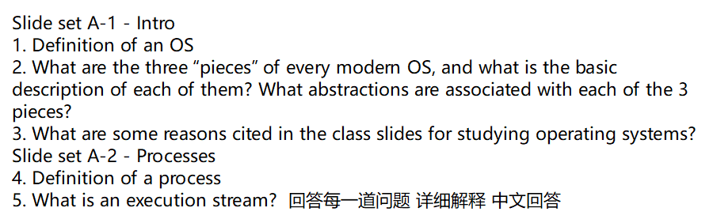

下面按题号逐一作答，并尽量结合常见教材/课程的表述给出清晰、可操作的理解框架。

------

## 1) 操作系统（OS）的定义

操作系统是**管理硬件资源、提供抽象接口并协调程序执行**的一组系统软件。换句话说，它一方面像“**资源管理者**”，负责把 CPU、内存、磁盘、网络和设备有序地分配给各类程序；另一方面像“**虚拟机/抽象层**”，向上提供比原始硬件更好用、更安全、更稳定的接口和编程抽象（如进程、地址空间、文件等）。

核心职责可概括为：

- **抽象（Abstraction）**：把复杂硬件包装成易用对象（进程、虚拟内存、文件、套接字……）。
- **复用/虚拟化（Multiplexing/Virtualization）**：让多个程序“看起来”独占资源（每个进程看到自己的 CPU 时间与地址空间）。
- **隔离与保护（Isolation/Protection）**：防止程序互相破坏或越权访问（权限、内存保护、系统调用边界）。
- **高效与公平（Efficiency/Fairness）**：调度与缓存等机制在吞吐、延迟、公平性间权衡。
- **可靠与安全（Reliability/Security）**：容错、权限模型、系统完整性、审计与更新等。

------

## 2) 现代操作系统的三大“组成部分”及其抽象

很多课程会把 OS 的主体划分为三个互相配合的部分（名称表述略有差异，但内涵相近）：

### A. 进程/CPU 管理（**CPU 虚拟化**）

- **基本描述**：把一颗或多颗物理 CPU 的执行能力“切片”，在时间上快速切换，让每个程序**仿佛独占 CPU**。
- **关键机制**：调度（Scheduling）、上下文切换、抢占、中断/陷入、系统调用、优先级与时间片。
- **典型抽象**：
  - **进程（Process）**：正在执行的程序实例（含独立地址空间与资源配额）。
  - **线程（Thread / 执行流）**：进程内的执行单位，拥有自己的寄存器上下文与栈。
  - **IPC 同步**：管道、消息队列、共享内存、信号、锁（互斥量/读写锁）、条件变量、信号量等。

### B. 内存管理（**内存虚拟化**）

- **基本描述**：为每个进程提供**私有的、连续的虚拟地址空间**，与实际物理内存解耦，同时实现保护与共享。
- **关键机制**：分页（页/页表/TLB）、按需调页、页面置换策略、内存映射文件（mmap）、权限位（R/W/X）、复制写时（COW）。
- **典型抽象**：
  - **地址空间（Address Space）**：代码段、数据段、堆、栈、共享库映射等的统一虚拟视图。
  - **页（Page）/段（Segment）**：内存管理粒度与历史抽象。
  - **内存映射对象**：把文件或匿名内存映射到进程地址空间。

### C. 存储与 I/O 管理（**持久化与设备抽象**）

- **基本描述**：把各种不同设备（磁盘、SSD、网卡、终端、传感器等）的访问细节统一到一致接口，并提供**持久化**数据组织。
- **关键机制**：设备驱动、缓冲/页缓存、块层/字符设备层、VFS（虚拟文件系统）、日志式文件系统、调度与缓存替换。
- **典型抽象**：
  - **文件与目录（File/Directory）**、**文件描述符**、**inode**、**挂载点**。
  - **管道与套接字（Pipe/Socket）**：把进程间通信和网络通信统一成“类似文件”的读写操作。
  - **设备文件**（块设备/字符设备）：以文件方式访问硬件。

> 小结：这三部分分别对应 **CPU 虚拟化（进程/线程）**、**内存虚拟化（地址空间/虚拟内存）**、**持久化与 I/O 抽象（文件/设备/网络）**，共同为上层软件提供一致、安全、高效的运行环境。

------

## 3) 为何要学习操作系统（课程常见动机）

- **吃透计算机“底层是怎么跑起来的”**：理解系统调用、进程/线程、虚拟内存、文件系统与网络栈，写代码不再“黑箱”。
- **写出可靠高性能软件**：掌握调度、缓存、锁、I/O 模型、内存管理，才能定位性能瓶颈与并发 Bug。
- **并发与多核能力**：正确使用线程/协程、同步原语与无锁结构，避免死锁、竞态与饥饿。
- **安全与隔离意识**：权限边界、内存保护、最小特权、沙箱、容器/虚拟化，为系统与云原生打基础。
- **系统设计与工程素养**：学会在正确性、可维护性、效率、可观测性（监控/日志/追踪）之间做权衡。
- **职业与研究拓展**：系统/后端/嵌入式/云计算/数据库/存储/网络/虚拟化/操作系统研发等方向的必备底层功。
- **读写内核级或高性能代码**：能看懂内核文档与驱动、利用零拷贝、异步 I/O、内存映射等“系统级神器”。

------

## 4) 进程（Process）的定义

**进程 = 正在运行的程序的一个实例**，它拥有：

- **独立的地址空间**（虚拟内存视图：代码/数据/堆/栈/共享库）。
- **运行上下文**（包含一个或多个线程的寄存器、程序计数器、栈等）。
- **系统资源的配额与句柄**（打开的文件/套接字、信号、权限、环境变量、工作目录等）。
- **内核中的进程控制块（PCB/Task Struct）**存放其标识、状态、优先级、调度信息、内存映射、打开文件表等元数据。

补充要点：

- **程序（Program）\**只是\**静态**的可执行文件；**进程**是其**动态**执行态。
- 进程可包含**多个线程**，共享同一地址空间与大部分资源。
- **典型状态**：就绪（Ready）/运行（Running）/阻塞（Blocked, 等 I/O）/终止（Terminated），由调度器与事件驱动转换。
- **上下文切换**：内核保存/恢复寄存器等上下文，在不同进程/线程间切换 CPU。

------

## 5) 什么是执行流（Execution Stream）？

**执行流**（又常称“**线程**”、“控制流**/thread of control**”）是指**CPU 顺序执行的一条指令序列**及其相关运行上下文。你可以把它理解为“谁在用着 CPU、按什么顺序执行哪段代码”。其特点是：

- **最小的可调度执行单位**：调度器把时间片分配给执行流（线程），而非抽象的“程序文本”。
- **上下文组成**：程序计数器（PC/IP）、通用寄存器、栈指针、线程栈及线程私有数据等。
- **与进程关系**：
  - 单线程进程：一个进程只有**一个**执行流。
  - 多线程进程：**多个**执行流共享同一进程的地址空间与资源，但各自有独立栈与寄存器上下文。
- **并发与并行**：
  - 在单核 CPU 上，多执行流通过**时间片轮转**实现**并发**（宏观上同时，微观上轮流）。
  - 在多核/多处理器上，多个执行流可**真正并行**运行。
- **同步与通信**：多个执行流访问共享数据需要互斥/同步（锁、条件变量、信号量、原子操作、栅栏等）以避免竞态。

> 一句话：**执行流 = “正在被 CPU 执行的那条路线”**；线程是执行流的标准实现形态。

------

如果你需要，我还能把以上内容配成速记图/对照表（如“抽象—机制—典型系统调用”三列），或结合具体 OS（Linux/Windows/macOS）给出更贴近实现的示例。

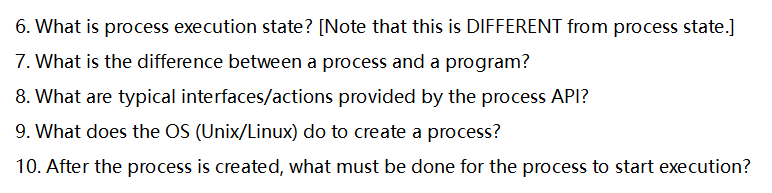

# 6. 什么是“进程的执行态（process execution state）”？（区别于“进程状态”）

- **进程的执行态**指的是：如果此刻把 CPU 的控制权交给该进程，需要恢复到 CPU 寄存器里的**那组具体值**与运行现场，包括：
  - 程序计数器（PC/IP）、栈指针（SP）、通用寄存器、浮点/向量寄存器、状态寄存器（标志位）、线程本地存储（TLS）指针等；
  - 与当前线程/进程绑定的**页表/地址空间**（MMU 上下文、CR3/TTBR）、内核栈指针；
  - 内核用于调度的必要元数据（优先级、时间片剩余量、调度类）。
- 执行态是**可被保存/恢复的“快照”**；上下文切换（context switch）就是保存一个进程（或线程）的执行态、加载另一个的执行态。
- **与“进程状态（process state）”不同**：
  - 进程状态是**调度器眼中的宏观状态**：就绪（ready/runnable）、运行中（running）、阻塞/睡眠（blocked/sleeping）、僵尸（zombie）等。
  - 执行态是**微观的机器状态**：告诉 CPU “下一条指令从哪儿执行、寄存器/栈是什么”。
     简单记忆：**状态（state）= 位置与资格；执行态（execution state）= 具体现场**。

------

# 7. 进程（process）与程序（program）的区别

- **程序**：静态的**可执行文件/脚本**及其**代码与只读数据**，存放在磁盘上（如 ELF、PE、Mach-O）。它**不会占用 CPU**，也没有运行中的栈/堆/打开的文件。
- **进程**：程序的**一次执行实例**，拥有**独立的地址空间**、运行时资源与内核对象：
  - 私有的虚拟内存（代码段、数据段、堆、各级栈、映射的共享库/文件等）；
  - 打开文件表、工作目录、权限凭据（UID/GID/capabilities）、信号处理器；
  - 至少一个线程（主线程），调度属性与内核中的 task 结构。
- 关系：**一个程序可以对应多个进程实例**（你可开多个“同款”进程），同一进程在生命周期内也可通过 `exec` **更换正在运行的程序映像**。

------

# 8. 典型的进程 API 接口/动作（以 Unix/Linux 为例）

1. **创建与派生**
   - `fork`/`vfork`/`clone`、`posix_spawn`：创建子进程或按选项克隆部分资源（Linux `clone/clone3` 可细粒度控制）。
2. **装载并执行新程序**
   - `execve`/`execl*`/`execvpe`：用新程序映像**覆盖**当前进程地址空间，并从其入口开始运行。
3. **结束与回收**
   - `exit`/`_exit`：结束当前进程；`wait`/`waitpid`/`waitid`：父进程**回收**子进程并获其退出码；
   - `kill`：向目标进程/进程组发送信号（不仅用于“杀死”，也用于事件通知）。
4. **信号与处理**
   - `sigaction`、`signal`、`sigprocmask`、`sigwait`：安装/屏蔽/等待信号，异步事件处理。
5. **调度与优先级**
   - `nice`/`setpriority`、`sched_setscheduler`/`sched_setparam`、`sched_yield`：调整优先级/调度策略。
6. **资源与限制**
   - `getrlimit`/`setrlimit`：进程资源上限；`prlimit`；`getrusage`：资源使用统计。
7. **身份与权限**
   - `getuid`/`setuid`、`getgid`/`setgid`、`setresuid` 等；Linux 能力（capabilities）。
8. **地址空间与内存**
   - `mmap/munmap`、`mprotect`、`brk/sbrk`（不推荐）、共享内存（`shm_open`/`mmap`）。
9. **环境与运行目录**
   - `getenv/setenv/putenv`、`chdir/fchdir`、`umask`。
10. **进程层级与会话/作业控制**
    - `getpid/getppid`、`setpgid`、`getsid/setsid`、前台/后台进程组、控制终端。
11. **进程间通信（与“进程 API”紧密相关）**
    - 管道 `pipe/pipe2`、`socketpair`、Unix 域套接字、消息队列、共享内存、信号量、`eventfd`、`signalfd` 等。
12. **命名空间/容器相关（Linux）**
    - `unshare`、`setns`、`clone(CLONE_NEW*)`、cgroups（通过 `cgroupfs`/`systemd` 接口）。

------

# 9. Unix/Linux 内核创建一个进程时做了什么？

> 下面以经典 **`fork`**（写时复制 COW）为主线，补充 `posix_spawn` 与 `clone` 要点。

1. **分配内核对象与 PID**
   - 创建 `task_struct`（线程/进程描述符）、内核栈、调度实体；分配唯一 PID，建立父子关系链。
2. **复制/引用父进程资源（写时复制）**
   - **地址空间**：`mm_struct` 及其 VMA 映射被**标记为只读并共享物理页**；父子任一方写入时触发 COW 拷贝；
   - **文件描述符表**（`files_struct`）：增加引用计数，共享打开文件（偏移量可共享）；
   - **文件系统上下文**（`fs_struct`：CWD/根目录）、**信号处理**（`sighand`）、**凭据 `cred`** 等按语义复制或引用；
   - 继承**信号屏蔽字**、环境变量、umask、资源限制等。
3. **设置子进程的执行态（CPU 上下文）**
   - 为子进程构造一个**“从 `fork` 返回”**的现场：父返回子 PID，**子返回 0**；设置内核栈初始帧以便首次调度时能“落地”到用户态。
4. **调度就绪**
   - 将子进程置为**就绪（runnable）**，插入就绪队列；必要时触发调度。
5. **返回用户态**
   - 父进程得到子 PID 继续执行；当调度器选中子进程运行时，它会在父进程的用户态现场“复刻点”处**从 `fork` 返回 0**，继续执行子路径。

**`posix_spawn`**（常用于实现 `system`/shell 启动外部程序）通常在内核中更接近“轻量 `fork` + `exec`”，减少在用户态的窗口期与拷贝开销（实现细节依 libc/内核支持）。
 **`clone/clone3`** 允许精细控制共享粒度（如仅创建新线程共享地址空间/文件表等），是 Linux 线程与容器原语的基石。

------

# 10. 进程创建后，要做什么才能开始“真正执行”？

根据**是否 `exec` 新程序**分两种理解，但共同点是：**必须被调度器选中并完成一次上下文切换**。

**通用步骤（必须条件）**

1. **进入就绪队列**：新建的进程（或线程）状态为 runnable，满足资源/优先级策略。
2. **调度器分配 CPU**：当轮到它，内核进行**上下文切换**：
   - 加载它的**执行态**：切换内核栈、页表（地址空间）、恢复寄存器/标志位；
   - 切到用户态入口（或系统调用返回点）。
3. **从正确位置开始执行**：这取决于是否发生过 `exec`。

**A. `fork` 之后、尚未 `exec`（父子继续同一映像）**

- 子进程第一次得到 CPU 时，会**从 `fork` 的返回点**开始执行（返回值为 0），然后按照程序逻辑前进（常见：立即调用 `execve` 装入新程序，或直接在子进程中执行子任务）。

**B. 调用 `execve` 装入新程序后**
 在第一次真正跑到用户态之前，内核与动态加载器要完成以下准备，使“入口有效”：

1. **装载可执行文件（ELF 等）**
   - 丢弃旧地址空间，建立**新的虚拟内存布局**：代码段、数据段、BSS、堆、栈、共享库映射、VDSO 等；
   - 设定**程序入口地址**、`auxv`、`argv`、`envp`，把这些压入新栈（构造用户栈）。
2. **动态链接（ld.so）**
   - 若为动态链接：先跳到**动态链接器**，它解析/映射共享库、做重定位与初始化（`.init_array` 等），再跳转至主程序 `main` 的前置入口（如 `_start`/`__libc_start_main`）。
3. **设置执行现场**
   - 置位 PC=入口地址、SP=新用户栈顶，清理不该继承的处理器状态；必要时设置线程局部存储（TLS）。
4. **被调度运行**
   - 调度器选中后，从入口处**开始执行新程序**（通常进入 `_start → main`）。

**一句话总结**：

- 没有 `exec`：**从 `fork` 返回点**开始；
- 有 `exec`：**装载/链接建立新映像，设置入口与用户栈 → 调度 → 从入口指令开始**。
- 无论哪种，都离不开：**进入就绪队列 → 调度器选择 → 上下文切换 → 恢复执行态**。

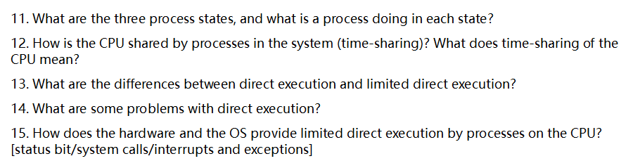

下面按题号（11–15）逐一、详细回答。

------

### 11. 三种进程状态分别是什么？各在做什么？

经典“三态模型”：

1. **运行态（Running）**
   - 含义：进程正占有 CPU，在执行其指令流。
   - 行为：执行用户代码或刚进入/即将返回内核的代码；可能在进行计算、访问内存、发起系统调用等。
2. **就绪态（Ready）**
   - 含义：进程已经具备运行条件，只是**暂时没拿到 CPU**。
   - 行为：排队等调度器分配时间片；一旦被选中就从就绪→运行。
3. **阻塞/等待态（Blocked/Waiting）**
   - 含义：进程**在等某个外部事件**，即使给它 CPU 也干不了活。
   - 行为：典型是等待 I/O 完成、等待锁/信号量、定时器超时、等待子进程结束等；事件到来后从阻塞→就绪。

常见状态迁移（理解调度很重要）：

- 运行→阻塞：执行到需要等待的操作（如 `read()` 需等磁盘/网络）。
- 运行→就绪：时间片用完被时钟中断抢占，或更高优先级进程到达。
- 阻塞→就绪：外设中断或条件满足（I/O 完成、锁可用、超时到期）。

> 注：一些教材还会引入**挂起（Suspended）\**或\**新建/终止**等扩展状态，但“三态”是最核心、最常用的最小模型。

------

### 12. 系统中进程如何“共享”CPU（时间共享）？“时间共享”是什么意思？

**时间共享（Time-Sharing）\**就是把单个 CPU 的时间切成很小的片段（时间片/量子，通常几毫秒到几十毫秒），在不同进程之间\**快速轮转**，让用户感到各进程“同时”在跑（并发错觉）。

关键机制与过程：

- **时钟中断（timer interrupt）**：硬件定时触发中断，内核获得控制权，可**抢占**正在运行的进程。
- **调度器（Scheduler）**：决定下一个上 CPU 的进程。常见策略：
  - **RR（轮转）**：公平、简单，交互性好。
  - **优先级/多级反馈队列（MLFQ）**：让交互型/短任务响应更快。
  - 其他如 CFS（Linux）等“按虚拟运行时间公平分享”。
- **上下文切换（Context Switch）**：保存当前进程寄存器/PC/标志位等上下文，恢复下一个进程的上下文，切换页表等，然后继续执行。

效果与权衡：

- **优点**：提高交互响应，公平共享，提升资源利用率。
- **权衡**：时间片太短→切换开销大；太长→响应变慢。实际系统会结合负载与策略动态调整。

> 与“空间共享”对比：时间共享是同一核心在**时间上复用**；空间共享是多核/多机在**空间上并行**。

------

### 13. 直接执行（Direct Execution）与受限直接执行（Limited Direct Execution, LDE）的区别？

先给定义，再对比：

- **直接执行（DE）**：把用户程序**直接在 CPU 上跑**，OS 不设权限边界、不安排定时抢占，程序需要啥就自己做（含 I/O、特权指令）。
  - 优点：极低开销，简单。
  - 致命问题：**不安全、不可控**（见第14问）。
- **受限直接执行（LDE）**：让进程“几乎直接”在 CPU 上跑，但**通过硬件+OS设置边界与回收控制权**：
  - 用户态/内核态分离（状态位）；
  - 只能通过**系统调用（trap）**请求敏感操作；
  - **时钟中断**可抢占，实现时间共享；
  - **设备中断/异常**由内核处理；
  - 内存通过 MMU 隔离（页表/地址空间）。

**核心差异（要点对照）**：

- **权限**：DE 无权限隔离；LDE 以**状态位**限制用户态，特权指令仅内核可执行。
- **I/O与敏感操作**：DE 进程可直接访问设备寄存器；LDE 只能通过**系统调用**，由内核代理。
- **调度控制权**：DE OS无法强制拿回 CPU；LDE 有**时钟中断**可抢占。
- **异常处理**：DE 出错可能卡死全机；LDE 异常/缺页由内核统一处理。
- **安全/隔离**：DE 易越权/破坏他人；LDE 依靠**内存保护**与内核仲裁。
- **可实现能力**：DE 难以实现多任务、虚拟化与资源配额；LDE 可以。

------

### 14. 直接执行存在哪些问题？

1. **OS 失去控制权**：没有时钟中断/抢占，用户程序可长期独占 CPU，系统无法保证公平性与响应性。
2. **安全风险极大**：程序可执行**特权指令**、直接操控设备、关中断/改内核数据；恶意或 bug 都可能导致系统崩溃。
3. **缺乏隔离**：没有内存保护，任意读写物理内存，破坏其他进程/内核。
4. **I/O 混乱**：程序直接碰硬件，资源冲突、设备状态不可控，驱动与并发管理无从谈起。
5. **错误/异常处理困难**：非法指令、除零、访问越界等会把整机带崩，无法只“杀掉”出错进程。
6. **无法时间共享**：不可抢占就谈不上多任务并发，更别说交互体验。
7. **资源管理不可行**：无法实施优先级、配额、限流、记账与审计。
8. **可靠性与可维护性差**：调试、监控、故障隔离都缺基础设施支持。

> 总结：DE 也许在“单任务、可信代码、嵌入式极简场景”还能苟活；但**通用多任务 OS 必须拒绝**。

------

### 15. 硬件与 OS 如何共同实现“受限直接执行”（提示：状态位/系统调用/中断与异常）？

把关键机制拆成五块看：

**A. 状态位（内核态/用户态）与特权指令**

- 硬件提供一个**模式位（status bit）**：用户态（不可信）与内核态（特权）。
- **特权指令**（如设置页表基址、I/O 端口、关/开中断、DMA 控制等）只能在内核态执行。
- OS 在**创建/切换进程**时设置：页表（地址空间）、内核栈、陷入向量表等；返回用户态时清特权，保证边界。

**B. 系统调用（System Call / Trap）**

- 用户程序不能直接做敏感操作；需要通过**陷入指令（trap/syscall）**切入内核：
  1. 用户态调用库封装（如 `read(fd, buf, n)`）设置**系统调用号+参数**；
  2. 执行 **trap**：硬件自动
     - 切换到**内核态**与**内核栈**，
     - **保存用户现场**（PC/寄存器/标志），
     - 跳到**陷入向量**指定的内核入口；
  3. 内核**校验参数**（防越界/指针有效性），执行对应服务（调度、I/O、内存分配等）；
  4. 通过 **return-from-trap** 指令恢复用户上下文与**用户态返回**。
- 这样既保证了**功能可用**，又保持了**安全/隔离与可控性**。

**C. 时钟中断与调度（Time-Sharing 的硬件基础）**

- OS 在启动时编程定时器，开启**周期性时钟中断**。
- 中断到来时硬件跳入内核中断入口，OS：
  - 统计本进程用时；如时间片到则**触发调度**；
  - **上下文切换**：保存当前进程上下文→选择下一个就绪进程→恢复其上下文；
  - 返回新进程的用户态 PC 继续执行。
- 如此即可**强制回收 CPU**，实现时间共享与优先级策略。

**D. 设备中断与异常（Interrupts & Exceptions）**

- **设备中断**：I/O 完成时，设备控制器发中断→内核中断处理程序运行→把等待该 I/O 的进程从阻塞队列唤醒到就绪队列。
- **异常（fault/trap/abort）**：
  - 同步于指令，如**缺页（page fault）**、除零、非法指令、访问违规。
  - 内核可以**修复**（如装入缺页后重启指令）或**终止进程**（发送信号/错误码），实现健壮性与隔离。
- OS 预先设置**中断/异常向量表**，每类事件有对应的处理入口。

**E. 内存保护与地址空间（虽题中未点名，但与 LDE 强相关）**

- 硬件 MMU + **页表/段表**：给每进程独立虚拟地址空间，标注页的权限（R/W/X、用户/内核）。
- 用户态只能访问**被授权的虚拟页**；访问违规触发异常，由内核处理。
- 这与状态位一起构成**安全隔离的“双保险”**。

**完整的典型执行时序（以 `read()` 为例）**

1. 进程在用户态执行，到 `read()` 调用库；
2. 执行 `trap` 进入内核态 → 内核检查参数与权限；
3. 若数据未就绪：
   - 内核发起 I/O（常用 DMA），将进程置为**阻塞**；
   - 调度器切走到其他**就绪**进程运行；
4. I/O 完成触发**设备中断** → 内核把该进程从阻塞唤醒为**就绪**；
5. 某次时钟中断/调度后，该进程再获 CPU → 内核**return-from-trap** 返回用户态 → `read()` 返回数据。

通过以上**状态位 + 系统调用 + 中断/异常 + 调度/上下文切换 + 内存保护**，硬件与 OS 共同实现了既高效又安全可控的**受限直接执行**：进程“看起来”直接用 CPU，实则所有敏感点都在 OS 监督之下。

------

如果你需要，我可以把这些内容整理成一页对照表或流程图，方便期末复习与速记。

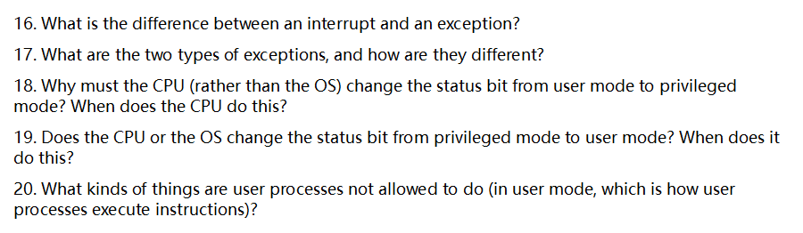

下面把第16–20题分别详细解释（结合主流架构的一般规律；具体到 x86、ARM 等细节可能略有差异，但核心一致）。

# 16. 中断（interrupt）与异常（exception）的区别

- **触发来源与时机**
  - **中断**：来自**处理器外部**的异步事件（如外设完成 I/O、时钟滴答、网卡收到数据包）。它和当前在跑的那条指令没有必然因果关系，发生时间对程序而言是“意外的、异步的”。
  - **异常**：由**当前正在执行的指令**同步触发（如除零错误、页缺页、权限违规、系统调用指令等）。一定发生在某条具体指令的执行过程中或刚执行之后。
- **处理语义**
  - **中断**通常在指令边界处理，返回时一般**继续到下一条指令**。
  - **异常**需要针对触发那条指令采取措施：
    - 若是“故障（fault）”类，异常在指令**完成之前**被报告，处理后往往要**重启同一条指令**（例如缺页异常：内核补齐页后重试）。
    - 若是“陷阱（trap）”类，异常在指令**完成之后**被报告，返回时**跳到下一条指令**（典型是系统调用、断点）。
- **用途与举例**
  - **中断**：计时器中断用于时间片轮转；磁盘/网卡中断用于上报 I/O 完成。
  - **异常**：缺页、越权访问、除零、执行 `syscall/int 0x80/svc` 等。
- **共同点**
  - 两者都会引发**特权级提升**（进入内核/特权模式）、**硬件自动保存关键信息**（PC/状态字/少量寄存器）、然后跳转到向量表中的相应处理例程。

# 17. 异常的两种类型及区别

在多数操作系统/教材的常见二分法里，**异常分为两类：故障（fault）与陷阱（trap）**（有些体系结构还把“终止/崩溃（abort）”单列为第三类，这里按“两类”来答）。

- **故障（fault）**
  - **发生点**：在指令**尚未完成**时被报告。
  - **返回语义**：处理完毕后通常**重新执行同一条指令**（因为它还没成功完成）。
  - **典型例子**：**缺页异常**（内核装入缺页后重启指令）、**一般保护性故障/权限故障**。
  - **可恢复性**：有的故障可恢复（如缺页）；也有不可恢复的（如除零，多数情况下会终止进程）。
- **陷阱（trap）**
  - **发生点**：在指令**完成之后**被报告。
  - **返回语义**：处理后**返回到下一条指令**。
  - **典型例子**：**系统调用**（软件中断/`syscall`/`int`/`svc`）、**调试断点**。

> 备忘：x86 文档里还定义了 **abort**（如硬件一致性/严重错误），通常不可恢复；但题目问“两类”，掌握“故障 vs. 陷阱”的触发点与返回语义即可。

# 18. 为什么必须由 **CPU**（不是 OS）把状态位从用户态切到内核态？什么时候做？

- **为什么必须由 CPU 执行这一步：**
  1. **信任与隔离边界**：用户态代码不可信。如果让 OS（也就是一段普通指令流）自己去改“我现在是内核态”的位，那恶意程序也能仿造，从而**绕过一切权限检查**。
  2. **原子性与安全性**：从用户态进入内核态需要**原子地**完成多件事：保存现场、屏蔽/调整中断、切换栈指针、加载受保护的内核入口地址、提升特权位……只有**硬件**能保证这一连串动作不可被用户态抢插或篡改。
  3. **一致性**：不同异常/中断入口的权限级检查、门描述符权限验证（如 x86 IDT gate/CPL 检查）必须由硬件强制执行。
- **CPU 何时自动把用户态 → 内核态：**
  - **外部中断到来**（定时器、I/O 中断）。
  - **同步异常发生**（缺页、除零、越权等）。
  - **执行系统调用指令**（如 `syscall`/`int n`/`svc`），这是**受控的**用户→内核入口。
  - （以及复位/不可屏蔽中断等特殊路径）

进入时，CPU 会：
 (1) 把返回地址与状态寄存器等压入内核栈或保存到陷入帧；(2) **设置特权位为内核态**；(3) 跳转到异常/中断向量指定的**内核入口例程**。

# 19. 从内核态回到用户态是 CPU 还是 OS 改状态位？何时做？

- **谁来改？“OS 触发、CPU 执行”**
   返回用户态时，**操作系统先在内核中**准备好“将要回到用户态”的陷入/中断返回帧（包含用户态的 PC、SP、标志寄存器中的**用户态模式位**等），然后执行**专用的“从异常返回”指令**（x86 的 `iret/iretq`、AMD64 的 `sysret`、ARM 的 `eret` 等）。
   **真正把特权位从内核→用户翻转的是 CPU**，且与恢复寄存器、跳转到用户 PC 是一个**不可分割的原子动作**。
- **什么时候做？**
  - **系统调用处理完成**准备把控制权还给发起调用的用户进程时。
  - **中断处理完成**返回被中断的用户进程时。
  - **调度/上下文切换**后要开始运行某个用户进程（例如 `execve` 新程序的第一条用户指令）时。
     在这些时刻，内核都会构造/选择相应的“用户态陷入帧”，然后执行返回指令，由**CPU**一次性降级到用户态并跳转。

# 20. 用户进程在**用户态**不能做哪些事？

用户态的基本原则是“**不直接触碰会影响全局安全与资源隔离的东西**”。典型受限项包括：

1. **执行特权指令**（被架构标记为 privileged）：
   - 修改**中断使能**（如 x86 `cli/sti`）、触碰**控制寄存器**（如 x86 `CR3` 切页表、`CR0/CR4` 特性位、`wrmsr`/`rdmsr` 等）、管理 **TLB/缓存控制**、切换特权级/状态字、启停 CPU 核、变更内核栈指针等。
2. **直接访问物理设备与总线**：
   - **端口/内存映射 I/O**（访问设备寄存器、DMA 控制器、APIC/中断控制器、时钟源/定时器等）需要内核代理；用户态只能通过**系统调用**间接完成（如 `read/write/ioctl`）。
3. **直接改动内存管理结构**：
   - 不能随意改**页表/段表**、不能读写**内核地址空间**、不能越权访问其他进程的地址空间、不能擅自设定可执行权限（W^X 策略由内核与加载器控制）。
4. **破坏系统全局状态/策略的操作**：
   - 不能更改**调度器/优先级**（除内核开放的受控接口外）、不能关闭安全机制（如 SMEP/SMAP/PXN 等）、不能随意关机/重启/休眠、不能修改安全相关配置（LSM、SELinux、capabilities 等）。
5. **绕过内核的资源管理与权限检查**：
   - 不能直接访问**文件系统块设备**、**网络接口的原始能力**（原始套接字等通常需特权）、不能随意绑定受限端口或更改路由/防火墙；必须通过系统调用，由内核进行**权限校验与审计**。
6. **任意加载/执行内核代码或进入内核态**：
   - 不能加载内核模块、不能伪造陷入入口、不能自行把状态位改到内核态；进入内核只能通过**受控的门**（系统调用、合法的异常/中断入口）。

> 小结：用户态能做的一切**敏感操作都必须走系统调用**，由内核在特权态代为完成，并进行访问控制、隔离与审计；这就是“**硬件强制 + 内核仲裁**”的安全模型。

——以上回答覆盖了中断 vs 异常的本质区别、异常的两类与返回语义、为何以及何时由 CPU/OS 参与特权位切换、以及用户态的禁止事项及原因。

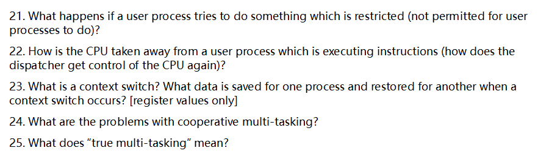

下面按题号逐一、深入回答（以常见教材/课堂表述为准）。

------

### 21) 若用户态进程尝试执行受限操作，会发生什么？

- **硬件检测到违规 → 触发陷入/异常（trap/exception）→ 切到内核态**：CPU 发现执行了**特权指令**（如关中断、直接访问 I/O 端口、改页表等）或**越权访问**（如访问内核地址/他人内存），会产生异常，硬件把控制权转交给内核的异常处理例程。
- **内核判定与处置**：
  1. **非法特权操作/非法指令**：通常向进程发送信号并终止（如 `SIGILL`），生成核心转储（core dump）以便调试。
  2. **内存保护违规**：如访问无权限/不存在页面，产生**页故障（page fault）**。若可被合法处理（如按需分配、从磁盘调页），内核修复后让进程继续；若是越权/无映射，则发 `SIGSEGV` 终止。
  3. **通过系统调用请求受控服务**：如果走**系统调用入口**（`syscall`/`int 0x80` 等），内核按权限检查后**返回错误码**（如 `-EACCES/-EPERM`），而不是杀进程。
- **关键点**：**权限分级（用户态/内核态）+ 异常/陷入机制 + 内核策略**共同保证安全。

------

### 22) 正在执行指令的用户进程，CPU 是如何被“拿走”的（调度器如何重新获得 CPU）？

- **抢占的核心：定时器中断（timer interrupt）**
   OS 设置硬件定时器（时间片用尽时触发）。当**时间片到期**，定时器发中断，CPU **异步转入内核态**执行中断服务程序：
  1. 内核**保存当前线程/进程的寄存器上下文**；
  2. 运行**调度器**（scheduler）选择下一个可运行实体；
  3. **上下文切换**到被选中的进程/线程，返回用户态继续执行。
- **其他让出 CPU 的路径**（同样把控制权带回内核）：
  - 进程执行**阻塞型系统调用**（如读写 I/O、等待互斥量/条件变量）→ 主动进入阻塞态；
  - **I/O 中断**唤醒内核，内核完成处理后可调度别的任务。
- 结论：**定时器中断=强制抢占**；**阻塞/中断=主动或事件驱动的让出**。无论哪种，**内核都能重新掌控 CPU**。

------

### 23) 什么是上下文切换（context switch）？切换时保存/恢复哪些寄存器值？

- **定义**：OS 在不同可运行实体（进程/线程）之间**切换 CPU 执行权**的过程。它使得多个任务能在同一或多颗 CPU 上并发（或并行）推进。
- **寄存器层面的保存/恢复（仅寄存器）**：
  - **程序计数器（PC/IP）**：下一条将要执行的指令地址。
  - **栈指针（SP）**：当前调用栈位置。
  - **通用寄存器**：如 `rax…r15`（x86-64）或 `x0…x30`（ARM64）等。
  - **标志/状态寄存器**：如 `EFLAGS/RFLAGS`（条件码、进位/零标志等）或 PSR。
  - **（如适用）段/线程本地寄存器**：如 `FS/GS base`（x86-64 的 TLS 基址）。
  - **（可延迟/按需）浮点/向量寄存器**：FPU/SSE/AVX/NEON 等通常采用**惰性保存**策略以减少开销。

> 注意：题目限定“**register values only**”，因此不列出页表、缓存、打开文件表等内核数据结构。

------

### 24) 协作式多任务（cooperative multi-tasking）的问题

- **依赖“自觉让出”**：进程必须主动 `yield`/调用阻塞操作；**若进程死循环或长时间不让出，其他任务全部被饿死**，系统响应极差。
- **无法强制公平**：OS 不能在用户代码任意点插入抢占，**时间片共享与优先级**无法可靠落实。
- **交互/实时性差**：GUI、输入事件可能长期得不到处理，**卡顿/假死**。
- **锁与资源占用风险**：拿着锁不让出会造成**锁长时间被占、队列堆积**，放大“优先级反转/饥饿”。
- **鲁棒性差**：**一个失控进程可拖垮全系统体验**；对错误/恶意程序缺乏隔离的时间控制手段。
- **调度粒度粗**：难以实现平滑的**QoS/延迟目标**，不适合现代多媒体/交互和服务端负载。

------

### 25) “true multi-tasking”（真正的多任务）是什么意思？

- **通常指“抢占式多任务（preemptive multitasking）”**：
  - OS 依靠**定时器中断**在任意安全点**强制抢占**正在运行的任务，进行**时间片轮转**与**优先级调度**；
  - 即使任务失控或计算很重，OS 也能保证**系统整体的响应性与公平性**。
- **并发与并行**：
  - **单核**：各任务的执行片段**交错**进行（并发）；
  - **多核**：多个任务可**真正同时**在不同核上运行（并行），进一步提升吞吐与响应。
- **配套特征**：
  - **内存保护与隔离**（每个进程独立地址空间）；
  - **优先级/实时调度类**（如 CFS、RR、EDF 等）；
  - **内核可控的调度点**（中断、系统调用、内核可抢占配置）。
- **与协作式的核心区别**：**是否需要任务“自愿让出”**。True multitasking 不需要，被 OS **随时可抢占**。

------

需要的话，我可以把以上要点整理成一页速记表（“机制—触发—内核动作—可能结果/信号/错误码”），便于考试背诵与课堂讨论。

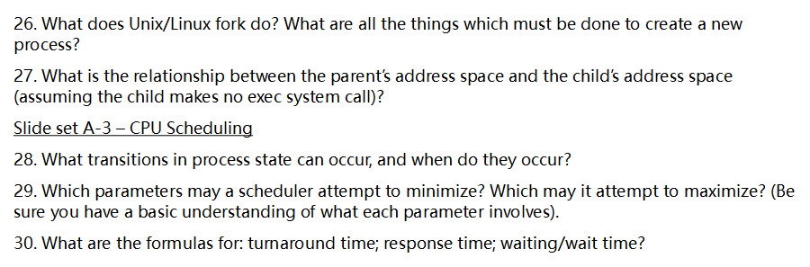

下面逐题详细回答（中文）：

# 26. `fork` 在 Unix/Linux 中做了什么？创建新进程必须完成哪些步骤？

**作用**：`fork()` 将当前进程**复制**出一个子进程。子进程几乎继承父进程的全部运行环境，但有自己独立的 PID、调度实体与（逻辑上）独立的地址空间。两端从 `fork()` 的同一行继续执行：**父进程得到子 PID**，**子进程得到 0**。

**内核为创建子进程通常要做的事（概要到细）**：

1. **检查与配额**：资源/配额（如 `RLIMIT_NPROC`）、权限、是否可再派生等。
2. **分配标识与核心对象**
   - 分配 **PID**、`task_struct`（任务描述符）与**内核栈**；挂接到父子关系树/进程组/会话。
3. **复制或共享父进程资源（多采用 COW/引用计数）**
   - **地址空间 `mm_struct` 与页表/VMA**：标记私有可写页为**写时复制（Copy-On-Write）**并临时共享物理页；只读段直接共享。
   - **打开文件表 `files_struct`**：复制**文件描述符表**（表本身独立），但各项指向同一**open file description**，因此**文件偏移量等是共享的**（除非后续 `dup3`/重新打开）。
   - **文件系统上下文 `fs_struct`**（工作目录、根目录）、**信号处理 `sighand`**、**凭据 `cred`**、**umask/rlimit/环境变量**等按语义复制或共享引用。
   - **计时器/资源统计/命名空间/cgroup/seccomp** 等状态拷贝或继承。
4. **构造子进程的“执行现场”**
   - 预置寄存器返回路径：调度到子进程时，从 `fork` 的返回点进入用户态，返回值为 0；设置 TLS/线程信息。
5. **就绪与调度**
   - 将子进程置为 **runnable（就绪）**，插入就绪队列，等待调度器分配 CPU。
6. **返回用户态**
   - 父进程立刻得到子 PID 继续跑；子进程被调度后从相同指令地址处开始，只是返回值不同。

> 变体：`vfork()` 在 exec 前与父共享地址空间并挂起父；`clone/clone3` 可选择性共享地址空间/文件表等，是 Linux 线程与容器的基础；`posix_spawn()` 在“创建+执行新映像”路径上更高效。

------

# 27. 不调用 `exec` 时，父子地址空间之间是什么关系？

- **逻辑上独立**：父子各自拥有**独立的虚拟地址空间与页表**，变量、栈、堆、全局区都有一份“自己的视图”。
- **物理上按需分离**（COW）：`fork` 初始时，父子**共享相同的物理页**且**只读**；任意一方对可写页发生写入时，内核触发**缺页异常→分配新页→拷贝旧内容→解除只读**，此后两者的该页相互不影响。
- **内存映射的差异**：
  - **私有映射（MAP_PRIVATE）**：与上同，写时复制。
  - **共享映射（MAP_SHARED）/显式共享内存（SysV SHM、`mmap` 共享段等）**：父子对同一区域的写入**彼此可见**。
- **文件描述符**：父子各有**独立的 FD 表**，但每个 FD 指向同一 **open file description**，因此**文件偏移与某些状态共享**——例如一方 `lseek` 会影响另一方通过同一描述的读写位置。
- **环境变量/工作目录/umask**：初始相同，后续修改互不影响（除非明确共享对象）。
- **输出交错**：若父子同时向同一终端/文件描述符写（且无同步），输出可能交错。

> 直观记忆：**父子内存“看起来各一份”，写入才“真正分家”**；**文件“看的是同一把打开的锁”，动了偏移彼此感受得到**。

------

# 28. 进程状态会发生哪些转换？何时发生？

典型五态模型：**新建（new）→就绪（ready）→运行（running）→阻塞/等待（blocked/waiting）→终止（terminated）**，以及**运行↔就绪**的抢占/放弃。

- **new → ready**：进程被创建并完成内核初始化，加入就绪队列（例如 `fork`/`posix_spawn` 之后）。
- **ready → running**（调度/派发 dispatch）：调度器选中该进程占用 CPU。
- **running → ready**（抢占 preemption）：
  - 时间片用尽；
  - 有更高优先级的就绪进程到达；
  - 调用 `sched_yield` 等主动让出。
- **running → waiting**（阻塞）：
  - 发起会阻塞的系统调用/等待事件（同步 I/O、`read` 等无数据、`wait`、`sleep`、锁等待、条件变量等待）。
- **waiting → ready**：
  - 等待的事件发生（I/O 完成、中断唤醒、锁可用、定时器到期、信号唤醒）。
- **running → terminated**：
  - 正常退出（`exit/_exit` 返回）；
  - 被致命信号终止；
  - 出错异常导致终止。

> 扩展：某些教材/系统还会区分**挂起就绪/挂起阻塞**（swapped out），表示被换出内存的就绪/阻塞态。

------

# 29. 调度器可能希望**最小化**或**最大化**哪些指标？（含基本含义）

**常见要最小化（越小越好）**

- **平均等待时间（Average Waiting Time）**：进程在**就绪队列**里等待 CPU 的总时间平均值；小 → 用户少“干等”。
- **平均周转时间（Average Turnaround Time）**：从到达到完成的总历时平均值；小 → 作业整体完成更快。
- **平均响应时间（Average Response Time）**：到达至**第一次获得 CPU** 的时间；小 → 交互/在线系统“更灵”。
- **响应时间抖动/方差（Variance/Jitter）**：小 → 更可预测。
- **上下文切换次数/开销**：小 → 减少纯管理成本（但与响应性/公平可能冲突）。
- **错过截止期比例/最大迟交量**（实时系统）：小 → 更可靠。

**常见要最大化（越大越好）**

- **吞吐量（Throughput）**：单位时间完成的作业数；大 → 系统处理能力强。
- **CPU 利用率（CPU Utilization）**：CPU 忙碌时间占比；大 → 资源不闲置。
- **公平性（Fairness）/份额满足度**：尽量让各任务按权重获得应得 CPU；大 → 减少饥饿。
- **可满足的实时约束比例**：满足更多截止期。

> 现实中是**多目标权衡**：如 RR/短时间片提升响应但增加切换开销；SJF 最小化平均等待/周转却可能饿死长作业；多级反馈队列折中响应与吞吐；CFS 追求按权重的公平份额等。

------

# 30. 周转时间、响应时间、等待时间的公式

设第 *i* 个进程的：

- **到达时间**：AiA_i
- **第一次获得 CPU 的时间**：SiS_i
- **完成时间**：CiC_i
- **总 CPU 运行时间**（服务时间/CPU burst 总和）：BiB_i

则：

- **周转时间（Turnaround）**：Ti=Ci−Ai\displaystyle T_i = C_i - A_i

- **响应时间（Response）**：Ri=Si−Ai\displaystyle R_i = S_i - A_i

- **等待时间（Waiting/Wait）**（在**就绪队列**中等待 CPU 的总时长）：

  Wi=Ti−Bi\displaystyle W_i = T_i - B_i

  > 注：以上是**CPU 调度常用定义**——等待时间不包含运行在 CPU 上的时间，也不包含**进程主动阻塞做 I/O 的时间**；因此可用“周转减去总 CPU 时间”得到。若你的题目定义将 I/O 也算入“服务时间”，需相应调整为 Wi=Ti−(服务时间)W_i=T_i-\text{(服务时间)}。

**平均值**（*n* 个进程）：

T‾=1n∑Ti,R‾=1n∑Ri,W‾=1n∑Wi\overline{T}=\frac{1}{n}\sum T_i,\quad \overline{R}=\frac{1}{n}\sum R_i,\quad \overline{W}=\frac{1}{n}\sum W_i

> 小提示：
>
> - **SJF**（短作业优先）在理论上可**最小化平均等待/周转**（需已知或估计 BiB_i）。
> - **RR**（时间片轮转）常用于交互场景，能显著降低平均**响应时间**。
> - **优先级调度**需配**老化（aging）**避免饥饿。


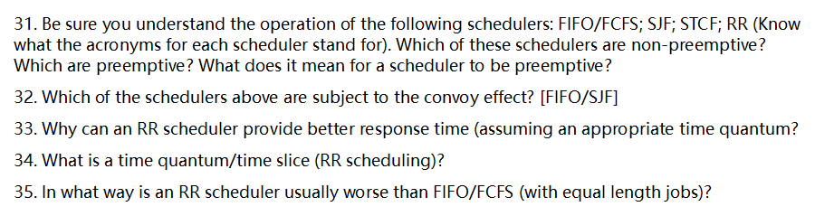

Below I answer 31–35 in detail. English first, then Chinese.

------

### 31) Schedulers, preemption, and what “preemptive” means

**Acronyms & behavior**

- **FIFO / FCFS** = *First-In, First-Out / First-Come, First-Served* — runs the earliest-arriving job to completion before starting the next.
- **SJF** = *Shortest Job First* — always chooses the job with the **shortest total CPU time** (job length). Non-preemptive.
- **STCF** (aka **SRTF**) = *Shortest Time to Completion First* / *Shortest Remaining Time First* — preemptive version of SJF; whenever a job with **shorter remaining** time appears, it **preempts** the running job.
- **RR** = *Round Robin* — preemptive, each job gets a fixed **time quantum**; on quantum expiry a timer interrupt forces a switch to the next ready job.

**Which are non-preemptive?**

- **Non-preemptive**: **FIFO/FCFS**, **SJF**.
- **Preemptive**: **STCF/SRTF**, **RR**.

**What does “preemptive” mean?**
 The OS (via hardware timer interrupts) can **forcibly take the CPU away** from a running job and give it to another one—e.g., when the time slice ends (RR) or when a shorter-remaining job arrives (STCF). Non-preemptive schedulers switch only when a job **blocks or finishes**.

**中文**

- **FIFO/FCFS（先来先服务）**：按到达先后顺序，一个作业跑完再跑下一个（非抢占）。
- **SJF（最短作业优先）**：挑选**总运行时间最短**的作业先跑（非抢占）。
- **STCF/SRTF（最短剩余时间优先）**：SJF 的**抢占式**版本；有更短剩余时间的作业到达就**抢占**。
- **RR（时间片轮转）**：**抢占式**，按固定**时间片**轮转。

**非抢占**：FIFO/FCFS、SJF。**抢占**：STCF/SRTF、RR。
 **“抢占”**：操作系统可通过**时钟中断**等手段**强行剥夺 CPU**，而不是等作业自愿让出或结束。

------

### 32) Which suffer the convoy effect? [FIFO/SJF]

- **Convoy effect（车队效应）**：一个**长作业**占着 CPU，后面一长串**短/IO 密集**作业都在排队，系统整体响应很差。
- **FIFO/FCFS**：**典型会受车队效应影响**——长作业在前面会“拖慢全队”。
- **SJF**：**通常不受**车队效应（它会优先短作业），但可能产生**饥饿**（长作业一直被短作业插队）。在极端“估计错误或并列长度退化成先来先服务”的情况下，才可能出现类似车队现象。

**中文小结**：车队效应主要发生在 **FIFO/FCFS**；**SJF**一般能避免车队效应，但带来**饥饿**风险。

------

### 33) Why can RR give better response time (with a good quantum)?

- **Bounded first response**：每个就绪任务在最坏情况下最多等待 **(N−1)×q**（N=就绪任务数，q=时间片），因此**首次响应时间有上界**，交互体验好。
- **Fair sharing**：所有任务都被**定期调度**，不会被长作业长时间挡住（避免 FCFS 的“长作业堵路”）。
- **Overlap with I/O**：IO 密集任务能尽快拿到 CPU 发起 I/O，系统可更早并行化 CPU 与 I/O 活动。

**中文**：RR 通过**时间片轮转**与**时钟抢占**保证每个进程在有限时间内得到 CPU，故**响应时间更稳定、更可控**，对交互/IO 密集型任务尤其友好。

------

### 34) What is a time quantum (time slice) in RR?

- **Definition**：在 **RR** 中，调度器为每个就绪进程分配一个固定的 **CPU 时间长度 q（时间片/时间量子）**。当时间片耗尽，**时钟中断**触发，内核保存上下文并切换到下一个进程。
- **Tuning**：
  - **q 太小** → **上下文切换开销**相对变大，吞吐量下降；
  - **q 太大** → 行为趋近 **FCFS**，交互响应变差；
  - 经验：让 **q 远大于切换开销**（使 `overhead ≈ switch_cost / (q + switch_cost)` 足够小），且对人机交互通常希望 **几十毫秒级**的响应。

**中文**：时间片是 RR 中单次分配给进程的**固定 CPU 时长**；到点由**时钟中断**强制切换。q 需要在**响应**与**开销**间折中：太小开销大，太大像 FCFS。

------

### 35) In what way is RR usually worse than FIFO/FCFS (equal-length jobs)?

- **Average turnaround time（平均周转时间）**：当**所有作业长度相等且同时到达**、忽略切换开销时，**FCFS** 的平均周转时间已很优（第 k 个完成于 k·L）。
   **RR** 将 CPU 在作业间来回切分，导致每个作业的**完成时间被“拉长”到更靠后**的轮次，因而**平均周转时间通常劣于 FCFS**；若考虑上下文切换开销，则 **RR 更差**。
- **Throughput（吞吐量）**：小时间片带来的频繁切换会降低有效 CPU 利用率，**吞吐量下降**。

**直观例子（忽略切换开销）**：3 个作业、各需 10ms、同时到达。

- **FCFS** 完成时间：10, 20, 30 → 平均 **20ms**。
- **RR（q=1ms）** 完成时间大致：28, 29, 30 → 平均 **≈29ms**（明显更差）。
   （时间片越小，完成时间越被“拉锯”，平均周转越差；q→∞ 时 RR 退化成 FCFS。）

**中文小结**：在**等长作业**场景下，RR 的**平均周转时间**与**吞吐量**常**不如 FCFS**，主要因为频繁分片（以及切换开销）把完成时间推迟。

------

如果你愿意，我可以给你一页“调度算法对照速记表”（特点、优缺点、适用场景、典型指标）方便复习。


下面把第36–40题分别详细说明（以主流操作系统与教材中“多级反馈队列 MLFQ”常见版本为准；不同内核实现细节略有差别，但原理一致）。

# 36. 进程的 I/O 系统调用与 CPU 调度如何交互？

- **阻塞与就绪队列切换**
  - 进程在用户态发起**阻塞型 I/O**（如 `read()` 读不到数据、磁盘 I/O、同步网络收发）→ 内核将其标记为 **阻塞/睡眠**，把它**移出可运行队列**；调度器立即挑选其他**就绪**的进程/线程运行。
  - I/O 完成时设备触发**中断**，内核的中断处理/下半部把该进程标记为**就绪**，并将其**插入相应优先级的就绪队列**（许多系统会给“刚从 I/O 醒来”的进程较高的调度优先级，以提升交互响应）。
- **时间片与上下文切换**
  - I/O 阻塞导致该进程**提前用不完时间片**就让出 CPU；这在统计上把该进程归类为**I/O 密集型**：CPU 突发短、I/O 等待多。
  - 调度器因此更倾向于让这类进程靠前运行，从而**缩短响应时间**（例如键盘输入、GUI、shell、服务的事件循环）。
- **非阻塞/异步 I/O**
  - 若使用非阻塞 I/O、异步 I/O 或 `epoll/select` 等事件驱动，线程可能在用户态循环等待事件或在回调里少量计算 → 依旧呈现“短 CPU 突发 + 频繁让出”的特征，调度效果类似：**更高交互优先级**、更少等待。
- **多核与负载均衡**
  - I/O 完成的唤醒可能发生在与原运行核不同的 CPU 上，内核会做**负载均衡**并兼顾**缓存亲和性**；交互型线程往往被快速安排到某个核上运行。

> 小结：I/O 系统调用把线程从“运行”带到“阻塞”，I/O 完成把它从“阻塞”带回“就绪”。MLFQ 等调度器利用这种模式把交互/I/O 密集型进程排在前面，CPU 密集型进程排在后面，从而兼顾响应性与吞吐量。

------

# 37. 课上讲的 MLFQ（多级反馈队列）基本工作方式

一个典型的 MLFQ 具有以下**规则与结构**：

1. **多级队列 + 不同优先级**
   - 队列编号从高到低：`Q0`（最高优先级）、`Q1`、…、`Qn`（最低）。
   - **优先级抢占**：只要高优先级队列非空，就**只**在该队列中调度。
2. **同一队列内用时间片轮转（RR）**
   - 每个队列有自己的**时间片长度**：高优先级队列时间片**短**，低优先级队列时间片**长**。
3. **新到达作业从顶层（高优先级）开始**
   - 先“信任”它可能是交互型，给更好响应。
4. **用完整个时间片 → 降级**
   - 若一个作业在所在队列**耗尽整个时间片**才被抢占，说明它倾向于 **CPU 密集**，被**移入下一层**（优先级降低）。
5. **在时间片内主动让出（如阻塞 I/O） → 保持或提升**
   - 若它**未用完时间片就阻塞/让出**，说明更像 **I/O/交互型**，常见策略是**留在当前层级**（有的教材/实现会适度上调，但更常见是“保持不降”）。
6. **全局“老化/提升”（Priority Boost）**
   - 为避免低层队列长期饥饿，系统**周期性地把所有作业提升到最高队列**，并**重置它们的历史统计**（比如每隔 S 毫秒/若干个时间片触发一次）。

> 直观理解：MLFQ 用“是否用满时间片”这个可观察信号近似判断作业是 CPU 密集还是 I/O 友好，并据此**动态改变优先级**。越像交互型，越留在上层队列；越像 CPU 密集，就逐步下沉到更长时间片的低层队列。

------

# 38. MLFQ 如何利用“历史（history）”？

“历史”指调度器为每个作业维护的**近期行为记录**，常见包括：

- **最近若干次时间片的使用情况**：是否经常**用满**时间片？是否**提前阻塞/让出**？
- **累计/衰减的 CPU 使用量**：用**指数衰减**或“窗口计数”衡量“近期是否吃 CPU 很猛”。
- **睡眠/唤醒模式**：是否频繁**I/O 睡眠**后很快醒来再次运行？

MLFQ 利用这份“历史”来：

1. **决定升/降级**：满片 → 降级；未满片 → 保持/可能升。
2. **近似 SJF/SRTF**：I/O 友好（短 CPU burst）的作业因“历史”被识别，长期停留在上层队列，获得更短等待时间。
3. **对抗“投机/刷优先级”**：如果某作业故意在每个片尾前一点点让出以逃避降级，调度器可通过“历史”统计**把它视作等价于‘用满片’**（见第40条的对策）。
4. **触发或校准全局提升（Boost）**：在周期性 Boost 时**清零/衰减历史**，让所有作业“重新开始”，避免历史惩罚无限期累积。

------

# 39. MLFQ 的目标

1. **良好的交互响应性**：让有用户交互/短 CPU 突发的任务**优先得到 CPU**，减少键入/点击/事件响应的延迟。
2. **兼顾吞吐与周转时间**：CPU 密集型任务在较低队列上以更长时间片运行，**减少切换开销**、提高吞吐。
3. **公平性（队列内 RR + 老化）**：同层作业**时间片轮转**，并通过**周期性提升**避免长期饥饿。
4. **自适应、无需先验信息**：不需要提前知道作业的 CPU burst 分布，**用近期历史自动分类**。
5. **实现简单、开销适中**：相对复杂的最优算法（如精确 SRTF）更易实现，运行时开销小。

------

# 40. MLFQ 的潜在问题与应对策略

**(1) 饥饿（Starvation）**

- **问题**：高优先级队列长期有任务，低优先级队列的 CPU 密集型作业可能**长时间得不到运行**。
- **对策**：
  - **周期性全局提升（Priority Boost）**：每隔固定时间把所有作业提升到顶层，清空/衰减历史。
  - **老化（Aging）**：随着等待时间增长，逐步提高作业优先级。
  - **最低服务保证**：为低层队列设置最小配额或后台保障片段。

**(2) 可被“投机/刷优先级”（Gaming）**

- **问题**：CPU 密集型进程可以在时间片快用完时**故意 `yield`/发起小 I/O**，让自己看起来像“交互型”，从而永居上层队列。
- **对策**：
  - **计费规则调整**：若在时间片后段让出，则**按“用满片”计费**；或对频繁“短睡眠+立刻唤醒”的模式增加“CPU 债务”。
  - **窗口化统计**：基于滑动窗口/指数衰减的 CPU 使用量来判定是否降级，而非单次片结果。
  - **限制快速升迁**：要求在高层**连续多次**表现为交互型才维持/提升；对“抖动”行为保持中立或降级。

**(3) 优先级反转（Priority Inversion）**

- **问题**：低优先级线程持有锁/资源，高优先级线程等待，期间中优先级线程把 CPU 占满，形成**反转**。
- **对策**：
  - **优先级继承/上限协议**（Priority Inheritance/Ceiling）：持锁者临时提升到等待者的最高优先级，释放后恢复。
  - **实时类/临界区最小化**：对关键路径使用实时调度类或缩短临界区。

**(4) 上下文切换抖动 & 片长设置不当**

- **问题**：时间片过短导致**切换开销高**；过长又会**变差响应**。
- **对策**：
  - 选择**大于上下文切换成本**、又能覆盖典型“交互 CPU burst”的片长；高层短、低层长的层级设计保留。
  - 动态调参：根据系统负载调节 Boost 周期、各层片长。

**(5) 多核亲和性与缓存破坏**

- **问题**：跨核迁移会破坏缓存/NUMA 亲和性；频繁 Boost/升降级可能让线程在核间**来回搬家**。
- **对策**：
  - **处理器亲和（affinity）\**与\**轻量负载均衡**：在保证公平的前提下优先把线程放回“最近跑过的核”。
  - 对 I/O 唤醒做**亲和唤醒**（prefer last CPU）。

**(6) I/O 唤醒风暴导致插队太多**

- **问题**：大量 I/O 线程被唤醒并插到高层队列**队头**，可能让后台任务长时间无法运行。
- **对策**：
  - **限流/配额**：给“从 I/O 唤醒”的高优先级运行设置速率或配额。
  - **单独的交互队列**或**令牌桶**策略，平滑其对整体的冲击。

**(7) 可预测性不足，难以满足实时期限**

- **问题**：MLFQ 属于“尽力而为”的通用调度，**无严格 deadline 保障**。
- **对策**：
  - 为需要期限保证的负载提供**实时调度类**（如 Rate Monotonic/EDF、POSIX SCHED_FIFO/RT），将其与 MLFQ 分级并存。
  - 给关键服务设置**优先级上限/保留带宽**。

**(8) 队列内公平偏差**

- **问题**：同层作业虽然 RR，但**工作集/缓存命中率差异**会造成实际进展不均。
- **对策**：
  - 引入**权重/配额**或采用**虚拟运行时间**（借鉴 CFS 思想）在同层内更细粒度地平衡。

------

## 一句话总结

- I/O 会把进程从运行切到阻塞，完成时再回到就绪；调度器因此识别出“短 CPU burst”的交互任务并优先执行。
- MLFQ 用“多级优先级 + 每层 RR + 用满片降级 + 未满片保持/升 + 周期性提升”的简单规则，借由“历史”近似实现“交互优先、CPU 密集靠后”。
- 其风险在于饥饿、可被投机、优先级反转、片长不当、多核与 I/O 风暴等；通过**老化/全局提升、反投机计费、优先级继承、亲和与限流**等工程手段可以逐一缓解。

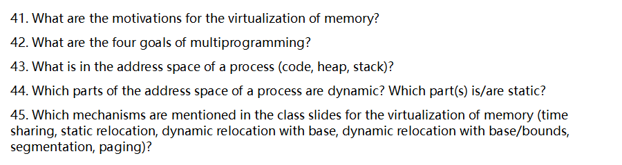

下面按题号逐一、深入回答（结合常见教材/课堂表述，便于考试与理解）。

# 41) 内存虚拟化的动机（为什么要“虚拟化内存”）

- **简化编程模型**：让每个进程都“看到”一个从 0 开始、连续的大地址空间，而不用关心物理内存碎片与设备细节。
- **隔离与保护**：不同进程互不干扰；用户态不能越权访问内核或他人内存（防止越界、提权、破坏）。
- **共享与重用**：可选择性地共享只读段（如共享库代码）、共享内存区域（高效 IPC），减少重复拷贝。
- **地址独立与可重定位**：程序不必写死物理地址；可在加载时或运行时把程序放到任意物理位置。
- **更大的“可用内存”**：利用按需调页/交换（demand paging, swapping），让进程地址空间**看起来**比物理内存更大。
- **性能与灵活性**：页缓存、写时复制（COW）、内存映射文件（mmap）、懒分配等，使 I/O 与内存管理更高效。
- **安全与稳定性**：页粒度权限（R/W/X）、不可执行栈/堆（NX）、地址空间随机化（ASLR）等强化系统安全。

# 42) 多道程序设计（Multiprogramming）的四个目标

> 多道程序设计 = 同时把多道程序装入内存并交替推进，以更好利用系统资源。

1. **提高硬件利用率**：重叠 I/O 与 CPU，减少 CPU 空转，提高**CPU/内存/磁盘/网络**等资源使用率。
2. **提升吞吐量**：同一时间更多作业在推进，单位时间完成的作业数更多。
3. **改进响应性/周转时间**：交互程序更“跟手”，批处理平均等待和周转时间下降（政策得当时）。
4. **保证隔离与公平**：不同作业互不破坏，调度策略下获得**公平**（或按优先级有序）地分享资源。

> 实践中还要在**公平**与**效率**、**响应**与**吞吐**之间做权衡（如实时/优先级策略）。

# 43) 进程的地址空间都包含什么？

典型布局（自低地址到高地址，具体随平台/装载器而异）：

- **代码/文本段（.text）**：可执行机器码，通常只读、可执行。
- **只读数据段（.rodata）**：常量字符串、只读表等。
- **已初始化数据段（.data）**：有初值的全局/静态变量。
- **未初始化数据段（.bss）**：无初值的全局/静态变量（装载时清零）。
- **堆（heap）**：动态分配区（`malloc/new`），向高地址**按需增长/收缩**。
- **共享库映射区**：动态链接库（.so/.dll）的代码与数据映射。
- **内存映射区域（mmap 区）**：文件映射、匿名映射、共享内存等。
- **线程局部存储/TLS**：每线程的私有状态（常由运行库/加载器布置）。
- **栈（stack）**：函数调用栈、局部变量，**每个线程一份**，通常向低地址增长，并带**保护页**防止栈溢出。

> 以上各区都在**虚拟地址空间**内，由页表把它们映射/保护到物理帧或磁盘页。

# 44) 哪些部分是动态的？哪些是静态的？

- **动态（大小/映射随运行变化）**
  - **堆**：`malloc/free`、`new/delete` 导致不断扩张/回收；可能触发页分配/回收。
  - **栈**：随函数调用/返回变化；线程创建/退出对应栈区的建立/释放。
  - **mmap 区**：按需 `mmap/munmap`；文件/共享内存可动态映射/解除映射。
  - **共享库映射**：延迟加载/卸载（某些平台下）会改变映射。
- **静态（大小基本在装载时确定，不随运行时扩/缩）**
  - **代码段（.text）**、**只读数据段（.rodata）**：大小固定、通常只读；位置可能被 ASLR 随机化，但**大小不变**。
  - **.data/.bss 段的大小**：装载时确定；其**内容**可变，但**段大小**一般不变。

> 备注：**ASLR/PIE** 会改变各段的**基址**（位置随机化），但不改变“静态段”的**大小属性**；动态区（堆/栈/mmap）则在**大小与映射**上都可变。

# 45) 课件提到的“内存虚拟化”机制与要点

> 题干列出：**time sharing、static relocation、dynamic relocation with base、dynamic relocation with base/bounds、segmentation、paging**。下列依次解释对比（含硬件支持、保护能力、碎片与性能）。

**(1) Time Sharing（时间共享）**

- **思想**：在“时间上复用”有限内存；早期系统通过**整进程换入/换出（swapping）**把内存给不同作业轮流使用。
- **硬件/实现**：可无需地址转换硬件；装载器/操作系统负责把整个进程映射到内存或磁盘。
- **优点**：实现简单，内存不够时可把不活跃作业换出。
- **局限**：缺乏细粒度隔离与并发驻留能力；换入/换出开销大；无法高效支持共享与按页调度。

**(2) Static Relocation（静态重定位）**

- **思想**：在**装载时**把目标文件中的“相对地址”**一次性**改写成“实际内存地址”（重写重定位项）。
- **硬件**：无需专门地址转换寄存器。
- **优点**：执行期地址计算无额外成本。
- **局限**：进程起跑后**不能移动**；难以实现内存保护与共享；外部碎片问题显著。

**(3) Dynamic Relocation with Base（基址动态重定位）**

- **思想**：CPU 在访存时用**逻辑地址 + 基址寄存器（Base）**得到物理地址。
- **硬件**：至少 1 个**Base**寄存器。
- **优点**：进程可被装在任意连续物理区；切换进程只需换 Base；支持进程迁移（在停顿点改变 Base）。
- **局限**：**无界限检查**时缺少保护；仍要求**连续物理块**，存在外部碎片。

**(4) Dynamic Relocation with Base/Bounds（基址+界限）**

- **思想**：在 (3) 基础上加入**Bounds（Limit）寄存器**：只有当`0 ≤ 逻辑地址 < Bounds`时才合法，再做 `物理=Base+逻辑`。
- **硬件**：Base + Bounds（或 Limit）。
- **优点**：提供**内存保护**（越界触发异常）；仍保持装载灵活性。
- **局限**：每进程仍需**连续物理区**，**外部碎片**仍在；单一区不利于精细共享（代码/数据/栈难以分别赋权）。

**(5) Segmentation（分段）**

- **思想**：把地址空间按**语义性段**划分（代码段/数据段/栈段/共享段……），**每段各有 Base/Limit/权限**，逻辑地址 = (段号, 段内偏移)。
- **硬件**：段表（多组 Base/Limit/保护位），访问时先查段表再做界限检查与加基址。
- **优点**：
  - 按语义保护/共享（代码只读共享、数据私有、共享内存段等）；
  - 每段独立大小，天然适配实际结构（代码、数据、栈）。
- **局限**：**外部碎片**（段大小可变，需连续物理空间）；段过多管理复杂；频繁分配/释放导致碎片化。

**(6) Paging（分页）**

- **思想**：把虚拟地址空间切成**固定大小**的页（page，典型 4KB/更大），物理内存切成同样大小的**页框**（frame），用**页表**建立虚拟页→物理帧的映射；地址 = (虚页号, 页内偏移)。
- **硬件**：页表，TLB（快表）缓存页表项，权限位（R/W/X/U/S），页故障处理。
- **优点**：
  - **消除外部碎片**（仅有页内“内部碎片”）；
  - 虚拟页可离散映射，易于**按需调页**、**COW**、**共享只读页**、**内存映射文件**；
  - 强保护与灵活的权限管理（页粒度）。
- **局限**：页表可能很大，需要多级页表/反向页表；TLB 命中对性能很关键；页故障开销高，需要良好局部性与策略。

> **综合**：Base/Bounds & Segmentation 更接近**语义保护**但易外部碎片；**Paging**解决外部碎片并带来强大虚存能力，是现代通用 OS 的主力；许多体系把**段用于高层语义/加载器**，实际内存访问主要靠**分页**（x86-64 实务上以分页为主）。现代系统还会把**分段与分页结合**（历史上 x86 保护模式），或在软件层面保留“段”的概念（如 ELF 段）而硬件走纯分页。

——
 如果需要，我可以把第 45 题整理成一张“机制 ×（是否保护 / 是否需连续物理 / 共享支持 / 碎片类型 / 硬件需求）”的速记表，便于考前快速回忆。

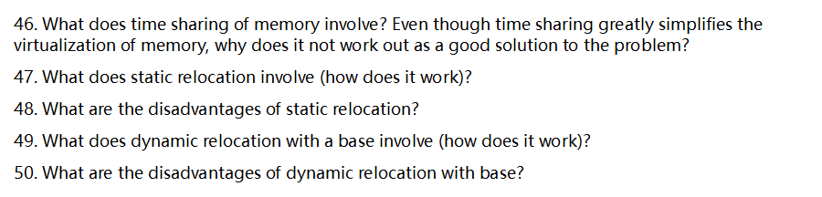

下面逐题详细回答（中文）：

# 46. 内存的“时间共享（time sharing of memory）”是什么？为什么它虽然简化了虚拟化，却不是好方案？

**含义**：把**整个物理内存在时间上“独占地轮流给各个进程”**。运行某进程时，让它独占（几乎）全部内存；当切换到另一个进程时，**把当前进程的内存整块换出到磁盘（swap out）**，再把下一个进程的内存整块从磁盘读回（swap in），常常还装载到**相同的物理地址**。这样每个进程都“以为”自己从地址 0 开始拥有整片内存——虚拟化逻辑非常简单，不需要地址翻译硬件。

**为何并不好**：

- **切换代价巨大**：一次上下文切换要搬运整个进程映像（内存大小 MM），耗时约 M/磁盘带宽M/\text{磁盘带宽}。例如 1 GB / 200 MB/s ≈ 5 s，交互性完全不可接受。
- **CPU 利用率低**：大量时间被 I/O（换入/换出）占用，CPU 空转等待，吞吐量与响应性都差。
- **无法并驻（低并发）**：同一时刻只能“放得下”一个进程在内存里（外加内核），难以支持后台 I/O 重叠与多任务并行。
- **对设备/DMA 不友好**：设备驱动/缓冲区需要常驻内存，整块换出会复杂化 I/O 一致性与驱动设计。
- **易抖动/颠簸（thrashing）**：在多进程活跃的场景，频繁整块换入换出使系统陷入“只搬不算”的恶性循环。
- **扩展性差**：进程数、内存规模一大，时延爆炸。

结论：**时间共享的内存**理念简单，但**代价与体验不可接受**，现代系统转向“空间共享”（分页/分段）与按需调页的细粒度虚拟化。

------

# 47. 静态重定位（static relocation）做了什么？如何工作？

**概念**：在**装载（或链接）时**，把程序中所有需要使用**绝对地址**的地方，统一加上**装载基址**的偏移，将代码/数据里的地址数值**直接改写**，使之适配被装入的那块物理/虚拟地址区。

**工作流程（典型）**：

1. **编译/链接阶段产生重定位信息**：目标文件/可执行文件里有**重定位表**，标识哪些指令/数据字段包含地址需要调整。
2. **装载器选择装载地址 LL**（或链接器在最终静态链接时选择）：决定把程序放在内存的哪一块连续区域。
3. **逐条“打补丁”**：对每个重定位项，把原值改为**原值 + LL**（或相应的节区基址）；涉及跳转目标、全局变量地址、函数指针等。
4. **完成后开始运行**：程序看到的地址已经是“绝对可用”的了。

> 说明：PC 相对寻址的指令常无需改写；共享库/动态链接也会在装载时做类似的重定位（或用 PLT/GOT 延迟绑定）。

------

# 48. 静态重定位的缺点

- **不能移动**：一旦打好补丁并开始运行，**进程不能再搬家**（除非停下再重定位），因此难以做**内存紧缩/压实（compaction）**来缓解外部碎片。
- **需要大块连续内存**：装载时必须找到**足够大的连续区**，否则失败；容易产生**外部碎片**。
- **保护能力弱**：仅靠“改数值”无法在**运行时**阻止进程越界访问；若无基址/界限或页式保护硬件配合，**内存隔离不可靠**。
- **共享困难**：地址被改成了进程私有的绝对值，**同一代码很难被多个进程只读共享**（除非使用专门的 PIC/PIE）。
- **启动时开销**：装载/链接阶段需要扫描并修改大量位置，**启动时间**变长；不同装载地址就得重新打补丁。
- **弹性/可扩展性差**：堆/栈增长、装入额外模块都受限于“必须连续”的假设。

------

# 49. 仅带“基址（base）”的动态重定位是什么？如何工作？

**概念**：处理器提供一个（或几个）**基址寄存器**（通常配合**界限/长度寄存器**）。**每次访存时由硬件把进程给出的逻辑地址 aa 自动转换为物理地址 a′=base+aa' = \text{base} + a**；同时检查 0≤a<limit0 \le a < \text{limit} 来做**越界保护**。进程内部可以从 0 开始编址，不必知道自己被放到了物理内存哪里。

**工作要点**：

- **上下文切换**：内核在切换进程时加载该进程的 **base/limit**（特权寄存器），用户态不能更改。
- **取/数一体**：无论**取指**还是**数据读写**都经过同样的加法与边界检查，违反则**陷入内核**（段错/越界）。
- **搬迁容易**：需要挪动进程时，只要把整块内存搬到新位置并**改 base**，**不需要改代码/指针的数值**。
- **开销很低**：硬件加法器在访存流水线内完成，几乎无感。

相较静态重定位，它提供了**运行时保护与重定位**，机制更干净。

------

# 50. 仅用“基址”动态重定位的缺点

- **仍需连续大块**：一个进程的地址空间必须映射到**一段连续的物理区**，容易出现**外部碎片**；扩展堆/栈需要原地连续空闲，失败率高。
- **粒度过粗，难以共享**：只有“一把尺（一个 base/limit）”，很难把**某个只读库**共享给多个进程（每个进程的 base 不同）；也**难以映射一小段共享内存**到不同进程的不同虚拟位置。
- **功能有限**：不能做**稀疏地址空间**、**按需装入/换出一小块**、**写时复制**、**每段/每页不同权限（r/w/x）**等现代需求。
- **内存压实成本高**：虽然能改 base，但要**拷贝整块**进程内存才能搬家，代价不小；频繁压实会恶化性能。
- **伸缩性差**：随着进程变大、进程数变多，寻找/维持大块连续物理区越来越困难。

> 这也是为何现代 OS 采用**分页（paging）\**或\**分段+分页**：以**页/段**为单位进行动态重定位与保护，支持**并驻、共享、按需调页与精细权限**，同时显著缓解外部碎片与换入换出的开销。

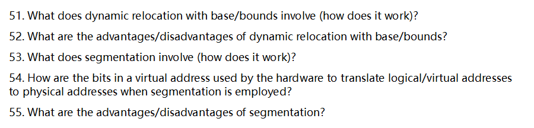

下面按题号 51–55 逐一、详细说明（操作系统经典内存管理：动态重定位 base/bounds 与分段）。

------

### 51) 动态重定位（base/bounds）做了什么？如何工作？

**思想**：进程看到的是从 0 开始的“逻辑地址”。硬件（MMU）给**当前进程**配一对寄存器：

- **Base（重定位基址）**：该进程在物理内存中被放置的起始物理地址；
- **Bounds/Limit（界限/长度）**：该进程可用的最大逻辑地址范围（常用“大小”表示）。

**访问流程（每次取数/存数都发生）**：

1. CPU 发出逻辑地址 `VA`；
2. **越界检查**：若 `0 ≤ VA < Bounds` 为真，则继续；否则触发异常（段错误/保护错）；
3. **重定位**：物理地址 `PA = Base + VA`；去内存取/写。

**上下文切换**时，OS 只需把**当前进程的 base/bounds**装入 MMU 寄存器；**用户态**进程不能修改这两个寄存器（需内核态）。

------

### 52) 动态重定位的优缺点？

**优点**

- **极快**：每次访存仅“一次比较 + 一次相加”。
- **实现简单、开销小**：无页表；上下文切换只改两寄存器。
- **基础保护**：防越界、禁止跨越本进程区域；用户态无权改寄存器。
- **装载灵活**：程序可被放到任意连续的物理块（不要求固定起始地址）。

**缺点**

- **必须“整段连续”**：整个进程占一块连续物理空间，易产生**外部碎片**；需要**内存紧缩/挪动**来合并空洞。
- **粒度粗**：只有“整个进程”这一对 base/bounds，**无法细粒度共享/保护**（如把代码段只读共享给多个进程）。
- **不支持稀疏地址空间**：逻辑上未用的大洞也要占物理空间（除非复杂的软件技巧）。
- **增长不灵活**：栈、堆若要独立增长，单对 base/bounds 很难兼顾（常需停机搬移或预留大空隙）。
- **换入换出成本高**：需要搬整个进程映像；难做按需装入（demand loading）。

------

### 53) 分段（Segmentation）做了什么？如何工作？

**思想**：把一个进程的地址空间按**逻辑含义**切成若干**变长“段”**（如：代码段、数据段、堆段、栈段、每个模块/数组都可成段）。每段各自有：

- **段基址（base）**、**段界限（limit）**、**权限位（R/W/X、U/S 等）**、**存在/有效位（present/valid）**等。
- OS 为每进程维护一张**段表（segment table）**，记录各段描述符（base、limit、权限…）。

**地址格式（逻辑地址）**：`<段号 s | 段内偏移 d>`
 **翻译流程**：

1. 用段号 `s` 索引**当前进程段表**，取到该段的 `base_s`、`limit_s`、权限；
2. 检查 `d < limit_s` 且权限允许（如不可写则拒绝）；
3. 物理地址 `PA = base_s + d`。

> 这样每个段可**独立放在任意物理位置且仍连续**，比“整进程一块”灵活得多，也能**按段共享**（典型：只读代码段共享）。

------

### 54) 使用分段时，虚拟地址的各比特如何参与地址翻译？

设虚拟地址总长为 `N` 位，其中高 `S` 位表示**段号**，低 `N−S` 位表示**段内偏移**：

- **段号 bits（高位）**：作为索引进入**段表**（每进程一张，表基址通常在寄存器里）；
- **偏移 bits（低位）**：与该段的 **limit** 比较，`offset < limit` 才合法；
- **形成物理地址**：`PA = base(segment) + offset`。
   在这一步硬件还会检查**有效位/存在位**与**权限位**（如 X 执行权限、W 写权限），失败则触发异常。

> 注：`S` 的具体位数取决于“最多支持多少段”；偏移位数决定“单段最大大小”。（若支持**向下增长段**，实现上会用不同的界限检查，但基本仍是“基址+范围校验+相加”。）

------

### 55) 分段的优缺点？

**优点**

- **贴合程序结构**：代码、数据、堆、栈、库/模块各自成段，**天然保护/共享粒度合适**（例如只读代码段可被多个进程共享）。
- **稀疏地址空间**：未创建/未装入的段**不占物理内存**，更省内存。
- **更细的保护与隔离**：按段设 R/W/X、用户/内核、有效位；能做只读共享、不可执行栈等策略。
- **灵活装载**：每个段独立放置/换入换出；便于**按需装入（demand loading）**某些段。

**缺点**

- **外部碎片仍存在**：段是**变长且需物理连续**，多进程多段混装会产生空洞，需**内存压实（compaction）**，代价高。
- **管理复杂度更高**：有**段表**、权限检查、可能的段增长策略（栈向下、堆向上），上下文切换也要切段表基址/刷新 TLB。
- **段粒度仍可能偏粗**：大段内部缺乏更细的换入换出与保护；
- **与分页相比缺乏固定粒度**：难以利用页式带来的**内部碎片小、物理内存易回收/复用**等优势。
- **现代通行做法**：为兼顾“结构化与碎片控制”，常采用**“分段+分页”**（段提供逻辑隔离/权限，\**段内再分页\**消除外部碎片）；许多 64 位体系甚至**弱化/关闭分段**，只保留分页与权限位。

------

**对比小表（便于记忆）**

- **base/bounds 动态重定位**：**整进程一块**（连续），快而简单；缺点是外部碎片、粒度粗、难共享/增长。
- **分段**：**按逻辑模块多块**（各自连续），可共享/保护/稀疏；仍有外部碎片与管理复杂度；常与**分页**结合以克服碎片问题。

需要的话，我可以再给你画一张小示意（地址位切分、翻译路径、异常触发点）或出 3–5 道小题练练。


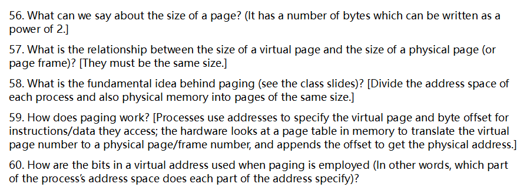

下面把第56–60题分别详细解释（以主流体系结构与教材常见设定为准）。

# 56. 页（page）的大小有什么特征？

- **大小一定是 2 的幂**，例如 4 KB (=2¹²)、8 KB、16 KB、64 KB、2 MB、1 GB 等。
- **为什么用 2 的幂**：
  1. 便于用“位切分”把地址拆成“页号 + 页内偏移”；2) 对齐简单（页起始地址低 n 位为 0）；3) 硬件用掩码/移位即可取偏移与页号。
- **大小选择的权衡**：
  - 小页 → **内部碎片少**、但页表更大、TLB 压力更高。
  - 大页（“巨页/超页”）→ **TLB 命中率更好**、页表更小、但内部碎片可能更大。
  - 现代系统常**并存多种页大小**（如 4 KB + 2 MB + 1 GB），按负载特征挑选。

------

# 57. 虚拟页大小与物理页框（page frame）大小是什么关系？

- **必须相同**：每一次映射的虚拟页与物理页框大小**一一对应、等大**，这样**页内偏移（offset）才能原样保留**，硬件只需把“页号”翻译后与偏移拼接即可得到物理地址。
- **多种页大小并存时**：系统可以同时支持 4 KB、2 MB、1 GB 等不同规格，但**一条映射选定的页大小两端必须一致**（虚拟页=物理页框）。TLB/PTE 会标注该映射的页大小。

------

# 58. 分页（paging）的基本思想

- **把每个进程的虚拟地址空间**与**物理内存**都划分为**等大小的页/页框**；
- 进程看到的是**连续的虚拟空间**，而内核通过**页表**把“虚拟页号 → 物理页框号”进行**离散映射**；
- 好处：
  - **隔离与保护**（每进程独立页表、可设读/写/执行权限）；
  - **灵活分配**（物理上可非连续，减少外部碎片）；
  - **按需装入/换出**（缺页时再分配物理页，从磁盘拉入；不常用页可换出）；
  - **共享与写时复制**（多个进程共享同一只读页；写时复制实现高效 fork）。

------

# 59. 分页如何工作（硬件/软件协作的典型过程）

1. **程序发出虚拟地址 VA**（例如取数/存数/取指）。
2. **地址切分**：硬件将 VA 切成 **虚拟页号（VPN） + 页内偏移（offset）**。
3. **TLB 查找**：先在 **TLB**（页表项缓存）中用 VPN 查映射；
   - **命中**：检查权限（R/W/X、用户/内核等），通过则取到**物理页框号（PFN）**，将 PFN 与 offset 拼接成 **物理地址 PA**，访问内存。
   - **未命中**：触发**硬件或软件的页表遍历**（多级页表逐级索引），得到 PTE 后填入 TLB，再重试。
4. **若页表项无效（不在内存）**：产生**缺页异常**；
   - 内核分配/回收一个页框、如需从磁盘读入内容（或零页填充），更新该虚拟页的 PTE（有效位、权限位等），返回用户态；硬件/内核重试刚才的访问。
5. **上下文切换**：切换进程时，内核切换**页表基址寄存器**（如 x86 的 CR3 / RISC-V 的 satp），并处理 TLB（失效或打标签），确保**地址空间彼此隔离**。
6. **PTE 常见标志**：有效位、存在位、脏位/访问位、读/写/执行权限、用户/内核域、页大小标志等（不同架构命名略异）。

------

# 60. 使用分页时，虚拟地址各比特如何使用？

**通用规则**：

- 虚拟地址 VA = **[高位：虚拟页号 VPN][低位：页内偏移 offset]**。
- **offset 位数 = log₂(页大小)**；翻译时 offset **原样保留**，只翻译 VPN → **物理页框号 PFN**。
- 若采用**多级页表**，VPN 进一步被拆成若干**层级索引**：
  - VA = **[Lk 索引][L(k-1) 索引]…[L1 索引][offset]**；
  - 每级索引的位数 = log₂(该级表项数)。

**三个经典示例（帮助直观理解位切分）：**

1. **32 位、4 KB 页（两级页表，常见于 x86 32-bit）**

- 页大小 4 KB ⇒ offset = **12 位**。
- 典型切分：**10 位**页目录索引（PD），**10 位**页表索引（PT），**12 位 offset**。
- 形如：`[PD 10][PT 10][offset 12]`。

1. **x86-64，48 位有效 VA、4 KB 页（四级页表）**

- offset = **12 位**；每级 512 项 ⇒ 每级索引 **9 位**。
- 形如：`[PML4 9][PDPT 9][PD 9][PT 9][offset 12]`（高于 47 位为符号扩展形成“规范地址”）。

1. **RISC-V SV39，39 位 VA、4 KB 页（三级页表）**

- offset = **12 位**；每级 512 项 ⇒ 每级索引 **9 位**。
- 形如：`[VPN2 9][VPN1 9][VPN0 9][offset 12]`。

> 要点回顾：**低位 offset 指明页内字节；中/高位索引决定在多级页表中的路径；最终得到 PFN，与 offset 拼接成物理地址**。这就是分页地址翻译的位级视角。

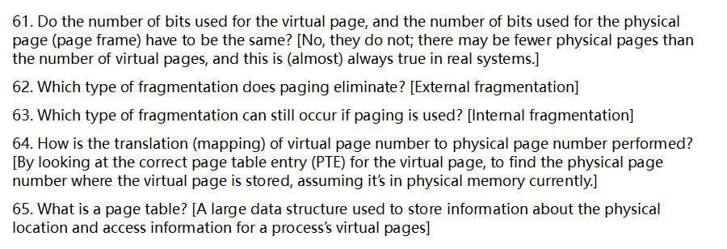

下面按题号逐一、详细解释（结合常见教材用语与现代体系结构实践）。

------

## 61) 虚页号使用的位数与物理页号（页框号）使用的位数必须相同吗？

**不需要相同。**（题干提示已给出答案）

- **原理**：
  - 虚拟地址被分为：**虚页号（VPN）+ 页内偏移（offset）**。
  - 物理地址被分为：**物理页号（PPN）+ 页内偏移**。
  - **页内偏移位数由页大小决定**，因此**虚拟与物理的 offset 位数相同**；
  - 但 **VPN 位数取决于虚拟地址空间大小**，**PPN 位数取决于物理内存大小**，二者通常不同。
- **现实含义**：虚拟页数几乎总是**多于**物理页数（虚拟空间更大、可换出到磁盘），因此 VPN 位数一般**多于** PPN 位数。
- **小例子**：
  - 48 位虚拟地址、4KB 页 ⇒ offset=12 位，VPN=36 位；
  - 40 位物理地址、4KB 页 ⇒ offset=12 位，PPN=28 位；
  - 可见 **VPN(36) ≠ PPN(28)**，但 offset(12) 相同。

------

## 62) 分页消除了哪种碎片？

**消除了外部碎片（External Fragmentation）。**

- **原因**：物理内存被切成**固定大小**的页框（frame），进程的各个虚拟页可以映射到**任意离散**的页框，不需要连续的长物理区间，自然就没有“拼不出一整块连续大空间”的外部碎片问题。

------

## 63) 使用分页仍然会发生哪种碎片？

**仍可能发生内部碎片（Internal Fragmentation）。**

- **原因**：分配以“页”为粒度（如 4KB）。若某段内存实际只用了 3.2KB，也必须占据**整页**，余下约 0.8KB 变成页内的**内部浪费**。
- **定量直觉**：对随机长度的分配，单次浪费**期望值约为半页**；对很大的区域，浪费占比下降，但对大量小分配影响更显著。

------

## 64) 虚页号到物理页号的地址转换如何完成？

**通过查找正确的页表项（PTE）完成映射**（在页当前驻留内存的前提下）。

- **基本流程**：
  1. 处理器先在 **TLB（快表）** 中按 VPN 查找；
  2. **TLB 命中**：直接得到 PPN，与 offset 组合形成物理地址；
  3. **TLB 未命中**：进行**页表遍历（page table walk）**：
     - 硬件遍历（如 x86-64/ARM）或软件陷入内核遍历（某些架构）；
     - 找到该虚页的 **PTE**，若 **Present/Valid=1**，取出 **PPN**、检查权限位（R/W/X、U/S 等），再回填 TLB；
     - 若 **Present=0**：触发**缺页异常（page fault）**，由内核把页面从磁盘/文件载入或分配物理帧，更新 PTE 后重试。
- **要点**：PTE 不仅给出 **“虚页→物理帧（PPN）”** 的映射，还包含**权限、是否在内存、脏位/访问位**等控制信息。

------

## 65) 什么是页表（Page Table）？

**页表是每个进程（或地址空间）用于记录“虚拟页→物理页框”映射及访问控制信息的**大型数据结构**。**

- **内容（典型 PTE 字段）**：
  - **PPN（物理页号）**：指向物理帧；
  - **有效/在内存位（Present/Valid）**：是否驻留物理内存；
  - **访问权限**：读/写/执行（R/W/X）、用户/内核（U/S）等；
  - **访问/修改位（Accessed/Dirty）**：用于置换算法与写回策略；
  - **缓存相关位/全局位/复制写时（COW）标记/软件自定义位**（依体系结构与 OS 而异）。
- **组织形式**：
  - **多级页表**（层级目录）是主流：按需分配中间层，**稀疏**地址空间只为实际用到的范围建表，显著节省内存；
  - **反向/哈希页表**等是替代方案；
  - **大页（Huge Pages，如 2MB/1GB）**可减少 TLB 压力、降低页表尺寸，但灵活性略降。
- **规模与开销**：
  - 单级平面页表在大 VA 空间下会巨大（例如 VPN 位数很大 × 每项若 8B，会是天文数字），因此实际采用**多级**或其他紧凑结构；
  - 页表本身也占物理内存，并可能被 **TLB** 与 **页表缓存**（如页遍历缓存）加速。
- **归属与隔离**：
  - **通常每个进程有自己的页表**（或页表根不同），切换进程就是切换**页表根寄存器**（如 x86 的 CR3、RISC-V 的 satp），确保地址空间隔离。

------

如果你想，我可以把以上要点整理成一页“速记卡”：**[位数关系/碎片类型/转换路径/页表结构与典型 PTE 位]**，便于考前快速复盘。

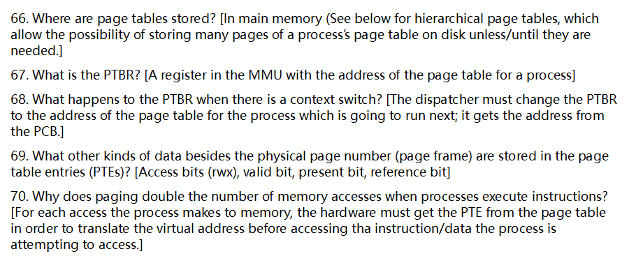

下面逐题详细回答（中文）：

# 66. 页表存放在哪里？

- **通常放在主存（RAM）里。** 每个进程有自己的页表层级（如 4/5 级页表），硬件的页表遍历器（page walker）在**TLB 未命中**时，需要到**主存**取对应的页表项（PTE）才能完成地址转换。
- **TLB 是页表项的缓存，不是页表本体。** 它驻留在 CPU 内部，只缓存少量热的映射，减少访存次数。
- **分级（层次）页表的意义**：只为“实际用到的地址范围”分配页表页，未覆盖的巨大空洞**无需在内存里存放任何页表页**。某些系统/教材还讨论“将页表页按需换入”的可能：当缺少某一级页表页时，内核可像处理缺页一样把该页表页从磁盘调入（实践中一般会避免频繁对页表页做换入换出，但概念上可行）。
- **内核可见的物理页**：操作系统用物理地址管理页表页，必要时可将“未被使用”的页表页回收；但**正在参与地址翻译的页表结构必须在内存里**，否则硬件无法完成翻译。

------

# 67. 什么是 PTBR？

- **PTBR（Page Table Base Register）**：MMU 内的一个（或多个）特权寄存器，指向**当前地址空间根页表**的物理地址（或物理页框）。
  - 典型对应：x86 的 **CR3**；ARM 的 **TTBR0/TTBR1**（用户/内核或低/高地址空间）。
- **作用**：TLB 失效时，硬件 page walker 从 PTBR 指示的根开始，逐级读取页目录/页表，完成**虚拟地址 → 物理地址**的翻译。
- **常与地址空间标识配合**：如 x86 的 **PCID**、ARM 的 **ASID**，用于给 TLB 项打标签，减少切换时的 TLB 冲刷。

------

# 68. 进程上下文切换时 PTBR 会发生什么？

- **调度器/分派器在切换到新进程时必须加载新的 PTBR**（例如写 CR3 / TTBRx），其值来自将要运行进程的 **PCB（进程控制块）**。
- **TLB 处理**：
  - 无 ASID/PCID 时：通常需要**刷新（flush）TLB**，避免旧地址空间的条目污染新进程。
  - 有 ASID/PCID 时：可**保留**旧条目，简单地切换 ASID/PCID，减少开销（硬件在匹配时会同时比对地址与标识）。
- **内核映射共享**：很多系统把“内核高半区”映射做成跨进程一致，以减少切换带来的开销（减少或避免与内核相关的 TLB 失效）。

------

# 69. 除了物理页号（页框号）之外，PTE 里还存了什么信息？

常见字段（不同架构名称略有差异）：

- **有效/存在位（Valid/Present）**：该映射是否有效、页是否在内存中（缺页时为 0）。
- **访问权限（r/w/x）**：读/写/执行权限；另有**用户/内核特权级（U/S）**限制用户态能否访问。
- **访问位/引用位（Accessed/Referenced, A/R bit）**：硬件在访问时置位，供算法近似 LRU、时钟算法等使用。
- **脏位（Dirty, D bit/Modified）**：页被写过则置位，回收/换出时决定是否需要写回磁盘。
- **缓存/内存类型**：如缓存禁止（CD）、写通/回写（WT/WB）、PAT/内存类型（对设备/映射很重要）。
- **执行禁用（NX/XD）**：不可执行，支撑 **W^X** 策略与 DEP。
- **全局位（Global）**：标记该映射在地址空间切换时不必从 TLB 逐出（常用于内核常驻页）。
- **页大小/大页标志**：如 2 MiB/1 GiB 大页（x86：PS 位）。
- **软件自用位**：OS 留作标记（如 **COW（写时复制）**、**软脏 soft-dirty**、反向映射辅助等）。
- **隐含或扩展信息**：某些架构/实现还会含 ASID/域信息、保护键（pkeys）等。

------

# 70. 为什么分页会让进程执行一次访存“看起来要多一次内存访问”？

- **直观原因**：对每一次用户态的内存访问，硬件必须**先取得对应的 PTE**来完成地址翻译，然后才能访问真实的指令/数据页。

  - 在最简单的“单级页表 + 无缓存”的抽象里：**1 次取 PTE + 1 次取数据 = 2 次内存访问**，仿佛“翻倍”。

- **分级页表会更“贵”**：若没有 TLB 命中，4 级页表可能需要 **4 次**（逐级读取 PDE/PTE）+ **1 次数据**，合计 **5 次**主存访问（指令取也同理）。

  > - ### 什么是多级页表？
  >
  >   在现代操作系统中，为了管理虚拟内存，系统使用**页表（Page Table）**将进程的**虚拟地址**映射到**物理地址**。简单来说，页表就是一个映射表，告诉CPU某个虚拟页号对应哪个物理页框。
  >
  >   然而，如果每个进程的虚拟地址空间都很大（比如 48 位或 64 位的虚拟地址），直接为每一个虚拟页号维护一个对应的物理页框号，会需要非常庞大的页表——例如，一个 48 位的虚拟地址空间，如果每页大小为 4KB，那么就有 248/212=236个页，也就是超过 **680 亿个页表项**，每个页表项假设占 8 字节，就需要超过 **5TB 的内存**来存储页表！这显然是不现实的。
  >
  >   因此，操作系统引入了**多级页表（Multi-level Page Table）**的机制，将一个大的、线性的页表分解成多个小的、层级化的页表，**只分配实际使用的部分页表，从而节省内存**。
  >
  >   ------
  >
  >   ## 以常见的 x86_64 架构为例：4 级页表
  >
  >   在 x86_64 架构中（比如 48 位或 57 位虚拟地址），典型的虚拟地址被分成多个部分，用来索引不同层级的页表。以 **4 级页表**为例（比如在 48 位虚拟地址下）：
  >
  >   一个 48 位的虚拟地址可能被划分为如下结构（具体划分根据页大小和架构而定，这里以常见的情况为例）：
  >
  >   ```
  >   | 9 bits | 9 bits | 9 bits | 9 bits | 12 bits |
  >   | PML4   | PDP    | PD     | PT     | Offset  |
  >   ```
  >
  >   - 总共 48 位虚拟地址
  >   - 页大小通常是 4KB，所以低 12 位是页内偏移（Offset）
  >   - 剩下的高 36 位（48 - 12 = 36）被分成 4 个部分，每部分 9 位
  >     - 第一级：PML4 (Page Map Level 4)
  >     - 第二级：PDP (Page Directory Pointer)
  >     - 第三级：PD (Page Directory)
  >     - 第四级：PT (Page Table)
  >     - 每个 9 位可以索引 29=512个页表项
  >
  >   这意味着：
  >
  >   - 要找到一个虚拟地址对应的物理页框，需要经过 4 层页表查找：
  >     1. 用虚拟地址的 **PML4 部分** 找到 **PML4 表项**，它指向一个 **PDP 表**
  >     2. 用 **PDP 部分** 找到 **PDP 表项**，它指向一个 **PD 表**
  >     3. 用 **PD 部分** 找到 **PD 表项**，它指向一个 **PT 表**
  >     4. 用 **PT 部分** 找到 **PT 表项**，它包含最终的 **物理页框号（PFN）**
  >     5. 最后加上 **页内偏移** 得到真正的物理地址
  >
  >   ------
  >
  >   ## 为什么没有命中 TLB 时可能需要 4 次访存？
  >
  >   **TLB（Translation Lookaside Buffer）** 是 CPU 中的一个硬件缓存，用于缓存**最近使用过的虚拟地址到物理地址的映射**，以加速地址翻译过程。
  >
  >   当 CPU 做地址翻译时，**首先会查 TLB**，如果 TLB 中有对应的映射（即命中，TLB hit），则可以直接得到物理页框号，只需 **1 次访存（或更少）**就能完成地址翻译。
  >
  >   但如果没有命中（TLB miss），CPU 就必须通过**多级页表**在内存中一步步查找最终的物理页框号，这个过程通常如下：
  >
  >   1. **访问 PML4 表**：根据虚拟地址中的 PML4 索引，从内存中读取 PML4 表，找到对应的 PDP 表的指针。
  >   2. **访问 PDP 表**：根据 PDP 索引，从内存中读取 PDP 表，找到对应的 PD 表的指针。
  >   3. **访问 PD 表**：根据 PD 索引，从内存中读取 PD 表，找到对应的 PT 表的指针。
  >   4. **访问 PT 表**：根据 PT 索引，从内存中读取 PT 表，找到对应的物理页框号（PFN）。
  >
  >   👉 **每一级页表项都存储在内存中，访问它们意味着要访问一次内存（访存）。**
  >
  >   所以，在最坏情况下（即 TLB 没有命中，且各级页表都没有被缓存，也没有预取等优化），为了找到最终的物理页框号，CPU 可能需要分别访问：
  >
  >   - PML4 表 → 1 次访存
  >   - PDP 表 → 1 次访存
  >   - PD 表 → 1 次访存
  >   - PT 表 → 1 次访存
  >
  >   👉 **总共可能需要 4 次内存访问，再加上最后用页框号 + 偏移合成物理地址，以及可能的页表项加载后的缓存等，整体开销较大。**
  >
  >   > 注意：现代 CPU 通常会对页表项做一定的缓存优化（比如 TLB 之外的页表缓存），并且可能合并一些访存，但**在最坏情况下，没有 TLB 命中时，确实可能要进行与页表层级数相同的多次内存访问**。
  >
  >   ------
  >
  >   ## 总结
  >
  >   - **多级页表**是为了解决大地址空间下页表过于庞大、浪费内存的问题，通过分层结构，只分配实际使用的页表部分，节省内存。
  >   - 在 x86_64 等架构中，常见的有 **4 级页表**（如 PML4 → PDP → PD → PT），虚拟地址被分成多段，每段用于索引一层页表。
  >   - 当发生 **TLB Miss（未命中）** 时，CPU 必须通过多级页表在内存中逐级查找物理页框号，每级页表都可能需要一次内存访问。
  >   - 因此，**如果没有 TLB 命中，且没有其他优化，可能需要 4 次内存访问（对应 4 级页表）才能完成地址翻译**，这就是为什么说“4级页表如果没有命中 TLB 可能导致 4 次访存”。
  >
  >   ------
  >
  >   如你使用的是 5 级页表（比如在 57 位虚拟地址下），那还可能涉及 5 次访存。分级越多，理论上最坏情况下的访存次数也越多，但换来的是内存使用的灵活性和节省。

- **为什么现实里仍然很快？关键在 TLB 与缓存**：

  - **TLB（Translation Lookaside Buffer）**：缓存最近/常用的虚拟页到物理页映射。**TLB 命中时无需访问页表**，只进行**1 次**真正的数据/指令访存（与未分页几乎一样）。
  - **多级缓存（L1/L2/L3）**：即使 TLB 未命中，页表层级本身也可能在缓存中，显著降低“多次访问”的代价。
  - **大页（Huge Pages）**：减少页表层级与 TLB 压力，提高命中率。

- **结论**：分页的理论额外开销被 **TLB 命中率**、**缓存层级** 与 **大页/良好局部性** 大幅抵消；只有在 **TLB 抖动/页表走访频繁** 时，才会明显暴露其成本（如大工作集、随机访问、小步长跨页等场景）。

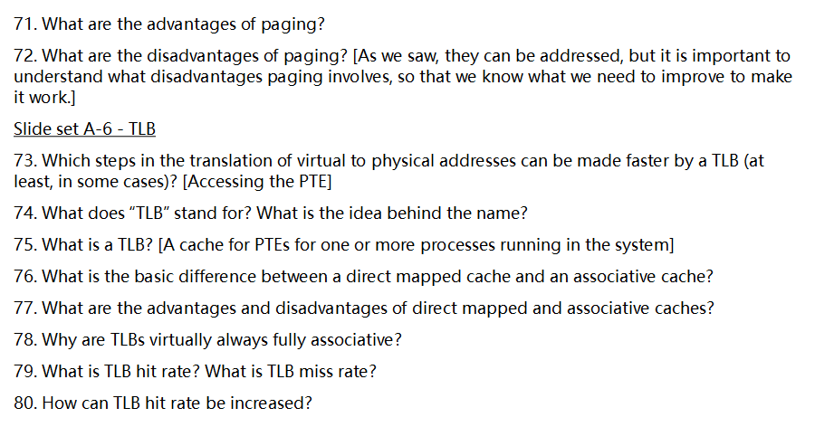


下面按题号 71–80 逐一、详细说明（分页与 TLB 主题）。

------

### 71) 分页（paging）的优点

- **消除外部碎片**：物理内存按固定大小“页帧（frame）”分配，不再需要大块连续空间。
- **支持稀疏地址空间**：只为实际用到的虚拟页分配物理页帧；未用区域不占物理内存。
- **简化内存分配与换入换出**：以页为单位分配/回收/置换，管理策略统一、实现简单。
- **良好的保护与隔离**：每页可独立设定 R/W/X 权限、用户/内核位、存在位等；非法访问触发异常。
- **易于共享**：可将只读代码页在多个进程间共享；支持**写时复制（COW）**等优化。
- **虚拟内存的基础**：支撑按需调页（demand paging）、页面置换算法、内存映射文件（mmap）等。
- **与缓存体系友好**：固定页大小便于 TLB/缓存管理与对齐（页着色等）。

------

### 72) 分页的缺点（痛点）

> 这些缺点在现代系统中“可被缓解”，但理解痛点有助于把握改进方向。

- **内部碎片**：最后一页可能未被完全利用（页内空洞）。
- **地址翻译开销**：每次访存要先把 **VPN→PFN**（虚拟页号到物理帧号）查出来；**多级页表**会增加内存访问次数。
- **页表占用内存**：64 位大地址空间、细粒度页会导致页表很大（用多级/反向页表缓解）。
- **TLB 依赖**：若 **TLB 未命中**，需要页表遍历（硬件/软件走表），代价高；TLB 还带来**上下文切换失效率**与**一致性（shootdown）**问题。
- **页尺寸折中**：页太小→页表大、TLB 压力大；页太大→内部碎片重、加载/回写放大；需靠**大页/超页**、多页尺寸混用来权衡。
- **抖动（thrashing）风险**：工作集超内存时频繁缺页、置换，性能崩溃（与置换策略相关）。
- **别名/同义（synonym/alias）**：同一物理页被不同虚拟地址映射时可能引发缓存一致性/同义失配，需要体系结构与 OS 协同处理。

------

## Slide set A-6 — TLB

### 73) TLB 能加速虚拟到物理地址翻译的哪些步骤？

- **直接加速“访问 PTE（页表项）”**：在 **TLB 命中**时，硬件无需去内存走多级页表，直接得到 **PFN + 权限位**；省掉一串内存访问与权限检查路径（权限位通常也随同缓存在 TLB）。

------

### 74) “TLB” 的全称与名字含义

- **TLB = Translation Lookaside Buffer**（翻译旁路缓冲）。
- 含义：在“主结构（页表）”**旁边 look aside** 一眼的小型高速缓存，直接返回最近用过的地址翻译结果。

------

### 75) 什么是 TLB？

- **TLB 是用于缓存 PTE/地址翻译结果的小而快的**（通常在芯片上的）**全相联/高相联缓存**。
- 典型条目：`<VPN, PFN, 权限/有效位/ASID/全局位等>`；
- **命中**：返回 PFN 与权限 → 形成物理地址继续访存；
- **未命中**：由硬件页表遍历器或软件（陷入内核）去走页表，得到 PTE 后**填回 TLB**，再重启指令。

------

### 76) 直接映射（direct-mapped）与相联（associative）缓存的基本区别

- **直接映射**：每个块（地址集合）**只能去一个确定的槽位**（由索引位决定）；比较一个 tag。

- **全相联（fully associative）**：**任意块可放到任意槽**；查找时与**所有条目并行比对**标签。

- **组相联（set-associative）**：折中方案；每个块可放到其集合（set）内的任一路（way）。

  > - 你提到的 **直接映射（Direct Mapped）、全相联（Fully Associative）、组相联（Set Associative）**，是计算机体系结构中，用于描述 **缓存（Cache）或映射表（如页表、TLB）中，数据如何组织和查找** 的三种基本方式，特别是在解决 **“多个东西要放到有限空间里，如何高效查找和管理”** 的问题时非常重要。
  >
  >   这些概念在多个地方都会用到，比如：
  >
  >   - **CPU Cache（L1/L2/L3 缓存）**：缓存数据块如何放置和查找
  >   - **TLB（Translation Lookaside Buffer）**：虚拟页号到物理页框号的映射如何缓存
  >   - **页框分配、哈希表设计、内存管理**等
  >
  >   下面我会用通俗易懂的方式，结合例子，逐一讲解这三种映射方式。
  >
  >   ------
  >
  >   ## 一、先理解一个通用场景
  >
  >   假设我们有以下情况：
  >
  >   - 有一组 **“数据块” 或 “条目”**（比如缓存行、页表项、TLB 项等），它们要放到一个**容量有限的“容器”中**（比如缓存、TLB 表）。
  >   - 每个数据块有个标识（比如内存地址、虚拟页号等），我们要根据这个标识去**查找对应的块是否在容器中**。
  >   - 问题是：**怎么安排这些数据块在这个容器中的位置，使得查找既快又高效？**
  >
  >   这就涉及到不同的映射策略：**直接映射、全相联、组相联**。
  >
  >   ------
  >
  >   ## 二、1. 直接映射（Direct Mapped）
  >
  >   ### ✅ 核心思想：
  >
  >   > **每个输入项（比如一个内存块 / 虚拟页号）只能放到缓存 / TLB 中的某个固定的、唯一的位置。**
  >
  >   就像你住在一栋公寓楼里，**每个住户（数据块）只能住在一个固定的房间号（缓存行位置）上**，不能随意选择。
  >
  >   ### 🧠 举个例子：
  >
  >   假设：
  >
  >   - 你的缓存（或 TLB）有 **8 个槽位（Entry 0 ~ Entry 7）**
  >   - 你有一个内存地址，通过某种方式（比如取地址的某些位），计算出一个 **索引值（比如 0~7）**
  >   - 那么这个地址对应的数据，**只能放在这个索引对应的那个槽里**
  >
  >   比如：
  >
  >   - 地址 A → 计算出索引 = 3 → 只能放在缓存槽位 3
  >   - 地址 B → 计算出索引 = 3 → 也只能放在缓存槽位 3 → **就会发生冲突，原来的数据要被替换掉**
  >
  >   ### ✅ 优点：
  >
  >   - 查找非常快！因为一个地址只能映射到一个固定位置，**只要检查那个位置就可以了**
  >   - 实现简单，硬件容易设计
  >
  >   ### ❌ 缺点：
  >
  >   - **容易发生冲突（冲突替换）**：如果多个常用地址都映射到同一个槽位，就会频繁互相覆盖，降低命中率
  >   - 灵活性差
  >
  >   ------
  >
  >   ## 三、2. 全相联（Fully Associative）
  >
  >   ### ✅ 核心思想：
  >
  >   > **任何一个输入项（数据块）可以放在缓存 / TLB 中的任意位置，没有固定限制。**
  >
  >   就像你住酒店，**你可以选择任何空闲的房间，没有固定房间号限制**。
  >
  >   ### 🧠 举个例子：
  >
  >   - 你有一个缓存，里面有 8 个槽位
  >   - 某个数据块（比如某个虚拟页号对应的 TLB 项）**可以被放到任意一个槽位中**
  >   - 当你要查找时，**需要遍历所有槽位，看是否有你想要的数据**
  >
  >   ### ✅ 优点：
  >
  >   - **灵活性最高**，不会发生“固定位置冲突”
  >   - 最大限度地利用缓存空间，适合存放那些“热点数据”
  >
  >   ### ❌ 缺点：
  >
  >   - **查找时需要遍历所有条目**，如果缓存比较大，查找会变慢
  >   - 硬件实现复杂，成本高（需要并行比较多个条目）
  >
  >   > 所以，**全相联一般用在较小的缓存中，比如 TLB 或小容量高速缓存**
  >
  >   ------
  >
  >   ## 四、3. 组相联（Set Associative）
  >
  >   ### ✅ 核心思想：
  >
  >   > **折中方案！缓存 / TLB 被分成若干个“组（Set）”，每个组包含多个槽位（Way）。一个数据块只能放到某个特定组中的任意一个槽位，但不能放到其他组。**
  >
  >   就像你住公寓楼，但**每层楼分成几个房间区（组），你只能住在某一层楼的某个区域中，但该区域内可以随便挑空房间**。
  >
  >   ### 🧠 举个例子：
  >
  >   假设：
  >
  >   - 缓存有 **8 个槽位，采用 2 路组相联（2-way set associative）**
  >   - 那么缓存会被分成 **4 个组（8 ÷ 2 = 4）**，每组有 2 个槽位
  >   - 每个输入的数据根据索引，先定位到某个组（比如组 0、1、2、3）
  >   - 然后这个数据可以放在该组中的**任意一个空闲槽位中（最多 2 个）**
  >
  >   查找时：
  >
  >   - 先根据索引找到对应的组
  >   - 然后**在该组的多个槽位中并行查找是否命中**
  >
  >   常见配置：
  >
  >   - 2 路组相联（每组 2 个槽）
  >   - 4 路组相联（每组 4 个槽）
  >   - 8 路组相联，等等
  >
  >   ### ✅ 优点：
  >
  >   - **折中方案，既有较好的命中率，又有可接受的硬件复杂度**
  >   - 比直接映射冲突少，比全相联查找快、实现简单
  >
  >   ### ❌ 缺点：
  >
  >   - 组数、路数设计需要权衡（太多路 → 查找电路复杂；太少 → 容易冲突）
  >
  >   > **现实中，绝大多数 CPU 缓存（L1/L2/L3）和 TLB 都采用 组相联 映射方式，通常是 4 路、8 路等。**
  >
  >   ------
  >
  >   ## 五、三者的对比总结
  >
  >   | 映射类型                        | 数据可以放的位置                            | 查找方式                       | 优点                       | 缺点               | 应用场景                                      |
  >   | ------------------------------- | ------------------------------------------- | ------------------------------ | -------------------------- | ------------------ | --------------------------------------------- |
  >   | **直接映射（Direct Mapped）**   | 唯一固定位置（一个地址对应一个槽）          | 直接计算位置，查看该位置       | 查找极快，硬件简单         | 容易冲突，命中率低 | 简单缓存、低成本低性能场景                    |
  >   | **全相联（Fully Associative）** | 可放在任意位置                              | 需要查找所有槽位（或并行比较） | 灵活，命中率高             | 查找慢，硬件复杂   | 小容量缓存、TLB                               |
  >   | **组相联（Set Associative）**   | 只能放在某个组中的任意槽位（比如 2/4/8 路） | 先找组，再在组内查找           | 折中方案，性能与复杂度平衡 | 设计需权衡路数     | **绝大多数 CPU 缓存、TLB（如 4/8 路组相联）** |
  >
  >   ------
  >
  >   ## 六、类比总结（帮你更好理解）
  >
  >   想象你是一家餐厅的店长，要把顾客（数据块）安排座位（缓存槽位）：
  >
  >   | 映射方式     | 类比                                                        | 说明                                     |
  >   | ------------ | ----------------------------------------------------------- | ---------------------------------------- |
  >   | **直接映射** | 每个顾客只能坐固定的一个座位号（比如身份证尾号决定座位）    | 简单，但容易排队冲突，有人没座位         |
  >   | **全相联**   | 顾客可以坐任意空位                                          | 很灵活，但服务员要满场找座位，费时间     |
  >   | **组相联**   | 顾客只能坐在某片区域（比如 A 区、B 区），但该区域内可随便坐 | 平衡：区域限制让服务更高效，区内自由选座 |
  >
  >   ------
  >
  >   ## 七、回到 TLB 和缓存
  >
  >   - **TLB（Translation Lookaside Buffer）** 通常采用 **全相联 或 小路数组相联（如 4/8 路）**，因为条目较少，需要高灵活性和命中率。
  >   - **CPU Cache（如 L1、L2、L3）** 几乎总是 **组相联（比如 4/8/16 路）**，是性能与复杂度的最佳折中。
  >   - **页表** 本身不是缓存，但如果你在做类似映射的设计，也可以参考这些思想。
  >
  >   ------
  >
  >   🎯 **总结一句话：**
  >
  >   > **直接映射、全相联、组相联，是解决“有限空间中如何高效存放并查找数据”的三种映射策略，分别代表固定分配、完全灵活和折中方案，在缓存、TLB 等硬件结构中广泛应用。**
  >
  >   如你感兴趣，我还可以进一步讲解：
  >
  >   - 如何通过地址划分来定位缓存行（Tag、Index、Offset）
  >   - 组相联中是如何查找 Tag 的
  >   - 为什么 L1 Cache 通常是 8 路组相联，而不是全相联或直接映射
  >
  >   欢迎继续提问 😊

------

### 77) 直接映射 vs 相联缓存的优缺点

- **直接映射**
  - 优点：电路简单、访问延迟小、能耗低、面积效率高。
  - 缺点：**冲突未命中（conflict miss）多**，容易“来回打架”（抖动）。
- **全相联**
  - 优点：**冲突未命中最少**，小容量下**命中率高**。
  - 缺点：并行比较硬件复杂、面积/功耗/延迟较高。
- **组相联**：在**复杂度**与**命中率**之间折中（常见如 4–16 路）。

------

### 78) 为什么 TLB 几乎总是做成“全相联（或很高相联）”？

- **TLB 容量很小**（几十到几百项），完全可承受全相联的比较逻辑。
- **TLB 未命中代价极高**：要走多级页表，可能带来数次到十几次内存访问；任何“冲突抖动”都会非常致命。
- **地址访问模式多样**：不同进程/库/共享页的 VPN 分布不规则，用索引限制位置会增加冲突。
- 综上，为**极大降低冲突未命中**，L1 TLB 通常**全相联**或**高相联**；（有的体系结构在 L2 TLB 采用组相联以平衡面积与功耗。）

------

### 79) 什么是 TLB 命中率 / 未命中率？

- **TLB 命中率（hit rate）**：`命中次数 / 全部 TLB 查找次数`。
- **TLB 未命中率（miss rate）**：`1 − 命中率` 或 `未命中次数 / 全部查找次数`。
- 常用到**有效访存时间（EAT）**的近似：
  - 设 `t_TLB` 为访问 TLB 时间、`t_M` 为一次内存访问时间、`C_PTW` 为一次缺失的页表遍历成本（可能是 L 级页表带来的 ~L 次内存访问），则
  - `EAT ≈ 命中率×(t_TLB + t_M) + 未命中率×(t_TLB + C_PTW + t_M)`（忽略流水/并行优化时）。
  - 含义：**命中**少走路，**未命中**要“走表”再去内存。

------

### 80) 如何提升 TLB 命中率？

**硬件侧**

- **加大 TLB 容量**或增加**层级 TLB（L1/L2 TLB）**。
- **提高相联度**：从组相联提升到更高相联/全相联，减少冲突未命中。
- **支持大页/超页（Huge/Transparent Huge Pages）**：更少条目覆盖更多内存区域。
- **ASID/PCID**：为不同进程/地址空间打标签，**上下文切换时不必清空 TLB**，命中率更高。
- **页表遍历缓存（page-walk / paging-structure caches）**：虽不提高命中率，但显著降低**未命中代价**（总体性能提升）。

**操作系统/软件侧**

- **合理的页尺寸策略**：热点内存用**大页**，冷门/零散用小页，降低 TLB 压力。
- **内存布局与局部性优化**：让热点数据/代码相邻，减少跨多页访问；减少“随机跳”。
- **减少别名问题**：共享内存尽量使用统一虚拟地址映射，避免同一物理页多个 VPN 引发的抖动。
- **工作集管理**：选择合适的页面置换策略与预取策略，使热点页保持驻留。
- **降低上下文切换频率**：过多切换会稀释 TLB 内容；结合调度/绑定 CPU（processor affinity）有帮助。
- **编译与数据结构优化**：如提高数据的**空间局部性**（AoS→SoA、分块/分段遍历等）。

------

需要的话，我可以把“分页与 TLB 速记表（一页纸）”整理给你：页大小权衡、TLB 常见参数、EAT 估算、命中率优化清单。

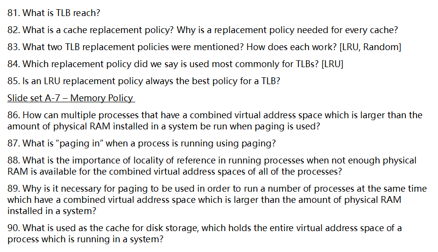

 下面把第81–90题逐一详细解释（以主流体系结构与教材常见设定为准；不同硬件实现细节略有差异，但原理一致）。

------

# 81. 什么是 TLB reach？

**TLB reach** 指一台机器上 **TLB（Translation Lookaside Buffer）能够“覆盖”的虚拟内存总量**。
 直观计算：

- 单一页大小时：`TLB_reach = (TLB_条目数 × 每条目可缓存的页数/方式) × 页大小`
- 多页大小并存时：`TLB_reach ≈ Σ(各类页大小 × 该类页的可缓存条目数)`
   意义：如果某进程的**工作集（working set）**的页数不超过 TLB reach，则其地址翻译大多命中 TLB，缺页不一定减少，但**TLB 未命中（TLB miss）**会显著下降，性能更稳。反之，TLB reach 明显小于工作集时，TLB 频繁抖动。

------

# 82. 什么是缓存替换策略（cache replacement policy）？为何每个缓存都需要？

**缓存替换策略**是指当缓存（TLB、L1/L2 cache、页缓存、缓冲区缓存等）**已满且发生不命中**时，决定**“淘汰哪一项（victim）”**的规则。
 为什么需要：

- **容量有限** → 不命中就必须腾出位置；
- **不同策略影响命中率/抖动/能耗** → 选择得当可显著降低 miss 带来的代价（如数百个周期的内存或磁盘访问）；
- **普适性** → 凡是“容量 < 潜在数据集合”的层级（TLB、CPU cache、页缓存）都离不开替换策略。

------

# 83. 课上提到的两种 TLB 替换策略及工作方式（LRU、Random）

1. **LRU（Least Recently Used，最近最少使用）**

- **思想**：优先淘汰**最久没有被访问**的 TLB 项，利用**时间局部性**原理。
- **实现**：
  - 全相联/组相联下，维护每路的“最近使用次序”元数据；硬件常采用**近似 LRU（pseudo-LRU）**（如树形 PLRU）以降低成本。
  - 访问命中时更新次序；装入新项时淘汰“最老”的那项。

1. **Random（随机）**

- **思想**：在候选集合（如一个 set 的多路中）里**等概率随机选择**一项淘汰。
- **实现**：硬件伪随机数（LFSR 等）选择 victim；极简、无需维护时序元数据。
- **优缺点**：简单、耗能低，能回避某些**对抗性/周期性**访问导致的“锁步冲突”；但对**强时间局部性**负载的利用不如 LRU。

------

# 84. TLB 最常用的替换策略是哪种？

通常答案是 **LRU（更准确地说是“近似 LRU / pseudo-LRU”）**。
 原因：TLB 项目数相对不大，**利用时间局部性**收益明显；同时用近似实现可降低硬件开销。部分架构/层级也会用 Random（或混合策略），但“LRU 家族”最常见。

------

# 85. LRU 对 TLB 是否总是最优？

**不是。**

- **扫描/流式访问**：若访问模式几乎**不重用**，LRU 也难以受益，与 Random 相近，甚至因维护元数据而更耗。
- **对抗性模式**：某些构造会让 LRU 在固定冲突集合中反复抖动，Random 反而能**打破同位冲突**。
- **硬件成本与能耗**：精确 LRU 的状态维护复杂，很多实现只能用**近似 LRU**折中。
- **多进程/频繁上下文切换**：TLB 被不同 ASID 轮番占用时，LRU 的“历史”价值降低。
   因此，**LRU 通常“够好且常用”**，但并非所有负载下的最优策略。

------

# 86. 当多个进程的虚拟地址空间之和大于物理内存时，分页如何让它们同时运行？

- **虚拟内存（paging + 后备存储）**：把每个进程的地址空间拆成页；**活跃页**保留在 DRAM，**不活跃页**存放在**磁盘后备（swap/pagefile 或映射文件）**。
- **按需调页（demand paging）**：访问到不在内存的页才“缺页异常→调入”；不常用页“调出”。
- **共享与写时复制**：代码段/只读数据可被多个进程共享；fork 后用 COW 延迟真正复制。
- **工作集控制/页面置换**：内核根据活跃性选择牺牲页，保证每个进程**至少**有其当前工作集的一部分驻留。

------

# 87. 当使用分页时，“paging in” 是什么？

**Paging in（调入）**：当进程访问某虚拟页而该页**不在物理内存**时，触发缺页异常；内核：

1. 选/分配一个物理页框；
2. 若是文件映射，从文件把该页读入；若是匿名页，**零填充**或从 swap 读回；
3. 更新该虚拟页的 PTE（有效位、权限等），填入 TLB；
4. **从断点重启**被中断的指令。
    与之对应，“paging out（调出）”是把较冷的页写回磁盘并回收页框。

------

# 88. 当物理内存不足以容纳所有进程的虚拟空间时，“局部性”为什么重要？

- **时间局部性**：**最近访问的数据/代码**很可能在短时间内再次访问 → 少量常用页就能支撑运行。
- **空间局部性**：访问某地址后，附近地址也更可能被访问 → 一个页/一簇页的价值提升。
- 局部性强 ⇒ **工作集较小** ⇒ 在有限 DRAM 中就能高命中、低缺页 → **避免抖动（thrashing）**；
- 局部性弱 ⇒ 访问在大范围随机跳 ⇒ 频繁缺页、I/O 洪水，性能崩塌。
   因此，局部性是虚拟内存体系在“RAM 不够”的前提下仍能**流畅并发**的根基。

------

# 89. 为什么必须使用“分页”才能同时运行总虚拟空间大于物理内存的一批进程？

- **部分驻留**：分页允许“**只把用到的那部分**放入内存”，不要求进程**整段/整块**常驻。
- **离散映射与保护**：分页提供**按页映射与权限**，既节省内存，又保证进程隔离。
- **动态置换**：当竞争激烈时，系统可**按页**逐出冷数据，而不是整体挂起进程。
   没有分页（或同等粒度的虚拟内存机制），系统只能：
- 要么强制每个进程**全部装入**（不可行），
- 要么靠**整进程级“换入/换出”**（代价巨大、切换粗糙），很难高效并发。

------

# 90. 谁充当“磁盘存储的缓存”，而磁盘又承载了进程完整的虚拟地址空间？

**物理内存（DRAM）** 就是 **磁盘的缓存**；更具体地说，是内核的**页缓存/缓冲区缓存**（page cache/buffer cache）充当了磁盘上数据的高速缓存。

- 进程的完整虚拟地址空间最终**由磁盘后备**（可执行文件、映射文件、匿名内存的 swap 区）承载；
- DRAM 按需缓存其中的**活跃页**，大幅降低访问延迟；
- 换出/回写策略决定哪些页保留在内存、哪些落到磁盘。

------

## 小结

- **TLB reach** 衡量“TLB 能覆盖多少虚拟页”，决定地址翻译命中稳定性；
- **替换策略**是任何容量受限缓存都必须回答的“淘汰谁”的问题；TLB 常用 **（近似）LRU**，但并非总是最优；
- **分页**让多个大进程在小内存中并发：靠按需调页、局部性、共享/COW 与页面置换；
- **DRAM=磁盘的缓存**，而磁盘作为后备存储承载进程的完整虚拟地址空间。

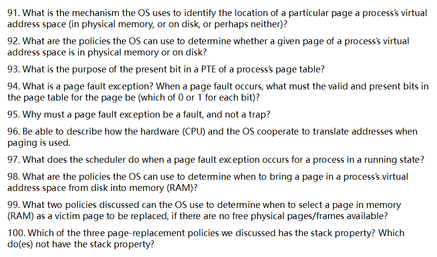

下面按题号逐一、详细解释（以常见教材/课堂表述为准）。

------

## 91) OS 如何识别某个虚拟页“在内存/在磁盘/两者皆非”？

**靠页表项（PTE）及其扩展元数据**。每个虚拟页都有对应的 PTE：

- **Present/Valid 位**标识该页当前是否驻留**物理内存**；
- **权限位**（R/W/X、U/S）与**访问/脏位**（A/D）用于管理；
- **若不在内存**：PTE（或与其关联的数据结构，如**交换区映射/swap map**、文件缓存索引）记录该页在**磁盘上的位置**（交换区槽位或“文件+偏移”）；
- **若两者皆非**：说明该虚拟页**未分配**（如越界地址），或按需分配策略尚未实际建立（会触发异常，由内核决定是否分配/拒绝）。

**一句话**：**查 PTE（+必要的内核表）即可知道“在哪儿”**。

------

## 92) OS 用什么“策略”来决定某页在内存还是在磁盘？

这不是“一个比特”的简单选择，而是由**驻留/置换策略**共同决定，常见有：

1. **按需分页（Demand Paging）**：首次访问才装入；否则不占 RAM。
2. **预取/预分页（Prefetch/Prepaging, Read-ahead）**：根据局部性与顺序访问模式，提前把可能要用的页装入，降低后续缺页概率。
3. **工作集/热度管理**：基于最近访问（A 位、参考位）维持**常用页常驻**，不常用页更易被换出。
4. **页置换策略**：当内存紧张时决定**换出谁**（见第 99 题），从而把一些页移到磁盘。

> 实际系统往往混合使用：**按需为主 + 适度预取 + LRU 近似** 的置换与回收守护进程（page daemon）。

------

## 93) PTE 中 **present** 位的作用是什么？

**指示该虚拟页当前是否“驻留物理内存”**：

- **present=1**：PTE 的物理页号（PPN）有效，可直接通过 TLB/页表完成转换与访问（仍需通过权限检查）。
- **present=0**：访问会引发**缺页异常**；内核据此装入页面或报错。

> 有些教材/课程还区分 **valid**（该 PTE 对此地址“有定义/可用”）与 **present**（“是否在 RAM”）两个概念位。

------

## 94) 什么是 **page fault exception（缺页异常）**？发生时 **valid/present** 各是多少？

- **定义**：CPU 依据 PTE/TLB 访问页时发现**页不在内存**或**访问不合法**而产生的异常，控制权转入内核，由内核决定**装入**、**拒绝**或**杀死进程**。
- **典型“缺页装入”场景（最常见考点）**：
  - **valid=1, present=0**：该页“合法存在，但当前不在 RAM”（在交换区或文件）。内核分配页框、从磁盘读入、更新 PTE→重启指令。
- **其他会被归为 page fault/保护异常的情形**（了解）：
  - **valid=0（present 必为 0）**：该地址无映射（越界/未分配）→ 通常终止或按策略做按需分配（如匿名页零填充）。
  - **权限不符**：**present=1 & valid=1** 但违反 R/W/X/U/S → 产生**保护性缺页**（如写只读页触发 COW）。

------

## 95) 为何缺页异常必须是 **fault**，而不是 **trap**？

- **fault**：在**致错指令尚未完成**时报告，处理后**从该指令重新开始**。
- **trap**：在**指令完成之后**才发生。
- **原因**：缺页需要**先把页面装入**再**重新执行同一条指令**（例如重做一次内存读/写）。若是 trap，就无法“回到未完成状态”精确重启，程序语义会被破坏。

> 因此，**缺页必须是精确可重启的 fault**。

------

## 96) 分页下，CPU 与 OS 如何协作完成地址转换？

1. **CPU 产生虚拟地址 VA**，拆成 **VPN + offset**。
2. **TLB 查找**：
   - **命中**：得 **PPN**，与 offset 拼成**物理地址 PA**；检查权限，放行。
   - **未命中**：执行**页表遍历（page-table walk）**（硬件或软件），读取相应 **PTE**：
     - **present=1 & 权限允许**：取出 **PPN**，回填 TLB，继续；
     - **present=0 或 权限不符**：触发**缺页/保护异常**，陷入内核。
3. **内核处理缺页**：
   - 判断该页是否合法；
   - **若合法不在内存**：
     - 如无空闲页框，按置换策略**选牺牲页**（必要时写回）；
     - 分配页框，从**交换区/文件**读入或**零填充**（匿名页）；
     - 更新 PTE：设置 **PPN、present=1、权限位**；必要时清/置 A/D 位；
   - **若非法/越权**：向进程送异常信号（如 `SIGSEGV`）。
4. **返回用户态，重启致错指令**（因其是 fault），转换成功继续执行。

------

## 97) 进程运行中发生缺页异常时，调度器做什么？

- 内核发起 I/O 把页从磁盘读入，此时**故障进程被阻塞（Blocked/Waiting）**，挂到**等待该页 I/O 完成**的队列。
- **调度器**立即从就绪队列中**挑选其他可运行进程**使用 CPU（维持系统吞吐与响应）。
- 当页装入完成，内核把故障进程**转为就绪（Ready）**，按调度策略择机继续运行并**重启致错指令**。

------

## 98) 何时把磁盘上的页带入内存？（调页“何时装入”的策略）

1. **按需分页（On-demand）**：**发生缺页时**才装入——最常用，避免无谓 I/O。
2. **预取/预分页（Prefetch/Prepaging）**：基于顺序访问或历史模式**提前装入**相邻或相关页（如文件读写**read-ahead**，或进程刚切入时预装其工作集的一部分）。
3. **写时复制（COW）触发装入**：首次写共享页时分配私有页并装入。
4. **内存映射文件（mmap）**：按需把被访问的文件页**懒装入**；也可在内核判断“很可能用到”时**聚簇预取**。

> 实际系统通常：**按需为主 + 适度预取**，在 I/O 吞吐与页命中率之间折中。

------

## 99) 当没有空闲物理页时，如何选“牺牲页”（victim）？（两类常讲策略）

常见课堂会讲两种**可操作**策略（OPT 仅作理论参考）：

- **FIFO（先进先出）**：最早进入内存的页先被换出。实现简单，但可能出现**Belady 反常**。
- **LRU（最近最少使用）及其近似**（Clock/Second-Chance、NRU、NFU 等）：倾向换出“最近没被用”的页，更贴合局部性，效果通常优于 FIFO。

> 实作里多用 **Clock（时钟/二次机会）** 等 **LRU 近似**，结合参考位（A）与脏位（D）权衡写回成本。

（若你的课件把“局部置换 vs 全局置换”也当作“策略”，可补充：**局部置换**只在本进程页中选牺牲者；**全局置换**在所有进程页中挑选，吞吐更高但可能造成抖动与进程间干扰。）

------

## 100) 哪些置换策略具有 **stack property**？哪些不具有？

- **具有**：
  - **OPT（理论最优/MIN）**
  - **LRU（最近最少使用）**
     这两者满足：当帧数从 *n* 增到 *n+1* 时，驻留页集合**只会增加（或相同）**，不会把先前能命中的访问变成缺页。
- **不具有**：
  - **FIFO**（因此可能出现 **Belady’s anomaly**：加大内存反而缺页更多）。

------

需要的话，我可以把 91–100 题整理成一页“速记表”，含：**PTE 关键位→行为**、**缺页处理时序**、**置换策略对比（是否有 stack property / 是否可能反常 / 实作近似）**，便于考前复习。

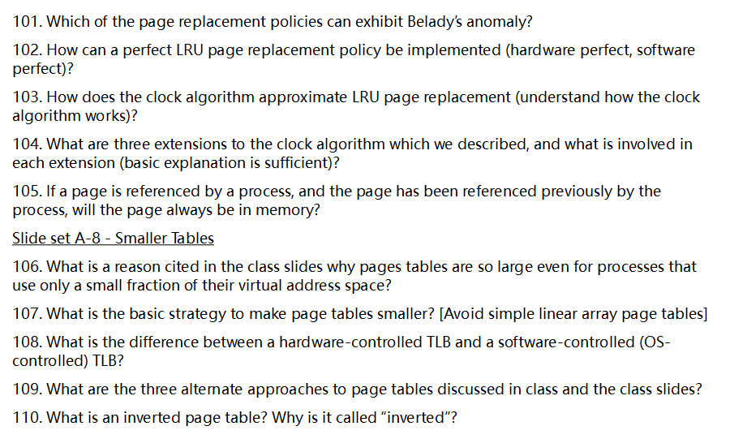

下面逐题详细回答（中文）：

# 101. 哪些置换策略会出现 Belady 反常现象（Belady’s anomaly）？

**会出现**：任何**不满足“栈性质（stack property）”**的策略都可能出现反常。典型有

- **FIFO（先进先出）**
- **随机（Random）**
- **二次机会 / 时钟（Clock / Second-Chance）**、**NRU** 等近似策略（它们也不具备严格的栈性质）

**不会出现**：**具备栈性质**的策略不会反常，即**帧数增加不会让缺页变多**。典型有

- **LRU（最近最少使用）**
- **OPT（最优，Belady 最优算法）**
   （有的 LFU 变体满足栈性质，但实现细节和并列处理会影响）

> “栈性质”指在帧数为 *k* 的命中集合，必然是帧数为 *k+1* 的命中集合的子集。FIFO/随机等不满足这一点，因此可能“加内存反而更慢”。

------

# 102. 如何实现“完美的 LRU”？（硬件完美、软件完美）

**完美 LRU 的含义**：对**每次内存访问**都能**精确记录最近使用顺序**，置换时准确挑出“最久未被使用”的页。

- **硬件完美 LRU**（可行但代价极高）
  1. **时间戳法**：每次访存，硬件把**递增计数器**写入该页的 PTE/缓存元数据；置换选**时间戳最小**的页。
  2. **栈/矩阵法**：维护一份**页的全序**（例如 M×M 的 LRU 矩阵；访问第 *i* 页时置第 *i* 行为 1、清第 *i* 列），置换时选“全 0 行”的页。
      这要求**每次访存都更新硬件结构**，开销和面积都很大（几乎不可取，现代通用 CPU 不做）。
- **软件完美 LRU**（理论上能做，现实不可用）
   让**每次内存访问都陷入内核**以更新 LRU 结构（例如把页暂时标无效，触发陷入后立刻设回有效并记录访问）。这样确实“完美”，但**每次访存都要陷入**，性能近乎不可用。
   → 现实中只能**近似**：依靠**硬件引用位/脏位**，周期性扫描（aging）、时钟算法、采样/保护技巧等。

------

# 103. 时钟算法如何近似 LRU？

**基本思想（Second-Chance/Clock）**：

- 把驻留页做成**环形队列**，有一个“**指针/时针**”。每帧有一个**引用位 R（accessed bit）**。
- 需要置换时：
  1. 看指针所指帧：
     - 若 **R=1**：把 **R 清零**，指针前移，给它“第二次机会”；
     - 若 **R=0**：**淘汰**该帧（被认为“近期没用过”）。
  2. 若找不到 R=0（意味着近期都被访问过），一圈清完后再来，必有可淘汰者。

**近似 LRU 的原因**：最近被用过的页其 R 位大概率为 1，从而在第一次扫描时“保留”；长时间未用的页更易在 R=0 时被选中。

------

# 104. 课上讲过的三个“时钟扩展”及要点（举例）

> 经典教材/课程里常见的三种扩展如下（掌握基本思路即可）：

1. **增强二次机会（Enhanced Second-Chance, ESC / NRU 分级）**
   - 同时考虑 **R（引用位）** 与 **M/D（修改/脏位）**，把帧分为四类：
      **(0,0)**、**(0,1)**、**(1,0)**、**(1,1)**（按是否近期访问、是否脏）。
   - 置换时按**优先级从低到高**选：优先淘汰 (0,0)，其次 (0,1)，再 (1,0)/(1,1)。
   - 直觉：**最近没用**且**不脏**的最先淘汰——减少写回成本并更接近 LRU。
2. **双指针时钟（Two-Hand/Second-Chance with two hands）**
   - 两个手指针保持固定间距：**前手**清 R 位，**后手**回收**仍为 0** 的页。
   - 这样把“时间衰减”显式化：前手刚清过，若在间距时间内页未再被访问，其 R 仍为 0，后手就淘汰，更像对“近期未用”做时间窗口的判断。
3. **工作集时钟（WSClock）**
   - 结合**工作集（Working Set）\**思想与时钟：每帧记录\**上次访问时间戳**。
   - 扫描时：
     - 若 **R=1**：清 R 并更新时间戳，跳过；
     - 若 **R=0** 且“**超出工作集窗口**”：优先选择；
     - 脏页则触发**异步写回**，绕过等待其写回完成。
   - 兼顾**近似 LRU**与**写回效率**，工程上常用。

> 其他常见近似：**老化（Aging）**——周期性右移/衰减每帧的计数器，把 R 位移入高位，最终挑计数最小者。

------

# 105. 某页曾被该进程用过，那么之后它**一定在内存**吗？

**不一定。** 页可能被页面置换策略**回收/换出**。当进程再次访问它：

- 若仍在内存 → 命中；
- 若已被淘汰/换出 → **缺页中断**，再调入。
   **只有被“锁驻/钉住（wired/pinned、mlock）”**的页，或因实现策略被保证常驻（如内核关键页、设备缓冲）才“必在内存”。

------

# 106. 为什么即使进程只用到很小一部分虚拟地址空间，页表仍然很大？

因为**线性、单级的页表**需要为**整个虚拟地址空间的每个虚拟页**都预留一项（按页号直接索引）。
 在 64 位体系下，理论地址空间巨大，即便进程只用到少数区域，也要为“未用的大量空洞”**占位**，导致页表臃肿。

------

# 107. 让页表变小的基本策略是什么？

**避免简单的线性数组页表**，改用**稀疏结构**：

- **分级/层次（多级）页表**：仅当某个虚拟区实际被映射时，才分配下一级页表页；未用的大空洞不占内存。
- 其他思路：**哈希页表**、**倒排页表**、**段页式**、**大页/混合页**降低元数据体积与 TLB 压力。

------

# 108. 硬件控制的 TLB 与软件控制（OS 控制）TLB 的区别

- **硬件控制（hardware-filled）**：
  - **TLB 未命中**时，**硬件页表遍历器**按既定页表格式（如 x86 多级页表）自动走访，并将结果**写入 TLB**。
  - **优点**：命中恢复快、缺页处理路径短；
  - **缺点**：**页表格式被硬件固定**，灵活性低。
- **软件控制（software-managed）**（如传统 MIPS/SPARC/Alpha 的风格）：
  - **TLB 未命中**产生**异常**，由**内核异常处理程序**按照**自定义的数据结构**查找映射，并用特权指令**填充 TLB**。
  - **优点**：OS 对页表格式/策略更灵活（可定制、可压缩、可做多种映射技巧）；
  - **缺点**：每次 miss 需要陷入内核，**开销更依赖实现与工作负载**。

> 现代体系也常混合：硬件 walker + OS 决策（如大页管理、策略控制）。

------

# 109. 课上/讲义讨论的三种“替代”页表方案（让页表更小）

常见三类（“Smaller Tables”）：

1. **多级/层次页表（Hierarchical / Radix Page Tables）**：仅为使用到的地址范围分配页目录/页表页。
2. **哈希页表（Hashed / Hashed Inverted Page Tables）**：按 `(进程ID, 虚拟页号)` **哈希**到桶，桶里存放映射条目，适合大地址空间且稀疏。
3. **倒排页表（Inverted Page Table, IPT）**：每个**物理页框**恰好对应**一项**，表大小与**物理内存**而非虚拟空间成正比。

（有的课程把“段+页（segmented paging）”“区域树（radix/interval tree）”也作为可替代实现思路。）

------

# 110. 什么是倒排页表（Inverted Page Table, IPT）？为何称为“倒排”？

**定义**：传统页表是“**按虚拟页号索引**，存放其物理页框号（加权限）”；
 **倒排页表**则**反过来**：为**每个物理页框（PFN）\**维护\**唯一的一项**，记录**哪个进程的哪个虚拟页（VPN）\**当前映射到它，以及权限等元数据。查找时通常对 `(ASID/进程ID, VPN)` 进行\**哈希**，在哈希桶/链中寻找匹配项。

**为何叫“倒排”**：索引方向从“**虚拟→物理**”改为以**物理为主索引**，相当于把常规页表“倒过来”。

**优点**：

- 表大小与**物理内存大小**成正比，而**与虚拟地址空间大小/进程数量基本无关**，显著节省内存。
- 适合 64 位、超大稀疏地址空间。

**挑战/代价**：

- **查找更复杂**：需要**哈希**与冲突处理，最坏要遍历桶链；对 TLB 依赖更强。
- **共享页/同一物理页被多映射**（同页框被多个 `(PID, VPN)` 引用）时，需要**附加结构**（如反向链接/复制条目/链表）来表示多重映射。
- **替换与一致性**：需要把 TLB、哈希桶、倒排项等一并维护好；实现复杂度高。

------

**小结**：

- Belady 反常：**非栈性质**策略（FIFO/随机/时钟/NRU…）可能发生；LRU/OPT 不会。
- 完美 LRU 在工程上**不现实**，因此采用**时钟、老化、WSClock**等近似。
- 页表之“大”源于**线性表的“全覆盖索引”**；通过**多级、哈希、倒排**等方式做**稀疏化与压缩**。
- TLB 有**硬件填充**与**软件管理**两派，各有权衡。

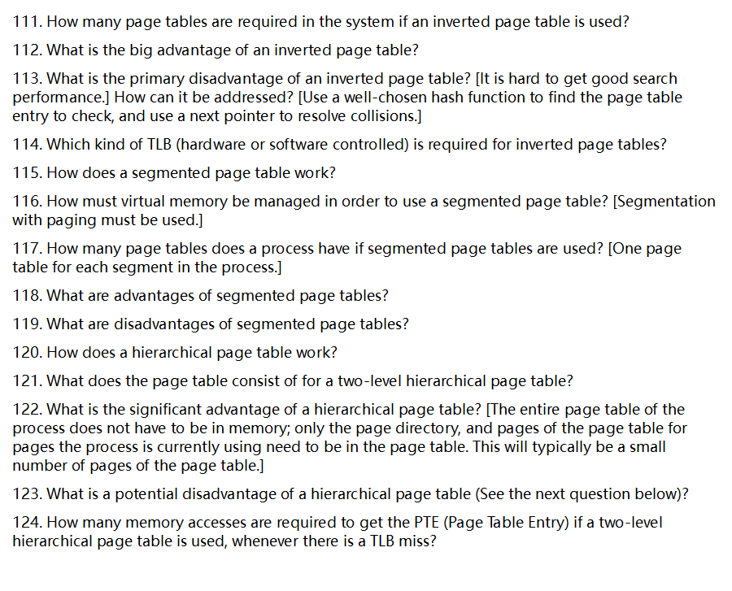

下面按题号 111–124 逐一、系统地回答（主题：倒排页表、分段分页、分级页表与 TLB 关系）。全部中文，尽量精炼但把关键机理讲透。

------

### 111) 使用 **倒排页表**（Inverted Page Table, IPT）时，系统里需要几张页表？

- **一张**系统范围的倒排页表（按**物理页帧数量**建表），而不是每个进程各自一张。

  > 有的实现会按 NUMA 节点分开存放，但概念上就是“**全系统一张**”。

------

### 112) 倒排页表的主要优点

- **页表内存占用与物理内存规模成正比**（O(#物理页)），而不是与各进程虚拟地址空间规模相乘；
- **适合 64 位超大虚拟空间/多进程场景**：页表开销小得多；
- **统一管理**：系统级一本账，易做页面回收/统计。

------

### 113) 倒排页表的主要缺点及改进方式

- **缺点（核心痛点）**：从“虚拟页（VPN, + 进程标识/ASID）→物理帧”的**查找性能**难做得好。因为表是**按物理帧**组织，顺序查找代价大。
- **常见改进**：做成**哈希化页表**：
  1. 用一个良好的**哈希函数**对 `(ASID, VPN)` 取哈希，直接定位到桶；
  2. 桶中条目用 **next 指针**（链式）解决冲突（或开放定址等）；
  3. 还可配合**高命中率的 TLB**，把大多数查询挡在 TLB；
  4. 其他工程技巧：多哈希、布隆过滤、分桶优化等。

------

### 114) 倒排页表要求哪种 TLB 管理方式（硬件/软件控制）？

- **通常要求“软件控制的 TLB（software-managed TLB）”\**更合适：TLB 未命中时\**陷入内核**，由软件执行“哈希查找 + 冲突解析”，找到 PTE 后**回填 TLB**。

  > 说明：也存在少数架构提供**硬件哈希页表走查器**（硬件帮助在倒排/哈希表中查），但通用教材与系统设计里，**IPT 更常与软件管理型 TLB 搭配**，灵活处理冲突与策略。

------

### 115) **分段分页（segmented page table）**如何工作？

- **地址拆分**：`<段号 s | 段内页号 p | 页内偏移 o>`。
- **步骤**：
  1. 用 **段号 s** 索引本进程的**段表**（段描述符含：该段的**页表基址**、段界限、权限等）；
  2. **段界限/权限检查**（s 是否存在，访问是否合法）；
  3. 取到该段的**页表基址**后，用 **段内页号 p** 索引该段的**页表**拿到 **PTE（含 PFN、权限位…）**；
  4. 组装物理地址：`PA = PFN || o`（页帧号拼接页内偏移）。
- **要点**：**分段**提供逻辑隔离/边界与按段权限；**分页**负责消除外部碎片与物理内存分配。

------

### 116) 要用分段页表，虚拟内存必须如何管理？

- 必须采用**“分段 + 分页”**的混合管理：即**按段划分地址空间**，**段内再分页**。操作系统需维护：**段表 + 每段各自的页表**。

------

### 117) 使用分段页表时，一个进程有几张页表？

- **每个段一张页表**（再加上一张**段表**）。因此页表张数 = 该进程段的数量。

------

### 118) 分段页表的优点

- **兼得两者优势**：
  - 分段：符合程序逻辑（代码/数据/堆/栈/库均可独立设 R/W/X、共享/私有），边界清晰；
  - 分页：**无外部碎片**、支持按需调页/置换。
- **页表更稀疏**：只为**实际存在的段**分配页表页，避免为整片巨大未用空间建大页表。
- **更细粒度的保护与共享**：以“段”为单位的策略（只读共享代码段、不同段不同权限）。
- **段独立增长**：堆（向上）与栈（向下）增长互不干扰，段内按页分配。

------

### 119) 分段页表的缺点

- **实现复杂度更高**：地址翻译要先段表再页表，硬件/OS 协作更复杂。
- **TLB 压力**：TLB 项可能需要携带**段相关信息**（ASID + 段 + 页），项目粒度更碎，命中率易受影响。
- **仍有页内“内部碎片”**（分页固有问题），而段太多会带来**元数据开销**（许多小页表）。
- **上下文切换成本**：需要切换段表基址/刷新相关 TLB 项。

> 注意：由于段内**分页**，**外部碎片基本消除**，缺点不在于外部碎片，而在于“结构更复杂”和 TLB/元数据开销。

------

### 120) **分级（层次）页表**如何工作？

- 将虚拟页号（VPN）按位**再切分为多级索引**：顶级目录（L1）指向次级页表（L2），L2 再含最终 PTE。
- 翻译时：用 VPN 的高位索引 **页目录 PDE** → 得到 **L2 页表页的物理地址**；再用中间位索引 **PTE**；最后与偏移拼成物理地址。
- 只为**实际用到**的地址范围分配下层页表页。

------

### 121) 二级分级页表由哪些部分构成？

- **页目录（Page Directory, L1）**：若干 **PDE**，每个 PDE 指向一个 **页表页（L2）**，或标记为无效。
- **二级页表（L2 Page Tables）**：包含实际的 **PTE**（物理帧号 + 有效/权限/脏/访问位等）。
- CPU 通常有寄存器（如 PDBR/CR3）指向**顶级目录**的物理地址。

------

### 122) 分级页表的显著优点

- **不需要把整张页表常驻内存**：只需**顶级目录** + **当前用到的那几页二级页表**即可。
  - 对**稀疏大地址空间**非常省内存；大多数进程只活跃地用到**很少的页表页**。

------

### 123) 分级页表的潜在缺点

- **TLB 未命中代价更高**：需要**多次内存访问**才能拿到最终 PTE（与下一问对应）。若相关页表页本身不在内存，还会先发生页故障把页表页调入。
- 依赖**高命中率 TLB**来掩盖走表开销。

------

### 124) 二级分级页表在 **TLB 未命中**时，取到 **PTE** 需要几次内存访问？

- **两次**：

  1. 访问 **页目录（PDE）**；
  2. 访问 **二级页表（PTE）**。

- 取得 PTE 后，再加 **1 次**访问真正的数据/指令内存，合计 **≈3 次**（若只问“拿到 PTE 要几次”，答案就是 **2 次**）。

  > 如果 PDE 或二级页表页本身被换出，还会先产生页故障把它们调入，代价更高。

------

需要的话，我可以把几种页表结构画成一页示意图（地址位切割与访问流程），加上“TLB 命中/未命中路径对比”和“关键优缺点速记表”，方便期末速记与刷题。