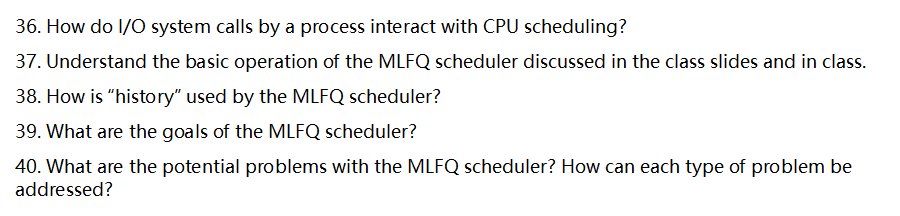

下面按题号逐一作答，并尽量结合常见教材/课程的表述给出清晰、可操作的理解框架。

------

## 1) 操作系统（OS）的定义

操作系统是**管理硬件资源、提供抽象接口并协调程序执行**的一组系统软件。换句话说，它一方面像“**资源管理者**”，负责把 CPU、内存、磁盘、网络和设备有序地分配给各类程序；另一方面像“**虚拟机/抽象层**”，向上提供比原始硬件更好用、更安全、更稳定的接口和编程抽象（如进程、地址空间、文件等）。

核心职责可概括为：

- **抽象（Abstraction）**：把复杂硬件包装成易用对象（进程、虚拟内存、文件、套接字……）。
- **复用/虚拟化（Multiplexing/Virtualization）**：让多个程序“看起来”独占资源（每个进程看到自己的 CPU 时间与地址空间）。
- **隔离与保护（Isolation/Protection）**：防止程序互相破坏或越权访问（权限、内存保护、系统调用边界）。
- **高效与公平（Efficiency/Fairness）**：调度与缓存等机制在吞吐、延迟、公平性间权衡。
- **可靠与安全（Reliability/Security）**：容错、权限模型、系统完整性、审计与更新等。

------

## 2) 现代操作系统的三大“组成部分”及其抽象

很多课程会把 OS 的主体划分为三个互相配合的部分（名称表述略有差异，但内涵相近）：

### A. 进程/CPU 管理（**CPU 虚拟化**）

- **基本描述**：把一颗或多颗物理 CPU 的执行能力“切片”，在时间上快速切换，让每个程序**仿佛独占 CPU**。
- **关键机制**：调度（Scheduling）、上下文切换、抢占、中断/陷入、系统调用、优先级与时间片。
- **典型抽象**：
  - **进程（Process）**：正在执行的程序实例（含独立地址空间与资源配额）。
  - **线程（Thread / 执行流）**：进程内的执行单位，拥有自己的寄存器上下文与栈。
  - **IPC 同步**：管道、消息队列、共享内存、信号、锁（互斥量/读写锁）、条件变量、信号量等。

### B. 内存管理（**内存虚拟化**）

- **基本描述**：为每个进程提供**私有的、连续的虚拟地址空间**，与实际物理内存解耦，同时实现保护与共享。
- **关键机制**：分页（页/页表/TLB）、按需调页、页面置换策略、内存映射文件（mmap）、权限位（R/W/X）、复制写时（COW）。
- **典型抽象**：
  - **地址空间（Address Space）**：代码段、数据段、堆、栈、共享库映射等的统一虚拟视图。
  - **页（Page）/段（Segment）**：内存管理粒度与历史抽象。
  - **内存映射对象**：把文件或匿名内存映射到进程地址空间。

### C. 存储与 I/O 管理（**持久化与设备抽象**）

- **基本描述**：把各种不同设备（磁盘、SSD、网卡、终端、传感器等）的访问细节统一到一致接口，并提供**持久化**数据组织。
- **关键机制**：设备驱动、缓冲/页缓存、块层/字符设备层、VFS（虚拟文件系统）、日志式文件系统、调度与缓存替换。
- **典型抽象**：
  - **文件与目录（File/Directory）**、**文件描述符**、**inode**、**挂载点**。
  - **管道与套接字（Pipe/Socket）**：把进程间通信和网络通信统一成“类似文件”的读写操作。
  - **设备文件**（块设备/字符设备）：以文件方式访问硬件。

> 小结：这三部分分别对应 **CPU 虚拟化（进程/线程）**、**内存虚拟化（地址空间/虚拟内存）**、**持久化与 I/O 抽象（文件/设备/网络）**，共同为上层软件提供一致、安全、高效的运行环境。

------

## 3) 为何要学习操作系统（课程常见动机）

- **吃透计算机“底层是怎么跑起来的”**：理解系统调用、进程/线程、虚拟内存、文件系统与网络栈，写代码不再“黑箱”。
- **写出可靠高性能软件**：掌握调度、缓存、锁、I/O 模型、内存管理，才能定位性能瓶颈与并发 Bug。
- **并发与多核能力**：正确使用线程/协程、同步原语与无锁结构，避免死锁、竞态与饥饿。
- **安全与隔离意识**：权限边界、内存保护、最小特权、沙箱、容器/虚拟化，为系统与云原生打基础。
- **系统设计与工程素养**：学会在正确性、可维护性、效率、可观测性（监控/日志/追踪）之间做权衡。
- **职业与研究拓展**：系统/后端/嵌入式/云计算/数据库/存储/网络/虚拟化/操作系统研发等方向的必备底层功。
- **读写内核级或高性能代码**：能看懂内核文档与驱动、利用零拷贝、异步 I/O、内存映射等“系统级神器”。

------

## 4) 进程（Process）的定义

**进程 = 正在运行的程序的一个实例**，它拥有：

- **独立的地址空间**（虚拟内存视图：代码/数据/堆/栈/共享库）。
- **运行上下文**（包含一个或多个线程的寄存器、程序计数器、栈等）。
- **系统资源的配额与句柄**（打开的文件/套接字、信号、权限、环境变量、工作目录等）。
- **内核中的进程控制块（PCB/Task Struct）**存放其标识、状态、优先级、调度信息、内存映射、打开文件表等元数据。

补充要点：

- **程序（Program）\**只是\**静态**的可执行文件；**进程**是其**动态**执行态。
- 进程可包含**多个线程**，共享同一地址空间与大部分资源。
- **典型状态**：就绪（Ready）/运行（Running）/阻塞（Blocked, 等 I/O）/终止（Terminated），由调度器与事件驱动转换。
- **上下文切换**：内核保存/恢复寄存器等上下文，在不同进程/线程间切换 CPU。

------

## 5) 什么是执行流（Execution Stream）？

**执行流**（又常称“**线程**”、“控制流**/thread of control**”）是指**CPU 顺序执行的一条指令序列**及其相关运行上下文。你可以把它理解为“谁在用着 CPU、按什么顺序执行哪段代码”。其特点是：

- **最小的可调度执行单位**：调度器把时间片分配给执行流（线程），而非抽象的“程序文本”。
- **上下文组成**：程序计数器（PC/IP）、通用寄存器、栈指针、线程栈及线程私有数据等。
- **与进程关系**：
  - 单线程进程：一个进程只有**一个**执行流。
  - 多线程进程：**多个**执行流共享同一进程的地址空间与资源，但各自有独立栈与寄存器上下文。
- **并发与并行**：
  - 在单核 CPU 上，多执行流通过**时间片轮转**实现**并发**（宏观上同时，微观上轮流）。
  - 在多核/多处理器上，多个执行流可**真正并行**运行。
- **同步与通信**：多个执行流访问共享数据需要互斥/同步（锁、条件变量、信号量、原子操作、栅栏等）以避免竞态。

> 一句话：**执行流 = “正在被 CPU 执行的那条路线”**；线程是执行流的标准实现形态。

------

如果你需要，我还能把以上内容配成速记图/对照表（如“抽象—机制—典型系统调用”三列），或结合具体 OS（Linux/Windows/macOS）给出更贴近实现的示例。

# 6. 什么是“进程的执行态（process execution state）”？（区别于“进程状态”）

- **进程的执行态**指的是：如果此刻把 CPU 的控制权交给该进程，需要恢复到 CPU 寄存器里的**那组具体值**与运行现场，包括：
  - 程序计数器（PC/IP）、栈指针（SP）、通用寄存器、浮点/向量寄存器、状态寄存器（标志位）、线程本地存储（TLS）指针等；
  - 与当前线程/进程绑定的**页表/地址空间**（MMU 上下文、CR3/TTBR）、内核栈指针；
  - 内核用于调度的必要元数据（优先级、时间片剩余量、调度类）。
- 执行态是**可被保存/恢复的“快照”**；上下文切换（context switch）就是保存一个进程（或线程）的执行态、加载另一个的执行态。
- **与“进程状态（process state）”不同**：
  - 进程状态是**调度器眼中的宏观状态**：就绪（ready/runnable）、运行中（running）、阻塞/睡眠（blocked/sleeping）、僵尸（zombie）等。
  - 执行态是**微观的机器状态**：告诉 CPU “下一条指令从哪儿执行、寄存器/栈是什么”。
     简单记忆：**状态（state）= 位置与资格；执行态（execution state）= 具体现场**。

------

# 7. 进程（process）与程序（program）的区别

- **程序**：静态的**可执行文件/脚本**及其**代码与只读数据**，存放在磁盘上（如 ELF、PE、Mach-O）。它**不会占用 CPU**，也没有运行中的栈/堆/打开的文件。
- **进程**：程序的**一次执行实例**，拥有**独立的地址空间**、运行时资源与内核对象：
  - 私有的虚拟内存（代码段、数据段、堆、各级栈、映射的共享库/文件等）；
  - 打开文件表、工作目录、权限凭据（UID/GID/capabilities）、信号处理器；
  - 至少一个线程（主线程），调度属性与内核中的 task 结构。
- 关系：**一个程序可以对应多个进程实例**（你可开多个“同款”进程），同一进程在生命周期内也可通过 `exec` **更换正在运行的程序映像**。

------

# 8. 典型的进程 API 接口/动作（以 Unix/Linux 为例）

1. **创建与派生**
   - `fork`/`vfork`/`clone`、`posix_spawn`：创建子进程或按选项克隆部分资源（Linux `clone/clone3` 可细粒度控制）。
2. **装载并执行新程序**
   - `execve`/`execl*`/`execvpe`：用新程序映像**覆盖**当前进程地址空间，并从其入口开始运行。
3. **结束与回收**
   - `exit`/`_exit`：结束当前进程；`wait`/`waitpid`/`waitid`：父进程**回收**子进程并获其退出码；
   - `kill`：向目标进程/进程组发送信号（不仅用于“杀死”，也用于事件通知）。
4. **信号与处理**
   - `sigaction`、`signal`、`sigprocmask`、`sigwait`：安装/屏蔽/等待信号，异步事件处理。
5. **调度与优先级**
   - `nice`/`setpriority`、`sched_setscheduler`/`sched_setparam`、`sched_yield`：调整优先级/调度策略。
6. **资源与限制**
   - `getrlimit`/`setrlimit`：进程资源上限；`prlimit`；`getrusage`：资源使用统计。
7. **身份与权限**
   - `getuid`/`setuid`、`getgid`/`setgid`、`setresuid` 等；Linux 能力（capabilities）。
8. **地址空间与内存**
   - `mmap/munmap`、`mprotect`、`brk/sbrk`（不推荐）、共享内存（`shm_open`/`mmap`）。
9. **环境与运行目录**
   - `getenv/setenv/putenv`、`chdir/fchdir`、`umask`。
10. **进程层级与会话/作业控制**
    - `getpid/getppid`、`setpgid`、`getsid/setsid`、前台/后台进程组、控制终端。
11. **进程间通信（与“进程 API”紧密相关）**
    - 管道 `pipe/pipe2`、`socketpair`、Unix 域套接字、消息队列、共享内存、信号量、`eventfd`、`signalfd` 等。
12. **命名空间/容器相关（Linux）**
    - `unshare`、`setns`、`clone(CLONE_NEW*)`、cgroups（通过 `cgroupfs`/`systemd` 接口）。

------

# 9. Unix/Linux 内核创建一个进程时做了什么？

> 下面以经典 **`fork`**（写时复制 COW）为主线，补充 `posix_spawn` 与 `clone` 要点。

1. **分配内核对象与 PID**
   - 创建 `task_struct`（线程/进程描述符）、内核栈、调度实体；分配唯一 PID，建立父子关系链。
2. **复制/引用父进程资源（写时复制）**
   - **地址空间**：`mm_struct` 及其 VMA 映射被**标记为只读并共享物理页**；父子任一方写入时触发 COW 拷贝；
   - **文件描述符表**（`files_struct`）：增加引用计数，共享打开文件（偏移量可共享）；
   - **文件系统上下文**（`fs_struct`：CWD/根目录）、**信号处理**（`sighand`）、**凭据 `cred`** 等按语义复制或引用；
   - 继承**信号屏蔽字**、环境变量、umask、资源限制等。
3. **设置子进程的执行态（CPU 上下文）**
   - 为子进程构造一个**“从 `fork` 返回”**的现场：父返回子 PID，**子返回 0**；设置内核栈初始帧以便首次调度时能“落地”到用户态。
4. **调度就绪**
   - 将子进程置为**就绪（runnable）**，插入就绪队列；必要时触发调度。
5. **返回用户态**
   - 父进程得到子 PID 继续执行；当调度器选中子进程运行时，它会在父进程的用户态现场“复刻点”处**从 `fork` 返回 0**，继续执行子路径。

**`posix_spawn`**（常用于实现 `system`/shell 启动外部程序）通常在内核中更接近“轻量 `fork` + `exec`”，减少在用户态的窗口期与拷贝开销（实现细节依 libc/内核支持）。
 **`clone/clone3`** 允许精细控制共享粒度（如仅创建新线程共享地址空间/文件表等），是 Linux 线程与容器原语的基石。

------

# 10. 进程创建后，要做什么才能开始“真正执行”？

根据**是否 `exec` 新程序**分两种理解，但共同点是：**必须被调度器选中并完成一次上下文切换**。

**通用步骤（必须条件）**

1. **进入就绪队列**：新建的进程（或线程）状态为 runnable，满足资源/优先级策略。
2. **调度器分配 CPU**：当轮到它，内核进行**上下文切换**：
   - 加载它的**执行态**：切换内核栈、页表（地址空间）、恢复寄存器/标志位；
   - 切到用户态入口（或系统调用返回点）。
3. **从正确位置开始执行**：这取决于是否发生过 `exec`。

**A. `fork` 之后、尚未 `exec`（父子继续同一映像）**

- 子进程第一次得到 CPU 时，会**从 `fork` 的返回点**开始执行（返回值为 0），然后按照程序逻辑前进（常见：立即调用 `execve` 装入新程序，或直接在子进程中执行子任务）。

**B. 调用 `execve` 装入新程序后**
 在第一次真正跑到用户态之前，内核与动态加载器要完成以下准备，使“入口有效”：

1. **装载可执行文件（ELF 等）**
   - 丢弃旧地址空间，建立**新的虚拟内存布局**：代码段、数据段、BSS、堆、栈、共享库映射、VDSO 等；
   - 设定**程序入口地址**、`auxv`、`argv`、`envp`，把这些压入新栈（构造用户栈）。
2. **动态链接（ld.so）**
   - 若为动态链接：先跳到**动态链接器**，它解析/映射共享库、做重定位与初始化（`.init_array` 等），再跳转至主程序 `main` 的前置入口（如 `_start`/`__libc_start_main`）。
3. **设置执行现场**
   - 置位 PC=入口地址、SP=新用户栈顶，清理不该继承的处理器状态；必要时设置线程局部存储（TLS）。
4. **被调度运行**
   - 调度器选中后，从入口处**开始执行新程序**（通常进入 `_start → main`）。

**一句话总结**：

- 没有 `exec`：**从 `fork` 返回点**开始；
- 有 `exec`：**装载/链接建立新映像，设置入口与用户栈 → 调度 → 从入口指令开始**。
- 无论哪种，都离不开：**进入就绪队列 → 调度器选择 → 上下文切换 → 恢复执行态**。

下面按题号（11–15）逐一、详细回答。

------

### 11. 三种进程状态分别是什么？各在做什么？

经典“三态模型”：

1. **运行态（Running）**
   - 含义：进程正占有 CPU，在执行其指令流。
   - 行为：执行用户代码或刚进入/即将返回内核的代码；可能在进行计算、访问内存、发起系统调用等。
2. **就绪态（Ready）**
   - 含义：进程已经具备运行条件，只是**暂时没拿到 CPU**。
   - 行为：排队等调度器分配时间片；一旦被选中就从就绪→运行。
3. **阻塞/等待态（Blocked/Waiting）**
   - 含义：进程**在等某个外部事件**，即使给它 CPU 也干不了活。
   - 行为：典型是等待 I/O 完成、等待锁/信号量、定时器超时、等待子进程结束等；事件到来后从阻塞→就绪。

常见状态迁移（理解调度很重要）：

- 运行→阻塞：执行到需要等待的操作（如 `read()` 需等磁盘/网络）。
- 运行→就绪：时间片用完被时钟中断抢占，或更高优先级进程到达。
- 阻塞→就绪：外设中断或条件满足（I/O 完成、锁可用、超时到期）。

> 注：一些教材还会引入**挂起（Suspended）\**或\**新建/终止**等扩展状态，但“三态”是最核心、最常用的最小模型。

------

### 12. 系统中进程如何“共享”CPU（时间共享）？“时间共享”是什么意思？

**时间共享（Time-Sharing）\**就是把单个 CPU 的时间切成很小的片段（时间片/量子，通常几毫秒到几十毫秒），在不同进程之间\**快速轮转**，让用户感到各进程“同时”在跑（并发错觉）。

关键机制与过程：

- **时钟中断（timer interrupt）**：硬件定时触发中断，内核获得控制权，可**抢占**正在运行的进程。
- **调度器（Scheduler）**：决定下一个上 CPU 的进程。常见策略：
  - **RR（轮转）**：公平、简单，交互性好。
  - **优先级/多级反馈队列（MLFQ）**：让交互型/短任务响应更快。
  - 其他如 CFS（Linux）等“按虚拟运行时间公平分享”。
- **上下文切换（Context Switch）**：保存当前进程寄存器/PC/标志位等上下文，恢复下一个进程的上下文，切换页表等，然后继续执行。

效果与权衡：

- **优点**：提高交互响应，公平共享，提升资源利用率。
- **权衡**：时间片太短→切换开销大；太长→响应变慢。实际系统会结合负载与策略动态调整。

> 与“空间共享”对比：时间共享是同一核心在**时间上复用**；空间共享是多核/多机在**空间上并行**。

------

### 13. 直接执行（Direct Execution）与受限直接执行（Limited Direct Execution, LDE）的区别？

先给定义，再对比：

- **直接执行（DE）**：把用户程序**直接在 CPU 上跑**，OS 不设权限边界、不安排定时抢占，程序需要啥就自己做（含 I/O、特权指令）。
  - 优点：极低开销，简单。
  - 致命问题：**不安全、不可控**（见第14问）。
- **受限直接执行（LDE）**：让进程“几乎直接”在 CPU 上跑，但**通过硬件+OS设置边界与回收控制权**：
  - 用户态/内核态分离（状态位）；
  - 只能通过**系统调用（trap）**请求敏感操作；
  - **时钟中断**可抢占，实现时间共享；
  - **设备中断/异常**由内核处理；
  - 内存通过 MMU 隔离（页表/地址空间）。

**核心差异（要点对照）**：

- **权限**：DE 无权限隔离；LDE 以**状态位**限制用户态，特权指令仅内核可执行。
- **I/O与敏感操作**：DE 进程可直接访问设备寄存器；LDE 只能通过**系统调用**，由内核代理。
- **调度控制权**：DE OS无法强制拿回 CPU；LDE 有**时钟中断**可抢占。
- **异常处理**：DE 出错可能卡死全机；LDE 异常/缺页由内核统一处理。
- **安全/隔离**：DE 易越权/破坏他人；LDE 依靠**内存保护**与内核仲裁。
- **可实现能力**：DE 难以实现多任务、虚拟化与资源配额；LDE 可以。

------

### 14. 直接执行存在哪些问题？

1. **OS 失去控制权**：没有时钟中断/抢占，用户程序可长期独占 CPU，系统无法保证公平性与响应性。
2. **安全风险极大**：程序可执行**特权指令**、直接操控设备、关中断/改内核数据；恶意或 bug 都可能导致系统崩溃。
3. **缺乏隔离**：没有内存保护，任意读写物理内存，破坏其他进程/内核。
4. **I/O 混乱**：程序直接碰硬件，资源冲突、设备状态不可控，驱动与并发管理无从谈起。
5. **错误/异常处理困难**：非法指令、除零、访问越界等会把整机带崩，无法只“杀掉”出错进程。
6. **无法时间共享**：不可抢占就谈不上多任务并发，更别说交互体验。
7. **资源管理不可行**：无法实施优先级、配额、限流、记账与审计。
8. **可靠性与可维护性差**：调试、监控、故障隔离都缺基础设施支持。

> 总结：DE 也许在“单任务、可信代码、嵌入式极简场景”还能苟活；但**通用多任务 OS 必须拒绝**。

------

### 15. 硬件与 OS 如何共同实现“受限直接执行”（提示：状态位/系统调用/中断与异常）？

把关键机制拆成五块看：

**A. 状态位（内核态/用户态）与特权指令**

- 硬件提供一个**模式位（status bit）**：用户态（不可信）与内核态（特权）。
- **特权指令**（如设置页表基址、I/O 端口、关/开中断、DMA 控制等）只能在内核态执行。
- OS 在**创建/切换进程**时设置：页表（地址空间）、内核栈、陷入向量表等；返回用户态时清特权，保证边界。

**B. 系统调用（System Call / Trap）**

- 用户程序不能直接做敏感操作；需要通过**陷入指令（trap/syscall）**切入内核：
  1. 用户态调用库封装（如 `read(fd, buf, n)`）设置**系统调用号+参数**；
  2. 执行 **trap**：硬件自动
     - 切换到**内核态**与**内核栈**，
     - **保存用户现场**（PC/寄存器/标志），
     - 跳到**陷入向量**指定的内核入口；
  3. 内核**校验参数**（防越界/指针有效性），执行对应服务（调度、I/O、内存分配等）；
  4. 通过 **return-from-trap** 指令恢复用户上下文与**用户态返回**。
- 这样既保证了**功能可用**，又保持了**安全/隔离与可控性**。

**C. 时钟中断与调度（Time-Sharing 的硬件基础）**

- OS 在启动时编程定时器，开启**周期性时钟中断**。
- 中断到来时硬件跳入内核中断入口，OS：
  - 统计本进程用时；如时间片到则**触发调度**；
  - **上下文切换**：保存当前进程上下文→选择下一个就绪进程→恢复其上下文；
  - 返回新进程的用户态 PC 继续执行。
- 如此即可**强制回收 CPU**，实现时间共享与优先级策略。

**D. 设备中断与异常（Interrupts & Exceptions）**

- **设备中断**：I/O 完成时，设备控制器发中断→内核中断处理程序运行→把等待该 I/O 的进程从阻塞队列唤醒到就绪队列。
- **异常（fault/trap/abort）**：
  - 同步于指令，如**缺页（page fault）**、除零、非法指令、访问违规。
  - 内核可以**修复**（如装入缺页后重启指令）或**终止进程**（发送信号/错误码），实现健壮性与隔离。
- OS 预先设置**中断/异常向量表**，每类事件有对应的处理入口。

**E. 内存保护与地址空间（虽题中未点名，但与 LDE 强相关）**

- 硬件 MMU + **页表/段表**：给每进程独立虚拟地址空间，标注页的权限（R/W/X、用户/内核）。
- 用户态只能访问**被授权的虚拟页**；访问违规触发异常，由内核处理。
- 这与状态位一起构成**安全隔离的“双保险”**。

**完整的典型执行时序（以 `read()` 为例）**

1. 进程在用户态执行，到 `read()` 调用库；
2. 执行 `trap` 进入内核态 → 内核检查参数与权限；
3. 若数据未就绪：
   - 内核发起 I/O（常用 DMA），将进程置为**阻塞**；
   - 调度器切走到其他**就绪**进程运行；
4. I/O 完成触发**设备中断** → 内核把该进程从阻塞唤醒为**就绪**；
5. 某次时钟中断/调度后，该进程再获 CPU → 内核**return-from-trap** 返回用户态 → `read()` 返回数据。

通过以上**状态位 + 系统调用 + 中断/异常 + 调度/上下文切换 + 内存保护**，硬件与 OS 共同实现了既高效又安全可控的**受限直接执行**：进程“看起来”直接用 CPU，实则所有敏感点都在 OS 监督之下。

------

如果你需要，我可以把这些内容整理成一页对照表或流程图，方便期末复习与速记。

下面把第16–20题分别详细解释（结合主流架构的一般规律；具体到 x86、ARM 等细节可能略有差异，但核心一致）。

# 16. 中断（interrupt）与异常（exception）的区别

- **触发来源与时机**
  - **中断**：来自**处理器外部**的异步事件（如外设完成 I/O、时钟滴答、网卡收到数据包）。它和当前在跑的那条指令没有必然因果关系，发生时间对程序而言是“意外的、异步的”。
  - **异常**：由**当前正在执行的指令**同步触发（如除零错误、页缺页、权限违规、系统调用指令等）。一定发生在某条具体指令的执行过程中或刚执行之后。
- **处理语义**
  - **中断**通常在指令边界处理，返回时一般**继续到下一条指令**。
  - **异常**需要针对触发那条指令采取措施：
    - 若是“故障（fault）”类，异常在指令**完成之前**被报告，处理后往往要**重启同一条指令**（例如缺页异常：内核补齐页后重试）。
    - 若是“陷阱（trap）”类，异常在指令**完成之后**被报告，返回时**跳到下一条指令**（典型是系统调用、断点）。
- **用途与举例**
  - **中断**：计时器中断用于时间片轮转；磁盘/网卡中断用于上报 I/O 完成。
  - **异常**：缺页、越权访问、除零、执行 `syscall/int 0x80/svc` 等。
- **共同点**
  - 两者都会引发**特权级提升**（进入内核/特权模式）、**硬件自动保存关键信息**（PC/状态字/少量寄存器）、然后跳转到向量表中的相应处理例程。

# 17. 异常的两种类型及区别

在多数操作系统/教材的常见二分法里，**异常分为两类：故障（fault）与陷阱（trap）**（有些体系结构还把“终止/崩溃（abort）”单列为第三类，这里按“两类”来答）。

- **故障（fault）**
  - **发生点**：在指令**尚未完成**时被报告。
  - **返回语义**：处理完毕后通常**重新执行同一条指令**（因为它还没成功完成）。
  - **典型例子**：**缺页异常**（内核装入缺页后重启指令）、**一般保护性故障/权限故障**。
  - **可恢复性**：有的故障可恢复（如缺页）；也有不可恢复的（如除零，多数情况下会终止进程）。
- **陷阱（trap）**
  - **发生点**：在指令**完成之后**被报告。
  - **返回语义**：处理后**返回到下一条指令**。
  - **典型例子**：**系统调用**（软件中断/`syscall`/`int`/`svc`）、**调试断点**。

> 备忘：x86 文档里还定义了 **abort**（如硬件一致性/严重错误），通常不可恢复；但题目问“两类”，掌握“故障 vs. 陷阱”的触发点与返回语义即可。

# 18. 为什么必须由 **CPU**（不是 OS）把状态位从用户态切到内核态？什么时候做？

- **为什么必须由 CPU 执行这一步：**
  1. **信任与隔离边界**：用户态代码不可信。如果让 OS（也就是一段普通指令流）自己去改“我现在是内核态”的位，那恶意程序也能仿造，从而**绕过一切权限检查**。
  2. **原子性与安全性**：从用户态进入内核态需要**原子地**完成多件事：保存现场、屏蔽/调整中断、切换栈指针、加载受保护的内核入口地址、提升特权位……只有**硬件**能保证这一连串动作不可被用户态抢插或篡改。
  3. **一致性**：不同异常/中断入口的权限级检查、门描述符权限验证（如 x86 IDT gate/CPL 检查）必须由硬件强制执行。
- **CPU 何时自动把用户态 → 内核态：**
  - **外部中断到来**（定时器、I/O 中断）。
  - **同步异常发生**（缺页、除零、越权等）。
  - **执行系统调用指令**（如 `syscall`/`int n`/`svc`），这是**受控的**用户→内核入口。
  - （以及复位/不可屏蔽中断等特殊路径）

进入时，CPU 会：
 (1) 把返回地址与状态寄存器等压入内核栈或保存到陷入帧；(2) **设置特权位为内核态**；(3) 跳转到异常/中断向量指定的**内核入口例程**。

# 19. 从内核态回到用户态是 CPU 还是 OS 改状态位？何时做？

- **谁来改？“OS 触发、CPU 执行”**
   返回用户态时，**操作系统先在内核中**准备好“将要回到用户态”的陷入/中断返回帧（包含用户态的 PC、SP、标志寄存器中的**用户态模式位**等），然后执行**专用的“从异常返回”指令**（x86 的 `iret/iretq`、AMD64 的 `sysret`、ARM 的 `eret` 等）。
   **真正把特权位从内核→用户翻转的是 CPU**，且与恢复寄存器、跳转到用户 PC 是一个**不可分割的原子动作**。
- **什么时候做？**
  - **系统调用处理完成**准备把控制权还给发起调用的用户进程时。
  - **中断处理完成**返回被中断的用户进程时。
  - **调度/上下文切换**后要开始运行某个用户进程（例如 `execve` 新程序的第一条用户指令）时。
     在这些时刻，内核都会构造/选择相应的“用户态陷入帧”，然后执行返回指令，由**CPU**一次性降级到用户态并跳转。

# 20. 用户进程在**用户态**不能做哪些事？

用户态的基本原则是“**不直接触碰会影响全局安全与资源隔离的东西**”。典型受限项包括：

1. **执行特权指令**（被架构标记为 privileged）：
   - 修改**中断使能**（如 x86 `cli/sti`）、触碰**控制寄存器**（如 x86 `CR3` 切页表、`CR0/CR4` 特性位、`wrmsr`/`rdmsr` 等）、管理 **TLB/缓存控制**、切换特权级/状态字、启停 CPU 核、变更内核栈指针等。
2. **直接访问物理设备与总线**：
   - **端口/内存映射 I/O**（访问设备寄存器、DMA 控制器、APIC/中断控制器、时钟源/定时器等）需要内核代理；用户态只能通过**系统调用**间接完成（如 `read/write/ioctl`）。
3. **直接改动内存管理结构**：
   - 不能随意改**页表/段表**、不能读写**内核地址空间**、不能越权访问其他进程的地址空间、不能擅自设定可执行权限（W^X 策略由内核与加载器控制）。
4. **破坏系统全局状态/策略的操作**：
   - 不能更改**调度器/优先级**（除内核开放的受控接口外）、不能关闭安全机制（如 SMEP/SMAP/PXN 等）、不能随意关机/重启/休眠、不能修改安全相关配置（LSM、SELinux、capabilities 等）。
5. **绕过内核的资源管理与权限检查**：
   - 不能直接访问**文件系统块设备**、**网络接口的原始能力**（原始套接字等通常需特权）、不能随意绑定受限端口或更改路由/防火墙；必须通过系统调用，由内核进行**权限校验与审计**。
6. **任意加载/执行内核代码或进入内核态**：
   - 不能加载内核模块、不能伪造陷入入口、不能自行把状态位改到内核态；进入内核只能通过**受控的门**（系统调用、合法的异常/中断入口）。

> 小结：用户态能做的一切**敏感操作都必须走系统调用**，由内核在特权态代为完成，并进行访问控制、隔离与审计；这就是“**硬件强制 + 内核仲裁**”的安全模型。

——以上回答覆盖了中断 vs 异常的本质区别、异常的两类与返回语义、为何以及何时由 CPU/OS 参与特权位切换、以及用户态的禁止事项及原因。

下面按题号逐一、深入回答（以常见教材/课堂表述为准）。

------

### 21) 若用户态进程尝试执行受限操作，会发生什么？

- **硬件检测到违规 → 触发陷入/异常（trap/exception）→ 切到内核态**：CPU 发现执行了**特权指令**（如关中断、直接访问 I/O 端口、改页表等）或**越权访问**（如访问内核地址/他人内存），会产生异常，硬件把控制权转交给内核的异常处理例程。
- **内核判定与处置**：
  1. **非法特权操作/非法指令**：通常向进程发送信号并终止（如 `SIGILL`），生成核心转储（core dump）以便调试。
  2. **内存保护违规**：如访问无权限/不存在页面，产生**页故障（page fault）**。若可被合法处理（如按需分配、从磁盘调页），内核修复后让进程继续；若是越权/无映射，则发 `SIGSEGV` 终止。
  3. **通过系统调用请求受控服务**：如果走**系统调用入口**（`syscall`/`int 0x80` 等），内核按权限检查后**返回错误码**（如 `-EACCES/-EPERM`），而不是杀进程。
- **关键点**：**权限分级（用户态/内核态）+ 异常/陷入机制 + 内核策略**共同保证安全。

------

### 22) 正在执行指令的用户进程，CPU 是如何被“拿走”的（调度器如何重新获得 CPU）？

- **抢占的核心：定时器中断（timer interrupt）**
   OS 设置硬件定时器（时间片用尽时触发）。当**时间片到期**，定时器发中断，CPU **异步转入内核态**执行中断服务程序：
  1. 内核**保存当前线程/进程的寄存器上下文**；
  2. 运行**调度器**（scheduler）选择下一个可运行实体；
  3. **上下文切换**到被选中的进程/线程，返回用户态继续执行。
- **其他让出 CPU 的路径**（同样把控制权带回内核）：
  - 进程执行**阻塞型系统调用**（如读写 I/O、等待互斥量/条件变量）→ 主动进入阻塞态；
  - **I/O 中断**唤醒内核，内核完成处理后可调度别的任务。
- 结论：**定时器中断=强制抢占**；**阻塞/中断=主动或事件驱动的让出**。无论哪种，**内核都能重新掌控 CPU**。

------

### 23) 什么是上下文切换（context switch）？切换时保存/恢复哪些寄存器值？

- **定义**：OS 在不同可运行实体（进程/线程）之间**切换 CPU 执行权**的过程。它使得多个任务能在同一或多颗 CPU 上并发（或并行）推进。
- **寄存器层面的保存/恢复（仅寄存器）**：
  - **程序计数器（PC/IP）**：下一条将要执行的指令地址。
  - **栈指针（SP）**：当前调用栈位置。
  - **通用寄存器**：如 `rax…r15`（x86-64）或 `x0…x30`（ARM64）等。
  - **标志/状态寄存器**：如 `EFLAGS/RFLAGS`（条件码、进位/零标志等）或 PSR。
  - **（如适用）段/线程本地寄存器**：如 `FS/GS base`（x86-64 的 TLS 基址）。
  - **（可延迟/按需）浮点/向量寄存器**：FPU/SSE/AVX/NEON 等通常采用**惰性保存**策略以减少开销。

> 注意：题目限定“**register values only**”，因此不列出页表、缓存、打开文件表等内核数据结构。

------

### 24) 协作式多任务（cooperative multi-tasking）的问题

- **依赖“自觉让出”**：进程必须主动 `yield`/调用阻塞操作；**若进程死循环或长时间不让出，其他任务全部被饿死**，系统响应极差。
- **无法强制公平**：OS 不能在用户代码任意点插入抢占，**时间片共享与优先级**无法可靠落实。
- **交互/实时性差**：GUI、输入事件可能长期得不到处理，**卡顿/假死**。
- **锁与资源占用风险**：拿着锁不让出会造成**锁长时间被占、队列堆积**，放大“优先级反转/饥饿”。
- **鲁棒性差**：**一个失控进程可拖垮全系统体验**；对错误/恶意程序缺乏隔离的时间控制手段。
- **调度粒度粗**：难以实现平滑的**QoS/延迟目标**，不适合现代多媒体/交互和服务端负载。

------

### 25) “true multi-tasking”（真正的多任务）是什么意思？

- **通常指“抢占式多任务（preemptive multitasking）”**：
  - OS 依靠**定时器中断**在任意安全点**强制抢占**正在运行的任务，进行**时间片轮转**与**优先级调度**；
  - 即使任务失控或计算很重，OS 也能保证**系统整体的响应性与公平性**。
- **并发与并行**：
  - **单核**：各任务的执行片段**交错**进行（并发）；
  - **多核**：多个任务可**真正同时**在不同核上运行（并行），进一步提升吞吐与响应。
- **配套特征**：
  - **内存保护与隔离**（每个进程独立地址空间）；
  - **优先级/实时调度类**（如 CFS、RR、EDF 等）；
  - **内核可控的调度点**（中断、系统调用、内核可抢占配置）。
- **与协作式的核心区别**：**是否需要任务“自愿让出”**。True multitasking 不需要，被 OS **随时可抢占**。

------

需要的话，我可以把以上要点整理成一页速记表（“机制—触发—内核动作—可能结果/信号/错误码”），便于考试背诵与课堂讨论。

下面逐题详细回答（中文）：

# 26. `fork` 在 Unix/Linux 中做了什么？创建新进程必须完成哪些步骤？

**作用**：`fork()` 将当前进程**复制**出一个子进程。子进程几乎继承父进程的全部运行环境，但有自己独立的 PID、调度实体与（逻辑上）独立的地址空间。两端从 `fork()` 的同一行继续执行：**父进程得到子 PID**，**子进程得到 0**。

**内核为创建子进程通常要做的事（概要到细）**：

1. **检查与配额**：资源/配额（如 `RLIMIT_NPROC`）、权限、是否可再派生等。
2. **分配标识与核心对象**
   - 分配 **PID**、`task_struct`（任务描述符）与**内核栈**；挂接到父子关系树/进程组/会话。
3. **复制或共享父进程资源（多采用 COW/引用计数）**
   - **地址空间 `mm_struct` 与页表/VMA**：标记私有可写页为**写时复制（Copy-On-Write）**并临时共享物理页；只读段直接共享。
   - **打开文件表 `files_struct`**：复制**文件描述符表**（表本身独立），但各项指向同一**open file description**，因此**文件偏移量等是共享的**（除非后续 `dup3`/重新打开）。
   - **文件系统上下文 `fs_struct`**（工作目录、根目录）、**信号处理 `sighand`**、**凭据 `cred`**、**umask/rlimit/环境变量**等按语义复制或共享引用。
   - **计时器/资源统计/命名空间/cgroup/seccomp** 等状态拷贝或继承。
4. **构造子进程的“执行现场”**
   - 预置寄存器返回路径：调度到子进程时，从 `fork` 的返回点进入用户态，返回值为 0；设置 TLS/线程信息。
5. **就绪与调度**
   - 将子进程置为 **runnable（就绪）**，插入就绪队列，等待调度器分配 CPU。
6. **返回用户态**
   - 父进程立刻得到子 PID 继续跑；子进程被调度后从相同指令地址处开始，只是返回值不同。

> 变体：`vfork()` 在 exec 前与父共享地址空间并挂起父；`clone/clone3` 可选择性共享地址空间/文件表等，是 Linux 线程与容器的基础；`posix_spawn()` 在“创建+执行新映像”路径上更高效。

------

# 27. 不调用 `exec` 时，父子地址空间之间是什么关系？

- **逻辑上独立**：父子各自拥有**独立的虚拟地址空间与页表**，变量、栈、堆、全局区都有一份“自己的视图”。
- **物理上按需分离**（COW）：`fork` 初始时，父子**共享相同的物理页**且**只读**；任意一方对可写页发生写入时，内核触发**缺页异常→分配新页→拷贝旧内容→解除只读**，此后两者的该页相互不影响。
- **内存映射的差异**：
  - **私有映射（MAP_PRIVATE）**：与上同，写时复制。
  - **共享映射（MAP_SHARED）/显式共享内存（SysV SHM、`mmap` 共享段等）**：父子对同一区域的写入**彼此可见**。
- **文件描述符**：父子各有**独立的 FD 表**，但每个 FD 指向同一 **open file description**，因此**文件偏移与某些状态共享**——例如一方 `lseek` 会影响另一方通过同一描述的读写位置。
- **环境变量/工作目录/umask**：初始相同，后续修改互不影响（除非明确共享对象）。
- **输出交错**：若父子同时向同一终端/文件描述符写（且无同步），输出可能交错。

> 直观记忆：**父子内存“看起来各一份”，写入才“真正分家”**；**文件“看的是同一把打开的锁”，动了偏移彼此感受得到**。

------

# 28. 进程状态会发生哪些转换？何时发生？

典型五态模型：**新建（new）→就绪（ready）→运行（running）→阻塞/等待（blocked/waiting）→终止（terminated）**，以及**运行↔就绪**的抢占/放弃。

- **new → ready**：进程被创建并完成内核初始化，加入就绪队列（例如 `fork`/`posix_spawn` 之后）。
- **ready → running**（调度/派发 dispatch）：调度器选中该进程占用 CPU。
- **running → ready**（抢占 preemption）：
  - 时间片用尽；
  - 有更高优先级的就绪进程到达；
  - 调用 `sched_yield` 等主动让出。
- **running → waiting**（阻塞）：
  - 发起会阻塞的系统调用/等待事件（同步 I/O、`read` 等无数据、`wait`、`sleep`、锁等待、条件变量等待）。
- **waiting → ready**：
  - 等待的事件发生（I/O 完成、中断唤醒、锁可用、定时器到期、信号唤醒）。
- **running → terminated**：
  - 正常退出（`exit/_exit` 返回）；
  - 被致命信号终止；
  - 出错异常导致终止。

> 扩展：某些教材/系统还会区分**挂起就绪/挂起阻塞**（swapped out），表示被换出内存的就绪/阻塞态。

------

# 29. 调度器可能希望**最小化**或**最大化**哪些指标？（含基本含义）

**常见要最小化（越小越好）**

- **平均等待时间（Average Waiting Time）**：进程在**就绪队列**里等待 CPU 的总时间平均值；小 → 用户少“干等”。
- **平均周转时间（Average Turnaround Time）**：从到达到完成的总历时平均值；小 → 作业整体完成更快。
- **平均响应时间（Average Response Time）**：到达至**第一次获得 CPU** 的时间；小 → 交互/在线系统“更灵”。
- **响应时间抖动/方差（Variance/Jitter）**：小 → 更可预测。
- **上下文切换次数/开销**：小 → 减少纯管理成本（但与响应性/公平可能冲突）。
- **错过截止期比例/最大迟交量**（实时系统）：小 → 更可靠。

**常见要最大化（越大越好）**

- **吞吐量（Throughput）**：单位时间完成的作业数；大 → 系统处理能力强。
- **CPU 利用率（CPU Utilization）**：CPU 忙碌时间占比；大 → 资源不闲置。
- **公平性（Fairness）/份额满足度**：尽量让各任务按权重获得应得 CPU；大 → 减少饥饿。
- **可满足的实时约束比例**：满足更多截止期。

> 现实中是**多目标权衡**：如 RR/短时间片提升响应但增加切换开销；SJF 最小化平均等待/周转却可能饿死长作业；多级反馈队列折中响应与吞吐；CFS 追求按权重的公平份额等。

------

# 30. 周转时间、响应时间、等待时间的公式

设第 *i* 个进程的：

- **到达时间**：AiA_i
- **第一次获得 CPU 的时间**：SiS_i
- **完成时间**：CiC_i
- **总 CPU 运行时间**（服务时间/CPU burst 总和）：BiB_i

则：

- **周转时间（Turnaround）**：Ti=Ci−Ai\displaystyle T_i = C_i - A_i

- **响应时间（Response）**：Ri=Si−Ai\displaystyle R_i = S_i - A_i

- **等待时间（Waiting/Wait）**（在**就绪队列**中等待 CPU 的总时长）：

  Wi=Ti−Bi\displaystyle W_i = T_i - B_i

  > 注：以上是**CPU 调度常用定义**——等待时间不包含运行在 CPU 上的时间，也不包含**进程主动阻塞做 I/O 的时间**；因此可用“周转减去总 CPU 时间”得到。若你的题目定义将 I/O 也算入“服务时间”，需相应调整为 Wi=Ti−(服务时间)W_i=T_i-\text{(服务时间)}。

**平均值**（*n* 个进程）：

T‾=1n∑Ti,R‾=1n∑Ri,W‾=1n∑Wi\overline{T}=\frac{1}{n}\sum T_i,\quad \overline{R}=\frac{1}{n}\sum R_i,\quad \overline{W}=\frac{1}{n}\sum W_i

> 小提示：
>
> - **SJF**（短作业优先）在理论上可**最小化平均等待/周转**（需已知或估计 BiB_i）。
> - **RR**（时间片轮转）常用于交互场景，能显著降低平均**响应时间**。
> - **优先级调度**需配**老化（aging）**避免饥饿。

Below I answer 31–35 in detail. English first, then Chinese.

------

### 31) Schedulers, preemption, and what “preemptive” means

**Acronyms & behavior**

- **FIFO / FCFS** = *First-In, First-Out / First-Come, First-Served* — runs the earliest-arriving job to completion before starting the next.
- **SJF** = *Shortest Job First* — always chooses the job with the **shortest total CPU time** (job length). Non-preemptive.
- **STCF** (aka **SRTF**) = *Shortest Time to Completion First* / *Shortest Remaining Time First* — preemptive version of SJF; whenever a job with **shorter remaining** time appears, it **preempts** the running job.
- **RR** = *Round Robin* — preemptive, each job gets a fixed **time quantum**; on quantum expiry a timer interrupt forces a switch to the next ready job.

**Which are non-preemptive?**

- **Non-preemptive**: **FIFO/FCFS**, **SJF**.
- **Preemptive**: **STCF/SRTF**, **RR**.

**What does “preemptive” mean?**
 The OS (via hardware timer interrupts) can **forcibly take the CPU away** from a running job and give it to another one—e.g., when the time slice ends (RR) or when a shorter-remaining job arrives (STCF). Non-preemptive schedulers switch only when a job **blocks or finishes**.

**中文**

- **FIFO/FCFS（先来先服务）**：按到达先后顺序，一个作业跑完再跑下一个（非抢占）。
- **SJF（最短作业优先）**：挑选**总运行时间最短**的作业先跑（非抢占）。
- **STCF/SRTF（最短剩余时间优先）**：SJF 的**抢占式**版本；有更短剩余时间的作业到达就**抢占**。
- **RR（时间片轮转）**：**抢占式**，按固定**时间片**轮转。

**非抢占**：FIFO/FCFS、SJF。**抢占**：STCF/SRTF、RR。
 **“抢占”**：操作系统可通过**时钟中断**等手段**强行剥夺 CPU**，而不是等作业自愿让出或结束。

------

### 32) Which suffer the convoy effect? [FIFO/SJF]

- **Convoy effect（车队效应）**：一个**长作业**占着 CPU，后面一长串**短/IO 密集**作业都在排队，系统整体响应很差。
- **FIFO/FCFS**：**典型会受车队效应影响**——长作业在前面会“拖慢全队”。
- **SJF**：**通常不受**车队效应（它会优先短作业），但可能产生**饥饿**（长作业一直被短作业插队）。在极端“估计错误或并列长度退化成先来先服务”的情况下，才可能出现类似车队现象。

**中文小结**：车队效应主要发生在 **FIFO/FCFS**；**SJF**一般能避免车队效应，但带来**饥饿**风险。

------

### 33) Why can RR give better response time (with a good quantum)?

- **Bounded first response**：每个就绪任务在最坏情况下最多等待 **(N−1)×q**（N=就绪任务数，q=时间片），因此**首次响应时间有上界**，交互体验好。
- **Fair sharing**：所有任务都被**定期调度**，不会被长作业长时间挡住（避免 FCFS 的“长作业堵路”）。
- **Overlap with I/O**：IO 密集任务能尽快拿到 CPU 发起 I/O，系统可更早并行化 CPU 与 I/O 活动。

**中文**：RR 通过**时间片轮转**与**时钟抢占**保证每个进程在有限时间内得到 CPU，故**响应时间更稳定、更可控**，对交互/IO 密集型任务尤其友好。

------

### 34) What is a time quantum (time slice) in RR?

- **Definition**：在 **RR** 中，调度器为每个就绪进程分配一个固定的 **CPU 时间长度 q（时间片/时间量子）**。当时间片耗尽，**时钟中断**触发，内核保存上下文并切换到下一个进程。
- **Tuning**：
  - **q 太小** → **上下文切换开销**相对变大，吞吐量下降；
  - **q 太大** → 行为趋近 **FCFS**，交互响应变差；
  - 经验：让 **q 远大于切换开销**（使 `overhead ≈ switch_cost / (q + switch_cost)` 足够小），且对人机交互通常希望 **几十毫秒级**的响应。

**中文**：时间片是 RR 中单次分配给进程的**固定 CPU 时长**；到点由**时钟中断**强制切换。q 需要在**响应**与**开销**间折中：太小开销大，太大像 FCFS。

------

### 35) In what way is RR usually worse than FIFO/FCFS (equal-length jobs)?

- **Average turnaround time（平均周转时间）**：当**所有作业长度相等且同时到达**、忽略切换开销时，**FCFS** 的平均周转时间已很优（第 k 个完成于 k·L）。
   **RR** 将 CPU 在作业间来回切分，导致每个作业的**完成时间被“拉长”到更靠后**的轮次，因而**平均周转时间通常劣于 FCFS**；若考虑上下文切换开销，则 **RR 更差**。
- **Throughput（吞吐量）**：小时间片带来的频繁切换会降低有效 CPU 利用率，**吞吐量下降**。

**直观例子（忽略切换开销）**：3 个作业、各需 10ms、同时到达。

- **FCFS** 完成时间：10, 20, 30 → 平均 **20ms**。
- **RR（q=1ms）** 完成时间大致：28, 29, 30 → 平均 **≈29ms**（明显更差）。
   （时间片越小，完成时间越被“拉锯”，平均周转越差；q→∞ 时 RR 退化成 FCFS。）

**中文小结**：在**等长作业**场景下，RR 的**平均周转时间**与**吞吐量**常**不如 FCFS**，主要因为频繁分片（以及切换开销）把完成时间推迟。

------

如果你愿意，我可以给你一页“调度算法对照速记表”（特点、优缺点、适用场景、典型指标）方便复习。

