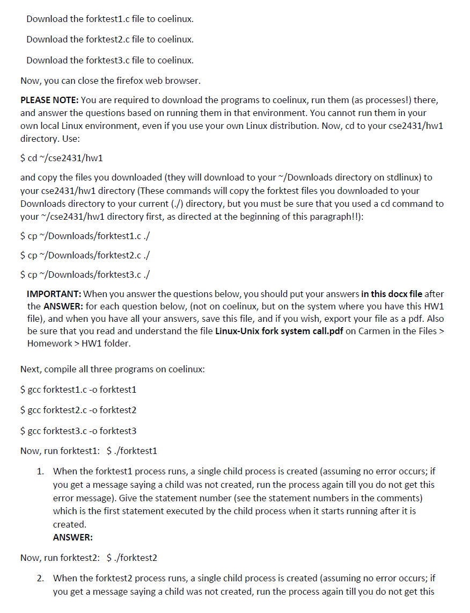

这是作业 HW1 的说明页。我给你把关键点逐条翻成中文并解释一下：

# 截止时间与迟交规则

- **截止**：周日 **9 月 7 日 23:30**（晚上 11:30），提交到 **Carmen**（学校的学习平台）里 **HW 1 的投递箱**（drop box）。
- **宽限期**：有 **30 分钟**宽限，**在 23:59 前提交**都算按时。
- **逾期判定**：**0:00 以后**提交（哪怕只晚 1 分钟）就算**迟交一天**。
- **建议**：别卡点交，最好提前 2–3 小时。说“系统故障、临时出问题”等不被接受为免罚理由。

# 提交格式

- **必须在给你的这份 docx 文件里直接输入答案**（不能手写/拍照）。
- 你可以直接交 **docx**，或**先转成 PDF**再交；然后上传到 Carmen 的 HW1 投递箱。

# 作业目标（本课 CSE 2431）

- 让你理解 Unix/Linux 的 **`fork()` 系统调用**（用来创建新进程）。
- 让你熟悉学院提供的 **CSE Linux/coeLinux 系统** 和 **命令行解释器（shell）**。
- 介绍与**进程分叉**相关的概念与实践。

# 学术诚信/讨论规定

- **不能和其他同学讨论作业内容**；作业必须**独立完成**。
- 可以在 **Piazza** 上提问，但**问题设为私密（private）**，避免公开透露答案思路。
- 具体沟通规范参见课程大纲（Syllabus）。

# 开始做题的环境与步骤（按文档截图给出的部分）

在学校的 **CSE Linux 系统** 上操作：

1. 在你的 home 目录下创建课程与作业文件夹

```bash
mkdir cse2431
cd cse2431
mkdir hw1
```

1. 启动浏览器访问 Carmen 下载素材

```bash
firefox https://carmen.osu.edu/#
```

- 登录后进入 **Files → Homework → HW1 folder for CSE 2431**。
- 从那里下载若干 **C 源码文件**。后续你会根据说明（文档后面部分）**编译生成多个可执行文件**。

> 上面 `$` 是命令提示符，不用输入；真正需要敲的是后面的命令。

# 你需要记住的要点（浓缩版）

- 9/7（周日）**23:30 截止**；**23:59 前**都算按时；**0:00 以后**按**迟一天**计。
- **在提供的作业文件里打字作答**；交 **docx** 或 **PDF** 到 Carmen。
- **独立完成**；Piazza 可提问但**设私密**。
- 在 **CSE Linux** 上建 `cse2431/hw1` 目录 → 用 Firefox 登陆 Carmen → **Files/Homework/HW1** 下载代码 → 按后续说明编译运行。

如果你需要，我可以再给你讲一下 `fork()` 的作用与常见考点，或者把上面的命令整理成一键脚本。



这页是在说“把 3 个 C 程序拉到 **coeLinux** 上编译运行，然后把问题的答案写回到你手里的 **HW1.docx** 文件里”。逐条翻译+解释如下：

# 要下载的文件

- 把 **forktest1.c**、**forktest2.c**、**forktest3.c** 三个源码文件**下载到 coeLinux**（学校提供的 Linux 环境）里。
   下完就可以把 Firefox 关掉。

> 强调：**必须**在 **coeLinux** 上运行与作答用到的程序；**不能**在你自己的本地 Linux 或别的环境里运行这些程序再回答问题。

# 放到指定目录

1. 回到终端，进入你之前建好的作业目录：

```bash
cd ~/cse2431/hw1
```

- `~` 表示你的 home 目录。
- 确认当前路径对了再继续。

1. 把下载的三个文件从下载目录**复制**到当前目录（句末的 `.` 表示“当前目录”）：

```bash
cp ~/Downloads/forktest1.c .
cp ~/Downloads/forktest2.c .
cp ~/Downloads/forktest3.c .
```

> 如果不确定文件是否在这，敲 `ls` 看看有没有这三个 `.c` 文件。

# 在 coeLinux 上编译

分别编译生成三个可执行文件：

```bash
gcc forktest1.c -o forktest1
gcc forktest2.c -o forktest2
gcc forktest3.c -o forktest3
```

- `-o forktest1` 指定输出的可执行文件名。
- 编译有报错要先修正（通常不会有）。

# 在 coeLinux 上运行并回答问题

运行程序要在前面加 `./`：

```bash
./forktest1
```

然后根据程序的输出与源码里的注释回答题目。**答案不要写在 coeLinux 里**，而是**在这份 HW1 的 docx 文件中**，在每个题目后的 **ANSWER:** 下方直接填写。写完可以保存或导出为 PDF 再上传。

另外，平台里 **Files > Homework > HW1** 有一份 **Linux-Unix fork system call.pdf**，要求先读懂它（讲的是 `fork()` 的行为）。

------

## 题目解释与提示

### 题 1（运行 `forktest1`）

> 当 `forktest1` 运行时，会创建**一个**子进程（若你看到“未创建子进程”的提示，说明 `fork()` 失败，**重跑**直到成功）。问：**子进程被创建后，开始运行时执行的第一条语句是哪个**？请给出**语句编号**（源码的注释里标了 Statement 1、2、3…）。

理解要点：

- `fork()` 会复制当前进程，生成一个**子进程**。
- `fork()` 的**返回值**：在**子进程里**是 `0`，在**父进程里**是**子进程的 PID（正数）**，失败则是负数。
- **父子进程都会从 `fork()` 调用返回的地方继续执行**，谁先执行、输出如何交错由操作系统调度决定（顺序**不保证**）。
- 因此，“子进程第一条执行的语句”指的是**在“`fork()` 返回 0 的那条执行路径”里，进入该分支后最先执行的那条带编号的语句**。看源码中对子分支的注释即可定位编号。

把这个编号写到题 1 的 **ANSWER:** 后。

> 这是 **forktest1.c**。
>  题目 1 问：“子进程被创建后，**它开始运行时执行的第一条语句（编号）**是哪一条？”
>
> 答案：**Statement 5（`i = 10;`）**。
>
> 为什么？
>
> - `fork()` 在 **statement 4** 处调用后，产生一个子进程；父、子进程都会**从 `fork()` 返回的地方继续往下执行**。
> - `ret_val` 的值在子进程里为 0，在父进程里为子进程的 pid，但这只影响后面 `if/else` 的分支。
> - 紧跟在 `fork()` 之后、在任何分支判断之前的就是 **statement 5**。因此无论父还是子，返回后首先都会执行 `i = 10;`。
> - 之后才进入 `if (ret_val < 0) … else if (ret_val == 0) … else …`，分别到 **statement 10**（子进程打印）或 **statement 11**（父进程打印）。
>
> 所以，子进程开始运行后执行的第一条语句是 **5**；屏幕上会打印两行（顺序不确定），两行里的 `i` 都是 **10**。

### 题 2（运行 `forktest2`）

> 同样会创建**一个**子进程（若提示未创建就重跑）。根据 `forktest2` 的代码与输出，回答它在题干里提出的问题（截图只到这里，后面文档会给出具体要你填的内容，比如某条语句的执行次数/顺序等）。思路与上题类似：利用 `fork()` 的返回值区分父/子分支，根据源码注释的 **Statement #** 判断。

### 题 3（运行 `forktest3`）

> （虽然本页没显示，但通常 `forktest3` 会涉及多次 `fork()`，因此会产生多个子进程。注意：**输出可能交错**且顺序不可预测，这属于正常现象；按源码里的编号与逻辑回答问题即可。）

------

## 小贴士

- 命令行里出现的 `$` 是提示符，不用输入。
- 运行权限：`gcc` 生成的文件默认可执行；若提示权限问题，可 `chmod +x forktest1` 再运行。
- 检查位置与文件：`pwd` 看自己在哪，`ls -l` 看文件是否在当前目录。
- `fork()` 失败（很少见）通常是资源问题；按要求**重跑**直到不出现错误提示。

如果你愿意，把 `fork()` 的核心规则/常见考点我也可以再给你配一张小速记表，或者根据你拿到的 `forktest*.c` 代码，和你一起逐行推导每个程序会产生多少进程、各语句可能的执行顺序与次数。


这页是在讲 **运行 forktest2、forktest3 并回答第 2～5 题**。我把原文逐条翻译+解释，并给你做题思路（不直接给答案）。

# 运行 forktest2 并回答第 2、3 题

当你运行 `./forktest2` 时，会创建一个子进程（若提示“没创建子进程”，就重跑直到成功）。程序里有一个整型变量 **`num`**，父进程和子进程都会打印它的值。题目要你回答：

1. **两问：**

- **(1) 哪一个进程（父或子）修改了 `num` 的值并打印出“修改后的值”？**
   说明：看代码里 `fork()` 之后的分支（通常用 `if (pid==0)` 表示子进程，`else` 表示父进程），哪一边对 `num` 做了赋值/加减再 `printf`，那一边就是“修改者”。
- **(2) 打印出来的“修改后的值”是多少？**
   说明：从 `num` 的初始值 +（或 −、=）代码中的运算即可算出。

1. **为什么打印“原始值”的那个进程不会打印出“修改后的值”？**

- 正确原因与“按值/按引用传参”**完全无关**。
- 关键点：**`fork()` 之后父子进程拥有各自独立的虚拟地址空间**（最初内容相同，但互不影响）。某个进程对 `num` 的写入只会改**自己的那份副本**；另一个进程仍保留它**原来的副本**，所以还能打印出**原始值**。现代实现里通过 **写时复制（COW, copy-on-write）**来做到这一点。

> 小结：2(1) 指出是父还是子在改值；2(2) 给出具体数字；第 3 题说明“进程间地址空间隔离/写时复制”，因此彼此修改互不影响。

> 很好！基于这份 **forktest2.c**，题目第 2、3 题可以这样回答：
>
> ### 第 2 题
>
> 1. **修改 `num` 并打印出修改后值的是：子进程（ret_val == 0 的分支）。**
>     子进程调用 `functionA(&num)`，在 `functionA` 里执行 `*value += 25;`。
> 2. **它打印的值是：45。**
>     初始 `num=20`，子进程把它加 25 → `45`，于是子进程打印
>     `I called functionA, ... num = 45`
>
> 而父进程走 `else` 分支，调用 `functionB(num)`（按值传参且里面只是 `value += 0;`），对父进程自己的 `num` 没影响，所以父进程打印
>  `I called functionB, ... num = 20`
>
> ### 第 3 题（为什么打印原始值的进程不会打印成修改后的值）
>
> **因为 `fork()` 之后父子进程拥有彼此独立的地址空间。**
>
> - `fork()` 复制了进程的整个内存（实现上是**写时复制 COW**）：父、子一开始看到相同内容，但它们对内存的任何写入都会作用在**各自的副本**上。
> - 所以子进程把自己的 `num` 改成 45，不会影响父进程那份 `num`（仍是 20）；反之亦然。
> - 这与“按值/按引用传参”的区别**无关**；关键在于**进程隔离**与**写时复制**。

# 运行 forktest3 并回答第 4、5 题

`./forktest3` 通常会调用多次 `fork()`，因此会产生**多于 2 个**进程，而且输出行的先后顺序**不保证**。本页要求你做两件事：

1. **数清楚一共创建了多少个进程（包含最初由 shell 启动的“父进程”本身）并写出总数。**

- **不要只数 pid**：因为输出顺序可能交错、pid 也不一定连续；你需要基于**代码结构**来推导。
- **怎么数：**
  - 画“**进程树**”：每遇到一次 `fork()`，当前执行到这行的每个进程**各自**再派生出一个**新子进程**（每次 `fork()` 总是**增加**与“这一刻正在到达该语句的进程数”**相同数量**的新节点）。
  - 若 `if (pid==0)`（只让**子进程**继续 `fork()`）或 `if (pid>0)`（只让**父进程**继续 `fork()`）之类的分支存在，就按分支把能走到下一次 `fork()` 的进程数算清楚。
  - **无条件**连写 n 次 `fork()` 时，总进程数 = `2^n`；但若被条件分支限制，此数会变小——因此你必须按 **代码分支**逐步推导。

1. **用文字解释这些进程的“父–子”关系，并按“代际”给它们编号。**

- 术语：
  - `parent`（父进程，最初由 shell 启动 `forktest3` 的那个）；
  - `child`（父的孩子：第一次 `fork()` 产生的）；
  - `grandchild`（孩子再 `fork()` 产生的“孙子”）；
  - `great-grandchild`（再下一代“曾孙”），以此类推。
- **写法建议：**
  1. 先说明**哪一行/哪个分支**产生了哪一代（例如：“在 L12 的 `fork()`：父产生 child1；在 L20 的分支里，只有子进程继续 `fork()`，于是 child1 产生 grandchild1 …”）。
  2. **统计每一代的数量**：child 有几个、grandchild 有几个、great-grandchild 有几个……
  3. 可以给同一代**编号**（child1、child2…；grandchild1、grandchild2…）。**不要求**给出严格的创建先后顺序，编号只是区分个体。
- 题目给的“示例答案”只是**格式样例**，并非此题的正确结构；你的答案要贴合 `forktest3.c` 的真实分支。

> 太好了，这是 **forktest3.c**。按作业第 4、5 题来分析：
>
> # 先看整体流程
>
> - 程序启动后（由 shell 创建的那个进程记为 **Parent P**），在 `main` 里先做一次 `fork()`（`ret_val0`）。
>   - **子分支**（`ret_val0==0`）：执行 `Code1(); Code1();`
>   - **父分支**（`ret_val0>0`）：执行 `Code2(); Code2();`
> - `Code1` 与 `Code2` 的结构相同：**各自内部再 `fork()` 一次**，而且 **父、子两个分支都会打印并返回**。
>    这意味着：对“当前到达该函数的每一个进程”，调用一次 `CodeX()` 都会再**多出 1 个进程**，并且**两个进程都会继续往下执行调用点之后的代码**（包括后续的第二次 `CodeX()` 调用）。
>
> ------
>
> ## 第 4 题：总共有多少个进程（含最初的 parent）？
>
> 逐步数（用“到达该调用点的进程数 ×2”的思路）：
>
> ### 子分支（`Code1(); Code1();`）
>
> - 进入子分支时：1 个进程（记为 **C0**，它是 P 的**孩子**）。
> - 第一次 `Code1()`：`fork()` → 变成 **2 个**（C0 与 **GC1**；GC1 是 P 的**孙子**）。
> - 第二次 `Code1()`：**这 2 个**进程都调用，再各自 `fork()` → 变成 **4 个**
>   - 新增 **GC2**（C0 的另一个孩子，P 的孙子）
>   - 新增 **GG1**（GC1 的孩子，P 的**曾孙**）
>
> ### 父分支（`Code2(); Code2();`）
>
> - 进入父分支时：1 个进程（仍是 **P**）。
> - 第一次 `Code2()`：`fork()` → **2 个**（P 与 **C1**；C1 是 P 的**孩子**）。
> - 第二次 `Code2()`：这 **2 个**都调用 → **4 个**
>   - P 再 `fork()` 出 **C2**（P 的**孩子**）
>   - **C1** 再 `fork()` 出 **GC3**（P 的**孙子**）
>
> ### 合并两边
>
> - 子分支 4 个 + 父分支 4 个 = **总计 8 个进程**（包含最初的 parent）。
>
> **答案（Q4）：8 个。**
>
> ------
>
> ## 第 5 题：父子关系与各代数量（用文字说明并编号）
>
> 以 P 为根来描述：
>
> 1. **P 的孩子（Children of P）— 共 3 个**
>    - **Child0**：在 `main` 的第一次 `fork()` 产生（`ret_val0==0` 的那一个）。
>    - **Child1**：在 **P** 执行第一次 `Code2()` 时产生。
>    - **Child2**：在 **P** 执行第二次 `Code2()` 时产生。
> 2. **P 的孙子（Grandchildren of P）— 共 3 个**
>    - **Grandchild1**：由 **Child0** 在第一次 `Code1()` 时产生。
>    - **Grandchild2**：由 **Child0** 在第二次 `Code1()` 时产生。
>    - **Grandchild3**：由 **Child1** 在第二次 `Code2()` 时产生。
>       （注意：**Child2** 是在第二次 `Code2()` 的 `fork()` 中才出现，所以它之后**没有**再执行其它 `Code2()` 调用。）
> 3. **P 的曾孙（Great-grandchildren of P）— 共 1 个**
>    - **Great-grandchild1**：由 **Grandchild1** 在第二次 `Code1()` 时产生。
>       （第二次 `Code1()` 是由 **Child0** 和 **Grandchild1** 两个进程各自执行的，所以只会有这一个曾孙。）
>
> > 另一种简洁描述：
> >
> > - 在 `main`：P → `fork()` → 产生 **Child0**。
> > - 子分支：`Code1` ×2 使 **Child0** 派生出 **Grandchild1、Grandchild2**，且 **Grandchild1** 再派生 **Great-grandchild1**。
> > - 父分支：`Code2` ×2 使 **P** 另外派生 **Child1、Child2**，且 **Child1** 再派生 **Grandchild3**。
>
> ### 代际数量汇总
>
> - **Parent**：1（P）
> - **Children**：3（Child0、Child1、Child2）
> - **Grandchildren**：3（Grandchild1、Grandchild2、Grandchild3）
> - **Great-grandchildren**：1（Great-grandchild1）
>
> 这也正是第 4 题“总数 = 1 + 3 + 3 + 1 = 8”的依据。

------

## 通用做题套路（适用于 2～5 题）

1. **读代码 → 标出每个 `fork()` 的行号**，以及该行之前能到达它的**进程数**。
2. **区分分支**：在每个 `fork()` 之后，用 `pid==0`（子）和 `pid>0`（父）把两条路径分开看，写下**谁会继续走到下一个 `fork()`**。
3. **画进程树**：每个到达 `fork()` 的进程都会再长出一个“子节点”。树上的**节点数**就是**总进程数**。
4. **变量打印题**：记住“**进程隔离 + 写时复制**”，因此谁改值只影响自己的打印，不影响对方。
5. **输出顺序别当真**：调度不可预测；你只关心“哪些行一定会被哪些进程执行到、各执行几次”。

如果你把 `forktest2.c`/`forktest3.c` 的代码贴出来，我可以按上面的步骤帮你把每一步的推导过程画成进程树并标明各代和总数。


这页是在做 **第 6～12 题**，考你对 **PID / ps / kill** 和 **系统调用 fork、getpid、getppid** 的理解与实际操作。下面把题目意思、怎么做、以及可直接写进“ANSWER:”处的要点都给你整理好。

------

# 怎么做（在 coeLinux 上）

1. 打开终端，直接看手册：
   - `man ps`、`man kill`
   - 系统调用要看 **第 2 节**手册：`man 2 fork`、`man 2 getpid`、`man 2 getppid`
2. 实操命令：
   - `ps -af`
   - 如想测试 `kill`：先开个前台或后台进程，例如 `sleep 600 &`，再用 `ps` 找到它的 PID，用 `kill PID` 或 `kill -9 PID` 结束它。
3. 把你理解后的结论写回作业 docx 的 **ANSWER** 下面即可。

------

# 可写答案要点（供你参考，用你自己的话表达）

### 6) What is a pid?

**PID（Process ID）** 是操作系统给每个进程分配的**唯一数字标识**，用来区分和管理进程（比如查状态、发送信号等）。

------

### 7) A child process has two pids associated with it. What are they?

一个子进程“关联”的两个 ID 是：

- **它自己的 PID**（`getpid()` 取得）；
- **它父进程的 PID**（**PPID**，`getppid()` 取得）。

------

### 8) `man ps`：What does the `ps` command do?

`ps` 显示**当前系统上的进程信息**（快照），包括 PID、父 PID、终端、启动时间、命令行等。

**8a) `ps -af` 做什么？**

- `-a`：显示**所有与终端相关**的进程（不只当前 shell 的）。
- `-f`：**full format**，全字段输出（常见列：`UID PID PPID C STIME TTY TIME CMD`）。
   所以 `ps -af` = **用完整格式列出所有（有 TTY 的）进程**。

> 注：不同平台 `ps` 细节略有差异，但“`-a` 更广范围、`-f` 全字段”这一点是通用的。

------

### 9) `man kill`：What does `kill` do?

`kill` 向进程**发送信号**（按 PID 定位）。默认是 **SIGTERM(15)**，可指定如 `-9`(SIGKILL) 强制结束、`-STOP` 暂停、`-CONT` 恢复等。

**9a) 用户怎么用它？**

- 结束**卡死/后台失控**的程序；
- 暂停/恢复某个任务；
- 请求程序**优雅退出**（先试 `kill PID`，必要时再 `kill -9 PID`）。

**9b) 它和 `ps` 的关系？**

- 用 `ps` **查 PID**（找目标进程），再用 `kill` **对该 PID 发送信号**。两者配合完成“定位→操作”。

------

### 10) fork（用 1～2 句话）

`fork()` 通过**复制当前进程**创建一个**子进程**。它在父进程中返回**子进程的 PID**，在子进程中返回 **0**，失败返回负值；父子随后从 `fork()` 之后的同一位置继续执行，但**地址空间彼此独立**（写时复制）。

### 11) getpid（1～2 句话）

`getpid()` 返回**调用进程本身**的 PID，用来标识自己。

### 12) getppid（1～2 句话）

`getppid()` 返回**调用进程的父进程**的 PID（PPID），可用来知道自己由谁创建/归属哪个父进程。

------

## 小提示

- Shell 里查看当前 shell 的 PID：`echo $$`。
- 观察父子关系：运行你写的程序里 `printf("pid=%d ppid=%d\n", getpid(), getppid());`。
- 结束自己刚开的测试进程时，先试 `kill PID`（给 SIGTERM），不行再 `kill -9 PID`（不可被捕获/阻塞的强制杀死）。

这样写就能把 6～12 题完整搞定了。需要我把这些要点润色成你作业里更“口语化”的答案版本吗？


这段话是在说**如何提交作业**和**迟交扣分规则**。翻译＋解释如下：

1. **怎么交：**

- 直接在这份 **HW1 的 docx 文件**里把每题答案打在 “**ANSWER:**” 后面。
- 保存这份文件；如果你愿意，可以**导出成 PDF**（可选）。
- 到 **Carmen → HW 1 drop box**（作业投递箱）在**截止时间前**上传。

1. **迟交政策：**

- 到期后 **24 小时内** 交：整份作业**扣 25%**（以总分计）。
- **超过 24 小时**：**不再接收**（除非你在截止前就已拿到老师批准的延期）。

1. **结合前面页的时间细节（举例）：**

- 截止：**周日 23:30**。
- 有 **30 分钟宽限**：**23:30–23:59** 都算**按时**。
- **0:00 以后**算**迟一天**，但只要在**周一 23:30 前**提交，仍会收，但**扣 25%**。
- **周一 23:30 之后**不收（除非提前获批延期）。

> 一句话总结：把答案写在这份文档里 → 保存（可选转 PDF）→ 按时上传到 Carmen。迟 24 小时内扣 25%，超过 24 小时不收，除非事先获批延期。


这是老师给的 **Unix/Linux `fork()` 速记**。我把每条翻成中文并补上要点，读完你就能解释清楚 `fork()` 发生了什么。

# 总览

1. **创建进程**要用 **`fork()`**（一次系统调用）。调用它的进程叫**父进程**，新建出来的叫**子进程**。
2. 调用 `fork()` 之后会发生：

a) **父进程向内核请求**创建一个**新的进程（子进程）**。只要不报错，就会成功创建。

b) `fork()` 的**返回值**用来区分父/子：

- **错误**：返回 **-1**（只返回给父进程；子进程根本没创建）。
- **成功**：
  - **在父进程里**：返回“**子进程的 PID**”。
  - **在子进程里**：返回 **0**（注意：**0 不是任何进程的 PID**，只是一个标记“我是在子进程里”）。

c) 因为返回值不同，程序常写成：

```c
pid_t rv = fork();
if (rv < 0) { /* 错误处理 */ }
else if (rv == 0) { /* 子进程走这里 */ }
else { /* 父进程走这里；rv 是子进程的 PID */ }
```

父与子都会**从 `fork()` 返回处继续执行**，只是走不同分支。

d) **子进程得到自己的 PID**（由内核分配）。它通常比父进程大，但**不保证是父 PID+1**；取决于系统中其它 `fork()` 发生的时机、PID 分配策略等。再次强调：**子进程里 `fork()` 的返回值 0 并不是它的 PID**。真要拿到自己的 PID，要调用 `getpid()`。

e) 子进程拥有**独立的地址空间**（自己的内存）。**起始内容是父进程内存的拷贝**（代码段与数据段都一样），之后互不影响。

f) Linux 用 **写时复制（Copy-On-Write, COW）\**实现这份“拷贝”：父子一开始\**共享**物理页；谁第一次**写**到某页时，内核才给它**复制**那一页。这样 `fork()` 很**高效**。

g) 创建子进程时，内核还会为它建立 **进程控制块（PCB）**，内含管理该进程所需的信息（如 **PID、PPID、状态、内存/打开文件等元数据**）。

------

## 常见易错点（帮你记）

- `fork()` **不会**把程序从头再执行一遍；父子都从 **`fork()` 下一行**继续。
- **`rv==0` 仅表示“我在子进程里”**；**PID 要用 `getpid()`**。父进程拿到的返回值才是“子进程的 PID”。
- 多次 `fork()` 时，“**到达该 `fork()` 的每个进程**”都会再生一个子进程；若没有分支限制，`n` 次 `fork()` 会产生 `2^n` 个进程（含父）。
- 父子进程的内存互不影响；子改变量，不会改到父（COW 机制）。


这页是在解释 `fork()` 发生时**寄存器、指令位置（PC）、exec 覆盖、以及栈**等更底层的细节。逐条翻译+要点：

h) **子进程也会得到父进程寄存器的拷贝**

- 包括 **PC**（指令计数器，x86-64 上叫 **RIP**）、**PSR**（程序状态寄存器）、**rax/rbx/...** 等。
- 但内核会改写**返回值寄存器 rax**：
  - **父进程**的 rax 被写成**子进程的 PID**；
  - **子进程**的 rax 被写成 **0**。
     这就是 `fork()` 在父/子里返回不同值的根本原因。

i) **子进程随后可以把自己的地址空间“换成另一个程序”**

- 通过 **exec()** 家族（如 `execvp()`）系统调用，把当前进程映像覆盖成新的可执行文件。
- 典型用法：`fork()` 产生子 → 子进程 `exec()` 去执行外部命令。

j) **务必注意：父子都从“fork 的下一条指令”开始执行**

- 父进程执行到 `fork` 这一条**系统调用指令**时，**PC 已经指向下一条**；系统只在父里真正执行一次 `fork`。
- 内核在创建子进程时，也把**子进程的 PC 设置为“fork 之后的下一条指令”**，并把 rax=0。
- 因而**子进程不会再次执行 `fork` 指令本身**；它和父一样，从 `fork()` 调用返回处往下跑。
   这正是你在 forktest1 里看到“子进程第一条执行的是 `fork()` 后紧跟的语句”的原因。

k) **栈也会被复制（写时复制），所以调用链一致**

- 子进程得到父进程地址空间的拷贝，**包括栈**。
- 如果父进程是在某个函数里调用 `fork()` 的，**父子都会拥有同样的栈帧**：等当前函数执行结束时，**父子都会返回到调用该函数的地方**。
- 注意它们的栈帧最初内容相同，但随后各自修改互不影响（COW 机制）。

> 小结
>
> - `fork()` 后：**父 rax=子PID，子 rax=0；父子 PC=“fork 下一条”**。
> - 子进程常用 **exec()** 覆盖自己去运行新程序。
> - **栈/寄存器/打开的文件描述符**等初始都被复制（或共享+写时复制），之后各自独立。