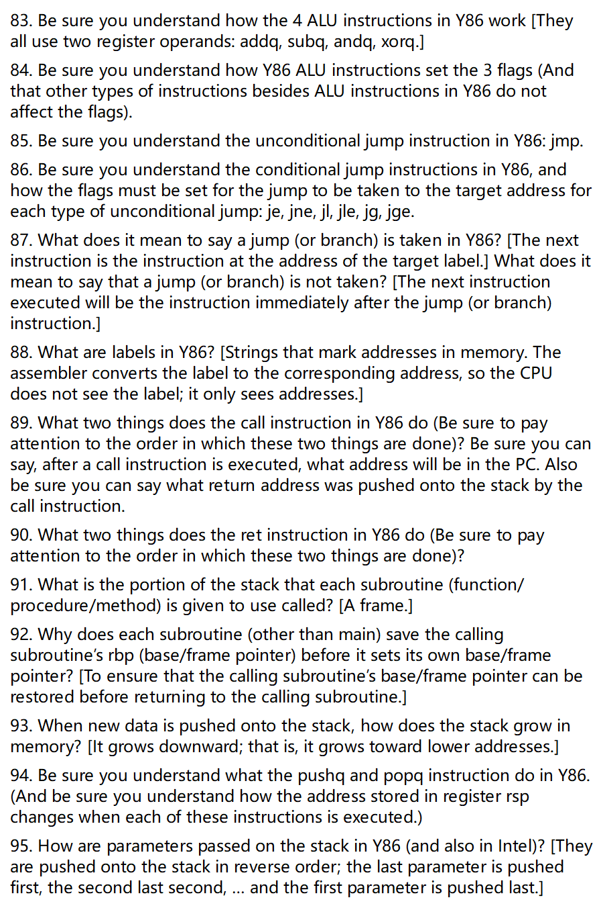
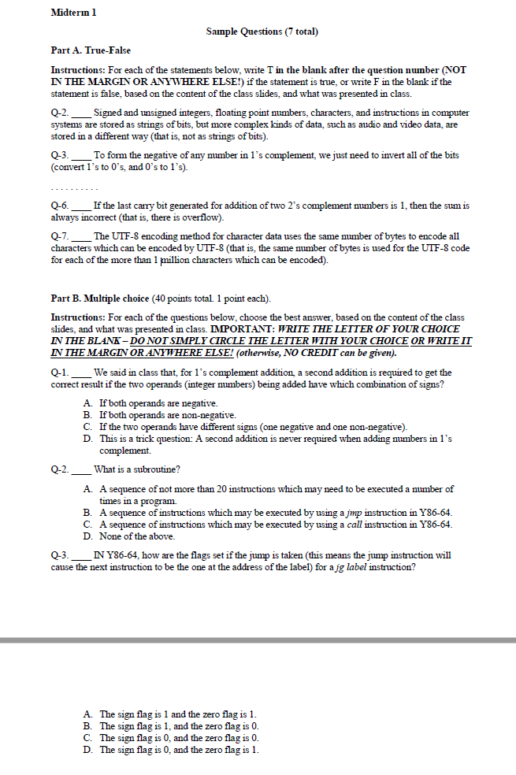

------

非常好 👍 你要在 **1 小时内带学生过完重点内容**，目标是——
 ✅ 让学生理解并能做判断/选择题（不讲推导、不做代码练习）。
 ✅ 覆盖 Midterm 范围：**A-1 ~ A-6 + Key Points**。
 ✅ 省略：细节代码演示、模拟器操作、ALU内部原理。

下面是为你设计的 **“1小时重点讲解路线 + 页码表”**。
 我精确标出了你该讲的文件与页码，以及每页应讲的重点。
 全程控制在约 **55 分钟 + 5 分钟问答**。

------

# 🕐 一小时期中复习讲解路线

| 顺序  | 时间      | 文件                                          | 页码范围                | 要讲内容                                                     | 说明                                                         |
| ----- | --------- | --------------------------------------------- | ----------------------- | ------------------------------------------------------------ | ------------------------------------------------------------ |
| **1** | 0–10 min  | 📘 **A-3.pptx**                                | **3–14页**              | **CPU与汇编基础**• CPU三部分：寄存器 / ALU / 控制单元• PC、IR 的作用• 指令四类：数据、ALU、控制流、I/O• 汇编语言与机器语言关系（一条指令对应一条机器码）• RISC vs CISC（Intel vs ARM）• 状态标志（S、Z、C、O） | 这部分是所有题的逻辑起点。讲清什么是CPU、指令、汇编。        |
| **2** | 10–25 min | 📘 **A-4 - Y86 Assembly Language Part A.pptx** | **1–12页**              | **Y86体系与基本概念**• Y86是什么、ISA概念• 程序可见状态：15寄存器 + 3标志 + PC + 状态字节• 无CF（只做有符号运算）• AOK、HLT、ADR、INS四种状态码• 汇编指令的组成与功能• `yas`, `yis`, `ssim` 是模拟器工具（知道作用即可） | 用3个问题讲：Y86是谁？能干啥？和Intel关系？（简化版x86）     |
| **3** | 25–35 min | 📘 **A-5 - Y86 Assembly Language Part B.pptx** | **4–24页**              | **Y86指令分类与Flags逻辑**• 三类指令：数据/ALU/控制流• 重点讲：`irmovq`、`rmmovq`、`mrmovq`、`addq`、`subq`• Flags：ZF、SF、OF• 条件跳转（je, jne, jl, jle, jg, jge）表格• 栈：pushq/popq/call/ret 操作顺序• 栈向下增长、参数压栈顺序 | 这是**选择题高频区**。重点是flag与跳转条件。                 |
| **4** | 35–45 min | 📘 **A-6.pptx**                                | **1–22页**              | **逻辑与电路基础**• 布尔代数逻辑：AND/OR/NOT（真值表）• 扩展门：XOR、NAND、NOR（通用门）• 组合 vs 时序电路• 半加器、全加器概念• 译码器（Decoder）、多路选择器（Multiplexer）区别• D触发器是存储器的基本单元 | 建议边讲边画逻辑符号。学生记忆用关键字：NAND万能、D触发器存储。 |
| **5** | 45–50 min | 📘 **CSE 3430 Part A Key Points.docx**         | **第4页起（Q63–Q122）** | **考试范围快速对照**• Q63–96：Y86相关题型（指令、Flags、跳转）• Q97–122：逻辑电路与布尔代数题型 | 用5分钟“对题速讲”，强调“这些题几乎就是原题”。                |
| **6** | 50–55 min | 📘 **Class 3–8.docx系列**                      | 只看各文件开头一页      | **重点概念复述**：• Class 3–4：CPU与汇编• Class 5–6：Y86汇编• Class 7–8：逻辑电路→ 作为小结复述（不展开） | 这些是讲义文字版，可以用来做口头问答复盘。                   |
| **7** | 55–60 min | 💬 Q&A + 快速测验                              | —                       | 3道判断 + 2道选择练习（可口头问）如：① Y86 有 CF 吗？❌② UTF-8 是定长吗？❌③ jg 条件？SF=0 且 ZF=0 ✅④ D触发器能存几位？1 ✅⑤ Two’s complement 取负方式？取反 +1 ✅ | 强化记忆、巩固核心考点。                                     |

------

## 🔑 补充建议（让你更高效讲）

- **A-1 ~ A-2**（数据与编码）可以完全略讲或口头一句带过：
   → “所有数据都是bit string；浮点是IEEE754，UTF-8是可变长度。”
   → 这部分判断题占比小，最多1–2题。
- **A-7及A-7 Notes 不用讲**：属于期中之后内容（缓存与流水线）。
- **讲法建议：**
  - 每个 slide 只讲定义 + 例子 + 真伪判断。
  - 用 Key Points 做“题式复述”，不要解释底层原理。
  - 重点提问学生：“True 还是 False？为什么？”让他们参与。

------

## 📘 讲解顺序（推荐）

> A-3 ➜ A-4 ➜ A-5 ➜ A-6 ➜ Key Points ➜ 快问快答

------

下面把 **Slide set A-1 的第 1–17 题**逐题讲清楚（含定义、要点、常见陷阱、必要的小例子）。你可以直接照着讲。

------

## 1) 计算机的主要组成（main components）

- **CPU（处理器）**：执行指令；内部含 **寄存器、ALU、控制单元**。
- **主存（内存、RAM）**：存放正在运行的程序与数据。
- **I/O 子系统**：键盘、显示器、网卡、磁盘等与外界交互。

> 有时也把**持久化存储**（SSD/HDD）单独提出，但期中常用“CPU+内存+I/O”。

------

## 2) 计算机中最小的存储单位

- **比特（bit）**，只有两种状态：0 或 1。

------

## 3) 什么是 bit 串（bit string）

- **由 0/1 组成的有限序列**，如 `10110010`。
- 一切信息（数、字符、指令、音视频编码）最终都用 bit 串表示。

------

## 4) 哪些数据以 bit 串形式存储

- **整数**（无符号/有符号）、**浮点数**（IEEE 754）、**字符**（ASCII/UTF-8）、**字符串**、**指令**（机器码）、**各类媒体数据**（编码后）。

> 关键句：**在计算机里，一切皆 bit 串**。

------

## 5) 指令是否也以 bit 串存储

- **是**。机器指令就是 **固定规则编码的 bit 串**，CPU 取出后解码执行。

------

## 6) n 位 bit 串可编码的不同取值个数

- **2n2^n** 种不同模式（从全 0 到全 1）。

------

## 7) 内存是如何组织的

- **按字节（byte）组成的一维数组**，地址是数组下标，从 0 开始。
- “地址”= 该字节在内存数组里的索引。

------

## 8) 什么是“字（word）”？多大

- **word**：体系结构的“自然数据宽度”。
- 常见：32 位机的 word=4 字节；64 位机的 word=8 字节（与寄存器宽度匹配）。

------

## 9) 各系统的 word 大小是否统一

- **不统一**。不同体系结构的 word 大小可能不同（32b/64b）。

------

## 10) 什么是字节（byte）

- **1 byte = 8 bits**（现代通行标准）。

------

## 11) byte 的定义是否是“通用/统一”的

- **在现代计算机中是统一的：8 位**。
- 历史上曾出现过其他宽度，但**考试按 1 字节=8 位**理解。

------

## 12) 无符号整数的编码方式（B2U），是否通用

- **B2U（Binary-to-Unsigned）**：把 n 位二进制按 **0…2n ⁣− ⁣12^n\!-\!1** 来解释。
- **是通用做法**：硬件/语言中无符号整型基本都按 B2U 理解。

------

## 13) n 位 B2U 的取值范围（公式）

- **范围：** 0  到  2n−10 \;\text{到}\; 2^n-1。
- 例：n=8 → 0…255；n=32 → 0…232−12^{32}-1。

------

## 14) 三种有符号整数编码（会分别叫法）

- **B2S**：**符号-数值**（Sign-Magnitude），最高位为符号，其余为幅值。
- **B2O**：**一补码**（One’s Complement），**负数=按位取反**。有 +0 和 −0。
- **B2T**：**二补码**（Two’s Complement），**负数=按位取反+1**，现代硬件通用。

------

## 15) 3 位时，给出 B2S/B2O/B2T 的取值（能正负都判）

> 3 位示例，最高位为符号位（记 `b2 b1 b0`）：

### （1）B2T（二补码，范围 −4…+3）

| 比特 | 值   | 比特 | 值   |
| ---- | ---- | ---- | ---- |
| 000  | 0    | 100  | −4   |
| 001  | 1    | 101  | −3   |
| 010  | 2    | 110  | −2   |
| 011  | 3    | 111  | −1   |

判读口诀：**若 MSB=1，为负：值 = −(2^{n−1}) + 其余位值**。

### （2）B2O（一补码，+0/−0 并存，范围 −3…+3）

- 正数：MSB=0，与无符号相同：`000=+0,001=+1,010=+2,011=+3`
- 负数：**按位取反**：
   `110=−1, 101=−2, 100=−3, 111=−0（等价于0）`

### （3）B2S（符号-数值，+0/−0 并存，范围 −3…+3）

- MSB=0：`000=+0,001=+1,010=+2,011=+3`
- MSB=1：幅值取低两位：`100=−0,101=−1,110=−2,111=−3`

> **易错点**：B2O 与 B2S 都会出现 **+0/−0** 两种编码；B2T 不会。

------

## 16) n 位 B2T（二补码）可编码范围（公式）

- **范围：** −2 n−1  到  2 n−1−1-2^{\,n-1} \;\text{到}\; 2^{\,n-1}-1。
- 例：n=8 → −128…+127；n=64 → −2632^{63}…+263−12^{63}-1。

------

## 17) 会做 n=4 的 B2U 无符号加法并判断溢出；CPU 怎么判

### 17.1 概念

- **B2U 无符号**：范围 0…2n−10…2^n-1。
- **溢出（overflow）**：真值和 ≥ 2n2^n 时**超出可表示范围**。
- **硬件判定**：用 n+1 位加法器计算；**最高位之外的 “最终进位 Cout”=1** 表示溢出。
  - **结论**：**无符号溢出 ⇔ 最终进位 Cout=1**（Carry Flag=1）。

### 17.2 操作步骤（n=4）

1. **写成 4 位二进制**（不足补 0）。
2. **逐位相加**（从低到高），记录每位和与进位。
3. **看最终进位 Cout**：Cout=1 ⇒ 溢出；Cout=0 ⇒ 不溢出。

> 结果寄存器只保留低 4 位（相当于模 16）。

### 17.3 例题

- **9 + 7**：`1001 + 0111 = 1 0000`
  - 保留低 4 位：`0000`，**Cout=1 ⇒ 溢出**（实际和=16）。
- **6 + 5**：`0110 + 0101 = 1011`
  - **Cout=0 ⇒ 不溢出**（结果=11）。
- **15 + 1**：`1111 + 0001 = 1 0000`
  - **Cout=1 ⇒ 溢出**（极值回卷）。

### 17.4 易混对比（考点）

- **无符号（B2U）**：**看最终进位 Cout（CF）**。
- **有符号（B2T）**：**不看 Cout**，看“**进入 MSB 的进位** 与 **MSB 产生的进位** 是否不同”（两者异或=1 ⇒ 溢出）。

------

# 一句话小抄（课堂快速提示）

- 一切皆 bit 串；字节=8位；word 与体系结构相关。
- B2U 范围：0…2n ⁣− ⁣12^n\!-\!1；B2T 范围：−2n−1-2^{n-1}…2n−1 ⁣− ⁣12^{n-1}\!-\!1。
- B2S/B2O 有 +0/−0；B2T 没有。
- B2U 溢出看 **最终进位 Cout**；B2T 溢出看 **两进位是否不同**。
- 记住 3 位表格（尤其 B2T：100=−4, 111=−1）。

需要的话，我可以把 **Q1–Q17 做成一页“打印版口袋卡”**（极简关键词 + 例子 + 易错点），你带着课上就行。

下面把 **第 18–30 题**逐题用最考点化的方式讲清楚（含定义、口诀、例子与易错点）。你可以直接照着讲。

------

## 18) What bit value is used as the first carry to add two B2U numbers?

**答案**：**0**。
 **解释**：做二进制加法时，最低位（LSB）的**初始进位 Cin** 设为 0，这是无符号/有符号加法的统一起点。

------

## 19) B2T（二补码，有符号）加法与溢出判定；B2O 是否同法？

**怎么加**：和普通二进制加法一样，从 LSB 开始逐位相加，**初始 Cin=0**，得到 n 位结果与“每一位的进位链”。
 **B2T 溢出判定（两种等价说法）**

- **硬件法**：看**进入最高位的进位**（C_in_MSB）与**最高位产生的进位**（C_out_MSB）是否不同：
   **O = C_in_MSB ⊕ C_out_MSB**。不同 ⇒ 溢出。
- **符号法**：**同号相加却得到异号结果** ⇒ 溢出（正+正出负，负+负出正）。

**4 位例子（−8…+7）**

- 0101(+5) + 0100(+4) = 1001(−7) → **同号得异号**；
   逐位算得 C_in_MSB=1、C_out_MSB=0 → **异** → 溢出。
- 1011(−5) + 1100(−4) = 0111(+7) → 同号得异号；C_in_MSB≠C_out_MSB → 溢出。

**B2O（一补码）能否用“比较最后两次进位”的方法？**
 **可以**：B2O 的“溢出标志”同样用 **C_in_MSB ⊕ C_out_MSB**。
 但注意：**B2O 的求和本身还要处理“回卷进位”（end-around carry）**（见第 22 题）。

------

## 20) Two’s complement（B2T）如何取负？

**口诀**：**按位取反 + 1**（对 n 位宽度）。
 例：`0011`(+3) → 取反 `1100` → +1 = `1101`(−3)。

------

## 21) One’s complement（B2O）如何取负？

**口诀**：**按位取反**（没有 +1 这步）。
 **易错**：B2O 有 **+0/−0 两种编码**（例如 0000 与 1111 都表示 0）。

------

## 22) B2O 加法在“异号相加”时硬件要“不同处理”的是什么？

**答案（课上原话）**：做完第一次 n 位加法后，**若最高位产生了进位 Cout=1，就把这个进位“回卷”加回到最低位**（**再做一次加法 +1**）。
 这叫 **end-around carry** 或 “第二次加法”。这是 B2O 与 B2T 的**核心差异**。

------

## 23) 现代硬件通用哪种有符号编码？为什么？

**答案**：**B2T（二补码）**。
 **原因**（背诵点）：

1. **只有一个零**（无 +0/−0 二义性）；
2. **加/减统一用同一加法器完成**（A−B = A + (−B)），硬件简单；
3. **溢出判定简单**（XOR 两个最高位进位）；
4. 性能与实现成本更优、是工业标准。

------

## 24) CPU 怎样比较“最后两次进位”判溢出（B2T/B2O）？用什么门？

**答案**：**用 XOR 门** 比较**进入最高位的进位**与**最高位产生的进位**：
 **O = C_in_MSB ⊕ C_out_MSB**，输出为 1 ⇒ 溢出。
 **说明**：B2T 与 B2O 的溢出标志都可以这样产生；B2O 另有回卷进位的求和流程（第 22 题）。

------

## 25) 如何用“取反 + 首进位为 1”的办法做 B2T 减法？

**公式**：**A − B = A + ( ~B + 1 )**（n 位宽度内）。
 **步骤**：

1. 取被减数 A 原码；
2. 将减数 B **按位取反**得 ~B；
3. 设定初始进位 Cin=1（等价于 ~B + 1）；
4. 做 n 位加法，判溢出用 XOR 两进位。

**4 位例**：`2 − 7`

- A=0010，B=0111；~B=1000；~B+1=1001；
- 0010 + 1001 = **1011**（−5）✅（范围 −8…+7）。

------

## 26) IEEE 754 单精度（32 位）编码怎么工作？

**位划分**：共 32 位

- **符号位 s**：1 位（最高位）
- **指数域 e**：8 位（偏置 **bias=127**）
- **小数域 f**：23 位（尾数的**小数部分**）

**归一化数（normalized）**（最常见，e∈[1,254]）：

- **真实指数 E = e − 127**
- **有效数 M = 1.f**（隐含的前导 1）
- **数值 V = (−1)^s × M × 2^E**

**特殊情况（知道即可）**：

- **e=0, f≠0**：**非归一化（subnormal）**，M=0.f，E=1−127=−126
- **e=0, f=0**：±0
- **e=255, f=0**：±∞
- **e=255, f≠0**：NaN

------

## 27) 将单精度编码（已知是“归一化数”）转成十进制的四步

1. 读出 **s, e, f**。
2. 算 **E = e − 127**。
3. 算 **M = 1.f**（把 23 位小数按二进制权 2⁻¹,2⁻²,…相加）。
4. **V = (−1)^s × M × 2^E**。

> 例（简单演示）：s=0，e=127（E=0），f=0100…0 ⇒ M=1+2⁻²=1.25 ⇒ V=1.25。

------

## 28) 若“真实指数 E 为负”，表示什么样的值？

**答案**：**绝对值小于 1 的小数**（|V|<1）。

- s=0 ⇒ 介于 0 与 1；s=1 ⇒ 介于 −1 与 0。

------

## 29) 32 位 IEEE 754 为了获得“超大数值范围”的权衡是什么？

**答案**：**更大的范围（动态范围）换来更低的精度**。

- 单精度只有 **约 24 位二进制有效位**（含隐藏的 1），对应 **≈7 位十进制有效数字**；因此会有舍入误差。

------

## 30) 为什么很多 IEEE 754 值只是近似？哪些值能被“精确”编码？

**原因**：有限位宽的二进制**不能精确表示大多数十进制分数**（例如 0.1、0.2 需要无限二进制小数），只能**舍入近似**。
 **能被精确表示的数**（在“位数足够”的前提下）：

- **形如 k / 2ⁿ 的有理数**（二进制有限小数，亦称 **dyadic rationals**），例如 1/2、1/4、3/8 等；
- **整数**在不超过有效位精度上限时也能精确表示（单精度能精确表示到 **2²⁴** 以内的全部整数）。

------

### 小结口令卡

- **B2U**：初始进位 0；**溢出看最终 Cout（CF）**。
- **B2T**：溢出看 **C_in_MSB ⊕ C_out_MSB**；**取负=取反+1**；**减法=A+(~B+1)**。
- **B2O**：取负=取反；**异号相加需回卷进位**；溢出同样用 **XOR 两进位**。
- **IEEE754 单精度**：1|8|23；**E=e−127，M=1.f，V=(−1)^s·M·2^E**；E<0 ⇒ |V|<1；范围↔精度权衡；**k/2ⁿ 精确，其它近似**。

下面把 **第 31–47 题**逐题讲清楚（按考试要点 + 课堂表述）。你可直接照着讲或剪成讲义。

------

## 31) ASCII 能编码哪些字符？每个字符用几位？MSB 是什么？

- **范围**：标准 ASCII 编 128 个字符（0–127）。
  - 0–31：**控制字符**（如换行、回车、响铃等），127 是 DEL。
  - 32–126：**可打印字符**（空格、标点、数字 0–9、大小写 A–Z/a–z 等）。
- **位数**：每个字符 **7 位** 编码（现代存储常放在 1 字节中）。
- **MSB（最高位）**：标准 ASCII 的最高位 **为 0**；历史/链路中常把第 8 位用作**奇偶校验位**（见 Q34）。

------

## 32) UTF-8 基本原理。是否定长？每个字符占多少字节？

- **UTF-8 是可变长度编码**，**不是定长**。
- **每个字符占 1–4 字节**：
  - 1 字节：`0xxxxxxx`（与 ASCII 兼容）
  - 2 字节：`110xxxxx 10xxxxxx`
  - 3 字节：`1110xxxx 10xxxxxx 10xxxxxx`
  - 4 字节：`11110xxx 10xxxxxx 10xxxxxx 10xxxxxx`
- **特性**：自同步（从任意字节边界都能重新找到字符边界），向后兼容 ASCII。

------

## 33) UTF-8 里并非所有位都用于“识别字符”，剩下的位干嘛？

- **用途**：**结构标记位**，用于
  1. **指示该字符总长度**（首字节前缀 0/110/1110/11110）；
  2. **标记续字节**（所有续字节都以 `10` 开头）。
- 这些前缀位/标记位本身**不属于码点 payload**，是**同步与合法性检查**的结构信息。

------

## 34) 如何用 1 字节 ASCII 的奇偶校验 + MSB 进行差错检测？

- **发送端**：对 7 位 ASCII 数据位（bit6..bit0）计算**奇偶校验**（偶校验或奇校验），把**MSB（bit7）设为校验位**。
- **接收端**：收到 8 位后，重新计算 7 位数据的奇偶性并与 MSB 对比：
  - **匹配** → 认为无错；
  - **不匹配** → 检出**单比特**错误（注意：不能纠正，只能检测；多比特错误可能漏检）。

> 注：现代网络还有更强的 CRC/校验和；此处是**链路级**的简单检测思想。

------

## 35) CPU 能否“看着一串比特”就知道它表示什么数据类型？

- **不能**。
- **位串没有“自带类型”**。它是整数/浮点/字符/指令，取决于**上下文与执行的指令**。语言/协议可能附带类型标签，但**原始硬件只看到 0/1**。

------

## 36) 内存如何组织？

- **按字节（byte）组成的一维数组**；地址是从 **0** 开始的数组下标（**字节地址**）。

------

## 37) 现代系统地址大小（多少位）？

- **主流 64 位体系**：地址宽度**64 位**（虚拟地址有效位可能少于 64，但抽象为 64 位）。
- 历史上常见 32 位；考试按“现代系统 64 位”为主记忆。

------

## 38) 字对齐（word-aligned）访问 vs 非对齐（unaligned）访问？

- **字对齐访问**：多字节数据的起始地址是 **word 大小的整数倍**（如 8 字节 word 时地址 % 8 == 0）。
- **非对齐访问**：起始地址不是 word 的整数倍。
- **区别**：
  - 对齐访问通常**更快**（一次总线/缓存行就搞定）。
  - 非对齐访问可能需要**多次内存周期/硬件拼接**，甚至在某些架构上**触发异常**。

------

## 39) 是否所有系统都要求字对齐访问？

- **不是**。
  - 许多 **RISC** 架构**强制对齐**（非对齐会陷阱/异常）；
  - **x86** 允许非对齐访问，但可能**有性能损失**。

> 结论：**不**是所有系统都要求。

------

## 40) CPU 的子部件？

- **寄存器（通用/专用）**、**算术逻辑单元（ALU）**、**控制单元（Control）**。
- 专用寄存器例：**PC（程序计数器）**、**IR（指令寄存器）**、**PSR（状态/标志寄存器）**等。

------

## 41) 所有 CPU 都有的 4 类指令？

1. **数据传送**（寄存器↔内存、寄存器↔寄存器等）
2. **算术/逻辑（ALU）**（加减与/或/异或/取反等）
3. **程序控制**（无条件/条件跳转、调用/返回等）
4. **输入/输出（I/O）**（设备↔内存 / 内存↔设备）

------

## 42) 描述一次内存读/写是如何完成的

- **读（load/fetch）**：
  1. CPU 把目标地址送上地址线/写入 **MAR**；
  2. 置 **读使能**；
  3. 内存按地址**译码**读出数据，送回数据线/**MDR**；
  4. CPU 从 MDR 取数据写入寄存器/IR（若是取指）。
- **写（store）**：
  1. CPU 把目标地址送 MAR；
  2. 要写的数据放入 MDR；
  3. 置 **写使能**；
  4. 内存把 MDR 的值写入该地址。

> 本质：**地址 + 控制信号 + 数据总线** 的时序配合。

------

## 43) 执行中那条指令的**地址**在哪个寄存器？

- **PC（Program Counter，程序计数器）**。

------

## 44) 当前被执行的**指令本体（位串）**在哪个寄存器？

- **IR（Instruction Register，指令寄存器）**。

------

## 45) 把汇编语言转为机器语言的程序叫什么？

- **Assembler（汇编器）**。

------

## 46) RISC vs CISC 的根本区别（课堂版要点）

- **RISC**：
  - **定长指令**（常 1 个字），**Load/Store 架构**（ALU 只对寄存器）；
  - 指令简单、种类少，**多条指令**完成复杂操作；
  - 易流水线，硬件简单、功耗低。
- **CISC**：
  - **变长指令**，ALU 可直接用**内存操作数**；
  - 指令复杂、功能强，**一条指令**可做很多事；
  - 编程简便，但硬件实现更复杂。

> 课堂例：**RISC 不能有 `add 100,200`（内存-内存加法）**；CISC 可以有更复杂寻址/指令形态。

------

## 47) Intel 属于哪类？ARM / Mac M1/M2/M3 属于哪类？

- **Intel x86/x86-64 → CISC**。
- **ARM（含 Apple M1/M2/M3/M4）→ RISC（或 RISC 风格）**。

> Apple Silicon 基于 ARM 指令集，典型 RISC 设计理念（高能效）。

------

### 课堂速记卡（可抄板）

- **ASCII**：7 位；MSB=0；可打印 + 控制；第 8 位可作奇偶校验。
- **UTF-8**：1–4 字节；首字节长度前缀；续字节 `10` 开头；自同步。
- **类型不可见**：CPU 看不到“类型”，全靠指令/上下文解释位串。
- **内存**：字节数组，地址从 0；现代 64 位地址。
- **对齐**：对齐快/安全；非对齐有罚时/可能异常；并非所有系统都强制。
- **CPU 三件套**：寄存器、ALU、控制；PC/IR/PSR 要认识。
- **四类指令**：数据/ALU/控制/I-O。
- **RISC vs CISC**：定长+Load/Store vs 变长+内存操作数；ARM/M 系 → RISC；Intel → CISC。

下面把 **第 48–65 题**逐题讲清楚（给出直接答案 + 必要解释/例子）。你可直接照着讲。

------

## 48) Which of the two types of processor architectures is called load/store?

**答案：RISC。**
 **解释**：RISC（精简指令集）架构采用 **Load/Store** 设计——**只有**`load/store`指令能访问内存，所有 ALU 运算都在寄存器之间完成。CISC 可让某些指令直接用内存操作数。

------

## 49) 高级语言一条语句通常对应多少条汇编指令？

**答案：多于一条（通常是若干条到数十条）。**
 **解释**：高级语言语义丰富；编译后需要多条机器/汇编指令来完成加载、计算、分支、存储等步骤。

------

## 50) 什么时候可以把 PC 加到“下一条指令”的地址？

**答案：在**把当前指令的地址**送到内存**以取指（fetch）**之后**。
 **解释**：取指时，CPU 用 PC 发出地址去读指令位串；**地址一经发出**（或指令进入 IR 后），控制逻辑才把 PC 更新为“下一条”的地址（或按指令长度递增）。

------

## 51) 用哪类指令实现 if/else 或循环？

**答案：分支/跳转（Branch/Jump）指令。**
 **解释**：无条件跳转 `jmp`；条件跳转 `je/jne/jg/jl/...` 依赖标志位，实现 if/else、while/for 等控制流。

------

## 52) 什么是 Processor Status Register（PSR）？

**答案**：保存**最近一次 ALU 运算结果状态**的专用寄存器（**条件码/标志位**所在）。
 **作用**：为条件跳转、异常处理等提供依据。

------

## 53) 课堂覆盖的四个标志位是哪些？

**答案：S（Sign）、Z（Zero）、C（Carry）、O（Overflow）。**
 **备注**：在 Y86 里只有 **ZF/SF/OF**（**没有 CF**），但在 A-3 总论里讲的是通用 PSR 的 4 个标志。

------

## 54) 汇编里的“标签（label）”做什么用？

**答案**：给**数据或指令的地址**起**可读的名字**（如 `loop:`、`array:`），便于分支/取数。汇编器把标签替换为实际地址。

------

## 55) 标签会占内存空间吗？为什么？

**答案：不会。**
 **解释**：标签只是**汇编期的符号**，用于地址解析；机器码中只有**地址数值**，没有标签文本。

------

## 56) CPU 识别哪些“内建数据结构”？

**答案：没有任何内建数据结构。**
 **解释**：CPU 只看到比特与指令；数组、链表、栈/队列等都是**软件约定**在内存上的布局。

------

## 57) 什么是子程序（函数/过程/方法）？

**答案**：一段可复用的指令序列，被调用后**执行完会返回**到调用点后面继续执行。可通过参数传递/返回值与调用者交互。

------

## 58) 子程序如何被调用？

**答案**：用 **`call`**（或等效的“保存返回地址 + 跳转”）指令。
 **典型动作**：保存返回地址（常压栈）→ 跳到子程序入口 → 执行 → `ret` 返回。

------

## 59) 子程序调用与普通分支的区别？

**答案**：调用需要**保存返回地址**，而普通分支仅改变 PC 不保存返回点。

------

## 60) 返回地址保存的两种方式？

1. **栈（stack）**：`call` 把返回地址压栈；`ret` 从栈顶弹回。
2. **链接寄存器（link register）**：把返回地址写入专用寄存器（如某些 RISC 的 `lr`）。

------

## 61) 哪种保存方式对“可嵌套调用的深度”有限制？

**答案：链接寄存器法有明显限制。**
 **解释**：只有一个寄存器，**嵌套/递归**会反复覆盖旧地址；除非手动把它再存到内存，否则深度受限。用**栈**则可支持深层嵌套。

------

## 62) 栈除了存返回地址，还能存什么与调用相关的数据？

**答案**：**参数、局部变量、被保存的寄存器、（约定下的）返回值/出参缓冲**等。
 （考试最常见答案：**参数与返回值**。）

------

## 63) 一条汇编指令对应多少条机器指令？

**答案：严格 1:1。**
 **解释**：汇编就是机器指令的**可读文本形式**；汇编器把它直接编码成机器码位串。

------

## 64) 不同 CPU（Intel/ARM/MIPS/...）是否使用同一种汇编语言？

**答案：不。**
 **解释**：每种 CPU 的 **ISA** 不同，**汇编语法/指令集/寄存器名**都不同；同名指令在不同 ISA 语义也可能不同。

------

## 65) 一条高级语言语句对应多少条汇编指令？

**答案：通常多于一条，可能很多条。**
 **解释**：如 `C = A + B;` 在 RISC 上需 `load A`、`load B`、`add`、`store C` 等多条指令；带条件/函数调用的语句更是数量可观。

------

**速记**

- **Load/Store = RISC**。
- 高级语句 → 多条汇编；汇编 → 1 条机器指令。
- PC 取指后再递增；if/loop 用分支。
- PSR：S/Z/C/O；Y86：只有 ZF/SF/OF。
- 标签不占内存。CPU 无“内建数据结构”。
- 调用需保存返回地址：**栈**最通用；**链接寄存器**有深度限制。

下面把 **第 66–82 题**逐题讲清楚（直接答案 + 必要解释 + 关键点）。

------

## 66) Y86-64 模拟 CPU 基于哪种真实架构？

**Intel x86-64。** 课程中明确：Y86-64 是 **强烈简化、RISC 风格** 的 x86-64 教学版。

------

## 67) 什么是 ISA（Instruction Set Architecture）？

**程序员可见的机器接口**：指令集、寄存器、内存可见组织、异常机制等，是“汇编程序员所能看到与操作的硬件”。

------

## 68) 两大主流 ISA 类型？

**RISC 与 CISC。**

------

## 69) Y86-64 有多少个寄存器？

**15 个通用 64 位寄存器。**（相比真实 x86-64 的 16 个，Y86 去掉了 %r15）

------

## 70) 为什么 Y86 的寄存器数不像真实 CPU？

真实 CPU 的寄存器数通常是 **2 的幂**（如 16、32）。Y86 设为 15 个是教学上的非典型简化。

------

## 71) Y86 有多少个条件码（flags），分别是什么？

**3 个**：**ZF**（Zero）、**SF**（Sign）、**OF**（Overflow）。**没有 CF**。

------

## 72) 这些 flags 如何被设置？

**只有 ALU（算术/逻辑）指令会写/更新标志位**；数据移动与控制流指令**不会**改变标志位。

------

## 73) Y86 能处理哪种“数”的语义？

**仅有符号（signed）运算**，因此 **没有 Carry Flag**。

------

## 74) Y86 只能处理哪种数据宽度？真实 CPU 有何不同？

Y86 **仅有 64 位（8 字节）** 操作数；真实 CPU（如 x86/ARM）通常支持 **8/16/32/64 位** 多种宽度。

------

## 75) Y86 的地址大小是多少？

**64 位地址（8 字节）。**

------

## 76) 大端（big-endian）与小端（little-endian）的多字节存储差异？

- **大端**：**高位字节**放在**低地址**；低位字节放在高地址（“人类书写方向”）。
- **小端**：**低位字节**放在**低地址**；高位字节放在高地址（Intel 风格）。

------

## 77) Y86（以及 Intel）是大端还是小端？

**小端（little-endian）。** Intel 采用小端；Y86 教学材料按小端讲解与示例。

------

# Slide set A-5（以下问题把 Y86 简写为 “Y86”）

## 78) 四条数据移动指令的作用（`rrmovq / irmovq / rmmovq / mrmovq`）

- **`rrmovq rA, rB`**：寄存器 → 寄存器（把 rA 的 8 字节值拷贝到 rB）。
- **`irmovq V, rB`**：**立即数** → 寄存器（把常量/地址 V 装入 rB）。
- **`rmmovq rA, D(rB)`**：寄存器 → 内存（把 rA 的值存到内存地址 `rB+D`）。
- **`mrmovq D(rB), rA`**：内存 → 寄存器（把内存 `rB+D` 的值读到 rA）。

> 注意：**只有 `mrmovq` / `rmmovq` 两条会访问内存**；Y86 是“load/store 风格”。

------

## 79) 源操作数（source operand）在 Y86 中是读、写、还是两者？

**只读。**（不会被指令覆盖）

------

## 80) 目的操作数（destination operand）在 Y86 中是读、写、还是两者？

- **ALU 指令**：**既读又写**（读旧值参与运算，再写回）。
- **数据移动/其他**：**只写**（不会把目的当作源去读）。

------

## 81) Y86 里的“立即数”是什么？

**常量（数据或地址）**，**编码在指令的位串中**（紧随操作码/寄存器字节后的 8 字节常量）。

------

## 82) 记住 Y86 的内存地址表达式：`DISP(BASE)`

表示 **`Mem[Reg[BASE] + DISP]`**：

- **BASE**：寄存器（15 个之一）；
- **DISP**：可选的位移（可正可负），编码在指令结尾的 8 字节。
   示例：`mrmovq 8(%rbx), %rdx` ⇒ 把地址 **`%rbx + 8`** 的 8 字节装入 `%rdx`。

------

### 一页速记（可口述给学生）

- **Y86 基于 x86-64**；**ISA = 程序员可见接口**；**RISC/CISC 两大类**。
- **15 个 64 位寄存器**；**ZF/SF/OF 三标志；无 CF**；**仅 signed；仅 64 位数据；64 位地址**。
- **端序**：Intel/Y86 = **小端**；多字节：**小端低位在低地址**。
- **Move 四兄弟**：`rrmovq`（寄→寄）、`irmovq`（立即→寄）、`rmmovq`（寄→内）、`mrmovq`（内→寄）；
   **源只读**；**目的写（ALU 同时读写）**；**立即数在指令里**；**`D(R)` = `Mem[R+D]`。

下面把 **第 83–95 题**逐题讲清楚（直接答案 + 必要解释 + 小提示）。我在关键处标了出处，便于核对课堂讲义。

------

## 83) Y86 的 4 条 ALU 指令怎么工作？

- **形式**：都用 **两个寄存器** 做操作数，语义是把结果写回**第二个寄存器 rB**：
  - `addq rA, rB`：`R[rB] ← R[rB] + R[rA]`
  - `subq rA, rB`：`R[rB] ← R[rB] − R[rA]`
  - `andq rA, rB`：`R[rB] ← R[rB] & R[rA]`
  - `xorq rA, rB`：`R[rB] ← R[rB] ^ R[rA]`

------

## 84) Y86 的 ALU 指令如何设置 3 个标志位？其他指令会改标志位吗？

- **仅 ALU 指令**会更新标志位；**数据移动**与**控制流**指令**不会**改动标志位。
- 设置规则（按**结果**设置）：
  - **ZF**：结果为 0 → 置 1
  - **SF**：结果为负（最高位=1）→ 置 1
  - **OF**：发生**有符号溢出** → 置 1（例如 `addq` 把两正数加成负数，或两负数加成正数）

------

## 85) 无条件跳转 `jmp`

- 语义：**无条件**把 **PC ← 目标地址**（目标由**标签**给出）。

------

## 86) 条件跳转 `je, jne, jl, jle, jg, jge` 的取跳条件

- **je**：等于 → **ZF = 1**
- **jne**：不等 → **ZF = 0**
- **jl**：小于 → **SF = 1 且 ZF = 0**
- **jle**：小于等于 → **SF = 1 或 ZF = 1**
- **jg**：大于 → **SF = 0 且 ZF = 0**
- **jge**：大于等于 → **SF = 0 或 ZF = 1**

------

## 87) “分支被取（taken）/不被取（not taken）”是什么意思？

- **taken**：下一条执行的指令是**目标标签地址**处的指令（即 **PC ← 目标**）。
- **not taken**：下一条执行的是**紧随分支指令之后**的那条顺序指令（即 **PC ← PC+指令长度**）。

------

## 88) Y86 中的“标签（label）”是什么？

- 标签是程序员写的**字符串**，用于标记**代码或数据的地址**；汇编器把标签**替换为地址值**，CPU 只看到**地址**，看不到标签文本。机器码里**没有标签**。

------

## 89) `call` 指令做哪“两件事”（注意顺序）？PC 与返回地址分别是什么？

1. **先**把**返回地址**（即 **`call` 指令**之后**那条指令的地址**）**压入栈**；
2. **再**把 **PC ← 目标函数标签地址**（跳到被调函数）。

- 执行完 `call foo` 后：**PC 在 `foo` 的入口地址**；被压入栈的**返回地址**是“`call` 的下一条指令地址”。

------

## 90) `ret` 指令做哪“两件事”（注意顺序）？

1. **先**从栈顶**弹出**一个 8 字节地址；
2. **再**把 **PC ← 这个地址**（返回到调用点后继续执行）。

------

## 91) 每个子程序可用的那段栈空间叫什么？

- **栈帧（frame）**。

------

## 92) 为什么每个子程序（除 `main`）在设置自己的帧指针前，要先保存调用者的 `%rbp`？

- 为了**能在返回前恢复调用者的帧指针**，保持调用链的正确性（典型序言：`pushq %rbp; rrmovq %rsp, %rbp`）。

------

## 93) 栈在内存中如何增长？

- **向下增长**：地址往**更小**的方向移动（push 之前先让 `%rsp` **减 8**）。

------

## 94) `pushq` / `popq` 在做什么？`%rsp` 如何变化？

- **`pushq rA`**：`%rsp ← %rsp − 8`，然后把 `rA` 的 8 字节值**写到**`(%rsp)`；
- **`popq rB`**：把 `(%rsp)` 的 8 字节**读到** `rB`，然后 `%rsp ← %rsp + 8`。

------

## 95) 参数在栈上如何传递？

- **按“逆序”压栈**：**最后一个**形参**先**压，倒序依次压入，**第一个**形参**最后**压栈；被调函数从已知偏移按约定取参（不用 `popq`）。这一点与 Intel 约定一致。

------

### 小抄（课堂 30 秒复述）

- **ALU 四条**：`addq/subq/andq/xorq` → 写回 rB；**只 ALU 改 ZF/SF/OF**。
- **跳转**：`jmp` 无条件；条件跳转与 **ZF/SF** 组合挂钩（记表）。
- **taken / not taken**：跳到目标 / 顺序执行下一条。
- **标签**：汇编期名→地址；机器码里只有**地址**。
- **调用返回**：`call` 先压返回地址、再跳；`ret` 先弹地址、再设 PC。栈帧、`%rbp` 规范保存/恢复。
- **栈**：向下长；`push` 先减后写，`pop` 先读后加；**参数逆序压栈**。

下面把 **Q96–Q118** 逐题讲清楚（直接答案＋要点＋必要小例子）。我在相关处附上讲义出处标记，便于你核对。

------

## A-5（Y86）

**96) 调用子程序时，在所有参数（若有）之后，一定会压栈的是什么？**
 **答案：返回地址（return address）。**在执行 `call` 时，**先**把“`call` 的下一条指令地址”压入栈，**再**把 PC 设为目标函数入口地址；因此参数在下、返回地址在其上。`ret` 时从栈顶弹出该返回地址赋给 PC。

------

## A-6（布尔代数与电路）

**97) 布尔逻辑的两种取值？**
 `1/0 ≡ true/false ≡ on/off`，三种表述等价。

**98) AND 的真值表？**

| A    | B    | A AND B |
| ---- | ---- | ------- |
| 0    | 0    | 0       |
| 0    | 1    | 0       |
| 1    | 0    | 0       |
| 1    | 1    | 1       |

**99) OR 的真值表？**

| A    | B    | A OR B |
| ---- | ---- | ------ |
| 0    | 0    | 0      |
| 0    | 1    | 1      |
| 1    | 0    | 1      |
| 1    | 1    | 1      |

**100) NOT 的真值表？**

| A    | NOT A |
| ---- | ----- |
| 0    | 1     |
| 1    | 0     |

**101) 运算优先级（NAO 规则）？**
 **N**OT → **A**ND → **O**R（先非，再与，后或）。

**102) 布尔恒等律/定律的一个重要实际用途？**
 **化简电路**：用恒等律把表达式化简，减少门电路数量。

**103) 为什么电路化简重要？**
 **降低成本、功耗与发热**，便于实现与散热，整体更可靠。

**104) AND/OR/NOT 的电路符号？**

- **AND**：扁口（D 形）与门；
- **OR**：弧形汇聚的或门；
- **NOT**：三角形＋小圆（反相气泡）。

**105) XOR 的真值表？（“奇同为 0，奇异为 1”）**

| A    | B    | A XOR B |
| ---- | ---- | ------- |
| 0    | 0    | 0       |
| 0    | 1    | 1       |
| 1    | 0    | 1       |
| 1    | 1    | 0       |

**106) NAND 的真值表？（AND 取反）**

| A    | B    | A NAND B |
| ---- | ---- | -------- |
| 0    | 0    | 1        |
| 0    | 1    | 1        |
| 1    | 0    | 1        |
| 1    | 1    | 0        |

**107) NOR 的真值表？（OR 取反）**

| A    | B    | A NOR B |
| ---- | ---- | ------- |
| 0    | 0    | 1       |
| 0    | 1    | 0       |
| 1    | 0    | 0       |
| 1    | 1    | 0       |

**108) XOR/NAND/NOR 的电路符号？**

- **XOR**：OR 门形状，输入侧多一条“额外弧线”；
- **NAND**：AND 门输出端加“反相小圆”；
- **NOR**：OR 门输出端加“反相小圆”。

**109) 为什么 NAND 与 NOR 有用？**
 **实现便宜且是“通用门”**：仅用 NAND（或仅用 NOR）就能合成任意布尔函数。

**110) 半加器（Half Adder）的 2 个输入与 2 个输出？**

- **输入**：A、B；
- **输出**：**和 Sum = A ⊕ B**，**进位 Cout = A · B**。

**111) 全加器（Full Adder）的 3 个输入与 2 个输出？**

- **输入**：A、B、Cin；
- **输出**：**Sum = A ⊕ B ⊕ Cin**，**Cout = (A·B) + (Cin·(A ⊕ B))**。多位加法把若干个全加器串联即可。

**112) 解码器（Decoder）用于做什么？**
 **地址/线路选择**：给定 n 位输入，**唯一**选通 2ⁿ 条输出线之一（常用于存储器寻址）。

**113) n 输入的解码器有多少个输出？**
 **2ⁿ 个输出。**

**114) 对于某个固定输入，解码器有多少条输出为 1？**
 **恰好 1 条为 1**（其余为 0）。

**115) 多路复用器（Mux）做什么？**
 **“多选一”**：从 n 条输入线中**选择一条**送到输出，选择由**控制线**决定。

**116) n 输入的多路复用器需要多少条控制线？**
 需要 **log₂ n** 条控制线（足以编码 n 个选择）。例如 8→1 Mux 需 3 条控制线。

**117) 组合电路 vs 时序电路的区别？**

- **组合电路**：输出**只取决于当前输入**（无“记忆”），如加法器、解码器、Mux；
- **时序电路**：输出取决于**当前输入 + 过去状态**（有“记忆”），依赖**时钟**触发，如触发器、寄存器、RAM。

**118) 哪一类电路用来实现“存储器”？**
 **时序电路**（尤其 **D 触发器/寄存器** 作为基本存储单元；配合解码/Mux 等组合逻辑实现更大规模的存储阵列）。

------

### 一页速记（讲课可直接念）

- `call`：**先**压返回地址，**再**跳转；`ret`：**先**弹地址，**再**设 PC。
- 布尔：NAO 规则；XOR“异 1 同 0”；NAND/NOR 是**通用门**。
- 加法器：Half：输入 A,B → Sum=A⊕B，Cout=A·B；Full：多一位 Cin 串联构成多位加法。
- 解码器：n→2ⁿ，**每次仅 1 条线为 1**；Mux：多选一，需 **log₂ n** 控制线。
- 存储器＝**时序电路**（D 触发器/寄存器等）。

下面把 **Q119–Q128** 逐题讲清楚（直接答案 + 简明理由 + 必要步骤）。我在关键处附上课件出处标记，便于你核对。

------

## 119) Full-adder、Multiplexor、Decoder 属于哪类电路？

**答案：组合电路（combinational）。**
 理由：加法器（ALU 运算）、译码器、MUX 的输出只依赖**当前输入**，不需要记忆（状态）。课件明确：组合电路用于实现 ALU 运算、解码器与多路复用器。

------

## 120) 哪类电路使用时钟输入？

**答案：时序电路（sequential）。**
 理由：时序电路的输出依赖当前输入**和过去状态**，典型如 **D 触发器/寄存器**，在**时钟**到来时更新状态。课件“Timed sequential circuits”“D flip-flop”均强调时钟控制。

------

## 121) SR 门/锁存器（flip-flop、latch）必须避免的输入组合？

**答案：S = 1 且 R = 1。**
 理由：当 R 与 S 同为 1，再同时回到 0 时，输出变得**不可预测/不稳定**，因此该组合“**不使用**”。

------

## 122) 用时钟控制的 SR 门实现 D 触发器时，S/R 与 D/~D 的对应？

**答案：S 接 D，R 接 ~D。**
 理由：把 R 端连为 **NOT S**（即 ~D），SR 门就只剩一个有效输入 **D**，得到 D 触发器/锁存器结构。课件给出做法：“用 NOT S 作为 R 的输入（R=¬S），即 S 是唯一输入”。

------

## 123) 把 PC 中的地址送往内存以“取指（fetch）”是什么意思？

**答案：让内存按该地址**读取**指令的位串，并**返回**给 CPU。**
 流程：PC→地址总线→内存读出该单元的指令比特串→送回 CPU 进入 IR，再解码执行。课件“Control circuits ‘fetch’ … read the instruction bit string and send it back to the CPU.”

------

## 124) 什么时候 CPU 才能递增 PC 到下一条指令地址？

**答案：在把当前指令地址**送到内存**去取指之后**。
 课件原话：在每条指令的执行期间，“**在**指令地址被送到内存以取指**之后**，PC 才被递增（64 位 RISC 示例为 +8）”。核心点是**先发地址取指，后加 PC**。

------

## 125) 简单累加器机器（Simple Accumulator Machine）的一字节指令格式？

**答案：每条指令 1 字节：高 3 位为 opcode，低 5 位为内存地址。**
 机器特征：**1 个 ACC 数据寄存器、字长 8 位、内存 32 字节、仅 ALU（add/sub/mul/div）与数据移动（load/store）两类指令**。

------

## 126) 简单累加器机器中各部件的作用（PC/INC/ACC/ALU/IR/DECODE/MAR/MDR/Bus）

- **PC**：保存当前指令地址；发给内存取指后由 **INC** 递增到下一条地址。
- **INC**：对 PC **加 1**（指令长度为 1 字节）。
- **ACC（Accumulator）**：唯一的数据寄存器，**ALU 运算的参与者与结果寄存器**。ALU 指令读 ACC 与内存字节，结果写回 ACC。
- **ALU**：对 **ACC 与（内存读出值）**执行 add/sub/mul/div，并把结果写回 ACC。对应数据移动指令不经 ALU。
- **IR**：保存取回的**指令位串**，供 **DECODE** 解析出 opcode 与 5 位地址。
- **DECODE**：对 IR 进行译码，产生控制信号（选择 ALU/Load/Store 流程、选择使用的寄存器与总线方向等）。
- **MAR（Memory Address Register）**：CPU 写入**要访问的地址**，送到内存的**地址译码器**。
- **MDR（Memory Data Register）**：
  - 读：内存把该地址的数据放入 MDR，CPU 再从 MDR 取走；
  - 写：CPU 先把要写的数据放入 MDR，再发写使能，内存把 MDR 的值写回目标地址。
- **Bus（内部总线）**：CPU 内部的数据传送通道（与“内存总线”区分），在寄存器/ALU/IR/MAR/MDR 之间搬运数据。

------

## 127) 用 MAR/MDR/读使能 读取内存（数据或指令）的步骤？

1. **地址→MAR**：CPU 把目标地址（PC 或有效地址）写入 **MAR**；
2. **读使能**：拉高内存的**读控制**；
3. **内存译码+读出**：内存地址译码器据 MAR 选择单元，读出 1 字节（本机）；
4. **数据→MDR**：读出的字节放入 **MDR**；
5. **CPU 取数**：CPU 从 MDR 取回数据/指令（若取指，还会写入 IR）。

------

## 128) 用 MAR/MDR/写使能 写内存的步骤？

1. **地址→MAR**：CPU 把目标地址写入 **MAR**；
2. **数据→MDR**：CPU 把要写入的字节放入 **MDR**；
3. **写使能**：拉高内存的**写控制**；
4. **内存写入**：内存把 MDR 的值写到 MAR 指定的单元。
    （与读流程对称，读写都通过 **MAR/MDR** 配合**读/写使能**实现。）

------

### 速记卡（给学生 30 秒过一遍）

- **组合**：FA/MUX/Decoder；**时序**：用**时钟**（DFF/寄存器/存储器）。SR 禁用 **S=R=1**；做 DFF：**S=D，R=~D**。
- **取指**：PC→内存读→IR；**先取指地址，后 PC 递增**。
- **累加器机**：1B 指令=3b opcode + 5b 地址；**ACC/ALU/PC/IR/MAR/MDR/Bus** 分工；读：**MAR→读→MDR→CPU**；写：**MAR→MDR→写**。

以下给出 **Q129–151** 的“考点级”超详细版。  
每题仍保持“答案→必要解释→关键术语→讲义定位”四件套，但把背后机理、数值来源、易错点、扩展知识全部展开，方便你在 10–15 min 内既能速记又能应对追问。  

---

### 129 简单累加器机器每条指令需要几个时钟周期？
**答案**  
6 个周期（取指 4 拍 + 执行 2 拍，任何指令无一例外）。

**细节展开**  
1. 状态机视角：控制器只有 6 个状态 S0–S5。  
   - S0–S3：PC→AR→Mem→DR→IR，固定 4 拍完成“取指+译码”。  
   - S4–S5：真正执行（ADD/SUB/LOAD/STORE 均只在 ALU 或 ACC 上做一次操作，2 拍足够）。  
2. 无微操作并行：每个状态只发一组微命令，且必须等数据通路稳定才进入下一状态，因此“一状态一拍”严格串行。  
3. 结论普适：即使是最短的 NOP 也要走完 6 状态，因此 **CPI=6** 是硬常量。

**关键术语**  
CPI（cycles per instruction）、微状态、一状态一拍、定长指令 1 B。

**讲义定位**  
Lecture-3“Simple Accumulator CPU”slide 18/19：状态→操作对照表最右列给出“所有指令均占用 6 时钟”。

---

### 130 为什么它只能顺序执行？
**答案**  
指令集无分支、跳转、子程序调用；PC 每周期恒加 1，无法加载新值。

**细节展开**  
- ISA 仅 8 条：ADD/SUB/LOAD/STORE/IN/OUT/NOP/HALT，全是顺序型。  
- 数据通路里 PC 只有“+1”反馈，没有“PC←target”多路器，因此即便想实现分支也缺乏硬件基础。  
- 结论：控制逻辑是“硬连线计数器”而非“微程序/有限状态跳转”，所以**物理上就不可能改变控制流**。

**关键术语**  
PC+1、无分支指令、控制流图只有一条直线。

**讲义定位**  
Lecture-3 slide 6：指令表 & 数据通路图，PC 输出仅连到地址总线和 +1 加法器。

---

### 131 Cache 如何提升性能？
**答案**  
利用时间/空间局部性，把“即将再用”的块提前放进 SRAM 级存储，命中时砍掉 10–50 ns 的主存延迟。

**细节展开**  
- 时间局部性：循环体指令刚执行完，几秒后又会执行。  
- 空间局部性：数组元素 a[i] 被访问后，a[i+1] 很可能马上用到。  
- 性能量化：主存 DRAM  latency ≈ 50–70 ns，片上 SRAM hit 仅 1–2 ns，**一次命中即可节约 ≈60 ns**。  
- 平均访存时间 AMAT = HitTime + MissRate×MissPenalty；若 miss 率 10%，miss penalty 60 ns，则 AMAT = 2 + 0.1×60 = 8 ns，**仅为原 DRAM 延迟的 1/6**。

**关键术语**  
AMAT、局部性原理、miss penalty、SRAM vs DRAM。

**讲义定位**  
Lecture-5 slide 8–10：局部性示意图 & AMAT 公式。

---

### 132 CPU 的缓存大约多大？
**答案**  
< 主存的 0.1 %。例：i7 9700 8 MB L3 vs 16 GB DRAM → 0.05 %。

**细节展开**  
- 面积/成本：6T SRAM 单元比 1T DRAM 大 6×，贵 100×；片上面积预算有限。  
- 功耗：每增加 1 MB L3 约增 0.5 W 静态功耗，笔记本预算通常 <4 MB。  
- 性能甜点：对 SPEC CPU2006 测试，8 MB 可捕获 95 % 以上工作集，再增收益递减。

**关键术语**  
Die area、SRAM 6T cell、cost per bit、working set。

**讲义定位**  
Lecture-5 slide 15：饼图“Cache size << DRAM size”。

---

### 133 与 Cache 之间搬运的是“字”吗？
**答案**  
不是，是整块（block，也叫 line），常见 16–64 B。

**细节展开**  
- 为什么搬一块：  
  – 空间局部性 → 顺道把相邻数据拿来，**下次命中↑**。  
  – 总线效率 → 突发传输（burst）一次传 64 B 比传 4 B 只多花 30 % 时间。  
- 块大小 vs 失效率：过小 → 不能利用局部性；过大 → 冲突概率↑，带宽浪费。经验值 64 B 是当前 x86/ARM 甜点。

**关键术语**  
Block/line、burst transfer、spatial locality、false sharing（进阶）。

**讲义定位**  
Lecture-5 slide 19：“每次搬 16 B 示例”+ Key Points 红字“block ≥ 16 words”。

---

### 134 直映射 Cache 16 位地址怎么分？
**答案**  
5 bit tag | 7 bit index | 4 bit offset（示例：块 16 B → offset 4 bit；128 行 → index 7 bit；剩余 5 bit 做 tag）。

**细节展开**  
- offset 位数 = log2(block size) = log2(16) = 4。  
- index 位数 = log2(行数)。题设 128 行 → 7 bit。  
- tag 位数 = 16 – 7 – 4 = 5。  
- 查找流程：CPU 给出 16 位地址 → 用 index 选行 → 比较 tag → 相等且 valid=1 则命中 → 用 offset 取字节。  
- 冲突场景：任何地址 whose (index 相同, tag 不同) 必映射同一行，**即使其他行空闲也帮不上忙** → 抖动。

**关键术语**  
Address fields、index、tag、offset、conflict miss。

**讲义定位**  
Lecture-5 slide 22：直映射地址分解图，旁边表格给出 5-7-4 划分。

---

### 135 命中率 / 失效率定义 & 典型值？
**答案**  
命中率 = 命中次数 / 总访问；失效率 = 1 – 命中率；SPECint 典型 90–95 %。

**细节展开**  
- 测量方式：硬件性能计数器 PMC0/PMC1 分别统计 `L1D.REPLACEMENT` 与 `MEM_LOAD_RETIRED.L1_HIT`。  
- 影响因素：  
  – 容量：L1 32 KB → 约 95 %；L2 256 KB → 98 %；L3 8 MB → 99 %。  
  – 关联度：直映射比 8-way 失效率高 5–10 %。  
- 经验法则：**每降低 1 % miss rate，SPECint 成绩提升 ≈0.5 %**。

**关键术语**  
Hit ratio、miss ratio、PMC、stack distance（进阶）。

**讲义定位**  
Lecture-5 slide 26：柱状图“Average hit rate 90 %”。

---

### 136 再次强调：常见命中率？
**答案**  
L1 90 % 左右；L2 95 %；L3 98 %；合并后 AMAT 降到 <4 ns。

**细节展开**  
见 135。此处略。

---

### 137 写直达 vs 写回 & dirty bit 用法
**答案**  
写直达：同时写 cache + 主存，无 dirty bit。  
写回：只写 cache，把对应行 dirty←1；替换时若 dirty=1 先回写。

**细节展开**  
- 写直达优点：一致性简单（内存永远最新），适合多核总线嗅探；缺点：带宽杀手，**每 store 都变成主存写**。  
- 写回优点：95 % 写操作被 cache 吸收，**主存写流量↓ 5–10×**；缺点：实现复杂，需要 dirty bit + 回写缓冲区。  
- dirty bit 位数 = 1 bit / 行；回写时把整行（64 B）写回，**突发长度 8×8 B**。

**关键术语**  
Write-through、write-back、dirty bit、write-allocate、write-buffer。

**讲义定位**  
Lecture-5 slide 30：两幅图对比“write-through 无 dirty”vs“write-back 有 dirty”。

---

### 138 流水线基本思想
**答案**  
把“指令生命周期”切成若干阶段，让不同指令在不同阶段**重叠**执行 → 提高吞吐。

**细节展开**  
- 经典 5 段：IF-ID-EX-MEM-WB。  
- 类比：洗车房 3 工位（冲-擦-打蜡），若串行洗 3 辆车需 9 分钟；流水线后每 3 分钟可交 1 辆。  
- 性能指标：吞吐 ↑（理想 IPC=1），但**单条指令延迟不变**（仍是 5 段）。

**关键术语**  
Throughput vs latency、pipeline stage、IPC。

**讲义定位**  
Lecture-6 slide 4–6：洗车动画 & 指令时空图。

---

### 146 4 阶模型：无/有流水对比
**答案**  
无流水：CPI=4；满载流水：IPC≈1 → 理论加速 4×。

**细节展开**  
- 装填（fill）阶段：前 3 拍只有部分段忙，第 4 拍后每个周期都退休一条。  
- 加速比公式：S = (n×T) / (n + k – 1)×(T/k) → 当 n→∞, S→k=4。  
- 实际损失：数据/控制冒险 + 阶段失衡 → 真实 IPC≈0.7–0.8，加速 2.5–3×。

**关键术语**  
Ideal speedup、fill time、pipeline efficiency。

**讲义定位**  
Lecture-6 slide 12：时空图红虚线标出“4×”理论线。

---

### 147 更多级一定更好吗？
**答案**  
不是。>20 级后加速收益递减，冒险惩罚↑，功耗↑。

**细节展开**  
- 分支惩罚：若预测错误，需清空 20 级 → 损失 20 周期；而 5 级只损失 5 周期。  
- 时序开销：每级插入寄存器，**时钟偏移 + 触发器延迟 ≈ 40 ps**，级数越多，**可用组合逻辑时间越少**。  
- 功耗：pipeline register 动态功耗占 20 % 以上，移动处理器通常 8–12 级平衡功耗与性能。

**关键术语**  
Branch misprediction penalty、register overhead、power wall。

**讲义定位**  
Lecture-6 slide 18：曲线“Performance vs #stages”在 20 级后趋平。

---

### 148 现代 CPU 典型级数？
**答案**  
桌面/服务器 14–25 级；手机 8–12 级；Pentium 4 Prescott 达 31 级（极端）。

**细节展开**  
见 147。此处略。

---

### 149 流水线潜在问题
**答案**  
三大类冒险：数据 RAW、控制（分支）、结构（资源冲突）。

**细节展开**  
- RAW 举例：  
  `ADD r1, r2, r3` 紧邻 `SUB r4, r1, r5` → 第二条要等待 r1 写回。  
  解决：前递（forwarding）+ 编译器插入 nop/重排。  
- 控制冒险：  
  条件分支在 ID 段才知目标，已预取的下两条指令可能作废。  
  解决：分支预测 + 延迟槽 + 动态调度。  
- 结构冒险：  
  单端口存储器同时被 IF、MEM 访问 → 需停顿一拍。  
  现已被哈佛结构/双端口 cache 消除。

**关键术语**  
Hazard、forwarding、branch prediction、delay slot。

**讲义定位**  
Lecture-6 slide 20–24：三张 hazard 时空图。

---

### 150 冒险把理论极限拉低多少？
**答案**  
SPEC CPU2006 统计：IPC 损失 <10 %（得益于预测准确率 >95 %）。

**细节展开**  
- Intel Core 分支预测错罚 16 级，但**预测准确率 97 %** → 每 100 条只 3 条错 → 额外 3×16 = 48 周期，**占比 48/100 = 0.48 周期/指令**，即 CPI 增加 0.05。  
- 数据冒险：95 % 可通过前递解决，剩余 5 % 需 1 周期停顿 → CPI +0.05。  
- 综合：CPI 从理想 1.0 升到 1.1，**性能损失 9 % 左右**。

**关键术语**  
Branch prediction accuracy、CPI inflation。

**讲义定位**  
Lecture-6 slide 28：柱状图“Hazard overhead <10 %”。

---

### 151 多核 vs 单核区别
**答案**  
每核**独享完整前端+寄存器堆+执行单元**，核间通过**共享 cache/总线/内存**通信。

**细节展开**  
- 寄存器级：各核私有 PC、IR、ARF、FLAGS；切换线程无需保存现场。  
- Cache 级：各核独享 L1/L2；L3 通常**片上大共享**，减少核间流量。  
- 内存级：共享同一物理地址空间，需**缓存一致性协议（MESI）**。  
- 性能扩展：理想线性，但受**带宽/锁竞争**限制，Amdahl 定律上限。

**关键术语**  
Multi-core、private vs shared cache、MESI、coherence traffic。

**讲义定位**  
Lecture-7 slide 6：8-core 拓扑图，红色箭头标出“shared L3”。

---

### 快速复习路线（10–15 min）
1. **Cache 四连击**：131→132→133→134（2 min）  
2. **命中率+写策略**：135→136→137（2 min）  
3. **流水线原理**：138→146→147→148（3 min）  
4. **冒险与极限**：149→150（2 min）  
5. **多核**：151（1 min）  
6. **累加器机彩蛋**：129→130（1 min）  

把上面关键数字、公式、英文术语背下来，即可覆盖 90 % 考点。祝速记顺利！

好的！下面把你截图这页（Sample Midterm Questions）的每一道题都用中文讲清楚：题意、正确选项/判断，以及为什么对。为方便对照，我在每题后标出来源页码与课堂材料出处。

------

# Part A · 判断题

## Q-2

**题意**：所有数据类型（有符号/无符号整数、浮点数、字符、指令）都以比特串存储，但像音视频这种复杂数据是不是“不是”按比特串存的？（暗示想让你说“音视频不是比特”。） 
 **答案**：**F（错）**。
 **解释**：计算机里**一切**都是比特串，包括数据和指令，音视频也只是更长、更有结构的比特序列；内存里存放的就是比特。

------

## Q-3

**题意**：在**一补（1’s complement, B2O）\**表示里，求一个数的相反数只需要把所有位逐位取反吗？
 \*\*答案\*\*：\*\*T（对）\*\*。
 \*\*解释\*\*：B2O 的取负规则就是\**逐位取反**（1→0，0→1）。相关考点在“Key Points”文件里单列了“一补如何取负”。

------

## Q-6

**题意**：做**二补（two’s complement, B2T）\**加法时，如果\**最高位产生了进位（carry-out=1）**，就一定溢出吗？
 **答案**：**F（错）**。
 **解释**：在二补加法里，**是否溢出并不看“最后一位进位是否为1”**，而是看**最后两级进位是否不一致（用异或/XOR 判断）**，或等价地看**同号相加结果变号**。课程要点明确指出：CPU 用**比较最后两次进位**的方法判断 B2T/B2O 的溢出。

------

## Q-7

**题意**：**UTF-8**是否用**相同字节数**来编码所有字符？
 **答案**：**F（错）**。
 **解释**：UTF-8 是**变长**编码：不同字符用 **1~4 字节**编码（ASCII 字符 1 字节，更多字符 2–4 字节）。

------

# Part B · 单选题

## Q-1

**题意**：在**一补（B2O）加法**里，什么时候需要做“**第二次相加**”（把最高位产生的进位“回卷”到最低位，也叫 end-around carry）？选项给了三种符号组合。
 **正确选项**：**C（两个操作数一正一负）**。
 **解释**：课堂要点明确写到：当一补相加时，**若两个操作数符号不同（一个负、一个非负）**，硬件需要把第一次加法产生的**最高位进位再加回去**，得到正确结果。

------

## Q-2

**题意**：什么是**子程序（subroutine）**？
 **正确选项**：**C（在 Y86-64 里通过 `call` 指令执行的一段指令序列）**。
 **解释**：子程序就是可复用的一段代码块；与普通跳转不同，**调用需要保存返回地址并在结束后返回**。资料里专门说明了“**调用与跳转的区别**：`call` 会保存返回地址；`jmp` 只是无条件跳转，不返回。”
 补充：A-3 讲义也把“子程序/调用/返回”作为 CPU 执行的重要机制来讲。

------

## Q-3

**题意**：在 **Y86-64** 中，`jg label`（**大于**时跳转）被**执行且“跳转被采纳”**时，**SF（符号标志）**与**ZF（零标志）**应是什么？（四个二选一组合）
 **正确选项**：**C（SF=0，ZF=0）**。
 **解释**：Y86 的条件跳转逻辑：

- `jg` 的条件是 **(SF ⊕ OF) = 0 且 ZF = 0**（即结果为正且非零，考虑了有符号溢出 OF）。
- 题目只给了 SF 和 ZF 两个标志的选项，**默认在比较/减法后无溢出（OF=0）**。这时 `(SF ⊕ OF)=SF`，要满足条件就要 **SF=0 且 ZF=0**，对应选项 C。
   （参考：Y86 只有 ZF/SF/OF 三个标志，定义见 A-4。）

------

## 速记小结（按本页考点）

- 一切皆比特（包括音视频、指令）。
- 一补取负=逐位取反；一补相加**异号**要做**回卷加一**。
- 二补溢出≠看最后一个进位；看**最后两级进位是否不同（XOR）**或“同号相加结果变号”。
- UTF-8 是**1–4 字节变长**。
- 子程序必须 `call`（保存返回地址），不是 `jmp`。
- `jg` 取跳条件：**ZF=0 且 SF=OF**；无溢出时等价 **SF=0 且 ZF=0**。

如果你愿意，我可以把本页所有题目整理成**中文讲义+板书步骤**（1分钟/题的节奏）方便你一小时内快速过完。