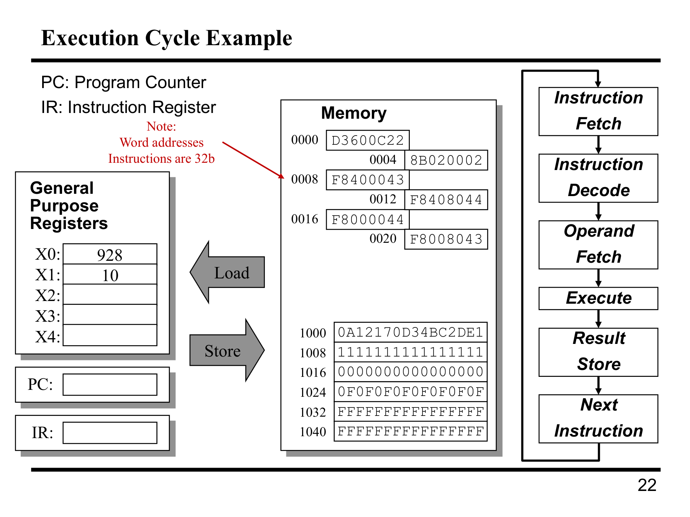

---

## 第 1 页


**提问：** 这张截图里的内容是什么意思？请面向初学者详细解释，分点讲清楚。

这张截图是关于**汇编语言**的一些基本介绍，下面是详细的解释：

### 1. **汇编语言概述**：

* **汇编语言**：是计算机可以理解的较低级语言，它与机器语言有一一对应的关系。汇编语言中的指令是简单而常规的，通常被认为是其他编程语言（如C语言、Java语言等）的“构建块”。
* 这意味着，汇编语言的一些操作与底层机器语言指令几乎是直接相连的。汇编语言提供了对计算机硬件的直接控制。

### 2. **阅读材料**：

* 这个幻灯片列出了学习该主题需要参考的阅读材料（2.1-2.7、2.9-2.10、2.14），以及一个“绿色参考卡”。这些资料帮助学习汇编语言的基础和重要概念。

### 3. **我们的目标**：

* **理解汇编语言的基础**：这意味着学习汇编语言中常用的指令和概念。
* **帮助理解处理器的功能**：汇编语言实际上是与计算机硬件密切相关的，学习它有助于理解计算机处理器是如何工作的。

### 4. **不涉及的内容**：

这部分列出了不打算深入讲解的内容：

* **浮点运算**：浮点数是一种表示实数的方式，用于存储大范围的数值，但在这个课程中不会深入讨论如何在汇编语言中处理浮点数。
* **过程调用**：过程调用是指程序中不同函数之间的跳转和执行过程，这个内容在这个课程中不做深入讲解。
* **栈和局部变量**：栈是计算机存储数据的一种方式，局部变量是函数内部使用的变量，这部分内容在本课程中也不会展开详细说明。

### 总结：

这张截图介绍了汇编语言作为学习计算机架构和处理器操作的一个基础工具，课程的目标是让学生理解汇编语言的基本概念，并帮助他们理解计算机是如何执行程序的。虽然课程不涉及某些高级的编程技术，如浮点数处理、过程调用和栈的使用，但它为理解更高层次的编程语言提供了必要的基础。


---

## 第 2 页


**提问：** 这张截图里的内容是什么意思？请面向初学者详细解释，分点讲清楚。

这张截图是关于\*\*C/C++\*\*编程语言的一些基本概念的介绍，下面是详细的解释：

### 1. **结构体 (struct) 的使用**：

* **`struct coor { int x, y; };`**：这是一个结构体声明，定义了一个名为 `coor` 的类型，里面包含了两个整数类型的字段 `x` 和 `y`。结构体用于将不同类型的数据组合在一起。
* **`struct coor start;`**：这里声明了一个名为 `start` 的结构体变量，它的类型是 `coor`。
* **`start.x = 1;`**：这是对结构体 `start` 中的 `x` 字段赋值。通过 `.` 操作符，可以访问和修改结构体内部的字段。
* **`struct coor *myLoc;`**：声明了一个结构体指针 `myLoc`，它指向一个 `coor` 类型的结构体。
* **`myLoc = &start;`**：这里 `&start` 获取结构体变量 `start` 的地址，并把它赋值给结构体指针 `myLoc`。`&` 是取地址符号。
* **`myLoc->y = 2;`**：通过 `->` 操作符来访问结构体指针指向的结构体的字段。`myLoc->y` 等价于 `(*myLoc).y`，即访问 `myLoc` 所指向的结构体中的 `y` 字段。

**总结**：

* `.` 用于访问结构体变量的字段。
* `->` 用于通过指针访问结构体的字段。

### 2. **数组和指针的使用**：

* **`int scores[8];`**：声明了一个包含 8 个整数的数组 `scores`，数组的索引从 0 到 7。
* **`scores[1] = 5;`**：给数组 `scores` 中的第二个元素赋值为 5。
* **`int *index = scores;`**：声明了一个整数指针 `index`，并将它指向数组 `scores` 的第一个元素。数组名 `scores` 本身就是指向数组首元素的指针。
* **`index++;`**：指针 `index` 向后移动，指向数组中的下一个元素。指针运算会根据所指向的类型自动调整偏移量。
* **`(*index)++;`**：这表示将指针 `index` 当前指向的元素值加 1。`*index` 解引用指针，表示访问指针指向的元素。
* **`index = &(scores[3]);`**：将指针 `index` 指向数组 `scores` 的第四个元素（即 `scores[3]`）。`&` 运算符用于获取变量的地址。
* **`*index = 9;`**：将指针 `index` 当前指向的元素的值修改为 9。

**总结**：

* 数组名可以看作是指向数组第一个元素的指针。
* 指针运算可以让我们轻松遍历数组。
* 使用 `*` 来访问指针所指向的值，使用 `&` 来获取变量的地址。

### 3. **数组的可视化**：

* 最后一部分展示了数组 `scores` 的内存布局。`scores[8]` 表示有 8 个元素，从 0 到 7 索引。
* 每个数组元素的值可以通过指针 `index` 来访问和修改。

### 结论：

这张截图介绍了C/C++中的结构体、指针和数组的基本用法，重点讲解了如何使用指针来访问和修改数组中的元素以及如何通过结构体指针访问结构体的字段。这些概念是学习C/C++语言时的重要基础，掌握这些内容能帮助你更好地理解内存操作和数据结构。


---

## 第 3 页


**提问：** 这张截图里的内容是什么意思？请面向初学者详细解释，分点讲清楚。

这张截图介绍了**ARM汇编语言**的一些基本内容，下面我将详细解释每个部分。

### 1. **ARM汇编语言的基本指令格式**：

* **ARM汇编语言的基本指令包含四个部分**：

  1. **操作符（Operator name）**：即汇编指令的名称，表示要执行的操作，如加法（ADD）或减法（SUB）。
  2. **目标操作数（Destination）**：操作结果存放的地方，通常是一个寄存器，表示指令运算后的结果存储位置。
  3. **第一个操作数（1st operand）**：参与运算的第一个值，可能是寄存器中的数据或立即数。
  4. **第二个操作数（2nd operand）**：参与运算的第二个值，跟第一个操作数一样，也可以是寄存器中的数据或立即数。

### 2. **示例指令**：

* **ADD 指令**：

  ```
  ADD <dst>, <src1>, <src2>
  ```

  这条指令的意思是：将 `<src1>` 和 `<src2>` 中的值相加，并将结果存放到 `<dst>` 中。例如，如果 `src1` = 5，`src2` = 3，那么执行后 `dst` = 5 + 3 = 8。

  解释：`<dst>` = `<src1>` + `<src2>`

* **SUB 指令**：

  ```
  SUB <dst>, <src1>, <src2>
  ```

  这条指令的意思是：将 `<src1>` 和 `<src2>` 中的值相减，并将结果存放到 `<dst>` 中。例如，如果 `src1` = 8，`src2` = 3，那么执行后 `dst` = 8 - 3 = 5。

  解释：`<dst>` = `<src1>` - `<src2>`

### 3. **指令的简单格式**：

* 这些指令的格式非常简单，这使得它们容易在硬件中实现。ARM汇编语言指令通常以这种简洁的方式写出，使得硬件可以快速解析并执行。

### 4. **更复杂的表达式**：

* 对于更复杂的操作，可以将多个操作数结合在一起。例如，表达式：

  ```
  A = B + C + D - E
  ```

  这并不需要单一的一条指令来实现，而是通过多个指令的组合来实现。每条指令可能只处理两个操作数，但它们可以组合起来处理更复杂的运算。

### 总结：

* ARM汇编语言的指令通常包括目标寄存器和两个操作数，它们的格式简单，便于硬件实现。
* `ADD` 和 `SUB` 是最基本的算术运算指令，用于加法和减法。
* 复杂的运算可以通过多个简单的指令来实现。

掌握这些基础的汇编指令是理解低级编程和计算机硬件工作原理的重要步骤。


---

## 第 4 页


**提问：** 这张截图里的内容是什么意思？请面向初学者详细解释，分点讲清楚。

这张截图介绍了**ARM汇编语言**的一些基本内容，下面我将详细解释每个部分。

### 1. **ARM汇编语言的基本指令格式**：

* **ARM汇编语言的基本指令包含四个部分**：

  1. **操作符（Operator name）**：即汇编指令的名称，表示要执行的操作，如加法（ADD）或减法（SUB）。
  2. **目标操作数（Destination）**：操作结果存放的地方，通常是一个寄存器，表示指令运算后的结果存储位置。
  3. **第一个操作数（1st operand）**：参与运算的第一个值，可能是寄存器中的数据或立即数。
  4. **第二个操作数（2nd operand）**：参与运算的第二个值，跟第一个操作数一样，也可以是寄存器中的数据或立即数。

### 2. **示例指令**：

* **ADD 指令**：

  ```
  ADD <dst>, <src1>, <src2>
  ```

  这条指令的意思是：将 `<src1>` 和 `<src2>` 中的值相加，并将结果存放到 `<dst>` 中。例如，如果 `src1` = 5，`src2` = 3，那么执行后 `dst` = 5 + 3 = 8。

  解释：`<dst>` = `<src1>` + `<src2>`

* **SUB 指令**：

  ```
  SUB <dst>, <src1>, <src2>
  ```

  这条指令的意思是：将 `<src1>` 和 `<src2>` 中的值相减，并将结果存放到 `<dst>` 中。例如，如果 `src1` = 8，`src2` = 3，那么执行后 `dst` = 8 - 3 = 5。

  解释：`<dst>` = `<src1>` - `<src2>`

### 3. **指令的简单格式**：

* 这些指令的格式非常简单，这使得它们容易在硬件中实现。ARM汇编语言指令通常以这种简洁的方式写出，使得硬件可以快速解析并执行。

### 4. **更复杂的表达式**：

* 对于更复杂的操作，可以将多个操作数结合在一起。例如，表达式：

  ```
  A = B + C + D - E
  ```

  这并不需要单一的一条指令来实现，而是通过多个指令的组合来实现。每条指令可能只处理两个操作数，但它们可以组合起来处理更复杂的运算。

### 总结：

* ARM汇编语言的指令通常包括目标寄存器和两个操作数，它们的格式简单，便于硬件实现。
* `ADD` 和 `SUB` 是最基本的算术运算指令，用于加法和减法。
* 复杂的运算可以通过多个简单的指令来实现。

掌握这些基础的汇编指令是理解低级编程和计算机硬件工作原理的重要步骤。


---

## 第 5 页


**提问：** 这张截图里的内容是什么意思？请面向初学者详细解释，分点讲清楚。

[media pointer="file-service://file-6g3mgGAdE3YU2RoS4tKAmJ"]
这张截图里的内容是什么意思？请面向初学者详细解释，分点讲清楚。


---

## 第 6 页


**提问：** 这张截图里的内容是什么意思？请面向初学者详细解释，分点讲清楚。

[media pointer="file-service://file-2i7iTiBdZ7C9nJm1RAxoKu"]
这张截图里的内容是什么意思？请面向初学者详细解释，分点讲清楚。


---

## 第 7 页


**提问：** 这张截图里的内容是什么意思？请面向初学者详细解释，分点讲清楚。

[media pointer="file-service://file-UEDrv1HYZv6GehUUPzLARG"]
这张截图里的内容是什么意思？请面向初学者详细解释，分点讲清楚。


---

## 第 8 页


**提问：** 这张截图里的内容是什么意思？请面向初学者详细解释，分点讲清楚。

[media pointer="file-service://file-L2XRSTBraohyNuwvkYLDdh"]
这张截图里的内容是什么意思？请面向初学者详细解释，分点讲清楚。


---

## 第 9 页


**提问：** 这张截图里的内容是什么意思？请面向初学者详细解释，分点讲清楚。

[media pointer="file-service://file-HBgPNAUnBSpD1GKUfDJmG9"]
这张截图里的内容是什么意思？请面向初学者详细解释，分点讲清楚。


---

## 第 10 页


**提问：** 这张截图里的内容是什么意思？请面向初学者详细解释，分点讲清楚。

[media pointer="file-service://file-XqmxE18UGhmC12BPVLwMSD"]
这张截图里的内容是什么意思？请面向初学者详细解释，分点讲清楚。


---

## 第 11 页


**提问：** 这张截图里的内容是什么意思？请面向初学者详细解释，分点讲清楚。

[media pointer="file-service://file-XqmxE18UGhmC12BPVLwMSD"]
这张截图里的内容是什么意思？请面向初学者详细解释，分点讲清楚。


---

## 第 12 页


**提问：** 这张截图里的内容是什么意思？请面向初学者详细解释，分点讲清楚。

[media pointer="file-service://file-1JnWMS1JkvViHPzmL5Yij4"]
这张截图里的内容是什么意思？请面向初学者详细解释，分点讲清楚。


---

## 第 13 页


**提问：** 这张截图里的内容是什么意思？请面向初学者详细解释，分点讲清楚。

[media pointer="file-service://file-BPQWzVHQ8Um65JhgD8Nwsf"]
这张截图里的内容是什么意思？请面向初学者详细解释，分点讲清楚。


---

## 第 14 页



**提问：** 这张截图里的内容是什么意思？请面向初学者详细解释，分点讲清楚。

[media pointer="file-service://file-Xr35RU28PNuCfjqNYmdUpE"]
这张截图里的内容是什么意思？请面向初学者详细解释，分点讲清楚。


---

## 第 15 页


**提问：** 这张截图里的内容是什么意思？请面向初学者详细解释，分点讲清楚。

[media pointer="file-service://file-8w9qRVgE8QbzgWKXgiGaAd"]
这张截图里的内容是什么意思？请面向初学者详细解释，分点讲清楚。


---

## 第 16 页


**提问：** 这张截图里的内容是什么意思？请面向初学者详细解释，分点讲清楚。

[media pointer="file-service://file-NiPTJb3Qg5UyvYLiytcG85"]
这张截图里的内容是什么意思？请面向初学者详细解释，分点讲清楚。


---

## 第 17 页


**提问：** 这张截图里的内容是什么意思？请面向初学者详细解释，分点讲清楚。

[media pointer="file-service://file-EyyDvTMmDws2fRfziMRXTY"]
这张截图里的内容是什么意思？请面向初学者详细解释，分点讲清楚。


---

## 第 18 页


**提问：** 这张截图里的内容是什么意思？请面向初学者详细解释，分点讲清楚。

[media pointer="file-service://file-P2SZDWYXac2bQy49Hpr3Tg"]
这张截图里的内容是什么意思？请面向初学者详细解释，分点讲清楚。


---

## 第 19 页


**提问：** 这张截图里的内容是什么意思？请面向初学者详细解释，分点讲清楚。

[media pointer="file-service://file-8yon1pH9vFDEZTeizTdjRi"]
这张截图里的内容是什么意思？请面向初学者详细解释，分点讲清楚。


---

## 第 20 页


**提问：** 这张截图里的内容是什么意思？请面向初学者详细解释，分点讲清楚。

[media pointer="file-service://file-MRRCSUKvyuSVcENduLzvrg"]
这张截图里的内容是什么意思？请面向初学者详细解释，分点讲清楚。


---

## 第 21 页


**提问：** 这张截图里的内容是什么意思？请面向初学者详细解释，分点讲清楚。

[media pointer="file-service://file-Pp68a2saabw4UKr3wdqKq3"]
这张截图里的内容是什么意思？请面向初学者详细解释，分点讲清楚。


---

## 第 22 页


**提问：** 这张截图里的内容是什么意思？请面向初学者详细解释，分点讲清楚。

[media pointer="file-service://file-4dyjkAVUABtPVepjF7mTTS"]
这张截图里的内容是什么意思？请面向初学者详细解释，分点讲清楚。


---

## 第 23 页


**提问：** 这张截图里的内容是什么意思？请面向初学者详细解释，分点讲清楚。

[media pointer="file-service://file-7PA9S3Jm5BGVptP6HhQAe3"]
这张截图里的内容是什么意思？请面向初学者详细解释，分点讲清楚。


---

## 第 24 页


**提问：** 这张截图里的内容是什么意思？请面向初学者详细解释，分点讲清楚。

[media pointer="file-service://file-1YKWoxh52hoMQMB9QCaaW1"]
这张截图里的内容是什么意思？请面向初学者详细解释，分点讲清楚。


---

## 第 25 页


**提问：** 这张截图里的内容是什么意思？请面向初学者详细解释，分点讲清楚。

[media pointer="file-service://file-9bFEhbWmaMSKyjYxA3YrzU"]
这张截图里的内容是什么意思？请面向初学者详细解释，分点讲清楚。


---

## 第 26 页


**提问：** 这张截图里的内容是什么意思？请面向初学者详细解释，分点讲清楚。

[media pointer="file-service://file-6NbeK5KMNM8psgKViUMtFK"]
这张截图里的内容是什么意思？请面向初学者详细解释，分点讲清楚。


---

## 第 27 页


**提问：** 这张截图里的内容是什么意思？请面向初学者详细解释，分点讲清楚。

GPT 是 GUID Partition Table 的缩写，是一种 现代磁盘分区表格式，用来替代老旧的 MBR（Master Boot Record） 分区表。


---

## 第 28 页


**提问：** 这张截图里的内容是什么意思？请面向初学者详细解释，分点讲清楚。

[media pointer="file-service://file-F1vP6iPfZBszmxGAxPjG97"]
这张截图里的内容是什么意思？请面向初学者详细解释，分点讲清楚。


---

## 第 29 页


**提问：** 这张截图里的内容是什么意思？请面向初学者详细解释，分点讲清楚。

这张截图展示了 **汇编代码转换示例**，用于计算从 `0` 到 `N-1` 的所有值的和。截图中的代码示例演示了一个简单的循环，利用 **加法** 和 **条件分支** 来完成累加。下面我会详细解释每一行代码的作用。

### 1. **目标**

* 计算从 0 到 N-1 的和。
* 使用的指令包括加法（`ADD`）、条件分支（`B`）、以及递增操作（`ADDI`）。

### 2. **代码解析**

#### 代码第一部分：

```assembly
ADD X1, X31, X31
ADD X2, X31, X31
B TEST
```

* **`ADD X1, X31, X31`**：这条指令将寄存器 `X31` 的值加到自己上，结果存储在寄存器 `X1` 中。可以理解为 `X1 = X31 + X31`。
* **`ADD X2, X31, X31`**：同样，`X31` 加到自己上，结果存储在 `X2` 中。
* **`B TEST`**：无条件跳转到标签 `TEST` 处执行。这是一个 **分支指令**，表示程序跳转到名为 `TEST` 的地方。

#### 代码第二部分：**TOP 循环**

```assembly
TOP:
ADD X1, X1, X2
ADDI X2, X2, #1
```

* **`ADD X1, X1, X2`**：将寄存器 `X1` 和 `X2` 的值相加，结果存储在 `X1` 中。可以理解为在每次循环中，`X1` 会累加上 `X2` 的值。
* **`ADDI X2, X2, #1`**：将寄存器 `X2` 的值加上常数 `1`，并将结果存储回 `X2` 中。`X2` 的值每次循环都会增加 1。

#### 代码第三部分：**TEST 分支**

```assembly
TEST:
SUBS X31, X2, X0
B.LT TOP
```

* **`SUBS X31, X2, X0`**：执行 `X2 - X0` 运算，并将结果存储在 `X31` 中，同时更新标志寄存器（`S` 表示更新标志寄存器）。这将用于检查是否达到了循环的终止条件。
* **`B.LT TOP`**：如果 `X31` 中的结果小于零，则跳转到 `TOP` 标签，继续循环。这里的 **`B.LT`** 是一个条件跳转指令，表示当 `X31` 小于零时，程序跳回 `TOP` 处。

#### 代码第四部分：**结束**

```assembly
END:
```

* **`END`**：这是程序的结束标签。通常表示程序的终止位置，程序的执行会在这里停止。

### 3. **程序流程**

* 初始时，寄存器 `X1` 和 `X2` 的值分别为 `2 * X31`。
* 然后，程序跳到 `TEST` 标签，执行 `X2 - X0`，并将结果存储在 `X31`。
* 如果 `X31` 的值小于零（即 `X2` 达到某个预定条件），程序会跳回到 `TOP` 标签，继续执行加法操作。否则，程序会结束。

### 4. **总结**

* 这个汇编代码示例展示了如何使用加法指令和条件分支来计算一个范围内数字的和。通过将累加值存储在寄存器中并不断更新，程序在达到终止条件时跳出循环。
* 关键的指令包括加法（`ADD`）、条件分支（`B`）、以及递增（`ADDI`）。这些指令协同工作，完成累加操作。
* 该例子还展示了如何使用条件判断（如 `B.LT`）来控制循环的执行。

这种汇编代码是学习如何进行循环和条件跳转的一个好例子。


---

## 第 30 页


**提问：** 这张截图里的内容是什么意思？请面向初学者详细解释，分点讲清楚。

这张截图显示了 **汇编语言（Assembly）** 和 **机器语言（Machine Language）** 之间的关系，但目前没有详细的内容。在这种情况下，我们可以简单地解释一下这两者的区别，并概述它们在计算机编程中的角色。

### 1. **汇编语言（Assembly）**

* **汇编语言** 是一种低级编程语言，允许程序员用接近机器语言的指令编写程序，但其语法更接近于人类的语言。
* 每条汇编指令通常对应一条机器语言指令，因此它直接控制硬件的操作，具有很高的执行效率。
* 汇编语言需要通过 **汇编器（Assembler）** 转换成机器语言才能被计算机执行。
* 汇编语言为每条机器指令提供了一个易于理解的符号表示，例如：

  * `MOV`：将数据从一个寄存器移动到另一个寄存器。
  * `ADD`：执行加法运算。
  * `SUB`：执行减法运算。
* 由于汇编语言非常接近硬件，它允许对计算机的硬件资源进行精确控制。

### 2. **机器语言（Machine Language）**

* **机器语言** 是计算机可以直接理解并执行的编程语言。它由二进制代码（0 和 1）组成，是最底层的计算机语言。
* 每台计算机的硬件都有自己特定的机器语言，它与硬件架构密切相关。
* 机器语言指令通常非常简短，并且每个指令的格式和内容在计算机的 **中央处理单元（CPU）** 中有严格的定义。
* 机器语言是 **计算机最直接理解的语言**，因此它不需要翻译或解释器；当程序运行时，计算机直接执行这些指令。

### 3. **汇编语言与机器语言的关系**

* 汇编语言和机器语言之间存在一种 **一对一的映射关系**。也就是说，每个汇编指令通常都可以转换成一条机器指令。
* 汇编语言为程序员提供了一个比机器语言更易理解的方式来编写程序，而计算机必须将汇编语言转换成机器语言才能执行。
* 汇编语言比机器语言更易于人类编程，因为它使用的是助记符而非纯二进制代码。

### 4. **总结**

* **汇编语言**：接近人类理解的低级语言，易于编写和调试，但需要通过汇编器转换成机器语言。
* **机器语言**：计算机直接执行的二进制语言，执行效率高，但不易理解和编程。

如果你正在学习汇编语言或机器语言，这张截图的内容可能会进一步引导你了解如何通过汇编器将汇编代码转换成机器代码，从而让程序能够被计算机执行。
