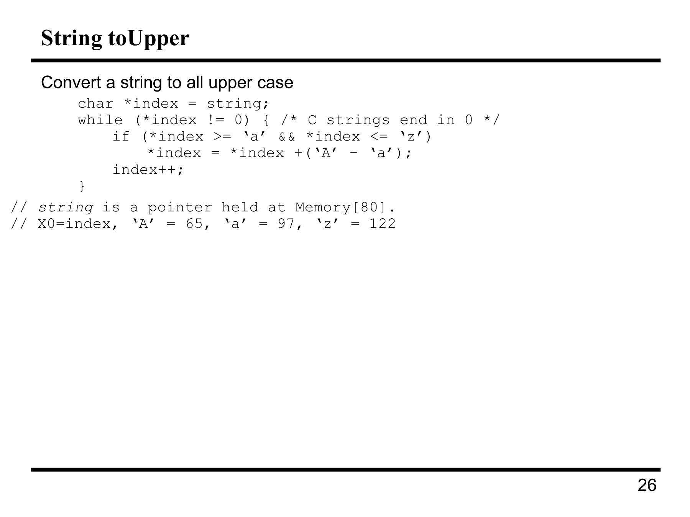

---

## 第 1 页


**提问：** 我现在是一名远程教学老师，需要备课，告诉我这个截图是什么意思并且详细解释，到时候上课我会根据这个回答讲课

下面这张截屏是一页“汇编语言（Assembly Language）”课程导入页。它告诉你：学习范围、学习目标、以及**不**在本次教学范围内的内容。我把它拆成几块，顺便配上可直接拿去上课讲解的示例与板书要点。

---

# 这页课件在说什么？

## 1) 参考阅读（Readings）

* 章节：**2.1–2.7、2.9–2.10、2.14**
  这些通常是教材里关于计算机组成/指令系统/汇编基础的章节。
* **Green reference card（绿色参考卡）**
  常见于 MIPS 或类似教学架构的“指令速查表”。课堂上可以把它当作“指令词典”：指令格式、寄存器名字、常见操作码都在上面。

> 课堂建议：先给学生一张电子/纸质“绿卡”，告诉大家它就像“英语课上的不规则动词表”，用来快速查指令与寄存器。

---

## 2) 什么是汇编语言？

* **“Simple, regular instructions – building blocks of C, Java & other languages”**
  汇编由**简单、规律**的指令组成，是 C/Java 等高级语言编译后真正运行时的“积木”。
* **“Typically one-to-one mapping to machine language”**
  汇编和**机器语言**（二进制）通常是**一一对应**：

  * 机器语言：`000000 01001 01010 01011 00000 100000`（二进制位）
  * 汇编：`add $t3, $t1, $t2`（更容易读写的**助记符** + **寄存器名**）

> 课堂示例（选 MIPS，最常见于教学）：
>
> * **加法**
>
>   * 汇编：`add $t0, $t1, $t2`  （\$t0=\$t1+\$t2）
>   * 机器码：对应一条 32 位指令（R-Format，op/rs/rt/rd/shamt/funct）
> * **内存读/写**
>
>   * 读：`lw $t0, 0($sp)`  从栈顶地址读 4 字节到 \$t0
>   * 写：`sw $t0, 4($sp)`  把 \$t0 写到 \$sp+4 的地址
> * **分支与跳转**
>
>   * `beq $t0, $t1, label`  若相等则跳转
>   * `j target`  无条件跳转

要点：汇编只是给机器码起了**人类可读的名字**，但每条指令仍然非常“贴近硬件”。

---

## 3) 本课的学习目标（Our goal）

* **“Understand the basics of assembly language”**
  掌握汇编**基础**：

  1. 指令的组成（操作码、寄存器、立即数、地址）
  2. 常见寄存器角色（通用寄存器、\$sp 栈指针、\$ra 返回地址、\$zero 常量 0 等）
  3. 基本指令类型：算术/逻辑、数据传送、控制流（分支跳转）
  4. 编译器如何把 C/Java 变成这些“积木”
* **“Help figure out what the processor needs to be able to do”**
  通过写/读汇编，反向体会**处理器必须支持什么能力**：

  * 取指、译码、执行、访存、写回（五级流水线的直觉）
  * 寄存器文件、ALU、内存层次、分支判定等硬件模块
  * 指令设计如何影响性能（例如：为何要有立即数？为何内存与寄存器分开？）

> 课堂演示：
>
> * 给一段 C 代码：
>
>   ```c
>   int sum(int *a, int n) {
>       int s = 0;
>       for (int i = 0; i < n; i++) s += a[i];
>       return s;
>   }
>   ```
> * 展示它的“汇编思维”：
>
>   1. `s` 放哪个寄存器？
>   2. `i` 如何自增（`addi`）？
>   3. `a[i]` 如何计算地址（`lw` + 基址寄存器 + 偏移）？
>   4. `for` 循环如何用分支实现（`slt`/`bne`/`beq`）？
>      让学生看到：**每一步都需要对应的硬件能力**。

---

## 4) 不在本课范围内（Not our goal）

* **“Floating point（浮点）”**
  本节不讲 FPU/浮点寄存器、`add.s`/`mul.d` 等指令。
* **“Procedure calls（过程调用）”**
  暂不系统讲函数调用规范（调用者/被调用者保存、`jal`/`jr`、返回地址 `$ra`）。
* **“Stacks & local variables（栈与局部变量）”**
  暂不深入函数栈帧布局、`$sp` 变化、保存寄存器等。

> 讲课技巧：
> 把这些列成“后续专题”。先把**指令基础**和**CPU需要的能力**打牢，再学调用规范/栈/浮点更轻松。

---

# 可直接使用的 45–60 分钟教学脚本

## 开场（5 分钟）

* 问题引入：计算机真的只能“看得懂”二进制吗？为什么还需要汇编？
* 展示这页导入幻灯：说明今天的**范围与目标**。

## 汇编与机器码的一一对应（10 分钟）

* 板书：机器码位域（以 MIPS R/I/J 格式为例）
* 例子：`add $t0, $t1, $t2` ↔ R-Format（op/rs/rt/rd/shamt/funct）
* 小练：给出一条 `addi` 或 `lw`，让学生指出“操作码/寄存器/立即数”分别是什么。

## 寄存器与基本指令（15 分钟）

* 讲常用寄存器角色（\$zero, \$t0–\$t9, \$s0–\$s7, \$sp, \$ra）
* 三类基础指令：

  1. 算术逻辑：`add`, `sub`, `and`, `or`, `slt`, `addi`
  2. 访存：`lw`, `sw`（解释“寄存器-内存分离”与地址=基址+偏移）
  3. 控制流：`beq`, `bne`, `j`（条件判断与循环）
* 课堂演示：把 `if (x==y) z=x+1; else z=y+1;` 改写成汇编（对比 `beq`/`bne` 分支）。

## 从 C 到汇编的思维（10–15 分钟）

* 以 `sum(int *a, int n)` 为例，逐步“翻译”：

  * 变量放寄存器、数组地址计算、循环计数、条件跳转。
* 点出与硬件能力的映射：ALU 做加法、寄存器文件保存中间值、访存单元配合 `lw/sw`。

## 总结与展望（5 分钟）

* 今天的**会**：读写基础指令、理解一一对应、感知 CPU 需要做什么。
* 今天暂时**不讲**：浮点、过程调用、栈帧（后续专题）。
* 作业/练习建议：

  1. 用 8–10 条指令实现 `max(x,y)`；
  2. 把三行 C 循环改写成汇编；
  3. 用 `lw/sw` 做一次数组访问与更新。

---

# 板书/讲义速记（便于你授课时投屏或口述）

* **汇编＝机器码的“助记名”**，通常一条汇编 ↔ 一条机器指令
* **指令三大类**：ALU（算术逻辑）、Mem（读写内存）、Branch/Jump（控制流）
* **寄存器是“快抽屉”**：几乎所有运算都先放寄存器再算
* **地址=基址+偏移**：`lw $t0, offset($base)`
* **今日不覆盖**：浮点 / 函数调用规范 / 栈与局部变量
* **学习目的**：看懂编译后代码、理解 CPU 必要功能、为后续性能/安全/系统课程打基础

---

# 常见问题（你可以用来互动）

1. **为什么不能像 C 一样直接写 `z = x + y;`？**
   因为硬件只认识“把寄存器 A 与寄存器 B 送入 ALU 相加，再把结果写回寄存器 C”这种原子步骤。
2. **为什么要把数据放在寄存器而不是直接在内存里算？**
   寄存器速度远快于内存；指令集通常规定 ALU 操作对象是寄存器（RISC 设计思想）。
3. **分支为什么会影响性能？**
   真实 CPU 有流水线/分支预测；错误预测会清流水线，代价高（为后续体系结构课埋伏笔）。

---

如果你愿意，我可以把上面的示例改成你指定的指令集（x86-64、RISC-V、MIPS 等），或给你准备一页“课堂练习题 + 参考答案”的可打印讲义。


---

## 第 2 页


**提问：** 我现在是一名远程教学老师，需要备课，告诉我这个截图是什么意思并且详细解释，到时候上课我会根据这个回答讲课

下面这页课件题为 **“Aside: C/C++ Primer（C/C++ 速成回顾）”**，主要是用一小段 C/C++ 例子把**结构体（struct）**、**指针**、**取地址 &**、\*\*解引用 \*\*\*、**成员访问 . / ->**、**数组与指针运算**这些核心概念一次性串起来。你上课可以按下面的顺序讲，边讲边在白板画内存示意。

---

# 1) 结构体与指针语法（上半部分）

示例代码（逐行解释）：

```c
struct coord { int x, y; };   /* 声明一种类型，有两个 int 字段 x 和 y */
struct coord start;           /* 声明一个对象 start，里面有 x、y 两个格子 */
start.x = 1;                  /* 对“对象”的字段用点号 . 访问 */
struct coord *myLoc;          /* myLoc 是指向 struct coord 的“指针” */
myLoc = &start;               /* & 取地址，myLoc 现在保存 start 的地址 */
myLoc->y = 2;                 /* “->” 等价于 “(*myLoc).y” ：先解引用再点 */
```

课堂板书/口述要点：

* **struct coord** 定义了一种新类型，它的“内存布局”就是两格连续的 `int`：第一格是 `x`，第二格是 `y`。
* **对象 vs. 指针**

  * 对象 `start`：真正的那两格内存。
  * 指针 `myLoc`：保存的是“某个对象的**地址**”（门牌号），本身是单独的一格（指针值）。
* **&（取地址）**：`&start` 的结果是“start 所在地址”。
* \***（解引用 / 间接访问）**：`*p` 表示“去到 p 指向的那格/那块内存”。
* **. 与 ->**：

  * `obj.field`：对象直接访问
  * `ptr->field`：指针访问对象字段，等价 `(*ptr).field`（**先解引用再点**）

内存图（你可以画两个相邻小方框，标 `x`、`y`）：

* 先赋 `start.x = 1`，再通过指针写 `myLoc->y = 2`
* **最终**：`start.x == 1`，`start.y == 2`

> 这对应幻灯片右边的小表格：上格标 x、下格标 y，最后应填 **x=1、y=2**。

---

# 2) 数组、指针与指针运算（下半部分）

示例代码（逐行解释）：

```c
int scores[8];         /* 一个长度为 8 的 int 数组，下标 0..7（值此刻未初始化） */
scores[1] = 5;         /* 直接用下标写入：把第 1 个元素写 5 */
int *index = scores;   /* 数组名在表达式中会“衰变”为 &scores[0]（首元素地址）*/
index++;               /* 指针自增：跳到“下一个 int 元素”的地址（按 sizeof(int) 跨步）*/
(*index)++;            /* 解引用再自增：把 index 指向的那个元素的“值 +1” */
index = &(scores[3]);  /* 让 index 指向下标 3 的元素 */
*index = 9;            /* 把下标 3 的元素写成 9 */
```

逐步推演（建议画一排 8 个小格，下面标注下标 0..7）：

1. `scores[1] = 5;` → 第 1 格写入 **5**。
2. `int *index = scores;` → `index` 指向 `scores[0]`。
3. `index++;` → 现在指向 `scores[1]`（注意“加 1”并不是地址 +1 字节，而是跳到**下一个 int**）。
4. `(*index)++;` → 把 `scores[1]` 的值自增：5 → **6**。
5. `index = &(scores[3]);` → 现在指向 `scores[3]`。
6. `*index = 9;` → 把 `scores[3]` 写成 **9**。

**最终可确定的数组内容**（已被修改的两格）：

* `scores[1] == 6`
* `scores[3] == 9`
* 其他元素（0、2、4、5、6、7）在这段代码里**没有被写入确定的值**（如果是局部数组且未初始化，值是**不确定/垃圾值**；如果是全局/静态数组，会默认为 0——上课时可以顺带讲“存储期”的区别）。

> 幻灯片底部那排 0..7 的格子就是要学生填结果：**在 1 号格写 6，在 3 号格写 9**，其余留空或标“未定”。

---

# 3) 课堂上可直接用的讲解顺序（约 35–45 分钟）

**A. 热身（5 分钟）**

* 提问：什么是“指针”？（常见比喻：地址/门牌号）
* 展示 `. / -> / & / *` 的直观含义。

**B. 结构体与指针（10–15 分钟）**

* 画出 `struct coord` 的两格布局，演示 `. / ->` 的差别。
* 小练习：把 `myLoc->x = 42;` 改写成只用 `.` 和 `*` 的形式（答案：`(*myLoc).x = 42;`）。

**C. 数组与指针运算（15–20 分钟）**

* 解释“数组名衰变”：`scores == &scores[0]`（在大多数表达式中）。
* 解释“指针 +1”是**跨元素大小**；`index++` 让它从 `scores[0]` 指到 `scores[1]`。
* 讲解 `(*index)++` 的“优先级与括号”：如果写成 `*index++`，意思完全不同（它等价于 `*(index++)`，是“指针先后移，再解引用旧位置”）。
* 让学生独立在纸上/白板填出 `scores` 的最终两个确定值（1 号位 6、3 号位 9）。

**D. 延伸（可选 5 分钟）**

* 如果数组是 `static int scores[8];` 会怎样？（默认 0）
* 如果把 `int *index = &scores[7]; index++;` 会发生什么？（越界——未定义行为）

---

# 4) 关键术语与一句话口诀（便于板书）

* `&x`：取 **x 的地址**（门牌号）
* `*p`：去 **p 指向的位置**（解引用）
* `obj.field`：对象直接访问字段
* `ptr->field`：指针访问字段（等价 `(*ptr).field`）
* **数组名 ≈ 首元素地址**（表达式中衰变）
* **指针加 1 ≠ 地址 +1 字节**，而是跳到**下一个同类型元素**
* `(*p)++`：把 **p 指向的值** 自增
* `*p++`：**先**让 p 指向下一个元素，**再**解引用旧位置（高频易错点）

---

# 5) 课堂互动题（含答案要点）

1. 把 `myLoc->y = 2;` 改写成只用 `*` 和 `.` 的等价表达式？

   * **答案**：`(*myLoc).y = 2;`

2. 下面程序结束后，`a[0]` 和 `a[1]` 的值？

   ```c
   int a[2] = {10, 20};
   int *p = a;
   *p++ = 5;      // 等价于 *(p++) = 5;
   ```

   * **过程**：先把 `a[0]` 赋值为 5，然后 p 移到指向 `a[1]`。
   * **结果**：`a[0] = 5`，`a[1] = 20`。

3. 为什么 `scores[1]` 从 5 变成了 6？

   * 因为 `index++` 后指向 `scores[1]`，`(*index)++` 对**该元素的值**自增。

---

# 6) 可能被问到的常见误区

* **“数组名就是指针？”**
  严格讲：不是同一种类型，但**在表达式中**常“衰变”为首元素指针（少数位置不衰变，如 `sizeof(scores)`、取 `&scores`）。
* **“指针加 1 就是地址加 1？”**
  不是。是加上“一个元素的大小”。对 `int*` 通常加 4 字节，对 `double*` 通常加 8 字节（依实现而定）。
* **未初始化的局部数组有默认值吗？**
  没有，值**不确定**（随机/垃圾）。全局或静态存储期的对象才会默认置零。

---

如果你需要，我可以把这页的**内存图、练习题（可打印）以及参考答案**整理成讲义 PDF，方便你直接在远程课堂发给学生。


---

## 第 3 页


**提问：** 我现在是一名远程教学老师，需要备课，告诉我这个截图是什么意思并且详细解释，到时候上课我会根据这个回答讲课

下面这页课件题为 **“Aside: C/C++ Primer（C/C++ 速成回顾）”**，主要是用一小段 C/C++ 例子把**结构体（struct）**、**指针**、**取地址 &**、\*\*解引用 \*\*\*、**成员访问 . / ->**、**数组与指针运算**这些核心概念一次性串起来。你上课可以按下面的顺序讲，边讲边在白板画内存示意。

---

# 1) 结构体与指针语法（上半部分）

示例代码（逐行解释）：

```c
struct coord { int x, y; };   /* 声明一种类型，有两个 int 字段 x 和 y */
struct coord start;           /* 声明一个对象 start，里面有 x、y 两个格子 */
start.x = 1;                  /* 对“对象”的字段用点号 . 访问 */
struct coord *myLoc;          /* myLoc 是指向 struct coord 的“指针” */
myLoc = &start;               /* & 取地址，myLoc 现在保存 start 的地址 */
myLoc->y = 2;                 /* “->” 等价于 “(*myLoc).y” ：先解引用再点 */
```

课堂板书/口述要点：

* **struct coord** 定义了一种新类型，它的“内存布局”就是两格连续的 `int`：第一格是 `x`，第二格是 `y`。
* **对象 vs. 指针**

  * 对象 `start`：真正的那两格内存。
  * 指针 `myLoc`：保存的是“某个对象的**地址**”（门牌号），本身是单独的一格（指针值）。
* **&（取地址）**：`&start` 的结果是“start 所在地址”。
* \***（解引用 / 间接访问）**：`*p` 表示“去到 p 指向的那格/那块内存”。
* **. 与 ->**：

  * `obj.field`：对象直接访问
  * `ptr->field`：指针访问对象字段，等价 `(*ptr).field`（**先解引用再点**）

内存图（你可以画两个相邻小方框，标 `x`、`y`）：

* 先赋 `start.x = 1`，再通过指针写 `myLoc->y = 2`
* **最终**：`start.x == 1`，`start.y == 2`

> 这对应幻灯片右边的小表格：上格标 x、下格标 y，最后应填 **x=1、y=2**。

---

# 2) 数组、指针与指针运算（下半部分）

示例代码（逐行解释）：

```c
int scores[8];         /* 一个长度为 8 的 int 数组，下标 0..7（值此刻未初始化） */
scores[1] = 5;         /* 直接用下标写入：把第 1 个元素写 5 */
int *index = scores;   /* 数组名在表达式中会“衰变”为 &scores[0]（首元素地址）*/
index++;               /* 指针自增：跳到“下一个 int 元素”的地址（按 sizeof(int) 跨步）*/
(*index)++;            /* 解引用再自增：把 index 指向的那个元素的“值 +1” */
index = &(scores[3]);  /* 让 index 指向下标 3 的元素 */
*index = 9;            /* 把下标 3 的元素写成 9 */
```

逐步推演（建议画一排 8 个小格，下面标注下标 0..7）：

1. `scores[1] = 5;` → 第 1 格写入 **5**。
2. `int *index = scores;` → `index` 指向 `scores[0]`。
3. `index++;` → 现在指向 `scores[1]`（注意“加 1”并不是地址 +1 字节，而是跳到**下一个 int**）。
4. `(*index)++;` → 把 `scores[1]` 的值自增：5 → **6**。
5. `index = &(scores[3]);` → 现在指向 `scores[3]`。
6. `*index = 9;` → 把 `scores[3]` 写成 **9**。

**最终可确定的数组内容**（已被修改的两格）：

* `scores[1] == 6`
* `scores[3] == 9`
* 其他元素（0、2、4、5、6、7）在这段代码里**没有被写入确定的值**（如果是局部数组且未初始化，值是**不确定/垃圾值**；如果是全局/静态数组，会默认为 0——上课时可以顺带讲“存储期”的区别）。

> 幻灯片底部那排 0..7 的格子就是要学生填结果：**在 1 号格写 6，在 3 号格写 9**，其余留空或标“未定”。

---

# 3) 课堂上可直接用的讲解顺序（约 35–45 分钟）

**A. 热身（5 分钟）**

* 提问：什么是“指针”？（常见比喻：地址/门牌号）
* 展示 `. / -> / & / *` 的直观含义。

**B. 结构体与指针（10–15 分钟）**

* 画出 `struct coord` 的两格布局，演示 `. / ->` 的差别。
* 小练习：把 `myLoc->x = 42;` 改写成只用 `.` 和 `*` 的形式（答案：`(*myLoc).x = 42;`）。

**C. 数组与指针运算（15–20 分钟）**

* 解释“数组名衰变”：`scores == &scores[0]`（在大多数表达式中）。
* 解释“指针 +1”是**跨元素大小**；`index++` 让它从 `scores[0]` 指到 `scores[1]`。
* 讲解 `(*index)++` 的“优先级与括号”：如果写成 `*index++`，意思完全不同（它等价于 `*(index++)`，是“指针先后移，再解引用旧位置”）。
* 让学生独立在纸上/白板填出 `scores` 的最终两个确定值（1 号位 6、3 号位 9）。

**D. 延伸（可选 5 分钟）**

* 如果数组是 `static int scores[8];` 会怎样？（默认 0）
* 如果把 `int *index = &scores[7]; index++;` 会发生什么？（越界——未定义行为）

---

# 4) 关键术语与一句话口诀（便于板书）

* `&x`：取 **x 的地址**（门牌号）
* `*p`：去 **p 指向的位置**（解引用）
* `obj.field`：对象直接访问字段
* `ptr->field`：指针访问字段（等价 `(*ptr).field`）
* **数组名 ≈ 首元素地址**（表达式中衰变）
* **指针加 1 ≠ 地址 +1 字节**，而是跳到**下一个同类型元素**
* `(*p)++`：把 **p 指向的值** 自增
* `*p++`：**先**让 p 指向下一个元素，**再**解引用旧位置（高频易错点）

---

# 5) 课堂互动题（含答案要点）

1. 把 `myLoc->y = 2;` 改写成只用 `*` 和 `.` 的等价表达式？

   * **答案**：`(*myLoc).y = 2;`

2. 下面程序结束后，`a[0]` 和 `a[1]` 的值？

   ```c
   int a[2] = {10, 20};
   int *p = a;
   *p++ = 5;      // 等价于 *(p++) = 5;
   ```

   * **过程**：先把 `a[0]` 赋值为 5，然后 p 移到指向 `a[1]`。
   * **结果**：`a[0] = 5`，`a[1] = 20`。

3. 为什么 `scores[1]` 从 5 变成了 6？

   * 因为 `index++` 后指向 `scores[1]`，`(*index)++` 对**该元素的值**自增。

---

# 6) 可能被问到的常见误区

* **“数组名就是指针？”**
  严格讲：不是同一种类型，但**在表达式中**常“衰变”为首元素指针（少数位置不衰变，如 `sizeof(scores)`、取 `&scores`）。
* **“指针加 1 就是地址加 1？”**
  不是。是加上“一个元素的大小”。对 `int*` 通常加 4 字节，对 `double*` 通常加 8 字节（依实现而定）。
* **未初始化的局部数组有默认值吗？**
  没有，值**不确定**（随机/垃圾）。全局或静态存储期的对象才会默认置零。

---

如果你需要，我可以把这页的**内存图、练习题（可打印）以及参考答案**整理成讲义 PDF，方便你直接在远程课堂发给学生。


---

## 第 4 页


**提问：** 我现在是一名远程教学老师，需要备课，告诉我这个截图是什么意思并且详细解释，到时候上课我会根据这个回答讲课

下面这页课件题为 **“Aside: C/C++ Primer（C/C++ 速成回顾）”**，主要是用一小段 C/C++ 例子把**结构体（struct）**、**指针**、**取地址 &**、\*\*解引用 \*\*\*、**成员访问 . / ->**、**数组与指针运算**这些核心概念一次性串起来。你上课可以按下面的顺序讲，边讲边在白板画内存示意。

---

# 1) 结构体与指针语法（上半部分）

示例代码（逐行解释）：

```c
struct coord { int x, y; };   /* 声明一种类型，有两个 int 字段 x 和 y */
struct coord start;           /* 声明一个对象 start，里面有 x、y 两个格子 */
start.x = 1;                  /* 对“对象”的字段用点号 . 访问 */
struct coord *myLoc;          /* myLoc 是指向 struct coord 的“指针” */
myLoc = &start;               /* & 取地址，myLoc 现在保存 start 的地址 */
myLoc->y = 2;                 /* “->” 等价于 “(*myLoc).y” ：先解引用再点 */
```

课堂板书/口述要点：

* **struct coord** 定义了一种新类型，它的“内存布局”就是两格连续的 `int`：第一格是 `x`，第二格是 `y`。
* **对象 vs. 指针**

  * 对象 `start`：真正的那两格内存。
  * 指针 `myLoc`：保存的是“某个对象的**地址**”（门牌号），本身是单独的一格（指针值）。
* **&（取地址）**：`&start` 的结果是“start 所在地址”。
* \***（解引用 / 间接访问）**：`*p` 表示“去到 p 指向的那格/那块内存”。
* **. 与 ->**：

  * `obj.field`：对象直接访问
  * `ptr->field`：指针访问对象字段，等价 `(*ptr).field`（**先解引用再点**）

内存图（你可以画两个相邻小方框，标 `x`、`y`）：

* 先赋 `start.x = 1`，再通过指针写 `myLoc->y = 2`
* **最终**：`start.x == 1`，`start.y == 2`

> 这对应幻灯片右边的小表格：上格标 x、下格标 y，最后应填 **x=1、y=2**。

---

# 2) 数组、指针与指针运算（下半部分）

示例代码（逐行解释）：

```c
int scores[8];         /* 一个长度为 8 的 int 数组，下标 0..7（值此刻未初始化） */
scores[1] = 5;         /* 直接用下标写入：把第 1 个元素写 5 */
int *index = scores;   /* 数组名在表达式中会“衰变”为 &scores[0]（首元素地址）*/
index++;               /* 指针自增：跳到“下一个 int 元素”的地址（按 sizeof(int) 跨步）*/
(*index)++;            /* 解引用再自增：把 index 指向的那个元素的“值 +1” */
index = &(scores[3]);  /* 让 index 指向下标 3 的元素 */
*index = 9;            /* 把下标 3 的元素写成 9 */
```

逐步推演（建议画一排 8 个小格，下面标注下标 0..7）：

1. `scores[1] = 5;` → 第 1 格写入 **5**。
2. `int *index = scores;` → `index` 指向 `scores[0]`。
3. `index++;` → 现在指向 `scores[1]`（注意“加 1”并不是地址 +1 字节，而是跳到**下一个 int**）。
4. `(*index)++;` → 把 `scores[1]` 的值自增：5 → **6**。
5. `index = &(scores[3]);` → 现在指向 `scores[3]`。
6. `*index = 9;` → 把 `scores[3]` 写成 **9**。

**最终可确定的数组内容**（已被修改的两格）：

* `scores[1] == 6`
* `scores[3] == 9`
* 其他元素（0、2、4、5、6、7）在这段代码里**没有被写入确定的值**（如果是局部数组且未初始化，值是**不确定/垃圾值**；如果是全局/静态数组，会默认为 0——上课时可以顺带讲“存储期”的区别）。

> 幻灯片底部那排 0..7 的格子就是要学生填结果：**在 1 号格写 6，在 3 号格写 9**，其余留空或标“未定”。

---

# 3) 课堂上可直接用的讲解顺序（约 35–45 分钟）

**A. 热身（5 分钟）**

* 提问：什么是“指针”？（常见比喻：地址/门牌号）
* 展示 `. / -> / & / *` 的直观含义。

**B. 结构体与指针（10–15 分钟）**

* 画出 `struct coord` 的两格布局，演示 `. / ->` 的差别。
* 小练习：把 `myLoc->x = 42;` 改写成只用 `.` 和 `*` 的形式（答案：`(*myLoc).x = 42;`）。

**C. 数组与指针运算（15–20 分钟）**

* 解释“数组名衰变”：`scores == &scores[0]`（在大多数表达式中）。
* 解释“指针 +1”是**跨元素大小**；`index++` 让它从 `scores[0]` 指到 `scores[1]`。
* 讲解 `(*index)++` 的“优先级与括号”：如果写成 `*index++`，意思完全不同（它等价于 `*(index++)`，是“指针先后移，再解引用旧位置”）。
* 让学生独立在纸上/白板填出 `scores` 的最终两个确定值（1 号位 6、3 号位 9）。

**D. 延伸（可选 5 分钟）**

* 如果数组是 `static int scores[8];` 会怎样？（默认 0）
* 如果把 `int *index = &scores[7]; index++;` 会发生什么？（越界——未定义行为）

---

# 4) 关键术语与一句话口诀（便于板书）

* `&x`：取 **x 的地址**（门牌号）
* `*p`：去 **p 指向的位置**（解引用）
* `obj.field`：对象直接访问字段
* `ptr->field`：指针访问字段（等价 `(*ptr).field`）
* **数组名 ≈ 首元素地址**（表达式中衰变）
* **指针加 1 ≠ 地址 +1 字节**，而是跳到**下一个同类型元素**
* `(*p)++`：把 **p 指向的值** 自增
* `*p++`：**先**让 p 指向下一个元素，**再**解引用旧位置（高频易错点）

---

# 5) 课堂互动题（含答案要点）

1. 把 `myLoc->y = 2;` 改写成只用 `*` 和 `.` 的等价表达式？

   * **答案**：`(*myLoc).y = 2;`

2. 下面程序结束后，`a[0]` 和 `a[1]` 的值？

   ```c
   int a[2] = {10, 20};
   int *p = a;
   *p++ = 5;      // 等价于 *(p++) = 5;
   ```

   * **过程**：先把 `a[0]` 赋值为 5，然后 p 移到指向 `a[1]`。
   * **结果**：`a[0] = 5`，`a[1] = 20`。

3. 为什么 `scores[1]` 从 5 变成了 6？

   * 因为 `index++` 后指向 `scores[1]`，`(*index)++` 对**该元素的值**自增。

---

# 6) 可能被问到的常见误区

* **“数组名就是指针？”**
  严格讲：不是同一种类型，但**在表达式中**常“衰变”为首元素指针（少数位置不衰变，如 `sizeof(scores)`、取 `&scores`）。
* **“指针加 1 就是地址加 1？”**
  不是。是加上“一个元素的大小”。对 `int*` 通常加 4 字节，对 `double*` 通常加 8 字节（依实现而定）。
* **未初始化的局部数组有默认值吗？**
  没有，值**不确定**（随机/垃圾）。全局或静态存储期的对象才会默认置零。

---

如果你需要，我可以把这页的**内存图、练习题（可打印）以及参考答案**整理成讲义 PDF，方便你直接在远程课堂发给学生。


---

## 第 5 页


**提问：** 我现在是一名远程教学老师，需要备课，告诉我这个截图是什么意思并且详细解释，到时候上课我会根据这个回答讲课

下面这两张截图分别是本章“操作数与存储（Operands & Storage）”和“寄存器（Registers）”的导入页。它们想解决两个核心问题：
1）**程序里的数据（操作数）到底放在哪？**
2）**每个寄存器在汇编里各自扮演什么角色？**

我把它整理成一套可直接上课用的讲解脚本（含板书要点、演示与常见误区）。

---

# 一、Operands & Storage（操作数与存储）

## 这页想表达什么

* **为速度（speed）**：CPU 里有 **32 个通用寄存器**（GPRs），多数计算都只在寄存器之间进行。
* **为容量（capacity）**：计算机有**很大的主存（Memory，GB 级）**，用来容纳大量数据和程序。
* **负责任务的组件**：

  * **Processor（处理器）**：由 **Control（控制）** + **Datapath（数据通路）** 构成。

    * *Control* 决定“下一步做哪条指令、选哪条数据路”。
    * *Datapath* 里有**寄存器文件、ALU、数据选择器、加法器**等，真正搬/算数据。
  * **Memory（内存）**：大量但相对慢。
  * **Devices（外设）**：输入（键盘/网络等）、输出（屏幕/磁盘等）。
* **Load/Store 模式**：

  * **只有“访存指令”（load/store）能在寄存器与主存之间搬运数据**；
  * **其它所有算术/逻辑/比较/分支操作，都只在寄存器里完成**。
  * 这就是典型 **RISC（精简指令集）** 的设计思想。

## 上课怎么讲（5–10 分钟）

1. 画一个方框图：左是 **Processor**（里面再画 Control + Datapath + “GPRs”），中间 **Memory**，右边 **Devices**（Input/Output）。
2. 强调“**近小快、远大慢**”的层次：

   * 寄存器（几十个、纳秒级）⇄ 内存（GB、几十\~上百纳秒）
3. 给一个**最小示例**（伪汇编，任选教学架构）：

   ```
   ; 把内存中的A、B取到寄存器，再相加写回
   LD   X0, [addr_A]    ; load
   LD   X1, [addr_B]    ; load
   ADD  X2, X0, X1      ; 只在寄存器上算
   ST   [addr_C], X2    ; store
   ```

   让学生看到：**只有 LD/ST 碰内存，其余都在寄存器里完成。**

---

# 二、Registers（寄存器角色一览）

## 总览

* **32 个 64 位通用寄存器**（记作 X0…X31），用于承载操作数和地址。
* 幻灯片给出了一个**调用约定/使用习惯**（课堂常用的 AArch64 风格，但课程做了简化）。重点是理解“**谁在调用时要保存、谁会被破坏**”。

> 表中要点（按截图原文）：

| 寄存器         | 主要用途                           | 备注                                      |
| ----------- | ------------------------------ | --------------------------------------- |
| **X0–X7**   | **函数参数 / 返回值**                 | 调用者把前 8 个参数放这里；返回值也放 X0（必要时 X1…）        |
| **X8**      | **结果（若返回的是一个指针/间接结果位置）**       | 有些 ABI 用作“间接返回地址寄存器”                    |
| **X9–X15**  | **易失临时（volatile temporaries）** | **调用后不保证保留**（caller-saved）              |
| **X16–X17** | **链接器/PLT 的工作寄存器**             | **不要在手写代码里随便用**                         |
| **X18**     | **平台寄存器（platform register）**   | 某些系统保留（不要用）                             |
| **X19–X27** | **可保留临时（保存跨调用）**               | **被调用方需保存/恢复**（callee-saved）            |
| **X28**     | **栈指针（Stack Pointer）**         | （注：不同平台/教材可能把 **SP** 视作专用名；本课按表格记为 X28） |
| **X29**     | **帧指针（Frame Pointer）**         | 指向当前栈帧                                  |
| **X30**     | **返回地址（Return Address）**       | 也叫 Link Register                        |
| **X31**     | **恒为 0（Zero Register）**        | 写入是 no-op，读出永远是 0                       |

> 说明：真实平台的 ABI 可能细节不同（例如 ARM64 把 **SP** 单列，不记作 X28；不同系统对 X18/X28 的用途也不同）。**上课以这张表为准**，并顺带提醒“ABI 依平台可变”。

## 如何把这表讲“活”

1. **参数与返回值**

   * 例：`int add(int a, int b)`

     * 调用前：把 `a` 放 **X0**、`b` 放 **X1**；
     * 返回：把 `a+b` 放 **X0**。
2. **易失 vs 可保留**

   * *易失（X9–X15）*：你在调用别的函数前，**如果还想要它们的值，必须自己先存**（caller-saved）。
   * *可保留（X19–X27）*：被调用者如果用到了，**要在函数入口保存，在返回前恢复**（callee-saved）。
3. **栈与帧**

   * **X28: SP** 指向栈顶；**X29: FP** 指向当前帧基址；**X30: LR** 保存返回地址。
   * 典型函数**序言/尾声**（伪汇编）：

     ```
     ; prologue
     ST   [SP, -16]!, X29       ; 入栈旧 FP
     ST   [SP, -16]!, X30       ; 入栈返回地址
     MOV  X29, SP               ; 建立新帧
     ST   [SP, -16]!, X19       ; 若用到 callee-saved，先压栈

     ... 函数体 ...

     ; epilogue
     LD   X19, [SP], 16         ; 恢复 callee-saved
     LD   X30, [SP], 16         ; 弹出返回地址
     LD   X29, [SP], 16         ; 弹出旧帧指针
     RET                        ; 跳回 X30
     ```
   * 让学生理解：**为什么有些寄存器必须“保存/恢复”**。
4. **X31 恒为 0 的妙用**

   * 任何与 X31 运算等价于**把另一个操作数原样搬/算**：

     * `ADD X2, X1, X31` → `X2 = X1 + 0`（拷贝）
     * `SUB X2, X1, X31` → `X2 = X1`
   * 向 X31 写是 **no-op**，常用来“丢弃结果”。

---

# 三、把两页内容串成 20–30 分钟的课堂

## Part A：为什么大多数操作只在寄存器里？（10 分钟）

* 板书“近小快、远大慢”，举 `LD/ADD/ST` 的小例子。
* 提问：**如果每次加法都去内存拿数会怎样？**（慢且能耗高）

## Part B：寄存器角色与调用约定（10–15 分钟）

* 用表格讲解 X0–X7 参数/返回，X9–X15 caller-saved，X19–X27 callee-saved。
* 画一个**栈帧**：参数区、保存的 FP/LR、局部变量区。
* 走一遍“函数调用到返回”的寄存器流转：谁放参数、谁保存、谁返回。

## Part C：小练习（5 分钟）

1. 题：`long max(long a, long b)` 用寄存器规则写出伪汇编。

   * 要点：`a→X0, b→X1, 结果→X0`；用 `CMP/BGE/MOV` 或 `SUBS/CSEL` 等思路。
2. 题：为什么把临时变量放 X19 比放 X9 更安全？

   * 答：X19 是 **callee-saved**，跨函数调用更可靠；X9 可能被被调函数改掉。

---

# 四、易错点与讲解提醒

* **不同平台 ABI 差异**：

  * 这张表是课程用法，真实平台（Linux/Windows/iOS）在 X18/X28/SP 的约定可能不同。教学时**以本表为准**，但提醒学生：**写底层代码要查对应 ABI 文档**。
* **“内存”和“寄存器”的界限**：

  * 学生常混淆“把值写入一个寄存器”与“写回内存”。明确：只有 **load/store** 才碰内存。
* **保存/恢复责任**：

  * 易失寄存器（caller-saved）由调用者负责保存；可保留寄存器（callee-saved）由被调用者保存/恢复。
* **X31 不是真的“零地址”**：

  * 它是**零寄存器/写无效**，不能当成可写的普通寄存器使用。

---

# 五、可直接抄用的板书提纲（精简）

* **层次**：寄存器（快/少）↔ 内存（慢/多）
* **只用 LD/ST 访问内存**；其余运算在寄存器
* **寄存器分工**：

  * 参数/返回：X0–X7（X0 为主返回）
  * 间接返回：X8（指针结果）
  * 易失：X9–X15（caller-saved）
  * 链接器：X16–X17（别用）
  * 平台保留：X18（别用）
  * 可保留：X19–X27（callee-saved）
  * 栈/帧/返回：X28=SP，X29=FP，X30=LR
  * X31=0（读零写无效）

---

需要的话，我可以把**寄存器速查表**、**函数序言/尾声模板**、以及**三道课堂练习 + 参考答案**整理成一页可打印讲义，方便你直接发给学生。


---

## 第 6 页


**提问：** 我现在是一名远程教学老师，需要备课，告诉我这个截图是什么意思并且详细解释，到时候上课我会根据这个回答讲课

这页叫 **Basic Operations（基础操作）**。它在给学生建立一套“最常用指令”的最小工作集：**算术类**、**逻辑类**、**移位类**，以及它们的\*\*立即数（immediate）\*\*变体。指令看起来像 AArch64 风格（寄存器名 X0…X31），但作为课堂范式就好用它来讲通用思想。

---

# 1) 本页结构与要点

* 括号里写着 *“just subset of all instructions”*：这里只挑常用子集，够写绝大多数基础汇编。
* 三大类：

  1. **算术**：`ADD, SUB, MUL, SDIV`

     * 形如 `ADD Xd, Xn, Xm` → `Xd = Xn + Xm`
     * **立即数版**：把第二个操作数换成常数：`ADD Xd, Xn, #imm`（幻灯片写成 `ADDI` 表示“带立即数”的意思）
  2. **逻辑**：`AND, ORR, EOR`（与、或、异或）

     * 立即数版：`AND Xd, Xn, #imm`、`ORR Xd, Xn, #imm`、`EOR Xd, Xn, #imm`
  3. **移位**（逻辑移位）：`LSL`（左移）、`LSR`（右移）

     * `LSL Xd, Xn, #k` → `Xd = Xn << k`（低位补 0）
     * `LSR Xd, Xn, #k` → `Xd = Xn >> k`（高位补 0）

> 课堂提示
>
> * 这些指令都**只在寄存器上操作**；要碰内存得用 `LD/ST`（上一页“Load/Store-only”原则）。
> * 逻辑右移 `LSR` 高位补 **0**；算术右移会补**符号位**（这里没讲，用到有符号数再说）。
> * 64 位寄存器运算**溢出按模 $2^{64}$** 截断，这是硬件自然行为。

---

# 2) 例子逐行解读（与幻灯片右侧对齐）

* `ADD  X0, X1, X2` → `X0 = X1 + X2`
* `ADDI X0, X1, #100` → `X0 = X1 + 100`（“带立即数”的加法）
* `AND  X0, X1, X2` → `X0 = X1 & X2`
* `ANDI X0, X1, #7`   → `X0 = X1 & 0b0111`（只保留 **X1** 的最低 3 位）
* `LSL  X0, X1, #4`  → `X0 = X1 << 4`（把 **X1** 的比特整体左移 4 位，低位补 0）

---

# 3) 课堂重头戏：位域抽取与对齐

**题目（源自幻灯片）：**

> “取 X0 的第 6–4 位，放到 X1 的第 2–0 位，X1 其他位清零。”

有两种写法，都很清晰。你任选其一讲，并让学生写出另一种作为练习。

### 解法 A（先右移再掩码）

```asm
LSR  X1, X0, #4     ; 右移4，把原来的[6:4]移动到[2:0]
AND  X1, X1, #0x7   ; 只保留最低3位，其余清零
```

* 解释：`LSR #4` 让原来的 bit6→bit2、bit5→bit1、bit4→bit0；
  再 `AND #0x7`（0b111）把高位都置 0，保证“其余位为 0”。

### 解法 B（先掩码再右移）

```asm
AND  X1, X0, #0x70  ; 0x70 = 0b0111_0000，只保留[6:4]
LSR  X1, X1, #4     ; 右移4，把它对齐到[2:0]
```

* 解释：`AND #0x70` 只留下 \[6:4]，再 `LSR #4` 放到 \[2:0]，其他位自然为 0。

> 延伸互动
>
> * “如果题目改成‘把 X0 的第 6–4 位放到 **X1 的第 8–6 位**，其余位不变’呢？”
>
>   * 参考思路：先清空 X1 的\[8:6]，再把抽取的 3 位左移到 \[8:6]，最后 OR 进去：
>
>     ```asm
>     ; tmp = (X0 >> 4) & 0x7
>     LSR  X2, X0, #4
>     AND  X2, X2, #0x7
>     ; X1[8:6]清零
>     AND  X1, X1, #~0x1C0    ; 0x1C0 = 位[8:6]的掩码，按平台写法可拆成多步
>     ; 放到[8:6]
>     LSL  X2, X2, #6
>     ORR  X1, X1, X2
>     ```

---

# 4) 课堂可直接用的 15–20 分钟脚本

1. **5 分钟**：快速过一遍三类指令和“立即数变体”，在白板写出等价的 C 表达式。
2. **5 分钟**：强调移位的“按位移动、补零/补符号”区别；举 `ANDI #7` 保留最低 3 位。
3. **5–10 分钟**：做“位域抽取”例题（上面两种解法）。让学生先口算，再对照指令。

   * 加一道变式：把某 3 位放到更高位并合并到已有值中（用 `AND` 清位 + `LSL` + `ORR`）。

---

# 5) 常见易错点（你可当成课堂提醒）

* **把 `ANDI` 当“随便常数”**：在 AArch64，`AND` 的立即数是“位图样式”，像 `0x7/0x70` 这类连续 1 的掩码是合法的；非常规常数需要组合或借助 `MOV/MVN` 等。教学阶段先按掩码使用即可。
* **`LSR` 与算术右移混淆**：本页只讲逻辑右移 `LSR`（高位补 0）。
* **把“移 1 位”误解为“地址+1 字节”**：移位是**位级运算**；与指针加减是两个概念。
* **溢出期待“报错”**：在寄存器里不会报错，结果是模 $2^{64}$ 的截断值。

---

# 6) 快速练习（带答案要点）

1. **保留 X3 的低 8 位，其余清零存到 X4**

   ```asm
   AND X4, X3, #0xFF
   ```
2. **把 X5 的低 5 位左移到位\[10:6]，其余位不变（写回 X5）**

   ```asm
   AND X2, X5, #0x1F   ; 低5位
   LSL X2, X2, #6      ; 对齐到[10:6]
   AND X5, X5, #~0x7C0 ; 清[10:6]（教学时解释掩码）
   ORR X5, X5, X2
   ```
3. **用最少指令把 X7 复制到 X8**

   ```asm
   ADD X8, X7, X31     ; X31恒为0 → X8 = X7 + 0
   ```

---

需要的话，我可以把这页配套的**位域操作讲义（掩码速查 + 10 道练习题）**与**参考答案**整理成可打印 PDF，课上直接发给学生练习。


---

## 第 7 页


**提问：** 我现在是一名远程教学老师，需要备课，告诉我这个截图是什么意思并且详细解释，到时候上课我会根据这个回答讲课

这页叫 **Memory Organization（内存组织）**，要传达三件事：
1）把内存**看成一维的大数组**；2）**地址（address）就是这个数组的下标**；3）本课默认 **“字节寻址（byte addressing）”**——每个下标指向**1 个字节（8 位）**。下面给你一套可直接拿去讲的讲稿与练习。

---

# 1) 把内存当“一维数组”

* 观念：`Memory = data[0..N-1]`，每个格子都是 **8 bits（1 字节）**。
* 幻灯左下角的竖条就是示意：地址 0、1、2、3… 每格 **8 bits of data**。
* **地址 = 下标**：`data[i]` 就是“地址 i 的那个字节”。

> 课堂一句话：**内存不是装抽屉的柜子，而是一条很长的走廊；每一步（+1）就是下一个字节。**

---

# 2) 字节寻址带来的地址计算

在“字节寻址”的机器上：

* **+1 地址 = 下一个字节**，不是下一个“变量”。
* 多字节数据（如 4 字节的 `int`、8 字节的 `long/指针`）会占**连续若干个字节**。

举例（假定 4 字节 `int`，8 字节 `long` / 指针）：

* 一个 `int` 存在 **地址 100** 开始，则占用：`100,101,102,103`。
* 一个 `long` 存在 **地址 200** 开始，则占用：`200..207`（8 个字节）。

> 板书公式：
>
> * 元素大小 = `sizeof(T)` 字节
> * 数组 `T a[n];` 中 `a[i]` 的**起始地址** = `base + i * sizeof(T)`
>   （`base` 是 `&a[0]`）

---

# 3) 指针与数组步长（别把“+1”理解错了）

* `char* p`：`p+1` 跳 **1 个字节**。
* `int*  p`：`p+1` 跳 **4 个字节**（若 `int` 为 4 字节）。
* `long* p`：`p+1` 跳 **8 个字节**。

> 课堂演示（强烈推荐在白板画格子）：
> 设 `int a[3]; base = &a[0] = 100`
>
> * `&a[0]=100`，`&a[1]=104`，`&a[2]=108`
> * `int* p=a; p++` → `p` 从 100 变 104（不是 101）

---

# 4) 必须知道的两个延伸：端序与对齐

虽然这页没画，但这俩是老师讲到内存时最容易被问到的。

## 4.1 端序（Endianness）

* **小端（little-endian）**：低有效字节放在**低地址**；x86、ARM（多数系统）默认用小端。
* **大端（big-endian）**：高有效字节在低地址。
* **对程序员的影响**：

  * 用按字节访问、网络字节序/文件格式时要注意；
  * 一般用 `int/long` 作为整体读写时无需操心（编译器/ABI 处理）。

## 4.2 对齐（Alignment）

* 许多平台要求 `int` 地址是 4 的倍数，`long/指针` 是 8 的倍数。
* **为什么**：硬件访存更快、某些架构甚至对未对齐访问**报错**。
* 课堂提醒：`malloc`/栈上分配都会帮你对齐；手工解析二进制数据时要小心。

---

# 5) 课堂小例子（从 C 到地址）

```c
char  c;          // 1 字节
int   x;          // 4 字节
long  y;          // 8 字节
char* p = &c;     // 指针本身 8 字节（在 64 位机）
```

假设编译器把它们按对齐规则排成（示意）：

```
addr:  ... 200 201 202 203 204 205 206 207 208 209 ...
mem :       [   x (4B)   ] [padding?] [   y (8B)   ] ...
```

* `x` 占 `200..203`；为了让 `y` 8 字节对齐，可能在后面插入填充（padding）。
* `p` 的值是 **c 的地址**；`p+1` 指向**下一个字节**，不一定还是变量的开头。

---

# 6) 与上一课件的联系

* 我们前面讲过“**只有 Load/Store 碰内存**，其它运算在寄存器”。
* 现在你知道**Load/Store 到底在搬什么**：就是把某个**地址（下标）**处的**若干字节**搬到寄存器，或反之。

  * 例如：`LD X0, [addr]`（64 位）会把 `addr..addr+7` 的 8 个字节装入 `X0`。

---

# 7) 容易混淆的点（课堂提示）

* **“地址+1”和“值+1”不同**：前者移动位置，后者改变数据。
* **数组名与指针**：数组名在表达式中“衰变”为首元素地址，但它**不是**可修改的指针变量。
* **未初始化内存**：局部未初始化的数组/变量的字节是**不确定值**；全局/静态对象默认置 0。
* **越界访问**：访问 `a[n]` 之外的地址是**未定义行为**（哪怕“只是看一眼”）。

---

# 8) 3–5 分钟快练（含答案要点）

**Q1.** 在 64 位字节寻址机器上，`int arr[4];` 若 `&arr[0]=1000`（`int` 为 4B），`&arr[3]` 是多少？

* **A.** `1000 + 3*4 = 1012`

**Q2.** 若 `char* p = (char*)100;`，则 `p+5` 的数值是多少？

* **A.** `105`

**Q3.** 设 `long* q = (long*)200;`，`q+2` 的地址是多少？（`long` 8B）

* **A.** `200 + 2*8 = 216`

**Q4.** 一个 32 位整数 0x12345678 在小端内存的四个字节（从低到高地址）分别是什么？

* **A.** `78 56 34 12`

---

# 9) 板书提纲（你讲课时可直接照写）

* **内存 = 一维字节数组**：`byte mem[N]`
* **地址 = 下标**；“字节寻址”：地址 +1 → 下一个字节
* **元素地址**：`base + i * sizeof(T)`
* **指针步长**：`T* p; p+1` 跳 `sizeof(T)` 字节
* **端序**：小端常见（低字节在低地址）
* **对齐**：按类型字节数对齐，性能/正确性相关

---

如果你愿意，我可以把这一页配套的**地址计算练习题（10 道）+ 参考答案 + 可打印示意图**整理给你，课堂上发给学生做即时练习。


---

## 第 8 页


**提问：** 我现在是一名远程教学老师，需要备课，告诉我这个截图是什么意思并且详细解释，到时候上课我会根据这个回答讲课

这页叫 **“Memory Organization (cont.) 内存组织（续）”**。它把“字节寻址”的概念进一步扩展到**更大的数据单位**（word/双字）与**对齐（alignment）**，并让学生用**地址最低位比特**来判断对齐。

---

# 1) 这页想表达的核心

1. **数据单位**

   * **Double-word（双字）= 64 位 = 8 字节**
   * **Word（字）= 32 位 = 4 字节**
   * 幻灯片中写着 **“Registers hold 64 bits of data”**：本课默认 64 位寄存器，因此一次寄存器装/存通常以\*\*双字（8B）\*\*为基本粒度。

2. **地址空间与“字节寻址”**

   * 64 位字节寻址理论上有 **$2^{64}$** 个可寻址**字节**，地址范围 **0…$2^{64}-1$**。
   * 如果按\*\*双字（8B）\*\*来数块数：总块数是 **$2^{64} / 8 = 2^{61}$**。
   * 双字的**起始地址**只能是 **0, 8, 16, …, $2^{64}-8$**（都是 8 的倍数）。

3. **对齐（Alignment）**

   * **word（4B）和 double-word（8B）都按自身大小对齐**：

     * 4 字节变量的起始地址是 **4 的倍数**；
     * 8 字节变量/寄存器宽度对象的起始地址是 **8 的倍数**。
   * **为什么要对齐？** 访存更快、更简单；在一些架构上，未对齐访问会**变慢**甚至**触发异常**。

---

# 2) 用“地址最低位比特”理解对齐

* 一个地址是二进制数。若按**8 字节对齐**，地址必定是 `...xxx000`（二进制最低 **3 位为 0**）。
* 按**4 字节对齐**，地址必定是 `...xx00`（最低 **2 位为 0**）。

> 幻灯片提问：
> **“what are the least 3 significant bits of a double-word address?”**
> **答案：`000`**（因为双字地址是 8 的倍数）。

---

# 3) 板书/白板演示（5–8 分钟）

1. 画一列地址：0、8、16、24… 每格标“**64 bits of data**”（与幻灯图一致），说明“这里每 8 字节为一块”。
2. 写出等式：

   * **地址 = 基址 + 元素下标 × 元素大小（字节）**
   * 例如 `long a[n];`（设 long 8B），`&a[i] = base + 8*i` → 二进制最低 3 位恒为 `000`。
3. 提醒学生：**寄存器 64 位** → `LD/ST` 常搬运 8 字节；对齐能让一次访存正好落在一个 8B 边界。

---

# 4) 与上一页的衔接

* 上一页说“内存是一维字节数组”。这一页告诉你：虽然最小单位是**字节**，但**多数运算/寄存器宽度按 8 字节**来组织；因此**地址常常按 8 对齐**，并能用**最低 3 位是否为 0**来快速判断。

---

# 5) 课堂互动题（含答案要点）

1. **问：** 一个 32 位 `int`（4B）若“正确对齐”，它的**地址最低 2 位**是什么？
   **答：** `00`（4 的倍数）。

2. **问：** 在 64 位字节寻址机上共有多少个**双字块**？
   **答：** $2^{61}$（因为 $2^{64}$ 字节 / 8 字节）。

3. **问：** 设 `long* p = (long*)0x1003;` 这是不是对齐地址？可能的后果？
   **答：** 不是（最低 3 位不是 `000`）。结果依平台：可能允许但变慢，也可能抛异常/未定义行为。

4. **问（动手算）：** `double arr[4];`（8B 对齐），若 `&arr[0]=0x120`，求 `&arr[3]`。
   **答：** `0x120 + 3*8 = 0x138`（最低三位仍然是 `000`）。

---

# 6) 教学易错点提醒

* **“字节寻址≠按字节对齐”**：寻址单位是字节，但**数据对象的起始地址**仍需按其**大小对齐**。
* **把“元素个数”与“地址范围”搞混**：`2^64` 是字节数/地址数，不是“可放下多少个 64 位整数”；后者要除以 8。
* **忽视平台差异**：多数主流系统小端且支持未对齐访问，但性能/行为差异仍存在；写底层代码要查 **ABI/架构手册**。

---

# 7) 可直接抄用的板书提纲

* **Double-word = 64b = 8B；Word = 32b = 4B**
* **64 位寄存器 → 常用 8B 访存**
* **地址空间**：$2^{64}$ 字节（0…$2^{64}-1$）
* **双字块数**：$2^{61}$，起始地址：0,8,16,…
* **对齐规则**：8B 对齐 → 低 3 位 `000`；4B 对齐 → 低 2 位 `00`
* **为什么对齐**：快、简单、必要时避免异常

---

如果你想，我可以再配一页“对齐练习题 + 参考答案（含二进制最低位判断与数组地址计算）”，课上直接发给学生做即时练习。


---

## 第 9 页


**提问：** 我现在是一名远程教学老师，需要备课，告诉我这个截图是什么意思并且详细解释，到时候上课我会根据这个回答讲课

这页叫 **“Addressing Objects: Endian and Alignment（对象寻址：端序与对齐）”**，目的是把“**64 位双字（doubleword, 8B）内部各字节如何在内存按地址排列**”讲清楚，并再次强调**对齐**与**地址最低 3 位**的意义。下面给你一份可直接上课用的讲解脚本。

---

# 1) 先回顾两点前提

* **双字 = 64 位 = 8 字节**；寄存器是 64 位。
* **8 字节对齐** ⇒ 任何“64 位数据”的**起始地址的最低 3 位（二进制）必为 `000`**。

  * 幻灯左侧/右侧标的 `000, 001, 010, …, 111` 就是“某双字内部 8 个字节的**字节偏移**”（0\~7）。

---

# 2) Big-endian 与 Little-endian 的核心区别

设有一个 64 位值（最高有效位到最低有效位分 8 段，幻灯上面那条栏“2^63..2^56 / 2^55..2^48 / … / 2^7..2^0”就是 8 个字节的**位范围**）：

* **Big Endian（大端）**：

  * **最高有效字节（MSB）** 放在**双字起始地址**；
  * 地址 **+1** 往**次高、再次高**移动；
  * 幻灯左图把偏移 `000` 对应到“2^63..2^56”，`001` 对应“2^55..2^48”… 直到 `111` 对应“2^7..2^0”。
  * 历史上常见于 **Motorola 68k、MIPS（部分实现/历史）、IBM 360/370、Sparc、Microblaze** 等。

* **Little Endian（小端）**（本课默认）：

  * **最低有效字节（LSB）** 放在**双字起始地址**；
  * 地址 **+1** 往**次低、再次低**移动；
  * 幻灯右图把偏移 `000` 对应“2^7..2^0”，`001` 对应“2^15..2^8”…，`111` 对应“2^63..2^56”。
  * 主流系统：**Intel x86/AMD64、绝大多数 ARM 平台（可双端，现实多用小端）**。

> 板书一句话：
> **大端：高字节在低地址；小端：低字节在低地址。**

---

# 3) 用一个具体数演示（建议现场画 8 个格子）

以 64 位数 `0x11 22 33 44 55 66 77 88`（从高到低 8 个字节）为例，假设起始地址为 `A`：

* **小端（本课默认）**

  ```
  addr: A   A+1 A+2 A+3 A+4 A+5 A+6 A+7
  byte: 88  77  66  55  44  33  22  11
  ```
* **大端**

  ```
  addr: A   A+1 A+2 A+3 A+4 A+5 A+6 A+7
  byte: 11  22  33  44  55  66  77  88
  ```

> 课堂提醒：**数的数值不变**，只是**落在内存的字节顺序不同**。当你按“字节数组”或做网络/文件协议解析时，这个顺序会非常重要。

---

# 4) “地址最低 3 位”的直观意义

* 因为**双字对齐**，任一 64 位数的起始地址满足 `addr % 8 == 0` ⇒ **最低 3 位 = `000`**。
* 同一双字内部 8 个字节的偏移，用最低 3 位决定：

  * 偏移 0 → `...000`；偏移 7 → `...111`。
* **大端 / 小端只是决定“哪一段有效位范围”放在偏移 0、1、…、7**。

---

# 5) ARM 的说明

* 幻灯底部：**“ARM: can do either – this class assumes Little-Endian.”**

  * ARM 架构**支持双端**，但课程里**统一按小端讲**（和现在多数 OS 一致）。

---

# 6) 课堂互动题（含答案要点）

1. **问：** 64 位值 `0x00000000000000FF` 在小端内存从地址 `0x100` 开始，`0x100` 处的字节值是多少？
   **答：** `0xFF`（最低有效字节在起始地址）。
2. **问：** 同上，在大端时 `0x100` 处的字节值？
   **答：** `0x00`（最高有效字节在起始地址）。
3. **问：** 为何 64 位值的起始地址最低 3 位必须是 `000`？
   **答：** 因为**8 字节对齐**（8 的倍数）。
4. **问：** 若某 32 位 `word` 正确对齐，它的起始地址最低位比特是什么？
   **答：** **`00`**（4 的倍数）。
5. **问：** 在小端机，取一个 32 位整数的**最低 8 位**，应访问其起始地址的第几个字节？
   **答：** 偏移 0（起始字节）。

---

# 7) 易错点与提醒

* **“端序改变数值”是错的**：端序只影响**内存中字节顺序**，读回成同一类型时值不变。
* **按字节解析 → 端序敏感**；按类型整体装载 → 编译器/硬件替你处理端序。
* **未对齐访问**：有的架构允许但可能变慢/触发异常；课程里一律**假定对齐良好**。
* **不要把“地址低/高”与“数值低/高”混为一谈**：这是两个不同维度——**空间位置** vs **数字权重**。

---

# 8) 板书提纲（可直接照写）

* **Doubleword 8B，对齐 ⇒ addr 低 3 位 = 000**
* **Big-endian**：MSB 在低地址（偏移 0）
* **Little-endian**：LSB 在低地址（偏移 0）
* **ARM 可双端，本课用小端**
* **使用场景**：网络/文件/跨平台数据交换要注意端序

---

需要的话，我可以给你一页“端序练习单”（含把整数按字节写出、从字节序列还原整数、判断偏移和对齐），配参考答案，方便你课堂现场练习。


---

## 第 10 页


**提问：** 我现在是一名远程教学老师，需要备课，告诉我这个截图是什么意思并且详细解释，到时候上课我会根据这个回答讲课

这页叫 **Data Storage（数据在内存里的放法）**。它把我们前面讲过的“字节寻址、端序、对齐”真正落到**具体变量**：`char`、`int`（本课设为 64 位）、数组与指针。你可以按下面脚本直接讲。

---

## 1) 本页三条前提（左上角）

* **Characters: 8 bits** → `char` 占 **1 字节**。
* **Integers: 64 bits (D-word)** → 这里的 `int` 设为 **64 位 = 8 字节**（与课程“寄存器 64 位”一致）。
* **Array = Sequence of locations** → 数组是**一串连续地址**。
* **Pointer = Address (64 bits)** → 指针变量本身是**一个 64 位数**，保存“地址”。

> 仍旧假定：**小端（Little-Endian）**、**按大小对齐**（8B 数据 → 地址是 8 的倍数）。

---

## 2) 例子代码（左下）

```cpp
// G = ASCII 71: 0x47
char a = 'G';
int  x = 258;      // 0x102
char *b;
int  *y;
b = new char[4];
y = new int[10];
```

目的：让你在右侧的内存格子（从 0x1000 开始）**标出每一字节装了什么**。

---

## 3) 逐步放置（按对齐 + 小端）

> 为了讲解简单，这张幻灯把**所有对象按声明顺序往后摆放**（页脚也说明了：真实编译器会把局部变量放“栈”、`new` 放“堆”，这里忽略方向与分区，只关注**字节排布**）。

### (1) `char a = 'G'`（1B）

* **a 的地址**从 `0x1000` 开始。
* `'G'` 的 ASCII 是 **0x47**。
* **小端**对**单字节**无影响，所以：

  * `0x1000 : 0x47`

### (2) `int x = 258`（8B，因为本课设定 int=64 位）

* **8 字节对齐** → x 的起始地址要是 8 的倍数：**下一个 8 对齐= 0x1008**。
* `258 = 0x0000_0000_0000_0102`（64 位表示）。**小端**字节序：

  * `0x1008 : 02`
  * `0x1009 : 01`
  * `0x100A : 00`
  * `0x100B : 00`
  * `0x100C : 00`
  * `0x100D : 00`
  * `0x100E : 00`
  * `0x100F : 00`
* 于是 `0x1001..0x1007` 是为对齐而产生的**空隙/填充**（本示意中可留空）。

### (3) `char *b;`（指针=8B）

* 也按 **8B 对齐**。x 占到 `0x100F`，所以下一个对齐地址是 **`0x1010`**。
* `b` 现在只是**一个 64 位“地址变量”**，直到赋值前内容**未定**。

### (4) `int *y;`（指针=8B）

* 下一对齐地址 **`0x1018`**；同样在赋值前内容**未定**。

### (5) `b = new char[4];`（堆上申请 4B）

* 连续 4 个字节即可；为讲解连贯，我们就把这块**从 `0x1020` 摆起**：

  * `0x1020..0x1023`：`char[4]` 的 4 个字节（**未初始化**，值不定）。
* 把这块的**起始地址 `0x1020`**（64 位）以**小端**写入 `b` 存放处 `0x1010..0x1017`：

  * `0x1010..0x1017 : 20 10 00 00 00 00 00 00`

### (6) `y = new int[10];`（10 个 64 位 int，共 80B）

* 需要 **8B 对齐**。为了不与上面的 `char[4]` 冲突，选 **`0x1028`** 开始（让 `0x1024..0x1027` 当作内部对齐空隙）。
* 数组 `int[10]` 占 `0x1028 .. 0x1028 + 10*8 - 1 = 0x1077`（本图只画到 `0x102F`，所以你能看到的是**数组的起始 8B**）。
* 把**起始地址 `0x1028`**（64 位）写入 `y` 的位置 `0x1018..0x101F`（小端）：

  * `0x1018..0x101F : 28 10 00 00 00 00 00 00`

---

## 4) 小结：右侧 0x1000–0x102F 范围内应该看到什么

* `0x1000 : 47`  ← `a='G'`
* `0x1001..0x1007` ：对齐空隙
* `0x1008..0x100F` ：`x=0x000...0102`（小端 → `02 01 00 00 00 00 00 00`）
* `0x1010..0x1017` ：`b`（指向 `0x1020` → `20 10 00 00 00 00 00 00`）
* `0x1018..0x101F` ：`y`（指向 `0x1028` → `28 10 00 00 00 00 00 00`）
* `0x1020..0x1023` ：`new char[4]` 的 4 个字节（未初始化，值不定）
* `0x1024..0x1027` ：为让下一个块 8B 对齐而产生的空隙
* `0x1028..0x102F` ：`new int[10]` 的**前 8 字节**（未初始化，值不定；整个数组到 `0x1077`）

> 课堂提醒：**指针变量里装的是“地址”，不是对象本身。**
> 例如：`b` 这 8 个字节里存的是数值 `0x1020`；`*b`/`b[i]` 才是去到那块内存读写。

---

## 5) 课堂互动题（含答案要点）

1. **问：** 为什么 `x` 不是从 `0x1001` 开始？
   **答：** 8 字节对齐（`int` 设为 64 位），起始地址必须是 8 的倍数 → `0x1008`。

2. **问：** 把 `x` 改成 `int x = 1;`，`0x1008..0x100F` 的 8 个字节是什么（小端）？
   **答：** `01 00 00 00 00 00 00 00`。

3. **问：** 若把 `int` 改成 32 位（4B），`y = new int[10]` 的大小与对齐如何变？
   **答：** 大小 40B，对齐按 4B；起始地址最低 2 位应为 `00`。

4. **问：** `b[3]` 对应的地址？
   **答：** `0x1020 + 3 = 0x1023`（`char` 步长 1B）。

5. **问：** `y+1` 的地址是多少？（当前设定 `int=8B`）
   **答：** `0x1028 + 8 = 0x1030`。

---

## 6) 易错点与提醒

* **“new 出来就全是 0”是错的**：没有括号的 `new` 默认**不初始化**（值不定）；只有 `new T()` 或使用 `std::vector` 等才会做值初始化/零初始化（C++ 语义视写法而定）。
* **别把“指针大小”和“它指向的元素大小”混为一谈**：在 64 位平台，**任意类型的指针**都 8 字节，但它指向的元素大小由 `sizeof(T)` 决定。
* **端序只影响“多字节在内存的排列顺序”**，不改变数值本身。
* **对齐 ≠ 浪费**：空隙是为了后续快速、正确的访存；真实编译器/分配器会管理这些对齐与空隙。

---

## 7) 板书提纲（可直接照写）

* 设定：**小端、int=64 位、指针=64 位、按大小对齐**
* 地址计算：`addr(a[i]) = base + i * sizeof(T)`
* 指针里装**地址**；`*p`/`p[i]` 才访问对象
* 示例内存（0x1000 起）：

  * `0x1000: 47`
  * `0x1008..0x100F: 02 01 00 00 00 00 00 00`
  * `0x1010..0x1017: 20 10 00 00 00 00 00 00`
  * `0x1018..0x101F: 28 10 00 00 00 00 00 00`
  * `0x1020..0x1023: char[4]`
  * `0x1028.. : int[10]`（80B）

如果你要，我可以把这张图配套做成**可打印练习题**（让学生自己填写各地址字节值），并给出参考答案。


---

## 第 11 页


**提问：** 我现在是一名远程教学老师，需要备课，告诉我这个截图是什么意思并且详细解释，到时候上课我会根据这个回答讲课

这页叫 **Loads & Stores（装载与存储）**，要点是：
**只有 Load/Store 指令在“寄存器 ↔ 内存”之间搬数据；其它算术/逻辑都在寄存器里完成。** 幻灯片还给了两条具体指令和一组寄存器/内存数值，让你推演执行结果。

---

## 1) 指令语义（AArch64 风格）

* `LDUR Xd, [Xn, #imm]`
  先算**有效地址 EA = Xn + imm**，再把\*\*内存中从 EA 开始的 8 字节（双字）\*\*装到寄存器 `Xd`。

  > 变体：`LDURB` 只装**1 字节**（B = byte），装入时会**零扩展**到 64 位。

* `STUR Xn, [Xm, #imm]`
  先算 **EA = Xm + imm**，再把 **寄存器 Xn 的 8 字节**存到内存 EA。

  > 变体：`STURB` 只存 **1 字节**。

> 小提醒
>
> * `#imm` 是**位移/偏移量**（字节数，通常是小常数）。
> * 这里演示的是 **未对齐型（Unscaled）** 变体 `LDUR/STUR`；AArch64 也有按数据宽度**按比例的** `LDR/STR` 形式。

---

## 2) 题面给定状态

**通用寄存器（GPRs）：**

```
X0:  (未知)
X1:  130
X2:  723
X3:  4
```

**内存（Memory）：**

```
[24]  :  (未知)
[144] :  66
```

（这里把一个地址格当作能放下一个“64 位整数”的槽位来演示。）

---

## 3) 执行两条指令，逐步推演

### (a) `LDUR X0, [X1, #14]`

* 计算地址：`EA = X1 + 14 = 130 + 14 = 144`
* 装载：`X0 ← Memory[144]`
* 已知 `Memory[144] = 66`
  **⇒ 执行后：`X0 = 66`**

### (b) `STUR X2, [X3, #20]`

* 计算地址：`EA = X3 + 20 = 4 + 20 = 24`
* 存储：`Memory[24] ← X2`
* 已知 `X2 = 723`
  **⇒ 执行后：`Memory[24] = 723`**

> 旁注：这两条指令**不会改变**用作基址/数据的寄存器（X1、X2、X3 保持原值），只有 `X0` 被写入；内存也只在地址 24 被改写。

---

## 4) 结论（你课上可以让学生在图上填空）

* **X0 = 66**
* **Memory\[24] = 723**
* **Memory\[144] 仍为 66**（没有被修改）
* **X1=130、X2=723、X3=4** 不变

---

## 5) 板书要点（2–3 分钟即可）

* **Load/Store 访问模式（基址 + 偏移）**
  `EA = base + offset`；只要碰内存，必是 Load/Store。
* **数据宽度**
  `LDUR/ STUR`：**8B**；`LDURB/ STURB`：**1B**（B=byte）。
  其它常用变体：`LDR/STR`（缩放偏移，按数据宽度对齐）。
* **寄存器不等于内存**
  运算在寄存器里；需要时用 Load 把数据“搬进来”，用 Store “写回去”。

---

## 6) 课堂互动题（快速口算）

1. 若把第一条改成 `LDURB X0, [X1, #14]`（装 1 字节并零扩展），此例结果还有变化吗？

   * \*\*答：\*\*无变化，`X0` 仍为 **66**（`0x42`），只不过明确是从一个字节读并零扩展。
2. 如果 `X3=4` 改成 `X3=8`，第二条执行后 `Memory[24]` 还是 723 吗？

   * \*\*答：\*\*不是了，会写到 `Memory[28]`，`Memory[24]` 保持原值。
3. 为什么偏移是**字节**单位？

   * **答：**我们是**字节寻址**的机器，偏移以字节计，更通用；某些变体会按数据宽度做“缩放偏移”。

---

## 7) 常见易错点

* **把“偏移 1”理解为“下个元素”**：偏移是**字节**，不是“下一个 int”。
* **忽略对齐**：64 位装/存最好地址是 8 的倍数；非对齐在某些架构会慢或报错。
* **以为算术也能直接改内存**：不行，必须先 `LD` 到寄存器再算，再 `ST` 回去。

需要的话，我可以给你配一张“基址+偏移”小练习的可打印题单（含字节/双字、对齐与变体指令），课堂上让学生独立计算并填图。


---

## 第 12 页


**提问：** 我现在是一名远程教学老师，需要备课，告诉我这个截图是什么意思并且详细解释，到时候上课我会根据这个回答讲课

这页叫 **Loads & Stores（装载与存储）**，要点是：
**只有 Load/Store 指令在“寄存器 ↔ 内存”之间搬数据；其它算术/逻辑都在寄存器里完成。** 幻灯片还给了两条具体指令和一组寄存器/内存数值，让你推演执行结果。

---

## 1) 指令语义（AArch64 风格）

* `LDUR Xd, [Xn, #imm]`
  先算**有效地址 EA = Xn + imm**，再把\*\*内存中从 EA 开始的 8 字节（双字）\*\*装到寄存器 `Xd`。

  > 变体：`LDURB` 只装**1 字节**（B = byte），装入时会**零扩展**到 64 位。

* `STUR Xn, [Xm, #imm]`
  先算 **EA = Xm + imm**，再把 **寄存器 Xn 的 8 字节**存到内存 EA。

  > 变体：`STURB` 只存 **1 字节**。

> 小提醒
>
> * `#imm` 是**位移/偏移量**（字节数，通常是小常数）。
> * 这里演示的是 **未对齐型（Unscaled）** 变体 `LDUR/STUR`；AArch64 也有按数据宽度**按比例的** `LDR/STR` 形式。

---

## 2) 题面给定状态

**通用寄存器（GPRs）：**

```
X0:  (未知)
X1:  130
X2:  723
X3:  4
```

**内存（Memory）：**

```
[24]  :  (未知)
[144] :  66
```

（这里把一个地址格当作能放下一个“64 位整数”的槽位来演示。）

---

## 3) 执行两条指令，逐步推演

### (a) `LDUR X0, [X1, #14]`

* 计算地址：`EA = X1 + 14 = 130 + 14 = 144`
* 装载：`X0 ← Memory[144]`
* 已知 `Memory[144] = 66`
  **⇒ 执行后：`X0 = 66`**

### (b) `STUR X2, [X3, #20]`

* 计算地址：`EA = X3 + 20 = 4 + 20 = 24`
* 存储：`Memory[24] ← X2`
* 已知 `X2 = 723`
  **⇒ 执行后：`Memory[24] = 723`**

> 旁注：这两条指令**不会改变**用作基址/数据的寄存器（X1、X2、X3 保持原值），只有 `X0` 被写入；内存也只在地址 24 被改写。

---

## 4) 结论（你课上可以让学生在图上填空）

* **X0 = 66**
* **Memory\[24] = 723**
* **Memory\[144] 仍为 66**（没有被修改）
* **X1=130、X2=723、X3=4** 不变

---

## 5) 板书要点（2–3 分钟即可）

* **Load/Store 访问模式（基址 + 偏移）**
  `EA = base + offset`；只要碰内存，必是 Load/Store。
* **数据宽度**
  `LDUR/ STUR`：**8B**；`LDURB/ STURB`：**1B**（B=byte）。
  其它常用变体：`LDR/STR`（缩放偏移，按数据宽度对齐）。
* **寄存器不等于内存**
  运算在寄存器里；需要时用 Load 把数据“搬进来”，用 Store “写回去”。

---

## 6) 课堂互动题（快速口算）

1. 若把第一条改成 `LDURB X0, [X1, #14]`（装 1 字节并零扩展），此例结果还有变化吗？

   * \*\*答：\*\*无变化，`X0` 仍为 **66**（`0x42`），只不过明确是从一个字节读并零扩展。
2. 如果 `X3=4` 改成 `X3=8`，第二条执行后 `Memory[24]` 还是 723 吗？

   * \*\*答：\*\*不是了，会写到 `Memory[28]`，`Memory[24]` 保持原值。
3. 为什么偏移是**字节**单位？

   * **答：**我们是**字节寻址**的机器，偏移以字节计，更通用；某些变体会按数据宽度做“缩放偏移”。

---

## 7) 常见易错点

* **把“偏移 1”理解为“下个元素”**：偏移是**字节**，不是“下一个 int”。
* **忽略对齐**：64 位装/存最好地址是 8 的倍数；非对齐在某些架构会慢或报错。
* **以为算术也能直接改内存**：不行，必须先 `LD` 到寄存器再算，再 `ST` 回去。

需要的话，我可以给你配一张“基址+偏移”小练习的可打印题单（含字节/双字、对齐与变体指令），课堂上让学生独立计算并填图。


---

## 第 13 页


**提问：** 我现在是一名远程教学老师，需要备课，告诉我这个截图是什么意思并且详细解释，到时候上课我会根据这个回答讲课

这页是 **“Array Example（数组示例）”**，目标是把这段 C 代码

```c
/* 交换数组 v 中第 k 个与第 k+1 个元素 */
void swap(int v[], int k) {
    int temp = v[k];
    v[k] = v[k+1];
    v[k+1] = temp;
}
```

翻译成**汇编**，并让学生真正理解“**基址 + 索引 × 元素大小**”的寻址方式，以及只用 **Load/Store** 访问内存。

> 题面约定：**v 的起始地址在 X0，k 在 X1**。右侧内存表给了若干 8B 值，表示 v 这段内存中不同元素的内容（便于你课上做步进演示）。

---

## 一、64 位 `int`（8 字节）版本（与本讲义前文一致）

思路：`addr_k = X0 + (k << 3)`（乘 8），`addr_k1 = addr_k + 8`。只在寄存器里算地址；装/存用 8 字节版本。

### 写法 A：先算地址再 LD/ST（与前几页 LDUR/STUR 风格一致）

```asm
LSL   X2, X1, #3        ; X2 = k * 8
ADD   X2, X0, X2        ; X2 = &v[k]           （addr_k）
LDUR  X3, [X2, #0]      ; X3 = v[k]            （temp）

LDUR  X4, [X2, #8]      ; X4 = v[k+1]
STUR  X4, [X2, #0]      ; v[k]   = X4

STUR  X3, [X2, #8]      ; v[k+1] = temp (X3)
```

### 写法 B：用“缩放索引寻址”的正统 AArch64 记法（更精简）

```asm
; X0 = &v[0], X1 = k
LDR   X2, [X0, X1, LSL #3]   ; temp = v[k]
ADD   X4, X1, #1
LDR   X3, [X0, X4, LSL #3]   ; v[k+1]
STR   X3, [X0, X1, LSL #3]   ; v[k]   = v[k+1]
STR   X2, [X0, X4, LSL #3]   ; v[k+1] = temp
```

> 讲解点
>
> * **`LSL #3` = 乘 8**，因为元素大小 8 字节。
> * 只对内存用 **LDR/STR（或 LDUR/STUR）**；其余都是寄存器运算。
> * 地址最好 8B 对齐；图里内存行（1000、1008、1016…）正是 8 的倍数。

---

## 二、如果你要讲 32 位 `int`（4 字节）版本

只把“乘 8”改为“乘 4”，装/存用 32 位指令（读写 W 寄存器）。

```asm
; 32 位 int 版本
LDR   W2, [X0, X1, LSL #2]   ; temp = v[k]
ADD   X4, X1, #1
LDR   W3, [X0, X4, LSL #2]   ; v[k+1]
STR   W3, [X0, X1, LSL #2]   ; v[k]   = v[k+1]
STR   W2, [X0, X4, LSL #2]   ; v[k+1] = temp
```

> 讲清：**`LSL #2` = 乘 4**；使用 `Wn` 读写 32 位会自动零扩展到 64 位（读）或只写低 32 位（写）。

---

## 三、如何用右侧“Memory/GPRs”做现场演示

* 把 **X0** 看作 v 的基址（图中示例给了一个值），**X1** 是 k。
* 任选一个 k（例如 k=1），让学生口算：

  * `addr_k = X0 + (1 << 3)`（64 位 int）→ 指向内存中 **1008** 行；
  * `addr_k1 = addr_k + 8` → 指向 **1016** 行；
  * 按上面指令顺序一步步更新：`X3 ← [addr_k]`、`[addr_k] ← [addr_k1]`、`[addr_k1] ← X3`。
* 让学生观察：**只有内存这两处被写回**，其它行不变；寄存器只是中转。

---

## 四、板书要点（一分钟速记）

* **EA = base + index × sizeof(T)**
* **只**用 Load/Store 访问内存，其余在寄存器
* 64 位 `int`：`sizeof=8` → `LSL #3`；32 位 `int`：`sizeof=4` → `LSL #2`
* 交换三步：`temp ← v[k]` → `v[k] ← v[k+1]` → `v[k+1] ← temp`

---

## 五、常见易错点

* 把“偏移 +1”误当“下个元素”：**只有 `char` 才步长 1**；`int` 要乘元素大小。
* 用错指令宽度：64 位元素用 `LDR/STR Xn`；32 位用 `LDR/STR Wn`。
* 忘了对齐：访问 8/4 字节数据时，地址最好是 8/4 的倍数。
* 以为算术能直接写内存：不行，**必须** `LDR`→算→`STR`。

---

如果你需要，我可以把这页做成**可打印练习**（给若干 k 的数值与内存初值，让学生手算交换后的两行），并附参考答案。


---

## 第 14 页


**提问：** 我现在是一名远程教学老师，需要备课，告诉我这个截图是什么意思并且详细解释，到时候上课我会根据这个回答讲课

这页叫 **Execution Cycle Example（指令执行周期示例）**。它把“**取指→译码→取数→执行→写回→下一条**”的流程，用一段真实的 AArch64 指令序列演示出来：这段程序正是在做我们上一页“**交换 v\[k] 与 v\[k+1]**”的工作。

---

## 一、版面快速导读

* **GPRs（通用寄存器）**：已给初值

  * `X0 = 928`（数组 v 的起始地址）
  * `X1 = 10`（下标 k）
* **Memory（内存）**：给出了若干 8 字节槽位的数值

  * `1000: 0A12170D34BC2DE1`
  * `1008: 1111111111111111`
  * `1016: 0000000000000000`
  * `1024: 0F0F0F0F0F0F0F0F`
  * `1032/1040: FFFFFFFFFFFFFFFF`
* **指令存放区**（上方 0000 起）：每条**32 位**（图上“Note: Instructions are 32b”），地址按\*\*字（4B）\*\*递增标成 0000、0004、0008…
* **右侧竖条**：五步流水阶段（取指→译码→取操作数→执行→写回→下一条）

---

## 二、这段机器码分别是什么指令？

从 0000 开始的 6 条 32 位指令（十六进制）：

```
0000: D3600C22   ; LSL  X2, X1, #3     (k << 3  —— 相当于乘 8)
0004: 8B020002   ; ADD  X2, X0, X2     (&v[0] + k*8 → &v[k])
0008: F8400043   ; LDR  X3, [X2, #0]   (X3 = v[k])
0012: F8408044   ; LDR  X4, [X2, #8]   (X4 = v[k+1])
0016: F8000044   ; STR  X4, [X2, #0]   (v[k]   = X4)
0020: F8008043   ; STR  X3, [X2, #8]   (v[k+1] = X3)
```

> 口诀：**LSL #3 = ×8**（因为这里 `int` 是 8 字节），**LDR/STR** 只在内存和寄存器之间搬数据，其他运算都在寄存器里做。

---

## 三、按“执行周期”逐条走（你可以边讲边在 PC/IR 框里填写）

> 结论先给：`k=10`、`&v[0]=928`，所以
> `&v[k] = 928 + 10×8 = 1008`，`&v[k+1] = 1016`。
> 这正好对应图里给出的两行内存（1008 与 1016），所以整个程序就是**交换这两行**。

### 1) 取指 @0000

* **PC=0000**, **IR=D3600C22** → 译码为 `LSL X2, X1, #3`
* 执行：`X2 = X1 << 3 = 10 << 3 = 80`
* 写回：`X2=80`；**PC += 4 → 0004**

### 2) 取指 @0004

* **IR=8B020002** → `ADD X2, X0, X2`
* 执行：`X2 = 928 + 80 = 1008`（得到 `&v[k]`）
* **PC → 0008**

### 3) 取指 @0008

* **IR=F8400043** → `LDR X3, [X2]`
* 取数：从 `Memory[1008]` 读 8B（图示为 **1111…1111**）
* 写回：`X3 = 0x1111111111111111`
* **PC → 0012**

### 4) 取指 @0012

* **IR=F8408044** → `LDR X4, [X2, #8]`
* 取数：从 `Memory[1016]` 读 8B（图示为 **0000…0000**）
* 写回：`X4 = 0x0000000000000000`
* **PC → 0016**

### 5) 取指 @0016

* **IR=F8000044** → `STR X4, [X2]`
* 执行：把 `X4` 写回 `Memory[1008]`
* 结果：`Memory[1008]` 现在变为 **0000…0000**
* **PC → 0020**

### 6) 取指 @0020

* **IR=F8008043** → `STR X3, [X2, #8]`
* 执行：把 `X3` 写回 `Memory[1016]`
* 结果：`Memory[1016]` 现在变为 **1111…1111**
* **PC → 0024（下一条）**

> 到此完成交换：`v[10]` 和 `v[11]` 的 8 字节内容互换，其它内存与寄存器（除 X2/X3/X4）未变。

---

## 四、你可以让学生当场填写的空格（答案）

* **第一条后**：`X2=80`
* **第二条后**：`X2=1008`
* **第三条后**：`X3=0x1111111111111111`
* **第四条后**：`X4=0x0000000000000000`
* **第五条后**：`Memory[1008]=0x0000000000000000`
* **第六条后**：`Memory[1016]=0x1111111111111111`
* PC、IR 每步如上所述顺次前移（`+4`），因为**每条指令 32 位**。

---

## 五、教学要点与易错点

* **“取指/译码/取数/执行/写回/下一条”**是**每条指令**都要走的通用过程。
* **只用 LDR/STR 碰内存**；LSL/ADD 等运算都在寄存器。
* **地址计算**：`&v[k] = base + k × sizeof(int)`（本页 `sizeof(int)=8` ⇒ `LSL #3`）。
* **PC 步进**：这里指令定长 4 字节 ⇒ **PC 每次 +4**。
* **对齐**：读/写 8 字节数据时，地址通常是 8 的倍数（1000、1008、1016…）。

---

## 六、两道课堂快练（口算即可）

1. 如果把 `int` 改为 4 字节，哪几条指令需要改变？

   * **答**：LSL 的位数从 `#3` 改为 `#2`；LDR/STR 改写为 **32 位**版本（读写 `Wn`）。

2. 若把 `k` 从 10 改为 0，交换的将是哪些地址？

   * **答**：`&v[0]=928` 和 `&v[1]=936`（相差 8），即交换 `Memory[928]` 与 `Memory[936]`。

---

## 七、板书提纲（1 分钟抄完）

* \*\*PC/IR：\*\*PC 指向下一条 32b 指令；IR 存当前指令
* **流水 6 步**：Fetch → Decode → Operand Fetch → Execute → Result Store → Next
* **地址计算**：`base + index × sizeof(T)`（本页 `T=int`，8B → `LSL #3`）
* **指令序列**：`LSL` → `ADD` → `LDR` → `LDR` → `STR` → `STR`（完成 swap）

这样讲一遍，学生既看到**寄存器与内存如何配合**，也把**流水步骤**和**有效地址计算**真正串了起来。


---

## 第 15 页


**提问：** 我现在是一名远程教学老师，需要备课，告诉我这个截图是什么意思并且详细解释，到时候上课我会根据这个回答讲课

这页叫 **Flags / Condition Codes（标志位 / 条件码）**。它讲的是：CPU 在做完**加减/逻辑**等运算后，会把“结果的特性”记录到**标志寄存器（NZCV）**里；后续**条件跳转/条件执行**就根据这些标志来决定是否生效。

---

## 1) 标志寄存器里有什么（NZCV）

做完一次会“更新标志”的指令后，硬件会填这 4 位：

* **N（Negative）**：结果为负？（结果最高位=1）
* **Z（Zero）**：结果是否为 0？
* **C（Carry）**：有进位/无借位？

  * 对**加法**：产生了进位 ⇒ C=1
  * 对**减法 a-b**：**没有借位**（即 a≥b 的无符号比较）⇒ C=1
* **V（oVerflow）**：**有符号**溢出？（比如正+正得负、负-正得正）

> 记忆：**Z=相等**，**C=无符号大小关系**，**N/V=有符号大小关系**。

---

## 2) 哪些指令会更新标志？

结尾带 **S** 的算术/逻辑指令，和它们的立即数变体会**写标志**：

* `ADDS / ADDIS`（加法，更新 NZCV）
* `SUBS / SUBIS`（减法，更新 NZCV）
* `ANDS / ANDIS`（按位与，通常只影响 N/Z；C/V 与移位器相关，对我们的一般比较可忽略）
* 某些浮点比较/指令也会设置条件码（本课暂不展开）

> 没有 **S** 的同名指令（如 `ADD/SUB/AND`）**不**更新标志。

---

## 3) 为何常用“减法”来比较？

比较“`a ? b`”的本质就是看 `a-b` 的符号/是否为 0/是否借位：
因此 AArch64 提供了**别名指令**（实际是 `SUBS` 的语法糖）：

* `CMP X0, X1`  ≡  `SUBS XZR, X0, X1`
  计算 `X0 - X1`，**只更新标志**，结果丢进 **XZR（零寄存器）**，不保留。
* `CMPI X0, #15`  ≡  `SUBIS XZR, X0, #15`
  计算 `X0 - 15`，只更新标志。

同理还有 **`CMN`**（compare negative）是 `ADDS XZR, …` 的别名，用于“`a + b`”风格的比较。

---

## 4) 条件跳转怎么读（最实用的几条）

比较后，配合**条件分支**读取标志：

| 场景        | 指令（别名）                            | 条件含义（基于上次设置的 NZCV）                   |   |        |
| --------- | --------------------------------- | ------------------------------------ | - | ------ |
| 相等 / 不等   | `B.EQ` / `B.NE`                   | `Z=1` / `Z=0`                        |   |        |
| 无符号 ≥ / < | `B.HS`(或`B.CS`) / `B.LO`(或`B.CC`) | `C=1` / `C=0`  （*HS=Higher or Same*） |   |        |
| 有符号 ≥ / < | `B.GE` / `B.LT`                   | `N==V` / `N!=V`                      |   |        |
| 有符号 > / ≤ | `B.GT` / `B.LE`                   | `Z=0 && N==V` / \`Z=1                |   | N!=V\` |

> 口诀：**无符号看 C， 有符号看 N 与 V 的异同（N XOR V）。相等看 Z。**

---

## 5) 课堂示例（可直接演示）

### A. 比较两个数并分支（有符号）

```asm
CMP  X0, X1        ; 相当于 SUBS XZR, X0, X1
B.GE done          ; 若 X0 >= X1（有符号）跳到 done
; ... 这里写 X0 < X1 时的路径 ...
done:
```

### B. 范围判断（无符号 0 ≤ x < n）

```asm
CMP   X0, XN       ; 无符号比较 X0 与 XN
B.LO  in_range     ; C=0 表示有借位 ⇒ X0 < XN 成立
; 否则 X0 >= XN
```

### C. ANDS 常见用法（仅看是否为 0）

```asm
ANDS XZR, X2, #0xFF   ; 检查 X2 的低 8 位是否为零（结果丢弃，只要 Z）
B.EQ  low_zero
```

---

## 6) 常见易错点

* **把无符号/有符号比较混用**：

  * **无符号**：看 **C**（`HS/LO`）。
  * **有符号**：看 **N/V**（`GE/LT/GT/LE`）。
* **以为 `CMP` 会改寄存器**：不会，它只改 NZCV。
* **忘了用带 S 的版本**：不更新标志的话，后续条件分支读到的是**旧**标志。
* **`ANDS` 影响 C/V？** 在一般“是否为零”的用法里只关注 **N/Z**，不要误解为一定产生进位。

---

## 7) 小练（口算）

1. 执行 `CMPI X0, #0` 后，`B.EQ` 判断的是什么？

   * **答：**`X0 == 0`（因 Z=1）。
2. 执行 `CMP X2, X3` 后，若要做**无符号**“X2 < X3”跳转，用什么？

   * **答：**`B.LO`（或 `B.CC`）。
3. 执行 `CMP X2, X3` 后，若要**有符号**“X2 ≥ X3”，用什么？

   * **答：**`B.GE`（条件 N==V）。

---

## 8) 板书提纲（1 分钟抄完）

* **NZCV**：N 负、Z 零、C 进位/无借位（无符号）、V 有符号溢出
* **更新标志**：`ADDS/SUBS/ANDS/...`（带 S）；`CMP/CMPI/CMN` 是语法糖
* **分支**：`EQ/NE` 看 Z；`HS/LO` 看 C（无符号）；`GE/LT/GT/LE` 看 N/V（有符号）

用这页把“算完—>更新标志—>按条件跳”这条链路讲清，学生立刻能读懂 AArch64 里的比较与分支。


---

## 第 16 页


**提问：** 我现在是一名远程教学老师，需要备课，告诉我这个截图是什么意思并且详细解释，到时候上课我会根据这个回答讲课

这页叫 **Control Flow（控制流）**。它把 AArch64 里最常用的**无条件跳转**与**条件跳转**串起来，并给了一个把 `if … else if … else` 翻译成汇编的完整范例。你按下面讲就行。

---

## 1) 无条件跳转（Unconditional Branch）

* `B START`
  跳到标号 `START` 处执行（PC 直接改成 `START` 的地址）。
* `BR X30`
  跳到寄存器 `X30` 存的地址（常用于**函数返回**；`X30`=返回地址/Link Register）。

> 口诀：**B** 去标号；**BR** 去“寄存器里装的地址”。

---

## 2) 条件跳转（Conditional Branches）

### 2.1 单寄存器快速判断：是否为 0

* `CBZ X0, FOO`：**C**ompare and **B**ranch if **Z**ero
  若 `X0 == 0`，跳到 `FOO`。
* `CBNZ X0, FOO`：若 `X0 != 0` 跳。

> 这两个不依赖 NZCV 标志，直接看寄存器值是否为 0，适合做“空指针/零值判断”。

### 2.2 经典两寄存器比较 + 按条件分支

流程：**先比较，后按条件跳**

* 比较：`CMP X0, X1` 或 `CMPI X0, #12`（本质是 `SUBS XZR, X0, X1/#imm`，**更新 NZCV**）
* 条件跳：`B.<cond> label`，常见条件：

  * `B.EQ` / `B.NE`：相等 / 不等（看 **Z** 位）
  * `B.LT, B.LE, B.GE, B.GT`：**有符号** `<, ≤, ≥, >`（看 **N/V** 关系）
  * `B.LO(B.CC), B.HS(B.CS)`：**无符号** `<, ≥`（看 **C** 位：无借位为 1）

> 口诀：**无符号看 C；相等看 Z；有符号看 N 与 V 是否相等（GE/LT 取决于 N==V / N!=V）。**

---

## 3) 例子：把 C 的 if/elseif/else 改成汇编

源代码（a,b,c 分别放在 X0,X1,X2）：

```c
if (a == b)
    a = a + 3;
else
    b = b + 7;
c = a + b;
```

对应汇编（与幻灯一致）：

```asm
CMP   X0, X1          // 设置标志：比较 a 与 b
B.NE  ELSEIF          // 若 a != b 跳到 else 分支

ADDI  X0, X0, #3      // then: a = a + 3
B     DONE            // 跳过 else

ELSEIF:
ADDI  X1, X1, #7      // else: b = b + 7

DONE:
ADD   X2, X0, X1      // c = a + b
```

讲解重点：

* **结构化跳转**：then 后用一个**无条件 B** 跳过 else，避免落入。
* **标志有效期**：`CMP` 之后紧跟条件跳；中间插入会改 NZCV 的指令会“污染”标志。
* **立即数加法**：教材用 `ADDI` 表示“带立即数”的 `ADD`（AArch64 真机写法常用 `ADD X0, X0, #3`）。

---

## 4) 何时用 CBZ/CBNZ、何时用 CMP + B.cond？

* **检查是否为 0**（如空指针、计数器清零）：`CBZ/CBNZ` 更短更快。
* **两数比较 / 非零但还要判大小**：用 `CMP` 更新 NZCV，然后 `B.<cond>`。

---

## 5) 常见易错点

1. **忘了更新标志**：用 `ADD/SUB/AND`（不带 S）后立刻 `B.<cond>` 会读到**旧标志**。比较请用 `CMP/CMPI` 或 `SUBS/ADDS/ANDS`。
2. **把有符号和无符号条件混用**：

   * 无符号 `<` 用 `B.LO`（看 C=0）；有符号 `<` 用 `B.LT`（看 N!=V）。
3. **漏写跳过 else 的 `B DONE`**：导致执行了 then 后又落入 else。
4. **把“立即数比较”写成算术**：`CMPI X0, #N` 就够了，不必手写 `SUBS XZR, X0, #N`。

---

## 6) 三道快练（口算/板书）

1. 判断 `x` 是否在 `[0, n)`（无符号）：

   ```asm
   CMP  X0, XN
   B.LO IN_RANGE      // x < n?
   ```
2. 实现 `if (p == 0) goto FAIL;`：

   ```asm
   CBZ  X0, FAIL
   ```
3. 实现 `if (a >= b) x = 1; else x = 0;`（有符号）：

   ```asm
   CMP  X0, X1
   MOV  X2, #0
   B.LT DONE
   MOV  X2, #1
   DONE:
   ```

---

## 7) 板书提纲（1 分钟抄完）

* **无条件**：`B label`，`BR Xn`
* **零判断**：`CBZ/CBNZ Xn, label`
* **比较 + 条件**：`CMP/CMPI` → `B.EQ/NE/LT/LE/GE/GT/HS/LO`
* **标志**：Z=等于；C=无符号比较；N/V=有符号比较
* **结构化 if**：then 末尾 `B DONE`，else 后 `DONE:` 收尾

这样讲，学生能立刻把 C 的条件逻辑翻译成 AArch64 汇编，并知道什么时候该用哪种分支指令。


---

## 第 17 页


**提问：** 我现在是一名远程教学老师，需要备课，告诉我这个截图是什么意思并且详细解释，到时候上课我会根据这个回答讲课

这页是 **Loop Example（循环示例）**。目标：把下面这段 C 代码翻译成汇编，并借机复习“比较→条件跳转”“寄存器分工”“循环结构化写法”。

```c
// 计算 0 + 1 + ... + (N-1)
int sum = 0;
for (int I = 0; I != N; I++) {
    sum += I;
}
```

题目约定寄存器角色：**X0 = N，X1 = sum，X2 = I**（循环变量）。

---

## 一、直译为 AArch64 风格的循环（64 位算术）

> 提醒：这里我们用“立即数加法”写成 `ADD Xd, Xn, #imm`（教材里也可能写 `ADDI`，意思相同）。比较用 `CMP`，跳转用 `B.cond`。

```asm
        // 入口：X0=N
        MOV   X1, #0          // sum = 0
        MOV   X2, #0          // I = 0

LOOP:   CMP   X2, X0          // 比较 I 与 N（本质 SUBS，更新NZCV）
        B.EQ  DONE            // I == N ? 结束（注意：循环条件是 I != N）
        ADD   X1, X1, X2      // sum += I
        ADD   X2, X2, #1      // I++
        B     LOOP            // 继续下一轮

DONE:   // 结果在 X1
```

### 为什么判断用 `B.EQ`？

C 里的条件是 `I != N`，进入体前先测 `I == N` 则“跳出”，等价于“只要不等就继续”。这是最直接的翻译；当然也可以写成先判断 `<`：

```asm
CMP  X2, X0
B.LO BODY       // 无符号：I < N 时进入循环体
B     DONE
BODY: ...
```

---

## 二、32 位整型版本（若课程把 int 设为 32 位）

把读写目标寄存器换 **W** 族（32 位），并保持比较跳转不变：

```asm
        MOV   W1, #0
        MOV   W2, #0
LOOP:   CMP   W2, W0
        B.EQ  DONE
        ADD   W1, W1, W2
        ADD   W2, W2, #1
        B     LOOP
DONE:
```

> 读/写 **W** 会自动零扩展到 64 位；这在 32 位 `int` 的场景是正确且高效的做法。

---

## 三、同一逻辑的 “while” 写法（等价重构）

把 `for` 改写成 `while (I < N) { sum += I; I++; }` 时，结构会更清晰：

```asm
        MOV  X1, #0
        MOV  X2, #0
WHILE:  CMP  X2, X0
        B.HS DONE             // 无符号 I >= N 则退出（HS/CS 看 C 位）
        ADD  X1, X1, X2
        ADD  X2, X2, #1
        B    WHILE
DONE:
```

* 使用 **无符号条件**（`B.HS/B.LO`）在自然数计数的循环里很常见：`HS` ≈ `>=`，`LO` ≈ `<`。

---

## 四、课堂要点与易错点

* **初始化**：别忘了先把 `sum` 和 `I` 置 0；很多学生会漏掉。
* **条件与标志**：`CMP` 更新 NZCV，随后的 `B.cond` 必须**紧跟**，避免中间插入改变标志的指令。
* **边界**：本题是**累加到 N-1**。若把条件写成 `<=` 就会多加一个 N（off-by-one）。
* **选择何种条件**：

  * `I != N` → `CMP; B.EQ DONE`
  * `I < N`（无符号）→ `CMP; B.LO LOOP_BODY`
  * `I < N`（有符号）→ `CMP; B.LT LOOP_BODY`
* **寄存器宽度**：数据是 64 位就全用 X 寄存器；32 位就用 W 寄存器，避免无谓的高位垃圾。
* **性能小贴士**：若只需要最终结果而不讲汇编练习，数学上可用公式 `sum = N*(N-1)/2`（乘除法/溢出需注意类型与范围，这里只是扩展讨论，课堂以循环实现为主）。

---

## 五、两道快练（口算/板书）

1. 把循环改成**递减**版：从 `I=N` 开始加到 `1`。
   *提示：初始化 `I=N`，条件 `I != 0`，每轮先加再 `SUB I,#1`。*

2. 如果把循环体改成 `sum += I*I;`，汇编应如何加一条乘法？

   ```asm
   MUL  X3, X2, X2      // X3 = I*I
   ADD  X1, X1, X3
   ```

---

## 六、板书提纲（1 分钟抄完）

* 入口：`X0=N, X1=sum, X2=I`
* 初始化：`MOV X1,#0; MOV X2,#0`
* 循环骨架：

  ```
  LOOP: CMP X2, X0
        B.EQ DONE      // 或 B.HS DONE（I>=N）
        ADD X1, X1, X2
        ADD X2, X2, #1
        B   LOOP
  DONE:
  ```
* 口诀：**比较→条件跳转；其余都在寄存器；注意 off-by-one。**


---

## 第 18 页



**提问：** 我现在是一名远程教学老师，需要备课，告诉我这个截图是什么意思并且详细解释，到时候上课我会根据这个回答讲课

这页叫 **“String toUpper（把字符串小写转大写）”**。它给了等价的 C 代码，并要你用汇编实现同样逻辑：从字符串起始处开始，逐字节读取，遇到 `a..z` 就转成大写（减去 32），直到读到 **0**（C 字符串的 `'\0'` 终止符）为止。

---

## 1) 题面要点（你上课先说清）

* **C 伪码：**

  ```c
  char *index = string;
  while (*index != 0) {
      if (*index >= 'a' && *index <= 'z')
          *index = *index + ('A' - 'a');   // 65-97 = -32
      index++;
  }
  ```
* **约定：**

  * 字符串是**字节数组**，以 **0** 结尾（NUL）。
  * **ASCII**：`'A'=65`，`'a'=97`，`'z'=122`，所以 `('A'-'a') = -32`（把小写变大写就是**减 32**）。
  * 幻灯注释：`string` 的**指针**保存在 **Memory\[80]**；另外给了“`X0 = index`”的提示。
    → 你可以做两种起步方式：

    1. **已给 X0=index**：直接进入循环；或
    2. **从内存取出指针**：`LDR X0, [abs 80]`（课堂演示“指针存内存、代码先取指针”也很好）。

---

## 2) 汇编实现（AArch64，**字节**读写）

> 说明：`LDRB/STRB` 读取/写入 **1 字节**，读入时**零扩展**到 32 位（`Wn`）。
> 条件分支基于上一页的标志位规则（Z/N/C/V）。

### 版本 A：最直白、最好讲解的写法

```asm
        // 可选：如果需要从内存取出字符串指针
        // LDR   X0, =80         // 如果你有“加载绝对地址”的伪指令
        // LDR   X0, [X0]        // X0 = *(uint64_t*)80   （课堂可略过这两行）

LOOP:   LDRB  W1, [X0]          // W1 = *index（1 字节，零扩展）
        CBZ   W1, DONE          // 若 *index == 0 → 结束

        // if (*index >= 'a')
        CMPI  W1, #97           // 比较 W1 与 97 ('a')
        B.LT  NEXT              // 小于 'a' → 不是小写，跳过

        // if (*index <= 'z')
        CMPI  W1, #122          // 比较 W1 与 122 ('z')
        B.GT  NEXT              // 大于 'z' → 不是小写，跳过

        // 在 a..z 之间：转大写（减 32）
        SUB   W1, W1, #32
        STRB  W1, [X0]          // 回写 1 字节

NEXT:   ADD   X0, X0, #1        // index++
        B     LOOP

DONE:
```

### 版本 B：用“范围先判，再有条件回写”（同义，指令数差不多）

```asm
LOOP:   LDRB  W1, [X0]
        CBZ   W1, DONE

        CMPI  W1, #97
        B.LT  ADV               // < 'a'，跳过
        CMPI  W1, #122
        B.GT  ADV               // > 'z'，跳过
        SUB   W2, W1, #32       // W2 = upper
        STRB  W2, [X0]          // 只在命中时写回

ADV:    ADD   X0, X0, #1
        B     LOOP

DONE:
```

> 小结：
>
> * **读取 1 字节**：`LDRB`；**写 1 字节**：`STRB`。
> * **零终止**：`CBZ` 检查是否为 **0**。
> * **区间判断**：两次比较 `a..z`；成立则 **`-32`**。

---

## 3) 课堂讲解的关键点

* **为什么是减 32？** 因为 ASCII 布局：`'a'..'z'` 与 `'A'..'Z'` 仅高 5 位相同、第三高位相差 1 → `'a' - 'A' = 32`。

  > 你可以快速演示：`'a'=0x61`，`'A'=0x41`，二进制只差 `0x20`。
* **为什么用 `LDRB/STRB`？** 因为**字符是 1 字节**；用 8 字节读写会把周围的字符也破坏。
* **为什么用 `CBZ`？** 比 `CMP W1,#0` + `B.EQ` 更短；它直接看寄存器是否为 0。
* **对齐**：字节访问**无需对齐**，更稳妥。
* **副作用**：只在判定是小写字母时写回，避免无意义的存储。

---

## 4) 可选：位运算小技巧（可当扩展话题）

* 只对 `a..z` 才生效的“清除 bit5”：`c & ~0x20` 会把小写变大写，但也会把数字/标点改掉（不安全）。
  → 所以**必须**先判断范围再改字节，不能直接位操作全局套用。

---

## 5) 常见易错点

1. **把 `LDR` 当字节读**：`LDR` 默认是 8 字节（X 寄存器）；读字符要用 `LDRB` 到 **W** 寄存器。
2. **忘了零终止**：如果不检测 `0`，循环会越界到未知内存。
3. **立即数比较方向混乱**：注意分支条件的含义：

   * `CMPI W1,#97; B.LT NEXT` → `W1 < 'a'` 时跳过；
   * `CMPI W1,#122; B.GT NEXT` → `W1 > 'z'` 时跳过。
4. **写错 `+32`**：应是 **减 32**（或加 `-32`），否则会把字母推向非字母区。

---

## 6) 板书提纲（1 分钟抄完）

* **ASCII**：`'A'=65`，`'a'=97`，`'z'=122`，**`'A'-'a'=-32`**
* **终止条件**：`*p==0` → 结束（`CBZ`）
* **字节读写**：`LDRB/STRB`
* **区间判断**：`if ('a'<=c && c<='z') c -= 32;`
* **循环骨架**：

  ```
  LOOP: LDRB W1,[X0]
        CBZ  W1,DONE
        CMPI W1,#97 ; B.LT NEXT
        CMPI W1,#122; B.GT NEXT
        SUB  W1,W1,#32
        STRB W1,[X0]
  NEXT: ADD  X0,X0,#1
        B    LOOP
  DONE:
  ```

用这页，学生能把**指针遍历 + 字节 Load/Store + 区间比较 + 条件写回**串起来，理解“字符串处理”在汇编层是如何落地的。


---

## 第 19 页


**提问：** 我现在是一名远程教学老师，需要备课，告诉我这个截图是什么意思并且详细解释，到时候上课我会根据这个回答讲课

这页叫 **“Machine Language vs. Assembly Language（机器语言 vs. 汇编语言）”**。它要你把“**人类可读的汇编**”与“**CPU 实际执行的二进制机器码**”对上号，并用一个 `SWAP`（交换相邻两个数组元素）的例子展示**几乎一一对应**的关系。

---

# 1) 汇编 vs. 机器码：各自的作用

* **Assembly Language（汇编）**

  * 用**助记符**（mnemonics）表示操作：`ADD、LDUR、STR、BR`…
  * 用**寄存器名**：`X0、X1…` 而不是它们的编号位。
  * 用**标号**代替绝对地址：`LOOP:`, `DONE:`（链接/汇编时再解算成数值偏移）。
  * **对程序员友好**，但与机器码**几乎 1:1** 对应：一条汇编 ↔ 一条 32 位机器指令。
* **Machine Language（机器语言）**

  * **纯数字**（二进制/十六进制）编码：CPU 真实解码的格式。
  * 每条指令**32 位**（本课 AArch64 风格）：不同字段里放**操作码（opcode）**、**目标寄存器 Rd**、**源寄存器 Rn/Rm**、**立即数/位移**、**寻址模式**等。

> 课堂比喻：**汇编**像“读音清晰的乐谱”，**机器码**像“最终 MIDI/PCM 数据”。同一首曲子，两种表示。

---

# 2) 例子：`SWAP` 的汇编与机器码并排

左侧是汇编（你很熟）：

```asm
SWAP:
LSL   X9, X1, #3           // 把 k*8，因 int=8B
ADD   X9, X0, X9           // X9 = &v[k]
LDUR  X10, [X9, #0]        // X10 = v[k]
LDUR  X11, [X9, #8]        // X11 = v[k+1]
STUR  X11, [X9, #0]        // v[k]   = X11
STUR  X10, [X9, #8]        // v[k+1] = X10
BR    X30                  // 从子程序返回（跳到 X30）
```

右侧每行就是对应的**32 位机器码**（已按二进制列出）。不要求你背编码细节，但理解**字段含义**很关键：

* `LSL X9, X1, #3`

  * **opcode**=逻辑左移
  * **Rd=X9, Rn=X1, imm6=3**  → 编进固定位置的比特域
* `ADD X9, X0, X9`（寄存器加寄存器）

  * **opcode**=ADD(reg)
  * **Rd=X9, Rn=X0, Rm=X9**
* `LDUR/ STUR`（未缩放偏移的加载/存储）

  * **opcode** 指明是 **Load/Store** 以及数据宽度（这里 64 位）
  * **Rn=X9（基址）**, **Rt=X10/X11（装载/存储的寄存器）**, **imm9=0 或 8**（字节偏移）
* `BR X30`

  * **无条件间接跳转**到寄存器地址（这里是**返回地址寄存器** X30）

> 要点：**所有算术/比较**都在寄存器里做；**LDUR/STUR** 是内存↔寄存器的数据搬运；**BR** 改 PC。

---

# 3) 你可以这样把“位域”讲清楚（无需死记）

以 `LDUR X10, [X9, #8]` 为例（概念化）：

```
[ op(11) | imm9(9) | Rn(5) | Rt(5) | size/var(2) ]  ← 共32位
       ↑      ↑       ↑       ↑
     指令类   偏移    基址    目标寄存器
```

* **imm9=8**（0b000001000）是**字节偏移**；
* **Rn=X9**（基址）；**Rt=X10**（装/存的寄存器）。
  同理，`ADD`/`LSL` 会有各自的字段（Rd/Rn/Rm/shift/imm 等）。

> 课堂提醒：**编译器/汇编器**把助记符与操作数自动编码成这些比特位；我们掌握**语义与格式**即可。

---

# 4) 为什么 `LSL #3`？为什么 `#8`？

* 本课把 `int` 设为 **8 字节** → 元素地址 `&v[k] = base + k * 8`。
* 位移 **`LSL #3`** 就是“乘 8”；
* 读/写邻接元素：偏移 **0** 与 **8**。

---

# 5) 课堂演示脚本（5–8 分钟）

1. 先把上面 7 条汇编写在板书左侧；右侧画“R 型/Load/Store 型”**位域草图**。
2. 指一条说明它的**操作数落入哪些字段**（例如 `LDUR` 的 imm9/Rn/Rt）。
3. 强调：**AArch64 指令定长 32 位** → 取指阶段 PC 每次 +4；这也解释了我们前面流水线示意里的“PC 步进 4”。
4. 总结：**汇编几乎 1:1 映射机器码**，所以学会读写汇编，就能理解 CPU 真正执行了什么。

---

# 6) 易错点与澄清

* **把 `LDR/STR` 当成“可以自动乘元素大小”**：

  * `LDUR/STUR` 的 `#imm` 是**字节**偏移；而 `LDR/STR` 的“缩放偏移”是**按数据宽度乘法后编码**（教材此页用的是未缩放的 `LDUR/STUR`，更直观）。
* **混淆“立即数位移”和“寄存器位移”**：

  * `LSL X9, X1, #3` 是**立即数位移**；
  * 某些 `ADD (shifted reg)` 也有“把第二操作数带位移再加”的编码形式，概念不同。
* **返回指令**：`BR X30` 不是“函数调用”，它只是**跳到寄存器中地址**，这里用于“从子程序返回”。

---

# 7) 板书提纲（超精简）

* **汇编 = 助记符 + 寄存器名 + 标号；机器码 = 32b 位域**
* 指令示例（swap 邏輯）：

  * `LSL`（乘 8） → 计算索引字节偏移
  * `ADD`（基址+偏移） → 得到 `&v[k]`
  * `LDUR/ STUR`（imm9 字节偏移，Rn=基址，Rt=目标）
  * `BR X30` 返回
* AArch64 **定长 32b**，PC 每次 **+4**

---

# 8) 课堂小练（2 题）

1. 把 `v[k+2]` 装到 `X12`（仍假定 `int=8B`）：

   ```asm
   LDUR X12, [X9, #16]    // 在已算出 X9=&v[k] 的前提下
   ```
2. 把 `int=4B` 时的 `&v[k]` 计算改写：

   ```asm
   LSL X9, X1, #2
   ADD X9, X0, X9
   ```

用这页，把“**助记符↔位域**”的桥搭起来：学生会更自然地理解“为什么 PC 步进 4”“为什么偏移是字节”“为什么要 LSL #3”。


---

## 第 20 页


**提问：** 我现在是一名远程教学老师，需要备课，告诉我这个截图是什么意思并且详细解释，到时候上课我会根据这个回答讲课

这页叫 **Labels（标号）**。它把“为什么在汇编里要用标号”以及“AArch64 分支的 PC-relative（相对 PC）跳转方式”讲清楚，并用“累加 0…N-1”的循环示例演示**标号如何组织控制流**。

---

## 1) 标号是干嘛的？

* **标号（label）= 某条指令的地址别名。**
  有了它：

  * 程序员**不用手算行号/地址**，也不用在插入/删除指令后到处改常量地址。
  * 汇编器在最终生成机器码时，会把 `B TOP`、`B.GE END` 这种写法**自动换算成相对偏移**编码进指令。

> 一句话：**你写“名字”，汇编器自动换算“距离”。**

---

## 2) 例子逐行讲（把 for 循环翻译成带标号的汇编）

题目约定：`X0=N, X1=sum, X2=I`。`X31=零寄存器（读恒为0）`。

```asm
ADD  X1, X31, X31     // sum = 0
ADD  X2, X31, X31     // I   = 0

TOP:
CMP  X2, X0           // 比较 I 和 N（更新 NZCV）
B.GE END              // 若 !(I < N) 就结束（有符号/无符号任选一种保持一致）
ADD  X1, X1, X2       // sum += I
ADDI X2, X2, #1       // I++
B    TOP              // 回到循环顶部
END:
```

讲解要点：

* `TOP:`、`END:` **只起到记号作用**，没有“执行成本”。
* `B.GE END` 与 `B TOP` 都是**PC-relative**（相对当前 PC 的偏移），插入/删除指令后，汇编器会自动调整偏移值。

---

## 3) AArch64 的分支是 **PC-relative**

* **公式**（教材给的简式）：
  `PC_new = PC_old + 4 * (BranchOffset)`
  （因为每条指令 **32 位 = 4 字节**，偏移字段以“指令数”为单位编码。）
* **正偏移** ⇒ **向下跳**（跳到“更后面”的指令，如 `B END`）。
* **负偏移** ⇒ **向上跳**（回到前面的 `TOP` 形成循环）。

> 课堂板书：
> `B label` ⇒ 由汇编器计算 `BranchOffset = (label_PC - this_PC) / 4`，再编码进指令。
> 你**无需**手算；知道它是**相对跳**就能理解“插一条指令不会破坏跳转”。

---

## 4) 为什么用标号更安全、更好维护？

* 没有标号时，你可能会写：`B #+20`（跳 20 条指令）。
  一旦中间插入/删除代码，**所有硬编码偏移都错**。
* 用标号：`B TOP`、`B.GE END`，**永远指向正确位置**。

---

## 5) 常见易错点

1. **把 `B.GE` 当“无符号 >=”**：

   * `GE`/`LT` 看 **有符号**（N 与 V 是否相等）；
   * 无符号用 `HS`/`LO`（看 C 位）。课堂保持一种风格即可，但要讲清楚。
2. **比较与条件跳之间插了会改标志的指令** → 读到“脏”NZCV。

   * 规范写法：`CMP …` 后**紧跟** `B.cond`。
3. **把 `X31` 当普通寄存器**：

   * 读 `X31` 得 0；写 `X31` ≈ **丢弃结果**。这里 `ADD X1, X31, X31` 是“清零”的简写。
4. **PC 是指向“当前还是下一条”？**

   * 在 AArch64 取指后 PC 通常已指向**下一条**；但你不需要死扣微观细节——只要记住“**分支是按指令数的相对距离**，由汇编器算好”。

---

## 6) 课堂 3 分钟练习（口算即可）

**把循环条件改成“当 `I < N` 时进入，`I >= N` 时退出（无符号）”，写两行：**

```asm
CMP  X2, X0
B.HS END     // 无符号 I >= N 则跳出；否则继续循环体
```

**把 `sum += I` 改成 `sum += 2*I`（不新增乘法指令）：**

```asm
ADD X1, X1, X2
ADD X1, X1, X2     // 再加一次 I
```

---

## 7) 板书提纲（1 分钟抄完）

* **Label = 指令地址的名字**：`TOP: …  B TOP`
* **优点**：无需数行号；插删指令不改跳转
* **分支是 PC-relative**：`PC' = PC + 4*offset`
  `offset>0` 向下跳，`offset<0` 向上跳
* **循环骨架**：

  ```
  sum=0; I=0
  ```

TOP: CMP I,N
B.GE END
sum += I
I++
B TOP
END:

```
- **条件选择**：有符号 `GE/LT`；无符号 `HS/LO`；相等 `EQ/NE`

用这页，你就能把“为什么写 `B TOP` 不必手算地址”“分支为何稳健且可维护”讲透，并把循环控制流与标志位分支复习一遍。
```


---

## 第 21 页


**提问：** 我现在是一名远程教学老师，需要备课，告诉我这个截图是什么意思并且详细解释，到时候上课我会根据这个回答讲课

这页是 **Labels Example（标号例题）**。题目让你根据“**分支是 PC 相对（PC-relative）**、每条指令 4B”，**算出每个标号的地址**，以及各分支的**BranchOffset**（偏移，以“指令条数”为单位）：

> 公式（幻灯片已给）：
> **PC' = PC + 4 × (BranchOffset)**
> ⇒ **BranchOffset = (目标地址 − 当前指令地址) / 4**
> 正数=向下跳；负数=向上跳。

---

# 1) 先给每条指令编上地址（程序从 100 开始）

```
100: LDUR  X0, [X31, #100]      ; X31=零寄存器 → 有效地址=100，取出字符串指针到 X0
104: LOOP:  LDURB X1, [X0, #0]
108:        CBZ   X1, END
112:        CMPI  X1, #97
116:        B.LT  NEXT
120:        CMPI  X1, #122
124:        B.GT  NEXT
128:        SUBI  X1, X1, #32
132:        STURB X1, [X0, #0]
136: NEXT:  ADDI  X0, X0, 1
140:        B     LOOP
144: END:
```

**标号的地址**（就是它们所在行的地址）：

* **LOOP = 104**
* **NEXT = 136**
* **END  = 144**

---

# 2) 计算各分支指令的 BranchOffset

1. `CBZ X1, END` 在 **108**，目标 **END=144**
   → `offset = (144 - 108)/4 = 9`  → **+9（向下跳）**

2. `B.LT NEXT` 在 **116**，目标 **NEXT=136**
   → `offset = (136 - 116)/4 = 5`  → **+5（向下跳）**

3. `B.GT NEXT` 在 **124**，目标 **NEXT=136**
   → `offset = (136 - 124)/4 = 3`  → **+3（向下跳）**

4. `B LOOP` 在 **140**，目标 **LOOP=104**
   → `offset = (104 - 140)/4 = -9` → **−9（向上跳，形成循环）**

> 课堂提示：AArch64 的 `B.*`/`CBZ/CBNZ` 等分支的立即数字段都是“**指令数**”而不是字节数；因此我们用地址差再除以 4。

---

# 3) 代码语义速讲（可用来串起“字符串转大写”的回顾）

* 这段程序正是上一页 **toUpper** 的汇编：

  * 取字节 → 若为 0 结束；
  * 与 `'a'(97)`/`'z'(122)` 做两次比较判断是否在小写区间；
  * 若是，则 `-32` 并写回；
  * 指针 `+1`，无条件跳回 `LOOP` 继续。

---

# 4) 板书提纲（1 分钟抄完）

* **标号=地址别名**，插删指令后偏移自动重算
* **PC-relative**：`PC' = PC + 4×offset`
* **LOOP=104，NEXT=136，END=144**
* **Offsets**：`CBZ → +9`，`BLT → +5`，`BGT → +3`，`B LOOP → −9`

用这页训练学生：看到代码能**先算出每行地址**，再用\*\*(目标−当前)/4\*\*心算出分支偏移，理解“相对 PC 跳转”的本质。


---

## 第 22 页


**提问：** 我现在是一名远程教学老师，需要备课，告诉我这个截图是什么意思并且详细解释，到时候上课我会根据这个回答讲课

这页叫 **Instruction Types（指令类型）**，想教给学生一个非常实用的分类法：

> **按“涉及的寄存器个数”来给指令分组**（忽略立即数 `#imm` 和标号 label）。
> 这样能一眼看出一条指令需要哪些寄存器、是纯寄存器计算还是会访存或控制流跳转。

---

# 1) 分组规则与例子（与幻灯片示例对齐）

| 组别             | 判定：参与的**寄存器数量**      | 常见用途            | 代表例子（AArch64 风格）                                                                                                              | 口述语义                                                       |
| -------------- | -------------------- | --------------- | ----------------------------------------------------------------------------------------------------------------------------- | ---------------------------------------------------------- |
| **3-register** | 3 个（目标 Rd + 源 Rn/Rm） | 纯寄存器算术/逻辑       | `ADD X0, X1, X2`、`AND X0, X1, X2`；“带立即数”视作**仍是三操作数**（只是把第三个寄存器换成常数）：`ADD X0, X1, #100`、`AND X0, X1, #7`                       | `X0 = X1 (+/AND/…) X2`（或 `#imm`）                           |
| **2-register** | 2 个寄存器               | 位移；访存（基址+数据寄存器） | 位移：`LSL X0, X1, #4`、`LSR X0, X1, #2`；访存：`LDUR X0, [X1, #14]`、`LDURB X0, [X1, #14]`、`STUR X0, [X1, #14]`、`STURB X0, [X1, #14]` | 位移：`X0 = X1 << 4`；访存：`X0 ← Mem[X1+14]` / `Mem[X1+14] ← X0` |
| **1-register** | 1 个寄存器               | 间接跳转、零判断跳转      | `BR X30`（跳到寄存器地址），`CBZ X0, FOO`（`X0==0` 跳）/ `CBNZ X0, FOO`                                                                    | 改 PC 或按寄存器是否为 0 跳转                                         |
| **0-register** | 不读任何寄存器              | 直接到标号、条件分支用标志位  | `B START`（无条件到 label），`B.EQ DEST`（看 NZCV 的 Z 位）                                                                               | 仅依赖**标号或标志位**，不读寄存器                                        |

> 讲法提示：**不把 `#imm` 算作寄存器**，不把 **label** 算作操作数。这样学生不会被“立即数/标号”干扰，能直接判断“这条指令用到几个寄存器”。

---

# 2) 读懂每类指令的小技巧

* **3-register（算术/逻辑）**

  * 结果写回 **第一个寄存器**：`Rd`。
  * 立刻能联想到“纯寄存器运算，不碰内存”。

* **2-register（位移/Load/Store）**

  * **位移**：`目的 = 源 <<#k`（第二个是源）。
  * **Load/Store**：括号里的第一个寄存器是**基址**，外面的寄存器是**数据寄存器**：

    * `LDUR X0, [X1,#14]` → `X0 ← Mem[X1+14]`
    * `STUR X0, [X1,#14]` → `Mem[X1+14] ← X0`

* **1-register（控制流依赖寄存器）**

  * `BR Xn`：把 **PC** 改为 `Xn`；典型用法是 `BR X30` 函数返回。
  * `CBZ/CBNZ`：只看**一个寄存器是否为 0**，不依赖 NZCV。

* **0-register（控制流只依赖标志/标号）**

  * `B label`：直接到标号（PC-relative）。
  * `B.EQ label`：依赖**上次会更新 NZCV 的指令**（如 `CMP/ADDS/SUBS/ANDS`）。

---

# 3) 课堂串讲脚本（5–8 分钟）

1. 先问学生：**看这条 `LDUR X0, [X1,#14]`，用到几个寄存器？**（答：2 个）→ 属于 **2-register**。
2. **`ADD X0, X1, #100`** 是几寄存器？（答：2 个寄存器 + 1 个立即数 → 仍归 **3-register 族**的“算术三操作数”模型）
3. **`CBZ X0, FOO`** 为啥不是 2-register？（答：只有 `X0` 参与判断，`FOO` 是标号不算寄存器 → **1-register**。）
4. **`B.EQ DEST`** 读了谁？（答：**谁也没读**，只看 NZCV → **0-register**。）
5. 总结：**看到括号就是访存**（Load/Store → 常是 2-register）；**看到条件后缀 `.EQ/.LT…`** 大概率 **0-register**；**看到 `CBZ/CBNZ/BR`** 多是 **1-register**。

---

# 4) 易错点与澄清

* **“带立即数”的 `ADD/AND` 仍按“三操作数”心智理解**：`Rd = Rn ⊕ imm`。
* **`LDR/STR` 与 `LDUR/STUR`**：这页示例用的是 `LDUR/STUR`（**未缩放偏移**，imm 以**字节**计）。`LDR/STR` 还有“按数据宽度缩放”的寻址形式，教学阶段先把它们都当作“2-register + 偏移”。
* **条件分支必须先有有效 NZCV**：`B.EQ/B.GE…` 之前要有 `CMP/CMPI` 或带 **S** 的算术/逻辑（`SUBS/ADDS/ANDS`）。
* **`BR X30` ≠ `RET` 指令名**：效果等于“跳到返回地址寄存器”，本课用它表达“从子程序返回”。

---

# 5) 2 分钟随堂练（口算即可）

* **把 `v[k]` 装到 `X2`（已知 `X0=&v[0]`，`X1=k`，元素 8B）**

  * 属于哪一类？写一条。
  * **答**：2-register（访存）

    ```asm
    LDR X2, [X0, X1, LSL #3]
    ```
* **判断 `X3` 是否为 0，不是就跳 `LOOP`**

  * 属于哪一类？写一条。
  * **答**：1-register

    ```asm
    CBNZ X3, LOOP
    ```
* **若 `X4 == X5` 跳 `EQUAL`**

  * 属于哪一类？写两条。
  * **答**：0-register（分支）+ 3-register（比较产生标志）

    ```asm
    CMP   X4, X5
    B.EQ  EQUAL
    ```

---

# 6) 板书提纲（超精简）

* **按寄存器数量分组**（忽略 `#imm`/label）

  * **3R**：算术/逻辑 `ADD/AND`（含立即数形态）
  * **2R**：`LSL/LSR`；`LDUR/LDURB/ STUR/STURB`（基址+数据）
  * **1R**：`BR Xn`、`CBZ/CBNZ`
  * **0R**：`B label`、`B.cond label`
* **口诀**：括号多半“访存=2R”；`CBZ/BR=1R`；`.EQ/.LT … =0R`；算术/逻辑=3R。

用这个分类法，学生在读题或写代码时会很快判断**需要准备哪些寄存器**、**是否会访存**、以及**是否依赖标志位**，从而更稳地把 C 代码翻译成汇编。


---

## 第 23 页


**提问：** 我现在是一名远程教学老师，需要备课，告诉我这个截图是什么意思并且详细解释，到时候上课我会根据这个回答讲课

这页是 **Instruction Formats（指令编码格式）**。它把课程里常见的 AArch64 风格指令，按**位域**展示成 5 大类（都用 **32 位定长** 指令）：

* **B-Type（无条件分支）**
* **CB-Type（按寄存器/条件分支，例：CBZ/CBNZ）**
* **R-Type（寄存器-寄存器算术/逻辑/移位）**
* **I-Type（带立即数的算术/逻辑）**
* **D-Type（存取内存：Load/Store）**

> 记住一句话：**所有 AArch64 指令都是 32 位**，只是把这 32 位切成不同“字段”（opcode、寄存器号、立即数、位移等）。你写汇编助记符，汇编器把这些字段“填表”成机器码。

---

## 总览

* 顶部“**All instructions encoded in 32 bits**”说明：每条指令固定 32b。
* 每个小条里画出了位 31…0 的切分方式；例如 `Opcode` 在高位，立即数/寄存器在中低位。
* 右上角类似 “Instr\[31:21] = 0A0–0BF” 的范围，是说：**高 11 位（主 opcode 域）落在某区间，就属于该类型**（供实现/调试时识别，不要求学生记）。

---

## 1) Branch（B-Type：无条件跳转）

**位域：** `Opcode | BrAddr26`

* **BrAddr26**：有符号 **26 位** 立即数，表示**以指令为单位**的相对位移；执行时硬件会
  **先左移 2 位（×4 字节）再与 PC 相加**。
* **公式：** `PC_new = PC + (SignExt(imm26) << 2)`
* **用途：** `B label`。
* **直觉：** 26 位足够远，因为 ×4 后就是 ±128MB 级别的跳转范围。

---

## 2) Conditional Branch（CB-Type：按寄存器零/非零跳）

**位域：** `Opcode | CondAddr19 | Rt`（幻灯上写 `Rd`，这里它实际是 **目标寄存器 Rt**，如 `CBZ/CBNZ` 里的被检查寄存器）

* **CondAddr19**：**19 位**相对位移，**左移 2 位**后加到 PC。
* **Rt**：被判断是否为零的寄存器（`CBZ/CBNZ`）。
* **例：** `CBZ X0, label` / `CBNZ X0, label`。
* **公式：** `PC_new = PC + (SignExt(imm19) << 2)`（成立才跳）。

> 与 B-Type 的差异：位移位数更小（19 vs 26），并且需要一个寄存器参与判断。

---

## 3) Register（R-Type：寄存器-寄存器）

**位域：** `Opcode | Rm | SHAMT | Rn | Rd`

* **Rd**：目的寄存器；**Rn/Rm**：两个源寄存器。
* **SHAMT**：移位量（常见 6 位），用于“**带移位的第二操作数**”或显式移位指令。
* **例：**

  * `ADD Xd, Xn, Xm`（或“Xm 带移位”）
  * `AND Xd, Xn, Xm`
  * `LSL Xd, Xn, #k`（用到 `SHAMT`）
* **直觉：** 看见 **三个寄存器**（Rd/Rn/Rm）就想到 **R-Type**。

---

## 4) Immediate（I-Type：带立即数）

**位域：** `Opcode | ALU_Imm12 | Rn | Rd`

* **ALU\_Imm12**：**12 位**立即数（某些指令允许把它**再左移 12** 位，用来装更大的常数，这是 AArch64 `ADD/SUB (immediate)` 的可选“移位位”场景；在教学里可以先把它当“12 位常数”）。
* **例：** `ADD Xd, Xn, #imm`、`AND Xd, Xn, #imm`。
* **直觉：** 两个寄存器 + 一个立即数 → **I-Type**。

---

## 5) Memory（D-Type：Load/Store）

**位域：** `Opcode | DT_Address9 | 00 | Rn | Rt`

* **DT\_Address9**：**9 位**（有符号）偏移，**单位是字节**；常用于 `LDUR/STUR`（未缩放偏移）。
* **Rn**：基址寄存器；**Rt**：数据寄存器（装入/写出的那个）。
* **中间的 `00`**：固定位（区分不同变体/数据宽度）。
* **例：**

  * `LDUR X0, [X1, #14]`（`X0 ← Mem[X1+14]`）
  * `STUR X0, [X1, #14]`（`Mem[X1+14] ← X0`）
  * `LDURB/ STURB`（字节）同理，只是 `Opcode` 指明“1 字节”数据宽度。
* **直觉：** 括号 `[...]` 就是在用 **D-Type** 这类“基址+偏移”的格式。

---

## 6) 课堂串讲建议（5 分钟脚本）

1. 先写三条熟悉的指令到白板：
   `B LOOP`、`CBZ X0, END`、`ADD X2, X1, X3`、`ADD X2, X1, #5`、`LDUR X4, [X5,#16]`。
2. 逐条归类并标出关键字段：

   * B-Type：`imm26`（<<2 加 PC）
   * CB-Type：`imm19`（<<2 加 PC）+ `Rt`
   * R-Type：`Rd/Rn/Rm/SHAMT`
   * I-Type：`Imm12`+`Rn/Rd`
   * D-Type：`imm9`+`Rn/Rt`
3. 总结：**定长 32 位** + **不同位域布局** = 能高效解码与流水。

---

## 7) 容易混淆的点

* **CB-Type 的最后字段是**被测试的寄存器（常记作 **Rt**），不是“目的寄存器”。
* **分支立即数不是字节数，是“指令数”**：执行时**左移 2 位**。
* **D-Type 偏移单位是字节**（未缩放）；而 `LDR/STR` 的另一类缩放寻址会把偏移按数据宽度乘法，别混为一谈。
* **I-Type 的 Imm12** 有些 ALU 指令允许附带“移位位”来表示更大常量；教学阶段先理解为“12 位立即数”即可。

---

## 8) 课后 3 题（口算）

1. `B label` 当前地址 0x1000，label 在 0x0FF0。**imm26** 应编码为多少？

   * 差：`0x0FF0 - 0x1000 = -0x10 = -16` 字节 → /4 = **-4**（再做 26 位带符号编码）。
2. `CBZ X3, L1` 当前 0x2008，`L1` 在 0x2018。**imm19** 是多少？

   * 差 16 字节 → /4 = **+4**。
3. `LDUR X2, [X5, #20]` 属于哪一类，偏移单位是什么？

   * **D-Type**，偏移单位 **字节**。

---

### 一句话总结

**同样的 32 位外壳**，通过不同的**位域切分**与**立即数解释**，就形成了不同的指令“格式家族”。学会从助记符反向“看到位域”，你就真正掌握了“汇编 ↔ 机器码”的桥梁。


---

## 第 24 页


**提问：** 我现在是一名远程教学老师，需要备课，告诉我这个截图是什么意思并且详细解释，到时候上课我会根据这个回答讲课

这页是 **B-Type（无条件分支）** 的专门页。要把两件事讲清楚：
1）**语义**：`B label` 是“无条件跳转”；
2）**编码**：AArch64 的 `B` 指令**定长 32 位**，高位是 **opcode**，低 26 位是**相对位移 imm26**，执行时会**左移 2 位（×4 字节）并符号扩展**后加到 PC。

---

## 1) B-Type 的位域结构（32 位）

```
31          26 25                                        0
+--------------+------------------------------------------+
|   Opcode     |              BrAddr26 (imm26)            |
+--------------+------------------------------------------+
   000101                         26 位带符号位移
```

* **Opcode**：`000101` 表示 `B`（无条件分支）。
* **BrAddr26**（也写作 `imm26`）：**以“指令”为单位**的相对位移，范围大（±2^25 条指令 ≈ ±128MB 代码距离）。
* **硬件计算目标 PC 的公式**

  $$
  \text{PC}_{new} = \text{PC}_{old} + (\text{SignExt(imm26)} \ll 2)
  $$

  因为每条指令 4 字节，位移存的是“**要跳过的指令数**”，所以执行时要 **`<< 2`**。

> 课堂一句话：**imm26 是“跳几条指令”，而不是“跳多少字节”。**

---

## 2) 正负位移的方向

* **imm26 > 0**（正数）：**向下跳**（到“后面”的代码，如跳到 `END`）。
* **imm26 < 0**（负数）：**向上跳**（回到“前面”的代码，形成循环）。

---

## 3) 幻灯上的例子：`B -3`

标注的注释写着：`B -3   // PC = PC + 4 * ( -3 )`

* 含义：从当前这条 `B` 的位置**往回跳 3 条指令**（即回溯 12 个字节）。
* **编码思路（手算）**

  1. 取 **imm26 = −3**。
  2. 做 26 位二进制补码：`imm26 = 2^26 − 3 = 0x3FFFFFFD`。
  3. 把 opcode 放到高 6 位（`000101`），`imm26` 放到低 26 位：

     $$
     \text{instr} = (0b000101 \ll 26) \;|\; 0x3FFFFFFD
     $$

     数值为 **0x17FFFFFD**。
  4. 运行时 `SignExt(imm26) << 2 = (-3) << 2 = -12` 字节，PC 退 12，即**回到上面第 3 条指令处**。

> 板书要点：**“写 label，汇编器帮你算 (目标 − 当前)/4”**。我们理解位移单位与方向就够了。

---

## 4) 从机器码“反推”目标（你可当堂做一道）

给定某条 `B` 的机器码，步骤：

1. 取低 26 位 → `imm26`；
2. **符号扩展**到 32/64 位；
3. 左移 2 位得到字节偏移；
4. 与 **当前指令的 PC** 相加 → 目标地址。
   （注意：PC 在取指阶段已指向**下一条**；实际反推时通常以“当前指令地址”作为基准，教材里统一用上面的公式，不深究微观流水细节即可。）

---

## 5) 课堂易错点

* **把位移当“字节数”**：错。`imm26` 是**指令数**，执行时才 `<<2`。
* **忘了符号扩展**：负跳转必须先做 Sign-Extend，再 `<<2`。
* **担心插入代码会破坏跳转**：不会。我们写 `B LOOP/END` 这种**标号**，**汇编器自动**计算 `imm26 = (label − here)/4`。

---

## 6) 板书提纲（1 分钟抄完）

* **B-Type**：`[000101][imm26]`，**PC′ = PC + (SignExt(imm26) << 2)**
* **imm26** 单位=**指令**；`>0` 向下跳，`<0` 向上跳
* 例：`B -3` ⇒ 跳回 3 条 ⇒ **−12 字节**
* 实战：**写 label，不手算**；理解单位与方向即可

这样讲，学生就能把**无条件分支**的语义、**相对位移**的单位/方向、以及**如何编码/解码**一次性吃透。


---

## 第 25 页


**提问：** 我现在是一名远程教学老师，需要备课，告诉我这个截图是什么意思并且详细解释，到时候上课我会根据这个回答讲课

这页是 **CB-Type（条件分支类）** 的专门页。它说明了两类“按条件跳转”的 32 位编码：

1. **CBZ/CBNZ** —— 直接判断一个寄存器是否为 0；
2. **B.cond** —— 依据 **NZCV 标志位**（由 `CMP/ADDS/SUBS/ANDS` 等更新）做条件跳转。

---

## 1) 位域结构（32 位，PC-relative）

页眉的格式图含义：

```
31 .......... 24 23 .................. 5 4 .... 0
+-----------------+---------------------+--------+
|     Opcode      |   CondAddr19(imm)   |  Rd    |
+-----------------+---------------------+--------+
```

* **Opcode**：指令种类

  * `0xB4` → `CBZ`（Compare & Branch if Zero）
  * `0xB5` → `CBNZ`（… if Non-Zero）
  * `0x54` → `B.cond`（条件分支，按 NZCV）
* **CondAddr19**：**19 位 有符号 相对位移，单位=“指令条数”**。执行时硬件做

  $$
  \text{PC}_{new} = \text{PC}_{old} + (\text{SignExt(imm19)} \ll 2)
  $$

  所以 **+k 是向下跳，−k 是向上跳**。
* **Rd** 字段：

  * 在 **CBZ/CBNZ** 中，是**被检查是否为 0 的寄存器号**（教材图右上角写“Reg or Cond. Code”）。
  * 在 **B.cond** 中，它编码的是**条件码**（不是寄存器）。

---

## 2) 两个家族怎么用？

### A) `CBZ / CBNZ`（1 个寄存器，**不依赖 NZCV**）

* 例子：`CBZ X12, -3`
  语义：若 `X12 == 0`，则 **PC ← PC + 4×(−3)**（回跳 3 条指令）。
  用途：空指针/计数器是否为零等**快速判断**，无需先做 `CMP`。

### B) `B.cond`（0 个寄存器，**依赖 NZCV**）

* 先用 `CMP/CMPI` 或 `SUBS/ADDS/ANDS` **更新标志**，再 `B.<cond> label`。
* 幻灯示例：`B.LT -5`
  语义：若“上一条比较结果 **LT**（less than）”为真，则 **PC ← PC + 4×(−5)**。
* 常用**条件码**（图左下）：

  * `EQ 0x00`：相等（Z=1）
  * `NE 0x01`：不等（Z=0）
  * `GE 0x0A`：有符号 ≥（N==V）
  * `LT 0x0B`：有符号 <（N!=V）
  * `GT 0x0C`：有符号 >（Z=0 且 N==V）
  * `LE 0x0D`：有符号 ≤（Z=1 或 N!=V）

  > 无符号比较请用 `HS/CS`（≥）与 `LO/CC`（<），此页未列出但前面已讲过：看 **C 位**。

---

## 3) 与 B-Type（无条件分支）的对比

* **B-Type** 用 **26 位**位移（更远的距离），不含寄存器/条件；
* **CB-Type** 用 **19 位**位移，且：

  * `CBZ/CBNZ` 带 **一个寄存器**（直接零/非零）；
  * `B.cond` 不带寄存器，但**需要已有 NZCV**。

---

## 4) 课堂示范（可边写边讲）

1. **零判断快速退出**

   ```asm
   LDR   X0, [X1]        // X0 = ptr
   CBZ   X0, FAIL        // 若空指针则跳 FAIL
   ```

   （解释：不受 NZCV 影响，长度短。）

2. **两数比较再分支（有符号）**

   ```asm
   CMP   X2, X3
   B.LT  LESS            // 若 X2 < X3 跳转
   ```

   （提醒：`CMP` 后不要插入会改标志位的指令。）

3. **计算位移（口算）**
   当前指令地址 0x200C，`B.EQ` 目标 0x201C：
   差 0x10=16 字节 → **imm19 = +4**（因为 /4）。

---

## 5) 易错点

* **把 `imm` 当“字节”**：错。**imm19 存的是“指令数”**，执行时 `<<2`。
* **忘了符号扩展**：向上跳要对 imm 做 **Sign-Extend** 再左移。
* **在 `B.cond` 前没更新标志**：`CMP/CMPI` 或 `…S`（带 S）指令必须刚刚执行。
* **把有符号与无符号混用**：`LT/GE/GT/LE` 是**有符号**；无符号用 `LO/HS`。

---

## 6) 板书提纲（1 分钟抄完）

* **CB-Type = \[Opcode]\[imm19]\[Rd/Cond]**，**PC′ = PC + (SignExt(imm19) << 2)**
* `CBZ/CBNZ`：看寄存器是否为 0（快，不用 NZCV）
* `B.cond`：看 NZCV（`EQ/NE/GE/LT/GT/LE` 等）
* 正偏移向下跳，负偏移向上跳
* 口诀：**CBZ/CBNZ=1 寄存器；B.cond=0 寄存器 + 需先 CMP**。

用这页，学生能把“**条件跳转的编码与语义**”“**imm 单位与方向**”“**何时需 CMP、何时不用**”一次性吃透。


---

## 第 26 页


**提问：** 我现在是一名远程教学老师，需要备课，告诉我这个截图是什么意思并且详细解释，到时候上课我会根据这个回答讲课

这页是 **R-Type（寄存器-寄存器类）** 指令格式的专门讲解。核心点：
**凡是“三个寄存器参与”的 ALU 运算与移位（含“带移位的第二操作数”）都用 R-Type 编码。**

---

## 1) R-Type 的 32 位位域（从高位到低位）

```
31..21   20..16  15..10   9..5   4..0
Opcode    Rm      SHAMT    Rn     Rd
```

* **Opcode**：操作类型（ADD / SUB / AND / ORR / EOR / MUL / SDIV / LSL / LSR …）
* **Rm**：第二源寄存器（Op2）
* **SHAMT**：移位量域（**用于移位指令或“带移位的第二操作数”**；非移位指令时通常为 0）
* **Rn**：第一源寄存器（Op1）
* **Rd**：目标寄存器（Dest）

> 口诀：**Rd = Rn ∘ (Rm <<#SHAMT)**（∘ 是运算符，如 +、&、^、| 等）。
> 若是纯移位：**Rd = Rn <<#SHAMT**，此时 Rm 位置按该指令编码规则固定/忽略。

---

## 2) 常见 R-Type 指令（与幻灯列出的编码类目一致）

* **算术**：`ADD / SUB / MUL / SDIV`

  * `ADDS / SUBS`：**带 S** 版会更新 NZCV 标志（用于后续 `B.cond`）。
* **逻辑**：`AND / ORR / EOR`

  * `ANDS`：既与运算又**设置标志**（常用于“是否为 0”的判断）。
* **移位**：`LSL / LSR`（逻辑左/右移；算术右移是 `ASR`，本页未列）

  * `LSL Xd, Xn, #k`：`SHAMT = k`，`Rd=Xn<<k`。
  * **范围**：对 X 寄存器 `0..63`；对 W 寄存器 `0..31`。
* **带移位的第二操作数（重要！）**

  * e.g. `ADD Xd, Xn, Xm, LSL #k`：在编码里其实仍是 R-Type，只是把 `SHAMT=k`，运算为 `Xd = Xn + (Xm << k)`。

> 幻灯举例：
>
> * `ADD X3, X5, X6` ⇒ **`X3 = X5 + X6`**（`SHAMT=0`）
> * `LSL X10, X4, #6` ⇒ **`X10 = X4 << 6`**（`SHAMT=6`，其它位按移位类固定）

---

## 3) 和 I-Type 的区分

* **R-Type**：第三个操作数来自**寄存器 Rm**（可选带移位）。
* **I-Type**：第三个操作数是**立即数 Imm12**（例如 `ADD X0, X1, #100`）。

> 读题技巧：看到 **三个寄存器**（Rd/Rn/Rm）就几乎肯定是 **R-Type**；看到 `#imm` 就是 **I-Type**。

---

## 4) 标志位（NZCV）何时被更新？

* **只有带 S 的版本**：`ADDS / SUBS / ANDS / SUBS` … 才会更新 NZCV。
* 不带 S 的 `ADD/SUB/AND/ORR/EOR` **不**更新标志。

---

## 5) 例子：把 C 到汇编（R-Type 思维）

* `c = a + (b << 3);`（64 位）

  ```asm
  LSL  XTMP, Xb, #3        // XTMP = b<<3
  ADD  Xc,  Xa, XTMP       // c = a + XTMP
  ```

  或直接用“带移位的第二操作数”（仍属 R-Type）：

  ```asm
  ADD  Xc, Xa, Xb, LSL #3
  ```
* `if ((x & 0xFF) == 0) ...`（用 ANDS 设置 Z）

  ```asm
  ANDS XZR, Xx, #0xFF      // R-Type 的 ANDS（立即数形式是 I-Type，但语义相同）
  B.EQ  ZERO_LOWBYTE
  ```

---

## 6) 易错点提醒

1. **移位量范围**：W 寄存器 `0..31`，X 寄存器 `0..63`，超范围行为未定义/被掩码。
2. **操作数顺序**：`Rd, Rn, Rm`；不要写成 `Rd, Rm, Rn`。
3. **忘了 S**：需要后续条件分支时，请用 `ADDS/SUBS/ANDS` 等**更新标志**。
4. **混淆“显式移位”与“带移位的第二操作数”**：两者都归 R-Type，但写法不同；后者更省一条指令。
5. **32 位 vs 64 位**：W 与 X 混用会造成隐式零扩展或截断；保持一致位宽。

---

## 7) 课堂 3 题（口算/板书即可）

1. 用**一条**指令实现 `r = a + (b << 2)`：
   `ADD Xr, Xa, Xb, LSL #2`
2. 令 `x = (x >> 1)`（逻辑右移 1 位，64 位）：
   `LSR Xx, Xx, #1`
3. 比较 `a-b` 并按“有符号 `<`”跳：

   ```
   SUBS XZR, Xa, Xb
   B.LT  LESS
   ```

---

### 一句话总结

**R-Type = 三寄存器 + 可选 SHAMT**。
它覆盖了**寄存器间算术/逻辑/移位**以及**带移位的二操作数**这种高频写法；记住位域顺序和“带 S 更新标志”，你就能把大多数算术类汇编读写顺畅。


---

## 第 27 页


**提问：** 我现在是一名远程教学老师，需要备课，告诉我这个截图是什么意思并且详细解释，到时候上课我会根据这个回答讲课

这页是 **I-Type（立即数型）** 指令的专门页。它涵盖“**两个寄存器 + 一个常数**”的 ALU 运算：`ADDI/ANDI/ORRI/EORI/SUBI` 以及带 **S** 的变体 `ADDIS/SUBIS/ANDIS`（会更新标志位 NZCV）。

---

## 1) 编码格式（32 位定长）

```
31........21  20........10   9..5   4..0
+-----------+--------------+------+------+
|  Opcode   |  ALU_Imm12   |  Rn  |  Rd  |
+-----------+--------------+------+------+
```

* **Opcode**：操作类型（ADD、SUB、AND、ORR、EOR 及其 S 变体）。
* **ALU\_Imm12**：**12 位立即数**（0..4095）。

  * 在真实 AArch64 里：`ADD/SUB (immediate)` 允许把这个立即数**可选左移 12 位**（等价 `imm12 << 12`），用于快速加/减 4K 的倍数；教材在这页把它抽象成一个“Imm12”框，讲法以“12 位常数”为主即可。
* **Rn**：源寄存器（Op1）
* **Rd**：目标寄存器（Dest）

> 语义模板：`Rd = Rn ⊗ imm12`（⊗ 为 +、−、AND、ORR、EOR 等）

---

## 2) 指令家族与是否设置标志

| 指令                       | 作用           | 是否更新 NZCV           |
| ------------------------ | ------------ | ------------------- |
| `ADDI` / `SUBI`          | 加/减立即数       | 否                   |
| `ADDIS` / `SUBIS`        | 加/减立即数       | **是**（Z/N/C/V）      |
| `ANDI` / `ORRI` / `EORI` | 与/或/异或立即数    | 否（一般只看结果）           |
| `ANDIS`                  | 与立即数并**设标志** | **是**（常用来测试位并看 Z 位） |

> 小技巧：需要立刻做条件分支时，用 **S 变体**产生新鲜的 NZCV；否则用不带 S 的版本更省副作用。

---

## 3) 课堂示例（和图上一致 + 扩展）

* `ADDI X8, X3, #35` → **`X8 = X3 + 35`**
* 自增/自减（快速）：

  ```asm
  ADDI X2, X2, #1     // i++
  SUBI X2, X2, #1     // i--
  ```
* 指针步进（字节寻址）：

  ```asm
  ADDI X0, X0, #8     // p += 8   （比如跳到下一个 64 位元素）
  ```
* 计数判断（两行实现 `if ((x & 0xFF)==0)`）：

  ```asm
  ANDIS XZR, X0, #0xFF   // 结果丢到 XZR，只取 Z 标志
  B.EQ  ZERO_LOWBYTE
  ```
* 大一点的偏移（4K 倍数）：

  ```asm
  // 真实 AArch64：ADD/SUB 立即数可带隐含 LSL #12
  // 汇编器写法：ADD X0, X0, #0x3, LSL #12  ; 相当于 +0x3000
  ```

---

## 4) I-Type 与 R-Type 的界线

* **I-Type**：第三个操作数是**常数**（`#imm`），寄存器只用到 **Rn、Rd** 两个。
* **R-Type**：第三个操作数来自**寄存器 Rm**（可带移位 `SHAMT`），形如 `Rd, Rn, Rm`（或 `Rm, LSL #k`）。

> 读题技巧：看到 `#` 就想到 **I-Type**；看到三个寄存器就归 **R-Type**。

---

## 5) 常见易错点

1. **忘了 S**：比较后要分支却用了 `ADDI/SUBI/ANDI`，导致读到旧标志。应使用 `ADDIS/SUBIS/ANDIS` 或在前面 `CMP/CMPI`。
2. **立即数范围**：`imm12` 直写仅能表达 0..4095；更大的常数需用“**带 LSL #12**”的 `ADD/SUB (immediate)`、或用 `MOVZ/MOVK` 组合装常量。
3. **把逻辑立即数与算术立即数混淆**：教材抽象成统一 Imm12，实际 AArch64 中 **逻辑类**（`ANDI/ORRI/EORI`）的立即数编码并非简单 12 位常数，而是“可旋转/重复掩码”的专门格式（课程入门可忽略这细节）。
4. **位宽混用**：`Wn`（32 位）与 `Xn`（64 位）不要随意混；写 `W` 会对结果零扩展到 64 位。

---

## 6) 板书提纲（1 分钟抄完）

* **I-Type**：`[Opcode][Imm12][Rn][Rd]`，语义 `Rd = Rn ⊗ imm`
* `ADDI/SUBI/ANDI/ORRI/EORI`；带 **S** 的版本会**更新 NZCV**
* 立即数：**12 位**，`ADD/SUB` 可选 **LSL #12** 扩大可达范围
* 与 **R-Type** 区分：`#imm` ↔ 第三操作数是寄存器

---

## 7) 快练 3 题（口算）

1. 用一条指令把 `sp` 下移 32 字节（栈生长向低地址）：`SUBI SP, SP, #32`
2. 判断 `x & 0xFF00_0000` 是否为 0（随后跳转）：

   ```asm
   ANDIS XZR, X0, #0xFF000000   // 若支持，或分解为两步；看 Z
   B.EQ  NO_HIGHBYTE
   ```
3. 把 `a + 0x3000` 放入 `r`（允许用 LSL #12 语法）：
   `ADD Xr, Xa, #0x3, LSL #12`

用这页把“**两寄存器 + 立即数**”的模式讲透，配合前一页 R-Type，学生就能在脑中迅速决定：**这句用寄存器版还是立即数版**，以及**什么时候用 S 版本来驱动条件分支**。


---

## 第 28 页


**提问：** 我现在是一名远程教学老师，需要备课，告诉我这个截图是什么意思并且详细解释，到时候上课我会根据这个回答讲课

这页是 **D-Type（内存访问型）** 指令格式的专门页。它讲清楚 AArch64 里“**基址 + 偏移（字节）**”的**装载/存储**编码：`LDUR/LDURB/ STUR/STURB`。核心是——**只有 Load/Store 指令会访问内存**，其他算术逻辑都在寄存器里算。

---

## 1) 32 位编码位域（D-Type：未缩放偏移，Unscaled）

```
31..21     20..12      11..10  9..5   4..0
Opcode     DAddr9        00     Rn     Rt
```

* **Opcode**：操作类型与数据宽度

  * `0x7C2`: `LDUR`  （装 64 位 / 双字）
  * `0x7C0`: `STUR`  （存 64 位）
  * `0x1C2`: `LDURB` （装 8 位 / 字节，零扩展）
  * `0x1C0`: `STURB` （存 8 位 / 字节）
* **DAddr9**：**9 位有符号偏移**（imm9），**单位为字节**，范围 **−256 … +255**。
* **Rn**：基址寄存器（Address Reg）
* **Rt**：数据寄存器（Target Reg，装入/写出的那个）
* **中间的 `00`**：固定位，用来区分该类编码。

> **有效地址 EA** 的计算：
>
> $$
> \text{EA} = X\!n + \text{SignExt}(imm9)
> $$
>
> （注意：偏移以**字节**计，不会自动乘元素大小。）

---

## 2) 语义模板（记两个就够了）

* `LDUR  Xt, [Xn, #imm9]`  →  `Xt ← Memory[EA..EA+7]`（装 8 字节）
* `LDURB Wt, [Xn, #imm9]` →  `Wt ← zero_extend( Memory[EA] )`（装 1 字节并**零扩展**到 32/64 位）
* `STUR  Xt, [Xn, #imm9]`  →  `Memory[EA..EA+7] ← Xt`
* `STURB Wt, [Xn, #imm9]` →  `Memory[EA] ← (Wt 的最低 8 位)`

> 如果要**符号扩展**字节/半字/字，可用 `LDURSB/LDURSH/LDURSW` 等变体（本页没画出，课堂可口头提醒）。

---

## 3) 与 `LDR/STR`（缩放偏移）对比

* **本页的 LDUR/STUR**：**未缩放（unscaled）**，偏移 **按字节**；好处是直观，范围 ±256B。
* **`LDR/STR`**：常见的**缩放偏移（scaled）** 形式会把立即数**乘以数据宽度**（比如 8B 双字时，`imm * 8`），可表达更远的间隔，写数组时更方便。

  > 入门阶段先把两类都看作“基址 + 偏移”，记住 **LDUR/STUR 的偏移是字节** 就不容易错。

---

## 4) 例子（与幻灯注释一致）

```
LDUR  X6,  [X15, #12]   // X6 = Memory[X15 + 12]   （读取 8 字节）
LDURB W1,  [X0,  #0]    // W1 = zero_extend(*((u8*)(X0)))
STUR  X10, [X9,  #8]    // Memory[X9 + 8] = X10
STURB W2,  [X3,  #-1]   // *(u8*)(X3-1) = (u8)W2
```

> 字节访问**无需对齐**；读/写 8 字节最好 **8 字节对齐**（性能/某些平台上甚至是正确性要求）。

---

## 5) 常见易错点

1. **把偏移当“元素数”**：在 **LDUR/STUR** 中，`#1` 就是 **1 字节**，不是“下一个元素”。
2. **忘了符号扩展**：`LDURB` 是**零扩展**。如果字符是有符号 `int8_t`，请用 `LDURSB`。
3. **位宽混用**：读字节到 **W** 寄存器（`LDRB/LDURB Wt, [...]`），读 64 位到 **X** 寄存器（`LDUR Xt, [...]`）。
4. **立即数范围**：imm9 只有 −256…+255。更远的地址用：

   * 调大基址（先 `ADD Xn, Xn, #imm`），或
   * 换 **`LDR/STR` 缩放偏移** 形式，或
   * 用**预/后递增**寻址（本页未讲：`[Xn, #imm]!` / `[Xn], #imm`）。

---

## 6) 课堂 3 个快练（口算/板书）

1. 已知 `X0=&v[0]`，元素 8B，取 `v[k]` 到 `X2`（k 在 `X1`）：

   ```asm
   LDR X2, [X0, X1, LSL #3]     // 这里用缩放的 LDR 更自然；若强用 LDUR 需先算 EA
   ```
2. 把 `*(u8*)(p+5)` 清零（`p` 在 `X3`）：

   ```asm
   MOV  W0, #0
   STURB W0, [X3, #5]
   ```
3. 从 `X4` 指向的结构体中读偏移 `-16` 的 64 位字段到 `X5`：

   ```asm
   LDUR X5, [X4, #-16]
   ```

---

## 7) 板书提纲（1 分钟抄完）

* **D-Type**：`[Opcode][imm9(字节,有符号)][00][Rn][Rt]`
* **EA = Xn + SignExt(imm9)**
* `LDUR/ STUR`：8B；`LDURB/ STURB`：1B（读时零扩展）
* **imm9：−256…+255 字节**；大间距可用 `LDR/STR`（缩放偏移）或先改基址
* **只有 Load/Store 访问内存；其余算术都在寄存器**

讲到这里，学生就能把“基址+偏移（字节）”“读写宽度/扩展规则”“何时用未缩放 vs 缩放”全面吃透。


---

## 第 29 页


**提问：** 我现在是一名远程教学老师，需要备课，告诉我这个截图是什么意思并且详细解释，到时候上课我会根据这个回答讲课

这页是 **“Conversion example（转换示例）”**：把 “**求 0…N-1 的和**” 这段 C 代码完整地翻成 AArch64 汇编，并让你把**每条汇编对应的 32 位机器码格式**（右侧空格框）按前两页的 **R/I/B/CB/D-Type** 去“对号入座”。它既复习**控制流 + 标志位**，也训练你**看指令就能想到编码位域**。

---

## 题目与寄存器约定

* 目标：计算 `sum = 0 + 1 + ... + (N-1)`
* 约定：`X0=N`，`X1=sum`，`X2=I`（循环变量），`X31` 是零寄存器（读恒为 0）。
* 程序结构（左侧）：

```asm
ADD   X1, X31, X31     // sum=0
ADD   X2, X31, X31     // I=0
B     TEST             // 先去做循环条件判断（等价于 for 的“先判后进”）

TOP:                   // 循环体
ADD   X1, X1, X2       // sum += I
ADDI  X2, X2, #1       // I++

TEST:                  // 条件判断
SUBS  X31, X2, X0      // 设置 NZCV：计算 (I - N)，结果丢 X31
B.LT  TOP              // 若 I < N（有符号）则回到循环体
END:
```

---

## 逐行讲解（你上课照这个节奏）

1. **初始化**

   * `ADD X1, X31, X31` → **R-Type**，`Rd=X1, Rn=X31, Rm=X31, SHAMT=0`（把 sum 清零）。
   * `ADD X2, X31, X31` → **R-Type**，同理把 I 清零。

2. **先判后进**

   * `B TEST` → **B-Type（无条件分支）**，`imm26` 用 PC-relative（单位=“指令条数”）。

3. **循环体（TOP）**

   * `ADD X1, X1, X2` → **R-Type**：`X1 = X1 + X2`。
   * `ADDI X2, X2, #1` → **I-Type**：`imm12=1`，`X2 = X2 + 1`。

4. **条件判断（TEST）**

   * `SUBS X31, X2, X0` → **R-Type（带 S）**：做 `I - N`，**只为更新 NZCV**（N/Z/C/V），结果写入 `X31`（被丢弃）。

     * 好处：不破坏 X1/X2 内容，却得到新鲜标志，立刻可用。
   * `B.LT TOP` → **CB-Type（B.cond）**：若 **LT**（有符号小于）成立，按 `imm19`（单位=指令）回跳到 `TOP`。

> 课堂提问：为什么用 `LT`（有符号）而不是 `LO`（无符号）？——两者都可，只要你在全程保持一致的“比较语义”。自然数循环通常也会用无符号：`B.HS END / B.LO TOP`。

---

## 与指令格式一一对应（右侧空格该怎么填）

* **R-Type**（`ADD X1,X31,X31`、`ADD X2,X31,X31`、`ADD X1,X1,X2`、`SUBS X31,X2,X0`）

  ```
  [Opcode][Rm][SHAMT][Rn][Rd]
  ```

  * `ADD`：`Opcode`=加法（不设标志）
  * `SUBS`：`Opcode`=减法 **S 版**（会写 NZCV）
  * `SHAMT` 对这些加减为 0；`Rm/Rn/Rd` 填相应寄存器号

* **I-Type**（`ADDI X2,X2,#1`）

  ```
  [Opcode][Imm12][Rn][Rd]
  ```

  * `Imm12=1`；`Rn=X2`；`Rd=X2`

* **B-Type**（`B TEST`）

  ```
  [Opcode=000101][imm26]
  ```

  * `imm26 = (TEST_addr - this_addr) / 4`（带符号；执行时再 `<<2`）

* **CB-Type**（`B.LT TOP`）

  ```
  [Opcode=0x54][imm19][cond(LT)]
  ```

  * 先 `SUBS` 产标志，再 `B.cond`；`imm19=(TOP_addr - this_addr)/4`，`cond` 取 `LT` 的编码。

> 你不必让学生背具体 opcode 数值；让他们**按位置知道该放什么字段**即可：哪个是寄存器号、哪个是立即数、哪个是条件与位移。

---

## 控制流与 PC-relative（再强调一次）

* **分支位移单位是“指令条数”**，不是字节：
  `PC' = PC + (SignExt(imm) << 2)`
* 插入/删除指令**不需要**你重算位移，因为我们写的是 **label**（`B TEST`、`B.LT TOP`），**汇编器自动算** `(目标 − 当前)/4`。

---

## 常见易错点

1. **忘了设置标志**：若把 `SUBS` 写成 `SUB`，`B.LT` 将读取**旧**的 NZCV，结果错。
2. **把结果写回普通寄存器**：`SUBS X31,...` 的技巧是**只要标志不要结果**。
3. **有符号 vs 无符号混用**：用 `LT/GE/GT/LE`（看 N/V）或 `LO/HS`（看 C）时要前后一致。
4. **以为 I-Type 的立即数会自动乘 8**：不会；`ADDI` 的 `#1` 就是 +1 字节/单位。

---

## 可选扩展（课堂快练）

* 把判断改成**无符号**版本：

  ```asm
  CMP   X2, X0           // 或保持 SUBS XZR,X2,X0
  B.LO  TOP              // I < N (unsigned)
  ```
* 用**带移位的第二操作数**合并两条（如果要 `sum+=I*8`）：
  `ADD X1, X1, X2, LSL #3`（仍是 R-Type）

---

## 板书提纲（1 分钟抄完）

* 初始化：`X1=0; X2=0; B TEST`
* 循环体：`ADD X1,X1,X2; ADDI X2,X2,#1`
* 判定：`SUBS X31,X2,X0; B.LT TOP`
* 对应格式：R（加/减/S）、I（加立即数）、B（无条件）、CB（条件）
* 分支偏移 = `(label − here)/4`（执行时 `<<2`）

这页讲完，学生不仅明白**for 循环的汇编骨架**，还会把每条汇编**落到具体的 32 位编码框**里，形成“写代码 ↔ 看位域”的双向能力。


---

## 第 30 页


**提问：** 我现在是一名远程教学老师，需要备课，告诉我这个截图是什么意思并且详细解释，到时候上课我会根据这个回答讲课

这页叫 **“Assembly & Machine Language（汇编与机器语言）”**。它是一张“收尾+练手”的空白模板页：上半区写**汇编指令**，下半区写出**对应的机器码**（或位域分解）。目的是让学生把前面学过的 **B/CB/R/I/D 五大格式**串在一起，做到“**见汇编会想位域、见机器码会反推语义**”。

---

## 你可以这样讲 & 示范（课堂脚本）

### 1）回顾两种表示

* **Assembly（汇编）**：人类可读的助记符、寄存器名和标号（`ADD X1,X2,X3`、`B LOOP`）；**几乎一条汇编=一条机器指令**。
* **Machine Language（机器语言）**：CPU 真正执行的 **32 位定长**指令，按类型切成字段（opcode、寄存器号、立即数/位移…）。

> 汇编器的工作：把**助记符 + 操作数**装配进 **32 位位域**，把**标号**换算成 **PC 相对位移**，输出机器码；链接器再做重定位、拼接到可执行文件；装载器负责把代码放进内存并设置 **PC**。

---

## 2）课堂示范：上半区写“汇编”，下半区填“位域/机器码”

### 示例 A：R-Type（3 寄存器或带移位）

Assembly（写在上半区）：

```asm
ADD X3, X5, X6         // X3 = X5 + X6
LSL X10, X4, #6        // X10 = X4 << 6
```

Machine Language（下半区填“字段框”而非死记比特）：

```
ADD: [Opcode][Rm=X6][SHAMT=0][Rn=X5][Rd=X3]
LSL: [Opcode(lsl)][Rm(按该指令编码)][SHAMT=6][Rn=X4][Rd=X10]
```

要点：**R-Type 位域顺序固定** → `[Opcode | Rm | SHAMT | Rn | Rd]`。

---

### 示例 B：I-Type（2 寄存器 + 立即数）

```asm
ADDI X8, X3, #35       // X8 = X3 + 35
```

```
[Opcode(addi)][Imm12=35][Rn=X3][Rd=X8]
```

要点：`Imm12` 是 **12 位** 常数（真实 AArch64 的 ADD/SUB 还支持“可选 LSL #12”扩展，入门先当 12 位）。

---

### 示例 C：D-Type（内存访问，基址+字节偏移）

```asm
LDUR  X6, [X15, #12]   // X6 ← Mem[X15 + 12]
STURB W2, [X3,  #-1]   // *(u8*)(X3-1) ← W2低8位
```

```
LDUR:  [Opcode(ldur)][imm9=+12][00][Rn=X15][Rt=X6]
STURB: [Opcode(sturb)][imm9=-1][00][Rn=X3][Rt=W2]
```

要点：**imm9 有符号、单位=字节**；只有 Load/Store 真正访问内存。

---

### 示例 D：CB-Type（条件分支：CBZ/CBNZ 与 B.cond）

```asm
CBZ  X12, DONE         // X12 == 0 ? 跳
SUBS XZR, X1, X0       // 计算 X1-X0，更新NZCV
B.LT LOOP              // 若有符号小于则回到 LOOP
``)
```

CBZ:   \[Opcode=CBZ]\[imm19=(DONE-here)/4]\[Rt=X12]
B.LT:  \[Opcode=B.cond]\[imm19=(LOOP-here)/4]\[cond=LT]

````
要点：**imm19 单位=指令条数**，执行时硬件 **<<2** 加到 PC；`B.cond` 依赖 **NZCV**。

---

### 示例 E：B-Type（无条件分支）
```asm
B START
````

```
[Opcode=000101][imm26=(START-here)/4]   // 执行时 SignExt(imm26)<<2
```

要点：**imm26 范围更大**（±128MB 级别），同样是 PC-relative。

---

## 3）学生练手（让他们自己填）

让学生把下列汇编写在“Assembly”区，并在“Machine Language”区画出对应位域（不必写出具体 0/1）：

1. `ADD X1, X1, X2`（R-Type）
2. `ADDI X2, X2, #1`（I-Type）
3. `LDURB W0, [X3, #0]`（D-Type）
4. `CBNZ X5, LOOP`（CB-Type: Rt=X5, imm19=(LOOP-here)/4）
5. `B END`（B-Type: imm26=(END-here)/4）

> 评分标准：字段位置对就给分；能写出 **(label − here)/4** 的位移更佳。

---

## 4）易错点再提醒

* **分支立即数单位=“指令条数”**：执行时再 `<<2`。
* `B.cond` 前要有能**更新 NZCV** 的指令（`CMP/CMPI` 或 `…S` 变体）。
* **D-Type 偏移=字节**，不是“元素个数”。
* `W`/`X` 位宽别混用；`LDRB/LDURB` 读字节**零扩展**，需要符号扩展用 `LDURSB` 等。

---

## 板书小结（3 行就够）

* **定长 32b**，五大格式：**R / I / D / CB / B**
* **PC-relative**：`PC' = PC + (SignExt(imm)<<2)`（CB/B）；**D-Type imm9=字节**
* **只 Load/Store 访存**；`…S` 才写 **NZCV**

把这页当成“期末速查表”的雏形就行：上面写汇编，下面填位域。学生掌握“**助记符 ↔ 位域**”这条桥，就真正吃透了本章。
