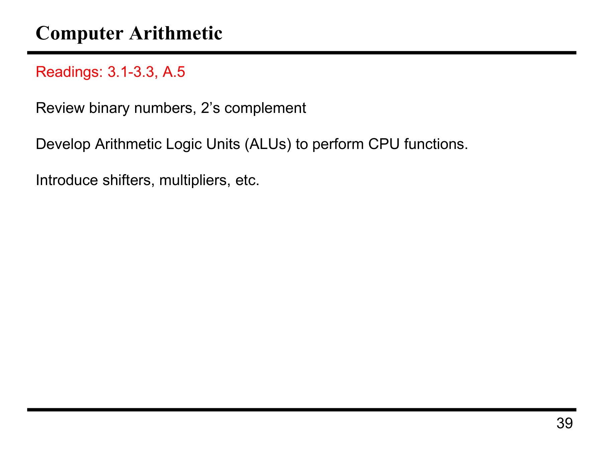
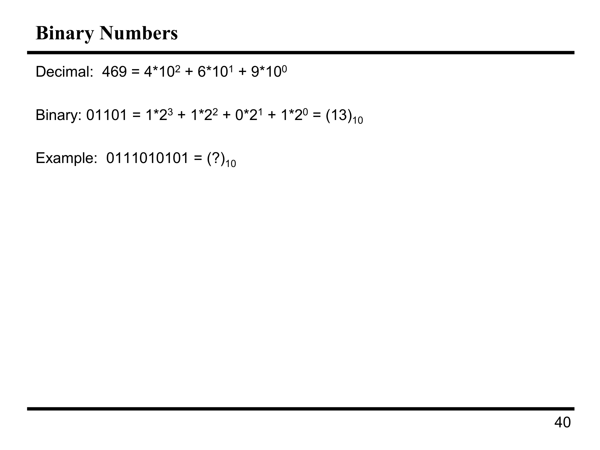
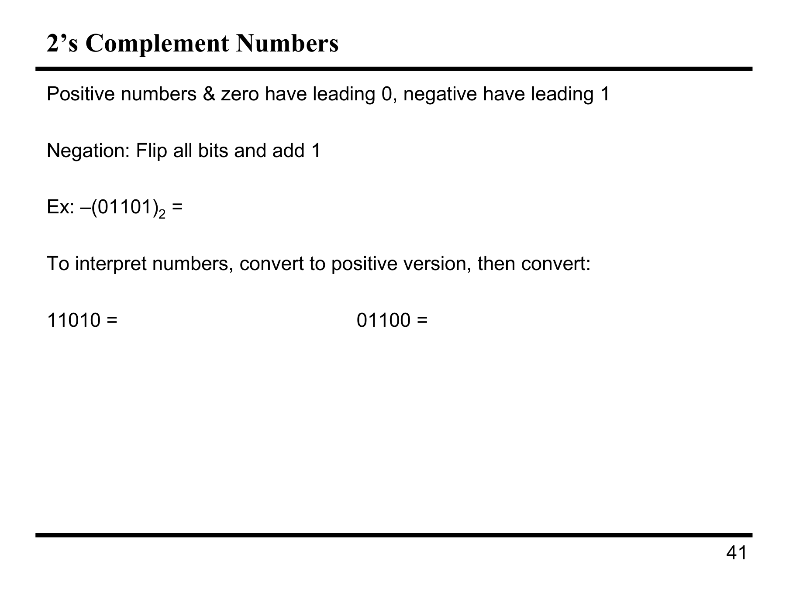
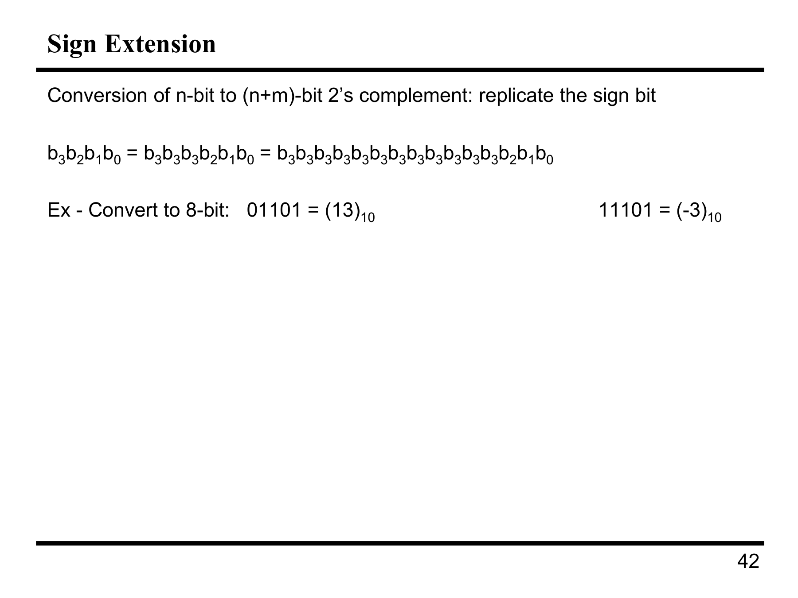
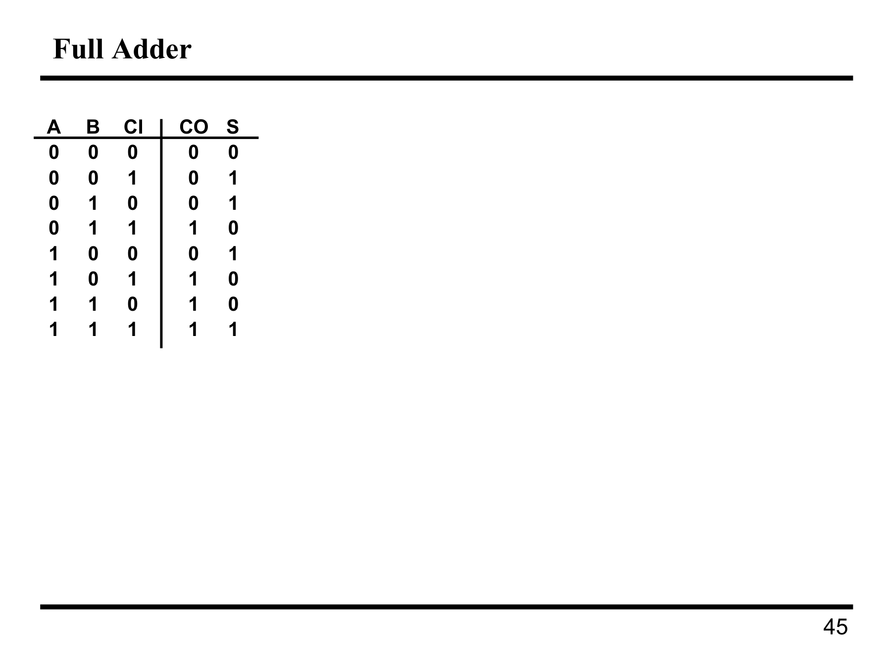
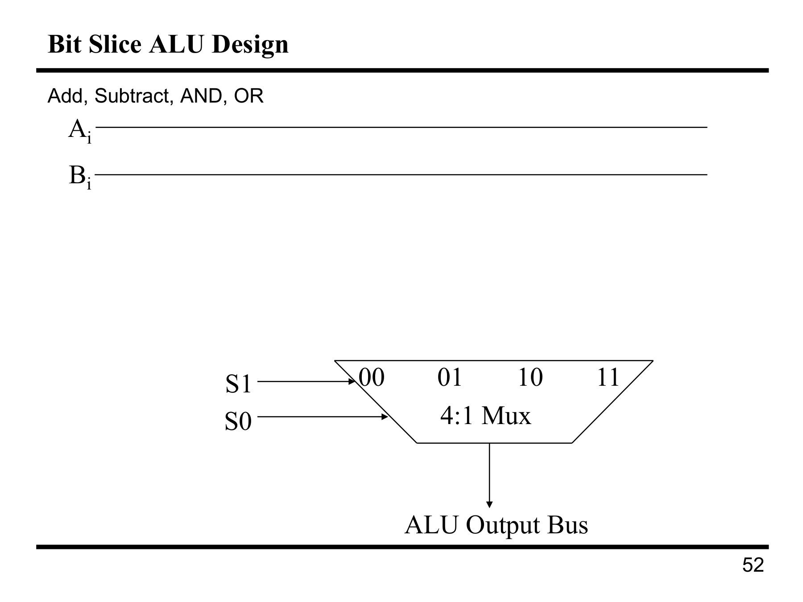
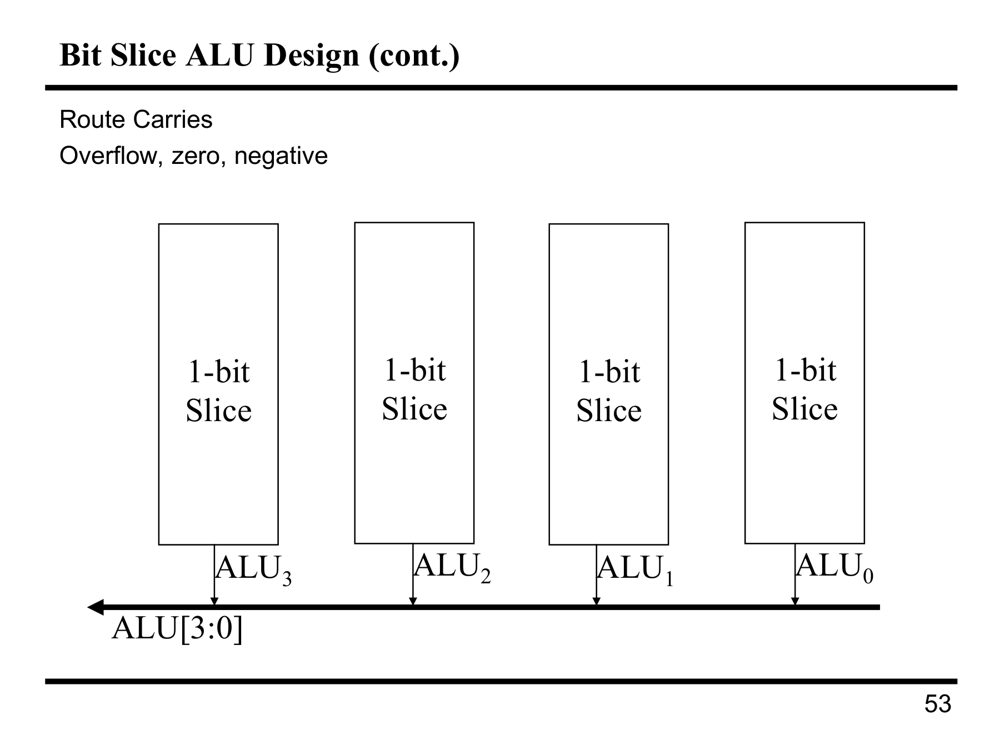
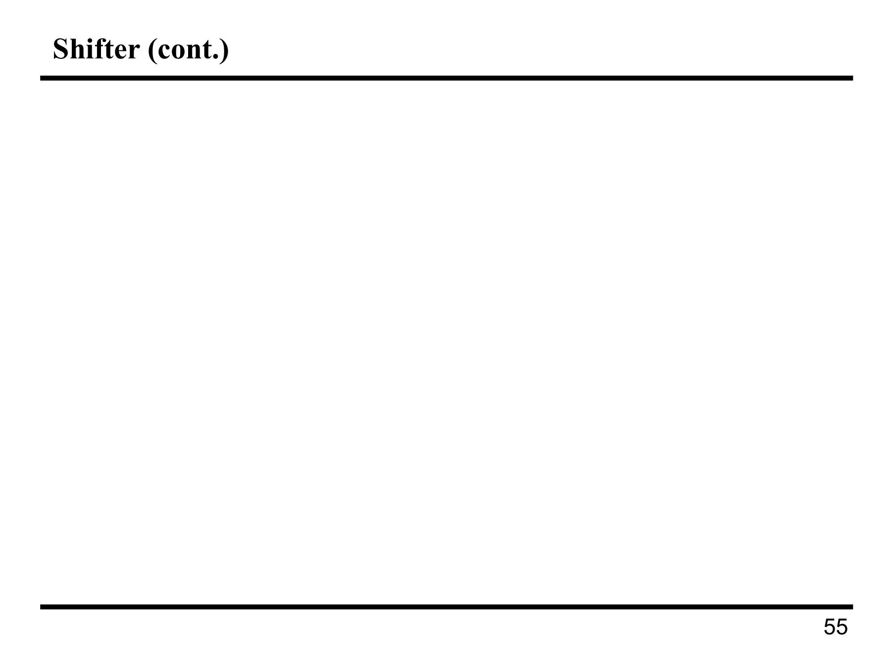
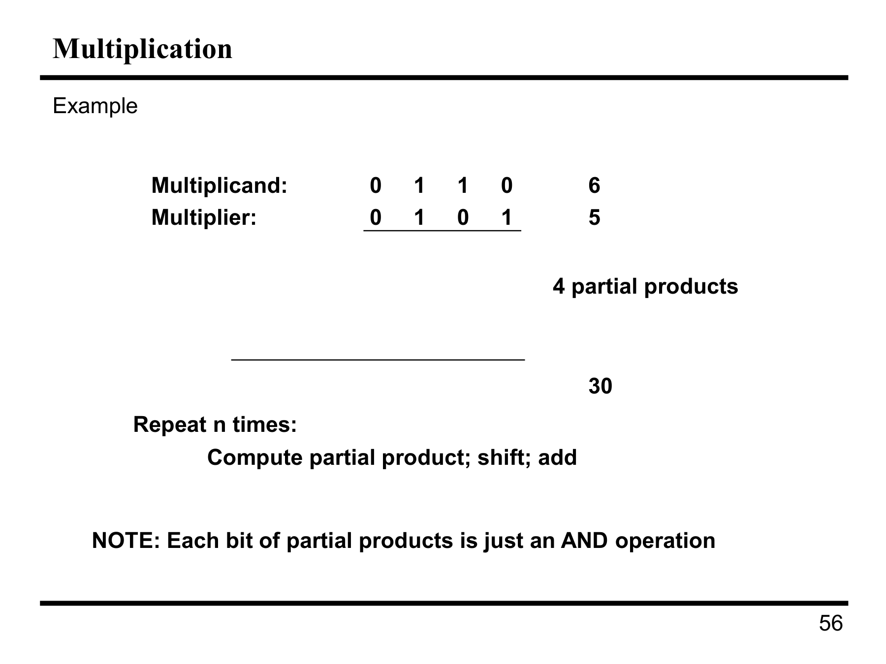

---

## 第 1 页



这是在讲一门计算机组成/体系结构课里“计算机算术（Computer Arithmetic）”这一章要做什么。逐条解释如下：

# 这页课件的意思

* **Readings: 3.1–3.3, A.5**
让你去教材中的第3章1–3节和附录A.5做预习/阅读（不同教材对应页码不同，意思是本章的基础内容和附录的进阶算术电路）。

* **Review binary numbers, 2’s complement**（回顾二进制与二进制补码）

* **二进制**：只用0和1表示数；每一位代表2的幂。
例：`1011₂ = 1×8 + 0×4 + 1×2 + 1×1 = 11₁₀`。
* **二进制补码（Two’s Complement）**：现代CPU表示有符号整数的标准方法。
表示范围：若有n位，范围是 `[-2^(n-1), 2^(n-1)-1]`。
求负数：对数的二进制**按位取反**再**加1**。
例：在8位下，`+5 = 0000 0101`，`-5 = 1111 1011`（取反`1111 1010`再加1）。
好处：加减法都可以用同一个加法器完成；0只有一种表示；溢出检测简单（看符号位进位/溢出标志）。

* **Develop Arithmetic Logic Units (ALUs) to perform CPU functions**
（开发/理解算术逻辑单元以执行CPU的运算）

* **ALU**是CPU里做算术与逻辑运算的核心组合电路/模块，典型支持：

* 算术：加、减（用补码加法实现）、比较、（有时）乘/除的子步骤；
* 逻辑：与（AND）、或（OR）、异或（XOR）、非（NOT）；
* 位移/旋转：左移、右移；
* 产生**标志位**：零标志Z、负号N、进位C、溢出V等，供条件跳转使用。
* 实现要点：由**全加器**阵列组成；为了速度可用**超前进位（carry lookahead）**、**超前进位块（CLA/CSLA/CSA）**等结构减少进位链延迟；还要用**多路选择器**在不同操作结果中选择。

* **Introduce shifters, multipliers, etc.**（介绍移位器、乘法器等）

* **移位器（Shifter）**：按位整体移动。

* **逻辑移位**：左/右空位补0（常用于无符号数）。
* **算术右移**：右移时最高位用符号位填充（保持负号，常用于有符号数除以2）。
* **循环/旋转（rotate）**：移出的位从另一端送回。
* 用途：快速实现×/÷ 2^k（左移k位≈乘2^k；右移≈除2^k 取整）、对齐、位操作。
* **乘法器（Multiplier）**：实现整数乘法的硬件。

* **移位-加法（Shift-and-Add）**：最基础。逐位扫描乘数，如果该位为1就把被乘数的移位版本加到部分和。
* **Booth算法**：对成串的1进行压缩，减少加法次数，适合补码。
* **并行乘法（阵列/Wallace树）**：用大量加法器并行压缩部分积，提高速度但面积/功耗更高。
* 现代CPU常用多级流水、部分并行与加速算法结合。
* **（“etc.”表示还会讲）**：除法器（恢复/非恢复除法、SRT）、浮点运算单元（FPU）、规格化、舍入、IEEE 754标准等。

# 小例子：补码加减与溢出

* 8位补码：`0111 1111`是最大正数`+127`，`1000 0000`是`-128`。
* 计算 `7 + (-3)`：
`7 = 0000 0111`，`-3 = 1111 1101`；
相加：`0000 0111 + 1111 1101 = 1111  (1)  0100`（丢弃最高进位）= `0000 0100` = `+4`。
* **溢出**：当两个相同符号相加却得到不同符号时发生（例如`+100`与`+100`在8位下会溢出）。硬件置V标志，供程序检测。

# 这章学完你应会

1. 熟练进行二进制与补码的表示、加减、溢出判定。
2. 说出ALU的组成、常见操作与标志位含义。
3. 区分逻辑/算术移位和旋转，并能用移位做快速乘除。
4. 理解硬件乘法（以及后续可能的除法、浮点）的基本思路与性能/面积权衡。

如果你愿意，我可以给你出一组二进制/补码练习题并一步步讲解。


---

## 第 2 页



这页在讲“进位制的位权表示”，并让你把一个二进制数换成十进制。
核心概念
十进制是以 10 为底：
469=4×10
2
+6×10
1
+9×10
0
。
二进制是以 2 为底：
例如 01101₂ = 0×2⁴ + 1×2³ + 1×2² + 0×2¹ + 1×2⁰ = 13₁₀。
每一位只可能是 0 或 1，位权分别是
2
k
。
例题
求：0111010101₂ = (?)₁₀
把它从左到右与对应的位权对应起来（这是 10 位数，最左是
2
9
）：
位（从左到右） 0 1 1 1 0 1 0 1 0 1
位权
2
9
2
8
2
7
2
6
2
5
2
4
2
3
2
2
2
1
2
0
贡献 0 256 128 64 0 16 0 4 0 1
把 1 对应的位权加起来：
256+128+64+16+4+1=469。
答案： 0111010101₂ = 469₁₀。
（注意最左边的前导 0 不影响数值。）


---

## 第 3 页



这页在讲\*\*二进制补码（Two’s Complement）\*\*如何表示有符号整数，以及如何“看懂/取负”。

# 关键规则

* 用 n 位补码表示时，**最高位（最左边）是符号位**：

* 0 开头 → 非负数（≥0）
* 1 开头 → 负数
* **取相反数**（Negation）：**按位取反**（0↔1）再**加 1**。
* n 位补码的范围：$-2^{n-1} \sim 2^{n-1}-1$。

---

## 例1：求负号

题：$- (01101)_2 = ?$（这里用 5 位表示）

1. 先对 `01101` 逐位取反 → `10010`
2. 再加 1 → `10010 + 00001 = 10011`

**答案：** $-(01101)_2 = 10011_2$（即 $-13$ 的 5 位补码）。

---

## 例2：如何**读懂**一个补码数

方法A（通用）：

* 若最高位是 0：按普通二进制转十进制。
* 若最高位是 1：先取它的**正数版本**（取反加1），得到大小，再加上负号。

方法B（快速心算）：

* 把最高位当作负权 $-2^{n-1}$，其余位还是 $2^{k}$ 正权，直接加权求和。

> 下面两个都是 5 位数（权值依次是 $-16, 8, 4, 2, 1$）

### 1) `11010` =

* 最高位为 1 → 负数。
* **方法A**：取反 `00101`，加1得 `00110` (= 6)。所以原数是 **−6**。
* **方法B**：$-16 + 8 + 0 + 2 + 0 = -6$。
**答案：** `11010₂ = -6₁₀`。

### 2) `01100` =

* 最高位为 0 → 正数。
* 直接当无符号：$0×16 + 1×8 + 1×4 + 0×2 + 0×1 = 12$。
**答案：** `01100₂ = 12₁₀`。

> 小结：
>
> * 取负：取反 + 1
> * 读数：最高位 1 就先“还原为正”再读；或用负权法直接加权。


---

## 第 4 页



这页讲的是**符号扩展（Sign Extension）**：把一个 **n 位的二进制补码数**，安全地扩成 **(n+m) 位**，而**不改变它的数值**。

# 规则（两句话记住）

* **补码的符号位 = 最高位(MSB)**：0 表示非负，1 表示负数。
* **做符号扩展时，只需把最高位复制到新增的高位上**（复制 m 次）。
也就是：正数前面补 `0`，负数前面补**同样数量**的 `1`。

这样做能保持数值不变，因为在补码里，最高位携带的权值是 $-2^{n-1}$；继续在更高位放入相同的符号位，相当于加上/减去相同的幂权组合，整体值不变。

---

# 例子：扩展到 8 位

原来都是 **5 位补码**。

1. `01101₂ = (+13)₁₀`（最高位 0 → 正数）
符号扩展：在左边补 3 个 **0**
**结果：**`00001101₂`（仍然是 $13$）

2. `11101₂ = (-3)₁₀`（最高位 1 → 负数）
符号扩展：在左边补 3 个 **1**
**结果：**`11111101₂`（仍然是 $-3$；取反加 1 得 `00000011` → 大小 3，加负号）

---

# 小贴士 & 易错点

* **无符号数**扩展用**零扩展**（只补 0），**有符号补码**扩展必须**复制符号位**。
* **算术右移**会复制符号位，本质上就是在做符号扩展；**逻辑右移**则在左侧补 0。
* 只有在**同一宽度**里比较大小/做运算才有意义；跨宽度先做符号扩展再运算。


---

## 第 5 页


这页在讲**加减法在十进制与二进制中的做法**，以及二进制减法如何用**补码相加**来实现。把图上的三个算式都算出来并说明步骤：

# 1) 十进制竖式加法

$$
\begin{aligned}
\ \ \ \ \ \ \ 57892\\
+ \ \ \ \ 78956\\
\hline
\ \ \ \ 136{,}848
\end{aligned}
$$

就是逐位相加、逢十进一。**结果：136,848。**

# 2) 二进制竖式加法

$$
\begin{aligned}
\ \ \ \ \ \ \ 1010111_2\\
+ \ \ \ \ 0100101_2\\
\hline
\ \ \ \ \ 1111100_2
\end{aligned}
$$

二进制同理是“逢二进一”。
可验证：$1010111_2=87$，$0100101_2=37$，相加 $=124$，而 $124=1111100_2$。
**结果：1111100₂。**

# 3) 二进制减法 → 用补码变成加法

左边给的是：

$$
10100110_2 - 00010111_2
$$

做法：把被减数保持不变，把减数取**二的补码**（取反加1），然后**相加**：

* 减数 `00010111` 取反 `11101000`，再 +1 得 **`11101001`**。
* 相加：

$$
10100110_2 + 11101001_2 = \color{gray}{1}10001111_2
$$

丢弃最高位的进位（在固定位宽里溢出的那一位），得到 **`10001111₂`**。

数值核对：`10100110₂`=166，`00010111₂`=23，$166-23=143$，而 `10001111₂`=143。
**结果：10001111₂（= 143₁₀）。**

> 要点
>
> * 加法：二进制按位相加，逢二进一。
> * 减法：被减数 +（减数的补码）；相同位宽下丢弃最高进位即可。


---

## 第 6 页


这页讲**补码加法的溢出（overflow）**：当结果超出了给定位数能表示的范围时就发生溢出。

# 基本概念

* 用 **n 位二进制补码**表示有符号整数，范围是
$[-2^{n-1},\ 2^{n-1}-1]$
例如 4 位补码范围是 $[-8, 7]$。
* \*\*溢出判定（加法）\*\*有两个等价规则：

1. **同号相加却得到异号** ⇒ 溢出。
（正+正得负，或 负+负得正）
2. 看最高位（MSB）的进位：
**进位到MSB** 与 **从MSB的进位** 异或为 1，即
$\text{carry-in} \oplus \text{carry-out} = 1$ ⇒ 溢出。
（若两者相同，则无溢出）

---

# 图中例子（都以 4 位补码为例）

## 溢出

1. $5 + 3$
$0101_2 + 0011_2 = 1000_2$
5 与 3 同为正，但结果符号位变成 1（负数）→ **溢出**。
事实上 $5+3=8$ 超出 4 位补码上界 7。

2. $-7 + (-2)$
$-7 = 1001_2,\ -2 = 1110_2$
$1001 + 1110 = 0111$（得到正数 7）→ **溢出**。
真值是 $-9$，低于下界 $-8$。

## 不溢出

1. $5 + 2$
$0101 + 0010 = 0111$ (= 7) 在范围内 → **No overflow**。

2. $(-3) + (-5)$
$-3 = 1101,\ -5 = 1011$
$1101 + 1011 = 1000$ (= $-8$) 仍在范围内 → **No overflow**。
（两负相加得负，且结果等于最小可表示数，不算溢出；此时 MSB 的 carry-in 与 carry-out 相等。）

---

# 快速记忆

* 只在**同号相加**时可能溢出；**异号相加**不会溢出。
* 判断最稳妥：看结果符号是否与两个加数的符号一致；或用
$\text{carry-in}_{MSB} \oplus \text{carry-out}_{MSB}$ 检查。


---

## 第 7 页



这页是\*\*全加器（Full Adder）\*\*的真值表。
输入：A、B、**Ci**（低位传来的进位 carry-in）。
输出：**S**（该位的和 Sum）、**Co**（该位产生的进位 carry-out）。

表的含义：对 A、B、Ci 的 8 种组合，电路输出对应的 S 和 Co。如：

* 例：A=0,B=1,Ci=1 → 二进制 0+1+1=2 → **S=0，Co=1**（写成 `10₂`，低位是和，高位是进位）。

从表可推得**逻辑表达式**（也是实现公式）：

* **和位**：$S = A \oplus B \oplus Ci$
（奇偶性：三个输入中为1的个数为奇数 → S=1）
* **进位**：$Co = AB + BCi + ACi$
等价写法（用“生成/传递”思想）：

* 生成 $G = AB$
* 传递 $P = A \oplus B$
* $Co = G + P \cdot Ci$

直观理解：

* 当 A、B、Ci 中**至少两个**为 1 时（多数表决），会产生进位 Co=1。
* S 是“奇数个 1”为真。

工程用法：

* 用一个**半加器**（求 A⊕B 和 AB）再接一层与/或/异或，就能做出全加器。
* 把很多全加器级联（把上一位 Co 接到下一位 Ci），形成**脉动进位加法器（Ripple-Carry Adder）**来实现多位加法；用 $P/G$ 还能做**超前进位**以加速。


---

## 第 8 页


这页讲\*\*多位加法（Multi-Bit Addition）**是如何用多个**全加器（Full Adder）\*\*级联实现的。图里画的是把两个 **4 位数** $A_3A_2A_1A_0$ 和 $B_3B_2B_1B_0$ 相加。

# 结构与信号

* 每个小方框就是**1 位全加器**：输入本位的 $A_i, B_i$ 和来自低一位的**进位** $C_i$（图中写作 **CI**），输出本位的**和** $S_i$ 和传向更高位的**进位** $C_{i+1}$（图中写作 **CO**）。
* **最低位**（LSB，i=0）通常令 $C_0=0$（若要加三数可接外部进位）。
* 四个全加器从右到左**级联**：
$C_1\leftarrow C_0$ 的 CO，$C_2\leftarrow C_1$ 的 CO，依次传到最高位。
* 输出的和为 $S_3S_2S_1S_0$，最高位的进位 $C_4$ 是**最终进位**（可能用于检测无符号溢出；有符号溢出看符号位进位异或）。

# 每位的逻辑（回忆全加器）

* 和：$S_i = A_i \oplus B_i \oplus C_i$
* 进位：$C_{i+1} = A_iB_i + (A_i \oplus B_i)C_i$
（生成 $G_i=A_iB_i$，传递 $P_i=A_i\oplus B_i$：$C_{i+1}=G_i+P_iC_i$）

# 关键特性

* 这种逐级把进位**串行传递**的结构叫 **脉动进位加法器（Ripple-Carry Adder, RCA）**。

* **优点**：电路简单、面积小。
* **缺点**：延迟与位宽成正比（最坏情况下进位要“波及”到最高位）。
* 为了更快，实际CPU常用\*\*超前进位（Carry Lookahead）\*\*或分块超前等结构，用 $P/G$ 在多位上并行地计算进位，减少延迟。

# 溢出提示

* **无符号**：看最终进位 $C_4$。
* **有符号（补码）**：看最高位的**进位入**和**进位出**是否不同（异或为1 ⇒ 溢出），或“同号相加得异号”判定。

这张图的核心信息就是：**N 位加法 = N 个全加器 + 逐级传递进位**。


---

## 第 9 页


这页在讲**同一套硬件**既能做加法又能做减法——**Adder/Subtractor（加/减器）**。图里还是4位（A₃..A₀ 与 B₃..B₀），每一位是一块**全加器**，串成脉动进位结构，输出 S₃..S₀。

# 核心思想：把减法变成加法

$$
A - B \;\;=\;\; A + (\underbrace{\overline{B}+1}_{B\text{ 的二进制补码}})
$$

所以，只要让同一串**加法器**在两种模式下工作即可：

* **加法模式（ADD）**：直接做 $A + B$
* **减法模式（SUB）**：把 $B$ 取反再在最低位送入进位1，做 $A + \overline{B} + 1$

# 一根“模式线”就能切换

设**模式位 M**：`M=0` 表示加法，`M=1` 表示减法。

* **送入加法器的 B’**：

$$
B'_i = B_i \oplus M
$$

（M=1 时把 B 的每一位取反；M=0 时保持不变）
* **最低位进位 $C_0$**：

$$
C_0 = M
$$

（M=1 时补上“+1”）
* **各位的和与进位**（全加器公式）：

$$
S_i = A_i \oplus B'_i \oplus C_i,\qquad
C_{i+1} = A_iB'_i + (A_i \oplus B'_i)C_i
$$

这样四个全加器从右到左级联，既完成 $A+B$ 也完成 $A-B$。

# 例子

* **加法**（M=0）
$A=0110_2(6),\; B=0011_2(3)$
$B' = B$；$C_0=0$
结果：$0110+0011=1001_2(=9)$

* **减法**（M=1）
$A=0110_2(6),\; B=0011_2(3)$
$B'=\overline{0011}=1100$；$C_0=1$
$0110+1100+1 = 1\,0011$（丢最高外溢进位）→ **0011 (=3)**
再试 $3-6$：
$0011 + \overline{0110}(1001) + 1 = 1101$ → **-3**（5位补码为 1 1101，截成4位得到 −3）

# 溢出（Overflow）怎么判

**有符号数（补码）**：和加法一样——看**最高位**的**进位入**与**进位出**是否不同

$$
V = C_{n-1\;(\text{in})} \oplus C_{n-1\;(\text{out})}
$$

或用“同号相加得异号”的规则（注意 SUB 在做 $A + \overline{B}+1$）。
**无符号数**下做减法时的**借位**可以用最终进位判断：

* 用 $A + \overline{B} + 1$ 实现减法时，**最终进位 $C_n=0$** 表示发生了**借位**（即 $A<B$）。

# 小结

* 一根模式线 M 控制“B 是否取反”和“最低位是否加 1”。
* 同一串全加器即可完成 $A+B$ 与 $A-B$。
* 溢出检测：补码下仍是“MSB 进位入 ⊕ 进位出”。


---

## 第 10 页


这页在讲“如何调试较复杂的电路”，并给了一个**例子电路：判断 A+B 是否大于 7**。

# 图里电路在做什么

* 右到左是一串**脉动进位加法器**（Ripple-Carry）。
* A、B 各是 **3 位无符号数**：$A_2A_1A_0$、$B_2B_1B_0$。
* 最右边用 **半加器**（Half Adder）算最低位 $A_0+B_0$（因为最低位没有进位输入）。
* 中间两个是 **全加器**（Full Adder），分别算第1位和第2位（把低位产生的进位串到高位）。
* 最左边还有一个 **全加器**，它的两个数据输入固定为 **0、0**，只把来自前一位的进位作为 **输入进位**。

* 对于 0 + 0 + $C_{in}$：**和 S = $C_{in}$**，**进位 $C_{out}=0$**。
* 因此它的“和”引脚就等于**前一位的最终进位**。

电路把这个“和”接到 **Out**：
**Out = 1 当且仅当 A+B 产生了从最高位的进位。**

# 为什么这就等价于 “A+B>7”

* 3 位无符号数的最大值是 7（$2^3-1$）。
* 两个 3 位数相加若 **≥8**，就会从最高位产生**进位 1**。
* 于是 Out=1 ⇔ $A+B \ge 8$ ⇔ **$A+B>7$**；否则 Out=0。

# 小例

* $A=101_2(5)$, $B=011_2(3)$ → 和 $=1000_2$，最高位有进位 → **Out=1**（5+3=8>7）。
* $A=011_2(3)$, $B=100_2(4)$ → 和 $=111_2$，无最终进位 → **Out=0**（3+4=7≤7）。

# 调试要点（这页标题想表达的）

* 复杂电路要**逐级跟踪信号**：从最低位的和与进位开始，一路看进位如何传播到最高位。
* 不要“推倒重来”，而是**明确每个子模块功能**（半加器/全加器）与连线方向，验证关键中间量（特别是**进位链**）。


---

## 第 11 页


这页是上一页“判断 **A+B>7** 的加法链”的 **Verilog 实现与调试**。含 3 个模块：`fullAdd`、`halfAdd`、`greaterThan7`。重点是看懂端口、连线，以及找出常见的“接线/命名”错误。

---

## 1) `fullAdd`（全加器）

```verilog
module fullAdd (Cout, S, A, B, Cin);
output Cout, S;  input A, B, Cin;

assign Cout = (A&B) | (A&Cin) | (B&Cin); // 进位：AB + A·Cin + B·Cin
assign S    = A ^ B ^ Cin;               // 和：A⊕B⊕Cin
endmodule
```

这是标准 1 位全加器的布尔方程。

---

## 2) `halfAdd`（半加器）

半加器相当于“Cin 固定为 0”的全加器。**图里代码有问题**：实例化时写成

```verilog
fullAdd a1(.Cout, .S, .A, .B, .Cin);
```

* 这既不像位置连接，也不像 Verilog-2001 的命名连接`.port(signal)`；若按 SystemVerilog 的简写`.port`，`halfAdd` 作用域里并没有 `Cin` 这个信号，会报错。
* 就算能通过，也**没有把 Cin 置为 0**，不满足半加器定义。

**正确写法：**

```verilog
module halfAdd (Cout, S, A, B);
output Cout, S;  input A, B;
fullAdd a1(.Cout(Cout), .S(S), .A(A), .B(B), .Cin(1'b0)); // Cin=0
endmodule
```

---

## 3) `greaterThan7`（顶层：判断 A+B>7）

逻辑：把 A、B（各 3 位无符号）相加。最左再接一个“0+0+最高位进位”的全加器，它的 **S** 就等于最高位进位，用作 `Out`。因此 `Out=1` ⇔ **A+B≥8（即 >7）**。

课件代码（缩略）：

```verilog
module greaterThan7 (Out, A, B);
output Out;  input [2:0] A, B;  wire [3:0] C, S;

halfAdd pos0(.Cout(C[0]), .S(S[0]), .A(A[0]), .B(B[0]));
fullAdd pos1(.Cout(C[1]), .S(S[1]), .A(A[1]), .B(B[1]), .C(C[0]));
fullAdd pos2(.Cout(C[2]), .S(S[2]), .A(A[2]), .B(B[2]), .C(C[1]));
fullAdd pos3(.Cout(C[3]), .S(Out), .A(1'b0), .B(1'b0), .C(C[2]));
endmodule
```

这里还有一个**连接名错误**：`fullAdd` 的端口名是 `Cin`，但实例化用的是 `.C(...)` —— 这会**连不到**正确的端口。

**修正后完整版本：**

```verilog
module fullAdd (Cout, S, A, B, Cin);
output Cout, S;  input A, B, Cin;
assign Cout = (A&B) | (A&Cin) | (B&Cin);
assign S    = A ^ B ^ Cin;
endmodule

module halfAdd (Cout, S, A, B);
output Cout, S;  input A, B;
fullAdd a1(.Cout(Cout), .S(S), .A(A), .B(B), .Cin(1'b0)); // Cin=0
endmodule

module greaterThan7 (Out, A, B);
output Out;  input [2:0] A, B;
wire [3:0] C; wire [2:0] S; // S 仅为调试可选

halfAdd pos0(.Cout(C[0]), .S(S[0]), .A(A[0]), .B(B[0]));
fullAdd pos1(.Cout(C[1]), .S(S[1]), .A(A[1]), .B(B[1]), .Cin(C[0]));
fullAdd pos2(.Cout(C[2]), .S(S[2]), .A(A[2]), .B(B[2]), .Cin(C[1]));
fullAdd pos3(.Cout(C[3]), .S(Out), .A(1'b0), .B(1'b0), .Cin(C[2])); // Out=最终进位
endmodule
```

---

## 调试要点（为什么这页叫“调试复杂电路”）

1. **核对端口名**与**连线名**（`Cin` vs `C`、是否常量 0/1）。
2. **从低位到高位**逐步跟进 `Cout/Cin` 是否正确串接。
3. 检查**模式/常量输入**（半加器的 `Cin=0`、最左全加器的 A=0、B=0）。
4. 用几组值快速验证：

* A=5(101), B=3(011) → Out=1（≥8）
* A=3(011), B=4(100) → Out=0（=7）

修正后，这段代码就精确实现了“**A+B 是否大于 7**”。


---

## 第 12 页


这页在讲**调试（debug）数字电路的步骤与心法**。核心是：**别推翻重写（DO NOT RIP UP），要系统地定位错误点**。

# 要点逐条解释

* **Test all behaviors（穷举测试）**
对于小电路/子模块，把**所有输入组合**都测一遍（或至少覆盖关键情况）。得到一张真值表/波形，确定哪些输出与预期不符。

* **Identify any incorrect behaviors（找出不正确的现象）**
明确列出失败用例：输入是什么、期望输出是什么、实际是什么。先收集事实，再动手改。

* **Examine inputs and outputs to find earliest place where value is wrong（定位最早出错点）**

* **From bad outputs backwards（从坏输出往回追）**：从最终错误的输出出发，沿着连接**逆向**查看上一层信号是否正确，直到找到**第一个**变错的节点。
* **Forward from inputs（从输入往前推）**：从电路输入开始，逐级计算/观察应该得到的中间值，与实际测到的比较。
* **Look at intermediate points（观测中间节点）**：在关键中间线（如各级进位、选择器控制线）上插探针/打印波形，别只看输入和最终输出。

* **DO NOT RIP UP, DEBUG!（不要重写，先调试）**
不要因为几个用例不通过就推倒重来。多数问题是**接线/命名/位宽/极性**等小错；系统化地查能更快更稳。

# 一个应用小例（A+B>7 的加法链）

1. 先用几组关键输入测：
`A=101, B=011 → 8，应 Out=1`；`A=011, B=100 → 7，应 Out=0`。
2. 若失败，**观测中间进位** `C0,C1,C2`：

* 低位半加器是否把 `Cin=0`？
* `C1` 是否正确传到下一全加器的 `Cin`？
* 最左“0+0+Cin”的全加器**S**是否等于 `C2`？
3. 若某级不对，继续往前/往后查该级的 A/B/Cin 是否接错、位宽是否错、端口名是否写错（如 `Cin` 写成 `C`）。

# 常见易错点清单

* 端口名/连线名不匹配（`.Cin(...)` 写成 `.C(...)`）。
* 位宽不一致（\[2:0] ↔ \[3:0]）。
* 常量极性错误（半加器 `Cin` 应为 `1'b0`）。
* 控制信号取反/未同步导致的器件选择错误。

照这套流程，你能**快速锁定“第一个出错的节点”**，最小化修改范围，稳定地修好复杂电路。


---

## 第 13 页


这页介绍 **ALU（Arithmetic Logic Unit，算术逻辑单元）**——CPU 里专门做“算术 + 逻辑”运算的核心模块。

# 它接收什么

* **数据输入**：两路 n 位操作数 **A**、**B**。
* **控制输入（Function Select / Controls）**：来自指令译码器的若干控制位，决定这次到底做哪一种运算。

# 它产出什么

* **主结果 R**：n 位的运算结果（如 A+B、A-B、A AND B、A XOR B…）。
* **状态标志（flags）**：供后续指令/分支使用的单比特信号，例如：

* **Zero**：`R == 0` 时为 1。常用于 `beq`、`bne`。
* **Negative**：补码表示下，`R` 的最高位（MSB）。用于有符号比较。
* **Overflow**：有符号加/减发生溢出时为 1（最高位的进位入 ⊕ 进位出 = 1；等价于“同号相加得异号”）。

> 许多实现还会有 **Carry**（无符号进位/借位）、**Parity** 等，这张图只列了三种常见的。

# 典型能做的操作（由控制位选择）

* **算术**：`ADD`（A+B）、`SUB`（A−B，实际是 A + (¬B + 1)）、有时还包括 `INC/DEC`。
* **逻辑（按位）**：`AND`、`OR`、`XOR`、以及由它们派生的 `NAND`、`NOR`。
* **比较**：`==`、`<` 等通常由“减法 + 标志位/符号位”实现：

* `A==B` → 计算 `A−B`，检查 **Zero**；
* `A<B`（有符号）→ 计算 `A−B`，用 **Negative ⊕ Overflow**；
* `A<B`（无符号）→ 看 **Carry**/借位（本图未画出）。

# 内部大致怎么做

* **一条加法通路**：由多位全加器（可能带超前进位）实现，加法/减法/比较共享。
* **一条逻辑通路**：并行计算 A AND B、A OR B、A XOR B…
* **多路选择器（MUX）**：由控制位选择哪条通路的结果作为 **R**。
* **标志生成**：对 R 或加法器内部信号做组合逻辑得到 Zero/Negative/Overflow（和/或 Carry）。

# 小例子（8 位）

* 控制=ADD：`A=0x34, B=0xF0 → R=0x24`，`Negative=0`，`Zero=0`，`Overflow=0`。
* 控制=SUB：`A=0x10, B=0x90 → R=0x80`，`Negative=1`，若视为有符号则 `Overflow=0`（-128 合法）。
* 控制=AND：`A & B`；控制=OR：`A | B`；控制=XOR：`A ^ B`；Zero 由结果是否全 0 决定。

一句话总结：**ALU=加法器通路 + 逻辑通路 + 结果选择 + 标志产生**，通过控制位在一个时钟周期里完成指令所需的底层运算，并把**结果 R**与**状态标志**交给后续流水级/控制逻辑使用。


---

## 第 14 页



这页在说明位切片（bit-slice）ALU的设计思路：用一套每位相同的小模块，在每一位上并行计算多种候选结果（加/减、AND、OR），再用**多路选择器（MUX）**由控制信号选出本次需要的那一种，所有位的输出拼成“ALU Output Bus”。
元件与信号
Aᵢ、Bᵢ：第 i 位的两个操作数输入（所有位都有同名的 Aᵢ、Bᵢ）。
S1、S0：功能选择控制线（来自指令译码），送入一个4选1多路复用器（4:1 Mux）。
ALU Output Bus：把每位选出来的结果拼成 n 位的 R。
位切片里同时算的四条通路
在每一位 i 内部，Aᵢ、Bᵢ同时喂给：
AND 通路：Aᵢ AND Bᵢ
OR 通路：Aᵢ OR Bᵢ
加法通路：由全加器计算 Aᵢ + Bᵢ + Cᵢ（进位来自低位，送往高位），得到和位 Sumᵢ
减法通路：本质也是加法：Aᵢ + (¬Bᵢ) + 1（把 Bᵢ 与“减法模式位”异或，并让最低位进位=1）
在实际实现里，加/减常共享同一条“加法器通路”，用一位“减法/加法模式 M”控制：
Bᵢ' = Bᵢ ⊕ M，最低位 C₀ = M。
M=0 → Bᵢ'=Bᵢ、C₀=0 ⇒ 加法
M=1 → Bᵢ'=¬Bᵢ、C₀=1 ⇒ 减法
4:1 Mux 的作用
多路复用器把上述候选结果中的一个送到该位的输出；所有位并排构成整体结果 R。
两位控制可映射为任意编码，举例（仅示意）：
S1S0=00 → AND
01 → OR
10 → ADD
11 → SUB
（具体映射由你在数据通路中如何连线决定。）
为什么用“位切片”
可扩展：1 位切片设计好，级联 N 份就是 N 位 ALU。
并行：AND/OR 等逻辑运算每位独立；进位链只在算术操作时穿过切片。
易控制：用少量控制线（S1、S0 以及加/减模式位）即可选择功能；标志位（Zero/Negative/Overflow/Carry）在总线上再由简单逻辑产生：
Negative = 结果 MSB
Zero = 所有位为 0
Overflow（有符号）= 最高位进位入 ⊕ 最高位进位出
一句话：位切片 ALU=“每位并行算多个候选结果 + 4:1 Mux 按 S1/S0 选其一 +（算术时）用进位链连接各位”。这样结构清晰、易扩位、易控制。


---

## 第 15 页



这页是**位切片 ALU（Bit-Slice ALU）**的继续说明：把多个“**1-bit Slice**（一位切片）”从低位到高位级联成一个 4 位 ALU，并解释**进位链**与**标志位**（overflow / zero / negative）如何产生与布线。

# 版面在表达什么

* 图中有 4 个**1-bit Slice**：从右到左分别是 **ALU₀（LSB）**, **ALU₁**, **ALU₂**, **ALU₃（MSB）**。
* 下方 **ALU\[3:0]** 是结果总线（R 的 4 位），每个切片给出自己那一位的结果并接到这条总线上。
* 标题“Route Carries, Overflow, zero, negative”提示：要把**进位**在切片间正确路由，并在最顶层生成**标志位**。

# 进位如何在切片间传递

* 每个切片都有 `Cin`（从低一位来的进位）和 `Cout`（送到高一位的进位）。
* **加法**：`Cin₀=0`，链路：`Cout₀→Cin₁→Cout₁→…→Cin₃`。
* **减法**（A − B）：共用加法器通路，令 `B' = B ⊕ M`、`Cin₀ = M`（`M=1` 表示减法，相当于 `A + ¬B + 1`）。
* **逻辑运算**（AND/OR/XOR…）：不使用进位，`Cin`/`Cout`可忽略或保持连通。

# 标志位怎么从切片/总线得到

* **Negative（N）**：结果的最高位（MSB）。

$$
N = \text{ALU}[3]
$$
* **Zero（Z）**：结果全部为 0。常用“或归约”判断：

$$
Z = \neg(\text{ALU}[3] \lor \text{ALU}[2] \lor \text{ALU}[1] \lor \text{ALU}[0])
$$

硬件上可做成 OR-树以减少延迟。
* **Overflow（V，有符号溢出）**：最高位的**进位入**与**进位出**不相同：

$$
V = C_{\text{in@MSB}} \oplus C_{\text{out@MSB}}
$$

在 4 位里就是 `V = Cin₃ ⊕ Cout₃`。这等价于“同号相加得异号”。
* （可选）**Carry（C，无符号进位）**：通常取**最终进位** `Cout₃`，用于无符号加/减判定借位。

# 控制信号与切片复用

* 所有切片共享同一组功能选择线（如 `S1,S0` 以及加/减模式 `M`）。
* 每个切片**并行**计算候选结果（AND/OR/加法器和位…），用片内的 MUX 由 `S1,S0` 选出该位的输出，送到 **ALU\[i]**。

# 小结

* **位切片** = “把一位的 ALU 逻辑做成模块”，再**按位级联**。
* **进位链**只在算术操作时跨切片传播；逻辑操作各位独立。
* **标志位**在顶层由结果总线与最高位进位信号组合而成：

* `N = MSB`，`Z = ~(OR-reduce(ALU[3:0]))`，`V = Cin_MSBl ⊕ Cout_MSB`（可再输出 `Cout_MSB` 作无符号进位）。

这就是图中“Route Carries / Overflow, zero, negative”的含义：正确**布线进位**并**生成标志位**，就得到一个可扩展的 N 位 ALU。


---

## 第 16 页


这页在讲**移位器（Shifter）**的结构化做法——也就是**桶形移位器（barrel shifter）**。它能把一个 n 位数 $A$ 按给定的“移位量”一次性左移或右移很多位，比如图上写的 **$A \ll 001101_2$**（把 $A$ 左移 13 位，因为 $001101_2=8+4+1$）。

# 关键思想：分级“可选移位”

把“移多少位”拆成二进制的各个位，每一位控制**一层**“是否移固定的位数”，层层叠加即可：

* **第1层：可选左移 1 位**（由控制位 $b_0$ 决定）

* 若 $b_0=0$：本层不移位，直接透传 $A_i \to R_i$
* 若 $b_0=1$：每一位左移 1：$A_{i-1} \to R_i$，最低位补 0
* 形式化：$R_i^{(1)}=\; b_0?A_{i-1}:A_i$（越界处用 0）

* **第2层：在上一层结果基础上可选左移 2 位**（由 $b_1$ 决定）

* 若 $b_1=0$：透传 $R_i^{(1)} \to R_i^{(2)}$
* 若 $b_1=1$：左移 2：$R_{i-2}^{(1)} \to R_i^{(2)}$，低两位补 0
* 形式化：$R_i^{(2)}=\; b_1?R_{i-2}^{(1)}:R_i^{(1)}$

继续做**可选左移 4、8、16、…**，直到覆盖最大移位量。
例如 64 位数据 $A_{63..0}$，需要 6 层（1、2、4、8、16、32）。图里只画了前两层（1 与 2）。

> 这就是“桶形移位器”——深度是 $\log_2 n$，每层一堆 2:1 复用器，**并行一次完成**任意移位。

# 为什么 $A \ll 001101_2$ 等于移 13 位

把移位量按二进制分解：
$001101_2 = 8 + 4 + 1$。

* 第1层 $b_0=1$：先左移 1
* 第3层 $b_2=1$：再左移 4
* 第4层 $b_3=1$：再左移 8
其它层的控制位是 0（不移）。合起来等价于**左移 13 位**。

# 索引示意（左移）

以第1层为例（图中行间对齐展示的意思）：

* 上行是输入 $A_{63},A_{62},\dots,A_0$
* 下行是输出 $R_{63},R_{62},\dots,R_0$
当 $b_0=1$ 时：
$R_0 \leftarrow 0,\; R_1 \leftarrow A_0,\; R_2 \leftarrow A_1,\; …,\; R_{63} \leftarrow A_{62}$

第2层同理，只是偏移 2 位。

# 小补充

* **左移**默认右侧补 0（逻辑左移）。
* **右移**可做“逻辑右移”（左补 0）或“算术右移”（左补符号位），实现方式同理，只是取索引和补位不同。
* 复杂度：**面积 $O(n\log n)$**、**延迟 $O(\log n)$**，远快于“逐位级联移位”。

一句话：这页展示了桶形移位器的两层示意——**每层由一个控制位决定是否移固定步长（1、2、4、…）**，多层串起来即可实现“任意移位量”的一次性移位。


---

## 第 17 页



这页标题是 “Shifter (cont.)”，但内容留空，意思是**继续补充移位器**的知识点。把关键补充点一次讲全：

# 1) 三类常见移位/旋转

* **逻辑左移 LSL / 左移 << k**：低位补 0。

* 无符号下相当于乘 $2^k$（若不溢出）。
* **逻辑右移 LSR / 右移 >> k**：高位补 0。

* 无符号下相当于除以 $2^k$ 向下取整。
* **算术右移 ASR**：高位用**符号位**填充（保持正负号）。

* 有符号补码下近似等于除以 $2^k$ 向下取整（负数会“更负”）。
* **循环/旋转 ROL/ROR**：移出的位从另一侧“绕回”。常用于密码/校验、位排列；不会丢信息。

# 2) 桶形移位器（Barrel Shifter）实现回顾

* 用 $\log_2 n$ 层 2:1 复用器：第0层可选移 1 位，第1层移 2 位，第2层移 4 位……
* 移位量用二进制 `b[k:0]` 控制各层是否“生效”。
* 复杂度：**延迟 $O(\log n)$**、面积 $O(n\log n)$\*\*；比逐位链式快得多。

# 3) 左/右移的边界与填充值

* **左移**：右侧补 0；溢出位可选输出为 **CarryOut**（最后移出的那一位）。
* **逻辑右移**：左侧补 0。
* **算术右移**：左侧补 **输入的符号位**（MSB）。
* **旋转**：用被移出的位回填；常把“移出的最高位”作为进位标志。

# 4) 与 ALU 标志位的关系（常见做法）

* **Z（Zero）**：结果全 0。
* **N（Negative）**：结果的 MSB（算术右移会保持 N）。
* **C（Carry/移出位）**：

* 左移：C 取被推出的最高位；
* 右移：C 取被推出的最低位；
* 旋转：C 通常等于旋回之前被推出的位。
* **V（Overflow）**：移位通常**不置溢出**（V=0），除非 ISA 特别规定。

# 5) 小例子（8 位）

* `A = 0b1011_0010 (0xB2)`

* `A << 3 = 1001_0000`，C=原 MSB 串行移出的第3位=1。
* `A >>_logic 3 = 0001_0110`，C=原 bit2=1。
* `A >>_arith 3`（把 MSB=1 向左补）：`1111_0110`（保留负号）。
* `ROL(A,3) = 1001_0101`；`ROR(A,3) = 010_1011_0 → 0101_0110`。

# 6) Verilog/系统级实现要点

* \*\*桶形移位器（左移）\*\*示意：

```verilog
// n位、移位量shamt
wire [n-1:0] s1 = shamt[0] ? {A[n-2:0], 1'b0}     : A;
wire [n-1:0] s2 = shamt[1] ? {s1[n-3:0], 2'b00}   : s1;
wire [n-1:0] s3 = shamt[2] ? {s2[n-5:0], 4'b0000} : s2;
// …直到覆盖最大位移
assign R = s_last;
```
* **算术右移**可用 `>>>`（SystemVerilog）或用符号扩展逻辑实现：

```verilog
assign R = $signed(A) >>> shamt;
```
* **旋转**可用连接与选择拼接：

```verilog
assign R = (A << k) | (A >> (n-k)); // ROL
```

# 7) 设计/时序注意

* 桶形移位器在高位宽时扇出大、布线重——放在 ALU 的**非关键路径**或**单独流水**有助提频。
* 若只需小移位量（如 1、2、4），可裁剪层数以省面积/功耗。
* 对算术右移要**确认位宽与符号位**，避免把无符号数误当有符号数扩展。

这就是“Shifter（续）”应补充的核心内容：**支持多种移位/旋转；用桶形结构按位控制；正确处理填充值与标志位；实现与时序要点**。


---

## 第 18 页



这页在讲**二进制乘法的“移位-相加（shift-and-add）”法**，并用例子说明：
被乘数（multiplicand）`0110₂ = 6`，乘数（multiplier）`0101₂ = 5`。结果应为 `30`（`11110₂`）。

# 思想

把乘数逐位查看：若某位为 1，就把被乘数左移相应位数并加到部分和；若为 0，就加 0。**每一行“部分积（partial product）”的每一位其实就是 `A_i AND b_j`**，因此“生成部分积=一排 AND 门 + 左移”。

# 例子：6 × 5

乘数 `0101₂` 从最低位到最高位是 `b₀=1, b₁=0, b₂=1, b₃=0`（共 4 位 → **4 个部分积**）：

* `b₀=1` → 加 `A<<0 = 0110`
* `b₁=0` → 加 `0`
* `b₂=1` → 加 `A<<2 = 0110 00`
* `b₃=0` → 加 `0`

按位相加：

```
00110    (A<<0)
+ 00000    (b1=0)
+ 11000    (A<<2)
+ 00000    (b3=0)
-------
11110  = 30₁₀
```

# 小结

* **算法**：对乘数的 n 个比特，重复 n 次：计算部分积（A AND bj，再左移 j 位）→ 累加到和。
* **硬件实现**：一排 AND 产生每个部分积，再用加法器树或逐次加法累加。
* 这页的“30”“4 partial products”就是上面例子的最终和与部分积的条数。


---

## 第 19 页


这页在讲**并行乘法器（Parallel Multipliers）**的结构。图里画的是一个**4×4 位**无符号乘法器的示意：

# 图怎么读

* 右上有四根竖线 **B₀…B₃**（乘数的各位），上方斜线是 **A₀…A₃**（被乘数的各位）。
* 每个交点的小门就是 **AND 门**：输出 **aᵢ ∧ bⱼ**，这就是第 *j* 行的**部分积**第 *i* 位。
* 同一行对应乘数位 **Bⱼ** 的部分积整体**左移 j 位**（图中阶梯式对齐）。
* “adder” 横条把对齐后的多行部分积**相加**。最底下的黑箭头是乘积的各位（从最低位到最高位）。

> 结论：**每个部分积=一排 AND；乘法=把多排 AND 的结果按位对齐后求和。**

# 为什么叫“并行”

与“移位-累加”的串行乘法不同，这里**同时生成**所有部分积，并用加法网络**并行地压缩**它们，因而延迟更小、吞吐更高。

# 常见实现形态

* **阵列乘法器（Array / Braun multiplier）**
部分积按“棋盘格”排布，每列用全加器/半加器把位与进位向下一层传递，**深度约 O(n)**，结构规则、易布局。
* **Wallace/ Dadda 树（CSA树）**
先用大量**进位保存加法器**（carry-save adders, 三输入全加器）把多行部分积逐层压缩成两行，再做一次快加法，**深度约 O(log n)**，速度更快、连线更复杂。

# 有符号数怎么办

* 直接对无符号阵列做改造，比如 **Baugh–Wooley**（在边界补 1/取反以等效补码）或用 **Booth 编码**（把连续的 1 压缩成 ±A、±2A，减少部分积行数）。

# 小例（与上一页 6×5 对应）

* 4×4 情况下会有 **4 行部分积**（对应 B₀..B₃）。
* 这些行在图中从上到下对齐成阶梯，然后由下到上经过三次“adder”累加，底部得到 8 位乘积；例如 `0110₂ × 0101₂ = 11110₂ (=30)`。

# 优缺点

* **优点**：一次完成（无需循环），速度高，易流水化。
* **缺点**：面积、功耗都较大；位宽升高时，布线与扇出复杂，需要选择合适的加法树与版图策略。

一句话：并行乘法器 = “**AND 产生部分积** + **加法网络并行压缩**”，比串行“移位-加法”更快，是现代处理器/加速器里常见的乘法单元结构。
