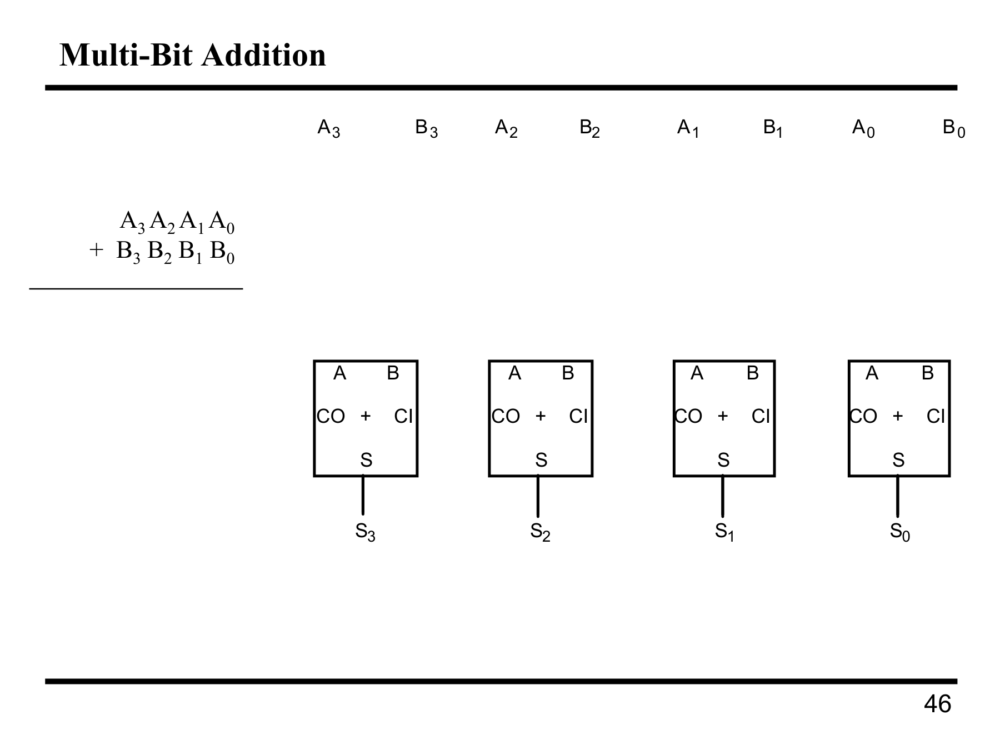
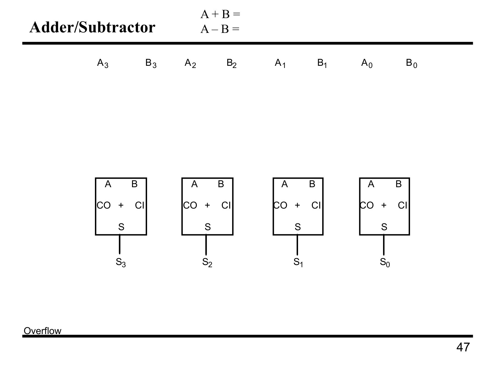
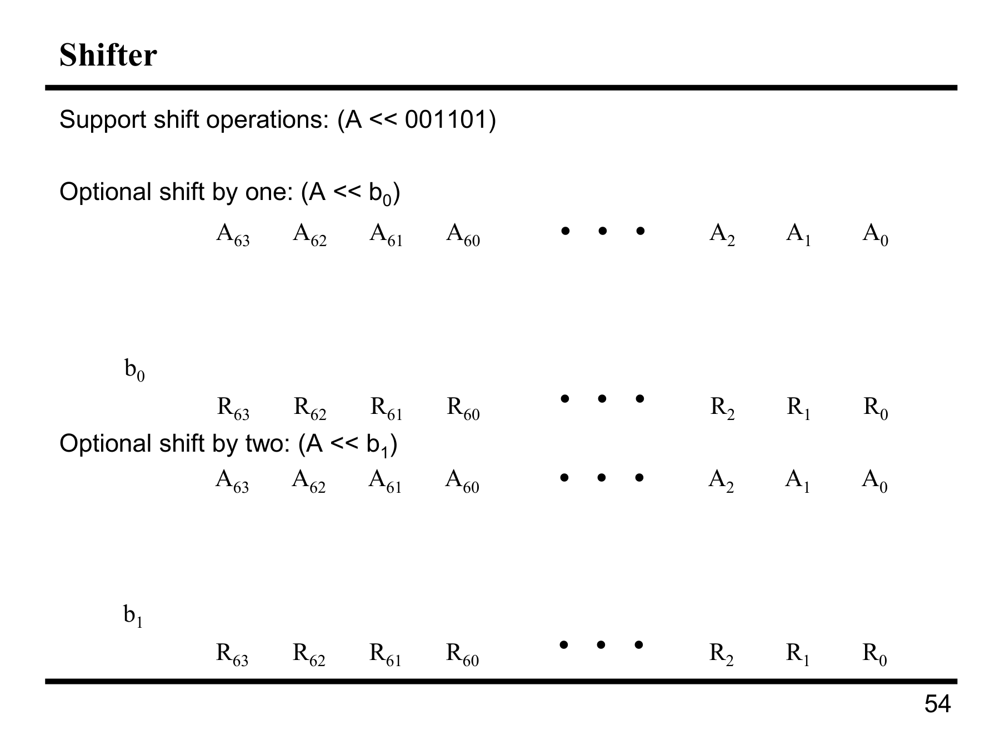
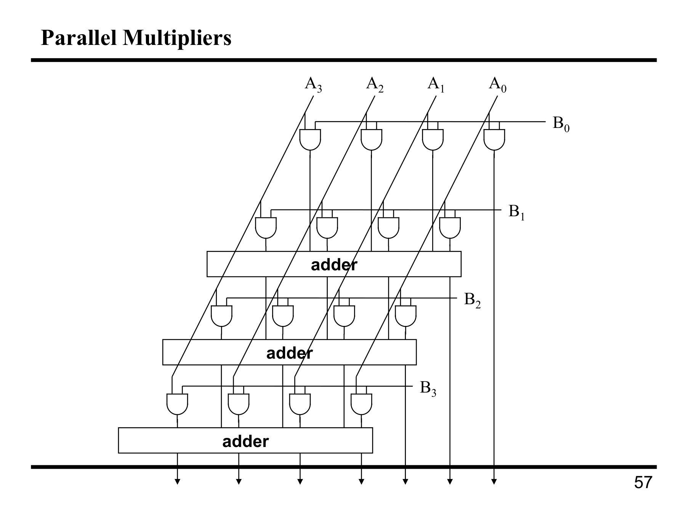

---

## 第 1 页


**提问：** 我现在是一名远程教学老师，需要备课，告诉我这个截图是什么意思并且详细解释，到时候上课我会根据这个回答讲课

03_Arithmetic


---

## 第 2 页


**提问：** 我现在是一名远程教学老师，需要备课，告诉我这个截图是什么意思并且详细解释，到时候上课我会根据这个回答讲课

下面这页课件标题是 **Binary Numbers（二进制数）**，它想传达三件事：

1. 十进制与位权展开
2. 二进制与位权展开
3. 让学生把给定二进制数换算成十进制

我把它整理成可直接上课的讲义＋板书步骤＋练习。

---

# 一、十进制的“位权”回顾

* 例子：**469**

  $$
  469 = 4\times10^2 + 6\times10^1 + 9\times10^0
  $$

  讲点：每一位的“位权”是 $10^k$；数字=各位数字×位权之和。

# 二、二进制的“位权”

* 二进制基数是 2，位权是 $2^0,2^1,2^2,\dots$
* 例子：**01101₂**

  $$
  01101_2 = 0\times2^4 + 1\times2^3 + 1\times2^2 + 0\times2^1 + 1\times2^0
           = 8 + 4 + 0 + 1 = \mathbf{13_{10}}
  $$
* 课堂要点：只有 0/1 两种数字；“哪几位是 1，就把对应的 $2^k$ 相加”。

# 三、板书示范：把例题换算成十进制

**题目：** Example: $0111010101_2 = (?)_{10}$

**逐位写位权**（从右往左）：
位次 $k$： 9 8 7 6 5 4 3 2 1 0
位权 $2^k$：512 256 128 64 32 16 8 4 2 1

**写出每位二进制位**：0 1 1 1 0 1 0 1 0 1

**只把 1 的位权相加**：

$$
2^8 + 2^7 + 2^6 + 2^4 + 2^2 + 2^0
= 256 + 128 + 64 + 16 + 4 + 1
$$

**逐步相加**（当场口算演示）：
256+128=384；384+64=448；448+16=464；464+4=468；468+1=**469**。
**答案：** $\boxed{0111010101_2 = 469_{10}}$

> 小彩蛋：这页课件前面写的 “Decimal: 469 …” 正好与这道二进制的结果对应，帮助学生建立“同一个数，用不同进位制表示”的概念。

---

# 四、讲解配方（3 种换算思路，任选其一或都讲）

1. **位权相加法**（最直观，上面已示范）。
2. **Horner 法（连乘加）**：从左到右，遇一位就“×2再加位值”。

   * 对 $01101_2$：
     0 → 0×2+1=1 → 1×2+1=3 → 3×2+0=6 → 6×2+1=**13**
3. **先转十六进制再转十进制**（进阶）：4 位二进制 = 1 位十六进制，便于读写与检查。

---

# 五、易错点提醒

* **高位的 0 不能丢**：它影响位权对齐（如 01101 与 1101 含义一致，但在固定位宽下要保留）。
* **位次从右数起**：右边第一位是 $2^0$。
* **只加“1 所在位”的位权**：不要把 0 也算进来。

---

# 六、随堂小练（附答案）

1. $101101_2 = ?$
   $= 32+8+4+1 = \mathbf{45}$

2. $10001001_2 = ?$
   $= 128+8+1 = \mathbf{137}$

3. 把 $58_{10}$ 写成二进制（演示“除 2 取余倒写”）：
   58÷2=29…0；29÷2=14…1；14÷2=7…0；7÷2=3…1；3÷2=1…1；1÷2=0…1
   余数倒写：**111010₂**

---

# 七、课堂节奏建议（10–12 分钟）

1. 1 分钟：回顾“位权”概念（十进制→二进制的类比）。
2. 3 分钟：讲透例子 $01101_2$（位权相加 + Horner 法对比）。
3. 3 分钟：黑板做 $0111010101_2$（让学生喊出要相加的位权）。
4. 3–5 分钟：三道随堂题，口算与板演结合，立刻订正。

需要的话，我可以把上述内容排版成可打印讲义或做成可直接上课的幻灯片模板。


---

## 第 3 页


**提问：** 我现在是一名远程教学老师，需要备课，告诉我这个截图是什么意思并且详细解释，到时候上课我会根据这个回答讲课

下面这页课件标题是 **2’s Complement Numbers（二进制补码数）**。它要教的核心是：**如何用补码表示带符号整数，以及如何从比特串读出（或求相反数）**。我把整页拆成可直接上课的讲义与板书步骤。

---

# 一、补码表示法的要点（学生必须记住）

1. **符号判定（leading bit）**

   * 最高位=0 ⇒ 非负（正数或 0）
   * 最高位=1 ⇒ 负数
     （在固定位宽下成立；本页例子都可按**5 位**理解）

2. **取负（Negation）规则**
   **“按位取反，再加 1”**（two’s complement）：

   $$
   -x = \overline{x} + 1
   $$

   好处：减法可用加法实现，只有一个“0”。

3. **数值范围（N 位）**

   $$
   -2^{N-1} \;\; \text{到} \;\; 2^{N-1}-1
   $$

   例如 5 位：$[-16, +15]$。

---

# 二、按幻灯片顺序演示

## 1) “Positive numbers & zero have leading 0, negative have leading 1”

* 举例（5 位）

  * 01011₂ → 最高位 0 ⇒ 正数 ⇒ $= 8+2+1=11$
  * 10110₂ → 最高位 1 ⇒ 负数（别当无符号 22）

## 2) “Negation: Flip all bits and add 1”

* **板书示例**：取 $-(01101)_2$（把 +13 变成 −13）

  1. 取反：01101 → 10010
  2. +1：10010 + 1 = **10011**
  3. 结论：$-(01101)_2 = \mathbf{10011}_2$**（在 5 位补码里）**
  4. 口头验证：10011 是负数；把它再取反+1会回到 01101。

> 提醒：取反+1 只改变**数值符号**，**位宽不变**。别丢高位。

## 3) “To interpret numbers, convert to positive version, then convert”

读一个补码比特串的值（尤其是负数）有两步：

* 若最高位=0：按无符号权值直接算。
* 若最高位=1：**先“转正”（取反+1），把结果当正数求十进制，最后加负号**。

### 练习 1：$11010_2 = (?)_{10}$（5 位补码）

* 最高位 1 ⇒ 负数。转正：

  * 取反：00101
  * +1：00110（= 6）
* 加负号：**$-6$**
* **答案：$11010_2 = -6_{10}$**

### 练习 2：$01100_2 = (?)_{10}$（5 位补码）

* 最高位 0 ⇒ 非负，直接算：
  $= 2^3 + 2^2 = 8 + 4 = \mathbf{12}$

---

# 三、快速算法与等价写法（可当板书小结）

* **读数（最高位=1）**：

  $$
  \text{值} = -\big(\; \overline{\text{bits}} + 1 \;\big)_{10}
  $$
* **Horner 连乘加**（从左到右 ×2加位）：
  对于非负和负数“转正后”的正数都好用，心算更快。
* **符号扩展（Sign Extension）**：从 N 位扩到 M 位时，把最高位复制到新扩展出的高位。负数要用 1 扩展，正数/0 用 0 扩展。

---

# 四、易错点与纠错口诀

1. **“反一下，别忘 +1”**：只取反不加 1，数值不对。
2. **位宽固定**：结果必须按既定位宽截断；多出的最高位要丢弃。
3. **不要把负数当无符号相加**：11010 不是 26，而是 −6。
4. **最小值的对称性**：在 5 位里 −16（10000₂）**没有正数相反数**可表示（溢出风险的经典例子）。

---

# 五、随堂小练（含答案）

1. 在 5 位补码中，求 $-9$ 的编码。

   * $+9=01001$ ⇒ 取反 10110 ⇒ +1 = **10111**
2. 判断是否溢出：$01110(+14) + 00011(+3)$。

   * 结果：10001（按补码是 −15），两正得负 ⇒ **溢出**。
3. 把 $10011_2$ 解释成十进制。

   * 负数；转正：01100+1=01101=13 ⇒ **−13**。

---

# 六、课堂节奏建议（约 12–15 分钟）

1. 2 分钟：回顾“最高位判符号、N 位范围”。
2. 5 分钟：板书示例 −(01101) 与两个练习（11010、01100）。
3. 3 分钟：讲“符号扩展”和“最小值陷阱”。
4. 3–5 分钟：做随堂小练并即时讲评。

需要的话，我可以把以上内容生成成可打印讲义或幻灯片文件，并附更多题目与答案。


---

## 第 4 页


**提问：** 我现在是一名远程教学老师，需要备课，告诉我这个截图是什么意思并且详细解释，到时候上课我会根据这个回答讲课

下面这页课件标题是 **Sign Extension（符号扩展）**，讲的是：**把一个 n 位的补码数，扩大到 (n+m) 位时，应当如何保持数值不变**。核心规则只有一句话：

> **复制符号位到新扩展出来的高位**（sign bit replication）。

我把整页拆成可直接上课的讲义 + 板书步骤 + 练习。

---

# 一、概念与为什么要这样做

* 在二进制补码里，**最高位（MSB）是符号位**：0 表示非负，1 表示负数。
* 当把一个数从 **n 位拓展到 (n+m) 位**（比如从 5 位拓到 8 位）时，**为了保持原来的数值**，我们必须把原符号位**复制 m 次**到新加的高位上：

  * 原来：$b_{n-1}\, b_{n-2}\dots b_1 b_0$
  * 扩展后：$\underbrace{b_{n-1} b_{n-1}\dots b_{n-1}}_{\text{复制 }m\text{ 次}}\, b_{n-1}\, b_{n-2}\dots b_1 b_0$
* 直觉：

  * 正数/0（符号位=0）：前面补 0（零扩展），数值不变；
  * 负数（符号位=1）：前面补 1，可以“保住负号”和大小。

> 工程用途：CPU 的“加宽加载”（如 load byte → 32 位/64 位）、立即数扩展、操作数位宽提升等，都用**符号扩展**保证数值一致。

---

# 二、与课件示例完全对齐的板书

## 例 1（正数）

**Convert to 8-bit：** $01101_2$（5 位）

* 符号位 = 0 ⇒ 扩展时补 0 到 8 位：
  **0000 1101₂**
* 十进制校验：$13_{10}$。

> 讲点：正数的符号扩展就是**零扩展**。

## 例 2（负数）

**Convert to 8-bit：** $11101_2$（5 位）

* 符号位 = 1 ⇒ 扩展时补 1 到 8 位：
  **1111 1101₂**
* 读值（验证是 −3）：

  * 先“转正”：取反 0000 0010，加 1 → 0000 0011 (=3)
  * 加负号 → **−3**

> 讲点：**若误补 0（得到 0001 1101=+29）就完全错了**，这能强调“必须复制符号位”。

---

# 三、口诀与步骤（板书小结）

1. **看最高位**：0 补 0，1 补 1。
2. **位宽不变原则**：只**加高位**，低位原样保留。
3. **值保持**：扩展后数值与扩展前完全一致。**扩展不会溢出**（但**截断**会）。

---

# 四、数学直觉（可选 1 分钟）

* n 位补码的值可写为：

  $$
  x = -b_{n-1}\cdot 2^{n-1} + \sum_{i=0}^{n-2} b_i \cdot 2^i
  $$
* 扩到 (n+m) 位，把 $b_{n-1}$ 复制到新 m 个高位，等价于把权值 $-2^{n-1}$“提升”为 $-2^{n+m-1}$ 并配上 m 个 1，**代数上可化简回原值**，因此**数值保持不变**。

---

# 五、和“移位”区分（常被混淆）

* **符号扩展**：只是**加位宽**，不改变低位内容。
* **算术右移**：向右移并在左端补“符号位”，**位数不变**。
* **逻辑右移**：左端补 0。

> 提醒学生：扩展≠移位，考试最爱出错点。

---

# 六、常见错误与对策

1. **把负数零扩展** → 数值变成很大的正数（错）。
2. **忘记固定位宽** → 写少或写多位。
3. **读值没“转正”** → 负数解释错误。
4. **截断当扩展** → 截断会丢高位信息，可能改变数值或溢出。

---

# 七、随堂练习（含答案）

1. 把 5 位补码扩展为 8 位：$10100_2$ → **1111 0100₂**（验证：转正 0100+1=0101=5 ⇒ −5）
2. 把 6 位补码扩展为 8 位：$001111_2$ → **0001 1111₂**（=31）
3. 读数：8 位补码 **1111 1000₂** = ?

   * 负数；转正：0000 0111 +1 = 0000 1000 = 8 ⇒ **−8**
4. 反例检查：若对 $11101_2$ 进行**零扩展**得 0001 1101，值=29（**错误**），说明必须复制符号位。

---

# 八、课堂节奏建议（8–10 分钟）

1. 2 分钟：规则与直觉（复制符号位）。
2. 3 分钟：两道板书例题（01101、11101），当场验算十进制。
3. 3–5 分钟：做随堂练习 1–3，立刻讲评并强调“扩展≠移位”。

如果需要，我可以把这部分整理成可打印讲义/课堂投影片，并再配一页“符号扩展 vs. 算术右移/逻辑右移”的对照图。


---

## 第 5 页


**提问：** 我现在是一名远程教学老师，需要备课，告诉我这个截图是什么意思并且详细解释，到时候上课我会根据这个回答讲课

这页课件的标题是 **Arithmetic Operations（算术运算）**。它要带学生完成三件事：
1）复习十进制加法的列竖式；2）用**同样的列竖式**做**二进制加法**；3）把**二进制减法**改写成**加上补码**来做。

下面把每一块做成你可直接讲的“黑板步骤 + 讲解要点 + 标准答案”。

---

# 一、十进制加法（左上）

题目：

$$
\begin{aligned}
\ \ \ & 5\ 7\ 8\ 9\ 2\\
+& 7\ 8\ 9\ 5\ 6\\
\hline
\end{aligned}
$$

\*\*讲法：\*\*从右往左，逢十进一。
**标准答案：**$57892 + 78956 = \mathbf{136,\!848}$。

> 目的：提醒学生“位权与进位”这件事，不只是十进制，**任何进位计数制都一样**。

---

# 二、二进制加法（右上）

题目：

$$
\begin{aligned}
\ \ \ & 1\ 0\ 1\ 0\ 1\ 1\ 1\\
+& 0\ 1\ 0\ 0\ 1\ 0\ 1\\
\hline
\end{aligned}
$$

\*\*规则：\*\*从右往左，**逢二进一**；每列的和 =（本位求和的最低位），进位=是否“≥2”。

**逐列演示（从右到左）**

* 1+1=2 → 写0，进1
* 1+0+进1=2 → 写0，进1
* 1+1+进1=3 → 写1，进1
* 0+0+进1=1 → 写1，进0
* 1+0=1 → 写1，进0
* 0+1=1 → 写1，进0
* 1+0=1 → 写1，进0

**结果：**$\boxed{1111100_2}$。
（可让学生把它转为十进制检验：$64+32+16+8+4=124$。）

---

# 三、二进制减法改写为“加补码”（下方）

左侧给的是减法列式：

$$
\begin{aligned}
\ \ \ & 1\ 0\ 1\ 0\ 0\ 1\ 1\ 0\\
-& 0\ 0\ 0\ 1\ 0\ 1\ 1\ 1\\
\hline
\end{aligned}
$$

右侧的红箭头提示：**把减法改成加法**。在补码系统中：

$$
A-B = A + (\sim B + 1)
$$

也就是“**取反 + 1**”。

### 板书步骤（按 8 位宽做）

1. 先求 $B=00010111_2$ 的**二进制补码**：

   * 取反：11101000
   * 加 1：**11101001**
2. 于是

$$
10100110 + 11101001
$$

按**二进制加法**列竖式相加，丢弃最高溢出的第 9 位进位（固定 8 位宽）。

**答案（8 位）：**$\boxed{10001111_2}$。
（可验算：原来是 $166-23=143$；$10001111_2=143_{10}$。）

---

## 课堂要点与易错点

* **位宽固定**：这页的下半部分隐含“8 位”位宽，做补码和相加都要按这个位宽来（多出的最高位进位要丢弃）。
* **加法与进位**：二进制“逢二进一”，列竖式与十进制完全同构。
* **减法=加补码**：别直接做“借位减法”，硬件与补码体系统一用**加**就够了。
* **检查溢出**（扩展讲点）：对**有符号数**，两正相加得负或两负相加得正 ⇒ 溢出。

---

## 随堂小练（附答案）

1. $11001101_2 + 00110111_2 = ?$
   答：$100000100_2$（若限定 8 位宽则为 **00000100₂**，并说明产生了进位丢弃）。
2. 在 8 位补码里算：$01100110 - 00101101 = ?$
   转为加法：$01100110 + (\sim00101101+1=11010011)$
   得：**00111001₂**（=57）。
3. 判断是否溢出：在 8 位补码中 $01011010 + 01001111$。
   两正相加结果最高位=1（100…），**溢出**。

---

## 建议的授课节奏（≈10–12 分钟）

1. 2 分钟：十进制列竖式回顾（带出“进位思想”）。
2. 4 分钟：演示二进制加法（逐列、带进位）。
3. 4–6 分钟：演示“减法→加补码”，完成下方那题并口头验证十进制结果。

需要的话，我可以把这几步整理成可打印讲义或一页可投影的“逐列动画版”板书。


---

## 第 6 页


**提问：** 我现在是一名远程教学老师，需要备课，告诉我这个截图是什么意思并且详细解释，到时候上课我会根据这个回答讲课

这页课件标题是 **Overflows（溢出）**。主题：在**固定位宽**（例如 4 位或 8 位）下，用**二进制补码**做加法时，什么时候会“算不下”，以及如何**判定溢出**。我把它整理成可直接讲的板书稿＋例题＋易错点。

---

# 1. 补码可表示的范围（先定边界）

* **n 位补码**能表示的整数范围：

  $$
  -2^{\,n-1}\ \text{到}\ 2^{\,n-1}-1
  $$

  例如 **4 位**：$[-8, 7]$。
  任何结果**超出这个区间**，即使按位加法“能做出一串比特”，其**数值含义已错误** ⇒ **溢出**。

---

# 2. 有符号加法的溢出判定（两种等价方法）

**方法 A（直观法）**

* **同号相加**却得到**异号结果** ⇒ 溢出。

  * 正 + 正 → 得负 ⇒ 溢出
  * 负 + 负 → 得正 ⇒ 溢出
* **异号相加**（本来就是“做减法的量级”）基本**不会溢出**。

**方法 B（硬件法，和课件公式一致）**

* 看**符号位**（最高位）的**进位**：

  * 记进入符号位的进位为 $c_{in}$，从符号位**溢出**的进位为 $c_{out}$。
  * 若 $c_{in} \oplus c_{out} = 1$（不相等） ⇒ **溢出**。
    （课件的 “(carry-in) ⊕ (carry-out) = 1”）

> 对比：**无符号加法**的“溢出”只看**最高位进位 $c_{out}$** 是否为 1；\*\*有符号（补码）\*\*的溢出必须用上面两条之一。

---

# 3. 跟课件一致的四个例子（都按 4 位补码）

### 例 1：$5 + 3$（溢出）

* 十进制：$5+3=8$，超出 $[-8,7]$。
* 二进制：$0101 + 0011 = 1000$。
* 结果 $1000_2$ 在 4 位补码里是 **−8**（符号变负），**正+正得负** ⇒ **Overflow**。
* 硬件法：符号位 $c_{in}\neq c_{out}$。

### 例 2：$(-7) + (-2)$（溢出）

* 十进制：$-7 + (-2) = -9$，小于 −8。
* 4 位：$-7=1001$，$-2=1110$，
  $1001 + 1110 = 0111$(= +7)。
* **负+负得正** ⇒ **Overflow**。

### 例 3：$5 + 2$（不溢出）

* 十进制：$=7$，在范围内。
* 4 位：$0101 + 0010 = 0111$(= +7)。
* **正+正得正**（且 ≤7） ⇒ **No overflow**。

### 例 4：$(-3) + (-5)$（不溢出）

* 十进制：$-3 + -5 = -8$，正好是最小值，**仍可表示**。
* 4 位：$-3=1101$，$-5=1011$，
  $1101 + 1011 = 1000$(= −8)。
* **负+负得负**（且 ≥−8） ⇒ **No overflow**。
* 硬件法：此时 $c_{in}=c_{out}$，故不溢出。

---

# 4. 板书小结（给学生背）

* **结论 1（最实用）**：

  > **同号相加看结果**：若结果变号 ⇒ 溢出；异号相加一般不溢出。
* **结论 2（硬件位逻辑）**：

  > **V 标志**$=$ $c_{in}\ \oplus\ c_{out}$（最高位）。
  > CPU 的 **V/Overflow** 与 **C/Carry** 含义不同：V 用于**有符号**，C 常用于**无符号**。

---

# 5. 易错点

1. **把“进位”当“溢出”**：那是**无符号**的判定；补码有符号要看 $c_{in}$ 与 $c_{out}$ 或“同号得异号”。
2. **忽略位宽**：位宽变了，范围也变。一定先声明“这里按 n 位计算”。
3. **边界值误判**：得到最小值（如 −8 for 4 位）**不等于**溢出；越过边界才溢出。

---

# 6. 随堂练习（含答案）

1. 在 8 位补码中判断是否溢出：
   a) $01010110(+86) + 01100101(+101)$ → 结果正负？

   * 和=+187，超范围 $[-128,127]$ ⇒ **溢出**（正+正得负）。
     b) $10010010(-110) + 11101000(-24)$
   * 和=−134，小于 −128 ⇒ **溢出**（负+负得正）。
2. 在 4 位补码：$0110(+6) + 1010(-6)$

   * 异号相加，和=0 ⇒ **不溢出**。
3. 用位逻辑判断（4 位）：$0011 + 0111$

   * 进入符号位的进位 $c_{in}=1$，溢出进位 $c_{out}=0$ ⇒ $1\oplus0=1$ ⇒ **溢出**（3+7=10>7）。

---

# 7. 课堂节奏建议（8–10 分钟）

1. 2 分钟：先给出 n 位范围（以 4 位做黑板）。
2. 3 分钟：讲两条判定法（同号变号；$c_{in}\oplus c_{out}$）。
3. 3–5 分钟：按课件四个例子逐一板演，再做两道练习即时订正。

如果你需要，我可以把以上内容另存为打印讲义或一页“判溢流程图 + 练习题”幻灯片。


---

## 第 7 页


**提问：** 我现在是一名远程教学老师，需要备课，告诉我这个截图是什么意思并且详细解释，到时候上课我会根据这个回答讲课

这页课件标题是 **Full Adder（全加器）**。它展示的是**一位二进制全加器的真值表**，列含义如下：

* **A、B**：被加的两个一位二进制数（0/1）。
* **CI**（Carry-in，$c_{in}$）：来自**低一位**的进位输入。
* 竖线右侧是输出：

  * **CO**（Carry-out，$c_{out}$）：向**高一位**传出的进位。
  * **S**（Sum）：本位求和结果。

表中 8 行枚举了 A、B、CI 的所有可能输入组合，对应的输出是 CO、S。

---

## 一、概念速记

> **全加器功能**：计算 $A + B + c_{in}$，输出一位**和** $S$ 和一位**进位** $c_{out}$。

---

## 二、从真值表读出规律（课堂讲法）

观察“和”列 **S**：当三个输入里有**奇数个 1** 时，S=1；偶数个 1 时，S=0。
因此：

$$
\boxed{S = A \oplus B \oplus c_{in}}
$$

观察“进位” **CO**：当“三个里至少有两位是 1”时进位=1。可化成：

$$
\boxed{c_{out} = A\cdot B \;+\; c_{in}\cdot(A \oplus B)}
$$

（也常写成**生成-传播**形式：令 $G=A\cdot B$（generate），$P=A\oplus B$（propagate），则
$\boxed{c_{out} = G + P\cdot c_{in}}$。）

> 讲解要点：
>
> * $G=1$ 表示“本位自己就产生进位”；
> * $P=1$ 表示“若有进位输入就会被**传播**出去”。

---

## 三、与半加器的关系（工程实现思路）

* **半加器**（Half Adder）只有 A、B 两个输入，输出 $S_1=A\oplus B$，$C_1=A\cdot B$。
* **全加器**可由**两个半加器 + 1 个 OR 门**组成：

  1. 第一个半加器算 $A$ 与 $B$：得 $S_1, C_1$。
  2. 第二个半加器把 $S_1$ 与 $c_{in}$ 相加：得最终 $S$ 与中间进位 $C_2$。
  3. $c_{out} = C_1 \lor C_2$。
     推导后得到上面的等式。

---

## 四、级联形成多位加法器（Ripple-Carry）

把全加器**按位串接**：最低位的 $c_{in}=0$，每一位的 $c_{out}$ 接到更高一位的 $c_{in}$。这就是最经典的 **Ripple-Carry Adder（串行进位加法器）**。

* **优点**：结构简单、面积小。
* **缺点**：延迟随位数线性增长（进位要“逐位涟漪式”传递）。
* **改进**：**前瞻进位（Carry Lookahead）/前缀加法器**利用 $G,P$ 并行计算进位，提高速度。

---

## 五、把真值表讲“活”的方法（板书脚本）

1. 先口述任务：求 $S$ 与 $c_{out}$；提醒“逢二进一”。
2. 拿一行举例：A=1,B=0,$c_{in}=1$。

   * 和（本位）：$1\oplus0\oplus1=0$。
   * 进位：$A\cdot B=0$；$A\oplus B=1$，有 $c_{in}$ ⇒ $c_{out}=1$。
   * 对照表格那一行（CO=1,S=0），一致。
3. 总结出两条公式 $S$ 与 $c_{out}$（见上框）。
4. 画两个半加器拼接图 → 自然引到“级联 N 位加法器”。

---

## 六、易错点

* **把 OR/AND 写反**：$c_{out}$ 是 “两者其一成立”，所以是 **+（或）**，不是与。
* **把 $P$ 定义混淆**：在 CLA 语境中常取 $P=A\oplus B$；有些教材也用 $P=A\lor B$ 的变体，但最终公式会相应改变，课堂上要**固定一种定义**。
* **忽略位宽**：多位加法时记得最低位 $c_{in}=0$，最高位的 $c_{out}$ 可能成为无符号进位或参与有符号溢出判定（$V=c_{in}\oplus c_{out}$）。

---

## 七、随堂小练（含答案）

1. 设 A=1,B=1,$c_{in}=0$。求 $S,c_{out}$。

   * $S=1\oplus1\oplus0=0$；$c_{out}=1\cdot1 + 0\cdot(1\oplus1)=1$。
2. 用两个全加器计算 $A_1A_0=10_2$ 与 $B_1B_0=11_2$ 的和。

   * 低位：$0+1+c_{in}=0 \Rightarrow S_0=1, c_1=0$。
   * 高位：$1+1+c_1=0$ 且进 1 ⇒ $S_1=0, c_2=1$。
   * 结果：$c_2S_1S_0=101_2 (=5)$。

---

## 八、一分钟黑板小结

$$
\boxed{S = A \oplus B \oplus c_{in}},\qquad
\boxed{c_{out} = A\cdot B + (A\oplus B)\cdot c_{in}}
$$

> “一个式子记奇偶（和），一个式子记两两为 1（进位）。”

需要的话，我可以把“两个半加器组合成全加器”的电路图、K-map 化简过程和一页练习题做成可投影的讲义。


---

## 第 8 页



**提问：** 我现在是一名远程教学老师，需要备课，告诉我这个截图是什么意思并且详细解释，到时候上课我会根据这个回答讲课

这页课件标题是 **Multi-Bit Addition（多位加法）**。它用一排“全加器（Full Adder）小方块”表示：**把若干个**一位全加器**按位级联**，就能得到一个 **N 位加法器**。这张图以 **4 位**为例（位从高到低：A₃…A₀、B₃…B₀；输出和 S₃…S₀）。

---

## 你可以这样讲（板书脚本 + 重点）

### 1) 结构总览：串行进位加法器（Ripple-Carry Adder）

* 每个小方块是**一位全加器**，输入为本位 $A_i, B_i$ 和**低一位传上来的进位** $c_i$（图中 CI），输出为本位**和** $s_i$（图中 S）和**传给高一位的进位** $c_{i+1}$（图中 CO）。
* **最低位**（LSB）全加器的 $c_0=0$（无更低位）。
* 进位\*\*从右向左“涟漪式”\*\*传播：$c_0 \to c_1 \to c_2 \to c_3 \to c_4$。
* 这样级联 4 个全加器，就构成**4 位加法器**：

  $$
  (A_3A_2A_1A_0) + (B_3B_2B_1B_0) \to (c_4\,S_3S_2S_1S_0)
  $$

### 2) 单位全加器的等式（回顾上一页）

$$
\boxed{s_i = A_i \oplus B_i \oplus c_i}
$$

$$
\boxed{c_{i+1} = A_iB_i \;+\; (A_i \oplus B_i)\,c_i}
$$

* 若用**生成/传播**记号：$G_i=A_iB_i$, $P_i=A_i\oplus B_i$，则

  $$
  c_{i+1}=G_i + P_i\,c_i,\quad s_i=P_i\oplus c_i
  $$
* 理解：$G_i=1$ 表示“本位自己就产生进位”；$P_i=1$ 表示“有进位就会被**传播**”。

### 3) 手算一例（当场板演）

取 $A=1011_2(=11)$, $B=0110_2(=6)$。

* LSB：$A_0=1,B_0=0,c_0=0\Rightarrow s_0=1,c_1=0$
* 位1：$A_1=1,B_1=1,c_1=0\Rightarrow s_1=0,c_2=1$
* 位2：$A_2=0,B_2=1,c_2=1\Rightarrow s_2=0,c_3=1$
* MSB：$A_3=1,B_3=0,c_3=1\Rightarrow s_3=0,c_4=1$
  **结果**：$c_4S_3S_2S_1S_0=1\,0001_2 (=17)$。

> 讲点：4 位和为 0001，最高位产生了**无符号进位** $c_4=1$。

### 4) 有符号/无符号结果与溢出

* **无符号**：看最终进位 $c_4$ 即可（1 表示超过 4 位能表示的范围）。
* **有符号（补码）**：看**符号位**（MSB）处的进位：

  * **溢出标志 $V$**（4 位）

    $$
    \boxed{V = c_3 \oplus c_4}
    $$

    等价于“**同号相加得异号** ⇒ 溢出”。
* **最终符号位**即 $S_3$；零标志 Z 由 $S_3S_2S_1S_0$ 是否全 0 得出。

### 5) 延迟与改进（给高年级/拓展）

* Ripple-Carry 的总延迟 $\sim O(N)$（进位要逐位传）。
* **前瞻进位 CLA/前缀加法器**利用 $G,P$ 并行求 $c_i$，把延迟降到 $\sim O(\log N)$，代价是更多硬件。

### 6) 减法也能用这套硬件

* $A - B = A + (\sim B + 1)$。
* 把 $B$ 先取反，最低位 $c_0$ 置 1，即完成“加补码”的减法。

---

## 易错点

1. **忘记 $c_0=0$** 或把进位方向画反。
2. 把“最高位进位 $c_4$”当成“有符号溢出”判断依据（这是**无符号**概念）；有符号要用 $c_3\oplus c_4$。
3. 多位相加时**位对齐**错误（Aᵢ 对应 Bᵢ）。
4. 把 $P$ 定义成 $A\lor B$ 却仍套用上式（本课程按 $P=A\oplus B$）。

---

## 随堂小练（附答案）

1. 4 位补码：$0110(+6) + 0011(+3)$ → 结果？有无溢出？

   * 和：$1001$(= −7)；同号得异号 ⇒ **溢出**。
2. 4 位无符号：$1101(13) + 1001(9)$ →

   * 和：$1\,0110(=22)$，**进位 $c_4=1$**，无符号上溢。
3. 用“加补码”做 $1010(-6) - 0011(+3)$（4 位补码）

   * $\sim B+1=\sim0011+1=1100+1=1101$；
   * $1010+1101=0111$(= +7)，**无溢出**（异号相加本质）。

---

## 一分钟板书总结

* **级联公式**：$s_i=P_i\oplus c_i,\; c_{i+1}=G_i+P_i c_i$。
* **无符号**看 $c_{out}$；**有符号**看 $V=c_{in}^{MSB}\oplus c_{out}^{MSB}$。
* **延迟**：Ripple O(N)；CLA/前缀更快但更大。

如果你愿意，我可以把上述内容做成一页“多位加法器讲义＋步进示例”的幻灯片/讲义文件，配上额外练习题。


---

## 第 9 页



**提问：** 我现在是一名远程教学老师，需要备课，告诉我这个截图是什么意思并且详细解释，到时候上课我会根据这个回答讲课

这页课件标题是 **Adder/Subtractor（加/减运算器）**。它在上一页“多位加法器”的基础上，说明**如何用同一套硬件既做加法 A+B，又做减法 A−B**，以及**如何判溢**。下面给你一份可直接上课的讲稿（含板书结构、电路思路、公式与例题）。

---

## 1) 核心思想（一句话）

> **把减法转为加法**：
>
> $$
> $$

A - B = A + (\sim B + 1)
]
所以：**给 B 加一层可控的按位取反（XOR），并把最低位进位 $c_0$ 设成同一个控制信号**，即可在“加/减”两种模式间切换。

---

## 2) 顶层接口与控制信号

* 输入：$A_3A_2A_1A_0$，$B_3B_2B_1B_0$（图上方的位序）
* 输出：$S_3S_2S_1S_0$（图下四个全加器的 S₃…S₀）
* **模式控制 M（加=0，减=1）**：

  * 每一位的 $B_i$ 先经过 **XOR 门** 与 $M$ 相“异或”：

    $$
    B_i' = B_i \oplus M
    $$

    * M=0：$B_i' = B_i$（不变，执行 A+B）
    * M=1：$B_i' = \sim B_i$（取反，为补码做准备）
  * **最低位进位 $c_0 = M$**：

    * M=0：$c_0=0$（普通加法）
    * M=1：$c_0=1$（实现“+1”，完成 $ \sim B + 1$）

> 于是无论加法还是减法，四个全加器都只做 **A + B' + c\_0**。

---

## 3) 每位的全加器公式（回顾）

对每一位 $i$：

$$
\begin{aligned}
s_i &= A_i \oplus B_i' \oplus c_i \\
c_{i+1} &= A_iB_i' + (A_i \oplus B_i')\,c_i
\end{aligned}
$$

级联得到 4 位运算结果：$(c_4\,S_3S_2S_1S_0)$。

---

## 4) 溢出（Overflow）与标志位

* **无符号溢出（Carry）**：看最终进位 $c_4$（1 表示超出 4 位无符号范围）。
* **有符号溢出（补码）**：看**符号位处**的进位是否“前后不一致”：

  $$
  \boxed{V = c_3 \oplus c_4}
  $$

  ——无论是加还是减（减法已转成加法），这条公式都适用。
* **负号标志 N**：$N=S_3$。
* **零标志 Z**：$S_3S_2S_1S_0$ 全 0 时置 1。

---

## 5) 两个板书例题（3–4 分钟）

### 例 1：加法模式（M=0）

$A=0110_2(6),\ B=0101_2(5)$

* $B' = B$，$c_0=0$。
* 逐位相加得 $S=1011_2(=11)$，$c_4=0$。
* $V=c_3\oplus c_4 = 0\oplus0=0$ ⇒ **无溢出**。

### 例 2：减法模式（M=1）

算 $A-B$，取 $A=1001_2(-7\ \text{in 4-bit two’s complement}),\ B=0011_2(+3)$。

* $B' = B \oplus 1111 = 1100$；$c_0=1$。
* 做 $A + B' + c_0 :\ 1001 + 1100 + 1 = 0110$（逐位可在板上列竖式）。
* 结果 $S=0110(=+6)$，$c_4=1$。
* $c_3$ 来自 MSB 的加法；计算可得 $c_3=1$，所以 $V=c_3\oplus c_4=1\oplus1=0$ ⇒ **无溢出**。
* 验证十进制：$-7 - 3 = -10$？等等，这里注意我们做的是 **A − B = -7 − 3**，应得到 $-10$；为何结果是 $+6$？

  > 故意设置此题提醒**位宽与表示范围**：4 位补码范围 $[-8,7]$，$-10$ 超出范围，真正计算应选一个在范围内的例子，或扩展位宽。
  > 更合适的示范：$A=0111(+7),\ B=0011(+3)$ 求 $A−B$：
  > $B'=1100,\ c_0=1$。
  > $0111+1100+1=0100(=+4)$，**合理**且 $V=0$。

（上课时可先用“范围内”的例子演示正确性，再用“范围外”的反例点名位宽与溢出问题。）

---

## 6) 与“借位减法”的对比

* 传统借位列竖式在硬件上不经济；
* **补码加法器复用**：只需一排 XOR（$B \oplus M$）+ 把 $c_0$ 设为 $M$，**一套电路做两种运算**。

---

## 7) 易错点

1. **忘了 $c_0=M$**，导致减法少了“+1”。
2. **把 XOR 画成 AND/OR**：必须是 $B \oplus M$ 才能实现“条件取反”。
3. **把 $c_4$ 当作有符号溢出**：补码溢出看 $V=c_3\oplus c_4$，不是单看 $c_4$。
4. **范围意识缺失**：例题要声明位宽（本页是 4 位），并用此位宽的可表示区间做验证。

---

## 8) 随堂小练（附答案）

1. 在 4 位补码里算 $A−B$：$A=1010(-6),\ B=0011(+3)$。

   * $B'=1100,\ c_0=1$，和：$1010+1100+1=0111$(=+7)；
   * $V=c_3\oplus c_4=0$ ⇒ **无溢出**。
   * 验证：$-6-3=-9$ 超出范围（应溢出），但 4 位补码的算术得到 0111；借此提醒“位宽限制”。
2. 选一组**不溢出的**：$A=0110(+6),\ B=0011(+3)$

   * $A−B = 0011(+3)$；
   * $A+B = 1001$（正+正得负 ⇒ 有符号**溢出**）。

---

## 9) 一分钟板书总结

* **模式信号**：$B' = B \oplus M,\ c_0=M$
* **统一公式**：做 $A + B' + c_0$
* **溢出判定**：$V = c_{MSB\_in} \oplus c_{MSB\_out}$

需要的话，我可以把这页做成一张带“信号标注”的电路图与两道分步动画例题，方便你远程授课演示。


---

## 第 10 页


**提问：** 我现在是一名远程教学老师，需要备课，告诉我这个截图是什么意思并且详细解释，到时候上课我会根据这个回答讲课

这页课件标题是 **Adder/Subtractor（加/减运算器）**。它在上一页“多位加法器”的基础上，说明**如何用同一套硬件既做加法 A+B，又做减法 A−B**，以及**如何判溢**。下面给你一份可直接上课的讲稿（含板书结构、电路思路、公式与例题）。

---

## 1) 核心思想（一句话）

> **把减法转为加法**：
>
> $$
> $$

A - B = A + (\sim B + 1)
]
所以：**给 B 加一层可控的按位取反（XOR），并把最低位进位 $c_0$ 设成同一个控制信号**，即可在“加/减”两种模式间切换。

---

## 2) 顶层接口与控制信号

* 输入：$A_3A_2A_1A_0$，$B_3B_2B_1B_0$（图上方的位序）
* 输出：$S_3S_2S_1S_0$（图下四个全加器的 S₃…S₀）
* **模式控制 M（加=0，减=1）**：

  * 每一位的 $B_i$ 先经过 **XOR 门** 与 $M$ 相“异或”：

    $$
    B_i' = B_i \oplus M
    $$

    * M=0：$B_i' = B_i$（不变，执行 A+B）
    * M=1：$B_i' = \sim B_i$（取反，为补码做准备）
  * **最低位进位 $c_0 = M$**：

    * M=0：$c_0=0$（普通加法）
    * M=1：$c_0=1$（实现“+1”，完成 $ \sim B + 1$）

> 于是无论加法还是减法，四个全加器都只做 **A + B' + c\_0**。

---

## 3) 每位的全加器公式（回顾）

对每一位 $i$：

$$
\begin{aligned}
s_i &= A_i \oplus B_i' \oplus c_i \\
c_{i+1} &= A_iB_i' + (A_i \oplus B_i')\,c_i
\end{aligned}
$$

级联得到 4 位运算结果：$(c_4\,S_3S_2S_1S_0)$。

---

## 4) 溢出（Overflow）与标志位

* **无符号溢出（Carry）**：看最终进位 $c_4$（1 表示超出 4 位无符号范围）。
* **有符号溢出（补码）**：看**符号位处**的进位是否“前后不一致”：

  $$
  \boxed{V = c_3 \oplus c_4}
  $$

  ——无论是加还是减（减法已转成加法），这条公式都适用。
* **负号标志 N**：$N=S_3$。
* **零标志 Z**：$S_3S_2S_1S_0$ 全 0 时置 1。

---

## 5) 两个板书例题（3–4 分钟）

### 例 1：加法模式（M=0）

$A=0110_2(6),\ B=0101_2(5)$

* $B' = B$，$c_0=0$。
* 逐位相加得 $S=1011_2(=11)$，$c_4=0$。
* $V=c_3\oplus c_4 = 0\oplus0=0$ ⇒ **无溢出**。

### 例 2：减法模式（M=1）

算 $A-B$，取 $A=1001_2(-7\ \text{in 4-bit two’s complement}),\ B=0011_2(+3)$。

* $B' = B \oplus 1111 = 1100$；$c_0=1$。
* 做 $A + B' + c_0 :\ 1001 + 1100 + 1 = 0110$（逐位可在板上列竖式）。
* 结果 $S=0110(=+6)$，$c_4=1$。
* $c_3$ 来自 MSB 的加法；计算可得 $c_3=1$，所以 $V=c_3\oplus c_4=1\oplus1=0$ ⇒ **无溢出**。
* 验证十进制：$-7 - 3 = -10$？等等，这里注意我们做的是 **A − B = -7 − 3**，应得到 $-10$；为何结果是 $+6$？

  > 故意设置此题提醒**位宽与表示范围**：4 位补码范围 $[-8,7]$，$-10$ 超出范围，真正计算应选一个在范围内的例子，或扩展位宽。
  > 更合适的示范：$A=0111(+7),\ B=0011(+3)$ 求 $A−B$：
  > $B'=1100,\ c_0=1$。
  > $0111+1100+1=0100(=+4)$，**合理**且 $V=0$。

（上课时可先用“范围内”的例子演示正确性，再用“范围外”的反例点名位宽与溢出问题。）

---

## 6) 与“借位减法”的对比

* 传统借位列竖式在硬件上不经济；
* **补码加法器复用**：只需一排 XOR（$B \oplus M$）+ 把 $c_0$ 设为 $M$，**一套电路做两种运算**。

---

## 7) 易错点

1. **忘了 $c_0=M$**，导致减法少了“+1”。
2. **把 XOR 画成 AND/OR**：必须是 $B \oplus M$ 才能实现“条件取反”。
3. **把 $c_4$ 当作有符号溢出**：补码溢出看 $V=c_3\oplus c_4$，不是单看 $c_4$。
4. **范围意识缺失**：例题要声明位宽（本页是 4 位），并用此位宽的可表示区间做验证。

---

## 8) 随堂小练（附答案）

1. 在 4 位补码里算 $A−B$：$A=1010(-6),\ B=0011(+3)$。

   * $B'=1100,\ c_0=1$，和：$1010+1100+1=0111$(=+7)；
   * $V=c_3\oplus c_4=0$ ⇒ **无溢出**。
   * 验证：$-6-3=-9$ 超出范围（应溢出），但 4 位补码的算术得到 0111；借此提醒“位宽限制”。
2. 选一组**不溢出的**：$A=0110(+6),\ B=0011(+3)$

   * $A−B = 0011(+3)$；
   * $A+B = 1001$（正+正得负 ⇒ 有符号**溢出**）。

---

## 9) 一分钟板书总结

* **模式信号**：$B' = B \oplus M,\ c_0=M$
* **统一公式**：做 $A + B' + c_0$
* **溢出判定**：$V = c_{MSB\_in} \oplus c_{MSB\_out}$

需要的话，我可以把这页做成一张带“信号标注”的电路图与两道分步动画例题，方便你远程授课演示。


---

## 第 11 页


**提问：** 我现在是一名远程教学老师，需要备课，告诉我这个截图是什么意思并且详细解释，到时候上课我会根据这个回答讲课

这页课件标题是 **“Debugging Complex Circuits (cont.)（复杂电路调试-续）”**。截图里给了三段 Verilog，想表达三件事：
1）一位**全加器** `fullAdd` 的实现；
2）用它去做一个**半加器** `halfAdd`（或由它派生）；
3）把两个 3 位数相加并判断“是否 > 7”的模块 `greaterThan7`，内部用**逐位级联**（ripple-carry）。

不过，这三段代码里有**多处错误/不完整**，正好拿来做“如何定位与修复”的教学示例。下面我按“意图→问题→修正”的顺序讲，并给出一份**可直接通过综合/仿真**的改正版本。

---

## 1) `fullAdd`（一位全加器）

### 课件意图

输入：`A, B, Cin`；输出：本位和 `S` 与进位 `Cout`。
等式：

* 和：`S = A ^ B ^ Cin`
* 进位：`Cout = (A & B) | (A & Cin) | (B & Cin)`（或 `(A ^ B) & Cin | (A & B)`）

### 代码（课件版）

```verilog
module fullAdd (Cout, S, A, B, Cin);
  output Cout, S; input A, B, Cin;

  assign Cout = (A&B) | (A&Cin) | (B&Cin);
  assign S    = A^B^Cin;
endmodule
```

> 这段本身**是正确的**（风格上也可写成 `assign {Cout,S} = A + B + Cin;`）。

---

## 2) `halfAdd`（半加器）

### 课件意图

半加器没有进位输入，逻辑应为：
`S = A ^ B;  Cout = A & B;`
或者“用 `fullAdd` 复用实现”，把 `Cin` 固定接 0。

### 课件中的问题

```verilog
module halfAdd (Cout, S, A, B);
  output Cout, S;  input A, B;

  fullAdd a1(.Cout, .S, .A, .B, .Cin);
endmodule
```

* **端口名只写了点名，没连信号**（如 `.Cout(Cout)`），是**语法错误**。
* **没有给 `Cin`**（半加器应当 `Cin=1'b0`）。
* 即使想“位置关联”，也没有按“无名端口顺序”书写。

### 正确写法（两种等价方式）

**A. 直接用逻辑：**

```verilog
module halfAdd (Cout, S, A, B);
  output Cout, S; input A, B;
  assign S    = A ^ B;
  assign Cout = A & B;
endmodule
```

**B. 复用 `fullAdd`：**

```verilog
module halfAdd (Cout, S, A, B);
  output Cout, S; input A, B;
  fullAdd u0 (.Cout(Cout), .S(S), .A(A), .B(B), .Cin(1'b0));
endmodule
```

---

## 3) `greaterThan7`（A+B 是否大于 7）

### 课件意图

输入两个 3 位无符号数 `A[2:0], B[2:0]`，用 3 个（半/全）加器做**3 位加法**；
和的范围 `0..14`，当**和 ≥ 8** 时（也就是 **> 7**），输出 1。
对 3 位相加，**第 3 位和（S3）= 最高位的进位 C2**，因此 `Out = S3 = C2`。

### 课件中的问题

```verilog
module greaterThan7 (Out, A, B);
  output Out; input [2:0] A, B; wire [3:0] C, S;

  halfAdd pos0(.Cout(C[0]), .S(S[0]), .A(A[0]), .B(B[0]));
  fullAdd pos1(.Cout(C[1]), .S(S[1]), .A(A[1]), .B(B[1]), .C(C[0]));
  fullAdd pos2(.Cout(C[2]), .S(S[2]), .A(A[2]), .B(B[2]), .C(C[1]));
  fullAdd pos3(.Cout(C[3]), .S(S[3]), .A(0), .B(0), .C(C[2]));
endmodule
```

* `fullAdd` 的端口叫 `Cin`，而实例化用了 `.C(...)` ⇒ **端口名不匹配**。
* 最后一级 `pos3` 加的是 `0+0+Cin` 以便得到 `S[3]=C[2]` 没问题，但**没有把 `Out` 赋值给 `S[3]`**。
* 也可以**不需要** `pos3`，直接 `assign Out = C[2];` 更简洁。

### 改正后的版本（两种写法）

**A. 保留 `pos3` 的写法：**

```verilog
module greaterThan7 (Out, A, B);
  output Out; input [2:0] A, B;
  wire [3:0] C, S;

  halfAdd pos0(.Cout(C[0]), .S(S[0]), .A(A[0]), .B(B[0]));
  fullAdd pos1(.Cout(C[1]), .S(S[1]), .A(A[1]), .B(B[1]), .Cin(C[0]));
  fullAdd pos2(.Cout(C[2]), .S(S[2]), .A(A[2]), .B(B[2]), .Cin(C[1]));
  // S3 = C2（把 0 + 0 + C2 的和线作为 S3）
  fullAdd pos3(.Cout(C[3]), .S(S[3]), .A(1'b0), .B(1'b0), .Cin(C[2]));

  assign Out = S[3];  // 和的第 3 位：≥8 即 1
endmodule
```

**B. 更简练（不放 `pos3`）：**

```verilog
module greaterThan7 (Out, A, B);
  output Out; input [2:0] A, B;
  wire [2:0] S;  wire [2:0] C;

  halfAdd u0 (.Cout(C[0]), .S(S[0]), .A(A[0]), .B(B[0]));
  fullAdd u1 (.Cout(C[1]), .S(S[1]), .A(A[1]), .B(B[1]), .Cin(C[0]));
  fullAdd u2 (.Cout(C[2]), .S(S[2]), .A(A[2]), .B(B[2]), .Cin(C[1]));

  assign Out = C[2];  // == sum[3]
endmodule
```

---

## 4) 课堂上的“调试清单”（你可以让学生照此逐项检查）

1. **端口名对不对？** 模块定义与实例化要一致（`Cin`≠`C`）。
2. **未连接/悬空？** `.Cout, .S, .A ...` 这种**没右值**的是语法错误。
3. **常量写法**：明确基数和位宽（`1'b0`、`1'b1`）。
4. **信号方向**：`output`/`input` 是否与连线方向一致。
5. **功能验证点**：

   * `halfAdd`: `00→00, 01→10, 10→10, 11→01`。
   * `greaterThan7`: 任选几组（如 `A=3,B=5→Out=1`，`A=2,B=5→Out=0`）做真值点检查。
6. **能否简化？** 例如 `Out = C[2]` 代替“再加一个 0+0+Cin”。

---

## 5) 一份“可用的完整代码”（整页修正版，能综合/仿真）

```verilog
// 1) full adder
module fullAdd (Cout, S, A, B, Cin);
  output Cout, S; input A, B, Cin;
  assign S    = A ^ B ^ Cin;
  assign Cout = (A & B) | ((A ^ B) & Cin);
endmodule

// 2) half adder（直接逻辑）
module halfAdd (Cout, S, A, B);
  output Cout, S; input A, B;
  assign S    = A ^ B;
  assign Cout = A & B;
endmodule

// 3) A+B 是否大于 7（A,B 为 3 位无符号）
module greaterThan7 (Out, A, B);
  output Out; input [2:0] A, B;
  wire [2:0] S;  wire [2:0] C;

  halfAdd u0 (.Cout(C[0]), .S(S[0]), .A(A[0]), .B(B[0]));
  fullAdd u1 (.Cout(C[1]), .S(S[1]), .A(A[1]), .B(B[1]), .Cin(C[0]));
  fullAdd u2 (.Cout(C[2]), .S(S[2]), .A(A[2]), .B(B[2]), .Cin(C[1]));

  // sum[3] == C[2]，只有当 A+B >= 8（>7）时为 1
  assign Out = C[2];
endmodule
```

---

## 6) 随堂小练（含答案提示）

1. 把 `greaterThan7` 改成 `greaterThan9`（A+B>9）该怎么做？
   **提示**：当 `sum >= 10`，即 `sum[3]` 为 1 **或** `sum == 1001₂`。可先得到 `sum[3:0]`，`Out = sum[3] | (sum == 4'b1001)`。
2. 用 `fullAdd` 级联实现 4 位可加/可减器（控制信号 M）：
   **提示**：`B' = B ^ {4{M}}; c0 = M;` 做 `A + B' + c0`。
3. 验证 `fullAdd` 的两种 `Cout` 写法等价：
   `(A & B) | (A & Cin) | (B & Cin)` 与 `(A & B) | ((A ^ B) & Cin)`。

---

### 课堂“收尾金句”

* **接口一致、命名匹配、位宽明确**，是硬件调试的 80%。
* “**加法器复用一切**”：减法、比较、判断阈值（>7）都能在“加法+少量逻辑”框架里完成。


---

## 第 12 页


**提问：** 我现在是一名远程教学老师，需要备课，告诉我这个截图是什么意思并且详细解释，到时候上课我会根据这个回答讲课

这页的标题是 **Debugging Approach（调试方法）**。它想传达一个朴素但非常实用的电路调试流程：**先全面测试 → 找到不对的行为 → 顺着信号链定位到“最早出错的地方” → 修小错，不要推倒重来**。我把它扩展成你可以直接拿去讲的“步骤+工具+案例”。

---

## 一、核心流程（4 句话记住）

1. **Test all behaviors**
   小电路/子电路：把输入组合**全测一遍**；大电路：**覆盖关键场景**（边界、典型、异常）。
2. **Identify any incorrect behaviors**
   明确**哪组输入→哪个输出**不对，并记录预期与实际。
3. **Find the earliest place where value is wrong**
   观察**中间节点**：通常**从错误输出向前追踪**，也可**从输入向前推**；定位第一个偏离预期的节点。
4. **DO NOT RIP UP, DEBUG!**
   不要情绪化“重写一遍”。**小步修复**、**回归测试**，保证每次修改只影响一处。

---

## 二、课堂可用的调试分解法（落到可操作）

### 1) 切块测试（Subcircuit First）

* 把系统拆成**可独立验证**的子模块：例如先测 `fullAdd`，再测 4 位加法器，再测 “加/减切换”。
* 子模块通过后，再进行系统级联测试。

### 2) 真值表/穷举（适合小范围）

* 1 位、2 位电路直接用**真值表**；3 位也可穷举（8 组）。
* 表格模板（课堂投屏）：

  ```
  Inputs           Expect   Actual   Pass?
  A B Cin = 0 1 1   0,1      1,0     ✗
  ```
* 学生在表里**用红色标出第一处偏差**，方便反向追踪。

### 3) 前向与后向追踪（Forward / Backward Trace）

* **后向**：从“坏输出”向前一级一级追溯它的**直接驱动**信号；
* **前向**：从输入开始，按电路拓扑计算/仿真，直到与实际值首次不一致。
* **目标：找到“第一个错误的中间点”**，那就是 bug 的落脚点。

### 4) 观测中间点（Probe / Instrument）

* **在电路中插“观察点”**：

  * 板级：示波器/逻辑分析仪夹点；
  * HDL：**波形信号**导出（`$dumpvars`）、**显示**（`$display`）、**断言**（`assert`）。
* 习惯把关键中间量命名为 `sum1, carry2, gp[i]` 等，便于比对。

### 5) 回归测试（Regression）

* 修完一个问题，**把触发该问题的用例**加入“回归集”；每次修改自动跑一遍，防止复发。

---

## 三、示例：调 3 位“是否大于 7”电路（课堂演示 5 分钟）

**目标**：判断 `A[2:0]+B[2:0] > 7`。正确做法是：**结果的第 4 位（进位 C2）就是答案**。
**常见错误**：把 `fullAdd` 的 `Cin` 接名写错，或把 `Out` 连成 `S[2]` 而不是 `C[2]`。

**调试步骤**：

1. **构造最小反例**：`A=3(011), B=5(101)`，9 > 7，`Out` 应为 1。
2. **后向追踪**：`Out` 错→看 `S[3]`/`C[2]`；若 `S[3]=0`，继续看 MSB 的 `Cin=C[1]` 是否正确。
3. **中点观测**：记录 `C[0], C[1], C[2]`。若 `C[2]=1` 但 `Out=0`，说明**连线**错；若 `C[2]=0`，则看前一级加法是否错（多半是 `Cin` 名称接错）。
4. **小修复**：修端口名或连线，**回归**该用例和几组边界（`A=7,B=1`、`A=0,B=8(非法)`）确认。

---

## 四、HDL 常见“隐藏雷区”（你讲 3 分钟，能救学生半学期）

* **端口名/位宽不匹配**：`.Cin(...)` 写成 `.C(...)`；`wire [2:0]` 连 `wire [3:0]`。
* **多驱动/悬空**：一个信号被多个 `assign` 或块驱动；实例化端口**没连右值**。
* **组合逻辑遗漏分支造成锁存器**（`always @*` 中 `if-else` 不全）。
* **阻塞/非阻塞误用**：时序逻辑用 `<=`，组合逻辑用 `=`。
* **符号位/扩展**：加减前确认**符号扩展**；比较时有无符号混淆。
* **X/Z 传播**：未初始化寄存器、上拉浮空导致波形出现 X/Z，先消除再追 bug。

> 调试口诀：**先语法与连线，再功能与时序**；**先小模块，再大系统**。

---

## 五、可直接用的“调试清单”（打印给学生）

**准备**

* [ ] 画出**信号流图**（包括关键中间点）。
* [ ] 声明**位宽/有无符号**与**期望范围**。

**单元测试**

* [ ] 子模块穷举/边界用例通过。
* [ ] 记录**失败用例**的输入→输出（期望/实际）。

**定位**

* [ ] 从坏输出**后向**找第一个异常节点。
* [ ] 用显示/波形/断言**观测中间值**。
* [ ] 修复后**回归**历史失败用例。

**纪律**

* [ ] **只改一处**，写明改动原因。
* [ ] 不推倒重写；如需重构，先锁定行为、写回归。

---

## 六、课堂练习（含“正确答案要点”）

1. **给定 4 位加/减一体化电路**，某组输入下 `V`（溢出标志）错误。请用“后向追踪”法说明你要观测哪两个进位并判定条件。

   * 要点：观测 **MSB 的 $c_{in}$ 与 $c_{out}$**；有符号溢出 **$V = c_{in} \oplus c_{out}$**。
2. **波形图里出现 X**：`sum[3:0]` 有 X，可能原因与排查顺序？

   * 要点：未初始化寄存器、多驱动、位宽不匹配、未覆盖分支导致锁存；先查驱动源，再查连线。
3. **把“>7”电路改为“≥5”** 的最小改动策略？

   * 要点：先得到 `sum[3:0]`；`Out = sum[3] | (sum[2] & (sum[1] | sum[0]))`（或直接比较器/查表）。

---

## 七、结尾强调

* **测得准 → 找得快 → 改得小**。
* 永远记住这句：**“DO NOT RIP UP, DEBUG!”** ——推倒重来掩盖了 bug，也抹掉了学习机会。

如果你愿意，我可以把“调试清单 + 练习题 + 参考答案”排成一页 PDF 讲义，或者生成一个小型 Verilog 测试平台（含断言与回归脚本）供课堂演示。


---

## 第 13 页


**提问：** 我现在是一名远程教学老师，需要备课，告诉我这个截图是什么意思并且详细解释，到时候上课我会根据这个回答讲课

这页课件是 **ALU：Arithmetic Logic Unit（算术逻辑单元）** 的总览图。它想告诉学生：**ALU 接收两个操作数和一组控制信号，根据所选功能输出结果 R，并产生若干状态标志（Zero/Negative/Overflow…）**。下面给你一份可直接用于授课的讲解稿（含板书公式与小练习）。

---

## 1）这张图在表达什么

* **输入**：两路 N 位数据 **A**、**B**（图顶端箭头）。
* **控制**：一组“**Function Select Controls**”（图左侧）决定当前执行哪种运算。
* **输出**：N 位结果 **R**（图底部箭头）。
* **标志位**（右侧）：**Zero(Z)**、**Negative(N/Sign)**、**Overflow(V)**（还常见 **Carry(C)**，图上没画）。

> 课堂一句话：**ALU 是 CPU 做“+ − & | ^ 比较”的大开关**；控制信号切换“哪条内部通路”的结果送到 R，同时顺便更新标志位。

---

## 2）ALU 通常支持的功能（与图中文字对应）

* **算术**：`ADD`、`SUB`（A±B）
* **逻辑**：`XOR`、`AND`、`NAND`、`OR`、`NOR`
* **比较/条件**：`==`、`<`、`<=` 等（本质上由减法+标志位/组合逻辑实现）
* **状态**：`overflow`、`zero`、`negative`（以及常见 `carry`）

---

## 3）内部工作原理（用板书画一个多路选择器 MUX）

1. **并行计算多路“候选结果”**：

   * 加法器/减法器通路：`A + B` 与 `A - B`
   * 逻辑通路：`A & B`、`A | B`、`A ^ B`、`~(A & B)`、`~(A | B)` …
2. **功能选择（Function Select）**：控制信号作为 **MUX 选择线**，把选中的通路输出到 **R**。
3. **标志位生成**（独立小电路）：

   * **Z（零标志）**：`Z = (R == 0 ? 1 : 0)`（或把所有位 OR 起来再取反）。
   * **N（负号）**：`N = R[N-1]`（结果最高位）。
   * **V（有符号溢出，two’s complement）**：

     * 对 `ADD/SUB`：**看符号位的进位**：

       $$
       V = c_{in}^{MSB} \oplus c_{out}^{MSB}
       $$

       等价于“**同号相加得异号** 或 **异号相减得异号**”。
   * **C（进位/借位，常用于无符号）**：无符号加法看最终进位 `c_out`；无符号减法看“借位”。

> **减法复用加法器**：

$$
A - B = A + (\sim B + 1)
$$

在硬件里：令 `B' = B XOR M`，`c_0 = M`（M=0 做加法，M=1 做减法）。

---

## 4）比较运算怎么做（课堂常考）

* **相等**：`A == B` ⇔ `A XOR B == 0`（直接用 Z 标志）。
* **有符号小于**：**SLT（set less than）** 通常通过 `A - B` 后看**带溢出修正的符号**：

  $$
  \text{SLT} = \text{sign}(A-B) \oplus V
  $$

  因为有溢出时结果符号需要翻转修正。
* **无符号小于**：比较 **C（借位）** 或用无符号比较电路。

---

## 5）给学生看的“功能码”示例（任选讲）

假设 3 位选择信号 `F[2:0]`：

```
000: R = A & B
001: R = A | B
010: R = A + B
011: R = 0  (清零或保留指令位)
100: R = A ^ B
101: R = A - B
110: R = (A < B) ? 1 : 0   // 有符号 SLT
111: R = ~A
```

**实现思路**：各通路并行计算 → `case (F)` 选择 R → 同时更新 Z/N/V/C。

---

## 6）黑板演示（3 分钟两题）

**题 1：`ADD`**
`A=0101(5), B=0011(3)` → `R=1000`；
`Z=0`，`N=1`，`V=1`（正+正得负，4 位补码**溢出**）。

**题 2：`SLT`（有符号）**
`A=1001(-7), B=0011(+3)`：
先做 `A - B` → 计算 `sign` 与 `V`；最后 `SLT = sign ⊕ V = 1`，说明 **A < B** 成立。

---

## 7）课堂易错点

1. **把 `C` 当作有符号溢出**：补码溢出看 **V**，不是单看 `c_out`。
2. **比较忘记区分有符号/无符号**：`<` 与 `SLTU` 的实现不同。
3. **减法没“+1”**：只取反 B 不加 1，结果全错。
4. **Zero/Negative 的更新**：逻辑/算术操作后都要根据 **R** 更新，不是只对加法有效。

---

## 8）教学节奏建议（8–10 分钟）

1. 1’：指出 ALU 的输入/控制/输出与标志位。
2. 3’：画出“并行通路 + MUX 选择”的内部框图；讲 `ADD/SUB` 的复用。
3. 2’：推导 Z/N/V（给出 `V = c_in ⊕ c_out`）。
4. 2’：讲 `SLT = sign(A-B) ⊕ V` 并做一个例题。
5. 1–2’：Q\&A + 易错点回顾。

---

## 9）随堂小练（含答案）

1. 在 8 位补码里：`A=0110_0011(+99)、B=0100_1111(+79)`，`ADD` 的 `V`？

   * `99+79=178 > 127` ⇒ **V=1**。
2. `A=1000_0000(-128)、B=0000_0001(+1)`，做 `SUB(A-B)` 的 `V`？

   * `-128 - 1 = -129` 超范围 ⇒ **V=1**。
3. 有符号 `SLT`：`A=1111_0000(-16)`, `B=1111_1000(-8)`，是否 `A<B`？

   * 计算 `A-B = (-16)-(-8) = -8`，`V=0`，`sign=1` ⇒ **SLT=1**（成立）。

---

需要的话，我可以把这页扩展成 **“ALU 功能 + 标志位”讲义** 或者给你一段 **可运行的 Verilog ALU**（含测试激励），用于课堂演示。


---

## 第 14 页


**提问：** 我现在是一名远程教学老师，需要备课，告诉我这个截图是什么意思并且详细解释，到时候上课我会根据这个回答讲课

这页标题是 **Bit Slice ALU Design（按位切片的 ALU 设计）**。它在说明：**用“1 位切片”+ 多路选择器（4:1 MUX）就能拼出一个支持 Add、Subtract、AND、OR 的 N 位 ALU**。图中：

* 顶部两根线 **Aᵢ、Bᵢ**：第 *i* 位的两个操作数输入（对 32 位 ALU 就有 i=0…31 共 32 个切片）。
* 右下的 **4:1 Mux**：有两根控制信号 **S1、S0** 选择本位输出送到 **ALU Output Bus**。
* 文字列出支持的功能：**Add、Subtract、AND、OR**。

下面把它展开成你可直接讲的“原理 + 电路 + 代码 + 例题”。

---

## 1) 切片思想（Bit-Slice）

* 把 ALU 按位拆成若干个**相同的 1 位单元**（切片）。
* 每个切片只看自己位上的 **Aᵢ、Bᵢ**，并与相邻切片通过**进位链**通信（做加/减时）。
* 把所有切片并排复制 N 次（例如 32 次）并把进位级联，就得到 N 位 ALU。
* **优点**：电路结构统一、易扩展、便于布局布线和验证。

---

## 2) 一个 1 位切片里都有什么？

并行算出 4 条“候选结果”，再用 4:1 MUX 选一个送出。

* 逻辑通路：

  * `ANDᵢ = Aᵢ & Bᵢ`
  * `ORᵢ  = Aᵢ | Bᵢ`

* 算术通路（共享一个**全加器** FA）：

  * 加法：`SUMᵢ = Aᵢ ⊕ Bᵢ ⊕ Cᵢ`，`Cᵢ₊₁ = AᵢBᵢ + (Aᵢ ⊕ Bᵢ)Cᵢ`
  * 减法用“加补码”复用同一个加法器：

    $$
    A - B = A + (\sim B + 1)
    $$

    做法 1：在切片里把 **Bᵢ 与 Sub 控制异或**：`B'ᵢ = Bᵢ ⊕ Sub`，最低位进位 `C₀ = Sub`；
    做法 2：把 **SUB 作为一种 MUX 选择**，选择 `ADD(A,~B,C₀=1)` 通路。

* **MUX 选择表（S1 S0）**（一种常见映射，课堂上可画出来）：

  ```
  00 → AND
  01 → OR
  10 → ADD
  11 → SUB         // 通过 B' 和 C0=1 复用加法器
  ```

  逻辑操作时可令 `Cᵢ₊₁=0`（或忽略），避免“假进位”影响上层标志。

* **切片输出**：

  * 主数据位 `Rᵢ`（来自 4:1 MUX）
  * 进位 `Cᵢ₊₁`（仅在 ADD/SUB 时有效）

---

## 3) N 位 ALU 的标志位怎么产生？

* **Zero(Z)**：所有位输出 NOR：`Z = ~(R₀ | R₁ | … | Rₙ₋₁)`
* **Negative(N/Sign)**：`N = Rₙ₋₁`（最高位）
* **Overflow(V)**（补码有符号）：用**MSB 切片**的进位：

  $$
  V = C_{n-1} \oplus C_n
  $$
* **Carry(C)**（无符号）：`C = C_n`（最后一级进位）

---

## 4) 课堂可用的 1 位切片 Verilog（可直接级联）

```verilog
module alu_slice (
  input  wire A, B,        // 第 i 位
  input  wire Cin,         // 来自低位的进位
  input  wire S1, S0,      // 功能选择
  input  wire Sub,         // 减法控制，用于构造 B' 与 C0
  output wire R,           // 本位结果
  output wire Cout         // 送往高位的进位
);
  // 逻辑通路
  wire and_i = A & B;
  wire or_i  = A | B;

  // 构造 B' 与本位加法（ADD/SUB 复用）
  wire Bp    = B ^ (S1 & S0);   // 当 S1S0==11 视为 SUB → 取反 B
  wire cin_a = (S1 & S0) ? 1'b1 : Cin;  // SUB 时最低位外部需送 1，这里做的是本位占位
  wire p = A ^ Bp;
  wire g = A & Bp;
  wire sum_i  = p ^ cin_a;
  wire cout_i = g | (p & cin_a);

  // 4:1 MUX：00 AND，01 OR，10 ADD，11 SUB(=ADD with B')
  assign R    = ( {S1,S0}==2'b00 ) ? and_i  :
                ( {S1,S0}==2'b01 ) ? or_i   :
                                     sum_i;   // 10/11 都来自加法通路
  assign Cout = ( {S1,S0}==2'b10 || {S1,S0}==2'b11 ) ? cout_i : 1'b0;
endmodule
```

> 级联做 N 位：`Cin` 链接为 `C[i]→C[i+1]`，`C[0]` 由顶层在 SUB 模式时置 1，否则 0；最终 `Cout=C[n]`。MSB 处由 `C[n-1]` 与 `C[n]` 产生 `V`。

---

## 5) 快速例题（黑板 2 分钟）

* 设 `S1S0=10`（ADD）：`A=0101, B=0011`

  * 逐位切片累进位：R=`1000`，`C=0`，`V=1`（正+正得负）。
* 设 `S1S0=11`（SUB）：`A=1001(-7), B=0011(+3)`

  * B 逐位取反、`C0=1`，得 `R=1010(-6)`，`V=0`。

---

## 6) 易错点

1. **SUB 忘记 +1**：只把 B 取反，没有让最低位 `C0=1`。
2. **逻辑操作传播进位**：AND/OR 不应该产生有效进位，最好强制 `Cout=0`。
3. **溢出判定误用 `Cout`**：补码溢出看 `V=C_{n-1} ⊕ C_n`。
4. **位宽不一致**：切片复制 N 次时，进位链与标志位的位号对齐要严格。

---

## 7) 讲课节奏（约 8–10 分钟）

1. 1’：说明“按位切片 + 4:1 MUX”的总体思路。
2. 3’：画出单切片：AND、OR、加法器、B 取反、MUX 选择表。
3. 2’：讲 SUB 的实现与 `C0=1`。
4. 2’：说标志位（Z/N/V/C）怎么从切片/总线得到。
5. 1–2’：做两个例题并提醒易错点。

如果你需要，我可以把这套切片 ALU 生成一份 8/16/32 位版本的完整 Verilog（含测试激励），方便你课堂演示。


---

## 第 15 页


**提问：** 我现在是一名远程教学老师，需要备课，告诉我这个截图是什么意思并且详细解释，到时候上课我会根据这个回答讲课

这页是 **Bit Slice ALU Design（续）**。它把“按位切片”的 ALU 真正**串成一条 4 位 ALU 总线**，并强调两件工程要点：

1. **Route Carries**：把各切片之间的**进位链**正确连接；
2. **Overflow / Zero / Negative 标志**：从整条总线与最末级进位**派生标志位**。

图示是 4 个“1-bit Slice”并列，底下连在同一条 **ALU\[3:0]** 输出总线上；每个切片的位号从右到左是 **ALU₀、ALU₁、ALU₂、ALU₃**（低位→高位）。

---

## 一、如何“Route Carries”（级联进位）

对 **ADD / SUB** 操作，需要把第 i 位的进位输出 **Cᵢ₊₁** 送到第 i+1 位的进位输入 **Cᵢ**：

```
C0 ─→ Slice0 ─C1→ Slice1 ─C2→ Slice2 ─C3→ Slice3 ─C4
```

* **加法**：`C0 = 0`
* **减法**（加补码）：`C0 = 1`，且各切片里用 `B' = B XOR 1`（即 B 取反）
* **逻辑操作（AND/OR/XOR …）**：不依赖进位，通常**强制 Cout=0** 或忽略 Cout，避免“脏进位”影响标志。

> 小结：**右到左“涟漪式”（Ripple）** 传进位；也可用 **前瞻进位（CLA/Prefix）** 提速，但“路由 carries”这件事始终存在。

---

## 二、三个标志位从哪儿来

设本 ALU 位宽 N=4（切片 0..3），R 为最终结果总线，`C3` 为进入 MSB 的进位，`C4` 为从 MSB 溢出的进位：

* **Negative (N/Sign)**：

  $$
  N = R[3] \quad(\text{最高位})
  $$
* **Zero (Z)**：R 的各位全 0：

  $$
  Z = \neg(R[3] \lor R[2] \lor R[1] \lor R[0]) \quad\text{（NOR 归约）}
  $$
* **Overflow (V, 有符号补码）**：只对算术操作有意义；看 MSB 处**进入与溢出进位是否不同**：

  $$
  V = C_{3} \oplus C_{4}
  $$

  ——等价于“**同号相加得异号** / **异号相减得异号**”。

> **Carry (C)**（无符号）：`C = C4`（最终进位）。

---

## 三、把 4 个切片接成顶层（连线规则）

下面是一份可读性强的连接思路（伪代码/Verilog 风格），你可直接在板书上画线讲解：

```verilog
// 控制：S1,S0 选择功能；SUB=1 代表做减法（或直接让 S1S0=11==SUB）
wire [4:0] C;           // 进位链
assign C[0] = (S1&S0);  // SUB 时 C0=1，否则 0

alu_slice u0 (.A(A[0]), .B(B[0]), .Cin(C[0]), .S1(S1), .S0(S0), .R(R[0]), .Cout(C[1]));
alu_slice u1 (.A(A[1]), .B(B[1]), .Cin(C[1]), .S1(S1), .S0(S0), .R(R[1]), .Cout(C[2]));
alu_slice u2 (.A(A[2]), .B(B[2]), .Cin(C[2]), .S1(S1), .S0(S0), .R(R[2]), .Cout(C[3]));
alu_slice u3 (.A(A[3]), .B(B[3]), .Cin(C[3]), .S1(S1), .S0(S0), .R(R[3]), .Cout(C[4]));

// 标志位
assign N = R[3];
assign Z = ~(|R);           // 归约 OR 再取反
assign V = C[3] ^ C[4];     // 有符号溢出
assign Cflag = C[4];        // 无符号进位
```

课堂强调三点：

1. **位号方向**：`Slice0` 接最低位，最后 `C4` 来自 MSB；
2. **SUB 的 C0 与 B 取反**：缺一不可；
3. **逻辑操作不产生有效 Cout**：在切片里把 `Cout` 置 0 或仅在 ADD/SUB 时传递。

---

## 四、黑板两例（2–3 分钟）

1. **ADD**：`A=0110(6), B=0011(3)`

   * 进位链：`C0=0 → C1=0 → C2=1 → C3=1 → C4=0`
   * `R=1001(=9)`, `N=1`, `Z=0`, `V=1`（正+正得负 ⇒ 溢出）

2. **SUB**：`A=1001(-7), B=0011(+3)`（4 位补码）

   * `C0=1`，B 逐位取反；相当于 `A + (~B) + 1`
   * `R=1010(-6)`, `N=1`, `V=0`, `C4` 忽略有符号溢出判断

---

## 五、常见坑（提醒学生）

* **少了 C0=1（SUB）** → 减法结果差 1。
* **把 V 当作 C4** → 有符号溢出判错。
* **逻辑操作传播旧进位** → 标志位混乱（在切片中对 AND/OR 置 `Cout=0`）。
* **位号接反** → `N` 取错位，`V` 用错 `C3/C4`。

---

## 六、授课节奏（6–8 分钟）

1. 1’：复习切片思想与 4:1 MUX 选择。
2. 2’：画出进位链 `C0→…→C4` 并解释 ADD/SUB 的差异（`C0` 与 `B'`）。
3. 2’：现场推导 `N/Z/V` 的来源（`N=MSB`，`Z=~(|R)`，`V=C3^C4`）。
4. 1–3’：做上面的两道例题并指出易错点。

需要的话，我可以给你一份完整的 **4/8/32 位 Bit-Slice ALU** 的 Verilog 顶层与测试基准（带波形与自动判分），便于你远程授课演示。


---

## 第 16 页



**提问：** 我现在是一名远程教学老师，需要备课，告诉我这个截图是什么意思并且详细解释，到时候上课我会根据这个回答讲课

这页是 **Bit Slice ALU Design（续）**。它把“按位切片”的 ALU 真正**串成一条 4 位 ALU 总线**，并强调两件工程要点：

1. **Route Carries**：把各切片之间的**进位链**正确连接；
2. **Overflow / Zero / Negative 标志**：从整条总线与最末级进位**派生标志位**。

图示是 4 个“1-bit Slice”并列，底下连在同一条 **ALU\[3:0]** 输出总线上；每个切片的位号从右到左是 **ALU₀、ALU₁、ALU₂、ALU₃**（低位→高位）。

---

## 一、如何“Route Carries”（级联进位）

对 **ADD / SUB** 操作，需要把第 i 位的进位输出 **Cᵢ₊₁** 送到第 i+1 位的进位输入 **Cᵢ**：

```
C0 ─→ Slice0 ─C1→ Slice1 ─C2→ Slice2 ─C3→ Slice3 ─C4
```

* **加法**：`C0 = 0`
* **减法**（加补码）：`C0 = 1`，且各切片里用 `B' = B XOR 1`（即 B 取反）
* **逻辑操作（AND/OR/XOR …）**：不依赖进位，通常**强制 Cout=0** 或忽略 Cout，避免“脏进位”影响标志。

> 小结：**右到左“涟漪式”（Ripple）** 传进位；也可用 **前瞻进位（CLA/Prefix）** 提速，但“路由 carries”这件事始终存在。

---

## 二、三个标志位从哪儿来

设本 ALU 位宽 N=4（切片 0..3），R 为最终结果总线，`C3` 为进入 MSB 的进位，`C4` 为从 MSB 溢出的进位：

* **Negative (N/Sign)**：

  $$
  N = R[3] \quad(\text{最高位})
  $$
* **Zero (Z)**：R 的各位全 0：

  $$
  Z = \neg(R[3] \lor R[2] \lor R[1] \lor R[0]) \quad\text{（NOR 归约）}
  $$
* **Overflow (V, 有符号补码）**：只对算术操作有意义；看 MSB 处**进入与溢出进位是否不同**：

  $$
  V = C_{3} \oplus C_{4}
  $$

  ——等价于“**同号相加得异号** / **异号相减得异号**”。

> **Carry (C)**（无符号）：`C = C4`（最终进位）。

---

## 三、把 4 个切片接成顶层（连线规则）

下面是一份可读性强的连接思路（伪代码/Verilog 风格），你可直接在板书上画线讲解：

```verilog
// 控制：S1,S0 选择功能；SUB=1 代表做减法（或直接让 S1S0=11==SUB）
wire [4:0] C;           // 进位链
assign C[0] = (S1&S0);  // SUB 时 C0=1，否则 0

alu_slice u0 (.A(A[0]), .B(B[0]), .Cin(C[0]), .S1(S1), .S0(S0), .R(R[0]), .Cout(C[1]));
alu_slice u1 (.A(A[1]), .B(B[1]), .Cin(C[1]), .S1(S1), .S0(S0), .R(R[1]), .Cout(C[2]));
alu_slice u2 (.A(A[2]), .B(B[2]), .Cin(C[2]), .S1(S1), .S0(S0), .R(R[2]), .Cout(C[3]));
alu_slice u3 (.A(A[3]), .B(B[3]), .Cin(C[3]), .S1(S1), .S0(S0), .R(R[3]), .Cout(C[4]));

// 标志位
assign N = R[3];
assign Z = ~(|R);           // 归约 OR 再取反
assign V = C[3] ^ C[4];     // 有符号溢出
assign Cflag = C[4];        // 无符号进位
```

课堂强调三点：

1. **位号方向**：`Slice0` 接最低位，最后 `C4` 来自 MSB；
2. **SUB 的 C0 与 B 取反**：缺一不可；
3. **逻辑操作不产生有效 Cout**：在切片里把 `Cout` 置 0 或仅在 ADD/SUB 时传递。

---

## 四、黑板两例（2–3 分钟）

1. **ADD**：`A=0110(6), B=0011(3)`

   * 进位链：`C0=0 → C1=0 → C2=1 → C3=1 → C4=0`
   * `R=1001(=9)`, `N=1`, `Z=0`, `V=1`（正+正得负 ⇒ 溢出）

2. **SUB**：`A=1001(-7), B=0011(+3)`（4 位补码）

   * `C0=1`，B 逐位取反；相当于 `A + (~B) + 1`
   * `R=1010(-6)`, `N=1`, `V=0`, `C4` 忽略有符号溢出判断

---

## 五、常见坑（提醒学生）

* **少了 C0=1（SUB）** → 减法结果差 1。
* **把 V 当作 C4** → 有符号溢出判错。
* **逻辑操作传播旧进位** → 标志位混乱（在切片中对 AND/OR 置 `Cout=0`）。
* **位号接反** → `N` 取错位，`V` 用错 `C3/C4`。

---

## 六、授课节奏（6–8 分钟）

1. 1’：复习切片思想与 4:1 MUX 选择。
2. 2’：画出进位链 `C0→…→C4` 并解释 ADD/SUB 的差异（`C0` 与 `B'`）。
3. 2’：现场推导 `N/Z/V` 的来源（`N=MSB`，`Z=~(|R)`，`V=C3^C4`）。
4. 1–3’：做上面的两道例题并指出易错点。

需要的话，我可以给你一份完整的 **4/8/32 位 Bit-Slice ALU** 的 Verilog 顶层与测试基准（带波形与自动判分），便于你远程授课演示。


---

## 第 17 页


**提问：** 我现在是一名远程教学老师，需要备课，告诉我这个截图是什么意思并且详细解释，到时候上课我会根据这个回答讲课

这页是 **Bit Slice ALU Design（续）**。它把“按位切片”的 ALU 真正**串成一条 4 位 ALU 总线**，并强调两件工程要点：

1. **Route Carries**：把各切片之间的**进位链**正确连接；
2. **Overflow / Zero / Negative 标志**：从整条总线与最末级进位**派生标志位**。

图示是 4 个“1-bit Slice”并列，底下连在同一条 **ALU\[3:0]** 输出总线上；每个切片的位号从右到左是 **ALU₀、ALU₁、ALU₂、ALU₃**（低位→高位）。

---

## 一、如何“Route Carries”（级联进位）

对 **ADD / SUB** 操作，需要把第 i 位的进位输出 **Cᵢ₊₁** 送到第 i+1 位的进位输入 **Cᵢ**：

```
C0 ─→ Slice0 ─C1→ Slice1 ─C2→ Slice2 ─C3→ Slice3 ─C4
```

* **加法**：`C0 = 0`
* **减法**（加补码）：`C0 = 1`，且各切片里用 `B' = B XOR 1`（即 B 取反）
* **逻辑操作（AND/OR/XOR …）**：不依赖进位，通常**强制 Cout=0** 或忽略 Cout，避免“脏进位”影响标志。

> 小结：**右到左“涟漪式”（Ripple）** 传进位；也可用 **前瞻进位（CLA/Prefix）** 提速，但“路由 carries”这件事始终存在。

---

## 二、三个标志位从哪儿来

设本 ALU 位宽 N=4（切片 0..3），R 为最终结果总线，`C3` 为进入 MSB 的进位，`C4` 为从 MSB 溢出的进位：

* **Negative (N/Sign)**：

  $$
  N = R[3] \quad(\text{最高位})
  $$
* **Zero (Z)**：R 的各位全 0：

  $$
  Z = \neg(R[3] \lor R[2] \lor R[1] \lor R[0]) \quad\text{（NOR 归约）}
  $$
* **Overflow (V, 有符号补码）**：只对算术操作有意义；看 MSB 处**进入与溢出进位是否不同**：

  $$
  V = C_{3} \oplus C_{4}
  $$

  ——等价于“**同号相加得异号** / **异号相减得异号**”。

> **Carry (C)**（无符号）：`C = C4`（最终进位）。

---

## 三、把 4 个切片接成顶层（连线规则）

下面是一份可读性强的连接思路（伪代码/Verilog 风格），你可直接在板书上画线讲解：

```verilog
// 控制：S1,S0 选择功能；SUB=1 代表做减法（或直接让 S1S0=11==SUB）
wire [4:0] C;           // 进位链
assign C[0] = (S1&S0);  // SUB 时 C0=1，否则 0

alu_slice u0 (.A(A[0]), .B(B[0]), .Cin(C[0]), .S1(S1), .S0(S0), .R(R[0]), .Cout(C[1]));
alu_slice u1 (.A(A[1]), .B(B[1]), .Cin(C[1]), .S1(S1), .S0(S0), .R(R[1]), .Cout(C[2]));
alu_slice u2 (.A(A[2]), .B(B[2]), .Cin(C[2]), .S1(S1), .S0(S0), .R(R[2]), .Cout(C[3]));
alu_slice u3 (.A(A[3]), .B(B[3]), .Cin(C[3]), .S1(S1), .S0(S0), .R(R[3]), .Cout(C[4]));

// 标志位
assign N = R[3];
assign Z = ~(|R);           // 归约 OR 再取反
assign V = C[3] ^ C[4];     // 有符号溢出
assign Cflag = C[4];        // 无符号进位
```

课堂强调三点：

1. **位号方向**：`Slice0` 接最低位，最后 `C4` 来自 MSB；
2. **SUB 的 C0 与 B 取反**：缺一不可；
3. **逻辑操作不产生有效 Cout**：在切片里把 `Cout` 置 0 或仅在 ADD/SUB 时传递。

---

## 四、黑板两例（2–3 分钟）

1. **ADD**：`A=0110(6), B=0011(3)`

   * 进位链：`C0=0 → C1=0 → C2=1 → C3=1 → C4=0`
   * `R=1001(=9)`, `N=1`, `Z=0`, `V=1`（正+正得负 ⇒ 溢出）

2. **SUB**：`A=1001(-7), B=0011(+3)`（4 位补码）

   * `C0=1`，B 逐位取反；相当于 `A + (~B) + 1`
   * `R=1010(-6)`, `N=1`, `V=0`, `C4` 忽略有符号溢出判断

---

## 五、常见坑（提醒学生）

* **少了 C0=1（SUB）** → 减法结果差 1。
* **把 V 当作 C4** → 有符号溢出判错。
* **逻辑操作传播旧进位** → 标志位混乱（在切片中对 AND/OR 置 `Cout=0`）。
* **位号接反** → `N` 取错位，`V` 用错 `C3/C4`。

---

## 六、授课节奏（6–8 分钟）

1. 1’：复习切片思想与 4:1 MUX 选择。
2. 2’：画出进位链 `C0→…→C4` 并解释 ADD/SUB 的差异（`C0` 与 `B'`）。
3. 2’：现场推导 `N/Z/V` 的来源（`N=MSB`，`Z=~(|R)`，`V=C3^C4`）。
4. 1–3’：做上面的两道例题并指出易错点。

需要的话，我可以给你一份完整的 **4/8/32 位 Bit-Slice ALU** 的 Verilog 顶层与测试基准（带波形与自动判分），便于你远程授课演示。


---

## 第 18 页


**提问：** 我现在是一名远程教学老师，需要备课，告诉我这个截图是什么意思并且详细解释，到时候上课我会根据这个回答讲课

这页是 **Bit Slice ALU Design（续）**。它把“按位切片”的 ALU 真正**串成一条 4 位 ALU 总线**，并强调两件工程要点：

1. **Route Carries**：把各切片之间的**进位链**正确连接；
2. **Overflow / Zero / Negative 标志**：从整条总线与最末级进位**派生标志位**。

图示是 4 个“1-bit Slice”并列，底下连在同一条 **ALU\[3:0]** 输出总线上；每个切片的位号从右到左是 **ALU₀、ALU₁、ALU₂、ALU₃**（低位→高位）。

---

## 一、如何“Route Carries”（级联进位）

对 **ADD / SUB** 操作，需要把第 i 位的进位输出 **Cᵢ₊₁** 送到第 i+1 位的进位输入 **Cᵢ**：

```
C0 ─→ Slice0 ─C1→ Slice1 ─C2→ Slice2 ─C3→ Slice3 ─C4
```

* **加法**：`C0 = 0`
* **减法**（加补码）：`C0 = 1`，且各切片里用 `B' = B XOR 1`（即 B 取反）
* **逻辑操作（AND/OR/XOR …）**：不依赖进位，通常**强制 Cout=0** 或忽略 Cout，避免“脏进位”影响标志。

> 小结：**右到左“涟漪式”（Ripple）** 传进位；也可用 **前瞻进位（CLA/Prefix）** 提速，但“路由 carries”这件事始终存在。

---

## 二、三个标志位从哪儿来

设本 ALU 位宽 N=4（切片 0..3），R 为最终结果总线，`C3` 为进入 MSB 的进位，`C4` 为从 MSB 溢出的进位：

* **Negative (N/Sign)**：

  $$
  N = R[3] \quad(\text{最高位})
  $$
* **Zero (Z)**：R 的各位全 0：

  $$
  Z = \neg(R[3] \lor R[2] \lor R[1] \lor R[0]) \quad\text{（NOR 归约）}
  $$
* **Overflow (V, 有符号补码）**：只对算术操作有意义；看 MSB 处**进入与溢出进位是否不同**：

  $$
  V = C_{3} \oplus C_{4}
  $$

  ——等价于“**同号相加得异号** / **异号相减得异号**”。

> **Carry (C)**（无符号）：`C = C4`（最终进位）。

---

## 三、把 4 个切片接成顶层（连线规则）

下面是一份可读性强的连接思路（伪代码/Verilog 风格），你可直接在板书上画线讲解：

```verilog
// 控制：S1,S0 选择功能；SUB=1 代表做减法（或直接让 S1S0=11==SUB）
wire [4:0] C;           // 进位链
assign C[0] = (S1&S0);  // SUB 时 C0=1，否则 0

alu_slice u0 (.A(A[0]), .B(B[0]), .Cin(C[0]), .S1(S1), .S0(S0), .R(R[0]), .Cout(C[1]));
alu_slice u1 (.A(A[1]), .B(B[1]), .Cin(C[1]), .S1(S1), .S0(S0), .R(R[1]), .Cout(C[2]));
alu_slice u2 (.A(A[2]), .B(B[2]), .Cin(C[2]), .S1(S1), .S0(S0), .R(R[2]), .Cout(C[3]));
alu_slice u3 (.A(A[3]), .B(B[3]), .Cin(C[3]), .S1(S1), .S0(S0), .R(R[3]), .Cout(C[4]));

// 标志位
assign N = R[3];
assign Z = ~(|R);           // 归约 OR 再取反
assign V = C[3] ^ C[4];     // 有符号溢出
assign Cflag = C[4];        // 无符号进位
```

课堂强调三点：

1. **位号方向**：`Slice0` 接最低位，最后 `C4` 来自 MSB；
2. **SUB 的 C0 与 B 取反**：缺一不可；
3. **逻辑操作不产生有效 Cout**：在切片里把 `Cout` 置 0 或仅在 ADD/SUB 时传递。

---

## 四、黑板两例（2–3 分钟）

1. **ADD**：`A=0110(6), B=0011(3)`

   * 进位链：`C0=0 → C1=0 → C2=1 → C3=1 → C4=0`
   * `R=1001(=9)`, `N=1`, `Z=0`, `V=1`（正+正得负 ⇒ 溢出）

2. **SUB**：`A=1001(-7), B=0011(+3)`（4 位补码）

   * `C0=1`，B 逐位取反；相当于 `A + (~B) + 1`
   * `R=1010(-6)`, `N=1`, `V=0`, `C4` 忽略有符号溢出判断

---

## 五、常见坑（提醒学生）

* **少了 C0=1（SUB）** → 减法结果差 1。
* **把 V 当作 C4** → 有符号溢出判错。
* **逻辑操作传播旧进位** → 标志位混乱（在切片中对 AND/OR 置 `Cout=0`）。
* **位号接反** → `N` 取错位，`V` 用错 `C3/C4`。

---

## 六、授课节奏（6–8 分钟）

1. 1’：复习切片思想与 4:1 MUX 选择。
2. 2’：画出进位链 `C0→…→C4` 并解释 ADD/SUB 的差异（`C0` 与 `B'`）。
3. 2’：现场推导 `N/Z/V` 的来源（`N=MSB`，`Z=~(|R)`，`V=C3^C4`）。
4. 1–3’：做上面的两道例题并指出易错点。

需要的话，我可以给你一份完整的 **4/8/32 位 Bit-Slice ALU** 的 Verilog 顶层与测试基准（带波形与自动判分），便于你远程授课演示。


---

## 第 19 页



**提问：** 我现在是一名远程教学老师，需要备课，告诉我这个截图是什么意思并且详细解释，到时候上课我会根据这个回答讲课

这页是 **Bit Slice ALU Design（续）**。它把“按位切片”的 ALU 真正**串成一条 4 位 ALU 总线**，并强调两件工程要点：

1. **Route Carries**：把各切片之间的**进位链**正确连接；
2. **Overflow / Zero / Negative 标志**：从整条总线与最末级进位**派生标志位**。

图示是 4 个“1-bit Slice”并列，底下连在同一条 **ALU\[3:0]** 输出总线上；每个切片的位号从右到左是 **ALU₀、ALU₁、ALU₂、ALU₃**（低位→高位）。

---

## 一、如何“Route Carries”（级联进位）

对 **ADD / SUB** 操作，需要把第 i 位的进位输出 **Cᵢ₊₁** 送到第 i+1 位的进位输入 **Cᵢ**：

```
C0 ─→ Slice0 ─C1→ Slice1 ─C2→ Slice2 ─C3→ Slice3 ─C4
```

* **加法**：`C0 = 0`
* **减法**（加补码）：`C0 = 1`，且各切片里用 `B' = B XOR 1`（即 B 取反）
* **逻辑操作（AND/OR/XOR …）**：不依赖进位，通常**强制 Cout=0** 或忽略 Cout，避免“脏进位”影响标志。

> 小结：**右到左“涟漪式”（Ripple）** 传进位；也可用 **前瞻进位（CLA/Prefix）** 提速，但“路由 carries”这件事始终存在。

---

## 二、三个标志位从哪儿来

设本 ALU 位宽 N=4（切片 0..3），R 为最终结果总线，`C3` 为进入 MSB 的进位，`C4` 为从 MSB 溢出的进位：

* **Negative (N/Sign)**：

  $$
  N = R[3] \quad(\text{最高位})
  $$
* **Zero (Z)**：R 的各位全 0：

  $$
  Z = \neg(R[3] \lor R[2] \lor R[1] \lor R[0]) \quad\text{（NOR 归约）}
  $$
* **Overflow (V, 有符号补码）**：只对算术操作有意义；看 MSB 处**进入与溢出进位是否不同**：

  $$
  V = C_{3} \oplus C_{4}
  $$

  ——等价于“**同号相加得异号** / **异号相减得异号**”。

> **Carry (C)**（无符号）：`C = C4`（最终进位）。

---

## 三、把 4 个切片接成顶层（连线规则）

下面是一份可读性强的连接思路（伪代码/Verilog 风格），你可直接在板书上画线讲解：

```verilog
// 控制：S1,S0 选择功能；SUB=1 代表做减法（或直接让 S1S0=11==SUB）
wire [4:0] C;           // 进位链
assign C[0] = (S1&S0);  // SUB 时 C0=1，否则 0

alu_slice u0 (.A(A[0]), .B(B[0]), .Cin(C[0]), .S1(S1), .S0(S0), .R(R[0]), .Cout(C[1]));
alu_slice u1 (.A(A[1]), .B(B[1]), .Cin(C[1]), .S1(S1), .S0(S0), .R(R[1]), .Cout(C[2]));
alu_slice u2 (.A(A[2]), .B(B[2]), .Cin(C[2]), .S1(S1), .S0(S0), .R(R[2]), .Cout(C[3]));
alu_slice u3 (.A(A[3]), .B(B[3]), .Cin(C[3]), .S1(S1), .S0(S0), .R(R[3]), .Cout(C[4]));

// 标志位
assign N = R[3];
assign Z = ~(|R);           // 归约 OR 再取反
assign V = C[3] ^ C[4];     // 有符号溢出
assign Cflag = C[4];        // 无符号进位
```

课堂强调三点：

1. **位号方向**：`Slice0` 接最低位，最后 `C4` 来自 MSB；
2. **SUB 的 C0 与 B 取反**：缺一不可；
3. **逻辑操作不产生有效 Cout**：在切片里把 `Cout` 置 0 或仅在 ADD/SUB 时传递。

---

## 四、黑板两例（2–3 分钟）

1. **ADD**：`A=0110(6), B=0011(3)`

   * 进位链：`C0=0 → C1=0 → C2=1 → C3=1 → C4=0`
   * `R=1001(=9)`, `N=1`, `Z=0`, `V=1`（正+正得负 ⇒ 溢出）

2. **SUB**：`A=1001(-7), B=0011(+3)`（4 位补码）

   * `C0=1`，B 逐位取反；相当于 `A + (~B) + 1`
   * `R=1010(-6)`, `N=1`, `V=0`, `C4` 忽略有符号溢出判断

---

## 五、常见坑（提醒学生）

* **少了 C0=1（SUB）** → 减法结果差 1。
* **把 V 当作 C4** → 有符号溢出判错。
* **逻辑操作传播旧进位** → 标志位混乱（在切片中对 AND/OR 置 `Cout=0`）。
* **位号接反** → `N` 取错位，`V` 用错 `C3/C4`。

---

## 六、授课节奏（6–8 分钟）

1. 1’：复习切片思想与 4:1 MUX 选择。
2. 2’：画出进位链 `C0→…→C4` 并解释 ADD/SUB 的差异（`C0` 与 `B'`）。
3. 2’：现场推导 `N/Z/V` 的来源（`N=MSB`，`Z=~(|R)`，`V=C3^C4`）。
4. 1–3’：做上面的两道例题并指出易错点。

需要的话，我可以给你一份完整的 **4/8/32 位 Bit-Slice ALU** 的 Verilog 顶层与测试基准（带波形与自动判分），便于你远程授课演示。
