---

## 第 1 页

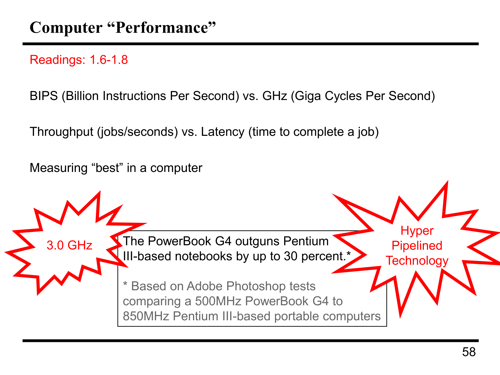

**提问：** 我现在是一名远程教学老师，需要备课，告诉我这个截图是什么意思并且详细解释，到时候上课我会根据这个回答讲课

下面这页是给“计算机性能（Computer Performance）”课程用的一张教学幻灯。它的主旨是：**不要被“GHz”等单一数字迷惑**，理解性能要用正确指标、区分吞吐与时延，并用公平的基准去比较。你可以按下面结构来讲：


# 这页在说什么（一句话）


宣传语里常见的“3.0 GHz”“超深流水线（Hyper Pipelined Technology）”“快30%”并不等于真实的**整机性能**；评估性能要回到**执行时间**、**吞吐量 vs. 时延**、以及**工作负载与基准**上。


---


# 逐行解读与讲义要点


## 标题：Computer “Performance”


引号暗示：**“性能”这个词经常被误用**。厂商爱用好听的指标，但对用户真正重要的是程序运行的**完成时间**与**系统整体效率**。


## Readings: 1.6–1.8


告诉学生：这页对应教材第1章中的性能度量与基准测试部分（通常涵盖 CPU 时间公式、Amdahl 定律、基准选择等）。


## BIPS vs. GHz


* **BIPS（Billion Instructions Per Second）**：每秒能完成的**指令条数**，与程序、指令集、编译器优化关系很大。同一“1 BIPS”，不同CPU做的“工作量”可能完全不同。

* **GHz（Giga cycles per second）**：时钟频率，即**每秒多少个时钟周期**。它只告诉你“节拍多快”，**不保证每拍能干多少活**。

* 把两者放一起是为了强调：**高频≠高BIPS**，因为每条指令所需周期数（CPI）不同。


> 可讲板书的核心公式：

> **CPU 执行时间 = 指令条数（IC） × 每条指令的平均周期数（CPI） × 周期时间**

> 又因为 **周期时间 = 1/频率 f**，所以

> **CPU 时间 = IC × CPI / f**

> ⇒ 频率高（f↑）如果伴随 CPI↑ 或 IC↑，**总体不一定更快**。


## Throughput（吞吐量）vs. Latency（时延）


* **时延**：完成**一个任务**所需时间（例如“这张图片渲染要1.2秒”）。

* **吞吐**：**单位时间内**能完成**多少任务**（例如“每秒渲染60张图”）。

* 二者不是一回事：数据中心常优化吞吐；交互式应用更在乎时延。

* 类比：高速公路**车流量**是吞吐，一辆车**从甲到乙的行驶时间**是时延。增加车道（并行）可提升吞吐，但未必让**单辆车**更快。


## Measuring “best” in a computer


* “最好”的定义取决于**目标工作负载**：办公、渲染、训练模型、事务处理，各有不同指标。

* **基准测试（benchmarks）**要**代表你的实际应用**；只看厂商提供的单一成绩会失真。


---


# 右下角大字与左下角爆炸图：营销术语解读


* **左下：3.0 GHz**

  这是**时钟频率**。厂商常用它暗示“更快”。但如果因为**更深的流水线**导致 CPI 变高、分支预测失败代价更大，真实性能可能**并不随频率同比例提升**。

* **右下：Hyper Pipelined Technology（超深流水线）**

  意思是把指令执行拆成更多、更细的阶段，以便把频率抬高。代价是：


  * **分支预测失败**时要丢弃更多阶段，罚时更大；

  * **每拍工作更“碎”**，CPI 可能上升；

  * 对编译器、缓存命中率、预测器提出更高要求。

    讲给学生：**更深的流水线换来了频率数字漂亮，但不等于实际更快**。


---


# 中间黑框：真实对比与脚注的“坑”


> “PowerBook G4 比基于 Pentium III 的笔记本快 **最多 30%**。”

> *脚注：基于 Adobe Photoshop 测试，对比 **500 MHz** 的 PowerBook G4 与 **850 MHz** 的 Pentium III 笔记本。*


解读与课堂要点：


1. **工作负载非常具体**：只测 Photoshop，且可能是某些滤镜/操作组合。换成编译、加密、视频编码，结论可能不同。

2. \*\*“最多”30%\*\*并非平均值，更不是处处都快。

3. **频率更低的 G4（500 MHz）可能胜过 850 MHz 的 PIII**，恰好证明了前面的公式：


   * 指令集与微架构差异 → **CPI 低**、**每拍干活多（IPC 高）**，能弥补甚至超越频率劣势。

   * Photoshop 工作负载可能**更契合**G4 的执行单元/指令（例如某些多媒体/向量扩展）。

4. **对比是否公平**：内存、磁盘、操作系统、驱动、编译器版本、Photoshop设置等都会影响结果。**基准必须可复现、成套、多样化**。


---


# 你可以这样组织课堂


## 1）用两分钟定调


* 问学生：“3.0 GHz 的CPU一定比 2.5 GHz 的快吗？为什么不一定？”

* 给出 CPU 时间公式，引导他们找出还能影响性能的两个因子：**IC** 与 **CPI**。


## 2）小案例推演（板书/口算）


* 机器A：3.0 GHz、CPI=2；机器B：2.0 GHz、CPI=1。

  同一程序 IC 相同，哪个更快？

  计算：时间 ∝ CPI/f。A 的 2/3 与 B 的 1/2 → **B 更快**。

  结论：频率不是一切。


## 3）吞吐 vs. 时延演示


* 让学生想象：单任务延迟和批处理吞吐如何可能朝不同方向优化（如开启批量、并行度、队列）。


## 4）营销术语拆解


* 讲“超深流水线”的利与弊；引出**分支预测**、**流水线清空**的代价。

* 结合“最多30%”的脚注，讨论**如何读厂商海报**：看**工作负载、统计口径（平均/中位/峰值）**、硬件/软件配置、是否有**误导性对比**。


## 5）基准与方法论（实践建议）


* 选择**与你场景相似**的基准（SPEC、TPC、MLPerf、浏览器基准、你自己的真实工作流）。

* 提供**多维指标**：时延P50/P95、吞吐、能效（每瓦性能）、成本/性能。

* 比较要做到：**同配置、可复现、统计显著**（多次运行、标准差/置信区间）。


---


# 课堂可用的总结金句


* **“性能的唯一真相是执行时间。”**（Elapsed/CPU Time）

* **“高GHz≠高性能；IPC×频率才决定快慢。”**

* **“时延与吞吐不是同一件事，优化目标要明确。”**

* **“任何‘快X%’都要先问：对什么工作负载、在什么条件下？”**


---


# 可能的作业/思考题


1. 给出两台CPU参数（频率、估计CPI）和同一程序的 IC，计算谁更快、快多少。

2. 为你常用的软件（如视频转码、模型推理或数据查询）设计一个**小型基准**，阐明为什么它能代表你的真实负载。

3. 找一则厂商宣传，写一段\*\*“脚注审查”\*\*：指出工作负载、选择偏差和统计口径的问题。


---


这样讲，学生既能看懂这页的每个元素，也能掌握可迁移的性能分析方法，避免被“GHz”或“最多快30%”这类话术误导。


---

## 第 2 页

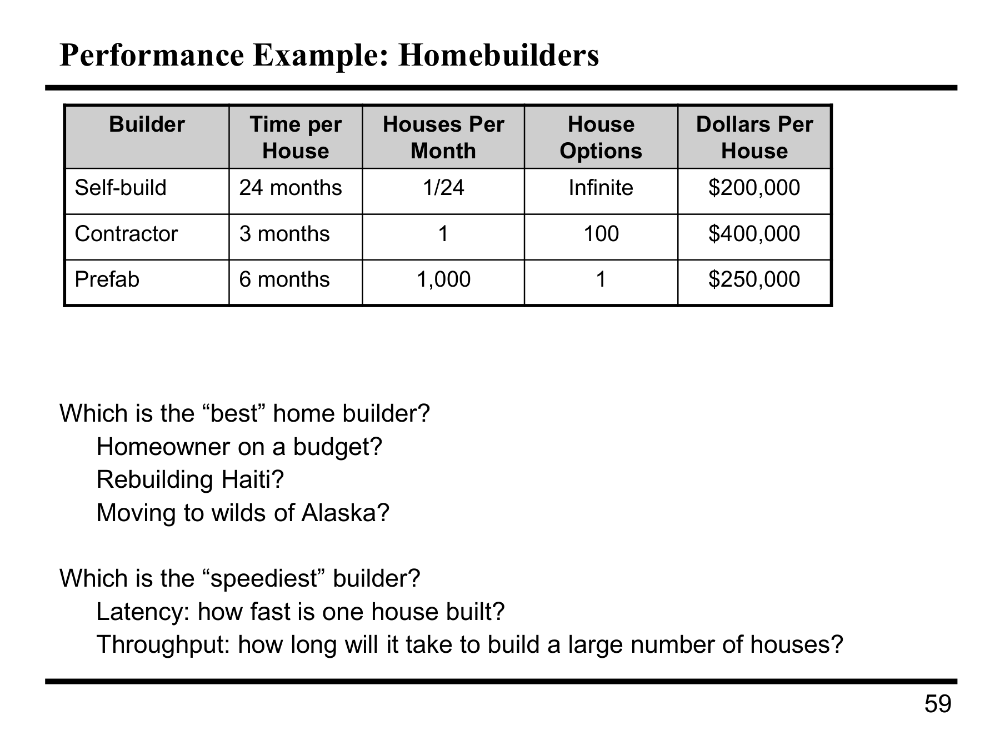

**提问：** 我现在是一名远程教学老师，需要备课，告诉我这个截图是什么意思并且详细解释，到时候上课我会根据这个回答讲课

下面这页是用“房屋建造商”的类比，来**讲清性能度量里“时延（Latency）与吞吐量（Throughput）”的区别，以及“最佳（best）要看场景”**。你可以直接按下面结构讲解。


---


# 这页讲的核心


* **同一个“速度/性能”，可能有完全不同的含义**：


  * **时延（Latency）**＝完成**一个单位任务**需要多长时间。

  * **吞吐量（Throughput）**＝**单位时间**能完成**多少任务**。

* “最好”的选择取决于你的**目标**（成本、个性化、数量、地理条件…），**不能脱离场景谈性能**。


---


# 表格逐项解读（把“建房子”当作“完成任务”）


| Builder（建造方式）   | Time per House（每套时延） | Houses per Month（吞吐量） | House Options（可定制） | Dollars per House（成本） |

| --------------- | -------------------: | --------------------: | -----------------: | --------------------: |

| Self-build（自建）  |                24 个月 |      1/24 套/月 ≈ 0.042 |           无限（完全自由） |             \$200,000 |

| Contractor（承包商） |                 3 个月 |                 1 套/月 |          100（很多可选） |             \$400,000 |

| Prefab（装配式/工厂化） |                 6 个月 |             1,000 套/月 |           1（几乎无定制） |             \$250,000 |


讲解要点：


* **自建**：一套要**很久**（时延大），**每月几乎建不了几套**（吞吐很低），但**个性化最强**，**单价相对便宜**。

* **承包商**：**单套完成最快（3个月）**，但**吞吐一般**（一次就一套），**可选项多**，**价格最高**。

* **装配式**：**单套完成时间不算最短（6个月）**，但**吞吐爆表（每月1000套）**，**几乎不能定制**，**成本中等**。


  > 看起来“Time per House=6个月”与“每月1000套”似乎冲突？其实**不冲突**：

  >

  > * **时延**指某一套从“下单到完工”的历时（6个月）。

  > * **吞吐**指工厂**并行生产线很多**，因此**单位时间交付量巨大**（1000套/月）。

  >   这正是“流水线/并行化”带来**高吞吐不等于低时延**的经典现象。


---


# 两个核心问题（用于课堂互动）


## 1）谁是“最好的（best）”家建方？


**答案：看场景**。给三个典型场景引导学生思考：


* **Homeowner on a budget（预算敏感的业主）**

  关注**成本**与**个性化**：倾向 **Self-build（\$200k/套，且可无限定制）**。

  但要提醒：**时间成本**高、机会成本高。

* **Rebuilding Haiti（灾后重建，需要海量住房）**

  关注**总量与速度**：倾向 **Prefab（吞吐最高，快速大规模供给）**。

  个性化低不是问题，关键是**尽快安置大量家庭**。

* **Moving to wilds of Alaska（偏远地区搬迁）**

  关注**可达性、施工条件、定制化**：可能 **Contractor** 更现实（有一定定制能力，时延短），

  或 **Prefab**（若可整屋预制运输），但要讨论**物流成本/时效**的约束。


> 结论：**“最佳”必须绑定需求函数**——成本、个性化、交付总量、地理条件、风险、维护等。


## 2）谁是“最快的（speediest）”建造方式？


* **按时延（单套完成最快）**：**Contractor（3个月/套）**。

* **按吞吐（单位时间完成最多）**：**Prefab（1000套/月）**。


> **课堂强调**：**不要混淆“时延快”与“吞吐高”**。它们往往需要不同的工程手段与权衡。


---


# 把类比映射回计算机系统（便于收束）


* **Self-build** ⇢ **高度定制的专项系统/手工优化程序**


  * 优点：**完全贴场景**（功能/接口/体验可深度定制）、**单位成本可低**。

  * 缺点：**交付慢**、**规模化难**、**维护成本高**。

* **Contractor** ⇢ **通用 CPU + 成熟软件栈**


  * 优点：**单任务时延小**、**灵活性强**（丰富库和特性）、**生态健全**。

  * 缺点：**吞吐有限**（并行度相对低）、**单位成本高**（要买“通用性”）。

* **Prefab** ⇢ **GPU/加速器/大规模集群/专用硬件（ASIC）**


  * 优点：**并行度极高，吞吐惊人**、**单位任务成本可低**（量大时）。

  * 缺点：**定制受限**、**单任务时延未必最短**、需要\*\*充分“喂饱”\*\*才划算。


---


# 板书与公式（1分钟搞定）


* **Latency（时延）**：完成 1 个任务的时间，单位：秒/任务、月/套。

* **Throughput（吞吐）**：单位时间完成的任务数，单位：任务/秒、套/月。

* 二者常呈反向关联：**提高并行度**→ 吞吐↑，但**单件等待/排队**→ 时延未必↓。

* 计算关系举例：


  * Self-build 吞吐 = $\frac{1}{24}$ 套/月；Contractor = 1 套/月；Prefab = 1000 套/月。

  * 若目标是**1000 套**：


    * Self-build 需 $1000 ÷ \frac{1}{24} = 24{,}000$ 个月（几乎不可能）。
    
    * Contractor 需约 **1000 个月**。
    
    * Prefab 约 **1 个月**（理想并行下，不计排队/资源限制）。


> 可以让学生口算，直观看出\*\*“大规模任务”必须看吞吐\*\*。


---


# 课堂活动与思考题


1. **指标选择题**：在以下项目中，你会重视时延还是吞吐？为何？


   * 在线搜索结果返回（用户体验）

   * 批量日志离线处理（成本/吞吐）

   * 应急指挥系统告警（时延/P99）

2. **权衡练习**：给出一个“目标函数”（例如“在 3 个月内安置 5000 户、预算 12 亿、至少 10 种户型”），让学生选择 Builder 组合并说明理由。

3. **现实工程延伸**：引入**P95/P99 时延**、**队列与并发数**、\*\*资源瓶颈（人力/起重机/网络/IO）\*\*等概念，讨论为什么“理论吞吐”达不到“实际吞吐”。


---


# 结尾金句


* **“最快 ≠ 最好；要先问：你要快的是‘一件’，还是‘一大批’？”**

* **“任何‘最佳’都要绑定需求：成本、数量、个性化、地点与期限。”**

* **“把房子换成‘任务’，这就是计算机系统性能度量的本质。”**


用这套讲解，学生不仅能看懂表格，更能建立**时延/吞吐分离**的思维模式，避免在工程中**选错指标、优化错方向**。


---

## 第 3 页

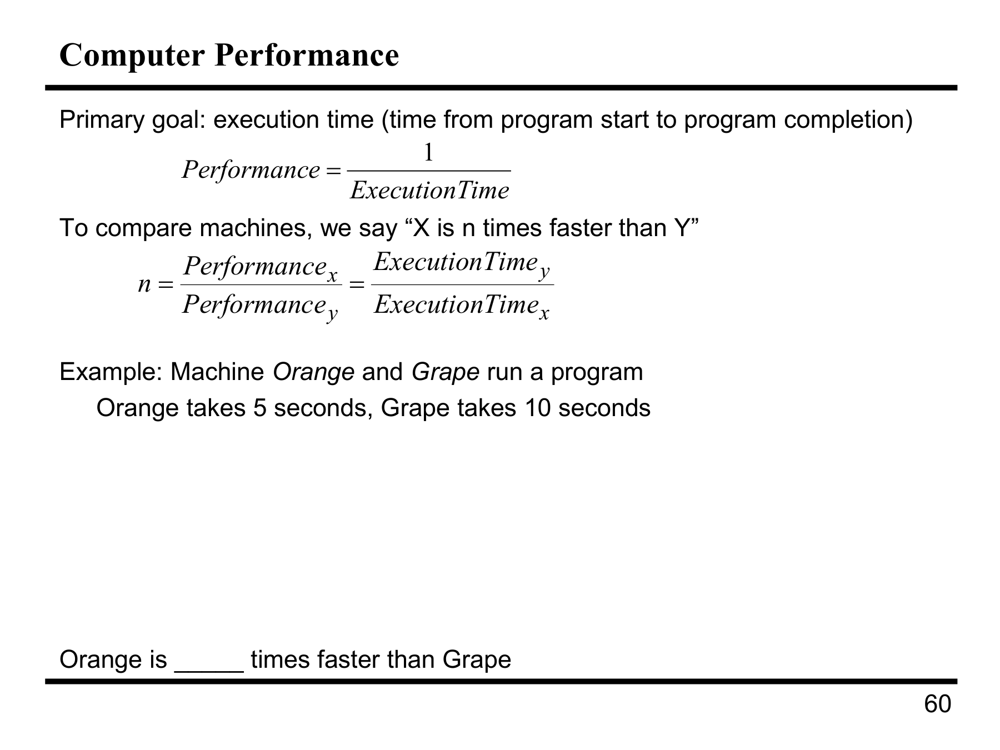

**提问：** 我现在是一名远程教学老师，需要备课，告诉我这个截图是什么意思并且详细解释，到时候上课我会根据这个回答讲课

下面这页在讲：**用“执行时间（Execution Time）”来度量计算机性能，并且用“倍数（speedup）”比较两台机器的快慢**。你可以按这个脚本讲课。


---


# 一、核心结论


* **性能（Performance）= 1 / 执行时间（Execution Time）**

  执行时间越短，性能越高。

* 比较两台机器 X 和 Y 的快慢，用**速度提升倍数（speedup）**：


$$
  n=\frac{\text{Performance}_{x}}{\text{Performance}_{y}}

   =\frac{\text{ExecutionTime}_{y}}{\text{ExecutionTime}_{x}}
$$


  直观理解：**谁花的时间少，谁就更“快”；快多少就是对方时间 ÷ 自己时间**。


---


# 二、逐行解读与推导


## 1）Primary goal: execution time


* “执行时间”= 从程序开始到完成所经历的时间（墙钟时间/CPU时间，课程后续会区分）。

* 之所以用执行时间，是因为**用户真正关心的是“等多久”**。


## 2）Performance = 1 / ExecutionTime


* 如果程序 A 在机器 M 上花 4 秒，性能就是 1/4（秒的倒数，单位可以理解为“每秒完成的程序个数”）。

* **时间越小 → 倒数越大 → 性能越高**。


## 3）“X is n times faster than Y”的精确定义


* 不直接拿性能值（倒数）比较，而是化成**时间比值**更直观：


$$
  n=\frac{\text{Perf}_x}{\text{Perf}_y}

   =\frac{1/T_x}{1/T_y}

   =\frac{T_y}{T_x}
$$

* **结论**：X 比 Y 快 $n$ 倍 ↔ **Y 的时间 / X 的时间 = n**。


---


# 三、例题讲解（Orange vs. Grape）


题设：同一个程序


* Orange：用 **5 秒**

* Grape：用 **10 秒**


计算 speedup（Orange 相对 Grape 的倍数）：


$$
n=\frac{T_{\text{Grape}}}{T_{\text{Orange}}}

  =\frac{10}{5}
$$


**逐位计算**：10 ÷ 5 = 2（因为 5×2=10）。

所以：**Orange is 2 times faster than Grape.**


> 可顺带讲“百分比提升”：

> $\frac{10-5}{10}=0.5=50\%$ ⇒ Orange 比 Grape **快 50%**；

> 但更推荐说“**2× speedup**”，避免“百分之几更快”的歧义。


---


# 四、课堂提示与易错点


1. **“倍数”方向别反**：算“X 比 Y 快几倍”，一定用 **$T_Y/T_X$**。

2. **先统一工作负载**：两台机器必须运行**同一个程序、同一输入**。

3. **单位一致**：都用秒、或都用毫秒；单位不同会算错。

4. **“times faster”表述有时含糊**：


   * “2× faster”通常指 **速度提升 2 倍 = 时间减半**。

   * 更严谨的写法是“**speedup = 2**”。

5. **平均值陷阱**：不同程序的 speedup 不能直接平均时间或倍数，后续可用**加权平均**或**几何平均**（进阶）。


---


# 五、你可以这样组织 5 分钟教学


1. **抛问题**（30s）：两台机器，一个 5s、一个 10s，谁更快几倍？

2. **给定义**（1min）：Performance=1/Time；speedup = $T_\text{old}/T_\text{new}$。

3. **板演例题**（1min）：10/5=2。

4. **反向练习**（1min）：若某优化“2× faster”，新时间=旧时间/2；若时间从 8s 到 6s，speedup=8/6≈1.33×。

5. **易错点提醒**（1–2min）：统一负载与单位；少用“百分之几更快”的口语，多用 speedup。


---


# 六、课后小练


* 同一程序：机器 A 12s、机器 B 3s。**B 相对 A 的 speedup**？

  12 ÷ 3 = **4×**。

* 优化把 20s 降到 15s。**speedup**=20/15=**1.333…×**；**百分比提升**= (20−15)/20=**25%**。


用这套讲解，学生会牢固掌握：**性能用时间说话；比较用“时间比”说话**。


---

## 第 4 页

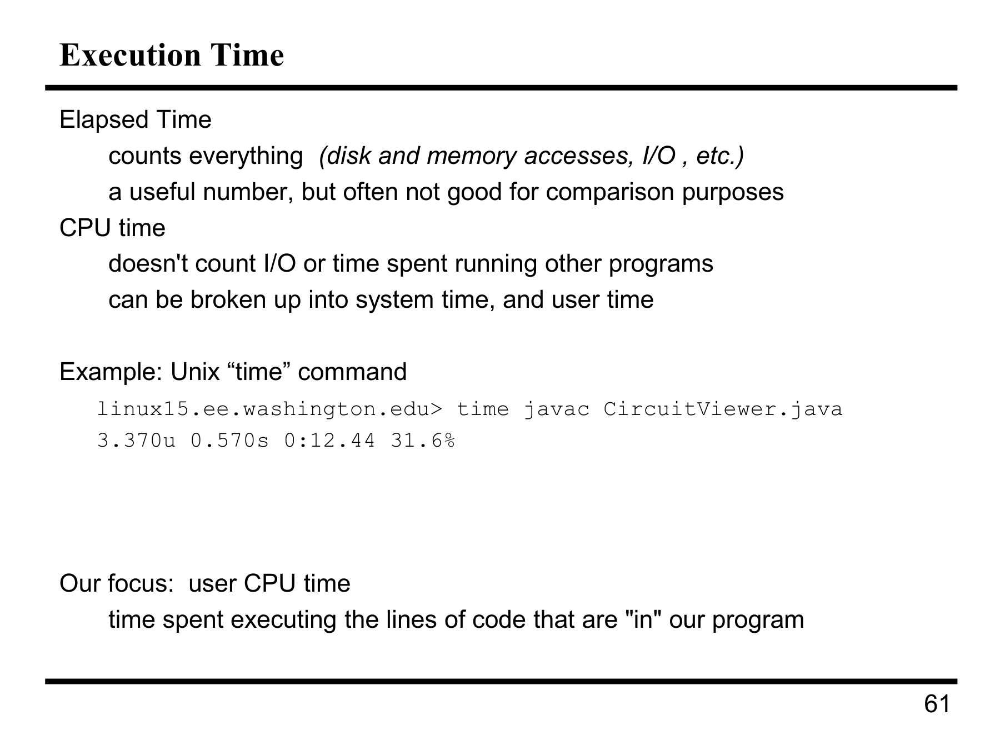

**提问：** 我现在是一名远程教学老师，需要备课，告诉我这个截图是什么意思并且详细解释，到时候上课我会根据这个回答讲课

这页在讲“程序运行时间（Execution Time）”里的几种不同概念，以及 Unix 的 `time` 命令如何把它们分开统计。逐条解释如下：

------

## 1) 三种常见“时间”

### ✅ Elapsed Time（又叫 wall-clock/实际耗时）

- 从程序开始到结束，墙上钟表走过的时间。
- **包含一切**：你的程序在等磁盘/网络/键盘、系统在切到别的进程、你机器在忙别的事……都算进去。
- 适合衡量**用户体感**或端到端时延，但受外部因素影响大，不利于严谨对比不同算法/实现。

### ✅ CPU Time（CPU 使用时间）

- 只统计 CPU 真正在**运行你的程序**时消耗的时间，不含等待 I/O、被抢占去跑别的程序的时间。
- 又细分为：
  - **user time**：在**用户态**执行你自己的代码（例如数值计算、循环）的时间。
  - **system time**：程序发起系统调用时，内核在**内核态**为你干活（如文件读写、进程管理）消耗的时间。
- 通常用来比较算法/代码的“**纯计算代价**”。

> 关系：`CPU time = user time + system time`

------

## 2) 示例解读：`time javac CircuitViewer.java`

输出（幻灯片里那一行）：

```
3.370u  0.570s  0:12.44  31.6%
```

含义逐项解释：

- `3.370u` → **user time = 3.370 秒**

- `0.570s` → **system time = 0.570 秒**

- `0:12.44` → **elapsed time = 12.44 秒**

- `31.6%` → **CPU 利用率**，大致等于

  user time+system timeelapsed time×100%\frac{user\ time + system\ time}{elapsed\ time} \times 100\%

  代入数字：先相加 `3.370 + 0.570 = 3.940`（秒），再除以 `12.44`（秒）得到 `0.3166…`，乘 100% 约 **31.6%**。

> 这说明：程序总共跑了 12.44 秒，但 CPU 真正算你的代码只花了 3.94 秒，剩下的大部分时间在**等待**（可能是磁盘 I/O、读很多小文件、或系统/其他进程占用）。

------

## 3) 这些时间该怎么用？

- 想比较**算法本身效率**（不受磁盘/网络/系统忙闲影响）：看 **user CPU time**（这也是幻灯片最后一句 “Our focus: user CPU time” 的意思）。
- 想评估**端到端体验/吞吐**：看 **elapsed time**（真实等待多久）。
- 想知道你是否被 I/O 拖慢：比较 `elapsed` 和 `user+system` 的差距，差距大 → **I/O-bound / 等待多**；差距小 → **CPU-bound / 算得多**。
- **多核提醒**：`time` 把所有线程/进程的 CPU 时间**相加**。如果程序并行很好，`user+system` 之和可以**大于** `elapsed`，此时 `%CPU` 甚至能超过 100%（例如 4 核满载可到 ~400%）。

------

## 4) 小结

- **Elapsed**：端到端“墙钟”时间，含等待。
- **CPU(user/system)**：CPU 真忙你的时间，适合比较代码/算法。
- 示例里的 `%CPU = 31.6%` 表示大部分时间在等 I/O 或受系统调度影响；因此课程/文档强调把**用户态 CPU 时间**作为主要关注点来分析程序本身的效率。

如果你手头有某段程序的 `time` 输出，发给我，我可以帮你判断是 **CPU 受限** 还是 **I/O 受限**，以及该往哪儿优化。


---

## 第 5 页

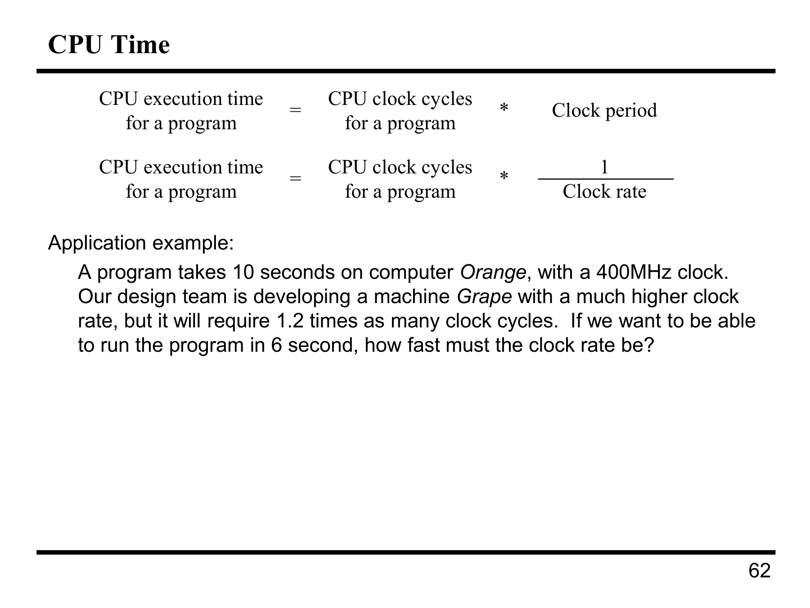

**提问：** 我现在是一名远程教学老师，需要备课，告诉我这个截图是什么意思并且详细解释，到时候上课我会根据这个回答讲课

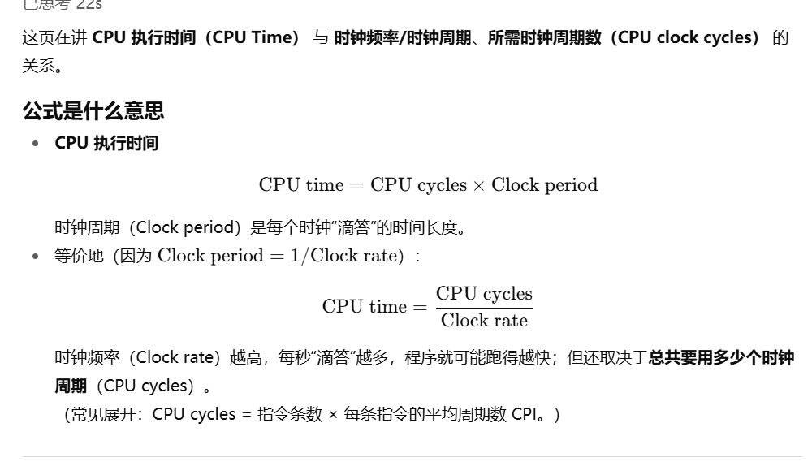

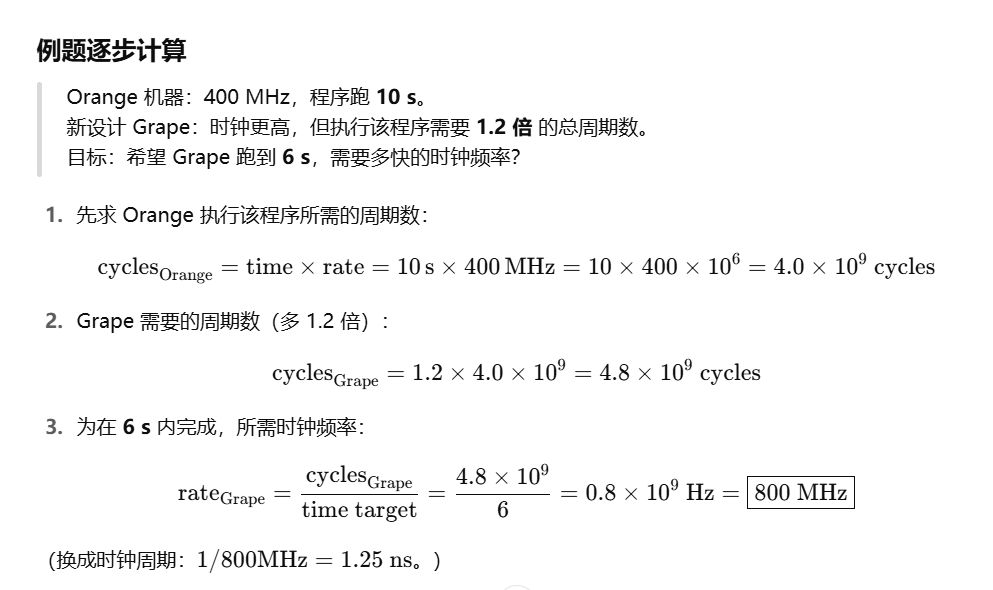

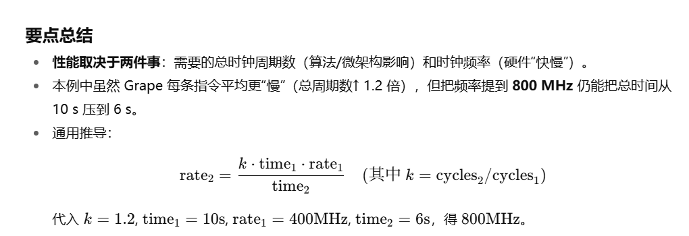


---

## 第 6 页


**提问：** 我现在是一名远程教学老师，需要备课，告诉我这个截图是什么意思并且详细解释，到时候上课我会根据这个回答讲课

下面这页题为 **“CPI”**，目的是把“程序包含多少条指令（Instructions）”与“执行时间（Execution Time）”**精确地联系起来**，并引出三个决定性能的“杠杆”：**指令条数（IC）**、**每条指令平均所需的时钟周期数（CPI）**、**时钟频率（Clock rate）**。你可以按下面的脚本讲。


---


# 1）核心问题


**How do the # of instructions in a program relate to the execution time?**

程序的**指令数**如何决定**执行时间**？


---


# 2）两条关键公式（先讲含义再板书）


## 公式 A：把“总周期数”写成“指令数 × 平均每条所需周期”


$$
\textbf{CPU clock cycles for a program}

= \textbf{Instructions for a program} \times 

\textbf{Average Cycles per Instruction (CPI)}
$$


* **Instructions**（常写 IC, Instruction Count）：程序真实执行了多少条机器指令，受算法、编译器、ISA 影响。

* **CPI**（Cycles per Instruction）：**平均一条指令要多少个时钟周期**，受微架构与指令混合（mix）影响。


## 公式 B：把“CPU 时间”写成 IC、CPI 与频率 $f$


$$
\textbf{CPU execution time}

= \textbf{CPU clock cycles}\times\textbf{Clock period}

= \textbf{Instructions}\times \textbf{CPI}\times \frac{1}{\textbf{Clock rate}}
$$


> 这就是贯穿整门课的“金三角”：

>

> $$

> \boxed{T_{\text{CPU}}=\dfrac{IC\times CPI}{f}}

> $$

>

> **时间变短**可以通过：**减少指令数（IC↓）**、**降低CPI**、\*\*提高频率（f↑）\*\*三种方式实现。


---


# 3）直观理解 CPI（学生容易记住的几句）


* CPI **不是常数**：不同指令、不同程序、甚至同一程序不同输入都会变。

* CPI 反映了**每拍能干多少活**的“浓缩程度”（与 IPC 互为倒数：IPC≈每周期完成的指令数，IPC=1/CPI 在无乱序/多发射限制时的近似）。

* 影响 CPI 的主要因素：


  * **微架构**：流水线深度、发射宽度、乱序执行、分支预测、执行单元数量；

  * **存储系统**：L1/L2/L3 命中率、内存延迟；

  * **指令混合**：整数/浮点、分支、访存指令比例；

  * **编译器与优化**：寄存器分配、指令调度、向量化。


---


# 4）分门别类的 CPI（可选进阶板书）


如果把指令分成若干类 $i$（如 ALU、Loads、Stores、Branches…），则


$$
\text{总周期}=\sum_i (I_i \times CPI_i),\qquad

IC=\sum_i I_i
$$


$$
\Rightarrow \ \textbf{平均 CPI}=\frac{\sum_i I_i \times CPI_i}{\sum_i I_i}
$$


这说明**指令构成（mix）变化**就会改变平均 CPI。


---


# 5）算几个“课堂即算”的小例子


### 例 1：直接代入三角公式


* 程序指令数 $IC=1\times 10^9$

* 平均 $CPI=1.5$

* 频率 $f=2\,\text{GHz}=2\times 10^9$


$$
T=\frac{IC\times CPI}{f}

=\frac{1\times 10^9\times 1.5}{2\times 10^9}

=0.75\ \text{s}
$$


**答案：0.75 秒。**


### 例 2：是“提频”还是“降 CPI”划算？


* 现状：$IC$ 不变，$CPI=2.0$，$f=2\,\text{GHz}$ ⇒ $T= IC\times 2/2\text{G}=IC/1\text{G}$（与 IC 成正比）

* 方案 A：提频到 3 GHz（CPI 不变）⇒ 时间乘以 $2/3$（≈**0.67×**）

* 方案 B：CPI 从 2.0 降到 1.3（频率不变）⇒ 时间乘以 $1.3/2=0.65$（**0.65×**）


> **降 CPI**更划算（0.65× < 0.67×），让学生体会“靠微架构/算法提升往往更有效”。


### 例 3：指令数减少与 CPI 上升的权衡


优化把 **IC 降 25%**，但使 **CPI 增 10%**，频率不变：


$$
\frac{T_{\text{new}}}{T_{\text{old}}}

=\frac{IC\times 0.75\times CPI\times 1.10}{IC\times CPI}

=0.825
$$


**时间降为 82.5%（≈1.21× 加速）**。让学生学会**用乘法评估权衡**。


---


# 6）与上一页（“CPU Time”）的衔接


上一页给出 $T=\text{cycles}\times\text{period}=\dfrac{\text{cycles}}{f}$。

这一页等价地告诉我们：**cycles = IC × CPI**。两页合起来就得到：


$$
\boxed{T=\dfrac{IC\times CPI}{f}}
$$


这也是你之后所有“性能分析、算倍数、做取舍”的**统一出发点**。


---


# 7）易错点与教学提醒


1. **不要用 GHz 当性能**：频率只对应 $f$ 这一项；**CPI 和 IC 变动足以完全改变结论**。

2. **单位统一**：频率用 Hz、时间用秒；若用 MHz/GHz 要换算清楚。

3. **平均数“陷阱”**：把多个程序的 CPI/时间进行比较时，**不能随便算算术平均**；更合理做法是用**总指令数与总时间**或用**加权/几何平均**（进阶）。

4. **I/O 与等待**：这里的公式针对**CPU 执行时间**；如果墙钟时间远大于 CPU 时间，说明受 I/O/等待支配，优化方向不同。


---


# 8）板书模板（1 分钟抄完）


1. $\text{cycles}=IC\times CPI$

2. $T=\dfrac{IC\times CPI}{f}$

3. 三个杠杆：**IC↓、CPI↓、f↑**

4. “谁更划算？”→ 看**乘积变化**：$IC$ 与 $CPI$ 的相对变化量相乘，再与 $f$ 的变化比较。


---


# 9）随堂小练（给学生口算）


1. $IC=5\times10^8,\ CPI=1.2,\ f=3\text{ GHz}$ →

   $T=(5e8\times1.2)/(3e9)=0.2\ \text{s}$。

2. 把 $f$ 提 25%，同时 $CPI$ 因更深流水线上升 10%，IC 不变。时间缩放因子 = $1/(1.25)\times 1.10 = 0.88$（**12% 加速**）。

3. 把指令数降 30%，但频率降 10%，CPI 不变。时间缩放因子 = $0.70/0.90 \approx 0.777...$（**约 1.29×** 加速）。


---


用这套讲解，学生会清楚：**执行时间由 IC×CPI 与频率共同决定**，而 **CPI** 是连接“机器能干多少活/每拍效率”的关键指标。


---

## 第 7 页

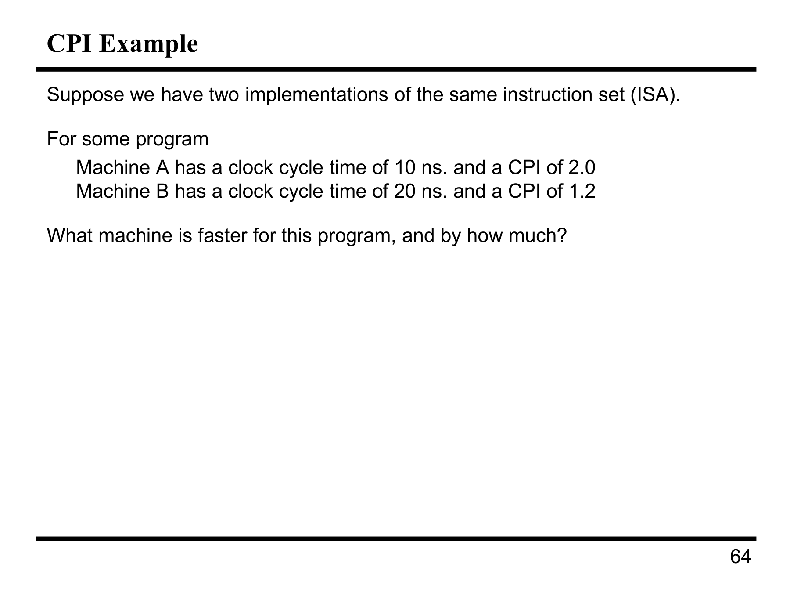

**提问：** 我现在是一名远程教学老师，需要备课，告诉我这个截图是什么意思并且详细解释，到时候上课我会根据这个回答讲课

下面这页是 **“CPI 例题（CPI Example）”**：同一条指令集（ISA）在两台实现上运行**同一个程序**，比较谁更快、快多少。关键是用统一公式


$$
T_{\text{CPU}}=\frac{IC\times CPI}{f}

=\text{(指令数)}\times\text{(每条指令的平均周期数)}\times\text{(时钟周期)}
$$


同一 ISA + 同一程序 ⇒ **指令数 $IC$ 近似相同**，所以比较谁快就比 $\;CPI\times\text{时钟周期}\;$ 的大小（或比 $\;CPI/f$）。


---


# 题目给定


* **Machine A**：Clock cycle time = **10 ns**（即 $f_A=1/10\text{ns}=100\text{ MHz}$），**CPI = 2.0**

  → 单条指令时间 = $10\text{ns} \times 2.0 = 20\text{ns}$

* **Machine B**：Clock cycle time = **20 ns**（$f_B=50\text{ MHz}$），**CPI = 1.2**

  → 单条指令时间 = $20\text{ns} \times 1.2 = 24\text{ns}$


因为两机的 $IC$ 相同，**总执行时间**之比就等于**单条指令时间**之比。


---


# 结论


* **更快的是 Machine A。**

* **快多少（speedup）**：


$$
  \text{speedup}=\frac{T_B}{T_A}=\frac{24\text{ns}}{20\text{ns}}=1.2
$$


  也就是 **A 比 B 快 1.2 倍**（A 比 B **快 20%**）。

  反过来，B 相比 A 是 **0.833×**（**慢约 16.7%**）。


---


# 讲解要点（1 分钟板书）


1. **不要只看 GHz**：A 频率更高，但若 CPI 大很多也可能不占优；这里 A 的 CPI 较大（2.0 vs 1.2），但**更短的周期**把总时间拉低，仍胜出。

2. **看乘积 $CPI \times$ 周期**（或 $CPI/f$）：


   * A：$2.0 \times 10\text{ns} = 20\text{ns}$

   * B：$1.2 \times 20\text{ns} = 24\text{ns}$

3. **同一 ISA ⇒ $IC$ 近似相等**：便于把比较简化为 CPI 与时钟的权衡。（现实里编译器/微架构差异会让 $IC$ 有波动，但本题默认忽略。）


---


# 课堂延伸（快速练习）


* 若把 B 的频率翻倍（周期 10 ns），保持 CPI=1.2，则单条指令 $=12\text{ns}$ ⇒ **B 会反超**。

* 设计题：若想让 B 追平 A（20 ns/指令），在 CPI=1.2 不变时，需要的周期 = $20/1.2\approx16.67\text{ns}$（频率≈**60 MHz**）。


> 总结一句：**性能取决于 IC、CPI、频率三者共同作用**；本例教学生**用乘积思维**做权衡，而不是被单一指标（GHz 或 CPI）误导。


---

## 第 8 页

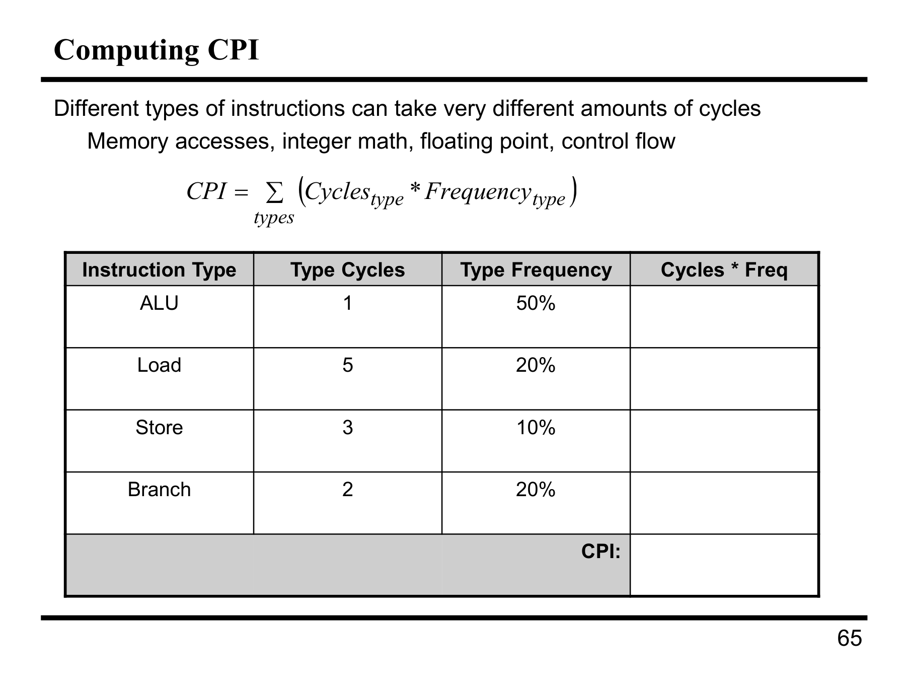

**提问：** 我现在是一名远程教学老师，需要备课，告诉我这个截图是什么意思并且详细解释，到时候上课我会根据这个回答讲课

下面这页是 **“如何计算 CPI（Computing CPI）”**。它用“指令类型的占比 × 各类型平均耗费的周期数”来求**整体平均 CPI**，并强调：**程序的指令构成（instruction mix）决定了你该优化哪一类操作**。你可以直接按这个脚本讲课。


---


# 1）核心公式（板书）


不同类型指令耗费的周期不同，因此


$$
\boxed{\text{CPI}=\sum_{\text{types}}\big(\text{Cycles}_{\text{type}}\times\text{Frequency}_{\text{type}}\big)}
$$


* **Cycles\_type**：该类型指令平均每条要多少**时钟周期**。

* **Frequency\_type**：该类型在**全部指令中的占比**（频率/权重）。

* 实质：**加权平均**。


---


# 2）把表格算出来（逐步填最后一列）


| Instruction Type | Type Cycles | Type Frequency |      Cycles × Freq |

| ---------------- | ----------: | -------------: | -----------------: |

| ALU              |           1 |     50% = 0.50 | $1\times0.50=0.50$ |

| Load             |           5 |     20% = 0.20 | $5\times0.20=1.00$ |

| Store            |           3 |     10% = 0.10 | $3\times0.10=0.30$ |

| Branch           |           2 |     20% = 0.20 | $2\times0.20=0.40$ |


先检查频率是否加起来 = 1：

0.50 + 0.20 + 0.10 + 0.20 = **1.00** ✅


把最后一列相加得到 **平均 CPI**：


* 逐位相加：0.50 + 1.00 = 1.50

* 1.50 + 0.30 = 1.80

* 1.80 + 0.40 = **2.20**


**结论：CPI = 2.2**


---


# 3）怎么解读这个 CPI（指导优化方向）


* **Loads（1.00）贡献最大**（尽管只占 20% 指令，但每条要 5 个周期），说明程序受**访存代价**影响大。优先方向：缓存命中率、减少内存访问、数据局部性、向量化聚合加载、预取等。

* **Branches（0.40）** 次之：可以考虑更好的**分支预测/减少分支/使用条件移动**等。

* **ALU（0.50）** 和 **Stores（0.30）** 合计 0.80，优化空间相对小。


> **定位“最大头”= 最大的 Cycles×Freq**，这就是 Amdahl 定律的思路：**先优化对总时间贡献最大的部分**。


---


# 4）“如果…会快多少？”（随堂口算）


* **把 Load 从 5 周期降到 3 周期**：

  变化量 = $(5-3)\times0.20=0.40$ ⇒ 新 CPI = $2.2-0.40=1.8$

  **加速比** $=\frac{2.2}{1.8}\approx1.22\times$（\~22% 更快）

* **把 Branch 从 2 降到 1.2 周期**：

  变化量 = $(2-1.2)\times0.20=0.16$ ⇒ 新 CPI = $2.04$

  加速比 $=2.2/2.04\approx1.078\times$（\~7.8%）

* **把 ALU 从 1 降到 0.5 周期**（例如更宽发射）：

  变化量 = $(1-0.5)\times0.50=0.25$ ⇒ 新 CPI = $1.95$

  加速比 $=2.2/1.95\approx1.128\times$（\~12.8%）


> 对比可见：**优化 Load**收益最大，因为“占比×代价”最大。


---


# 5）课堂提示与易错点


1. **单位一致**：频率用小数（0.2 而不是 20%）。

2. **总占比必须=1**，否则样本/统计有问题。

3. **CPI 是平均值**：指令混合或输入一变，CPI 就会变；因此**基准要代表真实负载**。

4. **CPI 与频率相互独立**：最终**执行时间**要用


$$
   T_{\text{CPU}}=\frac{IC\times CPI}{f}
$$


   CPI 降了，但如果为此把频率大幅降下去，整体可能得不偿失。


---


# 6）可用的板书模板


1. 写出四行 **Cycles×Freq** 并核对和为 1。

2. 逐步相加算出 **CPI=2.2**。

3. 画小条形图表示各项贡献比例（1.00、0.50、0.40、0.30），引出“先抓大头”。


---


# 7）练习题（留给学生 2–3 分钟）


1. 若 **Load 占比**从 20% 上升到 30%（其他不变），新的 CPI？

   $\,0.50 + 5\times0.30 + 0.30 + 0.40 = 0.50 + 1.50 + 0.30 + 0.40 = 2.70$。

2. 若把 **Load 降到 3 周期**且**Branch 占比**降到 10%，CPI？

   $\,0.50 + 3\times0.20 + 0.30 + 2\times0.10 = 0.50 + 0.60 + 0.30 + 0.20 = 1.60$。


---


用这套讲解，学生能掌握：**CPI 是“按指令类型加权的平均周期数”**，会算、会解读、会用它来**指导优化优先级**。


---

## 第 9 页

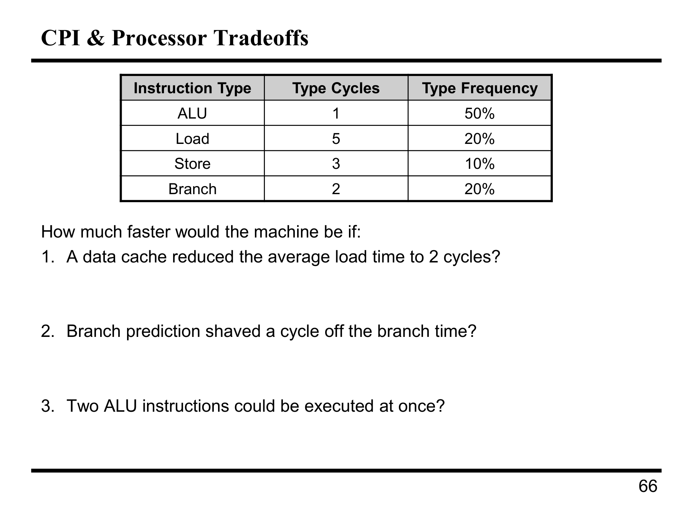

**提问：** 我现在是一名远程教学老师，需要备课，告诉我这个截图是什么意思并且详细解释，到时候上课我会根据这个回答讲课

这页叫 **“CPI & Processor Tradeoffs（CPI 与处理器权衡）”**。用上一页同一份“指令构成表”，让你**定量评估不同硬件改动能带来多大速度提升**，并体会“先优化大头”的思想（Amdahl 定律）。


**基线（未改动）**

指令类型与占比：ALU 50%，Load 20%，Store 10%，Branch 20%

各类型平均周期：ALU 1，Load 5，Store 3，Branch 2


> 基线 CPI = $1×0.5 + 5×0.2 + 3×0.1 + 2×0.2$

> \= $0.5 + 1.0 + 0.3 + 0.4 = \mathbf{2.2}$


下面三种改动都默认**时钟频率不变**，只影响 CPI。


---


## 1) 加数据缓存，把 Load 平均时延降到 2 个周期


* Load 由 5 → 2，变化 $\Delta = -3$

* 贡献在 CPI 上的变化：$\Delta \text{CPI} = \Delta × \text{Freq}_{\text{Load}} = (-3)×0.2 = -0.6$

* 新 CPI：$2.2 - 0.6 = \mathbf{1.6}$

* **加速比**：$\text{speedup} = \dfrac{2.2}{1.6} = \mathbf{1.375×}$（≈ **快 37.5%**）


> 结论：**收益最大**，因为“代价×占比”（5×20%）本来就是大头。


---


## 2) 更好的分支预测，把 Branch 平均时延降 1 个周期


* Branch 由 2 → 1，$\Delta = -1$

* $\Delta \text{CPI} = (-1)×0.2 = -0.2$

* 新 CPI：$2.2 - 0.2 = \mathbf{2.0}$

* **加速比**：$\dfrac{2.2}{2.0} = \mathbf{1.10×}$（**快 10%**）


---


## 3) 一次能执行两条 ALU 指令（双发射，假设能充分配对）


* 等效为 **ALU 指令的平均周期从 1 降到 0.5**

* $\Delta \text{CPI} = (0.5 - 1)×0.5 = -0.25$

* 新 CPI：$2.2 - 0.25 = \mathbf{1.95}$

* **加速比**：$\dfrac{2.2}{1.95} \approx \mathbf{1.13×}$（≈ **快 12.8%**）


> 提醒学生：这是理想化估算，真实机器会受依赖、取指带宽、乱序窗口等限制，实际收益可能更低。


---


## 一句话总结（课堂收口）


* 评估任何优化，优先用：


$$
  \Delta \text{CPI} = \sum (\Delta \text{Cycles}_{\text{type}} \times \text{Freq}_{\text{type}})

  \quad\Rightarrow\quad

  \text{speedup} = \frac{\text{CPI}_{\text{old}}}{\text{CPI}_{\text{new}}}
$$

* **先优化“贡献最大的项”**（Cycles×Freq 最大的类型）。在这组数据里是 **Load**，因此“加缓存”带来的提升最大。


---

## 第 10 页

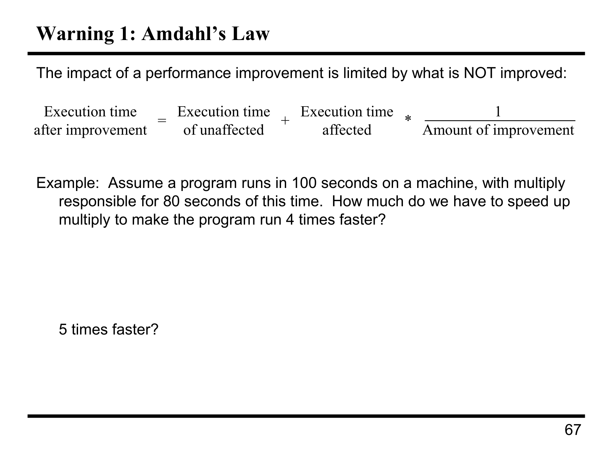

**提问：** 我现在是一名远程教学老师，需要备课，告诉我这个截图是什么意思并且详细解释，到时候上课我会根据这个回答讲课

下面这页是 **Amdahl 定律（Amdahl’s Law）** 的警示：**整体性能提升受“未被优化部分”所限制**。页面给出的是“优化前后总时间”的分解公式，并让你用一个“乘法指令很慢”的案例来算总体加速比。


---


# 1）核心公式（板书就用这一行）


把程序运行时间拆成**会被改进的部分**与**不会被改进的部分**：


$$
\textbf{NewTime}

=\underbrace{T_{\text{unaffected}}}_{\text{不改的}}

+\underbrace{\frac{T_{\text{affected}}}{s}}_{\text{被改的}/\text{改进倍数}}
$$


* $T_{\text{affected}}$：会被优化的那部分时间；

* $T_{\text{unaffected}}$：不会被优化的剩余时间；

* $s$：对被优化部分的**改进倍数**（如把该部分提速 10 倍，则 $s=10$）。


等价地，若把被优化部分所占比例记为 $f$（0–1），总时间 $T$：


$$
\textbf{Overall Speedup}=

\frac{T}{\text{NewTime}}

=\frac{1}{(1-f)+\frac{f}{s}}
$$


当 $s\to\infty$（把被优化部分做到“无限快”），**可达到的上限**是


$$
\text{Max Speedup}=\frac{1}{1-f}
$$


这就是 *Amdahl’s Law* 的本质。


---


# 2）例题一步步算（按页上的数据）


> 程序在一台机器上运行 **100 s**，其中 **乘法（multiply）占 80 s**。

> 问：要让**整体**变 **4× 更快**（即 4 times faster），乘法必须加速到多少倍？


* 目标总时间：$100/4=25\ \text{s}$

* 不受影响的时间：$T_{\text{unaffected}}=100-80=20\ \text{s}$

* 设乘法的速度提升为 $s$，则


$$
  25 = 20 + \frac{80}{s}

  \Rightarrow \frac{80}{s}=5

  \Rightarrow s=\frac{80}{5}=\textbf{16}
$$


**答**：乘法部分需要 **提速 16×**，整体才能达到 **4×**。


---


# 3）“5 times faster?”（能否整体 5×？）


目标总时间：$100/5=20\ \text{s}$。

带入公式：


$$
20 = 20 + \frac{80}{s}

\Rightarrow \frac{80}{s}=0

\Rightarrow s\to\infty
$$


**结论**：想要整体 **5×**，需要乘法 **“无限快”**，现实里**做不到**。

直观原因：未被改进的 **20 s** 构成**硬下限**；这也等于上式的上限


$$
\text{Max Speedup}=\frac{1}{1-f}=\frac{1}{1-0.8}= \textbf{5}
$$


你**可以逼近 5×**，但**无法用有限的 $s$** 真正达到或超过它。


---


# 4）课堂讲解要点（1–2 分钟）


* **先问三句**：

  1）哪个部分会被优化？（乘法 80 s）

  2）其余部分多久？（20 s）

  3）整体目标速度提升多少？（4× / 5×）

* **把式子写全**：$NewTime=20+80/s$。

* **算 4×**：25 = 20 + 80/s → $s=16$。

* **说上限**：未改部分 20 s ⇒ 整体最快也只能到 20 s（5×的极限）。

* **升华**：**先找“占比最大的慢项”再优化**；占比不变，再大的单点提速也会被上限“卡住”。


---


# 5）易错点提醒


* “整体快 $n$ 倍”必须把**目标总时间**设为 $T/n$，再回代方程，**不要**直接把被优化部分乘以 $n$。

* $f$ 是**时间占比**，不是“指令占比”。

* 即使把热段提到很高倍数，**越往后收益越递减**（Amdahl 的“报酬递减”）。


> 一句话收尾：**优化总是受“没动的部分”限制**。想要真正的大幅加速，要么提高热段占比（重构算法/并行化），要么**同时**优化多处瓶颈。


---

## 第 11 页

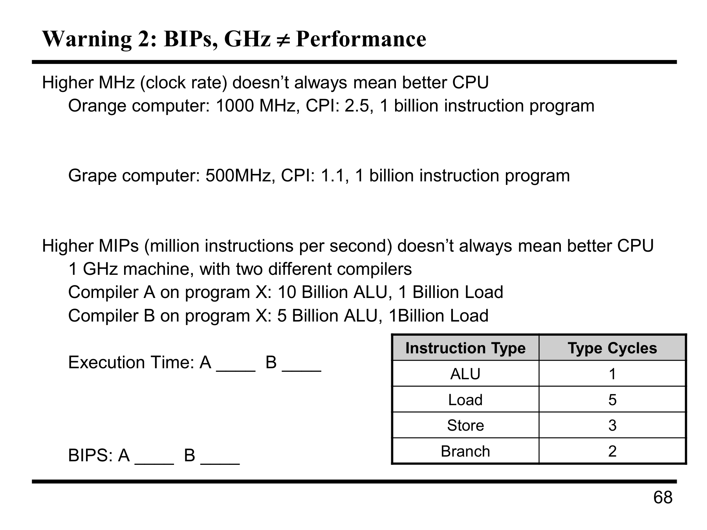

**提问：** 我现在是一名远程教学老师，需要备课，告诉我这个截图是什么意思并且详细解释，到时候上课我会根据这个回答讲课

这页的标题是 **“Warning 2: BIPs, GHz ≠ Performance（警告2：BIPS、GHz ≠ 性能）”**。目的：用两个算例说明——**更高的频率（GHz/MHz）或更高的指令吞吐（BIPS/MIPS）都不等同于更好的整机性能**。性能的唯一真相仍是**执行时间**，而执行时间由 **IC×CPI/f** 决定。


---


## 一、例子1：更高 MHz 未必更快


同一程序、指令条数相同（1 billion = 10⁹）：


* **Orange**：频率 **1000 MHz = 1×10⁹ Hz**，**CPI = 2.5**


$$
  T_O=\frac{IC\times CPI}{f}

      =\frac{10^9\times2.5}{10^9}

      =\mathbf{2.5\ s}
$$

* **Grape**：频率 **500 MHz = 5×10⁸ Hz**，**CPI = 1.1**


$$
  T_G=\frac{10^9\times1.1}{5\times10^8}

      =\frac{1.1\times10^9}{5\times10^8}

      =\mathbf{2.2\ s}
$$


**结论**：虽然 Grape 的 MHz 更低，但因 **CPI 更小**，**Grape 更快**。

**speedup**（Grape 相对 Orange）：$2.5/2.2 \approx \mathbf{1.14\times}$。


> 讲给学生：**GHz 只是分母里的 $f$**；如果 CPI 降得足够多，低频也能更快。


---


## 二、例子2：更高 BIPS 未必更快（同一 1 GHz 机器，两种编译器）


指令类型单价（周期）见右下表：ALU=1、Load=5、Store=3、Branch=2。本题只涉及 **ALU** 与 **Load**。


* **Compiler A** 在程序 X 上产生

  **10B ALU + 1B Load**（B=10⁹）

  总周期 $=\ 10\times10^9\times1 + 1\times10^9\times5 = 15\times10^9$


$$
  T_A=\frac{15\times10^9}{1\times10^9}=\mathbf{15\ s}
$$


  总指令数 $=10+1=\mathbf{11\ B}$

  **BIPS\_A** $=\frac{\text{指令数}}{\text{时间}}=\frac{11}{15}\approx \mathbf{0.73\ BIPS}$


* **Compiler B** 在程序 X 上产生

  **5B ALU + 1B Load**

  总周期 $=\ 5\times10^9\times1 + 1\times10^9\times5 = 10\times10^9$


$$
  T_B=\frac{10\times10^9}{1\times10^9}=\mathbf{10\ s}
$$


  总指令数 $=5+1=\mathbf{6\ B}$

  **BIPS\_B** $=\frac{6}{10}=\mathbf{0.60\ BIPS}$


**结论**：


* **执行时间**：A = **15s**，B = **10s** ⇒ **B 更快（1.5×）**；

* **BIPS**：A = **0.73**，B = **0.60** ⇒ **A 的 BIPS 反而更高**！


> 这恰好说明：**更高的 BIPS/MIPS 并不保证更短的执行时间**。编译器 A 让机器“每秒执行更多条指令”，但它生成了**更多且更贵的指令（多了 5B 条 ALU）**，总周期更大，**整体更慢**。


---


## 三、板书收口（给学生的记忆锚点）


* **统一公式**：$\displaystyle T=\frac{IC\times CPI}{f}$

* **GHz ≠ 性能**：提升 $f$ 若伴随 CPI 上升或 IC 增加，**不一定更快**。

* **BIPS/MIPS ≠ 性能**：BIPS 高可能只是**IC 多**；关键是**总周期**与**总时间**。

* **优化策略**：同时关注 **IC（算法/编译器）**、**CPI（微架构/存储层次/预测）**、**频率 $f$**，用数据说话，别被单一指标带偏。


这样讲，学生能算、能比较，也能理解为什么真实工程里**不能用 GHz 或 MIPS 做性能“唯指标论”**。


---

## 第 12 页

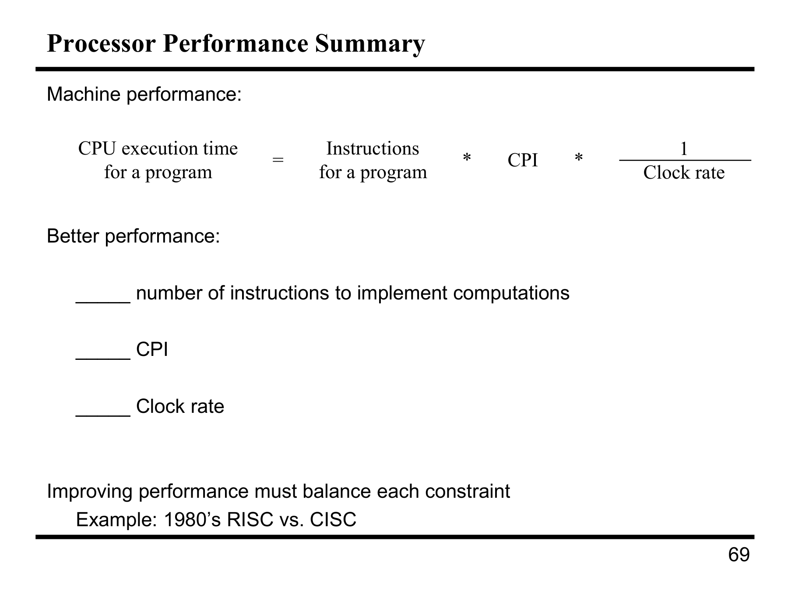

**提问：** 我现在是一名远程教学老师，需要备课，告诉我这个截图是什么意思并且详细解释，到时候上课我会根据这个回答讲课

这页是整章的\*\*“处理器性能总结（Processor Performance Summary）”\*\*。它把前面学到的公式与思路收拢成三大杠杆，并提醒你：**提升性能必须在三者之间做权衡**（页尾举例：80 年代的 RISC vs. CISC 之争）。


---


# 一、唯一可靠的衡量：执行时间


核心公式（板书这行即可）：


$$
\boxed{T_{\text{CPU}}=\frac{\text{Instructions}\times \text{CPI}}{\text{Clock rate}}}
$$


* **Instructions（IC）**：程序真实执行的机器指令数（受算法、编译器、ISA 影响）。

* **CPI**：平均每条指令消耗的时钟周期（受微架构、缓存/分支预测、指令混合影响）。

* **Clock rate**：时钟频率 $f$。


> “谁更快？”＝**谁的执行时间更短**；不要被 GHz、MIPS 等单一数字误导。


---


# 二、三大“性能杠杆”（填空答案）


Better performance = **更短的 $T_{\text{CPU}}$**，因此：


1. **\_\_\_\_\_ number of instructions to implement computations**

   → **Fewer**（**更少**的指令条数）。

   途径：改算法、换数据结构、编译优化（内联、循环变换、向量化）、选择更高效的库/API。


2. **\_\_\_\_\_ CPI**

   → **Lower**（**更低**的 CPI）。

   途径：改进微架构（更好的缓存层级、乱序/多发射、更准的分支预测）、改善数据局部性减少 cache miss、指令级并行。


3. **\_\_\_\_\_ Clock rate**

   → **Higher**（**更高**的时钟频率）。

   途径：工艺/电压/流水线加深等，但要注意功耗与 CPI 潜在上升的权衡（更深流水线→误判代价↑）。


---


# 三、为什么必须“平衡每个约束”？


提升某一项，可能**伤害**另外一项或成本/能耗：


* **提频**：功耗 ∝ $CV^2f$；为提频加深流水线，CPI 可能上升（分支罚时更大）。

* **降 CPI**：更复杂的预测器/缓存会增加面积与功耗；还可能限制最高频率。

* **降 IC**：用更复杂指令（或激进优化）可能提高每条指令代价、引入更多 miss/同步开销。


**RISC vs. CISC（历史例子）**


* 早期 **CISC**：用\*\*更少指令（IC↓）\*\*完成复杂操作，但单条指令微架构更复杂，**CPI↑/频率受限**。

* **RISC**：简化指令、固定编码，靠编译器把工作摊给多条简单指令（IC↑），换来**CPI↓、频率↑**、并行度更高。

* 现实赢家是**综合平衡**：现代 x86 也会把 CISC 指令**解码成 RISC-like 微操作**，以便获得低 CPI 与高并行。


---


# 四、教学用“快速估算范式”


给任何优化，都用同一把尺：


$$
\textbf{缩放因子}=\frac{IC_{\text{new}}}{IC_{\text{old}}}\times

\frac{CPI_{\text{new}}}{CPI_{\text{old}}}\times

\frac{f_{\text{old}}}{f_{\text{new}}}
$$


缩放因子 < 1 表示变快，其倒数是 **speedup**。


---


# 五、1 分钟练习（课堂口算）


* 某程序：$IC$ 降 20%，CPI 升 10%，频率不变。

  缩放因子 $=0.8\times1.1=0.88$ ⇒ **1/0.88 ≈ 1.14×** 加速。

* 另一个方案：CPI 降 25%，但为此频率降 10%（IC 不变）。

  缩放因子 $=1\times0.75\times\frac{1}{0.9}=0.833...$ ⇒ **≈1.20×**。

  → 用数据比较两种方案，选择更优。


---


# 六、收口金句


* **“性能=时间；时间=IC×CPI/f。”**

* **“更少指令、更低 CPI、更高频率”**，三者缺一不可，且彼此牵制。

* **工程实践靠权衡**：找出主要瓶颈，量化收益，用统一公式比较方案，而不是迷信单一指标。
