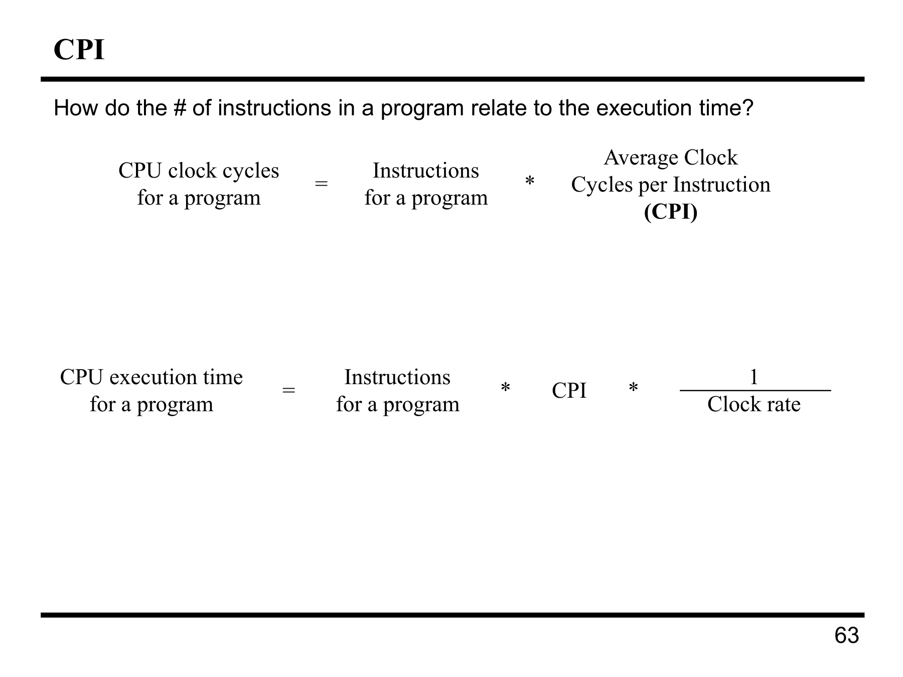

---

## 第 1 页


这页开启“**计算机性能（Performance）**”主题，核心是：**频率≠性能**，要用正确的指标与基准来比较。

# 1) BIPS vs. GHz（指令/秒 vs. 时钟频率）

* **GHz**：每秒钟的时钟周期数（1 GHz = 10⁹ cycles/s）。只是“跑得多快”的**硬件节拍**。
* **BIPS**（Billion Instructions Per Second）：每秒能完成多少**指令**，与程序、ISA、微架构都相关。
* 关系式（最重要公式）：

$$
\text{执行时间}=\frac{\text{指令数} \times \text{CPI}}{\text{时钟频率}}
$$

或

$$
\text{IPC}=\frac{1}{\text{CPI}},\quad \text{BIPS}=\text{IPC}\times\text{GHz}
$$

结论：**同样的 GHz，CPI 不同，性能差很大**；高 GHz 也可能因为深流水/长延迟而 CPI 变差。

# 2) 吞吐量 vs. 时延（Throughput vs. Latency）

* **Latency（时延）**：完成**一个**任务所需时间（例如渲染一张图要 2 秒）。
* **Throughput（吞吐量）**：单位时间能完成**多少**任务（例如每秒 1000 个请求）。
* 深流水、并行化常能提高吞吐（单位时间做更多），但**不一定**缩短单个任务的时延；而用户“感觉快”通常更关心时延。

# 3) 如何衡量“最好”（Measuring “best”）

* 用**真实、可复现的基准**：如 SPEC CPU、TPC、MLPerf，或与你的工作负载接近的微基准/端到端测试。
* 看**整体指标**：执行时间、吞吐/时延、能效（性能/瓦）、成本/性能。
* 用**几何平均**聚合多个基准，避免被极端值误导；分场景汇报（整数、浮点、内存密集、IO密集）。
* 用 **Amdahl 定律** 评估加速点对整体收益：优化只占 10% 时间的部分，即使无限加速，整机最多提升 1/0.9 ≈ 1.11 倍。

# 4) 为什么要警惕营销口号

* 幻灯中的“**3.0 GHz**”“**Hyper Pipelined Technology**”“*G4 比 Pentium III 快 30%*”都是**选择性口径**：

* 不同应用、编译器、数据集会导致巨大差异。
* 更深的流水线（hyper-pipelined）能拉高 GHz，但**分支失误、cache miss**会让 CPI 变差，实际性能未必更好。
* “快 30%”必须看**测试内容与条件**（脚注就说明只是在 Photoshop 某些测试上、特定频率比对）。

# 5) 实操建议

* 比较两台机器或两种配置时，报告：

* **程序指令数**（或同一二进制/编译选项）
* **平均 CPI/IPC**
* **时钟频率**
* **最终执行时间/吞吐**
并给出**内存层级命中率**、**分支预测准确率**等影响 CPI 的关键指标。
* 对服务端/并行负载，分别给**P99 时延**与**吞吐**；对移动/嵌入式，加入**能耗/温升**。

**一句话**：别被“GHz 更高就更快”或“单一基准赢了就全赢”迷惑；性能 = 指令数 × CPI / 频率的综合结果，正确比较要看**工作负载、指标和方法**。


---

## 第 2 页


这页用“造房子”的比喻来讲**计算机性能**里“最佳”“最快”“吞吐量 vs. 时延”的取舍。

# 表格含义

* **Self-build（自建）**：

* 单栋耗时 **24 个月**（**时延高**），
* 产能 **1/24 栋/月**（**吞吐极低**），
* **定制自由度无限**，
* 成本 **\$200k/栋**（最便宜）。
* **Contractor（承包商）**：

* 单栋 **3 个月**（**时延低**，单件完成最快），
* **1 栋/月**（吞吐一般），
* 可选 **100** 种方案，
* **\$400k/栋**（最贵）。
* **Prefab（装配式/预制）**：

* 单栋 **6 个月**（时延中等），
* **1000 栋/月**（**吞吐极高**，可大规模），
* 仅 **1** 个方案（**灵活性最低**），
* **\$250k/栋**（中等价）。

# 回答幻灯片的几个问题

* **Which is the “best” home builder?（谁“最好”？）**——**看需求场景**：

* **Homeowner on a budget（省钱的个人）**：**Self-build**（最便宜，但等得久）。
* **Rebuilding Haiti（大规模灾后重建）**：**Prefab**（吞吐量最高，能在短时间交付大量房屋）。
* **Moving to wilds of Alaska（去偏远地区，条件苛刻/需定制）**：多半选 **Contractor**（有一定定制能力、单栋完成快），或若极端定制可 **Self-build**；Prefab 的单一方案可能不适配。
* **Which is the “speediest” builder?（谁“最快”？）**

* **Latency（单件完成快）**：**Contractor（3 个月/栋）**。
* **Throughput（大量建造快）**：**Prefab（1000 栋/月）**。

# 映射到计算机性能

* **Self-build ↔ 高度可定制、频率不重要/慢但便宜**（像灵活的软件栈或可编程逻辑，功能多但慢）。
* **Contractor ↔ 单任务时延低**（适合交互式或延迟敏感的负载）。
* **Prefab ↔ 高吞吐流水化/并行化**（批处理、大规模服务；单位时间完成量巨大但单任务时延不一定最短、灵活性差）。

**要点**：没有绝对“最好”的电脑/系统；**衡量指标必须匹配场景**：是看单次响应时间，还是单位时间处理的作业数，还是成本/功耗/灵活性。


---

## 第 3 页


这页在给出**性能的基本定义与比较方法**。

# 核心定义

* **性能（Performance）** 与 **执行时间（Execution Time）** 成**反比**：

$$
\text{Performance}=\frac{1}{\text{Execution Time}}
$$

——程序从开始到结束所用时间越短，性能越高。

# “n 倍更快”的严格含义

* 说“X 比 Y 快 n 倍”，就是：

$$
n=\frac{\text{Performance}_X}{\text{Performance}_Y}
=\frac{\text{ExecutionTime}_Y}{\text{ExecutionTime}_X}
$$

注意：**取时间比值要“反过来”**（Y 的时间 ÷ X 的时间）。

# 例题

* Orange 用 **5 s**，Grape 用 **10 s**。

$$
n=\frac{10}{5}=2
$$

\*\*答案：\*\*Orange 比 Grape **快 2 倍**（性能是 Grape 的 2×；或者说执行时间是其一半）。

> 小提示：
>
> * “快 n 倍”= 时间缩短到 **1/n**；
> * “提高 n% 性能”≈ 时间除以 $1+n\%$。


---

## 第 4 页


这页在区分**两种“时间”**，告诉你做性能比较时该看哪一个，并用 Unix `time` 命令举例。

# 两种时间

* **Elapsed Time（墙钟时间/总耗时）**
程序从开始到结束在现实世界经历的时间。它**包含一切**：CPU 运行、等待磁盘/网络、切到别的程序运行、被操作系统调度挂起的时间等。

* 好处：反映用户体感的“等了多久”。
* 问题：受外部环境影响很大（IO、负载、网络），**不适合**严谨比较不同机器/算法的“纯计算性能”。

* **CPU Time（CPU 时间）**
只统计**CPU 真正在为这个进程执行指令**所花的时间，不含等待 IO、别的进程占用、调度切换的空档。可分为：

* **user time（用户态）**：执行你的程序代码所花时间。
* **system time（内核态）**：操作系统代表你的程序执行（如系统调用）所花时间。
做“处理器/算法”的性能比较时，**更应关注 CPU time**，尤其是 **user time**。

# 例子：Unix `time` 输出

```
linux15.ee.washington.edu> time javac CircuitViewer.java
3.370u 0.570s 0:12.44 31.6%
```

逐项解释：

* `3.370u` → **user CPU time = 3.370 s**（编译器在用户态真正在跑）
* `0.570s` → **system CPU time = 0.570 s**（系统调用、文件操作等内核开销）
* `0:12.44` → **elapsed（墙钟）= 12.44 s**（从开始到结束经历了 12.44 秒）
* `31.6%` → **CPU 利用率** ≈ $(user+sys)/elapsed × 100\%$
这里 $(3.370+0.570)/12.44 ≈ 31.6\%$，说明大量时间在等待 IO/调度，而不是占满 CPU。
*提示：在多核机器上，这个百分比可以超过 100%（例如充分并行时）。*

# 本章关注点

> **Our focus: user CPU time**
> ——我们更关注**用户态 CPU 时间**，也就是“程序自身代码在 CPU 上真正花了多久”。它受外部扰动少，更能反映处理器与算法的计算效率。


---

## 第 5 页


这页讲**CPU 时间**与**时钟**、**周期数**的关系，并给了一个求时钟频率的例题。

# 关键公式

* $\text{CPU 执行时间}=\text{CPU 周期数} \times \text{时钟周期}$
* $\text{CPU 执行时间}=\dfrac{\text{CPU 周期数}}{\text{时钟频率}}$

> “CPU 周期数”由程序的指令数与微结构（CPI 等）决定；“时钟频率”越高、时钟周期越短，时间越小。

# 例题

**已知**：

* Orange：400 MHz，运行该程序用时 10 s。
* Grape：需要 **1.2×** 的周期数（CPI 更高），目标是 **6 s** 内跑完。
**求**：Grape 需要多高的时钟频率？

**解**：

1. 先求 Orange 的周期数

$$
\text{cycles}_O = 10\,\text{s}\times 400\,\text{MHz}
= 10\times 400\times 10^6 = 4.0\times 10^9
$$
2. Grape 的周期数

$$
\text{cycles}_G = 1.2 \times \text{cycles}_O
= 4.8\times 10^9
$$
3. 用目标时间 6 s 反推所需频率

$$
f_G=\frac{\text{cycles}_G}{\text{time}}
=\frac{4.8\times 10^9}{6}
= 0.8\times 10^9\ \text{Hz}
= \boxed{800\ \text{MHz}}
$$

**结论**：Grape 要在 6 秒内完成该程序，至少需要 **800 MHz**。
这也说明：**仅提高 GHz 不够**；如果周期数（CPI）上升，频率必须提高得更多才能抵消。


---

## 第 6 页



这页在把**执行时间**分解到三个因素里，并引入 **CPI（Cycles Per Instruction，每条指令平均要多少个时钟周期）**。

# 关键关系

1. **CPU 周期数 = 指令条数 × CPI**

* 指令条数（Instructions for a program）：这段程序在某 ISA/编译器下实际执行了多少条指令。
* CPI（Average Clock Cycles per Instruction）：微体系结构效率的度量——流水线深度、分支预测、Cache 命中率、指令级并行等都会影响它。

2. **CPU 执行时间**

$$
\text{CPU execution time}=\frac{\text{CPU cycles}}{\text{Clock rate}}
= \text{Instructions}\times \text{CPI}\times \frac{1}{\text{Clock rate}}
$$

> 这就是“性能三要素”公式：**指令数、CPI、时钟频率** 共同决定执行时间。

# 直觉与常见误区

* 频率（GHz）高不一定快：若 CPI 变差（更高 Miss、更深流水导致气泡多），时间仍可能变长。
* 只看指令数也不行：不同指令的开销不同；更“紧凑”的指令序列如果 CPI 很高，也未必更快。
* CPI 不是常数：随**指令类型占比**（指令混合）与**内存/分支行为**变化。常用**加权平均**：

$$
\text{CPI}=\sum_i \text{CPI}_i \times \text{(指令 i 的比例)}
$$

# 小例

程序执行 10 亿条指令，机器 A：CPI=1.5，频率=2.5 GHz

$$
\text{Time}=\frac{10^9\times1.5}{2.5\times10^9}=0.6\text{ s}
$$

若优化把 L1 命中率提高，使 CPI 降到 1.2（指令数不变），时间变为：

$$
\frac{10^9\times1.2}{2.5\times10^9}=0.48\text{ s}
$$

——**降低 CPI** 就是直接提速。

# 提升性能的三条路

1. **少做事**：降低指令数（更好的算法、编译优化、向量化）。
2. **把每条做快**：降低 CPI（更好的缓存/预测/并行、减少 stall）。
3. **更快节拍**：提高时钟频率（在不显著伤害 CPI/功耗的前提下）。

记住：最终目标是**缩短执行时间**，所以评估优化要回到这条公式上看整体效果。


---

## 第 7 页


这页是一个 **CPI 对比** 例题：同一 ISA 的两台机器跑同一程序，谁更快、快多少？

已知

* 机器 A：**时钟周期** = 10 ns，**CPI** = 2.0
* 机器 B：**时钟周期** = 20 ns，**CPI** = 1.2

因为 ISA 相同、同一程序 ⇒ **指令条数相同**。
执行时间公式：

$$
\text{Time}=\text{Instructions}\times \text{CPI}\times \text{ClockPeriod}
$$

把“每条指令平均耗时”算出来就能比较：

* A：$2.0 \times 10\text{ ns} = 20\text{ ns/inst}$
* B：$1.2 \times 20\text{ ns} = 24\text{ ns/inst}$

所以对这个程序：**A 更快**。
速度倍数（B 相对 A 的时间比）：

$$
\frac{24}{20}=1.2
$$

**答案：A 比 B 快 1.2 倍（约快 20%）**。


---

## 第 8 页


这页在讲**如何按照指令类别来计算 CPI（每条指令平均时钟周期数）**。

# 公式

不同类型指令所需周期不同（访存、整数运算、分支…）。
**总体 CPI** 是按各类指令在程序中的**占比（频率）**做**加权平均**：

$$
\text{CPI}=\sum_{\text{types}}\big(\text{Cycles}_{\text{type}}\times \text{Frequency}_{\text{type}}\big)
$$

# 用表中数据计算

| 指令类型   | 每条周期 | 程序中占比 |            周期×占比 |
| ------ | ---: | ----: | ---------------: |
| ALU    |    1 |   50% | 1×0.5 = **0.50** |
| Load   |    5 |   20% | 5×0.2 = **1.00** |
| Store  |    3 |   10% | 3×0.1 = **0.30** |
| Branch |    2 |   20% | 2×0.2 = **0.40** |

把最后一列相加：

$$
\textbf{CPI} = 0.50+1.00+0.30+0.40 = \boxed{2.2}
$$

# 要点/启示

* **CPI 由指令混合决定**：哪类指令占比高、每条又慢，谁就拉高 CPI。
* 优化方向：

* 降低某类指令的周期（如减少 Load 的 miss 代价）；
* 或改变指令构成（如用寄存器重用降低 Load 比例）。
* 评估优化时，用这个加权模型能快速估算总体收益（配合 Amdahl 定律更准确）。


---

## 第 9 页


这页用上一页的“指令分类表”来做三种**设计权衡**的性能估算（用加权CPI）。基线与占比同前：

* 基线：ALU=1 周期、Load=5、Store=3、Branch=2
* 占比：ALU 50%，Load 20%，Store 10%，Branch 20%
* **基线 CPI = 1×0.5 + 5×0.2 + 3×0.1 + 2×0.2 = 2.2**

下面逐个算“改进后的 CPI”和“加速比 = 基线CPI / 新CPI”（时钟不变）：

1. **有数据缓存，平均 Load 降到 2 周期**

* 新 CPI = 1×0.5 + **2×0.2** + 3×0.1 + 2×0.2
* 新 CPI = **1.6**
* **加速比 = 2.2 / 1.6 = 1.375×**（≈ **快 37.5%**）

2. **分支预测让每条分支少 1 个周期**（2 → 1）

* 新 CPI = 1×0.5 + 5×0.2 + 3×0.1 + **1×0.2**
* 新 CPI = **2.0**
* **加速比 = 2.2 / 2.0 = 1.10×**（≈ **快 10%**）

3. **一次能并行执行两条 ALU 指令**（仅对 ALU 生效，理想化地把 ALU 的“每指令周期”减半：1 → 0.5）

* 新 CPI = **0.5×0.5** + 5×0.2 + 3×0.1 + 2×0.2
* 新 CPI = **1.95**
* **加速比 = 2.2 / 1.95 ≈ 1.13×**（≈ **快 13%**）

**观察**：尽管 ALU 指令占比最高，但若访存很慢，**优化 Load 的收益最大**（Amdahl 定律：优化瓶颈最划算）。


---

## 第 10 页


这页是 **Amdahl 定律** 的警示：**整体提速受限于没有被优化的那部分**。

# 公式（更常用的写法）

设程序中有一部分占比 $f$（可被优化），对它加速 $k$ 倍，则

$$
\text{总加速比 }S=\frac{1}{(1-f)+\frac{f}{k}}
$$

等价于右上角那句：

$$
T_{\text{after}} = T_{\text{unaffected}} + \frac{T_{\text{affected}}}{k}
$$

---

## 题目

程序原来 **100 s**，其中 **乘法占 80 s**（可优化部分），**其余 20 s** 不变。

### 想把整体提速到 **4 倍**

总体时间目标：$100/4=25$ s
方程：$20 + 80/k = 25$
解：$80/k = 5 \Rightarrow k = \boxed{16}$

> 也可用比例：$f=0.8$，令
> $S=1/((1-0.8)+0.8/k)=4 \Rightarrow k=16$。

### 想把整体提速到 **5 倍**

目标时间：$100/5=20$ s
方程：$20 + 80/k = 20 \Rightarrow 80/k = 0 \Rightarrow k \to \infty$

**结论：**在只优化“乘法”一项的前提下，**整体最大也只能到 5×**（因为有 20% 完全不变）。要真正达到或超过 5×，必须**连未优化的 20% 也一起优化**（减少 I/O、改算法、并行等）。

---

### 要点

* **越大的那部分越值得优化**；即使把一个很小的部分提到“无限快”，整体提升也有限。
* 估算优化价值时，用 $S=\dfrac{1}{(1-f)+f/k}$ 快速判断“值得不值得”。


---

## 第 11 页


这页在提醒两个常见误区：**GHz 更高 ≠ 更快**，**BIPS/MIPS 更高 ≠ 更快**。用两组小题来证明。

# 1) 更高 GHz ≠ 更快

给定：同样跑 10⁹ 条指令

* **Orange**：1,000 MHz（=1 GHz），CPI=2.5
* **Grape**：500 MHz（=0.5 GHz），CPI=1.1

用公式

$$
\text{Time}=\frac{\text{Instructions}\times \text{CPI}}{\text{Clock rate}}
$$

* Orange：$\dfrac{10^9\times 2.5}{1\times 10^9}= \mathbf{2.5\ s}$
* Grape：$\dfrac{10^9\times 1.1}{0.5\times 10^9}= \mathbf{2.2\ s}$

**结论**：虽然 Grape 的 MHz 更低，但**更快**（2.2s < 2.5s），因为它的 **CPI 更低**。

---

# 2) 更高 BIPS/MIPS ≠ 更快

同一台 **1 GHz** 机器，两种编译器对同一程序的指令构成不同（右表给出每类指令的周期：ALU=1，Load=5；此处只涉及这两类）：

* **Compiler A**：10 B ALU + 1 B Load → 共 **11 B 指令**
平均 CPI：$\dfrac{1\times10 + 5\times1}{11}=\dfrac{15}{11}\approx 1.3636$
时间：$\dfrac{11\times 1.3636}{1}= \mathbf{15\ s}$
BIPS：$\dfrac{11}{15}\approx \mathbf{0.733\ BIPS}$

* **Compiler B**：5 B ALU + 1 B Load → 共 **6 B 指令**
平均 CPI：$\dfrac{1\times5 + 5\times1}{6}=\dfrac{10}{6}\approx 1.6667$
时间：$\dfrac{6\times 1.6667}{1}= \mathbf{10\ s}$
BIPS：$\dfrac{6}{10}= \mathbf{0.600\ BIPS}$

**结论**：

* **执行时间**：A = 15 s，B = 10 s → **B 更快**（总时间更短）。
* **BIPS**：A = 0.733，B = 0.600 → **A 的 BIPS 更高**，却**更慢**。

这正说明：**“指令/秒”高并不保证更快**，因为\*\*指令条数与每条开销（CPI）\*\*也同样关键。


---

## 第 12 页


这页是**处理器性能小结**，把前面所有点浓缩成一条公式＋三条路。

# 性能公式

$$
\text{CPU 执行时间}=\underbrace{\text{Instructions}}_{\text{指令条数}}
\times \underbrace{\text{CPI}}_{\text{每条需的周期}}
\times \underbrace{\frac{1}{\text{Clock rate}}}_{\text{时钟周期}}
$$

# 想要“Better performance”，该怎么做？

把空格补全就是三种思路：

1. **↓ number of instructions to implement computations**
——减少完成同样工作所需的**指令条数**（更好的算法/编译优化/向量化/库函数）。

2. **↓ CPI**
——降低**每条指令的平均周期**（更好的缓存与带宽、分支预测、乱序/并行、流水线效率）。

3. **↑ Clock rate**
——提高**时钟频率**（缩短时钟周期），前提是别让 CPI 因更深流水、长延迟而显著变差，也要注意功耗/散热。

# 平衡与权衡

提升性能必须在这三者间**折中**。历史上的一个例子：**RISC vs. CISC**

* CISC：通过复杂指令**降低指令数**，但可能提高 CPI、限制频率。
* RISC：用简单指令**降低 CPI、提高频率**，但指令数可能更多。
实际最优解取决于**工作负载＋微架构实现**；最终以**执行时间**为准。
