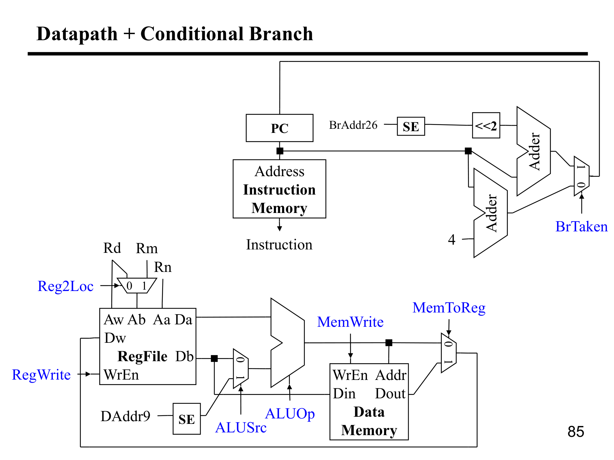

---

## 第 1 页


这页开启 **“数据通路（Datapath）与控制（Control）”** 的部分，告诉你计算机/处理器内部是怎么分工协作的。

# 核心图解

整机分为三大块：**Processor（处理器）**、**Memory（内存）**、**Devices（外设：输入/输出）**。
在处理器内部又拆成两层：

* **Datapath（数据通路）**：真正**搬运与变换数据**的硬件通路。
* **Control（控制）**：根据**当前指令**与**状态**产生控制信号，**指挥**数据通路完成正确步骤。

# Datapath 里有什么（做“事”的）

* **寄存器文件**（保存操作数/结果）
* **PC/指令寄存器**（程序计数器与取到的指令）
* **ALU / 移位器**（算术逻辑运算）
* **多路复用器/加法器/比较器**（在不同数据源/操作间切换）
* **与内存/总线的接口**（读写数据/指令）

> 作用：按控制信号，把“从哪来 → 经过什么运算 → 到哪去”串起来。

# Control 做什么（发“号令”的）

* 解析**指令的 opcode / funct 字段**和**流水线阶段/微状态**；
* 产生控制信号：

* 寄存器读/写使能
* ALU 操作选择（加/减/AND/OR…）
* MUX 选择（例如 ALU 第二操作数是寄存器还是立即数）
* 内存读/写、字节宽度
* PC 更新（顺序执行/分支/跳转）
* 实现方式：**硬连线 FSM** 或 **微码**；在流水线中还负责**冒险处理/转发/暂停**等。

# 一条指令如何协作（例）

* `ADD r1, r2, r3`
Control：选“ALU 加法”、寄存器读取 r2/r3、写回 r1；
Datapath：从寄存器取出 r2,r3 → ALU 相加 → 结果写回 r1。
* `LW r1, 4(r2)`
Control：选择“ALU=加”计算地址、发出内存读、选写回寄存器；
Datapath：r2+4 → 访存 → 数据写入 r1。

# 为什么要分“数据通路/控制”

* **模块化**：算术/存储通路与决策逻辑解耦，易设计与验证；
* **可扩展**：改一类指令多是改控制，不必重画整条通路；
* **性能调优**：通路可并行/流水线化，控制逻辑负责协调。

一句话：**Datapath 负责“干活搬砖”，Control 负责“指挥调度”**；两者配合，完成“取指→译码→执行→访存→写回”的整个指令周期。


---

## 第 2 页


这页在说明：我们要为一个**精简指令子集**做一颗“简单 CPU”，并给出几类**指令编码格式**。风格就是 ARMv8-A（AArch64）那一套的简化版，按位字段如下（位号从左到右 31…0）。

---

## 1) Memory 指令：`LDUR` / `STUR`

```
31........22 21........13 12 11 10 9.....5 4.....0
Opcode        DAddr9         0  0        Rn       Rd
```

* **Opcode**：操作码，决定是 `LDUR`（从内存读到寄存器）还是 `STUR`（把寄存器写到内存）。
* **DAddr9**：**9 位有符号位移**（displacement）。与基址寄存器 **Rn** 相加形成有效地址。
这里旁边的 `00` 表示对齐/规模（简化教材里常把它固定为 00），等价于“**不再额外左移**”；因此这是 **unscaled** 位移（与 ARM 的 LDUR/STUR 对应）。
* **Rn**：基址寄存器（base）。
* **Rd**：目标/源寄存器：`LDUR` 把内存 → **Rd**；`STUR` 把 **Rd** → 内存。

> 有效地址：`EA = Rn + sign_extend(DAddr9)`
> `LDUR Rd, [Rn, #imm9]`；`STUR Rt, [Rn, #imm9]`

---

## 2) 无条件跳转：`B`

```
31........26 25..................................0
Opcode                 BrAddr26
```

* **BrAddr26**：**26 位有符号 PC 相对位移**，**按字（4 字节）对齐**。
目标地址：`PC' = PC + 4 + (sign_extend(BrAddr26) << 2)`
（`PC` 是本指令地址；取指时 ARM 把 PC 看作当前指令地址+0，教材里统一写 `+4` 得下一条，再加上左移 2 的位移。）

---

## 3) 条件分支：`CBZ`（Compare and Branch on Zero）

```
31........24 23.....................5 4.....0
Opcode             CondAddr19           Rd
```

* **Rd**：要比较是否为 0 的寄存器。
* **CondAddr19**：**19 位有符号 PC 相对位移**，同样**左移 2** 后加到下一条指令的 PC 上。
语义：如果 `Rd == 0`，跳到 `PC + 4 + (sign_extend(CondAddr19) << 2)`，否则顺序执行。
（对应 ARM 的 `CBZ Rd, label`。）

---

## 4) 算术类：`ADD` / `SUB`（寄存器型）

```
31........21 20..16   15..10   9..5   4..0
Opcode      Rm      SHAMT     Rn     Rd
```

* **Rn**：第一个操作数寄存器。
* **Rm**：第二个操作数寄存器，进入 ALU 前可被可选移位。
* **SHAMT**：**移位量**（shift amount），通常 0–63；表示对 `Rm` 做 `LSL #SHAMT` 再与 `Rn` 相加/相减。
* **Rd**：结果寄存器。
* **Opcode**：决定是 `ADD` 还是 `SUB`（以及是否更新标志位的变体，教材里省略）。

> 例：`ADD X1, X2, X3, LSL #2` → `X1 = X2 + (X3 << 2)`
> `SUB X5, X6, X7`          → `X5 = X6 - X7`

---

## 常见注意点

* **PC 相对、按字对齐**：`B` 和 `CBZ` 的立即数都是**有符号**，并且**左移 2**（因为 32/64 位机器中指令 4 字节对齐）。
* **位移有符号扩展**：`DAddr9` / `BrAddr26` / `CondAddr19` 在硬件里都要 **sign-extend**。
* **Load/Store 分离**：这一子集里访存只有 `LDUR/STUR`，算术指令不直接访问内存（典型 RISC 风格）。

> 这页的目的：把**每类指令需要的字段**明确出来，后面画数据通路和控制逻辑时，就知道要从指令里**取哪些位**，如何**符号扩展/左移**，哪些字段接到 **寄存器堆、ALU、分支加法器、立即数生成器** 等模块。


---

## 第 3 页


这张图是“**指令执行周期（Execution Cycle）**”的通用六步。左边是阶段名，右边是每步的作用。精炼版说明如下（把它放在我们要实现的简易 CPU 上就能直接对应到数据通路与控制信号）：

1. **Instruction Fetch（取指）**

* 用 **PC** 到指令存储器取一条指令到 **IR**，并先算好 **PC+4** 作为顺序下一条。
* 硬件：`InstrMem[PC] → IR`，`PCAdder: PC+4`。

2. **Instruction Decode（译码）**

* 解析 **Opcode/字段**，决定需要的操作（算术/访存/分支等）与使用哪些通路。
* 硬件：控制单元根据 `IR[31:0]` 产生 `ALUop、RegWrite、MemRead/Write、PCSrc、ImmSel…`。

3. **Operand Fetch（取操作数）**

* 从**寄存器堆**读源操作数；对立即数字段做**符号扩展/左移**（如 `imm9`、`BrAddr<<2`）；访存类同时在 ALU 中**计算地址**：`EA = Rn + imm`。

4. **Execute（执行/运算）**

* **ALU** 完成 `ADD/SUB/AND/OR/Shift`；
* 分支类比较并形成目标地址 `PC+4 + (offset<<2)`，生成是否跳转的条件。

5. **Result Store（结果写回/访存）**

* 算术：`ALU结果 → Rd`；
* 读内存：`Mem[EA] → Rd`；
* 写内存：`Rd → Mem[EA]`（寄存器不写回）。

6. **Next Instruction（确定下一条）**

* `PC ← mux(PC+4, branch_target, …)`；条件分支由比较结果选择是否用分支地址。

补充：

* **单周期机**：六件事一拍完成（慢但简单）。
* **多周期机**：上述每步占用一个或数个时钟，复用硬件（更快的时钟、更省面积）。
* **流水线**：把这些步骤做成固定阶段并行执行不同指令，提高吞吐量，同时由控制处理数据/控制冒险。

一句话：**数据通路搬数据和运算；控制逻辑在每一步给出正确的开关与选择**，这六步循环往复地执行程序。


---

## 第 4 页


这页给出**简易处理器的数据通路总览（Processor Overview）**：几块核心硬件如何把一条指令“跑完一圈”。

# 图里有哪些模块

* **PC（程序计数器）**：指向下一条要取的指令地址。
* **Instruction Memory（指令存储器）**：按 PC 取出指令。
* **Register File（寄存器堆）**：有两个读口、一个写口；输出源寄存器值，接收写回结果。
* **ALU**：对来自寄存器或立即数的操作数做运算（加/减/与/或/比较…），也用来**计算访存地址**。
* **Data Memory（数据存储器）**：被 `LDUR/STUR` 等指令访问的内存。
* **写回多路复用器（那个“菱形”）**：在“ALU 结果”和“内存读回数据”之间二选一，送回寄存器堆。

> 图中粗箭头表示数据流；没画出来的“控制信号”（来自 Control）决定各个开关/选择器如何动作。

# 一条指令如何流动

1. **PC→取指**：`PC` 给到 **Instruction Memory**，取回指令字。
2. **读寄存器/立即数**：指令字段选出寄存器编号，**Register File** 输出两个源操作数；立即数字段经扩展后作为 ALU 的另一路输入（由控制决定是否用立即数）。
3. **ALU 执行**：

* 算术/逻辑指令：在 ALU 直接算出结果；
* 访存指令：ALU 计算地址 `EA = Rn + imm`。
4. **访存（可选）**：

* `LDUR`：**Data Memory** 用 `EA` 读出数据；
* `STUR`：把寄存器中的数据写到 `EA`。
5. **写回**：写回 MUX 选择：

* 算术/逻辑 → 选 **ALU 结果** 写回 **Rd**；
* 读内存 → 选 **Data Memory** 的**读出值**写回 **Rd**。
* 存内存 → 不写回寄存器。
6. **PC 更新**：通常 `PC ← PC+4`；若是分支/跳转，控制逻辑选择分支目标。

# 你需要注意的点

* **ALU 一石二鸟**：既算数据也算地址（RISC 常见做法，节省硬件）。
* **单一写回口**：所有指令最终都通过同一个写回多路器进入寄存器堆，便于控制。
* **控制与数据分离**：图只画“数据怎么走”，而“什么时候走、走哪条”由控制单元根据指令类型决定（例如 `RegWrite`、`MemRead/Write`、`ALUSel`、`MemToReg`、`PCSrc` 等信号）。

一句话：**PC 取指 → 寄存器/立即数出数 → ALU 运算/算地址 → 访存（可选） → MUX 选结果写回 → 更新 PC**。这就是一个最小可用的单周期/多周期 CPU 数据通路的骨架。


---

## 第 5 页


这页在讲**怎样把“指令层面”的行为，落到硬件可执行的 RTL（Register-Transfer Level，寄存器传输级）规范**，并用一个“小型数学单元”的例子说明。

# RTL 是什么

* **ISA 级**：像 `ADD X1, X2, X3` 这种“程序员看见的指令语义”。
* **RTL 级**：把一拍一拍时钟里**哪些寄存器在被读/被写、数据在通路上如何流动**写清楚，典型写法：

```
RegA ← RegB + RegC      // 在时钟上升沿，把 B+C 的结果写进 A
```

RTL 描述决定了**需要哪些寄存器/加法器/多路器**，以及控制逻辑要产生哪些“使能/选择”信号。

# 这页的例子在表达什么

右下角两个方框 `A`、`I` 可理解为**寄存器**（常见地，A=累加器/结果寄存器，I=索引/步进寄存器）。左侧列出几条“微操作（micro-ops）”——也就是**RTL 语句**：

* **(add)**

```
A ← A + B;
I ← I + 1;
```

含义：用 ALU 做 `A+B`，把结果写回寄存器 A；同时把寄存器 I 自增 1（像“下一步/下标+1”）。

* **(mult)**

```
A ← A × B;
I ← I + 1;
```

与上同理，只是 ALU/乘法器执行乘法。

* **(hold)**

```
A ← A;        // 保持不变
I ← I + 1;
```

A 不更新（或通过多路器把旧值回写），I 仍然步进。

* **(init)**

```
A ← Din;      // 从输入端口/总线把数据装载进 A
I ← I + 1;
```

这些**每条都是在一个时钟边沿同时生效**的“寄存器传输”。控制单元会根据当前“操作码/状态”选择：

* ALU 的功能（加/乘/直通）
* 多路器输入（A 的新值来自 `A+B`、`A×B`、还是 `Din`）
* 哪些寄存器打使能（`A_en`、`I_en`）
* 是否让 I 自增（`I_inc`）

# 设计流程提示

1. **从指令语义出发**：把每类指令拆成若干条 RTL 语句（单周期/多周期/流水线视实现而定）。
2. **画数据通路**：为这些 RTL 语句准备必要的硬件（寄存器、ALU/乘法器、Imm 发生器、多路器、加法器等），并把“可能的源/目的”都接好。
3. **写控制**：用状态机或微码，让在第 n 个时钟时恰好使能对应的路径（谁读、谁写、ALU 做什么、I 是否 +1）。

一句话：**RTL = 把“要做什么”精确落到“哪一拍、哪个寄存器、走哪条线”**。图中的 `A←…`、`I←I+1` 就是这种寄存器传输级的微操作示例；控制逻辑按指令选择这些微操作的序列，数据通路负责把数据按选中的路径流过去。


---

## 第 6 页


这页只画了两样：**PC**（程序计数器）和 **Instruction Memory（指令存储器）**，标题是 **Instruction Fetch（取指）**。意思是：在“取指”阶段，**PC 的内容作为地址**送到指令存储器，从而**读出当前要执行的指令**。

要点一览：

* **输入**：PC 保存“下一条将被取的指令地址”。复位后通常从 0 或入口地址开始。
* **动作**：把 `PC` 接到指令存储器的 **Address** 端口，**读**出该地址处的 32/64 位指令字到指令寄存器（IR，图上未画）。
* **下一步准备**：通常同时计算 `PC+4`（因为指令按 4 字节对齐）作为**顺序下一条**的地址；若之后判定分支/跳转成立，再用分支目标覆盖 PC。
* **控制信号**：这一阶段需要 `InstrMemRead=1`；PC 的写使能暂未触发（或在阶段末尾写入 `PC+4`/分支目标）。

一句话：**取指 = 用 PC 去指令存储器把指令读出来**，为后续“译码、取数、执行…”做准备。


---

## 第 7 页


这页把 **ADD / SUB 指令**落到**RTL（寄存器传输级）**，并给出它们的**指令字段**（与前面的 AArch64 风格一致）。

# 指令语义

* **ADD Rd, Rn, Rm (可带移位)**
$\text{Rd} \leftarrow \text{Rn} + (\text{Rm} \ll \text{SHAMT})$
* **SUB Rd, Rn, Rm (可带移位)**
$\text{Rd} \leftarrow \text{Rn} - (\text{Rm} \ll \text{SHAMT})$

# 指令编码（下方位图）

```
31..21   20..16   15..10  9..5   4..0
Opcode     Rm      SHAMT    Rn     Rd
```

* **Opcode**：决定是 ADD 还是 SUB（以及是否带标志位的变体，课上忽略）。
* **Rm**：第二源寄存器；进入 ALU 前可**左移** `SHAMT` 位。
* **SHAMT**：移位量（如 0–63）。`SHAMT=0` 时就是普通的 Rd = Rn ± Rm。
* **Rn**：第一源寄存器。
* **Rd**：写回目的寄存器。

# RTL 微操作（单周期表述）

以“寄存器堆有两个读口、一个写口；ALU 有两输入端”为例：

**ADD**

```
A ← Reg[Rn];                     // 读源1
B ← (Reg[Rm] << SHAMT);          // 读源2并移位
ALUop ← ADD;                     // 选择 ALU 做加法
Y ← ALU(A, B);                   // 计算
Reg[Rd] ← Y;                     // 写回
```

**SUB**

```
A ← Reg[Rn];
B ← (Reg[Rm] << SHAMT);
ALUop ← ADD; M ← 1;              // 仍用加法器做减法（见下）
Y ← A + (~B) + 1;                // 二进制补码：A - B = A + (¬B) + 1
Reg[Rd] ← Y;
```

> 实现上通常**复用同一条加法器通路**：设置“加/减模式位”`M`，令 `B' = B ⊕ M`、`Cin = M`。
>
> * `M=0` ⇒ `B'=B, Cin=0` → **加法**
> * `M=1` ⇒ `B'=¬B, Cin=1` → **减法**

# 数据通路上的控制信号（典型）

* `RegReadRs1=Rn, RegReadRs2=Rm`；`RegWrite=1, Rd=Rd`
* `UseImm/ShiftSel=SHAMT`（让 Rm 经过桶形移位器）
* `ALUCtrl=ADD/SUB`（或者 `ALUCtrl=ADD` + `SubMode=M`）
* `MemRead=0, MemWrite=0`；`MemToReg=0`（写回选 ALU 结果）

# 例子

* `ADD X1, X2, X3, LSL #2`
`X1 = X2 + (X3<<2)`
* `SUB X5, X6, X7`
`X5 = X6 - X7`（硬件用 `X6 + (~X7) + 1` 实现）

# 可选标志位（若实现）

* **Z**（Zero）= 结果是否为 0
* **N**（Negative）= 结果 MSB
* **V**（Overflow, 有符号溢出）= 最高位进位入 ⊕ 进位出
* **C**（Carry，无符号进位）= 最终进位（对 SUB 代表“无借位”）

这页的要义：理解 **ADD/SUB 都走同一加法器通路**；区别只在**对第二操作数是否取反并加 1**，以及**可选对 Rm 先做左移 SHAMT**。控制逻辑据此产生少量控制位，就能驱动数据通路完成两种指令。


---

## 第 8 页


这页把**ADD/SUB 指令**需要的**数据通路**拼起来了，展示最基本的取指、读寄存器、ALU 运算、写回 4 个环节。

# 图里部件在做什么

* **PC + Instruction Memory（右上）**
PC 给出取指地址；指令存储器据此输出本条**Instruction**。一旁的 **Adder(+4)** 把 `PC` 与常数 **4** 相加产生 `PC+4`，回写到 **PC**（顺序下一条），除非后续是分支跳转（本页先不管分支）。
* **Register File（左下）**
画的是一个**两读一写**的寄存器堆，端口名说明了用途：

* `Aa`、`Ab`：两路**读地址**（将被接到指令中的 **Rn**、**Rm** 字段）；
* `Da`、`Db`：对应的**读数据**输出（源操作数 A、B）；
* `Aw`：**写地址**（接指令中的 **Rd** 字段）；
* `Dw`：**写数据**（接回写结果，如 ALU 输出）；
* 还有隐含的 `RegWrite`（写使能）控制信号。
* **写回多路器（左中那个三角形）**
负责在“可能的结果来源”之间选择写回寄存器堆。对 **ADD/SUB** 来说只需选 **ALU 结果**；如果以后加上 **Load**，这里就要在“ALU 结果 / Data Memory 读回值”之间二选一。

> 图上没画出的还有 **ALU**、`Rm` 的\*\*可选移位（SHAMT）\*\*及 **加/减模式**控制，但它们就是连在寄存器读口与写回 MUX 之间。

# 一条 ADD / SUB 的数据流（单周期视角）

1. **取指**：`PC → InstrMem → Instruction`，同时 `PC ← PC+4`。
2. **读寄存器**：
`Aa ← Rn`，`Ab ← Rm`（来自指令字段）；
`Da = Reg[Rn]`，`Db = Reg[Rm]`（如需移位，`Db` 先过移位器 `<< SHAMT`）。
3. **ALU 运算**：

* `ADD`: `Y = Da + (Db << SHAMT)`
* `SUB`: `Y = Da - (Db << SHAMT)`（实现上用“加法器 + 取反 + 进位=1”）。
4. **写回**：
`Aw ← Rd`，`Dw ← Y`，`RegWrite ← 1`，把结果写入 `Reg[Rd]`。

# 本页对应的控制信号（要点）

* 从 **Instruction** 里解出 `Rd/Rn/Rm/SHAMT` → 接到 `Aw/Aa/Ab` 与移位器。
* `ALUCtrl` 选择加/减；`SubMode` 或 `Cin`=1 用于减法；
* `RegWrite`=1；写回多路器选 **ALU**（非访存）。

一句话：这张图把 **PC 取指 + RegFile 两读一写 +（写回选择）** 等最小骨架摆出来了；加上 ALU 与移位器，就凑成了能跑 **ADD/SUB** 的完整数据通路。


---

## 第 9 页


这页是**Load 指令的 RTL 说明**，采用 AArch64 风格的 **LDUR**（Unscaled load）：

# 指令语义

**`LDUR Rd, [Rn, DAddr9]`**

* 从地址 **`EA = Rn + sign_extend(DAddr9)`** 读内存一个字（课件简化为与寄存器同宽），把数据写回 **`Rd`**。
* 位图（下方）：

```
31..21   20..12     11..10  9..5  4..0
Opcode    DAddr9       00     Rn    Rd
```

`00` 固定表示**不再缩放**（unscaled）；所以 `DAddr9` 就是以**字节**为单位的有符号位移。

# RTL 微操作（单周期表述）

```
A   ← Reg[Rn]                      // 读基址
Imm ← SignExt(DAddr9)              // 立即数扩展
EA  ← A + Imm                      // 用 ALU 计算有效地址
MDR ← DataMem[EA]                  // 读数据存储器
Reg[Rd] ← MDR                      // 写回寄存器
```

（PC 在取指阶段已做 `PC ← PC+4`，此处不赘述。）

# 需要的控制信号（典型命名）

* `RegReadRs1 = Rn`，`RegWrite = 1`，`Rd = Rd`
* `ALUSrcB = Imm`（ALU 第二操作数选立即数），`ALUCtrl = ADD`
* `MemRead = 1, MemWrite = 0`
* `MemToReg = 1`（写回选择**内存读回值**而不是 ALU 结果）
* `ImmSel = DAddr9 (sign-extend)`

# 与 STUR/对齐的关系

* **LDUR/STUR** 都是 **unscaled**：偏移就是字节数；对 64 位装载，硬件仍然从 `EA` 开始读 8 字节（课件未细分 byte/half/word 变体）。
* 若是 **LDR/STR (scaled)**，偏移会按数据宽度再左移（例如 64 位左移 3），而 LDUR/STUR 不左移。

# 小例子

`LDUR X1, [X2, #-8]`

* `EA = X2 + (-8)`
* 从内存地址 `EA` 读 8 字节，写入 `X1`。

要点：**Load = 用 ALU 先算地址，再从数据存储器读，结果经写回多路器进寄存器堆**；本页把字段、RTL 步骤以及控制信号都对齐了。


---

## 第 10 页


这页把前面的“ADD/SUB 数据通路”**扩成能执行 `LDUR`（Load）** 的通路，所以多了**立即数扩展**、**ALU 输入选择**、**数据存储器**三块。看图自左向右：

* **RegFile（寄存器堆）**
端口标注：`Aa/Ab` 为两路读地址、`Da/Db` 为对应读数据，`Aw/Dw` 为写地址/写数据。上方标了 `Rn/Rm/Rd`，表示这些地址来自指令字段。

* **SE（Sign Extender，符号扩展）**
把 `LDUR` 指令中的 **`DAddr9`** 扩展成全宽立即数。

* **三角形 MUX（ALU 第二操作数选择）**
选择 **`Db`（来自 Rm）** 或 **`SE`（立即数）** 作为 ALU 的 B 输入。
蓝字 **`ALUOp`** 表示控制 ALU 的功能（加/减…）。

* 对 `LDUR`：选 **SE**，`ALUOp=ADD` 以计算地址：`EA = Rn + imm`。
* 对 `ADD/SUB`：选 **Db**，`ALUOp=ADD/SUB` 做寄存器运算。

* **Data Memory（数据存储器）**
`Addr` 接 **ALU 输出**（有效地址），`Dout` 是读出的数据。此页只画了 **读**（`MemRead=1`）；若扩展到 `STUR`，还要有 `Din`/`MemWrite`，把 `Db`（要存的寄存器值）写到 `Addr`。

* **写回路径（未标出但沿用上一页）**
写回多路器从 **ALU 结果** 或 **Data Memory `Dout`** 二选一，送 `Dw → RegFile`；

* `LDUR`：`MemToReg=1` 选 **`Dout`** 写 **Rd**；
* `ADD/SUB`：`MemToReg=0` 选 **ALU 结果** 写 **Rd**。
`RegWrite=1` 时写使能有效。

* **右上角 PC + Instruction Memory + “+4” 加法器**
与之前相同：`PC` 取指、指令进入译码，同时计算 `PC+4` 作为顺序下一条。

---

### `LDUR Rd, [Rn, DAddr9]` 的一步步数据流

1. **取指**：`PC → InstrMem → Instruction`；`PC ← PC+4`。
2. **读寄存器**：`Aa←Rn`、`Da←Reg[Rn]`；（`Ab/Rm` 本指令可不使用）
3. **立即数**：`SE ← sign_extend(DAddr9)`。
4. **ALU**：MUX 选 `SE`，`ALUOp=ADD` → `EA = Da + SE`。
5. **访存**：`Addr←EA`，`MemRead=1`，得到 `Dout`。
6. **写回**：`MemToReg=1`，`Dw←Dout`，`Aw←Rd`，`RegWrite=1`。

> 扩展到 **`STUR`**：步骤 5 改为 `MemWrite=1, Din←Db`（要写入的寄存器值），且**不写回寄存器**。

**要点**：在最小的硬件上**复用同一 ALU**——算术时做加/减，访存时算地址；再用一个 MUX 让 ALU 的第二操作数在“寄存器值 / 立即数”之间切换，就能支持 `ADD/SUB` 与 `LDUR`。控制逻辑用 `ALUOp、ALUSrc（选 SE 还是 Db）、MemRead、MemToReg、RegWrite` 等信号把这条通路串起来即可。


---

## 第 11 页


这页是 **Store 指令的 RTL**，对应 AArch64 风格的 **`STUR`**（unscaled store）。

# 指令语义

**`STUR Rd, [Rn, DAddr9]`**

* 计算有效地址：`EA = Rn + sign_extend(DAddr9)`
* 把寄存器 **`Rd`** 里的数据**写入**内存地址 `EA`（宽度与寄存器相同，课件简化不区分 8/16/32/64 位）。

# 指令编码（页底位图）

```
31..21   20..12     11..10  9..5  4..0
Opcode    DAddr9       00     Rn    Rd
```

* `DAddr9`：9 位**有符号**位移；`00` 固定，表示 **unscaled**（不按数据宽度再左移）。
* `Rn`：基址寄存器（base）。
* `Rd`：要写到内存的**源寄存器**（注意对 store 来说不是“目的”）。

# RTL 微操作（单周期表述）

```
A   ← Reg[Rn]                      // 读基址
Imm ← SignExt(DAddr9)              // 立即数扩展
EA  ← A + Imm                      // ALU 计算有效地址
DataMem[EA] ← Reg[Rd]              // 内存写：把 Rd 的值存到 EA
```

（PC 在取指时已做 `PC ← PC+4`。）

# 关键控制信号（与 LDUR 的差别）

* `RegReadRs1 = Rn`，还需要从寄存器堆读出 `Rd` 的值作为**写入数据**（很多实现把第二读口接 `Rd`）。
* `ALUSrcB = Imm`，`ALUCtrl = ADD`（与 LDUR 相同：都用 ALU 算地址）。
* **`MemWrite = 1`，`MemRead = 0`**。
* **`RegWrite = 0`**（store 不写回寄存器）。
* `MemToReg` 无关（不写回）。

# 与 `LDUR` 的并列对比

| 指令     | 用 ALU 做            | 数据存储器                 | 是否写回寄存器                   |
| ------ | ------------------ | --------------------- | ------------------------- |
| `LDUR` | 地址 `EA = Rn + imm` | **读**（`Dout → Rd`）    | 是（`RegWrite=1`, 选 `Dout`） |
| `STUR` | 地址 `EA = Rn + imm` | **写**（`Rd → Mem[EA]`） | 否（`RegWrite=0`）           |

# 小例子

`STUR X3, [X5, #-16]`

* `EA = X5 - 16`
* 把 `X3` 的内容写到内存地址 `EA`。

要点：**Store = 先用 ALU 算地址，再把寄存器值写入该地址；不写回寄存器**。控制上只需把 `LDUR` 的“读内存/写回”改成“写内存/不写回”即可。


---

## 第 12 页


这页把上一页“能做 ADD/SUB + LDUR 的通路”，**再补成可执行 `STUR`（Store）** 的样子，并在图上标了关键控制信号（蓝字）。看图从左到右说明一次 **`STUR Rd, [Rn, DAddr9]`** 的数据流与控制：

---

## 参与的硬件

* **RegFile（寄存器堆）**：两读一写

* 读地址 `Aa ← Rn`（基址），`Ab ← Rd`（要写到内存的数据来自 Rd）
* 读数据 `Da = Reg[Rn]`，`Db = Reg[Rd]`
* `Aw/Dw` 是写回口（本指令**不用**，`RegWrite=0`）
* **SE（Sign Extender）**：把 `DAddr9` **符号扩展**为全宽立即数
* **ALU**：计算地址或做算术

* 小三角 **ALUSrc**：选择 ALU 的第二操作数是 `Db` **还是** `SE`（立即数）
* **ALUOp**：选择 ALU 做加/减等
* **Data Memory**：数据存储器，端口 `Addr`（地址）、`Dout`（读出数据）。对 `STUR` 我们用**写**，即 `MemWrite=1`，写入数据来自寄存器堆的 `Db`
* **写回多路器（MemToReg）**：平时在“ALU 结果/内存读出”之间二选一写回寄存器；**Store 不写回**，所以该选择在本指令**无效**

---

## 执行 `STUR Rd, [Rn, DAddr9]` 的一步步

1. **取指**：`PC → Instruction Memory` 取到本条指令；同时加法器把 `PC` 加 **4** 形成顺序下一条地址（除非之后被分支覆盖）
2. **译码/读寄存器**：
`Aa ← Rn`，`Ab ← Rd`
得到 `Da = Reg[Rn]`（基址）、`Db = Reg[Rd]`（要写入内存的数据）
3. **立即数扩展**：`SE ← sign_extend(DAddr9)`
4. **算地址**：`ALUSrc ← 1`（选 `SE` 为 B 操作数），`ALUOp ← ADD`
`EA = Da + SE`（有效地址）
5. **写内存**：`MemWrite ← 1`，`Addr ← EA`，**写入数据 ← Db**
（`MemRead ← 0`，不取 `Dout`）
6. **写回寄存器**：`RegWrite ← 0`（**Store 不写寄存器**，`MemToReg` 在本指令无意义）

> 对照 **LDUR**：步骤 5 会是 `MemRead=1` 取 `Dout`，步骤 6 置 `RegWrite=1` 且 `MemToReg=1` 把 `Dout` 写回 `Rd`。两者**都复用同一个 ALU** 来算地址，区别只在**内存方向**与**是否写回寄存器**。

---

## 小结（控制信号要点）

* `ALUSrc=1（选 SE）`，`ALUOp=ADD`
* `MemWrite=1`，`MemRead=0`
* `RegWrite=0`（不写回）
* `Aa=Rn`，`Ab=Rd`（第二读口用于取要写入内存的数据）
* `MemToReg`：对 Store **无关**

这样，在**不增加专用加法器**的情况下，通过 **一个 ALU + 两个小 MUX**，同一条通路就能同时支持 **算术类、Load、Store** 三类指令。


---

## 第 13 页


这页是**无条件分支指令 `B` 的 RTL 与编码**。

# 指令语义

**`B BrAddr26`**

* 让 **PC 跳转**到：

$$
\text{PC} \leftarrow \text{PC}_{\text{next}} + \big(\text{sign\_extend}(\text{BrAddr26}) \ll 2\big)
$$

其中 $\text{PC}_{\text{next}}= \text{PC}+4$（顺序下一条），`<<2` 是因为指令按 **4 字节对齐**，立即数以**指令字**为单位存储。

# 指令编码（页底位图）

```
31..26   25.............................0
opcode            BrAddr26
```

* `opcode` 固定（图中写成 000101，AArch64 的 B 类编码）。
* **`BrAddr26`**：26 位 **有符号**位移（PC 相对）。取出后要**符号扩展**为全宽，再**左移 2 位**后加到 `PC+4`。

# RTL（寄存器传输级）描述

```
Off  ← sign_extend(BrAddr26) << 2
PC   ← PC + 4 + Off
```

没有寄存器读写、没有访存，**只更新 PC**。

# 数据通路需要什么

* 已有的 **PC +4 加法器**（产生 `PCnext`）。
* 一个 **分支目标加法器**：`PCnext + (Off)`。
* 一个 **PC 源选择器（MUX）**：在 `PCnext`（顺序执行） 与 `branch_target` 之间选择。
对 `B`：控制信号 `PCSrc=Branch`，选择分支目标。

# 小例子

* 当前指令地址 `PC = 0x1000`；`BrAddr26 = 0x000003`

* `PCnext = 0x1004`
* `Off = 0x000003 << 2 = 0xC`
* 新 PC：`0x1004 + 0xC = 0x1010`（跳到 0x1010）
* 若 `BrAddr26 = 0x3FFFFA`（负数，表示后退 6）：

* `sign_extend(0x3FFFFA) = -6`
* `Off = -6 << 2 = -24`
* 新 PC：`PCnext - 24`

**要点**：`B` 是**PC 相对、字对齐**的无条件跳转；硬件上只需“**符号扩展 + 左移 2 + 与 PC+4 相加 + 选择写回 PC**”。


---

## 第 14 页


这页把前面那些零散模块**合到一张“可跑加/减、Load、Store，再加分支”的数据通路**上，并把**关键控制信号**用蓝字标出来。读这张图的诀窍：看“数据怎么走”（黑线/方块）+“谁来指挥”（蓝色控制位）。

## 图中主要部件

* **PC + Instruction Memory + ( +4 ) 加法器（上半部分）**
取指：`PC → InstrMem → Instruction`；同时 `PC+4` 作为顺序下一条地址。图中那条大回路表示**PC会被更新**（正常是 `PC+4`，分支时改成分支目标）。
* **RegFile（寄存器堆，左下）**：两读一写

* 读口地址：`Aa`、`Ab`（对应源操作数）
* 读数据：`Da`、`Db`
* 写口：`Aw/Dw`，写使能 `WrEn`（蓝字 **RegWrite**）
* **SE（Sign Extender）**：把**位移/立即数**符号扩展成全宽（图中标了 `DAddr9`；分支的偏移稍后说明）
* **ALU** 与**输入选择 MUX**：

* **ALUSrc**：ALU 的 B 输入来自寄存器 `Db` 还是立即数 `SE`
* **ALUOp**：ALU 做加/减/与或等
* **Data Memory**：数据存储器

* 写使能 **MemWrite**，读出的 `Dout` 供写回
* **写回 MUX（MemToReg）**：把“**ALU结果** / **内存读回**”二选一写回寄存器堆（`Dw`）

## 额外的源寄存器选择：**Reg2Loc**

寄存器堆第二个读口（`Ab`）到底接**Rm**还是**Rd**？

* 算术（ADD/SUB）需要 **Rm** 作为第二源 → `Ab=Rm`
* **Store** 需要把 **Rd 的值**写到内存 → `Ab=Rd`
所以放了一个小 MUX，由蓝字 **Reg2Loc** 控制“`Rm`(1) / `Rd`(0)\`”。

---

## 各类指令在这条通路上的“走法”与控制

### 1) `ADD/SUB Rd, Rn, Rm(, LSL #shamt)`

* `Aa=Rn`，`Ab=Rm`（**Reg2Loc=1**）
* **ALUSrc=0**（B 输入取 `Db`），**ALUOp=ADD/SUB**（或“加法+减法模式”）
* **MemWrite=0**（不访存）
* **MemToReg=0**（写回 ALU 结果），**RegWrite=1**

### 2) `LDUR Rd, [Rn, #imm9]`

* `Aa=Rn`，`Ab`可忽略
* **ALUSrc=1**（B 输入取 `SE`），**ALUOp=ADD**（算地址）
* **MemWrite=0**，**读取 DataMem**
* **MemToReg=1**（写回内存读回值），**RegWrite=1**

### 3) `STUR Rd, [Rn, #imm9]`

* `Aa=Rn`，`Ab=Rd`（**Reg2Loc=0**，取到要写入内存的数据）
* **ALUSrc=1**，**ALUOp=ADD**（算地址）
* **MemWrite=1**（把 `Db` 写到 `Addr`），**RegWrite=0**（不写回）

### 4) `B label`（无条件分支）

* 不读/写寄存器，不访存；关键是 **更新 PC**：
需要一条**分支目标路径**：`PCnext(=PC+4) + (sign_extend(BrAddr26) << 2)`，
再用 **PCSrc**（本页未标出，通常还有个 PC 选择 MUX）在 `PC+4` 与 `branch_target` 间切换。
对 `B`：`PCSrc=branch_target`。

> 课件这页的重点是把**核心控制信号**串起来（Reg2Loc / RegWrite / ALUSrc / ALUOp / MemWrite / MemToReg），分支的“`<<2 + PC+4` 与 PC 选择 MUX”通常在**下一页**会把那部分硬件画出来。

---

## 一眼看懂的记忆法

* **寄存器还是立即数？** → 看 **ALUSrc**
* **算术还是算地址？** → 看 **ALUOp**
* **写不写内存？** → 看 **MemWrite**
* **写回谁？**（ALU or Mem）→ 看 **MemToReg**
* **第二读口接谁？**（Rm or Rd）→ 看 **Reg2Loc**
* **写不写寄存器？** → 看 **RegWrite**
* **跳不跳？** → 由分支偏移生成、**PC 选择**定夺

有了这组开关，这条统一的通路就能覆盖 ADD/SUB、LDUR、STUR，以及 B（再加上 PC 选择），形成一个最小可用的单周期/多周期 CPU 骨架。


---

## 第 15 页


这页给的是**条件分支指令 `CBZ`（Compare and Branch on Zero）** 的 RTL 与编码。

# 指令语义

**`CBZ Rd, CondAddr19`**

* 读取寄存器 **`Rd`**；
* **若 `Rd == 0`**，则 **PC ← PC+4 + (sign\_extend(CondAddr19) << 2)**；
* 否则 **PC ← PC+4**（顺序执行）。

> `<<2` 因为分支位移以“指令字”为单位，指令 4 字节对齐；`CondAddr19` 是**有符号**位移，需**符号扩展**。

# 编码（底部位图）

```
31..24     23...........5     4..0
Opcode        CondAddr19        Rd
```

* **Opcode**：固定为 CBZ 的操作码。
* **CondAddr19**：19 位 PC 相对位移（有符号）。
* **Rd**：要比较是否为 0 的寄存器编号。

# RTL（寄存器传输级）

```
Z   ← (Reg[Rd] == 0)                 // 零检测
Off ← sign_extend(CondAddr19) << 2   // 形成字节偏移
PC  ← Z ? (PC + 4 + Off) : (PC + 4)  // 条件更新 PC
```

无寄存器写回、无数据访存。

# 在数据通路上的实现要点

* **读寄存器 Rd**：可用寄存器堆的一个读口；若通路只有 Rn/Rm 两个字段，可用小 MUX 选择第二读口来自 **Rm** 或 **Rd**（之前的 `Reg2Loc` 思路）。
* **零检测**：

* 直接用**比较器**判断 `Db==0`，或
* 让 ALU 做个“与 0 比较”的运算并使用 **Zero 标志**。
* **分支目标形成**：有个**立即数扩展 + 左移 2** 的单元，再与 `PC+4` 相加。
* **PC 选择**：`PCSrc = Z ? BR_TGT : PC+4` 的多路器。

# 例子

* 当前 `PC = 0x1000`，指令 `CBZ X5, +3`：
`PCnext = 0x1004`；若 `X5==0`，跳到 `0x1004 + (3<<2) = 0x1010`；否则到 `0x1004`。

**要点**：`CBZ` 只做两件事——**读寄存器做零检测**、**按结果选择是否把 PC 改为 `PC+4+offset`**；位移**符号扩展并左移 2** 是必不可少的细节。


---

## 第 16 页



这页把\*\*“条件分支”\*\*接入到前面已经能跑 **ADD/SUB、LDUR、STUR** 的统一数据通路里。关键是：
1）**生成分支目标地址**，2）**判断是否跳转**，3）**用多路器选择下一条 PC**。

---

## 上半部分：PC 的两条去路

* **PC → 指令存储器** 取指，同时经右侧加法器得到 **PC+4**（顺序下一条）。
* 另一条“分支路径”：

* 立即数字段（图中写 `BrAddr26`，对 **B/CBZ** 实际分别用 26 位或 19 位位移）先 **符号扩展（SE）**，再 **左移 2**（因为按 4 字节对齐）。
* 与 **PC+4** 相加，形成 **branch\_target = PC+4 + (signext(imm)<<2)**。
* **PC 选择 MUX**：在 `PC+4` 与 `branch_target` 之间二选一；蓝色信号 **`BrTaken`** 为 1 时选择分支目标，否则走顺序执行。

> 对 **B**（无条件分支）：`BrTaken=1`。
> 对 **CBZ** 等条件分支：`BrTaken = 条件是否成立`（如 `Rd==0`）。

---

## 下半部分：通用执行通路（原样保留）

* **寄存器堆 RegFile**：两读一写。
左侧小 MUX **`Reg2Loc`** 决定第二读口读 **Rm(1)** 还是 **Rd(0)**：

* 算术用 **Rm**；
* **Store/CBZ** 需要读 **Rd**。
* **SE + ALUSrc + ALUOp**：控制 ALU 第二操作数选寄存器还是立即数，以及做加/减（访存算地址/算术运算）。
* **Data Memory**：由 **MemWrite** 控制写；读出的 `Dout` 通过 **MemToReg** 参与写回寄存器。
* **RegWrite**：是否写回寄存器堆。

---

## 以 **CBZ Rd, imm19** 为例（条件为“Rd 等于 0”）

1. 取指：`PC→IMem`，得到指令；并算好 `PC+4`。
2. 读寄存器：**Reg2Loc=0**，让第二读口读 **Rd** → 得到 `Db`。
3. 产生条件：做**零检测**（图中未单独画出，可用比较器或 ALU 的 Zero 标志），得到 **`BrTaken = (Db==0)`**。
4. 形成目标：`Off = signext(imm19)<<2`，`branch_target = PC+4 + Off`。
5. 选择 PC：`BrTaken? branch_target : PC+4`。
6. 其余控制：`MemWrite=0`、`RegWrite=0`、`MemToReg` 无关（CBZ 不写寄存器/不访存）。

---

## 其它指令如何配合

* **B**：`BrTaken=1`；其余与 CBZ 相同（立即数换成 26 位）。
* **ADD/SUB、LDUR、STUR**：`BrTaken=0`（不跳）；按各自的 `ALUSrc/ALUOp/MemWrite/MemToReg/RegWrite/Reg2Loc` 工作即可。

**要点**：

* **分支目标** = `PC+4 + (signext(位移) << 2)`；
* **是否跳转** 由 **`BrTaken`** 控制 PC 选择；
* CBZ 通过**把第二读口接到 Rd（Reg2Loc=0）并做零检测**得到 `BrTaken`。


---

## 第 17 页


这页在讲：**如何给前面那条数据通路配“控制”**。
思路只有两步：

1. **找控制点（control points）**——也就是通路上所有需要开关/选择/使能的地方；
2. **用每条指令的 RTL** 推导这些控制点在该指令下应取的值，形成“控制真值表/控制编码”。

---

## 1) 我们这条通路的主要控制点

* **取指单元（Instruction Fetch Unit）**

* `PCSrc`/`BrTaken`：PC 选 `PC+4` 还是 `branch_target`
* （可选）`PCWrite`：是否在本拍更新 PC
* **ALU**

* `ALUOp`：加/减/与/或/比较……
* `ALUSrc`：第二操作数选 **寄存器(Db)** 还是 **立即数(SE)**
* （可选）`Sub`/`Cin`：共用加法器时的加/减模式位
* **存储器（Memories）**

* `MemRead`、`MemWrite`
* **寄存器堆（Register File）**

* `RegWrite`（写使能）
* `Aw/Aa/Ab` 来自指令字段的选择
* `Reg2Loc`：第二读口接 **Rm** 还是 **Rd**（用于 STUR/CBZ）
* **数据通路多路器（Datapath muxes）**

* `MemToReg`：写回选 **ALU** 还是 **DataMem.Dout**
* `ImmSel/ExtOp`：选择并符号扩展哪种立即数（`DAddr9`、`BrAddr26`、`CondAddr19` 等）
* `ShamtSel`：是否对 `Rm` 左移 `SHAMT`

> 这些“控制点”就是控制单元输出的**控制信号**集合。

---

## 2) 由 RTL 推控制信号（按指令）

把每条指令的 RTL 微操作翻译成控制值；一个紧凑表如下（单周期实现）：

| 指令                      | Reg2Loc | ALUSrc | ALUOp            | MemRead | MemWrite | MemToReg | RegWrite | PCSrc/BrTaken       | ImmSel     |
| ----------------------- | ------: | -----: | ---------------- | ------: | -------: | -------: | -------: | ------------------- | ---------- |
| **ADD Rd,Rn,Rm(,LSL)**  |   1(Rm) |      0 | ADD              |       0 |        0 |   0(ALU) |        1 | `PC+4`              | —          |
| **SUB Rd,Rn,Rm**        |       1 |      0 | SUB(或 ADD+Sub=1) |       0 |        0 |        0 |        1 | `PC+4`              | —          |
| **LDUR Rd,\[Rn,#imm9]** |       X |  1(SE) | ADD(算址)          |       1 |        0 |   1(Mem) |        1 | `PC+4`              | DAddr9     |
| **STUR Rd,\[Rn,#imm9]** |   0(Rd) |  1(SE) | ADD(算址)          |       0 |        1 |        X |        0 | `PC+4`              | DAddr9     |
| **B imm26**             |       X |      X | —                |       0 |        0 |        X |        0 | **1（无条件分支）**        | BrAddr26   |
| **CBZ Rd,imm19**        |   0(Rd) |      X | —/ZeroDetect     |       0 |        0 |        X |        0 | **(Rd==0 ? 1 : 0)** | CondAddr19 |

说明：

* `X` 表示无关；
* `PCSrc/BrTaken` 最终驱动 PC 选择 MUX：0 选 `PC+4`，1 选 `PC+4 + (signext(imm)<<2)`；
* `ImmSel` 决定立即数字段与符号扩展；
* 若 ALU 只做加法，可用「`Sub` 模式 + 取反 + `Cin=1`」实现减法。

---

## 控制电路怎么做

* **解码器（Main Decoder）**：根据 **Opcode** 粗分大类（R-type 算术 / Load / Store / Branch / CBZ），直接给出 `RegWrite、MemRead、MemWrite、MemToReg、ALUSrc、Reg2Loc、ImmSel、Branch` 等“主控”信号。
* **ALU 控制（ALU Control）**：在 `ALUOp` 的基础上再看功能位（如 SUB/ADD/与/或/移位），输出最终的 **ALU 功能码**或 **Sub 模式位**。
* **条件生成**：CBZ 的 **`BrTaken`** 来自零检测（比较器或 ALU 的 Zero 标志）。

---

### 一句话

**先列出所有“需要你做决定”的开关（控制点），再用 RTL 为每条指令填表。** 这张表就是你的控制单元输出规范，硬件上用“主解码 + ALU 控制 + 条件判断”把它实现即可。


---

## 第 18 页


这页是把前面零件**全部拼在一起**的一张“**完整单周期数据通路**”（Complete Datapath）。它能跑：
`ADD/SUB`、`LDUR`、`STUR`、`B`、`CBZ`。

---

## 顶部：PC 与分支跳转路径

* **PC → Instruction Memory** 取指；右侧加法器得到 **PC+4**（顺序下一条）。
* **两种分支立即数**：

* `BrAddr26`（用于 **B**）
* `CondAddr19`（用于 **CBZ**）
先分别做 **符号扩展（SE）**，再由一个小 **MUX**（受 **UncondBr** 控制）二选一，然后 **左移 2 位（<<2）**。
* 与 **PC+4** 相加生成 **branch\_target**。
* 右边 **PC 选择 MUX**：在 `PC+4` 与 `branch_target` 之间选择；其选择信号是 **BrTaken**：

* `B`：`UncondBr=1`，`BrTaken=1`（无条件跳）。
* `CBZ`：`UncondBr=0`，由下方产生的 **Zero** 决定 `BrTaken = (Zero==1)`。
* 其他指令：`BrTaken=0`（走 `PC+4`）。

---

## 底部：算术/访存通路（与前几页一致）

* **RegFile（寄存器堆）**：两读一写。

* **Reg2Loc**：第二读口取 **Rm(1)** 还是 **Rd(0)**（支持 `STUR/CBZ` 读取 Rd）。
* **RegWrite**：写回使能。
* **SE + ALUSrc + ALUOp**：

* `SE` 把 `DAddr9`（load/store 的位移）符号扩展；
* **ALUSrc**：ALU 的 B 输入选 **Db（寄存器）** 或 **SE（立即数）**；
* **ALUOp**：选择 ALU 功能（加/减/与/或……）。
* **ALU 的 Zero 输出**：做比较/减法后给出 **是否为 0**，供 **CBZ** 生成 **BrTaken**。
* **Data Memory**：

* **MemWrite** 控制写；
* 读出的 `Dout` 通过 **MemToReg** 供写回。
* **写回 MUX（MemToReg）**：在 **ALU 结果** 与 **内存读回**之间选一个写回 `RegFile`。

---

## 各指令的控制信号大图速记

| 指令                      | Reg2Loc | ALUSrc | ALUOp       | MemWrite | MemToReg | RegWrite | UncondBr | BrTaken |
| ----------------------- | ------: | -----: | ----------- | -------: | -------: | -------: | -------: | ------- |
| **ADD** Rd,Rn,Rm        |       1 |      0 | ADD/（SUB对减） |        0 |        0 |        1 |        0 | 0       |
| **SUB** Rd,Rn,Rm        |       1 |      0 | SUB         |        0 |        0 |        1 |        0 | 0       |
| **LDUR** Rd,\[Rn,#imm9] |       X |      1 | ADD（算址）     |        0 |        1 |        1 |        0 | 0       |
| **STUR** Rd,\[Rn,#imm9] |       0 |      1 | ADD（算址）     |        1 |        X |        0 |        0 | 0       |
| **B** imm26             |       X |      X | —           |        0 |        X |        0 |        1 | 1       |
| **CBZ** Rd,imm19        |       0 |      X | （零检测）       |        0 |        X |        0 |        0 | Zero    |

> 其中 `X`=无关；`BrTaken` 对 CBZ 由 **Zero** 提供（`Rd==0` 时为 1）。

---

### 一句话

上半部解决“**PC 怎么走**”，下半部解决“**数据怎么算/怎么访存**”。
用少量控制信号（`Reg2Loc, ALUSrc, ALUOp, MemWrite, MemToReg, RegWrite, UncondBr, BrTaken`），这条通路就能覆盖本课程子集指令的所有执行路径。


---

## 第 19 页


这页是“**主控制器真值表**”的骨架：

* 上排给出了用于识别每条指令的 **Opcode 位段**（ARMv8-A 风格把 32 位指令的 `[31:26]` 与 `[25:21]` 两段用于粗解码），例如：

* `ADD`：`Opcode[31:26]=100010` 且 `Opcode[25:21]=11000`
* `SUB`：`110010 11000`
* `LDUR`：`111110 00010`
* `STUR`：`111110 00000`
* `B`：`000101 xxxxx`（`x` 表示别的位不参与匹配）
* `CBZ`：`101101 00xxx`
* 表格要填写的是：**当解码到某条指令时，各控制信号应该取什么值**。这些控制信号驱动我们刚搭好的完整数据通路（寄存器堆/ALU/存储器/多路器/PC 选择等）。

下面给出一份可直接填进表里的“单周期实现”控制分配（`X`=无关，不影响结果；ALUOp 用语义写明，也可再编码成 2\~3 位）：

| 指令                      |     Reg2Loc |  ALUSrc | ALUOp                    | MemRead | MemWrite | MemToReg | RegWrite |   UncondBr |  Branch(条件) |
| ----------------------- | ----------: | ------: | ------------------------ | ------: | -------: | -------: | -------: | ---------: | ----------: |
| **ADD Rd,Rn,Rm(,LSL)**  |     1（取 Rm） | 0（取寄存器） | **ADD**                  |       0 |        0 | 0（选 ALU） |        1 |          0 |           0 |
| **SUB Rd,Rn,Rm**        |           1 |       0 | **SUB**（或 ADD+SubMode=1） |       0 |        0 |        0 |        1 |          0 |           0 |
| **LDUR Rd,\[Rn,#imm9]** |           X | 1（取立即数） | **ADD**（算地址）             |       1 |        0 | 1（选 Mem） |        1 |          0 |           0 |
| **STUR Rd,\[Rn,#imm9]** | 0（取 Rd 作写数） |       1 | **ADD**（算地址）             |       0 |        1 |        X |        0 |          0 |           0 |
| **B imm26**             |           X |       X | X                        |       0 |        0 |        X |        0 | **1**（无条件） |           0 |
| **CBZ Rd,imm19**        | 0（取 Rd 做比较） |       X | **Zero?**（零检测/比较）        |       0 |        0 |        X |        0 |          0 | **1**（条件分支） |

* **Reg2Loc**：控制寄存器堆第二读口接 **Rm**（算术）还是 **Rd**（Store/CBZ）。
* **ALUSrc**：ALU 第二操作数取寄存器(`Db`)还是符号扩展后的立即数(`SE`)。
* **ALUOp**：指明 ALU 功能。若硬件只内置加法器，可用“B 取反 + `Cin=1`”实现 SUB。CBZ 的零检测可以用比较器或让 ALU 做 `Db == 0` 并读取 **Zero** 标志。
* **MemRead/MemWrite**：对数据存储器的读/写。
* **MemToReg**：写回寄存器时选 **ALU** 结果还是 **存储器读回**。
* **RegWrite**：寄存器堆写使能。
* **UncondBr/Branch**：驱动 **PC 选择**。`B` 置 `UncondBr=1`（直接跳），`CBZ` 置 `Branch=1`，由零检测输出的 **BrTaken** 决定是否跳；其余指令两者均为 0（走 `PC+4`）。

> 用法：解码器先根据上排 Opcode 模式匹配到具体指令，再按上表把控制信号拉高/拉低；ALU 控制（若再细分 AND/OR/移位）可在 `ALUOp` 基础上结合功能位生成。这样整张表就是你的“每条指令 → 控制向量”的规格。


---

## 第 20 页


这页叫 **ADD Control**，是在完整数据通路上把一条 **`ADD Rd, Rn, Rm`** 跑通所需的**控制信号**全部标出来，并配了它对应的 RTL 微操作（左上三行）：

```
Instruction = Mem[PC];                // 取指
Reg[Rd] = Reg[Rn] + Reg[Rm];          // ALU 做加法
PC = PC + 4;                          // 顺序到下一条
```

## 这条指令数据怎么走

1. **取指**：`PC → Instruction Memory` 得到指令；右侧加法器算 `PC+4`。
2. **读寄存器**：寄存器堆两读口读出 `Rn`、`Rm` → `Da, Db`。
3. **ALU 运算**：ALU 的 B 输入选择 `Db`（寄存器），功能选择 **加法**，得到结果 `Y = Da + Db`。
4. **写回**：写回多路器选 **ALU 结果**，`Reg[Rd] ← Y`。
5. **更新 PC**：不跳转，PC 取 **`PC+4`**。

## 必须设置/拉低的控制信号（蓝字）

* **Reg2Loc = 1**：第二读口取 **Rm**（非 Rd）。
* **ALUSrc = 0**：ALU 第二操作数来自寄存器 `Db`（不是立即数）。
* **ALUOp = ADD**：ALU 执行加法。
* **MemWrite = 0**：不写数据存储器。
* **MemToReg = 0**：写回选择 **ALU 结果**（不是内存读回）。
* **RegWrite = 1**：允许把结果写入寄存器 **Rd**。
* **UncondBr = 0，BrTaken = 0**：不是分支，PC 走 **`PC+4`**。
* （图上 **Zero** 标注只是 ALU 的零标志输出，这条指令**不用它**。）

> 其他无关端口保持默认：例如 `SE`（符号扩展）虽在图中出现，但 ADD 不用立即数，所以其输出不会被选中。

一句话：**ADD** 让寄存器堆读 `Rn/Rm`，ALU 做加法，结果经写回多路器回写到 `Rd`，同时 **PC += 4**；因此对应的控制向量就是：
`Reg2Loc=1, ALUSrc=0, ALUOp=ADD, MemWrite=0, MemToReg=0, RegWrite=1, UncondBr=0, BrTaken=0`。


---

## 第 21 页


这页是 **SUB 指令（`SUB Rd, Rn, Rm`）的控制信号示意**，把它放进“完整单周期数据通路”里需要怎样拉高/拉低各个控制点。左上角三句 RTL 就是这条指令在单周期里的微操作：

```
Instruction = Mem[PC];          // 取指
Reg[Rd] = Reg[Rn] - Reg[Rm];    // ALU 做减法
PC = PC + 4;                    // 顺序到下一条
```

## 数据是怎么走的

1. **取指**：`PC → 指令存储器`，同时右侧加法器生成 `PC+4`。
2. **读寄存器**：寄存器堆两读口读出 `Rn`→`Da`、`Rm`→`Db`。
3. **ALU 运算**：ALU 的第二操作数取 `Db`，功能设为 **SUB**（也可用“B 取反 + Cin=1”的加法器实现减法），得到 `Da - Db`。
4. **写回**：写回多路器选 ALU 结果，写入 **Rd**。
5. **更新 PC**：不是分支，PC 取 `PC+4`。
（图上标出的 **Zero** 只是 ALU 的零标志输出，本指令自己不用，但供条件分支如 `CBZ` 使用。）

## 本指令需要的控制信号（蓝字）

* **Reg2Loc = 1** ：第二读口取 **Rm**（不是 Rd）。
* **ALUSrc = 0** ：ALU 第二操作数来自寄存器 `Db`（不是立即数）。
* **ALUOp = SUB** ：ALU 做减法（或加法器的“减法模式”）。
* **MemWrite = 0** ：不写数据存储器。
* **MemToReg = 0** ：写回选 **ALU 结果**。
* **RegWrite = 1** ：写回寄存器 **Rd**。
* **UncondBr = 0，BrTaken = 0** ：非分支，PC 走 `PC+4`。
* 立即数扩展 **SE** 与数据存储器在此指令中**不参与**（保持无关）。

### 与 `ADD` 的唯一区别

控制向量几乎和 `ADD` 一样，**只把 `ALUOp` 从 ADD 换成 SUB**；其它信号相同。


---

## 第 22 页


这页是 **LDUR（Load）指令的控制**，把它放到完整单周期数据通路里需要哪些控制信号。左上给的 RTL 微操作就是一条 `LDUR Rd, [Rn, DAddr9]` 在一个周期里做的事：

```
Instruction = Mem[PC];                        // 取指
Addr = Reg[Rn] + SignExtend(DAddr9);          // ALU 计算有效地址
Reg[Rd] = Mem[Addr];                           // 读数据存储器并写回寄存器
PC = PC + 4;                                   // 顺序到下一条
```

## 数据流一步步

1. **取指**：`PC → 指令存储器`；同时右侧加法器得到 `PC+4`（默认下一条）。
2. **读寄存器**：寄存器堆读出基址 \*\*`Rn` → Da`**（第二读口不需要用到 `Rm\`）。
3. **立即数扩展**：把 9 位位移 **`DAddr9`** 做**符号扩展**（SE）。
4. **算地址**：ALU 选择 **立即数** 作为第二操作数，执行 **ADD**：`EA = Reg[Rn] + SE(DAddr9)`。
5. **访问内存（读）**：`DataMem[EA] → Dout`。
6. **写回寄存器**：写回多路器选 **Mem 数据**，写入 **`Rd`**。
7. **更新 PC**：不是分支，PC 取 **`PC+4`**。

## 需要设置的控制信号（蓝字）

* **Reg2Loc = X**（无关；第二读口不用，可保持取 `Rm` 的默认）
* **ALUSrc = 1**（ALU 第二操作数选 **SE(DAddr9)**）
* **ALUOp = ADD**（用 ALU 计算地址）
* **MemWrite = 0**（不写内存，是读）
* **MemToReg = 1**（写回选择 **内存读出** 而不是 ALU 结果）
* **RegWrite = 1**（把 `Dout` 写入 **Rd**）
* **UncondBr = 0，BrTaken = 0**（非分支，PC 走 `PC+4`）

> 图中的 **Zero**（ALU 零标志）在 LDUR 中**不使用**；仅供 `CBZ` 等条件分支使用。

## 小结

LDUR 的本质：**用 ALU 算地址（`Rn + 位移`）→ 读数据存储器 → 把读出的值写回 `Rd`**。
因此相对 `ADD/SUB`，唯一区别是：**ALUSrc=1、MemToReg=1、RegWrite=1、MemWrite=0**。


---

## 第 23 页


这张图展示的是 **STUR 指令（Store Unsigned Register）** 在 ARM 处理器中的 **数据通路（Data Path）与控制信号（Control Signals）**。我来一步步详细解释每个部分的含义与工作流程。

---

## 🧩 一、STUR 指令的作用

STUR 是一种 **存储指令（store instruction）**，其作用是：

> 将寄存器 `Rd` 中的值存入内存地址 `Addr` 所指向的位置。

公式如下：

```
Instruction = Mem[PC];                // 从指令存储器取指令
Addr = Reg[Rn] + SignExtend(DAddr9);  // 计算有效内存地址
Mem[Addr] = Reg[Rd];                  // 将寄存器 Rd 的值写入该内存地址
PC = PC + 4;                          // 程序计数器前进 4 字节
```

---

## 🧠 二、整体结构概览

这是一张 **单周期 CPU（Single-Cycle CPU）** 数据通路图。它展示了从取指（Instruction Fetch）到访存（Memory Access）全过程。

主要分为三个区域：

1. **上方**：程序计数器（PC）与指令存储器部分（取指阶段）
2. **中部**：寄存器文件与 ALU 运算单元（执行阶段）
3. **右侧**：数据存储器（访存阶段）

---

## ⚙️ 三、关键部件解释

### 1️⃣ PC 与指令存储器

* **PC（Program Counter）** 保存当前指令地址。
* **Instruction Memory** 根据 PC 的值读取指令。

输出的指令将被分解为控制信号与操作数字段（如 Rn、Rd、DAddr9）。

执行完一条指令后，`PC = PC + 4`（因为每条指令占 4 字节）。

---

### 2️⃣ 寄存器文件（RegFile）

* 有 32 个寄存器，每个寄存器 64 位。
* 图中：

* `Rn`：基址寄存器（用于计算内存地址）
* `Rd`：源寄存器（要存储的数据）
* `RegWrite`：控制信号，STUR 时为 0（因为不写寄存器）
* `Reg2Loc`：控制从指令中选择 Rm 或 Rn 字段作为第二个寄存器地址。

---

### 3️⃣ 符号扩展器（SE）

* 把 9 位立即数 `DAddr9` 扩展成 64 位（SignExtend）。
* 输出作为地址偏移量。

---

### 4️⃣ ALU（算术逻辑单元）

* 输入：

* 第一个操作数：`Reg[Rn]`
* 第二个操作数：`SignExtend(DAddr9)`（由控制信号 `ALUSrc` 控制）
* 输出：

* `Addr = Rn + SignExtend(DAddr9)`
* 控制信号：

* `ALUOp`：控制 ALU 执行加法操作。

---

### 5️⃣ 数据存储器（Data Memory）

* 接收：

* `Addr`（来自 ALU 的计算结果）
* `Din = Reg[Rd]`（要写入的值）
* 控制信号：

* `MemWrite`：1 时表示写入内存。
* `MemToReg`：在 STUR 中不使用（因为不读内存）。

STUR 指令中，`MemWrite = 1`，将 `Reg[Rd]` 写入到 `Addr` 所指向的内存。

---

## 🔧 四、控制信号总结（蓝色部分）

| 信号名                    | 说明                  | STUR 时取值 |
| :--------------------- | :------------------ | :------- |
| **Reg2Loc**            | 选择第二个寄存器地址（Rm 或 Rt） | 1        |
| **RegWrite**           | 是否写寄存器              | 0        |
| **ALUSrc**             | ALU 第二输入是否来自立即数     | 1        |
| **ALUOp**              | 控制 ALU 运算类型（加法）     | 00（加法）   |
| **MemWrite**           | 是否写内存               | 1        |
| **MemToReg**           | 是否从内存读数据写回寄存器       | 0        |
| **UncondBr / BrTaken** | 是否跳转分支              | 0（非分支）   |

---

## 🧾 五、执行流程总结

**1️⃣ 取指阶段（Fetch）**

```
Instruction = Mem[PC];
```

**2️⃣ 译码阶段（Decode）**

* 从指令中提取出 Rn、Rd、DAddr9 字段。
* 读取寄存器 Reg\[Rn] 与 Reg\[Rd]。

**3️⃣ 执行阶段（Execute）**

```
Addr = Reg[Rn] + SignExtend(DAddr9);
```

ALU 计算有效地址。

**4️⃣ 访存阶段（Memory）**

```
Mem[Addr] = Reg[Rd];
```

数据存储到内存。

**5️⃣ 更新 PC**

```
PC = PC + 4;
```

---

## 💡 六、和 LDUR 的区别

| 指令       | 功能          | MemWrite | MemToReg | RegWrite |
| :------- | :---------- | :------- | :------- | :------- |
| **LDUR** | 从内存加载数据到寄存器 | 0        | 1        | 1        |
| **STUR** | 把寄存器数据写入内存  | 1        | 0        | 0        |

> 所以 STUR 是“写内存”，LDUR 是“读内存”。

---

## ✅ 七、总结

**STUR 控制逻辑的本质：**

> 从寄存器取数据 → 计算目标内存地址 → 把数据写入内存 → PC 自增。

控制信号主要关闭寄存器写入通路，打开数据存储通路。整个过程不涉及跳转或条件判断。

---

是否希望我接着画出 **STUR 的控制信号真值表**（包含 LDUR、ADD、SUB、CBZ、B 等指令的比较）？这能更清晰看出 STUR 控制逻辑的区别。


---

## 第 24 页


这页讲的是 **B（无条件跳转，Branch）指令** 的控制与数据通路。

# 它做了什么

B 指令只做两件事：

```text
Instruction = Mem[PC];                          // 取指
PC = PC + SignExtend(BrAddr26) << 2;            // 计算并跳到目标地址
```

即：从指令存储器按 PC 取出指令，然后把 PC 更新为 “当前 PC + 立即数偏移”。没有寄存器读写，也不访问数据存储器。

# 图中通路怎么走

1. **取指**：PC 经“Address → Instruction Memory”读出本条指令。
2. **取偏移**：指令中的 `BrAddr26`（26 位有符号偏移）进入 **SE**（符号扩展器），再经 `<<2` 左移两位。

* 左移 2 位是因为 ARM 指令定长 4 字节，目标地址必然 4 字节对齐，这里偏移单位是“字（4B）”。
3. **目标地址**：把 `PC` 与 `SignExtend(BrAddr26)<<2` 送入上边的 **Adder** 相加，得到分支目标地址。
4. **更新 PC**：右侧多路复用器在 `UncondBr`（无条件分支）为 1 时，选择“Adder 的结果”作为下一个 PC；`BrTaken` 也因此为 1。
5. **完成跳转**：下周期从新 PC 继续取指。

> 注意：整张图下半部分（寄存器堆、ALU、数据存储器）在 B 指令中**基本不参与**，处于闲置状态。

# 关键控制信号（蓝字）

| 信号           | 作用               | B 指令取值 |
| ------------ | ---------------- | ------ |
| **UncondBr** | 选择“分支目标”作为下一个 PC | 1      |
| **BrTaken**  | 指示分支被采纳          | 1      |
| **RegWrite** | 是否写寄存器堆          | 0      |
| **MemWrite** | 是否写数据存储器         | 0      |
| **MemToReg** | 是否把内存读数写回寄存器     | X（无关）  |
| **ALUSrc**   | ALU 第二操作数来源      | X（无关）  |
| **ALUOp**    | ALU 运算类型         | X（无关）  |
| **Reg2Loc**  | 选择第二读寄存器号        | X（无关）  |

（X 表示 “don’t care”，因为这些通路不被使用。）

# 和 CBZ/条件分支的对比

* **B**：只看 `BrAddr26`，直接跳（`UncondBr=1`）。
* **CBZ**（条件为零分支）：使用 `CondAddr19` 偏移，并且要看 ALU 的 Zero 标志决定是否采用分支目标；B 则完全不看 Zero。

# 小知识

`BrAddr26` 是带符号的 26 位偏移，以 4 字节为单位，所以跳转范围约为 **±128 MB**（26 位扩展后再乘以 4）。

如果你愿意，我可以把这页与上一页 STUR、以及 LDUR/CBZ/ADD/SUB 的**控制信号真值表**放在一起，做一个一页对照速查表。


---

## 第 25 页


这页是 **CBZ（Compare and Branch if Zero）指令** 的控制与数据通路。

# 它做了什么

CBZ 的语义（伪代码）：

```text
Instruction = Mem[PC];                    // 取指
Cond = (Reg[Rt] == 0);                    // 判断寄存器是否为 0
if (Cond)
PC = PC + SignExtend(CondAddr19) << 2;  // 条件成立：跳转
else
PC = PC + 4;                            // 否则顺序执行
```

注意：ARM 偏移以 4 字节为单位，所以需要 `<<2`。

# 图里每个通路在做什么

1. **取指**：PC 送入 Instruction Memory 读出当前指令。
2. **取寄存器值**：由指令字段选出 **Rt**（图中用 Rd/Rm/Rn 多路选择表示），从寄存器堆读出 `Reg[Rt]`。

* 左边的 **Reg2Loc** 控制那只多路复用器，让“第二读端口”选中 **Rt**（而不是 Rm）。
3. **零判断**：`Reg[Rt]` 送入 **ALU**，ALU 做“传递/与零比较/减 0”等等一种能产生 **Zero** 标志的运算。

* **ALUSrc** 令 ALU 使用寄存器作为操作数（而不是立即数偏移）；
* **ALUOp** 设成能让 ALU 给出正确 Zero 标志的运算（常见做法是 `B` 与 `0` 相等性检测，或 `Reg[Rt] - 0`）。
* ALU 的 **Zero** 输出就是“是否等于 0”的判定结果。
4. **形成分支目标地址**：从指令取出 **CondAddr19**，经 **SE** 符号扩展，再 **左移 2 位**，与当前 **PC** 相加（右上角的 Adder），得到分支目标地址。
5. **更新 PC**：右侧 PC 选择器由 **Zero** 决定：

* `Zero=1`：选择“分支目标”→ **BrTaken=1**，发生跳转；
* `Zero=0`：选择“PC+4”→ 顺序执行。
* **UncondBr=0**（不是无条件分支）。

> 下半部的数据存储器在 CBZ 中不使用；寄存器也不写回，只读出待比较的寄存器。

# 关键控制信号（CBZ 时的取值）

| 信号           | 含义          | CBZ 取值                    |
| ------------ | ----------- | ------------------------- |
| **UncondBr** | 是否无条件采用分支目标 | 0                         |
| **BrTaken**  | 分支是否被采纳     | = **Zero**                |
| **Reg2Loc**  | 第二读端口选择哪个字段 | 选 **Rt**（使能从“Rd/Rt”字段读）   |
| **RegWrite** | 是否写寄存器堆     | 0                         |
| **MemWrite** | 是否写数据存储器    | 0                         |
| **MemToReg** | 内存读数回写寄存器   | X（无关）                     |
| **ALUSrc**   | ALU 第二操作数来源 | 选寄存器（而非立即数）               |
| **ALUOp**    | ALU 运算类型    | 设为能产生 Zero 的比较（如“传递/减 0”） |

（X 表示无关：该指令不走那条通路。）

# 与 B（无条件跳转）的区别

* **B**：无需比较，直接设置 `UncondBr=1`，总是跳；
* **CBZ**：`UncondBr=0`，由 **Zero** 决定是否跳，偏移来自 **CondAddr19** 而不是 **BrAddr26**。

# 小结

CBZ 的核心是：**读一个寄存器 → 用 ALU 产生 Zero 标志 → Zero 为真就取“PC + SE(CondAddr19)<<2”作为下一条指令地址，否则 PC+4**。整个过程不读写数据存储器，也不回写寄存器。


---

## 第 26 页


这页讲 **异常（Exception）** —— 处理器在执行正常指令流时遇到的“不寻常事件”，以及系统如何响应。

# 1) 什么是异常

* **异常**：处理器检测到的特殊事件，会**打断**当前正在跑的用户程序，转去执行**系统异常处理程序（System Exception Handler）**。
* 常见来源：

* **算术错误**：溢出、被 0 除等
* **未定义指令**：执行到不存在/不允许的指令
* **硬件故障**：比如存储器校验错误
* **外设请求**：I/O 设备发来的中断（interrupt）。

* 通常把“中断”视作异常的一类：它多为**异步**、来自外部；而除零/溢出等多为**同步**、来自当前指令。

# 2) 执行流程（右图）

1. **用户程序**在运行……
2. 发生异常 → 硬件**自动转入** **系统异常处理程序**（内核代码）。
3. 处理完毕后，执行“**从异常返回**”（例如 `eret`），回到被打断的位置或到指定的新位置继续执行。

# 3) 谁来发现 & 两种做法（下方“Approaches”）

* **软件轮询（polling）**：程序自己在可能出错的地方不断检查状态位/标志位。开销大、时效性差。
* **硬件检测 + 自动响应（现代通用做法）**：
硬件在异常发生时立即做三件事：

1. **保存现场**：把必要状态存起来（如 **EPC/异常程序计数器**=发生异常的指令地址或下一条地址；保护通用寄存器；记录**异常原因**/代码）。
2. **向 OS 报告**：跳到内核中对应的异常入口（**异常向量**）。

* 例：

* 未定义指令 → `PC = C0000000`
* 溢出 → `PC = C0000020`
* I/O 中断 → `PC = C0000040`
这些地址就是**向量表**里的固定入口，每类异常一个槽位。
3. **执行处理程序**：内核根据原因做相应处理（终止进程、发送信号、重试、驱动服务等），最后执行**返回指令**恢复用户态。

# 4) 关键概念速记

* **同步 vs 异步**：除零/缺页等与当前指令同步；中断多与指令无关，由外部事件触发。
* **精确异常（precise exception）**：保证异常出现时，所有先于故障指令的效果都已完成，之后的都未生效，便于恢复与重启。
* **优先级与屏蔽**：多种异常同时出现时按优先级处理；可通过屏蔽位暂时禁止某些中断。
* **上下文保存/恢复**：确保从异常返回后，用户程序像“什么都没发生”一样继续（除非内核决定终止/切换）。

# 5) 一句话总结

> 异常机制 = 硬件检测异常 → 保存现场 + 跳向向量入口 → OS 处理 → 从异常返回。
> 它让系统能够安全地处理错误与外设事件，同时保持程序执行的可恢复与可控。


---

## 第 27 页


这页在说明**单周期处理器（Single-Cycle Machine）的性能**，用不同指令的**数据通路时序路径**来判断时钟周期需要多长，以及 CPI 是多少。

# 单周期机的核心结论

* **CPI（每条指令的平均时钟周期数）= 1**。
因为“单周期”意味着任何指令都在**一个**时钟周期内完成。
* 但**时钟周期长度**必须足够长，能覆盖**最慢的那条指令**的整条组合逻辑路径（又叫“关键路径/critical path”）。
因此，虽然 CPI=1，**时钟频率却受最慢指令限制**，使得其它更快的指令在同样的长周期里“空等”。

# 图里各指令的关键路径（从左到右表示先后经过的硬件）

方块顺序就是每条指令在一个周期内经历的硬件模块；末尾的 “Reg Setup / PC setup” 表示目标寄存器或 PC 的**建立时间**（写入需要满足的最小时序余量）。

## 1) ADD、SUB（R 型算术）

```
PC → Instruction Memory → mux → Reg Read → mux → ALU → mux → Reg Setup
```

* 取指 → 读寄存器（两操作数）→ ALU 做加/减 → 结果通过回写多路复用器 → 写回寄存器（满足建立时间）。

## 2) LDUR（Load）

```
PC → Instruction Memory → Reg Read → ALU → Data Memory → mux → Reg Setup
```

* 取指 → 读基址寄存器 → ALU 计算有效地址 → **访问数据存储器（读）** → 通过回写 mux → 写回目的寄存器。
* **多了数据存储器的读延迟**，通常是**最慢/最长**的一条路径，常常决定**整个机器的时钟周期**。

## 3) STUR（Store）

```
PC → Instruction Memory → Reg Read → ALU → Data Memory
```

* 取指 → 读基址和待存数值 → ALU 算地址 → **数据存储器写**。
* 结束在内存写入口，不需要回写寄存器，因此比 LDUR 短一些。

## 4) CBZ（Compare & Branch if Zero）

```
PC → Instruction Memory → mux → Reg Read → mux → ALU → mux → PC setup
```

* 取指 → 选出要比较的寄存器 → ALU 产生 Zero 标志 → 根据 Zero 选择“PC+4 或 分支目标” → **更新 PC**。
* 有多级 mux，但没有数据存储器访问，通常比 LDUR 短。

## 5) B（无条件跳转）

```
PC → Instruction Memory → Adder → mux → PC setup
```

* 取指 → 偏移与 PC 相加形成目标 → 选择并写回 PC。
* 路径最短之一。

# 为什么要看这些路径

单周期机的**时钟周期 Tclk** 必须满足：

```
Tclk ≥ 取指延迟 +（各模块/多路复用器/加法器/内存）的组合延迟之和 + 目的寄存器的建立时间（或 PC 的建立时间）
```

对所有指令计算一遍，取**最大值**。
通常 **LDUR（Load）** 因为包含“取指 + 读寄存器 + ALU + 数据内存读 + 回写”，**最长**，于是：

* **CPI 仍是 1**，但
* **时钟周期被拉长**到能容纳 LDUR，导致 ADD/SUB/分支等更快的指令也被迫在这个更长的周期里完成 → **整体吞吐率低**。

# 要点小结

* 单周期机：实现简单、控制清晰；
* 代价：**频率受最慢指令限制**，浪费其它指令的潜在速度；
* 解决思路（引出下一步话题）：**多周期/流水线** 把不同阶段分开，用更短周期提升频率和吞吐。


---

## 第 28 页


你指的是哪一句话或哪个词？现在信息太少，我不确定你要我解释什么。

把需要解释的内容发给我（文字、截图、链接片段都行），我可以从这些角度给你“详细解释”：

* 字面意思与引申/比喻意思
* 语境与语气（正式/口语/网络用语）
* 用法与语法（搭配、常见错误）
* 相关背景/文化含义
* 中文⇄外语对照与地道例句

你也可以直接按这个小模板发来，效率更高：

* 原句/词：\_\_\_\_
* 场景/出处：\_\_\_\_
* 你想了解：字面/比喻/语法/用法/背景（可多选）

发来就开讲～


---

## 第 29 页


这是在讲“**五级流水线处理器**”的总览。意思是把处理器的数据通路切成多段（stage），每段在一个时钟周期内做一小步工作，不同指令可以在不同段里**并行推进**，从而把吞吐量拉高（理想情况下每拍完成一条指令）。

# 图中部件与5个阶段

从左到右依次是一次指令要走的路径（粗箭头）：

1. **IF – Instruction Fetch（取指）**

* **PC**（程序计数器）给出下一条指令地址。
* **Instr. Memory**（指令存储器）把那条指令读出来。

2. **RF – Register Fetch（读寄存器）**

* **Register File（寄存器堆）**：根据指令中的寄存器编号，读出操作数（源寄存器）。

3. **EX – Execute（执行/运算）**

* 菱形/三角形块可理解为**ALU/执行单元**和**选择器（MUX）**：

* 做算术/逻辑运算、地址计算（例如`lw/sw`的有效地址 = 基址寄存器+偏移），
* 选择来自寄存器、立即数或旁路的正确输入。

4. **MEM – Data Memory（访存）**

* **Data Memory（数据存储器）**：

* 读数据（如`lw`），或
* 写数据（如`sw`）。

5. **WB – Writeback（回写）**

* 把运算结果或从数据存储器取回的数据**写回寄存器堆**（目标寄存器）。

> 注意：真实实现里在相邻阶段之间还有**流水寄存器**（图中没画出），用于把每拍产生的中间结果锁存到下一拍。

# 为什么快？

* 单条指令的**总延迟**仍需跨 5 个阶段（大约 5 个周期），但流水“灌满”后，**每个周期都有一条指令完成**（理想 CPI≈1），吞吐量大幅提升。

# 细回路/旁路线（前递）

图中从 **MEM/WB** 往回指向 **EX/RF** 的细箭头表示**数据前递/旁路（forwarding）**：

* 如果上一条指令刚算出的结果，下一条立刻要用，还没来得及写回寄存器，硬件可把结果**直接绕回**送给 EX 的输入，减少等待。

# 需要处理的“冒险”（hazards）

1. **数据冒险（RAW）**：下一条用到上一条的结果

* 主要用**前递**解决；有些情况（如`lw`后紧跟用该寄存器）仍需\*\*插入气泡/停顿（stall）\*\*一拍。
2. **控制冒险（分支/跳转）**：IF 可能取错指令

* 常见办法：**分支预测**，或在分支决策时刻把取错的指令**冲刷（flush）**。
3. **结构冒险**：硬件资源冲突

* 例如指令存储器与数据存储器分离（Harvard）可以降低冲突。

# 一个小例子（指令如何并行）

假设有三条指令 I1, I2, I3……

* 周期1：I1 在 IF
* 周期2：I1 在 RF，I2 在 IF
* 周期3：I1 在 EX，I2 在 RF，I3 在 IF
* …以此类推，等流水“满”后，每拍都有一条完成（WB）。

# 小结

* 图表达的是经典**IF→RF→EX→MEM→WB**的五段流水。
* 粗线是正常的数据流动；细回路是**前递**以化解数据冒险；最右侧再次出现的 **Register File** 表示**回写**阶段把结果写回寄存器堆。
* 目标：提高吞吐量（理想 CPI≈1），代价是需要处理冒险并增加控制复杂度。

如果你有具体指令（比如 `add`, `lw`, `beq`），我可以按这张图一步步画出它在各阶段的信号与数据流。
