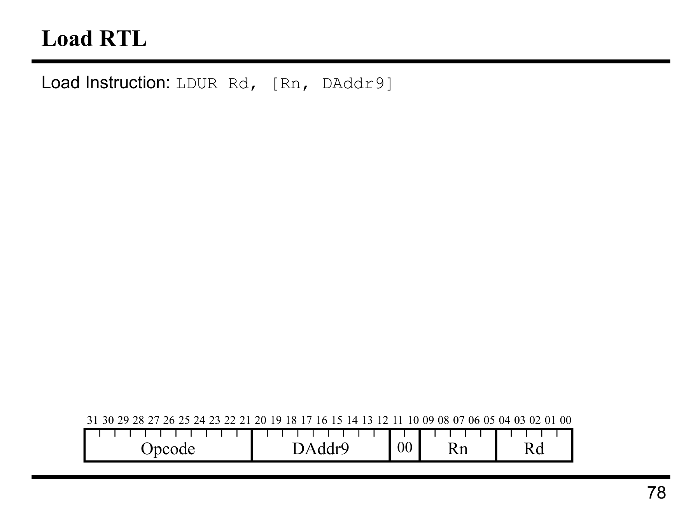
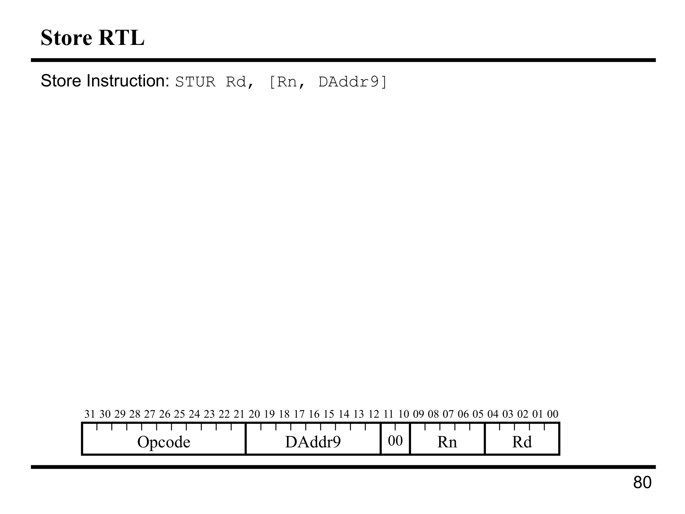
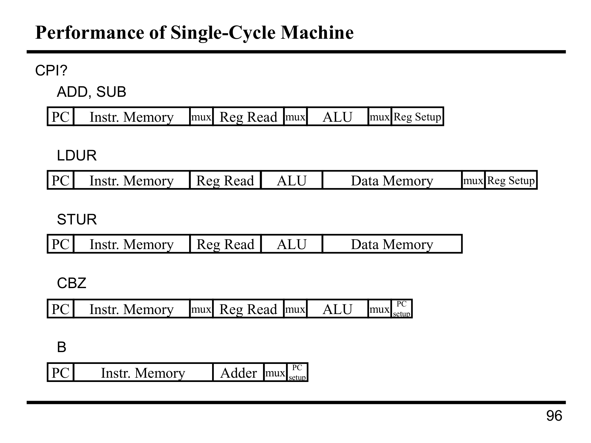

---

## 第 1 页


**提问：** 我现在是一名远程教学老师，需要备课，告诉我这个截图是什么意思并且详细解释，到时候上课我会根据这个回答讲课

下面是对你发来的这页课件“Datapath & Control（数据通路与控制）”的逐条讲解与可直接拿去上课的讲稿提纲。你可以照着讲，也可以把其中的例子改成你课上使用的指令集（MIPS/RISC-V 都通用）。

---

# 这页在说什么（开场白 30 秒）

* 一台**计算机**从结构上可以分成三大块：**处理器（Processor）**、**存储器（Memory）**、**外设/设备（Devices：输入Input、输出Output）**。
* 处理器内部又分为两部分：**数据通路（Datapath）**和**控制（Control）**。
* **数据通路**负责“搬运与计算数据、访问存储器”；**控制**负责“根据指令产生控制信号，指挥数据通路该怎么走、做什么算”。
* 这页就是告诉你：**硬件=（数据通路）×（控制）**，两者配合完成每条指令。

---

# 图中各块含义（逐块讲解 3–5 分钟）

1. **Processor（处理器）**

   * **Datapath（数据通路）**：
     数据在芯片里的“道路与工厂”。典型部件：

     * **寄存器堆**（Register File）：暂存操作数与结果（例如 x1…x31）。
     * **ALU**（算术逻辑单元）：做加减与/或、比较、移位等。
     * **PC**（程序计数器）：指出下一条要取的指令地址。
     * **立即数扩展器、加法器、多路选择器（MUX）**：连接路线、选择数据来源、生成地址等。
     * **内存接口**：把读/写请求发到 Memory。
   * **Control（控制单元）**：
     把**指令的编码**翻译成一组**控制信号**，例如：

     * `RegWrite`（是否写寄存器）
     * `ALUSrc`（ALU 第二操作数来自寄存器还是立即数）
     * `ALUOp`（ALU 做加/减/与/或/比较…）
     * `MemRead / MemWrite`（是否读/写存储器）
     * `Branch / Jump / PCSrc`（是否分支/跳转，PC 从哪里来）
     * `MemToReg`（写回寄存器的数据来自 ALU 还是内存）
       控制单元实现方式：**硬连线控制**（组合逻辑，快）或**微程序控制**（查表/微指令，灵活）。

2. **Memory（存储器）**

   * 既存**指令**也存**数据**（单存储体系）或分成**指令存储器/数据存储器**（哈佛结构）。
   * 数据通路通过地址线/数据线与它读写。

3. **Devices（外设）**

   * **Input**：键盘、传感器、网口等把数据送入系统。
   * **Output**：显示器、磁盘、网络等把数据送出。
   * 课堂可以强调：本质上**外设也是“被映射的寄存器或内存”**，CPU 通过读写寄存器/内存地址与它们交互（MMIO）。

---

# 一条指令在硬件里如何走（用 5 段式流程讲 5–8 分钟）

> 适用于单周期/多周期/流水线的基本直觉。你可用 MIPS 的 `add/lw/sw/beq` 或 RISC-V 的 `ADD/LW/SW/BEQ` 举例。

1. **取指（IF）**：

   * PC 给出地址 → 取出指令 → PC 更新为 `PC+4` 或分支目标。
2. **译码（ID）**：

   * 控制单元看指令的操作码/功能码 → 生成控制信号；
   * 从寄存器堆读出源操作数；立即数扩展。
3. **执行（EX）**：

   * ALU 完成计算（加减/比较/地址计算等）；
   * 分支目标地址计算与条件判断也在这步。
4. **访存（MEM）**（仅对需要的指令）

   * `LW`/`SW` 等通过数据通路访问 Memory；其他指令跳过。
5. **写回（WB）**（仅对需要的指令）

   * 把 ALU 或 Memory 的结果写回寄存器堆。

---

# 三个典型指令的数据通路走法（黑板画简图 6–8 分钟）

1. **算术指令 `ADD x3, x1, x2`**

   * 读 `x1,x2` → ALU 做加法 → `RegWrite=1` 把结果写入 `x3`。
   * 控制关键：`ALUSrc=0`（来自寄存器），`MemRead/Write=0`，`MemToReg=0`。

2. **载入指令 `LW x3, 8(x1)`**

   * 读 `x1` 与立即数 8 → ALU 算地址 `x1+8` → `MemRead=1` 从内存取数据 → `MemToReg=1` 把内存数据写回 `x3`。
   * 关键：`ALUSrc=1`（第二操作数是立即数）。

3. **存储指令 `SW x3, 8(x1)`**

   * 读 `x1`（基址）和 `x3`（要存的值） → ALU 算地址 → `MemWrite=1` 把 `x3` 写到该地址。
   * 无写回寄存器：`RegWrite=0`。

4. **分支 `BEQ x1, x2, label`（可选再讲）**

   * 读 `x1,x2` → ALU 比较是否相等 → 若真，`PCSrc=BranchTarget` 跳到 `label`；否则 PC+4。

---

# 为什么要区分“数据通路”和“控制”（1–2 分钟）

* **解耦与复用**：一套数据通路能完成不同指令，**区别只在控制信号**。
* **设计方法**：先画出**最小公共的数据流图**（寄存器—ALU—内存—MUX），再为每类指令填“该走哪条路”，最后把这些选择编码为控制逻辑。
* **可拓展**：新增指令时，优先复用现有通路，只在必要时加硬件，并更新控制。

---

# 时序与实现形态（简述 2–3 分钟）

* **单周期**：一条指令一个时钟。简单但时钟周期被最慢指令决定。
* **多周期**：IF/ID/EX/MEM/WB 分多个拍完成，硬件复用、效率更高。
* **流水线**：把多条指令分阶段并行（经典 5 级流水）。需要处理**冒险**：数据冒险（前递/暂停）、控制冒险（预测/冲刷）、结构冒险（多端口或分时复用）。

---

# 容易混淆的点（讲给学生的误区提示）

1. **“控制在算”吗？** 控制不做计算结果，它**只发令**（控制信号）。
2. **“内存只放数据？”** 不是，很多设计里**指令与数据共用一片内存**（冯诺依曼架构）。
3. **“每条指令都访存？”** 只有 `load/store`（和取指阶段）会访问“数据存储器”。
4. **“ALU 一直加法？”** ALU 的功能由 `ALUOp` 指出，可以是加、减、与、或、比较、移位等。

---

# 课堂互动（可直接提问）

* 问：`addi x5, x6, 12` 的关键控制信号是什么？

  * 答：`ALUSrc=1, ALUOp=ADD, RegWrite=1, MemRead/Write=0, MemToReg=0`。
* 问：`beq x1, x2, L` 时 PC 从哪里来？

  * 答：若相等，`PCSrc=BranchTarget`（`PC+4 + offset<<2`）；否则 `PC+4`。
* 问：为何 `sw` 不需要 `RegWrite`？

  * 答：结果写到内存，不写寄存器。

---

# 板书/投影片摘要（可作收尾）

1. **计算机顶层**：Processor（Control + Datapath）｜ Memory ｜ I/O。
2. **Datapath**：寄存器堆、ALU、PC、立即数扩展、MUX、加法器、内存接口。
3. **Control**：把“指令编码”→“控制信号”（RegWrite、ALUSrc、ALUOp、MemRead、MemWrite、MemToReg、Branch/Jump、PCSrc）。
4. **指令执行五段**：IF → ID → EX → MEM → WB。
5. **三例**：ADD｜LW｜SW（再加 BEQ）。

---

# 一个 5 分钟小练习（课中/课后）

给出两条指令，请学生画出数据流向并标注必要的控制信号：

1. `ori x7, x0, 0xFF`（或 `ori $t0,$zero,0xFF`）
2. `bne x2, x3, target`
   讲评时强调：立即数的来源、ALU 功能、PC 选择、是否写寄存器/访存。

---

# 一句话总结

* **数据通路 = 路 + 工厂**（搬运与计算），**控制 = 红绿灯 + 交警**（按指令给出信号）；两者配合，把**比特串的指令**变成**具体的硬件行为**。


---

## 第 2 页


**提问：** 我现在是一名远程教学老师，需要备课，告诉我这个截图是什么意思并且详细解释，到时候上课我会根据这个回答讲课

下面这页“Simple CPU”是在说明：为了教学，我们选取**指令集的一个子集**，并基于它设计一颗简化 CPU。页面给出了该子集中几类代表性指令的**机器码格式**（32 位），以及每个字段在 31…0 位上的分布。你可以据此讲“指令如何编码 → 控制单元如何据此发信号 → 数据通路如何执行”。

---

# 总览（你可以先讲 1 分钟）

* **每条指令是 32 位**。最左边高位是 **Opcode（操作码）**：告诉控制单元“我是谁”（加法？访存？跳转？），从而产生不同控制信号。
* 除了操作码外，不同指令类型还带有**寄存器号**（`Rn/Rd/Rm`）、**立即数/偏移量**（`BrAddr26/CondAddr19/DAddr9`）以及**移位量**（`SHAMT`）。
* 这页列了 4 大类：

  1. **Memory**（`LDUR`/`STUR`） 2) **Branch**（无条件 `B`）
  2. **Conditional Branch**（条件分支 `CBZ`） 4) **Arithmetic**（`ADD`/`SUB` 等）

> 讲授建议：边讲边在板书上画 32 个小刻度，从 31 到 0，对照每个字段范围涂色，学生更直观。

---

# 一、Memory 指令：`LDUR` / `STUR`

**格式**（从高到低位）：`Opcode | DAddr9 | 00 | Rn | Rd`

* `Rn`：基址寄存器（base register）
* `Rd`：目标寄存器（load 的写回寄存器 / store 的源寄存器）
* `DAddr9`：9 位**有符号位移**（教材子集里常规定为**字对齐**，因此后面硬编码两位 `00`，等价于偏移左移 2 位）
* **有效地址**计算：`EA = Rn + sign_extend(DAddr9) << 2`
* `LDUR`：`MemRead=1, MemWrite=0, RegWrite=1, MemToReg=1`
* `STUR`：`MemRead=0, MemWrite=1, RegWrite=0`

**课堂示例**

* `LDUR X3, [X1, #8]` → `EA = X1 + (8)`（8 已含对齐，等价 `DAddr9=2` 加 `00`）→ 读内存 → 写回 X3
* 常见误区：`STUR` 不写寄存器；偏移是**相对 Rn** 而不是绝对地址。

---

# 二、无条件分支：`B`

**格式**：`Opcode | BrAddr26`

* `BrAddr26`：26 位有符号偏移（**字对齐**，等价于 `offset = sign_extend(BrAddr26) << 2`）
* **目标地址**：`PC_target = PC + 4 + (offset)`（多数实现里 PC 已指向下一条，因此 +4）
* 控制信号核心：`Branch=1, PCSrc=target`；不读写寄存器、不开内存。

**课堂示例**

* `B loop`：`PC ← PC+4 + ((BrAddr26<<2))`

---

# 三、条件分支：`CBZ`（Compare-and-Branch-if-Zero）

**格式**：`Opcode | CondAddr19 | Rd`

* `Rd`：要测试是否为零的寄存器
* `CondAddr19`：19 位有符号偏移（同样**左移 2 位**对齐）
* 语义：**若** `Rd == 0`，`PC ← PC+4 + (sign_extend(CondAddr19)<<2)`；否则顺序执行
* 控制信号：需有**零检测**（比较器或 ALU 的 Z 标志）、`Branch=conditional`、`PCSrc=cond_target`

**课堂示例**

* `CBZ X5, done`：如果 X5 为 0 就跳到 `done`。

---

# 四、算术类：`ADD` / `SUB`（R 型）

**格式**：`Opcode | Rm | SHAMT | Rn | Rd`

* `Rn`、`Rm`：源寄存器；`Rd`：目的寄存器
* `SHAMT`：移位量（常用于**先把 Rm 逻辑左移**再参与 ALU 运算，例如 `ADD Xd, Xn, Xm, LSL #shamt`；在很多教学子集里把 `SHAMT=0` 视为无移位）
* 控制：`ALUOp=ADD/SUB`，`RegWrite=1`，`MemRead/Write=0`，`ALUSrc=寄存器`

**课堂示例**

* `ADD X3, X1, X2`：`X3 = X1 + X2`（`SHAMT=0`）
* `SUB X9, X4, X5, LSL #2`：计算的是 `X9 = X4 - (X5<<2)`

---

# 五、位段与对齐（讲清“为什么有两个 0”）

* 这套教学格式里，**分支/位移字段都按字对齐**。由于指令地址最低两位恒为 0（32 位字对齐），**只编码高位部分**，到执行时统一**左移 2 位**（或在编码中直接放 `…|00`）。
* 好处：**偏移位数更少却覆盖更大地址范围**；硬件实现也简单（append `00` 或者 `<<2`）。

---

# 六、从“编码”到“控制信号”（把这页和上一页“Datapath & Control”衔接）

当控制单元看到不同 **Opcode** 时，解码生成如下信号（可贴在板书或投影片）：

| 指令          | 关键控制信号（典型）                                                                        |
| ----------- | --------------------------------------------------------------------------------- |
| `LDUR`      | `RegWrite=1, MemRead=1, MemWrite=0, MemToReg=1, ALUSrc=imm(DAddr9<<2), ALUOp=ADD` |
| `STUR`      | `RegWrite=0, MemRead=0, MemWrite=1, ALUSrc=imm(DAddr9<<2), ALUOp=ADD`             |
| `B`         | `Branch=1 (uncond), PCSrc=PC+4+(BrAddr26<<2)`                                     |
| `CBZ`       | `Branch=1 (cond on Z), ZeroTest=Rd==0, PCSrc=PC+4+(CondAddr19<<2)`                |
| `ADD`/`SUB` | `RegWrite=1, ALUSrc=Reg, ALUOp=ADD/SUB, MemRead/Write=0`                          |

> 提示学生：**地址计算**基本都复用 ALU（例如 `Rn + offset`）；**分支目标地址**也常用 ALU 的加法器实现 `PC+4+offset`。

---

# 七、快速练习（课堂互动 3 分钟）

1. 写出 `LDUR X7, [X2, #16]` 的有效地址计算式，并给出需要的控制信号。
2. 指令 `CBZ X10, L1` 要跳转发生的条件是什么？目标地址怎么算？
3. `SUB X5, X6, X8, LSL #3` 中 `SHAMT` 的作用是什么？

---

# 八、常见坑（1 分钟点名）

* “`B`/`CBZ` 的偏移是**相对 PC**，不是绝对地址”。
* “`STUR` 不写寄存器”。
* “`SHAMT` 不是所有 R 型都用到，但编码位置保留”。
* “`DAddr9/CondAddr19/BrAddr26` 多为**有符号数**，需要**符号扩展**再左移”。

---

# 九、一段 20 秒收尾

* **这页的本质**：在一个教学子集里，用**少数几种统一的编码**就能覆盖**访存 / 算术 /（条件）跳转**三大行为；控制单元只要识别 `Opcode` 并取出相应字段，就能驱动数据通路完成整条指令。
* 后续可以基于这些格式去画：**单周期/多周期/流水线**中的数据流与控制信号时序。


---

## 第 3 页


**提问：** 我现在是一名远程教学老师，需要备课，告诉我这个截图是什么意思并且详细解释，到时候上课我会根据这个回答讲课

下面这页“Execution Cycle（指令执行周期）”给出了一条指令在 CPU 里从取到执行完的**标准六步流程**。它适合用来把前两页（“数据通路&控制”“指令编码”）串起来讲：**控制单元**根据指令的各个字段，在不同阶段驱动**数据通路**里 ALU、寄存器堆、存储器和 PC 的动作。

---

# 整体含义（先给学生的 20 秒概念）

* 每条指令都会经历：**取指 → 译码 → 取数 → 执行 → 写回 → 选下一条**。
* 有的指令**会跳过**某些阶段（比如算术不访存就没有“数据存储器读/写”）；有的阶段**合并或并行**（例如单周期把多步塞进同一拍，流水线把不同指令的不同阶段并行）。

---

# 六个阶段逐一讲（对应图中左栏的方框）

## 1) Instruction Fetch（取指）

**图示右侧要点：Obtain instruction from program storage**

* 硬件动作：PC→指令存储器地址端，读出**32 位指令**。
* 同时：计算 `PC+4`（或 `PC+2/PC+8` 取决于 ISA 的指令长度；固定 32 位时是 `+4`），作为**顺序执行**的候选下一个 PC。
* 控制信号：`I-MemRead=1`。
* 数据通路：PC 加法器、指令存储器（或统一内存的指令端口）。

> 课堂提示：如果你用 RISC-V/MIPS，强调**定长 32 位**，因此“Determine instruction size”这件事在它们里是固定的；可顺带对比 x86 的**变长指令**为什么在 IF/ID 更复杂。

---

## 2) Instruction Decode（译码）

**要点：Determine required actions and instruction size**

* 硬件动作：控制单元读取指令的 **Opcode/func/寄存器字段/立即数**，生成一组**控制信号**（如 `RegWrite, ALUSrc, ALUOp, MemRead, MemWrite, Branch, Jump, MemToReg, PCSrc …`）。
* 若为定长 ISA，此步的“指令大小”恒定；若为变长 ISA，需要进一步解析长度与前缀。
* 同时：**寄存器堆**根据 `Rn/Rm/Rd` 读出源操作数。

---

## 3) Operand Fetch（操作数取数）

**要点：Locate and obtain operand data**

* 硬件动作：

  * 从**寄存器堆**取源寄存器内容；
  * **立即数扩展**（符号扩展或零扩展）；
  * 对访存指令，准备**基址寄存器 + 偏移**的两个输入；
  * 对分支，准备 `PC+4` 与（左移后的）偏移。
* 控制信号：选择多路复用器（`ALUSrc=Reg/Imm`、`ImmSel`）。

> 与第 2 步常一起描述：教材把“读寄存器/取立即数”单列为 Operand Fetch，便于讲多周期/流水线。

---

## 4) Execute（执行）

**要点：Compute result value or status**

* 硬件动作：

  * **ALU 运算**：加/减/与/或/比较/移位/地址计算。
  * **条件码/标志**：产生 Zero/Negative/Carry/Overflow 等供条件分支判断。
  * **分支目标地址**：`PC_target = PC+4 + (offset<<2)`（字对齐的 ISA）；并生成 `take_branch` 条件。
* 控制信号：`ALUOp` 决定功能；`Branch/Jump` 决定是否把 `PCSrc` 选成目标地址。

---

## 5) Result Store（结果写回/存储）

**要点：Deposit results in storage for later use**

* 两种去向：

  1. **写回寄存器**（算术或加载指令）：`RegWrite=1`，`MemToReg` 选择 ALU 结果还是 Memory 数据。
  2. **写入数据存储器**（存储指令）：`MemWrite=1`，地址来自 EX 阶段的 ALU；写数据来自寄存器 `Rt/Rd`。
* 控制信号确保“要么写寄存器，要么写内存”，避免冲突。

---

## 6) Next Instruction（选择下一条）

**要点：Determine successor instruction**

* **无跳转**：`PC ← PC+4`。
* **条件/无条件分支或跳转**：根据 `take_branch/jump` 选择 `PC ← target`。
* 这一步结束后，控制流回到 **Fetch**，开始下一条指令。

---

# 把六步映射到三类典型指令（黑板可画小表）

| 指令                 | IF      | ID/Operand  | EX             | MEM | WB/Next                  |
| ------------------ | ------- | ----------- | -------------- | --- | ------------------------ |
| `ADD X3,X1,X2`     | 取指/PC+4 | 读 X1/X2     | ALU 加          | —   | 写回 X3；`PC=PC+4`          |
| `LDUR X3, [X1,#8]` | 取指      | 读 X1，取立即数 8 | ALU 算地址 `X1+8` | 读内存 | 写回 X3                    |
| `CBZ X5, L`        | 取指      | 读 X5，取偏移    | 比零并算目标         | —   | 若零，`PC=target`；否则 `PC+4` |

> 课堂口令：**算术“EX→WB”，加载“EX→MEM→WB”，存储“EX→MEM”，分支“EX→Next”**。

---

# 单周期、多周期与流水线（把这页扩展开 2–3 分钟）

* **单周期**：六步在**同一个时钟**内串行完成，时钟被最慢路径决定。
* **多周期**：把六步分多拍执行，**硬件复用**（同一个 ALU 既算地址又做加法）。
* **流水线（5 级常见）**：把不同指令分阶段并行，近似把“六步”压成**IF/ID/EX/MEM/WB**五级；此时进入**冒险**话题：

  * 数据冒险：前递（Forwarding）/暂停（Stall）。
  * 控制冒险：分支预测/延迟槽/冲刷（Flush）。
  * 结构冒险：指令/数据存储器分离或多端口。

---

# 微观信号（可写在角落，便于学生做题）

* IF：`I-MemRead=1, PCSrc=seq/target`
* ID/OF：`RegRead=1, ImmSel=…`
* EX：`ALUSrc, ALUOp, Branch/Jump`
* MEM：`D-MemRead/D-MemWrite`
* WB：`RegWrite, MemToReg`

---

# 常见混淆点（点名澄清）

1. **Operand Fetch 并不等于“访存”**：它首先指**寄存器/立即数**的取值；真正访问**数据存储器**在 MEM。
2. **分支目标计算在 EX**：不是在 Next 阶段才算。Next 只是**选择**。
3. **并不是每条指令都有 MEM 或 WB**：存储指令没有 WB；纯算术没有 MEM。
4. **定长 ISA 不需要“确定指令大小”**：这句话是通用表述，给变长 ISA 留口。

---

# 课堂互动（3 分钟小练习）

* 问：`SW X3, 8(X1)` 六步里哪些步骤一定发生？关键控制信号？
* 问：为什么把地址计算放在 EX 而不是 MEM？（答：统一复用 ALU；MEM 阶段仅做存取）
* 问：\`BEQ


---

## 第 4 页


**提问：** 我现在是一名远程教学老师，需要备课，告诉我这个截图是什么意思并且详细解释，到时候上课我会根据这个回答讲课

下面这页“Processor Overview（处理器总览）”是在把**最小处理器的数据流**用一张图讲清楚：PC→取指→寄存器堆→ALU→（数据存储器/寄存器写回）。你可以直接按下面的提纲讲。

---

# 这页在讲什么（开场 20 秒）

* 目标：用**一条统一的数据流图**串起我们前面讲过的**指令格式与执行周期**。
* 关键部件：**PC、指令存储器、寄存器堆、ALU、多路复用器(MUX)、数据存储器**。
* 关键思想：**大多数指令都走同一条“骨干通路”，区别只是控制信号选哪条支路**。

---

# 图上每个方块与箭头（逐块讲 3–5 分钟）

1. **PC（程序计数器）**

* 保存下一条要取的指令地址。
* 每次取指后通常 `PC = PC + 4`；分支/跳转时由控制逻辑把 `PC` 改成目标地址。

2. **Instruction Memory（指令存储器）**

* 以 PC 为地址读出 32 位指令，送到**控制单元**与**寄存器编号/立即数提取**逻辑（图里省略“控制单元”框，但它隐含存在）。
* 指令告诉我们：**该读哪些寄存器、ALU 做什么、是否访问数据存储器、结果写到哪**。

3. **Register File（寄存器堆）**

* 按指令字段 `Rn/Rm` 读出**两个源操作数**；按 `Rd` 作为写回端口。
* 有**写回端口**接收来自 MUX 的结果（ALU 结果或内存读数）。

4. **ALU（算术逻辑单元）**

* 对来自寄存器或“立即数扩展器”的操作数进行**加/减/与/或/比较/移位**等。
* **地址计算**也在 ALU 完成（例如 `EA = Rn + offset` 用于 `load/store`）。
* ALU 的“零/负/溢出”标志可供分支决策使用（图中未画出标志线，教学时口述即可）。

5. **MUX（多路选择器，图中两个尖三角）**

* **写回 MUX（右侧）**：在“ALU 结果”和“数据存储器读出”之间选择，信号常记为 `MemToReg`。
* **ALU 源 MUX（靠 ALU 左侧）**：在“寄存器值”和“立即数/偏移量”之间选择，信号常记为 `ALUSrc`。

6. **Data Memory（数据存储器）**

* `LW/LDUR`：`MemRead=1`，地址来自 ALU，读出数据→写回寄存器堆。
* `SW/STUR`：`MemWrite=1`，地址来自 ALU，要写的数据来自寄存器堆。
* 其他算术类指令**不访问**数据存储器。

> 图中最外层的大回路箭头：表示“下一条指令还会再走一遍同样的数据流”（顺序执行）；分支/跳转时这条回路会被“改道”到目标地址。

---

# 与标题 bullets 的一一对应（逐条解读 2–3 分钟）

* **PC fetches instructions**
  PC给地址→指令存储器返回指令。

* **Instructions select operand registers, ALU immediate values**
  指令字段直接**选出寄存器编号**，同时提供**立即数/偏移量**给 ALU 源 MUX。

* **ALU computes values**
  算术/逻辑结果、比较结果、以及**load/store 的地址**都由 ALU 计算。

* **Load/Store addresses computed in ALU**
  强调地址=基址寄存器+符号扩展偏移（必要时左移对齐）。

* **Result goes to register file or Data memory**

  * 算术/比较：结果从 ALU → 写回寄存器堆；
  * 载入：Data Memory → 写回寄存器堆（`MemToReg=1`）；
  * 存储：寄存器 → Data Memory（不写回寄存器）。

---

# 用两条指令走一遍图（黑板演示 4–5 分钟）

### 1) `ADD x3, x1, x2`

* 取指 → 译码出 `Rn=x1, Rm=x2, Rd=x3, ALUOp=ADD, ALUSrc=Reg, MemRead/Write=0`
* RegFile 读出 `x1,x2` → ALU 做加法 → 写回 MUX 选 ALU → 写 `x3`。
* PC 正常 `+4`。

### 2) `LDUR x3, [x1, #8]`

* 取指 → 译码出 `Rn=x1, Rd=x3, ALUSrc=Imm, ALUOp=ADD, MemRead=1, MemToReg=1`
* RegFile 读 `x1`，立即数扩展器给 `+8` → ALU 算有效地址 → Data Memory 读出 → 写回 `x3`。

> 可补充 `STUR` 与 `CBZ`：`STUR` 写内存不写寄存器；`CBZ` 用 ALU/比较器得到“零标志”，若真改变 PC。

---

# 与“执行周期（IF/ID/EX/MEM/WB）”对齐（1 分钟）

* **IF**：PC→Instruction Memory。
* **ID**：解码、RegFile 读、立即数扩展、控制信号产生。
* **EX**：ALU 运算/地址计算/分支判断。
* **MEM**：仅对 `load/store` 访问 Data Memory。
* **WB**：写回寄存器堆（ALU 结果或内存读数）。

---

# 关键控制信号清单（可做板书）

* `RegWrite`：是否写寄存器堆
* `ALUSrc`：ALU 第二操作数选寄存器还是立即数
* `ALUOp`：ALU 执行的运算类型
* `MemRead / MemWrite`：是否读/写数据存储器
* `MemToReg`：写回数据来自 ALU 还是内存
* （分支相关）`Branch / PCSrc`：PC 取值来自顺序`PC+4`还是目标地址

---

# 常见误区与纠正（30–60 秒）

* “所有指令都访问数据存储器”❌ → 只有 **load/store**（取指除外）。
* “地址计算是存储器自己算的”❌ → **地址由 ALU** 统一计算。
* “store 也写回寄存器”❌ → `STUR/SW` **不写回**寄存器。

---

# 互动小练习（2 分钟）

给出 `CBZ x5, L1`：

* 说出需要的控制信号（`ALUSrc=Reg, ALUOp=COMPARE/ SUB, Branch=cond, MemRead/Write=0, RegWrite=0`），
* 以及 PC 的选择条件（`x5==0` 则 `PC ← PC_target`，否则 `PC+4`）。

---

# 一句话收尾

* **同一条通用数据通路** + **不同的控制信号** = **能执行整个指令子集的处理器**；图中的每根箭头都对应你在控制单元里做的一次“选择”。


---

## 第 5 页


**提问：** 我现在是一名远程教学老师，需要备课，告诉我这个截图是什么意思并且详细解释，到时候上课我会根据这个回答讲课

下面这页“RTL & Processor Design（RTL 与处理器设计）”是在把**指令级规范**（ISA）落到**寄存器传输级**（RTL）的实现方法：
把“做什么（加法、访存、跳转）”具体化为“**哪几个寄存器在某个时钟沿**，通过**哪段组合逻辑**，把**哪路数据**送到**哪一个寄存器**里”。你可以按下面讲稿直接上课。

---

# 1. 什么是 RTL（寄存器传输级）

* **寄存器（Register）**：时钟沿锁存数据的存储元件（PC、通用寄存器、状态寄存器等）。
* **传输（Transfer）**：在一次时钟内，数据沿着**组合逻辑**与**总线/MUX**从源到达目的寄存器。
* **RTL 语句**（伪代码）：`RegA = RegB + RegC;`

  * 含义：在某个时钟周期，由**ALU**对 `RegB` 与 `RegC` 做加法，结果在时钟上升沿写入 `RegA`。
  * 在硬件上体现为：选择器（MUX）选中 `RegB`、`RegC` → ALU 执行 `ADD` → `RegA_we=1`（写使能）→ 时钟来临写入。

> 课堂要点：**RTL 是实现级别的“步骤清单”**，它落地到**连线（数据通路）** + **使能/选择（控制）**。

---

# 2. RTL 规范决定两件事

1. **单元的互连**（Interconnection）

   * 哪些寄存器通过哪些 MUX 接到 ALU、数据存储器、PC 更新加法器等。
2. **控制**

   * 什么时候使能读/写，ALU 选哪种运算，MUX 选哪一路，计数器是否加 1，是否清零等。

---

# 3. 幻灯片中的“Math unit example”解读

四条微操作（micro-ops）描述了一个数学单元在不同模式下的 **RTL 行为**（每条看作“一个周期里干什么”）：

* **(add)**：`A = A + B; I++;`

  * 用 ALU 把寄存器 `A` 与 `B` 相加，结果写回 `A`；同时**索引/计数寄存器** `I` 自增。
  * 控制信号：`ALUOp=ADD, A_we=1, I_we=1, I_src=I+1`。

* **(mult)**：`A = A * B; I++;`

  * 把 `A` 与 `B` 相乘（可是一拍也可以是多拍乘法器，此处当作一拍 RTL 语义），结果写回 `A`；`I` 自增。
  * 控制信号：`ALUOp=MUL`（或启动 MUL 单元），`A_we=1, I_we=1`。

* **(hold)**：`A = A; I++;`

  * 保持 `A` 不变（本质上是**不写 A**或写回自身）；但 `I` 仍然前进一步。
  * 控制信号：`A_we=0（或 A_src=A）; I_we=1`。
  * 典型用途：等待外设/存储器、或流水线插入气泡。

* **(init)**：`A = Din; I++;`

  * 用输入口 `Din` 初始化 `A`；`I` 自增。
  * 控制信号：`A_src=Din, A_we=1, I_we=1`。

> 右下角的小方块标了 **A** 与 **I**：表示这是这个微型算术单元里**关键的两个时序寄存器**（数据寄存器 A 与计数器 I）。

---

# 4. 从“指令”到“RTL 步骤”（把 ISA 拆成若干拍）

以我们前面讲过的三类指令为例（单周期/多周期都能用，下面按**5 段式多周期**示意）：

### 4.1 `ADD Xd, Xn, Xm`

* **IF**：`IR = Mem[PC]; PC = PC + 4;`
* **ID**：`A = Reg[Xn]; B = Reg[Xm];`（寄存器堆同时读两路）
* **EX**：`ALUOut = A + B;`
* **WB**：`Reg[Xd] = ALUOut;`

> 译成控制：`ALUOp=ADD, RegWrite=1, MemRead=0, MemToReg=0, ALUSrc=Reg`。

### 4.2 `LDUR Xd, [Xn, #imm]`

* **IF**：`IR = Mem[PC]; PC = PC + 4;`
* **ID**：`A = Reg[Xn]; Imm = signext(imm)<<2;`
* **EX**：`ALUOut = A + Imm;`（地址计算）
* **MEM**：`MDR = Mem[ALUOut];`
* **WB**：`Reg[Xd] = MDR;`

> 控制：`MemRead=1, MemToReg=1, ALUOp=ADD, ALUSrc=Imm, RegWrite=1`。

### 4.3 `CBZ Xn, target`

* **IF/ID** 同上
* **EX（比较+目标）**：
  `Zero = (Reg[Xn] == 0);`
  `ALUOut = PC + (signext(offset)<<2);`
* **BR**：`if (Zero) PC = ALUOut;`（否则 PC 已在 IF 加 4）

> 控制：`Branch=1, Cond=Zero`，不写寄存器不访存。

---

# 5. 用 FSM（有限状态机）组织 RTL

* **状态**：`IF → ID → EX → MEM → WB`（不同指令的路径可能跳过某些状态）。
* **每个状态执行若干 RTL 语句**，并在**时钟沿**转到下一个状态。
* **输出型控制**：在状态里拉高/拉低控制信号（`RegWrite, MemRead, ALUSrc, MemToReg, PCSrc...`）。
* **转移条件**：比如 `CBZ` 需要 `Zero` 决定是否转到 `IF`（顺序）还是写 `PC=ALUOut`（分支）。

---

# 6. 讲清“RTL 三件套”——学生容易忽略的控制细节

1. **写使能（\_we）**：只有写端被使能时寄存器才会在时钟沿更新；否则保持。
2. **源选择（MUX）**：用 `*_src` 或 `MemToReg/ALUSrc` 表达数据来自哪条路。
3. **时序/组合**：

   * **组合逻辑**（ALU、加法器、比较器、MUX）在一个周期内稳定；
   * **寄存器**在**时钟**沿采样组合逻辑的稳定结果。

---

# 7. 把这页和前几页关联起来

* 第 71–73 页从**指令格式 → 执行周期 → 数据通路**搭框架；
* 这页（第 74）告诉你：**如何把这些变成“每拍要做的寄存器传输”**，并据此设计**连线与控制**；
* 最终就能写出 Verilog/VHDL 的状态机与数据通路。

---

# 8. 课堂黑板/投影片可用模板

**常用 RTL 记号（你可贴一张表）：**

```
IR     = Mem[PC]              // 取指
PC     = PC + 4               // 顺序前进
A,B    = Reg[rs1], Reg[rs2]   // 读寄存器堆
ALUOut = A (+|-|&|...) B or Imm
MDR    = Mem[ALUOut]          // 数据读
Reg[rd]= MUX(ALUOut, MDR)     // 写回
```

**常用控制信号一览：**
`RegWrite, ALUSrc, ALUOp[ ], MemRead, MemWrite, MemToReg, PCSrc/Branch, IRWrite, IorD（访存地址来自 PC/ALUOut）` 等。

---

# 9. 快速练习（2–3 分钟互动）

1. 把 `STUR Xt, [Xn,#imm]` 写成 3–5 条 RTL 语句；指出每拍需要哪些控制信号。
2. 设计 `mult` 多周期：若乘法器需要 3 拍，FSM 如何扩展？`A` 在哪一拍更新？
3. 给定 `hold` 状态，哪些控制信号应为 0（例如 `RegWrite=0, MemRead=0, MemWrite=0`），哪些仍然为 1（`I_we=1`）？

---

# 10. 一句话收尾

* **ISA 描述“语义”**，**RTL 描述“每拍怎么搬数据”**。
* 有了 RTL，你就能画出**连线**并写出**控制状态机**，把课上讲的“数据通路 + 控制”真正落成一个可综合的处理器。


---

## 第 6 页


**提问：** 我现在是一名远程教学老师，需要备课，告诉我这个截图是什么意思并且详细解释，到时候上课我会根据这个回答讲课

下面这页标题是 **Instruction Fetch（取指）**。画面只有两个方块：**PC** 和 **Instruction Memory（指令存储器）**，用来强调“取指阶段只做一件事：用 PC 当地址到指令存储器里**读出一条指令**”。你上课可以按下面结构讲，时间 6–10 分钟足够。

---

# 1. 这一步要完成什么？

* **目标**：拿到当前要执行的 32 位指令字，并把 **PC** 为下一条做好准备（通常 `PC+4`，分支/跳转另说）。
* **最小接口**

  * 对指令存储器：`Address ← PC`，`Instr ← IMem[Address]`（只读端口）。
  * 对控制：拉高指令寄存器写使能（`IRWrite=1`），在时钟沿把 `Instr` 写入 **IR（指令寄存器）**。

> 幻灯片只画了 “PC → Instruction Memory（Address）”，就是这个最核心的数据流。

---

# 2. RTL（寄存器传输级）写法（可直接板书）

单周期（或多周期的 IF 状态）常见 RTL：

```
IR  = IMem[PC];   // 读出指令，写入指令寄存器
PC' = PC + 4;     // 预设下一条顺序地址（或由PCSrc选择）
```

* 其中 `PC'` 表示下一拍写入 PC 的值。真正写 PC 的时刻与数据通路设计有关：

  * **单周期机**：同拍内组合出 `PC+4`，在时钟沿写回；
  * **多周期机**：通常 IF 状态只“读 IR 并把 PC 加4”，然后进入 ID 状态；
  * **流水线**：IF 级每个周期都做 `PC → IMem` 与 `PC+4` 计算。

---

# 3. 关键控制信号（建议贴在投影片侧边）

* `IRWrite`：指令寄存器写使能（IF=1，其余阶段=0）。
* `PCWrite` 或 `PCWriteCond`：是否更新 PC。
* `PCSrc`：PC 的来源（顺序 `PC+4`、分支目标、跳转目标等）。
* `IorD`（可选，在统一的存储器上）：选择**访存地址来自 PC 还是 ALUOut**（IF=PC，LW/SW=ALUOut）。

---

# 4. PC+4 与对齐

* 32 位定长指令 → **字对齐** → 每条指令地址相差 4 字节（`PC+4`）。
* 若是变长或16位指令（如某些 Thumb/RVC），则不是固定 `+4`，但**本课子集固定 32 位**，所以用 `+4` 简化。

---

# 5. 与分支/跳转的关系（提前埋点，后续再展开）

* IF 阶段先按 `PC+4` 取指；若上一条是“已知要跳”的 **B/J**（在单周期设计中，当拍就确定），`PCSrc` 会改为“目标地址”，覆盖 `PC+4`。
* **条件分支**（如 `CBZ`）通常在 EX 才知道真假；流水线中这会造成 **控制冒险**（需要暂停/冲刷或预测）。本页先不展开，只提醒“为什么 IF 里要留出 `PCSrc` 的选择器”。

---

# 6. 指令存储器的实现与细节

* **哈佛结构**：指令存储器与数据存储器分离（本课程图通常假设如此），IF 与数据访存可以并行。
* **冯诺依曼结构**：共用一片内存，需要 `IorD` 控制与仲裁。
* **延迟与缓存**：真实系统有 **指令 Cache**；本节的简化模型假设 **一次取指一个周期返回**。

---

# 7. 取指阶段的常见“坑”（课堂提醒）

1. “取指会改寄存器堆吗？”——**不会**，只读指令存储器并更新 PC/IR。
2. “PC 一定是 `+4` 吗？”——**顺序执行**是 `+4`；分支/跳转由 `PCSrc` 选择其他来源。
3. “IR 是必须的吗？”——多周期/流水线里通常**需要 IR**保存本条指令，便于后续阶段使用；单周期也常画出 IR 以清晰表达。

---

# 8. 两个快问快答（互动 1 分钟）

* **问**：为什么 `Address` 只画了从 PC 到 Instruction Memory 的箭头？
  **答**：取指只需要“读”，地址来源就是 PC，体现 IF 的“只取不改”的本质。
* **问**：如果是 `B` 指令，IF 结束时 PC 用 `PC+4` 还是目标？
  **答**：取决于设计。单周期机在同拍解码到 `B` 后直接选目标；流水线机一般先取 `PC+4`，之后在 EX 决策，必要时冲刷。

---

# 9. 一句话收尾

**Instruction Fetch = 用 PC 做地址从指令存储器读指令，并准备好下一条 PC（通常 `PC+4`，可被分支/跳转覆盖）。**
这一页把“取指的最小通路”剥离出来，后面的几页会在此基础上逐步补全解码、执行、访存与写回。


---

## 第 7 页


**提问：** 我现在是一名远程教学老师，需要备课，告诉我这个截图是什么意思并且详细解释，到时候上课我会根据这个回答讲课

下面这页“**Add/Subtract RTL**”是在把**加法/减法指令**用**寄存器传输级（RTL）**和**编码格式**讲清楚：它告诉你 R 型指令的字段布局（`Opcode|Rm|SHAMT|Rn|Rd`），以及 `ADD Rd,Rn,Rm` / `SUB Rd,Rn,Rm` 在数据通路上每一拍要做什么、需要哪些控制信号。你可以直接按下面的讲稿讲课。

---

# 1. 指令含义与字段（先把图说清楚）

* 指令（R 型）：

  * **ADD Rd, Rn, Rm**：`Rd ← Rn + (Rm << SHAMT)`（本课程子集常取 `SHAMT=0`，等价 `Rd ← Rn + Rm`）。
  * **SUB Rd, Rn, Rm**：`Rd ← Rn − (Rm << SHAMT)`（常取 `SHAMT=0`）。
* **编码**（从位 31→0）：
  `Opcode | Rm | SHAMT | Rn | Rd`

  * `Opcode`：区分 ADD/SUB（控制单元据此产生 `ALUOp` 等）。
  * `Rm`：第二源寄存器；`Rn`：第一源寄存器；`Rd`：目的寄存器。
  * `SHAMT`：移位量（逻辑左移），若未使用则全 0，保留位使格式统一。

> 板书小技巧：在 32 格位线上标注 31..0，并用不同颜色标出 Rm / SHAMT / Rn / Rd。

---

# 2. RTL 分解（5 段式执行；单周期可折叠在一拍）

以 **ADD** 为例，**SUB** 仅把 `ALUOp` 改成减法：

**IF（取指）**

```
IR  = IMem[PC];
PC  = PC + 4;
```

**ID（译码/读寄存器）**

```
A   = Reg[Rn];
B   = Reg[Rm];
Sh  = zero_extend(SHAMT);       // 若使用移位
Bsh = B << Sh;                  // 组合逻辑
```

**EX（执行）**

```
ALUOut = A + Bsh;               // SUB：ALUOut = A - Bsh
```

**MEM（访存）**

* 无操作（算术指令不访问数据存储器）。

**WB（写回）**

```
Reg[Rd] = ALUOut;
```

---

# 3. 关键控制信号（讲给“数据通路 + 控制”的对应关系）

| 阶段 | 需要的控制                                  |
| -- | -------------------------------------- |
| ID | `RegRead=1（两路）`，`Imm/Shift 单元启用`       |
| EX | `ALUSrcB=Rm_or_Shift`, `ALUOp=ADD/SUB` |
| WB | `RegWrite=1`, `MemToReg=0`（选 ALU 结果）   |

> 单周期机：这些信号在同一周期同时生效；多周期机：各阶段在不同状态拉高相应信号；流水线机：这些信号随指令在各级流水寄存器中前传。

---

# 4. 数据通路怎么走（配合上一章“Processor Overview”的图）

1. **寄存器堆**按 `Rn、Rm` 两个读端口取数；
   2\)（可选）**移位器**对 `Rm` 的值左移 `SHAMT` 位；
2. **ALU** 做 `A ± Bsh`；
3. **写回 MUX** 选择 **ALUOut**（不是内存）；
4. **写回寄存器堆**端口用 `Rd` 做地址，`RegWrite=1`。

---

# 5. 标志位与比较（可选扩展 30 秒）

* 许多 ISA 会在 ADD/SUB 更新 **Z/N/C/V** 标志（零/负/进位/溢出），供分支/条件执行使用。
* 在教学子集里可只保留 **Z**（零）或全不实现，视后续 `CBZ` 设计而定。

---

# 6. `SHAMT` 的教学意义

* 统一格式：即使不用移位，也保留 `SHAMT` 字段，**控制设为 0**。
* 性能/表达力：能写 `ADD Rd, Rn, Rm, LSL #k` 这种**先移位再相加**的地址/下标计算（例如 `A[i]` 的 `i<<2`）。

---

# 7. 例子（板书带数值，学生最容易理解）

* 假设 `Rn=x1=7`, `Rm=x2=3`, `SHAMT=0`：

  * `ADD x3,x1,x2` → `x3 = 7 + 3 = 10`
  * `SUB x4,x1,x2` → `x4 = 7 − 3 = 4`
* 若 `SHAMT=2` 且 `Rm=5`：`Rm<<2 = 20`；

  * `ADD x3,x1,x2,LSL #2` 相当于 `x3 = x1 + 4*Rm`（常用于数组地址计算）。

---

# 8. 单周期 / 多周期 / 流水线的实现要点

* **单周期**：一次时钟完成“读寄存器→移位→ALU→写回”，**时钟周期被 ALU 路径决定**。
* **多周期**：把“读寄存器/执行/写回”分三拍，**复用 ALU** 与寄存器堆端口，控制更简单。
* **流水线（5 级）**：

  * IF/ID/EX/MEM/WB；ADD/SUB 在 EX 产出结果、WB 写回；
  * **数据冒险**：`ADD x1,...` 紧跟 `SUB x2,x1,...` 需要**前递**（EX→EX 或 MEM→EX）或插入暂停 1 拍；
  * **结构冒险**：若指令/数据存储器分离则无；共用则要仲裁。

---

# 9. 常见易错点（课堂提醒）

1. `SUB Rd,Rn,Rm` 是 **Rn − Rm**，不是反过来；
2. `store` 才用到数据存储器，**ADD/SUB 不访问 Data Memory**；
3. `SHAMT` 非必用，未用时务必置 0；
4. 写回寄存器的地址是 **Rd**，不是 `Rn`/`Rm`。

---

# 10. 课后/课堂练习（2–3 分钟）

1. 把 `SUB x7,x3,x5,LSL #1` 写成 5 段式 RTL；标出每段的控制信号。
2. 画出该指令在**流水线**中的级间位置，并指出若下一条是 `ADD x8,x7,x2` 需要哪些**前递**。
3. 给定 `Opcode` 位型，问哪些位决定 `ALUOp`，哪些位喂给 `SHAMT`。

---

# 一句话收尾

**Add/Subtract** 是最能体现“**同一条数据通路，不同控制信号**”的指令：寄存器堆→（移位）→ALU→写回，区别只在 `ALUOp`（加/减）与是否使用 `SHAMT`。


---

## 第 8 页


**提问：** 我现在是一名远程教学老师，需要备课，告诉我这个截图是什么意思并且详细解释，到时候上课我会根据这个回答讲课

下面这页叫 **“Add/Subtract Datapath”**（加/减法的数据通路）。它把**只为 ADD / SUB 这两类 R 型指令**所需的最小硬件连线画出来：上半部分是**取指与 PC+4**；下半部分是**寄存器堆→（ALU）→写回**的主通路。你可以按下面讲稿直接上课。

---

## 1）图上每个块代表什么

### 顶部：取指与 PC 更新

* **PC**：程序计数器，给出指令地址。
* **Instruction Memory（指令存储器）**：地址来自 PC，读出 32 位 `Instruction`。
* **Adder（加法器）+ 常数 4**：计算 `PC + 4`，其输出通过回路写回 PC。

  * 意义：本课子集为 32 位**定长指令**，顺序执行时 PC 递增 4。

> 这个上半部分就是 **IF 阶段** 的最小通路：`IR = IMem[PC];  PC = PC + 4;`

### 底部：寄存器堆 & 写回

* **RegFile（寄存器堆）**：标了 6 个端口标识——

  * `Aa`、`Ab`：**两路读地址**（来自指令的 `Rn` 与 `Rm`）。
  * `Da`、`Db`：对应的**两路读数据输出**。
  * `Aw`：**写地址**（来自指令的 `Rd`）。
  * `Dw`：**写数据**（来自 ALU 结果）。
  * 还有一个隐含的 `RegWrite` 写使能（图上没画字，但设计里一定有）。
* **三角形 MUX（多路选择器）**：表示**写回选择**。对 ADD/SUB 来说，写回源应选 **ALU 结果**（不是内存数据）；后续做 `load` 时才会切到“数据存储器读数”。

> 这页没把 **ALU** 画出来，通常在下一页会接上：`Da`→ALU.A，`Db`→（可经移位/选择器）→ALU.B，ALU 输出喂给写回 MUX → `Dw`。

---

## 2）字段如何驱动这些端口（把指令“解到线”）

以 R 型编码 `Opcode | Rm | SHAMT | Rn | Rd` 为例：

* `Aa ← Rn`，`Ab ← Rm`：寄存器堆**同时读两路**源操作数。
* `Aw ← Rd`：目的寄存器地址。
* `Dw ← ALUOut`：ALU 结果作为写回数据（通过右侧 MUX 选中 ALU 路）。
* `RegWrite = 1`：允许把 ALU 结果写入 `Rd`。

---

## 3）ADD / SUB 的 RTL（配合这张图逐拍讲）

**IF**（上半图完成）

```
IR = IMem[PC];
PC = PC + 4;     // Adder +4 回写 PC
```

**ID**（寄存器堆读数）

```
A  = Reg[Rn];    // RegFile: Aa=Rn → Da=A
B  = Reg[Rm];    // RegFile: Ab=Rm → Db=B
```

**EX**（下一页会接 ALU，这里先给 RTL）

```
ALUOut = A + B        // ADD
// or
ALUOut = A - B        // SUB
```

**WB**（底部 MUX 选 ALU 路，写回）

```
Reg[Rd] = ALUOut;
```

> 单周期机把上面几步**一拍完成**；多周期/流水线按阶段分拍，信号通过级间寄存器传递。

---

## 4）本页对应的关键控制信号（把“控制”说出来）

* **取指相关**：`IRWrite=1（IF）`，`PCSrc=PC+4`，`PCWrite=1`。
* **寄存器堆**：`RegRead` 两路（隐式进行），`Aw=Rd`，`RegWrite=1`（WB 阶段）。
* **ALU/写回选择**：`ALUSrc=Reg`（第二操作数来自寄存器，不是立即数），`ALUOp=ADD/SUB`，`MemToReg=0`（写回选 ALU，不选内存）。

---

## 5）为什么此图只够 ADD/SUB？

* **没有数据存储器**与其地址通路 ⇒ 不能做 `load/store`；
* **没有分支目标通路/比较器** ⇒ 不能做 `B/CBZ`；
* **没有立即数扩展器** ⇒ 不能做 `ADDI` 等 I 型。

> 这正是“按**指令子集**逐步扩展数据通路”的教学思路：先把 R 型跑通，再加访存、再加分支。

---

## 6）课堂演示建议（1–2 分钟互动）

在白板画出 ALU（接在 `Da/Db` 与写回 MUX 中间），让学生回答：

1. `ADD x3,x1,x2` 时：`Aa、Ab、Aw` 各是多少？`MemToReg` 应取哪路？
2. 把 `SUB` 换成 `ADD` 以外的操作需要改哪一个控制信号？（答：只改 `ALUOp`）

---

## 7）一句话收尾

**这张图是“只为加/减”而最简的数据通路**：上面 **PC→取指→PC+4**，下面 **寄存器堆双读→ALU→写回寄存器**；不同运算（加/减）的差别**仅在控制信号 `ALUOp`**。


---

## 第 9 页



**提问：** 我现在是一名远程教学老师，需要备课，告诉我这个截图是什么意思并且详细解释，到时候上课我会根据这个回答讲课

Error checking GPU: [WinError 1114] 动态链接库(DLL)初始化例程失败。 Error loading "D:\tmp\abogen-main\python_embedded\Lib\site-packages\torch\lib\c10.dll" or one of its dependencies


---

## 第 10 页


**提问：** 我现在是一名远程教学老师，需要备课，告诉我这个截图是什么意思并且详细解释，到时候上课我会根据这个回答讲课

下面这页 **“Datapath + Load”**（数据通路 + 载入）是在上一页“只支持加/减”的最小数据通路上，**最小代价地扩展出对 `LDUR`（Load）指令的支持**。图里把**取指+PC+4**保留下来，并在下半部分加入**符号扩展器（SE）→ ALU → 数据存储器（Data Memory） → 写回寄存器堆**这条“访存路径”。蓝色的 **ALUOp** 提示：**控制单元**要根据指令决定 ALU 做“加法（地址计算）还是算术（加/减）”。

---

## 1）这页相比“Add/Sub Datapath”新增了什么？

* **SE（Sign Extender）符号扩展器**：把 `DAddr9` 扩展为 32/64 位（并按课程约定**左移 2 位**做字对齐），作为 **立即数偏移**。
* **ALU 源选择 MUX**：第二操作数可选 **寄存器 Rm**（用于 ADD/SUB）或 **SE 的偏移**（用于 LDUR/STUR 地址计算）。这由 `ALUSrc` 控制。
* **Data Memory（数据存储器）**：端口标了 `Addr`（地址输入）和 `Dout`（读数据输出，Load 使用），后面课程还会用到 `Din`/`WriteEn`（Store 使用）。
* **写回链路**：Data Memory 的 `Dout` 接到**写回 MUX**的另一侧，配合 `MemToReg` 选择“写回寄存器来自**内存**还是**ALU**”。

> 上半部分 **PC → Instruction Memory → PC+4** 不变：每条指令依旧先取指并默认 `PC+4`。

---

## 2）图上各端口对应的指令字段

* **RegFile**：`Aa ← Rn`、`Ab ← Rm`、`Aw ← Rd`；读数据从 `Da/Db` 出来，写数据走 `Dw`，写使能 `RegWrite`（图中未标文字但逻辑存在）。
* **SE**：输入 `DAddr9`（来自指令）；输出 `Off = sign_extend(DAddr9) << 2`。
* **ALU**：`A ← Da`，`B ← MUX(Db, Off)`；`ALUOp` 由 `Opcode` 解码得到（`ADD/SUB/ADDR_ADD`）。
* **Data Memory**：`Addr ← ALUOut`；`Dout` 作为写回候选。
* **写回 MUX**：选择 `ALUOut` 或 `Dout`，由 `MemToReg` 控制；输出到 `Dw` 写 `Rd`。

---

## 3）两条代表性指令在这条通路上的“走法”

### A. `ADD Rd, Rn, Rm`

1. 取指：`IR = IMem[PC]; PC = PC + 4`
2. RegFile 读：`A=Reg[Rn]; B=Reg[Rm]`
3. ALU：`ALUOp=ADD`，`ALUSrc=Reg`→`ALUOut=A+B`
4. 写回：`MemToReg=0`（选 ALU），`RegWrite=1` → `Reg[Rd]=ALUOut`
5. 不访问 Data Memory（`MemRead=0, MemWrite=0`）

### B. `LDUR Rd, [Rn, DAddr9]`

1. 取指：同上
2. RegFile 读 + 立即数：`A=Reg[Rn]; Off=signext(DAddr9)<<2`（SE 输出）
3. 地址计算：`ALUOp=ADD`，`ALUSrc=Imm` → `ALUOut=A+Off`
4. 访存：`MemRead=1`，`DataMemory.Addr=ALUOut` → `Dout` 有效
5. 写回：`MemToReg=1`（选内存数据），`RegWrite=1` → `Reg[Rd]=Dout`

---

## 4）控制信号一览（讲“同一通路，不同控制”）

| 信号                                   | ADD/SUB     | LDUR           |
| ------------------------------------ | ----------- | -------------- |
| `ALUSrc`                             | Reg（选 `Db`） | Imm（选 `SE` 输出） |
| `ALUOp`                              | ADD / SUB   | ADD（做地址加法）     |
| `MemRead` / `MemWrite`               | 0 / 0       | 1 / 0          |
| `MemToReg`                           | 0（选 ALU）    | 1（选内存）         |
| `RegWrite`                           | 1           | 1              |
| （IF）`IRWrite`、`PCWrite`、`PCSrc=PC+4` | 1、1、顺序      | 1、1、顺序         |

> 一眼看到：**仅靠换几位控制信号**，同一条硬件就能跑“算术”和“载入”。

---

## 5）对应的 RTL（可直接板书）

```
/* IF */
IR  = IMem[PC];         PC  = PC + 4;

/* ADD */
A   = Reg[Rn];          B = Reg[Rm];
ALUOut = A + B;         Reg[Rd] = ALUOut;

/* LDUR */
A   = Reg[Rn];          Off = signext(DAddr9) << 2;
ALUOut = A + Off;       MDR = DMem[ALUOut];
Reg[Rd] = MDR;
```

---

## 6）易错点提醒

1. **偏移对齐**：`DAddr9` 要**符号扩展后左移 2 位**；图里把这事交给了 **SE**。
2. **地址谁来算**：**ALU** 统一负责地址加法，**不是**内存模块。
3. **写回来源**：`ADD` 走 **ALU**，`LDUR` 走 **Data Memory**；别把 `MemToReg` 忘了。
4. `LDUR` 只写 **Rd**，不会改 **Rn**。

---

## 7）课上 1 分钟互动

* 问：`LDUR X3, [X1,#-8]` 时 `ALUSrc`、`ALUOp`、`MemToReg`、`RegWrite` 各是多少？

  * 答：`ALUSrc=Imm, ALUOp=ADD, MemToReg=1, RegWrite=1`。
* 问：把 `LDUR` 改成 `STUR`，这条通路需要改哪几个控制？

  * 答：`MemRead=0, MemWrite=1, RegWrite=0, MemToReg=无关`；数据写入 Data Memory 的 `Din` 来自寄存器堆 `Db`（下一页会补上写口）。

---

## 8）一句话收尾

**这页是“统一数据通路”的第一步扩展**：在“寄存器↔ALU↔写回”的骨架上，接入“SE 偏移→地址加法→数据存储器→写回”，用**少量控制信号**就让硬件同时胜任 **算术** 和 **载入** 两类指令。


---

## 第 11 页



**提问：** 我现在是一名远程教学老师，需要备课，告诉我这个截图是什么意思并且详细解释，到时候上课我会根据这个回答讲课

下面这页 **“Store RTL”** 讲的是**存储指令 `STUR Rd, [Rn, DAddr9]`** 的**编码格式**与**寄存器传输级（RTL）流程**。它与上一页的 `LDUR` 是**镜像关系**：地址计算完全相同，但**方向相反**——把寄存器里的数据**写到内存**。

---

## 1) 指令语义（先用白话讲清）

**STUR Rd, \[Rn, DAddr9]**

* 以寄存器 **Rn** 为基址，加上**9 位有符号位移 `DAddr9`**（按字对齐）形成**有效地址 EA**；
* 把寄存器 **Rd** 中的数据**写入**数据存储器 `DMem[EA]`。
* **注意**：`STUR` **不写回任何通用寄存器**（`RegWrite=0`）。

---

## 2) 指令编码（底部位段图）

从 31→0 位：

```
Opcode | DAddr9 | 00 | Rn | Rd
```

* **Opcode**：识别为 `STUR`（与 `LDUR`、算术、分支区分）。
* **DAddr9**：9 位**有符号**位移。
* **`00`**：两位固定 0，表示**字对齐**（执行时等价于 `<<2`）。
* **Rn**：基址寄存器。
* **Rd**：**要写入内存的数据来源**的寄存器（许多教材也记作 `Rt`、`Rt2`，此页沿用 `Rd` 命名）。

---

## 3) 有效地址计算

$$
\text{EA} = \text{Reg}[Rn] + \big(\text{sign\_extend}(DAddr9) \ll 2\big)
$$

---

## 4) `STUR` 的 RTL（5 段式，便于与 `LDUR` 对照）

**IF（取指）**

```
IR  = IMem[PC];
PC  = PC + 4;
```

**ID（译码/读寄存器/立即数扩展）**

```
A    = Reg[Rn];                   // 基址
WD   = Reg[Rd];                   // 要写的数据 (Write Data)
Off  = sign_extend(DAddr9) << 2;  // 字对齐
```

**EX（地址计算）**

```
ALUOut = A + Off;                 // 统一用 ALU 做加法
```

**MEM（写内存）**

```
DMem[ALUOut] = WD;                // MemWrite = 1
```

**WB（写回）**

```
-- 无；RegWrite = 0
```

---

## 5) 控制信号（“同一通路，不同控制”）

* `ALUSrc = Imm`（第二操作数选扩展后的偏移）
* `ALUOp = ADD`（地址加法）
* `MemRead = 0,  MemWrite = 1`
* `MemToReg = X`（无关，因为不写回寄存器）
* `RegWrite = 0`
  -（若统一指/数存储器）`IorD = Data`（访存地址来自 `ALUOut`）

---

## 6) 与 `LDUR` 的镜像对比（课堂板书一表清楚）

| 项目    | `LDUR`                              | `STUR`                   |
| ----- | ----------------------------------- | ------------------------ |
| 地址计算  | `Rn + signext(DAddr9)<<2`（ALU）      | 相同                       |
| 内存方向  | 从内存读出 `MDR`                         | 向内存写入 `WD`               |
| 写回寄存器 | `Reg[Rd] = MDR`                     | **无**                    |
| 关键控制  | `MemRead=1, MemToReg=1, RegWrite=1` | `MemWrite=1, RegWrite=0` |

---

## 7) 小例题（带数值，1 分钟搞懂）

* 已知：`Rn = X1 = 0x1000_0040`，`Rd = X3 = 0xABCD_EF00`，`DAddr9 = +1`

  * `Off = 1 << 2 = 4`
  * `EA = 0x1000_0040 + 4 = 0x1000_0044`
  * 执行：`DMem[0x1000_0044] ← 0xABCD_EF00`

---

## 8) 常见误区（课堂提醒）

1. **把 `Rd` 当作目的寄存器**——在 `STUR` 里，`Rd` 是**源寄存器**（被写入到内存），**不会被修改**。
2. **忽略符号扩展/对齐**——`DAddr9` 需 **sign-extend** 后 **左移 2 位**。
3. **以为地址由内存算**——仍由 **ALU** 统一计算。
4. **写回开关忘关**——`RegWrite` 必须为 **0**，否则会误改寄存器堆。

---

## 9) 流水线要点（如你已讲到 5 级）

* `STUR` 在 MEM 级发起**写**，前一条若刚写出目标寄存器供本条作为 `WD` 使用，需要**前递**或**等待**以拿到最新值。
* 与 `LDUR` 不同的是本条不会产生“写回相关”的冒险，但仍可能与下一条 `load`/`store` 在存储器端口上有**结构冲突**（若共享端口）。

---

## 一句话收尾

**Store 的本质**：**同样的地址加法**（`Rn + signext(DAddr9)<<2`），但把**寄存器的数据写入内存**，**不写回寄存器**。与 `LDUR` 只在**数据流方向与控制信号**上互为镜像。


---

## 第 12 页


**提问：** 我现在是一名远程教学老师，需要备课，告诉我这个截图是什么意思并且详细解释，到时候上课我会根据这个回答讲课

下面这页 **“Datapath + Store”**（数据通路 + 存储）是在上一页“Datapath + Load”的基础上，**补齐对 `STUR`（Store）指令的支持**。它展示：在同一条统一数据通路上，只要**换几位控制信号**，就能把数据流从“内存→寄存器”（Load）切换成“寄存器→内存”（Store）。

---

## 1）图上各部件与端口（从左到右、从上到下）

### 顶部（取指与 PC+4）：与之前完全相同

* **PC → Instruction Memory** 读出 `Instruction`；
* **Adder(+4)** 生成 `PC+4` 回写 PC（顺序执行）。

> 这部分是 **IF** 阶段，所有指令通用。

### 底部（核心新增/连线）

* **RegFile（寄存器堆）**

  * `Aa/Ab`：两路读地址（来自 `Rn/Rm/Rd`，本页标的是 `Rn/Rm/Rd` 三根竖线）；
  * `Da/Db`：两路读数据输出（`Da` 常接 `Rn` 的值作为**基址**，`Db` 接**要写的数据**）；
  * `Aw/Dw`：写回端口（Store 不用写回，`RegWrite=0`）。
* **SE（Sign Extender）**

  * 输入 `DAddr9`，输出 `Off = sign_extend(DAddr9) << 2`（**字对齐**）。
* **ALUSrc（小 MUX）**

  * 选择 ALU 的第二操作数：**`Db`（寄存器 Rm/Rd）**或**SE 的偏移 Off**。
  * `STUR/LDUR`：选 **Off**；算术类指令：选 **Db**。
* **ALU（图中三角）**

  * 计算**有效地址**：`A(=Da) + Off`；
  * 受 `ALUOp` 控制（蓝字提示）。
* **Data Memory**

  * `Addr` 接 ALU 输出；
  * `Dout` 是读数据口（给 Load 用），**Store 只用写口**（图中写口未标名，但通过黑方块与右侧写回 MUX 的连线体现了“相同的通路可走不同方向”）。
* **写回 MUX（右侧）**

  * 由 `MemToReg` 选择写回源（ALU或内存）。
  * 对 `STUR` 来说：**`RegWrite=0`**，所以这个 MUX 的输出**不会回到寄存器堆**；它在 Load 时才有用。

---

## 2）`STUR Rd, [Rn, DAddr9]` 在这条通路上的“走法”

1. **IF**：`IR = IMem[PC];  PC = PC + 4`（顶层通用部分）
2. **ID**：

   * `A = Reg[Rn]`（基址，从 `Da` 出来）；
   * `WD = Reg[Rd]`（要写的**数据**，从 `Db` 出来）；
   * `Off = sign_extend(DAddr9) << 2`（SE 输出）。
3. **EX**：

   * `ALUSrc = Imm` 选 **Off**；`ALUOp = ADD`；
   * `ALUOut = A + Off`（**有效地址**）。
4. **MEM**：

   * `MemWrite = 1`；把 `WD`（来自 `Db`）写到 `DataMemory[ALUOut]`。
5. **WB**：

   * **无**（`RegWrite = 0`，不写回寄存器堆）。

> 关键区别：与 `LDUR` 相比，**地址计算完全一样**；但数据流方向反过来——从 `Db` → **Data Memory**，而不是从 **Data Memory.Dout** → `Dw`。

---

## 3）本页显式/隐式的控制信号（讲“同一通路，不同控制”）

| 信号                  | `STUR` 取值  | 说明                     |
| ------------------- | ---------- | ---------------------- |
| `ALUSrc`            | **Imm**    | 选 `SE` 的偏移作为 ALU 的 B 端 |
| `ALUOp`             | **ADD**    | 做地址加法                  |
| `MemRead`           | 0          | 不读内存                   |
| `MemWrite`          | **1**      | 写内存                    |
| `MemToReg`          | X          | 无关（不写回寄存器）             |
| `RegWrite`          | **0**      | 不写回 `RegFile`          |
| `IRWrite`           | 1          | IF 阶段写入指令寄存器           |
| `PCWrite` / `PCSrc` | 1 / `PC+4` | 顺序执行                   |

---

## 4）与 `LDUR` 的镜像对比（课堂可做一张对照表）

* **相同**：`EA = Reg[Rn] + (signext(DAddr9) << 2)`（ALU 负责）；`ALUSrc=Imm`，`ALUOp=ADD`。
* **不同**：

  * `LDUR`：`MemRead=1`，`MemToReg=1`，`RegWrite=1`（写回 `Rd`）；
  * `STUR`：`MemWrite=1`，`RegWrite=0`（把 `Db` 写入内存）。

---

## 5）常见易错点（提醒学生）

1. **把 `Rd` 当作“目的寄存器”**：在 `STUR` 里，`Rd` 是**源寄存器**（要写到内存的数据）。
2. **忘记偏移对齐**：`DAddr9` 必须**符号扩展后左移 2 位**。
3. **误以为内存自行算地址**：地址由 **ALU** 统一算出。
4. **忘关 RegWrite**：`STUR` 不能写回寄存器堆。

---

## 6）流水线一口提醒（若你已讲到 5 级）

* `STUR` 在 MEM 级写内存；若前一条刚生成 `WD`（例如 `ADD x3,...` 后紧跟 `STUR x3,[...]`），需**前递**或**插泡**以确保写入的是最新值。
* 若采用统一的指/数存储器，可能与取指发生**结构冒险**，需要仲裁或分离存储器。

---

## 7）黑板即时练习（1 分钟）

给出：`STUR X5, [X1, #-8]`

* 让学生说出：`ALUSrc=Imm, ALUOp=ADD, MemWrite=1, RegWrite=0`；
* 计算：`Off = (-8) << 0?`（提示：**DAddr9** 表示“字偏移”，**SE 里会 `<<2`**，所以 `Off = (-2) << 2 = -8`）；
* `EA = Reg[X1] - 8`；写入数据来自 `Reg[X5]`（`Db`）。

---

### 一句话收尾

**Datapath + Store** 证明：在**同一条统一数据通路**上，**只改控制**就能把数据方向从“读内存写寄存器”变为“读寄存器写内存”。地址始终由 **ALU** 计算，Load 与 Store 只是**写回与内存方向**的镜像。


---

## 第 13 页


**提问：** 我现在是一名远程教学老师，需要备课，告诉我这个截图是什么意思并且详细解释，到时候上课我会根据这个回答讲课

下面这页 **“Branch RTL”** 讲的是**无条件分支指令 `B BrAddr26`** 的**编码格式**与**寄存器传输级（RTL）**。它把“如何从当前 PC 跳到目标地址”这件事说清楚：**偏移来自指令编码，高位符号扩展，低两位补 0（字对齐），再与 `PC+4` 相加得到新 PC**。

---

## 1) 指令含义（先用白话讲清）

* **`B BrAddr26`**：无条件跳转到“相对当前位置”的目标地址。
* **目标地址**：

$$
\text{PC}_{\text{next}} = \text{PC}+4 + \big(\text{sign\_extend}(BrAddr26)\ll 2\big)
$$

解释：

* `PC+4` 是**顺序地址**（32 位定长指令）。
* `BrAddr26` 是**26 位有符号偏移的“字偏移”**，执行时先**符号扩展**，再**左移 2 位**变成字节偏移（低两位恒为 0，保证字对齐）。

---

## 2) 指令编码（底部位段图）

* 左边方框里的比特（如图所示 `000101`）为 **Opcode**，表示这是 **`B`**。
* 右侧 **`BrAddr26`**：26 位相对偏移。

> 这幅图强调：**`B` 没有寄存器字段**，只有一个大偏移域。

---

## 3) `B` 的 RTL（按 5 段式写，单周期/多周期/流水线都能套用）

**IF（取指）**

```
IR = IMem[PC];
NPC = PC + 4;               // 先得到顺序PC
```

**ID（译码/取偏移）**

```
Off = sign_extend(BrAddr26) << 2;
```

**EX（目标计算）**

```
Target = NPC + Off;
```

**BR（更新PC）**

```
PC = Target;                // 无条件，必跳
```

**WB/MEM**

* 无（`B` 不访问数据存储器、不写寄存器）

> **单周期机**：常把 `NPC`、`Off`、`Target` 的组合运算放在同一个周期里，`PCSrc=Target` 直接覆盖 `PC+4`。
> **多周期机**：常把“取指/PC+4”和“目标计算/写PC”分两个拍。
> **流水线机**：通常在 **EX** 级算 `Target` 并更新 PC；IF/ID 的指令需**冲刷**（control hazard）。

---

## 4) 控制信号（把“怎么跳”落在控制上）

* `Branch = 1`（或 `UncondBranch=1`）：表示这是无条件分支。
* `PCSrc = Target`：PC 选择器取**分支目标**（覆盖默认的 `PC+4`）。
* `RegWrite = 0`，`MemRead = 0`，`MemWrite = 0`。
* 若你的实现复用了 ALU：`ALUOp = ADD`（用于 `NPC + Off`）。

---

## 5) 小例子（板书带数值，学生立刻明白）

* 当前 `PC = 0x1000_00A0`，指令中 `BrAddr26 = 0x000003`（+3 条指令）

  * `NPC = 0x1000_00A4`
  * `Off = 0x000003 << 2 = 0xC`
  * `Target = 0x1000_00A4 + 0xC = 0x1000_00B0`
  * 执行后 `PC = 0x1000_00B0`。

* 若 `BrAddr26 = 0x3FFFFF`（负数，最高位为 1），说明向**后跳**（符号扩展后为负偏移）。

---

## 6) 与条件分支的区别（先打个预告）

* `B`：**无条件**，不需要比较；只要 `Opcode` 匹配就跳。
* `CBZ/CBNZ`：需要测试寄存器是否为零/非零，只有条件满足才 `PCSrc=Target`（后续在“Conditional Branch RTL”里讲）。

---

## 7) 流水线要点（若你已讲到 5 级）

* `B` 的目标在 **EX** 才确定：

  * **控制冒险**：IF 级已取的下一条需**冲刷（flush）**；
  * 常见策略：**静态不预测**（遇到分支就停/冲刷一拍）或**预测不跳/预测跳**等。
* 若实现了 **PC+4** 与 **分支目标加法器并行**，可把气泡开销降到 1 拍。

---

## 8) 易错点（课堂提醒）

1. 忘记**符号扩展**与**左移 2 位**；
2. 把 `BrAddr26` 当“绝对地址”而不是**相对 `PC+4` 的偏移**；
3. 错把 `B` 当“写寄存器/访问内存”的指令（它两者都不做）。

---

### 一句话收尾

**`B` 的本质**：把 `PC` 设为 **`PC+4` 加上一个“字对齐的有符号偏移”**。实现上只需**解码 Opcode**，用 **ALU/加法器**算出目标地址，并在**PC 选择器**里选它即可。


---

## 第 14 页


**提问：** 我现在是一名远程教学老师，需要备课，告诉我这个截图是什么意思并且详细解释，到时候上课我会根据这个回答讲课

下面这页 **“Branch RTL”** 讲的是**无条件分支指令 `B BrAddr26`** 的**编码格式**与**寄存器传输级（RTL）**。它把“如何从当前 PC 跳到目标地址”这件事说清楚：**偏移来自指令编码，高位符号扩展，低两位补 0（字对齐），再与 `PC+4` 相加得到新 PC**。

---

## 1) 指令含义（先用白话讲清）

* **`B BrAddr26`**：无条件跳转到“相对当前位置”的目标地址。
* **目标地址**：

$$
\text{PC}_{\text{next}} = \text{PC}+4 + \big(\text{sign\_extend}(BrAddr26)\ll 2\big)
$$

解释：

* `PC+4` 是**顺序地址**（32 位定长指令）。
* `BrAddr26` 是**26 位有符号偏移的“字偏移”**，执行时先**符号扩展**，再**左移 2 位**变成字节偏移（低两位恒为 0，保证字对齐）。

---

## 2) 指令编码（底部位段图）

* 左边方框里的比特（如图所示 `000101`）为 **Opcode**，表示这是 **`B`**。
* 右侧 **`BrAddr26`**：26 位相对偏移。

> 这幅图强调：**`B` 没有寄存器字段**，只有一个大偏移域。

---

## 3) `B` 的 RTL（按 5 段式写，单周期/多周期/流水线都能套用）

**IF（取指）**

```
IR = IMem[PC];
NPC = PC + 4;               // 先得到顺序PC
```

**ID（译码/取偏移）**

```
Off = sign_extend(BrAddr26) << 2;
```

**EX（目标计算）**

```
Target = NPC + Off;
```

**BR（更新PC）**

```
PC = Target;                // 无条件，必跳
```

**WB/MEM**

* 无（`B` 不访问数据存储器、不写寄存器）

> **单周期机**：常把 `NPC`、`Off`、`Target` 的组合运算放在同一个周期里，`PCSrc=Target` 直接覆盖 `PC+4`。
> **多周期机**：常把“取指/PC+4”和“目标计算/写PC”分两个拍。
> **流水线机**：通常在 **EX** 级算 `Target` 并更新 PC；IF/ID 的指令需**冲刷**（control hazard）。

---

## 4) 控制信号（把“怎么跳”落在控制上）

* `Branch = 1`（或 `UncondBranch=1`）：表示这是无条件分支。
* `PCSrc = Target`：PC 选择器取**分支目标**（覆盖默认的 `PC+4`）。
* `RegWrite = 0`，`MemRead = 0`，`MemWrite = 0`。
* 若你的实现复用了 ALU：`ALUOp = ADD`（用于 `NPC + Off`）。

---

## 5) 小例子（板书带数值，学生立刻明白）

* 当前 `PC = 0x1000_00A0`，指令中 `BrAddr26 = 0x000003`（+3 条指令）

  * `NPC = 0x1000_00A4`
  * `Off = 0x000003 << 2 = 0xC`
  * `Target = 0x1000_00A4 + 0xC = 0x1000_00B0`
  * 执行后 `PC = 0x1000_00B0`。

* 若 `BrAddr26 = 0x3FFFFF`（负数，最高位为 1），说明向**后跳**（符号扩展后为负偏移）。

---

## 6) 与条件分支的区别（先打个预告）

* `B`：**无条件**，不需要比较；只要 `Opcode` 匹配就跳。
* `CBZ/CBNZ`：需要测试寄存器是否为零/非零，只有条件满足才 `PCSrc=Target`（后续在“Conditional Branch RTL”里讲）。

---

## 7) 流水线要点（若你已讲到 5 级）

* `B` 的目标在 **EX** 才确定：

  * **控制冒险**：IF 级已取的下一条需**冲刷（flush）**；
  * 常见策略：**静态不预测**（遇到分支就停/冲刷一拍）或**预测不跳/预测跳**等。
* 若实现了 **PC+4** 与 **分支目标加法器并行**，可把气泡开销降到 1 拍。

---

## 8) 易错点（课堂提醒）

1. 忘记**符号扩展**与**左移 2 位**；
2. 把 `BrAddr26` 当“绝对地址”而不是**相对 `PC+4` 的偏移**；
3. 错把 `B` 当“写寄存器/访问内存”的指令（它两者都不做）。

---

### 一句话收尾

**`B` 的本质**：把 `PC` 设为 **`PC+4` 加上一个“字对齐的有符号偏移”**。实现上只需**解码 Opcode**，用 **ALU/加法器**算出目标地址，并在**PC 选择器**里选它即可。


---

## 第 15 页


**提问：** 我现在是一名远程教学老师，需要备课，告诉我这个截图是什么意思并且详细解释，到时候上课我会根据这个回答讲课

下面这页 **“Conditional Branch RTL”** 讲的是**条件分支指令 `CBZ Rd, CondAddr19`（Compare and Branch if Zero）** 的**编码格式**与**RTL（寄存器传输级）执行流程**。它把“**先判断寄存器是否为 0，再决定是否跳转**”这件事具体化到数据通路与控制信号上。

---

## 1) 指令语义（白话先讲清）

* **`CBZ Rd, CondAddr19`**：如果寄存器 **`Rd == 0`**，则跳转到目标；否则顺序执行下一条。
* **目标地址**计算：

$$
\text{Target} = \text{PC}+4 \;+\; \big(\text{sign\_extend}(\text{CondAddr19}) \ll 2\big)
$$

> 32 位定长指令 → `PC+4`；`CondAddr19` 是**19 位有符号“字偏移”**，执行时**符号扩展并左移 2 位**（字对齐）。

---

## 2) 指令编码（底部位段图）

从位 31→0：

```
Opcode | CondAddr19 | Rd
```

* **Opcode**：区分为 `CBZ`（也有 `CBNZ` 的变体）。
* **CondAddr19**：19 位相对偏移（**有符号**，按字对齐）。
* **Rd**：要测试是否为零的寄存器编号。

> 注意：与 `B` 不同，`CBZ` **需要一个寄存器字段**来参与比较。

---

## 3) `CBZ` 的 RTL（按 5 段式写，单/多周期/流水线都能套用）

**IF（取指）**

```
IR   = IMem[PC];
NPC  = PC + 4;                         // 顺序PC
```

**ID（读寄存器/取偏移）**

```
Rs   = Reg[Rd];                        // 读要测试的寄存器
Off  = sign_extend(CondAddr19) << 2;   // 偏移对齐
```

**EX（比较 + 目标地址）**

```
Zero = (Rs == 0);                      // 比较器或 ALU 做 Rs - 0 得到 Z 标志
Target = NPC + Off;                    // 复用加法器/ALU
```

**BR（更新 PC）**

```
if (Zero) PC = Target; else PC = NPC;  // 满足条件才跳
```

**MEM/WB**

* 无（`CBZ` **不访存、不写寄存器**）。

---

## 4) 控制信号（把“是否跳”落地到控制）

* `RegRead=1`（读 `Rd`）；`RegWrite=0`；`MemRead=0`；`MemWrite=0`。
* 目标地址：`ALUOp=ADD`（或专用加法器），把 `NPC + Off` 算出 `Target`。
* 条件判断：产生 **`Zero`** 标志（比较器或 `ALUOp=SUB` 做 `Rs - 0`）。
* PC 选择：`PCSrc = (Zero ? Target : NPC)`（或用 `PCWriteCond`/`Branch` 实现）。

> 与\*\*无条件分支 `B`\*\*的差别只有 **多了“Zero 判断”**；其余与 `B` 相同。

---

## 5) 数值例子（板书 30 秒让学生秒懂）

* 假设：`PC = 0x1000_0100`，`NPC = 0x1000_0104`；`CondAddr19 = 0x00008`（+8 条指令）。
* `Off = 0x00008 << 2 = 0x20`；`Target = 0x1000_0104 + 0x20 = 0x1000_0124`。
* 若 `Reg[Rd] == 0` ⇒ `PC ← 0x1000_0124`；否则 `PC ← 0x1000_0104`。

---

## 6) 数据通路实现要点

* **比较器来源**：

  * 方案 A：独立零比较器（`OR` 归约或等于零判断）。
  * 方案 B：复用 **ALU** 做 `Rs - 0`，读取 **Z** 标志，硬件更省。
* **目标加法器**：可复用 ALU，也可放一个小加法器并行算 `NPC+Off`，以减少流水线停顿。
* **寄存器堆端口**：只需**一个读口**（读 `Rd`）。

---

## 7) 流水线提示（如你已讲到 5 级）

* `Zero` 与 `Target` 通常在 **EX** 级得到：

  * 若预测“不跳”，当判定为“跳”时需**冲刷** IF/ID 阶段的指令；
  * 若静态“预测跳”，则相反。
* 为降低开销，很多实现把 `NPC+Off` 与取指并行计算（独立加法器）。

---

## 8) 常见易错点（课堂提醒）

1. **把 `CondAddr19` 当作绝对地址**——它是**相对 `PC+4` 的有符号偏移**。
2. **忘记左移 2 位**导致对齐错误。
3. **误以为会写寄存器或访存**——`CBZ` 只改 **PC**。
4. **读错寄存器**——`CBZ` 测试的是\*\*`Rd`\*\*，不是 `Rn/Rm`。

---

### 一句话收尾

**`CBZ` 的本质**：读 `Rd` 做**零判断**，若真，则把 `PC` 设为 **`PC+4+（符号扩展后的偏移<<2）`**；否则顺序执行。与 `B` 相比，仅多了一个**条件检查**。


---

## 第 16 页


**提问：** 我现在是一名远程教学老师，需要备课，告诉我这个截图是什么意思并且详细解释，到时候上课我会根据这个回答讲课

下面这页 **“Datapath + Conditional Branch（数据通路 + 条件分支）”** 把我们已经能跑 **算术 / Load / Store / 无条件 B** 的统一数据通路，再**补齐条件分支 `CBZ`** 所需的硬件与控制。核心思想有两点：

1. **并行计算两个候选 PC**：`PC+4` 和 `PC+offset`；
2. **根据条件判断选择其一**（右上角的多路选择器，选择信号在图中标为 **BrTaken**）。

---

## 1）图中新增/关键部件（从上到下）

### 顶部：分支目标通路（相对 `PC+4` 加偏移）

* **PC → Instruction Memory**：取出当前指令（通用）。
* **下方 Adder（+4）**：并行得到 `NPC = PC + 4`。
* **上方“分支偏移链”**：

  * 从指令里取 **`BrAddr26`**（无条件 B 用；`CBZ` 则用 `CondAddr19`，这里复用画法）；
  * **SE**：符号扩展（有符号数）；
  * **<<2**：左移两位实现**字对齐**；
  * **Adder**：把偏移与 `NPC` 相加得到 **Target**。
* **右侧 PC 选择 MUX**：在 **`NPC`** 与 **`Target`** 之间二选一；选择信号是 **BrTaken**（“是否采取分支”）。

  * `B`：`BrTaken` 恒为 1；
  * `CBZ`：`BrTaken = (Reg[Rd] == 0)`。

> 这条“上方回路”让**分支目标地址的计算**与取指、`PC+4` 计算**并行**完成，减少停顿。

### 底部：统一数据通路（复用自上一页）

* **RegFile + Reg2Loc**：第二读口可读 `Rm`（算术）或 `Rd`（`STUR` 把 `Rd` 的值写内存）。
* **SE + ALUSrc + ALUOp**：为地址加法或算术服务。
* **Data Memory + MemWrite + MemToReg**：Load/Store 与算术的写回选择。
* **RegWrite**：是否写寄存器堆。

> 条件分支 `CBZ` 只**读寄存器**做判断，不访问 Data Memory、不写寄存器，底部通路基本闲置。

---

## 2）`CBZ Rd, CondAddr19` 的执行流程（对照图逐步走）

**IF**

* `IR = IMem[PC]`；下方 Adder 同时求出 `NPC = PC + 4`。

**ID**

* 从 `RegFile` 读出 **`Reg[Rd]`**（由控制让其中一个读口指向 `Rd`）。
* 取出 **`CondAddr19`** → **SE** 符号扩展 → **<<2** 对齐。

**EX（并行完成两件事）**

* **比较**：`Zero = (Reg[Rd] == 0)`（可用 ALU 做 `Rs-0` 读 Z 标志或直接零比较器）。
* **求目标**：上方 Adder 把 `NPC + (signext(imm)<<2)` 得到 **Target**。

**PC 选择（图右侧 MUX）**

* `BrTaken = Zero`（对 CBZ；若是 CBNZ 则 `!Zero`；对 B 则恒 1）。
* 若 `BrTaken=1` 选 **Target**，否则选 **NPC** 写回 **PC**。

**MEM/WB**

* 无操作（`CBZ` 不访存、不写回）。

---

## 3）控制信号总览（蓝字在图中都出现了）

| 场景            | 关键控制                                                                                       |
| ------------- | ------------------------------------------------------------------------------------------ |
| 算术（ADD/SUB）   | `Reg2Loc=Rm`，`ALUSrc=Reg`，`ALUOp=ADD/SUB`，`MemWrite=0`，`MemToReg=0`，`RegWrite=1`           |
| Load（LDUR）    | `ALUSrc=Imm`，`ALUOp=ADD`，`MemWrite=0`，`MemToReg=1`，`RegWrite=1`                            |
| Store（STUR）   | `Reg2Loc=Rd`，`ALUSrc=Imm`，`ALUOp=ADD`，`MemWrite=1`，`RegWrite=0`                            |
| **Branch（B）** | `BrTaken=1`，`PCSrc=Target`，`RegWrite=0`，`MemWrite=0`                                       |
| **CBZ**       | 读 `Rd`，生成 `Zero`；`BrTaken=Zero`；`PCSrc = BrTaken ? Target : NPC`；`RegWrite=0`，`MemWrite=0` |

> `PCSrc` 在图里以右上角 MUX 表示；教材把“是否采取分支”的决策信号命名为 **BrTaken**。

---

## 4）RTL（可直接板书）

```
// IF
IR = IMem[PC];             NPC = PC + 4;

// CBZ
Rs  = Reg[Rd];
Off = sign_extend(CondAddr19) << 2;
Target = NPC + Off;
BrTaken = (Rs == 0);
PC = BrTaken ? Target : NPC;   // 只改PC，其他不写
```

---

## 5）数值例子（30 秒）

* `PC=0x1000_0100` ⇒ `NPC=0x1000_0104`；`CondAddr19=+5` ⇒ `Off=0x14` ⇒ `Target=0x1000_0118`。
* 若 `Reg[Rd]==0` ⇒ `PC ← 0x1000_0118`，否则 `PC ← 0x1000_0104`。

---

## 6）流水线提示（如讲到 5 级）

* `Target` 与 `BrTaken` 在 **EX** 才确定：IF/ID 已经取到的指令需**冲刷**（control hazard）。
* 通过**并行计算 `NPC` 与 `Target`**、以及**简单的静态预测（不跳/跳）**，可把分支开销压到 1 拍。
* 若把比较也放在 ID 级（读寄存器后立即比较），还能进一步减少一拍，但需要额外旁路/时序安排。

---

## 7）易错点

1. 把偏移当**绝对地址**；正确是**相对 `PC+4` 的有符号偏移**并左移 2 位。
2. `CBZ` **不写寄存器、不访存**；只影响 **PC**。
3. 忘了 `Reg2Loc` 只在 **Store** 时选 `Rd`（`CBZ` 自己单独读 `Rd`）。
4. 混淆 `BrTaken` 的来源：`B` 恒 1；`CBZ` 由零比较决定。

---

### 一句话收尾

**条件分支**的硬件只多了两件事：**零比较**（生成 `BrTaken`）和**PC 选择器**（在 `PC+4` 与 `目标`之间挑一个）。其余全部复用已有的数据通路与加法器，因此能以极小代价让同一套硬件同时支持**算术 / 访存 / 无条件与条件分支**。


---

## 第 17 页


**提问：** 我现在是一名远程教学老师，需要备课，告诉我这个截图是什么意思并且详细解释，到时候上课我会根据这个回答讲课

下面这页的标题是 **Control（控制）**。它提醒我们：在“统一数据通路”搭好之后，要把**每条指令需要拉高/拉低的控制点（control points）**系统地列出来，并且**用 RTL 推导**出“每条指令该怎么配这些控制点”。你可以把这页当作“从数据通路走向控制单元设计”的目录页来讲。

---

## 一、控制点在哪里？（与数据通路一一对应）

按幻灯片的 bullet 顺序，把控制信号挂到具体硬件上：

1. **Instruction Fetch Unit（取指单元）**

   * `PCWrite`：是否在本拍更新 PC
   * `PCSrc`：PC 的来源（二选一/三选一：`PC+4`、分支目标、跳转目标）
   * `IRWrite`：是否把取回的指令写入 IR
   * （若指令/数据共存储器）`IorD`：访存地址来自 `PC` 还是 `ALUOut`

2. **ALU**

   * `ALUOp[ ]`：运算类型（ADD、SUB、逻辑、比较…）
   * `ALUSrcA`：ALU 的 A 端来自 `PC` 还是寄存器 `A`（很多教材只需要选择 `PC` 用于 `PC+offset`）
   * `ALUSrcB`（或 `ALUSrc`）：B 端来自寄存器 `B`、立即数/偏移（SE 输出）、常数 4（做 `PC+4`）

3. **Memories（存储器）**

   * `MemRead`、`MemWrite`
   * `Size/Sign`（如有字节/半字/带符号扩展的变体）

4. **Datapath muxes（通路上的选择器）**

   * `Reg2Loc`：寄存器堆第二读口选 `Rm` 还是 `Rd`（Store 用）
   * `MemToReg`：写回寄存器来自 **ALU** 还是 **DataMem**
   * 其他如 `ShiftSrc/ImmSrc`（如你实现了 `SHAMT`、多种立即数格式）

5. **Register File（寄存器堆）**

   * `RegWrite`（写使能）
   * `RegDst`（若某 ISA 有多种写回目的字段）

> 课堂提示：把这些控制点**画在上一章的数据通路图的旁边**，学生就不会迷糊“信号控制的是谁”。

---

## 二、用 RTL 推导“每条指令的控制”——方法论

步骤固定三步：

1. **写 RTL**（每阶段 1–2 行即可），如：

   * `LDUR`: `ALUOut = Reg[Rn] + signext(DAddr9)<<2; MDR = Mem[ALUOut]; Reg[Rd] = MDR;`
2. **把 RTL 映射到通路**（看谁在工作：ALU 做加法？存储器读？写回来自内存？）
3. **填控制表**（把“谁在工作”翻译成控制信号取值）

---

## 三、控制真值表（本课程子集的最小表）

> 下面这张表你可以直接投放或板书。行=指令，列=关键控制信号。未列信号默认 0 或“无关”。

| 指令                  | Reg2Loc | ALUSrc  | ALUOp          | MemRead | MemWrite | MemToReg | RegWrite | PCSrc（更新PC）        |
| ------------------- | ------- | ------- | -------------- | ------: | -------: | -------- | -------: | ------------------ |
| `ADD Rd,Rn,Rm`      | Rm      | Reg     | ADD            |       0 |        0 | ALU      |        1 | `PC+4`             |
| `SUB Rd,Rn,Rm`      | Rm      | Reg     | SUB            |       0 |        0 | ALU      |        1 | `PC+4`             |
| `LDUR Rd,[Rn,#imm]` | Rm      | Imm     | ADD            |   **1** |        0 | **Mem**  |    **1** | `PC+4`             |
| `STUR Rd,[Rn,#imm]` | **Rd**  | Imm     | ADD            |       0 |    **1** | X        |    **0** | `PC+4`             |
| `B BrAddr26`        | X       | Imm(PC) | ADD            |       0 |        0 | X        |        0 | **Target**         |
| `CBZ Rd,CondAddr19` | X       | Imm(PC) | ADD(+ZeroTest) |       0 |        0 | X        |        0 | `Zero?Target:PC+4` |

说明：

* `ALUSrc=Imm(PC)` 表示为分支选择 `ALUSrcA=PC`、`ALUSrcB=offset`（或使用独立目标加法器）。
* `ZeroTest` 可由 ALU 做 `Rs-0` 产生 Z 标志，或用零比较器。
* `Target = (PC+4) + signext(offset)<<2`。

---

## 四、单周期 vs. 多周期 vs. 流水线的控制实现

* **单周期**：一个**组合解码器**（看 `Opcode/func`）直接产生上表所有控制；所有部件同拍动作。
* **多周期**：用 **FSM**（有限状态机）按 IF→ID→EX→MEM→WB 的状态**分时拉高**不同控制；`PCWrite`、`IRWrite` 等只在特定状态为 1。
* **流水线**：把上表的控制随指令进入**级间寄存器**前传；额外需要**冒险处理控制**（前递、暂停、冲刷、分支预测）。

---

## 五、示例：两条 RTL 到控制的“现场推导”

1. `STUR X5,[X1,#-8]`

   * RTL：`EA=X1+(-8); Mem[EA]=X5;`
   * 控制：`Reg2Loc=Rd, ALUSrc=Imm, ALUOp=ADD, MemWrite=1, RegWrite=0, PCSrc=PC+4`。
2. `CBZ X9,L1`

   * RTL：`Zero=(X9==0); Target=PC+4+off; PC=Zero?Target:PC+4;`
   * 控制：读寄存器；`ALUOp=ADD`（求目标）；`BrTaken=Zero`；`RegWrite=0, MemRead/Write=0`。

---

## 六、课堂易错点

* 把 **Store 的第二读口**连错（应通过 `Reg2Loc` 选 `Rd`）。
* 忘记 **偏移要符号扩展并左移 2**（字对齐）。
* 认为 **内存自己算地址**（地址统一由 **ALU** 算）。
* 忘关 **RegWrite**（Store/Branch/CBZ 都不写寄存器）。
* 分支 **PCSrc** 选择错误（B 恒选 `Target`；CBZ 取决于 Zero）。

---

## 七、一句话收尾

**控制=把 RTL 的每一步翻译成“哪个部件工作、哪个选择器选哪路、哪些写使能为 1”**。先列全体**控制点**，再用 **RTL→控制表** 的方法为每条指令填值，你的控制单元设计就完成 80% 了。


---

## 第 18 页


**提问：** 我现在是一名远程教学老师，需要备课，告诉我这个截图是什么意思并且详细解释，到时候上课我会根据这个回答讲课

下面这页的标题是 **Control（控制）**。它提醒我们：在“统一数据通路”搭好之后，要把**每条指令需要拉高/拉低的控制点（control points）**系统地列出来，并且**用 RTL 推导**出“每条指令该怎么配这些控制点”。你可以把这页当作“从数据通路走向控制单元设计”的目录页来讲。

---

## 一、控制点在哪里？（与数据通路一一对应）

按幻灯片的 bullet 顺序，把控制信号挂到具体硬件上：

1. **Instruction Fetch Unit（取指单元）**

   * `PCWrite`：是否在本拍更新 PC
   * `PCSrc`：PC 的来源（二选一/三选一：`PC+4`、分支目标、跳转目标）
   * `IRWrite`：是否把取回的指令写入 IR
   * （若指令/数据共存储器）`IorD`：访存地址来自 `PC` 还是 `ALUOut`

2. **ALU**

   * `ALUOp[ ]`：运算类型（ADD、SUB、逻辑、比较…）
   * `ALUSrcA`：ALU 的 A 端来自 `PC` 还是寄存器 `A`（很多教材只需要选择 `PC` 用于 `PC+offset`）
   * `ALUSrcB`（或 `ALUSrc`）：B 端来自寄存器 `B`、立即数/偏移（SE 输出）、常数 4（做 `PC+4`）

3. **Memories（存储器）**

   * `MemRead`、`MemWrite`
   * `Size/Sign`（如有字节/半字/带符号扩展的变体）

4. **Datapath muxes（通路上的选择器）**

   * `Reg2Loc`：寄存器堆第二读口选 `Rm` 还是 `Rd`（Store 用）
   * `MemToReg`：写回寄存器来自 **ALU** 还是 **DataMem**
   * 其他如 `ShiftSrc/ImmSrc`（如你实现了 `SHAMT`、多种立即数格式）

5. **Register File（寄存器堆）**

   * `RegWrite`（写使能）
   * `RegDst`（若某 ISA 有多种写回目的字段）

> 课堂提示：把这些控制点**画在上一章的数据通路图的旁边**，学生就不会迷糊“信号控制的是谁”。

---

## 二、用 RTL 推导“每条指令的控制”——方法论

步骤固定三步：

1. **写 RTL**（每阶段 1–2 行即可），如：

   * `LDUR`: `ALUOut = Reg[Rn] + signext(DAddr9)<<2; MDR = Mem[ALUOut]; Reg[Rd] = MDR;`
2. **把 RTL 映射到通路**（看谁在工作：ALU 做加法？存储器读？写回来自内存？）
3. **填控制表**（把“谁在工作”翻译成控制信号取值）

---

## 三、控制真值表（本课程子集的最小表）

> 下面这张表你可以直接投放或板书。行=指令，列=关键控制信号。未列信号默认 0 或“无关”。

| 指令                  | Reg2Loc | ALUSrc  | ALUOp          | MemRead | MemWrite | MemToReg | RegWrite | PCSrc（更新PC）        |
| ------------------- | ------- | ------- | -------------- | ------: | -------: | -------- | -------: | ------------------ |
| `ADD Rd,Rn,Rm`      | Rm      | Reg     | ADD            |       0 |        0 | ALU      |        1 | `PC+4`             |
| `SUB Rd,Rn,Rm`      | Rm      | Reg     | SUB            |       0 |        0 | ALU      |        1 | `PC+4`             |
| `LDUR Rd,[Rn,#imm]` | Rm      | Imm     | ADD            |   **1** |        0 | **Mem**  |    **1** | `PC+4`             |
| `STUR Rd,[Rn,#imm]` | **Rd**  | Imm     | ADD            |       0 |    **1** | X        |    **0** | `PC+4`             |
| `B BrAddr26`        | X       | Imm(PC) | ADD            |       0 |        0 | X        |        0 | **Target**         |
| `CBZ Rd,CondAddr19` | X       | Imm(PC) | ADD(+ZeroTest) |       0 |        0 | X        |        0 | `Zero?Target:PC+4` |

说明：

* `ALUSrc=Imm(PC)` 表示为分支选择 `ALUSrcA=PC`、`ALUSrcB=offset`（或使用独立目标加法器）。
* `ZeroTest` 可由 ALU 做 `Rs-0` 产生 Z 标志，或用零比较器。
* `Target = (PC+4) + signext(offset)<<2`。

---

## 四、单周期 vs. 多周期 vs. 流水线的控制实现

* **单周期**：一个**组合解码器**（看 `Opcode/func`）直接产生上表所有控制；所有部件同拍动作。
* **多周期**：用 **FSM**（有限状态机）按 IF→ID→EX→MEM→WB 的状态**分时拉高**不同控制；`PCWrite`、`IRWrite` 等只在特定状态为 1。
* **流水线**：把上表的控制随指令进入**级间寄存器**前传；额外需要**冒险处理控制**（前递、暂停、冲刷、分支预测）。

---

## 五、示例：两条 RTL 到控制的“现场推导”

1. `STUR X5,[X1,#-8]`

   * RTL：`EA=X1+(-8); Mem[EA]=X5;`
   * 控制：`Reg2Loc=Rd, ALUSrc=Imm, ALUOp=ADD, MemWrite=1, RegWrite=0, PCSrc=PC+4`。
2. `CBZ X9,L1`

   * RTL：`Zero=(X9==0); Target=PC+4+off; PC=Zero?Target:PC+4;`
   * 控制：读寄存器；`ALUOp=ADD`（求目标）；`BrTaken=Zero`；`RegWrite=0, MemRead/Write=0`。

---

## 六、课堂易错点

* 把 **Store 的第二读口**连错（应通过 `Reg2Loc` 选 `Rd`）。
* 忘记 **偏移要符号扩展并左移 2**（字对齐）。
* 认为 **内存自己算地址**（地址统一由 **ALU** 算）。
* 忘关 **RegWrite**（Store/Branch/CBZ 都不写寄存器）。
* 分支 **PCSrc** 选择错误（B 恒选 `Target`；CBZ 取决于 Zero）。

---

## 七、一句话收尾

**控制=把 RTL 的每一步翻译成“哪个部件工作、哪个选择器选哪路、哪些写使能为 1”**。先列全体**控制点**，再用 **RTL→控制表** 的方法为每条指令填值，你的控制单元设计就完成 80% 了。


---

## 第 19 页


**提问：** 我现在是一名远程教学老师，需要备课，告诉我这个截图是什么意思并且详细解释，到时候上课我会根据这个回答讲课

下面这页的标题是 **Control（控制）**。它提醒我们：在“统一数据通路”搭好之后，要把**每条指令需要拉高/拉低的控制点（control points）**系统地列出来，并且**用 RTL 推导**出“每条指令该怎么配这些控制点”。你可以把这页当作“从数据通路走向控制单元设计”的目录页来讲。

---

## 一、控制点在哪里？（与数据通路一一对应）

按幻灯片的 bullet 顺序，把控制信号挂到具体硬件上：

1. **Instruction Fetch Unit（取指单元）**

   * `PCWrite`：是否在本拍更新 PC
   * `PCSrc`：PC 的来源（二选一/三选一：`PC+4`、分支目标、跳转目标）
   * `IRWrite`：是否把取回的指令写入 IR
   * （若指令/数据共存储器）`IorD`：访存地址来自 `PC` 还是 `ALUOut`

2. **ALU**

   * `ALUOp[ ]`：运算类型（ADD、SUB、逻辑、比较…）
   * `ALUSrcA`：ALU 的 A 端来自 `PC` 还是寄存器 `A`（很多教材只需要选择 `PC` 用于 `PC+offset`）
   * `ALUSrcB`（或 `ALUSrc`）：B 端来自寄存器 `B`、立即数/偏移（SE 输出）、常数 4（做 `PC+4`）

3. **Memories（存储器）**

   * `MemRead`、`MemWrite`
   * `Size/Sign`（如有字节/半字/带符号扩展的变体）

4. **Datapath muxes（通路上的选择器）**

   * `Reg2Loc`：寄存器堆第二读口选 `Rm` 还是 `Rd`（Store 用）
   * `MemToReg`：写回寄存器来自 **ALU** 还是 **DataMem**
   * 其他如 `ShiftSrc/ImmSrc`（如你实现了 `SHAMT`、多种立即数格式）

5. **Register File（寄存器堆）**

   * `RegWrite`（写使能）
   * `RegDst`（若某 ISA 有多种写回目的字段）

> 课堂提示：把这些控制点**画在上一章的数据通路图的旁边**，学生就不会迷糊“信号控制的是谁”。

---

## 二、用 RTL 推导“每条指令的控制”——方法论

步骤固定三步：

1. **写 RTL**（每阶段 1–2 行即可），如：

   * `LDUR`: `ALUOut = Reg[Rn] + signext(DAddr9)<<2; MDR = Mem[ALUOut]; Reg[Rd] = MDR;`
2. **把 RTL 映射到通路**（看谁在工作：ALU 做加法？存储器读？写回来自内存？）
3. **填控制表**（把“谁在工作”翻译成控制信号取值）

---

## 三、控制真值表（本课程子集的最小表）

> 下面这张表你可以直接投放或板书。行=指令，列=关键控制信号。未列信号默认 0 或“无关”。

| 指令                  | Reg2Loc | ALUSrc  | ALUOp          | MemRead | MemWrite | MemToReg | RegWrite | PCSrc（更新PC）        |
| ------------------- | ------- | ------- | -------------- | ------: | -------: | -------- | -------: | ------------------ |
| `ADD Rd,Rn,Rm`      | Rm      | Reg     | ADD            |       0 |        0 | ALU      |        1 | `PC+4`             |
| `SUB Rd,Rn,Rm`      | Rm      | Reg     | SUB            |       0 |        0 | ALU      |        1 | `PC+4`             |
| `LDUR Rd,[Rn,#imm]` | Rm      | Imm     | ADD            |   **1** |        0 | **Mem**  |    **1** | `PC+4`             |
| `STUR Rd,[Rn,#imm]` | **Rd**  | Imm     | ADD            |       0 |    **1** | X        |    **0** | `PC+4`             |
| `B BrAddr26`        | X       | Imm(PC) | ADD            |       0 |        0 | X        |        0 | **Target**         |
| `CBZ Rd,CondAddr19` | X       | Imm(PC) | ADD(+ZeroTest) |       0 |        0 | X        |        0 | `Zero?Target:PC+4` |

说明：

* `ALUSrc=Imm(PC)` 表示为分支选择 `ALUSrcA=PC`、`ALUSrcB=offset`（或使用独立目标加法器）。
* `ZeroTest` 可由 ALU 做 `Rs-0` 产生 Z 标志，或用零比较器。
* `Target = (PC+4) + signext(offset)<<2`。

---

## 四、单周期 vs. 多周期 vs. 流水线的控制实现

* **单周期**：一个**组合解码器**（看 `Opcode/func`）直接产生上表所有控制；所有部件同拍动作。
* **多周期**：用 **FSM**（有限状态机）按 IF→ID→EX→MEM→WB 的状态**分时拉高**不同控制；`PCWrite`、`IRWrite` 等只在特定状态为 1。
* **流水线**：把上表的控制随指令进入**级间寄存器**前传；额外需要**冒险处理控制**（前递、暂停、冲刷、分支预测）。

---

## 五、示例：两条 RTL 到控制的“现场推导”

1. `STUR X5,[X1,#-8]`

   * RTL：`EA=X1+(-8); Mem[EA]=X5;`
   * 控制：`Reg2Loc=Rd, ALUSrc=Imm, ALUOp=ADD, MemWrite=1, RegWrite=0, PCSrc=PC+4`。
2. `CBZ X9,L1`

   * RTL：`Zero=(X9==0); Target=PC+4+off; PC=Zero?Target:PC+4;`
   * 控制：读寄存器；`ALUOp=ADD`（求目标）；`BrTaken=Zero`；`RegWrite=0, MemRead/Write=0`。

---

## 六、课堂易错点

* 把 **Store 的第二读口**连错（应通过 `Reg2Loc` 选 `Rd`）。
* 忘记 **偏移要符号扩展并左移 2**（字对齐）。
* 认为 **内存自己算地址**（地址统一由 **ALU** 算）。
* 忘关 **RegWrite**（Store/Branch/CBZ 都不写寄存器）。
* 分支 **PCSrc** 选择错误（B 恒选 `Target`；CBZ 取决于 Zero）。

---

## 七、一句话收尾

**控制=把 RTL 的每一步翻译成“哪个部件工作、哪个选择器选哪路、哪些写使能为 1”**。先列全体**控制点**，再用 **RTL→控制表** 的方法为每条指令填值，你的控制单元设计就完成 80% 了。


---

## 第 20 页


**提问：** 我现在是一名远程教学老师，需要备课，告诉我这个截图是什么意思并且详细解释，到时候上课我会根据这个回答讲课

下面这页的标题是 **Control（控制）**。它提醒我们：在“统一数据通路”搭好之后，要把**每条指令需要拉高/拉低的控制点（control points）**系统地列出来，并且**用 RTL 推导**出“每条指令该怎么配这些控制点”。你可以把这页当作“从数据通路走向控制单元设计”的目录页来讲。

---

## 一、控制点在哪里？（与数据通路一一对应）

按幻灯片的 bullet 顺序，把控制信号挂到具体硬件上：

1. **Instruction Fetch Unit（取指单元）**

   * `PCWrite`：是否在本拍更新 PC
   * `PCSrc`：PC 的来源（二选一/三选一：`PC+4`、分支目标、跳转目标）
   * `IRWrite`：是否把取回的指令写入 IR
   * （若指令/数据共存储器）`IorD`：访存地址来自 `PC` 还是 `ALUOut`

2. **ALU**

   * `ALUOp[ ]`：运算类型（ADD、SUB、逻辑、比较…）
   * `ALUSrcA`：ALU 的 A 端来自 `PC` 还是寄存器 `A`（很多教材只需要选择 `PC` 用于 `PC+offset`）
   * `ALUSrcB`（或 `ALUSrc`）：B 端来自寄存器 `B`、立即数/偏移（SE 输出）、常数 4（做 `PC+4`）

3. **Memories（存储器）**

   * `MemRead`、`MemWrite`
   * `Size/Sign`（如有字节/半字/带符号扩展的变体）

4. **Datapath muxes（通路上的选择器）**

   * `Reg2Loc`：寄存器堆第二读口选 `Rm` 还是 `Rd`（Store 用）
   * `MemToReg`：写回寄存器来自 **ALU** 还是 **DataMem**
   * 其他如 `ShiftSrc/ImmSrc`（如你实现了 `SHAMT`、多种立即数格式）

5. **Register File（寄存器堆）**

   * `RegWrite`（写使能）
   * `RegDst`（若某 ISA 有多种写回目的字段）

> 课堂提示：把这些控制点**画在上一章的数据通路图的旁边**，学生就不会迷糊“信号控制的是谁”。

---

## 二、用 RTL 推导“每条指令的控制”——方法论

步骤固定三步：

1. **写 RTL**（每阶段 1–2 行即可），如：

   * `LDUR`: `ALUOut = Reg[Rn] + signext(DAddr9)<<2; MDR = Mem[ALUOut]; Reg[Rd] = MDR;`
2. **把 RTL 映射到通路**（看谁在工作：ALU 做加法？存储器读？写回来自内存？）
3. **填控制表**（把“谁在工作”翻译成控制信号取值）

---

## 三、控制真值表（本课程子集的最小表）

> 下面这张表你可以直接投放或板书。行=指令，列=关键控制信号。未列信号默认 0 或“无关”。

| 指令                  | Reg2Loc | ALUSrc  | ALUOp          | MemRead | MemWrite | MemToReg | RegWrite | PCSrc（更新PC）        |
| ------------------- | ------- | ------- | -------------- | ------: | -------: | -------- | -------: | ------------------ |
| `ADD Rd,Rn,Rm`      | Rm      | Reg     | ADD            |       0 |        0 | ALU      |        1 | `PC+4`             |
| `SUB Rd,Rn,Rm`      | Rm      | Reg     | SUB            |       0 |        0 | ALU      |        1 | `PC+4`             |
| `LDUR Rd,[Rn,#imm]` | Rm      | Imm     | ADD            |   **1** |        0 | **Mem**  |    **1** | `PC+4`             |
| `STUR Rd,[Rn,#imm]` | **Rd**  | Imm     | ADD            |       0 |    **1** | X        |    **0** | `PC+4`             |
| `B BrAddr26`        | X       | Imm(PC) | ADD            |       0 |        0 | X        |        0 | **Target**         |
| `CBZ Rd,CondAddr19` | X       | Imm(PC) | ADD(+ZeroTest) |       0 |        0 | X        |        0 | `Zero?Target:PC+4` |

说明：

* `ALUSrc=Imm(PC)` 表示为分支选择 `ALUSrcA=PC`、`ALUSrcB=offset`（或使用独立目标加法器）。
* `ZeroTest` 可由 ALU 做 `Rs-0` 产生 Z 标志，或用零比较器。
* `Target = (PC+4) + signext(offset)<<2`。

---

## 四、单周期 vs. 多周期 vs. 流水线的控制实现

* **单周期**：一个**组合解码器**（看 `Opcode/func`）直接产生上表所有控制；所有部件同拍动作。
* **多周期**：用 **FSM**（有限状态机）按 IF→ID→EX→MEM→WB 的状态**分时拉高**不同控制；`PCWrite`、`IRWrite` 等只在特定状态为 1。
* **流水线**：把上表的控制随指令进入**级间寄存器**前传；额外需要**冒险处理控制**（前递、暂停、冲刷、分支预测）。

---

## 五、示例：两条 RTL 到控制的“现场推导”

1. `STUR X5,[X1,#-8]`

   * RTL：`EA=X1+(-8); Mem[EA]=X5;`
   * 控制：`Reg2Loc=Rd, ALUSrc=Imm, ALUOp=ADD, MemWrite=1, RegWrite=0, PCSrc=PC+4`。
2. `CBZ X9,L1`

   * RTL：`Zero=(X9==0); Target=PC+4+off; PC=Zero?Target:PC+4;`
   * 控制：读寄存器；`ALUOp=ADD`（求目标）；`BrTaken=Zero`；`RegWrite=0, MemRead/Write=0`。

---

## 六、课堂易错点

* 把 **Store 的第二读口**连错（应通过 `Reg2Loc` 选 `Rd`）。
* 忘记 **偏移要符号扩展并左移 2**（字对齐）。
* 认为 **内存自己算地址**（地址统一由 **ALU** 算）。
* 忘关 **RegWrite**（Store/Branch/CBZ 都不写寄存器）。
* 分支 **PCSrc** 选择错误（B 恒选 `Target`；CBZ 取决于 Zero）。

---

## 七、一句话收尾

**控制=把 RTL 的每一步翻译成“哪个部件工作、哪个选择器选哪路、哪些写使能为 1”**。先列全体**控制点**，再用 **RTL→控制表** 的方法为每条指令填值，你的控制单元设计就完成 80% 了。


---

## 第 21 页


**提问：** 我现在是一名远程教学老师，需要备课，告诉我这个截图是什么意思并且详细解释，到时候上课我会根据这个回答讲课

下面这页 **“SUB Control”** 是把我们前面搭好的**统一数据通路**，标出在执行 **减法指令**
`SUB Rd, Rn, Rm` 时，**每个控制点**应该取什么值。右上角还保留了**分支目标计算与PC选择**那条回路（`UncondBr/BrTaken`），用于说明：做 `SUB` 时这些分支相关控制都**保持关闭**，PC 只走 `PC+4`。

---

## 1）先说语义与 RTL（板书 3 行就够）

* 语义：`Reg[Rd] = Reg[Rn] - Reg[Rm];  PC = PC + 4`
* RTL（单周期写法）：

```
IR = IMem[PC];              // 取指
A  = Reg[Rn];  B = Reg[Rm]; // 读寄存器
ALUOut = A - B;             // 减法
Reg[Rd] = ALUOut;           // 写回
PC = PC + 4;                // 顺序前进
```

---

## 2）图上关键部件与控制信号（蓝字）在 SUB 时的取值

### 顶部（取指与两条 PC 候选）

* **PC → Instruction Memory**：照常取指。
* **下方 Adder** 产生 `PC+4`。
* **上方“分支目标链”**（`BrAddr26/CondAddr19 → SE → <<2 → Adder`）仍存在，但对 `SUB` **不使用**：

  * `UncondBr = 0`（不是无条件分支）
  * `BrTaken = 0`（条件分支未触发）
  * **PC 选择器**选 `PC+4`（非 Target）

### 底部（算术主通路）

* **RegFile**

  * 读地址：`Aa = Rn`，`Ab = Rm`
  * 写地址：`Aw = Rd`，写数据 `Dw = ALUOut`
  * **`RegWrite = 1`**
* **Reg2Loc**：选 **`Rm`**（而不是 `Rd`；只有 `STUR` 需要把第二读口接 `Rd`）
* **ALUSrc**：选 **寄存器**（不是立即数/SE），即 `B ← Db`
* **ALUOp**：选 **SUB**
* **MemWrite = 0**（不写内存），**MemRead = 0**（不用数据存储器）
* **MemToReg = 0**（写回选择 **ALU** 结果，而不是内存）
* **Zero**：图中从 ALU出来的零标志线（可用于 `CBZ`），**对 SUB 本条指令不是必须**。

> 一眼总结（SUB 的“控制行”）：
> `Reg2Loc=Rm,  ALUSrc=Reg,  ALUOp=SUB,  MemRead=0,  MemWrite=0,  MemToReg=0,  RegWrite=1,  PCSrc=PC+4（UncondBr=0, BrTaken=0）`

---

## 3）执行过程配图讲解（对照箭头逐步说）

1. **IF**：PC把地址送到指令存储器；同时下方加法器算 `PC+4`。
2. **ID**：寄存器堆双读 `Rn、Rm`；（分支偏移/SE都在，**但本指令不用**）。
3. **EX**：ALU 做 `A - B`（`ALUOp=SUB`，`ALUSrc=Reg`）。
4. **WB**：写回 `Rd`（`MemToReg=0, RegWrite=1`）。
5. **PC**：分支选择器因 `UncondBr=0/BrTaken=0` 选 **`PC+4`**。

---

## 4）数值例子（30 秒让学生秒懂）

* 给定：`Rn=7, Rm=12` → `ALUOut = 7 - 12 = -5`（按位宽产生补码），写回 `Rd`。
* PC 从 `0x1000_0020` 变为 `0x1000_0024`（顺序前进）。

---

## 5）和其他指令的对照（帮助学生建立“同一通路、改控制”的感觉）

| 指令      | Reg2Loc | ALUSrc       | ALUOp   | MemRead | MemWrite | MemToReg | RegWrite | PC 选择              |
| ------- | ------- | ------------ | ------- | ------: | -------: | -------- | -------: | ------------------ |
| **SUB** | Rm      | Reg          | **SUB** |       0 |        0 | **ALU**  |    **1** | `PC+4`             |
| ADD     | Rm      | Reg          | ADD     |       0 |        0 | ALU      |        1 | `PC+4`             |
| LDUR    | Rm      | Imm          | ADD     |   **1** |        0 | **Mem**  |    **1** | `PC+4`             |
| STUR    | **Rd**  | Imm          | ADD     |       0 |    **1** | X        |    **0** | `PC+4`             |
| B       | X       | Imm(PC)      | ADD     |       0 |        0 | X        |        0 | **Target**         |
| CBZ     | 读 Rd    | Imm(PC)+Zero | ADD     |       0 |        0 | X        |        0 | `Zero?Target:PC+4` |

---

## 6）常见易错点

1. 把 `Reg2Loc` 设成 `Rd`——**只有 Store 需要 `Rd` 作为第二读口**；SUB 应读 `Rm`。
2. 误用立即数通路——SUB 的 `ALUSrc` 必须选**寄存器**。
3. 忘记 `MemToReg=0`、`MemWrite=0`——SUB 不访问数据存储器。
4. PC 走错路——SUB 时 **`UncondBr=0`、`BrTaken=0`**，PC 必须选 `PC+4`。

---

## 7）一句话收尾

**SUB 的控制要点**：让**寄存器→ALU（做减法）→写回寄存器**这条主干通路工作，同时**关闭所有访存与分支相关控制**，PC 走 `PC+4`。同一套硬件，靠这几位控制就把“减法”与“Load/Store/Branch”区分开了。


---

## 第 22 页


**提问：** 我现在是一名远程教学老师，需要备课，告诉我这个截图是什么意思并且详细解释，到时候上课我会根据这个回答讲课

下面这页 **“SUB Control”** 是把我们前面搭好的**统一数据通路**，标出在执行 **减法指令**
`SUB Rd, Rn, Rm` 时，**每个控制点**应该取什么值。右上角还保留了**分支目标计算与PC选择**那条回路（`UncondBr/BrTaken`），用于说明：做 `SUB` 时这些分支相关控制都**保持关闭**，PC 只走 `PC+4`。

---

## 1）先说语义与 RTL（板书 3 行就够）

* 语义：`Reg[Rd] = Reg[Rn] - Reg[Rm];  PC = PC + 4`
* RTL（单周期写法）：

```
IR = IMem[PC];              // 取指
A  = Reg[Rn];  B = Reg[Rm]; // 读寄存器
ALUOut = A - B;             // 减法
Reg[Rd] = ALUOut;           // 写回
PC = PC + 4;                // 顺序前进
```

---

## 2）图上关键部件与控制信号（蓝字）在 SUB 时的取值

### 顶部（取指与两条 PC 候选）

* **PC → Instruction Memory**：照常取指。
* **下方 Adder** 产生 `PC+4`。
* **上方“分支目标链”**（`BrAddr26/CondAddr19 → SE → <<2 → Adder`）仍存在，但对 `SUB` **不使用**：

  * `UncondBr = 0`（不是无条件分支）
  * `BrTaken = 0`（条件分支未触发）
  * **PC 选择器**选 `PC+4`（非 Target）

### 底部（算术主通路）

* **RegFile**

  * 读地址：`Aa = Rn`，`Ab = Rm`
  * 写地址：`Aw = Rd`，写数据 `Dw = ALUOut`
  * **`RegWrite = 1`**
* **Reg2Loc**：选 **`Rm`**（而不是 `Rd`；只有 `STUR` 需要把第二读口接 `Rd`）
* **ALUSrc**：选 **寄存器**（不是立即数/SE），即 `B ← Db`
* **ALUOp**：选 **SUB**
* **MemWrite = 0**（不写内存），**MemRead = 0**（不用数据存储器）
* **MemToReg = 0**（写回选择 **ALU** 结果，而不是内存）
* **Zero**：图中从 ALU出来的零标志线（可用于 `CBZ`），**对 SUB 本条指令不是必须**。

> 一眼总结（SUB 的“控制行”）：
> `Reg2Loc=Rm,  ALUSrc=Reg,  ALUOp=SUB,  MemRead=0,  MemWrite=0,  MemToReg=0,  RegWrite=1,  PCSrc=PC+4（UncondBr=0, BrTaken=0）`

---

## 3）执行过程配图讲解（对照箭头逐步说）

1. **IF**：PC把地址送到指令存储器；同时下方加法器算 `PC+4`。
2. **ID**：寄存器堆双读 `Rn、Rm`；（分支偏移/SE都在，**但本指令不用**）。
3. **EX**：ALU 做 `A - B`（`ALUOp=SUB`，`ALUSrc=Reg`）。
4. **WB**：写回 `Rd`（`MemToReg=0, RegWrite=1`）。
5. **PC**：分支选择器因 `UncondBr=0/BrTaken=0` 选 **`PC+4`**。

---

## 4）数值例子（30 秒让学生秒懂）

* 给定：`Rn=7, Rm=12` → `ALUOut = 7 - 12 = -5`（按位宽产生补码），写回 `Rd`。
* PC 从 `0x1000_0020` 变为 `0x1000_0024`（顺序前进）。

---

## 5）和其他指令的对照（帮助学生建立“同一通路、改控制”的感觉）

| 指令      | Reg2Loc | ALUSrc       | ALUOp   | MemRead | MemWrite | MemToReg | RegWrite | PC 选择              |
| ------- | ------- | ------------ | ------- | ------: | -------: | -------- | -------: | ------------------ |
| **SUB** | Rm      | Reg          | **SUB** |       0 |        0 | **ALU**  |    **1** | `PC+4`             |
| ADD     | Rm      | Reg          | ADD     |       0 |        0 | ALU      |        1 | `PC+4`             |
| LDUR    | Rm      | Imm          | ADD     |   **1** |        0 | **Mem**  |    **1** | `PC+4`             |
| STUR    | **Rd**  | Imm          | ADD     |       0 |    **1** | X        |    **0** | `PC+4`             |
| B       | X       | Imm(PC)      | ADD     |       0 |        0 | X        |        0 | **Target**         |
| CBZ     | 读 Rd    | Imm(PC)+Zero | ADD     |       0 |        0 | X        |        0 | `Zero?Target:PC+4` |

---

## 6）常见易错点

1. 把 `Reg2Loc` 设成 `Rd`——**只有 Store 需要 `Rd` 作为第二读口**；SUB 应读 `Rm`。
2. 误用立即数通路——SUB 的 `ALUSrc` 必须选**寄存器**。
3. 忘记 `MemToReg=0`、`MemWrite=0`——SUB 不访问数据存储器。
4. PC 走错路——SUB 时 **`UncondBr=0`、`BrTaken=0`**，PC 必须选 `PC+4`。

---

## 7）一句话收尾

**SUB 的控制要点**：让**寄存器→ALU（做减法）→写回寄存器**这条主干通路工作，同时**关闭所有访存与分支相关控制**，PC 走 `PC+4`。同一套硬件，靠这几位控制就把“减法”与“Load/Store/Branch”区分开了。


---

## 第 23 页


**提问：** 我现在是一名远程教学老师，需要备课，告诉我这个截图是什么意思并且详细解释，到时候上课我会根据这个回答讲课

下面这页 **“SUB Control”** 是把我们前面搭好的**统一数据通路**，标出在执行 **减法指令**
`SUB Rd, Rn, Rm` 时，**每个控制点**应该取什么值。右上角还保留了**分支目标计算与PC选择**那条回路（`UncondBr/BrTaken`），用于说明：做 `SUB` 时这些分支相关控制都**保持关闭**，PC 只走 `PC+4`。

---

## 1）先说语义与 RTL（板书 3 行就够）

* 语义：`Reg[Rd] = Reg[Rn] - Reg[Rm];  PC = PC + 4`
* RTL（单周期写法）：

```
IR = IMem[PC];              // 取指
A  = Reg[Rn];  B = Reg[Rm]; // 读寄存器
ALUOut = A - B;             // 减法
Reg[Rd] = ALUOut;           // 写回
PC = PC + 4;                // 顺序前进
```

---

## 2）图上关键部件与控制信号（蓝字）在 SUB 时的取值

### 顶部（取指与两条 PC 候选）

* **PC → Instruction Memory**：照常取指。
* **下方 Adder** 产生 `PC+4`。
* **上方“分支目标链”**（`BrAddr26/CondAddr19 → SE → <<2 → Adder`）仍存在，但对 `SUB` **不使用**：

  * `UncondBr = 0`（不是无条件分支）
  * `BrTaken = 0`（条件分支未触发）
  * **PC 选择器**选 `PC+4`（非 Target）

### 底部（算术主通路）

* **RegFile**

  * 读地址：`Aa = Rn`，`Ab = Rm`
  * 写地址：`Aw = Rd`，写数据 `Dw = ALUOut`
  * **`RegWrite = 1`**
* **Reg2Loc**：选 **`Rm`**（而不是 `Rd`；只有 `STUR` 需要把第二读口接 `Rd`）
* **ALUSrc**：选 **寄存器**（不是立即数/SE），即 `B ← Db`
* **ALUOp**：选 **SUB**
* **MemWrite = 0**（不写内存），**MemRead = 0**（不用数据存储器）
* **MemToReg = 0**（写回选择 **ALU** 结果，而不是内存）
* **Zero**：图中从 ALU出来的零标志线（可用于 `CBZ`），**对 SUB 本条指令不是必须**。

> 一眼总结（SUB 的“控制行”）：
> `Reg2Loc=Rm,  ALUSrc=Reg,  ALUOp=SUB,  MemRead=0,  MemWrite=0,  MemToReg=0,  RegWrite=1,  PCSrc=PC+4（UncondBr=0, BrTaken=0）`

---

## 3）执行过程配图讲解（对照箭头逐步说）

1. **IF**：PC把地址送到指令存储器；同时下方加法器算 `PC+4`。
2. **ID**：寄存器堆双读 `Rn、Rm`；（分支偏移/SE都在，**但本指令不用**）。
3. **EX**：ALU 做 `A - B`（`ALUOp=SUB`，`ALUSrc=Reg`）。
4. **WB**：写回 `Rd`（`MemToReg=0, RegWrite=1`）。
5. **PC**：分支选择器因 `UncondBr=0/BrTaken=0` 选 **`PC+4`**。

---

## 4）数值例子（30 秒让学生秒懂）

* 给定：`Rn=7, Rm=12` → `ALUOut = 7 - 12 = -5`（按位宽产生补码），写回 `Rd`。
* PC 从 `0x1000_0020` 变为 `0x1000_0024`（顺序前进）。

---

## 5）和其他指令的对照（帮助学生建立“同一通路、改控制”的感觉）

| 指令      | Reg2Loc | ALUSrc       | ALUOp   | MemRead | MemWrite | MemToReg | RegWrite | PC 选择              |
| ------- | ------- | ------------ | ------- | ------: | -------: | -------- | -------: | ------------------ |
| **SUB** | Rm      | Reg          | **SUB** |       0 |        0 | **ALU**  |    **1** | `PC+4`             |
| ADD     | Rm      | Reg          | ADD     |       0 |        0 | ALU      |        1 | `PC+4`             |
| LDUR    | Rm      | Imm          | ADD     |   **1** |        0 | **Mem**  |    **1** | `PC+4`             |
| STUR    | **Rd**  | Imm          | ADD     |       0 |    **1** | X        |    **0** | `PC+4`             |
| B       | X       | Imm(PC)      | ADD     |       0 |        0 | X        |        0 | **Target**         |
| CBZ     | 读 Rd    | Imm(PC)+Zero | ADD     |       0 |        0 | X        |        0 | `Zero?Target:PC+4` |

---

## 6）常见易错点

1. 把 `Reg2Loc` 设成 `Rd`——**只有 Store 需要 `Rd` 作为第二读口**；SUB 应读 `Rm`。
2. 误用立即数通路——SUB 的 `ALUSrc` 必须选**寄存器**。
3. 忘记 `MemToReg=0`、`MemWrite=0`——SUB 不访问数据存储器。
4. PC 走错路——SUB 时 **`UncondBr=0`、`BrTaken=0`**，PC 必须选 `PC+4`。

---

## 7）一句话收尾

**SUB 的控制要点**：让**寄存器→ALU（做减法）→写回寄存器**这条主干通路工作，同时**关闭所有访存与分支相关控制**，PC 走 `PC+4`。同一套硬件，靠这几位控制就把“减法”与“Load/Store/Branch”区分开了。


---

## 第 24 页


**提问：** 我现在是一名远程教学老师，需要备课，告诉我这个截图是什么意思并且详细解释，到时候上课我会根据这个回答讲课

下面这页 **“SUB Control”** 是把我们前面搭好的**统一数据通路**，标出在执行 **减法指令**
`SUB Rd, Rn, Rm` 时，**每个控制点**应该取什么值。右上角还保留了**分支目标计算与PC选择**那条回路（`UncondBr/BrTaken`），用于说明：做 `SUB` 时这些分支相关控制都**保持关闭**，PC 只走 `PC+4`。

---

## 1）先说语义与 RTL（板书 3 行就够）

* 语义：`Reg[Rd] = Reg[Rn] - Reg[Rm];  PC = PC + 4`
* RTL（单周期写法）：

```
IR = IMem[PC];              // 取指
A  = Reg[Rn];  B = Reg[Rm]; // 读寄存器
ALUOut = A - B;             // 减法
Reg[Rd] = ALUOut;           // 写回
PC = PC + 4;                // 顺序前进
```

---

## 2）图上关键部件与控制信号（蓝字）在 SUB 时的取值

### 顶部（取指与两条 PC 候选）

* **PC → Instruction Memory**：照常取指。
* **下方 Adder** 产生 `PC+4`。
* **上方“分支目标链”**（`BrAddr26/CondAddr19 → SE → <<2 → Adder`）仍存在，但对 `SUB` **不使用**：

  * `UncondBr = 0`（不是无条件分支）
  * `BrTaken = 0`（条件分支未触发）
  * **PC 选择器**选 `PC+4`（非 Target）

### 底部（算术主通路）

* **RegFile**

  * 读地址：`Aa = Rn`，`Ab = Rm`
  * 写地址：`Aw = Rd`，写数据 `Dw = ALUOut`
  * **`RegWrite = 1`**
* **Reg2Loc**：选 **`Rm`**（而不是 `Rd`；只有 `STUR` 需要把第二读口接 `Rd`）
* **ALUSrc**：选 **寄存器**（不是立即数/SE），即 `B ← Db`
* **ALUOp**：选 **SUB**
* **MemWrite = 0**（不写内存），**MemRead = 0**（不用数据存储器）
* **MemToReg = 0**（写回选择 **ALU** 结果，而不是内存）
* **Zero**：图中从 ALU出来的零标志线（可用于 `CBZ`），**对 SUB 本条指令不是必须**。

> 一眼总结（SUB 的“控制行”）：
> `Reg2Loc=Rm,  ALUSrc=Reg,  ALUOp=SUB,  MemRead=0,  MemWrite=0,  MemToReg=0,  RegWrite=1,  PCSrc=PC+4（UncondBr=0, BrTaken=0）`

---

## 3）执行过程配图讲解（对照箭头逐步说）

1. **IF**：PC把地址送到指令存储器；同时下方加法器算 `PC+4`。
2. **ID**：寄存器堆双读 `Rn、Rm`；（分支偏移/SE都在，**但本指令不用**）。
3. **EX**：ALU 做 `A - B`（`ALUOp=SUB`，`ALUSrc=Reg`）。
4. **WB**：写回 `Rd`（`MemToReg=0, RegWrite=1`）。
5. **PC**：分支选择器因 `UncondBr=0/BrTaken=0` 选 **`PC+4`**。

---

## 4）数值例子（30 秒让学生秒懂）

* 给定：`Rn=7, Rm=12` → `ALUOut = 7 - 12 = -5`（按位宽产生补码），写回 `Rd`。
* PC 从 `0x1000_0020` 变为 `0x1000_0024`（顺序前进）。

---

## 5）和其他指令的对照（帮助学生建立“同一通路、改控制”的感觉）

| 指令      | Reg2Loc | ALUSrc       | ALUOp   | MemRead | MemWrite | MemToReg | RegWrite | PC 选择              |
| ------- | ------- | ------------ | ------- | ------: | -------: | -------- | -------: | ------------------ |
| **SUB** | Rm      | Reg          | **SUB** |       0 |        0 | **ALU**  |    **1** | `PC+4`             |
| ADD     | Rm      | Reg          | ADD     |       0 |        0 | ALU      |        1 | `PC+4`             |
| LDUR    | Rm      | Imm          | ADD     |   **1** |        0 | **Mem**  |    **1** | `PC+4`             |
| STUR    | **Rd**  | Imm          | ADD     |       0 |    **1** | X        |    **0** | `PC+4`             |
| B       | X       | Imm(PC)      | ADD     |       0 |        0 | X        |        0 | **Target**         |
| CBZ     | 读 Rd    | Imm(PC)+Zero | ADD     |       0 |        0 | X        |        0 | `Zero?Target:PC+4` |

---

## 6）常见易错点

1. 把 `Reg2Loc` 设成 `Rd`——**只有 Store 需要 `Rd` 作为第二读口**；SUB 应读 `Rm`。
2. 误用立即数通路——SUB 的 `ALUSrc` 必须选**寄存器**。
3. 忘记 `MemToReg=0`、`MemWrite=0`——SUB 不访问数据存储器。
4. PC 走错路——SUB 时 **`UncondBr=0`、`BrTaken=0`**，PC 必须选 `PC+4`。

---

## 7）一句话收尾

**SUB 的控制要点**：让**寄存器→ALU（做减法）→写回寄存器**这条主干通路工作，同时**关闭所有访存与分支相关控制**，PC 走 `PC+4`。同一套硬件，靠这几位控制就把“减法”与“Load/Store/Branch”区分开了。


---

## 第 25 页


**提问：** 我现在是一名远程教学老师，需要备课，告诉我这个截图是什么意思并且详细解释，到时候上课我会根据这个回答讲课

下面这页 **“SUB Control”** 是把我们前面搭好的**统一数据通路**，标出在执行 **减法指令**
`SUB Rd, Rn, Rm` 时，**每个控制点**应该取什么值。右上角还保留了**分支目标计算与PC选择**那条回路（`UncondBr/BrTaken`），用于说明：做 `SUB` 时这些分支相关控制都**保持关闭**，PC 只走 `PC+4`。

---

## 1）先说语义与 RTL（板书 3 行就够）

* 语义：`Reg[Rd] = Reg[Rn] - Reg[Rm];  PC = PC + 4`
* RTL（单周期写法）：

```
IR = IMem[PC];              // 取指
A  = Reg[Rn];  B = Reg[Rm]; // 读寄存器
ALUOut = A - B;             // 减法
Reg[Rd] = ALUOut;           // 写回
PC = PC + 4;                // 顺序前进
```

---

## 2）图上关键部件与控制信号（蓝字）在 SUB 时的取值

### 顶部（取指与两条 PC 候选）

* **PC → Instruction Memory**：照常取指。
* **下方 Adder** 产生 `PC+4`。
* **上方“分支目标链”**（`BrAddr26/CondAddr19 → SE → <<2 → Adder`）仍存在，但对 `SUB` **不使用**：

  * `UncondBr = 0`（不是无条件分支）
  * `BrTaken = 0`（条件分支未触发）
  * **PC 选择器**选 `PC+4`（非 Target）

### 底部（算术主通路）

* **RegFile**

  * 读地址：`Aa = Rn`，`Ab = Rm`
  * 写地址：`Aw = Rd`，写数据 `Dw = ALUOut`
  * **`RegWrite = 1`**
* **Reg2Loc**：选 **`Rm`**（而不是 `Rd`；只有 `STUR` 需要把第二读口接 `Rd`）
* **ALUSrc**：选 **寄存器**（不是立即数/SE），即 `B ← Db`
* **ALUOp**：选 **SUB**
* **MemWrite = 0**（不写内存），**MemRead = 0**（不用数据存储器）
* **MemToReg = 0**（写回选择 **ALU** 结果，而不是内存）
* **Zero**：图中从 ALU出来的零标志线（可用于 `CBZ`），**对 SUB 本条指令不是必须**。

> 一眼总结（SUB 的“控制行”）：
> `Reg2Loc=Rm,  ALUSrc=Reg,  ALUOp=SUB,  MemRead=0,  MemWrite=0,  MemToReg=0,  RegWrite=1,  PCSrc=PC+4（UncondBr=0, BrTaken=0）`

---

## 3）执行过程配图讲解（对照箭头逐步说）

1. **IF**：PC把地址送到指令存储器；同时下方加法器算 `PC+4`。
2. **ID**：寄存器堆双读 `Rn、Rm`；（分支偏移/SE都在，**但本指令不用**）。
3. **EX**：ALU 做 `A - B`（`ALUOp=SUB`，`ALUSrc=Reg`）。
4. **WB**：写回 `Rd`（`MemToReg=0, RegWrite=1`）。
5. **PC**：分支选择器因 `UncondBr=0/BrTaken=0` 选 **`PC+4`**。

---

## 4）数值例子（30 秒让学生秒懂）

* 给定：`Rn=7, Rm=12` → `ALUOut = 7 - 12 = -5`（按位宽产生补码），写回 `Rd`。
* PC 从 `0x1000_0020` 变为 `0x1000_0024`（顺序前进）。

---

## 5）和其他指令的对照（帮助学生建立“同一通路、改控制”的感觉）

| 指令      | Reg2Loc | ALUSrc       | ALUOp   | MemRead | MemWrite | MemToReg | RegWrite | PC 选择              |
| ------- | ------- | ------------ | ------- | ------: | -------: | -------- | -------: | ------------------ |
| **SUB** | Rm      | Reg          | **SUB** |       0 |        0 | **ALU**  |    **1** | `PC+4`             |
| ADD     | Rm      | Reg          | ADD     |       0 |        0 | ALU      |        1 | `PC+4`             |
| LDUR    | Rm      | Imm          | ADD     |   **1** |        0 | **Mem**  |    **1** | `PC+4`             |
| STUR    | **Rd**  | Imm          | ADD     |       0 |    **1** | X        |    **0** | `PC+4`             |
| B       | X       | Imm(PC)      | ADD     |       0 |        0 | X        |        0 | **Target**         |
| CBZ     | 读 Rd    | Imm(PC)+Zero | ADD     |       0 |        0 | X        |        0 | `Zero?Target:PC+4` |

---

## 6）常见易错点

1. 把 `Reg2Loc` 设成 `Rd`——**只有 Store 需要 `Rd` 作为第二读口**；SUB 应读 `Rm`。
2. 误用立即数通路——SUB 的 `ALUSrc` 必须选**寄存器**。
3. 忘记 `MemToReg=0`、`MemWrite=0`——SUB 不访问数据存储器。
4. PC 走错路——SUB 时 **`UncondBr=0`、`BrTaken=0`**，PC 必须选 `PC+4`。

---

## 7）一句话收尾

**SUB 的控制要点**：让**寄存器→ALU（做减法）→写回寄存器**这条主干通路工作，同时**关闭所有访存与分支相关控制**，PC 走 `PC+4`。同一套硬件，靠这几位控制就把“减法”与“Load/Store/Branch”区分开了。


---

## 第 26 页


**提问：** 我现在是一名远程教学老师，需要备课，告诉我这个截图是什么意思并且详细解释，到时候上课我会根据这个回答讲课

下面这页 **“SUB Control”** 是把我们前面搭好的**统一数据通路**，标出在执行 **减法指令**
`SUB Rd, Rn, Rm` 时，**每个控制点**应该取什么值。右上角还保留了**分支目标计算与PC选择**那条回路（`UncondBr/BrTaken`），用于说明：做 `SUB` 时这些分支相关控制都**保持关闭**，PC 只走 `PC+4`。

---

## 1）先说语义与 RTL（板书 3 行就够）

* 语义：`Reg[Rd] = Reg[Rn] - Reg[Rm];  PC = PC + 4`
* RTL（单周期写法）：

```
IR = IMem[PC];              // 取指
A  = Reg[Rn];  B = Reg[Rm]; // 读寄存器
ALUOut = A - B;             // 减法
Reg[Rd] = ALUOut;           // 写回
PC = PC + 4;                // 顺序前进
```

---

## 2）图上关键部件与控制信号（蓝字）在 SUB 时的取值

### 顶部（取指与两条 PC 候选）

* **PC → Instruction Memory**：照常取指。
* **下方 Adder** 产生 `PC+4`。
* **上方“分支目标链”**（`BrAddr26/CondAddr19 → SE → <<2 → Adder`）仍存在，但对 `SUB` **不使用**：

  * `UncondBr = 0`（不是无条件分支）
  * `BrTaken = 0`（条件分支未触发）
  * **PC 选择器**选 `PC+4`（非 Target）

### 底部（算术主通路）

* **RegFile**

  * 读地址：`Aa = Rn`，`Ab = Rm`
  * 写地址：`Aw = Rd`，写数据 `Dw = ALUOut`
  * **`RegWrite = 1`**
* **Reg2Loc**：选 **`Rm`**（而不是 `Rd`；只有 `STUR` 需要把第二读口接 `Rd`）
* **ALUSrc**：选 **寄存器**（不是立即数/SE），即 `B ← Db`
* **ALUOp**：选 **SUB**
* **MemWrite = 0**（不写内存），**MemRead = 0**（不用数据存储器）
* **MemToReg = 0**（写回选择 **ALU** 结果，而不是内存）
* **Zero**：图中从 ALU出来的零标志线（可用于 `CBZ`），**对 SUB 本条指令不是必须**。

> 一眼总结（SUB 的“控制行”）：
> `Reg2Loc=Rm,  ALUSrc=Reg,  ALUOp=SUB,  MemRead=0,  MemWrite=0,  MemToReg=0,  RegWrite=1,  PCSrc=PC+4（UncondBr=0, BrTaken=0）`

---

## 3）执行过程配图讲解（对照箭头逐步说）

1. **IF**：PC把地址送到指令存储器；同时下方加法器算 `PC+4`。
2. **ID**：寄存器堆双读 `Rn、Rm`；（分支偏移/SE都在，**但本指令不用**）。
3. **EX**：ALU 做 `A - B`（`ALUOp=SUB`，`ALUSrc=Reg`）。
4. **WB**：写回 `Rd`（`MemToReg=0, RegWrite=1`）。
5. **PC**：分支选择器因 `UncondBr=0/BrTaken=0` 选 **`PC+4`**。

---

## 4）数值例子（30 秒让学生秒懂）

* 给定：`Rn=7, Rm=12` → `ALUOut = 7 - 12 = -5`（按位宽产生补码），写回 `Rd`。
* PC 从 `0x1000_0020` 变为 `0x1000_0024`（顺序前进）。

---

## 5）和其他指令的对照（帮助学生建立“同一通路、改控制”的感觉）

| 指令      | Reg2Loc | ALUSrc       | ALUOp   | MemRead | MemWrite | MemToReg | RegWrite | PC 选择              |
| ------- | ------- | ------------ | ------- | ------: | -------: | -------- | -------: | ------------------ |
| **SUB** | Rm      | Reg          | **SUB** |       0 |        0 | **ALU**  |    **1** | `PC+4`             |
| ADD     | Rm      | Reg          | ADD     |       0 |        0 | ALU      |        1 | `PC+4`             |
| LDUR    | Rm      | Imm          | ADD     |   **1** |        0 | **Mem**  |    **1** | `PC+4`             |
| STUR    | **Rd**  | Imm          | ADD     |       0 |    **1** | X        |    **0** | `PC+4`             |
| B       | X       | Imm(PC)      | ADD     |       0 |        0 | X        |        0 | **Target**         |
| CBZ     | 读 Rd    | Imm(PC)+Zero | ADD     |       0 |        0 | X        |        0 | `Zero?Target:PC+4` |

---

## 6）常见易错点

1. 把 `Reg2Loc` 设成 `Rd`——**只有 Store 需要 `Rd` 作为第二读口**；SUB 应读 `Rm`。
2. 误用立即数通路——SUB 的 `ALUSrc` 必须选**寄存器**。
3. 忘记 `MemToReg=0`、`MemWrite=0`——SUB 不访问数据存储器。
4. PC 走错路——SUB 时 **`UncondBr=0`、`BrTaken=0`**，PC 必须选 `PC+4`。

---

## 7）一句话收尾

**SUB 的控制要点**：让**寄存器→ALU（做减法）→写回寄存器**这条主干通路工作，同时**关闭所有访存与分支相关控制**，PC 走 `PC+4`。同一套硬件，靠这几位控制就把“减法”与“Load/Store/Branch”区分开了。


---

## 第 27 页



**提问：** 我现在是一名远程教学老师，需要备课，告诉我这个截图是什么意思并且详细解释，到时候上课我会根据这个回答讲课

下面这一页是 **“单周期处理器的性能（Performance of Single-Cycle Machine）”**。它用五条“信号经过的模块链”来对比不同指令在**单周期机**里要经历的**组合路径**，从而回答两个核心问题：

1. **CPI 是多少？**
2. **时钟周期（Cycle time）由谁决定？**

---

## 结论先给出（上课可先抛结论再解释）

* **CPI（每条指令的周期数）= 1**（单周期机的定义：每条指令在一个时钟周期内完成 IF/ID/EX/MEM/WB 的全部工作）。
* **时钟周期长度 `Tclk` 由“最慢指令的最长组合路径（critical path）”决定**。

  * 公式（简化）：

    $$
    T_{\text{clk}} \ge t_{\text{pc→imem}} + t_{\text{imem}} + \cdots + t_{\text{last mux}} + t_{\text{setup}}
    $$
  * 这条最长路径通常是 **`LDUR`（Load）**，因为它既要算地址又要**访问数据存储器**再**写回寄存器**。

---

## 如何读图上的“五条路径”

每一行是一类指令从 **PC** 出发、经过各模块到**写回/更新PC**的**组合延迟链**。方块代表模块，`mux` 是多路选择器，`Reg Setup/PC setup` 是末端寄存器的**建立时间**（写寄存器/PC 的时序要求）。

### 1) `ADD, SUB`（算术）

```
PC → Instruction Memory → mux → Reg Read → mux → ALU → mux → Reg Setup
```

* 取指→（解码驱动选择器）→寄存器堆双读→ALU 运算→写回选择器→写寄存器。
* 不访问数据存储器，所以路径比 `LDUR` 短。

### 2) `LDUR`（载入）—**最慢路径的嫌疑最大**

```
PC → Instruction Memory → Reg Read → ALU → Data Memory → mux → Reg Setup
```

* 取指→读 `Rn`→ALU 算地址→**访问数据存储器**→写回 MUX 选内存数据→写回 `Rd`。
* 多了 **Data Memory** 这个大延迟块，所以几乎总是**临界路径**。

### 3) `STUR`（存储）

```
PC → Instruction Memory → Reg Read → ALU → Data Memory
```

* 取指→读 `Rn` 与要写的数据→ALU 算地址→**写内存**。
* **没有写回寄存器**，末端没有 `Reg Setup`，通常**比 LDUR 短**。

### 4) `CBZ`（条件分支）

```
PC → Instruction Memory → mux → Reg Read → mux → ALU → mux → PC setup
```

* 取指→（选择要读的寄存器）→读寄存器→（选择 ALU 源）→ALU 做零比较/目标地址计算→PC 选择器→**写 PC**。
* 末端是 **`PC setup`**（更新 PC 的寄存器建立时间）。

### 5) `B`（无条件分支）

```
PC → Instruction Memory → Adder(+4/目标) → mux → PC setup
```

* 基本只做**取指+加法+PC 选择**，通常是**很短的路径**。

---

## 教学要点：CPI=1，但吞吐量由最慢指令限制

* 单周期机把所有指令都“绑”在同一个 `Tclk` 上：

  * 即使 `B`、`SUB` 很快，也必须等到 `LDUR` 能完成的那个**长周期**。
* **等效 CPI 是 1**，但**每条指令的延迟（Latency）= `Tclk`**；

  * 系统吞吐率（IPS）≈ `1 / Tclk`，被 `LDUR` 的组合延迟拖慢。

---

## 典型数值直觉（可口述，不必写死）

* 设：`InstrMem=250ps`，`RegRead=120ps`，`ALU=180ps`，`DataMem=350ps`，`mux=30ps`，`setup=20ps`
* 则 `LDUR` 路径约：`250 + 120 + 180 + 350 + 30 + 20 ≈ 950 ps` ⇒ `Tclk ≥ 950ps`
* `B` 也许只有 `250 + 30 + 30 + 20 ≈ 330ps`，但仍被 950ps 约束。

---

## 这页图想让你带走的三句话

1. **单周期 = CPI 1，但时钟被“最慢指令”决定**。
2. **Load 往往是临界路径**（地址计算 + 数据存储器 + 写回）。
3. **想提速 → 改架构**：

   * **多周期**：把指令拆成多拍，每拍时钟只需覆盖本拍最慢模块；
   * **流水线**：把这条长路径切成多段并行处理，提高吞吐量（但要处理冒险）。

---

## 课堂互动（1 分钟）

* 问：若我们引入 **指令 Cache**（Instr. Memory 更快），能否改变临界路径？

  * 答：可能把 `LDUR` 的前半段变短，但**Data Memory** 仍是瓶颈；真正有效的是**分级缓存或改为多周期/流水线**。
* 问：为什么 `STUR` 不一定是临界路径？

  * 答：它**不写回寄存器**，少一个 MUX 和 `Reg Setup`，通常比 `LDUR` 短。

---

### 一句话收尾

**单周期机的“快慢”由最慢指令的那条组合路径说了算；CPI 虽然恒为 1，但 `Tclk` 被 `LDUR` 之类的长路径拉长，所以整体吞吐量不高。**


---

## 第 28 页


**提问：** 我现在是一名远程教学老师，需要备课，告诉我这个截图是什么意思并且详细解释，到时候上课我会根据这个回答讲课

下面这一页是 **“单周期处理器的性能（Performance of Single-Cycle Machine）”**。它用五条“信号经过的模块链”来对比不同指令在**单周期机**里要经历的**组合路径**，从而回答两个核心问题：

1. **CPI 是多少？**
2. **时钟周期（Cycle time）由谁决定？**

---

## 结论先给出（上课可先抛结论再解释）

* **CPI（每条指令的周期数）= 1**（单周期机的定义：每条指令在一个时钟周期内完成 IF/ID/EX/MEM/WB 的全部工作）。
* **时钟周期长度 `Tclk` 由“最慢指令的最长组合路径（critical path）”决定**。

  * 公式（简化）：

    $$
    T_{\text{clk}} \ge t_{\text{pc→imem}} + t_{\text{imem}} + \cdots + t_{\text{last mux}} + t_{\text{setup}}
    $$
  * 这条最长路径通常是 **`LDUR`（Load）**，因为它既要算地址又要**访问数据存储器**再**写回寄存器**。

---

## 如何读图上的“五条路径”

每一行是一类指令从 **PC** 出发、经过各模块到**写回/更新PC**的**组合延迟链**。方块代表模块，`mux` 是多路选择器，`Reg Setup/PC setup` 是末端寄存器的**建立时间**（写寄存器/PC 的时序要求）。

### 1) `ADD, SUB`（算术）

```
PC → Instruction Memory → mux → Reg Read → mux → ALU → mux → Reg Setup
```

* 取指→（解码驱动选择器）→寄存器堆双读→ALU 运算→写回选择器→写寄存器。
* 不访问数据存储器，所以路径比 `LDUR` 短。

### 2) `LDUR`（载入）—**最慢路径的嫌疑最大**

```
PC → Instruction Memory → Reg Read → ALU → Data Memory → mux → Reg Setup
```

* 取指→读 `Rn`→ALU 算地址→**访问数据存储器**→写回 MUX 选内存数据→写回 `Rd`。
* 多了 **Data Memory** 这个大延迟块，所以几乎总是**临界路径**。

### 3) `STUR`（存储）

```
PC → Instruction Memory → Reg Read → ALU → Data Memory
```

* 取指→读 `Rn` 与要写的数据→ALU 算地址→**写内存**。
* **没有写回寄存器**，末端没有 `Reg Setup`，通常**比 LDUR 短**。

### 4) `CBZ`（条件分支）

```
PC → Instruction Memory → mux → Reg Read → mux → ALU → mux → PC setup
```

* 取指→（选择要读的寄存器）→读寄存器→（选择 ALU 源）→ALU 做零比较/目标地址计算→PC 选择器→**写 PC**。
* 末端是 **`PC setup`**（更新 PC 的寄存器建立时间）。

### 5) `B`（无条件分支）

```
PC → Instruction Memory → Adder(+4/目标) → mux → PC setup
```

* 基本只做**取指+加法+PC 选择**，通常是**很短的路径**。

---

## 教学要点：CPI=1，但吞吐量由最慢指令限制

* 单周期机把所有指令都“绑”在同一个 `Tclk` 上：

  * 即使 `B`、`SUB` 很快，也必须等到 `LDUR` 能完成的那个**长周期**。
* **等效 CPI 是 1**，但**每条指令的延迟（Latency）= `Tclk`**；

  * 系统吞吐率（IPS）≈ `1 / Tclk`，被 `LDUR` 的组合延迟拖慢。

---

## 典型数值直觉（可口述，不必写死）

* 设：`InstrMem=250ps`，`RegRead=120ps`，`ALU=180ps`，`DataMem=350ps`，`mux=30ps`，`setup=20ps`
* 则 `LDUR` 路径约：`250 + 120 + 180 + 350 + 30 + 20 ≈ 950 ps` ⇒ `Tclk ≥ 950ps`
* `B` 也许只有 `250 + 30 + 30 + 20 ≈ 330ps`，但仍被 950ps 约束。

---

## 这页图想让你带走的三句话

1. **单周期 = CPI 1，但时钟被“最慢指令”决定**。
2. **Load 往往是临界路径**（地址计算 + 数据存储器 + 写回）。
3. **想提速 → 改架构**：

   * **多周期**：把指令拆成多拍，每拍时钟只需覆盖本拍最慢模块；
   * **流水线**：把这条长路径切成多段并行处理，提高吞吐量（但要处理冒险）。

---

## 课堂互动（1 分钟）

* 问：若我们引入 **指令 Cache**（Instr. Memory 更快），能否改变临界路径？

  * 答：可能把 `LDUR` 的前半段变短，但**Data Memory** 仍是瓶颈；真正有效的是**分级缓存或改为多周期/流水线**。
* 问：为什么 `STUR` 不一定是临界路径？

  * 答：它**不写回寄存器**，少一个 MUX 和 `Reg Setup`，通常比 `LDUR` 短。

---

### 一句话收尾

**单周期机的“快慢”由最慢指令的那条组合路径说了算；CPI 虽然恒为 1，但 `Tclk` 被 `LDUR` 之类的长路径拉长，所以整体吞吐量不高。**


---

## 第 29 页


**提问：** 我现在是一名远程教学老师，需要备课，告诉我这个截图是什么意思并且详细解释，到时候上课我会根据这个回答讲课

下面这一页是 **“单周期处理器的性能（Performance of Single-Cycle Machine）”**。它用五条“信号经过的模块链”来对比不同指令在**单周期机**里要经历的**组合路径**，从而回答两个核心问题：

1. **CPI 是多少？**
2. **时钟周期（Cycle time）由谁决定？**

---

## 结论先给出（上课可先抛结论再解释）

* **CPI（每条指令的周期数）= 1**（单周期机的定义：每条指令在一个时钟周期内完成 IF/ID/EX/MEM/WB 的全部工作）。
* **时钟周期长度 `Tclk` 由“最慢指令的最长组合路径（critical path）”决定**。

  * 公式（简化）：

    $$
    T_{\text{clk}} \ge t_{\text{pc→imem}} + t_{\text{imem}} + \cdots + t_{\text{last mux}} + t_{\text{setup}}
    $$
  * 这条最长路径通常是 **`LDUR`（Load）**，因为它既要算地址又要**访问数据存储器**再**写回寄存器**。

---

## 如何读图上的“五条路径”

每一行是一类指令从 **PC** 出发、经过各模块到**写回/更新PC**的**组合延迟链**。方块代表模块，`mux` 是多路选择器，`Reg Setup/PC setup` 是末端寄存器的**建立时间**（写寄存器/PC 的时序要求）。

### 1) `ADD, SUB`（算术）

```
PC → Instruction Memory → mux → Reg Read → mux → ALU → mux → Reg Setup
```

* 取指→（解码驱动选择器）→寄存器堆双读→ALU 运算→写回选择器→写寄存器。
* 不访问数据存储器，所以路径比 `LDUR` 短。

### 2) `LDUR`（载入）—**最慢路径的嫌疑最大**

```
PC → Instruction Memory → Reg Read → ALU → Data Memory → mux → Reg Setup
```

* 取指→读 `Rn`→ALU 算地址→**访问数据存储器**→写回 MUX 选内存数据→写回 `Rd`。
* 多了 **Data Memory** 这个大延迟块，所以几乎总是**临界路径**。

### 3) `STUR`（存储）

```
PC → Instruction Memory → Reg Read → ALU → Data Memory
```

* 取指→读 `Rn` 与要写的数据→ALU 算地址→**写内存**。
* **没有写回寄存器**，末端没有 `Reg Setup`，通常**比 LDUR 短**。

### 4) `CBZ`（条件分支）

```
PC → Instruction Memory → mux → Reg Read → mux → ALU → mux → PC setup
```

* 取指→（选择要读的寄存器）→读寄存器→（选择 ALU 源）→ALU 做零比较/目标地址计算→PC 选择器→**写 PC**。
* 末端是 **`PC setup`**（更新 PC 的寄存器建立时间）。

### 5) `B`（无条件分支）

```
PC → Instruction Memory → Adder(+4/目标) → mux → PC setup
```

* 基本只做**取指+加法+PC 选择**，通常是**很短的路径**。

---

## 教学要点：CPI=1，但吞吐量由最慢指令限制

* 单周期机把所有指令都“绑”在同一个 `Tclk` 上：

  * 即使 `B`、`SUB` 很快，也必须等到 `LDUR` 能完成的那个**长周期**。
* **等效 CPI 是 1**，但**每条指令的延迟（Latency）= `Tclk`**；

  * 系统吞吐率（IPS）≈ `1 / Tclk`，被 `LDUR` 的组合延迟拖慢。

---

## 典型数值直觉（可口述，不必写死）

* 设：`InstrMem=250ps`，`RegRead=120ps`，`ALU=180ps`，`DataMem=350ps`，`mux=30ps`，`setup=20ps`
* 则 `LDUR` 路径约：`250 + 120 + 180 + 350 + 30 + 20 ≈ 950 ps` ⇒ `Tclk ≥ 950ps`
* `B` 也许只有 `250 + 30 + 30 + 20 ≈ 330ps`，但仍被 950ps 约束。

---

## 这页图想让你带走的三句话

1. **单周期 = CPI 1，但时钟被“最慢指令”决定**。
2. **Load 往往是临界路径**（地址计算 + 数据存储器 + 写回）。
3. **想提速 → 改架构**：

   * **多周期**：把指令拆成多拍，每拍时钟只需覆盖本拍最慢模块；
   * **流水线**：把这条长路径切成多段并行处理，提高吞吐量（但要处理冒险）。

---

## 课堂互动（1 分钟）

* 问：若我们引入 **指令 Cache**（Instr. Memory 更快），能否改变临界路径？

  * 答：可能把 `LDUR` 的前半段变短，但**Data Memory** 仍是瓶颈；真正有效的是**分级缓存或改为多周期/流水线**。
* 问：为什么 `STUR` 不一定是临界路径？

  * 答：它**不写回寄存器**，少一个 MUX 和 `Reg Setup`，通常比 `LDUR` 短。

---

### 一句话收尾

**单周期机的“快慢”由最慢指令的那条组合路径说了算；CPI 虽然恒为 1，但 `Tclk` 被 `LDUR` 之类的长路径拉长，所以整体吞吐量不高。**
