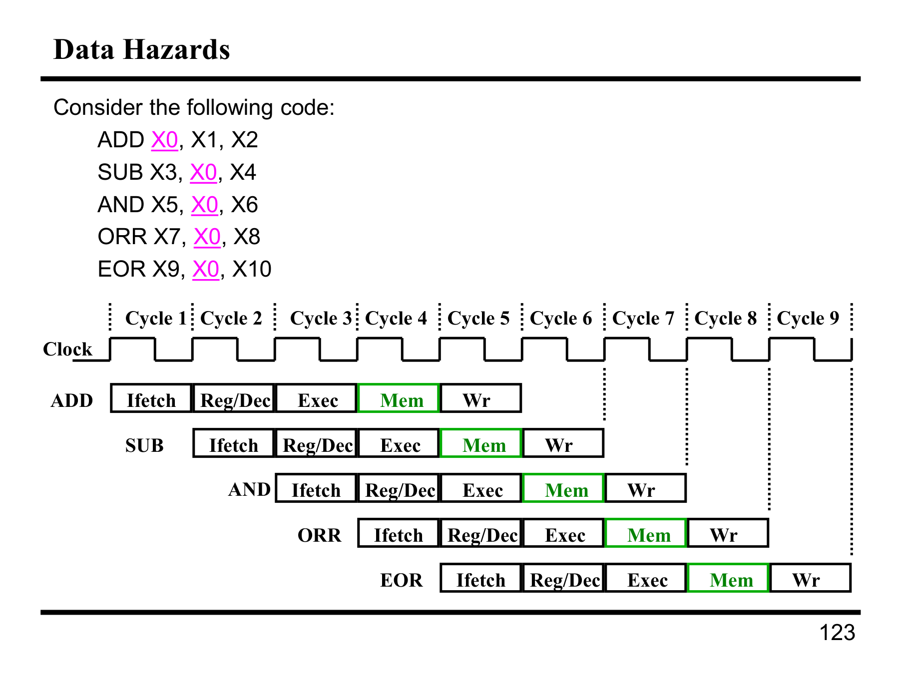

---

## 第 1 页


这是用“洗衣流程”来直观解释\*\*流水线（pipelining）\*\*的概念。

# 场景

* 有 4 袋衣服：A、B、C、D（Ann、Brian、Cathy、Dave 各一袋）。
* 每袋都要依次经过 3 个步骤：**洗**、**烘干**、**折叠**。
* 用时：洗衣机 30 分钟；烘干机 40 分钟；折叠 20 分钟。

# 两种做法

## 1) 串行（不流水）

一袋做完三步再做下一袋。

* 单袋延迟 = 30+40+20 = **90 分钟**。
* 做完 4 袋总时间 = 4×90 = **360 分钟（6 小时）**。
* 吞吐率 = 每 90 分钟出一袋。

## 2) 流水线（重叠进行）

三步像三段“产线”，前后相邻可以并行处理不同批次：

* **瓶颈/节拍**：由最慢的阶段决定，这里烘干 40 分钟 ⇒ **40 分钟/袋**（稳态）。
* 第一袋依然要走完三步，**首件延迟**仍是 90 分钟；之后每 **40 分钟**又完成一袋。

具体时间表（起点 t=0）：

* A：洗 0–30 → 干 30–70 → 折 70–90 → **完成 90**
* B：洗 30–60 → 干 70–110 → 折 110–130 → **完成 130**
* C：洗 60–90 → 干 110–150 → 折 150–170 → **完成 170**
* D：洗 90–120 → 干 150–190 → 折 190–210 → **完成 210**

⇒ 4 袋总时间 **210 分钟（3.5 小时）**。
与串行相比的**加速比** = 360/210 ≈ **1.71×**。
当袋数很多时，理论极限加速比 → (30+40+20)/max(30,40,20) = **90/40 = 2.25×**。

# 关键概念对照

* **阶段（stage）**：洗/干/折，对应处理器的 IF/EX/MEM 等。
* **节拍/周期时间（cycle time）**：由**最慢阶段**决定（40 分钟）——处理器里也由最慢的流水段决定频率。
* **吞吐量**：稳态每 40 分钟出一袋；处理器里是“每拍完成一条指令”的理想。
* **延迟（latency）**：单件仍需 90 分钟；在 CPU 里单条指令仍要穿过所有段。
* **资源利用率**（做 4 袋）：

* 洗衣机：120/210 ≈ 57%
* 烘干机：160/210 ≈ 76%（瓶颈，最忙）
* 折叠：80/210 ≈ 38%

# 怎么更快？

* **消除瓶颈**：比如加一台烘干机或把烘干拆成两段，使最慢阶段时间下降；
若把节拍降到 30 分钟，则极限加速比变为 90/30 = **3×**。

这张幻灯片就是用家务类比说明：流水线通过**分段并行**提升**吞吐量**，但**首件延迟不变**且会受**最慢阶段**限制。


---

## 第 2 页


这页讲的是**串行做洗衣**的时间线，并问：“如果用**流水线**做，要多久？”

# 串行（Sequential）

* 每袋依次：洗 30 分钟 → 烘 40 → 折 20 = **90 分钟/袋**
* 4 袋顺序做：**4 × 90 = 360 分钟 = 6 小时**（图上从 6pm 到午夜）

# 如果学会流水线（Pipelining）

把三步当作三段产线并行处理，不同袋子在不同段上同时进行。

* **首袋延迟**：仍需 30+40+20 = **90 分钟** 才完成第一袋
* **节拍（瓶颈）**：最慢阶段=烘干 40 分钟 ⇒ 之后**每 40 分钟**再出一袋
* **总时间公式**（N 袋）：

* 串行：$T_{\text{seq}} = N \times (30+40+20) = 90N$
* 流水：$T_{\text{pipe}} = 90 + (N-1)\times 40$

代入 N=4：

* $T_{\text{pipe}} = 90 + 3\times40 = 210$ 分钟 = **3 小时 30 分**。

**结论：**
学会流水线后，4 袋从 6 小时降到 **3.5 小时**；第一袋仍在 90 分钟完成，此后每 40 分钟完成一袋。


---

## 第 3 页


这页是在把“洗衣流水线”画成**时间轴**，展示**按最早可行（ASAP）启动**各步骤后，4 袋衣服总共只需 **3.5 小时（210 分钟）**。

# 图怎么读

* 横轴时间从 6PM 开始。
* 每袋要依次经历：**洗 30 分钟 → 烘 40 分钟 → 折 20 分钟**。
* 同一时刻，不同袋子可以在不同阶段上**并行**（洗/烘/折三条“产线”）。

# ASAP 调度要点

* **A** 在 6:00 开洗，6:30 立刻转烘；烘到 7:10，再立刻去折到 7:30（= 90 分钟完成）。
* **B** 在 6:30（洗衣机刚空）立刻开洗；7:10 接着烘；7:50 折，到 **8:10** 完成。
* **C** 在 7:00 开洗；7:40 烘；8:20 折，到 **8:40** 完成。
* **D** 在 7:30 开洗；8:10 烘；8:50 折，到 **9:10** 完成。

因此完成时刻：**7:30, 8:10, 8:40, 9:10**。总历时 **210 分钟 = 3.5 小时**。

# 关键结论

* **首件延迟**仍是 90 分钟（30+40+20）。
* **节拍/瓶颈**由最慢阶段决定：烘干 40 分钟 ⇒ 首件之后**每 40 分钟**再出一袋。
* **总时间公式（N 袋）**：

$$
T_{\text{pipe}}=（30+40+20）+（N-1）\times 40=90+40(N-1)
$$

代入 N=4 得 **210 分钟**。
* **对比串行**：串行要 4×90=360 分钟（6 小时），流水线把总时长降到 **3.5 小时**，加速比 ≈ **1.71×**。

这正是 CPU 流水线的直觉版：把任务分段并行，**吞吐量**提升（每 40 分钟出一件），但**单件延迟**不变，并且整体速度受**最慢阶段**限制。


---

## 第 4 页


这页总结“流水线”的关键要点，用洗衣例子把 CPU 原理说清楚。

# 这张图在说什么（结合数值 30/40/20）

* **提升吞吐量，不降单件延迟**
A 袋仍要 30+40+20=**90 分钟**（延迟不变），但在稳态下**每 40 分钟**再完成一袋（吞吐量↑）。

* **速度由最慢阶段决定**
最慢是烘干 **40 分钟** ⇒ 流水线节拍=40 分钟/袋。
CPU 里同理：时钟周期受最慢阶段/关键路径限制。

* **多个任务同时用不同资源**
同一时刻：有人在洗、有人在烘、有人在折。
CPU 里：不同指令位于 IF/RF/EX/MEM/WB 不同段并行执行。

* **理论加速上限 ≈ 阶段数**
3 段理想上限 **3×**；
但更准确的极限是 $\text{Speedup}_{\infty}=\dfrac{\text{总阶段时间}}{\text{最慢阶段时间}}=\dfrac{30+40+20}{40}=**2.25×**$（阶段不等长会低于“段数”）。

* **阶段不平衡会降速**
40 分钟那段拖慢整体；若把烘干分成两段各 20 分钟或加一台烘干机，节拍可降到 30 分钟，加速上限变为 $90/30=3×$。

* **填充/清空的开销**
需要时间把流水线**灌满**和**排空**：
$T_{\text{pipe}} = \text{首件延迟} + (N-1)\times\text{节拍}$
这里 $=90+40(N-1)$。
对 4 袋：$=210$ 分钟 ⇒ 相比串行 $360$ 分钟，实际加速 **1.71×**，低于极限 2.25×。

* **因依赖而停顿（Stall for Dependences）**
如果下一步必须等上一步结果（烘干机没空/衣服没干），就会**停顿**。
CPU 里对应**数据/控制冒险**：需要前递、插入气泡或预测/刷新来化解。

# 类比到处理器

* 洗/烘/折 ⇔ IF/EX/MEM（或五段 IF–ID–EX–MEM–WB）。
* 最慢段定周期；段长不均衡、填充/清空、以及依赖（数据/分支）都会让实际加速低于理想值。


---

## 第 5 页


这页图叫 **Pipelined Execution（流水化执行）**，把多条指令在五个阶段中**交错并行**的时间表画出来。

# 怎么读这张图

* 横轴是**时间**；纵向一行行是**顺序的不同指令**（程序流向下）。
* 每条指令依次经过 5 段：
**IFetch**（取指）→ **Dcd**（Decode/寄存器读）→ **Exec**（ALU/分支计算）→ **Mem**（访存）→ **WB**（回写）。
* 你能看到：第1条在 `Dcd` 时，第2条已经开始 `IFetch`；等第1条到 `Exec`，第2条在 `Dcd`，第3条在 `IFetch`……像“洗衣流水线”一样**不同指令同时占用不同阶段**。

# 关键结论

* **首件延迟**=阶段数个周期：5 段 ⇒ 第一条指令要到第 **5 个周期**才完成（WB）。
* **稳态吞吐量**≈ 每周期完成一条指令（理想 **CPI≈1**），因为每个周期末都会有一条到 WB。
* **总周期数公式**（理想、无停顿）：

$$
\text{cycles} = \text{pipeline\_depth} + (N-1)
= 5 + (N-1)
$$

第一个 5 是“填满流水线”的代价，其余每条只再多 1 个周期。

# 各阶段含义小抄

* **IFetch**：用 PC 从指令存储器取指。
* **Dcd**：译码、读寄存器、生成控制信号。
* **Exec**：ALU 计算/有效地址计算/分支条件判断。
* **Mem**：对 `lw/sw` 等进行数据存取。
* **WB**：把结果写回寄存器堆。

# “Now we just have to make it work” 在暗示什么？

要让这张理想时间表**真的跑得动**，硬件需处理各种**冒险**：

* **数据冒险**：后一条用到前一条的结果 ⇒ 需要**前递/旁路（forwarding）**，否则**插入气泡（stall）**。
* **控制冒险**：分支/跳转直到 `Exec` 才知道方向 ⇒ 可能要**预测**或\*\*冲刷（flush）\*\*已取的错误指令。
* **结构冒险**：资源冲突（比如指令/数据存储器共享） ⇒ 通过资源复制或调度避免。
* **节拍决定**：时钟周期由**最慢阶段**限定，阶段不均衡会降低频率与效率。

把这些机制补齐，现实中的执行就能尽量接近图里“每拍一条”的理想效果。


---

## 第 6 页


这页在对比**单周期**实现和**流水线**实现的执行时序，解释为什么流水线吞吐量更高。

# 单周期（Single Cycle）

* **一条指令**必须在**一个超长时钟周期**里完成：取指→译码/读寄存器→执行→访存→回写。
* **周期必须按最慢/最复杂指令（通常是 `load`）来定**，所以时钟很慢。
* 比如图上：Cycle 1 用来执行 `Load`；Cycle 2 执行 `Store`。

* `Store` 不需要回写（WB），但周期长度仍按 `Load` 的最坏路径来定，后半截就**浪费**了（图中 “Waste”）。
* **后果**：吞吐量低（每个长周期最多完成1条指令），很多指令在大部分时间里在“等钟”。

# 流水线（Pipeline）

把指令拆成 5 段：**IFetch → Reg(Dcd) → Exec → Mem → Wr**，在**多个短周期**里交错进行。

* **时钟周期**只需覆盖**单个阶段**的延迟（≈最慢阶段+流水寄存器开销），能比单周期短很多。
* 同一时间，不同指令占用不同阶段：

* `Load`：IF → Reg → Exec → **Mem** → **Wr**
* `Store`：IF → Reg → Exec → **Mem**（**无 Wr**）
* `R-type`（算术/逻辑）：IF → Reg → **Exec** → （无 Mem）→ **Wr**
* 图下半部展示：当 `Load` 在 Mem 时，`Store` 正在 Exec，`R-type` 在 Reg 或 IF……流水“灌满”后**几乎每个短周期都会有一条指令完成（理想 CPI≈1）**。

# 对比小结

* **单条指令延迟**：两者差不多都要穿过全部阶段（流水有首件延迟）；
* **吞吐量**：

* 单周期：1 指令 /（长周期）
* 流水线：≈ 1 指令 /（短周期），稳态每拍一条
* **时钟频率**：单周期由**最坏路径**限制；流水线由**最慢阶段**限制（通常更快）。
* **效率**：单周期对简单指令有大量**周期空闲（waste）**；流水线把这些空闲变成其他指令的有效工作。
* **现实注意**：流水线还要处理**冒险**（数据、控制、结构）和**填充/排空**成本，但总体吞吐量提升显著。

这就是为什么现代处理器几乎都采用流水线：把“一个长活”拆成“多段短活”，并行叠起来跑。


---

## 第 7 页


这页在用数字比较**单周期机**与**理想5级流水线**执行 100 条指令所需时间。

已给条件：

* 单周期机：**45 ns/周期**，CPI=1
* 理想流水线：**10 ns/周期**，CPI≈1，**5 级** ⇒ 需额外 **4 个周期**（填充/排空开销）

计算：

* 单周期机时间
$45\ \text{ns/cycle} \times 1\ \text{CPI} \times 100\ \text{inst} = \mathbf{4500\ ns}$

* 理想流水线时间
$10\ \text{ns/cycle} \times (1\ \text{CPI} \times 100\ \text{inst} + 4\ \text{drain})$
$= 10 \times (100+4) = \mathbf{1040\ ns}$

* 加速比
$4500/1040 \approx \mathbf{4.33\times}$（时间减少约 **76.9%**）

要点：

* 公式一般为：$\text{Time} = t_\text{clk} \times (\text{CPI}\times N + (k-1))$，
其中 $k$ 为流水深度（这里 5），$k-1$ 是“填充/排空”额外周期。
* 这里把冒险、气泡、前递开销等都忽略了，所以称“理想”流水线。


---

## 第 8 页


这页讲\*\*流水线处理器的 CPI（每条指令平均所需周期）**如何由**停顿（stalls）\*\*决定，并给了一个计算练习。

# 核心点

* 在理想单发射流水线里，**基准 CPI = 1**（稳态每拍发一条）。
* 真机会因**分支**、**load-use 相关**等产生**气泡** → 不能发新指令 → **额外周期**叠加到 CPI 上。
* 近似模型（忽略填充/排空与指令本身延迟）：

$$
\text{CPI} \approx 1 + \sum_i (\text{指令占比}_i \times \text{每条指令的停顿周期}_i)
$$

# 例题

> “每条 **branch** 都浪费 2 个周期；每条 **load** 之后浪费 1 个周期；程序中 **10%** 是分支，**30%** 是 load。求 CPI（忽略填充/排空）？”

套公式：

$$
\text{CPI} = 1 + 0.10\times2 + 0.30\times1 = 1 + 0.20 + 0.30 = \boxed{1.5}
$$

若时钟为 10 ns、执行 100 条指令（仍忽略填充/排空），总时间

$$
100\times 1.5 \text{ cycles} \times 10\text{ ns} = \boxed{1500\ \text{ns}}
$$

# 小结

* 流水线的 CPI 本质是**发射速率**受停顿惩罚的结果。
* 降低 CPI 的方法：提高分支预测、前递/旁路、缩短 load-use 间隙、或让更多指令并发发射（超标量）。


---

## 第 9 页


这页把“CPU 五级流水线的数据通路”画完整了，并强调了**流水寄存器**与**前递（forwarding）**。

# 五个阶段与主要器件

从左到右对应一次指令的路径：

1. **IF 取指**：PC → **Instr. Memory（指令存储器）** 读出指令。
2. **RF 寄存器读/译码**：**Register File** 读出源寄存器。
3. **EX 执行**：ALU/地址计算（图中三角/菱形+多路复用器）。
4. **MEM 访存**：**Data Memory** 读/写数据（lw/sw）。
5. **WB 回写**：把 ALU 结果或数据存储器读回的数据写回 **Register File**。

# 关键新增：流水寄存器（灰色竖条）

* 每两段之间都有一个**寄存器墙**：**IF/ID、ID/EX、EX/MEM、MEM/WB**。
* 作用：

* **锁存**上段输出的**数据与控制信号**，在下一个时钟周期交给下段；
* **切断组合路径**，让时钟周期只需覆盖“单段延迟+寄存器开销”；
* 为并行执行提供边界：不同指令在不同段里互不干扰。

# 细线回路：前递/旁路（Forwarding）

* 图中从 **EX/MEM/MEM/WB** 向回折返的细箭头，就是把已算好的结果**直接送回 EX 的输入**，不用等到 WB 再读寄存器。
* 目的：化解**数据冒险（RAW）**，减少停顿；仍有个别情形（如 `lw` 之后紧跟使用）需要 **stall** 一拍。

# 为什么右边又画了一个 Register File？

* 表示 **WB 阶段**对寄存器堆的**写操作**；同一个寄存器堆在图中“读”和“写”分属不同阶段，所以分别画在 RF 与 WB 位置。

# 细节提示

* **指令/数据存储器分离（Harvard）**：避免 IF 与 MEM 抢同一存储器导致结构冒险。
* **控制信号流动**：译码产生的控制位（如是否写回/是否访存/ALU 操作码）要随同数据一起穿过各级流水寄存器。
* **分支处理**：通常在 EX 决策方向；若取错要在 IF/ID 处**flush**，或用预测减少损失。
* **时钟周期由最慢阶段决定**（再加寄存器建立/保持与时钟偏移开销）。

# 一句话总结

这张图把**单周期的数据通路**切成 IF–RF–EX–MEM–WB 五段，并在段间加入**流水寄存器**与**前递路径**，使得多条指令可以在不同阶段**并行推进**，稳态下达到**每拍一条**的高吞吐量，同时通过前递/冲刷/停顿来正确处理冒险。


---

## 第 10 页


这页讲**流水线中的控制信号怎么“跟着指令一起被流水”**。

# 大意

* **控制单元（Main Control）在 Reg/Dec（译码/寄存器读）阶段产生本条指令需要的全部控制信号**：
例如 `ALUSrc、ALUOp、MemWE、Mem2Reg、RegWE` 等。
* 但这些信号**不是立刻用**，而是要在**后续的对应阶段**才起作用，所以必须**被锁存在阶段间的流水寄存器里**，随着这条指令一起往右传。

# 时间关系（图中颜色=到达该阶段时仍随指令“活着”的信号）

* 到 **Exec** 才用的信号（蓝色）→ 相对译码 **晚 1 拍**：

* `ALUSrc`（ALU 输入来自寄存器还是立即数）
* `ALUOp`（ALU 功能）
* 到 **Mem** 才用的信号（绿色）→ **晚 2 拍**：

* `MemWE`（数据存储器写使能，区分 `sw` 与非写）
* `Mem2Reg`（是否把存储器读出的数据写回寄存器，用于 `lw`）
* 到 **Wr（回写）** 才用的信号（红色）→ **晚 3 拍**：

* `RegWE`（寄存器堆写使能，区分需要写回与不写回的指令）

# 为什么要这样做？

* **同一时刻流水线上有多条指令**：每条指令的控制信号只对**那一条**有效，必须与其**数据一路同步移动**；
* 阶段寄存器（IF/ID、ID/EX、EX/MEM、MEM/WB）不仅存**数据**，还存**控制位**，防止不同指令的控制相互串扰。

# 气泡/冲刷如何处理控制？

* **Stall（停顿/插入气泡）**：把某一级的**控制位置零**（如 `RegWE=0，MemWE=0`），相当于在该级注入一条“空操作（NOP）”；同时冻结上游寄存器使指令不前进。
* **Flush（冲刷）**：例如分支错误取指，清空 IF/ID 或 ID/EX 的控制位为 0，确保被冲刷的指令在后级**不写寄存器、不写内存**。
* **安全原则**：遇到不确定就**禁写**（尤其是 `MemWE` 和 `RegWE`），避免误写状态。

# 小结（口诀）

* **译码时全生成，阶段到时才生效**。
* **控制随指令过墙（经流水寄存器）**：

* Exec 用的一拍后到，
* Mem 用的两拍后到，
* Wr 用的三拍后到。
* **遇冒险**：冻结/清零控制，制造 NOP 或冲刷，保证正确性。


---

## 第 11 页


这页在回答：**流水线会带来什么麻烦？——会：流水线冒险（Pipeline Hazards）**
分三类，对应洗衣类比与CPU里的真实问题：

# 1) 结构冒险（Structural Hazards）

**含义**：不同阶段**同时争用同一硬件资源**。

* 洗衣类比：只有一台“洗烘一体机”，A 想洗、B 想烘会冲突；或“折衣的人去看电视”，资源没空。
* CPU 对应：指令存储器与数据存储器共用一个端口；或只有一套乘法器。
* **解决**：复制/分离资源（指令/数据分离的 Harvard 结构、双端口存储器）、调度或插入**stall**。

# 2) 数据冒险（Data Hazards）

**含义**：后一条指令**太早需要**前一条的结果（还没准备好）。

* 洗衣类比：一双袜子一只在烘干、一只在洗衣机里；或“要折衣服必须等烘干出的这批”。
* CPU 对应：RAW（Read-After-Write）最常见，例：

```
add  r1, r2, r3   # 产生 r1
sub  r4, r1, r5   # 立刻要用 r1
```
* **解决**：

* **前递/旁路（forwarding）**：把 EX/MEM 的结果直接喂回 EX 输入；
* **插入气泡（stall）**：如 `lw` 后紧跟用其结果的典型 load-use 冲突，需停 1 拍；
* 编译器重排指令（填“延迟槽”）。

# 3) 控制冒险（Control Hazards）

**含义**：在知道分支方向**之前**，取哪条指令不确定。

* 洗衣类比：要不要加更多洗涤剂，要看“烘干后实际效果”，在此之前无法决定下一步。
* CPU 对应：`beq/bne/jump` 等分支直到 EX 才确定；IF 阶段可能取错路。
* **解决**：

* **分支预测**（静态/动态+BTB）；
* 提前计算分支（提早比较/目标生成）；
* 取错就**flush**（冲刷）已取的指令，代价是若干周期。

# 通用处理策略

* **检测（detect）**：硬件的 hazard 单元在 ID/EX 等级检查寄存器号/类型/资源使用。
* **等待（wait）/动作**：必要时冻结上游流水寄存器、向下游注入 NOP（控制位清零），或选择前递路径。
* **CPI 影响**：

$$
\text{CPI} \approx 1 + \sum (\text{指令占比} \times \text{平均停顿周期})
$$

冒险越多或代价越大，CPI 越高。

**一句话**：流水线把吞吐量提上去，但必须用资源复制/前递/预测/停顿等机制处理**结构、数据、控制**三大冒险，才能既“快”又“对”。


---

## 第 12 页


这页用 **LDUR（load）指令**示范：在 5 级流水线里，**每一拍**不同的功能部件各干各的活，于是多条 `LDUR` 可以**重叠执行**。

# 5 个独立功能部件（各对应一个阶段）

* **IFetch**：指令存储器（取指）
* **Reg/Dec**：寄存器堆的**读端口**（读源寄存器、译码）
* **Exec**：ALU（做地址计算：基址 + 位移）
* **Mem**：数据存储器（读出内存数据）
* **Wr**：寄存器堆的**写端口**（把读到的数据写回目标寄存器）

# 时间表怎么读（以 3 条连续 `LDUR` 为例）

* **第1条**：Cycle1 IF → Cycle2 Reg → Cycle3 Exec → Cycle4 Mem → **Cycle5 Wr（完成）**
* **第2条**：下一拍开始，同步右移一格：Cycle2 IF … **Cycle6 Wr（完成）**
* **第3条**：再下一拍开始：… **Cycle7 Wr（完成）**
⇒ 灌满后**每拍完成一条**（理想 CPI≈1），完成时刻分别在 **5、6、7** 拍末。

# 为何能并行？

* 各阶段用的是**不同硬件资源**（取指器件、寄存器读口、ALU、数据存储器、寄存器写口），同一拍互不争用，避免结构冒险；
* 阶段之间有**流水寄存器**锁存中间结果与控制信号。

# 关于数据何时可用（决定是否要停顿）

* `LDUR` 的**数据**在 **Mem** 阶段末才读出，**下一拍**的 **Wr** 才能写回寄存器堆。
* 因此：若紧接着的一条指令在其 **Exec** 阶段就需要这份数据（典型 **load-use** 相关），**前递也来不及**，需要**停 1 拍（插入 NOP）**；再后一条就能用到（或编译器可重排一条无关指令来填空）。

# 小结

* 图里展示的是“理想重叠”：第1条在 Mem 时，第2条在 Exec，第3条在 Reg，第4条在 IF。
* 实际机器仍要处理：

* **load-use** → 1 拍 stall；
* 分支错取 → flush 若干拍；
* 阶段不均衡决定周期时间。

这页的核心就是：把 `LDUR` 拆到 **IF/ID/EX/MEM/WB** 五段后，多条 `LDUR` 可以像传送带一样排队推进，稳态“每拍一条”，但紧随其后的相关指令可能需等 1 拍。


---

## 第 13 页


这是在讲“R-type（寄存器-寄存器）指令”的**四个执行阶段**。R 型指令像 `add $t0,$t1,$t2`、`sub`、`and` 等，数据都来自寄存器，结果也写回寄存器。图里把一条 R 型指令拆成 4 个时钟周期（Cycle 1\~4），每个周期完成一个阶段：

1. **Ifetch（取指）**

* 用 PC（程序计数器）到**指令存储器**里把指令取出来。
* 同时通常会计算 `PC + 4` 作为下一条指令的地址（除非分支/跳转改变了它）。

2. **Reg/Dec（寄存器读/指令译码）**

* **译码**：根据指令各字段（如 `opcode`、`rs`、`rt`、`rd`、`funct`）生成控制信号，确定这是哪类操作。
* **读寄存器**：从寄存器堆里把两个源操作数读出来（由 `rs`、`rt` 指定）。

3. **Exec（执行/运算）**

* 把上一步读到的两个操作数送进 **ALU**。
* 根据 `funct` 字段（因为是 R 型）选择具体的运算：加、减、与、或、异或、比较、移位等。
* 得到**运算结果**（以及可能的标志位，比如零标志）。

4. **Wr（写回）**

* 把 ALU 的结果**写回寄存器堆**的目标寄存器 `rd`。
* 写回发生在该周期末，以保证前面阶段的数据稳定。

### 怎么理解图上的时间轴

* 下方的方块 “Ifetch → Reg/Dec → Exec → Wr” 对应上方的四个时钟脉冲（Cycle1\~4）。
* 意味着在**多周期实现**里，一条 R 型指令要走完 4 个周期才完成。
* 在**流水线实现**里，这四个阶段会成为四（或五）个流水级，多条指令可以在不同级上“并行”流动；但对**单条指令**本身，它仍然是按这四步完成。

### 用个具体例子（`add $t0,$t1,$t2`）

* **Cycle 1**：取到 `add` 指令；PC 准备好 `PC+4`。
* **Cycle 2**：译码得知是 R 型加法；从寄存器 `$t1`、`$t2` 读出数值。
* **Cycle 3**：ALU 计算 `$t1 + $t2`。
* **Cycle 4**：把结果写回 `$t0`。

### 额外说明

* R 型不访问数据存储器，所以没有 “Memory（访存）” 阶段；而像 `lw`/`sw` 这类会多一个访存阶段。
* 把执行分阶段有两个目的：

1. **缩短单级的组合延迟**，让时钟频率更高；
2. **资源复用**（比如同一块 ALU 在不同周期做不同事），从而降低硬件成本。

总之，这张图就是在告诉你：R 型指令的生命线是“**取指 → 译码/读寄存器 → ALU 运算 → 写回寄存器**”，每步占一个时钟周期。


---

## 第 14 页


这页在讲**结构冒险（Structural Hazard）**：当两条（或多条）指令在**同一个时钟周期**里需要**同一块硬件资源**，而这块资源只有一份时，就发生结构冲突，流水线必须停一下（插气泡）或增加硬件端口来化解。

### 图里发生了什么

* 采用的是“多周期/类流水”执行模型：

* **R-type** 指令流程：`Ifetch → Reg/Dec → Exec → Wr`（写回在**开始后第 4 个周期**）。
* **Load** 指令流程：`Ifetch → Reg/Dec → Exec → Mem → Wr`（多一个 **Mem**，写回在**开始后第 5 个周期**）。
* 每个周期都发射一条新指令，于是不同指令的阶段会**重叠**。

看时间线上这组例子（Cycle1\~9）：

* 第 1 条 **R-type**：在 **Cycle4** 进行 **Wr**。
* 第 2 条 **R-type**：在 **Cycle5** 进行 **Wr**。
* 第 3 条 **Load**：在 **Cycle6** 做 **Mem**，在 **Cycle7** 做 **Wr**。
* 第 4 条 **R-type**：在 **Cycle7** 也要 **Wr**。
→ 所以在 **Cycle7**，**Load 与 R-type 同时要写回寄存器堆**，而寄存器堆通常只有**一个写口**，这就造成了**结构冒险（写回端口冲突）**。这也正是标题里说的“R-type 和 load 的交互导致写回阶段的结构冒险”。

> 一般规律：
> R-type 的写回发生在“开始 +3 周期”；Load 的写回发生在“开始 +4 周期”。
> 当某条 **Load 比某条 R-type 早开始 1 个周期**时，它们会在同一个周期写回（如图中 Load 从 Cycle3 开始，后面的 R-type 从 Cycle4 开始，二者都在 Cycle7 写回）。

### 怎么解决

常见办法有三类（选其一或组合）：

1. **停顿/插气泡（stall）**
在译码阶段检测到“即将出现两个同时写回”的情况，就**让后发的那条指令等一个周期**，错开写回时间。
2. **增加硬件带宽**
给寄存器堆**增加第二个写端口**（或写端口仲裁+缓冲），让两个写回能并行完成。成本更高。
3. **改变写回时序/调度**

* 让不同类型指令在**不同半个时钟周期**写回（如 R-type 在上半拍写、Load 在下半拍写）；
* 或者由**编译器/手工调度**把可能冲突的指令间插入独立指令，避免同周期写回。

### 和数据冒险的区别

这里冲突发生的**原因是“资源只有一份”**（写回端口），与操作数是否准备好无关；而**数据冒险**是“前一条指令的结果尚未可用，下一条已经需要用到”。图中强调的是**结构**而不是**数据**问题。

总结：这张图展示了当流水中同时存在 **R-type** 与 **Load** 时，**写回阶段**会在某些周期重叠，从而对“**寄存器堆的写端口**”造成**结构冒险**；解决要么**停一下**，要么**加端口**，要么**改时序/调度**来错开。


---

## 第 15 页


这页在强调一个**关键设计原则**并给出化解结构冒险的办法。

### 关键观察（Important Observation）

1. **每个功能部件（functional unit）对一条指令只能用一次。**
例如“寄存器堆的**写端口**”对一条指令只在“写回”那一次被用到。

2. **同一种功能部件应当在所有指令的同一个流水级被使用。**
这样流水线才能简单、稳定地分配资源，不会在不同指令的不同级上抢同一资源。

* 在原来的多周期/流水划分里：

* **Load** 的阶段是：`Ifetch → Reg/Dec → Exec → Mem → Wr`，它在**第 5 级**用到“寄存器堆写端口”。
* **R-type** 的阶段是：`Ifetch → Reg/Dec → Exec → Wr`，它在**第 4 级**就用到“寄存器堆写端口”。
* 结果：当一条 Load 与后一条 R-type 重叠执行时，可能出现**同一拍（同一个时钟周期）两个指令都要写寄存器**（前一条 R-type 的第 4 级与后一条 Load 的第 5 级、或相反组合），引发**写回端口的结构冒险**。

### 解决思路

**把 R-type 的写回延后 1 个周期**，让它也在**第 5 级**写回。
具体做法：给 R-type 在第 4 级插入一个**Mem 级的“空操作（NOOP）”**，什么都不做，只是占一个周期；然后在第 5 级统一写回。

* 调整后：

* Load：`IF → ID → EX → MEM → WR`（写回在 Stage 5）
* R-type：`IF → ID → EX → MEM(空) → WR`（写回也在 Stage 5）

### 好处

* **消除写回端口冲突**：所有指令都只在**Stage 5**使用“寄存器堆写端口”，不会出现某些在 4、某些在 5 的错位。
* **控制逻辑更简单**：每一级要用的硬件固定，转发/旁路与检测逻辑也更容易统一设计。
* **不需要给寄存器堆加第二个写口**（节省面积和功耗）。

### 代价与影响

* **R-type 的单条指令时延 +1 个周期**（多了一个空的 MEM 级）。
* **吞吐量不一定下降**：由于避免频繁的结构停顿（stalls），在长程序/有并行重叠的流水中，整体吞吐反而可能更好、更稳定。
* 可替代方案是：给寄存器堆增加**第二个写端口**或采用**半周期写回分时**；但这会提高硬件成本或时序复杂度。

### 小结

把“写回”对齐到同一流水级（Stage 5）是为了遵循“**同一功能部件应在所有指令的同一阶段使用**”这一原则。为此给 R-type 添加一个**NOOP 的 MEM 级**，就能统一资源使用时刻，从而**消除结构冒险**、简化设计。


---

## 第 16 页


这页是在把前一页的结论**落到流水线时序上**：
把 **R-type** 指令的写回（Wr）统一放到**第 5 级**，中间插入一个**Mem 级（对 R-type 是空操作 NOOP）**，从而与 **Load** 一样都在 Stage 5 用“寄存器堆写端口”。图中用绿色标出 R-type 的 **Mem**（空）阶段。

### 这张图具体表达了什么

* **统一的 5 级流水**：`IF → ID → EX → MEM → WB`

* Load：`MEM` 是真正的**数据存取**；
* R-type：`MEM` 是**占位的空级**（不做事，只是把写回顺延到下一级）。
* **每拍发一条指令**，不同指令在不同级上**重叠**执行。
第一条 R-type：

* C1 IF，C2 ID，C3 EX，**C4 MEM(空)**，C5 WB。
第二条 R-type：
* 从 C2 开始，C6 WB。
第三条 Load：
* 从 C3 开始，C7 WB。
后面两条 R-type：
* 依次推进，分别在 C8、C9 WB。
* **关键效果**：**所有指令都只在 Stage 5（WB）写寄存器**，因此不会再出现“R-type 在第 4 级写、Load 在第 5 级写”造成的写端口**结构冒险**。

### 时序与性能直观

* **流水线填充/排空**：前几拍在“填充”各级，最后几拍在“排空”。
* **延迟（Latency）**：R-type 单条指令需要 **5 个周期**（比原来 4 个多 1，因为插入了空的 MEM）。
* **吞吐（Throughput）**：在稳态下仍可做到**每拍完成一条指令**（没有结构停顿），因此总体吞吐并不差，甚至优于经常因冲突而停顿的设计。

### 还需要注意

* 这张图只解决了**结构冒险（写回端口冲突）**；
* **数据冒险**（如读到前一条尚未写回的结果）和**控制冒险**（分支）依然需要**转发/旁路、插入气泡或分支预测**等机制处理，这里没有展开。

**小结**：通过给 R-type 加一个“空的 MEM 级”，把所有指令的**写回统一到第 5 级**，流水线就能稳定地每拍推进、避免写端口的结构冒险；代价是 R-type 的指令延迟 +1 周期。


---

## 第 17 页


这页在说明 **Store（存储，例：`sw $t0, offset($t1)`）** 指令在 5 级流水中的阶段划分，以及为什么 **Wr（写回）级是 NOOP**。

### Store 的 5 个阶段

1. **Ifetch（取指）**
从指令存储器取出 `sw` 指令，同时 PC 前移。

2. **Reg/Dec（译码/读寄存器）**

* 译码得知是 Store。
* 从寄存器堆读取两个源寄存器：

* **基址寄存器**（如 `$t1`），用于地址计算；
* **待写入的数据寄存器**（如 `$t0`）。

3. **Exec（执行/地址计算）**
用 ALU 计算有效地址：`addr = base + offset`。

4. **Mem（访存）**
访问**数据存储器**，在地址 `addr` 处**写入**从寄存器读来的数据。

5. **Wr（写回）= NOOP**
Store 不产生寄存器结果，所以**不需要写回寄存器堆**。为了与统一的 5 级流水（`IF→ID→EX→MEM→WB`）对齐，这里保留一个占位的 **WB 级**，但**什么也不做**（NOOP）。

### 为什么这样划分“兼容”Load & R-type？

* 前面已经把 **R-type** 的写回延后到**第 5 级**（WB），并让 **Load** 也在第 5 级写回寄存器堆。
* **Store** 在第 4 级使用**数据存储器**，第 5 级不占用写回端口。
* 于是**寄存器堆的写端口**只会在**Stage 5**被使用（仅被 Load / R-type 使用），避免与 Store 发生结构冒险；而**数据存储器端口**只在**Stage 4**被占用（Load 读或 Store 写），每拍只有一条指令在 MEM 级，因此也不会彼此冲突。

### 与冒险的关系（提示）

* **结构冒险**：

* 寄存器堆写口：Store 不用 WB，天然不会与 Load/R-type 在第 5 级冲突。
* 数据存储器端口：Load/Store 都在第 4 级访问，但同一拍只有“当前处于 MEM 级”的那一条在用，不会抢同一端口。
* **数据冒险**：

* 若 Store 要写入的数据来自前一条 ALU/Load 的结果，必须依赖**转发（forwarding）**或**插入气泡**，确保在第 4 级时数据已到位。

**小结**：Store 的流程是 `IF → ID → EX(算地址) → MEM(写内存) → WB(空)`。把 WB 设为 NOOP 只是为了保持统一 5 级流水的节奏，与 Load、R-type 完全对齐，从而简化控制并避免结构冒险。


---

## 第 18 页


这页在讲**条件分支指令**（如 `beq rs, rt, label`）在统一 5 级流水（`IF → ID → EX → MEM → WB`）中的分解，以及它带来的**控制冒险**特性。

### 分成哪些阶段？

1. **Ifetch（取指）**
从指令存储器取到这条分支指令，同时准备 `PC+4`。

2. **Reg/Dec（读寄存器/译码）**

* 读出比较用的两个寄存器 `rs`、`rt`。
* **计算分支目标地址**：`target = PC+4 + (imm << 2)`（先把目标算好，等判断结果一出来就能更新 PC）。

3. **Exec（执行判定并更新 PC）**

* 比较 `rs` 与 `rt` 是否满足条件（等于、不等于等）。
* **根据比较结果选择 PC**：若条件成立，将 PC 更新为 `target`；否则继续顺序执行（`PC = PC+4`）。

> 注意：本设计把“是否跳转”的**判决点放在 EX 级**。

4. **Mem（NOOP）**
分支指令不访问数据存储器，这一级只是占位，什么都不做。

5. **Wr（NOOP）**
分支不产生寄存器结果，也不写回寄存器堆，这一级同样是占位以保持统一的 5 级节拍。

### 为什么要把 MEM、WB 设为 NOOP？

为了与其他指令（Load、Store、R-type）保持**同样的 5 级壳子**：

* 统一调度、简化控制；
* 避免结构冒险（例如所有“寄存器写回”都集中在第 5 级，而分支并不占用该端口）。

### 对流水线的影响（控制冒险）

* 分支在 **EX（第 3 级）** 才知道跳还是不跳。
* 假设按“默认不暂停、默认取顺序指令”的策略（静态 **predict-not-taken**）：

* **Cycle 2**，取到了分支后面顺序的那条指令；
* **Cycle 3**，才得出分支结果并在周期末更新 PC。
* 若实际“要跳”，则在 **Cycle 3** 正在译码的那条“顺序指令”是错路，需要**冲刷流水线（squash）**，形成大约 **1 个周期的惩罚**（气泡）。
* 惩罚大小与“决策点越早越好”一致：若把比较提前到 ID 级，可把惩罚降到 0–1 拍；若更晚（如 MEM 才决定），惩罚会更大。

### 常见优化手段（提示）

* **提前判定**：在 ID 级完成比较（硬件允许时）。
* **分支预测**：静态/动态预测以减少错误路径的冲刷。
* **延迟槽（delay slot）**：在分支后放一条总能执行的有用指令，利用那 1 拍空档。

**小结**：分支指令在 5 级流水里只做三件事——取指（IF）、读寄存器并算目标（ID）、在 EX 判定并更新 PC；`MEM/WB` 为 **NOOP** 以保持统一外形。因为决策在 EX 才完成，会引入**控制冒险**，通常导致约 **1 拍**的分支代价，需靠提前判定/预测等手段缓解。


---

## 第 19 页


这页在说明**控制冒险（Control hazard）**：
分支指令要到 **Exec（EX）阶段结束**时才知道“跳/不跳”，因此在这之前流水线并不知道**正确的下一条 PC**。

### 图中时间线怎么读

* 顶上的 **R-type** 正常执行（IF→ID→EX→MEM→WB）。
* 第二行的 **CBZ**（可理解为条件分支，如 *compare-and-branch-if-zero*）：

* **IF** 在 Cycle2 取到分支；
* **ID** 在 Cycle3 读寄存器并准备分支目标；
* **EX** 在 **Cycle4** 做比较并在**周期末**更新 PC（图上 EX 用绿色突出）。
* 在分支结果出来之前，处理器仍然按**顺序路径**取指：

* 第三行的 **load** 在 Cycle3 被取到；
* 第四行的 **R-type** 在 Cycle4 被取到；
* 甚至后面还有下一条 R-type 在 Cycle5 取到。

如果 **CBZ 被判定为“跳转”**：

* 在 **Cycle4** 才知道方向，这之前已经进入流水线的“顺序路径”指令（此处至少两条：Cycle3 取到的 load、Cycle4 取到的 R-type）都属于**错路径**，必须**冲刷（squash）**掉，形成**罚时**。
* 因为“决策点在 EX”，采用“默认按顺序取指（predict-not-taken）”时，**分支代价 ≈ 2 个周期**（IF、ID 里各有一条需要丢弃）。

如果 **CBZ 不跳**：

* 这些顺序取到的指令就是正确路径，继续执行，不产生损失。

### 关键信息

* **控制冒险来源**：正确的下一条 PC 要等到 **EX 末**才能确定。
* **代价大小**取决于“判决点位置”：越早越好。把比较提前到 **ID** 可把代价降到 \~1 拍甚至 0 拍（配合延迟槽/预测）。
* **常见缓解**：

1. 提前在 ID 做比较与目标地址计算；
2. 使用**分支预测**（静态或动态）；
3. **分支延迟槽**：把必定有用的一条指令放在分支后一拍；
4. 必要时**插入气泡**或**冲刷水线**以保证正确性。

**小结**：这页强调——当分支在 **EX** 才更新 PC 时，流水线会在前两拍继续按顺序取指；若分支被判为“跳转”，这两拍上的指令被丢弃，从而产生**约 2 拍的控制冒险开销**。


---

## 第 20 页


这页的主题是**把分支提前决策（accelerate branches）**，减少控制冒险。标题下面两问分别对应两件事：

1. **分支目标地址什么时候能算出来？**
2. **CBZ（compare/branch if zero）条件什么时候能判出来？**

图里画的是 5 级流水的数据通路（IF/ID/EX/MEM/WB）和各级之间的流水寄存器。关键思路：**把“算目标地址”和“判条件”都挪到 ID 级完成**，而不是等到 EX 级。

---

## 1) 目标地址可在 **ID** 级计算

分支目标 `target = PC+4 + (SignExt(imm)<<2)`

* **所需信号**：

* `PC+4`：在 IF 末/IF→ID 寄存器里已经有。
* 立即数 `imm`：在 ID 级从指令字段得到并符号扩展，再左移 2。
* **所需硬件**：

* 在 **ID** 级放一个**小加法器**（或专用“PC+偏移”加法器），把 `PC+4` 与移位后的立即数相加。
* **效果**：目标地址在 **ID** 末就准备好，若同时能在 ID 做出“跳/不跳”判决，PC 可在 ID 更新，分支代价从 \~2 拍降到 \~1 拍甚至 0 拍（配合延迟槽/预测）。

> 若不在 ID 放加法器而是等待 **EX** 里的主 ALU 来算，就无法“加速”分支，仍要到 EX 才得出目标地址。

---

## 2) CBZ 条件可在 **ID** 级判定

CBZ 的条件是“寄存器值是否为 0”。

* **所需信号**：

* 比较用寄存器值在 **ID** 级从寄存器堆读出。
* **所需硬件**：

* 一个**零检测器**（把各位做 OR-归约再取反即可），或一个简单比较器。
* **效果**：在 **ID** 末即可得到“为零/不为零”。与上面的目标地址一起，**ID 末就能决定是否跳转并更新 PC**。

> 对 BEQ/ BNE（两个寄存器相等/不等）也可在 ID 放一个**等值比较器**（如 XOR-树+归约），同理提前判定。

---

## 需要配合的细节/冒险处理

* **数据前递到分支判定**：
分支往往依赖前一条（或前两条）刚写出的结果。要在 ID 判定正确，需要**从 EX/MEM/WB 的结果旁路到 ID 的比较器**；否则要插入停顿。

* 典型特例：**load→branch**（分支用到刚加载的寄存器）。Load 的数据在 MEM/WB 才有效，很多实现仍需 **1 拍气泡**（或提供 MEM→ID 的专门前递）。
* **写回/读寄存器同拍冲突**：
需约定寄存器堆“先写后读”或“分半拍写回、半拍读出”，保证 ID 级读到前一条刚写回的值。
* **结构资源**：
在 ID 放“PC+偏移”加法器和比较器意味着**增加少量组合逻辑**；这是把分支从 EX 前移的硬件代价。

---

## 小结

* **目标地址**：在 **ID** 级用 `PC+4` 与移位后的立即数通过**专用小加法器**算出。
* **CBZ 判定**：在 **ID** 级用**零检测器**对读出的寄存器值做判断。
* **PC 更新时刻**：把**PC 的更新点从 EX 前移到 ID**；配合必要的**前递/停顿**，显著降低分支罚时。


---

## 第 21 页


这页是**控制冒险（Control Hazard）—第二版**：把**分支的判定与 PC 更新提前到 Reg/Dec（ID）级末尾**，从而进一步**降低分支代价**。

# 发生了什么

* 之前：分支在 **EX** 级末才能更新 PC ⇒ 典型要**丢两拍**（IF、ID 里各有一条顺序取到的“错路径”指令被冲刷）。
* 现在：把“**算目标地址** + **判条件**”移到 **ID** 级（Reg/Dec）。

* **目标地址**：用 `PC+4`（来自 IF→ID 寄存器）与符号扩展后左移 2 位的立即数在 **ID** 里用**小加法器**相加即可得到。
* **判条件**：如 CBZ（寄存器是否为 0）在 **ID** 用零检测器完成；BEQ/BNE 也可在 **ID** 用比较器完成。
* 于是**PC 在 ID 末更新**。

# 图怎么读

* 第一行 R-type 正常走 `IF→ID→EX→MEM→WB`。
* 第二行 **CBZ**：在 **Cycle 3** 处于 **Reg/Dec**；**Reg/Dec 末更新 PC**（因此后面绿色的 **EX/MEM/WB** 对分支来说都成了 **NOOP** 占位）。
* 在 **Cycle 3** 之前，取指单元按“默认不跳”的顺序继续取下一条（第三行的 load）。
* 当 **Cycle 3 末**得出“要跳”时，只需要**冲刷这一条**刚在 **Cycle 3** 被 IF 取到的顺序指令，
⇒ **分支代价≈1 拍**（比在 EX 判定时的 ≈2 拍更小）。
* 下面的小时间轴再次强调：CBZ 的 **EX/MEM/WB** 现在都是 **NOOP**（绿色）。

# 需要的配套与注意

* **前递（forwarding）到 ID**：
分支往往依赖前面指令刚产生的结果。为了在 **ID** 就能正确比较，需要从 **EX/MEM/WB** 的结果旁路到 **ID** 的比较器；否则要停顿。
* **Load→Branch 特例**：
如果分支比较的寄存器是**刚由上一条 load 读取到的值**，该值要到 **MEM/WB** 才可用；即使支持前递，通常仍需**至少 1 拍气泡**（这时总体开销可能回到≈2 拍）。
* **寄存器堆时序**：
需要保证“同拍写回、同拍下一条在 ID 读到最新值”（常见做法：**先写后读**或**半拍写、半拍读**）。
* **硬件代价**：
在 **ID** 增加一个**目标地址加法器**与**比较/零检测器**，控制略复杂，但换来明显更小的分支罚时。

# 小结

把分支的**目标计算**和**条件判定**提前到 **ID**，让**PC 在 ID 末更新**，这样在“预测不跳”的简单策略下，只需**丢弃 1 拍**的错路径指令；分支之后的 **EX/MEM/WB** 对分支来说是 **NOOP**，保持统一的 5 级外壳并减少控制冒险的开销。


---

## 第 22 页


这页给出**控制冒险的解决方案 #1：停顿（stall）**
思路：**遇到分支（CBZ）时，暂时别去取下一条真正的指令，而是往流水线里塞 NOP（气泡）**，直到确信 PC 已经被正确更新，再继续取指。

### 图上在做什么

* 顶部 R-type 正常跑 `IF → ID → EX → MEM(空) → WB`。
* 第二行 **CBZ** 到了 **Reg/Dec（ID）** 就能决定跳不跳（前面我们把“算目标 + 判条件”前移到 ID）。
* **保守做法**：从分支进入 ID 开始，**暂停取指**，向后面的级里**注入一串 NOP（Bubble）**——图上云状“Stall/Bubble”覆盖了多个周期；直到分支把后续级走完，你才在 **Cycle 7** 再次取到下一条真正的指令。

* 这等价于：**每条分支额外引入 4 个空周期**（图里能清楚看到 4 个 Bubble），虽然实际只需要等到 ID 末就知道方向，但这里示意的是一种“最保守”的停顿策略。

### 好处与代价

* 好处：实现最简单，绝不会走错路径。
* 代价：**分支罚时很大**（这里是 4 周期），吞吐量明显下降。

### 下面那句题目怎么算 CPI？

> “如果其他所有指令都只花 1 个周期，而分支占 20%？”

* 令基础 CPI = 1。
* 每条分支的**额外开销 = 4 周期**（来自这页的停顿策略）。
* 平均 CPI = 1 + 分支比例 × 额外开销
\= **1 + 0.20 × 4 = 1.8**。

> 注：这只是“方案#1：完全停顿”的结果。若按上一页那样把分支在 **ID** 判定后**只停 1 拍**（或用预测/延迟槽），CPI 可降到约 **1.2** 或更低。


---

## 第 23 页


这页给的是**方案 #2：分支预测**，用的是最简单的策略——
**“全部预测为不跳（not taken）”，如果判断错了再把错路径那条指令冲刷（squash）掉。**

### 图里发生了什么

* 取到 **CBZ** 后，流水线**继续按顺序取指**（假设不跳）。
* 由于我们把分支的**判定点提前到 ID（Reg/Dec）级末**，到 **Cycle 3** 就能知道真相。
* **预测正确**（实际不跳）：什么都不需要做，没有停顿。
* **预测错误**（实际要跳）：把 **Cycle 3** 取到的那一条“顺序指令”**冲刷掉**，代价是**1 拍**（只有一条指令被废弃）。

> 绿色框表示对分支来说是 **NOOP** 的阶段（保持统一 5 级外壳）。

---

### 末行问题：CPI 多少？

> “若 50% 的分支实际不跳（= 50% 跳），分支比例 20%？”

* 预测策略：**总是预测不跳**
* **误判率** = 实际“跳”的比例 = 50%
* **每次误判的代价** = **1 拍**（因为在 ID 判定，错了只丢掉 1 条指令）
* 额外开销（每条指令平均）
\= 分支频率 × 误判率 × 代价
\= $0.20 × 0.50 × 1 = 0.10$

**CPI = 1 + 0.10 = 1.10**

---

### 小结

* 预测不跳 + 在 **ID** 判定 ⇒ **命中时零开销**、错一次只 **1 拍**。
* 在给定分支特性下，平均 **CPI ≈ 1.10**（明显好于“全停顿”的 1.8）。


---

## 第 24 页


这页讲**方案 #3：分支延迟槽（Branch Delay Slot）**。

# 核心概念

把“分支”重新定义：**分支指令后面紧跟的一条指令**（紧随其后的那条）**无论分支跳或不跳都一定执行**。
这条必定会执行的位置称为**延迟槽（delay slot）**。

* 目的：既然分支会导致 1 拍的空转（等待是否跳），那就**别让它空着**，在这 1 拍里**安排一条有用的指令**，把“分支罚时”用掉。
* 硬件角度：流水线仍在 ID 末决定 PC，但**不冲刷**刚取到的下一条，而是**规定它一定要执行**（因此编译器/汇编器必须保证它“执行也没问题”）。

# 谁来“填”延迟槽？

**编译器/汇编器**在生成代码时**寻找一条安全的指令**放入延迟槽（图中紫色 “fills the delay slot”）：

常见填充策略（优先级从高到低）：

1. **从分支之前往前搬一条**：
与分支和延迟槽内寄存器/内存**无数据或控制依赖**，搬过来不会改变程序语义。
2. **从分支的目标基本块（taken 路径）拿一条**：
该指令对**不跳的路径**也必须“无害”（执行了也不影响正确性），典型如纯计算、预取等。
3. **从fall-through（不跳的下一条）拿一条**：
同理，必须对**跳转路径**无害。
4. **找不到就放 NOP**：
这时分支仍然“损失 1 拍”，但至少语义正确。

# 读图中的几个例子（简化说明）

左列：

```
ADD X1, X0, X4
CBZ X2, FOO
```

* 若 `ADD` 与分支独立，就可**交换/搬运**把它放到延迟槽里：

```
CBZ X2, FOO
ADD X1, X0, X4   ; 延迟槽：无论跳/不跳都执行
```

中列：

```
SUB X2, X0, X3
ADD X1, X0, X4
CBZ X1, FOO
```

* 若 `ADD` 对两条路径都安全，可把 **ADD** 塞进延迟槽：

```
SUB X2, X0, X3
CBZ X1, FOO
ADD X1, X0, X4   ; 延迟槽
```

右列（从目标块取指令）：

```
ADD X1, X0, X4
CBZ X1, FOO
...
FOO:
ADD X1, X2, X0
```

* 若 `ADD X1, X2, X0` 对不跳路径也无害，就把它搬到延迟槽：

```
ADD X1, X0, X4
CBZ X1, FOO
ADD X1, X2, X0   ; 延迟槽（来自目标块）
FOO:
...
```

# 正确性约束（编译器必须检查）

* **数据依赖**：延迟槽中的指令不能读到分支本应更新但尚未更新的寄存器/内存；也不能破坏分支读取的操作数。
* **内存/异常语义**：移动有副作用或可能触发异常的指令时要非常谨慎（有的 ISA甚至规定“可取消（annul）”形式来放宽限制）。
* **控制语义**：延迟槽里的指令**一定执行**，所以它的效果必须在两条路径上都合法。

# 性能直觉

* **理想**：延迟槽总能被**有用指令**填满 ⇒ 分支代价≈0。
* **一般**：有时只能填 NOP ⇒ 仍有 1 拍损失。
* 编译器质量、基本块大小、依赖关系都会影响“填槽率”。

# 现实备注

* 经典 MIPS 就有**1 条分支延迟槽**。
* 现代深流水/乱序/预测器很强，**延迟槽已基本弃用**（不便于乱序与推测执行），多依赖**分支预测 + 前递/停顿**来处理。

**一句话总结**：分支延迟槽让“分支后的一条指令总会执行”，由编译器把一条**安全且有用**的指令放进去，以此**利用原本 1 拍的空档**，降低或消除分支的性能损失。


---

## 第 25 页



这页开始讲**数据冒险（Data Hazards）**，用一段连续依赖同一个寄存器 **X0** 的代码做例子：

```
ADD X0, X1, X2   ; 产出 X0
SUB X3, X0, X4   ; 使用 X0
AND X5, X0, X6   ; 使用 X0
ORR X7, X0, X8   ; 使用 X0
EOR X9, X0, X10  ; 使用 X0
```

## 关键点

* 采用统一的 5 级流水：`IF → ID → EX → MEM → WB`。
* **R-type**（这几条都是）在 **EX** 做 ALU 运算，**MEM** 是占位 NOOP，**WB(第5级)** 才写回寄存器堆。
* **读寄存器发生在 ID（第2级）**。

## 这段代码的冒险类型

* 这里是典型的 **RAW（Read After Write，读后写）** 依赖：
后面的 `SUB/AND/ORR/EOR` 都要**读** X0，但 X0 是由 **上一条 ADD** **写**出来的。

如果**没有前递（forwarding）**：

* `SUB` 在 **Cycle 3** 的 **ID** 就去读 X0，但 `ADD` 要到 **Cycle 5**（WB）才把 X0写回。
* 因此 `SUB` 必须一直等到 `ADD` 写回，至少产生 **若干拍停顿**；后面几条依次也会被拖慢。

**有前递（旁路）时**（这张图默认有前递）：

* `ADD` 的 ALU 结果在 **EX 末（Cycle 3）** 就已经产生，虽然还没写回但**可以从 EX 输出前递**给下一条指令在它的 **EX（Cycle 4）** 使用。
* 时间对齐刚好：

* `SUB` 需要 X0 的时刻是它自己的 **EX（Cycle 4）**；
* `ADD` 的结果在 **Cycle 3 末**就有效 ⇒ **EX→EX 前递**即可，无需停顿。
* 同理 `AND`（EX 在 Cycle 5）、`ORR`（EX 在 Cycle 6）、`EOR`（EX 在 Cycle 7）都能各自从前一条或更早一条的结果**链式前递**，所以整串依赖**不需要插泡**。

> 你在图上看到每条指令都平稳地每拍进入流水，绿色的 **MEM** 表示 R 型的占位空级；没有任何 “bubble/气泡”，说明**用前递解决了 RAW 冒险**。

## 小对比：为什么“load→use”常要停 1 拍？

* 若第一条是 **Load**，它的结果要到 \*\*MEM 末（第4级）\*\*才产生；
* 下一条在 **EX（同是第4级）**就要用这个值，**同拍拿不到**，即使有前递通常也要**插入 1 拍气泡**。
* 本页都是 R-type ⇒ 结果在 **EX 末**就有，所以可以紧跟一条使用指令而**零停顿**。

### 小结

* 图示代码产生的都是 **RAW** 依赖；
* 由于采用 **EX 产生结果 + 前递到下一条 EX** 的设计，**无需停顿**；
* 若没有前递或换成 **Load→Use** 场景，就会出现必须插泡的**数据冒险**。


---

## 第 26 页


这页在提醒你：**寄存器堆（Register File）的时序设计会直接影响数据冒险是否需要停顿/转发。**

标题的问题：
**“如果在同一个时钟周期里既有写回又有读寄存器，会读到新写的值吗？”**

例子（连续很多条都读取 `X0`）：

```
ADD X0, X1, X2    ; 产生 X0（写回在第5级）
SUB X3, X0, X4    ; 读 X0
AND X5, X0, X6    ; 读 X0
ORR X7, X0, X8    ; 读 X0   ← 它在第5拍处于ID
EOR X9, X0, X10   ; 读 X0   ← 它在第6拍处于ID
```

在 5 级流水（R-type 的 MEM 为占位 NOOP）里：

* `ADD` 的写回 **WB 在 Cycle5**。
* `ORR` 的 **ID 在 Cycle5**；`EOR` 的 **ID 在 Cycle6**。
* 也就是说：**ORR 的读寄存器（ID）与 ADD 的写回（WB）发生在同一个周期**。

### 两种寄存器堆时序的不同结果

1. **写优先 / 先写后读（write-first）**

* 设计成：同周期**先写**寄存器堆，再**读**（或者“写半拍、读下半拍”）。
* 则 ORR 在 Cycle5 的 ID **能直接读到 ADD 刚写入的 X0**；EOR 在 Cycle6 也能读到最新值。
* 结果：**不需要停顿**，也不必为“WB→ID”再加一条专门的转发通路。

2. **读优先 / 先读后写（read-first）**

* 同周期先读、后写。
* 则 ORR 在 Cycle5 的 ID 仍读到**旧值**，必须

* 要么插入 1 拍气泡等到写回完成；
* 要么增加**从 WB 到 ID 的旁路（forwarding）**。
* 硬件或编译器更复杂/性能变差。

> 这页想强调：**把寄存器堆设计成“同拍写后立即可读到新值（write-first）”**，就能天然解决一大类“WB→ID 同拍 RAW 冒险”，让像上面这串读取 X0 的指令**全速无停顿**地流过。

### 和前递/其它冒险的关系

* **EX→EX 的前递**仍需要（例如 `ADD` 结果在下一条 `SUB` 的 EX 里使用）。
* **Load→use** 仍可能需要**1 拍停顿**：因为 load 的结果在 **MEM 末**才产生，比“下一条在 EX 里需要”的时刻更晚，一个“写半拍/读半拍”的寄存器堆也帮不上这个时序差。
* 写优先寄存器堆只是**减少 WB→ID** 这类冲突；完整实现里通常仍配合**多路前递网络**。

**结论**：小小的微结构选择（寄存器堆“先写后读/写优先”）可以让“同周期写回+读寄存器”的场景**零停顿**、甚至无需额外 WB→ID 转发，从而让流水线更顺滑、更高性能。


---

## 第 27 页


这页讲的是**前递（Forwarding/Bypassing）**：
在流水线里，**把前面指令刚算出的结果直接“绕过寄存器堆/写回”送给后面指令使用**，这样就不必等到 WB 再读，避免因 RAW 依赖而停顿。

---

## 核心做法

* **在 ALU 输入端放多路复用器（MUX）+ 比较逻辑**。
* 只要发现“后续指令需要的寄存器 = 之前某条尚未写回的结果寄存器”，就把那个**结果总线**接到本条指令的 **ALU 输入**：

* **EX/MEM→EX 前递**：来自**上一条指令**的 ALU 结果（已在上一拍 EX 产生，现存于 EX/MEM 寄存器）。
* **MEM/WB→EX 前递**：来自**上上条**或更早一条的 ALU 结果（存于 MEM/WB 寄存器，即将写回）。
* 优先级：EX/MEM 路径优先（离得最近、更新鲜），否则用 MEM/WB。

> 图中这串指令
>
> ```
> ADD X0, X1, X2   ; 产出 X0
> SUB X3, X0, X4   ; 需要 X0
> AND X5, X0, X6
> ORR X7, X0, X8
> EOR X9, X0, X10
> ```
>
> 都是 R-type。`ADD` 的结果在 **Cycle3 末**就有；`SUB` 在 **Cycle4** 的 EX 需要它 ⇒ 走 **EX/MEM→EX** 前递即可；
> `AND` 在 **Cycle5** 的 EX 需要 X0 ⇒ 若 `SUB` 没改 X0，就还能从 **MEM/WB→EX** 或继续从 **EX/MEM→EX**（取决于最近谁写 X0）获取。
> 因此整串**无气泡**地通过（图中没有 Bubble）。

---

## 硬件检查逻辑（典型）

对当前在 **ID/EX** 的指令（将进入 EX）：

* 若 `ID/EX.rs == EX/MEM.rd` 且 `EX/MEM.RegWrite=1` ⇒ **ALU 源 A** 选择 **EX/MEM 前递**；
* 否则若 `ID/EX.rs == MEM/WB.rd` 且 `MEM/WB.RegWrite=1` ⇒ **ALU 源 A** 选择 **MEM/WB 前递**；
* 源 B（`rt`）同理。
* 若都不匹配 ⇒ 用寄存器堆读值（正常路径）。

---

## 前递能解决/不能解决什么

* ✅ **R-type→R-type** RAW：基本都能通过 **EX/MEM→EX** 或 **MEM/WB→EX** 消除停顿（如图）。
* ⚠️ **Load→Use**：Load 的数据要到 **MEM 末**才产生；而紧随其后的指令在**下一拍的 EX**就要用，这时**还没有可前递的数据**。

* 常见做法：**插入 1 拍气泡**（或做更激进的 MEM→ID/EX 前递并配合时序，依旧通常要 1 拍）。

---

## 与“寄存器堆先写后读”配合

* 若寄存器堆设计为**同拍先写回、后读出**（或上半拍写、下半拍读），还能自然解决**WB→ID 同拍依赖**，进一步减少停顿。
* 但 **EX 级需要的“新鲜值”** 仍主要靠**前递网络**提供。

---

## 小结

* **Forwarding = 近路把结果直接送到 ALU 输入**，通过 **EX/MEM→EX** 与 **MEM/WB→EX** 两条旁路 + 比较/MUX 选择，消除大部分 **RAW** 冒险。
* 对 **Load→Use** 仍通常需要**1 拍 stall**。
* 配合**写优先**的寄存器堆，可把 WB→ID 的读写同拍冲突也压没。


---

## 第 28 页


这页是在把**前递（forwarding）**的硬件实现画清楚：
把**前面两条指令**产生的结果直接“绕过”寄存器堆，送到**当前即将进入 EX 的指令**作为 ALU 输入。

## 图里各条粗线表示什么

* 从 **EX/MEM** 寄存器出来的一条线 → **ALU 输入多路复用器**：
代表“**上一条**指令的 ALU 结果”前递到当前指令的 EX（最常用的 bypass）。
* 从 **MEM/WB** 寄存器出来的一条线 → **ALU 输入多路复用器**：
代表“**上上条**（或更早）指令的结果”前递到当前 EX。
* 最下方那条长线从 **WB** 回到前面：
表示“**将要写回**的值”也能作为前递来源（MEM/WB→EX），有时还可用于 WB→ID 的读写同拍场景（若寄存器堆不是写优先）。

> 这些线最终都接到 ALU 前面的**MUX（多路复用器）**，由控制逻辑选择：
> 用寄存器堆读出的值 / 用 EX/MEM 的值 / 用 MEM/WB 的值。

## 需要哪些控制逻辑

前递单元要**记住前两条指令的目的寄存器**，并与当前指令的源寄存器比较：

* 对 **源A(rs)**：

* 若 `EX/MEM.RegWrite=1` 且 `EX/MEM.rd == ID/EX.rs` ⇒ **ForwardA = EX/MEM**
* 否则若 `MEM/WB.RegWrite=1` 且 `MEM/WB.rd == ID/EX.rs` ⇒ **ForwardA = MEM/WB**
* 否则 **ForwardA = RegFile**
* **源B(rt)** 类似（ForwardB 信号）。
* 常见编码：`00=RegFile, 10=EX/MEM, 01=MEM/WB`（EX/MEM 优先，因为结果更新更“新鲜”）。

## 为什么只需要“最近两条”的结果

* 一条指令在流水线里最多只会与**前面两条**发生“在它 EX 时刻结果仍未写回”的 RAW 冲突；再更早的已经在 WB 写回了，可直接从寄存器堆读到。

## 与 Load→Use 的关系

* **注意**：若上一条是 **Load**，它的值在 **MEM 末**才产生，**到当前指令的 EX 还没准备好**，EX/MEM 路径没有有效数据可前递。

* 通常仍需**插入 1 拍气泡**（或做更激进的 MEM→ID/EX 前递并配合时序，但大多实现仍要 1 拍）。

## 与寄存器堆时序的配合

* 采用\*\*写优先（同拍先写后读/上半拍写下半拍读）\*\*的寄存器堆，可自然解决 **WB→ID 同拍**的依赖；
* 但 **EX 级需要“新鲜值”** 仍主要靠上述 **EX/MEM、MEM/WB → EX** 两条前递路径。

**一句话**：这页的图就是把**比较逻辑 + 两级旁路 + ALU 输入 MUX**画出来：
比较当前指令的源寄存器与**前两条**指令的目的寄存器，若匹配就从 **EX/MEM** 或 **MEM/WB** 把结果直接送到 ALU，最大限度消除 **RAW** 冒险（除 Load→Use 外通常无需停顿）。


---

## 第 29 页


这页讲**Load 指令引起的数据冒险（load-use hazard）**：
当一条指令要用到**紧前面的 Load 的结果**时，即使有前递（forwarding），也往往**需要停 1 拍**。

### 例子代码

```
LDUR X0, [X31, 0]   ; 把内存读到 X0
SUB  X3, X0, X4     ; 立刻用到 X0
AND  X5, X0, X6
ORR  X7, X0, X8
EOR  X9, X0, X10
```

### 为什么 R-type→R-type 不停，而 Load→Use 要停？

* 统一 5 级流水：`IF → ID → EX → MEM → WB`。
* **R 型**结果在 **EX 末**就产生，可以**EX/MEM→EX**直接前递给下一条，**零停顿**。
* **Load**结果要到 **MEM 末（第 4 级末）**才从数据存储器出来；而紧随其后的那条指令**在下一拍的 EX（第 4 级）**就要用到它——
此时数据**还没准备好**，前递也**无路可走**（EX/MEM 中没有可用的负载数据）。
⇒ 必须**插入 1 拍气泡**，把使用者的 EX 推迟一拍。

### 对照时间线（图）

* `LDUR`：C1 IF，C2 ID，C3 EX，**C4 MEM（数据在此拍末才有效）**，C5 WB。
* `SUB`（紧跟使用 X0）：

* 如果不插泡，它的 EX 会落在 **C4**，需要的 X0 在**C4 末**才出来 → 不可用。
* **插入 1 拍**后，`SUB` 的 EX 落在 **C5**，就能通过 **MEM/WB→EX 前递**拿到 `LDUR` 的结果。
* 后面的 `AND/ORR/EOR`：

* 由于 `SUB` 的 ALU 结果在它的 **EX 末**就有，之后可 **EX/MEM→EX** 链式前递，**不再额外停顿**。

### 与寄存器堆时序的关系

* “**写优先（先写后读/半拍写半拍读）**”的寄存器堆可以解决 **WB→ID 同拍**的依赖（比如更后面的指令在读 X0 时与写回同拍）。
* 但**Load→Use 的第一处停顿**仍避免不了，因为它发生在 **EX 需要** 而数据只在 **MEM 末**才出现的**真空期**。

### 小结

* **Load→Use**：通常需要 **1 拍 stall**；之后的依赖可靠前递继续无停顿推进。
* 这就是“**数据存档在 MEM 才就绪**”与“**消费者在 EX 就要用**”之间的**时序错位**导致的典型数据冒险。


---

## 第 30 页


这页是上一页“**Load→Use 数据冒险**”的延续，给出**解决思路**：

### 结论要点

* **用同一套前递（forwarding）+“写优先”的寄存器堆**，可以处理**距离 load 至少隔了 ≥2 个周期**的读依赖。

* 因为 load 的数据在 **MEM 末**才就绪：

* 对第 **2** 条之后的消费者（即相隔 ≥2 条/≥2 拍），到它们进入 **EX** 时，load 的数据已经在 **MEM/WB**，可以 **MEM/WB→EX** 前递过去，不需要停顿。
* **唯独“紧跟在 load 后的那一条”（Load→Use）需要特殊处理**：

* 它在下一拍的 **EX** 就要用数据，而 load 的值要到**上一拍末**才产生，存在“半拍空窗”，前递也来不及。
* 解决方式：**强制编译器不要在 load 后一拍立刻读**该目的寄存器：

1. **指令调度**：把与 load 无关、可提前的一条指令放到 load 后一拍（**填延迟槽**）；
2. **实在找不到就插入 NOP**（空操作），等 1 拍。
* 有些简单实现也可**硬件互锁**：检测到“load→use”就自动插入 1 拍气泡；但更高效的做法是让**编译器先尝试填槽**，减少空转。

### 一句话

* **前递**能解决大多数 RAW 依赖；
* **唯一硬伤**是“**紧跟着的** load→use”，需要**调度一条独立指令填空**，否则就**插 1 拍**。


---

## 第 31 页


这页要你**估算流水线的平均 CPI 和执行时间**。给定前提：

* 统一 5 级流水，稳态每条指令 1 拍；
* **编译器能把 50% 的延迟槽填上有用指令**（分支的 1 槽、load→use 的 1 槽）；
* 指令比例：ALU 50%，Load 20%，Store 10%，Branch 20%；
* 流水线时钟= **1 ns/拍**；对照基线是**单周期**：CPI=1，但**时钟=4.5 ns**。

### 1) 各类型的“Type Cycles”

* **ALU**：无额外停顿 → **1.0**
* **Load**：紧随其后的 1 槽需要被“填或NOP”。假设 50% 能填上 → 平均代价 **0.5 拍** → **1.5**
* **Store**：无额外停顿 → **1.0**
* **Branch**：1 个延迟槽，50% 能填上 → 平均代价 **0.5 拍** → **1.5**

### 2) 计算 CPI

$$
\text{CPI}=\sum (\text{Type Cycles}\times \text{Freq})
= 1.0\times0.50 + 1.5\times0.20 + 1.0\times0.10 + 1.5\times0.20
= 0.5 + 0.3 + 0.1 + 0.3
= \mathbf{1.20}
$$

### 3) 执行 100 万条指令的延迟

* **流水线**：周期 1 ns

$$
\text{Delay} = 10^6 \times 1.20 \times 1\text{ ns} = \mathbf{1.2\ ms}
$$
* **单周期**：CPI=1，周期 4.5 ns

$$
\text{Delay} = 10^6 \times 1 \times 4.5\text{ ns} = \mathbf{4.5\ ms}
$$

### 结论

* 流水线在这些假设下 **CPI≈1.20**，执行 1M 指令约 **1.2 ms**；
* 单周期机约 **4.5 ms**；
* 速度提升约 **3.75×**（主要得益于更短的时钟周期；延迟槽填充率影响 CPI）。


---

## 第 32 页


这里是整份“**五级流水 CPU**”的**总结要点**（把前面所有页串起来）：

# 1) 统一的 5 级流水框架

* **IF**（取指）→ **ID/RF**（译码/读寄存器，计算分支目标）→ **EX**（ALU 运算/地址计算/分支判定可前移到 ID）→ **MEM**（数据存取；R 型为 **NOOP**）→ **WB**（写回寄存器；Store/Branch 为 **NOOP**）。
* 设计原则：**同一类功能单元在所有指令的同一流水级被使用一次**。为此：

* 让 **R-type** 的写回 **延后到 WB(第5级)**，在第4级放一个 **空的 MEM**；
* **Load** 在 MEM 读数据、WB 写回；
* **Store** 在 MEM 写内存，WB 为 NOOP；
* **Branch** 在 ID 判定/生成目标地址更佳，MEM/WB 为 NOOP。
* 好处：**消除写回端口的结构冒险**、控制逻辑统一。

# 2) 结构冒险（Structural Hazards）

* 冲突源：如 **Load(第5级写回)** 与 **R-type(原第4级写回)** 同拍竞争寄存器堆写口。
* 解决：把 R-type 的写回对齐到 **第5级**（第4级插 NOOP MEM）或增加写端口。我们选择前者。

# 3) 控制冒险（Control Hazards）

* 若分支在 **EX** 才决策，预测不跳时会丢 **≈2 拍**。
* **加速分支**：在 **ID** 级计算目标地址并做比较（如 CBZ 零检测、BEQ/BNE 等值比较），**ID 末更新 PC** → 错误时只丢 **≈1 拍**。
* 三种对策：

1. **Stall**：保守停顿（最差，CPI 高）。
2. **预测不跳**：命中零开销；未命中丢 1 拍。
3. **延迟槽**：规定分支后第一条**必执行**，由编译器**填槽**（找不到就 NOP）。现代高性能机更偏向预测，不再暴露延迟槽。

# 4) 数据冒险（Data Hazards, 以 RAW 为主）

* **前递（Forwarding）**：在 ALU 输入前放 MUX，从 **EX/MEM** 或 **MEM/WB** 把“前两条指令”的结果**绕过寄存器堆**送进来，消除绝大多数 R→R 依赖的停顿。
* **寄存器堆时序**：采用**写优先（先写后读/上半拍写、下半拍读）**，可自然解决 **WB→ID 同拍**依赖。
* **Load→Use 特例**：负载结果到 **MEM 末**才就绪，紧随其后的指令在下一拍 **EX** 就要用 ⇒ **通常需 1 拍气泡**；编译器应尽量**调度一条独立指令**填这 1 槽，或硬件互锁插泡。

# 5) 性能估算（示例）

* 假设指令组成：ALU 50%、Load 20%、Store 10%、Branch 20%，编译器能**填满 50% 延迟槽**：

* ALU：1.0 拍；Load：1.5 拍（半数需 1 槽）；Store：1.0 拍；Branch：1.5 拍（半数需 1 槽）。
* **平均 CPI ≈ 1.20**。
* 若时钟 1 ns，则执行 100 万指令 ≈ **1.2 ms**；
对比单周期（4.5 ns、CPI=1）：约 **4.5 ms** → 流水线更快主要因**时钟周期更短**。

# 6) 一句话总括

* 采用统一 5 级壳子（IF/ID/EX/MEM/WB），把写回统一到第5级；
* 分支尽量在 **ID** 决策 + 预测/填槽；
* R→R 依赖靠**前递**，WB→ID 靠**写优先寄存器堆**，**Load→Use** 只剩 **1 拍**需要调度或互锁；
* 在合理的指令混合与编译器配合下，**CPI 接近 1**，并以更快的时钟获得显著吞吐提升。
