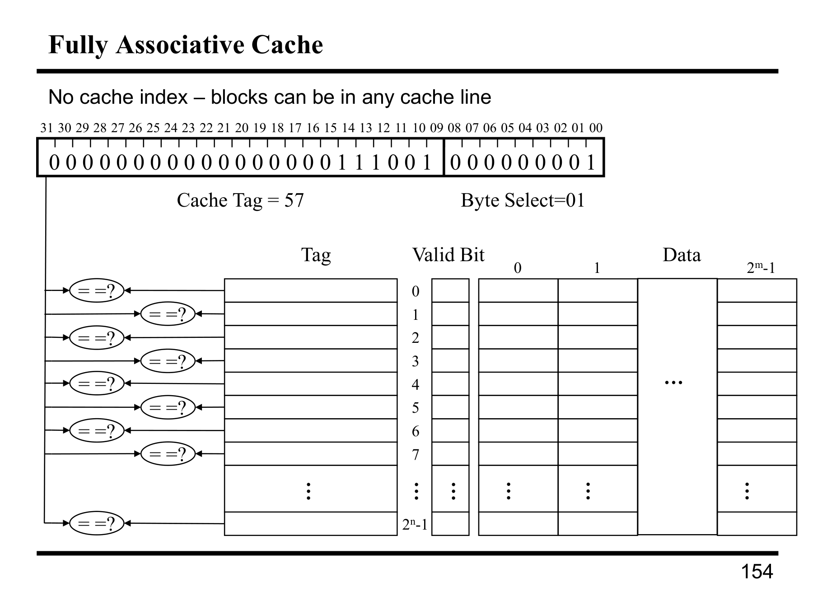

---

## 第 1 页


这页是“**存储层次结构：缓存（Caches）与虚拟内存（Virtual Memory）**”的开场白，想说明 **为什么现代计算机把内存做成多层**。

## 核心矛盾

* **大**容量的存储器通常**很慢**（如 DRAM、磁盘）。
* **很快**的存储器通常**很小**、**很贵**（如寄存器、SRAM 缓存）。
* 我们既想要**快**又想要**大** ⇒ 需要一种折中方案。

## 解决思路：存储层次结构（Memory Hierarchy）

按“**越靠近处理器越小越快**、越远越大越慢”的原则搭建多层：

* 寄存器（最快，极小）
* **L1/L2/L3 Cache**（SRAM，逐级变大变慢）
* **主存 DRAM**（大但慢）
* **磁盘/SSD** 作为**虚拟内存**的后备存储（更大更慢）

> 目标：让程序**大多数时间**命中在**上层**（快层），**偶尔**才去慢层，整体上就像拥有“**又大又快**的内存”。

## 为什么可行：**局部性原理（Locality）**

* **时间局部性**：刚访问过的数据很快还会访问（如循环变量、栈帧）。
* **空间局部性**：访问了地址 `x`，很可能访问 `x` 附近（指令顺序执行、数组遍历）。
* 缓存利用局部性：一次抓一小块（**cache line**），后续命中概率高。

## 两大机制

1. **缓存（Cache）**

* 硬件自动把“常用的块”留在更靠近 CPU 的小而快的存储器中。
* 关键指标：**命中率**、**未命中代价**、**平均访问时间 AMAT = 命中时间 + 未命中率×未命中代价**。
* 设计要点：行大小、相联度、替换策略（LRU 等）、写策略（write-back / write-through）。

2. **虚拟内存（Virtual Memory）**

* 由**操作系统 + 硬件 MMU**把**不常用的页**放到磁盘/SSD，常用的页放在 DRAM。
* 提供**大地址空间、进程隔离与保护、按需调页**。
* 性能关键：\*\*TLB（快表）\*\*缓存页表项，减少地址翻译开销；缺页会很慢，需要 OS 介入。

## 一张图怎么读

* “Computer” 框里有 **Processor（控制+数据通路）**、**Memory**、**Devices**。
* 这页强调：**处理器非常快**，但如果每次都等“远处的大内存”，流水线就会空转。
* 因而必须在处理器与大内存之间插入多级快速缓存，并用虚拟内存把更大的外存纳入同一抽象空间。

## 你需要记住的几句话

* **大而慢 vs 小而快** 是物理现实。
* **分层 + 局部性** 让我们“看起来”拥有快又大的内存。
* **缓存**解决“DRAM 太慢”；**虚拟内存**解决“DRAM 不够大且要保护隔离”。
* 性能分析常用 **命中率/AMAT**；系统实现常见 **TLB + 页表 + 缺页处理**。


---

## 第 2 页


这页在区分两类**随机存取存储器（RAM）**——**DRAM** 和 **SRAM**，并给出它们与**磁盘**在“速度/成本/容量”上的量级差异。

# 两种 RAM

## DRAM（Dynamic RAM，主存）

* **特点**：高密度、低功耗、单位容量**便宜**，但**速度较慢**。
* **Dynamic 的含义**：每个比特用电容存储电荷，电荷会漏，需要**周期性刷新（refresh）**。
* **Random Access**：能按任意地址读写。
* **用处**：做**主内存**（GB～TB 级）。

## SRAM（Static RAM，缓存）

* **特点**：低密度、功耗高、**昂贵**，但**速度快**（通常比 DRAM 快 **2～10 倍**）。
* **Static 的含义**：用触发器/锁存结构保持数据，只要不断电就稳定，不需要刷新。
* **用处**：做**Cache**（L1/L2/L3），容量相对很小（KB～MB～几十MB）。

# 粗略量级对比（表格含义）

| 技术         | 访问时间（相对 CPU 周期）         | 单位容量成本（相对值）           |
| ---------- | ----------------------- | --------------------- |
| **SRAM**   | **1–7 cycles**（极快）      | **10000×**（最贵）        |
| **DRAM**   | **\~100 cycles**（慢很多）   | **200×**（比 SRAM 便宜许多） |
| **磁盘/SSD** | **1万–1000万 cycles**（极慢） | **1×**（最便宜/容量最大）      |

> 注：数字是数量级示意；实际取决于工艺、频率、控制器等。

# 为什么需要“存储层次”

* **大而慢**（DRAM/磁盘） vs **小而快**（SRAM）是物理现实。
* 解决之道：让**SRAM Cache**挡在 CPU 与 DRAM 之间，利用**局部性**使大多数访问命中在上层；不命中才下探到更慢但更大的层（DRAM，甚至磁盘上的虚拟内存）。
* 目标：让系统**看起来既大又快**，同时成本可控。

**一句话**：SRAM 很快但贵且小；DRAM 大而便宜但慢；磁盘更大更便宜但极慢——这就是为什么要用“缓存 + 主存 +（磁盘）虚拟内存”的多层结构。


---

## 第 3 页


这页在说明“**为什么一定要做存储层次（cache/虚拟内存）**”以及**设计哲学**。

# 问题本质：成本 vs 性能

* **快的内存很贵**（SRAM 做缓存，容量小）。
* **便宜的大内存很慢**（DRAM、甚至磁盘）。
* CPU 每次等慢内存都会严重拖慢整体性能（流水线空转、CPI 上升、延迟增大）。

# 设计哲学：混合式分层

* **混合两种优点**：
把**经常用**的数据/指令放进一小块**快而贵**的存储器——**Cache**。
其余的都放在**慢而便宜**的层（DRAM，甚至磁盘作为虚拟内存的后备）。
* 核心口号：**让常见情况快（Make the common case fast）**。
借助局部性（时间/空间），大多数访问会命中在上层缓存，从而获得“看起来既大又快”的效果；偶发的未命中才去慢层。

# 结果与度量

* 目标是把\*\*平均内存访问时间（AMAT）\*\*降到接近缓存命中时间：
AMAT = **命中时间** + **未命中率 × 未命中代价**。
* 通过合理的**层级大小、行大小、相联度、替换与写策略**，让未命中率和未命中代价都尽量小。

一句话：因为**快=贵、小**、**大=慢、便宜**，我们用“**把热数据放到小而快的 cache**、冷数据留在大而慢的内存/磁盘”的分层方案，以最低成本获得接近“又大又快”的性能体验。


---

## 第 4 页


这页讲的是**局部性（Locality）**——程序在一段时间内只会反复用**地址空间里很小的一块**；缓存就是利用这个现象来“把常用的数据放在更近更快的地方”。

## 代码示例在表达什么

```c
char *index = string;
while (*index != 0) {         // 顺序扫描字符串
if (*index >= 'a' && *index <= 'z')
*index = *index + ('A' - 'a');  // 小写转大写，原地写回
index++;
}
```

* 这段代码**线性遍历**内存（`index++`），不断读/改写相邻字符。
* 因为访问模式是**连续的、重复的**，非常符合缓存喜欢的局部性模式，所以在缓存里命中率高、速度快。

## 两种局部性

1. **时间局部性（Temporal Locality）**

* “刚用过的，很快还会再用。”
* 例子：循环内反复用到相同的变量、指令、栈帧数据。
2. **空间局部性（Spatial Locality）**

* “用了某个地址，很快也会用到它附近的地址。”
* 例子：遍历数组/字符串时，连续访问相邻元素。

## 缓存如何利用局部性

* **按“块/行（cache line）”搬运**：一次把一小块连续地址（如 64B）搬到 L1/L2。

* 若程序具有**空间局部性**，后续相邻访问直接命中同一行。
* **保留最近用过的块**：替换策略（LRU 等）让**时间局部性**的数据尽量留在高速缓存。
* 于是\*\*平均内存访问时间（AMAT）\*\*显著下降：大部分命中快的缓存，极少数才下探到慢的内存。

## 对写代码/优化的启示

* 让数据“**按顺序、成块地**”被访问（如结构的数组 SoA/块化遍历）。
* **减小工作集（working set）**，让正在用的数据能装进 L1/L2。
* 避免随机散射访问；必要时可用\*\*预取（prefetch）**或**块化（tiling）\*\*技术。

一句话：**局部性**是缓存能工作的根本——把“常用、相邻”的数据留在近处，让“常见情况更快”。


---

## 第 5 页


这页给出**解决“大而慢 vs 小而快”矛盾的方案：存储层次（Memory Hierarchy）**，并用速度/容量数量级把各层摆在一起。

# 思想：利用“局部性”做分层

* **容量**尽量来自**最便宜**的技术（DRAM、甚至闪存/磁盘），这样总内存**够大**。
* **访问速度**尽量来自**最快**的技术（寄存器、SRAM 缓存），这样常见访问**够快**。
* 程序具有**时间/空间局部性** ⇒ 把“最近常用的一小部分”留在上层，就能让平均访问时间接近上层速度。

# 层次结构（越靠左越快越小，越靠右越大越慢）

1. **寄存器（Registers，芯片内）**

* 速度：≈ **1 个周期**
* 容量：**1×**（相对最小）
2. **片上缓存（On-Chip Cache，L1/L2…，SRAM）**

* 速度：≈ **1–7 个周期**
* 容量：**64–4K×**（相对寄存器放大 64 倍到数千倍）
3. **二级/片外缓存（SRAM）**

* 仍比主存快，容量更大（图中单列为“Second Level Cache”示意）
4. **主存（Main Memory，DRAM）**

* 速度：≈ **100 个周期**
* 容量：**\~4M×**（相对寄存器的放大数量级）
5. **二级存储（Secondary Storage，Flash/磁盘）**

* 速度：≈ **10,000 个周期**（甚至更慢）
* 容量：**\~1G×**（极大）

> 图中柱形越往右越高，表示**容量增大**；越靠左**延迟更低**。

# 为什么这样能“又大又快”

* **命中上层**：绝大多数访问在寄存器/缓存命中，延迟是 1～几拍。
* **未命中才下探**：偶尔才去 DRAM/闪存，虽然慢，但不常发生。
* 用 **AMAT** 衡量：
`Average Memory Access Time = 命中时间 + 未命中率 × 未命中代价`
通过提高命中率、降低下层代价，AMAT 接近上层速度。

# 对软件/硬件的启示

* 硬件：合理配置 **缓存大小、行大小、相联度、替换/写策略**；提供 **预取**、**TLB**（对虚拟内存）等。
* 软件：编译/程序优化**利用局部性**（顺序访问、块化/tiling、缩小工作集），让热数据留在上层。

**一句话**：把“常用的一小撮”留在**快而小**的层，把“其余大量数据”放在**大而慢**的层，利用局部性让系统看起来既**大**又**快**。


---

## 第 6 页


这页是在定义**缓存（cache）里的常用术语**。逐条解释：

### Block（块，也叫 cache line）

* **层与层之间传输的最小单位**。一次搬运一整块，而不是单个字节/字。
* 不同层/技术的**块大小**不同（如 L1 常见 32–64B）。
* **数据只按“整块”在层与层之间移动**。

### Upper / Lower level

* **Upper（上层）**：离 CPU **更近、更快、更小**（比如 L1、寄存器）。
* **Lower（下层）**：离 CPU **更远、更慢、更大**（比如 L2/L3、DRAM、磁盘）。

### Hit（命中）

* 访问的数据**就在该层**的某个块里。
* **Hit rate（命中率）**：访问中**命中**该层的比例。
* **Hit time（命中时间）**：访问该层并**判定命中**所需的时间

$$
\text{Hit time}=\text{该层存取时间}+\text{判定命中/未命中开销}
$$

### Miss（未命中）

* 访问的数据**不在该层**，必须从**更低一层**取回。
* **Miss rate（未命中率）**：在该层的未命中比例 $=1-\text{hit rate}$。
* **Miss penalty（未命中代价）**：从更低一层把数据拿上来并交付给处理器的**额外等待时间**，包含：

* **更低层的访问时间**（例如去 L2/DRAM 的延迟）
* **替换所需时间**（把旧块写回/驱逐、装入新块）
* **把数据送达 CPU 的时间**
* 经验：**Miss penalty 往往远大于 Hit time**，这就是为什么要千方百计提高命中率。

---

一个常用综合指标（便于你记忆）：
**AMAT（平均内存访问时间）**

$$
\text{AMAT}=\text{Hit time}+\text{Miss rate}\times\text{Miss penalty}
$$

目标是在设计中让 **Hit time 小、Miss rate 低、Miss penalty 也尽量小**。


---

## 第 7 页


这页在给出**缓存访问的平均时间公式**，以及把它推广到**整条内存层次**（AMAT）的做法。

# 1) 单层缓存的平均访问时间

$$
\textbf{Average access time}=\underbrace{\text{hit time}}_{\text{命中所需时间}}
+\underbrace{\text{miss rate}}_{\text{未命中率}}\times
\underbrace{\text{miss penalty}}_{\text{未命中代价}}
$$

* **hit time**：访问这一层并判定命中的时间（越小越好）。
* **miss rate**：访问落空的比例（越低越好）。
* **miss penalty**：落空后去**更低一层**取数并把数据送回来的代价（通常远大于 hit time）。

因此目标是：**命中率高** & **命中时间低**，因为 miss penalty 很大。

# 2) 整体层次的 AMAT（Average Memory Access Time）

把上式层层嵌套即可。对两级缓存 + 内存：

$$
\textbf{AMAT}
= t_{L1}
+ m_{L1}\,\big(
t_{L2}
+ m_{L2}\,\underbrace{t_{\text{Mem}}}_{\text{主存访问时间}}
\big)
$$

更多层继续嵌套即可。

**小例子**

* L1：命中 1ns，未命中率 5%
* L2：命中 4ns，未命中率 20%
* 主存：80ns

$$
\text{AMAT}
=1+0.05\,(4+0.20\times80)
=1+0.05\,(4+16)
=1+1
=\mathbf{2\ ns}
$$

→ 大多数命中在 L1，所以整体看起来“接近 L1 的速度”。

# 3) 设计杠杆（直觉）

* **降 miss rate**：增大容量、提高相联度、好替换策略、利用预取/软件局部性。
* **降 hit time**：小而简单的 L1、合理的索引/标签路径（与 miss rate 常有权衡）。
* **降 miss penalty**：增加下层带宽、行填充更快、命中 L2/L3、预取把数据提前搬上来。

一句话：**AMAT = 命中时间 + 未命中率 × 未命中代价**；把这个公式按层展开，就能评估整个存储层次的真实访问开销。


---

## 第 8 页


这页给了一个**多级存储层次的访问时间算例**，并提醒你“命中率是 **local**（局部）命中率”：

* local 命中率 = 送到该层的访问中，有多少在这一层命中（上层会把大量访问拦在外面，所以越往下 local 命中率往往也很高）。

## 给定数据

| 层级 | 命中时间 (Hit time) | **local** 命中率 |
| -- | --------------- | ------------- |
| L1 | 1 cycle         | 95%           |
| L2 | 10 cycles       | 90%           |
| 主存 | 50 cycles       | 99%           |
| 磁盘 | 50,000 cycles   | 100%          |

## 计算 AMAT（平均内存访问时间）

用嵌套公式（miss 率 = 1 − hit 率）：

$$
\text{AMAT}
= t_{L1}+m_{L1}\Big(t_{L2}+m_{L2}\big(t_{Mem}+m_{Mem}\cdot t_{Disk}\big)\Big)
$$

$$
=1+0.05\Big(10+0.10\big(50+0.01\times 50000\big)\Big)
=1+0.05\big(10+0.10\times 550\big)
=1+0.05\times 65
=\mathbf{4.25\ cycles}
$$

## 直觉与延伸

* **global**（整体）命中率也可算：

* L1：0.95
* L2：0.05×0.90 = 0.045（4.5%）
* 主存：0.05×0.10×0.99 = 0.00495（0.495%）
* 磁盘：0.05×0.10×0.01 = 0.00005（0.005%）
* 尽管 L1 很快（1 cycle），但少量的未命中一路传到下层会带来**巨大的惩罚**（磁盘 5×10⁴ cycles），这就是为什么要尽力提高**上层命中率**并降低**miss penalty**。


---

## 第 9 页


这页讲**缓存未命中（cache miss）在简单双发射的五级流水里怎么处理**，分成**指令未命中**与**数据未命中**两类。

## 总前提

* 处理器**默认命中只需 1 拍**，命中时流水线不受影响。
* 一旦**未命中**，需要把所需**整块（cache block/line）**从**更低一层**搬上来，期间会让流水线停或重取。

---

## 指令缓存未命中（Instruction Miss）

取指单元要的那条指令不在 I-cache。

1. **把原始 PC 发给内存层次**（L2/DRAM…），请求取回包含该 PC 的**整行**。
2. **等待返回**（只读；不会对内存施加写使能）。
3. **把返回数据写入 I-cache 的目标行**（按替换策略放置/必要时写回被替换行）。
4. **重启该条指令**：重新以同一个 PC 进行取指（“replay”/“restart”）。

* 实效：**取指前端停顿**；流水线已在前端断粮，后端会自然“跑空”。

> 关键：指令是幂等取回——只需保证**PC 不变**地重取即可。

---

## 数据缓存未命中（Data Miss）

执行阶段的 **load**（或某些 store 策略）访问 D-cache 失败。

1. **停流水（stall）**：冻结之后的指令，不再前推（避免用到还没来的数据）。
2. **向更低层发起读请求并等待**，把目标**整行**拿上来（通常是“写分配/写回”体系下的填行）。
3. **数据回来后**：

* **写入 D-cache**（填行），
* **把所需字传给等待的指令**，流水线**继续**。

> 在最简单的“阻塞式（blocking）cache”里，**整个流水线都要等**。更高级实现会用 **MSHR/非阻塞 cache** 允许“**命中穿过未命中（hit-under-miss）**”，但本页描述的是基础做法。

---

## 补充要点（理解更全面）

* **Load 与 Store 的差别**：

* **Load 未命中**几乎总是要**停**到数据回来。
* **Store** 若采用 **write-through + write buffer**，可先把数据进**写缓冲区**，不一定阻塞；若 **write-back & write-allocate**，首次写可能也要先把行取上来（会阻塞）。
* **一致性/替换**：填行时若替换掉脏行，需先**写回**（增加未命中代价）。
* **异常与重启**：未命中的那条指令在数据就绪后**原语义重放**，保证不重复产生副作用。
* **性能指标**：

* 对一层缓存：`Average access time = hit time + miss rate × miss penalty`
* 未命中代价（miss penalty）不仅含“下层访问时间”，还包含**替换写回**与**把数据送到处理器**的时间。

**一句话**：命中时 1 拍直接过；未命中时，指令未命中让前端停并重取，数据未命中则冻结流水线、去下层把整行搬上来后继续。


---

## 第 10 页


这页讲\*\*如何利用局部性（Exploiting Locality）\*\*来设计缓存，让“常见情况更快”。

# 空间局部性（Spatial locality）

* **做法**：一次从下层搬运\*\*一整块（block / cache line）\*\*到上层缓存，而不是仅一个字/字节。
* **原因**：访问了地址 A，很快也会访问 **A 附近**的数据（比如顺序遍历数组/字符串）。
* **含义**：选择合适的**块大小**，必要时配合**顺序预取**，让后续相邻访问直接命中。

# 时间局部性（Temporal locality）

* **做法**：把**最近刚访问过**的数据尽量留在靠近处理器的高层缓存。
* **被迫淘汰（evict）时**：优先保留**最近用过**的块，尽量丢弃很久没用的块。
* **含义**：采用**合适的替换策略**（如 LRU/近似 LRU、LRU-bit、NRU、随机+分组相联等），提高“再访问时还在缓存里”的概率。

## 小结

* **空间局部性 → 大小合适的块/行 + 预取**
* **时间局部性 → 保留“最近热数据” + 好的替换策略**
两者共同目标：**提高命中率、降低 AMAT（平均内存访问时间）**。


---

## 第 11 页


这页在讲 **缓存的数据放到哪里**（映射方式）。因为 **cache 比内存小**，很多主存地址必须**共享**少量的 cache 行，于是要规定“某个内存块可以放到 cache 的哪些位置”。三种经典组织：

# 1) Direct-Mapped（直接映射）

* **规则**：一个主存块 **只能放到 cache 中唯一的一个行**。
* **实现**：地址按位切分：`[Tag | Index | BlockOffset]`

* 用 **Index** 直接选中某一行（或某一组中的唯一行）；
* 比较 **Tag** 判断是否命中。
* **优点**：硬件最简单、命中时间短、能做到 1 周期命中。
* **缺点**：**冲突未命中（conflict miss）多**——如果两个常用块索引到同一行，就会来回顶掉彼此。

# 2) Fully Associative（全相联）

* **规则**：一个主存块 **可以放在 cache 的任何行**。
* **实现**：没有 index；到达时需把 **所有行的 Tag** 都拿来**并行比较**（或用目录）。
* **优点**：**冲突最少**（只有容量不够时才会不命中）。
* **缺点**：硬件最复杂、面积和能耗高、命中路径慢（多路比较），通常只用于**很小的缓存**（如 TLB、Victim cache）。

# 3) N-way Set Associative（N 路组相联）

* **规则**：一个主存块 **只能放到某一“组”(set) 的 N 个位置之一**。
* **实现**：地址切分：`[Tag | SetIndex | BlockOffset]`

* 用 **SetIndex** 选中一组；
* 在该组内的 **N 个行**做 **Tag 比较**。
* **优点**：在**复杂度与冲突率之间折中**。N 越大，冲突 miss 越少；N 越小，命中时间越短。
* **常见**：L1 常见 2～8 路，L2/L3 可能 8～20+ 路。

---

## 小提示：三者权衡

* **命中时间（hit time）**：直接映射 最快  ＞  组相联  ＞  全相联 最慢
* **冲突未命中（conflict miss）**：全相联 最少  ＜  组相联  ＜  直接映射 最多
* **硬件复杂度/功耗**：全相联 最高  ＞  组相联  ＞  直接映射 最低

## 例子（帮助直观）

* 4KB 直接映射，行大小 64B → 行数 = 4096/64=64 → **Index=6 位**。
* 同样大小若做 **4 路组相联** → 组数 = 64/4=16 → **SetIndex=4 位**，每组 4 行并行比较 Tag。

**一句话**：

* **直接映射**：快但冲突多；
* **全相联**：冲突少但硬件重；
* **N 路组相联**：在两者之间找平衡，是现代通用处理器缓存的主流组织方式。


---

## 第 12 页


这页用一个**超小的“直接映射（Direct-Mapped）缓存”示例**讲“主存地址如何映到缓存行”。

## 设定

* 缓存总大小：**4 Byte**
* **块大小（cache block）= 1 Byte**（所以每个块只有 1 字节，也就没有块内偏移）
* 因为是 **直接映射**：一个主存块**只能放到缓存中的唯一一行**
* 行数 = 4B / 1B = **4 行** → **索引（index）需要 2 位**：0、1、2、3
* 地址切分（概念上）：`[ Tag | Index ]`（无 BlockOffset）

## 映射规则（实际就是对 4 取模）

主存地址按 **Index = 地址 mod 4** 映到缓存的 4 行之一：

* 行 0 ⇐ 地址 **0, 4, 8, C** …
* 行 1 ⇐ 地址 **1, 5, 9, D** …
* 行 2 ⇐ 地址 **2, 6, A, E** …
* 行 3 ⇐ 地址 **3, 7, B, F** …

图中绿色箭头就是把一个内存地址按这个规则**定位到**缓存的**某一行**。

当访问一个地址：

1. 用 **Index** 选中那一行；
2. 比较该行存着的 **Tag** 与地址的 Tag；
3. 相等则 **命中**，不等则 **未命中** → 把该地址对应的块装入这行（直接**覆盖**以前的块）。

## 空间局部性 & 冲突

* 这页标题下面的注释“**优化空间局部性**”是提醒：现实中我们会用**更大的块**（比如 32/64B），因为访问一个地址后，很快会访问**邻近**地址；装一整行可提高命中率。此处 1B 只是为了演示映射规律。
* 直接映射的缺点也能在这个小例子里看到：

* 若你交替访问地址 `0, 4, 0, 4, ...`，它们**都映到行 0**，会**相互顶掉**，产生**冲突未命中**（thrashing）。

## 一个小序列举例

访问：`0, 1, 2, 3, 0, 4`

* 前四次：缓存最初为空 → **全未命中**，把 0→行0、1→行1、2→行2、3→行3。
* 再访 0：行0 的 Tag 还在 → **命中**。
* 访问 4：`4 mod 4 = 0` → 映到行0，但 Tag≠0 → **未命中**，4 覆盖 0。

**一句话**：
在**4 行、块大小 1B**的**直接映射缓存**里，主存地址按 **mod 4** 映到唯一行；优点是**简单/很快**，缺点是**容易发生冲突未命中**。为了更好地利用**空间局部性**，现实缓存会用**更大的块**，并常用**组相联**来降低冲突。


---

## 第 13 页


这页在回答：**同一条 cache 行可能对应很多主存地址（如行0可放0、4、8、12…），那我们怎么知道当前行里到底是哪一个？**
**办法：给每条 cache 记录加上 “标记位（tag）”。**

## 要存什么（每行/每块的元数据）

最基本：

* **Tag（标记）**：地址的高位（去掉“组索引/行号”和“块内偏移”剩下的位）。
用来判断“这行里现在究竟是哪个主存块”。
* **Valid bit（有效位）**：这行是否装有**有效数据**（上电后通常为 0）。

常见还会有：

* **Dirty bit（脏位）**（写回 write-back 策略时）：行被CPU修改过吗？淘汰时若脏要先写回下层。
* **替换信息**（仅对组相联，如 LRU/NRU 位）：帮助在一组 N 行里决定驱逐谁。
* **Data（数据本体）**：整块数据（如 64B），包含**块内偏移**可寻址的字节/字。

## 查找流程（direct-mapped 或组相联）

1. **地址划分**：`[ Tag | Index/Set | BlockOffset ]`
2. 根据 **Index/Set** 选中行/组；
3. 读出该行（或该组 N 行）的 **Tag** 与地址的 **Tag** 比较：

* **Valid=1 且 Tag 匹配** → **Hit**；
* 否则 **Miss**：按替换策略选择行，若**Dirty=1**先写回，再把新块装入，设置新 **Tag** 和 **Valid=1**。

## 套用到前页的小例子

* 4B 直接映射、块=1B → 行数=4 → `Index=2 位`；无块偏移。
* 行0 可对应地址 0、4、8、12…（`addr mod 4 = 0`）。
* 为区分“此刻是 0 还是 4/8/12…”，**行里要存 Tag（= 地址去掉 Index 后的高位）**，再配合 **Valid** 判定命中。

**一句话**：因为一行能容纳许多可能的主存块，必须给每行存**Tag+Valid（再加脏位/替换位等）**，靠“**索引定位行、Tag 比较**”来判断当前行装的到底是哪一个块。


---

## 第 14 页


这页用一个**32 位地址、直接映射（direct-mapped）缓存**的具体例子，演示**地址如何被切分成 Tag 和 Index**，以及缓存里需要存哪些元数据。

## 已知条件

* Cache 容量：$2^9$ Byte（= **512 B**）
* **块大小**（cache block）= **1 Byte**
→ **没有块内偏移位**（Block Offset = 0 位）
* 因为是**直接映射**：主存的每个块**只能落在 Cache 中唯一的一行**。

## 地址切分

* **Index 位数** = 行数 = 容量 / 块大小 = $2^9$ 行 → **9 位**（选哪一行）
* **Tag 位数** = 32 − 9 = **23 位**（标识这一行目前装的是哪一个主存块）

图顶端给了一条 32 位地址；其中：

* 低 9 位（\[8:0]）是 **Cache Index** = `03`（二进制 000000011，对应第 3 行）
* 高 23 位（\[31:9]）是 **Cache Tag** = `57`（图上写的值，用来与该行里存的 tag 比较）

## 行里要存什么

右下三列，就是每一行保存的元数据与数据：

* **Valid bit**：这一行是否**有效**（上电后清零）。
* **Tag**：这行**当前**装入的主存块的 23 位标记。
* **Data**：块数据本体（本例 1 字节/行；现实里通常 32B/64B 一行）。

共有 $2^9$ 行，每行各有上述三项。

## 访问流程（直接映射）

1. 取地址的 **Index**（9 位）→ 选中**第 3 行**。
2. 读出该行的 **Valid** 与 **Tag**，把 **Tag** 与地址上来的 23 位 **Tag** 比较。

* 若 **Valid=1 且 Tag 相等** → **命中**，直接用 **Data**；
* 否则 **未命中**：到下层取回该地址所在的块，**写入这行**，更新 **Tag**，将 **Valid=1**（若被替换行为脏还要先写回）。

> 因为块=1B，所以这里没有 BlockOffset；现实缓存块更大（如 64B），地址还会包含 **块内偏移**，用于从一行里选具体字节/字。

**一句话**：
这页把直接映射缓存的地址分解画清楚了：**Index 选行，Tag 判等，Valid 判是否有效**；本例容量 $2^9$B、块 1B → **Index=9 位、Tag=23 位**，访问时按“**索引定位 + Tag 比较**”完成命中/未命中的判定。


---

## 第 15 页


这页是一个**直接映射（direct-mapped）缓存**的小练习：
缓存大小 **4 B**、块大小 **1 B** ⇒ 一共有 **4 行**，**Index=2 位**；块内无偏移。
给出 5 位内存地址访问序列：

```
00001
00110
00001
11010
00110
```

对每个地址：

* **Index** = 低 2 位
* **Tag** = 高 3 位（因为总地址这里写成 5 位示例）

逐步演算：

| 次序 |   地址  | Tag | Index(行) |  命中/未命中 | 行状态变化                     |
| -: | :---: | :-: | :------: | :-----: | :------------------------ |
|  1 | 00001 | 000 |   01(1)  |   Miss  | 行1 ← Tag=000, Valid=1     |
|  2 | 00110 | 001 |   10(2)  |   Miss  | 行2 ← Tag=001, Valid=1     |
|  3 | 00001 | 000 |   01(1)  | **Hit** | 行1 的 Tag=000 命中           |
|  4 | 11010 | 110 |   10(2)  |   Miss  | 行2 的 Tag 从 001 → 110（被替换） |
|  5 | 00110 | 001 |   10(2)  |   Miss  | 行2 再次被 001 覆盖             |

**结果：** M, M, **H**, M, M
最终缓存：行1 有 Tag=000；行2 有 Tag=001；行0/行3 仍为空。

**为何第 4、5 次都 Miss？**
地址 `00110` 与 `11010` **Index 都是 10**，只能放在**同一行（行2）**，两者互相顶掉，形成**冲突未命中（conflict miss）**——这正是直接映射缓存的典型问题。
如果把缓存做成**更大/更高相联度（如 2-way 组相联）**，这类冲突就会减少。


---

## 第 16 页


已思考


---

## 第 17 页


这页讲“**块大小太小会带来很高的开销**，也没法利用空间局部性；用**更大的块（cache line）**可以把**Tag 开销摊薄**，同时**利用空间局部性**”。

## 之前的假设有什么问题？

* 前面举例一直用 **直接映射 + 1 字节/块**：

* 只利用了**时间局部性**（最近用过的字节还在）；
* **没利用空间局部性**（相邻字节很可能马上也会用，却没被一起带上来）；
* 且**每个块都要存一份 Tag/Valid 等元数据**，当块只有 1B 时，**Tag 比数据还大** → 面积/容量利用率很差。

## 解决思路

> “Take advantage of spatial locality & amortize tag memory via larger block size”

* 一次从下层搬**一整块连续字节**（例如 32B/64B），后续对**邻近地址**的访问能直接命中；
* **每行的数据更多**，而 Tag/Valid 只存一次，**Tag 开销被摊薄**。

## 直观算一算（32位地址、直接映射、64KB 数据的例子）

* 若**1B/块**：行数=64K，Index=16 位，Offset=0 → **Tag=16 位**

* 每行元数据：Tag(16)+Valid(1) ≈ **17 bit**，数据只有 **8 bit**
* 元数据/数据 ≈ **210%**（Tag 比数据还大！）
* 若**64B/块**：行数=64KB/64B=1024，Index=10 位，Offset=6 位 → **Tag=16 位**

* 每行元数据：**17 bit**，数据 **512 bit**
* 元数据/数据 ≈ **3.3%**（极大降低）

> 这就是“**用更大的块摊薄 Tag 开销**”的含义。

## 但块也不是越大越好（权衡）

* ✅ **好处**

* 更好利用**空间局部性**，\*\*缺失数（compulsory misses）\*\*下降；
* **Tag 存储**占比显著降低。
* ⚠️ **代价**

* \*\*未命中代价（miss penalty）\*\*上升：一次要搬更多字节，等待更久，占更多带宽；
* **冲突未命中**可能增多：同样容量下，块越大，**块数越少**，更容易互相挤掉；
* **污染**：若程序访问稀疏，大块把“用不到的数据”也搬上来占位置。
* 现实里常取 **32–128B/行**（L1 常见 32/64B）作为折中。

## 这页图怎么读

* 左：每行的 **Valid 位**
* 中：每行存一份 **Tag**
* 右：每行的 **Data**，画成多列表示**一个块里有多个字**（块变大）。
意思是：**行数固定时**，把“Data”做宽（块更大），**Valid/Tag**仍只占一份，从而**摊薄元数据**并利用**空间局部性**。

**一句话总结**：
把块做大，能**利用空间局部性**并**摊薄 Tag/Valid 的存储开销**；但会增大未命中代价、带来更多冲突/污染，需要在**块大小、命中率与代价**之间权衡。


---

## 第 18 页


这页把“**块更大时，地址如何切分，以及一行里怎么存数据**”画清楚了（仍是**直接映射**）。

## 设定

* **行数**：$2^{10}$ 行（即 1024 行）
* **块大小**：$2^{9}$ 字节/行（= 512B，一行里有 512 个字节位点）
* **地址**：32 位

## 地址切分（Tag / Index / Byte Select）

* **Index（组/行号）**：选哪一行 → 需要 $\log_2 2^{10}=10$ 位
* **Byte Select（块内偏移）**：在该行的 512B 中选哪一个字节 → 需要 $\log_2 2^{9}=9$ 位
* **Tag**：剩余高位 → $32-10-9=\mathbf{13}$ 位

图上例子给出了一条 32 位地址，解析为：

* **Cache Tag = 58**（十进制，仅示意，实际是 13 位二进制）
* **Cache Index = 4**（选中第 4 行）
* **Byte Select = 1**（在该行的第 1 个字节位置）

## 行内存什么

每一行都有三类存储：

* **Valid bit**：该行是否有效
* **Tag**：13 位，表明这行当前装的是哪一个主存块
* **Data**：整块 **512B** 数据（图右侧画成 0…$2^9\!-\!1$ 的 512 列，用来表示块内 512 个字节）

## 访问流程（直接映射，不含并发细节）

1. 取地址的 **Index(10 位)** → 选中唯一的一行（例中第 4 行）。
2. 读出该行的 **Valid 与 Tag**，与地址的 **Tag(13 位)** 比较。

* 若 **Valid=1 且 Tag 相等** ⇒ **命中**，再用 **Byte Select(9 位)** 在 512B 里选出目标字节/字。
* 否则 **未命中** ⇒ 从下层把该地址所在的**整块 512B**搬上来，写入这行，同时更新 **Tag**，置 **Valid=1**（若替换行是脏行需先写回）。

## 要点回顾

* 块变大 → 多了 **Byte Select** 字段；**Index** 决定行，**Tag** 判定是否命中。
* 大块能利用**空间局部性**并摊薄 **Tag/Valid** 的开销，但未命中代价更高、块数变少易冲突，需要折中选择行大小。


---

## 第 19 页


这页是练习题：**给一个有 64 个块、块大小 16B 的直接映射缓存**（默认 32 位地址），问字节地址 **1200₁₀** 的三段字段：

* **Byte select（块内偏移）**：决定在一个 16B 块里的哪一字节
位数 = log₂16 = **4 位**
1200 mod 16 = **0** → **0000₂**

* **Cache index（行号）**：决定落到 64 行中的哪一行
位数 = log₂64 = **6 位**
index = ⌊1200 / 16⌋ mod 64 = 75 mod 64 = **11₁₀** → \*\*001


---

## 第 20 页


这页讲**缓存块大小（cache line size）的权衡**：块做大能更好利用**空间局部性**，但也会带来**更高的未命中代价**和**更高的冲突/污染风险**，所以平均访问时间呈**U 型**，存在一个“**最佳块大小**”。

---

## 直觉与三张小图

1. **Miss Penalty vs. Block Size（左图）——单调上升**

* 块越大，一次未命中要搬的数据越多，**填满一块更久、占带宽更多**，所以**未命中代价**随块大小**上升**。

2. **Miss Rate vs. Block Size（中图）——先降后升**

* **先下降**：小块→大块能把**邻近数据**一并搬上来，**空间局部性**被利用，**强制性/容量 miss**减少。
* **后上升**：块太大导致**块数变少**（同样总容量下，行数=容量/块大小），更易**互相顶掉**（冲突/容量 miss 增加）；而且把**用不到的数据**也搬上来造成**污染**，还可能**牺牲时间局部性**（热数据更快被挤掉）。

3. **Average Access Time vs. Block Size（右图）——U 型**

* 平均访问时间 AMAT = **Hit time + Miss rate × Miss penalty**。
* 随块变大：**miss rate** 先降 → AMAT 降；再往上**miss rate**回升且**miss penalty**更大 → AMAT 上升。
* ⇒ 存在一个**折中点**（最佳块大小）。

---

## 设计抓手与经验

* **命中率优先**：L1 通常选 **32B/64B**；L2/L3 可能更大（64B～128B），但要留意带宽与延迟。
* **带宽与并行填充**：更大的块若**支持分块传输/临时命中（critical-word-first、early restart）**，能缓解 miss penalty 上升。
* **工作集/访问模式**：顺序遍历（强空间局部性）适合**大块**；随机访问/稀疏图适合**小块**。
* **多核共享缓存**：大块可能**增加干扰/污染**，需配合**预取器**、**替换策略**和**相联度**优化。

**一句话**：块太小→空间局部性浪费、Tag 开销大；块太大→miss penalty 大、块数少易冲突。选一个让 **miss rate × miss penalty** 最小的块大小，就是你的最佳点。


---

## 第 21 页


这页在讲**直接映射（direct-mapped）缓存的典型问题：冲突未命中 → 抖动（thrashing）**。

## 发生了什么？

例子：变量 `sum` 的地址是 0，循环变量 `I` 的地址是 64，缓存大小 64B（直接映射）。

* 直接映射的定位规则（简化）：

$$
\text{index}=\frac{\text{address}}{\text{block\_size}}\bmod \text{(\#lines)}
$$
* 当缓存大小、行数与块大小都是 2 的幂时，**相差 64B 的地址很容易映到同一行**（比如块=1B 或 4B 时，地址 0 和 64 的 index 相同）。

在循环里每次都要访问 `I` 和 `sum`：

```c
int sum = 0;
for (int I = 0; I != N; I++) {
sum += I;
}
```

* 由于两者**映到同一条 cache 行**，访问 `I` 会把 `sum` 所在的行**顶掉**，紧接着访问 `sum` 又把 `I` 的行顶掉……
* 于是**几乎每次访问都成了 miss**：数据**刚装入就被驱逐，来不及复用**——这就是**thrashing（抖动）**。

## 影响

* 命中率非常低（除最开始的少数填充外几乎全 miss）。
* 平均访问时间（AMAT）被更低层的**miss penalty**主导，性能大幅下降。

## 怎么缓解？

* **提高相联度**：改成 **2-way/4-way 组相联**，让同一个 index 里有多个行可以放，显著减少冲突 miss（最有效的硬件手段）。
* **改变数据布局**：让热点对象**不要落在同一 index**。例如为其中一个变量**加对齐/填充**（padding），或把它放入不同的数组/结构，改变地址低位。
* **增大缓存/改变块大小**：更多行或不同行大小有时能自然错开映射（但成本更高且不一定治本）。
* **受害者缓存（victim cache）/非阻塞 cache**：在直接映射后面加小型全相联缓冲，可收纳刚被顶出的“受害者”行，减少抖动命中损失。

**一句话**：直接映射很快但易“同索引冲突”。当两个经常访问的数据总落在同一行时，会反复相互驱逐，导致**抖动**和**极差的命中率**；常见解法是**用组相联**或**调整数据地址**把它们分开。


---

## 第 22 页


这页总结**缓存未命中的类型**（常说的 **3C**，外加“失效”一类）以及各自的成因与对策。

# 3C：Compulsory / Capacity / Conflict

1. **Compulsory / Cold-start Miss（强制/冷启动未命中）**

* **原因**：第一次访问某个内存块，它**从未在 cache 中**，必须先把整块搬上来。
* **特点**：不可避免，但**更大的块**（一次带上邻近数据）能减少后续的第一次访问次数；程序运行久了占比通常很小。
* **对策**：适度**增大块大小**、**预取（prefetch）**。

2. **Capacity Miss（容量未命中）**

* **原因**：工作集（同时活跃需要的数据量）**超过了 cache 容量**；块虽彼此不冲突，但装不下，被后续访问逐步挤掉。
* **对策**：**增大 cache 容量**（代价是更慢、更贵）、更好的**块/数据布局**与**算法块化（tiling）**，减小工作集。

3. **Conflict Miss（冲突未命中）**

* **原因**：即便容量足够，但多个常用块**映射到同一组/同一行**，互相顶掉（直接映射最严重）。
* **对策**：

* 提高**相联度**（从 direct-mapped → 2/4/8-way）；
* **增大 cache**（更多组可稀释冲突）；
* **调整数据对齐/布局**（避免热点落同一 index）；
* 小型**Victim Cache** 也有帮助。

# 额外：Invalidation（失效导致的 miss）

* **原因**：I/O、DMA、其他核/进程或系统事件把某行**失效/替换**（如一致性协议使其无效），下次访问就会 miss。
* **对策**：正确的**一致性/同步**、合适的**缓存策略**（如不可缓存映射、写合并缓冲等）。

---

**记法**：

* **Compulsory**：第一次必须（cold）
* **Capacity**：装不下
* **Conflict**：撞同一组
它们共同决定 **miss rate**；再配合 **miss penalty**，影响 AMAT：

$$
\text{AMAT} = \text{Hit time} + \text{Miss rate} \times \text{Miss penalty}
$$


---

## 第 23 页


这页用一个**决策流程图**教你把一次 **cache miss** 归类到 **3C** 里的哪一种。

## 判定流程（读图就会用）

1. **先问：这块数据以前碰到过吗？**

* **没有** → **Compulsory/Cold-start miss（强制/冷启动）**
第一次访问某块必然要从下层搬上来，几乎不可避免（可用更大块/预取稍微缓解）。

2. **以前碰到过** → 再问：
**自从上次访问它以来，被访问过的“不同块”的数量 ≥ cache 可容纳的块数吗？**

* **是** → **Capacity miss（容量不命中）**
说明工作集太大，把这块挤出去了：**cache 太小**。
对策：更大的 cache、算法/数据块化以缩小工作集。
* **否** → **Conflict miss（冲突不命中）**
容量其实够，但多个常用块**映到了同一组/行**，彼此顶掉：**cache 太“笨”**（相联度不够、映射不佳）。
对策：提高**相联度**（direct→2/4/8-way）、增大 cache、调整数据对齐/地址分布、victim cache。

> 口诀：**第一次必 miss（Compulsory）**；**装不下是容量（Capacity）**；**装得下却撞位是冲突（Conflict）**。

### 小例子

* 顺序第一次扫大数组：多为 **Compulsory**。
* 工作集=2MB、L1=32KB、L2=256KB：在 L1/L2 可能见到 **Capacity**。
* 两个热点变量总落同一 index 的直接映射 L1：频繁 **Conflict**（抖动）。

把 miss 归类后，你就知道该优先优化哪一类：增块/预取（降 compulsory）、增容量/块化（降 capacity）、提相联度/改布局（降 conflict）。


---

## 第 24 页



这页解释**全相联缓存（Fully Associative Cache）**：
**没有 Index 字段**，任意主存块**可以放在缓存中的任何一行**。

## 地址切分

* 只有两段：`[ Tag | Byte Select ]`

* **Byte Select**：块内偏移（例中 = 01）。
* **Tag**：其余所有高位（例中“Cache Tag = 57”），用来识别“这一行装的是哪一个主存块”。

## 查找（命中判定）

* 因为**不限定行**，到达的地址 **Tag** 要与**缓存里每一行的 Tag 并行比较**（图左侧一排“==?”比较器）。
* 某行 **Valid=1 且 Tag 相等** ⇒ **命中**，再用 **Byte Select** 在该行的块中选出具体字/字节（右侧 Data 区）。
* 若**所有行都不匹配** ⇒ **未命中**，需要从下层装入该块，并**选择一行**来放置（见下）。

## 还需要存什么

* **Valid bit**：该行是否有效。
* （通常还有）**Dirty bit**：写回策略时标记被修改过。
* **替换信息**：因为能放到“任何行”，未命中装块时必须决定**驱逐哪一行**，常用 **LRU/近似 LRU/随机** 等策略。

## 优缺点与使用场景

* ✅ **几乎没有冲突未命中（Conflict miss）**：因为不受“固定映射”的限制，冲突只来自容量不足。
* ❌ **硬件复杂、功耗高、命中路径慢**：需要对**所有行**做 Tag 并行比较，比较器和多路选择器很多。
* 🔧 因此常用于**很小的缓存/表**：例如 **TLB**、**Victim Cache**、片上小型缓冲；大容量层（L1/L2）多采用 **N 路组相联**来折中复杂度与冲突率。

## 一句话

全相联 = “块**到处都能放**”；靠**对所有行的 Tag 并行比较**来找块，**冲突最少**但**硬件最重**，适合做小而关键的缓存结构。


---

## 第 25 页


这页标题是“**Fully Associative vs. Direct Mapped**（全相联 vs 直接映射）”。它要你掌握两种极端缓存组织的**优缺点与取舍**。给你一张“口袋对照表”：

# 直接映射（Direct-Mapped）

* **放置规则**：一个主存块只能落在**唯一的一行**（Index 唯一确定行）。
* **命中判定**：读出那一行的 **Tag** 与地址 **Tag** 比较。
* **优点**：硬件最简单；**命中路径最短**（常能做到 1 个周期）；面积、功耗最低。
* **缺点**：**冲突未命中（Conflict）最多**——若两个热点块映到同一行，会相互顶掉（thrashing）。
* **适用**：对延迟极敏感、容量较小的 **L1**（很多设计仍用少路组相联而不是纯 direct，以缓解冲突）。

# 全相联（Fully Associative）

* **放置规则**：一个主存块可以放到**任意一行**（没有 Index，只有 Tag+Offset）。
* **命中判定**：对**所有行**的 Tag 做并行比较（或用目录），找到命中的那一行。
* **优点**：**几乎没有冲突未命中**（只剩容量/强制 miss）；命中率最佳。
* **缺点**：硬件最复杂，**比较器/多路选择器很多**；**命中路径更长**，面积与功耗都高；容量大时不可扩展。
* **适用**：**很小的缓存/表**，如 **TLB**、**Victim Cache**、小缓冲区。

# 设计上的折中：N 路组相联（Set-Associative）

* 介于两者之间：一个块可落在某个**组**内的 **N** 个位置之一。
* **N 越大** → 冲突越少、命中率更接近全相联，但硬件更重、命中更慢。
* 现实主流：L1 常见 **2–8 路**，L2/L3 可能 **8–20+ 路**，在**命中率**与**命中延迟**之间取平衡。

# 快速记忆

* **Direct**：**快**、**省**，但**冲突多**。
* **Fully**：**命中高**、**冲突少**，但**慢**、**贵**、**耗**。
* **Set-Assoc**：折中，大多数处理器的实际选择。


---

## 第 26 页


这页解释\*\*N 路组相联（N-way set associative）\*\*缓存——介于“直接映射”和“全相联”之间的主流组织方式。

## 核心概念

* 把整个 cache 按 **组（set）** 划分：
**每个组里有 N 条行（ways）**。一次访问落到**某一组**，但可放在该组的 **N** 个位置之一。
* 可以把它理解为：**N 个直接映射缓存并行**工作、共享同一个组索引。

> 特例：
>
> * **直接映射** = **1-way 组相联**（每组只有 1 行，放置位置唯一）。
> * **全相联** = **L-way 组相联**（L 为 cache 总行数，每组只有 1 组=整个缓存；任何行都可放）。

## 地址如何切分

对一个块大小为 `B` 的 N 路组相联缓存（总行数 `L`，组数 `S = L / N`）：

* **Block offset**：`log2(B)` 位（块内偏移）
* **Set index**：`log2(S)` 位（选择哪一“组”）
* **Tag**：其余高位（在该组内用来判定命中）

## 访问流程

1. 由 **Set index** 选中目标组；
2. 在该组内 **N 条行的 Tag 并行比较**；
3. 若某行 **Valid=1 且 Tag 相等** ⇒ **命中**；否则 **未命中**，按替换策略（LRU/近似 LRU/随机等）在本组内驱逐一行并装入新块。

## 为什么用组相联

* **相对直接映射**：显著减少**冲突未命中**（多个热点块可共存于同组的不同 way）。
* **相对全相联**：硬件复杂度低得多，命中路径更短、能耗更小，可做得更大。
* 现实里：L1 常见 **2–8 路**，L2/L3 可能 **8–20+ 路**。
路数越大 ⇒ 冲突越少（命中率↑），但比较器/多路选择器越多（命中延迟与功耗↑）——典型的折中。

## 一个小例

* 32KB，块 64B，总行数 `L=32KB/64B=512`。
* 若 **4-way**：组数 `S=512/4=128` ⇒ **Set index = 7 位**，**Block offset = 6 位**，其余为 **Tag**。
* 访问时只比较**同一组内的 4 个 Tag**，而不是全缓存。


---

## 第 27 页


这页讲的是**2 路组相联（2-Way Set Associative）缓存**的结构与查找流程。

## 地址三段

* **Byte Select**：块内偏移（选行内第几个字/字节），图上= `01`
* **Cache Index**：选**哪一组（set）**，图上= `04`
* **Cache Tag**：其余高位（用来判定命中），图上= `57`

> 2 路组相联 = 每个 **set** 里有 **2 条 line（两路）** 可用。

## 查找流程（图中数据通路）

1. **用 Index 选中目标 set**（中间两大列就是被选中的这一组的两条 line）。
2. **两路的 Tag 并行比较**：

* 地址 Tag 同时送到**左路**和**右路**的 Tag 存储，与各自的 Tag 比较器（`==?`）。
* 各自的 **Valid** 也参与判定（有效且 Tag 相等才算命中）。
3. **命中信号**：两侧比较结果经或门（OR）汇总为整体 **Hit**。
4. **数据选择**：一个 2 选 1 的多路复用器（MUX）根据“哪一路命中”从两条 **Block** 中选出正确的数据块；随后再用 **Byte Select** 取块内目标字/字节，作为 **Cache Block** 输出。

## 未命中与替换

* 两路都不命中 → **Miss**：从下层装入该地址所在的块，并在**本组的两路里选一条替换**。
* 需要维护**替换策略元数据**（如 LRU/NRU 位）来决定“驱逐谁”。

## 为什么要 2 路

* 相比**直接映射**：同一个 set 里有 2 个位置，能显著减少**冲突未命中**（两个热点块可共存）。
* 相比**全相联**：只比较**两条**而不是所有行，硬件复杂度小得多，命中延迟也短。
* 现实中 L1 常见 2–8 路；2 路是成本与命中率的一个简单折中。

## 小例（帮助直觉）

* 若某程序频繁访问两个地址，它们的 **Index 相同**：

* 在**直接映射**下只能抢同一行 → 来回顶掉，冲突严重；
* 在**2 路组相联**下，这两个块可以分别放在该 set 的两路里 → 大多命中。

**一句话**：2 路组相联=“**每组两条线**，**两路并比 Tag**，**哪个命中就从哪路读**；命中率优于直接映射、硬件负担远小于全相联，是主流缓存的常见组织。\*\*


---

## 第 28 页


这页标题是 **“N-way vs. Other Caches”**，意思是：把 **N 路组相联缓存** 与另外两种极端组织——**直接映射** 与 **全相联**——做对比，理解三者的取舍。

# 三种组织，一句话版

* **直接映射（1-way）**：每个块只能去**唯一一行** → **最快、最省**，**冲突 miss 最多**。
* **N 路组相联**：每个块在选中的**一组**里有 **N 个位置**可放 → 在**速度**与**命中率**之间**折中**，是主流。
* **全相联（L-way，L=总行数）**：每个块可以去**任何一行** → **冲突最少**，但**硬件最重、命中路径最慢**，只适合很小的表（如 TLB、victim cache）。

# 对比维度（要点速记）

| 维度        | 直接映射             | N 路组相联         | 全相联                  |
| --------- | ---------------- | -------------- | -------------------- |
| 放置自由度     | 1 个位置            | N 个位置（同组）      | 任意位置                 |
| Tag 比较数   | 1                | N              | L（全体）                |
| 命中延迟（一般）  | 最短               | 中等，随 N 增加而增    | 最长                   |
| 冲突未命中     | 最多               | 随 N 增大而降       | 最少                   |
| 面积/功耗/复杂度 | 最低               | 中等（比较器×N、替换状态） | 最高                   |
| 典型用途      | L1（也常用2–8路）/小而极快 | L1/L2/L3 主流选择  | TLB、Victim Cache、小缓冲 |

# 设计取舍与经验

* **N 增大 → 冲突 miss 下降**，但 **命中路径更长/功耗更高**；一般 L1 取 **2–8 路**，L2/L3 取 **8–20+ 路**。
* 需要 **替换策略**（LRU/近似 LRU/随机等）管理每组 N 条线的驱逐。
* 为兼顾延迟与命中，常配合：**way 预测**、**分阶段比较**、**银行化（banking）**、**受害者缓存（victim cache）**、**伪相联/斜相联（skewed）** 等工程技巧。

**总结**：

* 想要**极低延迟**：靠近 CPU 的小缓存偏向**少路（甚至 1 路）**；
* 想要**更高命中率**：容量较大的下层缓存采用**更多路**；
* **N 路组相联**就是介于“快但冲突多”和“命中高但复杂”的**最佳中间解**。


---

## 第 29 页


这页要你用“Zero / Low / Medium / High / Same for all”来比较三种缓存组织的**未命中情况**。给出一份合理填写并附简要理由：

|                                  | **Direct Mapped** | **N-Way Set Assoc.** | **Fully Assoc.** |
| -------------------------------- | ----------------- | -------------------- | ---------------- |
| **Cache Capacity (有效容量)**        | **Big**           | **Medium**           | **Small**        |
| **Compulsory / Cold-start Miss** | **Same**          | **Same**             | **Same**         |
| **Capacity Miss**                | **Low**           | **Medium**           | **High**         |
| **Conflict Miss**                | **High**          | **Medium**           | **Zero**         |
| **Invalidation Miss**            | **Same**          | **Same**             | **Same**         |

**解释要点**

* **容量行**：同等面积下，直接映射硬件最简单（比较器最少），能留更多位做数据 → 有效容量最大；全相联比较器/控制最重 → 有效容量最小；N 路居中。
* **强制（冷启动）未命中**：第一次访问某块必 miss，和映射方式无关（主要与块大小/预取有关）→ 三者 **Same**。
* **容量未命中**：只由“能否装下工作集”决定；容量越大越少 → 直接映射 **Low**，N 路 **Medium**，全相联 **High**（在同面积假设下）。
* **冲突未命中**：由放置自由度决定；直接映射自由度最小 **High**，N 路次之 **Medium**，全相联可放任意行 **Zero**。
* **失效未命中**：由一致性/I/O 等外因导致，不依赖映射方式 → **Same**。


---

## 第 30 页


这页是一个练习题：给出一串**字节地址**访问序列，在三种缓存组织下（**直接映射 / 2 路组相联 / 全相联**）把每次访问判定为 **COLD（强制/首次）**、**CONF（冲突）**、**CAP（容量）** 或 **HIT**。

**条件**

* Cache 容量：**8 个 word**
* 块大小：**2 个 word/块** → 一共能装 **4 块**
* 用字节地址；设 **1 word = 4B** → **块大小 = 8B**
* **块号 = ⌊byte\_addr / 8⌋**

**把题目序列换成块号**
0→**0**, 4→**0**, 8→**1**, 24→**3**, 56→**7**, 8→**1**, 24→**3**, 16→**2**, 0→**0**

---

## 判定结果表

| Byte Addr | Block Addr | Direct Mapped | 2-Way Assoc | Fully Assoc |
| --------: | ---------: | ------------- | ----------- | ----------- |
|         0 |          0 | **COLD**      | **COLD**    | **COLD**    |
|         4 |          0 | **HIT**       | **HIT**     | **HIT**     |
|         8 |          1 | **COLD**      | **COLD**    | **COLD**    |
|        24 |          3 | **COLD**      | **COLD**    | **COLD**    |
|        56 |          7 | **COLD**      | **COLD**    | **COLD**    |
|         8 |          1 | **HIT**       | **CONF**    | **HIT**     |
|        24 |          3 | **CONF**      | **CONF**    | **HIT**     |
|        16 |          2 | **COLD**      | **COLD**    | **COLD**    |
|         0 |          0 | **HIT**       | **HIT**     | **CAP**     |

**合计 Miss 数**

* Direct-Mapped：**6** 次（5×COLD + 1×CONF）
* 2-Way：**7** 次（5×COLD + 2×CONF）
* Fully-Assoc：**6** 次（5×COLD + 1×CAP）

---

## 为什么这样判

* **COLD**：某块**第一次**出现必为 COLD（与组织无关），因此块 0/1/3/7/2 的首次访问都是 COLD。
* **Direct-Mapped 的冲突**：块 3 与 7 都映到同一行（`block % 4` 相同），第 7 次再次访问块 3 时被 7 顶掉 → **CONF**。
* **2-Way 的冲突**：只有 **2 个 way**。块 1、3、7 落在同一 **set**（`block % 2 = 1`），当装入 7 时会把该 set 中的 LRU（块 1）挤掉；随后访问 1、3 都会发生 **CONF**（第 6、7 次）。
* **Fully-Assoc 的容量**：在第 9 次访问块 0 前，最近一次访问 0 之后访问过的**不同块数**为 {1,3,7,2}，**恰好等于 cache 容量 4** → 0 被替换，属 **CAP**；其余均命中。

> 口诀：第一次必 **COLD**；装得下却被撞位是 **CONF**；自上次使用以来访问的不同块数 ≥ 容量则是 **CAP**。


---

## 第 31 页


这页在讲**写操作遇到缓存（cache）时会发生什么**。
场景：**直接映射缓存**、**16B 一行（block）**、**起始为空**，执行指令

```
STUR X0, [X31, #0]    // 把寄存器 X0 的值写到地址 = X31 + 0
```

因为 cache 是空的，这次写一定是**写未命中（write miss）**。写未命中时系统可用的策略有两类维度，需要你知道各自会怎么做、优缺点是什么。

---

## 两个维度、四种组合

### 1) 写入去向：Write-Through vs Write-Back

* **Write-Through（直写）**
每次对 cache 的写同时**立刻写到内存**。

* ✅ 一致性简单（内存总是最新）。
* ❌ 内存带宽压力大。
* **Write-Back（回写）**
只把数据**写入 cache**，把该行标成 **Dirty**；等这行被**替换**时才一次性写回内存。

* ✅ 多次对同一行的写只回写一次，带宽省。
* ❌ 需要 **Dirty bit**，一致性/恢复更复杂。

### 2) 写未命中时是否把该行搬进来：Write-Allocate vs No-Write-Allocate

* **Write-Allocate（写分配）**
写 miss 时，**先把包含该地址的整行（16B）从内存取到 cache**，再在行内相应字节/字写入。

* ✅ 若马上又访问该地址/邻近地址，就能命中（利用时间/空间局部性）。
* ❌ miss 额外发生一次“取行”流量。
* **No-Write-Allocate（不写分配 / write-around）**
写 miss 时，**不把行拉进来**，直接把这次写**发到内存**（若是直写）或旁路写入缓冲。

* ✅ 少一次取行流量。
* ❌ 后续再读/写该地址大概率还会 miss，不能利用局部性。

---

## 这条 STUR 在四种策略下会怎么走？

假设目标地址 A＝X31+0（落在某个 16B 行内）：

1. **Write-Through + No-Write-Allocate（直写+不分配）**

* 判定写 miss → **不取行**；直接把 **X0** 写到**内存A**；cache 仍为空。
* 简单常见于入门/极简系统或 L1D 以外的层。

2. **Write-Through + Write-Allocate（直写+分配）**

* 写 miss → **取回 A 所在 16B 行到 cache** → 修改行内相应字/字节
→ **同时直写内存A**。
* 读/后续写该行会更快，但这次 miss 产生了**取行 + 直写**双重流量。

3. **Write-Back + Write-Allocate（回写+分配，最常见）**

* 写 miss → **取回 16B 行到 cache** → 在行内写入 **X0**，把该行 **Dirty=1**；
* **暂不写内存**；等这行被替换时再整体回写。
* 对“同一行多次写”最友好，现代 L1D 的主流。

4. **Write-Back + No-Write-Allocate（回写+不分配，少见）**

* 写 miss → **不取行**，旁路把 **X0** 写到内存（或写合并缓冲）
* cache 仍不包含该行；通常收益不明显，所以很少用。

---

## 小提示

* **对齐与掩码**：16B 行内只改动目标字/字节位置，其余字节不变；硬件会做字节使能。
* **Dirty bit** 只在 **write-back** 情况出现；**Valid bit** 控制该行是否可用。
* 现实实现还有**写缓冲（store buffer）**、**写合并**、**提前命中（early write-hit）**、以及与**预取器**、**一致性协议**的配合。

**一言以蔽之**：这页的空框是要你思考“**写 miss 到底是把整行拉进来再写，还是直接写内存？**”以及“**写完是否立刻更新内存？**”。现代 CPU 的 L1 数据缓存通常选 **Write-Back + Write-Allocate**。


---

## 第 32 页


这页在讲**写操作遇到缓存（cache）时会发生什么**。
场景：**直接映射缓存**、**16B 一行（block）**、**起始为空**，执行指令

```
STUR X0, [X31, #0]    // 把寄存器 X0 的值写到地址 = X31 + 0
```

因为 cache 是空的，这次写一定是**写未命中（write miss）**。写未命中时系统可用的策略有两类维度，需要你知道各自会怎么做、优缺点是什么。

---

## 两个维度、四种组合

### 1) 写入去向：Write-Through vs Write-Back

* **Write-Through（直写）**
每次对 cache 的写同时**立刻写到内存**。

* ✅ 一致性简单（内存总是最新）。
* ❌ 内存带宽压力大。
* **Write-Back（回写）**
只把数据**写入 cache**，把该行标成 **Dirty**；等这行被**替换**时才一次性写回内存。

* ✅ 多次对同一行的写只回写一次，带宽省。
* ❌ 需要 **Dirty bit**，一致性/恢复更复杂。

### 2) 写未命中时是否把该行搬进来：Write-Allocate vs No-Write-Allocate

* **Write-Allocate（写分配）**
写 miss 时，**先把包含该地址的整行（16B）从内存取到 cache**，再在行内相应字节/字写入。

* ✅ 若马上又访问该地址/邻近地址，就能命中（利用时间/空间局部性）。
* ❌ miss 额外发生一次“取行”流量。
* **No-Write-Allocate（不写分配 / write-around）**
写 miss 时，**不把行拉进来**，直接把这次写**发到内存**（若是直写）或旁路写入缓冲。

* ✅ 少一次取行流量。
* ❌ 后续再读/写该地址大概率还会 miss，不能利用局部性。

---

## 这条 STUR 在四种策略下会怎么走？

假设目标地址 A＝X31+0（落在某个 16B 行内）：

1. **Write-Through + No-Write-Allocate（直写+不分配）**

* 判定写 miss → **不取行**；直接把 **X0** 写到**内存A**；cache 仍为空。
* 简单常见于入门/极简系统或 L1D 以外的层。

2. **Write-Through + Write-Allocate（直写+分配）**

* 写 miss → **取回 A 所在 16B 行到 cache** → 修改行内相应字/字节
→ **同时直写内存A**。
* 读/后续写该行会更快，但这次 miss 产生了**取行 + 直写**双重流量。

3. **Write-Back + Write-Allocate（回写+分配，最常见）**

* 写 miss → **取回 16B 行到 cache** → 在行内写入 **X0**，把该行 **Dirty=1**；
* **暂不写内存**；等这行被替换时再整体回写。
* 对“同一行多次写”最友好，现代 L1D 的主流。

4. **Write-Back + No-Write-Allocate（回写+不分配，少见）**

* 写 miss → **不取行**，旁路把 **X0** 写到内存（或写合并缓冲）
* cache 仍不包含该行；通常收益不明显，所以很少用。

---

## 小提示

* **对齐与掩码**：16B 行内只改动目标字/字节位置，其余字节不变；硬件会做字节使能。
* **Dirty bit** 只在 **write-back** 情况出现；**Valid bit** 控制该行是否可用。
* 现实实现还有**写缓冲（store buffer）**、**写合并**、**提前命中（early write-hit）**、以及与**预取器**、**一致性协议**的配合。

**一言以蔽之**：这页的空框是要你思考“**写 miss 到底是把整行拉进来再写，还是直接写内存？**”以及“**写完是否立刻更新内存？**”。现代 CPU 的 L1 数据缓存通常选 **Write-Back + Write-Allocate**。


---

## 第 33 页


这页在讲**写操作遇到缓存（cache）时会发生什么**。
场景：**直接映射缓存**、**16B 一行（block）**、**起始为空**，执行指令

```
STUR X0, [X31, #0]    // 把寄存器 X0 的值写到地址 = X31 + 0
```

因为 cache 是空的，这次写一定是**写未命中（write miss）**。写未命中时系统可用的策略有两类维度，需要你知道各自会怎么做、优缺点是什么。

---

## 两个维度、四种组合

### 1) 写入去向：Write-Through vs Write-Back

* **Write-Through（直写）**
每次对 cache 的写同时**立刻写到内存**。

* ✅ 一致性简单（内存总是最新）。
* ❌ 内存带宽压力大。
* **Write-Back（回写）**
只把数据**写入 cache**，把该行标成 **Dirty**；等这行被**替换**时才一次性写回内存。

* ✅ 多次对同一行的写只回写一次，带宽省。
* ❌ 需要 **Dirty bit**，一致性/恢复更复杂。

### 2) 写未命中时是否把该行搬进来：Write-Allocate vs No-Write-Allocate

* **Write-Allocate（写分配）**
写 miss 时，**先把包含该地址的整行（16B）从内存取到 cache**，再在行内相应字节/字写入。

* ✅ 若马上又访问该地址/邻近地址，就能命中（利用时间/空间局部性）。
* ❌ miss 额外发生一次“取行”流量。
* **No-Write-Allocate（不写分配 / write-around）**
写 miss 时，**不把行拉进来**，直接把这次写**发到内存**（若是直写）或旁路写入缓冲。

* ✅ 少一次取行流量。
* ❌ 后续再读/写该地址大概率还会 miss，不能利用局部性。

---

## 这条 STUR 在四种策略下会怎么走？

假设目标地址 A＝X31+0（落在某个 16B 行内）：

1. **Write-Through + No-Write-Allocate（直写+不分配）**

* 判定写 miss → **不取行**；直接把 **X0** 写到**内存A**；cache 仍为空。
* 简单常见于入门/极简系统或 L1D 以外的层。

2. **Write-Through + Write-Allocate（直写+分配）**

* 写 miss → **取回 A 所在 16B 行到 cache** → 修改行内相应字/字节
→ **同时直写内存A**。
* 读/后续写该行会更快，但这次 miss 产生了**取行 + 直写**双重流量。

3. **Write-Back + Write-Allocate（回写+分配，最常见）**

* 写 miss → **取回 16B 行到 cache** → 在行内写入 **X0**，把该行 **Dirty=1**；
* **暂不写内存**；等这行被替换时再整体回写。
* 对“同一行多次写”最友好，现代 L1D 的主流。

4. **Write-Back + No-Write-Allocate（回写+不分配，少见）**

* 写 miss → **不取行**，旁路把 **X0** 写到内存（或写合并缓冲）
* cache 仍不包含该行；通常收益不明显，所以很少用。

---

## 小提示

* **对齐与掩码**：16B 行内只改动目标字/字节位置，其余字节不变；硬件会做字节使能。
* **Dirty bit** 只在 **write-back** 情况出现；**Valid bit** 控制该行是否可用。
* 现实实现还有**写缓冲（store buffer）**、**写合并**、**提前命中（early write-hit）**、以及与**预取器**、**一致性协议**的配合。

**一言以蔽之**：这页的空框是要你思考“**写 miss 到底是把整行拉进来再写，还是直接写内存？**”以及“**写完是否立刻更新内存？**”。现代 CPU 的 L1 数据缓存通常选 **Write-Back + Write-Allocate**。


---

## 第 34 页


这页在讲**写操作遇到缓存（cache）时会发生什么**。
场景：**直接映射缓存**、**16B 一行（block）**、**起始为空**，执行指令

```
STUR X0, [X31, #0]    // 把寄存器 X0 的值写到地址 = X31 + 0
```

因为 cache 是空的，这次写一定是**写未命中（write miss）**。写未命中时系统可用的策略有两类维度，需要你知道各自会怎么做、优缺点是什么。

---

## 两个维度、四种组合

### 1) 写入去向：Write-Through vs Write-Back

* **Write-Through（直写）**
每次对 cache 的写同时**立刻写到内存**。

* ✅ 一致性简单（内存总是最新）。
* ❌ 内存带宽压力大。
* **Write-Back（回写）**
只把数据**写入 cache**，把该行标成 **Dirty**；等这行被**替换**时才一次性写回内存。

* ✅ 多次对同一行的写只回写一次，带宽省。
* ❌ 需要 **Dirty bit**，一致性/恢复更复杂。

### 2) 写未命中时是否把该行搬进来：Write-Allocate vs No-Write-Allocate

* **Write-Allocate（写分配）**
写 miss 时，**先把包含该地址的整行（16B）从内存取到 cache**，再在行内相应字节/字写入。

* ✅ 若马上又访问该地址/邻近地址，就能命中（利用时间/空间局部性）。
* ❌ miss 额外发生一次“取行”流量。
* **No-Write-Allocate（不写分配 / write-around）**
写 miss 时，**不把行拉进来**，直接把这次写**发到内存**（若是直写）或旁路写入缓冲。

* ✅ 少一次取行流量。
* ❌ 后续再读/写该地址大概率还会 miss，不能利用局部性。

---

## 这条 STUR 在四种策略下会怎么走？

假设目标地址 A＝X31+0（落在某个 16B 行内）：

1. **Write-Through + No-Write-Allocate（直写+不分配）**

* 判定写 miss → **不取行**；直接把 **X0** 写到**内存A**；cache 仍为空。
* 简单常见于入门/极简系统或 L1D 以外的层。

2. **Write-Through + Write-Allocate（直写+分配）**

* 写 miss → **取回 A 所在 16B 行到 cache** → 修改行内相应字/字节
→ **同时直写内存A**。
* 读/后续写该行会更快，但这次 miss 产生了**取行 + 直写**双重流量。

3. **Write-Back + Write-Allocate（回写+分配，最常见）**

* 写 miss → **取回 16B 行到 cache** → 在行内写入 **X0**，把该行 **Dirty=1**；
* **暂不写内存**；等这行被替换时再整体回写。
* 对“同一行多次写”最友好，现代 L1D 的主流。

4. **Write-Back + No-Write-Allocate（回写+不分配，少见）**

* 写 miss → **不取行**，旁路把 **X0** 写到内存（或写合并缓冲）
* cache 仍不包含该行；通常收益不明显，所以很少用。

---

## 小提示

* **对齐与掩码**：16B 行内只改动目标字/字节位置，其余字节不变；硬件会做字节使能。
* **Dirty bit** 只在 **write-back** 情况出现；**Valid bit** 控制该行是否可用。
* 现实实现还有**写缓冲（store buffer）**、**写合并**、**提前命中（early write-hit）**、以及与**预取器**、**一致性协议**的配合。

**一言以蔽之**：这页的空框是要你思考“**写 miss 到底是把整行拉进来再写，还是直接写内存？**”以及“**写完是否立刻更新内存？**”。现代 CPU 的 L1 数据缓存通常选 **Write-Back + Write-Allocate**。


---

## 第 35 页


这页在讲**写操作遇到缓存（cache）时会发生什么**。
场景：**直接映射缓存**、**16B 一行（block）**、**起始为空**，执行指令

```
STUR X0, [X31, #0]    // 把寄存器 X0 的值写到地址 = X31 + 0
```

因为 cache 是空的，这次写一定是**写未命中（write miss）**。写未命中时系统可用的策略有两类维度，需要你知道各自会怎么做、优缺点是什么。

---

## 两个维度、四种组合

### 1) 写入去向：Write-Through vs Write-Back

* **Write-Through（直写）**
每次对 cache 的写同时**立刻写到内存**。

* ✅ 一致性简单（内存总是最新）。
* ❌ 内存带宽压力大。
* **Write-Back（回写）**
只把数据**写入 cache**，把该行标成 **Dirty**；等这行被**替换**时才一次性写回内存。

* ✅ 多次对同一行的写只回写一次，带宽省。
* ❌ 需要 **Dirty bit**，一致性/恢复更复杂。

### 2) 写未命中时是否把该行搬进来：Write-Allocate vs No-Write-Allocate

* **Write-Allocate（写分配）**
写 miss 时，**先把包含该地址的整行（16B）从内存取到 cache**，再在行内相应字节/字写入。

* ✅ 若马上又访问该地址/邻近地址，就能命中（利用时间/空间局部性）。
* ❌ miss 额外发生一次“取行”流量。
* **No-Write-Allocate（不写分配 / write-around）**
写 miss 时，**不把行拉进来**，直接把这次写**发到内存**（若是直写）或旁路写入缓冲。

* ✅ 少一次取行流量。
* ❌ 后续再读/写该地址大概率还会 miss，不能利用局部性。

---

## 这条 STUR 在四种策略下会怎么走？

假设目标地址 A＝X31+0（落在某个 16B 行内）：

1. **Write-Through + No-Write-Allocate（直写+不分配）**

* 判定写 miss → **不取行**；直接把 **X0** 写到**内存A**；cache 仍为空。
* 简单常见于入门/极简系统或 L1D 以外的层。

2. **Write-Through + Write-Allocate（直写+分配）**

* 写 miss → **取回 A 所在 16B 行到 cache** → 修改行内相应字/字节
→ **同时直写内存A**。
* 读/后续写该行会更快，但这次 miss 产生了**取行 + 直写**双重流量。

3. **Write-Back + Write-Allocate（回写+分配，最常见）**

* 写 miss → **取回 16B 行到 cache** → 在行内写入 **X0**，把该行 **Dirty=1**；
* **暂不写内存**；等这行被替换时再整体回写。
* 对“同一行多次写”最友好，现代 L1D 的主流。

4. **Write-Back + No-Write-Allocate（回写+不分配，少见）**

* 写 miss → **不取行**，旁路把 **X0** 写到内存（或写合并缓冲）
* cache 仍不包含该行；通常收益不明显，所以很少用。

---

## 小提示

* **对齐与掩码**：16B 行内只改动目标字/字节位置，其余字节不变；硬件会做字节使能。
* **Dirty bit** 只在 **write-back** 情况出现；**Valid bit** 控制该行是否可用。
* 现实实现还有**写缓冲（store buffer）**、**写合并**、**提前命中（early write-hit）**、以及与**预取器**、**一致性协议**的配合。

**一言以蔽之**：这页的空框是要你思考“**写 miss 到底是把整行拉进来再写，还是直接写内存？**”以及“**写完是否立刻更新内存？**”。现代 CPU 的 L1 数据缓存通常选 **Write-Back + Write-Allocate**。


---

## 第 36 页


这页在讲**写操作遇到缓存（cache）时会发生什么**。
场景：**直接映射缓存**、**16B 一行（block）**、**起始为空**，执行指令

```
STUR X0, [X31, #0]    // 把寄存器 X0 的值写到地址 = X31 + 0
```

因为 cache 是空的，这次写一定是**写未命中（write miss）**。写未命中时系统可用的策略有两类维度，需要你知道各自会怎么做、优缺点是什么。

---

## 两个维度、四种组合

### 1) 写入去向：Write-Through vs Write-Back

* **Write-Through（直写）**
每次对 cache 的写同时**立刻写到内存**。

* ✅ 一致性简单（内存总是最新）。
* ❌ 内存带宽压力大。
* **Write-Back（回写）**
只把数据**写入 cache**，把该行标成 **Dirty**；等这行被**替换**时才一次性写回内存。

* ✅ 多次对同一行的写只回写一次，带宽省。
* ❌ 需要 **Dirty bit**，一致性/恢复更复杂。

### 2) 写未命中时是否把该行搬进来：Write-Allocate vs No-Write-Allocate

* **Write-Allocate（写分配）**
写 miss 时，**先把包含该地址的整行（16B）从内存取到 cache**，再在行内相应字节/字写入。

* ✅ 若马上又访问该地址/邻近地址，就能命中（利用时间/空间局部性）。
* ❌ miss 额外发生一次“取行”流量。
* **No-Write-Allocate（不写分配 / write-around）**
写 miss 时，**不把行拉进来**，直接把这次写**发到内存**（若是直写）或旁路写入缓冲。

* ✅ 少一次取行流量。
* ❌ 后续再读/写该地址大概率还会 miss，不能利用局部性。

---

## 这条 STUR 在四种策略下会怎么走？

假设目标地址 A＝X31+0（落在某个 16B 行内）：

1. **Write-Through + No-Write-Allocate（直写+不分配）**

* 判定写 miss → **不取行**；直接把 **X0** 写到**内存A**；cache 仍为空。
* 简单常见于入门/极简系统或 L1D 以外的层。

2. **Write-Through + Write-Allocate（直写+分配）**

* 写 miss → **取回 A 所在 16B 行到 cache** → 修改行内相应字/字节
→ **同时直写内存A**。
* 读/后续写该行会更快，但这次 miss 产生了**取行 + 直写**双重流量。

3. **Write-Back + Write-Allocate（回写+分配，最常见）**

* 写 miss → **取回 16B 行到 cache** → 在行内写入 **X0**，把该行 **Dirty=1**；
* **暂不写内存**；等这行被替换时再整体回写。
* 对“同一行多次写”最友好，现代 L1D 的主流。

4. **Write-Back + No-Write-Allocate（回写+不分配，少见）**

* 写 miss → **不取行**，旁路把 **X0** 写到内存（或写合并缓冲）
* cache 仍不包含该行；通常收益不明显，所以很少用。

---

## 小提示

* **对齐与掩码**：16B 行内只改动目标字/字节位置，其余字节不变；硬件会做字节使能。
* **Dirty bit** 只在 **write-back** 情况出现；**Valid bit** 控制该行是否可用。
* 现实实现还有**写缓冲（store buffer）**、**写合并**、**提前命中（early write-hit）**、以及与**预取器**、**一致性协议**的配合。

**一言以蔽之**：这页的空框是要你思考“**写 miss 到底是把整行拉进来再写，还是直接写内存？**”以及“**写完是否立刻更新内存？**”。现代 CPU 的 L1 数据缓存通常选 **Write-Back + Write-Allocate**。


---

## 第 37 页


这页在讲**写操作遇到缓存（cache）时会发生什么**。
场景：**直接映射缓存**、**16B 一行（block）**、**起始为空**，执行指令

```
STUR X0, [X31, #0]    // 把寄存器 X0 的值写到地址 = X31 + 0
```

因为 cache 是空的，这次写一定是**写未命中（write miss）**。写未命中时系统可用的策略有两类维度，需要你知道各自会怎么做、优缺点是什么。

---

## 两个维度、四种组合

### 1) 写入去向：Write-Through vs Write-Back

* **Write-Through（直写）**
每次对 cache 的写同时**立刻写到内存**。

* ✅ 一致性简单（内存总是最新）。
* ❌ 内存带宽压力大。
* **Write-Back（回写）**
只把数据**写入 cache**，把该行标成 **Dirty**；等这行被**替换**时才一次性写回内存。

* ✅ 多次对同一行的写只回写一次，带宽省。
* ❌ 需要 **Dirty bit**，一致性/恢复更复杂。

### 2) 写未命中时是否把该行搬进来：Write-Allocate vs No-Write-Allocate

* **Write-Allocate（写分配）**
写 miss 时，**先把包含该地址的整行（16B）从内存取到 cache**，再在行内相应字节/字写入。

* ✅ 若马上又访问该地址/邻近地址，就能命中（利用时间/空间局部性）。
* ❌ miss 额外发生一次“取行”流量。
* **No-Write-Allocate（不写分配 / write-around）**
写 miss 时，**不把行拉进来**，直接把这次写**发到内存**（若是直写）或旁路写入缓冲。

* ✅ 少一次取行流量。
* ❌ 后续再读/写该地址大概率还会 miss，不能利用局部性。

---

## 这条 STUR 在四种策略下会怎么走？

假设目标地址 A＝X31+0（落在某个 16B 行内）：

1. **Write-Through + No-Write-Allocate（直写+不分配）**

* 判定写 miss → **不取行**；直接把 **X0** 写到**内存A**；cache 仍为空。
* 简单常见于入门/极简系统或 L1D 以外的层。

2. **Write-Through + Write-Allocate（直写+分配）**

* 写 miss → **取回 A 所在 16B 行到 cache** → 修改行内相应字/字节
→ **同时直写内存A**。
* 读/后续写该行会更快，但这次 miss 产生了**取行 + 直写**双重流量。

3. **Write-Back + Write-Allocate（回写+分配，最常见）**

* 写 miss → **取回 16B 行到 cache** → 在行内写入 **X0**，把该行 **Dirty=1**；
* **暂不写内存**；等这行被替换时再整体回写。
* 对“同一行多次写”最友好，现代 L1D 的主流。

4. **Write-Back + No-Write-Allocate（回写+不分配，少见）**

* 写 miss → **不取行**，旁路把 **X0** 写到内存（或写合并缓冲）
* cache 仍不包含该行；通常收益不明显，所以很少用。

---

## 小提示

* **对齐与掩码**：16B 行内只改动目标字/字节位置，其余字节不变；硬件会做字节使能。
* **Dirty bit** 只在 **write-back** 情况出现；**Valid bit** 控制该行是否可用。
* 现实实现还有**写缓冲（store buffer）**、**写合并**、**提前命中（early write-hit）**、以及与**预取器**、**一致性协议**的配合。

**一言以蔽之**：这页的空框是要你思考“**写 miss 到底是把整行拉进来再写，还是直接写内存？**”以及“**写完是否立刻更新内存？**”。现代 CPU 的 L1 数据缓存通常选 **Write-Back + Write-Allocate**。


---

## 第 38 页


这页在讲**写操作遇到缓存（cache）时会发生什么**。
场景：**直接映射缓存**、**16B 一行（block）**、**起始为空**，执行指令

```
STUR X0, [X31, #0]    // 把寄存器 X0 的值写到地址 = X31 + 0
```

因为 cache 是空的，这次写一定是**写未命中（write miss）**。写未命中时系统可用的策略有两类维度，需要你知道各自会怎么做、优缺点是什么。

---

## 两个维度、四种组合

### 1) 写入去向：Write-Through vs Write-Back

* **Write-Through（直写）**
每次对 cache 的写同时**立刻写到内存**。

* ✅ 一致性简单（内存总是最新）。
* ❌ 内存带宽压力大。
* **Write-Back（回写）**
只把数据**写入 cache**，把该行标成 **Dirty**；等这行被**替换**时才一次性写回内存。

* ✅ 多次对同一行的写只回写一次，带宽省。
* ❌ 需要 **Dirty bit**，一致性/恢复更复杂。

### 2) 写未命中时是否把该行搬进来：Write-Allocate vs No-Write-Allocate

* **Write-Allocate（写分配）**
写 miss 时，**先把包含该地址的整行（16B）从内存取到 cache**，再在行内相应字节/字写入。

* ✅ 若马上又访问该地址/邻近地址，就能命中（利用时间/空间局部性）。
* ❌ miss 额外发生一次“取行”流量。
* **No-Write-Allocate（不写分配 / write-around）**
写 miss 时，**不把行拉进来**，直接把这次写**发到内存**（若是直写）或旁路写入缓冲。

* ✅ 少一次取行流量。
* ❌ 后续再读/写该地址大概率还会 miss，不能利用局部性。

---

## 这条 STUR 在四种策略下会怎么走？

假设目标地址 A＝X31+0（落在某个 16B 行内）：

1. **Write-Through + No-Write-Allocate（直写+不分配）**

* 判定写 miss → **不取行**；直接把 **X0** 写到**内存A**；cache 仍为空。
* 简单常见于入门/极简系统或 L1D 以外的层。

2. **Write-Through + Write-Allocate（直写+分配）**

* 写 miss → **取回 A 所在 16B 行到 cache** → 修改行内相应字/字节
→ **同时直写内存A**。
* 读/后续写该行会更快，但这次 miss 产生了**取行 + 直写**双重流量。

3. **Write-Back + Write-Allocate（回写+分配，最常见）**

* 写 miss → **取回 16B 行到 cache** → 在行内写入 **X0**，把该行 **Dirty=1**；
* **暂不写内存**；等这行被替换时再整体回写。
* 对“同一行多次写”最友好，现代 L1D 的主流。

4. **Write-Back + No-Write-Allocate（回写+不分配，少见）**

* 写 miss → **不取行**，旁路把 **X0** 写到内存（或写合并缓冲）
* cache 仍不包含该行；通常收益不明显，所以很少用。

---

## 小提示

* **对齐与掩码**：16B 行内只改动目标字/字节位置，其余字节不变；硬件会做字节使能。
* **Dirty bit** 只在 **write-back** 情况出现；**Valid bit** 控制该行是否可用。
* 现实实现还有**写缓冲（store buffer）**、**写合并**、**提前命中（early write-hit）**、以及与**预取器**、**一致性协议**的配合。

**一言以蔽之**：这页的空框是要你思考“**写 miss 到底是把整行拉进来再写，还是直接写内存？**”以及“**写完是否立刻更新内存？**”。现代 CPU 的 L1 数据缓存通常选 **Write-Back + Write-Allocate**。


---

## 第 39 页


这页在讲**写操作遇到缓存（cache）时会发生什么**。
场景：**直接映射缓存**、**16B 一行（block）**、**起始为空**，执行指令

```
STUR X0, [X31, #0]    // 把寄存器 X0 的值写到地址 = X31 + 0
```

因为 cache 是空的，这次写一定是**写未命中（write miss）**。写未命中时系统可用的策略有两类维度，需要你知道各自会怎么做、优缺点是什么。

---

## 两个维度、四种组合

### 1) 写入去向：Write-Through vs Write-Back

* **Write-Through（直写）**
每次对 cache 的写同时**立刻写到内存**。

* ✅ 一致性简单（内存总是最新）。
* ❌ 内存带宽压力大。
* **Write-Back（回写）**
只把数据**写入 cache**，把该行标成 **Dirty**；等这行被**替换**时才一次性写回内存。

* ✅ 多次对同一行的写只回写一次，带宽省。
* ❌ 需要 **Dirty bit**，一致性/恢复更复杂。

### 2) 写未命中时是否把该行搬进来：Write-Allocate vs No-Write-Allocate

* **Write-Allocate（写分配）**
写 miss 时，**先把包含该地址的整行（16B）从内存取到 cache**，再在行内相应字节/字写入。

* ✅ 若马上又访问该地址/邻近地址，就能命中（利用时间/空间局部性）。
* ❌ miss 额外发生一次“取行”流量。
* **No-Write-Allocate（不写分配 / write-around）**
写 miss 时，**不把行拉进来**，直接把这次写**发到内存**（若是直写）或旁路写入缓冲。

* ✅ 少一次取行流量。
* ❌ 后续再读/写该地址大概率还会 miss，不能利用局部性。

---

## 这条 STUR 在四种策略下会怎么走？

假设目标地址 A＝X31+0（落在某个 16B 行内）：

1. **Write-Through + No-Write-Allocate（直写+不分配）**

* 判定写 miss → **不取行**；直接把 **X0** 写到**内存A**；cache 仍为空。
* 简单常见于入门/极简系统或 L1D 以外的层。

2. **Write-Through + Write-Allocate（直写+分配）**

* 写 miss → **取回 A 所在 16B 行到 cache** → 修改行内相应字/字节
→ **同时直写内存A**。
* 读/后续写该行会更快，但这次 miss 产生了**取行 + 直写**双重流量。

3. **Write-Back + Write-Allocate（回写+分配，最常见）**

* 写 miss → **取回 16B 行到 cache** → 在行内写入 **X0**，把该行 **Dirty=1**；
* **暂不写内存**；等这行被替换时再整体回写。
* 对“同一行多次写”最友好，现代 L1D 的主流。

4. **Write-Back + No-Write-Allocate（回写+不分配，少见）**

* 写 miss → **不取行**，旁路把 **X0** 写到内存（或写合并缓冲）
* cache 仍不包含该行；通常收益不明显，所以很少用。

---

## 小提示

* **对齐与掩码**：16B 行内只改动目标字/字节位置，其余字节不变；硬件会做字节使能。
* **Dirty bit** 只在 **write-back** 情况出现；**Valid bit** 控制该行是否可用。
* 现实实现还有**写缓冲（store buffer）**、**写合并**、**提前命中（early write-hit）**、以及与**预取器**、**一致性协议**的配合。

**一言以蔽之**：这页的空框是要你思考“**写 miss 到底是把整行拉进来再写，还是直接写内存？**”以及“**写完是否立刻更新内存？**”。现代 CPU 的 L1 数据缓存通常选 **Write-Back + Write-Allocate**。


---

## 第 40 页


这页在讲**写操作遇到缓存（cache）时会发生什么**。
场景：**直接映射缓存**、**16B 一行（block）**、**起始为空**，执行指令

```
STUR X0, [X31, #0]    // 把寄存器 X0 的值写到地址 = X31 + 0
```

因为 cache 是空的，这次写一定是**写未命中（write miss）**。写未命中时系统可用的策略有两类维度，需要你知道各自会怎么做、优缺点是什么。

---

## 两个维度、四种组合

### 1) 写入去向：Write-Through vs Write-Back

* **Write-Through（直写）**
每次对 cache 的写同时**立刻写到内存**。

* ✅ 一致性简单（内存总是最新）。
* ❌ 内存带宽压力大。
* **Write-Back（回写）**
只把数据**写入 cache**，把该行标成 **Dirty**；等这行被**替换**时才一次性写回内存。

* ✅ 多次对同一行的写只回写一次，带宽省。
* ❌ 需要 **Dirty bit**，一致性/恢复更复杂。

### 2) 写未命中时是否把该行搬进来：Write-Allocate vs No-Write-Allocate

* **Write-Allocate（写分配）**
写 miss 时，**先把包含该地址的整行（16B）从内存取到 cache**，再在行内相应字节/字写入。

* ✅ 若马上又访问该地址/邻近地址，就能命中（利用时间/空间局部性）。
* ❌ miss 额外发生一次“取行”流量。
* **No-Write-Allocate（不写分配 / write-around）**
写 miss 时，**不把行拉进来**，直接把这次写**发到内存**（若是直写）或旁路写入缓冲。

* ✅ 少一次取行流量。
* ❌ 后续再读/写该地址大概率还会 miss，不能利用局部性。

---

## 这条 STUR 在四种策略下会怎么走？

假设目标地址 A＝X31+0（落在某个 16B 行内）：

1. **Write-Through + No-Write-Allocate（直写+不分配）**

* 判定写 miss → **不取行**；直接把 **X0** 写到**内存A**；cache 仍为空。
* 简单常见于入门/极简系统或 L1D 以外的层。

2. **Write-Through + Write-Allocate（直写+分配）**

* 写 miss → **取回 A 所在 16B 行到 cache** → 修改行内相应字/字节
→ **同时直写内存A**。
* 读/后续写该行会更快，但这次 miss 产生了**取行 + 直写**双重流量。

3. **Write-Back + Write-Allocate（回写+分配，最常见）**

* 写 miss → **取回 16B 行到 cache** → 在行内写入 **X0**，把该行 **Dirty=1**；
* **暂不写内存**；等这行被替换时再整体回写。
* 对“同一行多次写”最友好，现代 L1D 的主流。

4. **Write-Back + No-Write-Allocate（回写+不分配，少见）**

* 写 miss → **不取行**，旁路把 **X0** 写到内存（或写合并缓冲）
* cache 仍不包含该行；通常收益不明显，所以很少用。

---

## 小提示

* **对齐与掩码**：16B 行内只改动目标字/字节位置，其余字节不变；硬件会做字节使能。
* **Dirty bit** 只在 **write-back** 情况出现；**Valid bit** 控制该行是否可用。
* 现实实现还有**写缓冲（store buffer）**、**写合并**、**提前命中（early write-hit）**、以及与**预取器**、**一致性协议**的配合。

**一言以蔽之**：这页的空框是要你思考“**写 miss 到底是把整行拉进来再写，还是直接写内存？**”以及“**写完是否立刻更新内存？**”。现代 CPU 的 L1 数据缓存通常选 **Write-Back + Write-Allocate**。


---

## 第 41 页


这页在讲**写操作遇到缓存（cache）时会发生什么**。
场景：**直接映射缓存**、**16B 一行（block）**、**起始为空**，执行指令

```
STUR X0, [X31, #0]    // 把寄存器 X0 的值写到地址 = X31 + 0
```

因为 cache 是空的，这次写一定是**写未命中（write miss）**。写未命中时系统可用的策略有两类维度，需要你知道各自会怎么做、优缺点是什么。

---

## 两个维度、四种组合

### 1) 写入去向：Write-Through vs Write-Back

* **Write-Through（直写）**
每次对 cache 的写同时**立刻写到内存**。

* ✅ 一致性简单（内存总是最新）。
* ❌ 内存带宽压力大。
* **Write-Back（回写）**
只把数据**写入 cache**，把该行标成 **Dirty**；等这行被**替换**时才一次性写回内存。

* ✅ 多次对同一行的写只回写一次，带宽省。
* ❌ 需要 **Dirty bit**，一致性/恢复更复杂。

### 2) 写未命中时是否把该行搬进来：Write-Allocate vs No-Write-Allocate

* **Write-Allocate（写分配）**
写 miss 时，**先把包含该地址的整行（16B）从内存取到 cache**，再在行内相应字节/字写入。

* ✅ 若马上又访问该地址/邻近地址，就能命中（利用时间/空间局部性）。
* ❌ miss 额外发生一次“取行”流量。
* **No-Write-Allocate（不写分配 / write-around）**
写 miss 时，**不把行拉进来**，直接把这次写**发到内存**（若是直写）或旁路写入缓冲。

* ✅ 少一次取行流量。
* ❌ 后续再读/写该地址大概率还会 miss，不能利用局部性。

---

## 这条 STUR 在四种策略下会怎么走？

假设目标地址 A＝X31+0（落在某个 16B 行内）：

1. **Write-Through + No-Write-Allocate（直写+不分配）**

* 判定写 miss → **不取行**；直接把 **X0** 写到**内存A**；cache 仍为空。
* 简单常见于入门/极简系统或 L1D 以外的层。

2. **Write-Through + Write-Allocate（直写+分配）**

* 写 miss → **取回 A 所在 16B 行到 cache** → 修改行内相应字/字节
→ **同时直写内存A**。
* 读/后续写该行会更快，但这次 miss 产生了**取行 + 直写**双重流量。

3. **Write-Back + Write-Allocate（回写+分配，最常见）**

* 写 miss → **取回 16B 行到 cache** → 在行内写入 **X0**，把该行 **Dirty=1**；
* **暂不写内存**；等这行被替换时再整体回写。
* 对“同一行多次写”最友好，现代 L1D 的主流。

4. **Write-Back + No-Write-Allocate（回写+不分配，少见）**

* 写 miss → **不取行**，旁路把 **X0** 写到内存（或写合并缓冲）
* cache 仍不包含该行；通常收益不明显，所以很少用。

---

## 小提示

* **对齐与掩码**：16B 行内只改动目标字/字节位置，其余字节不变；硬件会做字节使能。
* **Dirty bit** 只在 **write-back** 情况出现；**Valid bit** 控制该行是否可用。
* 现实实现还有**写缓冲（store buffer）**、**写合并**、**提前命中（early write-hit）**、以及与**预取器**、**一致性协议**的配合。

**一言以蔽之**：这页的空框是要你思考“**写 miss 到底是把整行拉进来再写，还是直接写内存？**”以及“**写完是否立刻更新内存？**”。现代 CPU 的 L1 数据缓存通常选 **Write-Back + Write-Allocate**。
