---

## 第 1 页

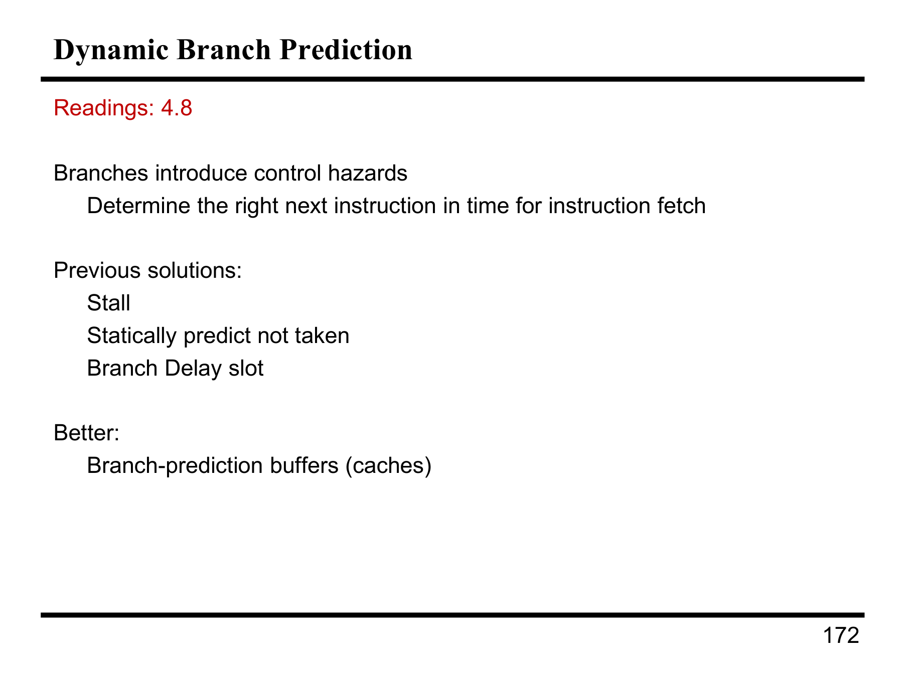

这页是**动态分支预测**（Dynamic Branch Prediction）的开场白：分支会带来**控制相关/控制冒险**，取指时必须“马上”知道**下一条该从哪儿取**；如果等真正算出分支结果再决定，流水线就会**空转或回滚**，性能掉得很厉害。

## 以前用过的简单招

* **Stall（停顿）**：遇到分支先不取新指令，等结果出来再继续——最安全、但最慢。
* **静态预测 not taken**：假设分支“**不跳**”（或用固定规则，如后退跳转预测跳转、前进预测不跳）。实现容易，但对真实程序（有循环、if/else）的命中率有限。
* **Branch delay slot（延迟槽）**：规定分支后紧跟的一条始终执行，让硬件不用立即知道分支去向——需要编译器填槽，现代高性能 CPU 已很少采用。

## 更好的办法：**动态分支预测器 = 一种“缓存”**

* 思想：**用过去的行为预测未来**。把每个分支最近的“跳/不跳”模式和跳转目标**存进小表**，下次取到该分支时**瞬间给出预测**与**目标地址**，流水线无缝向前。
* 典型部件：

* **BHT（Branch History Table）/方向预测表**：按分支 PC 索引出一个小状态（最常见是**2-bit 饱和计数器**：强跳/弱跳/弱不跳/强不跳），给出“跳还是不跳”的预测，并在真实结果出来后**训练更新**。
* **BTB（Branch Target Buffer）/目标缓冲**：像指令缓存那样以分支 PC 为键，缓存**目标地址**。一旦预测“跳”，**立即**把 PC 设为该目标继续取指。
* （更高级）**全局/局部历史**、**gshare**、**TAGE**、甚至**感知器/神经预测器**，用更长的历史相关性提高命中率。
* **投机执行**：根据预测先把后续指令送入流水线；如果**预测错了**，就**冲刷（flush）**错误路径上的指令，恢复正确 PC，并**惩罚性地**更新预测器（这就是“误预测开销”）。

## 为什么有效

* 程序里大量分支有**强模式**（比如循环的“跳”会连续发生很多次，直到最后一次“退出”才不跳）——2-bit 计数器可以把最后一次的反转影响降到最低。
* 命中率常可达 **90%+**，配合深流水/乱序执行，显著降低控制冒险带来的 CPI 增量。

## 小例子（2-bit 计数器）

* 初始“弱不跳”。遇到循环体末尾的后退分支：第一次预测错（改成“弱跳”），之后每次都预测“跳”命中；直到循环结束那次预测“跳”错一次（降到“弱跳”）。**长串命中 + 极少数失误**。

**一句话**：这页告诉你，和“停顿/固定规则/延迟槽”相比，**把分支当“可缓存的模式”来记忆和预测**，能在取指阶段就给出**方向 + 目标**，把控制冒险的大头性能损失降到最低。


---

## 第 2 页

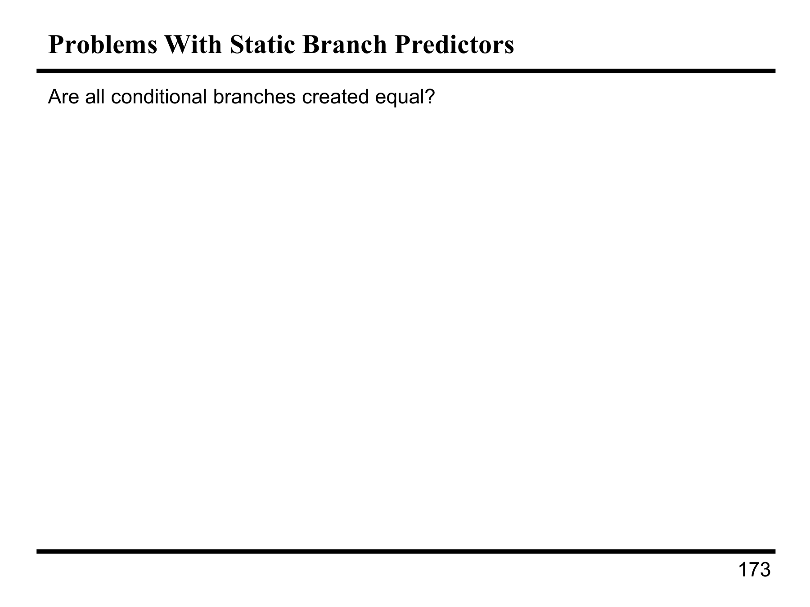

这页抛出一个问题：**“静态分支预测有什么问题？所有条件分支都一样吗？”**
答案：**不一样。**不同类型的分支有截然不同的行为模式，**静态**规则（如“总是不跳”“后退预测跳/前进预测不跳”BTFNT）**无法同时适配所有情况**，也**无法随输入数据变化而自我调整**，所以准确率有限。

## 为什么“分支不一样”

1. **偏好（bias）不同**

* **循环回边**：大多时间 **跳转（T）**，直到最后一次 **不跳（N）**。
* **错误检查/边界检查**：大多 **不跳**（少数异常才跳）。
* **if-else 数据依赖**：跳不跳比率受输入强烈影响。

2. **模式（pattern）不同**

* **强偏置**：TTTT…N（循环退出）——静态能大致押对，但**最后一次**必错。
* **交替**：TNTNTN…（奇偶、翻转状态机）——“固定规则”必然**一半错**。
* **阶段性/相位性**：一段时间几乎全 T，下一段几乎全 N——静态无法跟随相位切换。

3. **相关性（correlation）**

* 许多分支**相互相关**：例如 `if(a){...}` 之后又检查 `a`；或“函数返回是否为 null”依赖前面调用是否成功。
* 静态预测**看不到历史**，不能利用这种相关性；动态预测可以用**历史位/全局历史**把握关系。

4. **目标预测**

* 间接跳转/函数返回（目标地址随调用点变化）**更难**：静态很难给出正确目标；动态用 **BTB/返回地址栈（RAS）** 可高命中。

5. **对输入敏感**

* 静态方案与**数据分布**不匹配时，准确率会骤降；动态能用**实际运行的结果**持续训练，适应不同数据集。

## 直觉对比

* **静态**（如 Always Not-Taken，或 BTFNT）

* 简单、零表项；但平均准确率常只有 **\~55–70%**，一旦模式改变就无能为力。
* **动态**（如 2-bit 饱和计数器 + BTB，或更高级 TAGE/感知器）

* 记录每个分支**最近的行为与目标**，能随程序相位与输入**自学习**；准确率常 **90%+**。

## 小结

“Are all conditional branches created equal?” **No.**
分支的**偏置、模式、相位与相关性**千差万别，**静态预测**无法同时覆盖这些差异，也无法随运行时变化调整；因此现代处理器使用\*\*动态分支预测器（带历史与目标缓存）\*\*来显著降低控制冒险带来的性能损失。


---

## 第 3 页

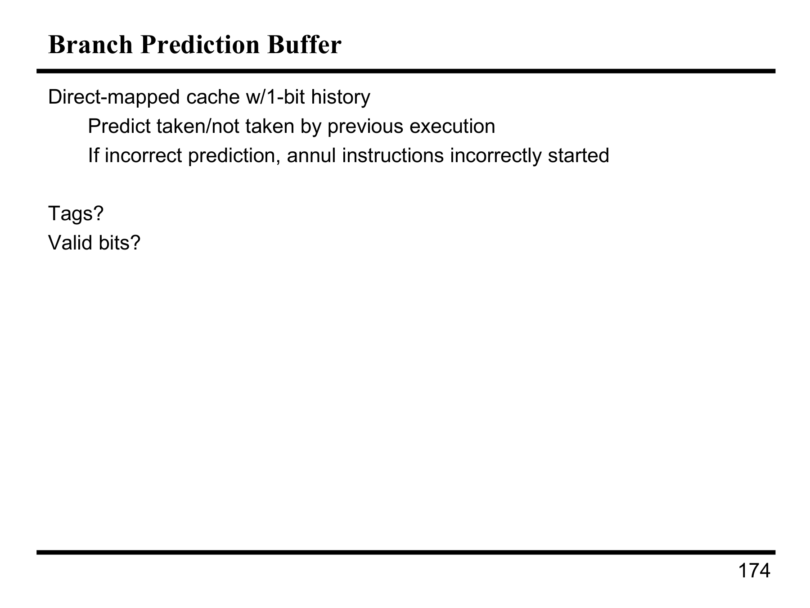

这页讲的是**分支预测缓冲器（Branch Prediction Buffer，常称 BHT）**的一种极简实现：
把它当成**一个“直接映射的小缓存”**，每个表项里只存**1 位历史**（上一次这条分支是“跳/不跳”）。

## 工作方式

1. 取指阶段，用**分支指令的 PC**做索引，查表得到该表项的 **1-bit 历史位**：

* `1` → 预测 **Taken（跳）**
* `0` → 预测 **Not-Taken（不跳）**
2. 处理器按预测去**继续取下一条**（若预测跳，配合 BTB 取到目标地址；若只做方向预测，就先按“不跳=顺序地址”取）。
3. 等真正执行到这条分支、结果出来后：

* **命中**：继续前进；
* **错了**：**冲刷/取消（annul/flush）**错误路径上已开始的指令，改成正确 PC 重新取，并**用真实结果更新这 1 位**。

## 为什么说它像“cache”

* **直接映射（direct-mapped）**：用 PC 的部分位当 index，一次只命中一个固定表项。
* **会冲突**：不同分支可能映到同一表项，互相覆盖，造成错误预测。
* 因此需要像缓存一样存：

* **Tag**：用 PC 的高位作**标记**，确认表项是不是当前这条分支的；否则视为未命中/无效。
* **Valid bit**：表项是否已被初始化，冷启动时用它来避免脏数据。

> 这也是幻灯片下面 “**Tags? Valid bits?**” 在提醒你的：**要像 cache 那样设计**，否则冲突和冷启动会导致一堆误判。

## 1 位预测器的优缺点

* ✅ 极其简单、面积/能耗低，能显著好过“固定不跳”。
* ❌ **对循环不友好**：对模式 `TTT…T N TTT…`（循环尾一次不跳）

* **最后一次**会错（还以为 T）。
* 更新成 N 之后，**下一次循环的第一次**又会错（预测 N，但实际 T）。
* ⇒ **每个循环两次误判**。
* 这也是为什么实际常用**2 位饱和计数器**：把“弱/强 跳/不跳”分成 4 态，循环只在**退出那次**错一次。

## 如果配 BTB（目标缓冲）

* 方向预测说“跳”时，要**同时**给出**目标地址**才能零气泡地继续取指；这需要 BTB 存目标 PC，组织形式与上面类似（也需要 **Tag/Valid**）。

**小结**：
“Branch Prediction Buffer = 直接映射的小表 + 每项 1 位历史（外加 Tag/Valid）”。它按**上一次结果**预测“跳/不跳”，错了就**冲刷并更新**。简单好用，但对循环会产生“两次误判/循环”的经典问题，因此实际硬件通常升级为\*\*2 位（或更高级）\*\*的动态预测器，并配合 **BTB** 提前给出跳转目标。


---

## 第 4 页

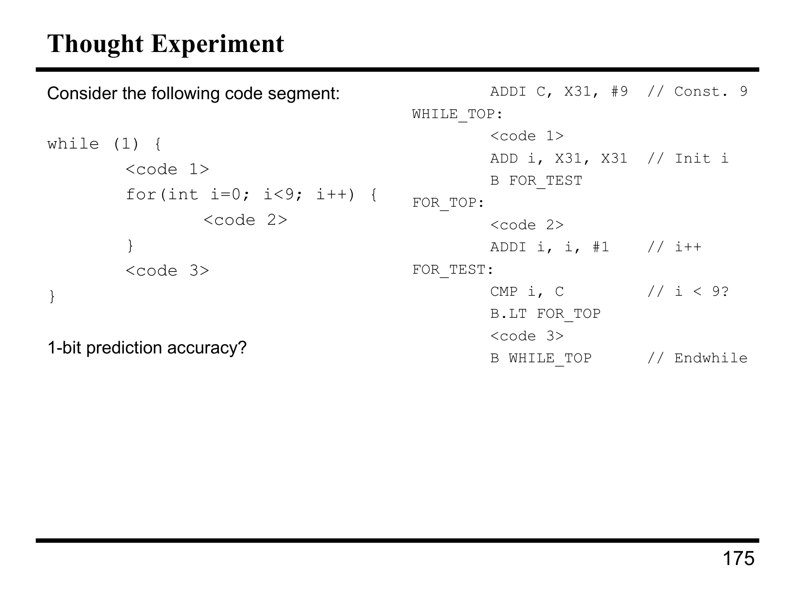

这页是一个“脑洞实验”，用**嵌套循环**来考察**1 位分支预测器**（用上一次结果预测这一次）的准确率。

## 代码逻辑（右侧伪汇编）

* `while (1) {...}` 外层死循环
* 内层 `for (i=0; i<9; i++)`

* `FOR_TEST:` 做 `CMP i,C`（C=9），随后 `B.LT FOR_TOP`
* 也就是**当 i<9 时跳回** `FOR_TOP` 继续下一次循环
* 跳出 for 后执行 `<code 3>`，然后 `B WHILE_TOP` 再回到外层 while 顶部

所以**内层条件分支**（`B.LT FOR_TOP`）在每次外层 while 迭代中呈现的方向序列是：

```
T, T, T, T, T, T, T, T, T, N     // 9 次跳转后，1 次不跳出循环
```

## 1 位预测器对这个分支的表现

1 位预测器只记“上一次是 T 还是 N”。对上面模式会发生：

* 在**退出那次**（最后一个 N），它仍预测 **T** → **错一次**，并把状态改成 N；
* 外层 while 进入下一轮，内层 for 的**第一次判断**实际上是 **T**，但状态是 N → **再错一次**，然后改回 T；
* 之后 8 次 T 都对，直到再次遇到 N 又重演上述两次错误。

因此**稳态**下每轮外层 while：

* **10 次判断**（9T+1N），**错 2 次** → **准确率 = 8/10 = 80%**。
* 若算上程序刚启动的第一次（冷启动），还会多 1 次额外失误（初始状态未知/假设 N），第一轮可能 **7/10 = 70%**，之后稳定在 **80%**。

> **要点**：1 位预测器对“TTT…TN”这种循环退出模式，**每个循环会错两次**（退出那次 + 下一轮的第一次）。

## 其它分支

* `B WHILE_TOP` 是**无条件跳转**，无需方向预测（或总被视为“必跳”），等效**100%**。

## 延伸：2 位饱和计数器

若用**2 位**预测器（强/弱 T,N 共 4 态），对同样模式每轮只在**退出那次**错一次：

* **9/10 = 90%**，明显优于 1 位的 80%。
这也是现代预测器至少使用 2 位计数器的原因。


---

## 第 5 页

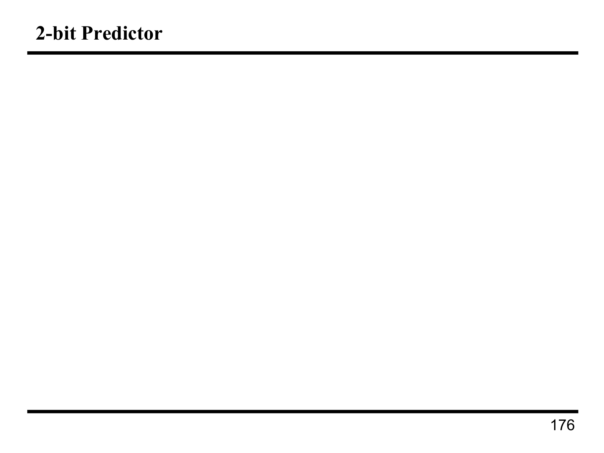

这页标题是 **“2-bit Predictor”**，指最经典的**2 位饱和计数器分支预测器**。它是动态分支预测里从 1 位升级的第一步，几乎所有现代 CPU 都至少用到它。

## 核心思想

用 **2 个比特**表示一个**带“惯性/迟滞（hysteresis）”**的状态机，按状态预测“跳/不跳”，真实结果出来后再**朝正确方向移动 1 格**，并在边界**饱和**（不再越界）。

### 4 个状态（常见编码）

* `00`：**强不跳** (Strong Not-Taken, SNT)
* `01`：**弱不跳** (Weak Not-Taken, WNT)
* `10`：**弱跳** (Weak Taken, WT)
* `11`：**强跳** (Strong Taken, ST)

**预测规则**：左两格（00/01）预测 **不跳**；右两格（10/11）预测 **跳**。
**更新规则**：

* 实际 **跳**：状态 → 向右移动 1（例如 01→10，10→11）；11 维持 11。
* 实际 **不跳**：状态 → 向左移动 1（例如 10→01，01→00）；00 维持 00。

> 这就是“饱和计数器”：只在 0↔3 之间移动，不能再小/再大。

## 为什么比 1 位好

1 位用“上次结果”预测“这次”，对循环模式 `TTT…TN` 每轮**错两次**（退出那次 + 下一轮第一次）。
2 位因为有**弱/强**两个层级，**短暂的一次反转不会立刻翻面**：

* 长期为跳（11），退出时出现 N → 退到 `10`（弱跳）但仍预测跳；
* 下一轮第一次又是 T → `10`→`11`，只**错一次**（退出那次）。
对 9 次 T + 1 次 N 的循环，准确率从 **80%（1 位）** 提升到 **90%（2 位）**。

## 放在硬件里长什么样

* **BHT（Branch History Table）**：像一个小缓存表，用分支 PC 的索引找出该 2-bit 计数器（还会带 **tag/valid** 防止冲突误用）。
* **BTB（Branch Target Buffer）**：若预测“跳”，同时从 BTB 读出**目标地址**，取指不间断。
* **更新时机**：分支真正执行并得出结果时，更新该 2-bit 计数器（以及 BTB 的目标，如有变化）。

## 行为直觉与边界情况

* **强偏置分支**：很快稳定在 00 或 11，几乎都命中。
* **交替分支（TNTN…）**：2 位也无能为力（平均接近 50%），需要更高级的相关/历史型预测。
* **相位变化**：从“常跳”变“常不跳”时，需要 2 次错误才翻面——这就是“迟滞”，用少量失误换来对偶发反转的**鲁棒性**。

## 实现小细节

* **初始化**：常设为“弱不跳”或“弱跳”，冷启动影响很快被训练覆盖。
* **别名/冲突**：不同分支映射到同一表项会互相干扰（像 cache 冲突）；可增表大小、改索引（例如 gshare 异或全局历史）来减轻。
* **能耗延迟**：查 BHT/BTB 在取指前段并行完成，不增加关键路径太多。

**一句话总结**：2 位饱和计数器给分支方向预测加入了**记忆的“力度”**，对“偶尔反转”的真实程序更稳，成本极低却显著提升命中率，是动态预测的基础积木。


---

## 第 6 页

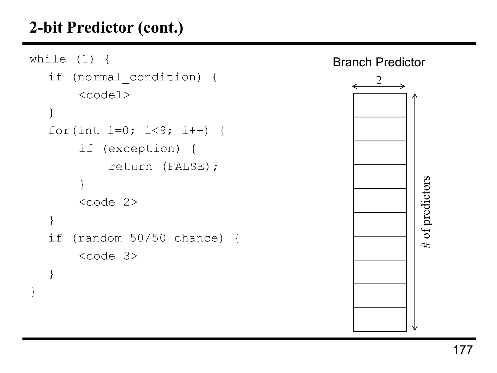

这页在说明**2-bit 分支预测器在真实程序里的用法与效果**。

右图那根“柱子”就是一个**BHT（Branch History Table）**：

* 竖着有很多**表项**（`# of predictors`），每个表项只存**2 个比特**的饱和计数器；
* 宽度标了 **“2”**，强调“每个分支点各有**2 位状态**”；
* 取指时用**分支指令的 PC**当索引找到它自己的那一格，读出 2 位状态来预测 **Taken/Not-Taken**，执行完再按结果把状态**向左/向右移动 1**（00/01 预测不跳；10/11 预测跳）。

左边代码给了三类常见分支，想让你对比 2-bit 的表现：

1. `if (normal_condition) { <code1> }`

* 假设 `normal_condition` 大多数情况下恒定（例如常为真或常为假），这叫**强偏置**。
* 2-bit 很快稳定在 **强跳/强不跳**状态，预测几乎全中（偶尔反转只损失 1～2 次）。

2. `for (i=0; i<9; i++) { if (exception) return FALSE; <code2> }`

* 外层循环条件 `i<9` 是经典模式 **TTT…T N**（循环退出）：2-bit 每轮只在**最后一次 N**错一次，准确率 ≈ **9/10=90%**（比 1-bit 的 80% 好）。
* `if (exception)` 少数情况下才触发 `return` → **强不跳**分支，2-bit 也几乎全中；当出现一次异常，从“强不跳”向“弱不跳”再到“弱跳”，只会付出**1～2 次**错判成本。

3. `if (random 50/50 chance) { <code3> }`

* 完全**随机 50/50** 的分支没有可学习的规律，2-bit 在 `01↔10` 间来回晃，准确率接近 **50%**（任何方向预测器都无能为力，除非利用更高层信息）。

**关键点**

* **每个分支点有自己的一格 2-bit 计数器**（由 PC 定位），互不干扰；这就是图右“很多格子”的含义。
* 表项像 cache 一样可能会有**别名/冲突**（不同分支映到同一格），通常用更大的表或带 tag 的 BTB/BHT 来缓解。
* 2-bit 的“**迟滞**”可以过滤掉偶发反转：一次反转只把“强”变成“弱”，不会立刻翻面，从而显著提升循环和强偏置分支的命中率。
* 对**目标地址**，需要配合 **BTB**（目标缓冲）才能在预测“跳”时**立刻给出跳到哪儿**，避免取指停顿。

一句话：右图是“**每个分支一个 2-bit 状态机**”的直观示意；左侧三类分支分别对应**强偏置≈近乎全中**、**循环≈每轮错一次**、**随机≈50%**，展示了 2-bit 预测器“对有规律的分支很稳、对纯随机无能为力”的本质。


---

## 第 7 页

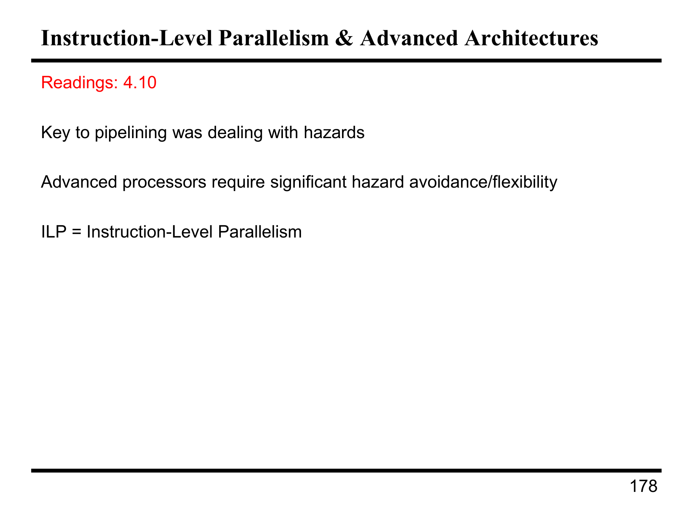

这页是“**指令级并行（ILP）与高级体系结构**”的引入页，核心点就几句话：

## 要点

* **流水线的关键**：不是把阶段切开这么简单，真正难点在于**处理冒险（hazards）**——数据相关、结构冲突、控制冒险等。如果不解决，流水线只能空转。
* **越先进的处理器**：为了把硬件利用率拉满，必须提供**更强的避险/消除相关的能力与灵活性**，否则发不出更多指令、也堆不起更深的流水。
* **ILP（Instruction-Level Parallelism）= 指令级并行**：一段程序中，**彼此独立的指令能同时（或重叠）执行的潜力**。CPU 的各种“高级招式”其实都是在**挖掘和兑现 ILP**。

## 接下来通常会展开的机制（预告/铺垫）

* **动态/静态调度**：乱序执行（Tomasulo/Scoreboard）或编译器软件调度（VLIW）。
* **寄存器重命名**：消除假相关（WAR/WAW），扩大并行窗口。
* **分支预测 + 指令预取**：减少控制冒险的停顿，维持长流水/多发射喂饱。
* **多发射（Superscalar）**：同一周期发多条，要求端口/执行单元充足且相关被处理。
* **存储层面并行**：Load/Store 队列、内存乱序、旁路与失序提交前的约束。
* **投机执行与回滚**：大胆并行、错了再撤，换命中率和恢复机制减少损失。

**一句话**：这页要你记住——**ILP 是性能的源头**；要把 ILP 变成实际吞吐，就必须有一整套**对付冒险的硬件/编译技术**（预测、重命名、乱序、多发射、投机等）。


---

## 第 8 页


这页在回答“**为什么要追求 ILP（指令级并行）**”。

## 两个优化目标

1. **缩短时钟周期（Clock period）→ 深流水（heavy pipelining）**

* 把一条指令拆成更多更细的阶段，从而每个阶段逻辑更少，**时钟频率更高**。
* 代价：**冒险更多**（数据/结构/控制），分支错判代价更大；有时还需要“**延迟槽**”“气泡”等机制来填补空转。

2. **降低 CPI（每条指令平均所需周期数）**

* 经典单发射流水线理想 **CPI≈1**（一周期出一条）。
* **如果我们想要 CPI < 1 呢？**

* 只能在**同一个周期里发多条指令**——也就是挖掘 **ILP**：

* **多发射/超标量**（一次发 2、4、8…条）
* **乱序执行、寄存器重命名、旁路**（消除相关与等待）
* **分支预测 + BTB、投机执行**（减少停顿）
* **多端口/多执行单元**（避免结构冲突）
* （有时再配合 **SIMD/向量**，但那是数据级并行 DLP）

## 直觉数字

* 理论上：双发射若完全无相关/不命中，**CPI→0.5**；四发射可→0.25。
* 现实中会被相关、cache miss、分支错判等拉高，所以需要上述“高级机制”把 ILP **尽可能兑现**。

**一句话**：
*深流水*追求更高频率，但带来更多冒险；要想**吞吐继续提升**，就必须用 ILP 让处理器**同周期执行多条指令**，把 **CPI 压到 1 以下**。


---

## 第 9 页

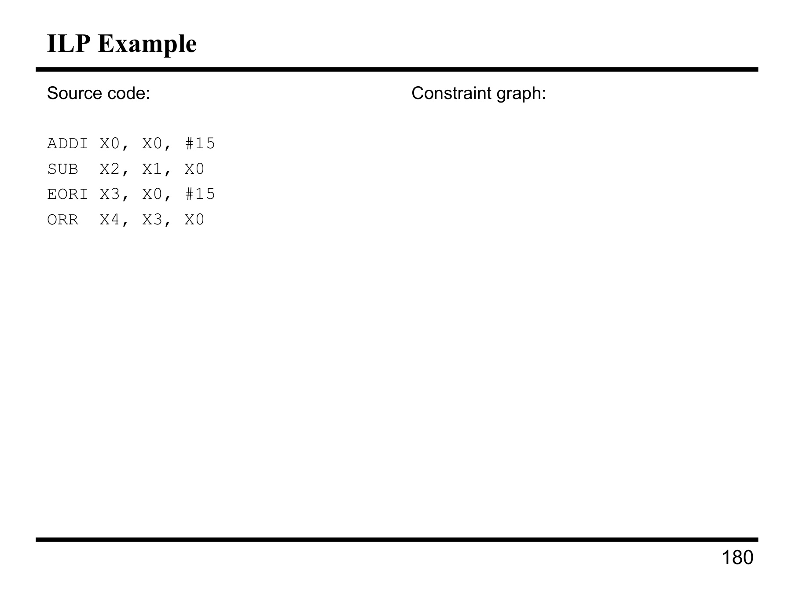

这页是一个小型 **ILP（指令级并行）** 例子：给出一段指令，然后要你画出 **约束图（constraint graph）**，看哪些指令可以并行、哪些必须按依赖顺序执行。

## 指令

```
I1: ADDI X0, X0, #15     ; X0 ← X0 + 15
I2: SUB  X2, X1, X0      ; X2 ← X1 - X0
I3: EORI X3, X0, #15     ; X3 ← X0 XOR 15
I4: ORR  X4, X3, X0      ; X4 ← X3 OR X0
```

## 依赖关系（RAW 真相关）

* **I2 依赖 I1**：I2 读 `X0`，而 I1 写 `X0` → `I1 → I2`
* **I3 依赖 I1**：I3 读 `X0`，而 I1 写 `X0` → `I1 → I3`
* **I4 依赖 I3**：I4 读 `X3`，而 I3 写 `X3` → `I3 → I4`
* **I4 也依赖 I1**：I4 还要读 `X0`（由 I1 写） → `I1 → I4`

没有 WAW / WAR（每条都写不同寄存器，早期指令也不读被后面写的寄存器）。

## 约束图（用文字描述）

* 节点：{I1, I2, I3, I4}
* 边：I1→I2，I1→I3，I3→I4，I1→I4
（形状像一只“Y”：I1 分叉到 I2、I3；I4 从 I3 再往后，同时还连着 I1）

## 能并行到什么程度？

* **I2 与 I3 互不依赖**（都只依赖 I1），因此在 **I1 完成产生 X0 之后**，它们可以**并行**执行（前提：有两个整数 ALU/发射槽）。
* **I4 必须等 I3（X3）完成**，也等 I1 的 X0（通常 I1 早就有了），所以 I4 只能在 I3 之后执行。

### 一个可能的调度（有转发，双发射）

* 周期1：发射/执行 **I1**
* 周期2：**I2 与 I3** 同周期执行（用转发/旁路拿到 I1 的 X0）
* 周期3：**I4**（用到 I3 的 X3）

结果：3 个周期完成 4 条指令，等效 **CPI < 1**（吞吐提升）。
若是单发射且无并行，通常需要 4 个周期（不计气泡）。

> 结论：通过画出依赖（约束图），我们能看到可并行的部分（I2 与 I3），并据此在超标量/乱序处理器上挖掘 ILP，提高吞吐。


---

## 第 10 页

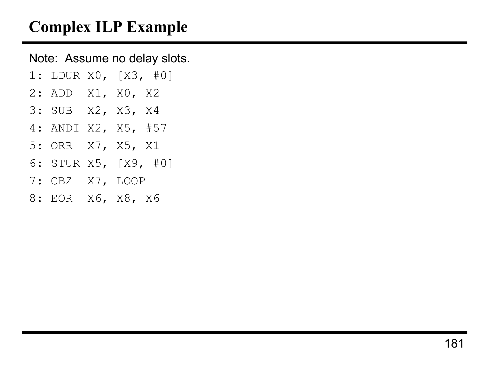

这页给了一段“更复杂”的指令序列，要你做 **ILP（指令级并行）分析**：画出依赖关系/能否并行、找关键链路，并给出一种可并行调度（假定没有 delay slot）。

## 指令（编号便于引用）

1. `LDUR X0, [X3,#0]`      ─ 载入 `X0`
2. `ADD  X1, X0, X2`       ─ 用 `X0` 计算 `X1`
3. `SUB  X2, X3, X4`       ─ **重写** `X2`
4. `ANDI X2, X5, #57`      ─ 再次**重写** `X2`
5. `ORR  X7, X5, X1`       ─ 需 `X1`、`X5`
6. `STUR X5, [X9,#0]`      ─ 把 `X5` 存到内存（不改寄存器）
7. `CBZ  X7, LOOP`         ─ 分支，读 `X7`
8. `EOR  X6, X8, X6`       ─ 与其他指令无关（只动 `X6`、`X8`）

> 备注：默认 `LDUR [X3]` 与 `STUR [X9]` 地址不同，不构成内存相关；若可能别名则需额外内存依赖。

---

## 依赖关系（DAG）

* **RAW 真相关**

* `1 → 2`（2 读 1 产生的 `X0`）
* `2 → 5`（5 读 2 产生的 `X1`）
* `5 → 7`（7 读 5 产生的 `X7`）

* **反相关 WAR（读后写）**
2 需要**旧的** `X2`，而 3/4 会写 `X2`：

* `2 → 3`（确保 2 在 3 写 `X2` 前读到旧值）
* `2 → 4`

* **输出相关 WAW（写后写）**
3、4 都写 `X2`，程序次序为 `3 → 4`，最终以 `4` 的写入为准：

* `3 → 4`

* **完全独立**
`6(STUR)` 与链路无寄存器依赖（只读 `X5`、`X9`）；
`8(EOR)` 独立于其他所有指令。

> 因此**关键链路**是：`1 → 2 → 5 → 7`（Load→Add→Orr→Branch）。其余 3、4、6、8 都可围绕它并行穿插。

---

## 能并行到什么程度？

若有**双发射**、单周期 ALU，Load 延迟不长（有转发），可做如下示例调度（仅示意，多种答案都行）：

* **Cycle 1**：`1(LDUR)` ∥ `6(STUR)`（访存端口足够时可并行）
* **Cycle 2**：`2(ADD)`  ∥ `8(EOR)`（2 用到 1 的 `X0`；8 独立）
* **Cycle 3**：`3(SUB)`  ∥ `5(ORR)`（二者都只依赖 2 已完成的 `X1`/旧 `X2`）
* **Cycle 4**：`4(ANDI)` ∥ `7(CBZ)`（7 依赖 5 的 `X7`；4 仅依赖 3）

这样 8 条指令 **4 个周期** 完成，**IPC≈2**。
若 **Load 延迟更长**，可把 `6/8/3` 前移来**掩蔽**载入延迟；若访存端口受限，`1` 与 `6` 需分开周期。

---

## 观察与结论

* 这段代码里，真正串行的只是 `1→2→5→7`；其它指令多为**旁枝**，适合用来填充并行槽位。
* `2` 与 `3/4` 的关系是 **WAR（反相关）**：为了保持 2 读到**旧 `X2`**，调度时不能把 3/4 移到 2 的前面。
* `3→4` 是 **WAW（输出相关）**：两次写同一寄存器，必须保持最终效果与顺序一致（或用**寄存器重命名**消除 WAW）。
* `7` 是控制冒险的根源，因此 `2→5→7` 上的预测/投机能力会直接决定吞吐。

**要点**：通过画出依赖图并识别关键链，可以把独立指令（3、4、6、8）塞进关键链两侧，从而提升并行度/降低 CPI；更高级的硬件（乱序、重命名、分支预测）能在不改变程序语义下自动挖掘这些并行。


---

## 第 11 页

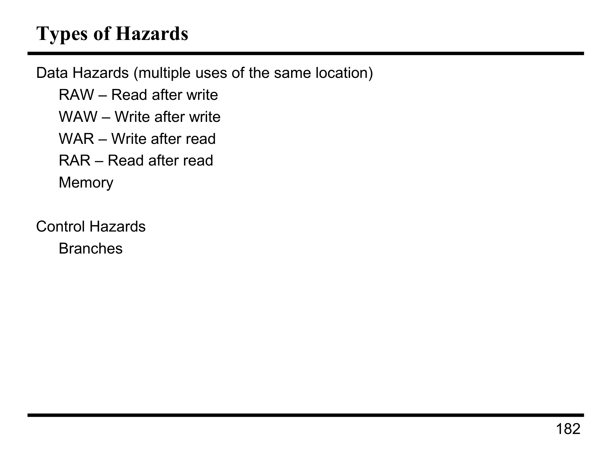

这页在总结**流水线中的“冒险”（Hazards）类型**——为什么会卡顿、错结果，分别怎么处理。

## 一、数据相关（Data Hazards）

指**同一位置（寄存器或内存）被多条指令在不同阶段使用**导致的冲突。

* **RAW（Read After Write，写后读，真相关）**
后面的指令要**读**一个值，但前面的指令**尚未写完**。
例：`I1: ADD X1,...`（写X1）→ `I2: SUB ...,X1`（读X1）。
处理：**数据旁路/转发（forwarding）**、必要时**插入气泡（stall）**、或**重排指令**让独立指令填空。

* **WAW（Write After Write，写后写，输出相关）**
两条指令都**写**同一个位置，若顺序被打乱，结果会被后写覆盖出错。
例：`I1: ... → X2`，`I2: ... → X2`（程序语义要求 I2 的值为最终值）。
处理：**保持程序次序提交**；在乱序机器中用**寄存器重命名**把“同名不同生存期”的写分开。

* **WAR（Write After Read，读后写，反相关）**
后面的指令**写**某位置，而前面一条**还没完成读**，如果乱序会让读看到被提早写的新值。
例：`I1: ... X3 → 使用`；`I2: ... → X3`。
处理：**寄存器重命名**消除假相关，或在保守流水中**约束发射顺序**。

* **RAR（Read After Read，读后读）**
都是读，不会改变值，**没有冲突**，可并行执行。

* **Memory（内存相关）**
载入/存储之间的依赖，既有 RAW/WAW/WAR，也有**地址别名不确定**的问题。
例：`ST [A]` 后紧跟 `LD [A]`（RAW）；或者 `LD [p]` 与 `ST [q]` 若编译期不知 `p==q` 否则需保守。
处理：**Load/Store 队列、地址计算与别名检测**、**内存一致性/屏障（fence）**；若能证明无别名可并行。

> 小结：RAW 会影响**正确性与时序**，最常见；WAW/WAR多由**同名寄存器**引起，靠**重命名**根治。

## 二、控制冒险（Control Hazards）

* **分支（Branches）**：下一条该取哪条指令不确定，取错就得**回滚/清管线**。
处理：**分支预测（静态/动态，1/2位饱和、局部/全局历史、BTB）**，**提前计算分支目标**，**投机执行+回退**，或在简单机型里**停顿**。

---

### 常见对策汇总

* RAW：**转发 + 必要时 stall**；编译器/硬件**重排**。
* WAW/WAR：**寄存器重命名**（乱序/Tomasulo/ROB）。
* 内存相关：**LSQ/别名分析/地址比较**、必要时**序化**、使用**内存屏障**。
* 控制冒险：**高精度预测**、**更早决策**（早算目标/条件）、**投机与回滚**；或保守**停顿**。

理解这些冒险类型与化解手段，是从**单发射流水线**走向**高 ILP 的超标量/乱序架构**的基础。


---

## 第 12 页

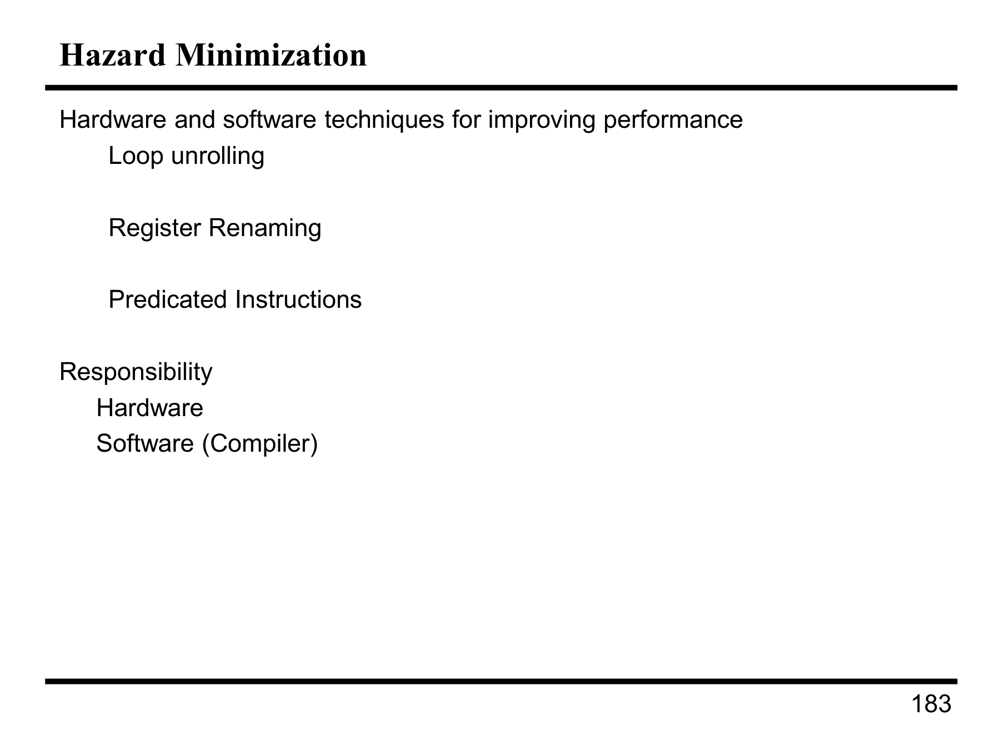

这页讲的是：如何**最小化流水线中的冒险（hazards）**，以提升性能。手段既有**硬件**也有\*\*软件（编译器）\*\*层面的。

## 三个常用技巧

1. **Loop unrolling（循环展开）**
把循环体复制多份、每次迭代处理多条数据，减少分支判断与循环控制开销，并创造更多可并行的独立指令来填满流水线。

* 作用：

* 降低**控制冒险**频率（分支更少）。
* 增大**指令级并行度（ILP）**，有利于乱序/超标量并行。
* 更容易安排**软件层面的寄存器重命名**、避免短距离 RAW。
* 代价：代码体积变大，寄存器压力上升，可能增加指令缓存压力。

2. **Register Renaming（寄存器重命名）**
把“同名但不同生命周期”的写入映射到不同的物理寄存器，**消除假相关**：

* 消除 **WAW（写后写）** 与 **WAR（读后写）**，只留下真正的数据依赖 **RAW**。
* 硬件版：乱序处理器用重命名表 + 物理寄存器文件 + ROB 实现。
* 软件版：编译器在 SSA/寄存器分配阶段用不同的虚拟寄存器，使指令间更独立、便于调度。

3. **Predicated Instructions（谓词化/带条件的指令）**
把小分支转换为“按条件写回”的指令（如 `cmov`、条件算术、ARM 的 predication）。

* 作用：减少**控制冒险**，在预测容易错的小 if/else（且两边计算代价不大）时尤其有效。
* 代价：可能会“多做无用功”（两条路径都执行)，不适合大块工作或高代价路径。

## 责任分工（谁来做）

* **Hardware（硬件）**

* 动态寄存器重命名、转发/旁路、乱序执行、回滚恢复、分支预测、BTB/局部-全局历史、Load/Store 队列与别名检测。
* 目标：在不改程序语义的前提下自动挖掘 ILP，尽量消除 WAW/WAR、隐藏 RAW 延迟、降低分支误预测代价。
* **Software / Compiler（编译器）**

* 循环展开、指令调度（把独立指令塞到延迟槽）、寄存器分配与**软件重命名**、矢量化、分支概率引导（PGO）、小分支谓词化、内存别名分析（让更多 load/store 可并行）。
* 目标：提前把代码组织得更“流水线友好”，让硬件更容易跑出高并行度。

### 小结

* **RAW** 主要靠：转发、指令调度（编译器/硬件），必要时 stall。
* **WAW/WAR** 主要靠：**寄存器重命名**（硬件或编译器）。
* **控制冒险** 主要靠：**分支预测**、**谓词化**、**循环展开**（降低分支密度）。
* 两端协同（硬件 + 编译器）才能把 CPI 压低、时钟拉高，最大化吞吐与能效。


---

## 第 13 页

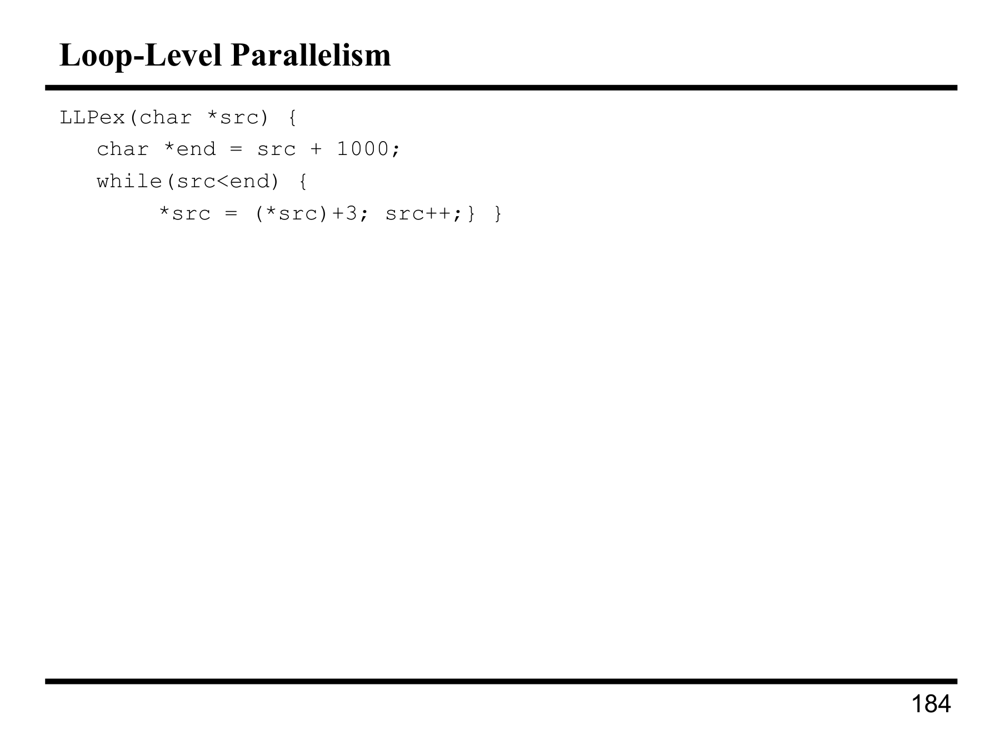

这页标题是 **Loop-Level Parallelism（循环级并行性）**，用右上角的小函数来说明“一个循环的各次迭代能否并行/向量化”。

```c
LLPex(char *src) {
char *end = src + 1000;
while (src < end) {
*src = (*src) + 3;   // 把当前字节加 3
src++;               // 指向下一个字节
}
}
```

## 这段循环的依赖关系

* 第 *i* 次迭代只**读写地址 `src+i` 的同一个字节**，与第 *i+1* 次迭代操作的地址 `src+i+1` **互不相干**。
* 因此**没有跨迭代数据依赖（loop-carried dependence）**：每次迭代的结果不依赖其他迭代的结果。
* 指针 `src` 的自增是**归纳变量**（induction variable），属于**控制/地址生成依赖**，不阻碍数据层面的并行。

> 结论：这个循环**天然适合并行/向量化**（SIMD）或一次发射多条指令（超标量/乱序把多次迭代重叠执行）。

## 能用的优化

* **循环展开（unrolling）**：一次处理多个元素，减少分支开销、提高 ILP。
例如 4 次展开：

```c
for (; src + 3 < end; src += 4) {
src[0] += 3; src[1] += 3; src[2] += 3; src[3] += 3;
}
// 收尾处理不足 4 个的元素
```
* **向量化（SIMD）**：用 16/32 字节宽寄存器一次给多字节 +3。
编译器可自动做（-O3/auto-vectorize），或用 intrinsics。
* **软件流水（software pipelining）/预取**：对更复杂循环，可把加载/计算/写回跨迭代重叠；这里内存访存顺序、连续，硬件预取器通常已足够。
* **对齐/带宽**：数据连续顺序访问，缓存友好；若能按 cacheline/向量宽度对齐，SIMD 更高效。

## 需要注意的边角

* **溢出语义**：`char` 溢出会按实现定义/无符号方式回绕，这里多数架构直接回绕；若需饱和加法，必须显式处理。
* **别名/覆盖**：这是原地更新（in-place），但每次只触碰各自地址，不会影响下一次读，所以**安全**。
* **边界与长度**：示例固定处理 1000 字节；真实代码要传入长度，避免越界；向量化时要妥善处理尾部（mask/标量收尾）。

**要点**：判断循环能否并行的核心问题是——**跨迭代是否有数据依赖**。这类“逐元素独立变换”的循环没有依赖，非常适合用**循环展开 + SIMD 向量化**来榨干性能。


---

## 第 14 页

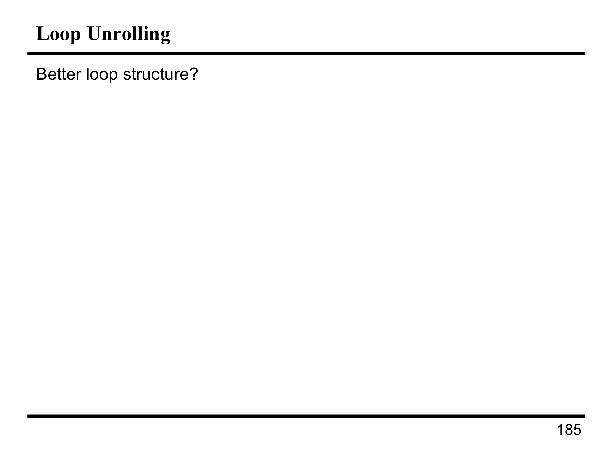

这页标题是 **Loop Unrolling（循环展开）**，小字问的是 “Better loop structure?”——意思是：有没有更好的循环写法？答案就是把循环**一次做多步**，减少控制开销、增加并行度，让流水线/乱序核心或 SIMD 更容易“吃满”。

## 循环展开是什么

把一次只处理 1 个元素的循环，改成一次处理 *k* 个元素（k=2/4/8…）。
以上一页的例子为例（对每个字节 +3）：

**原始：**

```c
for (char* p = src; p < end; ++p) {
*p = *p + 3;
}
```

**4×展开：**

```c
size_t n = end - src;
size_t i = 0;
size_t n4 = n & ~((size_t)4 - 1);   // 向下取整到4的倍数
for (; i < n4; i += 4) {
src[i+0] = src[i+0] + 3;
src[i+1] = src[i+1] + 3;
src[i+2] = src[i+2] + 3;
src[i+3] = src[i+3] + 3;
}
// 处理尾巴
for (; i < n; ++i) src[i] = src[i] + 3;
```

## 为什么这种结构“更好”

1. **更少的控制开销**
循环分支/比较执行次数从 *n* 次变成 *n/k* 次，减少分支错预测机会与指令数量。
2. **更高的 ILP（指令级并行）**
同一轮内的 k 次标量操作**彼此独立**，CPU 可并行/乱序重叠执行；编译器也更容易调度。
3. **利于 SIMD 向量化**
展开常与向量化配合：对齐、成段处理、减少循环体内的控制依赖。
4. **更好的流水线利用**
更多独立的算术/访存可填满流水线槽位，掩盖访存延迟。
5. **降低循环不变量的重复计算**
可把不变表达式提到循环外，或按批次更新指针、界限等。

## 选择展开因子时要考虑

* **工作量/迭代次数**：太小收益有限；太大则代码膨胀，I-cache 压力上升。
* **寄存器压力**：展开后同时活跃的临时变量增多，可能导致溢出到栈上（反而变慢）。
* **分支预测与尾处理**：需要妥善处理“剩余不足 k 个”的尾部元素，可用二分式“Duff’s device”或掩码/标量收尾。
* **数据对齐与带宽**：若配合 SIMD，尽量按向量宽度对齐加载/存储。
* **可并行性**：必须确保**跨迭代无数据依赖**（没有 loop-carried dependence）。上一页示例满足这一点，因此非常适合展开/向量化。

## 与编译器/硬件的分工

* 编译器在 `-O3` 常会**自动展开**与**自动向量化**；手写展开适用于编译器保守或需要特定布局时。
* 现代 CPU 的乱序与预取也会帮忙，但**良好的循环结构**（展开+去分支+对齐）能显著提升上限。

**一句话总结：**
“Better loop structure?”——把循环展开成一次处理多个元素（并尽量向量化），能减少分支开销、提高 ILP/吞吐、改善流水线利用；前提是没有跨迭代数据依赖，并注意寄存器压力、代码尺寸和尾部处理。


---

## 第 15 页

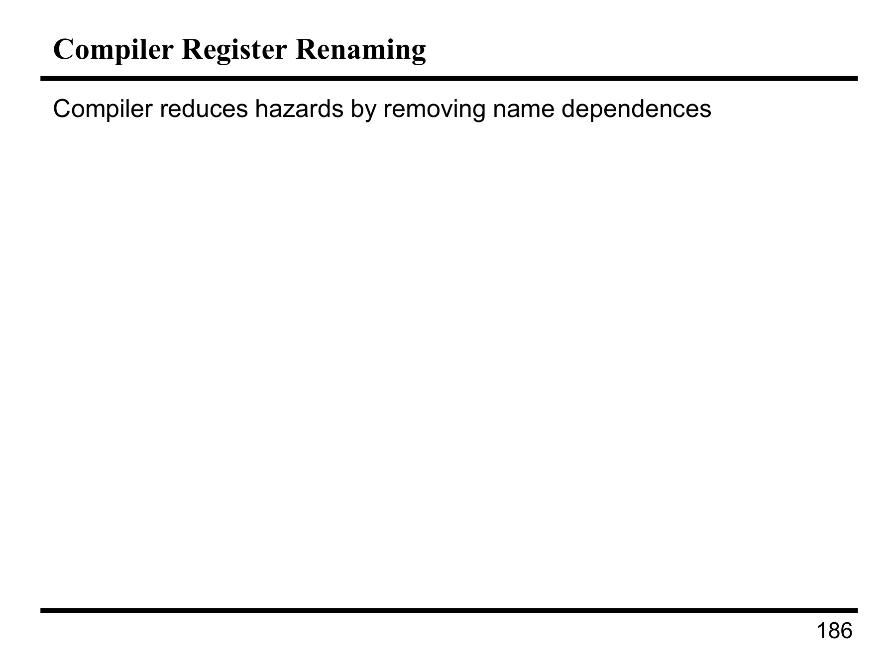

这页讲的是 **编译器做的“寄存器重命名”(Compiler Register Renaming)**。一句话：
编译器通过给不同的值分配**不同的寄存器名字**，消除**名字相关(name dependences)**，从而减少流水线/调度中的假依赖，提升并行度。

## 1. 什么是假依赖（名字相关）

* **RAW（Read After Write）读后写**：真依赖，后指令需要前指令的结果。这个不能消除。
* **WAW（Write After Write）写后写**：两条指令都写同一个寄存器，但彼此的值互不需要 → **名字冲突**。
* **WAR（Write After Read）写后读**：后一条要写到一个寄存器，但前一条还要读同一个寄存器 → **名字冲突**。
WAW/WAR 不涉及数据流，只是因为**用了同一个寄存器名**造成的调度限制，称为**名字相关**或**假依赖**。

## 2. 编译器怎么做

编译器把不同“活跃区间”的值放到**不同的寄存器**里（必要时引入新的临时寄存器），从而把 WAW/WAR 变成互不相关的指令，方便重排/并行。常见方式是把中间代码转成 **SSA 形式**（每个定义都有唯一“名字”），再做寄存器分配。

### 小例子

原代码（X0 被重复当作目的寄存器，存在 WAW/WAR）：

```
1: X0 = a + b
2: X2 = X0 - c
3: X0 = d ^ e        // 覆盖了 X0（和1存在 WAW）
4: X4 = X0 | X2      // 既用到 X0 的新值，也用到 X2
```

重命名后：

```
1: T0 = a + b        // 新值放 T0
2: X2 = T0 - c
3: T1 = d ^ e        // 另一个新值放 T1（消除 WAW/WAR）
4: X4 = T1 | X2
```

现在 1/3 两条互不相关，可并行或交叠执行；调度器也更容易把它们填满流水线。

## 3. 编译器重命名 vs 硬件重命名

* **编译器重命名**：静态进行，体现在目标寄存器分配上；能提前去掉很多冲突，让指令调度更激进。但受**体系结构寄存器数量**限制，寄存器压力大时可能**溢出到内存**（spilling）。
* **硬件重命名**（乱序处理器的 ROB / 物理寄存器文件）：运行时把建筑寄存器映射到更多的**物理寄存器**，自动消除名字相关。它不改指令序列，但能在运行时进一步解除限制。

最理想是：**编译器先尽力重命名+调度**，降低假依赖与寄存器压力；**硬件再做动态重命名**，处理剩余的限制与不可预知路径。

## 4. 关键点与注意

* 只能消除 **WAW/WAR**，**RAW 真依赖**仍需转发、重排或算法变换来隐藏延迟。
* 过度重命名会提高**寄存器压力**，导致溢出，反而变慢；编译器会权衡。
* 与 **指令调度**、**循环展开**、**软件管线化**配合效果最好：更多独立值＝更高 ILP。

**总结**：这页的核心意思是——编译器通过“寄存器重命名”去掉**名字相关**，让指令间更独立，减少流水线冒险和停顿，从而提高并行度与性能。


---

## 第 16 页

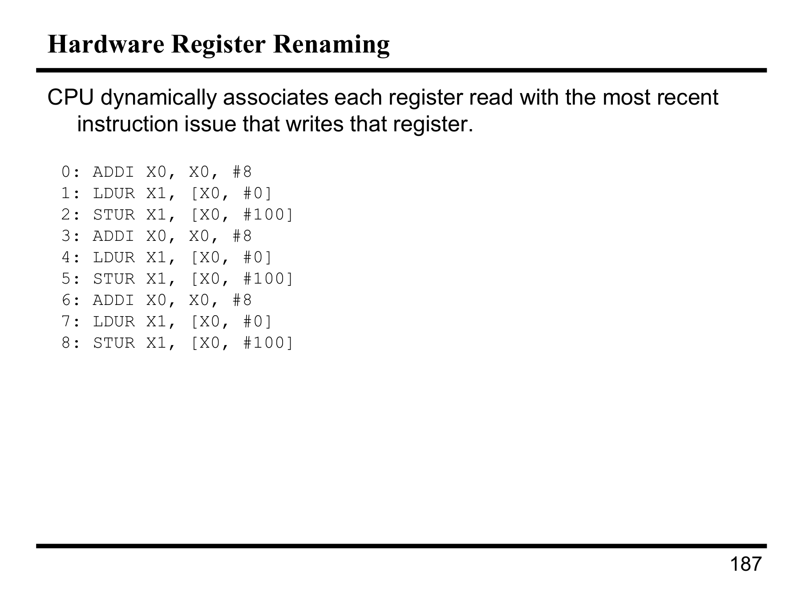

这页讲的是**硬件寄存器重命名（Hardware Register Renaming）**，配合右侧那段指令序列说明“CPU 在发射（issue）每条写寄存器的指令时，都会给它一个**新的物理寄存器/标签**；后续所有读同名寄存器的指令，都被**动态地关联**到这条“最近一次写”的产生者上”。这样可以**消除名字冲突（WAR/WAW）**，只保留真正的数据依赖（RAW），从而让乱序执行更自由。

---

## 指令序列与“版本化”的含义

```
0: ADDI X0, X0, #8        // 产生 X0 的新值
1: LDUR X1, [X0, #0]      // 用 X0 作地址，读内存到 X1
2: STUR X1, [X0, #100]    // 用 X0 作地址，把 X1 写回内存+100
3: ADDI X0, X0, #8
4: LDUR X1, [X0, #0]
5: STUR X1, [X0, #100]
6: ADDI X0, X0, #8
7: LDUR X1, [X0, #0]
8: STUR X1, [X0, #100]
```

在**重命名**眼里，虽然建筑寄存器名反复是 `X0`、`X1`，但硬件会给每次“写目的寄存器”的指令分配一个**新的物理寄存器（或 ROB 标签）**，你可以把它想成“版本”：

| 指令 | 语义（带版本）                | 说明（读谁、写谁）                       |
| -- | ---------------------- | ------------------------------- |
| 0  | `X0ᵗ¹ = X0ᵗ⁰ + 8`      | 产生 X0 的**版本 t¹**                |
| 1  | `X1ᵗ¹ = M[X0ᵗ¹ + 0]`   | 读取**最近写的** X0（即 t¹），并把结果写到 X1ᵗ¹ |
| 2  | `M[X0ᵗ¹ + 100] = X1ᵗ¹` | 同时依赖 X0ᵗ¹ 与 X1ᵗ¹                |
| 3  | `X0ᵗ² = X0ᵗ¹ + 8`      | 再产生 X0 的新版本 t²（不与 t¹ 冲突）        |
| 4  | `X1ᵗ² = M[X0ᵗ² + 0]`   | 读 X0ᵗ²，写 X1ᵗ²                   |
| 5  | `M[X0ᵗ² + 100] = X1ᵗ²` | 依赖 X0ᵗ² 与 X1ᵗ²                  |
| 6  | `X0ᵗ³ = X0ᵗ² + 8`      | 产生 X0ᵗ³                         |
| 7  | `X1ᵗ³ = M[X0ᵗ³ + 0]`   | 读 X0ᵗ³，写 X1ᵗ³                   |
| 8  | `M[X0ᵗ³ + 100] = X1ᵗ³` | 依赖 X0ᵗ³ 与 X1ᵗ³                  |

* 每次对 **X0** 的写（0、3、6）得到不同的物理寄存器（X0ᵗ¹ / X0ᵗ² / X0ᵗ³），因此**没有 WAW 冲突**；
* 第 1/2 条使用的是 **“最近写的 X0”**（X0ᵗ¹），第 4/5 条使用 X0ᵗ²，第 7/8 条使用 X0ᵗ³；
* **X1** 也同理，1、4、7 产生 X1ᵗ¹/ᵗ²/ᵗ³，2、5、8 分别消费对应版本，**没有 WAR/WAW**，只剩真正的 RAW 依赖（例如 1→2、4→5、7→8）。

**要点：** 硬件不是靠“寄存器名字”来连依赖，而是靠**重命名表（rename map）里的物理寄存器/标签**来把“消费者”连到正确的“生产者”。因此即使有多条指令同时改写“建筑寄存器 X0”，也互不阻塞；只有当确实需要前一条的结果（RAW）时才形成约束。

---

## 这样做带来的好处

1. **消除假依赖（WAR/WAW）**
指令 3 可以与 1/2 并行推进到很深的流水阶段，因为它写的是 X0 的**新物理寄存器**，不会与 1/2 读到的旧版本冲突。
2. **提高乱序/并行度**
发射队列可以把 0、3、6 这类独立算术与其它访存交叉执行，更好地隐藏延迟。
3. **提交时再映射回建筑状态**
通过 ROB/提交阶段把“当前可见的 X0/X1”指向最新已提交的物理寄存器，保持精确异常；分支错判，用 checkpoint 回滚 rename 表即可。

---

## 仍需注意：内存相关

重命名只能解决**寄存器名**带来的假依赖；**内存读写的别名**仍需靠**负载-存储队列（LSQ）**、地址比较、内存屏障等机制保证顺序正确。在这段代码中，`LDUR [X0]` 与 `STUR [X0,#100]` 地址不相同（相差 100），通常可并行；若地址可能别名，硬件会按规则约束或重放。

---

### 小结

* “CPU 动态把每次读寄存器**关联到最近一次写该寄存器的指令**”= **硬件寄存器重命名**。
* 它把每个写出的值当成**独立版本/物理寄存器**，从而**去掉 WAR/WAW**，只保留 RAW，极大提升流水并行度与乱序自由度。
* 提交/回滚由 ROB 与重命名表管理；内存别名另有 LSQ 处理。


---

## 第 17 页

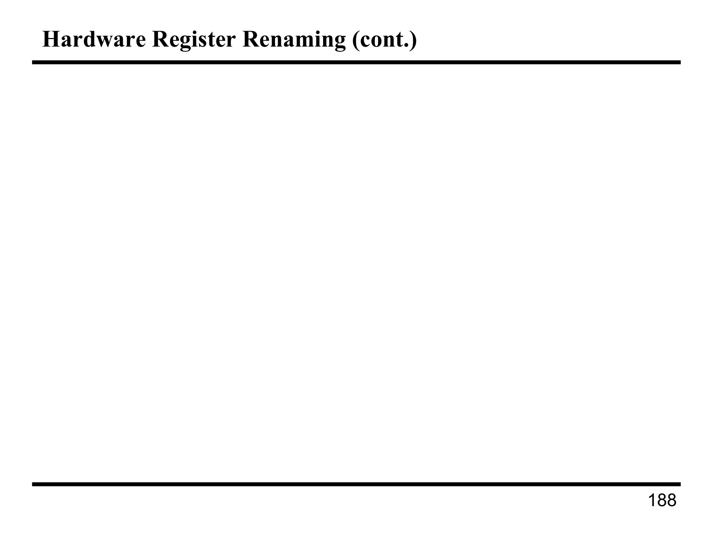

> ⚠️ 本页多次重试仍超时，稍后请手动重试。

原因：Message: 多次重试后仍超时（共 5 次），请稍后再试。


---

## 第 18 页

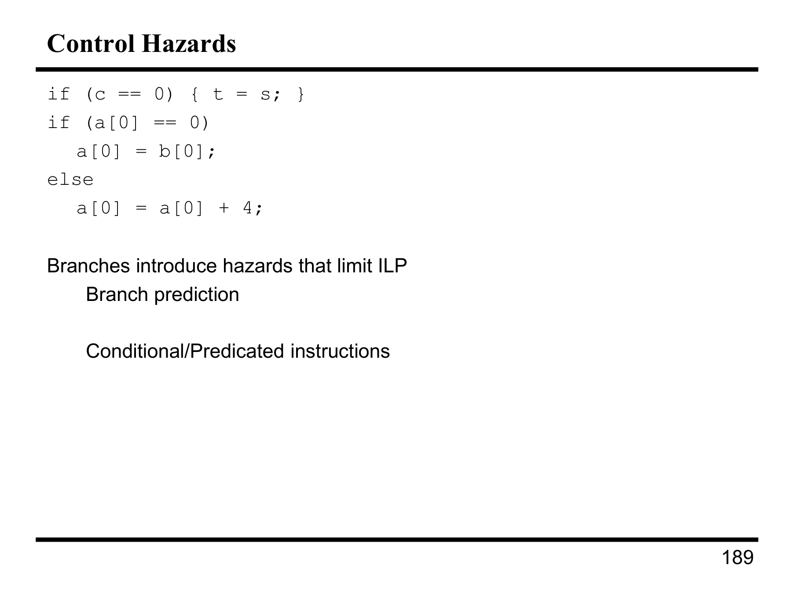

这页的标题 **“Hardware Register Renaming (cont.)”**（硬件寄存器重命名·续）意味着它是上一页的延伸，用来讲**CPU 在硬件层面上具体怎样实现寄存器重命名**。
虽然幻灯片是空的，但这个主题内容非常关键。下面是详细解释：

---

## 一、背景：为什么要“重命名寄存器”

在流水线或乱序执行（Out-of-Order Execution）中，不同指令会同时进行。
如果它们都用同一个寄存器名（比如 `X1`），即使它们**逻辑上不相关**，也会互相阻塞。
例如：

```
1: ADD X1, X2, X3
2: SUB X1, X4, X5
```

这两条指令之间存在**名字冲突（name dependence）**：

* 第一条写 `X1`；
* 第二条也写 `X1`；
所以第二条必须等第一条完成才能执行。

实际上这并不是数据依赖，只是因为它们“重名”了。
**寄存器重命名（Register Renaming）** 就是用硬件给每个逻辑寄存器分配不同的“物理寄存器”，解决这种伪依赖。

---

## 二、硬件实现的核心组件

### 1️⃣ 物理寄存器文件（Physical Register File，PRF）

* CPU 里真实存在的寄存器，比 ISA（指令集架构）定义的寄存器数量多得多。
* 每次指令写寄存器时，实际上写的是一个新的物理寄存器（例如 `P5` 而不是 `X1`）。

---

### 2️⃣ 重命名映射表（Rename Map Table / Register Alias Table，RAT）

* 保存“建筑寄存器 → 物理寄存器”的映射。
* 比如：

```
X0 → P1
X1 → P3
X2 → P4
```
* 每次发射新指令时：

* 读操作：通过表查出当前要读的物理寄存器。
* 写操作：给目标寄存器分配一个新的物理寄存器（从空闲列表拿），更新表。

---

### 3️⃣ 空闲列表（Free List）

* 管理哪些物理寄存器目前是空闲的。
* 每当旧版本的寄存器不再使用（即前面的指令提交），就回收。

---

### 4️⃣ 重排序缓冲区（Reorder Buffer, ROB）

* 确保所有指令**按程序顺序提交**；
* 保存每条指令的状态、结果、旧寄存器映射；
* 在分支预测错误或异常时，可以根据 ROB 回滚。

---

### 5️⃣ 分支检查点（Checkpoint）

* 当遇到分支指令时，CPU 保存当前的映射表快照；
* 如果预测错误，就用检查点恢复，丢弃错路径上的指令。

---

## 三、运行流程举例

假设我们有如下程序：

```
I1: ADD X1, X2, X3
I2: SUB X1, X4, X5
I3: MUL X2, X1, X6
```

### 重命名阶段：

| 指令 | 逻辑写寄存器 | 新物理寄存器 | 更新映射  | 读取源寄存器       |
| -- | ------ | ------ | ----- | ------------ |
| I1 | X1     | P7     | X1→P7 | X2→P3, X3→P4 |
| I2 | X1     | P8     | X1→P8 | X4→P5, X5→P6 |
| I3 | X2     | P9     | X2→P9 | X1→P8, X6→P2 |

说明：

* I1 写 X1，用 P7；
* I2 又写 X1，但它用 P8，不必等待 I1 完成；
* I3 读取 X1（即 P8），所以它依赖 I2；
* 所有指令都可以同时存在于流水线中。

---

## 四、提交与回滚

* 指令执行完毕后，结果写入对应的物理寄存器；
* 当一条指令被“提交”（commit）：

* 它的新物理寄存器成为“建筑寄存器的正式版本”；
* 被它覆盖的旧物理寄存器被回收到空闲列表；
* 如果出现**异常**或**分支预测错误**：

* 恢复到之前的快照（Checkpoint）；
* 丢弃错路径上的新物理寄存器，确保状态一致。

---

## 五、优点与代价

✅ **优点**：

* 消除伪依赖（WAR、WAW）；
* 提高乱序执行的自由度；
* 提高流水线利用率；
* 支持精确异常（Precise Exception）；

⚠️ **代价**：

* 需要更多硬件结构（RAT、ROB、PRF、Free List）；
* 增加功耗、面积与时序复杂度；
* 内存依赖仍然要由 Load/Store Queue 解决。

---

## 六、小结

**硬件寄存器重命名** 的核心思想：

> “让每次写寄存器的指令都写入一个新的物理寄存器版本，读操作始终读正确版本，通过映射表动态追踪，消除假依赖。”

这样，CPU 就能在不违背程序逻辑的前提下同时执行更多指令，实现真正的**指令级并行（Instruction-Level Parallelism, ILP）**。

---

如果你愿意，我可以帮你画出一个图，展示：

* RAT（重命名表）随时间的变化，
* 物理寄存器如何被分配与回收，
* 以及分支错判回滚的过程。

是否希望我为你画这个图？


---

## 第 19 页

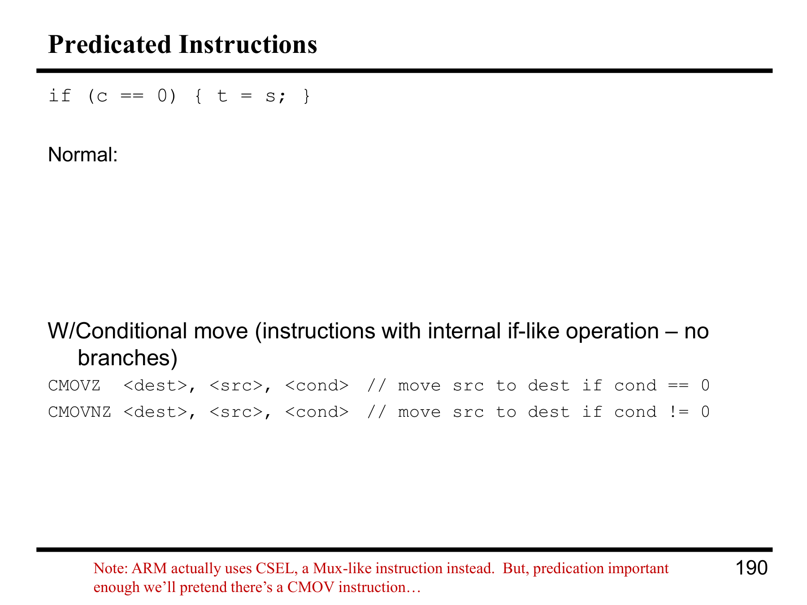

这页在讲 **谓词化指令（Predicated Instructions）**，也叫**条件化执行**。核心思想：
把原来需要“分支跳转”的 if/else，用**不跳转**的指令在同一条控制流里完成，从而\*\*避免分支带来的控制相关（control hazard）\*\*与分支预测开销。

---

## 1) 例子含义

上面给了 C 代码：

```c
if (c == 0) { t = s; }
```

### 传统做法（Normal）

编译器通常会生成为：

```
CMP   c, #0          ; 比较
B.NE  L1             ; 如果 c != 0 跳到 L1
MOV   t, s           ; c==0 时执行
L1:
```

这里有一次**条件分支**。如果预测错了，会冲刷流水线、损失若干个周期。

### 谓词化/条件移动做法（W/Conditional move）

使用**条件移动**（CMOV）一类指令，让赋值只在条件满足时生效，不用跳转：

```
CMOVZ  t, s, c       ; 当 c == 0 时，t ← s（Z = zero flag）
CMOVNZ t, s, c       ; 当 c != 0 时，t ← s（NZ = not zero）
```

* `CMOVZ`：条件为“等于 0”时移动。
* `CMOVNZ`：条件为“不等于 0”时移动。
它们内部就像 if/else 的选择器（mux），但**没有跳转**，因此**没有分支误预测的代价**。

> 备注：ARM 实际上常用的是 **CSEL**（Conditional Select）等“带条件的选择”指令，语义相当于 `dest = cond ? op1 : op2`，这页为讲解方便把它写成了类 x86 的 CMOV。

---

## 2) 为什么有用？

* **避免控制冒险**：不产生改变 PC 的跳转，流水线不用清空。
* **对短小分支更划算**：如果 if 分支只做一两条简单指令，用条件移动通常比跳转更快、更稳。
* **对难预测的分支更好**：随机或模式复杂的分支，预测命中率低，谓词化可省去反复误预测的成本。

---

## 3) 代价与限制

* **两边都可能要先计算**：某些 ISA 的谓词化会让“被抑制的一侧”也先算出结果再丢弃（或至少要读寄存器/设置标志位），对**大计算或有副作用的操作**不合适。
* **只适合轻量分支**：若 if/else 体很大/有多条访存/调用，条件化执行会做“很多白工”，反而慢。
* **标志位/条件寄存器压力**：需要设置并使用条件码（如 Z/NZ），增加数据通路依赖。
* **可见性与异常**：部分体系结构要求被抑制的操作**不能**触发异常或可见副作用（如存储、I/O）。

---

## 4) ARM 风格的写法（类比）

用 ARM 的 `CSEL` 可以把
`t = (c==0) ? s : t;`
写成：

```
CMP    c, #0
CSEL   t, s, t, EQ   ; EQ 条件即 Z=1，等于 0 时选 s，否则保留 t
```

意思是：若 `c==0`，`t←s`；否则 `t←t`（相当于不变）。

---

## 5) 何时使用的小结

* **短分支、轻计算、难预测** ⇒ 倾向用谓词化（CMOV/CSEL）。
* **长分支、重计算、或一侧很少执行** ⇒ 仍用常规分支更好。
* 编译器/CPU 往往会根据启发式或性能模型自动选择。

**一句话**：谓词化指令用“条件选择”代替“改变控制流的跳转”，常用于消除小 if 带来的分支开销，从而让流水线更顺畅。


---

## 第 20 页

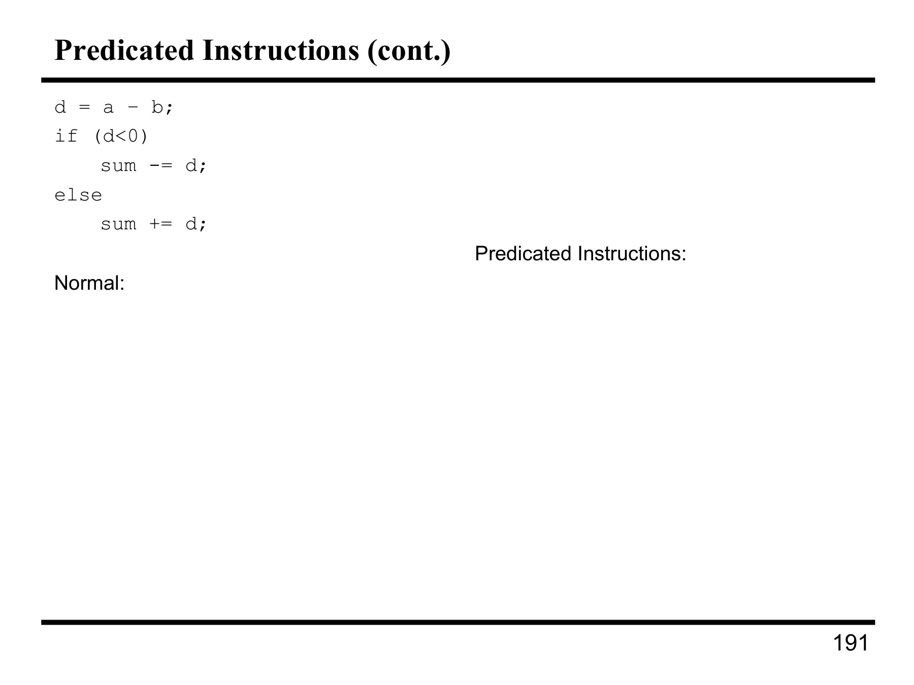

这页在讲 **谓词化指令（Predicated Instructions）**，也叫**条件化执行**。核心思想：
把原来需要“分支跳转”的 if/else，用**不跳转**的指令在同一条控制流里完成，从而\*\*避免分支带来的控制相关（control hazard）\*\*与分支预测开销。

---

## 1) 例子含义

上面给了 C 代码：

```c
if (c == 0) { t = s; }
```

### 传统做法（Normal）

编译器通常会生成为：

```
CMP   c, #0          ; 比较
B.NE  L1             ; 如果 c != 0 跳到 L1
MOV   t, s           ; c==0 时执行
L1:
```

这里有一次**条件分支**。如果预测错了，会冲刷流水线、损失若干个周期。

### 谓词化/条件移动做法（W/Conditional move）

使用**条件移动**（CMOV）一类指令，让赋值只在条件满足时生效，不用跳转：

```
CMOVZ  t, s, c       ; 当 c == 0 时，t ← s（Z = zero flag）
CMOVNZ t, s, c       ; 当 c != 0 时，t ← s（NZ = not zero）
```

* `CMOVZ`：条件为“等于 0”时移动。
* `CMOVNZ`：条件为“不等于 0”时移动。
它们内部就像 if/else 的选择器（mux），但**没有跳转**，因此**没有分支误预测的代价**。

> 备注：ARM 实际上常用的是 **CSEL**（Conditional Select）等“带条件的选择”指令，语义相当于 `dest = cond ? op1 : op2`，这页为讲解方便把它写成了类 x86 的 CMOV。

---

## 2) 为什么有用？

* **避免控制冒险**：不产生改变 PC 的跳转，流水线不用清空。
* **对短小分支更划算**：如果 if 分支只做一两条简单指令，用条件移动通常比跳转更快、更稳。
* **对难预测的分支更好**：随机或模式复杂的分支，预测命中率低，谓词化可省去反复误预测的成本。

---

## 3) 代价与限制

* **两边都可能要先计算**：某些 ISA 的谓词化会让“被抑制的一侧”也先算出结果再丢弃（或至少要读寄存器/设置标志位），对**大计算或有副作用的操作**不合适。
* **只适合轻量分支**：若 if/else 体很大/有多条访存/调用，条件化执行会做“很多白工”，反而慢。
* **标志位/条件寄存器压力**：需要设置并使用条件码（如 Z/NZ），增加数据通路依赖。
* **可见性与异常**：部分体系结构要求被抑制的操作**不能**触发异常或可见副作用（如存储、I/O）。

---

## 4) ARM 风格的写法（类比）

用 ARM 的 `CSEL` 可以把
`t = (c==0) ? s : t;`
写成：

```
CMP    c, #0
CSEL   t, s, t, EQ   ; EQ 条件即 Z=1，等于 0 时选 s，否则保留 t
```

意思是：若 `c==0`，`t←s`；否则 `t←t`（相当于不变）。

---

## 5) 何时使用的小结

* **短分支、轻计算、难预测** ⇒ 倾向用谓词化（CMOV/CSEL）。
* **长分支、重计算、或一侧很少执行** ⇒ 仍用常规分支更好。
* 编译器/CPU 往往会根据启发式或性能模型自动选择。

**一句话**：谓词化指令用“条件选择”代替“改变控制流的跳转”，常用于消除小 if 带来的分支开销，从而让流水线更顺畅。


---

## 第 21 页

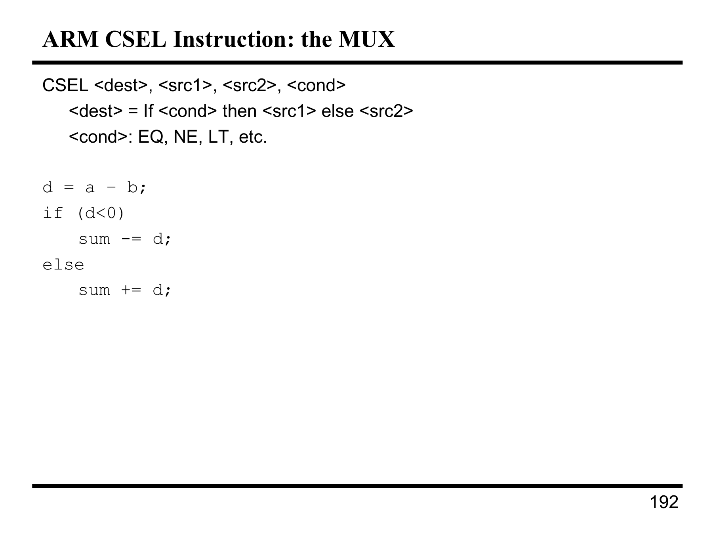

这页在讲 **谓词化指令（Predicated Instructions）**，也叫**条件化执行**。核心思想：
把原来需要“分支跳转”的 if/else，用**不跳转**的指令在同一条控制流里完成，从而\*\*避免分支带来的控制相关（control hazard）\*\*与分支预测开销。

---

## 1) 例子含义

上面给了 C 代码：

```c
if (c == 0) { t = s; }
```

### 传统做法（Normal）

编译器通常会生成为：

```
CMP   c, #0          ; 比较
B.NE  L1             ; 如果 c != 0 跳到 L1
MOV   t, s           ; c==0 时执行
L1:
```

这里有一次**条件分支**。如果预测错了，会冲刷流水线、损失若干个周期。

### 谓词化/条件移动做法（W/Conditional move）

使用**条件移动**（CMOV）一类指令，让赋值只在条件满足时生效，不用跳转：

```
CMOVZ  t, s, c       ; 当 c == 0 时，t ← s（Z = zero flag）
CMOVNZ t, s, c       ; 当 c != 0 时，t ← s（NZ = not zero）
```

* `CMOVZ`：条件为“等于 0”时移动。
* `CMOVNZ`：条件为“不等于 0”时移动。
它们内部就像 if/else 的选择器（mux），但**没有跳转**，因此**没有分支误预测的代价**。

> 备注：ARM 实际上常用的是 **CSEL**（Conditional Select）等“带条件的选择”指令，语义相当于 `dest = cond ? op1 : op2`，这页为讲解方便把它写成了类 x86 的 CMOV。

---

## 2) 为什么有用？

* **避免控制冒险**：不产生改变 PC 的跳转，流水线不用清空。
* **对短小分支更划算**：如果 if 分支只做一两条简单指令，用条件移动通常比跳转更快、更稳。
* **对难预测的分支更好**：随机或模式复杂的分支，预测命中率低，谓词化可省去反复误预测的成本。

---

## 3) 代价与限制

* **两边都可能要先计算**：某些 ISA 的谓词化会让“被抑制的一侧”也先算出结果再丢弃（或至少要读寄存器/设置标志位），对**大计算或有副作用的操作**不合适。
* **只适合轻量分支**：若 if/else 体很大/有多条访存/调用，条件化执行会做“很多白工”，反而慢。
* **标志位/条件寄存器压力**：需要设置并使用条件码（如 Z/NZ），增加数据通路依赖。
* **可见性与异常**：部分体系结构要求被抑制的操作**不能**触发异常或可见副作用（如存储、I/O）。

---

## 4) ARM 风格的写法（类比）

用 ARM 的 `CSEL` 可以把
`t = (c==0) ? s : t;`
写成：

```
CMP    c, #0
CSEL   t, s, t, EQ   ; EQ 条件即 Z=1，等于 0 时选 s，否则保留 t
```

意思是：若 `c==0`，`t←s`；否则 `t←t`（相当于不变）。

---

## 5) 何时使用的小结

* **短分支、轻计算、难预测** ⇒ 倾向用谓词化（CMOV/CSEL）。
* **长分支、重计算、或一侧很少执行** ⇒ 仍用常规分支更好。
* 编译器/CPU 往往会根据启发式或性能模型自动选择。

**一句话**：谓词化指令用“条件选择”代替“改变控制流的跳转”，常用于消除小 if 带来的分支开销，从而让流水线更顺畅。


---

## 第 22 页

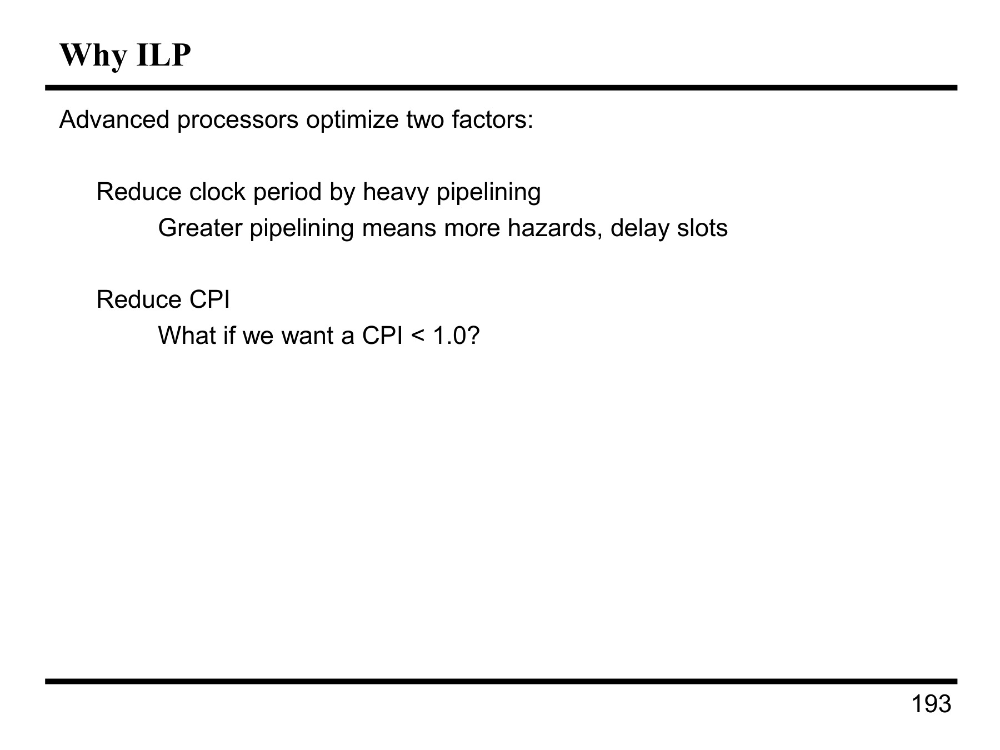

这页在讲 **谓词化指令（Predicated Instructions）**，也叫**条件化执行**。核心思想：
把原来需要“分支跳转”的 if/else，用**不跳转**的指令在同一条控制流里完成，从而\*\*避免分支带来的控制相关（control hazard）\*\*与分支预测开销。

---

## 1) 例子含义

上面给了 C 代码：

```c
if (c == 0) { t = s; }
```

### 传统做法（Normal）

编译器通常会生成为：

```
CMP   c, #0          ; 比较
B.NE  L1             ; 如果 c != 0 跳到 L1
MOV   t, s           ; c==0 时执行
L1:
```

这里有一次**条件分支**。如果预测错了，会冲刷流水线、损失若干个周期。

### 谓词化/条件移动做法（W/Conditional move）

使用**条件移动**（CMOV）一类指令，让赋值只在条件满足时生效，不用跳转：

```
CMOVZ  t, s, c       ; 当 c == 0 时，t ← s（Z = zero flag）
CMOVNZ t, s, c       ; 当 c != 0 时，t ← s（NZ = not zero）
```

* `CMOVZ`：条件为“等于 0”时移动。
* `CMOVNZ`：条件为“不等于 0”时移动。
它们内部就像 if/else 的选择器（mux），但**没有跳转**，因此**没有分支误预测的代价**。

> 备注：ARM 实际上常用的是 **CSEL**（Conditional Select）等“带条件的选择”指令，语义相当于 `dest = cond ? op1 : op2`，这页为讲解方便把它写成了类 x86 的 CMOV。

---

## 2) 为什么有用？

* **避免控制冒险**：不产生改变 PC 的跳转，流水线不用清空。
* **对短小分支更划算**：如果 if 分支只做一两条简单指令，用条件移动通常比跳转更快、更稳。
* **对难预测的分支更好**：随机或模式复杂的分支，预测命中率低，谓词化可省去反复误预测的成本。

---

## 3) 代价与限制

* **两边都可能要先计算**：某些 ISA 的谓词化会让“被抑制的一侧”也先算出结果再丢弃（或至少要读寄存器/设置标志位），对**大计算或有副作用的操作**不合适。
* **只适合轻量分支**：若 if/else 体很大/有多条访存/调用，条件化执行会做“很多白工”，反而慢。
* **标志位/条件寄存器压力**：需要设置并使用条件码（如 Z/NZ），增加数据通路依赖。
* **可见性与异常**：部分体系结构要求被抑制的操作**不能**触发异常或可见副作用（如存储、I/O）。

---

## 4) ARM 风格的写法（类比）

用 ARM 的 `CSEL` 可以把
`t = (c==0) ? s : t;`
写成：

```
CMP    c, #0
CSEL   t, s, t, EQ   ; EQ 条件即 Z=1，等于 0 时选 s，否则保留 t
```

意思是：若 `c==0`，`t←s`；否则 `t←t`（相当于不变）。

---

## 5) 何时使用的小结

* **短分支、轻计算、难预测** ⇒ 倾向用谓词化（CMOV/CSEL）。
* **长分支、重计算、或一侧很少执行** ⇒ 仍用常规分支更好。
* 编译器/CPU 往往会根据启发式或性能模型自动选择。

**一句话**：谓词化指令用“条件选择”代替“改变控制流的跳转”，常用于消除小 if 带来的分支开销，从而让流水线更顺畅。


---

## 第 23 页

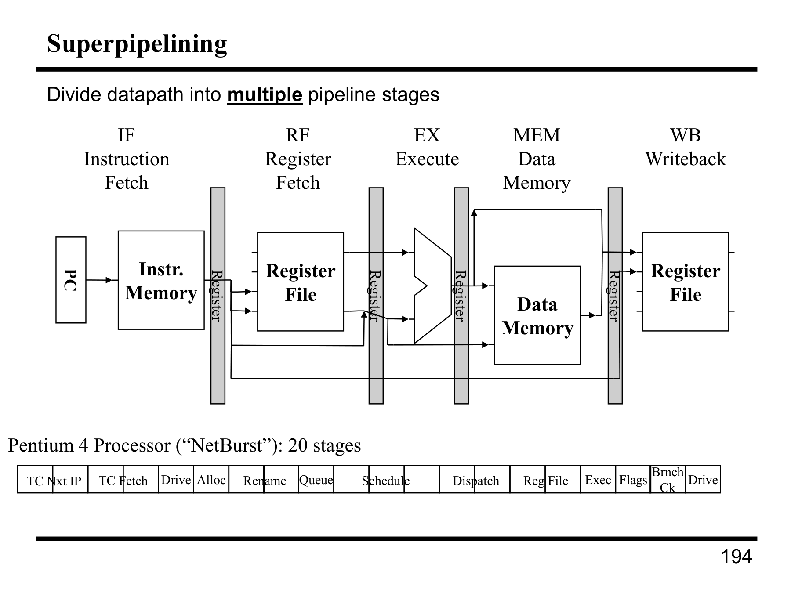

这页在讲 **谓词化指令（Predicated Instructions）**，也叫**条件化执行**。核心思想：
把原来需要“分支跳转”的 if/else，用**不跳转**的指令在同一条控制流里完成，从而\*\*避免分支带来的控制相关（control hazard）\*\*与分支预测开销。

---

## 1) 例子含义

上面给了 C 代码：

```c
if (c == 0) { t = s; }
```

### 传统做法（Normal）

编译器通常会生成为：

```
CMP   c, #0          ; 比较
B.NE  L1             ; 如果 c != 0 跳到 L1
MOV   t, s           ; c==0 时执行
L1:
```

这里有一次**条件分支**。如果预测错了，会冲刷流水线、损失若干个周期。

### 谓词化/条件移动做法（W/Conditional move）

使用**条件移动**（CMOV）一类指令，让赋值只在条件满足时生效，不用跳转：

```
CMOVZ  t, s, c       ; 当 c == 0 时，t ← s（Z = zero flag）
CMOVNZ t, s, c       ; 当 c != 0 时，t ← s（NZ = not zero）
```

* `CMOVZ`：条件为“等于 0”时移动。
* `CMOVNZ`：条件为“不等于 0”时移动。
它们内部就像 if/else 的选择器（mux），但**没有跳转**，因此**没有分支误预测的代价**。

> 备注：ARM 实际上常用的是 **CSEL**（Conditional Select）等“带条件的选择”指令，语义相当于 `dest = cond ? op1 : op2`，这页为讲解方便把它写成了类 x86 的 CMOV。

---

## 2) 为什么有用？

* **避免控制冒险**：不产生改变 PC 的跳转，流水线不用清空。
* **对短小分支更划算**：如果 if 分支只做一两条简单指令，用条件移动通常比跳转更快、更稳。
* **对难预测的分支更好**：随机或模式复杂的分支，预测命中率低，谓词化可省去反复误预测的成本。

---

## 3) 代价与限制

* **两边都可能要先计算**：某些 ISA 的谓词化会让“被抑制的一侧”也先算出结果再丢弃（或至少要读寄存器/设置标志位），对**大计算或有副作用的操作**不合适。
* **只适合轻量分支**：若 if/else 体很大/有多条访存/调用，条件化执行会做“很多白工”，反而慢。
* **标志位/条件寄存器压力**：需要设置并使用条件码（如 Z/NZ），增加数据通路依赖。
* **可见性与异常**：部分体系结构要求被抑制的操作**不能**触发异常或可见副作用（如存储、I/O）。

---

## 4) ARM 风格的写法（类比）

用 ARM 的 `CSEL` 可以把
`t = (c==0) ? s : t;`
写成：

```
CMP    c, #0
CSEL   t, s, t, EQ   ; EQ 条件即 Z=1，等于 0 时选 s，否则保留 t
```

意思是：若 `c==0`，`t←s`；否则 `t←t`（相当于不变）。

---

## 5) 何时使用的小结

* **短分支、轻计算、难预测** ⇒ 倾向用谓词化（CMOV/CSEL）。
* **长分支、重计算、或一侧很少执行** ⇒ 仍用常规分支更好。
* 编译器/CPU 往往会根据启发式或性能模型自动选择。

**一句话**：谓词化指令用“条件选择”代替“改变控制流的跳转”，常用于消除小 if 带来的分支开销，从而让流水线更顺畅。


---

## 第 24 页

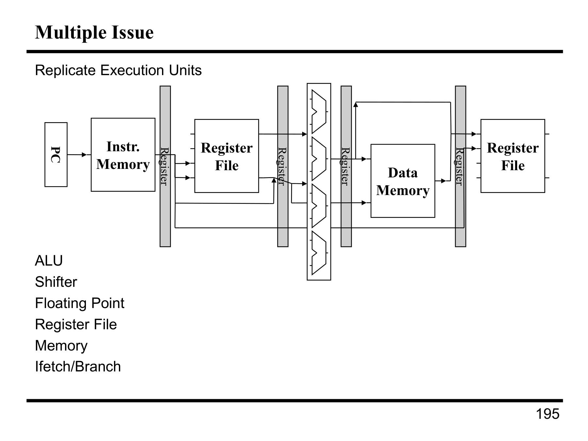

这页在讲 **谓词化指令（Predicated Instructions）**，也叫**条件化执行**。核心思想：
把原来需要“分支跳转”的 if/else，用**不跳转**的指令在同一条控制流里完成，从而\*\*避免分支带来的控制相关（control hazard）\*\*与分支预测开销。

---

## 1) 例子含义

上面给了 C 代码：

```c
if (c == 0) { t = s; }
```

### 传统做法（Normal）

编译器通常会生成为：

```
CMP   c, #0          ; 比较
B.NE  L1             ; 如果 c != 0 跳到 L1
MOV   t, s           ; c==0 时执行
L1:
```

这里有一次**条件分支**。如果预测错了，会冲刷流水线、损失若干个周期。

### 谓词化/条件移动做法（W/Conditional move）

使用**条件移动**（CMOV）一类指令，让赋值只在条件满足时生效，不用跳转：

```
CMOVZ  t, s, c       ; 当 c == 0 时，t ← s（Z = zero flag）
CMOVNZ t, s, c       ; 当 c != 0 时，t ← s（NZ = not zero）
```

* `CMOVZ`：条件为“等于 0”时移动。
* `CMOVNZ`：条件为“不等于 0”时移动。
它们内部就像 if/else 的选择器（mux），但**没有跳转**，因此**没有分支误预测的代价**。

> 备注：ARM 实际上常用的是 **CSEL**（Conditional Select）等“带条件的选择”指令，语义相当于 `dest = cond ? op1 : op2`，这页为讲解方便把它写成了类 x86 的 CMOV。

---

## 2) 为什么有用？

* **避免控制冒险**：不产生改变 PC 的跳转，流水线不用清空。
* **对短小分支更划算**：如果 if 分支只做一两条简单指令，用条件移动通常比跳转更快、更稳。
* **对难预测的分支更好**：随机或模式复杂的分支，预测命中率低，谓词化可省去反复误预测的成本。

---

## 3) 代价与限制

* **两边都可能要先计算**：某些 ISA 的谓词化会让“被抑制的一侧”也先算出结果再丢弃（或至少要读寄存器/设置标志位），对**大计算或有副作用的操作**不合适。
* **只适合轻量分支**：若 if/else 体很大/有多条访存/调用，条件化执行会做“很多白工”，反而慢。
* **标志位/条件寄存器压力**：需要设置并使用条件码（如 Z/NZ），增加数据通路依赖。
* **可见性与异常**：部分体系结构要求被抑制的操作**不能**触发异常或可见副作用（如存储、I/O）。

---

## 4) ARM 风格的写法（类比）

用 ARM 的 `CSEL` 可以把
`t = (c==0) ? s : t;`
写成：

```
CMP    c, #0
CSEL   t, s, t, EQ   ; EQ 条件即 Z=1，等于 0 时选 s，否则保留 t
```

意思是：若 `c==0`，`t←s`；否则 `t←t`（相当于不变）。

---

## 5) 何时使用的小结

* **短分支、轻计算、难预测** ⇒ 倾向用谓词化（CMOV/CSEL）。
* **长分支、重计算、或一侧很少执行** ⇒ 仍用常规分支更好。
* 编译器/CPU 往往会根据启发式或性能模型自动选择。

**一句话**：谓词化指令用“条件选择”代替“改变控制流的跳转”，常用于消除小 if 带来的分支开销，从而让流水线更顺畅。


---

## 第 25 页

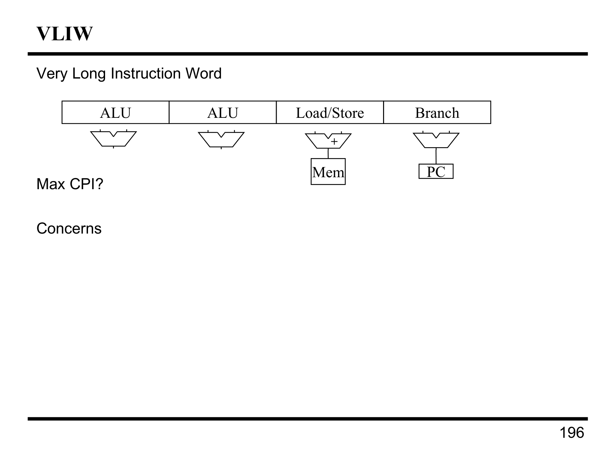

这页在讲 **谓词化指令（Predicated Instructions）**，也叫**条件化执行**。核心思想：
把原来需要“分支跳转”的 if/else，用**不跳转**的指令在同一条控制流里完成，从而\*\*避免分支带来的控制相关（control hazard）\*\*与分支预测开销。

---

## 1) 例子含义

上面给了 C 代码：

```c
if (c == 0) { t = s; }
```

### 传统做法（Normal）

编译器通常会生成为：

```
CMP   c, #0          ; 比较
B.NE  L1             ; 如果 c != 0 跳到 L1
MOV   t, s           ; c==0 时执行
L1:
```

这里有一次**条件分支**。如果预测错了，会冲刷流水线、损失若干个周期。

### 谓词化/条件移动做法（W/Conditional move）

使用**条件移动**（CMOV）一类指令，让赋值只在条件满足时生效，不用跳转：

```
CMOVZ  t, s, c       ; 当 c == 0 时，t ← s（Z = zero flag）
CMOVNZ t, s, c       ; 当 c != 0 时，t ← s（NZ = not zero）
```

* `CMOVZ`：条件为“等于 0”时移动。
* `CMOVNZ`：条件为“不等于 0”时移动。
它们内部就像 if/else 的选择器（mux），但**没有跳转**，因此**没有分支误预测的代价**。

> 备注：ARM 实际上常用的是 **CSEL**（Conditional Select）等“带条件的选择”指令，语义相当于 `dest = cond ? op1 : op2`，这页为讲解方便把它写成了类 x86 的 CMOV。

---

## 2) 为什么有用？

* **避免控制冒险**：不产生改变 PC 的跳转，流水线不用清空。
* **对短小分支更划算**：如果 if 分支只做一两条简单指令，用条件移动通常比跳转更快、更稳。
* **对难预测的分支更好**：随机或模式复杂的分支，预测命中率低，谓词化可省去反复误预测的成本。

---

## 3) 代价与限制

* **两边都可能要先计算**：某些 ISA 的谓词化会让“被抑制的一侧”也先算出结果再丢弃（或至少要读寄存器/设置标志位），对**大计算或有副作用的操作**不合适。
* **只适合轻量分支**：若 if/else 体很大/有多条访存/调用，条件化执行会做“很多白工”，反而慢。
* **标志位/条件寄存器压力**：需要设置并使用条件码（如 Z/NZ），增加数据通路依赖。
* **可见性与异常**：部分体系结构要求被抑制的操作**不能**触发异常或可见副作用（如存储、I/O）。

---

## 4) ARM 风格的写法（类比）

用 ARM 的 `CSEL` 可以把
`t = (c==0) ? s : t;`
写成：

```
CMP    c, #0
CSEL   t, s, t, EQ   ; EQ 条件即 Z=1，等于 0 时选 s，否则保留 t
```

意思是：若 `c==0`，`t←s`；否则 `t←t`（相当于不变）。

---

## 5) 何时使用的小结

* **短分支、轻计算、难预测** ⇒ 倾向用谓词化（CMOV/CSEL）。
* **长分支、重计算、或一侧很少执行** ⇒ 仍用常规分支更好。
* 编译器/CPU 往往会根据启发式或性能模型自动选择。

**一句话**：谓词化指令用“条件选择”代替“改变控制流的跳转”，常用于消除小 if 带来的分支开销，从而让流水线更顺畅。


---

## 第 26 页

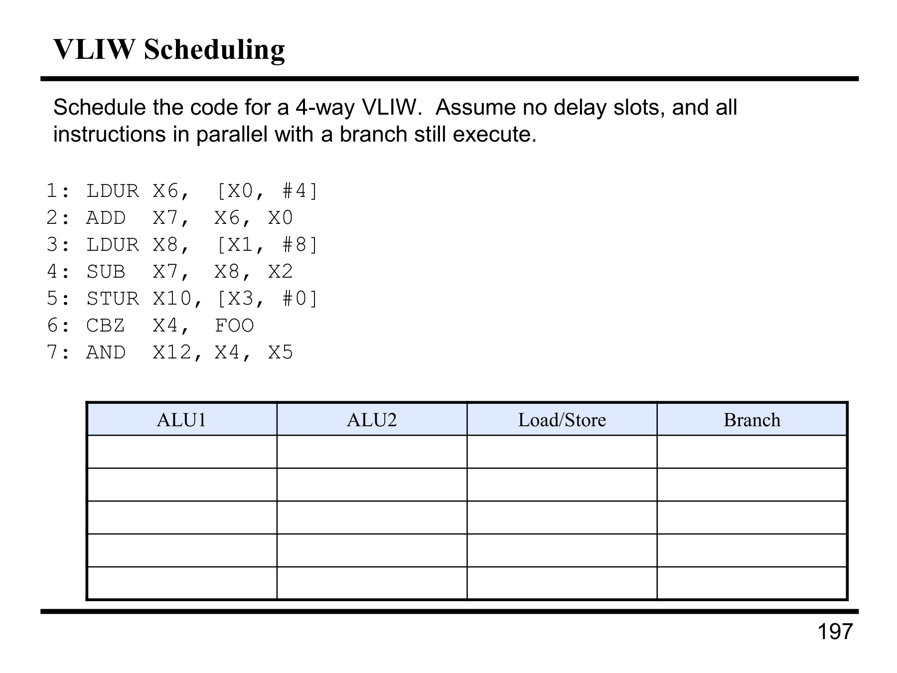

这页在讲 **谓词化指令（Predicated Instructions）**，也叫**条件化执行**。核心思想：
把原来需要“分支跳转”的 if/else，用**不跳转**的指令在同一条控制流里完成，从而\*\*避免分支带来的控制相关（control hazard）\*\*与分支预测开销。

---

## 1) 例子含义

上面给了 C 代码：

```c
if (c == 0) { t = s; }
```

### 传统做法（Normal）

编译器通常会生成为：

```
CMP   c, #0          ; 比较
B.NE  L1             ; 如果 c != 0 跳到 L1
MOV   t, s           ; c==0 时执行
L1:
```

这里有一次**条件分支**。如果预测错了，会冲刷流水线、损失若干个周期。

### 谓词化/条件移动做法（W/Conditional move）

使用**条件移动**（CMOV）一类指令，让赋值只在条件满足时生效，不用跳转：

```
CMOVZ  t, s, c       ; 当 c == 0 时，t ← s（Z = zero flag）
CMOVNZ t, s, c       ; 当 c != 0 时，t ← s（NZ = not zero）
```

* `CMOVZ`：条件为“等于 0”时移动。
* `CMOVNZ`：条件为“不等于 0”时移动。
它们内部就像 if/else 的选择器（mux），但**没有跳转**，因此**没有分支误预测的代价**。

> 备注：ARM 实际上常用的是 **CSEL**（Conditional Select）等“带条件的选择”指令，语义相当于 `dest = cond ? op1 : op2`，这页为讲解方便把它写成了类 x86 的 CMOV。

---

## 2) 为什么有用？

* **避免控制冒险**：不产生改变 PC 的跳转，流水线不用清空。
* **对短小分支更划算**：如果 if 分支只做一两条简单指令，用条件移动通常比跳转更快、更稳。
* **对难预测的分支更好**：随机或模式复杂的分支，预测命中率低，谓词化可省去反复误预测的成本。

---

## 3) 代价与限制

* **两边都可能要先计算**：某些 ISA 的谓词化会让“被抑制的一侧”也先算出结果再丢弃（或至少要读寄存器/设置标志位），对**大计算或有副作用的操作**不合适。
* **只适合轻量分支**：若 if/else 体很大/有多条访存/调用，条件化执行会做“很多白工”，反而慢。
* **标志位/条件寄存器压力**：需要设置并使用条件码（如 Z/NZ），增加数据通路依赖。
* **可见性与异常**：部分体系结构要求被抑制的操作**不能**触发异常或可见副作用（如存储、I/O）。

---

## 4) ARM 风格的写法（类比）

用 ARM 的 `CSEL` 可以把
`t = (c==0) ? s : t;`
写成：

```
CMP    c, #0
CSEL   t, s, t, EQ   ; EQ 条件即 Z=1，等于 0 时选 s，否则保留 t
```

意思是：若 `c==0`，`t←s`；否则 `t←t`（相当于不变）。

---

## 5) 何时使用的小结

* **短分支、轻计算、难预测** ⇒ 倾向用谓词化（CMOV/CSEL）。
* **长分支、重计算、或一侧很少执行** ⇒ 仍用常规分支更好。
* 编译器/CPU 往往会根据启发式或性能模型自动选择。

**一句话**：谓词化指令用“条件选择”代替“改变控制流的跳转”，常用于消除小 if 带来的分支开销，从而让流水线更顺畅。


---

## 第 27 页

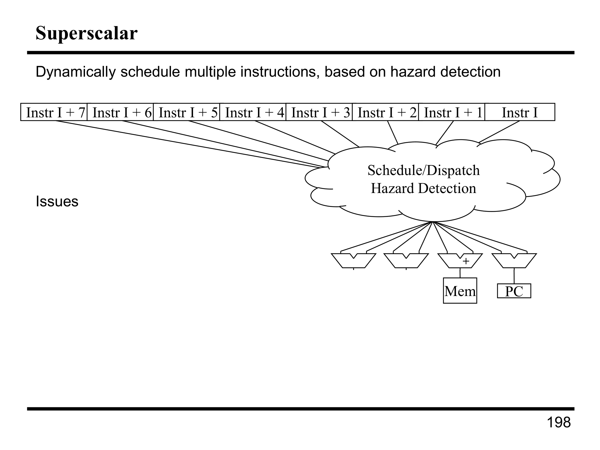

这页在讲 **谓词化指令（Predicated Instructions）**，也叫**条件化执行**。核心思想：
把原来需要“分支跳转”的 if/else，用**不跳转**的指令在同一条控制流里完成，从而\*\*避免分支带来的控制相关（control hazard）\*\*与分支预测开销。

---

## 1) 例子含义

上面给了 C 代码：

```c
if (c == 0) { t = s; }
```

### 传统做法（Normal）

编译器通常会生成为：

```
CMP   c, #0          ; 比较
B.NE  L1             ; 如果 c != 0 跳到 L1
MOV   t, s           ; c==0 时执行
L1:
```

这里有一次**条件分支**。如果预测错了，会冲刷流水线、损失若干个周期。

### 谓词化/条件移动做法（W/Conditional move）

使用**条件移动**（CMOV）一类指令，让赋值只在条件满足时生效，不用跳转：

```
CMOVZ  t, s, c       ; 当 c == 0 时，t ← s（Z = zero flag）
CMOVNZ t, s, c       ; 当 c != 0 时，t ← s（NZ = not zero）
```

* `CMOVZ`：条件为“等于 0”时移动。
* `CMOVNZ`：条件为“不等于 0”时移动。
它们内部就像 if/else 的选择器（mux），但**没有跳转**，因此**没有分支误预测的代价**。

> 备注：ARM 实际上常用的是 **CSEL**（Conditional Select）等“带条件的选择”指令，语义相当于 `dest = cond ? op1 : op2`，这页为讲解方便把它写成了类 x86 的 CMOV。

---

## 2) 为什么有用？

* **避免控制冒险**：不产生改变 PC 的跳转，流水线不用清空。
* **对短小分支更划算**：如果 if 分支只做一两条简单指令，用条件移动通常比跳转更快、更稳。
* **对难预测的分支更好**：随机或模式复杂的分支，预测命中率低，谓词化可省去反复误预测的成本。

---

## 3) 代价与限制

* **两边都可能要先计算**：某些 ISA 的谓词化会让“被抑制的一侧”也先算出结果再丢弃（或至少要读寄存器/设置标志位），对**大计算或有副作用的操作**不合适。
* **只适合轻量分支**：若 if/else 体很大/有多条访存/调用，条件化执行会做“很多白工”，反而慢。
* **标志位/条件寄存器压力**：需要设置并使用条件码（如 Z/NZ），增加数据通路依赖。
* **可见性与异常**：部分体系结构要求被抑制的操作**不能**触发异常或可见副作用（如存储、I/O）。

---

## 4) ARM 风格的写法（类比）

用 ARM 的 `CSEL` 可以把
`t = (c==0) ? s : t;`
写成：

```
CMP    c, #0
CSEL   t, s, t, EQ   ; EQ 条件即 Z=1，等于 0 时选 s，否则保留 t
```

意思是：若 `c==0`，`t←s`；否则 `t←t`（相当于不变）。

---

## 5) 何时使用的小结

* **短分支、轻计算、难预测** ⇒ 倾向用谓词化（CMOV/CSEL）。
* **长分支、重计算、或一侧很少执行** ⇒ 仍用常规分支更好。
* 编译器/CPU 往往会根据启发式或性能模型自动选择。

**一句话**：谓词化指令用“条件选择”代替“改变控制流的跳转”，常用于消除小 if 带来的分支开销，从而让流水线更顺畅。


---

## 第 28 页

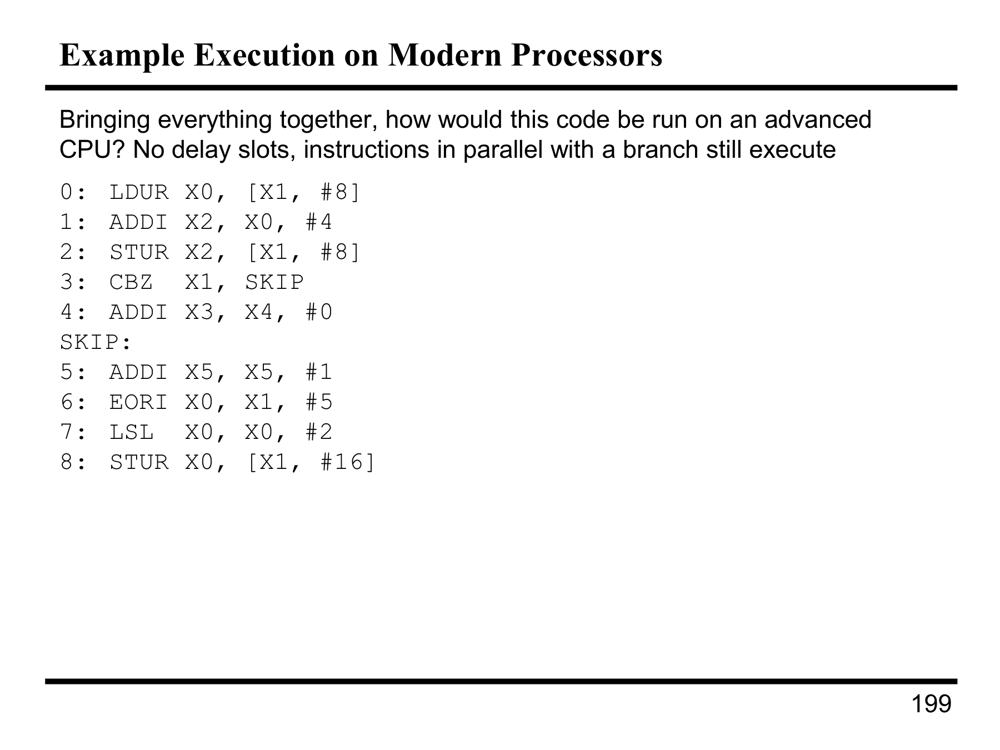

这页在讲 **谓词化指令（Predicated Instructions）**，也叫**条件化执行**。核心思想：
把原来需要“分支跳转”的 if/else，用**不跳转**的指令在同一条控制流里完成，从而\*\*避免分支带来的控制相关（control hazard）\*\*与分支预测开销。

---

## 1) 例子含义

上面给了 C 代码：

```c
if (c == 0) { t = s; }
```

### 传统做法（Normal）

编译器通常会生成为：

```
CMP   c, #0          ; 比较
B.NE  L1             ; 如果 c != 0 跳到 L1
MOV   t, s           ; c==0 时执行
L1:
```

这里有一次**条件分支**。如果预测错了，会冲刷流水线、损失若干个周期。

### 谓词化/条件移动做法（W/Conditional move）

使用**条件移动**（CMOV）一类指令，让赋值只在条件满足时生效，不用跳转：

```
CMOVZ  t, s, c       ; 当 c == 0 时，t ← s（Z = zero flag）
CMOVNZ t, s, c       ; 当 c != 0 时，t ← s（NZ = not zero）
```

* `CMOVZ`：条件为“等于 0”时移动。
* `CMOVNZ`：条件为“不等于 0”时移动。
它们内部就像 if/else 的选择器（mux），但**没有跳转**，因此**没有分支误预测的代价**。

> 备注：ARM 实际上常用的是 **CSEL**（Conditional Select）等“带条件的选择”指令，语义相当于 `dest = cond ? op1 : op2`，这页为讲解方便把它写成了类 x86 的 CMOV。

---

## 2) 为什么有用？

* **避免控制冒险**：不产生改变 PC 的跳转，流水线不用清空。
* **对短小分支更划算**：如果 if 分支只做一两条简单指令，用条件移动通常比跳转更快、更稳。
* **对难预测的分支更好**：随机或模式复杂的分支，预测命中率低，谓词化可省去反复误预测的成本。

---

## 3) 代价与限制

* **两边都可能要先计算**：某些 ISA 的谓词化会让“被抑制的一侧”也先算出结果再丢弃（或至少要读寄存器/设置标志位），对**大计算或有副作用的操作**不合适。
* **只适合轻量分支**：若 if/else 体很大/有多条访存/调用，条件化执行会做“很多白工”，反而慢。
* **标志位/条件寄存器压力**：需要设置并使用条件码（如 Z/NZ），增加数据通路依赖。
* **可见性与异常**：部分体系结构要求被抑制的操作**不能**触发异常或可见副作用（如存储、I/O）。

---

## 4) ARM 风格的写法（类比）

用 ARM 的 `CSEL` 可以把
`t = (c==0) ? s : t;`
写成：

```
CMP    c, #0
CSEL   t, s, t, EQ   ; EQ 条件即 Z=1，等于 0 时选 s，否则保留 t
```

意思是：若 `c==0`，`t←s`；否则 `t←t`（相当于不变）。

---

## 5) 何时使用的小结

* **短分支、轻计算、难预测** ⇒ 倾向用谓词化（CMOV/CSEL）。
* **长分支、重计算、或一侧很少执行** ⇒ 仍用常规分支更好。
* 编译器/CPU 往往会根据启发式或性能模型自动选择。

**一句话**：谓词化指令用“条件选择”代替“改变控制流的跳转”，常用于消除小 if 带来的分支开销，从而让流水线更顺畅。


---

## 第 29 页

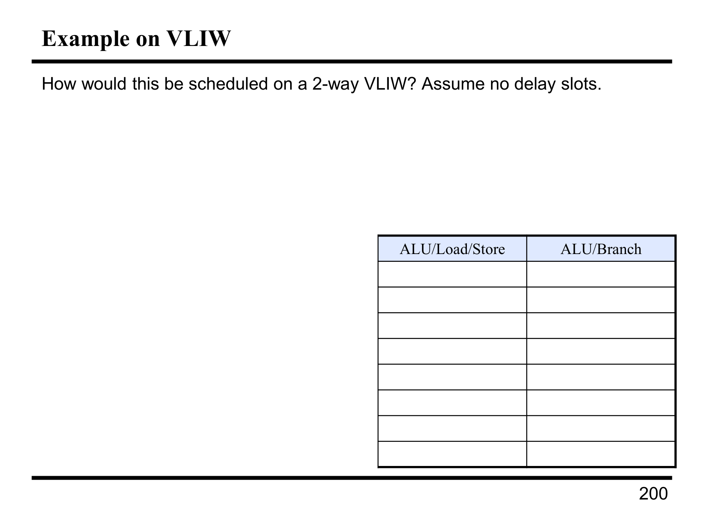

这页在讲 **谓词化指令（Predicated Instructions）**，也叫**条件化执行**。核心思想：
把原来需要“分支跳转”的 if/else，用**不跳转**的指令在同一条控制流里完成，从而\*\*避免分支带来的控制相关（control hazard）\*\*与分支预测开销。

---

## 1) 例子含义

上面给了 C 代码：

```c
if (c == 0) { t = s; }
```

### 传统做法（Normal）

编译器通常会生成为：

```
CMP   c, #0          ; 比较
B.NE  L1             ; 如果 c != 0 跳到 L1
MOV   t, s           ; c==0 时执行
L1:
```

这里有一次**条件分支**。如果预测错了，会冲刷流水线、损失若干个周期。

### 谓词化/条件移动做法（W/Conditional move）

使用**条件移动**（CMOV）一类指令，让赋值只在条件满足时生效，不用跳转：

```
CMOVZ  t, s, c       ; 当 c == 0 时，t ← s（Z = zero flag）
CMOVNZ t, s, c       ; 当 c != 0 时，t ← s（NZ = not zero）
```

* `CMOVZ`：条件为“等于 0”时移动。
* `CMOVNZ`：条件为“不等于 0”时移动。
它们内部就像 if/else 的选择器（mux），但**没有跳转**，因此**没有分支误预测的代价**。

> 备注：ARM 实际上常用的是 **CSEL**（Conditional Select）等“带条件的选择”指令，语义相当于 `dest = cond ? op1 : op2`，这页为讲解方便把它写成了类 x86 的 CMOV。

---

## 2) 为什么有用？

* **避免控制冒险**：不产生改变 PC 的跳转，流水线不用清空。
* **对短小分支更划算**：如果 if 分支只做一两条简单指令，用条件移动通常比跳转更快、更稳。
* **对难预测的分支更好**：随机或模式复杂的分支，预测命中率低，谓词化可省去反复误预测的成本。

---

## 3) 代价与限制

* **两边都可能要先计算**：某些 ISA 的谓词化会让“被抑制的一侧”也先算出结果再丢弃（或至少要读寄存器/设置标志位），对**大计算或有副作用的操作**不合适。
* **只适合轻量分支**：若 if/else 体很大/有多条访存/调用，条件化执行会做“很多白工”，反而慢。
* **标志位/条件寄存器压力**：需要设置并使用条件码（如 Z/NZ），增加数据通路依赖。
* **可见性与异常**：部分体系结构要求被抑制的操作**不能**触发异常或可见副作用（如存储、I/O）。

---

## 4) ARM 风格的写法（类比）

用 ARM 的 `CSEL` 可以把
`t = (c==0) ? s : t;`
写成：

```
CMP    c, #0
CSEL   t, s, t, EQ   ; EQ 条件即 Z=1，等于 0 时选 s，否则保留 t
```

意思是：若 `c==0`，`t←s`；否则 `t←t`（相当于不变）。

---

## 5) 何时使用的小结

* **短分支、轻计算、难预测** ⇒ 倾向用谓词化（CMOV/CSEL）。
* **长分支、重计算、或一侧很少执行** ⇒ 仍用常规分支更好。
* 编译器/CPU 往往会根据启发式或性能模型自动选择。

**一句话**：谓词化指令用“条件选择”代替“改变控制流的跳转”，常用于消除小 if 带来的分支开销，从而让流水线更顺畅。


---

## 第 30 页

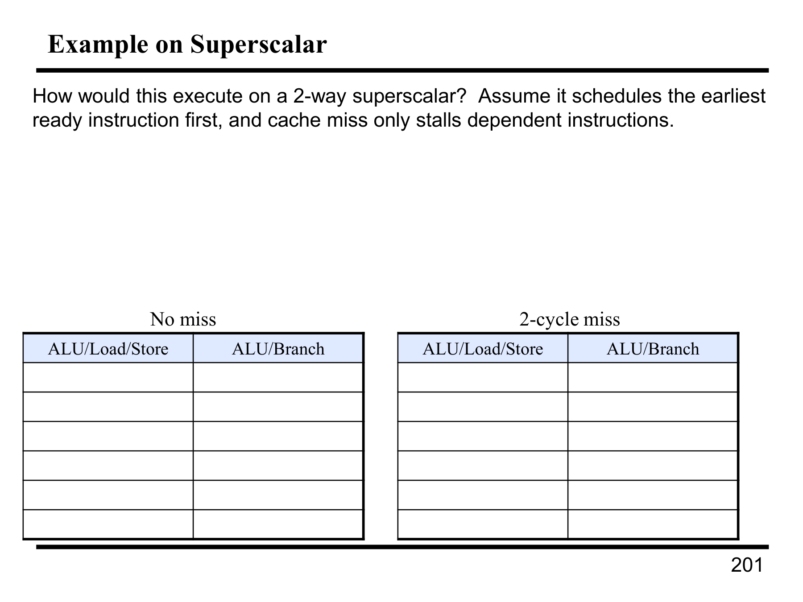

这页在讲 **谓词化指令（Predicated Instructions）**，也叫**条件化执行**。核心思想：
把原来需要“分支跳转”的 if/else，用**不跳转**的指令在同一条控制流里完成，从而\*\*避免分支带来的控制相关（control hazard）\*\*与分支预测开销。

---

## 1) 例子含义

上面给了 C 代码：

```c
if (c == 0) { t = s; }
```

### 传统做法（Normal）

编译器通常会生成为：

```
CMP   c, #0          ; 比较
B.NE  L1             ; 如果 c != 0 跳到 L1
MOV   t, s           ; c==0 时执行
L1:
```

这里有一次**条件分支**。如果预测错了，会冲刷流水线、损失若干个周期。

### 谓词化/条件移动做法（W/Conditional move）

使用**条件移动**（CMOV）一类指令，让赋值只在条件满足时生效，不用跳转：

```
CMOVZ  t, s, c       ; 当 c == 0 时，t ← s（Z = zero flag）
CMOVNZ t, s, c       ; 当 c != 0 时，t ← s（NZ = not zero）
```

* `CMOVZ`：条件为“等于 0”时移动。
* `CMOVNZ`：条件为“不等于 0”时移动。
它们内部就像 if/else 的选择器（mux），但**没有跳转**，因此**没有分支误预测的代价**。

> 备注：ARM 实际上常用的是 **CSEL**（Conditional Select）等“带条件的选择”指令，语义相当于 `dest = cond ? op1 : op2`，这页为讲解方便把它写成了类 x86 的 CMOV。

---

## 2) 为什么有用？

* **避免控制冒险**：不产生改变 PC 的跳转，流水线不用清空。
* **对短小分支更划算**：如果 if 分支只做一两条简单指令，用条件移动通常比跳转更快、更稳。
* **对难预测的分支更好**：随机或模式复杂的分支，预测命中率低，谓词化可省去反复误预测的成本。

---

## 3) 代价与限制

* **两边都可能要先计算**：某些 ISA 的谓词化会让“被抑制的一侧”也先算出结果再丢弃（或至少要读寄存器/设置标志位），对**大计算或有副作用的操作**不合适。
* **只适合轻量分支**：若 if/else 体很大/有多条访存/调用，条件化执行会做“很多白工”，反而慢。
* **标志位/条件寄存器压力**：需要设置并使用条件码（如 Z/NZ），增加数据通路依赖。
* **可见性与异常**：部分体系结构要求被抑制的操作**不能**触发异常或可见副作用（如存储、I/O）。

---

## 4) ARM 风格的写法（类比）

用 ARM 的 `CSEL` 可以把
`t = (c==0) ? s : t;`
写成：

```
CMP    c, #0
CSEL   t, s, t, EQ   ; EQ 条件即 Z=1，等于 0 时选 s，否则保留 t
```

意思是：若 `c==0`，`t←s`；否则 `t←t`（相当于不变）。

---

## 5) 何时使用的小结

* **短分支、轻计算、难预测** ⇒ 倾向用谓词化（CMOV/CSEL）。
* **长分支、重计算、或一侧很少执行** ⇒ 仍用常规分支更好。
* 编译器/CPU 往往会根据启发式或性能模型自动选择。

**一句话**：谓词化指令用“条件选择”代替“改变控制流的跳转”，常用于消除小 if 带来的分支开销，从而让流水线更顺畅。


---

## 第 31 页

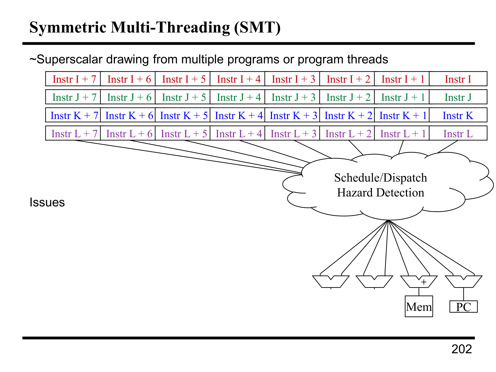

这页讲的是 **SMT（对称多线程，Simultaneous Multi-Threading）**——也就是常说的“超线程”。要点如下：

## 是什么？

* 在**同一个物理核**里，同时维持 **多条线程（或多个程序）** 的架构状态（各自有 PC、寄存器映像、部分预测器状态等）。
* 每个时钟周期，像**超标量处理器**那样从**多个线程的就绪指令队列**里“抓取”（fetch/issue）多条指令，送进**统一共享**的执行资源（整数/浮点单元、加载/存储队列、Cache、TLB…）。
* 图上 I/J/K/L 四个线程的一串“Instr …”就是各线程的指令流；中间的“Schedule/Dispatch/Hazard Detection”是**统一调度器**：做就绪判断、相关性/结构冒险检测，然后把可发射的指令派到下方共享的执行单元/访存单元。

## 为什么要这样做？

* **提高执行单元利用率**：单线程遇到**Cache miss、分支失误、依赖冒险**时会“空转”；SMT 可从**其他线程**补位发射，**把空洞填满**，提升每周期完成指令数（IPC）。
* **隐藏长延迟**：当某线程被内存长延迟阻塞，其他线程继续前进，相当于利用**线程级并行**来弥补**指令级并行**不足。

## 共享与隔离

* **共享**：执行流水线、L1/L2 Cache、带宽、TLB、分支预测器（通常分配或打标签）等。
* **隔离**：每线程各自的**PC、寄存器重命名映射、ROB/队列条目配额**等（硬件按线程打标签，保证提交次序和精确异常）。

## “Issues”（常见问题/挑战）

* **资源竞争 & 抢占公平性**：多个线程争同一端口/Cache/带宽，需要**配额、优先级或 QoS**；否则可能出现**饿死**、尾延迟上升。
* **Cache/TLB 压力**：多线程并发会增加**容量/冲突 miss**；工作集互相干扰，可能**拖慢单线程性能**。
* **分支预测/BTB 污染**：不同线程共享预测结构，若未做分线程标记，命中率下降。
* **调度复杂度**：统一的冒险检测、重命名、发射仲裁在多线程下更复杂，功耗也更高。
* **安全与隔离（扩展话题）**：共享微结构可能引入**侧信道**（如 cache/timing），需要隔离/噪声/分区等对策。

## 何时最有效？

* 工作负载由**很多轻量线程**组成、且每线程常被**存储层**卡住（如服务端、在线事务、编译/脚本、前端后台任务）时；
* 对**强单线程**要求的代码，SMT 可能因资源争用而**不如关闭 SMT 的单线程峰值**，因此许多处理器允许**按核心开关 SMT**。

一句话：**SMT = 在一个核里让多条线程“同时发射”，用更多并行去填满共享执行资源的空闲；收益是更高吞吐，代价是共享资源的竞争与复杂度上升。**


---

## 第 32 页

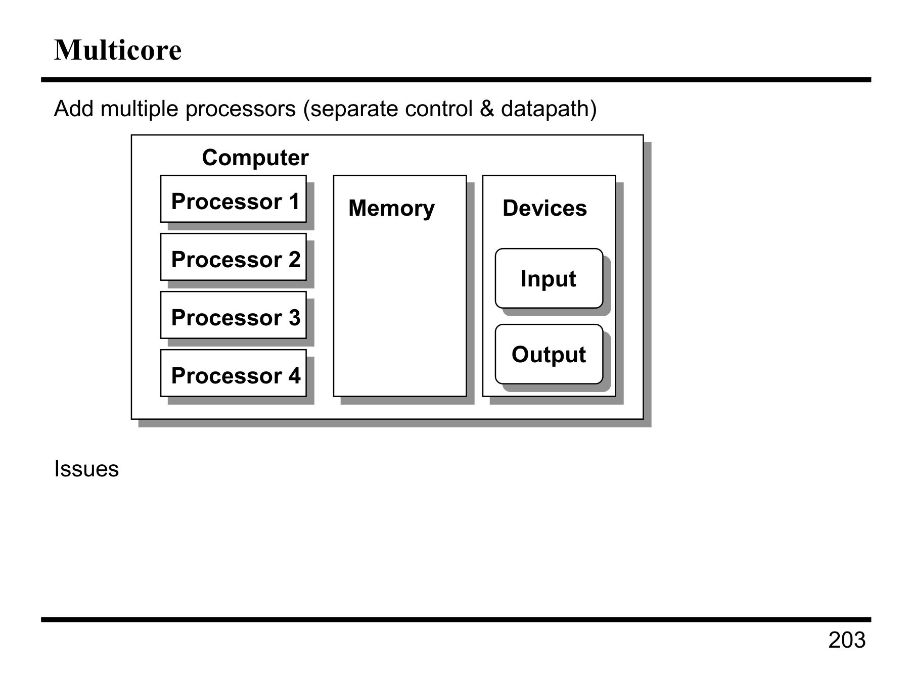

这页讲的是 **多核（Multicore）**。

## 是什么

* 在**同一颗芯片**上放置**多个处理器核心**（图中 Processor 1\~4）。
* **每个核**都有**各自的控制与数据通路**（取指、发射、执行单元、寄存器、私有 L1/L2 等），而**内存/设备**通常是**共享**的（右侧 Memory、Devices/Input/Output）。

## 为什么做

* 单核频率与功耗难再提升时，通过**并行核数**提高**吞吐量**与**能效**。
* 对可并行任务（多线程/多进程/服务端并发请求/批处理）能近似线性加速。

## 与 SMT 的区别

* **SMT**：一个核里让**多线程同时发射**，共享该核的执行资源。
* **多核**：直接**多份完整的执行资源**并行工作；可与 SMT 叠加（每核再开多线程）。

## 关键“Issues”（实现/使用中的问题）

1. **Cache 一致性（Coherence）**

* 多核共享数据时必须保证各核缓存视图一致（MESI/MOESI 协议等）。
* 相关问题：**伪共享（false sharing）** 会导致无谓的失效和总线流量。

2. **内存一致性模型（Consistency）**

* 不同架构对跨核读写的**可见顺序**约束不同（例如 ARM 的较弱顺序 vs. x86 的 TSO），需要屏障/原子操作正确同步。

3. **共享资源争用**

* 共享的 **LLC/L3、内存带宽、互连（NoC/环形总线）、I/O** 会成为瓶颈；需要 QoS/带宽限制/优先级策略。

4. **可扩展性与 Amdahl 定律**

* 程序的**串行部分**限制总体加速比；负载不均衡会让部分核闲置。
* 需要良好的任务划分、工作窃取调度、减少串行/临界区。

5. **操作系统/运行时调度**

* 线程绑核、亲和性（NUMA-aware）、缓存亲和、避免频繁迁移与抖动。
* 在 NUMA 系统上需要\*\*就地分配（first-touch）\*\*与拓扑感知。

6. **功耗与散热**

* 多核并发提升总功耗与温度；常用 **DVFS**、功耗门控、按需启停核。

7. **互连与延迟**

* 多核越多，对**片上互连拓扑和延迟**越敏感（总线→环→Mesh）；影响一致性开销与延迟。

8. **安全与隔离**

* 共享微结构产生**侧信道**（cache/BTB/TLB 等）；需要分区/随机化/隔离策略。

## 何时收益最大

* 任务天然并行、线程间同步少、共享数据少或良好分区的工作负载（Web 服务、数据库并发、批处理、科学计算、媒体处理等）。

一句话：**多核**就是在一片芯片上放**多个独立的核**，用**硬件层面的并行**提升吞吐；但要付出在**一致性、带宽、调度、功耗**等方面的工程代价。


---

## 第 33 页

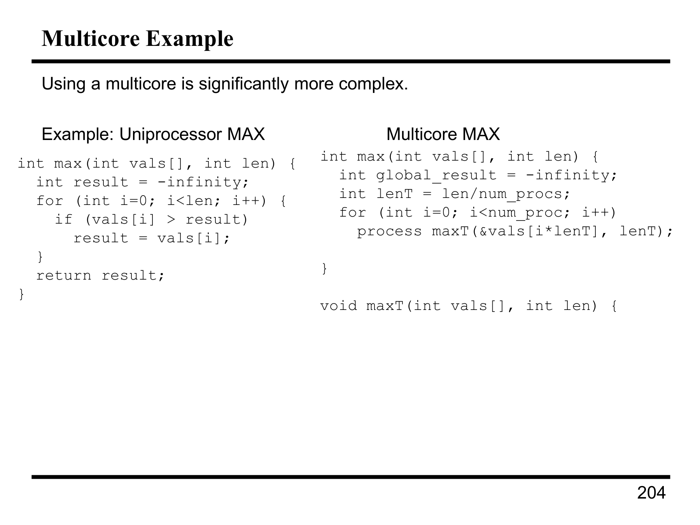

这页是在用“求数组最大值”的小例子说明：**把顺序程序搬到多核上其实没那么直接**，需要额外的并行设计。

## 左边：单核（Uniprocessor MAX）

顺序遍历一遍数组，用一个 `result` 维护当前最大值，最后返回。简单、没有并发问题。

```c
int max(int a[], int n){
int result = -infinity;
for (int i=0; i<n; ++i)
if (a[i] > result) result = a[i];
return result;
}
```

## 右边：多核（Multicore MAX）

思路：把数据**分段**给多个核，各自算**局部最大值**，再**归约**成全局最大值。

```c
int max(int a[], int n){
int global_result = -infinity;
int lenT = n / num_procs;              // 每核负责的长度
for (int i=0; i<num_procs; ++i)
process maxT(&a[i*lenT], lenT);    // 启动并行任务/线程
// 等待所有任务结束后把各自的局部最大值合并成 global_result
}

void maxT(int a[], int n){
// 在本段里顺序求局部最大值（返回或写到每线程私有槽位）
}
```

> 课件只给了框架：真正实现还需要“启动/等待线程 + 合并局部结果”的代码。

### 多核实现要注意的点

* **划分与负载均衡**：`n` 不能整除时要处理余数；数据不均匀时可能要动态划分。
* **归约方式**：推荐“每线程私有 `local_max` → 主线程统一合并”，避免共享写；若直接写全局最大值，需要加锁/原子操作。
* **同步**：主线程需要 `join/barrier` 等待所有工作线程结束再返回结果。
* **缓存与内存**：分块能提升局部性；把每线程的 `local_max` 放在不同 cache line 以避免伪共享；NUMA 机器注意就地分配。
* **开销与加速比**：线程创建/调度有开销；数据太小或核数太多可能不如单核快；受 Amdahl 定律约束。

### 小结

多核版实质是 **Map（分块计算） + Reduce（归约合并）**。功能没变，但需要处理并发正确性、同步与性能问题，这就是“Using a multicore is significantly more complex”的含义。


---

## 第 34 页

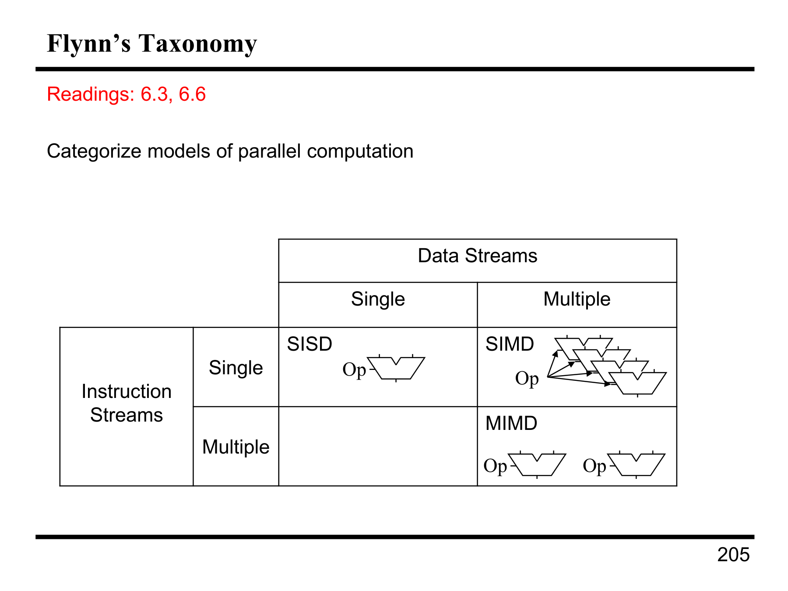

这张图在讲 **Flynn 并行体系结构分类法**：用“**指令流**（行方向）”和“**数据流**（列方向）”两个维度，把处理器/程序的并行方式分成 4 类（图里画了 3 个常见的）：

1. **SISD（Single Instruction, Single Data）单指令单数据**

* 一次只取一条指令，作用于一个数据。
* 典型：传统单核标量 CPU。
* 优点：通用、简单；缺点：并行度最低。

2. **SIMD（Single Instruction, Multiple Data）单指令多数据**

* 多个计算单元**锁步执行同一条指令**，但各自处理不同的数据元素。
* 适合数据并行：向量/矩阵、图像处理、深度学习张量。
* 典型：CPU 的 SSE/AVX/NEON 向量指令；GPU（常说 SIMT，本质近似 SIMD）。
* 优点：吞吐高、能效好；缺点：分支/不规则访问时效率下降。

3. **MIMD（Multiple Instruction, Multiple Data）多指令多数据**

* 各核/线程可执行**不同指令流**，处理各自的数据。
* 典型：多核 CPU、服务器集群、云上多实例；多线程程序。
* 优点：最灵活，能表达任务并行与异构工作负载；缺点：调度、同步、缓存一致性更复杂。

> 还有一个少见的 **MISD（多指令单数据）**（图中未列），多条指令作用在同一数据上，多用于容错/流水线特例。

**如何用：**

* 数值向量化/图像卷积 → 选 **SIMD**。
* 多任务/不同阶段流水并行、服务端并发 → 选 **MIMD**。
* 简单顺序程序或串行阶段 → **SISD**。

**要点小结：**

* 横轴“Data Streams”表示同时处理的数据集合数；纵轴“Instruction Streams”表示并行执行的指令序列数。
* 选择模型取决于应用是**数据并行**还是**任务并行**，以及对分支/内存访问模式的要求。


---

## 第 35 页

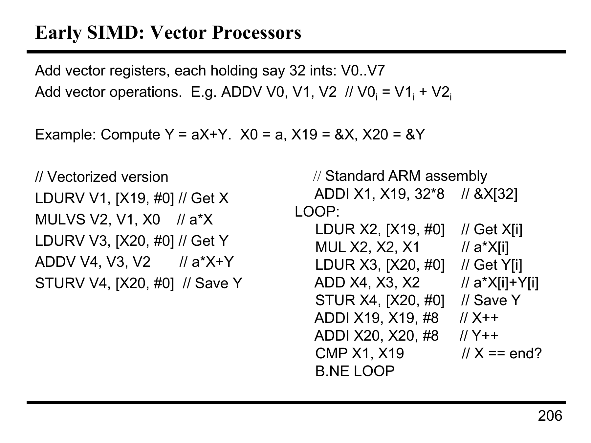

这页在讲“早期 SIMD：向量处理器”的基本思想，并把**向量化版本**与**普通标量循环**放在一起对比。

# 核心概念

* 处理器里有**向量寄存器**（示例：V0..V7），每个寄存器一次能装下很多个元素（比如 32 个 int）。
* 指令支持**向量操作**：

* `LDURV V1, [X19,#0]`：把内存中一整段连续的数据一次性装到向量寄存器 V1 里（相当于装 32 个 int）。
* `MULVS V2, V1, X0`：向量-标量乘法，V2\[i] = V1\[i] \* a（a 在标量寄存器 X0）。
* `ADDV V4, V3, V2`：向量加法，V4\[i] = V3\[i] + V2\[i]。
* `STURV V4, [X20,#0]`：把一整段向量数据一次性存回内存。
* 例子是计算向量运算 **Y = a·X + Y**（a 在 X0，X19 指向 X 的首地址，X20 指向 Y 的首地址）。

# 左边：向量化版本（Vectorized）

```
LDURV V1, [X19,#0]   // 取一向量的 X
MULVS V2, V1, X0     // V2 = a * X
LDURV V3, [X20,#0]   // 取一向量的 Y
ADDV  V4, V3, V2     // V4 = a*X + Y
STURV V4, [X20,#0]   // 写回 Y
```

* 每条指令**同时处理很多元素**（如 32 个），没有显式的循环控制、加一、比较、分支。
* 非常适合“对大量数据做相同运算”的**数据并行**。

# 右边：普通 ARM 标量循环

```
ADDI X1, X19, 32*8   // 计算尾地址 &X[32]
LOOP:
LDUR X2, [X19,#0]  // 取 X[i]
MUL  X2, X2, X1    // a * X[i]
LDUR X3, [X20,#0]  // 取 Y[i]
ADD  X4, X3, X2    // a*X[i] + Y[i]
STUR X4, [X20,#0]  // 存回 Y[i]
ADDI X19, X19, #8  // X 指针++
ADDI X20, X20, #8  // Y 指针++
CMP  X1, X19       // 到尾了吗？
B.NE LOOP          // 没到就跳回
```

* 一次只处理**1 个元素**，并且每次迭代都有**循环控制开销**（加法、比较、分支）。

# 向量化的好处

* **吞吐提升**：如果向量寄存器宽度能放 32 个 int，那么核心算术指令的并行度可达 \~32×。
* **指令数减少**：没有每次迭代的“加指针、比较、分支”等循环开销。
* **能效更高**：做同样工作，前端取指和控制流开销更小。

# 使用向量化的注意点

* **对齐/连续性**：`LDURV/STURV` 通常要求连续内存（最好按向量宽度对齐），否则需要更复杂的“gather/scatter”或拆分。
* **尾部处理（remainder）**：数据长度不是向量宽度的整数倍时，要加“尾循环”或用**掩码/谓词**（mask/predicate）来处理最后几项。
* **内存带宽**：向量化把算术做得很快，但需要足够的带宽把数据喂给 ALU，否则会被内存速度限制。
* **分支/不规则访问**：SIMD 对有大量分支或随机访问的代码不友好；需要重写数据布局或用掩码执行。
* **现代对应物**：今天 CPU 的 NEON/SSE/AVX/AVX-512 就是这类 SIMD；GPU 则是更大规模的 SIMT/SIMD。

**一句话总结：**向量处理器/向量化用“更宽的寄存器 + 一条指令多数据（SIMD）”把 `Y = aX + Y` 这类**数据并行**任务一次做很多个元素，从而大幅降低指令和控制开销、提升吞吐。


---

## 第 36 页

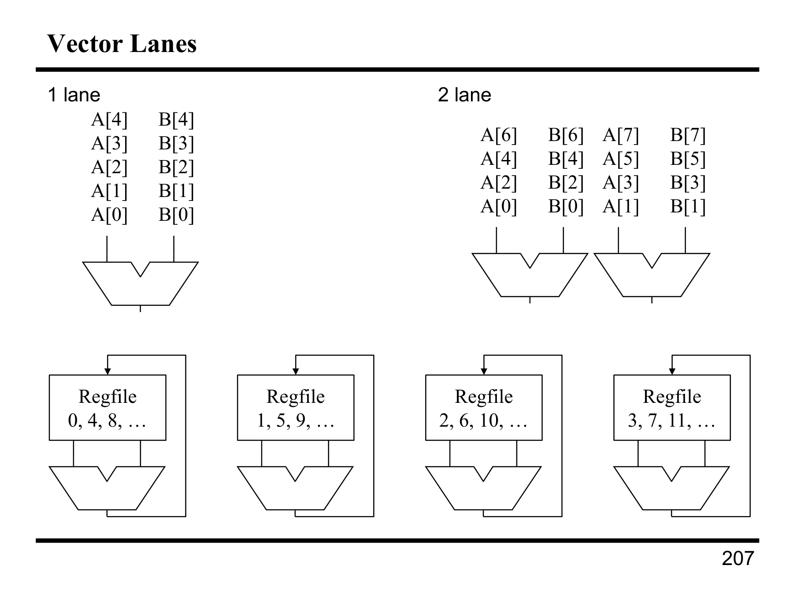

这页在讲\*\*向量处理器里的“通道（lane）”\*\*怎么把一条向量并行执行。

### 1 lane（左边）

* 只有**一条**计算通道。
* 做 A\[i] 与 B\[i] 的运算时，元素会**按顺序**依次进入同一条通道：A\[0]/B\[0] → A\[1]/B\[1] → … → A\[4]/B\[4]。
* 吞吐量=1 个元素/周期（理想情况下）。

### 2 lane（右边）

* 有**两条**并行通道。
* 元素按**轮转/取模分配**到各 lane：

* lane0 处理偶数位：A\[0], A\[2], A\[4], A\[6]（B 同理 B\[0], B\[2], …）
* lane1 处理奇数位：A\[1], A\[3], A\[5], A\[7]（B\[1], B\[3], …）
* 两条 lane 同时干活，理想吞吐≈**翻倍**。

### 下面的 “Regfile 0,4,8… / 1,5,9… / 2,6,10… / 3,7,11…”

* 这是**分块（banked）寄存器文件**的示意：把向量寄存器按下标取模分到不同 bank，避免多 lane 争同一个端口。
* 例如 4 lane：

* Bank0 存 index ≡ 0 (mod 4)：0,4,8,…
* Bank1 存 index ≡ 1 (mod 4)：1,5,9,…
* Bank2 存 index ≡ 2 (mod 4)：2,6,10,…
* Bank3 存 index ≡ 3 (mod 4)：3,7,11,…
* 这样每个 lane 只访问自己的 bank，**无冲突、满带宽**地并行读/写。

### 直观理解

把一长列元素“分道并行”：

* 1 lane = 单车道排队过桥；
* 2 lane（或更多）= 多车道并行过桥；
* 寄存器“0,4,8…”等就是把车辆提前分到不同车道的车库，这样出入库互不堵。

**结论**：向量通道通过“按元素下标取模分配 + 分块寄存器文件”，让同一条向量指令在多条小流水上**并行**执行，显著提升吞吐，而编程模型仍然是“对整条向量做一次操作”。


---

## 第 37 页

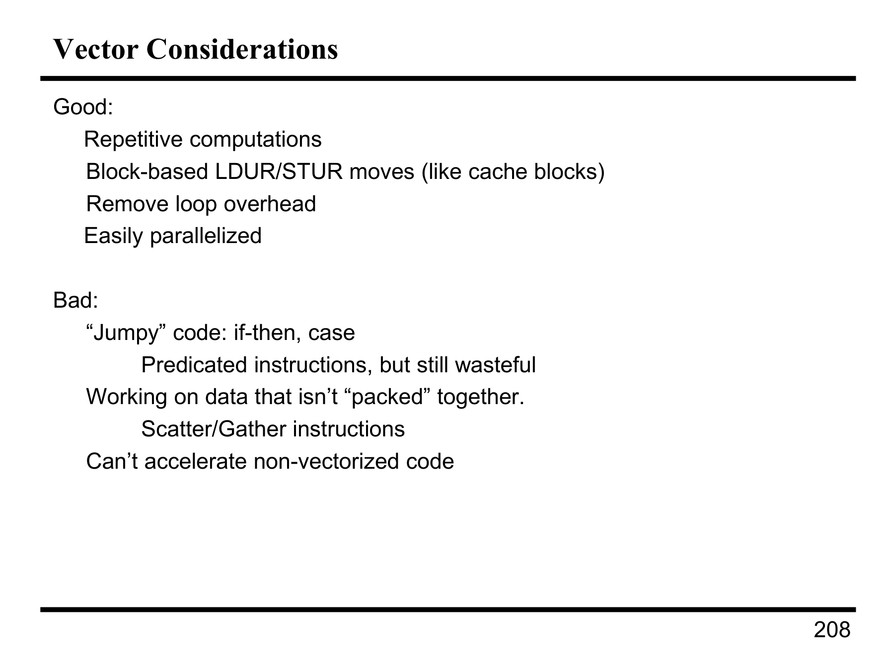

这页在讲**向量化（SIMD）什么时候很合适、什么时候很糟糕**。

# 适合向量化的情况（Good）

* **重复性强的计算**
同一操作对一大批数据做一遍（如加法、乘法、点积、卷积、滤波、激活函数等）。SIMD 一条指令就能并行处理多元素，吞吐量高。
* **块式内存读写（LDUR/STUR 成块搬运，像缓存块）**
连续、对齐的数据可用“成块加载/存回”，一次搬多元素进向量寄存器，带宽利用率高、访存次数少。
* **减少循环开销**
原本每次迭代都要分支判断/更新索引。向量化后一次处理 N 个元素，循环次数和控制开销成比例下降。
* **天然可并行**
数据项之间互不依赖（或依赖已被消除/重排），SIMD 可直接把工作分给多个 lane 同时执行。

# 不适合/困难的情况（Bad）

* **“跳跃性很强”的代码：大量 if-then、switch/case**
分支会让同一个向量里的不同元素走不同路径。可以用\*\*谓词/屏蔽（predication）\*\*把分支改成按掩码执行，但没被选中的元素等于在浪费算力，效率下降。
* **数据不是“打包在一起”的（不连续、不对齐、乱访问）**
需要 **scatter/gather**（按索引分散/聚集）来加载/存回零散位置，访存开销和复杂度上升，可能触发更多 cache miss，抵消并行收益。
* **不能向量化的代码加速不了**
如果算法或数据结构本身没法批量并行（强依赖、复杂控制流、跨元素写后读/读后写冲突），SIMD 基本帮不上忙。

**一句话总结**：
把**同构运算 + 连续数据**打包成“批处理”，SIMD 就能高效；一旦**分支多**或**数据离散**，即使用了谓词或 scatter/gather，也常因带宽/掩码浪费而收益有限。


---

## 第 38 页

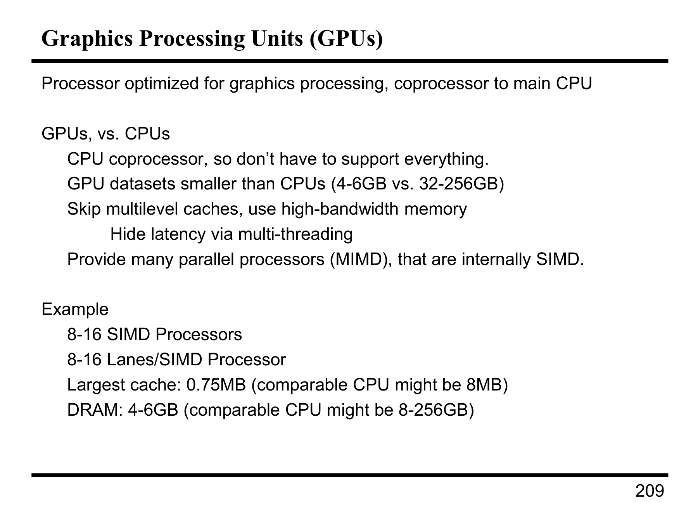

这页在说明**GPU（图形处理器）与 CPU 的差别、设计取向**，以及一个典型参数规模。

# 要点

* **定位**：GPU 是为图形/数据并行计算优化的**协处理器**（coprocessor）。主机还是 CPU；GPU 负责被 offload 的重并行工作，因此**不必像 CPU 一样支持所有复杂特性**（复杂控制流、很强的一致性、庞大缓存层次等）。

* **与 CPU 的关键区别**

1. **目标：吞吐量优先**（Throughput），不是 CPU 的**低时延**（Latency）。
2. **存储配置**：GPU 的**可用内存总量更小**（课件举例：4–6 GB；而 CPU 可 32–256 GB），但**内存带宽极高**，以喂饱大规模并行计算。
3. **缓存层次更简化**：很多 GPU **弱化多级缓存**，更多依赖**高带宽显存**与少量片上共享存储/局部缓存。
4. **用多线程“掩蔽”时延**：当某批线程因访存而等待时，**硬件快速切换**到另一批就绪线程继续执行——靠**海量并发**隐藏内存/流水线时延。
5. **并行结构**：对外呈现**很多并行处理器（MIMD）**，每个处理器内部执行**SIMD**（同一条指令对多数据，N 条“lane”/“向量通道”同时算），整体上常称 **SIMT**（单指令多线程）。

* **典型规模（示意）**

* **8–16 个 SIMD 处理器（SM）**；
* 每个 SIMD 处理器 **8–16 条 lane** 并行执行；
* **最大缓存 \~0.75 MB**（可对比 CPU 可能有 **\~8 MB** 甚至更多的 L3）；
* **显存 4–6 GB**（可对比 CPU 内存 **8–256 GB**）。

> 数字只是课堂示例，真实产品会更大，但**比例关系**（大量并行 + 高带宽、较小缓存/内存）是对的。

# 为什么这样设计？

* 图形与通用数据并行任务（矩阵/向量运算、卷积、光栅化/着色等）**控制流简单、数据量巨大、可分块并行**。
* 因此最划算的是：**堆叠算力与带宽**，让成千上万线程执行同构运算；一遇到访存就**切到其他线程**，以**吞吐量**最大化为目标。

# 适用/不适用

* **适合**：数据并行、计算/带宽密集、分支少或可掩蔽的工作负载（如深度学习、图像视频处理、科学计算）。
* **不适合**：强顺序、分支复杂、工作集很小又频繁切换的任务——这类**低并行/高控制**工作仍由 CPU 更高效完成。
* 还要注意**数据搬运成本**：主机与 GPU 之间的拷贝（PCIe 等）需要被足够大的计算量**摊薄**。

# 编程模型（延伸）

* 常见为 **CUDA / OpenCL**。程序把大量线程分成“线程束/warp（N 条 lane）”，同一 warp 内**同指令锁步执行**（SIMD/SIMT），分支会导致掩码执行与效率下降。

**总结**：GPU 为**大规模数据并行 + 高带宽**而生，靠**海量线程 + SIMD**追求单位时间完成的总工作量（吞吐）。与 CPU 的“通用 + 低时延 + 大缓存/内存”形成互补。


---

## 第 39 页

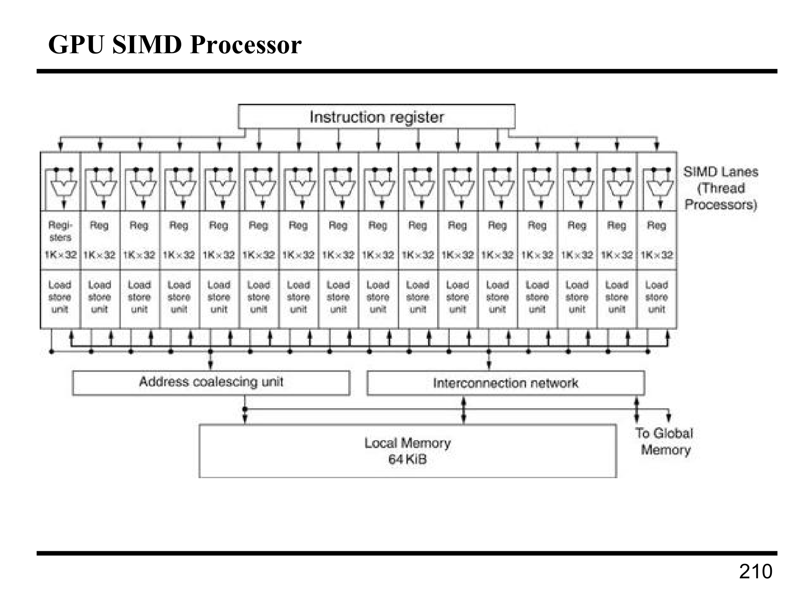

这页图是一个**GPU 中的“SIMD 处理器”（也就是一个 SM/CU 的内部简化结构）**。它展示了 GPU 为了把同一条指令同时执行在很多数据上（SIMD / SIMT）的硬件组织方式，以及访存怎样被合并与送到显存。

## 结构从上到下看

* **Instruction register（指令寄存器）**
控制器一次取出一条指令，并**广播**给下方所有并行执行单元（称为 *SIMD lanes*、也叫 *thread processors*）。这就是“单指令，多数据”。

* **SIMD Lanes / Thread Processors（并行执行通道）**
每一列就是一个“lane”。一条 lane 里通常含有：

* **ALU/FP 单元**：真正做加减乘除、逻辑运算。
* **Reg（寄存器文件）**：图里标注 `1K×32`，表示每 lane 有很多标量寄存器（例如 1K 个，每个 32 位），用于保存该 lane 对应线程的私有寄存器值。GPU 之所以能一次挂载上千个线程，靠的就是**超大的寄存器文件**。
* **Load/Store unit（访存单元）**：该 lane 发起对内存的读取/写入。
所有 lanes 接到同一条指令，但各自处理**不同的数据元素**（不同线程的寄存器/地址）。

* **Address coalescing unit（地址合并单元）**
多个 lane 发出的**相邻/规则**内存访问会在这里**合并成更少、更宽的一次事务**（coalescing），以充分利用显存带宽、减少突发次数。
👉 这就是为什么**连续、对齐的数据布局**在 GPU 上更快；若访问稀疏/乱序，合并效果差，带宽利用率低。

* **Interconnection network（互连网络）**
把 lanes 的访存请求/返回数据，与下面的片上存储/外部显存连接起来（可理解为 crossbar/NoC）。

* **Local Memory 64 KiB（片上本地存储/共享内存）**
一个 SM 内所有 lanes（或同个线程块）**共享**的快速存储，延迟/带宽都比显存好，常用于平铺（tiling）、共享数据、缓存子块。
注意它与“每线程私有寄存器”不同，是**可编程显式管理**的 scratchpad（很多架构也把一部分做成 L1/共享混合）。

* **To Global Memory（到全局显存）**
连接到板载 GDDR/HBM 等高带宽显存。Local 用来缓冲/重用数据，Global 是大容量主存。

## 执行行为（SIMD / SIMT 概念）

* GPU 把很多线程按固定宽度分成“**warp/波前**”（比如 32/64 线程）。**同一 warp 的线程同一周期执行同一条指令**，正好对应图里若干 lanes 锁步工作。
* **分支发散**：如果 warp 内线程走不同分支，硬件以“掩码”方式分时执行各分支，等价于串行化分支路径，会降低利用率。

## 为什么这样设计？

* 通过**指令广播 + 大量 lanes**，把控制开销摊薄，最大化算力；
* 用**地址合并 + 共享内存**，把显存带宽“喂饱”算力，隐藏访存时延（再配合大量并发线程切换）。

## 对编程的启示

* **结构化、连续、对齐的内存访问**能触发 coalescing → 带宽高；
* **尽量减少 warp 内分支发散**；
* 充分利用**共享内存/片上缓存**做数据重用（如块内转置、卷积平铺）；
* 控制寄存器使用（过多会降低并发度）。

一句话：这张图把 GPU 一个并行执行簇从**指令广播 → 多 lane 锁步执行 → 访存合并 → 片上/片外存**的流水清楚地画出来了。
