---

## 第 1 页

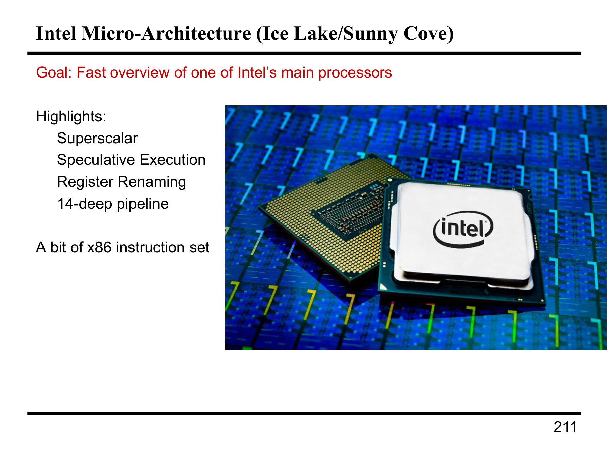

这张图描述的是 **Intel Ice Lake/Sunny Cove** 微架构的概述。它展示了该架构的主要特点，并提供了简要的介绍。

## 关键特性

1. **Superscalar（超标量）**
这意味着处理器能够在一个时钟周期内发出多个指令。与单一指令流水线处理器不同，超标量架构允许同时执行多个指令，从而提高处理器的并行性和性能。现代的 CPU 通常具有多条执行单元，每条执行单元可以同时处理不同的指令。

2. **Speculative Execution（投机执行）**
投机执行是一种技术，CPU 会在无法确定执行路径时，提前执行某些指令，假设某条路径会被执行。如果后来的计算确定了路径是正确的，处理器就会继续执行这些指令，否则会丢弃错误的执行结果。虽然这有时能提升性能，但也可能带来安全风险（例如 Meltdown 和 Spectre 漏洞）。

3. **Register Renaming（寄存器重命名）**
在寄存器重命名过程中，硬件会给程序中的寄存器分配新的名字，从而避免数据冒险（Data Hazards）。通过这种方式，可以消除寄存器之间的依赖，允许更多的指令并行执行，提高执行效率。

4. **14-Deep Pipeline（14级深流水线）**
这意味着处理器将指令分成14个不同的阶段，每个阶段负责处理不同的任务。深流水线有助于提高指令的吞吐量，但也会增加指令之间的延迟，尤其是在出现分支时。更深的流水线通常带来更高的频率，但也意味着更高的分支惩罚和更多的调度挑战。

## 附加说明

* **A bit of x86 instruction set（一些 x86 指令集的内容）**
该架构支持 **x86 指令集**，这是世界上最常用的桌面和服务器处理器架构之一。尽管现代的 x86 处理器（如 Ice Lake）已经加入了大量的新指令和扩展，但它仍然保持向后兼容性，以支持旧有的 x86 指令集。

### 总结

图中展示了 **Intel Ice Lake/Sunny Cove** 处理器的核心架构和特点，强调了多种优化技术，如超标量、投机执行和寄存器重命名，旨在提高并行处理能力、执行效率以及最大化性能。然而，这种架构也带来一些复杂性，如深流水线可能导致的性能瓶颈和与分支相关的延迟。

---

## 第 2 页

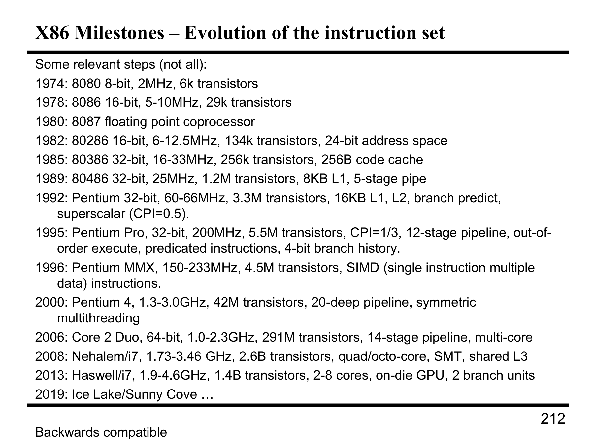

这张图展示了 **x86架构** 的发展历程，列出了各个里程碑事件，涵盖了从1974年到2019年间x86处理器的主要进展。每个时间节点的特点显示了处理器在性能、技术和架构方面的关键变化。我们来逐一解释这些里程碑事件。

### 关键里程碑

#### 1974年 - **8080** 处理器

* **规格**：8位，2MHz，6千个晶体管
* **特点**：这是x86系列的开端，标志着Intel进入微处理器市场，推出了最初的8位处理器。

#### 1978年 - **8086** 处理器

* **规格**：16位，5-10 MHz，29千个晶体管
* **特点**：8086是第一个16位的处理器，支持16位的运算和24位的地址空间，奠定了后续x86架构的基础。

#### 1980年 - **8087 浮点协处理器**

* **规格**：与8086一起使用，提供浮点运算支持
* **特点**：8087是第一个浮点协处理器，使得8086可以执行复杂的数学运算，推动了科学计算和工程计算的需求。

#### 1982年 - **80286** 处理器

* **规格**：16位，6-12.5 MHz，134千个晶体管，24位地址空间
* **特点**：80286引入了更高的频率和更大的地址空间，且支持“保护模式”，即使得操作系统能够处理更大的内存。

#### 1985年 - **80386** 处理器

* **规格**：32位，16-33 MHz，256千个晶体管
* **特点**：80386是第一个支持32位运算的x86处理器，支持更高效的内存管理和更强的性能。

#### 1989年 - **80486** 处理器

* **规格**：32位，25 MHz，1.2百万个晶体管，8KB L1缓存，5阶段流水线
* **特点**：引入了L1缓存、5阶段流水线，极大提高了处理速度和效率。

#### 1992年 - **Pentium** 处理器

* **规格**：32位，60-66 MHz，3.3百万个晶体管，16KB L1，L2缓存，分支预测，超标量（CPI=0.5）
* **特点**：Pentium是Intel推出的第一个超标量处理器，可以同时执行多条指令，显著提升了性能。

#### 1995年 - **Pentium Pro** 处理器

* **规格**：32位，200 MHz，5.5百万个晶体管，CPI=1/3，12阶段流水线，乱序执行，预测指令，4位分支历史
* **特点**：Pentium Pro引入了乱序执行和更深的流水线，进一步提高了计算性能，成为高端工作站和服务器的首选。

#### 1996年 - **Pentium MMX**

* **规格**：150-233 MHz，4.5百万个晶体管，SIMD指令（单指令多数据）
* **特点**：加入SIMD指令集（如MMX），适用于图像处理、音频处理等多媒体应用。

#### 2000年 - **Pentium 4** 处理器

* **规格**：1.3-3.0 GHz，42百万个晶体管，20级流水线，对称多线程
* **特点**：Pentium 4的流水线更深，采用了更多的流水阶段，支持超高频率。

#### 2006年 - **Core 2 Duo**

* **规格**：64位，1.0-2.3 GHz，291百万个晶体管，14阶段流水线，多核处理器
* **特点**：引入了双核架构，支持多核处理，适用于桌面计算机，开启了多核处理的新时代。

#### 2008年 - **Nehalem/i7**

* **规格**：1.73-3.46 GHz，2.6B晶体管，四核/八核，SMT（超线程技术），共享L3缓存
* **特点**：Nehalem架构大幅提升了性能，采用了集成内存控制器和更大的缓存，支持更高效的并行计算。

#### 2013年 - **Haswell/i7**

* **规格**：1.9-4.6 GHz，1.4B晶体管，2-8核，集成GPU，2个分支单元
* **特点**：Haswell架构提供更强的计算能力和更高效的图形处理，支持高并发任务。

#### 2019年 - **Ice Lake/Sunny Cove**

* **规格**：最新的Intel微架构，细节未列出
* **特点**：基于10nm工艺的最新微架构，性能和效率有进一步提升，主要用于笔记本和台式机。

### 总结

这张表格描述了x86架构从最初的8080到现代的Ice Lake处理器的演变过程。随着每一代处理器的推出，Intel不断在性能、指令集、缓存、流水线深度、并行处理、分支预测等方面进行创新，从而推动计算机性能的不断提升。x86架构已经从最初的简单指令集发展成为如今支持多核、超标量、乱序执行以及高效图形处理的复杂架构。

---

## 第 3 页

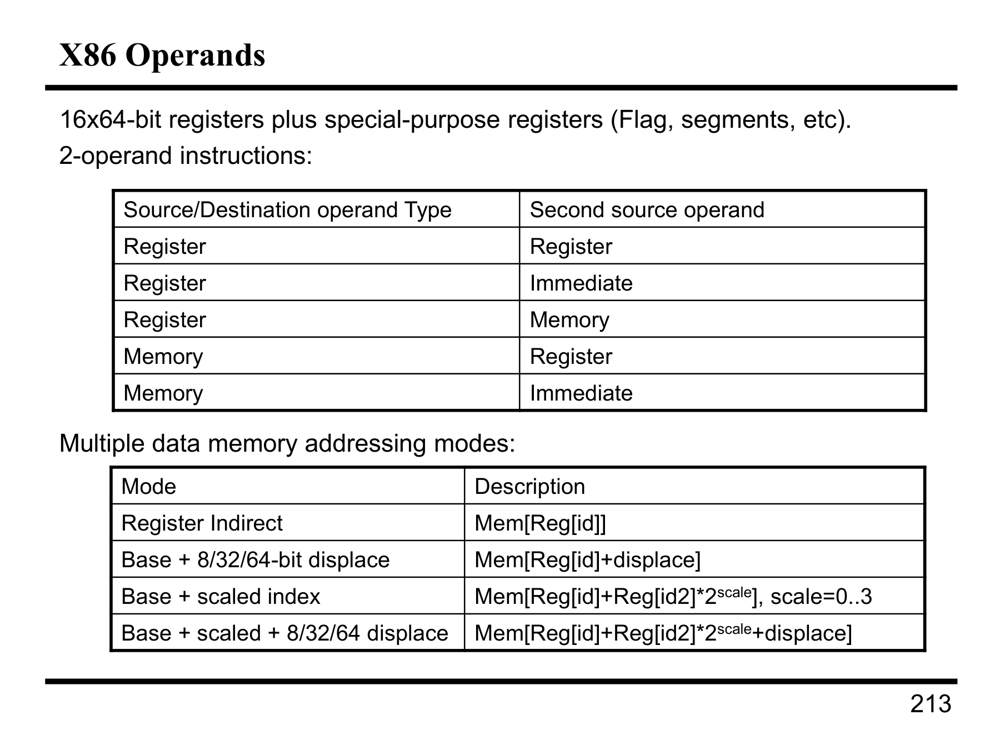

这张图展示了 **x86 操作数** 以及 **数据内存寻址模式**。它介绍了x86指令中使用的操作数类型和不同的内存寻址模式，具体可以分为以下几个部分：

### **x86操作数**

1. **寄存器操作数（16x64-bit）**

* x86架构中有16个64位寄存器，除了通用寄存器之外，还包括一些特殊用途的寄存器，如标志寄存器（Flag）、段寄存器（Segments）等。
* 这些寄存器能够存储数据并用于操作。

2. **2操作数指令**
这类指令有两个操作数，其组合如下：

* **寄存器与寄存器：** 这类指令使用两个寄存器操作，常用于算术运算。
* **寄存器与立即数：** 寄存器和立即数进行运算，如 `MOV AX, 10`（将立即数10存入AX寄存器）。
* **寄存器与内存：** 寄存器和内存地址之间的数据操作，比如 `MOV AX, [BX]`（将BX指向的内存值载入AX寄存器）。
* **内存与寄存器：** 内存中的数据与寄存器数据进行运算，比如 `MOV [BX], AX`（将AX的值存入BX指向的内存位置）。
* **内存与立即数：** 直接使用内存地址和立即数进行运算，比如 `ADD [BX], 5`（将5加到BX指向的内存地址上）。

### **数据内存寻址模式**

内存寻址模式是CPU访问内存的方式，允许灵活地计算内存位置。常见的寻址模式包括：

1. **寄存器间接寻址**

* **模式：** `Memory[Reg[id]]`
* **说明：** 这是最简单的寻址方式，内存地址由寄存器提供。即，寄存器存储内存地址，然后对这个地址进行访问。

2. **基址加偏移寻址**

* **模式：** `Memory[Reg[id] + displacement]`
* **说明：** 内存地址是基址寄存器加上一个固定的偏移量。这允许访问内存中偏移的特定位置。

3. **基址加缩放索引寻址**

* **模式：** `Memory[Reg[id] + Reg[id2] * scale]`
* **说明：** 基地址寄存器与一个乘法因子（缩放）相结合。常用于数组操作，其中一个寄存器存储数组的基址，另一个寄存器存储索引。

4. **基址加缩放索引加偏移寻址**

* **模式：** `Memory[Reg[id] + Reg[id2] * scale + displacement]`
* **说明：** 这是最复杂的一种寻址方式，结合了基址寄存器、缩放因子、索引寄存器和偏移量，允许灵活的内存访问。

### 总结

* **寄存器操作数**允许高效的数据存取。
* **内存寻址模式**提供多种灵活的方式来访问内存，可以根据程序的需求选择不同的寻址方式，支持从简单的寄存器间接寻址到复杂的基址加偏移加缩放索引的寻址方式。这些寻址模式对于优化代码、提高内存访问效率是至关重要的。

这些概念和模式使得x86架构能够处理复杂的内存操作和运算任务，能够满足各种计算需求。

---

## 第 4 页

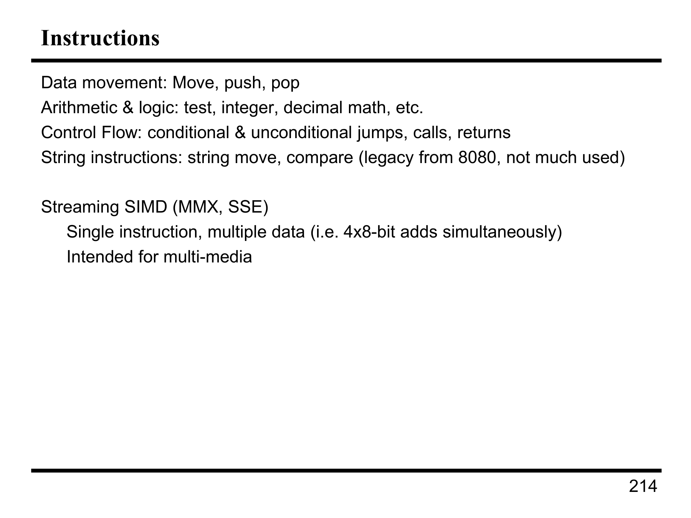

这张幻灯片讨论了 **x86指令集** 中的一些基本指令类别以及 **Streaming SIMD**（流式SIMD）指令。

### 主要内容：

1. **数据移动指令**：
包括常见的 **Move**（移动）、**Push**（压入栈）、**Pop**（从栈弹出）等。这些指令用于在寄存器之间、寄存器与内存之间移动数据。

2. **算术与逻辑指令**：
涉及各种 **测试**、**整数**、**十进制数学运算**等指令。例如，执行加法、减法等算术运算，或进行与、或、非等逻辑运算。

3. **控制流指令**：
这些指令用于实现程序的控制流管理，包括：

* **条件跳转**和**无条件跳转**：控制程序的执行路径。
* **函数调用**和**返回**：管理函数的调用和返回操作。

4. **字符串指令**：
这些指令用于操作字符串数据，例如 **字符串移动**、**比较**等。这些指令来源于较早的8080架构，在现代应用中使用不多，但它们仍然作为遗留指令存在。

### **Streaming SIMD**（流式SIMD）

1. **MMX与SSE**：

* **MMX（MultiMedia Extensions）** 和 **SSE（Streaming SIMD Extensions）** 都是为处理多媒体数据（如音频、视频、图像等）而设计的指令集。
* **Streaming SIMD**指令集允许在单个指令中同时对多个数据进行操作（例如同时对4个8位数值执行加法操作），大大提高了数据处理的效率。

2. **SIMD（单指令多数据）**：

* **SIMD**指令集是一种 **并行计算** 方法，它允许一次性处理多个数据元素。举例来说，**4x8-bit**的加法可以通过一条指令同时完成，适用于多媒体处理和高性能计算任务。

3. **用途**：

* 这些指令特别适用于 **多媒体处理**，例如图像处理、视频编解码、音频处理等任务。

### **总结**

* **x86指令集**通过这些指令提供了对数据移动、算术运算、控制流和字符串处理的基本支持。
* **Streaming SIMD**（如MMX和SSE）则针对多媒体应用，通过**单指令多数据**的方式加速大规模数据的并行计算。

---

## 第 5 页

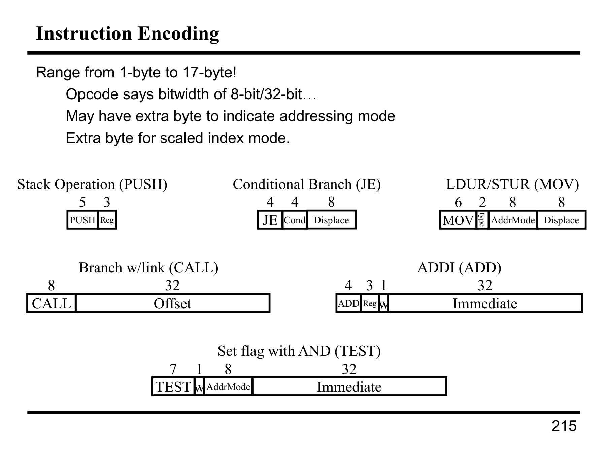

这张幻灯片讲解了 **x86 指令集的编码** 方式，即如何将指令转换为机器码，并展示了几种常见指令的编码格式。

### 主要内容：

1. **指令编码范围**：

* 指令的字节数从 **1 字节到 17 字节不等**。
* 编码的 **操作码（Opcode）** 决定了指令的字节宽度（例如，8 位或 32 位）。
* 有时还需要 **额外的字节** 来指示地址模式，例如 **标量索引模式**。

### 各种指令的编码格式：

1. **Stack 操作（PUSH）**：

* **PUSH Reg**：该指令将寄存器的值压入栈中。
* 编码格式：**5 位操作码 + 3 位寄存器编号**，共 8 位。

2. **条件跳转（JE）**：

* **JE**：表示 **“如果相等”** 的条件跳转，只有当前一个比较操作为真时才会跳转。
* 编码格式：**4 位操作码 + 4 位条件码 + 8 位偏移量**，共 16 位。

3. **LDUR/STUR（MOV）**：

* **LDUR**（Load Register）和 **STUR**（Store Register）：这类指令用于将数据加载或存储到内存。
* 编码格式：**6 位操作码 + 2 位地址模式 + 8 位偏移量 + 8 位其他信息**。

4. **ADD 指令（ADDI）**：

* **ADDI**：加法操作，通常用来将一个常数值（立即数）加到寄存器的值上。
* 编码格式：**4 位操作码 + 3 位寄存器编号 + 1 位指令类型 + 32 位立即数**。

5. **调用指令（CALL）**：

* **CALL**：用于函数调用。
* 编码格式：**8 位操作码 + 32 位偏移量**，用于指示函数调用的目标地址。

6. **测试指令（TEST）**：

* **TEST**：该指令用于 **设置标志位**，例如与运算（AND）。
* 编码格式：**7 位操作码 + 1 位寄存器编号 + 8 位地址模式 + 32 位立即数**。

### **总结：**

* 每条指令的编码格式包括 **操作码**、**寄存器编号**、**地址模式**、**偏移量** 和 **立即数** 等信息。
* 根据不同的指令，字节数和格式可能有所不同，指令的编码格式需要根据实际的操作进行调整。

---

## 第 6 页

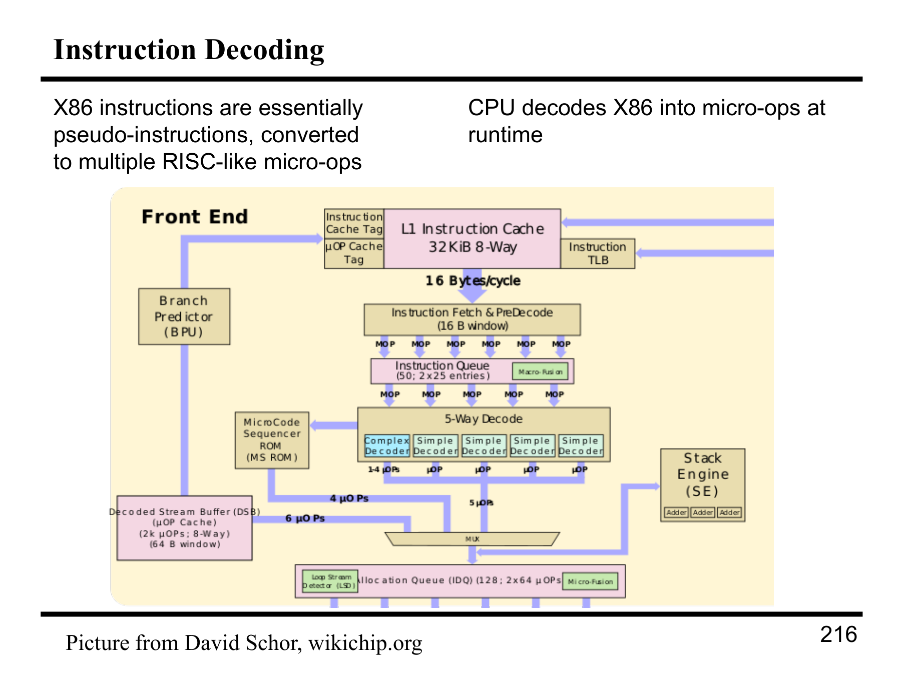

这张图详细描述了 **x86 指令解码** 过程，展示了 **x86 指令** 如何在 CPU 中解码为多个微操作（micro-ops）并执行。该图描述了从取指令到执行的整个过程，尤其是在 **高性能处理器** 中如何处理复杂的 **x86 指令集**。

### 主要内容：

1. **x86 指令是伪指令**：

* x86 指令本身实际上并不是直接执行的。它们是 **伪指令**，在运行时通过解码转化为一系列的 **微操作**。这些微操作是类似 **RISC（精简指令集）** 的简单指令，可以有效地在 CPU 中执行。

2. **解码过程**：

* **前端（Front End）**：

* **指令缓存**（Instruction Cache）：指令从指令缓存中取出，缓存大小为 **32KiB**，采用 **8-way 组相联**。
* **指令预解码和取指**：每个时钟周期处理 **16 字节的指令**。
* **微操作缓存（µOP Cache）**：缓存已解码的微操作，用于加速后续的执行过程。

3. **解码阶段**：

* 在 **指令队列**（Instruction Queue）中，指令会进入 **解码阶段**：

* **复杂解码器**（Complex Decoder）用于处理更复杂的指令。
* **简单解码器**（Simple Decoder）用于处理简单的指令。

4. **微操作执行**：

* 解码后的指令会被分解成 **多个微操作**，这些微操作会通过 CPU 的 **执行单元**（如加法器、乘法器等）执行。
* **堆栈引擎**（Stack Engine）用于处理堆栈相关的操作，例如加法、减法等。堆栈引擎是执行多个算术运算的重要组件。

5. **数据流**：

* 在整个解码和执行过程中，指令会经过多个阶段的解码处理，包括 **取指阶段**（Instruction Fetch）、**解码阶段**（Decode）、**执行阶段**（Execution）等。
* CPU 的内部 **数据流管道** 会将指令流经过各个阶段，确保每一条指令能够被高效地解码并执行。

6. **性能优化**：

* 处理器使用 **微操作缓存** 和 **多级管道**（如 **12级管道**）来优化指令的解码和执行，从而提高 CPU 的吞吐量和响应速度。

### 总结：

这张图描述了 **x86 指令解码** 的复杂性。x86 指令本身是 **伪指令**，CPU 需要将其解码为多个微操作，才能在硬件中有效执行。解码过程包括多个阶段，从 **指令缓存获取** 到 **指令预解码**，最终通过 **解码器** 和 **执行单元** 完成微操作的执行。这种解码机制在 **高性能处理器** 中尤为重要，能够大大提升指令的执行效率。

---

## 第 7 页

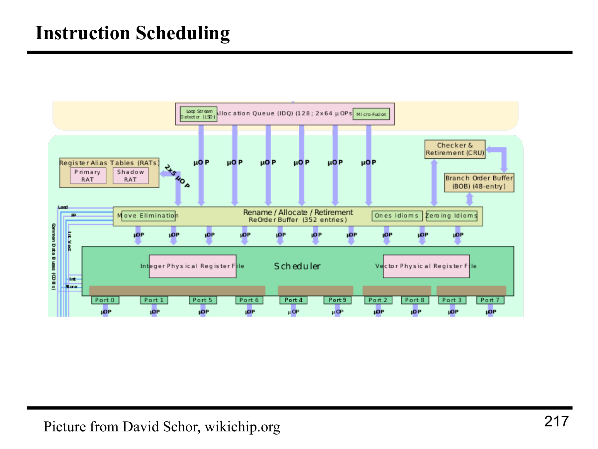

这张图展示了 **指令调度**（Instruction Scheduling）的流程，说明了 **高级 CPU 架构** 中指令的安排与执行过程。指令调度是通过多个硬件组件对指令进行调度、排序和执行的过程，目的是优化性能并确保指令按顺序或依赖关系执行。

### 主要部分和流程解析：

1. **输入阶段**：

* **指令队列（Instruction Queue）**：输入的微操作（µOPs）被排队并准备执行。每个微操作可以有多个依赖和执行阶段。
* **循环流检测器（Loop Stream Detector）**：该组件用于识别指令流中的循环结构，并帮助优化指令调度以提高效率。

2. **寄存器别名表（Register Alias Tables, RATs）**：

* **主寄存器别名表（Primary RAT）** 和 **影像寄存器别名表（Shadow RAT）**：这些表用于跟踪寄存器的映射，解决指令之间的数据依赖。寄存器重命名可以减少指令的执行冲突，尤其是在流水线中。

3. **移动消除（Move Elimination）**：

* 该过程的目标是消除冗余的“移动”指令，即避免将数据从一个寄存器传输到另一个寄存器的无意义操作。

4. **寄存器重命名与分配（Rename / Allocate / Retirement）**：

* 寄存器重命名是将虚拟寄存器映射到物理寄存器的过程，这有助于解决写后读（WAR）和读后写（RAW）依赖。
* **寄存器分配**阶段负责分配物理寄存器并为即将执行的指令提供寄存器资源。

5. **调度器（Scheduler）**：

* 调度器负责确保指令在正确的时间执行，尤其是确保各个微操作在满足所有数据依赖条件后被调度执行。
* 这些微操作通过 **整数物理寄存器文件（Integer Physical Register File）** 和 **向量物理寄存器文件（Vector Physical Register File）** 管理。
* 调度器会考虑指令之间的依赖关系，并确保在不违反依赖条件的情况下尽可能并行地执行指令。

6. **分支指令的管理**：

* **分支顺序缓冲区（Branch Order Buffer, BOB）**：用于跟踪分支指令的顺序，确保分支指令在正确的时机被执行。
* **检查与退役单元（Checker & Retirement, CRU）**：检查执行的微操作是否正确，然后将它们从执行流水线中退役。

7. **标志与指令优化**：

* **零值指令（Zeroing Idioms）** 和 **非零指令（Ones Idioms）**：这些是优化指令，常用于高效地设置寄存器值。

8. **端口与执行单元**：

* 图中显示了多个 **端口**（Port 0 到 Port 9），每个端口用于与寄存器文件交互，支持并行处理。指令通过这些端口进入处理单元，进行具体的操作执行。

### 总结：

这张图描绘了一个现代 **高性能 CPU 架构** 中复杂的指令调度和执行过程。指令从输入到执行、再到输出，通过多个阶段和硬件组件进行调度、排序、重命名等处理，以优化 CPU 的执行效率。这些复杂的调度机制确保了多个指令可以同时并行执行，从而提高整体性能。

---

## 第 8 页

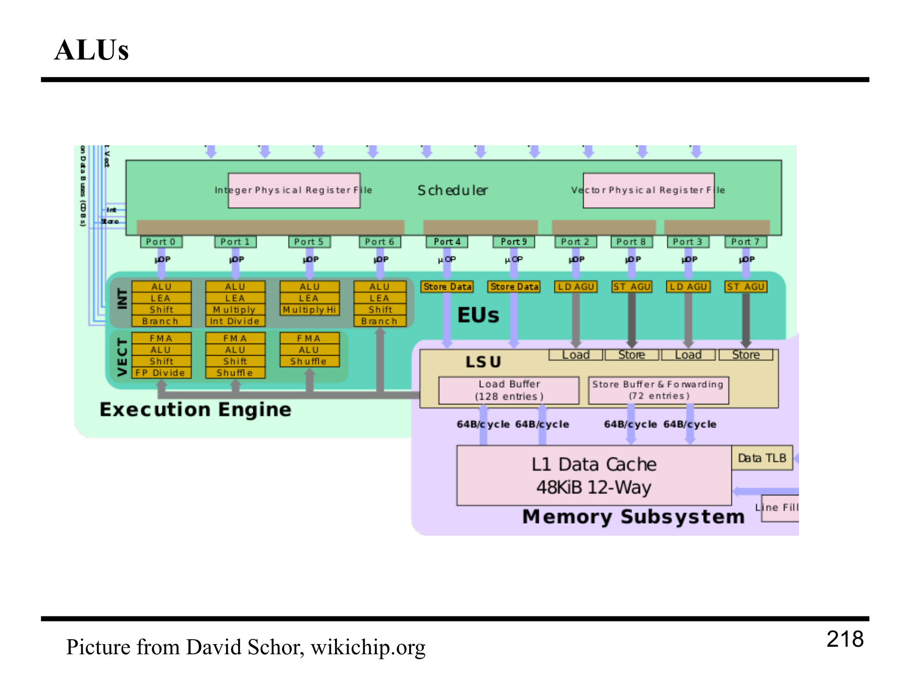

这张图展示了 **执行单元（Execution Engine, EU）** 和 **算术逻辑单元（ALU）** 的结构和作用，详细描述了现代 **CPU架构** 中如何执行各种类型的计算任务。图中的内容包括不同类型的指令、操作以及它们是如何通过多个硬件组件来高效处理的。

### 主要组件分析：

#### 1. **执行单元（Execution Engine, EU）**

* **ALU（算术逻辑单元）**：负责整数和浮点数的各种算术和逻辑运算。图中可以看到多个 ALU 部件，专门用于不同的操作，例如：

* **LEA**（Load Effective Address）：用于计算地址。
* **Shift**：用于位移操作。
* **Multiply** 和 **Multiply High**：用于乘法操作。
* **Int Divide** 和 **FP Divide**：分别用于整数和浮点数的除法操作。
* **FMA（Fused Multiply-Add）**：同时进行乘法和加法操作，常用于高性能计算。
* **Shuffle**：用于重排数据。

#### 2. **向量物理寄存器文件（Vector Physical Register File）**

* 这些寄存器用于存储向量数据，在并行计算中，处理器能够同时操作多个数据元素，这对于处理大型数据集（例如图像处理、科学计算等）非常重要。

#### 3. **调度器（Scheduler）**

* 负责调度微操作，确保指令按适当的顺序执行。调度器在多个端口上分配指令到不同的执行单元，确保每个指令可以高效执行。
* 图中列出了多个端口（Port 0 到 Port 9），每个端口处理不同的微操作（µOPs）。

#### 4. **加载和存储单元（LSU, Load Store Unit）**

* **Load Buffer**（加载缓冲区）和 **Store Buffer**（存储缓冲区）用于管理数据的加载和存储操作。图中的 **Load** 和 **Store** 表示数据的读取和写入过程。
* **AGU**（地址生成单元）是负责生成内存地址的模块，在执行数据加载和存储时起到关键作用。

#### 5. **L1 数据缓存（L1 Data Cache）**

* **L1 缓存**（48KB, 12-way set-associative）：缓存数据，以减少访问主内存的延迟。L1 数据缓存是最接近处理器的缓存，速度最快，存储最常用的数据。
* 图中的 **Data TLB** 表示 **数据转换后备缓冲区**，用于加速虚拟地址到物理地址的转换。

#### 6. **内存子系统（Memory Subsystem）**

* 负责处理与主内存的交互。图中的 **Line Fill** 表示缓存行填充，帮助提升缓存的命中率，减少内存访问的延迟。

### 总结：

这张图展示了现代处理器中 **执行单元（EU）** 的复杂结构，包括多个 **ALU**，向量处理能力，负载/存储操作单元，以及与内存的高效交互。通过这些硬件组件的协作，CPU能够并行处理多项任务，显著提升性能，特别是在执行大量数据并行计算任务时。

---

## 第 9 页

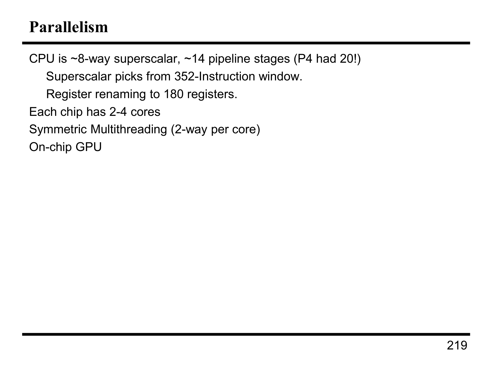

这张图描述的是处理器的 **并行性** 特性，主要聚焦于 CPU 的硬件架构以及如何通过多核设计和不同的并行技术提升性能。

### 主要内容解释：

#### 1. **CPU的超标量特性 (Superscalar)**

* 该 CPU 是 **8-way superscalar**，即它每个时钟周期可以执行多达 8 条指令。这意味着它能够同时并行执行多个操作，提高处理效率。
* **14个流水线阶段**：这比之前的 **P4** （Pentium 4）要少，P4 有 20 个流水线阶段。流水线阶段越少，意味着每条指令经过的处理步骤越少，能提高执行效率，但也可能增加流水线冲突的可能性。

#### 2. **指令窗口和寄存器重命名 (Instruction Window & Register Renaming)**

* **超标量架构选择来自352指令窗口的指令**：这意味着处理器会从一个可以存储多达352条指令的指令窗口中选择指令来执行，这种大窗口有助于提高指令选择和调度的灵活性。
* **寄存器重命名到180个寄存器**：寄存器重命名是为了避免指令之间的数据依赖关系。通过为每个操作分配不同的物理寄存器，减少了数据冲突和提高了并行处理能力。

#### 3. **每个芯片的核心数量 (Cores per Chip)**

* 每个芯片上有 **2-4 个核心**，每个核心能够独立执行任务，支持并行计算，从而提升了整体处理能力。

#### 4. **对称多线程 (Symmetric Multithreading, SMT)**

* **每个核心支持 2-way 线程**：即每个物理核心支持两个逻辑线程（超线程技术），使得每个核心在处理一个线程的同时，能够处理另一个线程的任务，从而提高了资源利用率。

#### 5. **芯片上的 GPU (On-chip GPU)**

* 该芯片还包括一个 **芯片上的 GPU**，用于加速图形处理任务和计算密集型任务（如并行处理任务）。集成GPU允许处理器同时执行计算任务和图形渲染任务，提高了整体性能，尤其是在图形密集型应用中。

### 总结：

此图详细介绍了一个现代 **超标量 CPU** 的硬件架构，其中强调了并行执行的能力：通过多核设计、超线程技术、寄存器重命名和大指令窗口来提高处理器的吞吐量，并通过集成GPU来增强图形处理能力。这些特性使得现代 CPU 能够高效执行多任务并适应现代计算需求。

---

## 第 10 页

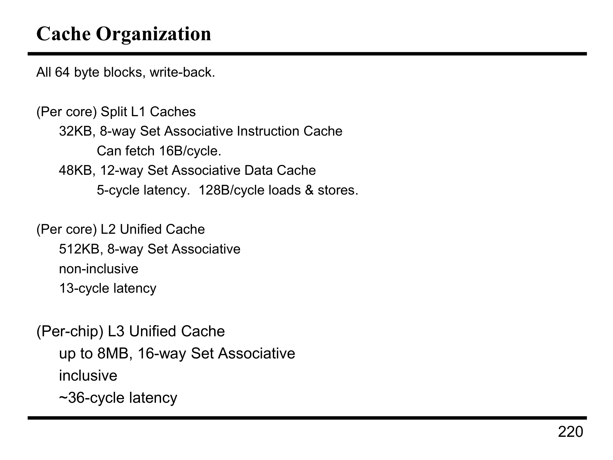

这张图详细描述了处理器 **缓存组织** 的架构，解释了 **每个核心** 和 **每个芯片** 上的不同层级缓存（L1、L2 和 L3）的配置、大小、延迟等关键参数。

### 详细解释：

#### 1. **每个核心的 L1 缓存**

* **L1 指令缓存 (32KB, 8-way Set Associative)**：

* **32KB 大小**，指令缓存分为 8 路集合相联（8-way set associative）方式，意味着该缓存可以并行存储8个不同的集合。
* **16B/cycle 拉取速率**，即每个时钟周期可以从缓存中获取 16 字节的数据。
* 这个缓存用于存储指令，允许快速获取正在执行的指令。

* **L1 数据缓存 (48KB, 12-way Set Associative)**：

* **48KB 大小**，数据缓存使用 12 路集合相联，意味着可以支持更多的数据块并行存储。
* **5-cycle 延迟**，表示从数据缓存读取数据时，通常需要 5 个时钟周期的延迟。
* **128B/cycle 加载和存储速率**，意味着每个时钟周期可以进行128字节的数据加载和存储操作。
* 这个缓存用于存储数据，减少处理器访问内存时的延迟。

#### 2. **每个核心的 L2 统一缓存**

* **L2 缓存 (512KB, 8-way Set Associative)**：

* **512KB 大小**，L2 缓存使用 8 路集合相联，较 L1 缓存的存储容量更大。
* **非包含性 (non-inclusive)**，意味着 L2 缓存不包含 L1 缓存的所有数据。即，L2 缓存中的数据可能是 L1 中没有的，L1 缓存不会确保所有数据都存在于 L2 中。
* **13-cycle 延迟**，读取 L2 缓存的延迟为 13 个时钟周期。

#### 3. **每个芯片的 L3 统一缓存**

* **L3 缓存 (最大 8MB, 16-way Set Associative)**：

* **最大 8MB 大小**，L3 缓存是一个更大的缓存，通常用于多个核心共享，目的是减少访问主内存的延迟。
* **16 路集合相联 (16-way set associative)**，支持更大的并行度。
* **包含性 (inclusive)**，意味着 L3 缓存包括了 L1 和 L2 中的数据。L3 缓存的数据必须包含 L1 和 L2 中的数据副本。
* **约 36-cycle 延迟**，L3 缓存的读取延迟比 L2 更高，为约 36 个时钟周期。

### 总结：

此缓存体系结构的设计目的是通过分层的缓存来降低访问内存的延迟，并且通过增加缓存的大小和并行度（通过集合相联方式）来提高数据存取效率。L1 缓存是最快的，但容量较小，主要用于存储指令和数据；L2 缓存则在容量和访问速度之间找到平衡；L3 缓存则提供更大的存储容量，帮助减少从内存获取数据的频率，并为多个核心共享。

---

## 第 11 页

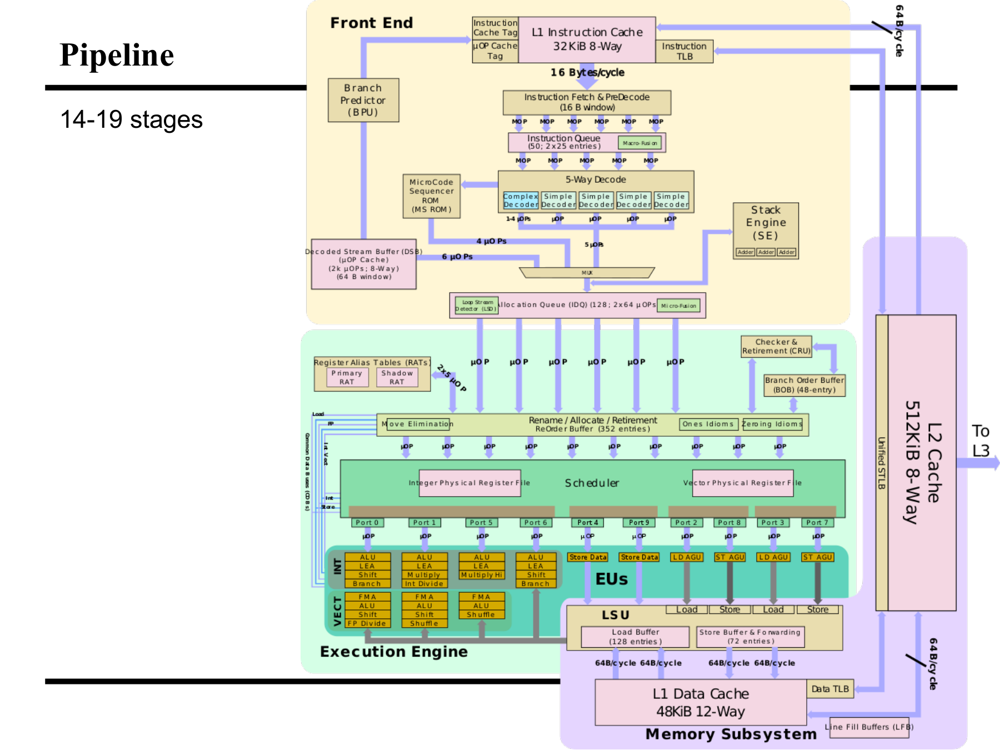

这张图详细描述了 **处理器流水线架构**，展示了多个组件如何在流水线阶段协同工作以执行指令。该架构包括 **前端、执行引擎、内存子系统** 和 **多个缓存**。以下是对该图的详细解释：

### 1. **流水线的结构 (Pipeline)**

该处理器的流水线共有 **14到19个阶段**。流水线的主要目的是提高指令执行的并行性和效率，允许多个指令在不同的阶段同时执行。

#### 主要阶段：

* **指令获取 (Instruction Fetch) 和 解码 (Decode)**：指令从 **L1 指令缓存** 中获取，并经过预解码阶段。此过程每周期能拉取 **16字节** 的指令数据。
* **分支预测 (Branch Prediction)**：预测下一条将要执行的指令，以减少分支指令带来的延迟。
* **微指令解码 (Micro-ops Decode)**：指令被解码成多个微操作（Micro-ops），这些微操作会被进一步处理。

### 2. **前端 (Front End)**

前端负责指令的获取、解码和排队。主要组件包括：

* **L1 指令缓存**（32KB, 8-way set associative）：缓存指令数据，以减少访问主内存的延迟。
* **指令队列 (Instruction Queue)**：指令被存储并准备进入后续的流水线阶段。
* **微代码序列器 (MicroCode Sequencer)**：负责执行微指令，将高层次的指令转换为低层次的操作。

#### **解码与调度**

* **5路解码 (5-way Decode)**：指令会被并行解码为不同的微操作。
* **调度器 (Scheduler)**：决定指令的执行顺序，协调各个执行单元之间的工作。

### 3. **执行引擎 (Execution Engine)**

执行引擎负责实际的指令执行，主要通过 **算术逻辑单元 (ALU)** 和 **浮点单元 (FMA)** 来完成各种计算。引擎分为以下几个部分：

* **整数处理 (INT)**：用于处理整数运算、分支操作等。
* **向量处理 (VECT)**：执行向量计算和数据处理，支持并行计算。
* **执行单元 (EUs)**：有多个执行单元（如 ALU、AGU），用于不同的操作（如加法、乘法、存储等）。

### 4. **内存子系统 (Memory Subsystem)**

内存子系统负责数据的加载与存储，涉及多个缓存：

* **L1 数据缓存 (L1 Data Cache)**：48KB，12-way set associative，存储数据，处理存储和加载操作。
* **L2 缓存 (L2 Cache)**：512KB，8-way set associative，主要存储数据和指令，为处理器提供快速访问。
* **L3 缓存 (L3 Cache)**：较大的缓存，通常为多个核心共享，能够进一步减少内存访问的延迟。

### 5. **其他功能**

* **分支顺序缓冲区 (Branch Order Buffer, BOB)**：用于管理分支指令的执行顺序。
* **检查与退休 (Checker & Retirement)**：确保指令执行的正确性并最终将其从流水线中退役。
* **加载/存储单元 (Load/Store Units, LSU)**：负责处理数据的加载和存储操作。

### 6. **总结**

这个架构展示了一个现代处理器流水线的详细工作原理，如何通过多级缓存、分支预测、指令调度和高效的执行引擎来实现高性能。每个核心拥有其独立的缓存和执行单元，同时多个核心共享 L3 缓存，提供了更大的并行性和处理能力。

---

## 第 12 页

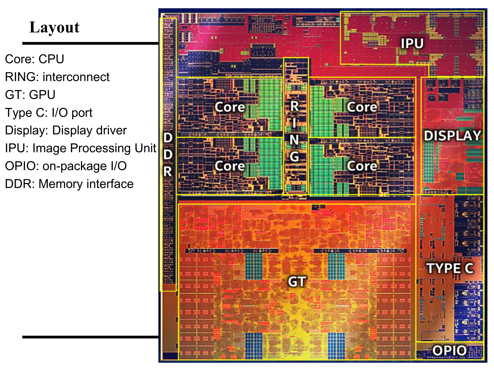

这张图展示了 **处理器芯片布局** 的详细结构，并标出了芯片内各个部分的功能区域。以下是该布局的详细解释：

### 1. **核心部分 (Core)**

* **Core**：表示处理器的 **CPU 核心**。这些是进行计算和执行指令的主要部分。图中的每个 "Core" 区域代表处理器的一个核心，多个核心并行工作以提高计算性能。

### 2. **环路 (RING)**

* **RING**：指 **内存或数据总线**，它负责连接处理器的各个部分（如各个核心、内存、I/O端口等）。RING可以有效地传输数据，提高不同部分之间的通信速度。

### 3. **图形处理单元 (GT)**

* **GT**：代表 **GPU (Graphics Processing Unit)**，即图形处理单元。GPU负责图像和视频渲染工作。它通常用于并行处理大量数据，尤其是图形和视觉计算。

### 4. **Type C I/O端口 (Type C I/O Port)**

* **Type C**：指代 **USB Type-C 接口**，这是一种常见的高速数据传输和电源接口。在芯片布局中，它指示了连接外部设备的端口。

### 5. **显示驱动器 (Display Driver)**

* **Display**：指示了处理器中的 **显示驱动单元**。该部分负责将图形数据从 GPU 传输到显示设备，如显示屏。

### 6. **图像处理单元 (IPU)**

* **IPU (Image Processing Unit)**：这部分处理与 **图像处理** 相关的任务，如图像增强、过滤和转换。它是专门设计来加速图像处理任务的硬件单元。

### 7. **片上I/O (OPIO)**

* **OPIO (On-package I/O)**：指的是 **片上 I/O 接口**，这允许芯片内部或芯片之间的高速数据交换。它可以加速系统的整体数据处理和传输。

### 8. **内存接口 (DDR)**

* **DDR (Double Data Rate)**：指的是 **内存接口**，即用于连接内存的部分。此接口支持高带宽的数据传输，以支持高速数据读取和写入。

### **总体结构**

整个芯片布局展示了如何将多个组件集成到一个处理器中，支持并行计算、图形处理、图像处理和高速外部数据连接。图中显示了多个 **CPU 核心**（Core）和 **GPU**（GT），并通过高效的 **RING 总线** 连接，提供了良好的数据流动性和处理能力。此外，还整合了显示驱动、图像处理单元（IPU）、USB Type-C 接口、内存接口（DDR）等功能，满足了现代处理器对图形和计算需求的多重要求。

这种设计能支持高效的多任务处理和高带宽数据传输，为现代设备提供强大的计算和图形性能。

---

## 第 13 页

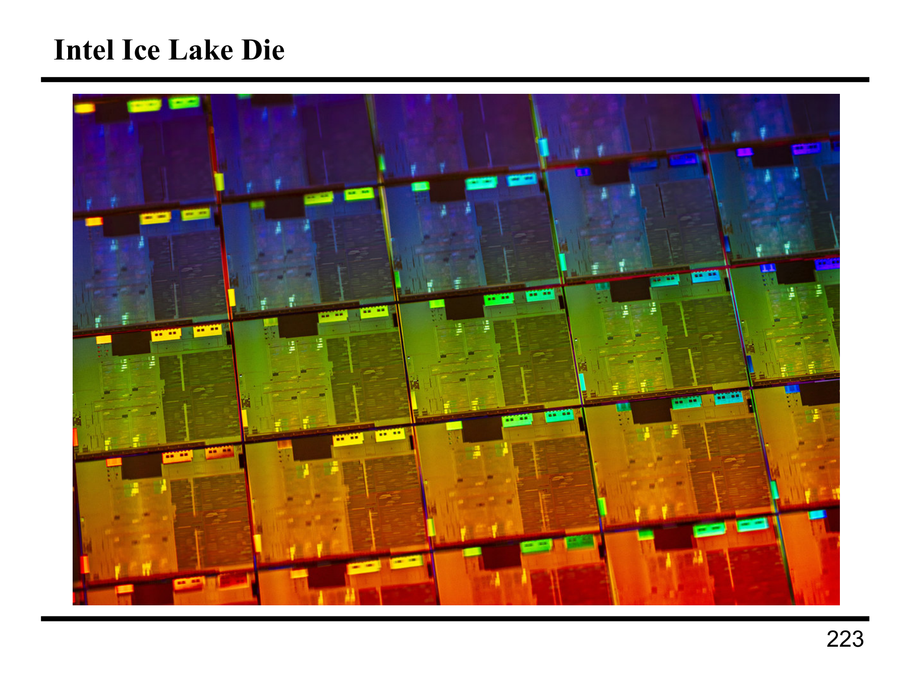

这张图片展示了 **Intel Ice Lake Die** 的显微照片。下面是该图片的详细解释：

### 1. **芯片的微观结构**

* **Intel Ice Lake Die**：这张图片展示了英特尔的 **Ice Lake 微处理器** 的硅片（die）。这是芯片的核心部分，在生产过程中，多个芯片被切割成单独的小块，每块芯片都包含完整的处理器结构。这张照片显示的是这些芯片的内部结构，可以看到不同的区域有着不同的色彩和纹理，这代表了芯片上不同的电路区域。

### 2. **彩色反射**

* 图中的色彩变化代表了不同的 **反射光谱**，这与芯片表面的金属层和电路的微观结构有关。不同的区域可能对应着不同的材料层，如导电层、隔离层等。不同的材料和结构反射光的方式不同，产生了丰富的色彩。这种光谱反射通常用于芯片的质量检测，能帮助工程师识别任何制造缺陷。

### 3. **芯片布局**

* 从布局上看，图中显示了 **多个芯片单元**，每个单元都包含类似的电路图案。这些芯片单元是在生产过程中切割出的，这个布局是典型的 **芯片生产过程中切割的硅片**（硅片上的每个小部分都可能是一个最终的处理器单元）。

### 4. **制造工艺**

* 这种图像通常是利用 **电子显微镜** 或 **光学显微镜** 技术拍摄的，能够放大到微米或纳米级别，以查看芯片内部的精细结构。这张图片展示了英特尔 **Ice Lake 微架构** 处理器的生产过程。这一微架构代表了英特尔的第十代酷睿处理器，使用了 **10纳米工艺** 技术，提供更高的性能和更低的功耗。

### 5. **色彩与层次**

* 在这种显微图像中，色彩的层次和强度通常与 **不同的金属、氧化物或半导体材料** 的厚度和光反射率相关。例如，较亮的区域可能代表较厚的金属层，或者较为集中的电路区域，反之，较暗的区域可能代表空白区域或较薄的电路层。

### 总结

此图展示了 **Intel Ice Lake** 处理器芯片的微观视图，通过不同的色彩反射，展示了芯片的精细结构和制造工艺。这种显微照片帮助工程师检查芯片的质量，确保没有缺陷或不一致的区域。
