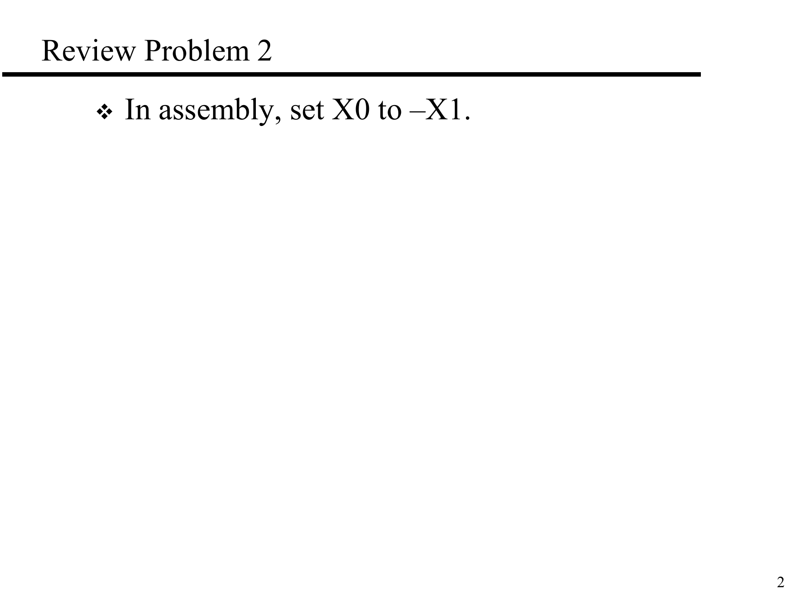
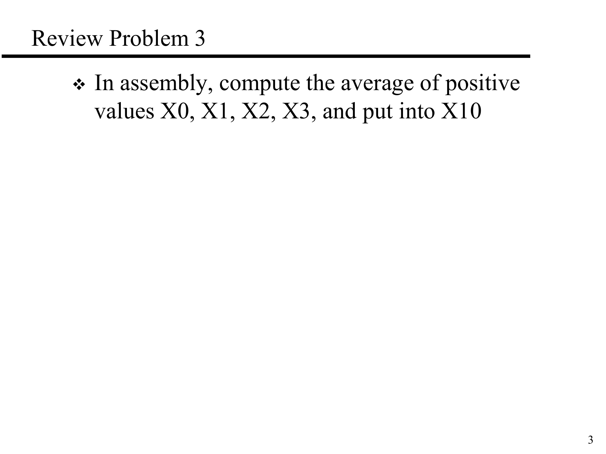
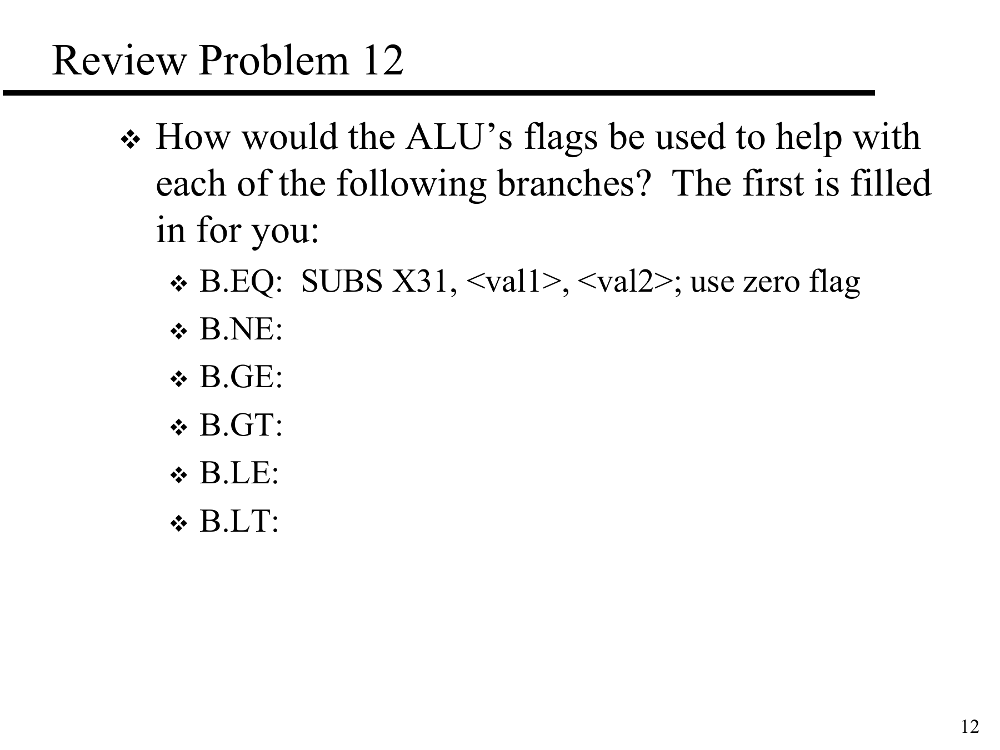
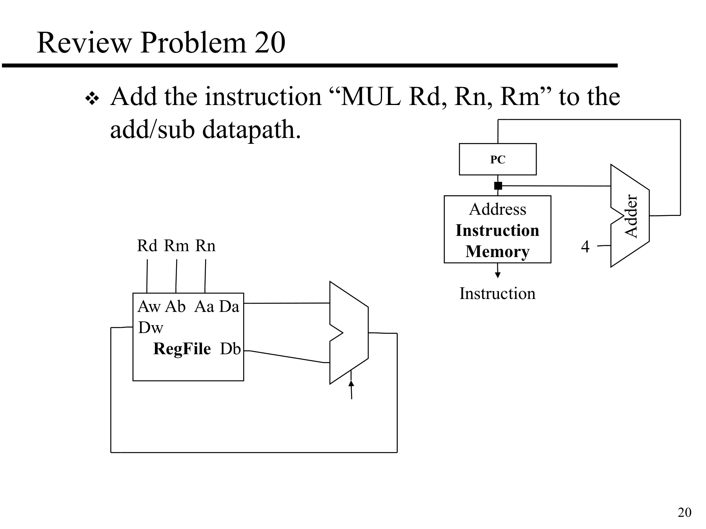
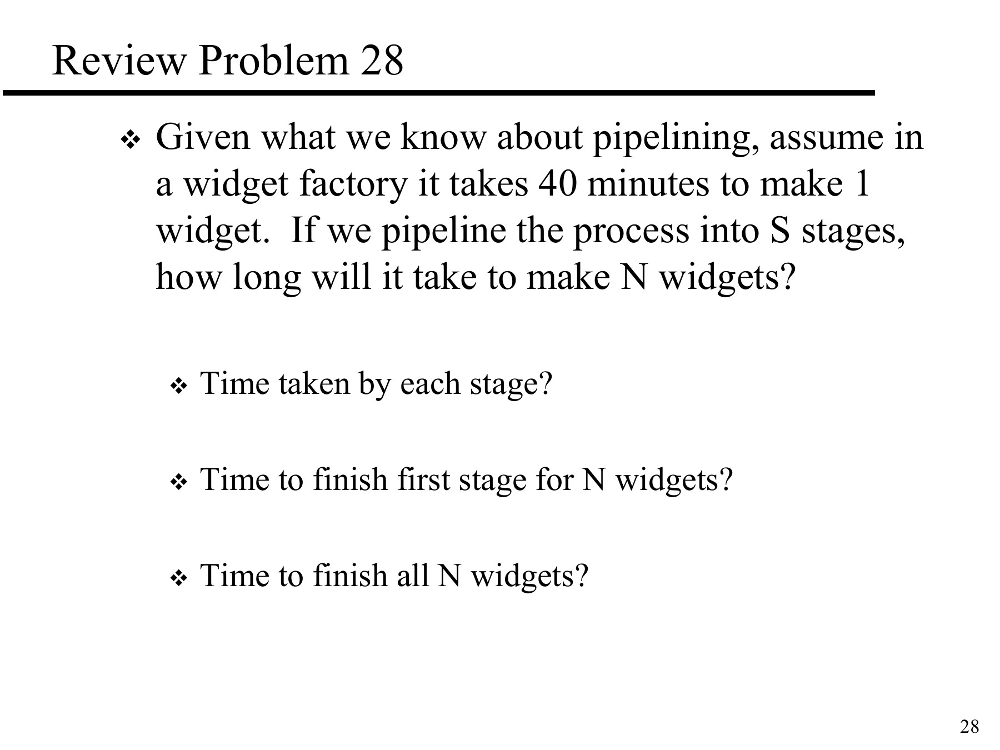

---

## 第 1 页


这张图片似乎来自一门课程（**ECE/CSE469**），并展示了 **复习问题0**。问题内容是关于购买电脑时应考虑的重要因素。详细解释如下：

### 1. **问题背景**

* **课程名称**：**ECE/CSE469**，可能是一门关于计算机体系结构或硬件相关的课程。
* **复习问题0**：这是课堂上作为思考题或课堂讨论问题的一部分，旨在让学生思考计算机购买时需要关注的核心特点。

### 2. **问题描述**

* **问题内容**：学生被要求在等待课程开始时，回答这个问题：

* **问题**：“What is important in a computer? What features do you look for when buying one?”
* **翻译**：“一台计算机中什么是最重要的？你购买计算机时看重哪些特性？”

### 3. **问题的目的**

* 这个问题的目的是让学生在实际的计算机购买决策中思考哪些硬件和性能特征对于他们最为重要。回答这个问题可能涉及多个层面的考虑，比如计算机的处理能力、内存、存储、显示效果、设计等。

### 4. **讨论的方面**

* 在购买计算机时，一些常见的考虑因素包括：

* **处理器（CPU）**：计算机的性能大部分依赖于处理器的性能。比如核心数、时钟频率、缓存大小等。
* **内存（RAM）**：内存越大，计算机能同时运行更多的应用程序和处理更大的数据集。
* **存储（硬盘或固态硬盘 SSD）**：SSD比传统的机械硬盘（HDD）更快，可以显著提高启动速度和数据存取速度。
* **显示器**：分辨率、刷新率和色彩准确性等，尤其对设计师和游戏玩家尤为重要。
* **显卡（GPU）**：对于图形密集型的应用（如游戏、视频编辑等），显卡的性能尤为关键。
* **电池续航**：对于笔记本电脑而言，电池续航时间是一个重要的购买指标。
* **散热性能**：高效的散热系统可以确保计算机在负荷较大的情况下也能保持较低的温度，避免过热。
* **价格**：性价比通常是很多消费者购买计算机时的重要决策因素。

### 5. **总结**

* 总的来说，这个问题是让学生从计算机硬件和性能的角度思考在购买计算机时最需要考虑的因素，同时它也帮助学生理清不同特性如何影响计算机的总体表现。


---

## 第 2 页


这张图片是来自一门课程的 **复习问题1**。问题内容涉及计算机编程语言中的指令类型。详细解释如下：

### 1. **问题背景**

* **课程名称**：这张图片是**复习问题1**，可能是某门计算机相关课程的一部分，通常这种问题会帮助学生回顾和理解编程语言中指令的基本类型。

### 2. **问题描述**

* **问题内容**：

* **英文**：Programming languages have many instructions, but they fall under a few basic types. One is arithmetic (+, -, \*, /, etc). What are the others?
* **翻译**：编程语言有很多指令，但它们可以归纳为几种基本类型。一个是算术运算（如 +, -, \*, / 等）。其他的是什么？

### 3. **问题的目的**

* 这个问题的目的是让学生回顾编程语言中常见的指令类型，并要求他们思考除了算术指令之外，还有哪些基本的指令类型。

### 4. **常见的编程语言指令类型**

在编程语言中，除了算术指令（加、减、乘、除等）外，常见的其他基本指令类型有：

* **逻辑运算指令**：

* 比如与（AND）、或（OR）、非（NOT）、异或（XOR）等。这些指令用于布尔类型的数据操作。
* **比较运算指令**：

* 如等于（==）、大于（>）、小于（<）、大于等于（>=）、小于等于（<=）、不等于（!=）等。用于比较两个操作数，常用于条件判断。
* **数据传输指令**：

* 例如赋值（=）、移动（MOVE）。这些指令用于在内存或寄存器之间传输数据。
* **控制流指令**：

* 例如跳转（JUMP）、条件跳转（IF）、循环（FOR、WHILE）等。这些指令用于改变程序的执行顺序，控制程序的流程。
* **位操作指令**：

* 如位移（SHIFT）、按位与、按位或等。这些指令主要用于操作二进制位，适用于处理低层次的二进制数据。
* **输入输出（I/O）指令**：

* 用于与外部设备进行交互，比如从用户输入获取数据或将数据输出到显示器或文件等。

### 5. **总结**

* 这个问题要求学生回顾和列举除了算术运算之外，编程语言中常见的其他指令类型。回答这个问题能够帮助学生理解编程语言中的指令类别，并加深对不同指令的用途和应用场景的理解。


---

## 第 3 页



这张图片是一个问题，出现在 **ECE/CSE469** 这门课程的复习内容中，问题的内容涉及计算机编程语言中的指令类型。具体问题是：

### **问题描述：**

* **英文**：Programming languages have many instructions, but they fall under a few basic types. One is arithmetic (+, -, \*, /, etc). What are the others?
* **中文翻译**：编程语言有许多指令，但这些指令可以分为几种基本类型。一种是算术运算（例如 +、-、\*、/ 等）。其他的是什么？

### **背景解释：**

编程语言通常包含多种指令（或操作），这些指令用于控制计算机的行为，执行不同的操作。算术运算指令，如加法、减法、乘法和除法，是最常见的一类。但是，除了这些算术运算指令之外，编程语言还包括许多其他类型的指令。

### **常见的指令类型：**

在编程语言中，除了算术运算指令之外，还有以下几种常见的基本指令类型：

1. **逻辑运算指令：**

* 这类指令用于布尔逻辑运算，处理布尔值（真/假）。
* 常见的有：

* **AND**（与运算）：如果两个操作数都为真，结果为真。
* **OR**（或运算）：如果至少一个操作数为真，结果为真。
* **NOT**（非运算）：反转布尔值。
* **XOR**（异或运算）：如果两个操作数不同，结果为真。

2. **比较运算指令：**

* 用于比较两个值，通常用于条件判断。
* 常见的有：

* **==**（等于）：检查两个值是否相等。
* **!=**（不等于）：检查两个值是否不相等。
* **>**（大于）：检查左边值是否大于右边值。
* **<**（小于）：检查左边值是否小于右边值。
* **>=**（大于等于）和 **<=**（小于等于）。

3. **赋值与数据传输指令：**

* 用于将数据从一个位置传送到另一个位置，通常是变量、寄存器或内存地址之间的数据传输。
* 比如：

* **MOV**（移动）：将数据从一个寄存器或内存位置复制到另一个寄存器或内存位置。
* **ASSIGN**（赋值）：将一个值赋给一个变量。

4. **控制流指令：**

* 用于控制程序执行的顺序，比如跳转、循环、条件判断等。
* 常见的有：

* **JUMP**（跳转）：无条件跳转到程序的另一部分。
* **IF**、**ELSE**：条件判断，根据条件执行不同的代码块。
* **FOR**、**WHILE**：循环结构，用于重复执行代码。

5. **位操作指令：**

* 用于对二进制数据进行操作，如移位和按位与或运算。
* 常见的有：

* **SHIFT**（移位）：将一个值的二进制位向左或向右移动。
* **AND**、**OR**、**XOR**（位与、位或、位异或）等。

6. **输入/输出（I/O）指令：**

* 用于与外部设备（如键盘、显示器、文件系统）进行数据交换。
* 比如：

* **READ**、**WRITE**：读取或写入数据。
* **PRINT**：输出数据到屏幕或文件。

### **总结：**

这道题的目的是让你思考并列出编程语言中除了算术运算之外的其他基本指令类型。它帮助你理解编程语言的不同操作类别，以及这些操作如何协作来完成计算机程序的功能。


---

## 第 4 页



这道问题要求在汇编语言中计算X0, X1, X2 和 X3 中正值的平均数，并将结果存入寄存器X10。

### **问题解释：**

* **背景**：我们有四个寄存器X0、X1、X2 和 X3，它们可能包含正值或负值。任务是从这四个寄存器中找到所有正值，计算它们的平均数，并将结果存储到寄存器X10中。

### **关键步骤：**

1. **检查每个寄存器的值是否为正数**：汇编语言中的指令需要对每个寄存器的值进行检查，并筛选出其中的正值。
2. **将正值相加**：我们需要将所有正值加起来。
3. **计算平均数**：然后，将所有正值的和除以正值的个数，以获得平均值。
4. **存入X10寄存器**：最后，将计算得到的平均值存储到X10寄存器中。

### **汇编代码示例：**

假设我们使用ARM架构的汇编指令，以下是一个可能的解决方案：

```asm
MOV     X4, #0          // X4 stores the sum of positive values
MOV     X5, #0          // X5 stores the count of positive values

CMP     X0, #0          // Compare X0 with 0
BLE     SkipX0          // If X0 <= 0, skip adding to sum
ADD     X4, X4, X0      // Add X0 to sum
ADD     X5, X5, #1      // Increment count

SkipX0:
CMP     X1, #0          // Compare X1 with 0
BLE     SkipX1          // If X1 <= 0, skip adding to sum
ADD     X4, X4, X1      // Add X1 to sum
ADD     X5, X5, #1      // Increment count

SkipX1:
CMP     X2, #0          // Compare X2 with 0
BLE     SkipX2          // If X2 <= 0, skip adding to sum
ADD     X4, X4, X2      // Add X2 to sum
ADD     X5, X5, #1      // Increment count

SkipX2:
CMP     X3, #0          // Compare X3 with 0
BLE     SkipX3          // If X3 <= 0, skip adding to sum
ADD     X4, X4, X3      // Add X3 to sum
ADD     X5, X5, #1      // Increment count

SkipX3:
CMP     X5, #0          // If count (X5) is zero, prevent division by zero
BEQ     End             // If no positive values, skip division

SDIV    X10, X4, X5     // Divide sum (X4) by count (X5) to get average in X10
B       End

End:
// X10 now contains the average of positive values
```

### **解释：**

1. **初始化**：首先，我们初始化了寄存器X4和X5，用来存储正值的总和和正值的个数。

* `MOV X4, #0`：设置X4为0，表示总和初始化为0。
* `MOV X5, #0`：设置X5为0，表示正值的个数初始化为0。

2. **检查并计算**：我们使用`CMP`指令来检查每个寄存器的值是否大于0。如果是正值，就将该值加入总和（X4），并将正值个数（X5）加1。

* `CMP X0, #0`：比较X0的值与0，`BLE`指令会跳过不大于0的值的计算。

3. **计算平均数**：最后，使用`SDIV`指令将正值的总和除以正值的个数，计算出平均数并将其存储到X10寄存器。

* `SDIV X10, X4, X5`：计算X4除以X5的结果，存储到X10。

4. **处理空值情况**：如果所有寄存器的值都不为正数，X5的值会保持为0，因此在进行除法之前，我们用`CMP X5, #0`检查X5是否为0，如果是0，跳过除法，避免除以0的错误。

### **总结**：

* 通过这段代码，我们能够提取四个寄存器中正值的平均数，并将结果存储在X10寄存器中。这种问题考察了如何在汇编中处理条件判断、算术运算以及避免除零错误。


---

## 第 5 页


这道问题要求你分析给定C++代码在内存中的结果，并假设从内存地址`0x1000`开始分配内存。代码使用了一个`struct`定义和指针操作，涉及动态内存分配和赋值操作。下面是详细的解释。

### **代码分析：**

```cpp
struct foo {
char *a, *b;
};

foo *obj;
obj = new foo;
obj->a = new char[8];
obj->b = new char[4];
obj->a[1] = 'x';
obj->b[2] = 'y';
```

### **1. 结构体 `foo` 的定义**

`struct foo` 定义了一个包含两个指针成员的结构体：

* `char *a`：指向一个字符数组。
* `char *b`：指向另一个字符数组。

### **2. 内存分配**

* `foo *obj;`：声明一个指向`foo`结构体的指针`obj`。

* `obj = new foo;`：为`obj`指针分配了一个`foo`类型的内存块，这个结构体包含两个指针成员`a`和`b`，但它们还没有指向实际的内存。

* `obj->a = new char[8];`：为`obj`的成员`a`分配了一个大小为8个字符的数组（即8个字节）。

* `obj->b = new char[4];`：为`obj`的成员`b`分配了一个大小为4个字符的数组（即4个字节）。

### **3. 数据赋值**

* `obj->a[1] = 'x';`：将字符`'x'`存储在`obj->a`数组的第二个位置（`a[1]`）。
* `obj->b[2] = 'y';`：将字符`'y'`存储在`obj->b`数组的第三个位置（`b[2]`）。

### **4. 内存布局**

假设内存从`0x1000`开始分配：

* `obj`对象本身会占用`sizeof(foo)`字节内存。`foo`包含两个指针（`a`和`b`），每个指针占用8字节（假设是64位系统）。因此，`foo`结构体本身会占用16字节。

* `new foo`会分配一个16字节的内存空间，`obj`指向这块内存。

* `obj->a = new char[8];`会为`a`分配一个8字节的字符数组，`a`会指向这块内存。

* `obj->b = new char[4];`会为`b`分配一个4字节的字符数组，`b`会指向这块内存。

* 最后，我们在`a[1]`和`b[2]`的位置上分别存储了字符`'x'`和`'y'`。

### **内存表示：**

```
内存地址  |  内容
--------------------------------------
0x1000    |  obj (foo*) ->指向下一块内存
0x1008    |  a (char*) ->指向 8字节内存
0x1010    |  b (char*) ->指向 4字节内存
--------------------------------------
0x1018    |  (obj->a) 'x' 在a[1]位置
0x1019    |  (obj->b) 'y' 在b[2]位置
```

### **总结：**

1. **`obj`** 存储在`0x1000`处，指向一个`foo`类型的内存块。
2. **`a`** 和 **`b`** 存储在 `0x1008` 和 `0x1010`，分别指向为 `a` 和 `b` 分配的动态内存。
3. 对`a[1]` 和 `b[2]`的赋值会在相应内存位置存储字符`'x'`和`'y'`。


---

## 第 6 页


问题要求用汇编语言将寄存器 X0 的值替换为它的绝对值。

### 解释：

目标是将 X0 寄存器中存储的数值变为它的**绝对值**。绝对值是指去掉负号的数值，对于正数或者零没有影响，对于负数则是变为正数。

### 汇编代码示例：

1. **基本方法：使用条件跳转**

```asm
cmp     x0, #0        // 比较 x0 和 0
bge     1f            // 如果 x0 >= 0，则跳过 neg 操作
neg     x0, x0        // 如果 x0 < 0，则取其相反数
1:
```

**解释：**

* `cmp x0, #0` 比较 `x0` 的值和 `0`，并设置条件标志。
* `bge 1f` 表示如果 `x0 >= 0`（即大于或等于零），则跳过后面的 `neg` 指令，直接跳到标签 1。
* `neg x0, x0` 用来将负数转为正数，即取相反数。

2. **更简洁的方式：条件执行（无分支）**
如果架构支持条件执行（例如 ARMv8 的 `cneg` 指令），可以不使用跳转指令来实现：

```asm
cneg    x0, x0, lt    // 如果 x0 < 0，则将 x0 取相反数
```

**解释：**

* `cneg x0, x0, lt` 是条件执行指令，`lt` 表示如果 `x0 < 0`（负数），则执行取相反数操作。

3. **位操作法（无分支）**
一种更低级的做法是使用位操作：

```asm
asr     x1, x0, #63   // x1 = 0 if x0 >= 0, x1 = -1 if x0 < 0
eor     x0, x0, x1    // 如果 x0 < 0，反转 x0 中的每一位
sub     x0, x0, x1    // 负数时，加上 1，得到绝对值
```

**解释：**

* `asr x1, x0, #63` 通过算术右移，将 x0 的符号位移到低位，得到 0 或 -1。
* `eor x0, x0, x1` 用于反转 `x0` 中的位，负数变成正数，正数保持不变。
* `sub x0, x0, x1` 如果 `x1` 为 -1（即 `x0` 是负数），则加 1，得到绝对值；如果 `x1` 为 0（即 `x0` 是正数），则不变。

### 总结：

你可以选择使用 **分支指令**（如 `cmp` 和 `bge`）、**条件执行指令**（如 `cneg`），或者更低级的 **位操作** 来实现对 X0 的绝对值替换。


---

## 第 7 页


### 问题分析：

问题要求检查一个包含三个整数的数组，并判断该数组是否已按升序排列（从最小到最大）。如果数组已排序，寄存器 `X15` 被设置为 1；否则设置为 0。寄存器 `X0` 存储该数组的地址。

### 任务：

* 你需要在汇编中编写代码，通过访问寄存器 `X0` 中存储的地址来检查这三个整数的顺序。
* 如果数组按升序排序（即 `arr[0] <= arr[1] <= arr[2]`），则设置 `X15 = 1`，否则设置为 `X15 = 0`。

### 解决方案：

1. **加载数组元素：**
由于寄存器 `X0` 存储的是数组的地址，我们首先需要加载数组中的三个元素。

2. **比较顺序：**
检查数组中是否满足条件：`arr[0] <= arr[1] <= arr[2]`。

3. **根据比较结果设置 `X15`：**
如果数组是排序的，则将 `X15` 设置为 1，否则设置为 0。

### 汇编代码示例：

```asm
// 加载数组中的三个整数到寄存器
ldr     w1, [x0]        // w1 = arr[0]
ldr     w2, [x0, #4]    // w2 = arr[1]
ldr     w3, [x0, #8]    // w3 = arr[2]

// 比较 arr[0] <= arr[1]
cmp     w1, w2
bgt     not_sorted      // 如果 arr[0] > arr[1]，跳转到 not_sorted

// 比较 arr[1] <= arr[2]
cmp     w2, w3
bgt     not_sorted      // 如果 arr[1] > arr[2]，跳转到 not_sorted

// 如果数组是排序的，设置 X15 = 1
mov     x15, #1
b       done

not_sorted:
// 如果数组没有排序，设置 X15 = 0
mov     x15, #0

done:
// 结束
```

### 解释：

* **加载数据**：通过 `ldr` 指令从数组地址 (`X0`) 中加载数据到寄存器 `W1`, `W2`, 和 `W3`，分别对应 `arr[0]`, `arr[1]` 和 `arr[2]`。
* **比较**：

* `cmp w1, w2` 比较 `arr[0]` 和 `arr[1]`，如果 `arr[0] > arr[1]`，则跳转到 `not_sorted`。
* `cmp w2, w3` 比较 `arr[1]` 和 `arr[2]`，如果 `arr[1] > arr[2]`，则跳转到 `not_sorted`。
* **条件设置**：如果没有跳转到 `not_sorted`，意味着数组是升序排列的，设置 `X15 = 1`，否则设置 `X15 = 0`。

### 总结：

该汇编程序通过比较数组中的元素，判断其是否按升序排列，并根据结果设置寄存器 `X15`。


---

## 第 8 页


### 问题分析：

这个问题要求将汇编指令 `LOOP: B LOOP` 转换为机器代码。

* `B` 是 ARM 汇编语言中的无条件分支指令，用于跳转到指定的标签位置（在此情况下为 `LOOP`）。
* `B LOOP` 表示跳转到标签 `LOOP` 的位置，这意味着程序将无休止地循环（从 `LOOP` 指令跳回到 `LOOP`，形成一个无限循环）。

### 机器码转换：

1. **ARM 汇编指令**：`B LOOP` 是一条分支指令。ARM 的分支指令（`B`）有固定的机器码格式：

* `B` 指令使用 32 位表示。它由操作码、条件字段（通常为 `1110`，表示无条件执行），以及跳转目标的偏移量组成。

2. **偏移量计算**：

* ARM 的 `B` 指令使用偏移量来表示跳转地址，偏移量是目标地址与当前指令地址之间的差值。
* 在本例中，目标是当前指令（`B LOOP`）本身，所以偏移量会被计算为指令自身的地址。我们假设当前指令位于地址 `0x1000`，那么偏移量就是 `0`（即，指令的跳转地址是它自己）。

3. **机器码构成**：

* ARM 分支指令的格式是：`{cond} 1010 000 0 imm24`，其中 `imm24` 是 24 位的偏移量。
* 在 `B LOOP` 的情况下，偏移量为 0，因此机器码是 `0xEA000000`。

### 汇编指令转换为机器码：

* `B LOOP` 在 ARM 汇编中对应的机器码是 `EA000000`。

### 结果：

汇编指令 `LOOP: B LOOP` 的机器码是 `0xEA000000`。


---

## 第 9 页


### 问题分析：

在这个问题中，我们错误地写了一个加法指令 `ADD X0, X1, X4`，但我们原本想写的是减法指令 `SUB X0, X1, X4`。问题发生在 `Mem[0]` 这个位置上。你需要编写一个程序来修正这个错误。

### 问题解释：

* 我们写错了加法指令（`ADD`），但我们实际想使用的是减法指令（`SUB`）。
* `ADD` 指令表示将寄存器 `X1` 和 `X4` 的值相加并存储到 `X0` 中，而 `SUB` 指令表示将寄存器 `X1` 和 `X4` 的值相减并存储到 `X0` 中。
* 错误的指令发生在内存位置 `Mem[0]`。

### 解决方案：

1. **直接替换错误指令**：可以通过重新加载或修改 `Mem[0]` 位置的指令来修正错误。我们需要用 `SUB X0, X1, X4` 替换 `ADD X0, X1, X4`。
2. **程序步骤**：

* 假设你有一些代码可以直接覆盖内存位置 `Mem[0]`。
* 你可以使用一个简单的汇编指令来替换它，或者使用程序中的某种机制来修改内存中的内容。

### 最简程序：

在 ARM 汇编中，最简单的方式是直接替换错误的 `ADD` 指令为 `SUB` 指令。下面是一个可能的修复程序：

```assembly
MOV X0, Mem[0]    // 载入 Mem[0] 中的指令
MOV X1, X0        // 将原来错误的 ADD 指令保存到 X1 中（如果需要备份）
SUB X0, X1, X4    // 用正确的 SUB 指令替换 ADD
```

### 解释：

* `MOV` 指令将内存中的错误指令加载到寄存器 `X0` 中。
* 然后我们将 `X0` 的值存储到 `X1` 中，作为备份（这一步视需求而定）。
* 使用 `SUB X0, X1, X4` 来实现正确的减法操作。

### 总结：

要解决这个问题，最简单的方法是用减法指令 `SUB X0, X1, X4` 替换掉错误的加法指令 `ADD X0, X1, X4`。


---

## 第 10 页


### 问题分析：

**问题 9**: "What does the number `100011₂` represent?"

这道题要求我们解释二进制数字 `100011₂` 的含义。

### 二进制到十进制转换：

* **`100011₂`** 是一个二进制数字，表示 6 位数字。
* 我们可以将其转换为十进制数。为了做转换，我们将每一位与对应的 `2` 的幂次相乘，然后将结果相加。

转换的步骤如下：

```
100011₂
= (1 × 2^5) + (0 × 2^4) + (0 × 2^3) + (0 × 2^2) + (1 × 2^1) + (1 × 2^0)
= 32 + 0 + 0 + 0 + 2 + 1
= 35
```

因此，`100011₂` 表示的十进制数是 **35**。

### 结论：

* **`100011₂`** 表示 **35**，即它是 **35** 的二进制表示。


---

## 第 11 页


### 问题分析：

**问题 10**: "Perform the following binary computations."

这是一个涉及二进制加法和二进制减法的计算问题。题目给出了两组二进制数，需要我们分别进行加法和减法运算。

我们有：

1. **加法：**

```
10110
```

* ## 00111

```

```

2. **减法：**

```
10001
```

* ## 0011

```

```

### 计算步骤：

#### **1. 加法：**

**二进制加法步骤：**

```
10110
+  00111
---------
```

从右到左逐位相加：

* 第 1 位：0 + 1 = 1
* 第 2 位：1 + 1 = 10（进位1，结果是0）
* 第 3 位：1 + 1 = 10（进位1，结果是0）
* 第 4 位：0 + 0 + 1（进位）= 1
* 第 5 位：1 + 0 = 1

结果是：

```
10110
+  00111
---------
11101
```

因此，**10110 + 00111 = 11101**。

#### **2. 减法：**

**二进制减法步骤：**

```
10001
-  0011
---------
```

首先，将 10001 和 0011 对齐，从右边开始逐位相减：

* 第 1 位：1 - 1 = 0
* 第 2 位：0 - 1 = 1（借位）
* 第 3 位：0 - 0 = 0
* 第 4 位：0 - 0 = 0
* 第 5 位：1 - 0 = 1

结果是：

```
10001
-  0011
---------
0100
```

因此，**10001 - 0011 = 0100**。

### 结果：

* **加法结果**: `11101`
* **减法结果**: `0100`


---

## 第 12 页


### 问题分析：

**问题 11**: "For the buggy majority circuit below, the expected and the measured results are shown in the table. What gate is broken in this circuit?"

这是一个逻辑电路问题，涉及分析一个多输入电路，其中有逻辑门（如 AND、OR 等），并根据给定的期望值和测量值来推断哪个门出问题。

电路包括如下信号和逻辑门：

* **A, B, C** 是输入信号。
* 逻辑门 D、E、F、G 和 M（可能是一个输出信号）。

根据提供的表格，**期望值**和**测量值**不匹配，目标是找到哪个门出现了问题。

### 给定的表格数据：

| Signal | Expected | Measured |
| ------ | -------- | -------- |
| A      | 0        | 0        |
| B      | 1        | 1        |
| C      | 1        | 1        |
| D      | 0        | 0        |
| E      | 0        | 1        |
| F      | 1        | 1        |
| G      | 1        | 0        |
| M      | 1        | 0        |

### 步骤：

1. **D门（与门）：**

* 输入：A 和 B
* 期望：A=0, B=1 → D = 0（0 AND 1 = 0）
* 测量：D = 0 → 正常
* **此门正常工作。**

2. **E门（与门）：**

* 输入：B 和 C
* 期望：B=1, C=1 → E = 1（1 AND 1 = 1）
* 测量：E = 1 → 正常
* **此门正常工作。**

3. **F门（与门）：**

* 输入：A 和 C
* 期望：A=0, C=1 → F = 0（0 AND 1 = 0）
* 测量：F = 1 → 出现异常（期望值为0，但测量值为1）
* **此门有问题。**

4. **G门（或门）：**

* 输入：E 和 F
* 期望：E=1, F=0 → G = 1（1 OR 0 = 1）
* 测量：G = 0 → 出现异常（期望值为1，但测量值为0）
* **此门有问题。**

5. **M门（或门）：**

* 输入：D 和 G
* 期望：D=0, G=1 → M = 1（0 OR 1 = 1）
* 测量：M = 0 → 出现异常（期望值为1，但测量值为0）
* **此门有问题。**

### 结论：

从分析结果来看，问题主要出在 **F门** 和 **G门**，由于F门给出的输出异常，导致G门和M门也产生了错误。根据逻辑分析，**F门（与门）** 很可能是出现故障的门。


---

## 第 13 页



### 问题分析：

**问题 12**: 这个问题涉及 ALU（算术逻辑单元）标志如何用于控制不同的跳转指令。每个跳转指令依赖于 ALU 标志（如零标志、符号标志等）。您已提供了第一个例子：`B.EQ`，其使用零标志来确定跳转。

### 解释：

ALU 中的标志主要包括：

* **零标志 (Zero Flag, Z)**：用于标记算术操作结果是否为零。
* **负标志 (Negative Flag, N)**：用于标记结果是否为负。
* **溢出标志 (Overflow Flag, V)**：用于标记算术操作是否发生溢出。
* **进位标志 (Carry Flag, C)**：用于标记是否发生了进位。

### 各个指令解释：

1. **B.EQ (Branch if Equal)**:

* `B.EQ`: 跳转条件是**相等**，通常通过 `SUBS` 指令进行比较。当两个值相等时，零标志 (Z) 会被设置为 1。
* 语法：`B.EQ: SUBS X31, <val1>, <val2>; use zero flag`
* 说明：`SUBS` 指令会计算 `val1 - val2`，并根据结果设置 ALU 标志。如果结果为 0（即两个值相等），则零标志会被设置，从而触发跳转。

2. **B.NE (Branch if Not Equal)**:

* `B.NE`: 跳转条件是**不等**。当零标志 (Z) 为 0 时，表示两个值不等。
* 语法：`B.NE: use zero flag`
* 说明：零标志为 0 时，`B.NE` 指令会触发跳转。

3. **B.GE (Branch if Greater or Equal)**:

* `B.GE`: 跳转条件是**大于或等于**。当符号标志 (N) 与溢出标志 (V) 相同（即 N == V）时，表示值大于或等于。
* 语法：`B.GE: use N == V`
* 说明：如果符号标志和溢出标志相同，则跳转。

4. **B.GT (Branch if Greater Than)**:

* `B.GT`: 跳转条件是**大于**。大于的条件是零标志 (Z) 为 0 且符号标志 (N) 和溢出标志 (V) 相同。
* 语法：`B.GT: use Z == 0 and N == V`
* 说明：只有在零标志为 0 且符号标志与溢出标志相同的情况下，才会跳转。

5. **B.LE (Branch if Less or Equal)**:

* `B.LE`: 跳转条件是**小于或等于**。小于或等于的条件是符号标志 (N) 和溢出标志 (V) 不同，或零标志 (Z) 为 1。
* 语法：`B.LE: use Z == 1 or N != V`
* 说明：如果零标志为 1 或符号标志与溢出标志不同，则跳转。

6. **B.LT (Branch if Less Than)**:

* `B.LT`: 跳转条件是**小于**。小于的条件是符号标志 (N) 和溢出标志 (V) 不同。
* 语法：`B.LT: use N != V`
* 说明：符号标志和溢出标志不同（即 N != V），则跳转。

### 总结：

这些跳转指令通过根据 ALU 操作结果来控制程序流。每种跳转指令依赖于不同的 ALU 标志，通常通过对比两个值来决定是否执行跳转。


---

## 第 14 页


**问题分析：**

**问题 13**：在此问题中，要求使用汇编语言编写代码来计算 `X1 = X0 * 5`，但是不能使用乘法 (`mul`) 或除法 (`div`) 指令。目标是使用其他算术操作来代替乘法。

### 解决方法：

因为 `X0 * 5` 是 `X0` 与常数 `5` 的乘积，且乘法操作是被禁止使用的，我们可以使用加法和移位操作来达到同样的目的。利用移位技巧可以将乘法转换为加法操作。

具体来说，`X0 * 5` 可以通过以下方式计算：

* `X0 * 5` = `X0 + X0 * 4`，也就是 `X0` 加上它本身的 4 倍。
* `X0 * 4` 可以通过移位操作来实现：`X0 << 2`（相当于将 `X0` 向左移两位，即乘以 4）。

因此，解决方案可以如下：

1. 计算 `X0 * 4`，通过移位操作 `X0 << 2`。
2. 将 `X0` 加到上一步的结果上，即得到 `X0 * 5`。

### 汇编代码示例：

```assembly
MOV X1, X0          // X1 = X0
ADD X1, X1, X1      // X1 = X1 + X1 (X0 * 2)
ADD X1, X1, X0      // X1 = X1 + X0 (X0 * 5)
```

### 解释：

1. **MOV X1, X0**：将 `X0` 的值存入寄存器 `X1`。
2. **ADD X1, X1, X1**：将 `X1` 的值加到它自己上，等价于 `X0 * 2`。
3. **ADD X1, X1, X0**：将 `X0` 再加到 `X1`，这样 `X1` 就等于 `X0 * 5`。

通过这几步，计算出了 `X0` 的 5 倍，而没有使用乘法指令。这是通过加法和移位操作来替代乘法的常见技巧。


---

## 第 15 页


**问题 14 解释：**

**问题**：什么方面的微处理器特性会影响性能？

### 微处理器性能的影响因素：

微处理器的性能受多个方面的影响，以下是一些主要的因素：

### 1. **时钟速度（Clock Speed）**:

* 时钟速度（通常以赫兹（Hz）为单位）表示处理器每秒钟能够执行多少个周期。较高的时钟速度意味着每秒钟执行更多指令，通常这会提高性能。然而，时钟速度并不是唯一的性能指标，还需结合其他因素来看。

### 2. **指令集架构（Instruction Set Architecture, ISA）**:

* 微处理器使用的指令集决定了它如何处理数据和执行任务。某些指令集架构比其他架构更高效，能够以更少的指令完成更多的工作，从而提高处理器的整体性能。

### 3. **核心数（Number of Cores）**:

* 多核处理器可以同时执行更多的任务（或线程），这对于并行计算任务非常有利。增加核心数目通常能够显著提高多任务和多线程应用程序的性能。

### 4. **每时钟周期执行的指令数（IPC, Instructions Per Cycle）**:

* IPC是处理器每个时钟周期可以执行的指令数量。较高的IPC意味着在相同的时钟速度下，处理器能够完成更多的工作，这通常由更先进的微架构和更有效的流水线技术提供支持。

### 5. **缓存（Cache）大小和层级**:

* 处理器内的缓存（如L1、L2、L3缓存）是高速存储区域，用于存储频繁使用的数据。更大的缓存通常能够减少访问内存的延迟，进而提高性能。缓存的层级（L1, L2, L3）也会影响处理器的访问效率。

### 6. **管线（Pipeline）**:

* 管线技术将指令的执行过程分解为多个阶段，从而实现并行处理。现代处理器通常拥有更深的流水线，可以同时处理多条指令，从而提高性能。流水线设计不当或过深可能导致“停顿”或“瓶颈”。

### 7. **超线程技术（Hyper-Threading）**:

* 超线程技术允许每个物理核心执行多个线程。通过在一个物理核心上模拟多个逻辑核心，超线程技术可以提高在多任务和并行应用中的性能。

### 8. **内存带宽（Memory Bandwidth）**:

* 处理器与内存之间的数据传输速率也会影响性能。较高的内存带宽能够支持处理器快速地访问所需数据，从而减少数据等待时间，尤其是在内存密集型应用中。

### 9. **制造工艺（Process Technology）**:

* 处理器的制造工艺（例如，纳米级工艺）影响晶体管的大小和功耗。更小的晶体管和更先进的制造工艺通常意味着更高的处理能力和更低的功耗。

### 10. **指令流水线与分支预测（Instruction Pipeline and Branch Prediction）**:

* 指令流水线优化与分支预测的效果直接影响处理器的执行效率。现代处理器通过预测分支指令的结果，减少指令延迟和停顿，提升整体性能。

### 总结：

微处理器的性能是多因素的综合结果，不仅依赖于时钟速度，还需要考虑核心数量、缓存、指令集架构、每周期指令数、内存带宽等多个方面。综合考虑这些因素可以全面了解微处理器的性能。


---

## 第 16 页


**问题 15 解释：**

**问题**：Orange处理器的时钟频率为1GHz，所有浮点操作都在1个时钟周期内完成。而Grape处理器的时钟频率为1.2GHz，但为了提高性能删除了浮点运算单元，导致浮点运算需要20个时钟周期。哪台机器性能更好？

### 解决方案：

我们可以通过计算每台机器执行浮点运算所需的时间来进行比较。我们分别计算Orange和Grape每个浮点运算的耗时，然后比较它们的效率。

### **Orange 机器：**

* **时钟频率**：1 GHz (意味着每秒钟有10亿个时钟周期)
* **每个浮点操作耗时**：1个时钟周期

因此，Orange每秒能执行的浮点运算数量是：

$$
1\, \text{GHz} \times 1\, \text{cycle per operation} = 1\, \text{billion operations per second} = 1\, \text{GFLOP/s}
$$

### **Grape 机器：**

* **时钟频率**：1.2 GHz (意味着每秒钟有12亿个时钟周期)
* **每个浮点操作耗时**：20个时钟周期

因此，Grape每秒能执行的浮点运算数量是：

$$
1.2\, \text{GHz} \times \frac{1}{20} = 0.06\, \text{billion operations per second} = 0.06\, \text{GFLOP/s}
$$

### **比较结果：**

* **Orange的浮点运算性能**：1 GFLOP/s
* **Grape的浮点运算性能**：0.06 GFLOP/s

### **结论：**

Orange机器的浮点运算性能远高于Grape机器，因为Orange每秒能执行更多的浮点运算（1 GFLOP/s vs 0.06 GFLOP/s）。虽然Grape的时钟频率较高（1.2 GHz vs 1 GHz），但由于浮点运算需要20个时钟周期，导致其性能不如Orange。**因此，Orange是更好的选择。**


---

## 第 17 页


**问题 16 解释：**

### **问题 1：**

**条件**：

* 200 MHz的机器运行了5亿条指令（0.5 billion instructions）。
* 运行时间：10秒。

**问题**：求该机器的**CPI**（每条指令的时钟周期数）。

### **CPI的计算方法**：

我们可以使用以下公式来计算CPI：

$$
\text{CPI} = \frac{\text{时钟周期数}}{\text{指令数}}
$$

首先，我们需要知道该机器在运行这0.5亿条指令时的时钟周期数。

* 机器的时钟频率是200 MHz，即每秒200百万个时钟周期。
* 因此，在10秒内，机器的时钟周期数是：

$$
200\, \text{MHz} \times 10\, \text{seconds} = 2000\, \text{million cycles} = 2 \times 10^9\, \text{cycles}
$$

然后，我们知道该机器运行了0.5亿条指令（0.5 billion instructions）。所以，CPI为：

$$
\text{CPI} = \frac{2 \times 10^9\, \text{cycles}}{0.5 \times 10^9\, \text{instructions}} = 4
$$

**答案**：该机器的CPI是**4**。

---

### **问题 2：**

**条件**：

* 第二台机器的CPI与第一台相同（即CPI = 4）。
* 该机器运行相同的程序，但时间为5秒。

**问题**：求第二台机器的**时钟频率**。

### **时钟频率的计算方法**：

同样使用CPI公式，我们可以得出：

$$
\text{时钟周期数} = \text{CPI} \times \text{指令数}
$$

由于第二台机器的CPI与第一台机器相同，因此我们仍然使用CPI = 4。运行时间为5秒，指令数不变，仍为0.5亿条。假设第二台机器的时钟频率为**X** MHz，我们得到以下等式：

$$
\text{时钟周期数} = 4 \times 0.5 \times 10^9 = 2 \times 10^9\, \text{cycles}
$$

第二台机器在5秒内完成了2十亿次时钟周期，因此时钟频率为：

$$
X = \frac{2 \times 10^9\, \text{cycles}}{5\, \text{seconds}} = 400\, \text{MHz}
$$

**答案**：第二台机器的时钟频率为**400 MHz**。

---

### **总结**：

1. 第一台机器的CPI是**4**。
2. 第二台机器的时钟频率是**400 MHz**。


---

## 第 18 页


### **问题 17 解释：**

这道题的目标是通过改变计算机的某些资源（如乘法器速度和内存速度），来估算程序执行时间的变化。题目给定了一个程序的执行时间分布，并要求你估算在不同的资源改进下程序的执行速度。

### **问题描述：**

* 程序的执行时间分布：

* **20%** 的时间用于乘法运算（multiply）。
* **50%** 的时间用于内存访问（memory access）。
* **30%** 的时间用于其他操作（other）。

你有两个选项来提升性能：

1. **将乘法速度提升4倍**（4x multiplier）。
2. **将内存访问速度提升2倍**（2x memory）。

### **问题要求：**

* **如何通过将乘法速度提升4倍加速程序：**

* 在程序执行中，20%是乘法运算。如果乘法速度加速4倍，意味着该部分的时间减少到原来的1/4。

* **如何通过将内存访问速度提升2倍加速程序：**

* 在程序执行中，50%是内存访问。如果内存速度加速2倍，意味着该部分的时间减少到原来的1/2。

* **如果同时提升乘法速度4倍和内存速度2倍，程序会加速多少：**

### **步骤：**

1. **乘法加速4倍：**

* 乘法占程序执行的20%，将该部分加速4倍。
* 乘法所需时间减少至原来的1/4，所占执行时间变为：

$$
0.20 \times \frac{1}{4} = 0.05
$$

所以乘法执行的时间减少了15%（从20%降到5%）。

2. **内存加速2倍：**

* 内存访问占程序执行的50%，将该部分加速2倍。
* 内存访问所需时间减少至原来的一半，所占执行时间变为：

$$
0.50 \times \frac{1}{2} = 0.25
$$

所以内存访问执行的时间减少了25%（从50%降到25%）。

3. **同时加速乘法和内存：**

* 乘法加速4倍，内存加速2倍后的总执行时间为：

$$
0.05 \, (\text{乘法}) + 0.25 \, (\text{内存}) + 0.30 \, (\text{其他}) = 0.60
$$

所以最终的执行时间为60%。

### **答案：**

* **1. 乘法加速4倍：**

* 执行时间为 **0.05 + 0.50 + 0.30 = 0.85**，即程序加速了**1/0.85 ≈ 1.18倍**。

* **2. 内存加速2倍：**

* 执行时间为 **0.20 + 0.25 + 0.30 = 0.75**，即程序加速了**1/0.75 ≈ 1.33倍**。

* **3. 同时加速乘法和内存：**

* 执行时间为 **0.05 + 0.25 + 0.30 = 0.60**，即程序加速了**1/0.60 ≈ 1.67倍**。

### **总结：**

* 通过将乘法速度提升4倍，程序加速约 **1.18倍**。
* 通过将内存速度提升2倍，程序加速约 **1.33倍**。
* 同时提升乘法和内存速度，程序加速约 **1.67倍**。


---

## 第 19 页


### **问题 17 解释：**

这道题的目标是通过改变计算机的某些资源（如乘法器速度和内存速度），来估算程序执行时间的变化。题目给定了一个程序的执行时间分布，并要求你估算在不同的资源改进下程序的执行速度。

### **问题描述：**

* 程序的执行时间分布：

* **20%** 的时间用于乘法运算（multiply）。
* **50%** 的时间用于内存访问（memory access）。
* **30%** 的时间用于其他操作（other）。

你有两个选项来提升性能：

1. **将乘法速度提升4倍**（4x multiplier）。
2. **将内存访问速度提升2倍**（2x memory）。

### **问题要求：**

* **如何通过将乘法速度提升4倍加速程序：**

* 在程序执行中，20%是乘法运算。如果乘法速度加速4倍，意味着该部分的时间减少到原来的1/4。

* **如何通过将内存访问速度提升2倍加速程序：**

* 在程序执行中，50%是内存访问。如果内存速度加速2倍，意味着该部分的时间减少到原来的1/2。

* **如果同时提升乘法速度4倍和内存速度2倍，程序会加速多少：**

### **步骤：**

1. **乘法加速4倍：**

* 乘法占程序执行的20%，将该部分加速4倍。
* 乘法所需时间减少至原来的1/4，所占执行时间变为：

$$
0.20 \times \frac{1}{4} = 0.05
$$

所以乘法执行的时间减少了15%（从20%降到5%）。

2. **内存加速2倍：**

* 内存访问占程序执行的50%，将该部分加速2倍。
* 内存访问所需时间减少至原来的一半，所占执行时间变为：

$$
0.50 \times \frac{1}{2} = 0.25
$$

所以内存访问执行的时间减少了25%（从50%降到25%）。

3. **同时加速乘法和内存：**

* 乘法加速4倍，内存加速2倍后的总执行时间为：

$$
0.05 \, (\text{乘法}) + 0.25 \, (\text{内存}) + 0.30 \, (\text{其他}) = 0.60
$$

所以最终的执行时间为60%。

### **答案：**

* **1. 乘法加速4倍：**

* 执行时间为 **0.05 + 0.50 + 0.30 = 0.85**，即程序加速了**1/0.85 ≈ 1.18倍**。

* **2. 内存加速2倍：**

* 执行时间为 **0.20 + 0.25 + 0.30 = 0.75**，即程序加速了**1/0.75 ≈ 1.33倍**。

* **3. 同时加速乘法和内存：**

* 执行时间为 **0.05 + 0.25 + 0.30 = 0.60**，即程序加速了**1/0.60 ≈ 1.67倍**。

### **总结：**

* 通过将乘法速度提升4倍，程序加速约 **1.18倍**。
* 通过将内存速度提升2倍，程序加速约 **1.33倍**。
* 同时提升乘法和内存速度，程序加速约 **1.67倍**。


---

## 第 20 页


The content of the images you provided includes review questions and problems related to computer architecture and assembly language. Here are the key topics that these problems are addressing:

### Review Problem 0:

This problem asks about the important features one would look for when purchasing a computer. It may involve thinking about things like processor speed, memory size, storage options, and graphics capabilities, depending on the specific needs (e.g., gaming, work, or general use).

### Review Problem 1:

This problem talks about the basic types of instructions in programming languages, like arithmetic operations (`+`, `-`, `*`, `/`). It asks for the other basic types, which could include logical instructions (AND, OR), control flow instructions (e.g., loops, jumps), and data manipulation instructions (e.g., MOV for moving data).

### Review Problem 3:

This problem asks you to compute the average of positive values in registers (X0, X1, X2, X3) and store the result in X10 using assembly language.

### Review Problem 4:

This question involves analyzing C++ code and determining what the result would be in memory. It focuses on how memory would look when a `new` operator is used to create a structure with pointers.

### Review Problem 5:

In this assembly language problem, you're asked to replace the value in register `X0` with its absolute value.

### Review Problem 6:

This question asks to check if an array of 3 integers, whose address is in register `X0`, is sorted in ascending order (smallest to largest). If the array is sorted, the result in register `X15` should be set to 1; otherwise, it should be set to 0.

### Review Problem 7:

This problem involves writing machine code for an infinite loop using the `B LOOP` instruction.

### Review Problem 8:

Here, you're asked to write a simple program to fix a mistaken instruction (ADD instead of SUB) at a specific memory location in assembly language.

### Review Problem 9:

This problem asks about the meaning of the number `100011₂` in binary. This requires converting the binary number into a different format (like decimal).

### Review Problem 10:

This problem involves performing binary arithmetic operations (addition and subtraction) on binary numbers, and providing the result.

### Review Problem 11:

In this problem, you're given a digital logic circuit and asked to identify which gate might be malfunctioning based on the measured versus expected results of the signals.

### Review Problem 12:

This problem involves how the ALU's flags would be used with specific branch instructions in assembly. The first example is filled in for you, and you need to complete it for other branches.

### Review Problem 13:

This problem asks you to compute the value `X1 = X0 * 5` without using the multiply or divide instructions, which would require using addition or shifts.

### Review Problem 14:

In this question, you're asked to list aspects of a microprocessor that can affect performance, such as clock speed, instruction pipelining, cache size, and architecture.

### Review Problem 15:

This problem compares two machines, Orange and Grape, with different clock speeds and floating point operations to determine which machine is better based on the floating-point operation speed.

### Review Problem 16:

This problem involves calculating the CPI (cycles per instruction) for a machine and determining the clock rate for another machine with the same CPI.

### Review Problem 17:

You're asked to calculate how much faster a program would run if the multiplication speed is quadrupled or the memory speed is doubled.

### Review Problem 18:

This problem asks about the trade-offs involved when increasing the number of instructions in a program by a factor of 2 in a RISC machine.

### Review Problem 19:

This problem examines the steps taken by a CPU during instruction execution. You are asked to explain what happens during different stages for the given instructions.

### In summary:

These problems help in understanding key aspects of computer architecture, assembly language programming, digital logic, performance metrics, and optimization.


---

## 第 21 页



The image you're referring to is asking you to add the instruction "MUL Rd, Rn, Rm" to an existing **add/sub datapath** diagram. Here's a detailed explanation of what this entails:

### Key Components in the Diagram:

1. **MUL Instruction**:

* **MUL** stands for "Multiply," and the instruction format is given as:

* `MUL Rd, Rn, Rm`
* This multiplies the values stored in registers `Rn` and `Rm` and stores the result in register `Rd`.

2. **Datapath**:

* The datapath in the diagram typically represents the flow of data during the execution of arithmetic or logical operations in a processor.
* The diagram is likely showing how data moves through various components of the CPU during instruction execution (e.g., from registers, ALUs, memory, etc.).

3. **Existing Add/Sub Datapath**:

* In the existing diagram, the flow of the **add** or **subtract** instructions is likely shown with paths connecting the registers, the ALU, and possibly the memory. The **add/sub** operations are basic arithmetic instructions where the values from registers are processed by the ALU (Arithmetic Logic Unit).

### Steps to Add MUL Instruction:

To modify the existing **add/sub datapath** to include the **MUL** instruction, the following changes need to be made:

1. **ALU Update**:

* Add a path from the **MUL instruction** to the **ALU** (or similar processing unit). The ALU should be capable of performing multiplication, not just addition or subtraction. If the ALU only supports addition or subtraction, a separate multiplier unit may be needed.

2. **Multiplexer (MUX)**:

* A **multiplexer** might be needed to select between the **add**, **subtract**, or **multiply** operations. The multiplexer can decide which operation to execute based on the opcode of the instruction.

3. **Control Signals**:

* New control signals need to be introduced that will allow the processor to switch from addition or subtraction to multiplication when the `MUL` instruction is encountered.

4. **Write-back to Register**:

* After the multiplication is complete, the result should be written back to the destination register (`Rd`). You will need to ensure the results of the multiplication can flow to the `RegFile` (register file) where the final result is stored.

### Conclusion:

The diagram you're working with represents a simplified processor architecture for arithmetic operations, with an existing path for addition/subtraction. By adding the **MUL** instruction, the datapath would need to accommodate a multiplication operation, which typically requires a separate multiplier unit or additional logic in the ALU. This also involves modifying control signals and ensuring the multiplication result is correctly stored in the destination register.


---

## 第 22 页


The task in **Review Problem 21** involves building a **16-bit to 64-bit sign-extension unit** that can handle both **signed** and **unsigned** immediate values.

Here's an explanation of what needs to be done:

### **Understanding Sign Extension:**

* **Sign extension** refers to the process of converting a smaller bit-width number (like a 16-bit number) into a larger bit-width number (like a 64-bit number) while preserving the number's value. This is particularly important for **signed numbers** because it ensures the sign bit (the leftmost bit) is extended correctly.

* In **sign extension**, if the number is positive or zero (the most significant bit is 0), the extra bits are filled with 0. If the number is negative (the most significant bit is 1), the extra bits are filled with 1.

For **unsigned numbers**, no sign extension is necessary. The value is simply padded with zeros on the left.

### **Designing the Unit:**

1. **Inputs**:

* A 16-bit immediate value.
* A control signal (let’s call it `sign_extend`) that will specify whether the extension should be signed or unsigned.

2. **Outputs**:

* A 64-bit result that will hold the extended value.

### **Behavior:**

* If the `sign_extend` control signal is **active** (1), we will perform **signed extension**.

* For signed extension, if the most significant bit (MSB) of the 16-bit immediate is 1 (negative number), we fill the higher 48 bits with 1. Otherwise, fill them with 0.
* If the `sign_extend` control signal is **inactive** (0), we will perform **unsigned extension**.

* For unsigned extension, we simply extend the number with 0s in the upper 48 bits.

### **Implementation Details:**

* You will need:

1. A **multiplexer** to select between signed or unsigned extension based on the control signal.
2. **Sign extension logic**: This can be done using the most significant bit (MSB) to decide whether to fill the higher bits with 0 or 1.
3. **Zero extension**: For unsigned, simply pad with 0s.

### **Block Diagram Overview:**

1. **Input**: A 16-bit immediate value (`imm16`), a control signal (`sign_extend`).
2. **Decision**: Use the `sign_extend` signal to decide whether to do signed or unsigned extension.

* If `sign_extend` = 1, use the MSB of `imm16` to determine the extension (signed).
* If `sign_extend` = 0, zero-extend the immediate.
3. **Output**: A 64-bit extended value.

### **Basic Logic for Signed Extension**:

* For signed extension, the formula is simple:

* If the MSB of `imm16` is 1 (negative number), replicate the MSB for the upper 48 bits.
* If the MSB of `imm16` is 0, fill the upper 48 bits with 0.

### **Basic Logic for Unsigned Extension**:

* For unsigned extension, simply pad the upper 48 bits with 0s.

### Conclusion:

* This problem requires building a **multiplexing and sign extension** circuit that can adapt based on whether the number needs to be sign-extended or zero-extended.


---

## 第 23 页


Something went wrong while generating the response. If this issue persists please contact us through our help center at help.openai.com.


---

## 第 24 页


### **Review Problem 23: Conditional Branch Greater Than Zero (CBGTZ)**

The problem asks you how to modify your CPU design to include the **CBGTZ** (conditional branch greater than zero) instruction. This is a conditional branch that executes only if a specific register is greater than zero.

In this case, **CBGTZ** will compare a register’s value and, if the value is greater than zero, the CPU will change its program flow by branching to the specified address. If the register value is less than or equal to zero, the instruction will not cause a branch.

### **Understanding CBGTZ Instruction**

The **CBGTZ** instruction format is:

```
CBGTZ Rn, offset
```

Where:

* **Rn** is the register to be compared.
* **offset** is the address to branch to if the condition is true (if **Rn > 0**).

### **Design Changes to Implement CBGTZ**

Incorporating this instruction into the existing CPU design involves several key components:

1. **Instruction Fetch**: The instruction needs to be fetched from the instruction memory as usual.

2. **Register Fetch**: We need to read the value in **Rn** (the register to compare) from the register file.

3. **ALU Operation**: The CPU needs to check if the value in **Rn** is greater than zero. This is typically done using the **ALU**:

* The ALU will compare the value in **Rn** with zero.
* The result of this comparison will set the **Zero flag** in the ALU.

4. **Conditional Branch Decision**:

* If the value in **Rn** is greater than zero, the **Zero flag** will be cleared (since the ALU performed a non-zero comparison).
* Based on this, a **Branch Taken** decision is made.

5. **Program Counter (PC) Update**:

* If the branch is taken, the PC will be updated with the new address specified by the **offset**. The offset may be a 19-bit or 26-bit value depending on the architecture.
* A **Shift and Extend** (SE) unit is used to adjust the **offset** (since the address is often byte-addressed, so a shift may be needed).

6. **Branch Address Calculation**:

* The conditional branch address is calculated based on the instruction and the offset, which can be either **CondAddr19** or **BrAddr26** depending on the architecture design.

7. **Unconditional Branch Signal**:

* There is a signal (**UncondBr**) for unconditional branches, which ensures that when a conditional branch is not taken, the next instruction is fetched as usual.

8. **Control Signals**:

* A new control signal **BrTaken** is added to determine if the branch is taken, which would trigger the PC to jump to the new address.

### **Detailed Explanation of Components:**

* **Zero Flag**: Set by the ALU when comparing the register value with zero.
* **Branch Calculation (CondAddr19/BrAddr26)**: Computes the new address if the branch is taken.
* **Shift and Extend (SE)**: These components are used for adjusting the offset and ensuring the correct branching address is calculated.
* **PC Update**: If the branch is taken (determined by the **BrTaken** signal), the **Program Counter (PC)** is updated to the branch target address.

### **Flow of the CBGTZ Instruction:**

1. The **Instruction Fetch** stage retrieves the **CBGTZ** instruction from memory.
2. The **Instruction Decode** phase decodes the instruction, determining that it is a branch instruction and extracting the register to compare and the branch target.
3. The **Register Fetch** phase reads the value in **Rn** (the register to compare).
4. The **ALU** compares **Rn** with zero.
5. The **Zero flag** is checked:

* If **Rn > 0**, the **Zero flag** will be cleared.
* If **Rn ≤ 0**, the **Zero flag** will be set.
6. The branch decision is made:

* If **Rn > 0**, the **BrTaken** signal is activated, and the PC is updated with the branch target address.
* If **Rn ≤ 0**, the branch is not taken, and the next sequential instruction is fetched.

### **Control Path Summary:**

* **UncondBr**: Signals the unconditional branch logic if needed.
* **BrTaken**: Signals if the branch is taken.
* **ALUOp**: Specifies the operation for the ALU (comparison between **Rn** and zero).
* **MemToReg**: Data path control to transfer the right data when needed.
* **RegWrite, WrEn**: Controls for writing to registers and enabling memory writes.

### **Overall Impact:**

* The **CBGTZ** instruction introduces conditional branching based on the comparison of a register with zero, which can be used for a wide variety of control flow operations, such as loops or conditional execution blocks.


---

## 第 25 页


### **Review Problem 24: Branch Register Modification**

In this problem, we are asked to determine what modifications are needed to support a **branch register** instruction, specifically where the **Program Counter (PC)** is updated with the value in the register **Rd**. The branch instruction would look like this:

```
PC = Reg[Rd]
```

This type of instruction means that the **Program Counter** (PC) will take the value stored in the register **Rd** instead of an immediate value or an offset from the current instruction. This is commonly used in **jump** or **branch to address** instructions, such as **`JAL`** (jump and link) or **`JR`** (jump register), where the address to jump to is stored in a register.

### **Required Modifications to the Datapath**

1. **PC as Register Value**:

* The key modification needed to support the branch instruction **PC = Reg\[Rd]** is to directly update the **PC** with the value stored in the register **Rd**.
* This means we need to modify the **PC** logic so that the value in the register **Rd** (located in the register file) can be passed directly to the **PC**.

2. **New Control Signals**:

* A control signal will be required to select whether the **PC** is updated from the usual instruction sequence (i.e., from the next instruction address) or whether it is updated with the value from **Reg\[Rd]**.
* This could be a new control signal, such as **BranchRegSel** (or similar), to indicate when the **PC** should be updated from the register instead of the standard instruction flow.

3. **ALU Operation**:

* In this design, the **ALU** might not be involved in the actual computation of the new **PC** value if we're directly using the value from **Reg\[Rd]**. However, you could use the ALU for comparison or condition checking if needed in the context of a branch (e.g., checking for equality or greater-than).

4. **Control Path Modifications**:

* **MemToReg**: This control signal would direct the data to be taken from the register file rather than the data memory, allowing the value from **Reg\[Rd]** to be used.
* **Reg2Loc**: This signal must allow for the selection of the **Rd** register as the source, so that **Rd** (the branch register) can be used as the input for the **PC** update.
* **Zero**: The zero flag might be used to help control whether the branch is taken, though for a **branch register** instruction (without condition), it could be ignored unless there’s a specific condition.

5. **Instruction Fetch**:

* The **Instruction Fetch** unit would remain mostly unchanged in terms of fetching instructions, but the **PC** would now have an additional potential update mechanism (from **Reg\[Rd]**) rather than always moving to the next instruction.

### **Modified Datapath**:

1. **Register File (RegFile)**:

* The **RegFile** would provide the value of **Rd** when this instruction is executed. This value would be used to update the **PC**.

2. **Program Counter (PC)**:

* The **PC** will now be updated based on the value in **Reg\[Rd]** when the **BranchRegSel** control signal is active.

3. **Address/Instruction Fetch**:

* The **Instruction Memory** might still be involved, but the key modification is that the **PC** is updated based on the value from the register rather than the next instruction in sequence.

4. **ALU**:

* The ALU might not directly participate in this type of branch instruction unless it's used for other conditional checks (i.e., for a conditional jump).

### **Control Signals**:

1. **BranchRegSel**: A new control signal to indicate when the **PC** should take the value from **Reg\[Rd]**.
2. **Zero**: This signal might still be relevant if conditional branching is required, though for an unconditional branch via **Reg\[Rd]**, it may not be used.
3. **MemToReg**: Ensure that the value of **Reg\[Rd]** is sent to the **PC** and not stored in memory.

### **Flow of the Branch Register Instruction**:

1. **Instruction Fetch**: The **CBR (Branch Register)** instruction is fetched from memory.
2. **Instruction Decode**: The instruction is decoded, identifying the **Reg\[Rd]** register as the source for the **PC**.
3. **Register Fetch**: The value from **Reg\[Rd]** is fetched from the **Register File**.
4. **PC Update**: The **PC** is updated with the value from **Reg\[Rd]** (using the **BranchRegSel** control signal).
5. **Next Instruction**: The **Instruction Fetch** proceeds with the updated **PC**.

### **Summary**:

To implement the **PC = Reg\[Rd]** instruction:

* You need to modify the datapath to directly allow the **PC** to be updated by **Reg\[Rd]**.
* A new control signal is introduced to select whether the **PC** is updated by the value from the register.
* Other existing signals, like **Reg2Loc**, **MemToReg**, and possibly **Zero**, are adjusted to support this instruction flow.

This design change allows the CPU to jump to an address stored in a register, which is typical for branch register and jump register operations in a CPU.


---

## 第 26 页


### **Review Problem 25: Implementing the ADDI Instruction in the CPU**

In this problem, we are tasked with implementing the **ADDI (Add Immediate)** instruction in a CPU. Specifically, the instruction format is:

```
ADDI Rd, Rn, imm12
```

This means we are adding an immediate value (12-bit signed integer) to the value in register **Rn**, and the result will be stored in register **Rd**.

### **Key Concepts to Understand:**

1. **ADDI Instruction**:

* **ADDI** is an arithmetic operation that adds a register value to an immediate value.
* **Immediate**: A constant value embedded within the instruction itself (in this case, a 12-bit value).
* The value in **Rn** (the source register) is added to the immediate **imm12**, and the result is written to **Rd** (the destination register).

2. **Datapath Modifications**:

* **Reg2Loc**: This control signal decides whether to take data from the register file or an immediate value. For **ADDI**, this signal will point to the register file for the first operand (**Rn**), and the second operand will come from the immediate value (since the second operand is the constant **imm12**).
* **ALUSrc**: This signal indicates whether the second operand of the ALU comes from the register file or from an immediate value. For **ADDI**, **ALUSrc** will be set to 1 so that the immediate value is used.
* **MemToReg**: Since the result of the operation is stored in a register, **MemToReg** will be set to 0 because the result will not come from memory.
* **RegWrite**: This signal is set to 1 to indicate that the result should be written back to a register (specifically **Rd**).
* **ALUOp**: The ALU operation will be set to the addition operation (`+`), which is used to add **Rn** and **imm12**.
* **BrTaken and UncondBr**: These signals are associated with branching, but they are not relevant to the **ADDI** instruction as it's not a branch instruction.

3. **Control Signals Setup**:

Based on the **ADDI** instruction, the following control signals should be set as shown in the table:

| **Signal**   | **Value** |
| ------------ | --------- |
| **Reg2Loc**  | 0         |
| **ALUSrc**   | 1         |
| **MemToReg** | 0         |
| **RegWrite** | 1         |
| **MemWrite** | 0         |
| **BrTaken**  | 0         |
| **UncondBr** | 0         |
| **ALUOp**    | ADD       |

### **Flow of the ADDI Instruction**:

1. **Instruction Fetch**:

* The instruction is fetched from memory as usual.

2. **Instruction Decode**:

* The instruction is decoded to determine that it is an **ADDI** instruction, identifying the registers and immediate value (imm12).

3. **Operand Fetch**:

* The value from register **Rn** is fetched from the register file.
* The immediate value **imm12** is extracted from the instruction.

4. **ALU Execution**:

* The **ALU** performs the addition operation (`ALUOp = ADD`), adding **Rn** and **imm12**.
* The result of the addition is stored in the ALU result register.

5. **Result Write-back**:

* The result from the **ALU** is written to register **Rd** (controlled by the **RegWrite** signal).

6. **Next Instruction**:

* The program counter (**PC**) is updated to fetch the next instruction.

### **Datapath Structure**:

* **RegFile (Register File)**:

* The **RegFile** stores all registers, and the **Rn** value is retrieved from it for the **ADDI** operation.
* The **Rd** register will be written with the result from the **ALU**.

* **ALU**:

* The **ALU** performs the addition of **Rn** and **imm12** based on the **ALUOp** signal set to `ADD`.

* **Memory**:

* **Data Memory** is not used in **ADDI** since it is not a load or store instruction.

### **Diagram Explanation**:

In the provided diagram:

1. **PC (Program Counter)**:

* The **PC** is used to fetch the next instruction.

2. **Instruction Memory**:

* The **Instruction Memory** stores and provides the instruction to the datapath.

3. **Addressing & Instruction Decoding**:

* The instruction is decoded, and control signals (such as **Reg2Loc**, **ALUSrc**, etc.) are set for the ADDI operation.

4. **Register File**:

* The value from **Rn** is fetched from the **RegFile** and sent to the **ALU** for the addition.
* The **ALU** adds **Rn** and **imm12** to compute the result.

5. **ALU**:

* The ALU executes the addition and sends the result to **Rd** for storage.

6. **Writing Back**:

* The result is written back into **Rd** in the **RegFile**.

### **Summary**:

To implement the **ADDI Rd, Rn, imm12** instruction:

* The **Reg2Loc** is set to 0 to select the register operand for **Rn**.
* The **ALUSrc** is set to 1 to use the immediate value **imm12** as the second operand.
* The **MemToReg** is set to 0 because the result comes from the ALU, not memory.
* The **RegWrite** is set to 1 to enable writing the result to **Rd**.
* The **ALUOp** is set to **ADD** to perform the addition operation.

This simple modification adds the functionality of **ADDI** (add immediate) to the existing CPU design.


---

## 第 27 页


### **Review Problem 26: Control Settings for NOP Instruction**

In this problem, we are tasked with setting the control signals for a **NOP (No Operation)** instruction. The NOP instruction allows the CPU to spend a cycle doing nothing. It is often used for introducing wait cycles or aligning instructions during pipeline operations.

### **NOP Instruction Concept:**

A **NOP** instruction performs no operation, meaning it does not alter any registers or memory. Its primary purpose is to delay the execution of subsequent instructions by one cycle. The CPU moves on to the next instruction after executing the NOP, but it does not make any changes.

In terms of **control signals** in the CPU datapath, the NOP operation should effectively "do nothing." This is achieved by configuring all control signals in a way that the instruction fetches, decodes, and progresses through the pipeline without affecting any data or register contents.

### **Control Signals for the NOP Instruction:**

Here is the list of **control signals** and their respective values for a NOP instruction:

| **Signal**   | **Value** |
| ------------ | --------- |
| **Reg2Loc**  | 0         |
| **ALUSrc**   | 0         |
| **MemToReg** | 0         |
| **RegWrite** | 0         |
| **MemWrite** | 0         |
| **BrTaken**  | 0         |
| **UncondBr** | 0         |
| **ALUOp**    | 0         |

### **Explanation of Control Signal Values for NOP:**

1. **Reg2Loc**: Set to **0** because no data needs to be read from the register file. The NOP does not require any operand fetch.

2. **ALUSrc**: Set to **0** since no ALU operation is performed. The NOP does not require any calculation.

3. **MemToReg**: Set to **0** because there is no result to write to a register, as no operation occurs.

4. **RegWrite**: Set to **0** because no data is written to any register. The NOP does not modify the state of the register file.

5. **MemWrite**: Set to **0** because no data is written to memory.

6. **BrTaken**: Set to **0** because there is no branch instruction in a NOP. The program continues with the next instruction in sequence.

7. **UncondBr**: Set to **0** because the NOP is not a branch instruction and does not alter the flow of execution.

8. **ALUOp**: Set to **0** because no arithmetic operation is performed. The NOP does not involve the ALU.

### **Datapath Explanation for NOP:**

* **Instruction Fetch**:

* The **PC (Program Counter)** increments to the next instruction, as the NOP instruction has no effect on the flow of the program.
* **Instruction Decode**:

* The instruction is decoded as a **NOP**, but no significant operation happens in this stage. The necessary control signals are set to make sure that the instruction does not affect any registers or memory.
* **Operand Fetch**:

* Since the NOP does not require any operands, this stage has no effect.
* **Execute**:

* No ALU operation is performed in the **NOP** instruction, as the ALU is not involved.
* **Memory**:

* No data is read from or written to memory, as **MemWrite** and **MemToReg** are both set to 0.
* **Write-back**:

* No value is written back to any register, as **RegWrite** is set to 0.

### **Datapath in the Diagram:**

The datapath in the diagram shows the flow of instructions through the CPU. For the **NOP** instruction:

* **No operation** is performed in the ALU, memory, or registers.
* **No branching** happens since **BrTaken** and **UncondBr** are both set to 0.
* The program counter (PC) simply moves to the next instruction in sequence.

### **Conclusion:**

To summarize, for a **NOP** instruction:

* All control signals related to data and memory operations (**RegWrite**, **MemWrite**, **MemToReg**) are set to **0** because no actual operations are performed.
* The CPU simply moves on to the next instruction in the pipeline without any changes to data, memory, or control flow. This is why the **NOP** instruction is a useful tool for waiting or filling cycles in various scenarios such as pipelining or preventing hazards in a program.


---

## 第 28 页


### **Review Problem 27: Why Limit Register Insertion to Acyclic Combinational Logic?**

This question asks why we restrict the insertion of registers only to **Acyclic Combinational Logic** (ACL). Let's break down the concepts and the reasoning behind this restriction.

### **Concept of Acyclic Combinational Logic (ACL):**

* **Combinational Logic** refers to circuits where the output is purely determined by the current inputs, without any memory elements (i.e., no feedback).
* **Acyclic Combinational Logic** means that the logic network does not have any loops or cycles. This ensures that there are no **circular dependencies** where an output depends on itself, either directly or indirectly.

### **The Problem with Cyclic Logic:**

* **Cyclic Combinational Logic** would contain feedback loops, creating a **circular dependency** between the output and the input.

* For example, a circuit where the output of one logic gate feeds back as input to the same or another gate in a cycle could create an infinite loop of calculations.
* This is problematic because without registers (or memory), the outputs would never settle to a stable value, leading to undefined or unpredictable results.

### **Role of Registers in Acyclic Logic:**

* **Registers** are used in digital circuits to store values temporarily. They are essential for holding intermediate results and creating sequential logic in a system.
* When we insert registers in an **Acyclic Combinational Logic**:

* It allows us to **break up the cycles** in the logic network. We effectively introduce "stages" where data can stabilize before moving on to the next stage.
* Registers **decouple the operations** in a sequential process, allowing time for the logic to compute values and produce stable outputs.

### **Why Limit to Acyclic Logic?**

1. **Prevent Unstable Feedback Loops**:

* A **cyclic combinational circuit** would require continuous evaluation because the outputs depend on each other in a loop. If a register were inserted into such a system, it could cause problems like **race conditions** or **unpredictable output** because the registers could inadvertently latch unstable values.
* In **Acyclic Combinational Logic**, inserting registers stabilizes the values by introducing **timing elements** that allow data to propagate through without creating unstable cycles.

2. **Improved Circuit Stability**:

* Acyclic logic ensures that the flow of data is directed and does not cycle back. Registers act as synchronization points, and when placed properly, they can help convert the acyclic combinational logic into sequential logic. This prevents the potential issues of feedback and ensures that each value has time to stabilize before moving to the next computation.

3. **Facilitates Design and Timing**:

* With **Acyclic Combinational Logic**, inserting registers makes the design more predictable. We can control the timing of operations, knowing that no circular dependencies will cause problems in how the data flows through the system.

4. **Cycles in Logic Can Cause Infinite Loops**:

* If you insert a register in cyclic logic, the register might hold onto a value that has been fed back into the same circuit, which can cause the system to enter an infinite loop or fail to complete computations. This is avoided when logic is acyclic, as inserting registers introduces defined breakpoints for the data flow.

### **Illustration of Acyclic Logic with Register Insertion:**

In the diagram provided:

* **Before Register Insertion**: Acyclic combinational logic processes input and produces an output.
* **After Register Insertion**: The register "holds" the output of the combinational logic, preventing feedback and giving time for the next input to propagate through the logic.

### **Conclusion:**

The restriction of inserting registers only in **Acyclic Combinational Logic** ensures that the circuit operates predictably and avoids infinite loops or undefined behavior. Registers act as **stabilizers**, allowing data to be processed and stored in a sequential manner, which is crucial for reliable and stable operation in digital systems. In cyclic logic, feedback loops can lead to instability, so registers cannot be inserted without potentially causing serious issues in the circuit’s operation.


---

## 第 29 页



### **Review Problem 28: Pipelining in a Widget Factory**

This problem focuses on understanding the impact of **pipelining** in a process and how it affects the production time in a factory scenario. The widget factory currently takes 40 minutes to make 1 widget. The goal is to explore how pipelining the process into multiple stages (denoted by **S**) can reduce the time it takes to produce **N** widgets.

### **Pipelining Explanation**

In the context of a factory or a CPU, **pipelining** refers to breaking down a process into **stages** where different parts of the process are executed concurrently. In the widget factory scenario, instead of completing the entire widget in one go, the process is divided into **S stages**, where each stage handles a part of the widget’s production.

### **Key Questions**:

1. **Time Taken by Each Stage:**

* Without pipelining, the entire process of making one widget takes **40 minutes**.
* When you pipeline the process into **S stages**, each stage works in parallel, so the time taken by each stage will be **1/S of the total time** for the whole process.

**Formula**:
Time taken by each stage = $\frac{40 \, \text{minutes}}{S}$.

2. **Time to Finish the First Stage for N Widgets:**

* The first stage begins as soon as the process starts and works continuously for each widget. Since it is the first stage, it works on **each widget sequentially** until all N widgets have passed through.

**Formula**:
Time to finish the first stage for N widgets = **$ 40 \, \text{minutes} \times N$**, because the first stage works on each widget one at a time.

3. **Time to Finish All N Widgets:**

* After pipelining, once the stages are filled with widgets, **each stage works in parallel**. This means that after the first widget completes all stages, subsequent widgets can enter the pipeline while the first widget is finishing, allowing for continuous production.
* For **N widgets**, the time to finish them after pipelining depends on the number of stages and the time taken for each stage.
The **final time** for producing **N widgets** is the time taken to complete the last stage of the last widget.

**Formula**:
Time to finish all N widgets = $\text{Time for first stage to finish first widget} + (\text{Time for remaining widgets to move through pipeline})$.

* Since there are **S stages** and the first widget needs to pass through all stages, the total time for **N widgets** becomes:

$$
\text{Time for all N widgets} = \text{(Time taken by each stage) \times (S + N - 1)}
$$

where $S + N - 1$ accounts for the time taken for all stages to process all widgets.

---

### **Summary of the Problem Breakdown:**

* **Time taken by each stage**: $\frac{40 \, \text{minutes}}{S}$.
* **Time to finish the first stage for N widgets**: $ 40 \, \text{minutes} \times N$.
* **Time to finish all N widgets** after pipelining: $\frac{40 \times (S + N - 1)}{S}$.

In essence, pipelining can dramatically improve the throughput of the factory by allowing each stage to work concurrently on different parts of each widget, thus speeding up the overall production process.


---

## 第 30 页


### **Review Problem 29: Pipelined CPU and Speed Improvements**

The problem at hand concerns analyzing the impact of optimizing the **ALU** and **Data Memory** delays in a **pipelined CPU**. Additionally, we are asked to consider if the same answer holds for a **single-cycle CPU**. Let’s break down the problem and its implications:

---

### **Pipelined CPU Stages:**

The CPU has the following stage delays:

* **Instruction Memory**: 25 ns
* **Register File (First Access)**: 20 ns
* **ALU**: 20 ns
* **Data Memory**: 30 ns
* **Register File (Second Access)**: 20 ns

---

### **Question 1: Should we speed up the ALU by 10ns or the Data Memory by 2ns?**

We are asked whether it would be more beneficial to reduce the ALU delay by **10ns** or the Data Memory delay by **2ns**.

#### **Pipelined CPU:**

In a **pipelined** CPU, the overall performance depends on the **longest stage delay** in the pipeline. The time for each instruction to pass through the pipeline is determined by the slowest stage.

* **Current delays**:

* Instruction Memory = 25ns
* Register File = 20ns
* ALU = 20ns
* Data Memory = 30ns (the longest stage)
* Register File = 20ns

Thus, the **longest stage** is **Data Memory (30ns)**, meaning the CPU clock cycle time is determined by the **Data Memory delay** of 30ns.

* If we reduce the **ALU** delay by **10ns**, it will still not affect the clock cycle because **Data Memory (30ns)** is the slowest stage. This will not affect the pipeline’s overall performance.
* However, reducing the **Data Memory** delay by **2ns** (from 30ns to 28ns) would make it **faster** than the current clock cycle. This would decrease the time per instruction and improve overall performance. This is a **better option** since it reduces the clock cycle time, which will improve the speed of the entire pipeline.

Thus, **speeding up the Data Memory** by **2ns** is the better choice.

---

### **Question 2: Does your answer change for a single-cycle CPU?**

In a **single-cycle CPU**, all operations (including fetching instructions, executing them, and writing back results) must complete in a single clock cycle. The clock cycle time in a single-cycle CPU is determined by the **slowest stage** in the entire process.

#### **Single-Cycle CPU:**

* The clock cycle time must accommodate the **longest stage**, which in this case is **Data Memory (30ns)**. So, the clock cycle must be at least **30ns**.
* **Optimization Impact**:

* Speeding up the **ALU** by **10ns** would help reduce the overall latency of executing instructions, since the ALU is a key component of most operations (such as arithmetic and logical operations).
* Similarly, speeding up the **Data Memory** by **2ns** would reduce the overall latency for memory access but would not affect the cycle time unless Data Memory is the longest delay.

In a **single-cycle CPU**, the decision would be to optimize the **ALU** because **every operation happens in a single cycle**, and any improvement here directly reduces the overall time for each instruction. While reducing **Data Memory** delays by 2ns would help, it is less impactful than speeding up the ALU in this context, as the entire process waits for the longest stage.

---

### **Conclusion:**

* **Pipelined CPU**: Speeding up the **Data Memory** by **2ns** is the better choice because it will reduce the clock cycle time, improving the overall performance.
* **Single-Cycle CPU**: The better choice would be to speed up the **ALU** by **10ns**, as it directly reduces the execution time of each instruction, and the entire CPU must operate in a single cycle.


---

## 第 31 页


### **Review Problem 30: Two Write Ports for Register File**

This problem asks whether building a register file with two write ports (meaning that two registers can be written to at the same time) would help improve a **pipelined CPU**.

Let’s analyze this question in detail:

---

### **Concept of Register Write Ports**

A **write port** in a register file is a part of the register file architecture that handles **writing data to registers**. A typical register file might have **one write port**, meaning that only one register can be written to at a time. If the register file had **two write ports**, then two registers could be written to simultaneously.

---

### **Impact on a Pipelined CPU**

In a **pipelined CPU**, different stages of instruction execution overlap, meaning multiple instructions are being processed at different stages simultaneously. The stages typically include **instruction fetch**, **decode**, **execute**, **memory access**, and **write-back**.

When instructions write back their results (during the **write-back** stage), the register file needs to handle the writes efficiently. Typically, only one register can be written to per cycle if there is only one write port, which could become a bottleneck in certain scenarios.

#### **Advantages of Two Write Ports:**

1. **Reduced Stalls**:

* With **two write ports**, the CPU could handle more instructions that require register writes in the same cycle, potentially **reducing pipeline stalls**. This is particularly useful in scenarios where multiple instructions complete their execution in the same cycle and require writing to different registers.

2. **Faster Write-Back**:

* If two registers need to be updated simultaneously (for example, in cases where two results are produced by a multi-output instruction), having two write ports would allow for **faster write-back**, eliminating the need for waiting for the next cycle.

3. **Increased Throughput**:

* This can help **increase the throughput** of the pipeline, as multiple instructions can complete and write results back in parallel without waiting for a previous instruction’s write-back to finish.

#### **Disadvantages:**

1. **Increased Complexity**:

* **Hardware Complexity**: Implementing two write ports in the register file would **increase the complexity** of the CPU’s hardware, requiring more resources to manage simultaneous writes and ensuring no data hazards (e.g., race conditions).
* **Area and Power**: More write ports would also increase the **area** required for the register file and could increase **power consumption** due to the added complexity.

2. **Limited Impact on Some Instructions**:

* Many instructions only need to write to one register, so for these instructions, the second write port would not be used, leading to **no performance gain** in such cases.
* The impact of adding a second write port is more noticeable in **specialized cases** where multiple registers are written at the same time. If the pipeline often handles single writes, the benefit might not be significant.

---

### **Conclusion: Would it Help a Pipelined CPU?**

* **Yes, it could help** in cases where multiple instructions are trying to write back to registers in the same cycle (e.g., some advanced instructions that might produce multiple results).
* The additional **write port** can **reduce pipeline stalls** and **increase throughput** when multiple writes are required, improving overall performance.
* **However, the impact** might not be significant for most general cases where only one register is written to per instruction. Additionally, the **hardware complexity** and **cost** of implementing a second write port should be considered, especially if the performance improvement is marginal.

Thus, it would **help the pipelined CPU**, but the exact benefit depends on the types of instructions being executed and the frequency of multiple register writes per cycle.


---

## 第 32 页


当前会话所属官网账号超负荷,请更换账号并新建会话｜The account to which the current conversation belongs is overloaded, please change the account and create a new conversation


---

## 第 33 页


题目：为什么 ARMv8 只有“对 0 判断的单操作数分支（CBZ/CBNZ）”和“先 CMP/ SUBS 设标志、再 B.cond 的条件分支”，而没有“同时比较两个寄存器并分支的一条指令（如 BLT X1,X2,label）”？

要点解释：

1. 时序/微结构代价太高
分支要在同一个周期里完成：读操作数 → 做比较 → 同时计算分支目标地址（PC+偏移）→ 作出跳转决定。
如果把“比较两个寄存器 + 形成分支决定”合在一条指令里，执行阶段的关键路径会变长（两寄存器比较/减法 + 目标地址加法 + 条件判断），限制主频、增加功耗和设计复杂度。把“比较（CMP/SUBS）”与“分支（B.cond）”拆开，流水线简单、时序容易满足，还能把分支判断提早做（零比较可以在读数之后就做）。

2. 端口/资源压力
两操作数分支需要一次性读两个寄存器参与比较，同时还要拿到 PC 做目标地址计算；寄存器读端口、旁路/转发和条件标志的生成都会更紧张。CBZ/CBNZ 只检查“是否为 0”，硬件上就是对读出的总线做零检测，几乎不占 ALU；普通条件分支则复用前一条 CMP/SUBS 产生的标志位。

3. 指令编码位数不够友好
ARMv8 32 位定长编码里，给分支的位主要用来放“大范围的位移”。若再塞进两个寄存器编号（各 5 位），就只能大幅缩短分支位移范围，或引入新的复杂编码格式，得不偿失。CBZ/CBNZ 只需 1 个寄存器 + 19 位位移；B.cond 用 19 位位移 + 条件码；而“两寄存器分支”会强吃编码空间。

4. 语义更通用/复用性高
用 SUBS/CMP 设置的 NZCV 标志不只给下一条分支用，后续多条指令都能复用这些标志；把比较与分支捆在一起反而减少了可复用性。

5. 提供 CBZ/CBNZ 的原因
“与 0 比较并分支”极常见，且硬件实现非常便宜（零检测 + 位移），所以专门给了这两条指令以提升热点场景效率，而一般的“X 与 Y 比较后分支”用 CMP+ B.cond 的两条序列即可，代价小、时序好、编码也更宽裕。

结论：
ARMv8 没有“两操作数比较并分支”是综合了**时序/功耗、硬件资源、编码空间和可复用性**的权衡；提供 CBZ/CBNZ 处理最常见又最便宜的零比较，其余情况用 **CMP/SUBS + B.cond** 两条指令即可高效实现。


---

## 第 34 页


题目：为什么 ARMv8 只有“对 0 判断的单操作数分支（CBZ/CBNZ）”和“先 CMP/ SUBS 设标志、再 B.cond 的条件分支”，而没有“同时比较两个寄存器并分支的一条指令（如 BLT X1,X2,label）”？

要点解释：

1. 时序/微结构代价太高
分支要在同一个周期里完成：读操作数 → 做比较 → 同时计算分支目标地址（PC+偏移）→ 作出跳转决定。
如果把“比较两个寄存器 + 形成分支决定”合在一条指令里，执行阶段的关键路径会变长（两寄存器比较/减法 + 目标地址加法 + 条件判断），限制主频、增加功耗和设计复杂度。把“比较（CMP/SUBS）”与“分支（B.cond）”拆开，流水线简单、时序容易满足，还能把分支判断提早做（零比较可以在读数之后就做）。

2. 端口/资源压力
两操作数分支需要一次性读两个寄存器参与比较，同时还要拿到 PC 做目标地址计算；寄存器读端口、旁路/转发和条件标志的生成都会更紧张。CBZ/CBNZ 只检查“是否为 0”，硬件上就是对读出的总线做零检测，几乎不占 ALU；普通条件分支则复用前一条 CMP/SUBS 产生的标志位。

3. 指令编码位数不够友好
ARMv8 32 位定长编码里，给分支的位主要用来放“大范围的位移”。若再塞进两个寄存器编号（各 5 位），就只能大幅缩短分支位移范围，或引入新的复杂编码格式，得不偿失。CBZ/CBNZ 只需 1 个寄存器 + 19 位位移；B.cond 用 19 位位移 + 条件码；而“两寄存器分支”会强吃编码空间。

4. 语义更通用/复用性高
用 SUBS/CMP 设置的 NZCV 标志不只给下一条分支用，后续多条指令都能复用这些标志；把比较与分支捆在一起反而减少了可复用性。

5. 提供 CBZ/CBNZ 的原因
“与 0 比较并分支”极常见，且硬件实现非常便宜（零检测 + 位移），所以专门给了这两条指令以提升热点场景效率，而一般的“X 与 Y 比较后分支”用 CMP+ B.cond 的两条序列即可，代价小、时序好、编码也更宽裕。

结论：
ARMv8 没有“两操作数比较并分支”是综合了**时序/功耗、硬件资源、编码空间和可复用性**的权衡；提供 CBZ/CBNZ 处理最常见又最便宜的零比较，其余情况用 **CMP/SUBS + B.cond** 两条指令即可高效实现。


---

## 第 35 页


题目：为什么 ARMv8 只有“对 0 判断的单操作数分支（CBZ/CBNZ）”和“先 CMP/ SUBS 设标志、再 B.cond 的条件分支”，而没有“同时比较两个寄存器并分支的一条指令（如 BLT X1,X2,label）”？

要点解释：

1. 时序/微结构代价太高
分支要在同一个周期里完成：读操作数 → 做比较 → 同时计算分支目标地址（PC+偏移）→ 作出跳转决定。
如果把“比较两个寄存器 + 形成分支决定”合在一条指令里，执行阶段的关键路径会变长（两寄存器比较/减法 + 目标地址加法 + 条件判断），限制主频、增加功耗和设计复杂度。把“比较（CMP/SUBS）”与“分支（B.cond）”拆开，流水线简单、时序容易满足，还能把分支判断提早做（零比较可以在读数之后就做）。

2. 端口/资源压力
两操作数分支需要一次性读两个寄存器参与比较，同时还要拿到 PC 做目标地址计算；寄存器读端口、旁路/转发和条件标志的生成都会更紧张。CBZ/CBNZ 只检查“是否为 0”，硬件上就是对读出的总线做零检测，几乎不占 ALU；普通条件分支则复用前一条 CMP/SUBS 产生的标志位。

3. 指令编码位数不够友好
ARMv8 32 位定长编码里，给分支的位主要用来放“大范围的位移”。若再塞进两个寄存器编号（各 5 位），就只能大幅缩短分支位移范围，或引入新的复杂编码格式，得不偿失。CBZ/CBNZ 只需 1 个寄存器 + 19 位位移；B.cond 用 19 位位移 + 条件码；而“两寄存器分支”会强吃编码空间。

4. 语义更通用/复用性高
用 SUBS/CMP 设置的 NZCV 标志不只给下一条分支用，后续多条指令都能复用这些标志；把比较与分支捆在一起反而减少了可复用性。

5. 提供 CBZ/CBNZ 的原因
“与 0 比较并分支”极常见，且硬件实现非常便宜（零检测 + 位移），所以专门给了这两条指令以提升热点场景效率，而一般的“X 与 Y 比较后分支”用 CMP+ B.cond 的两条序列即可，代价小、时序好、编码也更宽裕。

结论：
ARMv8 没有“两操作数比较并分支”是综合了**时序/功耗、硬件资源、编码空间和可复用性**的权衡；提供 CBZ/CBNZ 处理最常见又最便宜的零比较，其余情况用 **CMP/SUBS + B.cond** 两条指令即可高效实现。


---

## 第 36 页


题目：为什么 ARMv8 只有“对 0 判断的单操作数分支（CBZ/CBNZ）”和“先 CMP/ SUBS 设标志、再 B.cond 的条件分支”，而没有“同时比较两个寄存器并分支的一条指令（如 BLT X1,X2,label）”？

要点解释：

1. 时序/微结构代价太高
分支要在同一个周期里完成：读操作数 → 做比较 → 同时计算分支目标地址（PC+偏移）→ 作出跳转决定。
如果把“比较两个寄存器 + 形成分支决定”合在一条指令里，执行阶段的关键路径会变长（两寄存器比较/减法 + 目标地址加法 + 条件判断），限制主频、增加功耗和设计复杂度。把“比较（CMP/SUBS）”与“分支（B.cond）”拆开，流水线简单、时序容易满足，还能把分支判断提早做（零比较可以在读数之后就做）。

2. 端口/资源压力
两操作数分支需要一次性读两个寄存器参与比较，同时还要拿到 PC 做目标地址计算；寄存器读端口、旁路/转发和条件标志的生成都会更紧张。CBZ/CBNZ 只检查“是否为 0”，硬件上就是对读出的总线做零检测，几乎不占 ALU；普通条件分支则复用前一条 CMP/SUBS 产生的标志位。

3. 指令编码位数不够友好
ARMv8 32 位定长编码里，给分支的位主要用来放“大范围的位移”。若再塞进两个寄存器编号（各 5 位），就只能大幅缩短分支位移范围，或引入新的复杂编码格式，得不偿失。CBZ/CBNZ 只需 1 个寄存器 + 19 位位移；B.cond 用 19 位位移 + 条件码；而“两寄存器分支”会强吃编码空间。

4. 语义更通用/复用性高
用 SUBS/CMP 设置的 NZCV 标志不只给下一条分支用，后续多条指令都能复用这些标志；把比较与分支捆在一起反而减少了可复用性。

5. 提供 CBZ/CBNZ 的原因
“与 0 比较并分支”极常见，且硬件实现非常便宜（零检测 + 位移），所以专门给了这两条指令以提升热点场景效率，而一般的“X 与 Y 比较后分支”用 CMP+ B.cond 的两条序列即可，代价小、时序好、编码也更宽裕。

结论：
ARMv8 没有“两操作数比较并分支”是综合了**时序/功耗、硬件资源、编码空间和可复用性**的权衡；提供 CBZ/CBNZ 处理最常见又最便宜的零比较，其余情况用 **CMP/SUBS + B.cond** 两条指令即可高效实现。


---

## 第 37 页


题目：为什么 ARMv8 只有“对 0 判断的单操作数分支（CBZ/CBNZ）”和“先 CMP/ SUBS 设标志、再 B.cond 的条件分支”，而没有“同时比较两个寄存器并分支的一条指令（如 BLT X1,X2,label）”？

要点解释：

1. 时序/微结构代价太高
分支要在同一个周期里完成：读操作数 → 做比较 → 同时计算分支目标地址（PC+偏移）→ 作出跳转决定。
如果把“比较两个寄存器 + 形成分支决定”合在一条指令里，执行阶段的关键路径会变长（两寄存器比较/减法 + 目标地址加法 + 条件判断），限制主频、增加功耗和设计复杂度。把“比较（CMP/SUBS）”与“分支（B.cond）”拆开，流水线简单、时序容易满足，还能把分支判断提早做（零比较可以在读数之后就做）。

2. 端口/资源压力
两操作数分支需要一次性读两个寄存器参与比较，同时还要拿到 PC 做目标地址计算；寄存器读端口、旁路/转发和条件标志的生成都会更紧张。CBZ/CBNZ 只检查“是否为 0”，硬件上就是对读出的总线做零检测，几乎不占 ALU；普通条件分支则复用前一条 CMP/SUBS 产生的标志位。

3. 指令编码位数不够友好
ARMv8 32 位定长编码里，给分支的位主要用来放“大范围的位移”。若再塞进两个寄存器编号（各 5 位），就只能大幅缩短分支位移范围，或引入新的复杂编码格式，得不偿失。CBZ/CBNZ 只需 1 个寄存器 + 19 位位移；B.cond 用 19 位位移 + 条件码；而“两寄存器分支”会强吃编码空间。

4. 语义更通用/复用性高
用 SUBS/CMP 设置的 NZCV 标志不只给下一条分支用，后续多条指令都能复用这些标志；把比较与分支捆在一起反而减少了可复用性。

5. 提供 CBZ/CBNZ 的原因
“与 0 比较并分支”极常见，且硬件实现非常便宜（零检测 + 位移），所以专门给了这两条指令以提升热点场景效率，而一般的“X 与 Y 比较后分支”用 CMP+ B.cond 的两条序列即可，代价小、时序好、编码也更宽裕。

结论：
ARMv8 没有“两操作数比较并分支”是综合了**时序/功耗、硬件资源、编码空间和可复用性**的权衡；提供 CBZ/CBNZ 处理最常见又最便宜的零比较，其余情况用 **CMP/SUBS + B.cond** 两条指令即可高效实现。


---

## 第 38 页


题目：为什么 ARMv8 只有“对 0 判断的单操作数分支（CBZ/CBNZ）”和“先 CMP/ SUBS 设标志、再 B.cond 的条件分支”，而没有“同时比较两个寄存器并分支的一条指令（如 BLT X1,X2,label）”？

要点解释：

1. 时序/微结构代价太高
分支要在同一个周期里完成：读操作数 → 做比较 → 同时计算分支目标地址（PC+偏移）→ 作出跳转决定。
如果把“比较两个寄存器 + 形成分支决定”合在一条指令里，执行阶段的关键路径会变长（两寄存器比较/减法 + 目标地址加法 + 条件判断），限制主频、增加功耗和设计复杂度。把“比较（CMP/SUBS）”与“分支（B.cond）”拆开，流水线简单、时序容易满足，还能把分支判断提早做（零比较可以在读数之后就做）。

2. 端口/资源压力
两操作数分支需要一次性读两个寄存器参与比较，同时还要拿到 PC 做目标地址计算；寄存器读端口、旁路/转发和条件标志的生成都会更紧张。CBZ/CBNZ 只检查“是否为 0”，硬件上就是对读出的总线做零检测，几乎不占 ALU；普通条件分支则复用前一条 CMP/SUBS 产生的标志位。

3. 指令编码位数不够友好
ARMv8 32 位定长编码里，给分支的位主要用来放“大范围的位移”。若再塞进两个寄存器编号（各 5 位），就只能大幅缩短分支位移范围，或引入新的复杂编码格式，得不偿失。CBZ/CBNZ 只需 1 个寄存器 + 19 位位移；B.cond 用 19 位位移 + 条件码；而“两寄存器分支”会强吃编码空间。

4. 语义更通用/复用性高
用 SUBS/CMP 设置的 NZCV 标志不只给下一条分支用，后续多条指令都能复用这些标志；把比较与分支捆在一起反而减少了可复用性。

5. 提供 CBZ/CBNZ 的原因
“与 0 比较并分支”极常见，且硬件实现非常便宜（零检测 + 位移），所以专门给了这两条指令以提升热点场景效率，而一般的“X 与 Y 比较后分支”用 CMP+ B.cond 的两条序列即可，代价小、时序好、编码也更宽裕。

结论：
ARMv8 没有“两操作数比较并分支”是综合了**时序/功耗、硬件资源、编码空间和可复用性**的权衡；提供 CBZ/CBNZ 处理最常见又最便宜的零比较，其余情况用 **CMP/SUBS + B.cond** 两条指令即可高效实现。


---

## 第 39 页


题目：为什么 ARMv8 只有“对 0 判断的单操作数分支（CBZ/CBNZ）”和“先 CMP/ SUBS 设标志、再 B.cond 的条件分支”，而没有“同时比较两个寄存器并分支的一条指令（如 BLT X1,X2,label）”？

要点解释：

1. 时序/微结构代价太高
分支要在同一个周期里完成：读操作数 → 做比较 → 同时计算分支目标地址（PC+偏移）→ 作出跳转决定。
如果把“比较两个寄存器 + 形成分支决定”合在一条指令里，执行阶段的关键路径会变长（两寄存器比较/减法 + 目标地址加法 + 条件判断），限制主频、增加功耗和设计复杂度。把“比较（CMP/SUBS）”与“分支（B.cond）”拆开，流水线简单、时序容易满足，还能把分支判断提早做（零比较可以在读数之后就做）。

2. 端口/资源压力
两操作数分支需要一次性读两个寄存器参与比较，同时还要拿到 PC 做目标地址计算；寄存器读端口、旁路/转发和条件标志的生成都会更紧张。CBZ/CBNZ 只检查“是否为 0”，硬件上就是对读出的总线做零检测，几乎不占 ALU；普通条件分支则复用前一条 CMP/SUBS 产生的标志位。

3. 指令编码位数不够友好
ARMv8 32 位定长编码里，给分支的位主要用来放“大范围的位移”。若再塞进两个寄存器编号（各 5 位），就只能大幅缩短分支位移范围，或引入新的复杂编码格式，得不偿失。CBZ/CBNZ 只需 1 个寄存器 + 19 位位移；B.cond 用 19 位位移 + 条件码；而“两寄存器分支”会强吃编码空间。

4. 语义更通用/复用性高
用 SUBS/CMP 设置的 NZCV 标志不只给下一条分支用，后续多条指令都能复用这些标志；把比较与分支捆在一起反而减少了可复用性。

5. 提供 CBZ/CBNZ 的原因
“与 0 比较并分支”极常见，且硬件实现非常便宜（零检测 + 位移），所以专门给了这两条指令以提升热点场景效率，而一般的“X 与 Y 比较后分支”用 CMP+ B.cond 的两条序列即可，代价小、时序好、编码也更宽裕。

结论：
ARMv8 没有“两操作数比较并分支”是综合了**时序/功耗、硬件资源、编码空间和可复用性**的权衡；提供 CBZ/CBNZ 处理最常见又最便宜的零比较，其余情况用 **CMP/SUBS + B.cond** 两条指令即可高效实现。


---

## 第 40 页


题目：为什么 ARMv8 只有“对 0 判断的单操作数分支（CBZ/CBNZ）”和“先 CMP/ SUBS 设标志、再 B.cond 的条件分支”，而没有“同时比较两个寄存器并分支的一条指令（如 BLT X1,X2,label）”？

要点解释：

1. 时序/微结构代价太高
分支要在同一个周期里完成：读操作数 → 做比较 → 同时计算分支目标地址（PC+偏移）→ 作出跳转决定。
如果把“比较两个寄存器 + 形成分支决定”合在一条指令里，执行阶段的关键路径会变长（两寄存器比较/减法 + 目标地址加法 + 条件判断），限制主频、增加功耗和设计复杂度。把“比较（CMP/SUBS）”与“分支（B.cond）”拆开，流水线简单、时序容易满足，还能把分支判断提早做（零比较可以在读数之后就做）。

2. 端口/资源压力
两操作数分支需要一次性读两个寄存器参与比较，同时还要拿到 PC 做目标地址计算；寄存器读端口、旁路/转发和条件标志的生成都会更紧张。CBZ/CBNZ 只检查“是否为 0”，硬件上就是对读出的总线做零检测，几乎不占 ALU；普通条件分支则复用前一条 CMP/SUBS 产生的标志位。

3. 指令编码位数不够友好
ARMv8 32 位定长编码里，给分支的位主要用来放“大范围的位移”。若再塞进两个寄存器编号（各 5 位），就只能大幅缩短分支位移范围，或引入新的复杂编码格式，得不偿失。CBZ/CBNZ 只需 1 个寄存器 + 19 位位移；B.cond 用 19 位位移 + 条件码；而“两寄存器分支”会强吃编码空间。

4. 语义更通用/复用性高
用 SUBS/CMP 设置的 NZCV 标志不只给下一条分支用，后续多条指令都能复用这些标志；把比较与分支捆在一起反而减少了可复用性。

5. 提供 CBZ/CBNZ 的原因
“与 0 比较并分支”极常见，且硬件实现非常便宜（零检测 + 位移），所以专门给了这两条指令以提升热点场景效率，而一般的“X 与 Y 比较后分支”用 CMP+ B.cond 的两条序列即可，代价小、时序好、编码也更宽裕。

结论：
ARMv8 没有“两操作数比较并分支”是综合了**时序/功耗、硬件资源、编码空间和可复用性**的权衡；提供 CBZ/CBNZ 处理最常见又最便宜的零比较，其余情况用 **CMP/SUBS + B.cond** 两条指令即可高效实现。


---

## 第 41 页


题目：为什么 ARMv8 只有“对 0 判断的单操作数分支（CBZ/CBNZ）”和“先 CMP/ SUBS 设标志、再 B.cond 的条件分支”，而没有“同时比较两个寄存器并分支的一条指令（如 BLT X1,X2,label）”？

要点解释：

1. 时序/微结构代价太高
分支要在同一个周期里完成：读操作数 → 做比较 → 同时计算分支目标地址（PC+偏移）→ 作出跳转决定。
如果把“比较两个寄存器 + 形成分支决定”合在一条指令里，执行阶段的关键路径会变长（两寄存器比较/减法 + 目标地址加法 + 条件判断），限制主频、增加功耗和设计复杂度。把“比较（CMP/SUBS）”与“分支（B.cond）”拆开，流水线简单、时序容易满足，还能把分支判断提早做（零比较可以在读数之后就做）。

2. 端口/资源压力
两操作数分支需要一次性读两个寄存器参与比较，同时还要拿到 PC 做目标地址计算；寄存器读端口、旁路/转发和条件标志的生成都会更紧张。CBZ/CBNZ 只检查“是否为 0”，硬件上就是对读出的总线做零检测，几乎不占 ALU；普通条件分支则复用前一条 CMP/SUBS 产生的标志位。

3. 指令编码位数不够友好
ARMv8 32 位定长编码里，给分支的位主要用来放“大范围的位移”。若再塞进两个寄存器编号（各 5 位），就只能大幅缩短分支位移范围，或引入新的复杂编码格式，得不偿失。CBZ/CBNZ 只需 1 个寄存器 + 19 位位移；B.cond 用 19 位位移 + 条件码；而“两寄存器分支”会强吃编码空间。

4. 语义更通用/复用性高
用 SUBS/CMP 设置的 NZCV 标志不只给下一条分支用，后续多条指令都能复用这些标志；把比较与分支捆在一起反而减少了可复用性。

5. 提供 CBZ/CBNZ 的原因
“与 0 比较并分支”极常见，且硬件实现非常便宜（零检测 + 位移），所以专门给了这两条指令以提升热点场景效率，而一般的“X 与 Y 比较后分支”用 CMP+ B.cond 的两条序列即可，代价小、时序好、编码也更宽裕。

结论：
ARMv8 没有“两操作数比较并分支”是综合了**时序/功耗、硬件资源、编码空间和可复用性**的权衡；提供 CBZ/CBNZ 处理最常见又最便宜的零比较，其余情况用 **CMP/SUBS + B.cond** 两条指令即可高效实现。


---

## 第 42 页


题目：为什么 ARMv8 只有“对 0 判断的单操作数分支（CBZ/CBNZ）”和“先 CMP/ SUBS 设标志、再 B.cond 的条件分支”，而没有“同时比较两个寄存器并分支的一条指令（如 BLT X1,X2,label）”？

要点解释：

1. 时序/微结构代价太高
分支要在同一个周期里完成：读操作数 → 做比较 → 同时计算分支目标地址（PC+偏移）→ 作出跳转决定。
如果把“比较两个寄存器 + 形成分支决定”合在一条指令里，执行阶段的关键路径会变长（两寄存器比较/减法 + 目标地址加法 + 条件判断），限制主频、增加功耗和设计复杂度。把“比较（CMP/SUBS）”与“分支（B.cond）”拆开，流水线简单、时序容易满足，还能把分支判断提早做（零比较可以在读数之后就做）。

2. 端口/资源压力
两操作数分支需要一次性读两个寄存器参与比较，同时还要拿到 PC 做目标地址计算；寄存器读端口、旁路/转发和条件标志的生成都会更紧张。CBZ/CBNZ 只检查“是否为 0”，硬件上就是对读出的总线做零检测，几乎不占 ALU；普通条件分支则复用前一条 CMP/SUBS 产生的标志位。

3. 指令编码位数不够友好
ARMv8 32 位定长编码里，给分支的位主要用来放“大范围的位移”。若再塞进两个寄存器编号（各 5 位），就只能大幅缩短分支位移范围，或引入新的复杂编码格式，得不偿失。CBZ/CBNZ 只需 1 个寄存器 + 19 位位移；B.cond 用 19 位位移 + 条件码；而“两寄存器分支”会强吃编码空间。

4. 语义更通用/复用性高
用 SUBS/CMP 设置的 NZCV 标志不只给下一条分支用，后续多条指令都能复用这些标志；把比较与分支捆在一起反而减少了可复用性。

5. 提供 CBZ/CBNZ 的原因
“与 0 比较并分支”极常见，且硬件实现非常便宜（零检测 + 位移），所以专门给了这两条指令以提升热点场景效率，而一般的“X 与 Y 比较后分支”用 CMP+ B.cond 的两条序列即可，代价小、时序好、编码也更宽裕。

结论：
ARMv8 没有“两操作数比较并分支”是综合了**时序/功耗、硬件资源、编码空间和可复用性**的权衡；提供 CBZ/CBNZ 处理最常见又最便宜的零比较，其余情况用 **CMP/SUBS + B.cond** 两条指令即可高效实现。


---


---

## 第 43 页


这是一道**高速缓存（Cache）地址划分**的小题。题目给定：

* Cache 为**全相联**（Fully Associative）
* 一共有 **256 条(cache lines)**
* **块大小（block size）= 8 Byte**
* 图上地址是 **32 位地址**（0…31 位）

要问三类位数：Byte Select、Cache Index、Cache Tag 各占多少位。

---

# 概念先解释

* **Byte Select（块内偏移/字节偏移）**：在一个数据块（block）内部，定位具体哪一个字节需要的位数。
位数 = `log2(块大小)`

* **Cache Index（索引）**：用来在 Cache 中**选集合/选行**的位数。

* 直映/组相联要用索引定位集合(set)。
* **全相联**只有**一个集合**，任何块都可放到任意一条线，由替换策略决定，所以**索引位数为 0**。

* **Cache Tag（标记）**：地址的**高位**，与 Cache 行里存的 tag 比较，用来判断“命中/未命中”。
位数 = `地址总位数 − Byte Select 位数 − Index 位数`

---

# 逐步计算

1. **Byte Select**
块大小 = 8 B → 需要能区分 8 个字节
`log2(8) = 3` → **3 位**

2. **Cache Index**（全相联）
集合数 = 1 → `log2(1) = 0` → **0 位**

> 注：给了“256 条线”是容量信息（影响容量与替换），但**全相联不需要用地址去选线**，因此索引位仍是 0。行数只影响每行需要存的 tag 数量与替换算法，不影响地址划分里的 index 位数。

3. **Cache Tag**
地址 32 位 → `32 − 3 − 0 = 29` → **29 位**

---

# 最终答案

* **Byte Select（块内偏移）**：**3 位**
* **Cache Index（索引）**：**0 位**（全相联没有索引位）
* **Cache Tag（标记）**：**29 位**

地址划分示意：

```
|<---------  Tag: 29 位 --------->|<- Byte Select: 3 位 ->|
[ 31 ......................... 3 ] [ 2  1  0 ]
```

> 如果地址不是 32 位（比如 64 位），Tag 位数要按同样公式重新计算。


---

## 第 44 页


这是在考**不同相联度的 Cache 对同一访存序列的缺失数**。题设：

* 三种 Cache：

1. 直接映射（Direct mapped）
2. 两路组相联（2-way set associative，LRU 替换）
3. 全相联（Fully associative）
* Cache 总容量：**4 个“一字（word）大小”的块**
* 给出按字节计的地址序列：**0, 32, 0, 24, 32**

> 约定（常规做法）：1 word = **4 字节**，所以**块大小 = 4B**。
> 将地址换算成**内存块号**：block# = floor(地址 / 4)。
> 因而：0→块0，32→块8，24→块6。

---

## 1) 直接映射（4 行，index = block# mod 4）

* 访问块0：缺失，行0←0
* 访问块8：缺失（与块0冲突，行0←8）
* 访问块0：缺失（行0←0）
* 访问块6：缺失（行2←6）
* 访问块8：缺失（行0←8）

**缺失数 = 5**（全 miss）

---

## 2) 2-way 组相联（总4行→每组2行，共2组，index = block# mod 2）

三块都是偶数块 → 全落在**第0组**：

* 0：缺失，组0 = \[0]
* 8：缺失，组0 = \[0, 8]（LRU=0，MRU=8）
* 0：命中（更新次序，LRU=8，MRU=0）
* 6：缺失（淘汰 LRU=8），组0 = \[0, 6]（MRU=6）
* 8：缺失（淘汰 LRU=0），组0 = \[6, 8]

**缺失数 = 4**（中间只有一次命中）

---

## 3) 全相联（4 行，无索引，LRU 不会触发淘汰）

* 0：缺失 → \[0]
* 8：缺失 → \[0, 8]
* 0：命中
* 6：缺失 → \[0, 8, 6]
* 8：命中

**缺失数 = 3**

---

### 结论

* **Direct mapped：5 次 miss**
* **2-way set assoc（LRU）：4 次 miss**
* **Fully associative：3 次 miss**

> 直观理解：相联度越高，冲突越少，缺失就越少；本序列中 0、8、6 三个块在直接映射中强烈冲突，在两路中只在同一组内竞争，在全相联中可同时容纳，因此缺失数依次减少。


---


---

## 第 45 页


ChatGPT 说：
已思考 33s


---

## 第 46 页


下面两页分别是在考你对**高速缓存（cache）层级与命中/未命中代价**的理解。我把题意与解法都用中文详细解释。

---

# Review Problem 44

题目：在给定系统里，选哪种 **L1 cache** 最好？
已知三种 L1 的（命中时间、命中率）：

* 直接映射（Direct-Mapped）：1 个周期，命中率 80%
* 2 路组相联（2-way Set Associative）：2 个周期，命中率 90%
* 全相联（Fully Associative）：3 个周期，命中率 95%

下层层级参数：

| 层级 | 命中时间        | 命中率  |
| -- | ----------- | ---- |
| L2 | 10 cycles   | 90%  |
| 主存 | 40 cycles   | 99%  |
| 磁盘 | 4000 cycles | 100% |

我们要比较三种 L1 的**平均访存时间**（AMAT, Average Memory Access Time）：

$$
\text{AMAT} = T_{hit} + (1-\text{HitRate}) \times \text{MissPenalty}
$$

其中 MissPenalty 是“到下一级的 AMAT”。

先自底向上把下层 AMAT 算出来：

1. **主存的 AMAT**
主存命中时间 40，若主存未命中（1%）则去磁盘，磁盘 4000 且必命中。

$$
\text{AMAT}_{Mem} = 40 + 0.01 \times 4000 = 40 + 40 = 80
$$

2. **L2 的 AMAT**
L2 命中时间 10，未命中（10%）则去主存：

$$
\text{AMAT}_{L2} = 10 + 0.10 \times 80 = 10 + 8 = 18
$$

3. **三种 L1 的 AMAT**

* 直接映射：

$$
\text{AMAT}_{L1}^{DM} = 1 + (1-0.80) \times 18 = 1 + 0.20 \times 18 = 1 + 3.6 = 4.6
$$

* 2 路组相联：

$$
\text{AMAT}_{L1}^{2way} = 2 + (1-0.90) \times 18 = 2 + 0.10 \times 18 = 3.8
$$

* 全相联：

$$
\text{AMAT}_{L1}^{FA} = 3 + (1-0.95) \times 18 = 3 + 0.05 \times 18 = 3.9
$$

**比较结果：**
3.8（2 路） < 3.9（全相联） < 4.6（直接映射）

👉 因此**最好的 L1**是**2 路组相联**。
直觉上：全相联命中率最高，但它的命中时间更长（3 周期），综合下来反而略逊于 2 路（2 周期、90% 命中率）的折中方案。

---

# Review Problem 45

题目：**同等容量**下，直接映射缓存（Direct-Mapped）会不会比全相联缓存（Fully Associative）有**更少**的 cache miss？为什么？

**答案：不会。**（在同样的块大小、容量与替换策略可比较的前提下）

**原因：**

* **放置灵活度包含关系：**
直接映射：每个块只能放到固定的那个位置（集合和路数都被限制为 1）。
全相联：任意块都能放到任意位置。
因而，全相联可以**模拟**直接映射的任何放置/替换选择（想踢谁就踢谁），但反之不行。

* **Miss 类型角度：**
同容量下，二者的**强制缺失**（第一次访问的新块）一样，**容量缺失**也一样；直接映射还会有**冲突缺失**（相同索引的块相互挤兑），而全相联通过自由放置可以消除冲突缺失。
因此，全相联的 miss 数目 ≤ 直接映射的 miss 数目；直接映射不可能少于全相联。

> 只有在比较的不是“miss 数/miss 率”，而是“**延迟**/功耗/面积”等指标时，直接映射才常常更有优势（命中更快、硬件更简单）。但就“**miss 次数**”而言，全相联**不劣于**直接映射。

---

如果你愿意，我也可以把上面的 AMAT 计算过程做成一个小表，方便你复习对比。


---

## 第 47 页


题意：有**独立的 L1 指令缓存（I-cache）**和**L1 数据缓存（D-cache）**。对每个给定“特性”，判断哪一个缓存**更可能**具备该特性，并说明原因。

---

## 1) Large blocksize（较大的块大小）

**更可能：I-cache（指令缓存）**

**理由：**

* 指令访问通常**顺序流式**、空间局部性强，取一大块后后续多条指令很可能命中，**大块更划算**。
* I-cache基本**只读**，不会因写分配/脏块带来额外开销，较大块不易造成写相关的污染。
* D-cache里数据访问模式更杂（随机、跨结构体、指针跳跃等），大块更易把无用数据带入造成**缓存污染**与带宽浪费。

---

## 2) Write-back（回写策略）

**更可能：D-cache（数据缓存）**

**理由：**

* 写操作几乎都发生在数据上，D-cache为了减少写带宽和总线压力，典型采用**回写（write-back）+ 写分配**；
* I-cache几乎**不写**（除自修改代码/装载新指令这种由填充引起的写入外），通常视为只读，也就谈不上采用 write-back 策略。

---

## 3) 2-cycle hit time（命中需要 2 个周期）

**更可能：D-cache（数据缓存）**

**理由：**

* D-cache路径更复杂：要支持**可变大小/对齐的读写**、写缓冲/旁路、与未提交的 store 的**转发与冲突检测**，常与 **TLB/地址翻译**、一致性检查交互，导致**命中延迟更长**，很多实现为 2 周期甚至更多。
* I-cache取指通路通常被设计成**尽可能 1 周期命中**以维持取指带宽和流水线深度，结构也更简单（只读、对齐固定）。

---

### 小结

* **Large blocksize → I-cache**
* **Write-back → D-cache**
* **2-cycle hit time → D-cache**


---

## 第 48 页


题意：给了一段代码，并把**运行时间 vs. N（数组元素个数）**画成了**对数—对数坐标**的曲线，要求解释为什么曲线呈“分段直线 + 台阶跃迁”。

```c
int x[N];
for (int j = 0; j < 1000; j++)
for (int i = 0; i < N; i++)
x[i]++;           // 连续按顺序访问并修改
```

## 关键点

* 访问模式是**顺序、步长为 1**，空间局部性很强。
* 数组被重复遍历 **1000 次**，是否“能在两次遍历之间留在某一层 cache 中”决定了性能。
* 当工作集大小（≈ `N * sizeof(int)`）**越过某一级 cache / TLB 能容纳的上限**时，数据复用就从“上一层”降到“下一层”，运行时间会出现**台阶式跳变**；在同一阶段内，时间随 N 近似 **线性增长**，所以在 log-log 图上表现为**斜率基本不变的直线**。

## 为什么会出现这些“台阶”

从小到大增加 N，会依次经历下面几种情况（阈值对应图中 1K、16K、256K、1M、4M、16M 等标记点——它们大致对应不同层级的容量或覆盖范围；具体数值取决于机器的 L1/L2/L3 大小、cache line、TLB 项数与页大小）：

1. **全部落在 L1**

* 第一次遍历把所有 cache line 带入 L1，后面 999 次都在 L1 命中（写回最后统一回写）。
* 成本≈“L1 命中时间 × 1000×N”，极快。
* 在图上是最左边的那段直线。

2. **放不下 L1，但能放下 L2**

* 每一趟遍历会把 L1 里的旧行挤走，下一趟从 L2 重新装入；于是大多数访问变成 **L2 命中**。
* 运行时间相对前一段出现**一次跳增**（L2≫L1），之后又近似线性增长。
* 这就是第一次“台阶”。

3. **放不下 L2，但能放下 L3**（若有 L3）

* 两次遍历之间只能在 L3 留住，因此大多数访问是 **L3 命中**。
* 出现第二次“台阶”（L3≫L2）。

4. **连最后一级 cache 也放不下 → 走 DRAM**

* 每趟几乎都需从内存取数，变成**内存带宽受限**；
* 这时斜率可能会变化（受预取器/带宽影响），并出现第三次明显“台阶”。

5. **TLB 覆盖被突破**（比如数组跨越的总页数超过 TLB 项数×页大小）

* 会出现**更多的 TLB 未命中**，每次缺失要走页表；
* 在图上常体现为在某个 N（例如几百 KB～几 MB 对应的页数）处又一次突增。

6. **很小的 N（如 1、4、16）**

* 当 N 小于一个 cache line（例如 64B 一行、int=4B → 16 个元素/行）时，一趟遍历只用到**少数几行**，时间随 N 增长更慢一些；跨过“每多一行”的点（16、32、48…）会出现轻微的折线感。

## 一句话结论

这张 log-log 图之所以像“**斜线 + 台阶**”，是因为这段顺序遍历、重复 1000 次的代码，其**工作集大小**从能放在 **L1 → L2 → L3 → 内存（再到 TLB 覆盖）** 逐级变大；每越过一个层级容量/覆盖边界，数据复用下降到更慢的层，因而**运行时间发生跃迁**，而在同一层级区间内又基本按 **O(N)** 线性增长。


---

## 第 49 页


这题问：在**动态分支预测器**里，为什么 **BHT（Branch History Table/Pattern History Table）**一般做成**直接映射表**，而不是全相联或组相联？

## 核心原因

1. **极端的时序要求：要在取指阶段 1 个周期内给出预测**

* 预测发生在 I-cache 取指之前或同时，需要“根据当前 PC（或PC⊕全局历史）**直接索引**到一个计数器”。
* 直接映射 = 用 PC 的低若干位当索引，**不比较标签、无多路选择**，路径最短 → **最快**。

2. **面积/能耗敏感：表很大、访问很频繁**

* BHT 常有几千到几万项，每个周期都要读写。
* 若做成组相联/全相联，需要**存标签+多路比较器（CAM/多tag比较）+多路复用器**，面积与能耗大增，还会拉长关键路径，反而迫使表变小（容量变小会降低准确率）。

3. **容忍“别名干扰”（aliasing），统计上仍然有效**

* BHT里只是**2 位饱和计数器**等“软状态”，并不要求精确映射某条分支。
* 冲突带来的干扰只是“噪声”，通常可接受；通过**增大表项数**或用\*\*哈希（如 gshare：PC⊕全局历史）\*\*来减轻即可。
* 相比之下，为消除冲突而引入的相联度成本（时序、能耗、面积）**得不偿失**。

4. **与 BTB 的职责不同**

* **BTB**需要给出**目标地址**且要**校验标签**，常做成**组相联**；
* **BHT/PHT**只需给出“跳/不跳”的概率倾向，不需要精确 tag 命中，因此**直接映射就够了**。

## 小结

BHT 选**直接映射**是因为：**最快的索引路径 + 最低的硬件开销**，而预测表对冲突的容忍度高；相联度带来的比较与选择逻辑会显著增加延迟与功耗，降低容量，整体上反而**降低预测效果**。


---

## 第 50 页


这页（Review Problem 49）在问：对下面这段循环里**加粗的分支** `if (i<3)`，不同类型的分支预测器能预测对多少次？

```c
while (1) {
if (i < 3) counter++;   // 关注这一条分支
i = (i + 1) % 6;        // i = 0,1,2,3,4,5,0,1,2,…
}
```

因为 `i` 在 0..5 之间循环，所以分支实际走向是：

* `i=0,1,2` 时成立（T，taken）
* `i=3,4,5` 时不成立（N，not-taken）

也就是**TTT NNN** 周期性重复（周期=6）。

---

## 1 位预测器（“跟随上一次结果”）

它总是预测与**上一次真实结果**相同。
在从 `TTT` 切换到 `NNN`，以及从 `NNN` 切回 `TTT` 的**切换点**各会错一次——因为刚切换时“上一次”仍是旧模式。

* 每个周期有 2 次切换 ⇒ **每周期错 2 次、对 4 次**
* **正确率 = 4/6 ≈ 66.7%**

---

## 2 位饱和计数器预测器（ST/WT/WN/SN 四态）

状态机：**ST→WT→WN→SN**（阈值在 WT/WN 之间）。改变预测方向需要**连续两次相反结果**。

看一个周期（从 `TTT` 切到 `NNN` 再切回）：

* 切到 `NNN` 时：

* 第 1 个 N：仍预测 T → **错**（ST→WT）
* 第 2 个 N：仍预测 T → **错**（WT→WN）
* 第 3 个 N：预测改为 N → **对**（WN→SN）
* 切回 `TTT` 时对称：

* 第 1 个 T：预测 N → **错**（SN→WN）
* 第 2 个 T：预测 N → **错**（WN→WT）
* 第 3 个 T：预测改为 T → **对**（WT→ST）

于是**每次切换错 2 次**，一个周期两次切换 ⇒ **每周期错 4 次、对 2 次**。

* **正确率 = 2/6 ≈ 33.3%**

---

### 结论

* **1 位预测器正确率 ≈ 66.7%**
* **2 位预测器正确率 ≈ 33.3%**

> 要点：2 位计数器能过滤“偶发单次翻转”，但对这种 **成串的 TTT 与 NNN 交替** 的模式，需要两次才切换方向，导致在每段的前两次都预测错，反而比 1 位差。


---

## 第 51 页


这是在考 **1 位/2 位分支预测器** 对下面这条分支的长期预测正确率：

```c
while (1) {
if (i < 3) counter++;   // 关注这一条分支
i = (i + 1) % 6;        // i 依次为 0,1,2,3,4,5,0,1,2,...
}
```

### 分支真实走向

* 当 `i=0,1,2`：分支为 **T**（taken）
* 当 `i=3,4,5`：分支为 **N**（not taken）
* 模式周期：**TTT NNN**（长度 6）

---

## 1 位预测器（等同“预测=上一次结果”）

* 在从 `TTT→NNN` 和 `NNN→TTT` 的**两个切换点**各错一次。
* 每个 6 次的周期：**错 2 次、对 4 次**
* **正确率 = 4/6 = 66.7%**（稳态，与初始状态无关）

---

## 2 位饱和计数器（ST/WT/WN/SN，改向需两次相反结果）

* 从 `TTT` 切到 `NNN`：前 **两个 N** 会错（ST→WT→WN），第 3 个 N 才改对。
* 从 `NNN` 切回 `TTT`：前 **两个 T** 会错（SN→WN→WT），第 3 个 T 才改对。
* 每个 6 次的周期：**错 4 次、对 2 次**
* **正确率 = 2/6 = 33.3%**（稳态，与初始状态无关）

---

### 结论

* **1 位预测器正确率 ≈ 66.7%**
* **2 位预测器正确率 ≈ 33.3%**

> 直觉：2 位计数器能抑制“偶发单次翻转”，但对于这种 **成串 TTT、NNN 交替** 的模式，它在每段开头都要“确认两次”才改向，所以每段前两次都预测错，反而比 1 位更差。


---

## 第 52 页


题意：把这段指令当作结点（1\~6），画出**约束图**（constraint graph），也就是把**必须保持先后顺序**的指令之间连边，并在边上标注是什么相关/冒险（hazard）。

代码（AArch64 语义）：

```
1: LDUR X1, [X6, #8]     // 读内存(X6+8) → X1；读 X6
2: ADD  X2, X1, X6       // 读 X1、X6 → 写 X2
3: LDUR X3, [X7, #16]    // 读内存(X7+16) → X3；读 X7
4: SUB  X4, X3, X8       // 读 X3、X8 → 写 X4
5: STUR X5, [X9, #0]     // 读 X5、X9 → 写内存(X9)
6: CBZ  X15, FOO         // 读 X15，条件分支
```

## 必要的依赖/边

* **1 → 2：RAW（真相关，寄存器）**
2 需要使用 1 载入到 `X1` 的值（典型的 *load-use* 相关）。

* **3 → 4：RAW（真相关，寄存器）**
4 需要 3 载入到 `X3` 的值（也是 *load-use*）。

> 其余寄存器之间没有 WAR/WAW：每条指令写入的目的寄存器都不同（X1、X2、X3、X4），而且没有后续指令去写 X1/X3 或在它们写回前先读它们。

## 关于内存相关（可选/视假设而定）

* **若保守假设地址可能别名**，则需要：

* `5 ↔ 1` 与 `5 ↔ 3` 加边（可能的**存储别名相关**）。

* 若 `STUR` 与前面 `LDUR` 访问同一地址，则需保持程序顺序：

* `1/3 → 5`（避免把 store 提前到 load 之前：**RAW-内存**），
* 或 `5 → 1/3`（若希望 load 读到 store 的新值：**WAW/先写后读-内存**）。
* **若题目默认不同基址寄存器（X6、X7、X9）不别名**，则**没有任何内存相关**，上述边可以省略。

## 分支

* `6` 只读 `X15`，与 1\~5 **无数据相关**；它产生的是**控制相关**（对后续基本块/取指路径），但在这段代码内部没有需要画的控制边。

---

### 约束图（在不考虑别名的常见假设下）

结点：{1,2,3,4,5,6}
边：**1→2（RAW: X1）**，**3→4（RAW: X3）**。
其它结点互相独立、可并行/重排。

> 若需要保守对待内存别名，再补上 1/3 与 5 之间的“可能内存相关”边并标注为 Memory (alias) hazard。


---

## 第 53 页


题意：这段循环在数组里统计等于 `CONST` 的元素个数，问**是否适合做循环展开（loop unrolling）和寄存器重命名（register renaming）**；如果适合，展开后的代码大致长什么样。

```c
while (i < 400) {
if (x[i] == CONST) counter++;   // 计数
i++;
}
```

## 结论

**适合。**
原因：原循环有两条**环路携带依赖**（loop-carried dependency）——`i++` 和 `counter++`。尤其是 `counter++` 形成一条很长的“加一”依赖链，使每次迭代都必须等上一次完成。展开并用多个**部分计数器**（相当于寄存器重命名到不同寄存器）可以：

* 减少循环控制与分支开销；
* 打破 `counter` 的单一依赖链，暴露**指令级并行**（多个 load/比较可并行执行，隐藏内存延迟）；
* 顺序访问内存，预取效果也更好；
* 把 `if` 改成**无分支加法**（布尔转 0/1）还能避免分支预测开销。

## 可能的优化后代码（以 4× 展开为例）

```c
int i = 0;
int c0 = 0, c1 = 0, c2 = 0, c3 = 0;   // 多个部分计数器 = “寄存器重命名”
for (; i + 3 < 400; i += 4) {
c0 += (x[i]   == CONST);   // 布尔转 0/1，无分支
c1 += (x[i+1] == CONST);
c2 += (x[i+2] == CONST);
c3 += (x[i+3] == CONST);
}
for (; i < 400; ++i) {          // 处理尾巴（不足 4 的余数）
c0 += (x[i] == CONST);
}
counter += (c0 + c1 + c2 + c3);
```

> 若机器能承受更多并行内存访问，可把展开因子加到 8 或 16，并相应增加 `c0…c7/c15`；思想相同。

### 为什么这叫“寄存器重命名”在高层语言也有用？

虽然真正的“物理寄存器重命名”是硬件做的，但在源码里把一个 `counter` 拆成多个 **独立变量**（`c0…c3`），能让编译器更容易把它们分配到不同寄存器上，并行更新，从而**消除单一寄存器的写后读（RAW）长链**——这就是题目所说的 register renaming 的用武之地。


---

## 第 54 页


题意：用**汇编**把寄存器 **X0** 中的数替换为它的**绝对值**，而且**不能用分支**（no branch）。

下面给出两种常见的“无分支”写法（ARMv8-A AArch64 语法）。

---

## 写法一：位运算恒等式（完全无条件指令）

利用二补码恒等式

$$
\mathrm{abs}(x)=(x \oplus s)-s,\quad s = x \gg 63\ (\text{算术右移})
$$

* 当 `x>=0`：`s=0` ⇒ 结果是 `x`
* 当 `x<0`：`s=-1`（全1掩码） ⇒ 结果是 `(~x)+1`，即 `-x`

```asm
asr   x1, x0, #63     // x1 = sign mask：x>=0 → 0；x<0 → -1(全1)
eor   x0, x0, x1      // x0 = x ^ sign
sub   x0, x0, x1      // x0 = (x ^ sign) - sign  → 绝对值
```

> 说明：对最小负数 `INT64_MIN`（-2^63），其绝对值无法用 64 位有符号数表示；上述算法会自然得到 `INT64_MIN`（溢出回绕），与硬件通常语义一致。

---

## 写法二：条件选择（仍无分支）

用**条件选择**（而非跳转）完成“如果为负就取反”的逻辑：

```asm
cmp   x0, #0
cneg  x0, x0, mi      // 若负数(MI)，x0 = -x0；否则保持不变
```

> `cneg rd, rn, cond` 是 `csneg` 的别名：`rd = (cond ? -rn : rn)`；没有分支延迟与预测开销。

---

两种方案都满足“**无分支**、就地改写 X0 为绝对值”。


---

## 第 55 页


这题在问：

> 一个 **4-way VLIW（Very Long Instruction Word）** 原型机，没有延迟槽（delay slot），但是它的 **CPI = 1.0**。
> 为什么会这样？

---

## 一、题目背景说明

* **VLIW 架构**：每条指令（称为一个“超长指令字”）可以包含多个**并行操作**（这里最多 4 条）。
理想情况下，一个周期能执行 4 条指令。
所以理论上：

$$
\text{理想 CPI}_{单操作} = \frac{1}{4} = 0.25
$$

意味着如果能充分利用 4 个槽（issue slots），就能每周期完成 4 个操作。

* **CPI = 1.0** 意味着：平均每周期执行 1 个“VLIW 包”。
但问题在于：每个包内的 4 个操作位并不一定都被填满。

---

## 二、为什么 CPI 是 1.0（而不是更低）

**原因：虽然每周期都发射了一个 VLIW 包（CPI=1），但大多数包的槽位是空的（NOP）。**

导致这种情况的根本问题是：

> **编译器无法找到足够的并行指令来填满 4 个槽位。**

换句话说，CPI=1.0 只是从“指令包数量”角度看正常，但并没有真正体现出“4-way” 的性能。

---

## 三、具体原因分析

### 1️⃣ 编译器找不到足够的指令级并行性（ILP）

* 实际程序里存在很多数据依赖、分支、内存操作。
* VLIW 依赖**静态调度**（由编译器完成），编译器如果发现可能冲突，就宁可插入 NOP 保守处理。
* 结果：每个 4 槽的包里可能只有 1\~2 个真正的有效指令。

例如：

```
| Slot0 | Slot1 | Slot2 | Slot3 |
|  ADD  |  NOP  |  NOP  |  NOP  |
```

---

### 2️⃣ 没有延迟槽（delay slot）

* “无延迟槽”意味着遇到分支或访存延迟时，编译器不能利用空位去填指令。
* 例如在有延迟槽的机器上，可以在分支之后塞一条独立指令；但这里不能 → 更多 NOP。

---

### 3️⃣ 内存访问/分支限制

* **Load-use 延迟**（加载后再用）让连续指令无法并行。
* **分支预测**不完美时，编译器必须保守插入 NOP。
* 导致很多“可用槽”被浪费。

---

### 4️⃣ CPI 定义误导

有时测量工具只计算“每发射一个包所需的周期数”，不管包内有多少个实际操作。
所以：

* 每个周期确实发了一个包 → CPI = 1.0
* 但每个包里大多数是空操作 → 实际**IPC（每周期完成的有效操作数） < 1**

---

## 四、总结一句话

> **原因：VLIW 的并行槽位大多没被填满。**
> 编译器找不到足够的独立指令、没有延迟槽可填、加上访存和分支限制，使得虽然“每周期发射一个 VLIW 包（CPI=1）”，但平均每个包只有 1 条真实有效指令。

---

✅ **总结表：**

| 现象            | 说明                  |
| ------------- | ------------------- |
| 机器：4-way VLIW | 理论可并行 4 条指令/周期      |
| 无延迟槽          | 编译器无法隐藏延迟           |
| 实测 CPI = 1.0  | 每周期发射 1 个包          |
| 真正原因          | 每个包几乎都是部分填充（很多 NOP） |
| 实际效果          | 实际 IPC ≈ 1，利用率仅 25% |

---

📌 **一句话总结：**

> 这个 4-way VLIW 虽然能每周期发出一个“超长指令包”，但包内几乎都是空槽，因为编译器无法挖出足够的并行性，导致理论 4 发射退化成了“每周期只执行 1 条有效指令”。


---

## 第 56 页


这题说：一台 **4 路发射的 VLIW** 原型机（每个指令包最多含 4 条操作），**没有 delay slot**，实测 **CPI=1.0**。这并不神奇——

## 关键点

* **CPI=1.0 只表示：每个周期取/发射 1 个“VLIW 指令包”。**
一个包里是否装满 4 条操作，CPI 不关心。所以 **CPI=1 并不等于每周期执行 4 条操作**。

## 为什么会这样（最常见原因）

1. **包内空槽多（NOP 多）**

* 编译器找不到足够的 **ILP**（数据依赖、短基本块、资源约束），为保守起见塞了 NOP → 包常常只含 1 条有效指令。
* 结果：流水线几乎每周期都前进（CPI≈1），但**利用率低**，IPC 远小于 4。

2. **内存/分支造成静态调度困难**

* load-use 延迟、cache miss、不可预测分支等，编译器难以填充；
* 题目还说**无 delay slot**，更难靠重排隐藏这些延迟 → 更多空槽。

3. **结构/带宽限制**（可能的次要因素）

* 功能单元不平衡、寄存器端口/写回带宽不足、I-cache 每周期仅能取 1 个包等，也会让包难以填满。

## 一句话结论

> 4-way VLIW 的 **CPI=1.0** 往往意味着\*\*“每周期发了一个包，但包里多半是空的”\*\*。根因是静态调度难以找到足够并行度（再叠加内存与分支限制），导致 4 个槽的实际利用率很低。


---

## 第 57 页


> ⚠️ 本页多次重试仍超时，稍后请手动重试。

原因：Message: 多次重试后仍超时（共 5 次），请稍后再试。


---

## 第 58 页


下面把题目里的 6 个概念逐一放到\*\*向量处理（Vector/SIMD）\*\*语境下说明——哪些直接适用、起什么作用、有什么通常做法。

---

## 1) Loop Unrolling（循环展开）

* **为何有用**：向量机的每条向量指令都有**启动开销**（startup latency），而且一次只覆盖 `VL` 个元素；展开可以：

* 减少循环控制/分支开销（每次迭代处理更多元素）。
* **隐藏启动/访存延迟**：同一迭代里发起多条向量 load/compute/store，使流水线始终有活干（提升并行度与带宽利用）。
* 增加**内存并行度**（更多 miss 在飞）。
* **配套**：常与 **strip-mining（条带化）** 一起处理“尾巴”（当剩余元素 `< VL`），即：`for (i=0; i<n; i+=VL) len=min(VL, n-i)`。

---

## 2) Predicated Instructions（谓词/掩码指令）

* **在向量里就是“掩码执行（mask/predicate）”**：每个元素有 1 位掩码，`mask=0` 的元素不写回/不更新。
* **用途**：

* 处理**边界/尾段**：最后一批不足 VL 的元素用掩码屏蔽即可，无需分支。
* 处理**数据相关条件**（如 `a[i]>0? a[i]=b[i]: a[i]=0`）→ 用向量比较生成掩码，再用 `blend/select` 实现，避免标量分支发散。
* **效果**：降低分支依赖，提高流水线稳定性，减少分支预测压力。

---

## 3) Register Renaming（寄存器重命名）

* **向量寄存器本来就大且数量可观**；但仍会遇到 **WAW/WAR** 冒险（不同指令写同一 vreg 或读后写）。
* **在 OoO/超标量+向量单元的 CPU 上**：硬件重命名同样应用于**向量寄存器**，打破伪相关、提升并行发射与“链式（chaining）”效率。
* **在经典定序的矢量机**：更多依赖记分牌/调度约束；编译器也可通过**软件重命名**（分配不同 vreg）避免假相关。

---

## 4) Branch Prediction（分支预测）

* **影响比标量小**：良好矢量化后，循环体里几乎没有数据相关的标量分支；主分支只剩**循环控制/尾段**。
* **被掩码化“吞掉”**：很多本该分叉的控制流改用**谓词掩码**表达，减少预测需求与误判成本。
* **仍有价值**：当不可向量化或外层循环/函数级有控制流时，分支预测照样重要；此外，进入/退出矢量化路径的选择也受益于预测。

---

## 5) Superscalar（超标量）

* **与向量是正交维度**：超标量追求 **ILP（指令级并行）**，向量追求 **DLP（数据级并行）**。
* **如何协同**：

* 处理器可在同一周期**并行发射多条向量/标量指令**（例如同时发起 `vload`, `vfmadd`, `vstore`）。
* 即使单条向量指令吞吐高，**混合负载**（地址生成、循环控制、不同向量指令）也能从超标量获益。
* **瓶颈**：端口/带宽/寄存器文件读写口数、内存系统常是限制因素。

---

## 6) Super-pipelining（超深流水）

* **向量流水本就很适合深度化**：因为同一条向量指令会连续很多拍“按元素流过”功能单元（每拍 1\~x 个元素），深流水**容易被长向量填满**，气泡少。
* **收益**：更高主频/更细颗粒的阶段划分；配合**chaining**（上游结果一出就被下游消费）让不同向量指令**交叠**。
* **代价**：更敏感于依赖与分歧，但掩码执行与长向量能缓解这一点。

---

### 小结对照

| 概念    | 在向量处理中的作用                            |
| ----- | ------------------------------------ |
| 循环展开  | 摊薄启动与分支开销，提升访存并行与吞吐；常配合 strip-mining |
| 谓词/掩码 | 变控制为数据，处理条件和尾段，减少分支与发散               |
| 重命名   | 解除向量寄存器的伪相关，利于并行发射与流水链式              |
| 分支预测  | 重要性下降（很多被掩码化），但外层/非矢量化路径仍需           |
| 超标量   | 与向量正交，可并行发射多条（向量/标量）指令提高总体吞吐         |
| 超深流水  | 向量天然友好：长向量可填满深流水，配合 chaining 获益大     |

> 一句话：向量把“并行”放在数据维度上，上述技术要么直接支撑这条流水（展开/掩码/重命名/深流水），要么从指令调度层面补充（超标量/分支预测）。


---

## 第 59 页


> ⚠️ 本页多次重试仍超时，稍后请手动重试。

原因：Message: 多次重试后仍超时（共 5 次），请稍后再试。
