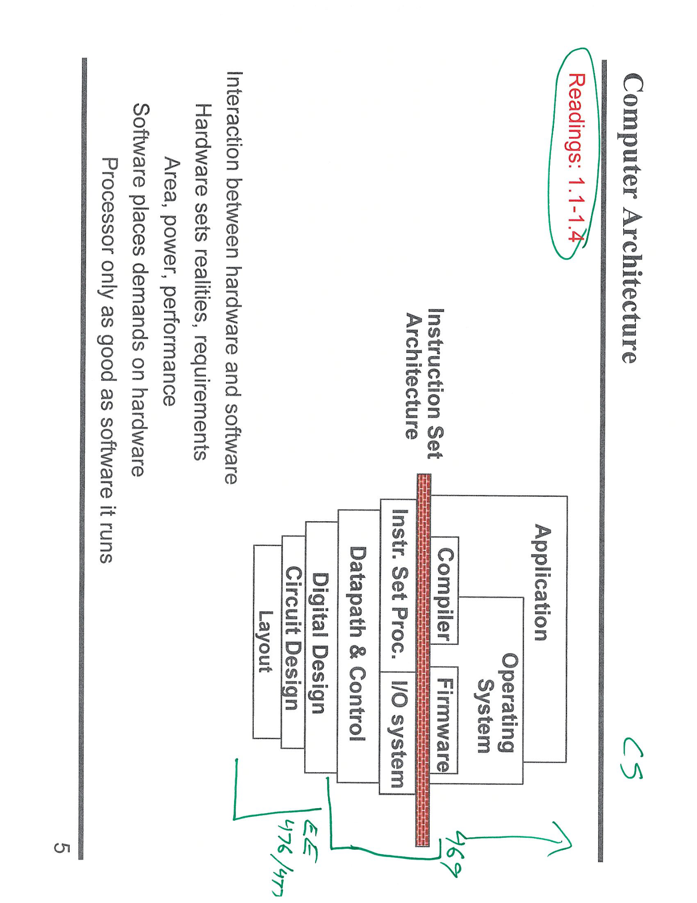
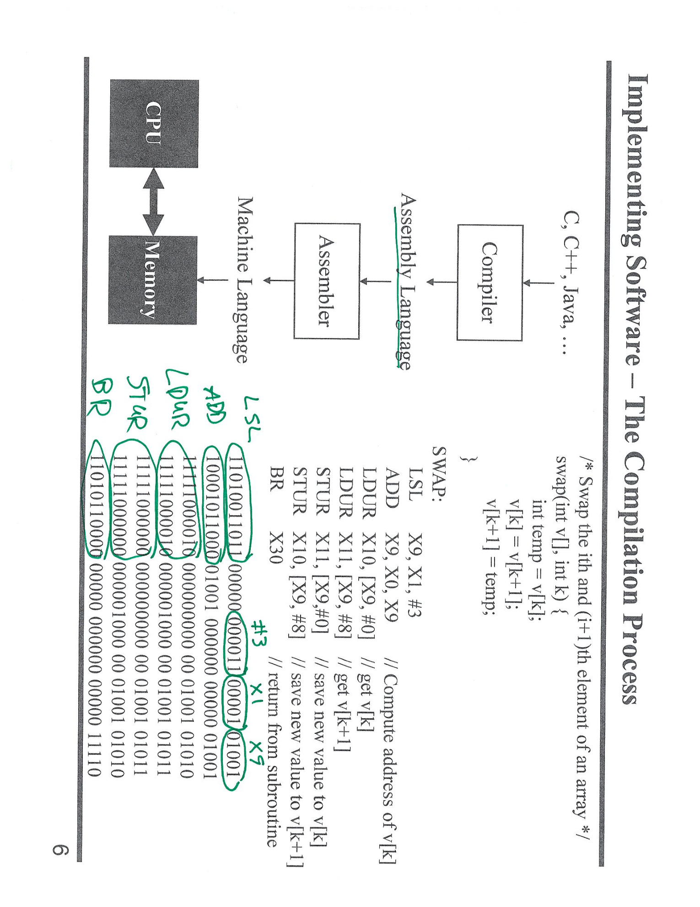
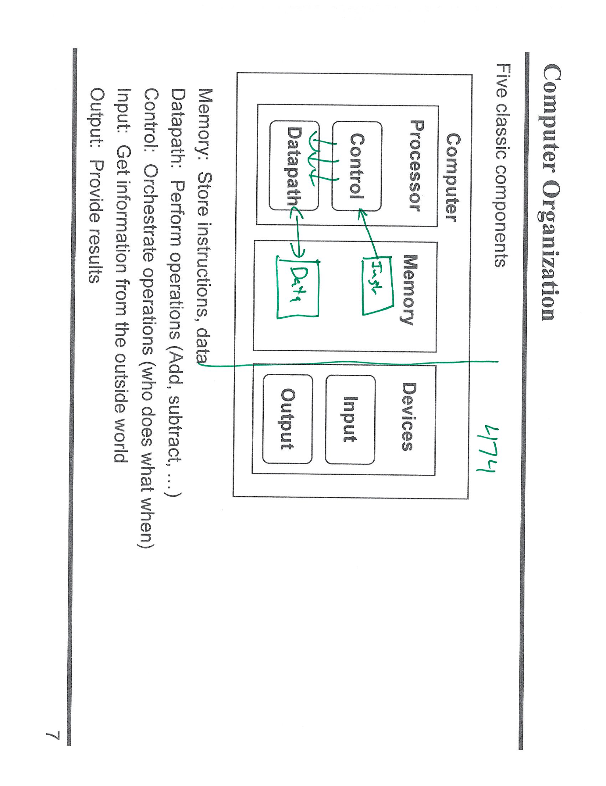
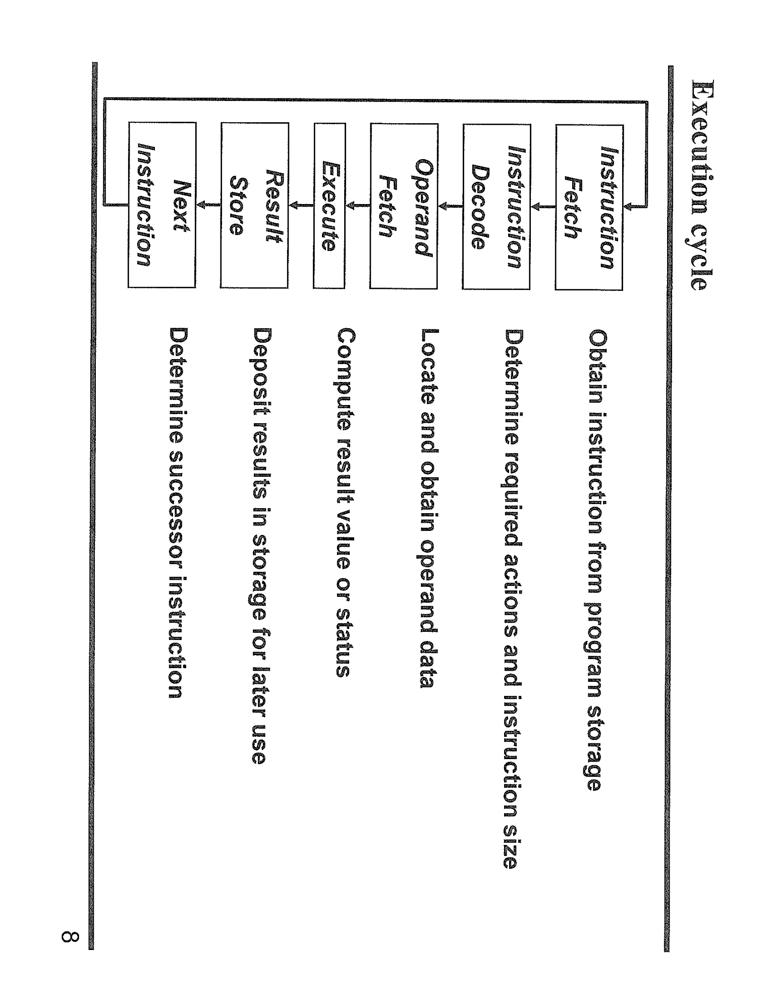

---

## 第 6 页



**提问：** 这张截图里的内容是什么意思？请面向初学者详细解释，分点讲清楚。

# 这张截图在讲什么（适合初学者）


这页课件叫 **Computer Architecture（计算机体系结构）**。它用一张“台阶式”的图，把**硬件与软件**从底到顶分层摆在一起，并强调二者通过 **ISA（Instruction Set Architecture，指令集体系结构）** 相互衔接与约束。


---


## 1）整张图的主线


* **左边/下方：硬件层（偏 EE）**

  从硅片到处理器的实现：


  * **Layout（版图）**：晶体管和连线在芯片上的具体几何布局。

  * **Circuit Design（电路设计）**：门电路、触发器等的电气实现。

  * **Digital Design（数字设计）**：用寄存器、组合逻辑搭出模块。

  * **Datapath & Control（数据通路与控制）**：算术逻辑单元、寄存器堆、控制器等组成能“执行一步步操作”的处理器内部。

  * **Instr. Set Proc.（处理器）**：能执行某套指令集（ISA）的具体 CPU 实现。

  * **I/O System（输入/输出系统）**：和存储、网卡、显示器等外设打交道的部分。


* **右边/上方：软件层（偏 CS）**

  靠近用户、跑在硬件之上：


  * **Firmware（固件/引导程序）**：主板/设备里的低层软件，开机初始化硬件。

  * **Compiler（编译器）**：把 C/C++/Rust 等高级语言翻译成某个 **ISA** 的机器/汇编指令。

  * **Operating System（操作系统）**：进程、文件、内存、设备管理等。

  * **Application（应用程序）**：你真正使用的程序（浏览器、IDE、游戏……）。


* **中间那条红色“墙”：ISA（指令集体系结构）**

  这是**硬件与软件的“契约/界面”**。它规定：


  * 有哪些**指令**（加法、跳转、访存等）、**寄存器**、**数据类型**与**寻址方式**；

  * **内存模型**、**异常/中断**、**特权级**等对操作系统至关重要的机制。

    💡 **编译器面向 ISA 生成代码；处理器按 ISA 的语义去执行。**

    例如 x86、ARM、RISC-V 都是不同的 ISA；同一 ISA 可以有很多不同性能/功耗的处理器实现。


---


## 2）旁注里写的几句话是什么意思


* **Interaction between hardware and software（软硬件相互作用）**

  两边不是各干各的，而是“拉手跳舞”。


* **Hardware sets realities/requirements（硬件设定现实约束）**

  例如 **面积（Area）/功耗（Power）/性能（Performance）** 的物理极限与工程取舍，会限制软件能做到什么、跑多快、耗多少电。


* **Software places demands on hardware（软件对硬件提出需求）**

  比如需要向量/矩阵加速、加密指令、虚拟化支持、更多核与缓存等；这些反过来推动硬件演进。


* **Processor only as good as software it runs（再好的处理器也要配好软件）**

  算法、编译优化、并行化、内存局部性等会极大影响最终体验。


* **绿色括号“EE/CS”**

  粗略地提示：底层更多由\*\*电子工程（EE）**研究，上层更多由**计算机科学（CS）\*\*研究；**ISA 是两者的交汇点**。课程号（如“469”）只是这门课在学校里的编号标注。


---


## 3）把图换成一句白话


> **ISA 就像硬件与软件约定的一门语言。**

> 编译器把应用/操作系统“翻译”成这门语言；处理器听懂并执行。硬件受制于面积/功耗/性能等现实，软件又不断对硬件提新要求，两者迭代共进。


---


## 4）一个简单流程例子


1. 你写了个 `C` 程序。

2. **编译器**根据目标 **ISA（比如 ARMv8）** 生成机器码。

3. **操作系统**把程序装入内存，分配资源。

4. **处理器**按 **ISA** 规定执行每条指令；

5. 需要读写磁盘/网络时，走 **I/O System** 与驱动；

6. 底下的一切都依托于**电路/版图**实现。


---


## 5）初学者要记住的关键点


* **分层思想**：从物理到抽象，层层搭建；每层对上提供接口、对下提出约束。

* **ISA 是桥**：软件写得再高明，最终都要落到 ISA；硬件再先进，也必须正确实现 ISA。

* **可移植性与性能**：不同 ISA 之间程序不可直接运行（未交叉编译/仿真时）；同一 ISA 的不同实现性能、功耗、成本差别很大。

* **系统性视角**：学体系结构既要看硬件实现，也要理解编译器/OS 如何利用硬件。


如果你愿意，我可以把这张图拆成一页“新手导读”小抄，按层列出关键词与常见问题，方便复习。


---

## 第 7 页



**提问：** 这张截图里的内容是什么意思？请面向初学者详细解释，分点讲清楚。

下面这页课件在讲**从高级语言到机器能执行的二进制**的全过程，并用“交换数组中相邻两个元素”的小例子演示每一步怎么落地。


---


## 1）整张图的主线：代码是怎样被“变成电”的


1. **C/C++/Java 等高级语言**

   人写的代码 → 交给 **Compiler（编译器）**。

2. **Assembly Language（汇编）**

   编译器把高级语言翻成一条条**汇编指令**（人还能看懂的“机器语句”）。

3. **Assembler（汇编器）**

   把汇编指令再翻译成**Machine Language（二进制机器码）**。

4. **CPU & Memory**

   最终只有机器码会被 CPU 取指、送到内存取数/存数并执行。


> 关键点：汇编是 ISA（指令集，如 ARMv8-A AArch64、x86-64）的“人类可读外壳”；机器码是同一意思的比特串。


---


## 2）要完成的任务（右上角的 C 伪码）


```c

/* 交换数组 v 中第 k 个元素和第 k+1 个元素 */

swap(int *v, int k) {

  int temp = v[k];

  v[k] = v[k+1];

  v[k+1] = temp;

}

```


目标：把这段逻辑一步步变成汇编，再变成机器码。


---


## 3）汇编程序逐行解释（中间列）


这是 **AArch64（64 位 ARM）** 风格的指令，寄存器名为 `X0, X1, ...`。

（约定：进入函数时 `X9` 里放了数组 `v` 的起始地址，`X1` 里放了下标 `k`。）


1. `LSL    X0, X1, #3`


   * **LSL** 是“逻辑左移”（Left Shift Logical）。

   * 把 `k` 左移 3 位，相当于乘 **2^3 = 8**，得到 **字节偏移量**（因为 `int64` 每个元素 8 字节）。

   * 结果放入 `X0`：`X0 = k * 8`。


2. `ADD    X9, X0, X9`


   * **ADD** 做地址计算：`X9 = v 的基址 + k*8`，现在 `X9` 直接指向 `v[k]`。


3. `LDUR   X1, [X9, #0]`


   * **LDUR** = Load（从内存读到寄存器）。

   * 取出 `v[k]`，放进 `X1`（把原来的 k 覆盖掉了没关系）。


4. `LDUR   X11, [X9, #8]`


   * 取出 `v[k+1]`：相对 `v[k]` 再偏移 8 字节，放进 `X11`。


5. `STUR   X11, [X9, #0]`


   * **STUR** = Store（把寄存器写回内存）。

   * 把 `X11`（原来的 `v[k+1]`）写到 `v[k]` 的位置。


6. `STUR   X1,  [X9, #8]`


   * 把 `X1`（原来的 `v[k]`）写到 `v[k+1]` 的位置。至此交换完成。


7. `BR     X30`


   * **BR** 跳转到寄存器地址；`X30` 是**返回地址（Link Register）**，等价于“`return`”。


> 从逻辑上看，这几行就是：

> `addr = base + (k<<3);  t = *addr;  u = *(addr+8);  *addr = u;  *(addr+8) = t;  return;`


---


## 4）与内存/地址的关系（为什么是 #0 和 #8）


* 内存以**字节**编址；数组元素如果是 64 位整数，一个占 **8 字节**。

* 因此 `v[k]` 的地址 = `v 的首地址 + k*8`；`v[k+1]` 再加 **8**。

* 这就是 `LSL #3`（乘 8）和后面 `[X9,#0]`、`[X9,#8]` 的由来。


---


## 5）左下角那串 0/1（二进制机器码）


* AArch64 的每条指令被编码成**固定 32 位**的机器码；

* 每一行二进制对应上面的一条汇编：前几位是**操作码（opcode）**，后面若干位分别编码了\*\*目标寄存器、源寄存器、立即数（如 #3、#8）\*\*等；

* 绿色圈出的部分就是“这些字段在位级上的位置”。CPU 只认识这堆比特。


---


## 6）把概念连起来的小例子


假设 `v` 的起始地址是 `1000`，`k=2`：


* `LSL`：`X0 = 2<<3 = 16`

* `ADD`：`X9 = 1000 + 16 = 1016`（`v[2]` 的地址）

* `LDUR`/`STUR`：按 `#0` 和 `#8` 分别访问 `v[2]` 与 `v[3]`，完成对换。

* `BR X30`：返回调用点。


---


## 7）你需要记住的要点


* **编译器**：高级语言 → 汇编（面向某个 ISA）。

* **汇编器**：汇编 → 机器码（固定 0/1）。

* **寄存器**：CPU 的“超高速小本子”，临时放地址/数据（如 `X1`、`X9`、`X11`）。

* **访存指令**：`LDUR`（读）、`STUR`（写）；`[基址, 偏移]` 表示地址。

* **返回**：`BR X30` 用保存的返回地址回到调用者。

* **位移乘法**：`LSL #n` = 乘 `2^n`，常用于按元素大小把下标变成字节偏移。


如果你想，我可以把这些指令再配上一张“字段到二进制位”的对照表，帮助你看懂每条机器码里哪几位是 opcode、哪几位是寄存器号与立即数。


---

## 第 8 页



**提问：** 这张截图里的内容是什么意思？请面向初学者详细解释，分点讲清楚。

下面这页在讲“**计算机由哪些核心部件组成，它们怎么配合**”。关键词是 **Five classic components（五大部件）**：


---


## 1）五大部件各干什么


* **Processor（处理器）= Datapath + Control**


  * **Datapath（数据通路）**：真正“算”的地方。包含寄存器堆、ALU（加减乘除/与或非/比较）、多路选择器、程序计数器等，负责把数据搬来搬去并进行运算。

  * **Control（控制器）**：指挥家。把“这一条指令要做什么”翻成一串**控制信号**（选哪个寄存器、ALU做哪种运算、是否写回、是否访存……），并根据标志位（如零/负/进位）决定下一步。

* **Memory（内存）**：存放**指令**和**数据**（比如 DRAM）。CPU每次都要从这儿取指令/读写数据。

* **Input（输入设备）**：把外部信息送进计算机（键盘、鼠标、传感器、网卡收到的数据……）。

* **Output（输出设备）**：把结果送出去（显示器、扬声器、网卡发出的数据、打印机……）。


> 记忆法：**算**的是 Datapath，**指挥**的是 Control，**记**的是 Memory，**进来**是 Input，**出去**是 Output。


---


## 2）处理器内部为何要分“数据通路”和“控制”


* **数据通路**像工厂的流水线：寄存器→ALU→寄存器/内存。

* **控制器**像调度系统：决定开哪条线、ALU做哪种运算、是否写入/读取……

* 这样分层能让设计更清晰：一边专注“算得快”，一边专注“指挥准”。


---


## 3）一条指令是怎样跑完一圈的（简化版）


1. **取指（Memory）**：根据 PC（程序计数器）从内存取出机器指令。

2. **译码（Control）**：控制器理解“这是条什么指令”。

3. **执行（Datapath）**：ALU 做加/减/与/移位等；或计算地址。

4. **访存（Memory）**：若是加载/存储指令，读/写内存。

5. **写回（Datapath）**：把结果写回寄存器；更新标志位；**控制器**决定下一条指令（顺序或跳转）。


---


## 4）两个小例子（帮你把图连起来）


* **计算 `x = x + 1`**

  取出指令 → 控制器发信号让 ALU 执行“加法” → Datapath 把寄存器 `x` 与常数 1 相加 → 写回寄存器 `x`。

* **把键盘输入显示到屏幕**

  Input（键盘）把数据放到寄存器/内存 → CPU 运行程序 → 结果写到显存或输出寄存器 → Output（显示器）显示。


---


## 5）常见易混淆


* **内存（Memory）≠ 硬盘/SSD**：图里说的是“运行时内存”（程序在这里取指/读写数据）。

* **I/O 也可能走内存映射**：很多设备用“内存映射寄存器”与 CPU 交互，看起来像在读写内存地址。

* **CPU 不懂 C 语言**：它只懂**指令**；编译器把 C 翻成指令后，才由 Control+Datapath 执行。


---


## 6）一句话总结


> 一台计算机就像一支乐队：**Memory** 提供乐谱与素材，**Input/Output**与外界互动；乐队的“演奏”由 **Datapath** 完成，而**Control**负责统一指挥，确保每个乐手在正确的时间做正确的事。


---

## 第 9 页



**提问：** 这张截图里的内容是什么意思？请面向初学者详细解释，分点讲清楚。

下面这页题目是 **Execution cycle（指令执行周期）**：CPU 处理“一条指令”从头到尾要走的 6 个步骤。图里从右到左依次是：


---


## 1）Instruction Fetch（取指令，IF）


* **做什么**：根据 **PC（Program Counter，程序计数器）** 给出的地址，到内存（或指令缓存）把下一条**机器指令**取出来。

* **你可以理解为**：“把要做的事的文本拿到手”。


## 2）Instruction Decode（译码，ID）


* **做什么**：看懂这条指令是什么操作（加法？加载？跳转？），需要哪些寄存器/是否访问内存；同时确定**指令长度**（有些 ISA 变长）。

* **结果**：控制器产生一堆**控制信号**，告诉数据通路后面该怎么干。


## 3）Operand Fetch（取操作数，OF）


* **做什么**：把指令需要的数据准备好。


  * 从**寄存器堆**里读源操作数（如 `X1`、`X2`）；

  * 若指令带**立即数**或需要**内存地址**，也在这一步取到/算出。

* **注意**：不是所有指令都会去内存取数据（纯寄存器的算术不会）。


## 4）Execute（执行，EX）


* **做什么**：在 **ALU**（算术逻辑单元）里完成计算，或计算有效地址，或进行比较、设置标志位；分支/跳转也在这里决定**是否跳**以及**目标地址**。


## 5）Result Store（写回/存结果，WB/MEM）


* **做什么**：把结果“落地”：


  * 写回寄存器（如把加法结果写入 `X0`）；

  * 如果是存储指令，则把寄存器的值写到内存；

  * 如果是加载指令，则把内存读出的值写回寄存器。

* **目的**：让后续指令能用到这个结果（“for later use”）。


## 6）Next Instruction（决定下一条，NI）


* **做什么**：更新 **PC**：


  * 一般情况：`PC ← PC + 指令长度`；

  * 分支/跳转：`PC ← 目标地址`。

* **然后回到步骤 1**，形成一个循环（图右侧的回箭头）。


---


## 7）把流程串起来的小例子


以 `ADD X0, X1, X2` 为例（`X0 = X1 + X2`）：


1. **取指**：拿到这条 ADD 的机器码；

2. **译码**：识别是“寄存器加法”，需要读 `X1` 和 `X2`，写 `X0`；

3. **取数**：从寄存器堆读出 `X1`、`X2`；

4. **执行**：ALU 做 `X1 + X2`；

5. **写回**：把和写入 `X0`；

6. **下一条**：PC 指向下一条指令（或根据分支改到别处）。


---


## 8）和“流水线”的关系


* 这张图是**概念上的单条指令流程**。真实 CPU 常把这些阶段“**重叠**”起来（流水线）：当第 1 条在执行时，第 2 条可能在译码，第 3 条在取指……以提高吞吐。

* 分支预测、数据相关（冒险）等复杂性是流水线额外要处理的，本页没展开。


---


### 术语速查


* **PC**：下一条要取的指令地址

* **IF/ID/OF/EX/WB**：常见的五/六段流水线阶段简称

* **ALU**：算术逻辑单元（加减与或非、比较、移位）


一句话记忆：**取指→看懂→拿数→计算→落地→选下一条**，循环往复，这就是 CPU 的工作节拍。
