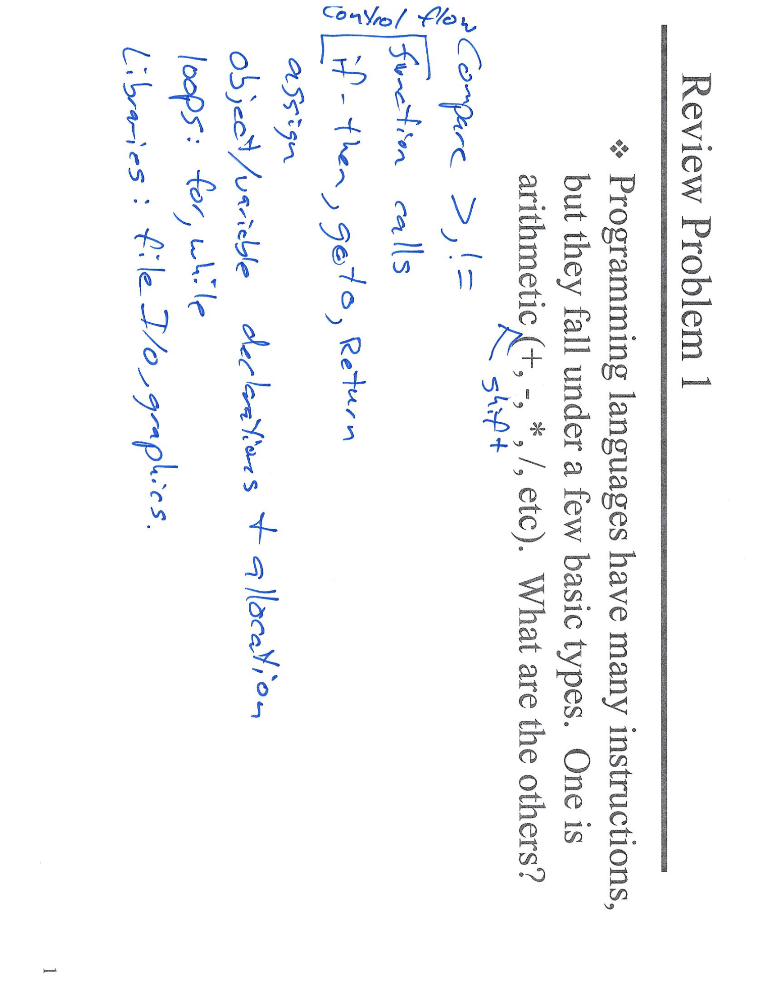
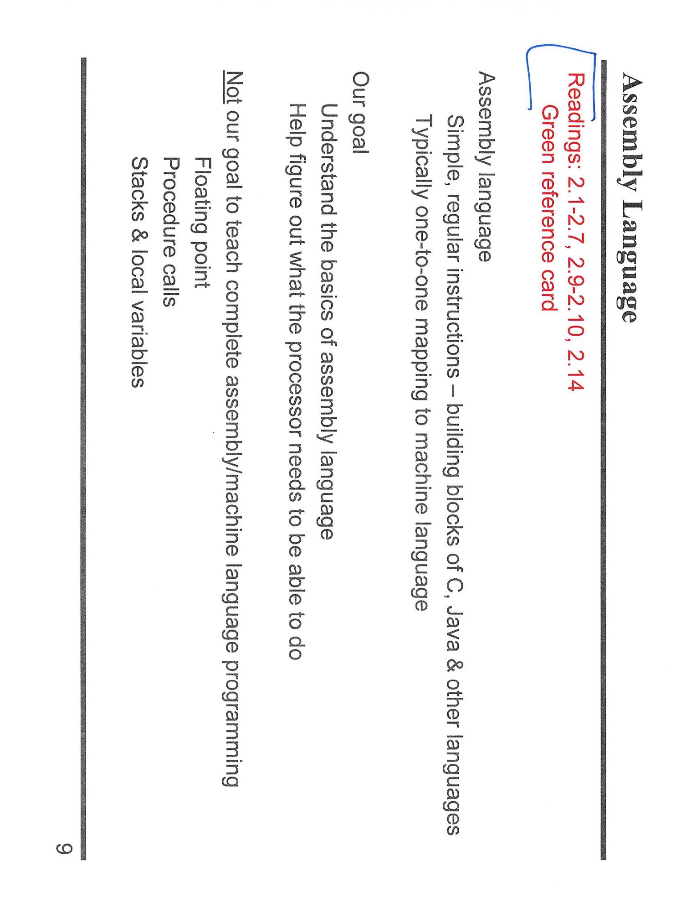
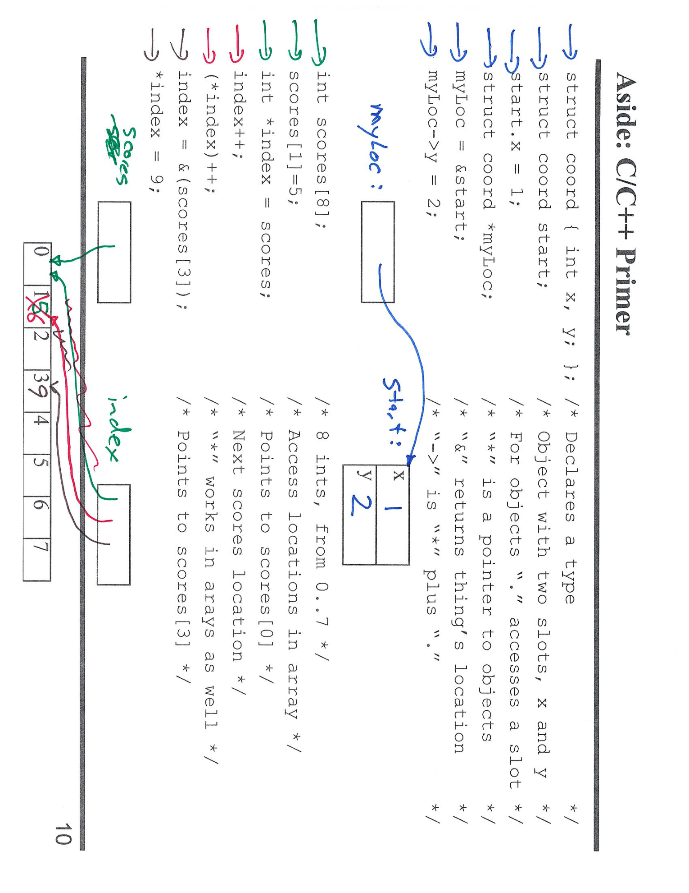
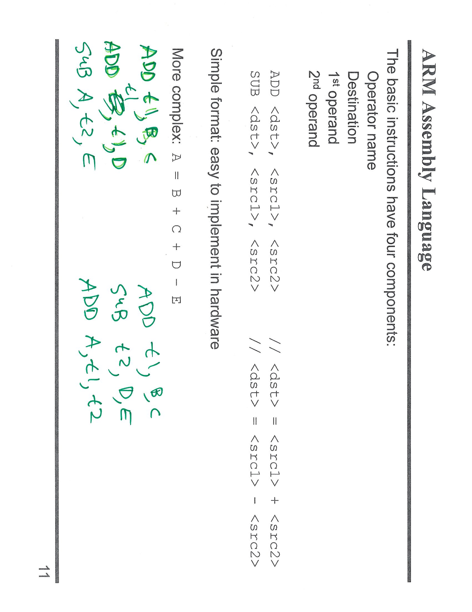
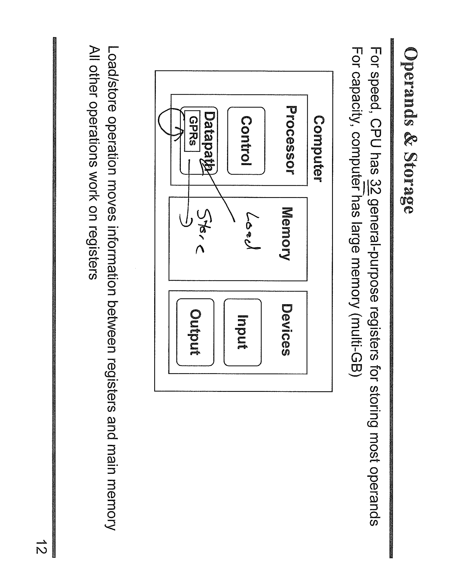
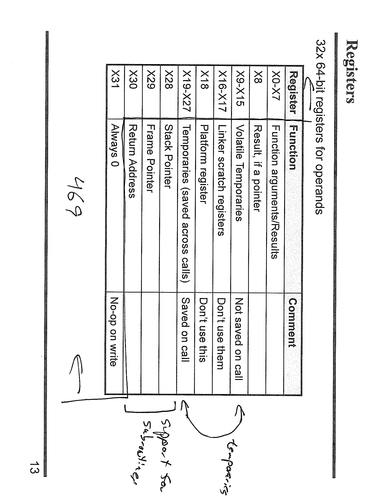

---

## 第 1 页



**提问：** 这张截图里的内容是什么意思？请面向初学者详细解释，分点讲清楚。

这张截图包含了一个 **复习问题**，涉及编程语言的基本指令。它指出，虽然编程语言有很多种指令，但它们可以归纳为几种基本类型。问题在问这些基本类型中的其他类别是什么。

### 1. **基本指令类型**

截图中列出了以下几种 **基本指令类型**，并加以说明：

#### - **控制流（Control flow）**：

- 这类指令用于控制程序的执行顺序，例如：

  - **比较（Compare）**：如 `==` 或 `!=`，用于比较两个值是否相等或不等。

  - **条件分支（if）**：用于根据比较结果来决定是否执行某些代码。例如：

    ```c
    if (a > b) {
        // 执行某些操作
    }
    ```

  - **跳转（goto）**：改变程序执行的控制流，跳转到指定位置。

  - **返回（Return）**：结束当前函数，并返回一个值。

#### - **函数调用（Function calls）**：

- 用于调用程序中的函数。
- 例如，`func()` 是一种常见的函数调用。

#### - **赋值（Assign）**：

- 用于将一个值赋给变量。
- 例如，`x = 10;` 表示将值 `10` 赋给变量 `x`。

#### - **变量声明与内存分配（Object variable declarations & allocation）**：

- 变量的声明和初始化，例如：

  ```c
  int x = 5;
  ```

- 还涉及动态内存分配，如在 C++ 中使用 `new` 或 `malloc`（C）进行内存分配。

#### - **算术运算（Arithmetic）**：

- 基本的数学运算，如加法、减法、乘法、除法等。
- 例如：`x = a + b`。

#### - **其他类型**：

- **库函数调用**：例如文件输入/输出（I/O）和图形处理等功能调用。
- **循环（Loops）**：如 `for` 循环和 `while` 循环，用于重复执行代码块。

### 2. **问题的核心**

这道复习题的核心在于引导我们思考编程语言的指令可以归类为哪些基本类型。除了 **算术运算**，还有 **控制流**、**函数调用**、**变量声明与内存分配** 等等。

总结来说，这道题考察了编程语言指令的分类，并让我们了解不同类型指令在程序中扮演的角色。


---

## 第 2 页



**提问：** 这张截图里的内容是什么意思？请面向初学者详细解释，分点讲清楚。

这张截图是关于汇编语言（Assembly Language）的教学内容，下面我将逐点详细解释其含义：


### 1. **Reading List (阅读材料)**：


* **Readings**: 2.1-2.7, 2.9-2.10, 2.14


* 这部分列出了学习该章节时需要阅读的内容。每个数字代表书籍中的特定章节或小节。初学者可以通过阅读这些章节来了解汇编语言的基本概念和知识点。


* **Green reference card**：这可能是指一种参考卡，可能会提供一些汇编语言的常用指令或其他重要信息，帮助学生在学习时查阅。


### 2. **汇编语言（Assembly Language）简介**：


* **Simpler, regular instructions - building blocks of C, Java & other languages**：

  汇编语言的指令比较简单和常规，它是低级编程语言，能直接控制计算机的硬件。汇编语言的指令可以看作是构建更高级语言（如C、Java等）的基本“积木”。这些语言的执行最终会被转化成汇编语言指令再由计算机执行。


* **Typically one-to-one mapping to machine language**：

  汇编语言和机器语言之间有一对一的映射关系。机器语言是计算机能够理解和执行的最低级语言，而汇编语言的每个指令通常直接对应机器语言中的一条指令。


### 3. **课程目标（Our Goal）**：


* **Understand the basics of assembly language**：

  这部分说明课程的目标是帮助学生理解汇编语言的基本知识。


* **Help figure out what the processor needs to be able to do**：

  汇编语言不仅是学习指令本身，学生还将学到计算机处理器（CPU）需要执行的操作，比如如何执行计算、内存访问等。


### 4. **非课程目标（Not our goal）**：


* **Not our goal to teach complete assembly/machine language programming**：

  课程的目的是让学生了解汇编语言的基础，但并不是教会学生完整的汇编语言或机器语言编程。这意味着，课程不会深入教授汇编语言的高级技巧，而是注重基础概念的理解。


### 5. **课程的内容覆盖面**：


* **Floating point**：浮点数处理，这可能涉及到如何在汇编语言中表示和处理小数或非常大的数字。

* **Procedure calls**：过程调用，即函数或子程序的调用。汇编语言中如何实现函数调用和返回。

* **Stacks & local variables**：堆栈和局部变量。在汇编语言中，堆栈用于存储函数的调用信息和局部变量，学习如何操作这些数据结构。


总结来说，这张截图的内容是关于学习汇编语言的课程内容框架。它列出了学生应该掌握的基础概念，以及课程的重点和非重点部分。对于初学者，重要的是理解汇编语言如何直接控制计算机硬件，并帮助学生理解处理器执行的基本操作。


---

## 第 3 页



**提问：** 这张截图里的内容是什么意思？请面向初学者详细解释，分点讲清楚。

这张截图的内容包含了C/C++编程语言中的一些基本概念，特别是结构体、数组和指针的使用。下面我会逐点进行详细解释：


### 1. **结构体（struct）声明**：


* **struct coord { int x, y; };**


  * 这段代码声明了一个结构体 `coord`。结构体是一种自定义数据类型，可以用来存储不同类型的多个数据。在这里，结构体包含两个整数 `x` 和 `y`。这个结构体可以用于表示一个二维坐标（例如，一个点的X和Y坐标）。


* **struct coord start;**


  * 这行代码声明了一个 `coord` 类型的变量 `start`，这个变量将存储一个 `x` 和一个 `y` 的值。


* \**struct coord *myLoc;**


  * 这行声明了一个指针 `myLoc`，它是指向 `coord` 类型的指针。指针用于存储某个变量的内存地址。在这里，`myLoc` 将用来指向一个 `coord` 结构体对象。


* **myLoc = \&start;**


  * 这行代码将 `myLoc` 指向 `start` 变量的内存地址，`&start` 表示 `start` 变量的地址。


* **myLoc->x = 1; myLoc->y = 2;**


  * `myLoc->x` 和 `myLoc->y` 是通过指针 `myLoc` 访问 `start` 结构体的成员变量 `x` 和 `y`。这里，`x` 被赋值为1，`y` 被赋值为2。`->` 是指针操作符，用于通过指针访问结构体的成员。


### 2. **数组和指针的结合**：


* **int scores\[8];**


  * 这行代码声明了一个整数数组 `scores`，它包含8个整数（索引从0到7）。


* **scores\[1] = 5;**


  * 这里将数组 `scores` 的第2个元素（索引为1）赋值为5。


* \**int *index; index = scores;**


  * 这里声明了一个整型指针 `index`，并将它指向数组 `scores` 的起始地址。数组名 `scores` 在C语言中代表数组的起始地址，因此 `index` 将指向数组的第一个元素。


* **index++;**


  * 这行代码使指针 `index` 向后移动，指向下一个数组元素。由于 `index` 是一个指向整数的指针，`index++` 会将它从 `scores[0]` 移动到 `scores[1]`。


* \**(*index)++;**


  * `(*index)` 解除指针引用，指向 `index` 当前指向的值（即 `scores[1]`）。然后 `(*index)++` 会将 `scores[1]` 的值增加1。


* **index = &(scores\[3]);**


  * 这行代码将 `index` 指针重新赋值为指向数组 `scores` 第4个元素的地址，即 `scores[3]`。


### 3. **指针操作和数组访问**：


* **8 ints from 0..7**:


  * 这段注释说明了数组 `scores` 包含了8个整数，索引从0到7。


* **Access locations in array**:


  * 注释解释了如何通过指针访问数组的元素。指针 `index` 可以用来访问数组中的不同元素。


* **Next scores location**:


  * 这行注释描述了 `index++` 后指针会指向数组中的下一个位置。例如，执行 `index++` 后，`index` 会指向 `scores[1]`。


### 4. **指针与结构体的结合**：


* **Pointer to structure**:


  * 指针 `myLoc` 指向结构体 `start`，可以通过 `myLoc->x` 和 `myLoc->y` 来访问结构体的成员。


* **Returning structure's location**:


  * `myLoc` 返回的是结构体的内存地址，指向结构体 `start`，并且通过 `myLoc->x` 和 `myLoc->y` 访问其中的值。


### 总结：


这张截图包含了C/C++语言中几个重要的概念，主要是：


* **结构体（struct）**：用于存储多个不同类型的数据（例如，`x` 和 `y` 坐标）。

* **指针（pointer）**：用于存储内存地址，通过指针可以间接访问和修改数据。

* **数组（array）**：用于存储一系列数据，指针和数组结合可以方便地访问和操作数组中的元素。


对于初学者，理解指针和数组如何一起工作是非常重要的，它们能让你直接操作内存，从而提高程序的灵活性和效率。


---

## 第 4 页



**提问：** 这张截图里的内容是什么意思？请面向初学者详细解释，分点讲清楚。

这张截图展示了 **ARM 汇编语言** 中的基本指令格式，以及如何表示加法（ADD）和减法（SUB）。下面我会逐点解释内容，帮助初学者理解。


### 1. **ARM 汇编语言的基本指令结构**


* **The basic instructions have four components**（基本指令有四个组成部分）：


  * **Operator name**：操作符名称，如 `ADD` 或 `SUB`，表示要进行的操作类型（加法或减法）。

  * **Destination**：目标寄存器，运算结果存储的位置。

  * **1st operand**：第一个操作数，通常是一个寄存器或者常数。

  * **2nd operand**：第二个操作数，类似地，可以是寄存器或常数。


这四个部分构成了 ARM 汇编指令的基本格式。例如，`ADD` 和 `SUB` 就是两个常见的操作符。


### 2. **基本的加法与减法指令**


* **ADD <dst>, <src1>, <src2>**


  * `ADD` 是加法操作符，它表示将两个操作数相加。

  * `<dst>` 表示存储结果的目标寄存器。

  * `<src1>` 和 `<src2>` 是要相加的两个操作数，通常它们是寄存器中的值。

  * **示例**： `ADD R1, R2, R3`，表示将寄存器 `R2` 和 `R3` 中的值相加，结果存储在 `R1` 中。

* **SUB <dst>, <src1>, <src2>**


  * `SUB` 是减法操作符，它表示将两个操作数相减。

  * 同样，`<dst>` 是目标寄存器，`<src1>` 和 `<src2>` 是两个被减数。

  * **示例**： `SUB R1, R2, R3`，表示从 `R2` 中减去 `R3`，结果存储在 `R1` 中。


### 3. **更复杂的操作**


* **More complex**（更复杂的操作）：


  * 这一部分展示了更复杂的算式，例如 `A = B + C + D - E`。在 ARM 汇编中，我们可以通过多个指令来执行这种计算。

  * 例如，计算 `A = B + C + D - E` 可以分为两步：


    * 第一条指令 `ADD A, B, C` 将 `B` 和 `C` 相加，结果存储在 `A` 中。
    
    * 第二条指令 `ADD A, A, D` 将上一步的结果 `A` 与 `D` 相加，最终的结果存储回 `A`。
    
    * 第三条指令 `SUB A, A, E` 将 `A` 与 `E` 相减，最终得到结果。


  这些步骤在汇编中表现为多个指令的组合，但每条指令本身依然非常简单。


### 4. **ARM 汇编语言的指令格式**


* **Simple format: easy to implement in hardware**（简单的格式：易于在硬件中实现）：


  * ARM 汇编指令的格式是简单且直接的，这使得它们可以很容易地在硬件中实现。每条指令都有一个固定的格式，使得 CPU 可以快速解析和执行这些操作。


### 5. **代码示例**：


* **ADD t1, t2, t3**：


  * 这是一个加法指令，表示将 `t2` 和 `t3` 中的值相加，并将结果存储在 `t1` 中。

* **SUB t1, t2, t3**：


  * 这是一个减法指令，表示将 `t2` 中的值减去 `t3` 中的值，结果存储在 `t1` 中。


### 总结：


这张截图主要展示了 **ARM 汇编语言** 中加法和减法操作的基本格式和执行方式：


* **ADD** 和 **SUB** 是汇编中的两种基本操作，用于执行加法和减法。

* 汇编语言的指令格式简洁易懂，使得处理器可以有效地实现这些操作。

* 更复杂的运算可以通过多个指令组合完成，逐步计算出最终结果。


对于初学者来说，理解这种简洁而直接的汇编指令格式，以及如何将数学运算分解为多个指令，是学习汇编语言的重要一步。


---

## 第 5 页



**提问：** 这张截图里的内容是什么意思？请面向初学者详细解释，分点讲清楚。

这张截图的内容主要讲解了计算机中操作数（Operands）和存储（Storage）相关的基础概念，并特别指出了**CPU**如何通过寄存器（Registers）和内存（Memory）进行数据操作。下面是逐点详细的解释：


### 1. **Load/Store 操作**


* **Load/Store operation moves information between registers and main memory**（Load/Store 操作用于在寄存器和主内存之间移动数据）：


  * **Load** 操作将数据从主内存读取到寄存器。

  * **Store** 操作将数据从寄存器写回到主内存。

  * 这两种操作是处理器与内存之间交互的基本方式。在执行其他运算时，数据通常存储在寄存器中，而所有需要存取主内存的数据则通过 Load 或 Store 操作来处理。


### 2. **CPU 和寄存器**


* **For speed, CPU has 32 general-purpose registers for storing most operands**（为了速度，CPU 有32个通用寄存器，用于存储大多数操作数）：


  * 在现代计算机中，CPU 内部有多个寄存器。**通用寄存器（General-Purpose Registers, GPRs）** 是 CPU 内部用于存储临时数据的地方。它们在执行指令时，存储着运算所需的操作数（Operands）。

  * 这里提到的 32 个寄存器通常是 CPU 中存储运算操作数的主要地方。它们的操作速度非常快，因此被广泛用于存储计算过程中的中间数据。


### 3. **计算机的内存**


* **For capacity, computer has large memory (multi-GB)**（为了容量，计算机有大型内存（多GB））：


  * 相比于寄存器，计算机的内存（RAM）容量更大，可以达到 GB 级别，甚至更高。内存用于存储程序运行时需要的大量数据，例如程序代码、数据结构和文件等。

  * 然而，访问内存的速度远低于寄存器。因此，程序执行时尽量避免频繁访问内存，而是将数据加载到寄存器中进行处理。


### 4. **计算机体系结构示意图**


* 图中展示了一个计算机架构的基本组成：


  * **Processor**（处理器）：负责执行计算机程序，包含控制单元（Control）、数据通路（Datapath）、寄存器组（GPRs）等部分。

  * **Memory**（内存）：用于存储数据和程序。

  * **Devices**（设备）：包括输入输出设备，如键盘、显示器、硬盘等。

  * **Control**：负责协调计算机各个部分的工作，确保指令按顺序正确执行。

  * **Datapath**：这是一个核心部分，负责处理数据的流动，确保数据在寄存器、内存和计算单元之间的传递。

  * **Input/Output**：计算机与外界的交互，包括从键盘接收输入、显示数据到屏幕等。


### 5. **数据传输**


* 图中的箭头指示了数据的传输路径。寄存器和内存之间的数据传输是通过 Load 和 Store 操作实现的。例如，数据从内存加载到寄存器后，可以进行处理，然后将处理结果存储回内存。


### 6. **总结**


* **Load/Store** 是计算机中最常见的数据传输方式。所有的计算（加法、减法、乘法等）都是在寄存器中进行的，而内存仅用于存储大量数据。

* **寄存器** 是CPU内部的高速存储单元，用于存放程序运行时需要的操作数。

* **内存** 则容量大、速度较慢，用于存储更大量的数据和程序。


对于初学者来说，理解计算机是如何在寄存器和内存之间进行数据传输、以及这些存储单元的区别非常重要。寄存器存储速度极快，但数量有限，内存则存储容量大，但访问速度较慢，因此程序运行时常常通过将数据加载到寄存器中来提高执行效率。


---

## 第 6 页



**提问：** 这张截图里的内容是什么意思？请面向初学者详细解释，分点讲清楚。

这张截图展示了 **32x64-bit 寄存器** 在处理器中的用途，特别是在 **ARM 架构** 下。这些寄存器用于存储程序运行时的操作数和中间结果。下面是对图中内容的详细解释，面向初学者。


### 1. **寄存器（Registers）概览**


* 这张表列出了32个64位的寄存器，它们在程序执行过程中发挥着不同的作用。每个寄存器都有特定的功能，用于存储不同类型的数据，比如函数的输入输出、临时变量、栈指针等。


### 2. **寄存器的功能**


* 每一列都描述了不同寄存器的用途和它们的功能。下面是对一些常见寄存器功能的解释：


* **X0-X7**：


  * 这些寄存器用于 **函数的输入参数** 或 **返回结果**。它们用于传递函数调用时需要的参数，或者保存从函数中返回的结果。

  * **注释**中提到：“Result, if a pointer”，这意味着如果函数返回的是一个指针，结果也将存储在这些寄存器中。


* **X9-X15**：


  * 这些寄存器被称为 **"Volatile Temporaries"（易失性临时寄存器）**。它们用于临时存储数据，但数据的内容可能会在函数调用时被覆盖，因此不应该依赖于这些寄存器存储的值。


* **X16-X17**：


  * 这些寄存器称为 **"Linker Scratch Registers"（链接器临时寄存器）**，主要用于链接器操作和临时存储数据。


* **X19-X27**：


  * 这些是 **"Temporaries (saved across calls)"（跨函数调用保存的临时变量）** 寄存器。它们用于存储跨多个函数调用仍然需要保留的临时数据。通常在函数调用之间保存这些数据。


* **X28**：


  * **"Stack Pointer"（栈指针）** 寄存器，它指向程序的栈。在函数调用时，栈用于保存局部变量和返回地址。栈指针的作用就是管理栈的使用。


* **X29**：


  * **"Frame Pointer"（帧指针）** 寄存器，它指向当前函数栈帧的基址。在函数调用中，栈帧保存了函数的局部变量和调用信息。帧指针用于访问当前栈帧中的数据。


* **X30**：


  * **"Return Address"（返回地址）** 寄存器。函数调用时，返回地址寄存器存储调用后程序继续执行的位置。它帮助程序在函数调用结束后返回到正确的位置继续执行。


* **X31**：


  * 这是一个特殊的寄存器，通常用于 **返回值的存储**。在某些架构中，X31 被称为 "Link Register"，用于存储函数返回的地址。


### 3. **关于寄存器的附加说明**


* **No-op on write**：


  * 这意味着在写入某些寄存器时，并不会引发任何操作（No-op）。这通常用于某些特殊寄存器，确保它们在某些情况下不会引发额外的操作。


* **Support for subroutine**：


  * 这表明一些寄存器专门支持子程序（subroutine），例如保存返回地址和函数参数，确保函数调用和返回能够正确执行。


* **Saved on call** vs. **Not saved on call**：


  * **Saved on call**：这些寄存器在函数调用时需要保存其值。因为函数调用可能会修改这些寄存器的内容，所以在调用前需要将其值保存，以便函数返回后恢复。

  * **Not saved on call**：这些寄存器的内容在函数调用后不需要恢复，因为它们不被函数调用修改或者可以被覆盖。


### 4. **总结**


* ARM 架构的 64 位寄存器被广泛用于存储函数的输入输出数据、临时数据、栈指针、返回地址等。每个寄存器有其特定的用途，并根据程序的执行要求来选择使用不同的寄存器。

* 在进行编程时，理解这些寄存器的作用有助于更好地利用它们提高程序效率，同时避免不必要的内存访问。


对于初学者，了解这些寄存器及其功能有助于深入理解计算机如何执行程序，特别是如何通过寄存器在处理器内部快速存储和访问数据。
