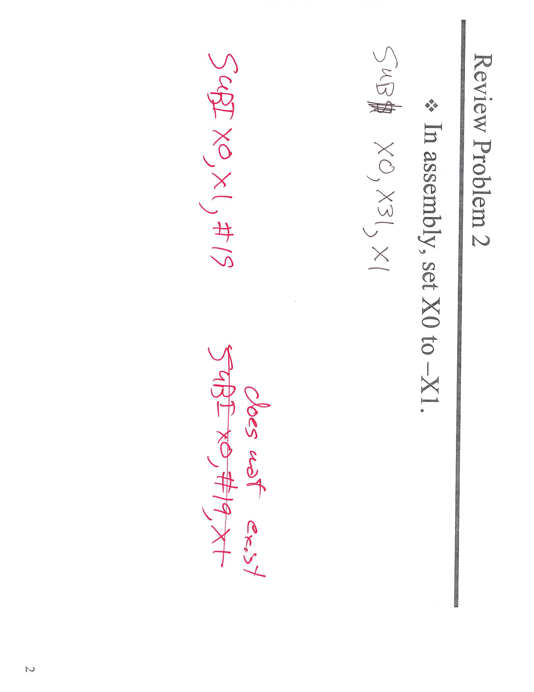
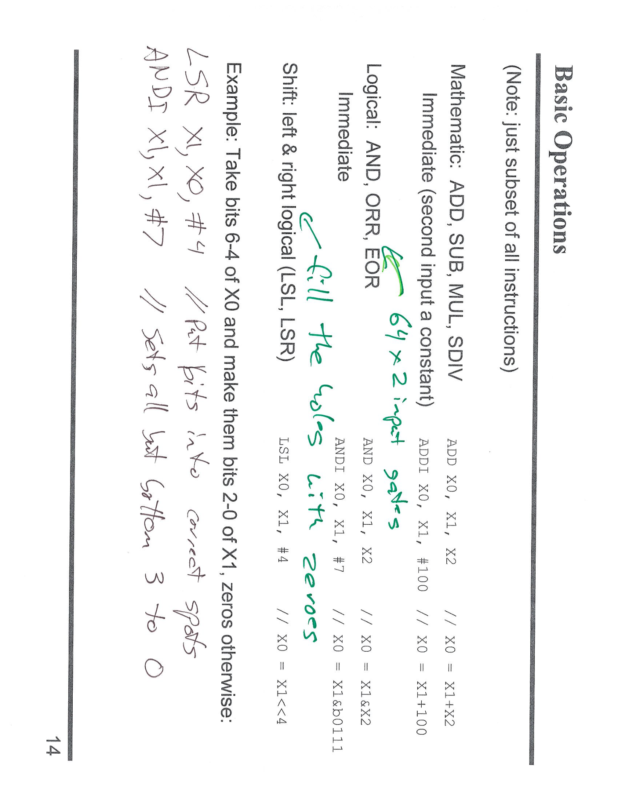
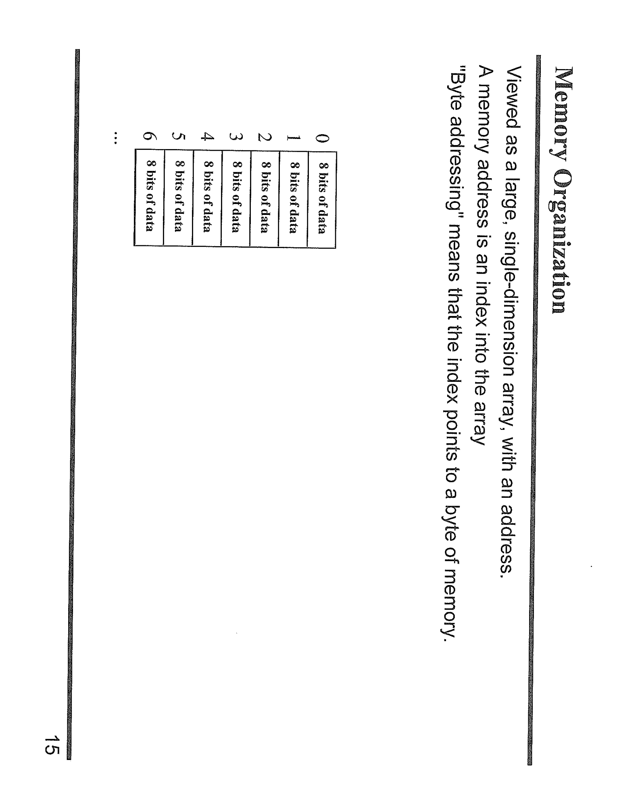
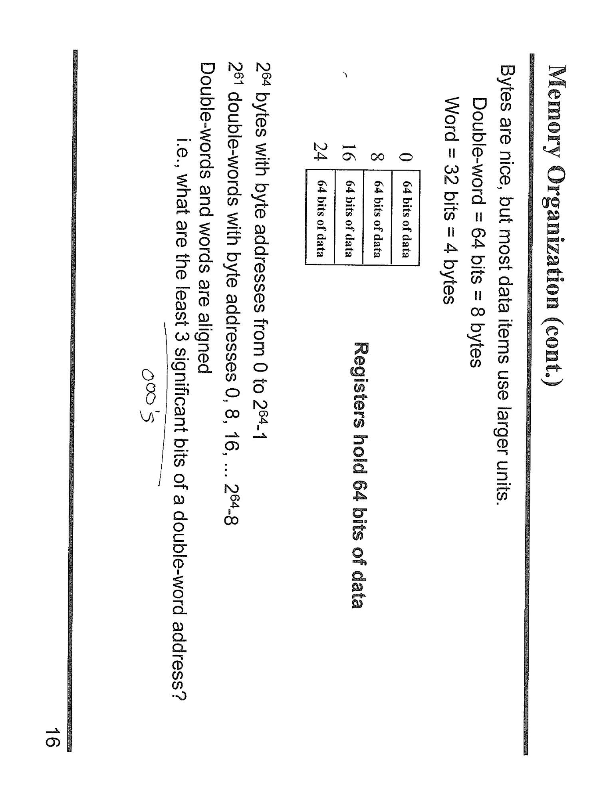
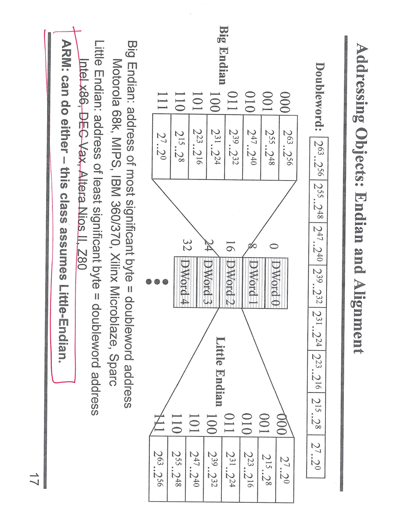
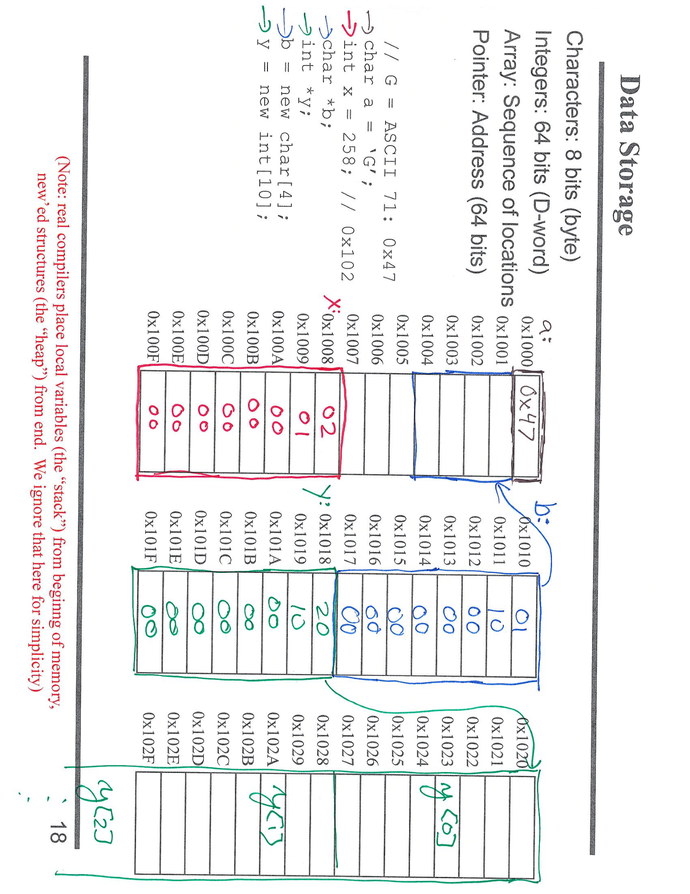
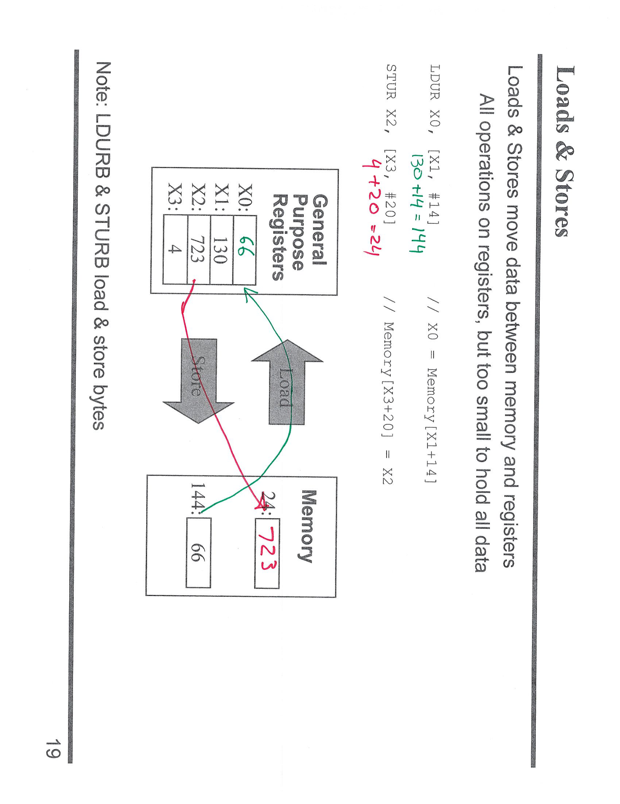

---

## 第 1 页

**提问：** 这张截图里的内容是什么意思？请面向初学者详细解释，分点讲清楚。

这张截图展示的是与汇编语言相关的内容，下面我会逐点解释它的意思，帮助初学者理解。

### 1. **Review Problem 2**

* 这是一个复习题（Review Problem 2），看起来是与计算机体系结构或汇编语言相关的练习题目。

### 2. **In assembly, set X0 to -X1.**

* 题目的要求是：在汇编语言中，设置寄存器 X0 的值为 X1 的负值。简单来说，就是把 X0 的值变成 X1 的相反数。

### 3. **原始的汇编指令：**

* 这部分展示了一条汇编指令：

  * `SUB X0, X1, #19`
  * 这条指令在汇编中通常是用来执行减法运算的。
  * `SUB` 是“减法”（Subtract）的缩写。
  * `X0` 是目标寄存器，减法结果会被存储到 X0。
  * `X1` 是源寄存器，作为被减数。
  * `#19` 是立即数，表示一个常数值 19。

**但在这条指令里，实际执行的是：**

* `X0 = X1 - 19`
* 也就是说，X0 会被设置为 X1 的值减去 19，而不是 X1 的负值。

### 4. **错误与修改建议：**

* 红色的标注显示了修改的意见，指出原指令的做法不符合题目的要求：“does not exist”（这个指令的行为并不存在）。
* 修改建议是：

  * `SUBI X0, X1, #19`
  * 这条指令同样是执行减法，但不同之处在于它使用了立即数 `#19` 来进行减法运算。

### 5. **总结：**

* 题目要求通过汇编语言把 `X0` 设置为 `-X1`，也就是说需要做 `X0 = -X1`，但最初给出的汇编指令并没有实现这一

---

## 第 2 页

**提问：** 这张截图里的内容是什么意思？请面向初学者详细解释，分点讲清楚。

这张截图展示的是关于汇编指令的基本操作内容，主要涉及位移和逻辑运算指令。下面我会逐点解释，帮助你更好地理解其中的内容：

### 1. **基本操作：**

这部分列出了几种常见的汇编操作，包括：

* **Shift**（位移）：`LSL` 和 `LSR`
* **Logical**（逻辑运算）：`AND`、`ORR`、`EOR`
* **Mathematical**（数学运算）：`ADD`、`SUB`、`MUL`、`SDIV`
* **Immediate**（立即数）：指令中包含常数作为输入。

### 2. **Shift 操作：**

* 位移指令用于移动数据的位。主要有两种类型：

  * **LSL (Logical Shift Left)**：逻辑左移操作，即将数值的二进制位向左移动，左侧填充零。
  * **LSR (Logical Shift Right)**：逻辑右移操作，即将数值的二进制位向右移动，右侧填充零。
* **示例：**

  * `LSR X1, X0, #4`：这条指令表示将寄存器 X0 的值右移 4 位，并将结果存储到 X1。
  * **注释解释**：`Take bits 6-4 of X0 and make them bits 2-0 of X1, zeros otherwise`。
    这句话的意思是，从 X0 中取出第 6 到第 4 位，并将它们移动到 X1 的第 2 到第 0 位，其他位填充为零。

### 3. **Logical 运算：**

* 逻辑运算指令执行二进制层面的“与”（AND）、“或”（ORR）以及“异或”（EOR）操作。

* **示例：**

  * `AND X0, X1, #7`：执行逻辑与运算，将 X1 和立即数 7（`111`）做与运算，结果存储到 X0 中。

    * 结果：X0 = X1 & 7，即 X1 与 7 的低 3 位进行按位与操作，其他高位将被清零。

### 4. **数学运算：**

* 数学运算包括加法（ADD）、减法（SUB）、乘法（MUL）和除法（SDIV）等。

* **示例：**

  * `ADD X0, X1, X2`：这条指令表示将寄存器 X1 和 X2 的值相加，结果存储到 X0 中。
  * `ADD X0, X1, #100`：这条指令表示将寄存器 X1 的值加上 100（立即数），结果存储到 X0 中。

### 5. **实际例子与注释：**

* **LSL 示例**：

  * `LSL X0, X1, #4`：将寄存器 X1 中的值左移 4 位，存储到 X0 中。注释解释了左移操作的含义，即将 X1 的值左移，低 4 位用零填充，结果存储在 X0 中。
  * `X0 = X1 << 4`：X1 向左移 4 位。
* **AND 示例**：

  * `AND X0, X1, #7`：这条指令将 X1 和立即数 7（即二进制的 `111`）做按位与运算，并将结果存储到 X0 中。

### 6. **总结：**

这张截图主要介绍了几种基本的汇编语言操作：

* 位移操作：通过左移和右移来改变二进制数据的位。
* 逻辑运算：按位操作（与、或、异或）常用于数据的掩码或条件判断。
* 数学运算：进行加法、减法等基础的算术运算。

这些操作在编程中非常重要，尤其是在低级编程和处理硬件时，它们帮助我们更精确地控制数据和内存。

---

## 第 3 页

**提问：** 这张截图里的内容是什么意思？请面向初学者详细解释，分点讲清楚。

> ⚠️ 未能复制为 Markdown，以下为纯文本回退：

这张截图主要介绍了内存组织以及字节寻址的概念。下面是详细的解释：
1. Memory Organization（内存组织）
这部分内容描述了计算机内存如何组织和访问。计算机内存被看作是一个非常大的、单维数组，其中每个元素都有一个地址。
内存地址 是数组的索引，指向内存中的一个字节。
2. 字节寻址（Byte Addressing）
这意味着计算机内存中的每个地址对应一个字节的数据（8位）。
字节（Byte）：是计算机存储数据的基本单位。1字节等于8位（bit）。
内存中的每个位置有一个唯一的地址，每个地址指向一个字节。
3. 内存中的数据组织示意图
图示显示了内存如何以字节为单位进行组织。在示例中：
从地址 0 开始，每个地址对应 1 个字节（8位数据）。
地址 0 对应第一个字节的数据，地址 1 对应第二个字节的数据，以此类推。
例如，地址 0 存储一个字节数据，地址 1 存储下一个字节，直到更高的地址。
4. 解释数组和索引的关系
内存数组：内存可以被视为一个很大的数组，每个地址就像数组的索引，指向内存中的一个字节。
索引：内存地址的索引值表示内存中的位置。比如地址 0 对应第一个字节，地址 1 对应第二个字节等。
例如，图中的：
地址 0 存储的数据是一个字节（8位），地址 1 存储下一个字节，地址 2 存储再下一个字节，依此类推。
5. 总结
这张图主要解释了内存的字节寻址方式，即每个内存地址指向一个字节，并且将内存视为一个大数组进行访问。
计算机通过这些地址来定位和访问存储在内存中的数据，每个地址对应着一个字节数据。
6. 内存地址的增量
在字节寻址的方式下，每个内存地址指向的都是一个字节，这样就能精确地访问每一个字节的数据，确保数据的正确存取。

---

## 第 4 页

**提问：** 这张截图里的内容是什么意思？请面向初学者详细解释，分点讲清楚。

这张截图继续讲解内存组织的概念，并引入了更多与计算机存储单位相关的知识。以下是详细的解释，帮助初学者理解其中的内容。

### 1. **字节、字（Word）和双字（Double-word）**

* **字节（Byte）**：是计算机存储数据的最小单位，1字节等于8位（bit）。之前已经介绍过。
* **字（Word）**：一个字通常包含32位数据，等于4字节。在不同的体系结构中，“字”指的可以是不同大小的数据单元，但在这个上下文中，一个字就是32位，即4字节。
* **双字（Double-word）**：一个双字是64位，等于8字节。也就是说，它是由两个“字”组成的。

### 2. **内存地址的组织方式**

* 这部分描述了内存中的数据是如何组织的，特别是字节、字和双字的地址如何排布。

**内存布局**：

* 64位的内存地址空间从地址 `0` 开始，按字节递增，直到 `264-1`（表示最大地址）。
* **字节地址**：内存中的字节地址从 `0` 开始，依次递增。每个地址对应一个字节（8位）。
* **双字地址**：内存地址也可以是按双字（64位，8字节）排列的。双字的起始地址是按8字节对齐的，因此每个双字地址（如 0, 8, 16, 24 ...）都会间隔 8 个字节。

### 3. **内存对齐**

* **内存对齐**：为了提高内存访问的效率，字和双字数据通常会按照一定的规则对齐。比如：

  * **字（Word）**：会按 4 字节对齐，即地址是 4 的倍数。
  * **双字（Double-word）**：会按 8 字节对齐，即地址是 8 的倍数。
* 这样的对齐方式有助于提高 CPU 访问内存的效率，因为计算机的硬件通常对内存访问有优化，能更高效地处理对齐的数据。

### 4. **寄存器**

* **寄存器**：寄存器是 CPU 内部用于存储数据的小型存储单元。每个寄存器可以保存 64 位的数据（即 8 字节）。
* **寄存器的作用**：寄存器可以用来存储和操作数据，在处理过程中，CPU 会频繁地与寄存器交互。
* **存储 64 位数据**：这也解释了为什么寄存器是 64 位的，因为计算机中的一些数据类型（如双字）有时需要这么大的存储空间。

### 5. **内存地址例子**

* **字节地址**：图示中提到，内存从地址 0 开始，按字节递增直到最大地址。每个字节的地址是唯一的。
* **双字地址对齐**：比如从地址 `0` 开始，接下来的双字数据将会存储在地址 `8`, `16`, `24` 等位置，每隔 8 个字节。

### 6. **问题示例**

* 在图示的最后，提出了一个问题：“What are the least 3 significant bits of a double-word address?” 这个问题的意思是：在一个双字地址中，最低的三个有效位是什么？

  * 因为双字地址是按 8 字节对齐的，所以它们的地址是 8 的倍数。你可以通过二进制方式观察地址，例如 8, 16, 24 等地址，这些地址的低 3 位总是 0，因为它们是 8 字节对齐的。

### 7. **总结**

* 计算机内存组织不仅仅是以字节为单位的，还会有更大的单位，比如字（4 字节）和双字（8 字节）。这些单位的对齐规则影响了数据在内存中的存储方式。
* 寄存器用于存储 64 位的数据，符合双字对齐要求，这使得 CPU 能更高效地访问和处理数据。
* 内存对齐是一种优化方式，保证了数据访问的效率，尤其是在处理大数据单元时。

这些概念是理解计算机内存组织、优化存储和数据处理的基础，对于程序设计和硬件设计都有重要意义。

---

## 第 5 页

**提问：** 这张截图里的内容是什么意思？请面向初学者详细解释，分点讲清楚。

这张截图主要讲解了 **字节序（Endianness）** 和 **数据对齐** 的概念，特别是在不同的计算机体系结构中如何处理多字节数据（如双字、字等）。下面我会逐点讲解这些内容，帮助初学者理解。

### 1. **字节序（Endianness）**

* **字节序**指的是多字节数据（如 32 位、64 位数据）在内存中的存储顺序。不同的计算机体系结构可能采用不同的字节序方式，主要有两种：

  * **大端字节序（Big Endian）**：将数据的最重要字节（最高有效字节）存储在内存的最低地址处，其他字节按顺序存储。
  * **小端字节序（Little Endian）**：将数据的最重要字节（最高有效字节）存储在内存的最高地址处，最低有效字节存储在最低地址处。

### 2. **图中的内容**

* 图示中显示了多字节数据（如双字或字）在大端字节序和小端字节序下的存储方式。
* 以 **双字（Doubleword）** 为例，一个双字是 64 位（8 字节）。例如，图中显示了从地址 `0` 开始存储数据，按照大端字节序和小端字节序分别进行存储。

**大端字节序（Big Endian）**：

* 在大端字节序下，最重要的字节（MSB）存储在最小的内存地址处。图示中地址从 `0` 到 `256` 显示了这个顺序。
* 例如：

  * 地址 `0` 存储最高有效字节（MSB），
  * 地址 `1` 存储次高有效字节，以此类推。

**小端字节序（Little Endian）**：

* 在小端字节序下，最重要的字节（MSB）存储在最大的内存地址处，最低有效字节（LSB）存储在最小的内存地址处。
* 图示中也显示了小端字节序下，数据的存储方式是怎样相反的。

### 3. **ARM 架构的字节序**

* **ARM架构**：这张截图提到 ARM 处理器可以支持两种字节序（大端和小端），但在这门课程中，假设使用小端字节序。
* ARM 可以根据需要切换字节序，具体由操作系统或硬件决定。但在本课程中，默认情况下假定 ARM 使用 **小端字节序**。

### 4. **地址的解释**

* 图中列出了具体的内存地址，分别为大端和小端字节序下的数据存储方式：

  * 在 **大端字节序** 中，地址的顺序是从最低地址开始存储最重要的字节。
  * 在 **小端字节序** 中，数据是从地址 0 开始，最低有效字节存储在最小的地址，而最重要的字节存储在最后。

### 5. **数据对齐**

* **对齐（Alignment）** 指的是数据类型在内存中按照一定的规则存储，例如字或双字要按特定的字节边界对齐。
* 图中显示的数据对齐方式：

  * **双字（Doubleword）** 数据的地址要按 8 字节对齐。
  * **字（Word）** 数据的地址要按 4 字节对齐。

### 6. **总结**

* **字节序** 对计算机系统的内存布局有重要影响。大端字节序和小端字节序之间的主要区别在于，数据的存储顺序。
* 在 **大端字节序** 中，最高有效字节存储在最低地址；而在 **小端字节序** 中，最低有效字节存储在最低地址。
* ARM 处理器可以支持两种字节序，但在这个课程中假设它使用 **小端字节序**。
* 数据的 **对齐** 确保了计算机在读取或写入数据时不会发生错误或效率低下，通常需要将数据按照其大小对齐到合适的字节边界。

这部分内容对于理解内存管理、数据存储以及如何处理不同平台的字节序非常重要。

---

## 第 6 页

**提问：** 这张截图里的内容是什么意思？请面向初学者详细解释，分点讲清楚。

这张截图讲解了 **数据存储**（Data Storage）在内存中的组织方式，特别是关于字符、整数、数组和指针的存储形式。图中展示了变量的存储在内存中的布局，以及它们如何占用内存地址。让我们逐点讲解其中的内容。

### 1. **字符（Character）存储**

* **字符（Character）**：图中提到字符占 8 位（1 字节）。字符通常以 ASCII 码表示，比如：

  * `G = 'G';` 是将字符 `'G'` 存储在内存中，ASCII 码为 71（即 `0x47`）。

**内存中的表示**：

* 在内存的某个位置，字符 `'G'` 被存储为 8 位的二进制值 `01000111`（即 `0x47`）。
* 对应的内存地址从 `0x1000` 到 `0x1007`（红色区域）。所以，字符 `'G'` 在地址 `0x1000` 被存储。

### 2. **整数（Integer）存储**

* **整数（Integer）**：整数类型占 64 位（8 字节，D-word）。图中有一个整数 `x = 258;`。

  * 变量 `x` 被存储为 64 位（8 字节）的整数，值是 `258`。在内存中，整数 `258` 被存储为：

    * **十六进制表示**：`0x102`。这个值是大端存储方式（大端字节序），最高有效字节存储在最低地址。

**内存中的表示**：

* 整数 `258` 被存储在地址 `0x1008` 至 `0x1015` 之间（蓝色区域）。因此，`x` 的值 `258` 在这块内存地址空间内存储。

### 3. **数组（Array）存储**

* **数组**：数组是多个相同类型的数据项按顺序存储的集合。例如：

  * `char *b = new char[4];` 表示声明了一个大小为 4 字节的字符数组。
  * **内存表示**：字符数组的 4 个元素分别存储在连续的内存位置上。
  * **内存布局**：数组 `b` 被存储在从地址 `0x1010` 开始的连续内存位置（紫色区域）。每个字符占 1 字节，4 个字符依次占用 4 个字节。

**内存中的表示**：

* 字符数组 `b` 的每个字符分别存储在 `0x1010`、`0x1011`、`0x1012` 和 `0x1013` 地址中。字符数组的值是初始的空值（`00`）。

### 4. **指针（Pointer）存储**

* **指针**：指针是存储地址的变量。比如 `int *y = new int[10];`，它是一个指向整数数组的指针，数组包含 10 个整数。
* **内存表示**：指针 `y` 存储了该数组的起始地址。
* 在内存中，指针 `y` 被存储为一个 64 位（8 字节）的地址。根据图示，指针 `y` 存储在地址 `0x1018`。

**内存中的表示**：

* `y` 是指向一个包含 10 个整数的数组的指针。这个数组从地址 `0x1020` 开始（绿色区域），每个整数占 4 字节，因此 10 个整数占用连续的 40 字节。

### 5. **图示内存布局**

* **红色区域**：存储了字符 `G` 的 ASCII 值 `0x47`。
* **蓝色区域**：存储了整数 `x` 的值 `258`，该值以大端字节序存储。
* **紫色区域**：存储了字符数组 `b`，数组的每个元素分别占 1 字节。
* **绿色区域**：存储了指针 `y`，它指向一个包含 10 个整数的数组。该数组从地址 `0x1020` 开始存储。

### 6. **总结**

* **字符**：字符数据在内存中占 1 字节，并存储为其对应的 ASCII 码值。
* **整数**：整数占 8 字节（64 位），以大端字节序存储。
* **数组**：数组的元素按顺序存储在连续的内存位置。
* **指针**：指针存储的是其他变量或数据的地址，它也占用 8 字节。

这张图帮助我们理解了如何在内存中存储不同类型的数据，并展示了字符、整数、数组和指针的内存布局及地址。

---

## 第 7 页

**提问：** 这张截图里的内容是什么意思？请面向初学者详细解释，分点讲清楚。

这张截图主要介绍了 **加载（Load）和存储（Store）** 操作，以及如何在内存和寄存器之间移动数据。我们来详细解释截图中的每一部分。

### 1. **加载与存储操作（LDURB & STURB）**

* **LDURB**：指令 `LDURB` 用于从内存中加载一个字节（byte）到寄存器中。这里的 "L" 表示 "Load"（加载），"B" 表示 "Byte"（字节）。这个操作从指定的内存地址加载一个字节并将其放入寄存器中。
* **STURB**：指令 `STURB` 用于将寄存器中的一个字节存储到内存中。这里的 "S" 表示 "Store"（存储），"B" 也是 "Byte"（字节）的意思。这个操作将一个字节的内容从寄存器存储到内存地址。

### 2. **内存与寄存器**

* 图示展示了 **通用寄存器**（General Purpose Registers）和 **内存**（Memory）之间的数据流。
* **寄存器**：寄存器是计算机中用于临时存储数据的小型存储区域。在此例中，寄存器 `X0` 到 `X3` 存储了不同的数值：

  * `X0 = 144`
  * `X1 = 130`
  * `X2 = 723`
  * `X3 = 66`
* **内存**：内存存储了程序或数据的具体内容。在图示中，内存地址是从 `144` 开始，存储了值 `66` 和 `723`。

### 3. **具体操作**

* **STUR 指令（存储）**：

  * 在图中，`STUR X2, [X3, #20]` 指令意味着将寄存器 `X2`（存储着值 `723`）中的数据存储到内存地址 `[X3 + 20]` 处。这里，`X3` 存储的是 `66`，所以内存的目标地址是 `66 + 20 = 86`。
  * 这个操作将数据从寄存器存储到内存。
* **LDUR 指令（加载）**：

  * 在图中，`LDUR X0, [X1, #14]` 指令意味着从内存地址 `[X1 + 14]`（`X1` 存储的是 `130`，所以目标地址是 `130 + 14 = 144`）加载一个字节的数据到寄存器 `X0`。
  * 这里从内存地址 `144` 读取值 `66`，并将其加载到 `X0` 中。

### 4. **内存和寄存器之间的转换**

* **内存存储到寄存器**：图中展示了 `LDUR` 如何将内存中的数据（如值 `66`）加载到寄存器（如 `X0`）。
* **寄存器存储到内存**：图中展示了 `STUR` 如何将寄存器中的数据（如 `723`）存储到内存指定位置。

### 5. **具体示例**

* `X0 = 144`、`X1 = 130`、`X2 = 723`、`X3 = 66` 这些数值代表了不同寄存器中的数据。
* 内存地址和数据值：

  * **内存地址 `144` 存储值 `66`**。
  * **内存地址 `24` 存储值 `723`**。

### 6. **总结**

* **加载（LDURB）** 和 **存储（STURB）** 是用于在内存和寄存器之间传输数据的基本指令。
* **LDURB** 用于将内存中的字节加载到寄存器。
* **STURB** 用于将寄存器中的字节存储到内存中。
* 图示中的操作演示了如何通过寄存器来访问内存中的数据以及将数据存回内存，说明了计算机如何在内存和处理器之间交换信息。

这些操作对于程序员来说非常重要，尤其是在低级编程或操作系统开发中，它们帮助管理内存访问和数据传输。
