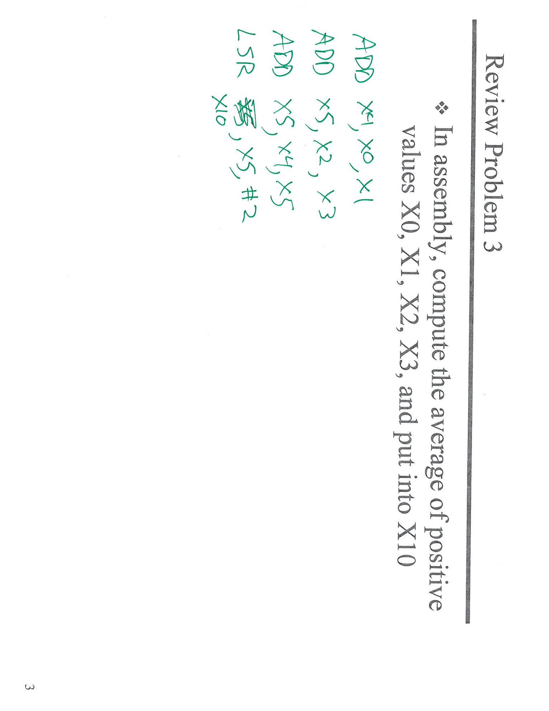
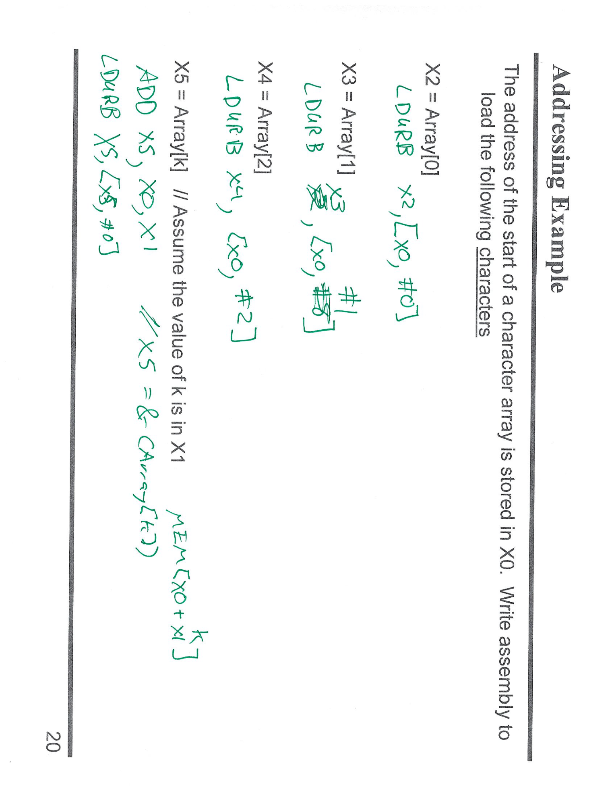
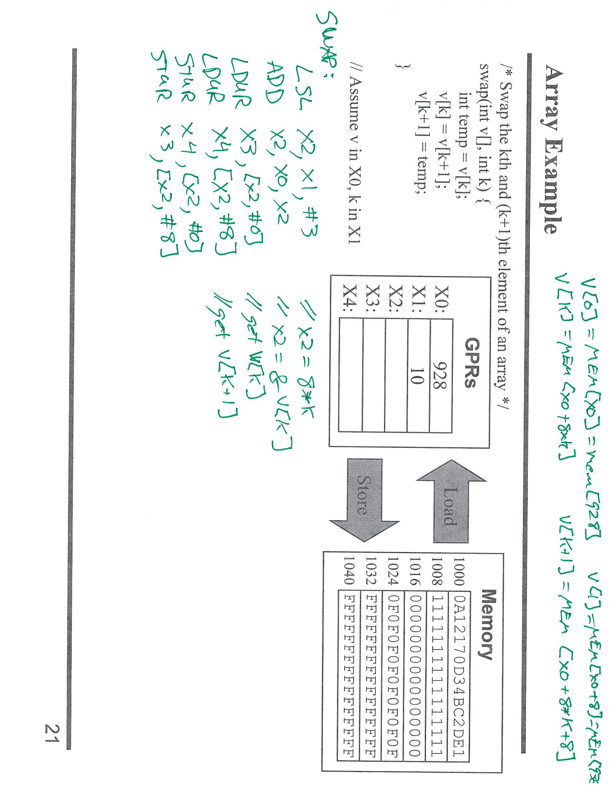
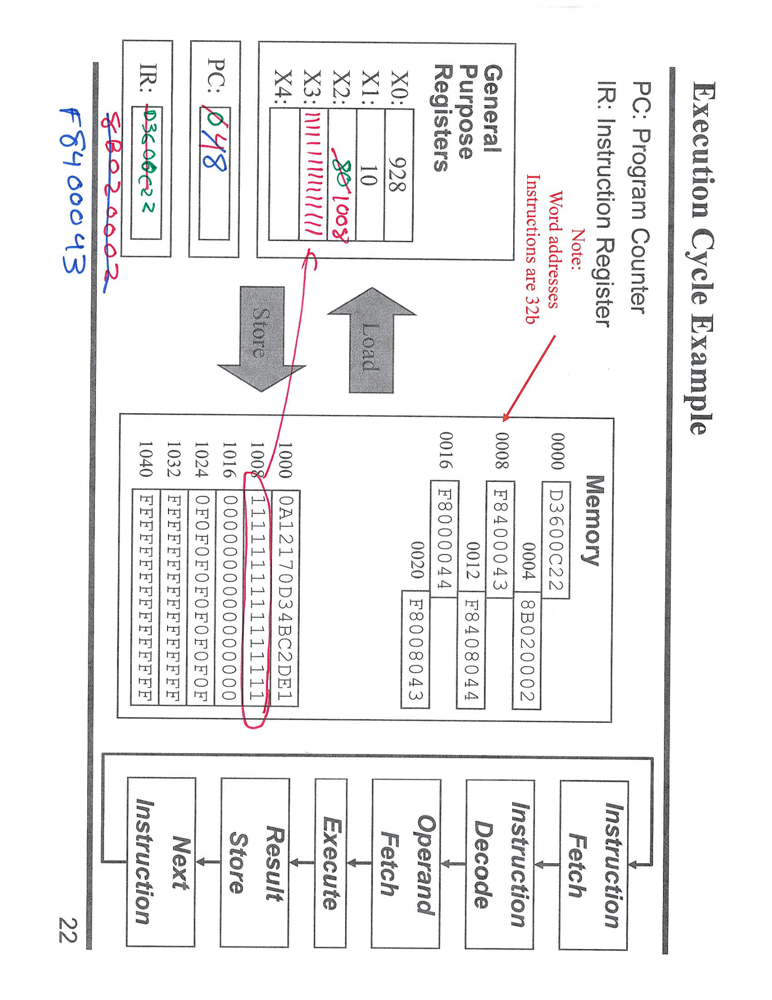
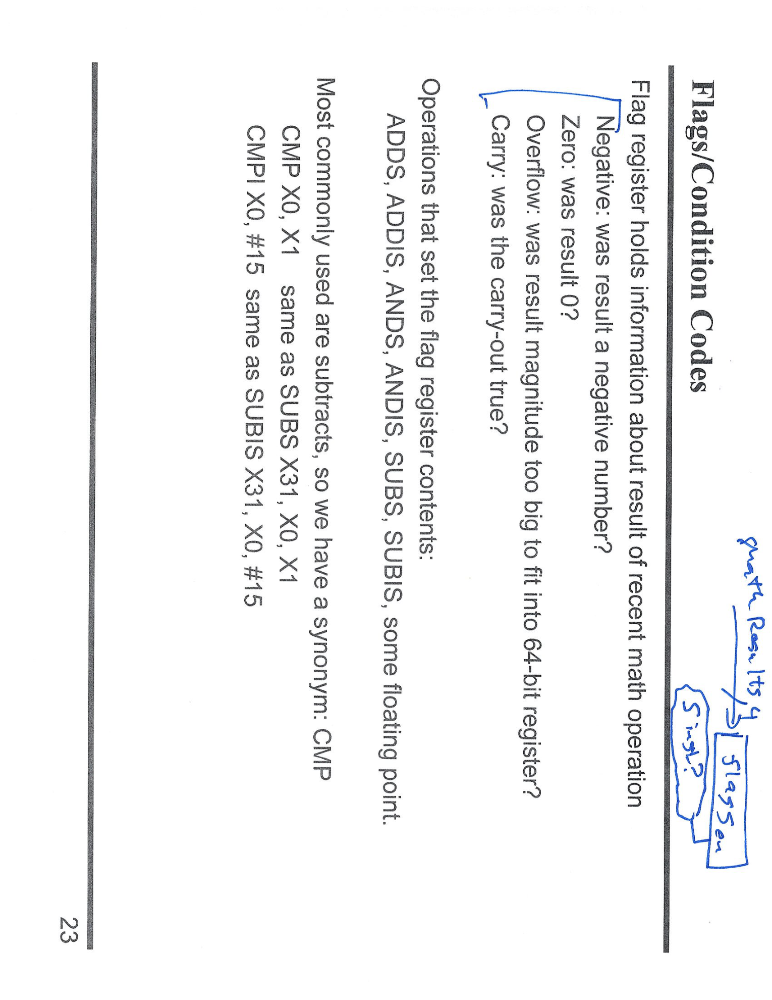

---

## 第 1 页



**提问：** 我现在是一名远程教学老师，需要备课，告诉我这个截图是什么意思并且详细解释，到时候上课我会根据这个回答讲课

下面这页是一个**AArch64（ARM64）汇编复习题**，题目写着：

> 用汇编把寄存器 **X0、X1、X2、X3** 中的**正数**求平均值，并把结果放到 **X10** 里。

绿色手写的是一种“就地求和 + 位移代除”的解法。逐行解释如下（我用通俗中文 + 专业术语方便你上课讲）：

---

### 题目为什么强调“正数”？

* 因为最后一步用了 **LSR**（逻辑右移）来代替“除以 4”。
* 对**正数**来说，逻辑右移 2 位等价于**向下取整的除以 4**（`floor(sum/4)`）；
* 若有**负数**，逻辑右移和算术右移（ASR）对符号位处理不同，结果会错；所以题目限定“positive values”。

---

### 手写代码的含义（逐行）

> （指令格式：`ADD Rd, Rn, Rm` 表示 Rd = Rn + Rm；`LSR Rd, Rn, #imm` 表示 Rd = Rn 逻辑右移 imm 位）

1. `ADD X1, X0, X1`

   * 把前两个数相加：X1 ← X0 + X1
   * **就地更新**X1，作为“部分和 1”。

2. `ADD X5, X2, X3`

   * 把后两个数相加：X5 ← X2 + X3
   * 存到临时寄存器 X5，作为“部分和 2”。

3. `ADD X5, X1, X5`  ←（手写里写成了 **X4**，应为 **X1**，这是一个小笔误）

   * 把两段部分和再相加：X5 ← X1 + X5 = (X0+X1) + (X2+X3)
   * 此时 X5 里就是四个数的**总和**。

4. `LSR X10, X5, #2`

   * 逻辑右移 2 位，相当于 **总和 / 4（向下取整）**：X10 ← X5 >> 2
   * 于是 X10 里就是平均值。

---

### 等价的“伪代码/数学关系”

```text
sum = X0 + X1 + X2 + X3
X10 = sum / 4    （对正数，用 LSR #2 实现，结果向下取整）
```

---

### 课上可补充的要点/易错点

1. **为什么不用除法指令？**

   * ARM64 有 `UDIV/SDIV`，但位移实现“除以常数（2 的幂）”更快更常见。`/4` ⇔ `>> 2`。

2. **舍入方式**

   * 现在的做法是**向下取整**（floor）。如果你想**四舍五入**，在移位前先加偏置：

     * `ADD X5, X5, #2` 然后 `LSR X10, X5, #2`（对正数有效）。

3. **负数的情况**

   * 若允许负数，应该用 **ASR**（算术右移）或直接用 `SDIV`，否则 LSR 会把符号位当作普通位右移，结果错误。

4. **溢出风险**

   * X 寄存器是 64 位无符号/有符号通用寄存器。若四个数非常大，`X0+X1+X2+X3` 可能溢出。教材题一般默认不会溢出，但工程里要考虑。

5. **寄存器复用的取舍**

   * 第 1 行就地把 X1 改成了部分和；如果后续还需要原始 X1，就不该覆盖，可换一个临时寄存器（例如先 `ADD X4, X0, X1`）。

---

### 一版更“教科书式”的写法（加注释，修正笔误）

```asm
    // sum1 = X0 + X1  （保留原值：如不想覆盖，可用 X4 作 sum1）
    ADD     X1, X0, X1

    // sum2 = X2 + X3
    ADD     X5, X2, X3

    // total = sum1 + sum2
    ADD     X5, X1, X5

    // avg = total / 4  （正数场景下，用 LSR #2 等价于 /4 向下取整）
    LSR     X10, X5, #2
```

---

### 上课可用的讲解节奏（建议）

1. **读题 → 抽象成公式**：平均值 = (X0+X1+X2+X3)/4。
2. **寄存器规划**：哪个当部分和、哪个当总和、结果寄存到 X10。
3. **指令语义**：用 `ADD` 做加法累加；为何用 `LSR #2` 替代 `/4`。
4. **正数限定的理由**、**舍入方式**、**负数/溢出/保留原值**等工程细节。
5. **指出笔误**：第 3 行应为 `ADD X5, X1, X5`，不是 `X4`。
6. **小变体**：如果要四舍五入，加偏置后再右移；如含负数，换 ASR 或 SDIV。

这样一页就能把**算法思路、指令含义、细节风险**都讲清楚，学生也能理解为什么“位移可以代替除法”。祝你备课顺利！


---

## 第 2 页



**提问：** 我现在是一名远程教学老师，需要备课，告诉我这个截图是什么意思并且详细解释，到时候上课我会根据这个回答讲课

这页讲的是 **AArch64（ARM64）寻址与装载字节** 的例子。

## 题目原意

> 已知**字符数组（char array）首地址**存放在寄存器 **X0**。请写汇编，把下列元素读出来：
>
> * `Array[0]` 放到 X2
> * `Array[1]` 放到 X3
> * `Array[2]` 放到 X4
> * `Array[k]` 放到 X5，其中 **k 在 X1** 里

因为数组是**字符数组**，每个元素 1 字节，所以要用 **LDRB**（Load Register Byte）按字节读取。LDRB 把内存中的 1 字节**零扩展**到 **W 寄存器**（32 位），并把对应的 X 寄存器高 32 位清零。因此**目的寄存器应写 Wn，而不是 Xn**（教材里手写成 `LDRB Xn` 是常见笔误）。

---

## 指令逐一写法与解释

### 1) 读固定下标：`Array[0]、Array[1]、Array[2]`

* **LDRB 的“基址 + 立即数偏移”寻址**：`[Xbase, #imm]`
  对字节数组，偏移量 #imm 就是下标本身（因为元素大小 1 字节，不需要缩放）。

```asm
// X2 ← Array[0]
LDRB    W2, [X0, #0]

// X3 ← Array[1]
LDRB    W3, [X0, #1]

// X4 ← Array[2]
LDRB    W4, [X0, #2]
```

要点：

* `X0`：数组首地址（base）
* `#0/#1/#2`：字节偏移 = 下标
* `W2/W3/W4`：目标是 **W** 寄存器（零扩展到 32 位，X 寄存器高 32 位被清零）

---

### 2) 读可变下标：`Array[k]`，k 在 X1

有两种**等价**写法，你课上可都展示一下，帮助学生理解寻址模式。

#### 写法 A：先算地址，再按 0 偏移取数

```asm
// X5 = X0 + X1 = &Array[k]
ADD     X5, X0, X1
// W5 ← *(X5) = Array[k]
LDRB    W5, [X5, #0]
```

* 先把元素地址算到 X5（因为是字节数组，下标就是字节偏移）。
* 再从该地址取 1 字节到 W5。

#### 写法 B：寄存器偏移寻址（更“地道”）

```asm
// W5 ← Array[k]   （X1 作为偏移寄存器）
LDRB    W5, [X0, X1]
```

* `LDRB Wt, [Xn, Xm]` 使用**寄存器偏移**；字节访问时不用缩放，**Xm 就是字节偏移**。
* 省了单独的 ADD。

> 备注：ARM64 还有 **前/后递增**寻址（pre/post-index），例如
> `LDRB W2, [X0], #1` 会把 `Array[0]` 读到 W2 **并让 X0 自增 1**；
> 这常用于遍历指针，但本题没有要求。

---

## 课堂讲解要点（建议提纲）

1. **为什么用 LDRB**：因为元素是 1 字节；对比 `LDRH/LDR/LDUR` 的数据宽度与有无扩展。
2. **W 与 X 的关系**：向 Wn 写入会把 Xn 的高 32 位清零（零扩展），演示一次。
3. **寻址模式**：

   * 基址 + 立即数偏移（本题固定下标 0/1/2）
   * 基址 + 寄存器偏移（可变下标 k）
   * 前/后递增（扩展用）
4. **偏移是否需要“×元素大小”**：

   * **字节数组不需要缩放**；
   * 若是 `int`（4 字节）数组，读 `Array[k]` 就要把偏移改为 `k*4`：

     * 要么事先 `LSL X1, X1, #2`；
     * 要么用带移位的寄存器偏移形式。
5. **对齐与异常**：字节访问无需对齐，半字/字/双字访问才可能涉及对齐性能或异常问题。
6. **常见错误**：

   * 写成 `LDRB Xn, [...]`（应为 `Wn`）；
   * 误以为寄存器偏移会自动乘元素大小（只有特定形式才会隐式缩放）。

---

## 汇总代码（可直接投屏讲解）

```asm
// Base: X0 = &Array[0]

// 固定下标
LDRB    W2, [X0, #0]     // X2 <- Array[0]
LDRB    W3, [X0, #1]     // X3 <- Array[1]
LDRB    W4, [X0, #2]     // X4 <- Array[2]

// 可变下标（k 在 X1），任选其一：

// A) 先算地址
ADD     X5, X0, X1
LDRB    W5, [X5, #0]

// B) 寄存器偏移
// LDRB  W5, [X0, X1]
```

讲到这里，学生应能：

* 看懂 `Array[i]` 在字节数组中的**地址等价**就是 `[X0, #i]`；
* 知道 **LDRB → W 寄存器**、**偏移未缩放** 的关键点；
* 会根据元素大小选择正确的偏移与寻址形式。


---

## 第 3 页



**提问：** 我现在是一名远程教学老师，需要备课，告诉我这个截图是什么意思并且详细解释，到时候上课我会根据这个回答讲课

这页是 **AArch64（ARM64）数组寻址与元素交换（swap）** 的例题。

# 题目要做什么

右上角的 C 伪代码是：

```c
// 交换数组 v 的第 k 个与第 k+1 个元素
void swap(v, int k) {
    int temp = v[k];
    v[k]   = v[k+1];
    v[k+1] = temp;
}
```

下方内存图的地址以 **8 字节递增**（1000, 1008, 1016, …），表明**每个元素是 8 字节（64 位）**。题面注明：**v 的首地址在 X0，k 在 X1**。

# 解题思路

1. 先把 **下标 k → 字节偏移**：因为元素 8 字节，所以 *offset = k × 8*。
2. 计算 **\&v\[k] = X0 + offset**。
3. 读出 **v\[k]** 与 **v\[k+1]**，完成交换，再分别写回。

# 标准汇编（注释清晰，课上可直接讲）

> 这里用 **LDUR/STUR（非缩放寻址）**，偏移量就是“字节偏移”，与内存图一致，便于学生理解。

```asm
// 输入：X0 = &v[0]（数组首地址），X1 = k
// 目标：交换 v[k] 和 v[k+1]

    LSL     X2, X1, #3        // X2 = k << 3 = k*8（把下标变成字节偏移）
    ADD     X2, X0, X2        // X2 = &v[k]      （基址 + 偏移）

    LDUR    X3, [X2, #0]      // X3 = v[k]
    LDUR    X4, [X2, #8]      // X4 = v[k+1]     （下一个元素地址 = 当前 + 8）

    STUR    X4, [X2, #0]      // v[k]   = 原 v[k+1]
    STUR    X3, [X2, #8]      // v[k+1] = 原 v[k]
```

> 注：用 **LDUR/STUR** 是“非缩放（unscaled）”形式，括号内的 `#0/#8` 就是**字节数**；这与内存图 1000→1008→1016 完全对应。

# 可拓展/对比写法（帮学生理解寻址模式）

AArch64 还有 **缩放（scaled）** 形式的 `LDR/STR`，它的立即数字段会**按数据宽度自动乘**。对 64 位数据（8 字节）：

* 要访问 `v[k]`：`LDR X3, [X2, #0]`
* 要访问 `v[k+1]`：**不是 `#8`，而是 `#1`**（表示“再跨 1 个 8 字节元素”）

```asm
    // 等价于上面两条 LDUR
    LDR     X3, [X2, #0]      // #0 → 0 * 8 字节
    LDR     X4, [X2, #1]      // #1 → 1 * 8 字节（自动乘 8）
    STR     X4, [X2, #0]
    STR     X3, [X2, #1]
```

课堂提示学生：**scaled 和 unscaled 的立即数含义不同**，是常见易错点。

# 为什么先 LSL #3

* 64 位元素大小 = 8 字节 = 2³，所以 `k * 8` 等价于 `k << 3`（`LSL #3`）。
* 若元素是 4 字节（int），就用 `LSL #2`；若是 1 字节（char），则**不用左移**。

# 与图中手写一致处

绿色手写步骤等价于上面的“unscaled 版”：

* `LSL X2, X1, #3` → 计算字节偏移
* `ADD X2, X0, X2` → 得到 `&v[k]`
* `LDUR X3, [X2, #0]`、`LDUR X4, [X2, #8]` → 取 `v[k]` 与 `v[k+1]`
* `STUR X4, [X2, #0]`、`STUR X3, [X2, #8]` → 交换写回

# 课堂可强调的检查点/易错点

* **元素大小决定偏移**：8 字节元素相邻地址差 8。
* **scaled vs unscaled**：

  * `LDUR/STUR [base, #byte_offset]` → 偏移是**字节**；
  * `LDR/STR [base, #imm]`（无符号立即数形式）→ 偏移会**按元素大小自动缩放**（对 64 位，`#1`=8 字节）。
* **寄存器宽度要匹配**：读/写 64 位元素用 **X 寄存器**；读/写字节才用 `LDRB/W`。
* **对齐**：64 位访问按 8 字节对齐性能最佳；题目内存图已按 8 对齐。
* **不覆盖输入**：X0/X1 作输入，临时用 X2–X4。

用这套讲解，学生能把 C 中的 `v[k]` 映射到 **基址 + 偏移** 的地址计算，理解两种寻址形式，清楚交换的完整读-写流程。


---

## 第 4 页



**提问：** 我现在是一名远程教学老师，需要备课，告诉我这个截图是什么意思并且详细解释，到时候上课我会根据这个回答讲课

这页是一个 **AArch64（ARM64）处理器“取指→译码→执行”执行周期示例**。它把你前一页数组例题里的那段“按地址加载/存储”的汇编，放进一个**时序视角**来讲：指令如何从内存被取出、如何计算有效地址、如何访问数据存储器、最后如何把结果写回寄存器或内存。

---

# 版面各区块在讲什么

* **PC（Program Counter）**：程序计数器，指向**下一条指令**的地址。ARM64 每条指令固定 32 位（4 字节），所以**取完一条后 PC += 4**。图上 PC 初值（手写标起来）对应左下“Memory”里某个 4 字节对齐地址（如 `0x0008/0x000C/...`）。

* **IR（Instruction Register）**：指令寄存器。取指阶段把内存里 4 字节的机器码读到 IR（图中用 16 进制表示，如你看到的 `F8400043`、`F8408044` 等），下一周期在“译码”里用它产生控制信号。

  > 注：这些机器码就对应我们之前写的指令，比如
  > `LSL X2, X1, #3`、`ADD X2, X0, X2`、`LDR X3, [X2]`、`LDR X4, [X2, #8]`、`STUR X4, [X2]`、`STUR X3, [X2, #8]` 之类。

* **General Purpose Registers（通用寄存器）**：给出某一时刻的寄存器快照。图里示意：

  * `X0 = 928`（数组 `v` 的首地址），
  * `X1 = 10`（下标 `k`），
  * `X2` 在执行地址计算后会等于 **1008**（也就是 `&v[k]`，因为 64 位元素 8 字节：`k*8 = 10*8 = 80`，`928+80=1008`），
  * 其他寄存器（`X3/X4`）用于暂存 `v[k]`、`v[k+1]` 等。

* **Memory（内存）**：右下“Memory”分两块含义：

  1. **上半部分**（地址 0000、0004、0008、…）放**指令**，每条 4 字节（图旁红字提示 “Instructions are 32b”）。
  2. **下半部分**（地址 1000、1008、1016、…）放**数据**（数组元素）。你看到每 8 字节对齐的地址，对应 64 位整型元素（与上一页一致）。图上圈出的 1008 就是要被 `LDR` 访问的元素位置。

* **底部流程框**：`Instruction Fetch → Instruction Decode → Operand Fetch → Execute → Result Store → Next Instruction`
  说明一条指令在**流水**中的典型阶段（教材把内存访问拆到“操作数取数/写回”视角来讲）。

---

# 把一条 `LDR X3, [X2]` 放进 6 个阶段演示（与图线条对得上）

以加载 `v[k]` 的那条为例（此时 `X2 = 1008`）：

1. **Instruction Fetch（取指）**

   * 用 PC 作为指令地址，从“指令区”读 4 字节机器码到 **IR**。
   * **PC += 4**，指向下一条。
   * 图中 IR 左侧方框里会显示类似 `F8400043` 这样的 16 进制编码（仅示意）。

2. **Instruction Decode（指令译码）**

   * 控制器查看 **IR**，识别出是 **LDR（64 位）**、基址寄存器= `X2`、偏移= `#0`。
   * 同时读寄存器堆拿到 `X2` 的值（1008）。

3. **Operand Fetch（操作数取数/有效地址计算）**

   * 把 `X2 + 偏移` 送到地址生成单元（ALU 也可承担），得到**有效地址 EA = 1008**。
   * 若指令需要从数据存储器读，这里会发起一次**数据读请求**（图中“Load”箭头由内存下半区指向寄存器）。

4. **Execute（执行）**

   * 对加载指令来说，算术逻辑已在上一步完成；此步等数据存储器把**地址 1008 的 8 字节**送回“内存数据寄存器”（示意），准备写回。

5. **Result Store（结果写回）**

   * 把取回的数据写入 **X3**。于是 `X3 = v[k]`。
   * 如果是 `ADD` 这样的算术指令，则把 ALU 结果写回目标寄存器；如果是 `STR` 指令，这一步是**把寄存器里的值写进内存**（图中“Store”箭头）。

6. **Next Instruction（下一条）**

   * 由于 PC 已经自增到下一条的地址（如 `+4`），流水进入下一次取指。
   * 对应你在图上看到的“下一条 IR 变为 F8408044（示例）”，那条就是 `LDR X4, [X2, #8]`，去读 `v[k+1]`。

---

# 和上一页“交换 v\[k] 与 v\[k+1]”如何对齐

* **地址计算**：

  * `LSL X2, X1, #3` → `X2 = k*8`（元素 8 字节）
  * `ADD X2, X0, X2` → `X2 = &v[k] = 928 + 80 = 1008`

* **两次加载**：

  * `LDR X3, [X2]` 取 `v[k]`（地址 1008）
  * `LDR X4, [X2, #8]` 取 `v[k+1]`（地址 1016）

* **两次存回**：

  * `STR/STUR X4, [X2]` 把 `v[k+1]` 写到 `v[k]` 位置（1008）
  * `STR/STUR X3, [X2, #8]` 把 `v[k]` 写到 `v[k+1]` 位置（1016）

图里的红圈、红箭头正是强调：

* 指令在**高地址区（0000 起，按 4 字节步进）**；
* 数据在**另一段地址区（1000 起，按 8 字节步进）**；
* **取指**和**取数/存数**是两类不同的内存访问；
* PC 每次\*\*+4\*\*，而数组相邻元素地址\*\*+8\*\*（因为 64 位）。

---

# 课堂可强调的“检查点”

1. **指令固定 32 位** ⇒ PC 每条递增 4；而**数据宽度决定数据区的步幅**（本例 8 字节）。
2. **IR 的作用**：取回来的机器码在 IR，下一拍译码；用它决定需要读哪些寄存器、是否访问数据存储器。
3. **有效地址 EA**：对 `LDR/STR`，EA = 基址寄存器 + 偏移（立即数或寄存器）；本例偏移 0 与 8。
4. **Load vs Store 的“结果写回”差异**：Load 写回寄存器；Store 写回内存。
5. **流水概念**：教材用“取指→译码→操作数→执行→写回→下一条”描述的是单步顺序；实际硬件会**重叠**这些阶段形成流水，但时序逻辑一致。

---

# 一段可直接投屏的“口述脚本”

* “PC 指向 0x0008，我们从指令存储器读 4 字节到 IR，PC 加 4。IR 译码发现是 `LDR X3, [X2]`。
  读取寄存器 `X2=1008`，形成有效地址 1008，到数据存储器把 8 字节读回来，写回 `X3`。
  下一条取指后 IR 变成 `LDR X4, [X2, #8]`，地址 1016。
  再下一条是 `STR`，把刚才读到的数按交换逻辑写回数据区。
  这就把前一页的交换程序，放到处理器的流水视角里跑了一遍。”

讲完这页，学生会把“**机器码↔汇编↔流水阶段↔PC/IR变化↔内存访问**”串起来理解。


---

## 第 5 页



**提问：** 我现在是一名远程教学老师，需要备课，告诉我这个截图是什么意思并且详细解释，到时候上课我会根据这个回答讲课

这页在讲 **AArch64（ARM64）的标志寄存器/条件码（NZCV）**：算术或逻辑指令执行后，会在“程序状态寄存器”里更新 4 个标志位，用来做 **条件跳转/条件选择**。

---

# 1) 四个标志位含义（NZCV）

* **N (Negative)**：结果是否为**负数**（对 W/X 有符号视角；N=结果的最高位）。
* **Z (Zero)**：结果是否为 **0**。
* **C (Carry)**：**进位/借位**标志。

  * 加法：是否产生了**进位**（反映**无符号**溢出）。
  * 减法：C=1 表示**没有借位**（即“被减数 ≥ 减数”在**无符号**意义下）。
* **V (oVerflow)**：**有符号**溢出。

  * 例如 `0x7FFF...FFF + 1` 变为负数时，V=1。

> 口诀（讲课好记）：**Z 看零，N 看符号，C 看无符号，V 看有符号**。

---

# 2) 谁会“更新标志位”（结尾带 **S** 的指令）

这些指令的 **S 结尾**表示“**Set flags**”：

* **ADDS / ADDIS**（加法，立即数版本叫 ADDS(imm)，带 12 位移位别名是 **ADDIS**）
* **SUBS / SUBIS**（减法，SUBS(imm) 的移位别名 **SUBIS**）
* **ANDS / ANDIS**（按位与并置位；ANDS(imm) 的移位别名 **ANDIS**）
* 以及部分**浮点比较**会影响条件分支使用的标志（本课以整数为主）。

> 不带 S 的（ADD、SUB、AND…）**不改** NZCV。

---

# 3) 常用“比较”指令其实就是带 S 的减法/加法别名

* **CMP Xd, Rn**：等价于 `SUBS XZR, Xd, Rn`（结果丢进零寄存器 XZR，但**只要标志**）。
* **CMP Xd, #imm**：等价于 `SUBS XZR, Xd, #imm`。
* **CMN Xd, Rn**：等价于 `ADDS XZR, Xd, Rn`（少见）。
* **TST Xd, mask**：等价于 `ANDS XZR, Xd, mask`（测试某些位是否为 1）。

---

# 4) 条件码与分支（挑最常用的）

* **B.EQ / B.NE**：Z=1 / Z=0（相等/不等）
* **B.GE / B.LT**（**有符号**）

  * GE：N==V
  * LT：N!=V
* **B.GT / B.LE**（**有符号**）

  * GT：Z=0 且 N==V
  * LE：Z=1 或 N!=V
* **B.HS / B.LO**（**无符号**，别名 CS/CC）

  * HS/CS：C=1（higher or same）
  * LO/CC：C=0（lower）
* **B.HI / B.LS**（**无符号**）

  * HI：C=1 且 Z=0
  * LS：C=0 或 Z=1

> 记忆：**有符号**看 **N、V** 的组合；**无符号**看 **C、Z**。

---

# 5) 小例子（课堂可直接演示）

### 5.1 比较并分支（有符号比较）

```asm
CMP     X0, X1          // SUBS XZR, X0, X1
B.GE    label_ge         // 如果 X0 >= X1（有符号）跳转
B.LT    label_lt
```

* `CMP` 设置 NZCV；`B.GE` 由 **N==V** 判定。

### 5.2 计数循环（用 SUBS 设置 Z）

```asm
MOV     X2, #10
loop:
SUBS    X2, X2, #1       // 结果写回并置位
B.NE    loop             // Z=0 继续；Z=1（减到0）退出
```

### 5.3 按位测试（TST/ANDS）

```asm
TST     X3, #0b1         // 低位是否为1？
B.NE    odd              // 若结果非零（Z=0），则为奇数
```

### 5.4 区分 C 与 V

* `0xFFFF_FFFF_FFFF_FFFF + 1`：**C=1（无符号溢出）**，**V=0**（视为 -1+1=0，不是有符号溢出）。
* `0x7FFF_FFFF_FFFF_FFFF + 1`：**V=1（有符号溢出）**，C 取决于进位但对有符号比较没用。

---

# 6) 容易踩坑

1. **用错有符号/无符号条件**：

   * 比大小前先想清楚是**有符号**（GE/GT/LE/LT）还是**无符号**（HS/HI/LS/LO）。
2. **以为 ADD/SUB 会置位**：只有 **ADDS/SUBS**（带 S）才更新 NZCV。
3. **把 CMP 当成“产生结果”**：CMP 只改标志，不保存数值。
4. **借位方向**：对减法，**C=1 表示“无借位”（无符号 ≥）**，这是 ARM 传统定义，初学者最容易反着记。

---

# 7) 一段整合示例

```asm
// if (x <= y) x = y - x;
CMP     X0, X1           // 设置 NZCV
B.GT    done             // 若 X0 > X1（有符号），跳过
SUB     X0, X1, X0       // 不需要置位，仅计算
done:
```

讲完以上内容，学生应能：

* 知道 **NZCV** 四位的语义与区分“有符号/无符号”的用法；
* 知道**哪些指令会更新标志**（S 结尾、CMP/TST 等别名）；
* 能根据需求选择正确的 **B.cond** 条件分支，写出常见的比较、循环与位测试代码。


---

## 第 6 页


**提问：** 我现在是一名远程教学老师，需要备课，告诉我这个截图是什么意思并且详细解释，到时候上课我会根据这个回答讲课

这页在讲 **ARMv8-A（AArch64）里的控制流（Control Flow）**：
如何**无条件跳转**、**按条件跳转**，以及**比较并分支**的几种常见写法。图上还配了一个小例子：把 C 语言里的 `if/else` 翻译成汇编。

---

# 1) 无条件跳转（Unconditional Branch）

* `B label`
  直接把 **PC** 设为 `label` 的地址，继续从那里执行。相当于 C 的 `goto label;`
* `BR Xn`
  跳到寄存器 **Xn** 指定的地址（常见于函数返回：`BR X30`；因为 `X30` 是链接寄存器 LR，存放返回地址）。

> 课堂记法：**B** 跳**常量地址**，**BR** 跳**寄存器里的地址**。

---

# 2) 条件跳转（Conditional Branch）

有两大类：

## 2.1 直接测试“是否为 0”的分支（**不用先置标志位**）

* `CBZ Xd, label`：如果 `Xd == 0` 就跳。
* `CBNZ Xd, label`：如果 `Xd != 0` 就跳。

> 适合“判空”“循环计数归零”等，不需要先 `CMP`。

## 2.2 基于 **NZCV 标志位** 的分支（需要先比较）

* 先用 **会置位**的指令（`CMP/CMN/TST/ADDS/SUBS/ANDS …`）设置 **NZCV**；
* 再用 `B.cond label` 执行有条件跳转。常用条件（有/无符号要分清）：

| 条件码           | 语义（有符号）        | 语义（无符号）      |
| ------------- | -------------- | ------------ |
| `B.EQ`        | 相等（Z=1）        | —            |
| `B.NE`        | 不等（Z=0）        | —            |
| `B.GE`        | ≥ （N==V）       | —            |
| `B.GT`        | > （Z=0 且 N==V） | —            |
| `B.LE`        | ≤ （Z=1 或 N!=V） | —            |
| `B.LT`        | < （N!=V）       | —            |
| `B.HS`/`B.CS` | —              | ≥（C=1）       |
| `B.HI`        | —              | >（C=1 且 Z=0） |
| `B.LS`        | —              | ≤（C=0 或 Z=1） |
| `B.LO`/`B.CC` | —              | <（C=0）       |

> `CMP X0, X1` 等价 `SUBS XZR, X0, X1`，**只要标志不留结果**。
> `CMP X0, #12` 则与立即数比。

---

# 3) 两种比较写法

* **两寄存器比较**：`CMP X0, X1` → 后接 `B.<cond>`
* **寄存器与立即数**：`CMP X0, #12` → 后接 `B.<cond>`

---

# 4) 把 `if/else` 翻译成汇编（与图中绿色标注对应）

示例 C 代码：

```c
if (a == b)
    a = a + 3;
else
    b = b + 7;
c = a + b;
```

假设：`a` 在 `X0`，`b` 在 `X1`，`c` 放到 `X2`。

## 4.1 直译版（有 IF 和 ELSE 两段）

```asm
CMP     X0, X1           // 比较 a 与 b，置 NZCV
B.NE    ELSE             // 如果 a != b，跳到 ELSE

// IF: a == b
ADD     X0, X0, #3       // a = a + 3
B       DONE             // 跳过 ELSE

ELSE:
ADD     X1, X1, #7       // b = b + 7

DONE:
ADD     X2, X0, X1       // c = a + b
```

要点：

* `CMP` 设置标志；
* `B.NE` 决定是否执行 ELSE；
* 结束时统一落到 `DONE` 做汇总。

## 4.2 “避免 else 落空”的常见等价写法（只在不相等时执行 ELSE）

```asm
CMP     X0, X1           // a 与 b
B.EQ    SKIP_ELSE        // 若相等，跳过下面这句
ADD     X1, X1, #7       // (仅 a!=b 时) b = b + 7
SKIP_ELSE:
ADD     X2, X0, X1       // c = a + b
```

如果 `a==b`，就不执行修改 `b` 的那句；若 `a!=b`，就执行一次 `ADD`。
（这种结构与图上“avoid else” 的注释一致。）

> 课堂补充：还可以用 **条件选择**（`CSEL`）把分支消掉，但这页重点是分支指令，不展开。

---

# 5) 再看 **CBZ/CBNZ** 的快速用法

如果条件刚好是“是否为 0”，可以省掉 `CMP`：

```asm
CBZ     X3, IS_ZERO      // if (x3 == 0) goto IS_ZERO;
CBNZ    X4, NOT_ZERO     // if (x4 != 0) goto NOT_ZERO;
```

---

# 6) 易错点提醒（上课务必强调）

1. **比较后用对的条件**：有符号大小（`GE, GT, LE, LT`）与无符号大小（`HS, HI, LS, LO`）不要混。
2. **记得先置位**：`B.cond` 之前，必须有会更新 NZCV 的指令（`CMP/SUBS/ADDS/ANDS…`）。
3. **分支落点**：写 `B.EQ label` 时，想清楚“**相等走哪里，不等走哪里**”，画出控制流更稳。
4. **立即数比较**：`CMP X0, #imm` 是合法且高效的，不必先装进寄存器。

---

# 7) 一段可直接口播的小结

> “无条件跳转用 `B`，跳寄存器地址用 `BR`。条件跳转有两类：`CBZ/CBNZ` 直接看寄存器是否为 0；其他情况先 `CMP` 设置 NZCV，再用 `B.EQ/B.NE/B.GT…`。
> 比如 `if (a==b) a+=3; else b+=7;`：`CMP X0,X1; B.NE ELSE; ADD X0,X0,#3; B DONE; ELSE: ADD X1,X1,#7; DONE: ADD X2,X0,X1`。
> 记住：有符号比较看 `N、V` 组合；无符号比较看 `C、Z`。这样写控制流就不容易错。”
