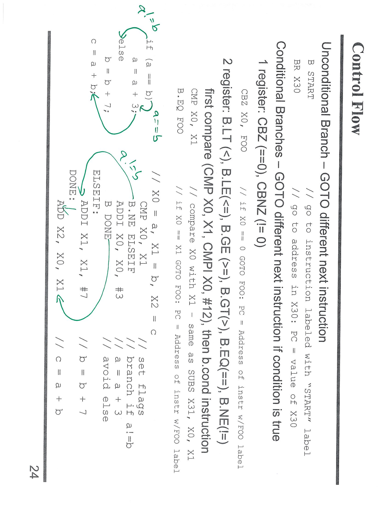

---

## 第 1 页

**提问：** 这张截图里的内容是什么意思？请面向初学者详细解释，分点讲清楚。

这张截图的内容是一个汇编语言的练习题，题目要求计算一些数值的平均值并将结果存储在寄存器 `X10` 中。下面我将为你详细解释每一部分的意思。

### 1. **题目说明**

题目要求使用汇编语言计算4个寄存器（`X0`，`X1`，`X2`，`X3`）中正数的平均值，并将结果存入寄存器 `X10`。

* `X0`, `X1`, `X2`, `X3` 是存储数据的寄存器。
* `X10` 是用来存储计算结果的寄存器。

### 2. **汇编指令**

截图中的指令是用来进行计算的，下面我逐行解释它们的含义。

#### **ADD X5, X1, X0**

这条指令将寄存器 `X0` 和 `X1` 中的值相加，并将结果存储在 `X5` 中。`ADD` 表示加法操作，`X5` 是目标寄存器，`X1` 和 `X0` 是源寄存器。

#### **ADD X5, X5, X2**

这条指令将寄存器 `X5` 中的值（之前计算的 `X1 + X0`）与寄存器 `X2` 中的值相加，并将结果再次存储在 `X5` 中。

#### **ADD X5, X5, X3**

这条指令将寄存器 `X5` 中的值（之前计算的 `X1 + X0 + X2`）与寄存器 `X3` 中的值相加，并将结果再次存储在 `X5` 中。

#### **LSR X5, X5, #2**

这条指令是执行逻辑右移操作（LSR，Logical Shift Right）。它将 `X5` 中的值右移2位，相当于将结果除以4。这一步是为了计算平均值，因为有4个数需要相加并取平均。`#2` 表示右移2位。

#### **MOV X10, X5**

这条指令将寄存器 `X5` 中的值（即计算的平均值）存储到寄存器 `X10` 中，最终得到的平均值保存在 `X10` 中。

### 3. **总结**

* 首先，`X0`，`X1`，`X2`，`X3` 中的数值被相加。
* 然后，将结果右移两位，得到这4个数值的平均值。
* 最后，结果存储在 `X10` 中。

这段汇编代码实现了一个简单的平均值计算。

---

## 第 2 页

**提问：** 这张截图里的内容是什么意思？请面向初学者详细解释，分点讲清楚。

[media pointer="file-service://file-9K7oNVVg7qs64pJPJHeWp4"]
这张截图里的内容是什么意思？请面向初学者详细解释，分点讲清楚。

---

## 第 3 页

**提问：** 这张截图里的内容是什么意思？请面向初学者详细解释，分点讲清楚。

[media pointer="file-service://file-3wmihtFHHCDseRirRYKC2t"]
这张截图里的内容是什么意思？请面向初学者详细解释，分点讲清楚。

---

## 第 4 页

**提问：** 这张截图里的内容是什么意思？请面向初学者详细解释，分点讲清楚。

[media pointer="file-service://file-TFiz1tH9RHQsNcWYzPy9x2"]
这张截图里的内容是什么意思？请面向初学者详细解释，分点讲清楚。

---

## 第 5 页

**提问：** 这张截图里的内容是什么意思？请面向初学者详细解释，分点讲清楚。

[media pointer="file-service://file-2U3BQ67cfud4GigPEaGnMV"]
这张截图里的内容是什么意思？请面向初学者详细解释，分点讲清楚。

---

## 第 6 页

**提问：** 这张截图里的内容是什么意思？请面向初学者详细解释，分点讲清楚。

[media pointer="file-service://file-QUBZT5c8cMujkJswQCRoCg"]
这张截图里的内容是什么意思？请面向初学者详细解释，分点讲清楚。
