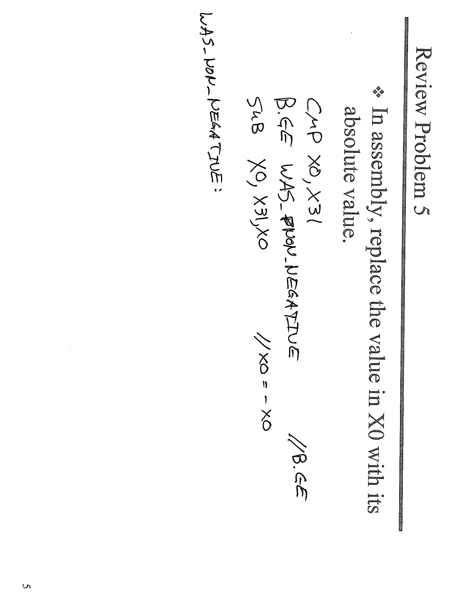
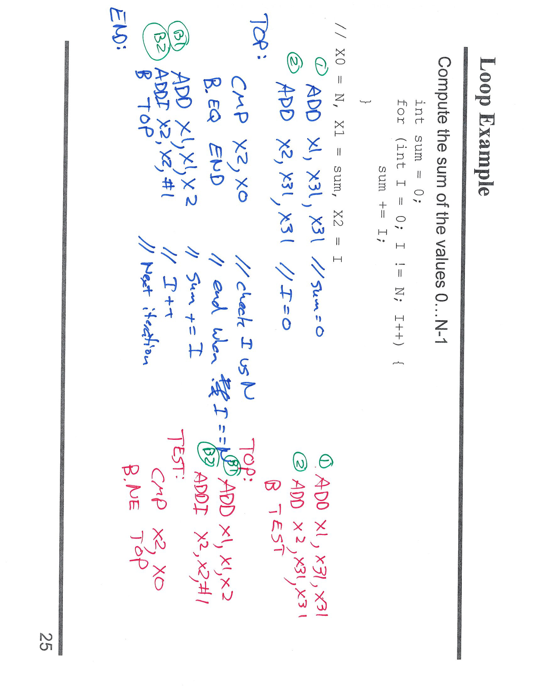
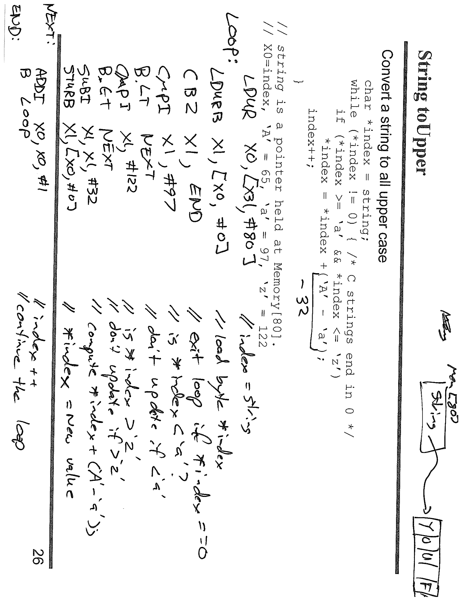
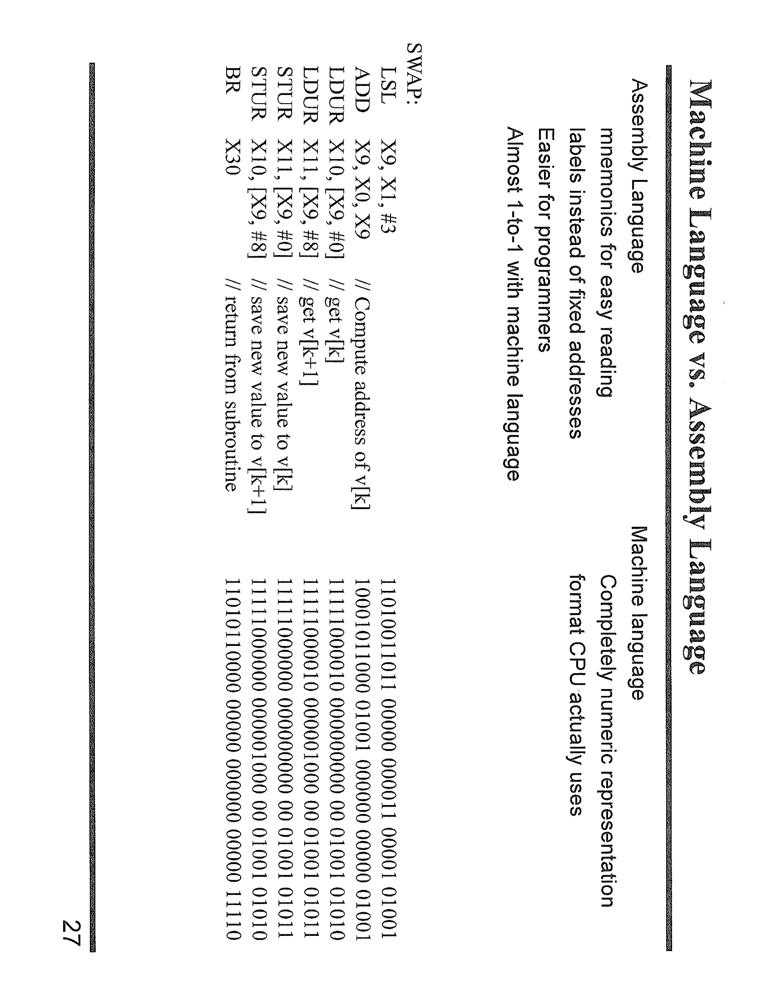

---

## 第 1 页



# 面试式讲解

## 题意

把寄存器 **X0** 里的有符号整数替换为它的**绝对值**（`abs(x0)`）。

## 代码（AArch64）

```
CMP     X0, X31          // X31 在这里是零寄存器 XZR，等价于比较 X0 与 0
B.GE    WAS_NON_NEGATIVE // 若 X0 ≥ 0（有符号比较），跳到“已非负”分支
SUB     X0, X31, X0      // X0 = 0 - X0，把负数取反 => 变为正数
WAS_NON_NEGATIVE:        // 结束；若原本 ≥0，就什么都不做
```

## 关键点解释

1. **X31 的角色**
在算术/比较里，`X31` 表示 **零寄存器 XZR**，其值恒为 0（不是可写的普通寄存器，不是 SP）。

2. **CMP 的效果**
`CMP X0, X31` 实质是做 `X0 - 0`，仅**设置条件码**（N/Z/C/V），不写回结果。

* `B.GE` 使用**有符号**比较（Greater or Equal）：当 `X0 ≥ 0` 时跳转。

3. **为何能得到绝对值**

* 若 `X0 ≥ 0`：直接跳过，不改动。
* 若 `X0 < 0`：执行 `SUB X0, X31, X0`，即 `X0 = 0 - X0 = -X0`，把负数取正。

4. **有符号/无符号的选择**
必须用**有符号条件码**（`GE`/`LT`）。若误用无符号（`HS`/`LO`），对负数判断会错。

## 注意事项（边界）

* 两补码下，`INT64_MIN = -2^63` 的相反数不可表示（会溢出并按模 2^64 回绕）。
大多数课堂题目忽略这个溢出；若需要“饱和绝对值”，要用额外的检测/饱和指令处理。

## 更简洁的等价写法（推荐记忆）

用条件取反指令可免分支：

```
CMP   X0, XZR          // 比较 X0 与 0
CNEG  X0, X0, LT       // 若 X0 < 0 则 X0 = -X0，否则保持不变
```

`CNEG` 根据条件（这里 `LT`）对源寄存器做取反，常用于实现 `abs()`。


---

## 第 2 页



# 面试式讲解：Loop Example

## 题意

把 C 代码

```c
int sum = 0;
for (int i = 0; i != N; i++) {
sum += i;
}
```

翻译成 AArch64 汇编。约定：`X0=N`，`X1=sum`，`X2=i`。

---

## 关键指令与含义

* **X31 = XZR**：零寄存器，恒为 0。
`ADD X1, X31, X31` ⇒ `sum=0`；`ADD X2, X31, X31` ⇒ `i=0`。
* `CMP X2, X0`：比较 `i` 与 `N`（本质是 `X2 - X0`，只改标志位）。
* 条件跳转：

* `B.EQ END`：当 `i == N` 时跳出循环。
* `B.NE TOP`：当 `i != N` 时继续循环。
* `ADD X1, X1, X2`：执行 `sum += i`。
* `ADDI X2, X2, #1`（或 `ADD X2, X2, #1`）：`i++`。
* `B TOP`：无条件回到循环测试或体。

---

## 两种等价写法（图中蓝/红两版）

### 版本 A（蓝字：先测后进）

```asm
// 初始化
ADD   X1, X31, X31   // sum = 0
ADD   X2, X31, X31   // i = 0
TOP:
CMP   X2, X0         // if (i == N)
B.EQ  END            //   break;
ADD   X1, X1, X2     // sum += i;
ADDI  X2, X2, #1     // i++;
B     TOP            // 下一轮
END:
```

* 先比较 `i` 与 `N`，相等则退出；否则执行一次循环体。

### 版本 B（红字：先做再测）

```asm
// 初始化
ADD   X1, X31, X31   // sum = 0
ADD   X2, X31, X31   // i = 0
TOP:
ADD   X1, X1, X2     // sum += i;
ADDI  X2, X2, #1     // i++;
B     TEST
TEST:
CMP   X2, X0
B.NE  TOP            // i != N 时继续
// 落到此处即结束
```

* 把“测试”单独放在 `TEST`，用相反条件 `B.NE` 回到 `TOP`。逻辑与版本 A 相同。

---

## 正确性与边界

* 循环条件是 **`i != N`**，因此累加范围为 **0 … (N-1)**。
* 默认假设 **N ≥ 0**。若 `N < 0`，`i` 从 0 递增永远不会等于负数，会导致死循环；真实程序应在入参处约束或改用 `i < N` 的比较（如 `CMP; B.GE END`）。

---

## 读图小贴士

* 绿色圈出的 `①`、`②` 是两处初始化：
`① sum=0`，`② i=0`（均用 XZR）。
* 旁注 “check i end when i==N / Next iteration” 对应 `CMP/BEQ` 与 `ADDI/B TOP`。
* 红色“TEST”块是把比较放到循环尾，用 `B.NE` 形成**后测试**循环。

这样就把图里的每一行都对上了：初始化 → 比较/跳转 → 体内求和 → 自增 → 回跳/结束。


---

## 第 3 页



# 面试式讲解：把字符串全转为大写（AArch64）

## 题意

把以 **0 结尾** 的 C 字符串改为全大写。
C 版原型（图右侧）：

```c
char *index = string;         // X0 = index(string 首地址)
while (*index != 0) {         // 以 0 结尾的 C 字符串
if (*index >= 'a' && *index <= 'z')
*index = *index - ('a' - 'A');   // 即减去 32
index++;
}
```

ASCII：`'a' = 97`，`'z' = 122`，`'a' - 'A' = 32`。

---

## 汇编思路与寄存器约定

* **X0**：指针 `index`（指向当前字符）
* **W1**：装载的当前字符（8 位扩展到 32 位）
* **X31**：零寄存器 XZR（恒为 0）

> 注意：**按字节操作用 W 寄存器**（`LDRB/STRB` 的目标/源应是 `Wn`），图上写 `X1` 只是手写简记，正确写法是 `W1`。

---

## 逐行解释（等价写法）

```asm
// 入口：X0 = 字符串首地址 index
LOOP:
LDRB    W1, [X0]          // 读一个字节：W1 = *index
CBZ     W1, END           // 若 *index == 0（字符串结束），退出

// 判断是否在 'a'..'z' 之间
CMP     W1, #'a'          // 或者 CMP W1, #97
BLT     NEXT              // 若 < 'a'，不变，去下一个字符
CMP     W1, #'z'          // or #122
BGT     NEXT              // 若 > 'z'，不变

SUB     W1, W1, #32       // 否则：小写转大写（减 32）
STRB    W1, [X0]          // 写回：*index = 新值

NEXT:
ADD     X0, X0, #1        // index++
B       LOOP              // 继续循环

END:
// 完成（通常直接返回）
```

### 每步在做什么

1. **`LDRB W1, [X0]`**：按字节从内存读当前字符；`W1` 获取 0..255 的无符号值。
2. **`CBZ W1, END`**：如果读到的字节为 0（`\0` 终止符），循环结束。
3. **范围判断**：用两次 `CMP` + 条件跳转，确保仅当 `a ≤ ch ≤ z` 时才转换。
4. **`SUB W1, W1, #32`**：小写到大写（`'a'-'A' = 32`）。
5. **`STRB W1, [X0]`**：把修改后的字节写回原位置（就地修改）。
6. **`ADD X0, X0, #1`**：指针前移一字节，处理下一个字符。

---

## 小技巧与变体

* **无分支范围判定（进阶）**
也可把 `W1` 先减去 97，再检查是否 `< 26`：

```asm
SUB     W2, W1, #'a'
CMP     W2, #25
BHI     NEXT              // 若 >25（即不在 'a'..'z'），跳过
SUB     W1, W1, #32
STRB    W1, [X0]
```

`BHI` 使用**无符号**比较，等价于 `W2 > 25`。

* **寄存器宽度**
读/写字节请配对 `Wn` 与 `STRB/LDRB`；使用 `Xn` 会造成指令编码不合法或非预期行为。

---

## 正确性与边界

* 非字母字符保持不变；大写字母 `'A'..'Z'` 也不变。
* 以 **0 结尾** 是必要条件；若输入不是以 `\0` 终止，循环将越界。
* ASCII 假设：若是 UTF-8 的多字节非 ASCII 字符，上述算法不会做大小写映射（只会逐字节检查 0..127 范围）。

这样，图中的每一句话都能对号入座：加载字节→零判断出环→两端界比较→满足则减 32→写回→指针加一→回环。


---

## 第 4 页



# 面试式讲解：Machine Language vs Assembly（以 SWAP 为例）

## 这页在说什么

* **Assembly Language（汇编）**：给人读的“助记符”（如 `ADD`、`LDUR`），可以用**寄存器名**、**标签**。
* **Machine Language（机器码）**：CPU 实际执行的**二进制指令**（右下角的一串 0/1）。
* AArch64 上二者几乎**一一对应**：每条汇编基本就是一条机器指令的可读写法。

---

## 例子：把数组 `v` 中相邻两个 64 位元素 `v[k]` 与 `v[k+1]` 交换

约定：

* `X0` = `v` 的首地址（`&v[0]`）
* `X1` = `k`
* 用 **X 寄存器** 代表 64 位数据（数组元素是 8 字节）

### 指令逐行解释

```
LSL   X9, X1, #3        // X9 = k << 3 = k*8    （乘以元素字节数，算字节偏移）
ADD   X0, X0, X9        // X0 = &v[0] + k*8 = &v[k]  （基址 + 偏移，得到 v[k] 的地址）

LDUR  X10, [X0, #0]     // X10 = v[k]           （按字节偏移的“非缩放”加载）
LDUR  X11, [X0, #8]     // X11 = v[k+1]         （向后 8 字节）

STUR  X11, [X0, #0]     // v[k]   = 旧的 v[k+1]
STUR  X10, [X0, #8]     // v[k+1] = 旧的 v[k]

BR    X30               // 返回调用者；X30 是 LR（返回地址）
```

### 关键点

* **为何左移 3 位？** 64 位元素大小 8 字节；`k*8` 就是第 `k` 个元素相对首地址的**字节偏移**。
* **`LDUR/ STUR` vs `LDR/ STR`**

* `LDUR/ STUR` 使用**非缩放**偏移（unscaled，9 位有符号，单位=字节），这里用 `#0`、`#8` 很直观。
* `LDR/ STR` 的“有缩放”形式会按数据宽度自动乘法（对 64 位，偏移按 8 的单位）。本例用 `LDUR/STUR` 只是教学上更显式。
* **`BR X30`**：**间接跳转**到 `X30` 保存的返回地址，相当于 C 的 `return`（AArch64 调用约定）。

---

## 机器码那几行 0/1 是什么

* 每行二进制就是上面对应那条汇编的**编码结果**。
* 例如某行编码包含：操作码字段（表示 `LDUR`）、目标寄存器编号（如 `X10`）、基址寄存器编号（`X0`）、以及立即数偏移（`#8`）。
* 这说明：**汇编是人类可读的外衣，机器码是 CPU 能理解的 0/1 表达**。

---

## 小拓展（常见变体）

* 若用有缩放形式也可写：

```
LSL  X9, X1, #3
ADD  X3, X0, X9       // 临时把 &v[k] 放到 X3，避免改写 X0
LDR  X10, [X3]        // 缺省偏移 0
LDR  X11, [X3, #1]    // 缩放偏移 1 ⇒ 实际字节偏移 1*8 = 8
STR  X11, [X3]
STR  X10, [X3, #1]
```
* 若此例是**子程序**，`X30` 由调用者通过 `BL` 自动保存，故 `BR X30` 能返回。
