---

## 第 1 页

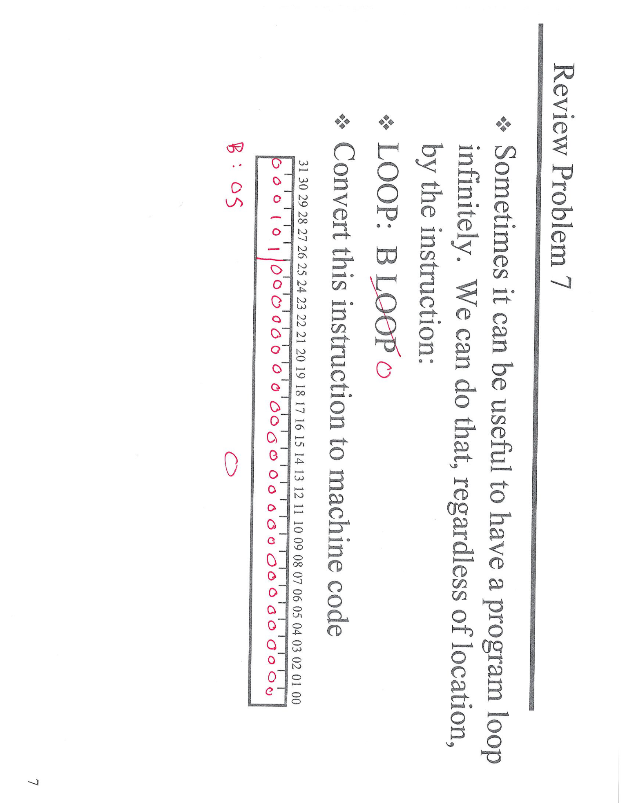

# 面试式讲解：把 `LOOP:  B LOOP` 转成机器码

## 思路

* 指令类型：**B-Type**（无条件跳转）。
* 编码格式：`[31:26]=Opcode(000101b)`，`[25:0]=Imm26`（**带符号**、以“指令”为单位）。
* 取址规则：`PC_new = PC_next + (sign_extend(Imm26) << 2)`。

## 计算偏移

`LOOP: B LOOP` 目标就是**本指令自己**。
设本指令地址是 `PC`，则 `PC_next = PC + 4`。

```
Imm26 = (Target - PC_next) >> 2
= (PC - (PC + 4)) >> 2
= (-4) >> 2
= -1
```

所以 `Imm26 = -1`（26 位两补码 ⇒ **全 1**）。

## 机器码

* 高 6 位 opcode：`000101`（B）
* 低 26 位 imm：`11111111111111111111111111`（= -1）

**二进制**：`000101 11111111111111111111111111`
**十六进制**：`0x17FFFFFF`  （= `0x14000000 | 0x03FFFFFF`）

## 语义

无条件跳到自己 ⇒ **死循环**，与所在地址无关。


---

## 第 2 页

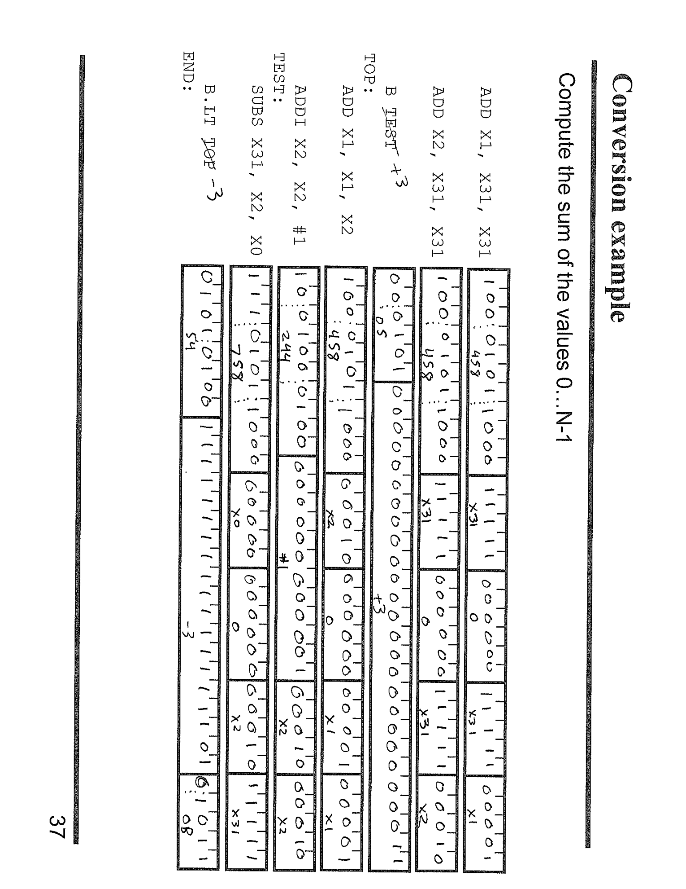

# 面试式讲解：把“求和 0…N−1”的汇编逐条转换为机器码

## 目标与寄存器约定

* 目标：计算 `sum = 0 + 1 + … + (N-1)`
* 约定：`X0=N`，`X1=sum`，`X2=i`，`X31=XZR=0`

## 汇编流程（与图一致）

1. `ADD  X1, X31, X31` // sum=0
2. `ADD  X2, X31, X31` // i=0

`TOP:`
3\) `ADD  X1, X1, X2`  // sum += i
4\) `ADDI X2, X2, #1`  // i++

`TEST:`
5\) `SUBS X31, X2, X0` // 置标志：i-N（只写标志，结果丢到 XZR）
6\) `B.LT TOP`         // 若 i < N 回到 TOP
`END:`（落地即结束）

> 注：用 `SUBS XZR, X2, X0` 等价于 `CMP X2, X0`（只是另一种编码，常见于把“比较”写成 `SUBS`）。

---

## 关键编码点（如何从汇编到 32 位机器码）

### 1) R-Type（三寄存器）

* 例：`ADD X1, X1, X2`

* 结构：`[31:21]=Opcode(ADD 64-bit)` | `Rm=X2` | `SHAMT=0` | `Rn=X1` | `Rd=X1`
* 例：`SUBS X31, X2, X0`

* 结构相同，Opcode 换成 `SUBS`（并更新标志）。

### 2) I-Type（带 12 位立即数）

* `ADDI X2, X2, #1`

* 结构：`[31:22]=Opcode(ADDI 64-bit)` | `Imm12=1` | `Rn=X2` | `Rd=X2`

### 3) B.cond（条件分支，19 位偏移）

* `B.LT TOP`

* 结构：`[31:24]=Opcode(B.cond)` | `Imm19` | `Cond(LT=1101b)`
* **偏移计算**：`Imm19 = (TOP - PC_next) >> 2`（以**下一条**为基准，单位“指令”，带符号）。
* 图中标注 `-3`：表示从 `B.LT` 的**下一条**往上数 3 条到 `TOP`。

---

## 每条指令在图上的含义（对照）

* “小方框里的寄存器号/立即数”：就是 `Rd/Rn/Rm/Imm12` 等字段的**二进制**。
* “+3 / −3 等”绿色或红色标注：是 **分支偏移（以指令为单位）**，例如 `B   TEST +3`、`B.LT TOP −3`。
* 例如 `B TEST +3`（若出现）：代表从下一条往**下**数 3 条到达 `TEST`。

---

## 为什么用 `SUBS XZR, X2, X0`

* `SUBS` 会更新 NZCV 标志；把结果写入 `XZR` 等价于“只做比较不保留结果”，即 `CMP X2, X0` 的效果。
* 紧跟 `B.LT` 使用**有符号**的“<”判断，符合 `i < N`。

---

## 面试要点总结

* 从汇编到机器码的步骤：**确定格式(R/I/B.cond)** → **填字段(Rd/Rn/Rm/Imm)** → **算 PC-relative 偏移**。
* **偏移=（目标地址 − 下一条地址）/4**；正下负上。
* `SUBS XZR, a, b` ≡ `CMP a, b`；`ADDI` 立即数 12 位。
* 这段代码实现的就是标准 for-loop 求和，指令排列即是图中每格的机器位段。


---

## 第 3 页

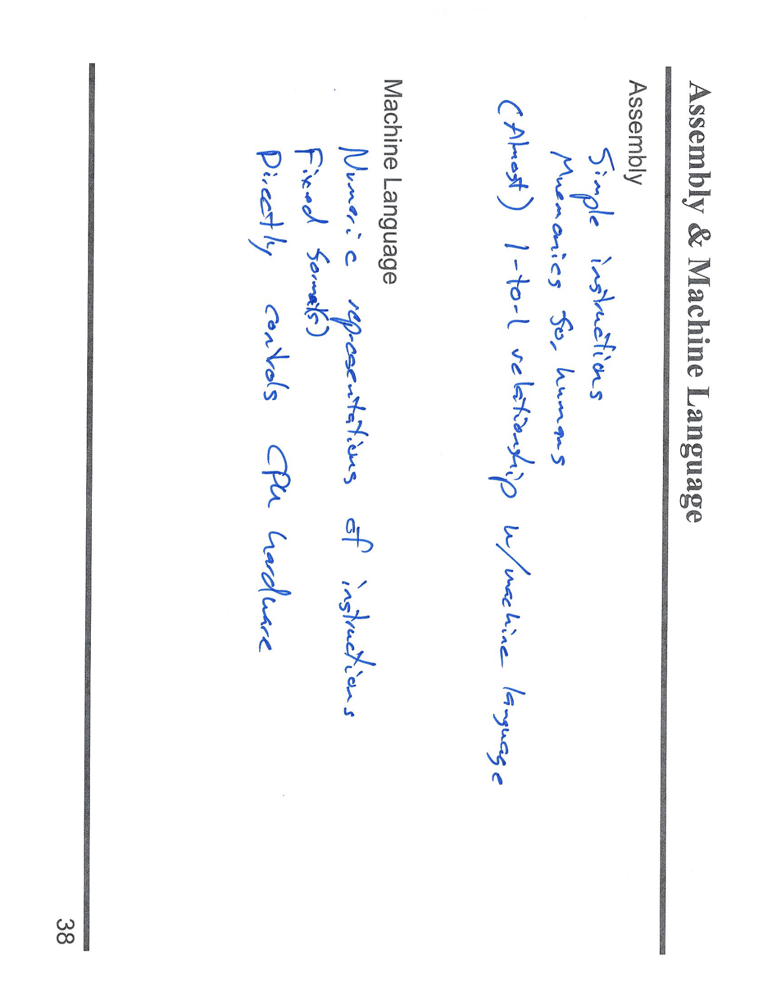

# 面试式讲解：Assembly vs. Machine Language

## 这页想表达的核心

* **Assembly（汇编）**

* **面向人类**：用助记符（mnemonics）表示指令，例如 `ADD、LDR、B.EQ`，读写直观。
* **简单指令集合**：每条语义明确，基本一条对应一条机器指令。
* **（几乎）一一对应**机器语言：汇编器把汇编翻译成机器码，插入/删除指令时只改动需要的地方，其他由汇编器处理。

* **Machine Language（机器语言）**

* **纯数字表示**：每条指令是固定长度（二进制位段）的编码。
* **固定格式（fixed formats）**：例如 R/I/D/B/CB 等格式，字段包含 opcode、寄存器号、立即数、偏移等。
* **直接驱动硬件**：CPU 只理解机器码；控制 ALU、寄存器堆、存储器、分支单元等。

## 你需要记住的面试要点

1. 汇编 = **可读的别名**；机器码 = **CPU 真正执行的 0/1**。
2. AArch64 中汇编与机器码**几乎 1:1**，便于手工分析与调试。
3. 机器码采用**固定 32 位指令**与多种**编码格式**（R/I/D/B/CB），决定了能带多大立即数、能跳多远。
4. 开发流：**人写汇编/高级语言 → 汇编器/编译器生成机器码 → CPU 执行**。


---

## 第 4 页

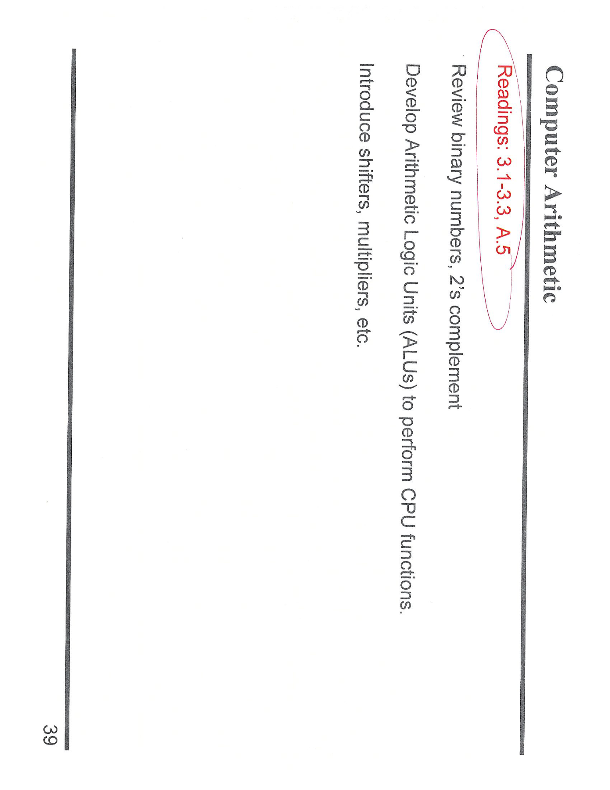

# 面试式讲解：这页在讲什么（Computer Arithmetic 概览）

## 页面主旨

这是“计算机算术”章节的**学习导览**。告诉你接下来要学/复习的四块内容，以及课本阅读范围（**3.1–3.3, A.5**）。

## 四个学习点（逐条解释）

1. **Review binary numbers（复习二进制）**

* 进位制：逢二进一；权值为 $2^0,2^1,2^2,\dots$。
* 把十进制 $N$ 转二进制：不断除以 2 取余（低位到高位）。
* 常用前缀：`0b`(二进制), `0x`(十六进制)；十六进制每位=4比特，便于读写机器码。

2. **2’s complement（补码）**

* 用来表示**有符号整数**，范围（n 位）为 $[-2^{n-1}, 2^{n-1}-1]$。
* 从正数得负数：**按位取反 + 1**。
* 加减法：**同一套加法器**即可，溢出由 NZCV 标志判断（AArch64：`V`=有符号溢出，`C`=无符号进位）。
* 边界：$-2^{n-1}$ 的相反数不可表示（溢出）。

3. **Develop ALUs（算术逻辑单元）**

* ALU 是执行 `ADD/SUB/AND/OR/XOR/比较` 的组合电路；
* 通过**控制信号**选择运算；加法器可复用为减法（对第二操作数取补码）。
* 与标志位联动：产生 `N/Z/C/V` 供条件跳转使用（如 `B.GE/B.LT`）。

4. **Introduce shifters, multipliers（移位器与乘法器）**

* 移位器：`LSL/LSR/ASR/ROR`

* `LSL` 左移相当于乘 $2^k$；`ASR` 算术右移保留符号位。
* 乘法器：阵列乘法、布斯算法等；在指令集中表现为 `MUL/UMULH/SMULH` 等（AArch64）。

## 为学习做准备（你需要会的）

* **十进制 ↔ 二/十六进制**互转。
* **补码**：给定位宽能快速取相反数、判断溢出。
* **ALU 与标志位**：理解 `SUBS`=“减且设标志”、`CMP` 的等价关系。
* **移位与乘法**：知道移位的数值意义，何时用移位近似乘除。

## 速记口诀

* **补码求负**：取反再加一。
* **移位算数**：左乘右除，ASR 保符号。
* **溢出区分**：`V` 看有符号，`C` 看无符号。
* **十六进制=机器码友好**：1 位 hex = 4 比特。

> 红圈“Readings: 3.1–3.3, A.5”就是课本中本章需要阅读的具体小节，通常涵盖二进制基础、补码、ALU/移位器简介与进阶附录。


---

## 第 5 页

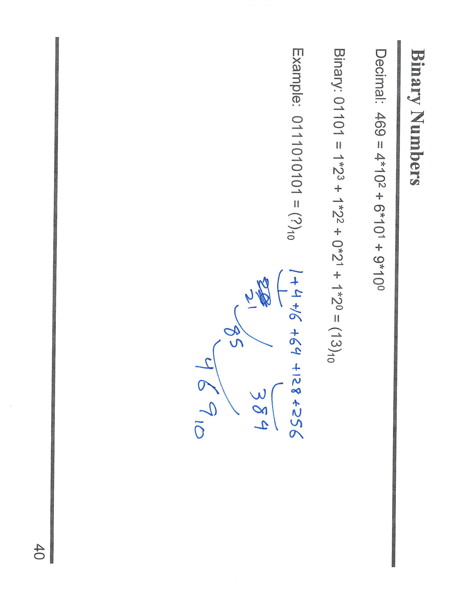

# 面试式讲解：二进制到十进制的换算

## 核心概念

* **位置计数制**：任意进制的数值 = 各位数字 × 基数^位权 之和。
* 十进制示例：`469 = 4×10² + 6×10¹ + 9×10⁰`。
* 二进制示例：`01101₂ = 1×2³ + 1×2² + 0×2¹ + 1×2⁰ = 13₁₀`。

## 题面例子：`0111010101₂` 转十进制

1. 从右到左标上位权：`2⁰, 2¹, 2², …`。
2. 只把**为 1 的位**对应的 2 的幂相加即可。

为 1 的位：第 8、7、6、4、2、0 位
（从右起第 0 位开始数）

对应幂：

* 2⁸ = 256
* 2⁷ = 128
* 2⁶ = 64
* 2⁴ = 16
* 2² = 4
* 2⁰ = 1

求和：`256 + 128 + 64 + 16 + 4 + 1 = 469`
所以：`0111010101₂ = 469₁₀`。

## 快速心法

* **看 1 加幂**：二进制转十进制就是把所有 1 位的 2 的幂加起来。
* **十六进制辅助**：每 4 位二进制可折成 1 位十六进制，读机器码更方便。


---

## 第 6 页

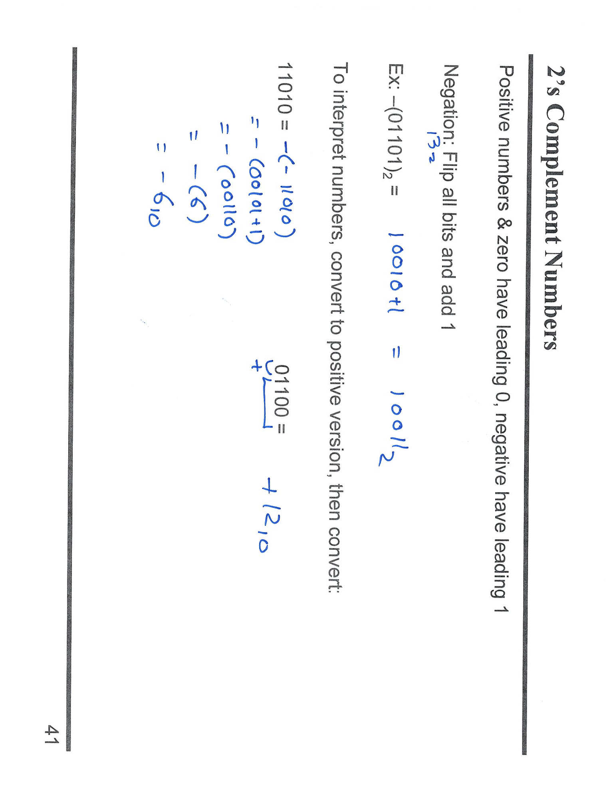

# 面试式讲解：二进制补码（2’s complement）

## 核心规则

* **符号位**：在固定宽度 $n$ 位里，最高位=1 表示负数，0 表示非负。
* **取相反数**（negation）：**按位取反 + 1**（Two’s complement）。
* **数值范围**：$[-2^{n-1},\, 2^{n-1}-1]$。

## 怎么“看懂”一个补码数

1. 看最高位：0 ⇒ 正数；1 ⇒ 负数。
2. 若为负：**再取一次补码**得到它的绝对值，然后前面加负号。

---

## 讲义里的例子

### 1) 生成负数

$$
-(01101)_2
\Rightarrow \text{取反 }10010
\Rightarrow +1 = \boxed{10011_2}
$$

（在 5 位宽里，10011 就表示 $-13$）

### 2) 解释一个负数

以 5 位数 **11010** 为例：

* 最高位=1 ⇒ 负数
* 取补码：取反 00101，+1 → 00110 = $6_{10}$
* 所以 **11010 表示 $-6$**

### 3) 解释一个正数

**01100** 的最高位=0 ⇒ 直接是正数

$$
01100_2 = 8 + 4 = \boxed{12}
$$

---

## 常见考点速记

* **求负**：$\tilde{x}+1$（取反再加一）。
* **验证**：$x + (-x) = 0$（模 $2^n$）。
* **溢出**：最小值 $-2^{n-1}$ **没有相反数**（再取负仍得到自己）。
* **比较指令**：AArch64 中 `SUBS XZR, a, b` ≡ `CMP a, b`，由 NZCV 标志判断有符号大小（`B.GE/B.LT` 等）。


---

## 第 7 页

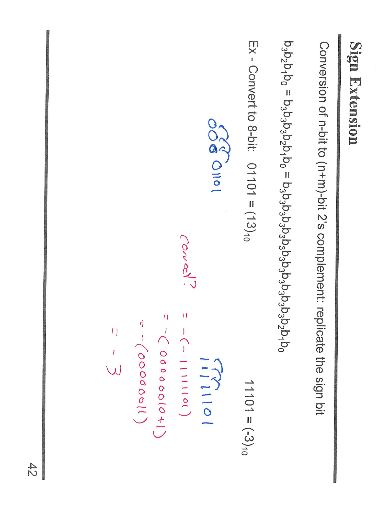

# 面试式讲解：**Sign Extension（符号扩展）**

## 是什么

把一个 **n 位的补码数** 扩到 **n+m 位** 时，**把最高位（符号位）复制到新增的高位**。

* 最高位=0（非负）→ 前面补 **0**
* 最高位=1（负数）→ 前面补 **1**

> 目的：保持**数值不变**。补码在更宽位宽里要靠复制符号位来维持相同的正/负值。

---

## 规则（记忆式）

> n→n+m：`b_{n-1} … b_1 b_0` → `b_{n-1}…b_{n-1}  b_{n-1} … b_1 b_0`
> （新添的 m 个高位都等于原来的 `b_{n-1}`）

---

## 讲义里的两个例子（5 位 → 8 位）

### 1) `01101₂`（最高位 0，正数）

* 扩展：前面补 0 → **`0000 1101₂`**
* 数值：`13₁₀`，扩展后仍是 `13₁₀`

### 2) `11101₂`（最高位 1，负数）

* 扩展：前面补 1 → **`1111 1101₂`**
* 验证数值：取反 `0000 0010`，+1 → `0000 0011` = 3，所以原数是 **`-3`**；
扩展前后都表示 `-3₁₀`。

---

## 与零扩展的区别

* **零扩展（Zero-extend）**：高位一律补 0（用于**无符号数**）。
* **符号扩展（Sign-extend）**：高位复制符号位（用于**有符号补码**）。

---

## 在 AArch64 中的应用（高频考点）

* **带符号加载**会做符号扩展：`LDRSB/ LDRSH`（把 8/16 位有符号数装载到 32/64 位时复制 1）。
* **不带符号加载**做零扩展：`LDRB/ LDRH`。
* **算术右移 ASR** 也会复制符号位；而 **逻辑右移 LSR** 补 0。

---

## 速记口诀

* **“负补 1，正补 0；高位照搬符号位”**。
* 见到“有符号小宽度 → 大宽度”，就想 **Sign-extend**；无符号就 **Zero-extend**。


---

## 第 8 页

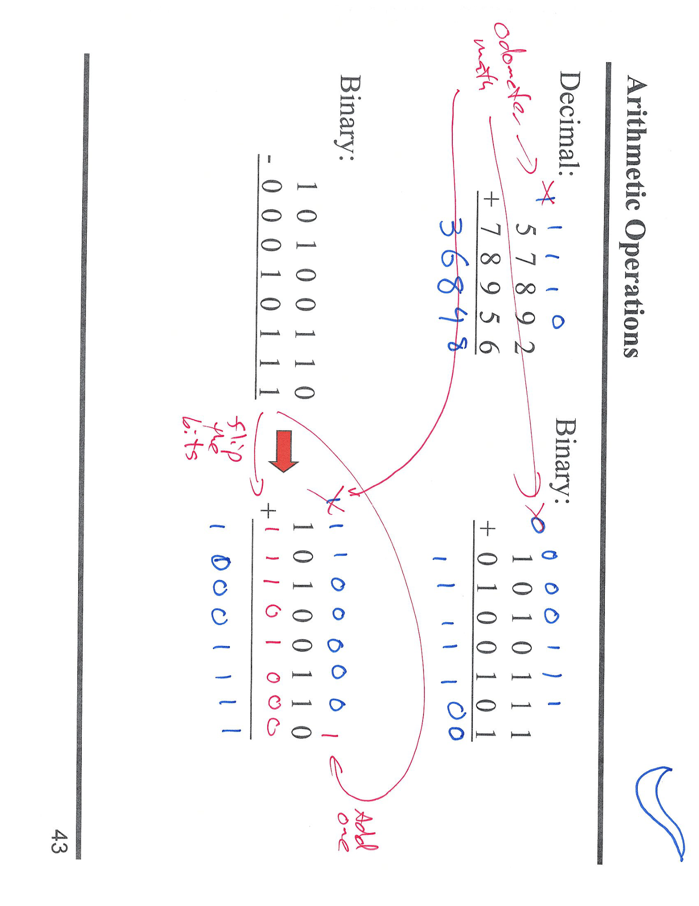

# 面试式讲解：二进制“加/减”的本质与例子

## 结论先记

* **减法 = 加补码**：$A-B = A + (\sim B + 1)$。
* 这就像十进制“借位/进位”的**里程表（odometer）**：逢 2 进 1。
* 在定长（如 8 位）里，超出的最高位**丢弃**，但会设置进位/溢出标志（NZCV）。

---

## 图上两部分在说什么

### 1) 右侧：二进制加法（与十进制加法类比）

逐列相加，**0+0=0, 0+1=1, 1+1=0 进 1**；有进位继续传到高位。
这对应十进制的手算加法，只是**基数从 10 变成 2**。

### 2) 左侧：用“加补码”做减法

例子：

$$
\text{1010 0110}_2\ (A) \;-\; \text{0001 0111}_2\ (B)
$$

**步骤**

1. **按位取反** $B$：`0001 0111` → `1110 1000`
2. **加 1**：`1110 1000 + 1 = 1110 1001`（即 $B$ 的**二进制补码**）
3. **相加**：
`1010 0110 + 1110 1001 = 1 0001 1111`

* 丢弃最高位“1”（超出 8 位）
* 结果：`1000 1111₂ = 0x8F = 143₁₀`

> 验算：$166 - 23 = 143$，一致。

**标志位含义（AArch64 常用）**

* **C**（进位/借位）：在减法里 C=1 表示**无借位**。
* **V**（有符号溢出）：只在有符号运算需要关注。
* **Z/N**：结果是否为 0、结果最高位（有符号正负）。

---

## 速记口诀

* **减法不用减法器**：**取反 +1，再相加**。
* **逢二进一**：加法进位链，最高位溢出丢弃。
* **看结果**：需要无符号借位看 `C`，需要有符号越界看 `V`。


---

## 第 9 页

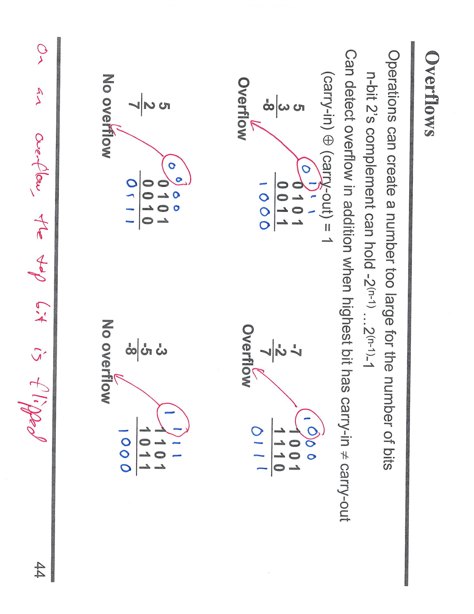

# 面试式讲解：二补数里的 **溢出 (Overflow)**

## 1) 基本范围

固定 **n 位二补数**可表示
$-2^{n-1} \sim 2^{n-1}-1$。
结果若超出此范围 → **有符号溢出**（AArch64 置 **V 标志**）。

## 2) 判断规则（背下来）

### 加法 `r = a + b`

* **符号位法**（最易记）

* 若 **a 与 b 同号** 且 **r 与它们异号** ⇒ 溢出
* 否则不溢出
（例：`0101(5)+0011(3)=1000(-8)` ⇒ 正+正得负 ⇒ 溢出）

* **进位法**（硬件视角）

* **最高位的“进位入”(carry-in) ⊕ “进位出”(carry-out) = 1** ⇒ 溢出

### 减法 `r = a − b`

* 看作 `a + (−b)`：把 b 取二补数再按**加法规则**判断
* 等价的符号法：

* **a 与 b 异号** 且 **r 与 a 异号** ⇒ 溢出
（例：`1001(-7) − 0010(2) = 0111(7)` ⇒ 负 − 正 得正 ⇒ 溢出）

## 3) 与“无符号溢出”的区别

* **无符号**看 **C 标志**：

* 加法：**carry-out=1** ⇒ 溢出
* 减法：**borrow（C=0）** ⇒ 下溢
* **有符号**看 **V 标志**（或用上面的符号位法）。

## 4) 图中示意怎么读

* 每个加/减法下面标了最高位的 **carry-in / carry-out**；
当两者**不同**时，旁边就标 **Overflow**。
* “No overflow” 的例子（如 `0101(5) + 0010(2) = 0111(7)`）
同号加仍为正，**carry-in = carry-out**，不溢出。
* “Overflow” 的例子（如 `0101(5) + 0011(3) = 1000`）
正+正得负，或最高位 **carry-in ≠ carry-out**，因此溢出。

---

## 5) 面试速记

* **加法**：同号得异号 ⇒ V=1。
* **减法**：异号得异号（相对 a） ⇒ V=1。
* **无符号**：看 **C**，**有符号**：看 **V**。


---

## 第 10 页

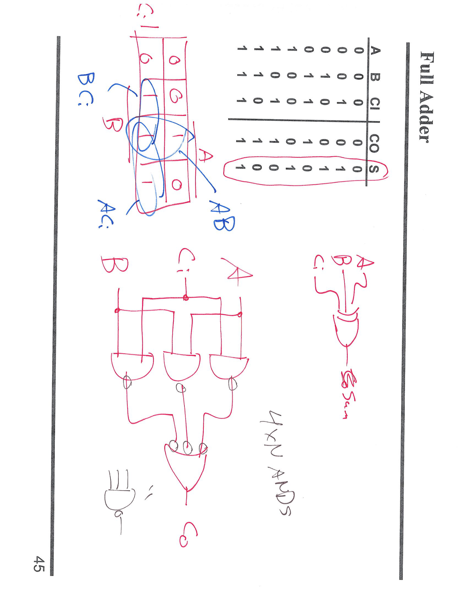

# 面试式讲解：**Full Adder（全加器）**

## 目标

把三个位相加：输入 **A、B、Cin**（来自低位的进位），输出：

* **S**（Sum，和的最低位）
* **Cout**（向高位的进位）

## 真值表（图右上）

```
A B Cin | C S
0 0 0   | 0 0
0 0 1   | 0 1
0 1 0   | 0 1
0 1 1   | 1 0
1 0 0   | 0 1
1 0 1   | 1 0
1 1 0   | 1 0
1 1 1   | 1 1
```

（图中红圈列是 S；左侧是 Cout。）

## 逻辑表达式（考点）

* **和位**：

$$
S = A \oplus B \oplus Cin
$$
* **进位**（多数函数）：

$$
Cout = AB \;+\; A\,Cin \;+\; B\,Cin
$$

（图中的 K-map 圈了 **AB**、**AC**、**BC** 三组，就是这个式子。）

> 直观理解：三个输入里**至少有两个为 1**时产生进位。

## 电路实现（图下方两种画法）

1. **两级半加器结构**

* 第一级：`S1 = A ⊕ B`，`C1 = A·B`
* 第二级：`S  = S1 ⊕ Cin`，`C2 = S1·Cin`
* 再：`Cout = C1 + C2`
2. **按化简式直接搭**

* `S` 用两级 XOR
* `Cout` 用 3 个 AND（AB、AC、BC）+ 1 个 OR 汇总
* 图上“4×N ANDs”/并联 OR 就是这个结构

## 与 K-map 的对应

* S 的 K-map（右上红框）呈“奇偶 1”分布 ⇒ **三输入异或**。
* Cout 的 K-map（左侧涂鸦）把 1 组成了三块长方形 ⇒ **AB、AC、BC** 三个乘积项。

## 延伸（面试常问）

* **Ripple-carry adder**：把多个全加器级联，`Cout` 接到高一位 `Cin`。
* **时序瓶颈**：进位链决定延迟，改进可用 **carry lookahead** 等结构。

> 一句话记忆：**S = A⊕B⊕Cin，Cout = AB + ACin + BCin**。这就是全加器。


---

## 第 11 页

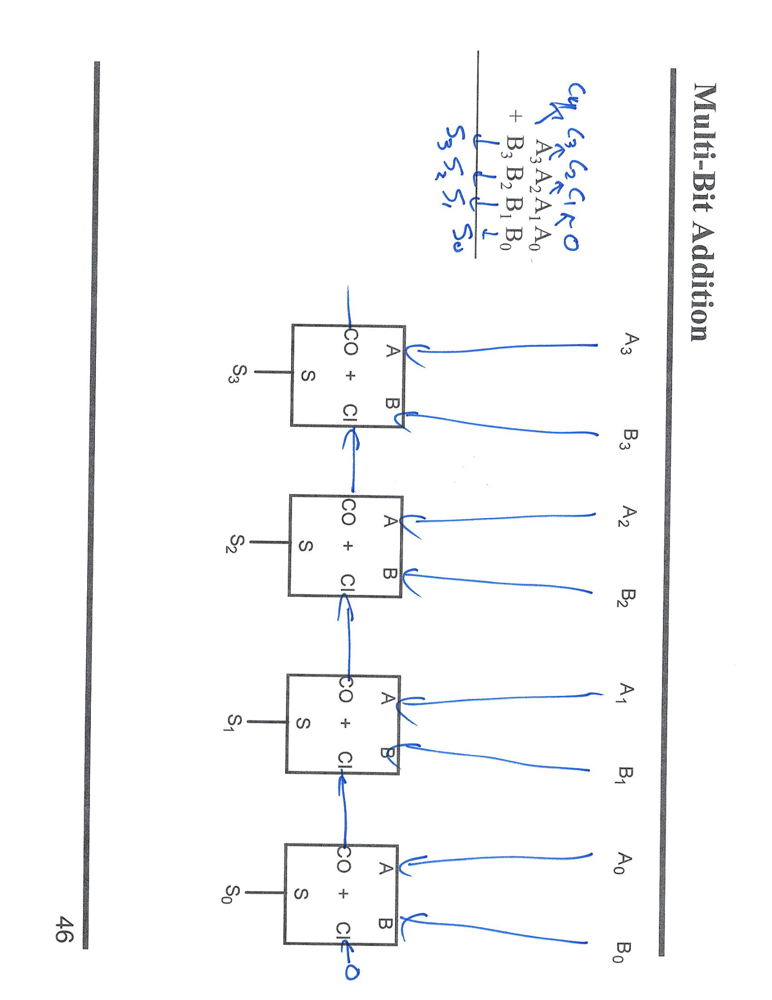

# 面试式讲解：Multi-Bit Addition（多位加法/串行进位加法器）

## 图在表达什么

* 把 **4 个全加器（Full Adder）** 级联，形成一个 **4 位加法器**。
* 被加数：`A3 A2 A1 A0`
加数：`B3 B2 B1 B0`
* 输出和：`S3 S2 S1 S0`
最高位进位：`C4`（也写作 `Cout`）

## 接线关系（自低位到高位）

* 第 0 位全加器：输入 `A0, B0, Cin=C0`，通常 **`C0=0`**；输出 `S0` 和 `C1`
* 第 1 位全加器：输入 `A1, B1, Cin=C1`；输出 `S1` 和 `C2`
* 第 2 位全加器：输入 `A2, B2, Cin=C2`；输出 `S2` 和 `C3`
* 第 3 位全加器：输入 `A3, B3, Cin=C3`；输出 `S3` 和 **最终进位 `C4`**

> 每个方块里标的 `S` 是和位，`CO+CI` 表示“上一位的 **Carry-Out** 接到下一位的 **Carry-In**”。

## 每个全加器的逻辑（背诵）

* `S = A ⊕ B ⊕ Cin`
* `Cout = AB + A·Cin + B·Cin`（三者至少两者为 1 就进位）

## 结果含义

* 二进制加法：
`A + B = (C4 · 2^4) + (S3S2S1S0)_2`
* 若用于无符号数，`C4=1` 表示产生了**无符号进位**；
若用于有符号数，溢出由 **V** 标志另行判断（不等同于 `C4`）。

## 性能与改进

* 该结构为 **Ripple-Carry Adder（串行进位）**：延迟≈全加器延迟×位数（进位逐级传播）。
* 更快做法：**Carry Lookahead / Carry Select** 等减少进位链长度。

## 一句话总结

把 N 个全加器“进位串起来”，就得到 **N 位加法器**；最低位 `Cin=0`，逐级产生 `S0…S_{N-1}` 和最终进位 `C_N`。


---

## 第 12 页

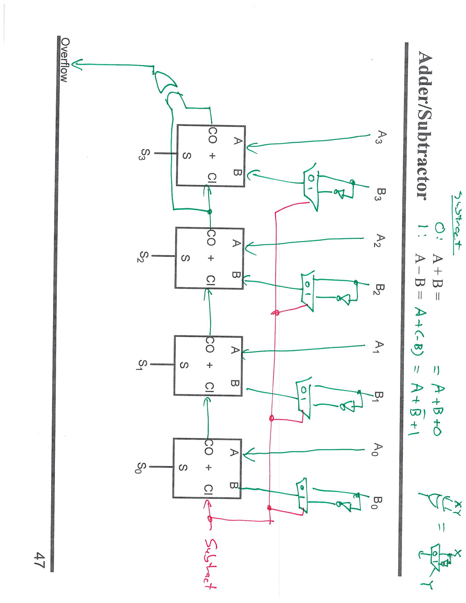

# 面试式讲解：Adder/Subtractor（同一电路做加法和减法）

## 核心思路

* 二补数里：
**加法**：`A + B`
**减法**：`A − B = A + (~B) + 1`
* 电路用**一个控制位 `Y`**（图中“subtract”开关）来在两种模式间切换：

* `Y=0`（加法）：把 `B` 原样送入，全加器最低位 `Cin=C0=0`
* `Y=1`（减法）：把 `B` **逐位取反**，且最低位 **`Cin=1`**，等价于 `+ (~B) + 1`

## 图怎么实现这个逻辑

* 每一位的 `B_i` 都先经过 **XOR 门** 与控制位 `Y` 相连：

* `Y=0` ⇒ `B_i ⊕ 0 = B_i`（不变）
* `Y=1` ⇒ `B_i ⊕ 1 = ~B_i`（取反）
* 最低位全加器的 **`Cin` 直接接 Y**：

* `Y=0` ⇒ `Cin=0`（正常加法）
* `Y=1` ⇒ `Cin=1`（实现 `+1`，完成减法）
* 四个全加器级联（Ripple-Carry）：产生 `S0..S3` 和最终进位 `C4`。

> 每个全加器仍然执行
> `S = A ⊕ B' ⊕ Cin`，`Cout = A·B' + A·Cin + B'·Cin`，
> 其中 `B' = B ⊕ Y`。

## 标志/溢出怎么取

* **无符号进位/借位（C 标志）**：取最终 `C4`

* 加法：`C=1` 表示产生了进位
* 减法（两补数实现）：`C=1` 表示**无借位**，`C=0` 表示发生借位
* **有符号溢出（V 标志）**：最高位**进位入**与**进位出**异或

$$
V = C_{n-1} \oplus C_n
$$

等价判据：加法时“同号得异号”、减法时“异号得异号（相对 A）”。

## 一句话记忆

> **一个 XOR 控制取反 + 最低位 Cin 接同一个控制位** ⇒ 用同一串全加器同时实现 `A+B` 和 `A−B`。
> `Y=0` 加；`Y=1` 减；`C` 看进/借位，`V` 看最高位进位不等或符号规则。
