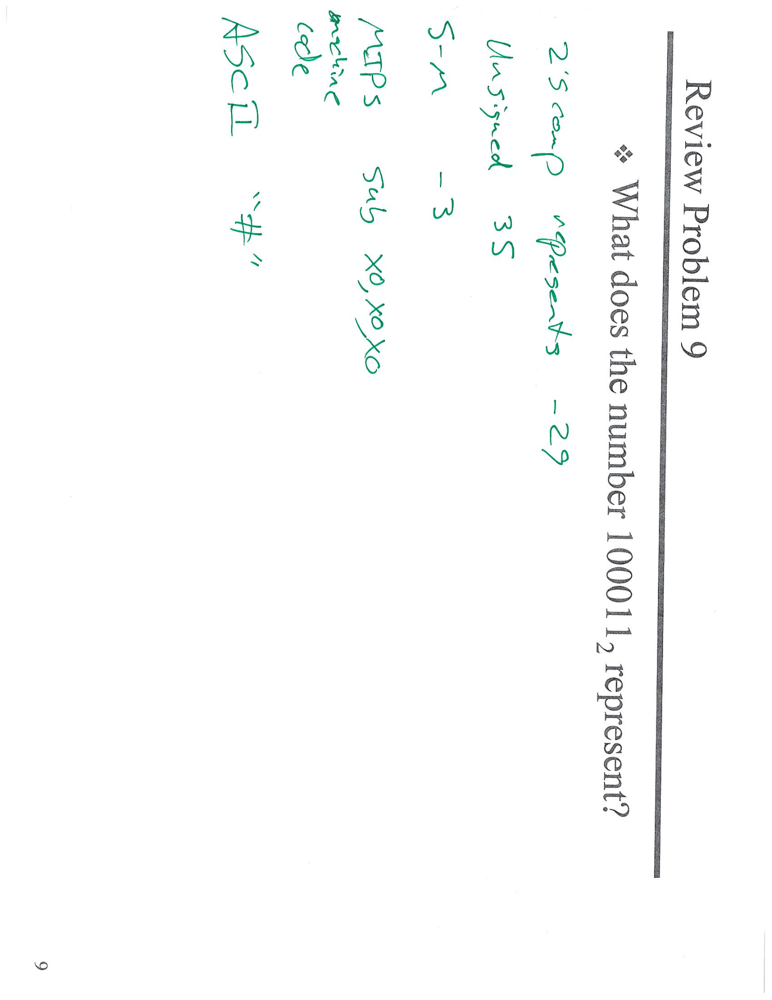
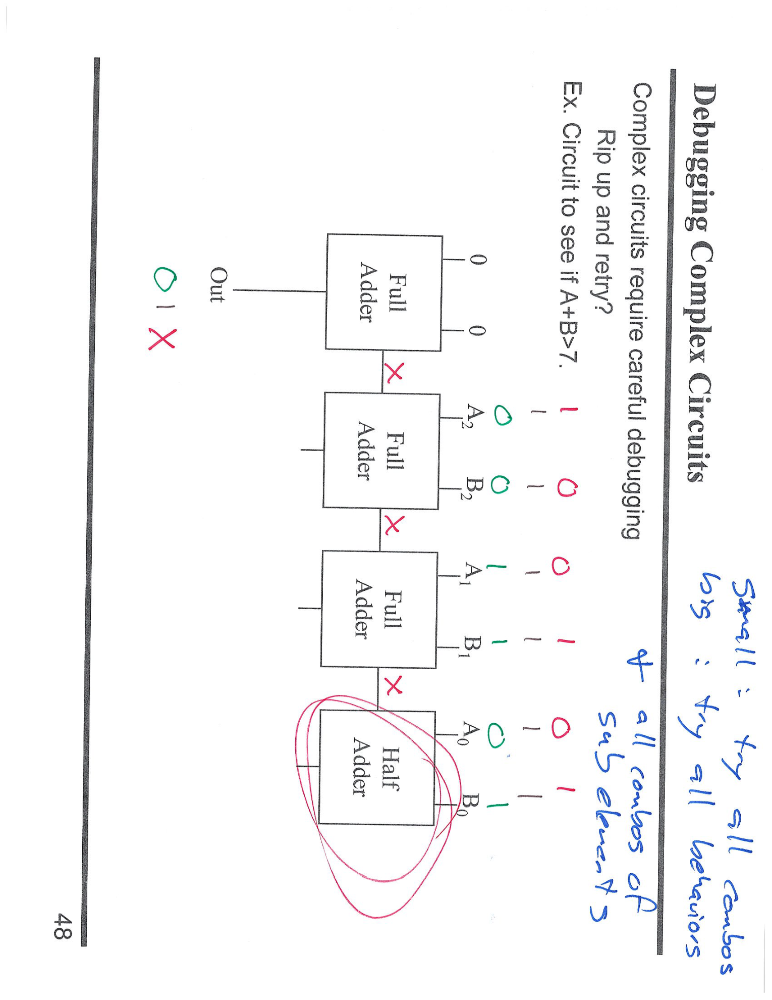
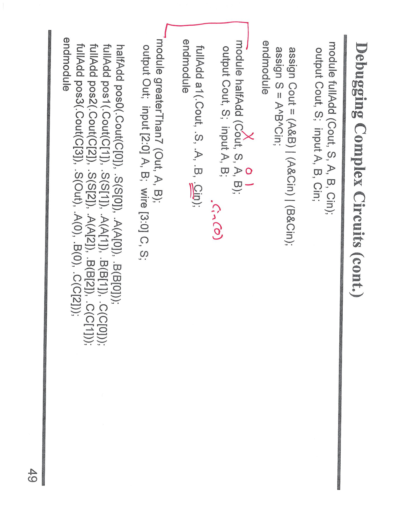
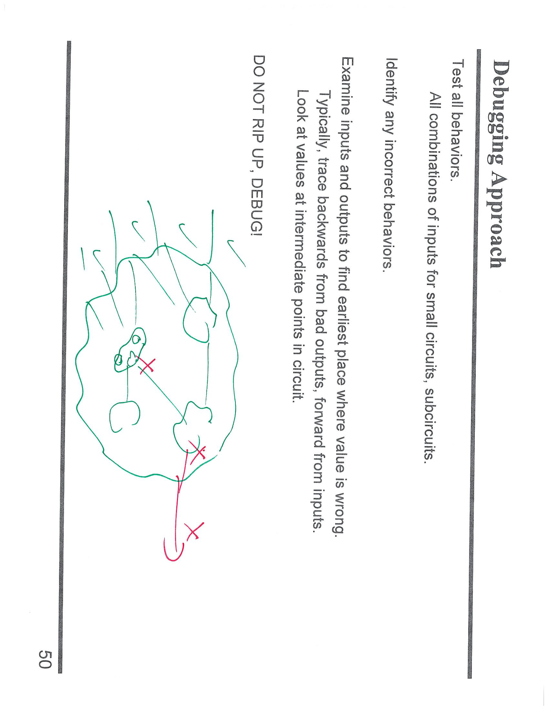
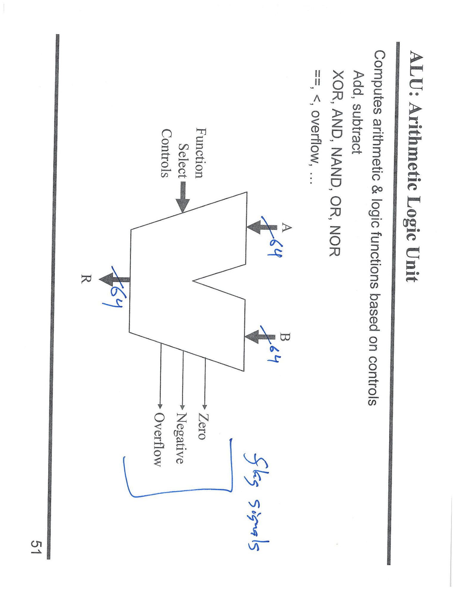
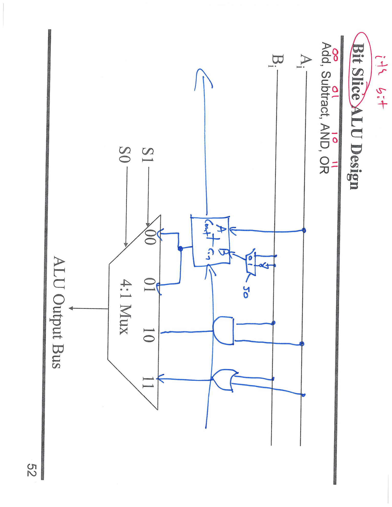
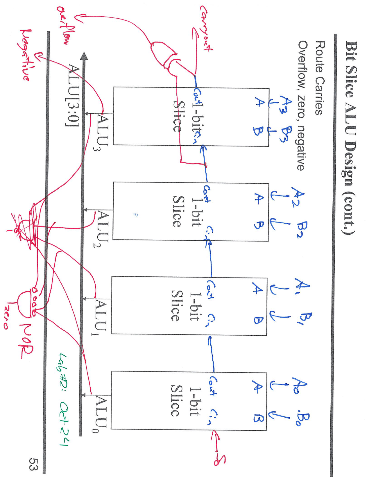

---

## 第 1 页



# 面试式速答：`100011₂` 表示什么？

取决于**解释方式/语境**（这里默认是 6 位数）：

1. **无符号整数 (unsigned)**

* 值 = $1·2^5 + 0·2^4 + 0·2^3 + 0·2^2 + 1·2^1 + 1·2^0 = 32+2+1=35$
✅ **35₁₀**

2. **二补有符号整数 (two’s complement, 6 位)**

* 最高位为 1 ⇒ 负数；值 = $35 - 2^6 = 35 - 64 = -29$
✅ **−29₁₀**

3. **符号-数值表示 (sign-magnitude, 6 位)**

* 符号位=1（负），数值位=`00011`=3
✅ **−3₁₀**

4. **ASCII（8 位字符）**

* 若把它作为 8 位写成 `0010 0011`（= 0x23 = 35），对应字符 **‘#’**

> 结论：没有上下文，“100011₂”可以代表 **35（无符号）/ −29（6 位二补）/ −3（符号-数值）/ ‘#’（若按 ASCII）**。


---

## 第 2 页



# 面试式讲解：调试这个“判断 A+B>7 的电路”为何出错

## 目标

* 输入：3 位无符号数 `A2..A0`、`B2..B0`
* 要做：判断 `A + B > 7`（也就是 3 位加法产生了**最终进位**）。
* 正确做法：用 **3 个全加器（Full Adder）级联**，`Cin₀=0`，逐级把 `Cout` 接到下一级 `Cin`，**输出 = 最高位的 `Cout`**。

## 图里的问题（红色叉的位置）

1. **进位链断了**：相邻全加器之间的 `Cout → Cin` 没有正确连接（画了 X）。
2. **混入半加器**：最低位用了 Half Adder（没有 `Cin`），虽然最低位本来 `Cin=0` 可以用半加器，但这里又没有把“0”明确地接进去，加重了连接混乱。

## 用一组向量看错误

* 取右侧标的例子：`A=111₂ (7)`，`B=110₂ (6)`，真实结果 `7+6=13>7`，**应当输出 1**。
* **正确的连线**下（有进位链）：

* 位0：`1+1+Cin0(=0) = 10` → `C1=1`
* 位1：`1+1+Cin1(=1) = 11` → `C2=1`
* 位2：`1+0+Cin2(=1) = 10` → `C3=1` ⇒ **Out=1**
* **图中错误连线**（每级都没吃到下级的 Cin）：

* 位0：`1+1` → `C1=1`
* 位1：**仍然忽略 Cin=1**，只算 `1+1` → `C2=1`
* 位2：只算 `1+0` → `C3=0` ⇒ **Out=0（错误）**

> 症结：**没有把进位在各级之间“连起来涟漪传播”**（ripple-carry）。

## 正确修复

* 使用 **3 个 Full Adder**（或最低位 Half Adder 但要把 **`Cin₀` 明确接常数 0**）。
* 逐级连线：`Cout₀→Cin₁`，`Cout₁→Cin₂`；输出 `Out=Cout₂`。
* 这样 `Out=1` 当且仅当 `A+B` 超过 7。

## 调试建议（拿分点）

* 先用能“激活进位链”的测试向量（例如 `A=111, B=110`）验证。
* 局部验证：先单测单个全加器真值表，再检查相邻级的 **Cin/Cout** 连线。
* 原则：**判断 A+B 是否越界 = 看最高位进位**（无符号）。


---

## 第 3 页



# 面试式讲解：这页 Verilog 的意思与常见坑

## 这段代码要做什么

实现一个“**A + B 是否大于 7**”的电路。
做法：把 3 位无符号数 `A[2:0]` 和 `B[2:0]` 相加；**结果是否产生最高位进位**（`Carry out`）即表示是否 > 7。也就是：

```
Out = Cout_of_bit2   // Ripple-carry 最终进位
```

## 模块含义

```verilog
module fullAdd (Cout, S, A, B, Cin);
assign Cout = (A&B) | (A&Cin) | (B&Cin);
assign S    = A ^ B ^ Cin;
endmodule

module halfAdd (Cout, S, A, B);     // 只有最低位需要时可用，无 Cin
assign Cout = A & B;
assign S    = A ^ B;
endmodule
```

* **全加器**：`S = A⊕B⊕Cin`，`Cout = AB + ACin + BCin`
* **半加器**：`S = A⊕B`，`Cout = AB`（没有 `Cin`）

## 正确的顶层连接（3 位相加 → 看最终进位）

```verilog
module greaterThan7 (output Out, input [2:0] A, B);
wire [3:0] C;     // 进位链 C0..C3
wire [2:0] S;     // 和位（其实用不到）

// 方式一：LSB 用半加器，其余用全加器
halfAdd h0 (C[1], S[0], A[0], B[0]);           // Cin 隐含为 0
fullAdd f1 (C[2], S[1], A[1], B[1], C[1]);     // Cout→下一位 Cin
fullAdd f2 (C[3], S[2], A[2], B[2], C[2]);

assign Out = C[3];   // 最高位进位 = A+B 是否 > 7
endmodule
```

> 等价写法：也可用三个 **fullAdd**，把 `C[0]` 直接接 `1'b0` 当最低位 Cin。

## 图里/代码里容易犯的错（红圈处的“X”）

1. **进位链没接好**

* 忘了把 `Cout` 接到下一位的 `Cin`（`C[i] → Cin[i+1]`）。
* 结果：即使低位产生了进位，上一级也看不到，`Out` 可能错误为 0。

2. **位置连接顺序写错**

* `fullAdd (Cout, S, A, B, Cin)` 的**端口次序**要完全一致；
如果用位置连接把 `Cin` 放错位，会出现逻辑错接。
* 建议用**命名端口**更安全：

```verilog
fullAdd f1 (.Cout(C[2]), .S(S[1]), .A(A[1]), .B(B[1]), .Cin(C[1]));
```

3. **位宽/越界错误**

* 这是 3 位加法器，只需要 **两级 fullAdd + 1 级 halfAdd**（或 3 级 fullAdd）。
* 若再实例化 `pos3` 去连 `A[3]`、`B[3]` 会越界，综合/仿真得到 `x`。

4. **最低位 Cin 处理不当**

* 若最低位用 fullAdd 却没把 `Cin` 绑到 `0`，会导致随机值或 `x` 传播。

## 一句话总结

> 这个电路就是“**3 位 Ripple-Carry 加法器**”，把 **最高位 `Cout`** 作为 `Out`。
> 保证 **Cout→Cin** 的进位链不断、端口顺序正确、位宽不越界，`Out` 就能正确表示 `A+B>7`。


---

## 第 4 页



# 面试式讲解：Debugging Approach（数字电路调试方法）

## 页面要点

* **Test all behaviors**
小电路/子电路：把**所有输入组合**都测一遍（穷举表/仿真 testbench）。
* **Identify incorrect behaviors**
先**确认哪几组输入**输出错误，别一上来全推翻。
* **Find earliest wrong point**
从**错误的输出**往回追；或从**输入**往前推；在电路**中间节点**打点观测（示波/波形/printf）。
* **DO NOT RIP UP, DEBUG!**
别“推倒重写”，一步步定位并修正“第一个出错的节点”。

## 操作流程（4 步法）

1. **列真值/写用例**：覆盖边界值（全 0、全 1、进位/借位、溢出等）。
2. **二分定位**：在关键中间信号处打桩（进位链、比较器输出、状态位）。
3. **比对期望**：该节点应是什么？若错，这是**最早**出错点；沿着该点的**前驱**继续查。
4. **小改小测**：修完一处立即回归测试，防止新 bug。

## 针对 HDL（Verilog/VHDL）的小清单

* **端口顺序/命名连接是否对应**（位置接线最容易错）。
* **位宽一致**（越界索引/截断/符号扩展）。
* **时序与组合**分清（漏掉寄存器、组合环路）。
* **常量**是否明确连接（如 `Cin=1'b0`）。
* **仿真波形**里核对：`Cin/Cout` 链、条件信号、状态机跳转。

## 例：判断 `A+B>7` 的电路如何调

* 用用例触发进位链：`A=111, B=110` 应 **输出 1**。
* 观测 `C1,C2,C3`：若 `C1=1` 但 `C2/C3` 没跟着变，说明**进位链断**；修复 `Cout→Cin` 连接即可。
* 回归全部 8×8 组合，确认无回归。

> 核心心法：**先锁定“第一个错的信号”，再修；别一口气全改。**


---

## 第 5 页



# 面试式讲解：ALU（Arithmetic Logic Unit）这页在说什么

## 核心功能

* **ALU = 运算核心**：根据**功能选择控制**（Function Select / Controls）对两个输入 **A、B** 做算术与逻辑运算，输出结果 **R**，并产生**标志位**（flags）。
* 典型支持：`ADD/SUB`、`AND/OR/XOR/NAND/NOR`、比较（==、<、≤ 等由标志配合实现）。

## 接口（按图）

* **数据输入**：A、B（图上标注为 64 位，适配 AArch64）。
* **控制输入**：Function Select（若干位，编码要执行的运算）。
* **数据输出**：R（与 A、B 同宽，例：64 位）。
* **标志输出**（Status/Flags）：

* **Z**（Zero）：R 全 0 时置 1。
* **N**（Negative）：R 的最高位（符号位）。
* **C**（Carry）：无符号加/减产生的进位/无借位。
* **V**（Overflow）：有符号溢出（最高位 carry-in ⊕ carry-out）。

> 在 AArch64 中，这四个就是 **NZCV** 标志，供 `B.EQ/B.NE/B.GE/B.LT` 等条件分支使用。

## SUB 的实现思路（硬件常用）

* 利用补码：`A - B = A + (~B) + 1`
通过**取反控制 + 低位进位 Cin=1**在同一加法器上完成加/减。

## Flag 的检测（内部逻辑）

* **Z**：对 R 做“全位或”后取反（或比较 R==0）。
* **N**：直接取 R 的最高位。
* **C**：来自加/减的最终进位（减法时 C=1 表示**无借位**）。
* **V**：加法时“同号得异号”、减法时“异号得异号（相对 A）”，等价于最高位 `carry_in ⊕ carry_out`。

## 典型功能选择编码（示例，便于记忆）

| Sel | 运算      | 说明         |     |
| --- | ------- | ---------- | --- |
| 000 | `A & B` | 按位与        |     |
| 001 | \`A     | B\`        | 按位或 |
| 010 | `A ^ B` | 按位异或       |     |
| 011 | `A + B` | 加法（置 NZCV） |     |
| 100 | `A - B` | 减法（用补码实现）  |     |
| 101 | `~A`    | 取反         |     |
| 110 | `A`     | 直通（用于比较链）  |     |
| 111 | `B`     | 直通         |     |

> 实际编码由设计定，但**思路一致**：控制线选择算术或逻辑路径，并统一产生标志位。

## 一句话总结

> 这张图描述了**64 位 ALU**的输入/输出与**控制—结果—标志**的关系：
> **选择控制决定运算**（加/减/逻辑），**输出 R** 与 **NZCV 标志**供后续比较与分支使用。


---

## 第 6 页



# 面试式讲解：Bit-Slice ALU（1 位切片）的工作原理

## 这张图在做什么

把一个 **1 位的 ALU 切片**画出来：输入本位的 `A_i、B_i`，以及来自低位的 `Cin`，能完成 **加、减、AND、OR** 四种功能，并产生：

* 本位结果 `R_i`
* 进位输出 `Cout`（给高一位）

## 关键结构

1. **加/减共用的全加器**

* 在 `B_i` 前挂一个 **XOR**，控制信号 **`S0`**：

* `S0=0`：`B' = B_i`（做加法）
* `S0=1`：`B' = ~B_i`（做减法所需的取反）
* 同时把**最低位的 `Cin` 也接 `S0`**（图中小开关/小多路复用器）：

* `S0=0`：`Cin=0` → `A + B`
* `S0=1`：`Cin=1` → `A + (~B) + 1 = A − B`
* 全加器输出 `Sum` 与 `Cout`

2. **并行计算逻辑运算**

* 一条支路做 `A_i AND B_i`
* 另一条支路做 `A_i OR  B_i`

3. **4:1 多路复用器（由 `S1 S0` 选择）**

* `S1S0 = 00` 选 **加法**（来自全加器的 `Sum`）
* `S1S0 = 01` 选 **减法**（同一全加器；因 `S0=1` 已实现减法）
* `S1S0 = 10` 选 **A AND B**
* `S1S0 = 11` 选 **A OR  B**
选中的结果作为本位输出 `R_i` 送到 **ALU Output Bus**。

> 小结：**同一个加法器 + (`B ⊕ S0`, `Cin=S0`)** 就同时实现了加/减；再用 4:1 MUX 在四种功能之间切换。

## 组装成 n 位 ALU

把该切片按位 **串接 n 次**：

* `Cout(i)` 接到下一位的 `Cin(i+1)`（形成 **ripple carry**）
* 最高位的 `Cout`、以及最高位结果用于生成 **NZCV** 等标志（如需要）

## 记忆口令

* **`B ⊕ S0` + `Cin=S0` ⇒ 加/减二合一**
* **`S1S0` 功能表**：00 加、01 减、10 AND、11 OR


---

## 第 7 页



# 图解：Bit-Slice ALU 组装与标志位产生

这页把**多个 1-bit ALU Slice 串接**成多位（图里画成 4 位）ALU，并说明 **进位链** 与 **NZCV 标志**怎么取。

## 1) 串接方式（Ripple Carry）

* 每个切片有：`A_i、B_i、Cin → {R_i、Cout}`
* **进位链**：`Cout(i) → Cin(i+1)`；最低位 `Cin(0)` 由控制信号提供

* 加法：`Cin(0)=0`
* 减法：`Cin(0)=1`（并且前面把 `B_i` 与控制做 `B_i ⊕ 1 = ~B_i`，实现 `A + (~B) + 1`）

## 2) 总线与结果

* 各位结果拼成 **ALU\[3:0]**：`{R_3,R_2,R_1,R_0}`
* 最高位切片的 `Cout(3)` 常记作 **CarryOut**（无符号进位/无借位）

## 3) 标志位（图上红笔“Overflow, Zero, Negative”）

* **N（Negative）**：取**最高位结果** `R_3`（符号位）
* **Z（Zero）**：对所有结果做 **NOR**（或比较 `ALU==0`）
* **C（Carry）**：取**最高位进位** `Cout(3)`

* 加法：`C=1` 表示产生无符号进位
* 减法：`C=1` 表示**无借位**（`C=0` 表示发生借位）
* **V（Overflow）**（有符号溢出）：

* **最高位“进位入 ⊕ 进位出”**

$$
V = Cin(3) \oplus Cout(3)
$$
* 等价判据：加法“同号得异号”，减法“异号得异号（相对 A）”

## 4) 一句话记忆

* **`B ⊕ Sub` + `Cin0=Sub`** ⇒ 同一加法器实现加/减
* **N = MSB、Z = NOR 全位、C = Cout(MSB)、V = Cin(MSB) ⊕ Cout(MSB)**
* 多位 ALU = 若干 **1-bit slice + 进位涟漪链**（ripple carry）
