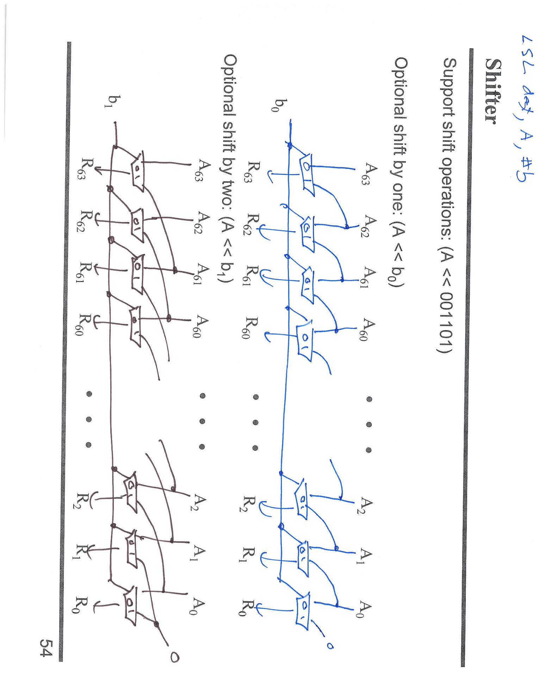

---

## 第 1 页


# Review Problem 12：分支与 ALU 标志怎么对应？

题设提示用
`SUBS X31, <val1>, <val2>`
来做比较（等价于 `CMP <val1>, <val2>`）。这条指令只**更新标志** NZCV，不保留结果。

记住：下面这些都是**有符号比较**（用 N、Z、V）：

* **Z**：结果为 0
* **N**：结果为负（MSB=1）
* **V**：有符号溢出
* **C**：进位/无借位（**无符号**比较才会用到）

把 `<val1> - <val2>` 的标志带入即可：

* **B.EQ**（等于） → `Z == 1`
* **B.NE**（不等） → `Z == 0`
* **B.GE**（≥） → `N == V`
* **B.GT**（>） → `Z == 0` **且** `N == V`
* **B.LE**（≤） → `Z == 1` **或** `N != V`
* **B.LT**（<） → `N != V`

> 口诀：**有符号**大小关系看 **N ⊕ V**；等于看 **Z**。
> 若做**无符号**比较：用 `B.HS/B.LO`（≥ / <）与 `B.HI/B.LS`（> / ≤），它们看 **C/Z** 而不是 N/V。


---

## 第 2 页



# 这页在讲什么：可变移位器（barrel shifter）的电路思路

目标：把一个多位输入 **A** 按可变的移位量 **b** 做移位（图题注里举的是左移：`R = A << b`）。
做法：用**多级 2:1 多路复用器**（MUX）逐级可选地“**移 1 位**、**移 2 位**、**移 4 位**、…”，最终实现任意移位量。

---

## 两个子图各代表一“级”

* 右侧蓝色是 **“可选移 1 位”** 的一级（由控制位 **b₀** 决定）

* 若 `b₀=0`：本级**不移位**，直接把 A 的各位透传到下一层。
* 若 `b₀=1`：本级**左移 1**：`Rᵢ ← Aᵢ₋₁`；最低位 `R₀` 用 0 填充（逻辑左移）。
* 左侧棕色是 **“可选移 2 位”** 的一级（由 **b₁** 决定）

* `b₁=0`：透传
* `b₁=1`：**左移 2**：`Rᵢ ← Aᵢ₋₂`；最低两位用 0 填充。

把这两级**串联**起来（再继续加“可选移 4 位”(b₂)、“可选移 8 位”(b₃)…），就得到一个**桶形移位器**。移多少位 = 各级被“激活”的位数之和。

---

## 工作方式（以 4 级为例）

* 控制量 `b = b₃b₂b₁b₀`（二进制）
* 级 0：若 `b₀=1` → 左移 1
* 级 1：若 `b₁=1` → 在上一级结果基础上再左移 2
* 级 2：若 `b₂=1` → 再左移 4
* 级 3：若 `b₃=1` → 再左移 8
最终输出就是 `A << (b₃·8 + b₂·4 + b₁·2 + b₀·1)`。

> 例：要做 `A << 0b001101 (= 13)`，就让 `b₀=1`（+1）、`b₂=1`（+4）、`b₃=1`（+8），其他为 0。电路先移 1，再移 4，再移 8，总计移 13 位。

---

## 边界填充与其它移位

* **逻辑左移 LSL**：低位用 **0** 补（图中最右侧 R₀ 输入 0）。
* **逻辑右移 LSR**：把连线方向反过来，高位用 **0** 补。
* **算术右移 ASR**：高位补 **符号位**（最高位的复制）。
* **循环移位 ROR/ROL**：把“掉下去”的位**绕回**另一端，而不是补 0。

---

## 优点与复杂度

* 延迟是 **O(log N)**：每多一位控制（1、2、4、…），只多一层 MUX。
* 与“逐位搬移”的线性链相比（O(N) 延迟），桶形移位器更快，广泛用于 ALU 的移位/对齐路径。

---

## 一句话总结

> 这页展示了**桶形移位器**的两层：**b₀ 控“可选移 1”，b₁ 控“可选移 2”**。把这些层按 1、2、4、8… 串起来，就能用几层 MUX 实现任意位数的移位（LSL/LSR/ASR/ROL/ROR 只改“补什么”和“从哪取”）。


---

## 第 3 页


# 这页讲的是：桶形移位器（barrel shifter）的“多级拼接”

图里把输入 **A** 依次经过 6 个“**可选左移**”的级（stage），最后得到输出 **R**。
每一级都是一排 2:1 多路复用器（MUX）——**要么不动，要么把数据整体左移固定的位数**。

* 第 1 级：`opt << 1`，由控制位 **b₀** 决定
* 第 2 级：`opt << 2`，由 **b₁** 决定
* 第 3 级：`opt << 4`，由 **b₂** 决定
* 第 4 级：`opt << 8`，由 **b₃** 决定
* 第 5 级：`opt << 16`，由 **b₄** 决定
* 第 6 级：`opt << 32`，由 **b₅** 决定

把这几级**串联**起来，就能实现任意移位量：

$$
\text{R} = A \ll (b_5\!\cdot\!32 + b_4\!\cdot\!16 + b_3\!\cdot\!8 + b_2\!\cdot\!4 + b_1\!\cdot\!2 + b_0\!\cdot\!1)
$$

这里 **b₅…b₀** 就是移位数的二进制展开。
例如要做 **`A << 45`**：`45 = 32 + 8 + 4 + 1` ⇒ `b₅=1, b₃=1, b₂=1, b₀=1`，其他为 0。电路会依次移 1、再移 4、再移 8、再移 32，总计 45 位。

## 细节补充

* 这是**逻辑左移 LSL**：每级从低端补 **0**。
* 若要 **LSR/ASR/ROL/ROR**：

* **LSR**：把各级改成“可选右移”，高端补 0。
* **ASR**：右移时高端补**符号位**。
* **循环移位 ROR/ROL**：把被“移出”的位绕接到另一端。
* 复杂度：级数是移位宽度的对数（1、2、4、8…），**延迟 O(log N)**，这就是桶形移位器比逐位移更快的原因。

> 一句话：这 6 级分别实现“可选移 1/2/4/8/16/32”，用控制位 `b₀…b₅` 选择哪些级生效，等价于把移位量当作二进制拆开后逐级累加。


---

## 第 4 页


# 这页在讲什么：二进制乘法 = “部分积(AND) + 移位 + 相加”

**核心句：**“每一位的部分积就是一次 AND；把它按位数左移后再全部相加。”

---

## 图里在做的例子

被乘数（multiplicand）= **0110₂ (=6)**
乘数（multiplier）    = **0101₂ (=5)**

乘法按乘数的每一位 $x_i$ 展开：

* 若 $x_i=1$：本位的**部分积** = 被乘数 `AND 1` = **被乘数**，再**左移 i 位**
* 若 $x_i=0$：部分积 = **全 0**

把所有部分积相加：

```
x0=1 → 0110          (6)
x1=0 → 0000          (0)   ← 乘数第1位为0，部分积为0
x2=1 → 0110 << 2 = 11000  (24)
x3=0 → 00000         (0)
--------------------------------
和：      11110₂  = 30₁₀
```

这就是图里右侧几条“弧线”标出的 **4 个 partial products**，最左边写着 `30` 的原因。

> 讲义旁注：**NOTE: Each bit of partial products is just an AND operation**
> 也就是：形成部分积时对每一位都做 `A_i AND x_i`（当 $x_i$ 固定为 0/1 时即为屏蔽/透传）。

---

## 乘法器实现的两种常见方式

1. **串行“移位-加法”**（控制简单，硬件小）

* 重复 n 次：

* 看乘数最低位，如果为 1 就把被乘数加到累加器
* 被乘数左移 1；乘数右移 1
2. **并行“部分积阵列”**（阵列/墙型乘法器，速度快）

* 同时生成所有部分积（全是 AND）
* 用加法树把它们一次性相加（如 Wallace/CSA 树）

---

## 一句话记忆

**乘法 = AND 产生部分积 → 按位左移 → 全部相加。**
例子 `0110₂ × 0101₂ = 11110₂ (30)` 就是这个流程的直观示范。


---

## 第 5 页


# 这页讲的：并行乘法器（Parallel Multipliers）

把二进制乘法“**部分积(AND) + 左移 + 相加**”一次性**并行**实现。

## 版面怎么读

* 右侧竖着的是被乘数位 **A3..A0**，下方横向的是乘数位 **B3..B0**。
* 交叉的小门是 **AND**：每个 AND 产生一个 **部分积位** `A_i & B_j`。

* 一整行 AND（同一个 `B_j`）就是 **A 与 B\_j** 的按位与，等价于 **A×B\_j**；自然地向左“移 j 位”对齐（连线斜着画）。
* 中间一层层标 **adder** 的块：把对齐后的各行**相加**（就像手算把多行部分积相加）。

* 可以是**串行移位加法器**（慢）或**进位保存加法器/Wallace 树**（快）。

## 4×4 例子的信号流

* 第 j 行形成 `A & B_j`：

* `j=0` → `A×1`（不移位）
* `j=1` → `A×2`（左移 1）
* `j=2` → `A×4`（左移 2）
* `j=3` → `A×8`（左移 3）
* 这些行被加法器**按列对齐相加**，产生 8 位积 **P7..P0**（最左是高位，最右是低位）。

## 复杂度与实现要点

* **AND 门**：$n \times n$ 个（这里 16 个），一次性生成全部部分积。
* **加法网络**：

* 朴素相加（逐行 ripple）延迟 \~ $O(n)$ 级加法器链。
* **并行/树形**（Wallace、Dadda、CSA 树）把多行先压成两行再做最终一次进位加法，延迟 \~ $O(\log n)$。
* 可插**流水线**提升频率（在加法级之间打寄存器）。

## 一句话总结

> 并行乘法器 = **阵列 AND** 生成所有 `A_i&B_j` 的部分积，按位对齐后用**加法阵列/树**一次性相加，得到乘积。比“移位-加法”串行乘法器**更快**，代价是更多门级与面积。


---

## 第 6 页


# 这页在讲什么：电脑“性能”（Performance）到底怎么看

## 关键区分

* **GHz（Giga cycles/second）**：**时钟频率**。一秒能敲多少个“节拍”。

* 高频 ≠ 一定更快；每拍能做多少事还要看架构（CPI、并行度、流水线深度、缓存命中等）。
* **BIPS（Billion Instructions Per Second）**：**吞吐量**（单位时间完成多少指令）。

* 与指令集、CPI、编译器优化强相关；不同 CPU/程序之间可比性有限。
* **Throughput vs. Latency**

* **Throughput（吞吐量）**：每秒完成的“工作/任务”数量。
* **Latency（延迟）**：**完成一个任务**需要多久。
* 深流水、并行化往往**提高吞吐**但不一定降低单任务延迟。

## 为什么“3.0 GHz”“Hyper Pipelined”这类词要谨慎解读

* **Hyper Pipelined / 更深流水线**：把一条指令切成更多微步骤，提高频率（GHz）→ **可能**提升吞吐，但也带来：

* **分支错误代价更大**（流水线更深，回滚更贵）
* **气泡/停顿更多**（数据相关、Cache Miss）
* **同频率不等于同速度**：不同架构的 **CPI（每条指令平均周期数）**、**每拍做的工作量**不同；

* 性能粗略公式：**性能 ∝ 频率 × IPC**（IPC=每周期完成的指令数 = 1/CPI）。

## 正确评测思路

* 用**实际工作负载/基准测试**衡量：例如图片处理、编译、数据库查询等。
* 同时报告 **吞吐量**（每秒任务数、BIPS）和 **延迟**（单个任务完成时间）。
* 注意测试环境：编译器、内存/磁盘/网络、功耗与散热限频等都会影响结果。

## 这页上的“阅读”提示

* **Readings: 1.6–1.8**（教科书章节）通常覆盖：

* 性能指标与度量；
* Amdahl 定律（优化热点的上限）；
* CPI/IPC、时钟周期、指令数三者的关系：

$$
\text{执行时间} = \frac{\text{指令数} \times \text{CPI}}{\text{频率}}
$$

**一句话总结**：别被“3.0 GHz”“超流水线”迷惑。看性能要同时看**频率、每拍效率(IPC/CPI)、程序与内存行为**，用真实负载报告**吞吐与延迟**两项指标。


---

## 第 7 页


# 这页在讲什么：用“造房子”类比计算机性能指标

右边的表把三种“建房方式”放在一起比较：

| Builder    | Time per House（单个房子的工期=**延迟**） | Houses per Month（**吞吐量**） | House Options（可定制程度） | Dollars per House（**成本**） |
| ---------- | ------------------------------ | ------------------------- | -------------------- | ------------------------- |
| Self-build | 24 个月                          | 1/24 套/月                  | 无限                   | \$400,000                 |
| Contractor | 3 个月                           | 1 套/月                     | 100                  | \$200,000                 |
| Prefab     | 6 个月                           | 100 套/月                   | 1                    | \$250,000                 |

> 这些维度分别对应计算机里的 **Latency（完成一个任务要多久）**、**Throughput（单位时间能完成多少任务）**、**灵活性/功能选项**、**成本**。
> 高 GHz 只像“工地节拍更快”，但到底“一个活多久干完”和“同时能干多少活”要看流水、并行度等——就像造房。

## 下面几句提问该怎么答

* **Which is the “best” home builder?**
——取决于你要优化什么指标：便宜？最快交付？单位时间最多？可定制最多？没有“通用最好”。

* **Homeowner on a budget?**（注重省钱）
——**Contractor：\$200k/套** 最便宜。

* **Rebuilding Haiti?**（灾后重建，重视**吞吐量**）
——**Prefab**：**100 套/月**，产能最高。

* **Moving to wilds of Alaska?**（荒野单栋，重视**单个交付时间**）
——**Contractor**：**3 个月/套**，单房**延迟**最短。（Prefab 虽吞吐高，但单栋交付要 6 个月）

* **Which is the “speediest” builder?**（单个最快）
——**Contractor**（延迟最短）。

* **Throughput: how long to build a large number of houses?**
——看 **Houses per Month**：大量房子时 **Prefab** 总工期最短（吞吐量最高）。

## 要点回扣（和计算机性能的类比）

* **Latency vs Throughput**：单任务时间 vs 单位时间完成的任务数；深流水/并行（Prefab）提高吞吐，不一定缩短单任务延迟。
* **成本与功能**：硬件里也有（功耗/面积/灵活性）；“最快”不等于“最优”。
