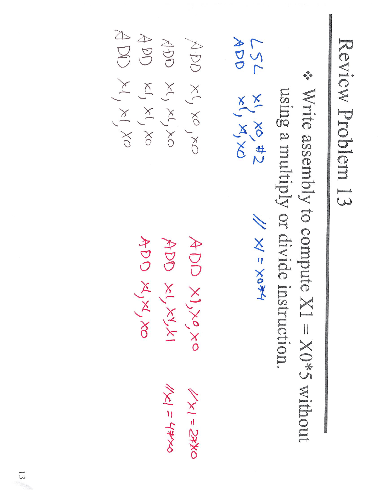
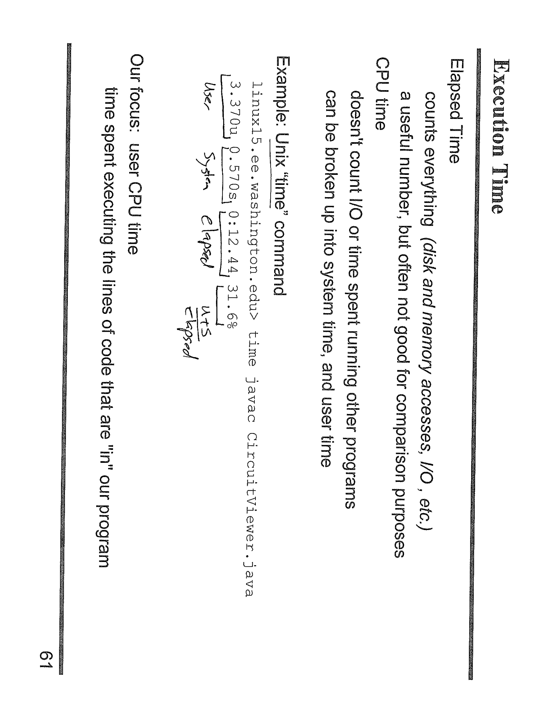
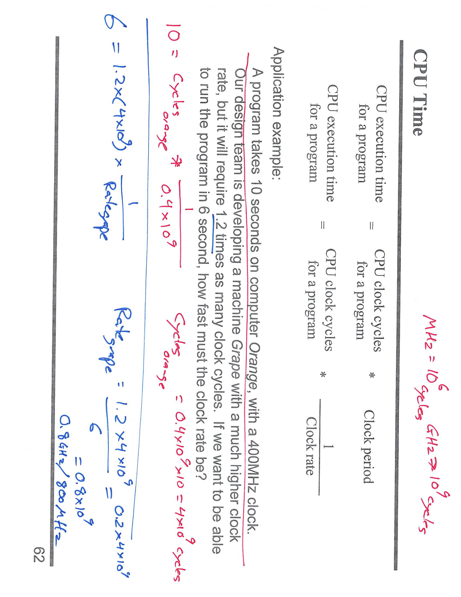
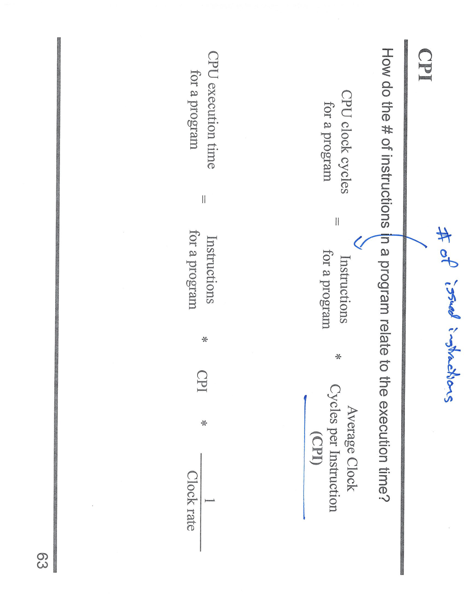
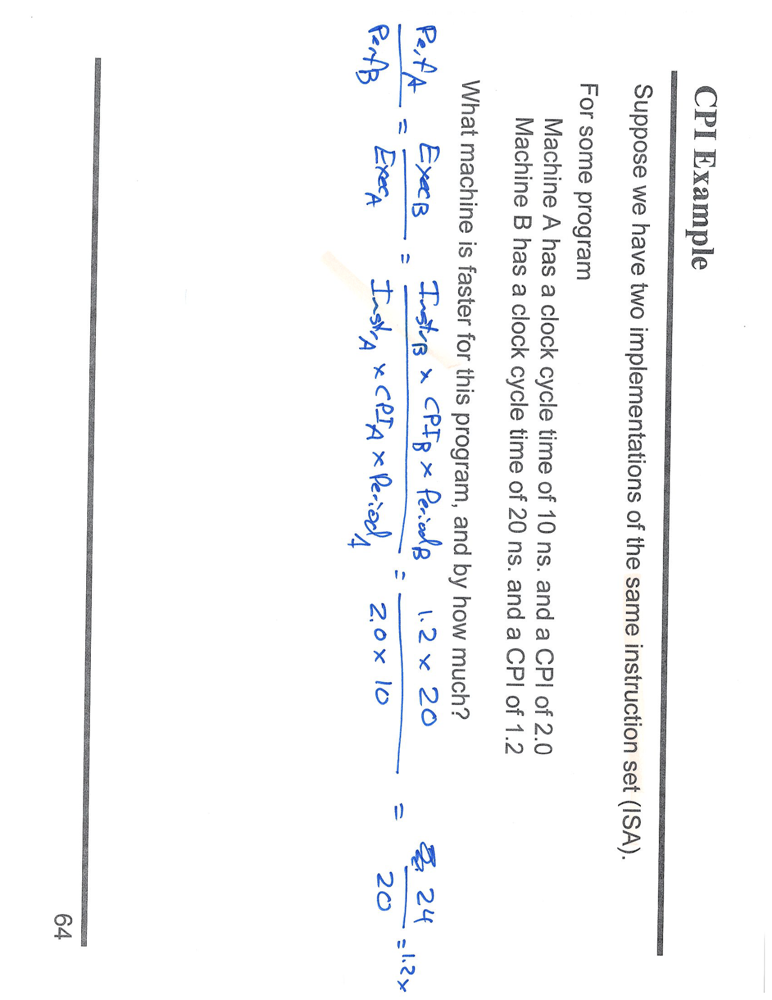
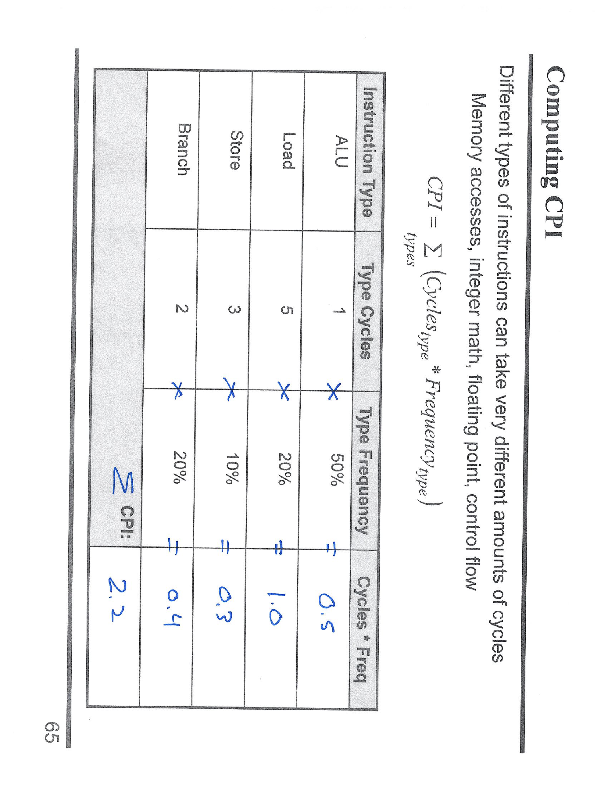
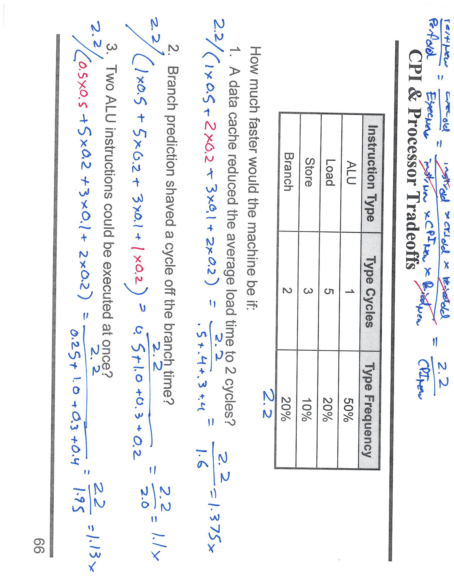
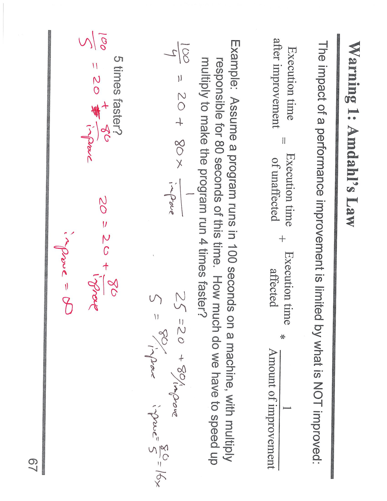
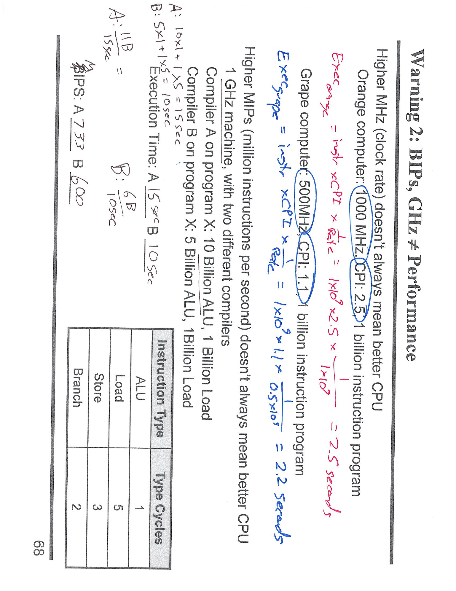

---

## 第 1 页

ChatGPT 说：
已思考 16s

---

## 第 2 页

[media pointer="sediment://file_00000000dc0061f59c948c9d819385ce"]
什么意思？详细解释，中文回答 并且在后面加一项主要归纳你的这次回答，变成一个口语化的表述，内容要覆盖整个截图，格式是[口语化表达] 正文

---

## 第 3 页

[media pointer="sediment://file_00000000cb2c61f58021298528e89069"]
什么意思？详细解释，中文回答 并且在后面加一项主要归纳你的这次回答，变成一个口语化的表述，内容要覆盖整个截图，格式是[口语化表达] 正文

---

## 第 4 页

[media pointer="sediment://file_00000000bc88620e8dc35ee81b79f68a"]
什么意思？详细解释，中文回答 并且在后面加一项主要归纳你的这次回答，变成一个口语化的表述，内容要覆盖整个截图，格式是[口语化表达] 正文

---

## 第 5 页

[media pointer="sediment://file_0000000028fc61f5b57193835b1438d9"]
什么意思？详细解释，中文回答 并且在后面加一项主要归纳你的这次回答，变成一个口语化的表述，内容要覆盖整个截图，格式是[口语化表达] 正文

---

## 第 6 页

[media pointer="sediment://file_000000001ffc620e825043c6e0feea91"]
什么意思？详细解释，中文回答 并且在后面加一项主要归纳你的这次回答，变成一个口语化的表述，内容要覆盖整个截图，格式是[口语化表达] 正文

---

## 第 7 页

[media pointer="sediment://file_00000000566c620eb1b74faf05233106"]
什么意思？详细解释，中文回答 并且在后面加一项主要归纳你的这次回答，变成一个口语化的表述，内容要覆盖整个截图，格式是[口语化表达] 正文

---

## 第 8 页

[media pointer="sediment://file_00000000fe80620eb0d5dcaf5dcc681c"]
什么意思？详细解释，中文回答 并且在后面加一项主要归纳你的这次回答，变成一个口语化的表述，内容要覆盖整个截图，格式是[口语化表达] 正文

---

## 第 9 页

[media pointer="sediment://file_00000000bce8620ea965d3b97ec547f5"]
什么意思？详细解释，中文回答 并且在后面加一项主要归纳你的这次回答，变成一个口语化的表述，内容要覆盖整个截图，格式是[口语化表达] 正文

---

## 第 10 页

[media pointer="sediment://file_00000000ff7c620e94feb358178f3121"]
什么意思？详细解释，中文回答 并且在后面加一项主要归纳你的这次回答，变成一个口语化的表述，内容要覆盖整个截图，格式是[口语化表达] 正文
